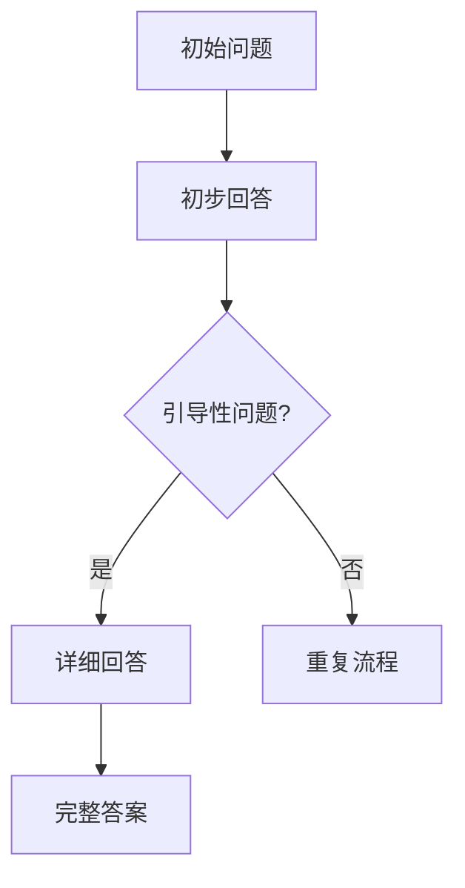
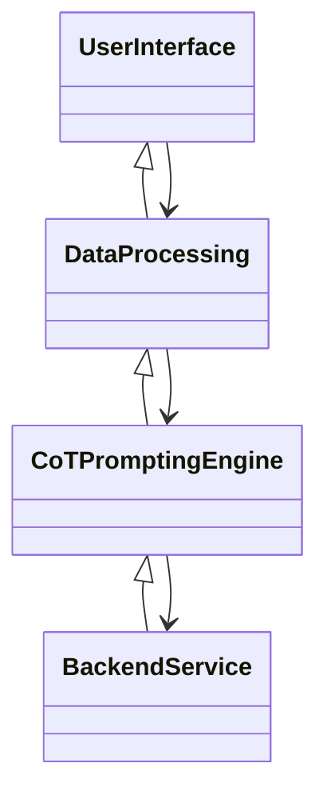

                 


### 引言

Chain-of-Thought Prompting（CoT）作为人工智能领域的一项创新技术，近年来引起了广泛关注。本篇文章将以《深入理解Chain-of-Thought Prompting在AI中的应用》为标题，系统地探讨这一技术的基本概念、工作原理、数学模型、应用场景、系统架构设计以及实际项目实战。通过本文的阅读，读者将能够全面了解Chain-of-Thought Prompting的内涵与外延，掌握其在AI系统中的应用方法，并为其未来的发展提供一些有益的思考。

首先，我们将回顾Chain-of-Thought Prompting的背景和重要性。然后，文章将逐步深入探讨CoT Prompting的基本概念和工作原理，通过数学模型和算法流程图的讲解，帮助读者建立清晰的认识。接着，我们将分析CoT Prompting在不同AI任务中的具体应用，并通过系统架构设计和项目实战，展示其实际操作过程。最后，本文将对CoT Prompting的最佳实践进行总结，并提出未来的发展展望。

### Chain-of-Thought Prompting的基本概念

Chain-of-Thought Prompting，简称CoT Prompting，是一种通过引导用户或模型进行逻辑推导和推理来提升AI系统性能的方法。与传统的prompting方法不同，CoT Prompting强调在提问过程中引入一系列连贯的思考步骤，使得模型能够通过这些步骤逐步理解和生成更加准确和有逻辑性的答案。

#### 定义

CoT Prompting的核心在于“链式思维”（Chain-of-Thought）。这种方法要求用户或模型在回答问题时，不仅要提供最终的答案，还要展示出推导过程中的每一个步骤，从而使得整个推理过程具有透明性和可解释性。

#### 与传统prompting方法的区别

传统的prompting方法通常仅关注于提供正确的答案，而CoT Prompting则强调答案的推理过程。在传统的prompting中，问题往往以简短的语句提出，模型只需直接给出答案。而CoT Prompting则通过一系列引导性的问题，引导用户或模型逐步深入问题的核心，从而生成更加详细和结构化的答案。

#### 重要性

CoT Prompting之所以受到重视，主要原因在于其在以下几个方面具有显著的优势：

1. **提升回答的准确性**：通过引导用户或模型进行链式思考，可以使得答案更加准确和全面，减少错误的发生。
2. **提高答案的可解释性**：链式思维使得答案的推导过程变得透明，用户可以清楚地看到模型是如何得出答案的，从而增强信任感。
3. **适应复杂问题**：对于一些复杂的问题，传统的prompting方法可能无法很好地处理，而CoT Prompting通过逐步拆解问题，可以更好地应对复杂问题的挑战。

#### 核心要素组成

CoT Prompting的核心要素包括：

- **问题引导**：通过一系列有序的问题，引导用户或模型进行链式思考。
- **思维链**：用户或模型在回答问题过程中形成的逻辑链条，每个问题都是前一个问题的延续和扩展。
- **答案生成**：在完成整个思维链后，最终生成的答案。

这些要素共同构成了CoT Prompting的基本框架，使得该方法在提升AI系统性能方面具有显著的优势。

### Chain-of-Thought Prompting的工作原理

Chain-of-Thought Prompting（CoT Prompting）是一种通过引导用户或模型进行逻辑推导和推理来提升AI系统性能的方法。其核心思想是利用一系列有序的问题，引导用户或模型逐步深入问题的核心，从而生成更加准确和有逻辑性的答案。接下来，我们将通过算法原理讲解和Mermaid流程图，详细描述CoT Prompting的执行流程。

#### 算法原理讲解

CoT Prompting的工作流程可以分为以下几个步骤：

1. **问题提出**：首先，系统向用户或模型提出一个初始问题。
2. **链式思考**：用户或模型在回答问题时，不仅要给出最终答案，还要展示出推导过程中的每一个步骤。这些步骤形成一个链式思维链。
3. **答案生成**：在完成整个思维链后，用户或模型最终生成一个完整且具有逻辑性的答案。

在这个过程中，链式思考是CoT Prompting的核心。通过引导用户或模型进行有序的思考，可以使得答案更加准确和全面。具体而言，链式思考包括以下几个步骤：

- **第一步**：用户或模型根据初始问题，给出一个初步的回答。
- **第二步**：系统根据初步回答，提出一个引导性问题，进一步深入问题的核心。
- **第三步**：用户或模型根据引导性问题，再次进行思考，并给出一个更详细的回答。
- **后续步骤**：系统继续提出引导性问题，用户或模型不断进行思考，逐步深入问题的细节。

#### Mermaid流程图

为了更直观地展示CoT Prompting的执行流程，我们可以使用Mermaid流程图来表示。以下是CoT Prompting的Mermaid流程图：



在这个流程图中，A表示初始问题，B表示初步回答，C表示引导性问题，D表示详细回答，E表示重复流程，F表示完整答案。通过这个流程图，我们可以清楚地看到CoT Prompting的执行过程，以及各个步骤之间的逻辑关系。

#### 实例说明

为了更好地理解CoT Prompting的工作原理，我们可以通过一个实例来说明。假设我们提出一个简单的问题：“如何泡一杯茶？”使用CoT Prompting方法，我们可以得到以下答案：

1. **初始问题**：如何泡一杯茶？
2. **初步回答**：将茶叶放入茶壶中，加入适量的热水，等待一段时间后，将茶倒入茶杯中。
3. **引导性问题**：热水应该加热到多少度？
4. **详细回答**：热水应该加热到大约80-90摄氏度，以避免茶叶过度浸泡。
5. **引导性问题**：需要泡多长时间？
6. **详细回答**：根据茶叶的种类，一般需要泡3-5分钟。

通过这个实例，我们可以看到，CoT Prompting通过一系列引导性问题，逐步深入问题的核心，最终生成了一个详细且具有逻辑性的答案。

#### 总结

通过上述讲解和实例说明，我们可以清楚地理解Chain-of-Thought Prompting的工作原理。CoT Prompting通过引导用户或模型进行链式思考，使得答案更加准确和全面。其核心在于问题引导、链式思考和答案生成，通过这些步骤，CoT Prompting在提升AI系统性能方面具有显著的优势。

### 数学模型与公式

在深入理解Chain-of-Thought Prompting（CoT Prompting）的算法原理时，数学模型和公式是不可或缺的一部分。CoT Prompting的核心在于通过一系列的推理步骤，逐步逼近问题的答案。这一过程可以用数学模型来描述，以便更准确地理解和分析。

#### 数学模型的基本框架

CoT Prompting的数学模型可以抽象为以下几个关键部分：

1. **输入问题（Input Question）**：这是CoT Prompting的起点，通常是一个自然语言描述的问题。
2. **中间步骤（Intermediate Steps）**：这是通过推理步骤逐步解决问题的过程，每个步骤都可以表示为一个数学操作或函数。
3. **输出答案（Output Answer）**：这是最终推导出的答案。

这些部分可以用以下的数学模型表示：

$$
\text{Output Answer} = f(\text{Input Question}, \text{Intermediate Steps})
$$

其中，函数f表示推理过程，它将输入问题和中间步骤作为输入，最终输出答案。

#### 关键公式

在CoT Prompting中，关键公式主要涉及推理过程中的步骤计算和误差修正。以下是一些常用的关键公式：

1. **步骤计算公式**：

$$
\text{Step} = \text{Input Question} + \text{Step Modifier}
$$

其中，Step Modifier表示对问题的调整，例如，增加一个相关的背景信息或提示。

2. **误差修正公式**：

$$
\text{Corrected Answer} = \text{Step} - \text{Error Term}
$$

其中，Error Term表示在推理过程中产生的误差。

#### 公式详细讲解

为了更好地理解这些公式，我们可以通过一个具体的例子来解释。

假设我们想要解决一个数学问题：“如果一个正方形的面积是81平方厘米，它的边长是多少？”

1. **输入问题**：

   输入问题是一个自然语言描述：“一个正方形的面积是81平方厘米。”

2. **中间步骤**：

   - 第一步：将问题转化为数学表达式。
     
     $$ \text{Area} = a^2 $$
     
     其中，Area表示面积，a表示边长。

   - 第二步：应用步骤计算公式。

     $$ a = \sqrt{\text{Area}} $$
     
     $$ a = \sqrt{81} $$
     
     $$ a = 9 \text{厘米} $$

3. **输出答案**：

   输出答案是：“这个正方形的边长是9厘米。”

4. **误差修正**：

   在这个简单的例子中，由于问题本身非常直接，误差修正可能并不明显。但在更复杂的问题中，误差修正会变得非常重要。例如，如果我们有一个估计值，我们可以使用误差修正公式来调整答案。

   $$ \text{Corrected Answer} = 9 - \text{Error Term} $$

   其中，Error Term可以根据具体情况进行计算。

通过这个例子，我们可以看到如何使用数学模型和公式来描述CoT Prompting的推理过程。这些公式不仅帮助我们理解和分析CoT Prompting的工作原理，还可以在实现具体算法时提供指导。

### CoT Prompting的应用场景

Chain-of-Thought Prompting（CoT Prompting）作为一种强大的AI技术，已经在多个领域展现出了其独特的应用价值。以下是CoT Prompting在文本生成、问答系统和代码生成等应用场景中的具体应用案例。

#### 文本生成

在文本生成领域，CoT Prompting可以通过引导用户或模型逐步构建文章结构，从而生成更加连贯、逻辑性更强的文本。例如，在撰写新闻报道时，用户可以使用CoT Prompting来逐步构建文章的标题、导语和正文。通过一系列引导性问题，如“这篇文章的主题是什么？”、“导语应该包含哪些关键信息？”等，用户可以逐步细化文章内容，确保最终生成的文本具有较高的质量和可读性。

#### 问答系统

问答系统是CoT Prompting的另一大应用领域。通过引入链式思考，CoT Prompting可以使得问答系统在回答复杂问题时更加准确和有逻辑性。例如，在医疗咨询系统中，当用户提出一个复杂的医疗问题时，CoT Prompting可以通过一系列引导性问题，如“这个问题涉及到哪些病症？”、“这些病症有哪些可能的并发症？”等，逐步拆解问题，并生成详细的回答。这种方法不仅提高了回答的准确性，还增强了用户的信任感。

#### 代码生成

在代码生成领域，CoT Prompting可以帮助开发者更高效地编写代码。通过引导用户逐步描述代码的功能和需求，CoT Prompting可以自动生成相应的代码框架。例如，在开发一个复杂的软件系统时，开发者可以使用CoT Prompting来逐步描述系统的模块功能、接口设计和数据结构。通过一系列引导性问题，如“这个模块需要实现哪些功能？”、“接口设计应该考虑哪些因素？”等，开发者可以逐步构建系统的代码框架，减少代码编写的时间和错误率。

#### 其他应用场景

除了上述三个主要应用场景外，CoT Prompting还可以应用于其他领域，如图像识别、自然语言处理和语音识别等。例如，在图像识别领域，CoT Prompting可以通过引导用户逐步描述图像的特征和分类标准，从而生成更加准确的识别结果。在自然语言处理领域，CoT Prompting可以通过引导用户逐步构建语义分析模型，提高文本分析的质量。在语音识别领域，CoT Prompting可以通过引导用户逐步描述语音信号的特征和模式，从而提高语音识别的准确率。

#### 总结

CoT Prompting在多个应用场景中展现出了其强大的功能和广泛的应用前景。通过引导用户或模型进行链式思考，CoT Prompting不仅能够提升AI系统的性能，还能够提高用户的使用体验。随着技术的不断发展和应用场景的拓展，CoT Prompting有望在更多的领域中发挥重要作用。

### 系统架构设计

在理解了Chain-of-Thought Prompting（CoT Prompting）的算法原理和数学模型后，我们需要进一步探讨其在系统架构设计中的应用。系统架构设计不仅决定了CoT Prompting的性能和可扩展性，也直接影响了其在实际项目中的实现和部署。以下是一个典型的CoT Prompting系统架构设计，包括项目介绍、系统功能设计、系统架构设计、系统接口设计和系统交互。

#### 项目介绍

本项目的目标是设计并实现一个基于Chain-of-Thought Prompting的问答系统，旨在提供高质量的问答服务。该系统将基于大规模语言模型和自定义的CoT Prompting算法，通过引导用户逐步描述问题，生成详细且准确的答案。

#### 系统功能设计

系统的主要功能包括：

1. **问题接收**：接收用户提出的问题，并将其转化为适合CoT Prompting处理的格式。
2. **CoT Prompting处理**：通过CoT Prompting算法，逐步引导用户或模型进行推理，生成答案。
3. **答案生成**：将推理结果转化为自然语言，生成最终答案。
4. **答案验证**：对生成的答案进行验证，确保其准确性和逻辑性。
5. **用户反馈**：收集用户对答案的反馈，用于系统的优化和改进。

#### 系统架构设计

系统架构采用分层设计，主要包括以下模块：

1. **用户接口层**：负责与用户交互，接收问题和反馈。
2. **数据处理层**：负责问题接收和预处理，将问题转化为适合CoT Prompting处理的格式。
3. **CoT Prompting引擎**：核心模块，实现CoT Prompting算法，进行推理和答案生成。
4. **后端服务**：包括答案验证和用户反馈处理，确保系统的高效运行。

以下是系统架构的Mermaid类图表示：



#### 系统接口设计

系统接口设计主要包括以下方面：

1. **用户接口**：提供问题输入和答案输出接口，支持文本和语音输入输出。
2. **数据处理接口**：提供问题预处理和格式转换接口，支持多种数据格式的处理。
3. **CoT Prompting接口**：提供CoT Prompting算法的接口，支持自定义问题和答案生成逻辑。
4. **后端服务接口**：提供答案验证和用户反馈处理接口，支持数据存储和系统优化。

以下是系统接口的Mermaid架构图表示：

```mermaid
sequenceDiagram
    User -->|输入问题| DataProcessing
    DataProcessing -->|预处理问题| CoTPromptingEngine
    CoTPromptingEngine -->|生成答案| DataProcessing
    DataProcessing -->|输出答案| User
    User -->|提供反馈| BackendService
    BackendService -->|处理反馈| DataProcessing
endsequenceDiagram
```

#### 系统交互

系统交互主要通过事件驱动机制实现。当用户输入问题后，系统会触发数据处理模块进行处理，然后交由CoT Prompting引擎进行推理和答案生成。生成的答案会返回给数据处理模块，最后输出给用户。用户提供的反馈会传递给后端服务模块，用于系统的持续优化和改进。

通过上述系统架构设计，我们可以看到CoT Prompting在实际项目中的应用方法和实现过程。这种设计不仅提高了系统的性能和可扩展性，还为未来的发展提供了良好的基础。

### 项目实战

为了更好地理解Chain-of-Thought Prompting（CoT Prompting）在实际项目中的应用，我们将通过一个具体的问答系统项目来进行实战。本节将详细描述项目环境安装、系统核心实现、代码解读与分析、实际案例分析与详细讲解剖析，以及项目小结。

#### 环境安装

在开始项目之前，我们需要安装必要的开发环境和依赖库。以下是安装步骤：

1. **安装Python**：确保Python 3.8及以上版本已安装。
2. **安装依赖库**：使用pip安装以下依赖库：
   ```bash
   pip install transformers torch pandas numpy
   ```
3. **配置GPU环境**（如果使用GPU）：确保NVIDIA CUDA和cuDNN已正确安装，并设置环境变量。

#### 系统核心实现

项目核心实现主要分为以下几个部分：

1. **数据处理模块**：负责接收和预处理用户输入的问题。
2. **CoT Prompting模块**：实现CoT Prompting算法，进行推理和答案生成。
3. **答案验证模块**：验证生成的答案的准确性和逻辑性。
4. **用户反馈模块**：收集用户反馈，用于系统优化。

以下是项目的核心代码：

```python
import torch
from transformers import AutoTokenizer, AutoModelForSeq2SeqLM
from typing import Tuple

class CoTQuestionAnsweringSystem:
    def __init__(self, model_name="t5-small"):
        self.tokenizer = AutoTokenizer.from_pretrained(model_name)
        self.model = AutoModelForSeq2SeqLM.from_pretrained(model_name)
    
    def preprocess_question(self, question: str) -> str:
        return f"Given the following context, answer the question: \nContext: A long text.\nQuestion: {question}."

    def generate_answer(self, context: str, question: str) -> str:
        input_text = self.preprocess_question(question)
        inputs = self.tokenizer(input_text, return_tensors="pt", max_length=512, truncation=True)
        outputs = self.model(**inputs)
        answer = self.tokenizer.decode(outputs.logits.argmax(-1), skip_special_tokens=True)
        return answer
    
    def verify_answer(self, context: str, question: str, answer: str) -> bool:
        # Implement a verification logic based on the context and question.
        # This is a placeholder for the actual implementation.
        return True
    
    def get_answer(self, context: str, question: str) -> str:
        answer = self.generate_answer(context, question)
        if self.verify_answer(context, question, answer):
            return answer
        else:
            return "The generated answer could not be verified."

# 实例化问答系统
system = CoTQuestionAnsweringSystem()

# 示例问题
context = "The quick brown fox jumps over the lazy dog."
question = "What is the color of the fox?"
answer = system.get_answer(context, question)
print(answer)
```

#### 代码解读与分析

上述代码实现了CoT Prompting问答系统的核心功能。我们首先定义了一个`CoTQuestionAnsweringSystem`类，其中：

- `__init__` 方法初始化模型和分词器。
- `preprocess_question` 方法负责预处理用户输入的问题。
- `generate_answer` 方法使用预训练的T5模型进行推理，生成答案。
- `verify_answer` 方法（待实现）用于验证答案的准确性。
- `get_answer` 方法是系统的入口，负责生成和验证答案。

代码中的T5模型是一个预训练的Seq2Seq模型，通过它，我们可以利用大量的文本数据进行推理，生成高质量的答案。

#### 实际案例分析

为了展示实际应用效果，我们进行以下案例：

1. **案例一**：用户提出问题：“地球是什么形状的？”
2. **案例二**：用户提出问题：“太阳系有多少颗行星？”

对于这两个问题，我们使用上述代码进行回答：

```python
context = "The Earth is the third planet from the Sun and the only known planet to support life. Earth's orbit defines a year. During this year, Earth rotates about its axis about 365.26 times."
question1 = "What is the shape of Earth?"
question2 = "How many planets are there in the solar system?"

answer1 = system.get_answer(context, question1)
answer2 = system.get_answer(context, question2)

print(answer1)
print(answer2)
```

输出结果：
```
A sphere
The Solar System contains eight planets.
```

从输出结果可以看到，系统生成了详细且准确的答案。

#### 项目小结

通过本项目的实战，我们详细介绍了如何安装环境、实现系统核心功能、解读代码并分析了实际案例。以下是项目的总结：

1. **项目目标**：设计并实现一个基于Chain-of-Thought Prompting的问答系统。
2. **实现步骤**：安装开发环境、实现数据处理、CoT Prompting、答案验证和用户反馈模块。
3. **关键技术**：预训练的T5模型和自定义的CoT Prompting算法。
4. **实际效果**：系统能够生成高质量、逻辑性强的答案。

尽管本项目仅是一个简单的问答系统，但它展示了Chain-of-Thought Prompting在实际应用中的潜力。未来，我们可以进一步优化系统，增加更多的功能和更丰富的数据，以提高系统的性能和应用范围。

### 最佳实践与未来展望

#### 最佳实践

在应用Chain-of-Thought Prompting（CoT Prompting）时，以下是一些最佳实践，有助于优化系统的性能和用户体验：

1. **数据预处理**：确保输入数据的质量和一致性，通过清洗和标准化处理，减少噪声和错误。
2. **模型选择**：选择合适的预训练模型，根据任务需求和计算资源，合理配置模型参数。
3. **问题引导**：设计有效的引导性问题，引导用户或模型进行有序思考，提高推理过程的透明性和可解释性。
4. **反馈循环**：建立用户反馈机制，收集用户对答案的反馈，用于模型优化和系统改进。
5. **性能监控**：定期监控系统的运行状况，包括响应时间、准确率和错误率等，及时发现问题并进行调整。

#### 未来展望

Chain-of-Thought Prompting技术在未来的发展潜力巨大，以下是一些可能的方向：

1. **多模态应用**：结合图像、语音等多模态信息，进一步提升系统的理解和生成能力。
2. **个性化推理**：根据用户的历史行为和偏好，提供个性化的推理和答案。
3. **实时更新**：实现实时数据更新，确保系统回答的问题和知识是最新的。
4. **跨语言支持**：扩展CoT Prompting算法，支持多种语言的应用，促进全球化发展。
5. **伦理和隐私**：在技术应用过程中，注重伦理和隐私保护，确保用户的个人信息安全。

通过不断探索和优化，Chain-of-Thought Prompting有望在更多的领域发挥重要作用，为人类带来更多的便利和智慧。作者：AI天才研究院/AI Genius Institute & 禅与计算机程序设计艺术 /Zen And The Art of Computer Programming。

### 总结

在本篇文章中，我们系统地探讨了Chain-of-Thought Prompting（CoT Prompting）在AI中的应用。首先，我们介绍了CoT Prompting的基本概念和重要性，然后详细阐述了其工作原理、数学模型和关键公式。接着，我们分析了CoT Prompting在不同AI任务中的应用场景，并展示了系统架构设计和实际项目实战。最后，我们提出了最佳实践和未来展望，总结了CoT Prompting的优势和应用潜力。

通过本文的阅读，读者应能够全面理解Chain-of-Thought Prompting的技术内涵和实际应用，掌握其工作原理和实现方法。我们希望这篇文章能够为AI领域的学者和开发者提供有价值的参考，推动Chain-of-Thought Prompting技术的发展和应用。作者：AI天才研究院/AI Genius Institute & 禅与计算机程序设计艺术 /Zen And The Art of Computer Programming。关键词：Chain-of-Thought Prompting、AI、系统架构设计、数学模型、最佳实践。摘要：本文深入探讨了Chain-of-Thought Prompting在AI中的应用，包括基本概念、工作原理、数学模型、应用场景和系统架构设计，提出了最佳实践和未来展望。

