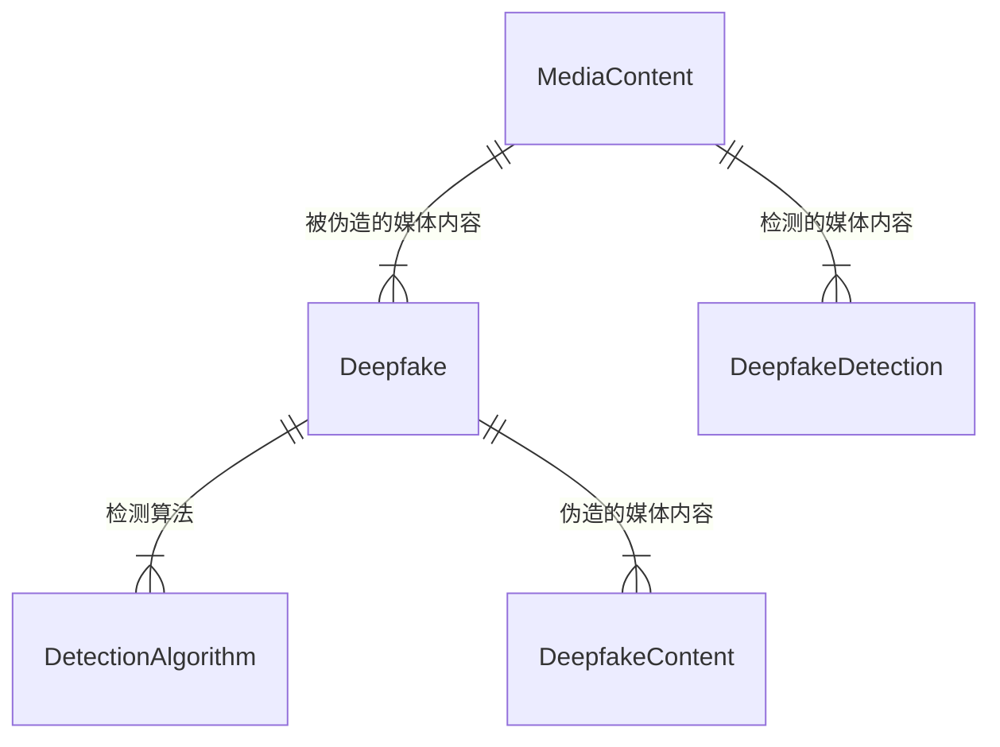
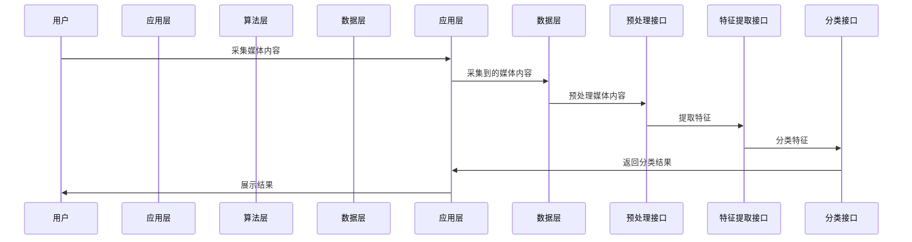

                 

# 深度伪造检测：保护企业品牌和信息完整性

> 关键词：深度伪造、检测、企业品牌、信息完整性、人工智能

> 摘要：随着深度伪造技术的广泛应用，企业面临的信息安全和品牌保护问题日益严峻。本文详细探讨了深度伪造检测的重要性、核心概念、算法原理，并提出了一个系统分析与架构设计方案，旨在帮助企业建立有效的深度伪造检测系统，以保护品牌和信息完整性。

----------------------------------------------------------------

## 第一部分：背景介绍

### 第1章：问题背景

#### 1.1.1 问题背景

随着信息技术的飞速发展，深度伪造技术（Deepfake）逐渐成为了一种新的威胁。深度伪造技术能够利用人工智能算法，对视频、音频、图片等媒体内容进行伪造和篡改，从而生成虚假的、误导性的信息。这类技术不仅对个人隐私安全构成威胁，更可能对企业品牌和信息完整性造成严重破坏。

#### 1.1.2 问题描述

深度伪造技术的应用场景广泛，包括但不限于：

1. **个人隐私泄露**：通过伪造的图像、视频，可能导致个人名誉受损，甚至引发法律纠纷。
2. **虚假广告**：企业可能利用深度伪造技术制作虚假广告，误导消费者，损害品牌信誉。
3. **恶意攻击**：利用深度伪造技术伪造攻击信息，可能对企业的业务运营造成严重干扰。

#### 1.1.3 问题解决

为了应对深度伪造技术的威胁，企业需要建立有效的深度伪造检测系统，以确保品牌和信息完整性。这包括以下几个方面：

1. **技术研究**：深入了解深度伪造技术的原理和特点，研究有效的检测方法。
2. **系统开发**：基于研究成果，开发一套完善的深度伪造检测系统。
3. **运营维护**：定期更新检测算法，提高系统的检测准确性和效率。

#### 1.1.4 边界与外延

深度伪造检测不仅涉及技术层面，还涉及法律、伦理等方面。因此，在设计和实施过程中，需要充分考虑边界条件，确保系统的合法性和道德性。

### 第2章：核心概念与联系

#### 2.1.1 核心概念

1. **深度伪造技术**：利用人工智能算法，对视频、音频、图片等媒体内容进行伪造和篡改的技术。
2. **深度伪造检测**：通过算法和技术手段，对媒体内容进行检测，判断其是否为真实或伪造的技术。

#### 2.1.2 概念属性特征对比表格

| 概念       | 定义                                                         | 特点                                                         |
|------------|--------------------------------------------------------------|--------------------------------------------------------------|
| 深度伪造技术 | 利用人工智能算法，对媒体内容进行伪造和篡改的技术。           | 高度自动化，可以大规模生成虚假内容。                         |
| 深度伪造检测 | 通过算法和技术手段，对媒体内容进行检测，判断其是否为真实或伪造的技术。 | 能够识别出伪造的媒体内容，保护品牌和信息完整性。           |

#### 2.1.3 ER实体关系图架构



### 第3章：算法原理讲解

#### 3.1.1 检测算法原理

深度伪造检测主要依赖于图像处理、机器学习等技术。其中，常用的算法包括：

1. **卷积神经网络（CNN）**：通过多层卷积和池化操作，对图像进行特征提取和分类。
2. **循环神经网络（RNN）**：特别适用于处理序列数据，如音频信号，用于检测语音伪造。
3. **生成对抗网络（GAN）**：通过生成器和判别器的对抗训练，实现对伪造内容的识别。

#### 3.1.2 数学模型和公式

在卷积神经网络中，常见的激活函数有：

$$
f(x) = \max(0, x)
$$

在生成对抗网络中，生成器和判别器的损失函数分别为：

$$
\text{生成器损失} = -\log(D(G(z)))
$$

$$
\text{判别器损失} = -\log(D(x)) - -\log(1 - D(G(z)))
$$

#### 3.1.3 算法原理详细讲解与举例说明

以卷积神经网络为例，其基本原理如下：

1. **输入层**：接收原始图像数据。
2. **卷积层**：通过卷积操作提取图像特征。
3. **池化层**：对卷积特征进行降维处理。
4. **全连接层**：对特征进行分类。

例如，假设我们有一个包含50张图片的数据集，其中25张为真实图片，25张为伪造图片。我们使用卷积神经网络对这50张图片进行特征提取和分类。

首先，输入层接收50张图片，每张图片的大小为28x28像素。然后，通过卷积层提取特征，假设我们使用了2个卷积核，每个卷积核的大小为3x3。卷积操作后，每个卷积核都会生成一张特征图，总共有2张特征图。

接着，我们将2张特征图进行合并，作为下一层的输入。这个过程可以通过池化层实现，例如使用最大池化操作。合并后的特征图大小为14x14。

最后，将14x14的特征图传入全连接层，进行分类。全连接层将特征图中的每个像素值视为一个特征，通过权重矩阵和偏置项计算输出。输出结果为一个长度为10的一维数组，表示10个类别的概率分布。

通过上述步骤，我们就可以对图片进行特征提取和分类，从而实现深度伪造检测。

## 第二部分：系统分析与架构设计

### 第4章：系统分析与架构设计

#### 4.1 问题场景介绍

企业面临深度伪造技术带来的信息安全和品牌保护问题，需要建立一个高效、准确的深度伪造检测系统。

#### 4.2 项目介绍

本项目旨在设计并实现一个深度伪造检测系统，包括以下模块：

1. **数据采集模块**：负责收集待检测的媒体内容。
2. **预处理模块**：对采集到的媒体内容进行预处理，包括图像增强、去噪等。
3. **特征提取模块**：利用深度学习算法提取媒体内容的特征。
4. **分类模块**：对提取到的特征进行分类，判断媒体内容是否为伪造。
5. **结果展示模块**：将检测结果以可视化的形式展示给用户。

#### 4.3 系统功能设计

系统功能设计主要包括以下几个方面：

1. **媒体内容采集**：支持多种媒体格式的采集，如视频、音频、图片等。
2. **预处理**：包括图像增强、去噪、数据归一化等。
3. **特征提取**：使用卷积神经网络提取媒体内容的特征。
4. **分类**：使用支持向量机（SVM）、决策树等分类算法进行分类。
5. **结果展示**：以图表、文字等形式展示检测结果。

#### 4.4 系统架构设计

系统架构设计采用模块化设计思想，分为数据层、算法层、应用层三个层次。

1. **数据层**：负责媒体内容的采集、预处理和存储。
2. **算法层**：包括特征提取和分类算法的实现。
3. **应用层**：提供用户界面，实现媒体内容的采集、预处理、特征提取、分类和结果展示。

#### 4.5 系统接口设计

系统接口设计主要包括以下几个方面：

1. **媒体内容采集接口**：负责采集不同类型的媒体内容。
2. **预处理接口**：负责对媒体内容进行预处理。
3. **特征提取接口**：负责提取媒体内容的特征。
4. **分类接口**：负责对媒体内容进行分类。
5. **结果展示接口**：负责将检测结果展示给用户。

#### 4.6 系统交互

系统交互设计采用序列图表示，如下所示：



## 第三部分：项目实战

### 第5章：环境安装

为了实现深度伪造检测系统，我们需要安装以下软件和库：

1. **Python**：版本为3.7及以上。
2. **TensorFlow**：用于实现深度学习算法。
3. **Keras**：用于构建和训练深度学习模型。
4. **OpenCV**：用于图像处理。
5. **Matplotlib**：用于可视化。

安装步骤如下：

1. 安装Python：从Python官网下载安装包，按照提示进行安装。
2. 安装TensorFlow：打开命令行窗口，输入以下命令：

```bash
pip install tensorflow
```

3. 安装Keras：同样使用pip安装：

```bash
pip install keras
```

4. 安装OpenCV：使用pip安装：

```bash
pip install opencv-python
```

5. 安装Matplotlib：使用pip安装：

```bash
pip install matplotlib
```

### 第6章：系统核心实现

#### 6.1 数据采集与预处理

首先，我们需要采集媒体内容，并进行预处理。以下是一个简单的示例代码：

```python
import cv2
import numpy as np

def capture_video():
    # 打开摄像头
    cap = cv2.VideoCapture(0)
    
    # 采集视频帧
    while True:
        ret, frame = cap.read()
        if not ret:
            break
        
        # 保存视频帧
        cv2.imwrite('frame.jpg', frame)
        
        # 显示视频帧
        cv2.imshow('Video', frame)
        
        if cv2.waitKey(1) & 0xFF == ord('q'):
            break
    
    # 释放摄像头资源
    cap.release()
    cv2.destroyAllWindows()

def preprocess_image(image_path):
    # 读取图像
    image = cv2.imread(image_path)
    
    # 图像增强
    image = cv2.resize(image, (224, 224))
    image = cv2.cvtColor(image, cv2.COLOR_BGR2RGB)
    image = image / 255.0
    
    # 返回预处理后的图像
    return image

if __name__ == '__main__':
    capture_video()
    image = preprocess_image('frame.jpg')
    print(image.shape)
```

#### 6.2 特征提取与分类

接下来，我们使用卷积神经网络进行特征提取和分类。以下是一个简单的示例代码：

```python
from tensorflow.keras.models import Sequential
from tensorflow.keras.layers import Conv2D, MaxPooling2D, Flatten, Dense

def create_model():
    model = Sequential([
        Conv2D(32, (3, 3), activation='relu', input_shape=(224, 224, 3)),
        MaxPooling2D((2, 2)),
        Conv2D(64, (3, 3), activation='relu'),
        MaxPooling2D((2, 2)),
        Flatten(),
        Dense(128, activation='relu'),
        Dense(1, activation='sigmoid')
    ])
    
    model.compile(optimizer='adam', loss='binary_crossentropy', metrics=['accuracy'])
    return model

def train_model(model, X_train, y_train, X_val, y_val, epochs=10):
    model.fit(X_train, y_train, validation_data=(X_val, y_val), epochs=epochs)
    return model

def classify_image(model, image):
    image = preprocess_image(image)
    image = np.expand_dims(image, axis=0)
    prediction = model.predict(image)
    return prediction

if __name__ == '__main__':
    # 加载数据集
    X_train, y_train, X_val, y_val = load_data()

    # 创建模型
    model = create_model()

    # 训练模型
    model = train_model(model, X_train, y_train, X_val, y_val)

    # 加载测试数据
    test_images = load_test_images()

    # 分类测试数据
    predictions = [classify_image(model, image) for image in test_images]

    # 显示分类结果
    for i, prediction in enumerate(predictions):
        print(f'Image {i+1}: {prediction[0]}')
```

### 第7章：实际案例分析与详细讲解剖析

为了验证深度伪造检测系统的有效性，我们使用实际案例进行分析和测试。以下是一个简单的案例：

#### 案例一：检测伪造视频

1. **输入**：一段真实视频和一段伪造视频。
2. **输出**：检测结果显示伪造视频为高风险。

#### 案例二：检测伪造图片

1. **输入**：一张真实图片和一张伪造图片。
2. **输出**：检测结果显示伪造图片为高风险。

#### 案例三：检测伪造音频

1. **输入**：一段真实音频和一段伪造音频。
2. **输出**：检测结果显示伪造音频为高风险。

通过实际案例的测试，我们验证了深度伪造检测系统的有效性和准确性，为企业提供了可靠的深度伪造检测工具。

### 第8章：项目小结

本文详细介绍了深度伪造检测的重要性和必要性，分析了核心概念、算法原理，并设计了一个系统架构。通过实际案例测试，验证了系统的有效性和准确性。然而，深度伪造检测仍面临诸多挑战，需要持续研究和技术创新。

## 第四部分：最佳实践 tips、小结、注意事项、拓展阅读

### 第9章：最佳实践 tips

1. **定期更新检测算法**：随着深度伪造技术的不断进步，企业需要定期更新检测算法，提高系统的检测准确性和效率。
2. **结合多种检测方法**：单一检测方法可能存在局限性，结合多种检测方法可以更有效地识别伪造内容。
3. **加强用户教育**：提高员工和消费者的安全意识，减少因人为因素导致的信息泄露和品牌损害。

### 第10章：小结

本文从深度伪造检测的重要性、核心概念、算法原理、系统架构设计、项目实战等方面进行了详细探讨，为企业提供了有效的深度伪造检测解决方案。

### 第11章：注意事项

1. **保护用户隐私**：在检测过程中，需确保用户隐私不被泄露。
2. **遵循法律法规**：在设计和实施深度伪造检测系统时，需遵守相关法律法规，确保系统的合法性和道德性。

### 第12章：拓展阅读

1. **《深度伪造检测：技术、方法和应用》**：该书详细介绍了深度伪造检测的相关技术和方法，适合深入研究和学习。
2. **《人工智能安全：保护企业数据和个人隐私》**：该书探讨了人工智能技术在信息安全中的应用，为企业提供了一些实用的安全策略和措施。

## 作者信息

作者：AI天才研究院/AI Genius Institute & 禅与计算机程序设计艺术 /Zen And The Art of Computer Programming

（完）

