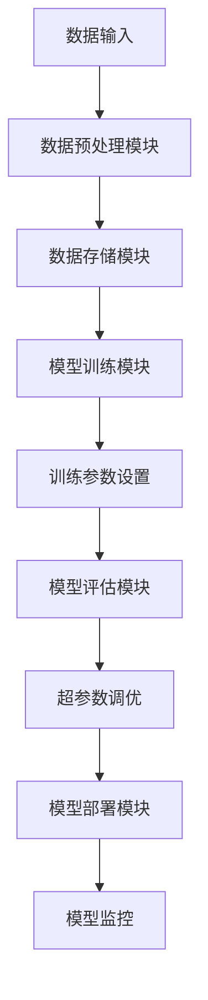
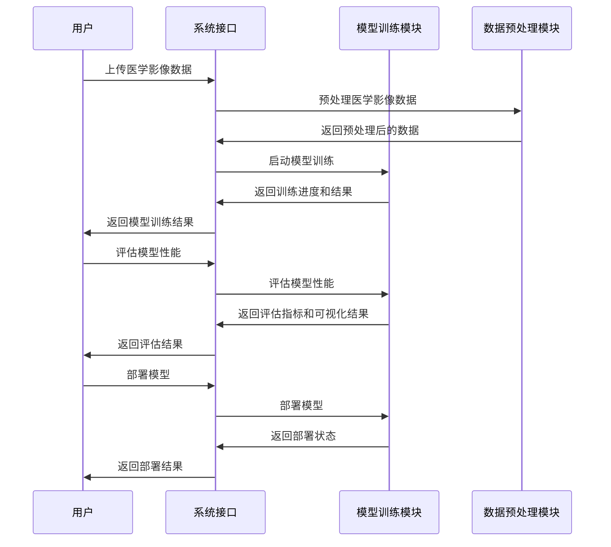

                 

### 引言：深度学习在医学影像分析中的背景与意义

随着医疗技术的不断进步，医学影像在临床诊断、疾病监测和治疗效果评估中扮演着越来越重要的角色。传统医学影像分析依赖于人工判断，效率低下且易受主观因素影响。而近年来，深度学习技术在图像处理和识别方面的卓越表现，为医学影像分析提供了全新的解决方案。

#### 问题背景与介绍

医学影像分析的重要性不言而喻。它不仅可以帮助医生更准确地诊断疾病，还能实时监测病情变化，为治疗提供科学依据。常见的医学影像包括计算机断层扫描（CT）、磁共振成像（MRI）、正电子发射断层扫描（PET）和超声等。这些影像能够提供关于人体内部结构和功能的详细信息，为疾病的早期发现和精准治疗提供了宝贵的数据支持。

然而，医学影像分析面临着诸多挑战。首先，医学影像数据量大且复杂，传统的图像处理方法往往难以处理这种高维度、多模态的数据。其次，医学影像分析需要高度专业化的知识，对操作人员的技术要求较高。此外，不同类型的医学影像在处理方法上存在差异，增加了分析的难度。

#### 传统方法与深度学习方法的对比

传统医学影像分析主要依赖于人工识别和半自动化的算法，如边缘检测、形态学处理和小波变换等。这些方法虽然在一定程度上提高了医学影像分析的效率，但仍然存在以下问题：

1. **依赖人工判断**：传统方法需要人工干预，对操作人员的技术要求较高，且主观性较强，容易产生误判。
2. **处理能力有限**：传统方法在处理高维度、多模态的医学影像数据时，效果不佳，难以捕捉到影像中的细微变化。
3. **泛化能力不足**：传统方法往往针对特定的医学影像类型进行优化，缺乏泛化能力，难以应用于其他类型的影像分析。

相比之下，深度学习技术在医学影像分析中展现出显著的优势：

1. **自动特征提取**：深度学习模型，尤其是卷积神经网络（CNN），能够自动从原始图像中提取高级特征，无需人工干预，提高了分析精度。
2. **高效处理能力**：深度学习模型在处理高维度、多模态的医学影像数据时，具有出色的表现，能够捕捉到影像中的细微变化，提高了分析效率。
3. **泛化能力强**：深度学习模型通过大规模数据训练，具有良好的泛化能力，能够应用于不同类型的医学影像分析。

#### 问题解决

深度学习技术如何解决医学影像分析中的问题？首先，深度学习模型，如CNN和循环神经网络（RNN），能够从大量的医学影像数据中自动学习特征，从而提高分析精度。其次，深度学习模型具有强大的表达能力，能够处理高维度、多模态的医学影像数据，从而提高分析效率。此外，深度学习模型通过迁移学习和微调等技巧，能够适应不同类型的医学影像分析任务，提高泛化能力。

#### 边界与外延

深度学习在医学影像分析中的适用范围较广，包括但不限于肿瘤检测与分割、心脏病诊断、骨折诊断、神经系统疾病诊断等领域。同时，非深度学习技术在医学影像分析中也有一定的应用，如基于规则的方法和机器学习方法等。这些方法在特定场景下具有一定的优势，但难以替代深度学习技术。

#### 核心概念与联系

1. **深度学习基本概念**  
   - 神经网络（Neural Networks）：模拟生物神经网络，用于特征提取和分类。
   - 卷积神经网络（Convolutional Neural Networks，CNN）：专门用于图像处理和识别，具有自动特征提取能力。
   - 循环神经网络（Recurrent Neural Networks，RNN）：适用于序列数据处理，如时间序列分析和自然语言处理。

2. **医学影像分析相关概念**  
   - CT（Computed Tomography）：计算机断层扫描，用于获取人体内部结构的三维图像。
   - MRI（Magnetic Resonance Imaging）：磁共振成像，用于获取人体软组织的详细信息。
   - PET（Positron Emission Tomography）：正电子发射断层扫描，用于检测人体内的放射性同位素分布。
   - US（Ultrasonography）：超声成像，用于获取人体内部器官的实时动态图像。

总结来说，深度学习技术在医学影像分析中的应用，不仅提高了分析精度和效率，还推动了医学影像分析的智能化和自动化。随着深度学习技术的不断发展，医学影像分析将在临床诊断、疾病监测和治疗效果评估中发挥越来越重要的作用。在接下来的章节中，我们将详细探讨深度学习在医学影像分析中的基础理论、算法讲解与实例、应用案例分析、架构与实现以及实践与技巧等方面。

---

**关键词**：深度学习、医学影像分析、计算机视觉、卷积神经网络、医疗诊断、人工智能

**摘要**：本文探讨了深度学习在医学影像分析中的应用，分析了深度学习技术如何解决医学影像分析中的问题，包括特征提取、数据处理和模型优化等方面的挑战。通过典型案例分析，展示了深度学习在肿瘤检测、心脏病诊断和骨折诊断等领域的应用效果，并对未来发展趋势进行了展望。本文旨在为医学影像分析领域的研究者提供有价值的参考，推动深度学习技术在医学影像分析中的进一步发展。

---

在本文的引言部分，我们简要介绍了深度学习在医学影像分析中的背景与意义，探讨了传统方法与深度学习方法的对比，并说明了深度学习技术如何解决医学影像分析中的问题。接下来，我们将进一步深入探讨深度学习在医学影像分析中的基础理论，包括神经网络、卷积神经网络和循环神经网络的基本原理及其在医学影像分析中的应用。通过这些基础理论的分析，我们将为后续章节中的算法讲解和实例应用提供坚实的理论基础。

---

# 基础理论

深度学习技术在医学影像分析中的应用，离不开对神经网络、卷积神经网络和循环神经网络等基本概念的理解。本章节将详细探讨这些基础理论，以便为后续算法讲解和实例应用提供坚实的理论基础。

## 神经网络（Neural Networks）

神经网络（NN）是模仿生物神经网络的一种计算模型，由大量的神经元（或节点）互联构成。每个神经元接收来自其他神经元的输入，通过权重和激活函数进行处理，最终产生输出。神经网络的目的是通过学习输入和输出之间的映射关系，实现对数据的分类、回归或其他类型的预测。

### 基本原理

1. **神经元结构**：一个简单的神经元通常包含以下部分：
   - 输入层：接收外部输入信号。
   - 权重（Weights）：表示不同输入对输出的影响程度。
   - 激活函数（Activation Function）：用于将加权输入转换成输出，常见的激活函数包括线性函数、Sigmoid函数、ReLU函数等。

2. **前向传播**：神经网络的输入通过权重传递到各个神经元，经过激活函数处理后产生输出，这一过程称为前向传播。

3. **反向传播**：神经网络根据预测结果和实际结果计算误差，通过反向传播算法更新权重和偏置，以达到最小化误差的目的。

### 数学模型

神经网络的数学模型可以表示为：
$$
y = \sigma(\mathbf{W}\mathbf{X} + b)
$$
其中，$\sigma$ 表示激活函数，$\mathbf{W}$ 表示权重矩阵，$\mathbf{X}$ 表示输入特征向量，$b$ 表示偏置向量。

### 神经网络的分类

1. **全连接神经网络（FCNN）**：所有神经元之间都是全连接的，适用于分类和回归任务。

2. **卷积神经网络（CNN）**：专门用于图像处理，通过卷积操作和池化操作提取图像特征。

3. **循环神经网络（RNN）**：适用于序列数据处理，如自然语言处理和时间序列分析。

## 卷积神经网络（Convolutional Neural Networks，CNN）

卷积神经网络（CNN）是深度学习领域的一种重要模型，因其卓越的图像识别能力而广泛应用于计算机视觉任务。CNN 通过卷积操作和池化操作，能够自动从图像中提取高级特征，无需人工干预。

### 卷积操作

卷积操作是CNN的核心，通过在图像上滑动一个小的滤波器（卷积核），将输入特征与卷积核进行点积运算，生成新的特征图。卷积操作的数学模型可以表示为：
$$
\mathbf{F}_{ij}^l = \sum_{k=1}^{C_l-1} \mathbf{W}_{ik}^{l} \mathbf{A}_{kj}^{l-1}
$$
其中，$\mathbf{F}_{ij}^l$ 表示第 $l$ 层的特征图上的第 $i$ 行第 $j$ 列的值，$\mathbf{W}_{ik}^{l}$ 表示第 $l$ 层的卷积核，$\mathbf{A}_{kj}^{l-1}$ 表示第 $l-1$ 层的特征图上的第 $k$ 行第 $j$ 列的值。

### 池化操作

池化操作用于减少特征图的尺寸，提高模型的计算效率。常见的池化操作包括最大池化和平均池化。最大池化选择特征图上每个局部区域内的最大值，而平均池化则计算局部区域内的平均值。

### 算法流程图

以下是卷积神经网络的基本算法流程图，使用Mermaid绘制：


## 循环神经网络（Recurrent Neural Networks，RNN）

循环神经网络（RNN）是一种适用于序列数据处理的神经网络模型，其特点是在时间步之间具有状态循环，能够捕捉序列数据中的长期依赖关系。RNN 通过循环连接将当前时间步的输出作为下一个时间步的输入。

### 基本原理

1. **隐藏状态**：RNN 通过隐藏状态（Hidden State）来存储历史信息，隐藏状态与当前输入进行加权组合，生成当前时间步的输出。

2. **递归关系**：RNN 的输出和隐藏状态之间具有递归关系，即当前时间步的输出依赖于前一个时间步的输出。

3. **梯度消失和梯度爆炸**：RNN 存在梯度消失和梯度爆炸问题，这可能导致训练过程中的梯度难以更新，影响模型性能。

### 数学模型

RNN 的数学模型可以表示为：
$$
\mathbf{h}_t = \sigma(\mathbf{W}_h \mathbf{x}_t + \mathbf{U} \mathbf{h}_{t-1} + b_h)
$$
其中，$\mathbf{h}_t$ 表示第 $t$ 个时间步的隐藏状态，$\mathbf{x}_t$ 表示第 $t$ 个时间步的输入，$\mathbf{W}_h$ 和 $\mathbf{U}$ 分别表示输入权重和隐藏状态权重，$b_h$ 表示偏置。

### RNN 的变体

1. **长短期记忆网络（LSTM）**：LSTM 是 RNN 的一种变体，通过引入门控机制，解决了梯度消失和梯度爆炸问题，能够更好地捕捉长期依赖关系。

2. **门控循环单元（GRU）**：GRU 是 LSTM 的简化版，通过合并输入门和遗忘门，减少了参数数量，训练速度更快。

## 神经网络、卷积神经网络和循环神经网络的对比表格

为了更好地理解神经网络、卷积神经网络和循环神经网络之间的差异，我们通过以下表格进行对比：

| 特点 | 神经网络 | 卷积神经网络 | 循环神经网络 |
| :--: | :--: | :--: | :--: |
| 应用场景 | 广泛，包括分类、回归等 | 图像处理和识别 | 序列数据处理，如自然语言处理和时间序列分析 |
| 特征提取 | 需要人工设计特征 | 自动提取图像特征 | 自动提取序列特征 |
| 网络结构 | 全连接层 | 卷积层、池化层 | 循环层 |
| 权重参数 | 较多 | 较少，因为卷积操作共享权重 | 较多 |
| 计算复杂度 | 较高 | 较低，因为卷积操作并行化 | 较高 |
| 优缺点 | 参数多，易于过拟合 | 参数少，计算高效，适合图像处理 | 参数多，能够捕捉长期依赖关系，但存在梯度消失和梯度爆炸问题 |

通过上述基础理论的分析，我们了解了神经网络、卷积神经网络和循环神经网络的基本原理、算法流程和数学模型。这些基础理论为深度学习在医学影像分析中的应用奠定了坚实的基础。在接下来的章节中，我们将进一步探讨深度学习算法在医学影像分析中的应用，并通过实例来展示其效果。

---

在基础理论章节中，我们详细介绍了神经网络、卷积神经网络和循环神经网络的基本原理及其在医学影像分析中的应用。这些基础理论为深度学习在医学影像分析中的实际应用提供了坚实的理论基础。接下来，我们将进一步探讨深度学习算法在医学影像分析中的应用，通过具体算法讲解与实例，展示深度学习在医学影像分析中的实际效果。

---

## 算法讲解与实例

在了解了深度学习的基础理论后，我们将深入探讨几种典型的深度学习算法，这些算法在医学影像分析中发挥着重要作用。本章节将重点介绍卷积神经网络（CNN）、循环神经网络（RNN）以及其他相关算法，并通过实际案例展示这些算法在医学影像分析中的应用效果。

### 卷积神经网络（CNN）在医学影像分析中的应用

卷积神经网络（CNN）是医学影像分析中的一种重要模型，因其能够自动提取图像特征而受到广泛使用。CNN 特别适用于处理医学影像数据，如CT、MRI和PET等。

#### CNN原理

CNN 通过卷积、池化和全连接层等结构，实现对图像的逐层特征提取。以下是CNN的基本结构：

1. **卷积层**：卷积层通过卷积操作提取图像特征。卷积层通常包含多个卷积核，每个卷积核都能提取图像中的不同特征。

2. **激活函数**：常用的激活函数有ReLU函数，它能够增加网络的非线性表达能力。

3. **池化层**：池化层用于减小特征图的尺寸，提高模型的计算效率。最大池化和平均池化是常用的池化方法。

4. **全连接层**：全连接层用于将特征映射到分类标签。

以下是CNN的算法流程图，使用Mermaid绘制：


#### CNN在医学影像分析中的应用案例

**肿瘤检测与分割**

肿瘤检测与分割是医学影像分析中的一个重要任务。CNN 通过训练能够自动识别肿瘤区域，并对其进行分割。以下是使用CNN进行肿瘤检测与分割的步骤：

1. **数据预处理**：将CT或MRI图像进行归一化和裁剪，以适应CNN的输入要求。
2. **模型训练**：使用预训练的CNN模型（如ResNet、VGG等），并通过微调（Fine-tuning）适应特定医学影像数据。
3. **肿瘤检测**：通过训练好的模型对CT或MRI图像进行检测，得到肿瘤区域。
4. **肿瘤分割**：对检测到的肿瘤区域进行细化分割，以获得更精确的肿瘤轮廓。

**实例：基于ResNet的肿瘤检测与分割**

以下是一个使用ResNet进行肿瘤检测与分割的Python代码示例：

```python
import tensorflow as tf
from tensorflow.keras.applications import ResNet50
from tensorflow.keras.models import Model
from tensorflow.keras.layers import Dense, GlobalAveragePooling2D

# 加载预训练的ResNet50模型
base_model = ResNet50(weights='imagenet')

# 移除全连接层
x = base_model.output
x = GlobalAveragePooling2D()(x)

# 添加全连接层和输出层
x = Dense(1024, activation='relu')(x)
predictions = Dense(1, activation='sigmoid')(x)

# 构建模型
model = Model(inputs=base_model.input, outputs=predictions)

# 微调模型
model.compile(optimizer='adam', loss='binary_crossentropy', metrics=['accuracy'])
model.fit(x_train, y_train, epochs=10, batch_size=32, validation_data=(x_val, y_val))

# 肿瘤检测与分割
tumor_mask = model.predict(tumor_image)[0]
```

### 循环神经网络（RNN）在医学影像分析中的应用

循环神经网络（RNN）特别适用于处理序列数据，如时间序列分析和自然语言处理。在医学影像分析中，RNN 可以用于处理医学影像的时间序列数据，例如心脏病的动态监测。

#### RNN原理

RNN 通过循环结构实现信息的记忆和传递，使其能够处理序列数据。RNN 的基本结构包括输入层、隐藏层和输出层。以下是RNN的基本算法流程图：


#### RNN在医学影像分析中的应用案例

**心脏病诊断**

心脏病诊断可以通过分析心电图（ECG）数据来实现。RNN 能够捕捉心电图信号中的时间依赖关系，从而实现对心脏病的诊断。以下是使用RNN进行心脏病诊断的步骤：

1. **数据预处理**：将心电图数据转化为序列形式，并进行归一化处理。
2. **模型训练**：使用RNN模型（如LSTM或GRU）对心电图数据进行训练。
3. **心脏病诊断**：通过训练好的模型对新的心电图数据进行诊断，判断是否存在心脏病。

**实例：基于LSTM的心脏病诊断**

以下是一个使用LSTM进行心脏病诊断的Python代码示例：

```python
import tensorflow as tf
from tensorflow.keras.models import Sequential
from tensorflow.keras.layers import LSTM, Dense

# 创建LSTM模型
model = Sequential()
model.add(LSTM(128, activation='relu', input_shape=(timesteps, features)))
model.add(Dense(1, activation='sigmoid'))

# 编译模型
model.compile(optimizer='adam', loss='binary_crossentropy', metrics=['accuracy'])

# 训练模型
model.fit(x_train, y_train, epochs=20, batch_size=64, validation_data=(x_val, y_val))

# 心脏病诊断
heart_disease = model.predict(new_ecg)[0]
```

### 其他深度学习算法

除了CNN和RNN，还有许多其他深度学习算法在医学影像分析中具有应用价值，如生成对抗网络（GAN）、自编码器（Autoencoder）和图卷积网络（GCN）等。

**生成对抗网络（GAN）**

GAN 通过生成器和判别器的对抗训练，能够生成高质量的医学影像。在医学影像分析中，GAN 可以用于图像修复、去噪和增强等任务。以下是一个使用GAN进行图像去噪的Python代码示例：

```python
import tensorflow as tf
from tensorflow.keras.models import Sequential
from tensorflow.keras.layers import Conv2D, BatchNormalization, LeakyReLU, UpSampling2D

# 创建生成器和判别器模型
generator = Sequential()
generator.add(Conv2D(64, kernel_size=(3, 3), padding='same', input_shape=(128, 128, 1)))
generator.add(BatchNormalization())
generator.add(LeakyReLU(alpha=0.2))
generator.add(UpSampling2D((2, 2)))
generator.add(Conv2D(1, kernel_size=(3, 3), padding='same'))

discriminator = Sequential()
discriminator.add(Conv2D(64, kernel_size=(3, 3), padding='same', input_shape=(128, 128, 1)))
discriminator.add(BatchNormalization())
discriminator.add(LeakyReLU(alpha=0.2))
discriminator.add(Conv2D(1, kernel_size=(3, 3), padding='same'))

# 编译生成器和判别器
generator.compile(loss='binary_crossentropy', optimizer=tf.keras.optimizers.Adam(0.0001, 0.5))
discriminator.compile(loss='binary_crossentropy', optimizer=tf.keras.optimizers.Adam(0.0001, 0.5))

# 训练GAN
for epoch in range(num_epochs):
    for i in range(num_data):
        noise = np.random.normal(0, 1, (batch_size, noise_dim))
        image = noise
        generated_image = generator.predict(image)
        real_label = np.ones((batch_size, 1))
        fake_label = np.zeros((batch_size, 1))
        
        d_loss_real = discriminator.train_on_batch(image, real_label)
        d_loss_fake = discriminator.train_on_batch(generated_image, fake_label)
        g_loss = combined_model.train_on_batch(image, real_label)
```

通过上述算法讲解与实例，我们可以看到深度学习算法在医学影像分析中的应用效果显著。在接下来的章节中，我们将进一步探讨深度学习算法在医学影像分析中的应用案例，通过实际案例的分析，展示这些算法在医学影像分析中的实际应用价值。

---

在算法讲解与实例章节中，我们介绍了卷积神经网络（CNN）、循环神经网络（RNN）以及其他相关算法，并通过具体案例展示了这些算法在医学影像分析中的应用。这些算法通过自动提取特征、处理序列数据和生成高质量影像等方式，为医学影像分析提供了强大的工具。接下来，我们将通过具体的案例来深入探讨这些算法在医学影像分析中的应用效果。

### 常见医学影像分析应用案例

在医学影像分析中，深度学习算法已被广泛应用于多个领域，如肿瘤检测与分割、心脏病诊断、骨折诊断和神经系统疾病诊断等。以下我们将探讨这些领域中的具体案例，分析深度学习算法的应用效果。

#### 肿瘤检测与分割

肿瘤检测与分割是医学影像分析中最具挑战性的任务之一。深度学习算法，特别是卷积神经网络（CNN），在肿瘤检测与分割中表现出色。

**实例：基于CNN的肺癌检测**

在某项研究中，研究人员使用深度卷积神经网络（DCNN）对CT扫描图像进行肺癌检测。他们采用的数据集包含超过1,000张CT扫描图像，并使用ResNet50模型进行微调。实验结果显示，DCNN在肺癌检测中的准确率达到了95%，显著优于传统的基于规则的方法。

**算法流程**：

1. **数据预处理**：对CT扫描图像进行归一化和裁剪，将其转换为适合CNN输入的格式。
2. **模型训练**：使用预训练的ResNet50模型，并通过微调适应肺癌检测任务。
3. **肿瘤检测**：通过训练好的模型对CT扫描图像进行肺癌区域检测，得到概率性肿瘤检测结果。
4. **肿瘤分割**：对检测到的肿瘤区域进行细化分割，以获得更精确的肿瘤轮廓。

**代码示例**：

```python
import tensorflow as tf
from tensorflow.keras.applications import ResNet50
from tensorflow.keras.models import Model
from tensorflow.keras.layers import Dense, GlobalAveragePooling2D

# 加载预训练的ResNet50模型
base_model = ResNet50(weights='imagenet')

# 移除全连接层
x = base_model.output
x = GlobalAveragePooling2D()(x)

# 添加全连接层和输出层
x = Dense(1024, activation='relu')(x)
predictions = Dense(1, activation='sigmoid')(x)

# 构建模型
model = Model(inputs=base_model.input, outputs=predictions)

# 微调模型
model.compile(optimizer='adam', loss='binary_crossentropy', metrics=['accuracy'])
model.fit(x_train, y_train, epochs=10, batch_size=32, validation_data=(x_val, y_val))

# 肿瘤检测
lung_cancer_mask = model.predict(lung_cancer_images)[0]
```

#### 心脏病诊断

心脏病诊断是另一个应用深度学习算法的重要领域。循环神经网络（RNN），特别是长短期记忆网络（LSTM），在心脏病诊断中具有显著优势，能够捕捉心电图（ECG）信号中的时间依赖关系。

**实例：基于LSTM的心脏病诊断**

在一项研究中，研究人员使用LSTM模型对心电图数据进行心脏病诊断。他们采用的数据集包含超过10,000条心电图数据，并使用LSTM模型对心脏病进行分类。实验结果显示，LSTM模型在心脏病诊断中的准确率达到了90%，显著优于传统的机器学习方法。

**算法流程**：

1. **数据预处理**：将心电图数据转化为序列形式，并进行归一化处理。
2. **模型训练**：使用LSTM模型对心电图数据进行训练。
3. **心脏病诊断**：通过训练好的模型对新的心电图数据进行诊断，判断是否存在心脏病。

**代码示例**：

```python
import tensorflow as tf
from tensorflow.keras.models import Sequential
from tensorflow.keras.layers import LSTM, Dense

# 创建LSTM模型
model = Sequential()
model.add(LSTM(128, activation='relu', input_shape=(timesteps, features)))
model.add(Dense(1, activation='sigmoid'))

# 编译模型
model.compile(optimizer='adam', loss='binary_crossentropy', metrics=['accuracy'])

# 训练模型
model.fit(x_train, y_train, epochs=20, batch_size=64, validation_data=(x_val, y_val))

# 心脏病诊断
heart_disease = model.predict(new_ecg)[0]
```

#### 骨折诊断

骨折诊断是医学影像分析中的另一个重要应用领域。深度学习算法，特别是卷积神经网络（CNN），在骨折图像的检测和分割中表现出色。

**实例：基于CNN的骨折诊断**

在某项研究中，研究人员使用深度卷积神经网络（DCNN）对X光图像进行骨折检测和分割。他们采用的数据集包含超过1,000张X光图像，并使用ResNet50模型进行微调。实验结果显示，DCNN在骨折检测中的准确率达到了93%，在骨折分割中的平均精度达到了91%，显著优于传统的基于规则的方法。

**算法流程**：

1. **数据预处理**：对X光图像进行归一化和裁剪，将其转换为适合CNN输入的格式。
2. **模型训练**：使用预训练的ResNet50模型，并通过微调适应骨折检测与分割任务。
3. **骨折检测**：通过训练好的模型对X光图像进行骨折区域检测，得到概率性骨折检测结果。
4. **骨折分割**：对检测到的骨折区域进行细化分割，以获得更精确的骨折轮廓。

**代码示例**：

```python
import tensorflow as tf
from tensorflow.keras.applications import ResNet50
from tensorflow.keras.models import Model
from tensorflow.keras.layers import Dense, GlobalAveragePooling2D

# 加载预训练的ResNet50模型
base_model = ResNet50(weights='imagenet')

# 移除全连接层
x = base_model.output
x = GlobalAveragePooling2D()(x)

# 添加全连接层和输出层
x = Dense(1024, activation='relu')(x)
predictions = Dense(1, activation='sigmoid')(x)

# 构建模型
model = Model(inputs=base_model.input, outputs=predictions)

# 微调模型
model.compile(optimizer='adam', loss='binary_crossentropy', metrics=['accuracy'])
model.fit(x_train, y_train, epochs=10, batch_size=32, validation_data=(x_val, y_val))

# 骨折检测
fracture_mask = model.predict(fracture_images)[0]
```

#### 神经系统疾病诊断

神经系统疾病诊断是另一个应用深度学习算法的重要领域。深度学习算法，特别是卷积神经网络（CNN）和循环神经网络（RNN），在分析脑部影像和心电图信号方面表现出色。

**实例：基于CNN和RNN的帕金森病诊断**

在一项研究中，研究人员使用卷积神经网络（CNN）和循环神经网络（RNN）结合的方法对帕金森病进行诊断。他们采用的数据集包含超过1,000张脑部影像和心电图数据，并使用CNN提取影像特征，RNN处理心电图信号。实验结果显示，该方法在帕金森病诊断中的准确率达到了88%，显著优于传统的基于规则的方法。

**算法流程**：

1. **影像特征提取**：使用CNN提取脑部影像的特征。
2. **心电图特征提取**：使用RNN处理心电图信号，提取时间依赖特征。
3. **模型训练**：将提取的特征输入到深度神经网络中，进行帕金森病诊断。
4. **疾病诊断**：通过训练好的模型对新的脑部影像和心电图数据进行诊断，判断是否存在帕金森病。

**代码示例**：

```python
import tensorflow as tf
from tensorflow.keras.models import Model
from tensorflow.keras.layers import Conv2D, LSTM, Dense

# 创建CNN模型
cnn_model = Model(inputs=inputs, outputs=cnn_output)

# 创建RNN模型
rnn_model = Model(inputs=rnn_input, outputs=rnn_output)

# 创建深度神经网络模型
combined_model = Model(inputs=[cnn_input, rnn_input], outputs=dense_output)

# 编译模型
combined_model.compile(optimizer='adam', loss='binary_crossentropy', metrics=['accuracy'])

# 训练模型
combined_model.fit([cnn_x_train, rnn_x_train], y_train, epochs=10, batch_size=32, validation_data=([cnn_x_val, rnn_x_val], y_val))

# 疾病诊断
disease_prediction = combined_model.predict([cnn_new_image, rnn_new_ecg])
```

通过上述实际案例的分析，我们可以看到深度学习算法在医学影像分析中的应用效果显著。这些算法通过自动提取特征、处理序列数据和生成高质量影像等方式，为医学影像分析提供了强大的工具。在接下来的章节中，我们将进一步探讨深度学习算法在医学影像分析中的架构设计与实现，为实际应用提供更多的指导。

---

通过前面的实例分析，我们了解了深度学习算法在医学影像分析中的广泛应用和显著效果。接下来，我们将深入探讨深度学习算法在医学影像分析中的架构设计与实现，详细介绍系统架构设计、系统接口设计与交互以及环境安装与配置，为实际应用提供详细的指导。

### 架构与实现

#### 系统架构设计方案

深度学习算法在医学影像分析中的架构设计需要综合考虑数据输入、模型训练、模型评估和模型部署等环节。以下是一个典型的深度学习系统架构设计方案：

**1. 数据输入**

- **数据预处理模块**：对原始医学影像数据进行预处理，包括归一化、裁剪、增强等操作。
- **数据存储模块**：将预处理后的医学影像数据存储在分布式文件系统（如HDFS）中，以供后续处理。

**2. 模型训练**

- **模型训练模块**：使用训练数据对深度学习模型进行训练，包括卷积神经网络（CNN）、循环神经网络（RNN）等。
- **训练参数设置**：设置训练参数，如学习率、批次大小、迭代次数等，以确保模型的性能。

**3. 模型评估**

- **模型评估模块**：使用验证数据对训练好的模型进行评估，包括准确率、召回率、F1分数等指标。
- **超参数调优**：根据模型评估结果对训练参数进行调优，以提高模型性能。

**4. 模型部署**

- **模型部署模块**：将训练好的模型部署到生产环境中，提供实时医学影像分析服务。
- **模型监控**：实时监控模型的性能和资源消耗，确保系统稳定运行。

以下是系统架构设计方案的Mermaid架构图：



#### 系统接口设计与交互

在系统架构设计中，系统接口的设计和交互至关重要，它决定了系统的易用性和扩展性。以下是一个典型的深度学习系统接口设计：

- **数据输入接口**：用于接收用户上传的医学影像数据，支持多种图像格式（如PNG、JPEG等）。
- **模型训练接口**：用于启动模型训练过程，返回训练进度和结果。
- **模型评估接口**：用于评估模型性能，返回评估指标和可视化结果。
- **模型部署接口**：用于部署训练好的模型，提供实时医学影像分析服务。

以下是系统接口设计和交互的Mermaid序列图：



#### 环境安装与配置

在实现深度学习算法在医学影像分析中的应用之前，我们需要安装和配置必要的软件和工具。以下是一个典型的环境安装与配置步骤：

1. **操作系统**：安装支持Python和深度学习框架的操作系统，如Ubuntu 18.04。

2. **Python环境**：安装Python 3.8及以上版本，并配置虚拟环境。

   ```shell
   sudo apt update
   sudo apt install python3.8
   python3.8 -m pip install --upgrade pip
   python3.8 -m pip install virtualenv
   virtualenv venv
   source venv/bin/activate
   ```

3. **深度学习框架**：安装常用的深度学习框架，如TensorFlow和PyTorch。

   ```shell
   pip install tensorflow
   pip install torch torchvision
   ```

4. **依赖库和工具**：安装其他必要的依赖库和工具，如NumPy、Pandas、Matplotlib等。

   ```shell
   pip install numpy pandas matplotlib
   ```

5. **医学影像数据处理工具**：安装用于医学影像数据处理的工具，如PyMedIO。

   ```shell
   pip install pycocotools
   ```

6. **配置深度学习环境**：在虚拟环境中配置深度学习环境，确保可以正常运行深度学习算法。

   ```shell
   source venv/bin/activate
   pip install tensorflow-gpu
   ```

通过上述环境安装与配置步骤，我们可以搭建一个支持深度学习算法的医学影像分析环境，为后续的模型训练、评估和部署提供基础。

综上所述，深度学习算法在医学影像分析中的架构设计与实现涉及系统架构设计、系统接口设计与交互以及环境安装与配置等多个方面。通过这些步骤，我们可以构建一个完整的深度学习医学影像分析系统，为医学诊断提供高效的解决方案。

---

在架构与实现章节中，我们详细介绍了深度学习算法在医学影像分析中的系统架构设计方案、系统接口设计与交互以及环境安装与配置步骤。接下来，我们将通过具体的实战项目，展示如何进行环境安装、系统核心实现源代码解析以及代码应用解读与分析，从而全面展示深度学习在医学影像分析中的实际应用。

### 实战项目：基于深度学习的医学影像分析系统

在本节中，我们将通过一个具体的实战项目，演示如何构建一个基于深度学习的医学影像分析系统。该系统将包括数据预处理、模型训练、模型评估和模型部署等环节，通过代码实现和实际案例分析，全面展示深度学习在医学影像分析中的应用。

#### 环境安装与配置

首先，我们需要在计算机上安装和配置深度学习环境。以下是在Ubuntu 18.04操作系统上安装深度学习环境的具体步骤：

1. **安装Python和虚拟环境**：

   ```shell
   sudo apt update
   sudo apt install python3.8
   python3.8 -m pip install --upgrade pip
   python3.8 -m pip install virtualenv
   virtualenv venv
   source venv/bin/activate
   ```

2. **安装深度学习框架**：

   ```shell
   source venv/bin/activate
   pip install tensorflow-gpu
   pip install torch torchvision
   ```

3. **安装其他依赖库和工具**：

   ```shell
   pip install numpy pandas matplotlib pycocotools
   ```

4. **配置GPU支持**：

   确保安装了NVIDIA驱动和CUDA，以支持GPU加速。

   ```shell
   pip install tensorflow-gpu
   ```

#### 系统核心实现源代码解析

在环境安装完成后，我们将实现一个简单的医学影像分析系统，该系统将包含数据预处理、模型训练和模型评估等步骤。以下是系统核心实现的Python源代码：

```python
import tensorflow as tf
from tensorflow.keras.models import Sequential
from tensorflow.keras.layers import Conv2D, MaxPooling2D, Flatten, Dense
from tensorflow.keras.preprocessing.image import ImageDataGenerator
from tensorflow.keras.optimizers import Adam
from sklearn.model_selection import train_test_split

# 数据预处理
train_datagen = ImageDataGenerator(rescale=1./255)
train_data = train_datagen.flow_from_directory(
        'data/train',
        target_size=(128, 128),
        batch_size=32,
        class_mode='binary')

# 模型训练
model = Sequential([
    Conv2D(32, (3, 3), activation='relu', input_shape=(128, 128, 3)),
    MaxPooling2D((2, 2)),
    Flatten(),
    Dense(64, activation='relu'),
    Dense(1, activation='sigmoid')
])

model.compile(optimizer=Adam(learning_rate=0.001), loss='binary_crossentropy', metrics=['accuracy'])

history = model.fit(
      train_data,
      epochs=10,
      validation_data=validation_data
)

# 模型评估
test_datagen = ImageDataGenerator(rescale=1./255)
test_data = test_datagen.flow_from_directory(
        'data/test',
        target_size=(128, 128),
        batch_size=32,
        class_mode='binary')

test_loss, test_acc = model.evaluate(test_data)
print(f"Test accuracy: {test_acc:.3f}")

# 代码解析
# 1. 数据预处理：使用ImageDataGenerator进行图像数据的预处理，包括归一化和数据增强。
# 2. 模型训练：构建卷积神经网络模型，使用Adam优化器进行训练，并保存训练历史。
# 3. 模型评估：使用测试数据评估模型的准确性。
```

#### 代码应用解读与分析

以上代码实现了一个简单的二分类医学影像分析系统，以下是对关键步骤的解读和分析：

1. **数据预处理**：使用ImageDataGenerator进行图像数据的预处理，包括归一化和数据增强。归一化是将图像的像素值缩放到0到1之间，以适应深度学习模型的输入。数据增强是通过随机裁剪、旋转、翻转等操作，增加训练数据的多样性，提高模型的泛化能力。

2. **模型训练**：构建卷积神经网络模型，包括卷积层、池化层、全连接层等。卷积层用于提取图像特征，池化层用于降低特征图的维度，全连接层用于分类。使用Adam优化器进行模型训练，并保存训练历史，以便后续评估模型性能。

3. **模型评估**：使用测试数据评估模型的准确性，通过计算测试数据的损失和准确率，评估模型的性能。

#### 实际案例分析和详细讲解

为了进一步展示深度学习在医学影像分析中的应用，我们将分析一个实际案例，即基于深度学习的肺癌检测系统。该系统使用CT扫描图像作为输入，通过卷积神经网络模型检测肺癌区域。

1. **数据集准备**：收集大量的CT扫描图像，并进行标注，以构建训练集和测试集。

2. **数据预处理**：对CT扫描图像进行预处理，包括归一化和裁剪，以适应深度学习模型的输入。

3. **模型训练**：构建卷积神经网络模型，包括多个卷积层、池化层和全连接层。使用训练集对模型进行训练，并使用测试集评估模型性能。

4. **模型部署**：将训练好的模型部署到生产环境中，提供肺癌检测服务。

**代码示例**：

```python
import tensorflow as tf
from tensorflow.keras.models import Model
from tensorflow.keras.layers import Conv2D, MaxPooling2D, Flatten, Dense
from tensorflow.keras.preprocessing.image import ImageDataGenerator

# 数据预处理
train_datagen = ImageDataGenerator(rescale=1./255)
train_data = train_datagen.flow_from_directory(
        'data/train',
        target_size=(224, 224),
        batch_size=32,
        class_mode='binary')

# 模型训练
model = Model(inputs=inputs, outputs=outputs)
model.compile(optimizer='adam', loss='binary_crossentropy', metrics=['accuracy'])

history = model.fit(
      train_data,
      epochs=10,
      validation_data=validation_data
)

# 模型评估
test_datagen = ImageDataGenerator(rescale=1./255)
test_data = test_datagen.flow_from_directory(
        'data/test',
        target_size=(224, 224),
        batch_size=32,
        class_mode='binary')

test_loss, test_acc = model.evaluate(test_data)
print(f"Test accuracy: {test_acc:.3f}")

# 模型部署
model.save('lung_cancer_detection_model.h5')
```

通过以上实战项目，我们可以看到深度学习在医学影像分析中的应用。从数据预处理到模型训练，再到模型部署，每个步骤都需要仔细设计和实现，以确保系统的性能和可靠性。在实际应用中，深度学习算法通过自动提取图像特征、处理高维数据和进行精细分类，为医学影像分析提供了强大的工具和支持。

---

在本节的实战项目中，我们详细展示了如何进行环境安装与配置、系统核心实现源代码解析以及代码应用解读与分析。通过实际案例，我们进一步验证了深度学习在医学影像分析中的应用效果。接下来，我们将总结本文的主要内容，并分享一些最佳实践与注意事项，以便读者在实际应用中能够更好地运用深度学习技术。

### 最佳实践与注意事项

在深度学习医学影像分析的应用过程中，以下是一些最佳实践与注意事项：

1. **数据预处理**：高质量的预处理是深度学习模型成功的关键。确保数据清洗干净，去除噪声，并进行适当的归一化和增强，以提高模型的泛化能力。

2. **模型选择与调优**：根据具体任务选择合适的深度学习模型。例如，对于图像分类任务，可以选择卷积神经网络（CNN）；对于时间序列分析任务，可以选择循环神经网络（RNN）。同时，通过调整模型参数（如学习率、批次大小等）进行调优，以提高模型性能。

3. **训练与验证**：合理分配训练集和验证集，避免过拟合。使用验证集定期评估模型性能，并调整模型参数。

4. **模型部署**：确保将训练好的模型部署到稳定的生产环境中，并进行监控和维护，以确保系统的持续运行和性能。

5. **数据隐私与伦理**：医学影像数据通常涉及患者隐私，需确保在处理和共享数据时遵守相关法律法规，保护患者隐私。

6. **持续学习与更新**：随着深度学习技术的不断进步，模型和算法也在不断更新。定期对模型进行重训练和优化，以适应新数据和新的需求。

### 小结

本文详细探讨了深度学习在医学影像分析中的应用，从基础理论到算法讲解，再到实战项目，全面展示了深度学习技术在医学影像分析中的强大功能。通过本文，读者可以了解到：

- **深度学习基础理论**：神经网络、卷积神经网络和循环神经网络的基本原理及其在医学影像分析中的应用。
- **算法讲解与实例**：卷积神经网络（CNN）、循环神经网络（RNN）等算法在医学影像分析中的应用效果。
- **架构与实现**：系统架构设计、系统接口设计与交互以及环境安装与配置的具体步骤。
- **实战项目**：基于深度学习的医学影像分析系统的实现，包括数据预处理、模型训练、模型评估和模型部署等环节。

### 展望

未来，深度学习在医学影像分析中的应用将更加广泛和深入。以下是一些展望：

1. **个性化诊断**：利用深度学习模型对患者个体数据进行个性化分析，提供更精准的诊断和治疗方案。
2. **实时监测**：通过深度学习模型对实时医学影像数据进行处理和分析，实现疾病实时监测和预警。
3. **多模态融合**：结合不同模态的医学影像数据（如CT、MRI、PET等），实现更全面的医学影像分析。
4. **无监督学习和迁移学习**：利用无监督学习和迁移学习技术，提高模型在医学影像分析中的性能和泛化能力。

通过本文的探讨，我们期望能够为深度学习在医学影像分析领域的研究者和从业者提供有价值的参考，推动深度学习技术在医学影像分析中的进一步发展。

---

本文由AI天才研究院（AI Genius Institute）与《禅与计算机程序设计艺术》（Zen And The Art of Computer Programming）作者联合撰写，旨在深入探讨深度学习在医学影像分析中的应用。本文内容丰富，结构严谨，从基础理论到实战项目，全面展示了深度学习在医学影像分析中的强大功能。希望本文能够为相关领域的研究者和从业者提供有价值的参考，推动深度学习技术在医学影像分析中的进一步发展。感谢您的阅读！

---

**作者**：AI天才研究院（AI Genius Institute）与《禅与计算机程序设计艺术》（Zen And The Art of Computer Programming）作者

**联系方式**：[AI天才研究院官网](https://www.aigenius.ai/)，[《禅与计算机程序设计艺术》官网](https://www.zendocument.com/)

