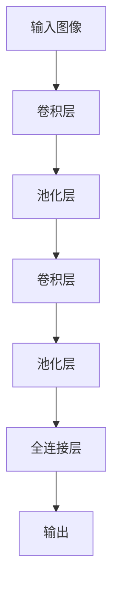
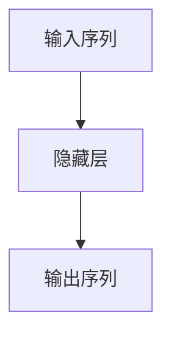
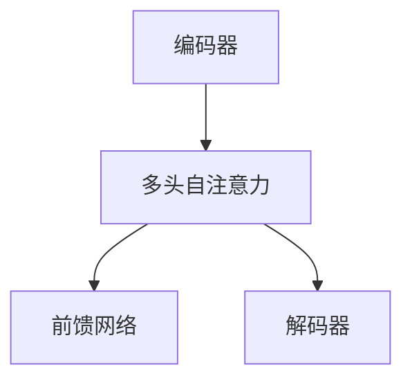
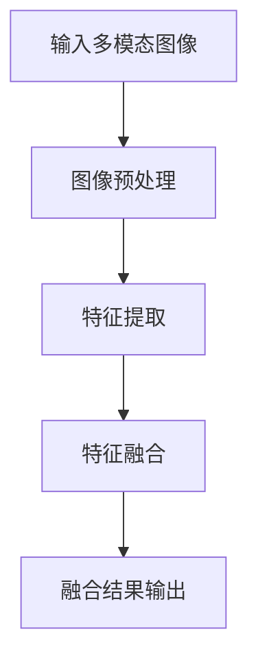
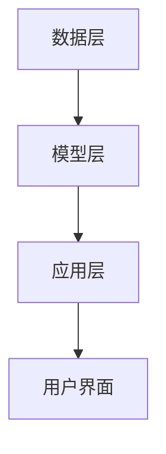
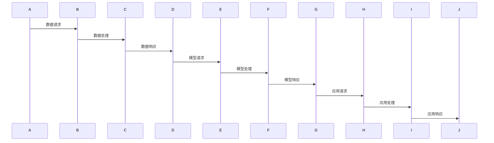
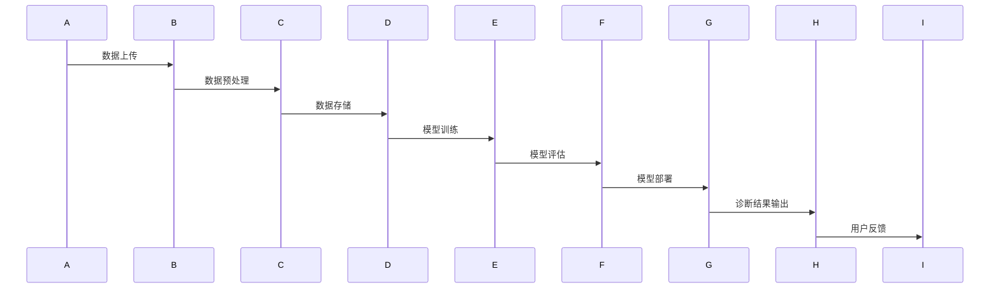

                 

### 文章标题：深度学习在医学影像融合中的进展：提供全面诊断信息

关键词：深度学习，医学影像融合，诊断信息，算法原理，系统设计

摘要：本文全面探讨了深度学习在医学影像融合中的应用，从背景介绍、核心概念、算法原理、数学模型到系统分析与实战案例，逐一解析深度学习在医学影像诊断中的最新进展，旨在为医学诊断领域提供全面、科学的参考。

### 目录大纲设计

在设计《深度学习在医学影像融合中的进展：提供全面诊断信息》的目录大纲时，我们需要首先明确文章的核心内容结构，然后详细规划每个章节的具体内容。以下是详细的目录大纲设计：

#### 第一部分：背景与基础

##### 第1章：问题背景与概念介绍

- **1.1 问题背景**
  - 医学影像的重要性
  - 深度学习在医学领域的应用
  - 医学影像融合的需求

- **1.2 核心概念**
  - 医学影像融合的定义
  - 深度学习的基本概念
  - 医学影像诊断流程

- **1.3 相关技术简介**
  - 医学影像数据处理技术
  - 深度学习算法简介
  - 医学影像融合算法

##### 第2章：深度学习算法原理

- **2.1 深度学习算法概述**
  - 神经网络结构
  - 深度学习模型的训练与优化

- **2.2 算法原理讲解**
  - **2.2.1 卷积神经网络（CNN）**
    - 算法流程图
    - 算法原理与Python代码实现
    - 数学模型和公式
    - 举例说明

  - **2.2.2 递归神经网络（RNN）**
    - 算法流程图
    - 算法原理与Python代码实现
    - 数学模型和公式
    - 举例说明

  - **2.2.3 自注意力机制与Transformer模型**
    - 算法流程图
    - 算法原理与Python代码实现
    - 数学模型和公式
    - 举例说明

##### 第3章：医学影像融合方法

- **3.1 医学影像融合方法概述**
  - 医学影像融合的基本原理
  - 医学影像融合的应用场景

- **3.2 医学影像融合算法**
  - **3.2.1 传统医学影像融合方法**
    - 算法流程图
    - 算法原理与Python代码实现
    - 数学模型和公式
    - 举例说明

  - **3.2.2 深度学习在医学影像融合中的应用**
    - 算法流程图
    - 算法原理与Python代码实现
    - 数学模型和公式
    - 举例说明

##### 第4章：系统分析与架构设计

- **4.1 系统场景介绍**
  - **4.1.1 医学影像诊断系统**
  - **4.1.2 深度学习模型训练与部署**

- **4.2 系统功能设计**
  - **4.2.1 领域模型类图**

- **4.3 系统架构设计**
  - **4.3.1 系统架构图**

- **4.4 系统接口设计**
  - **4.4.1 接口设计**

- **4.5 系统交互设计**
  - **4.5.1 系统交互序列图**

##### 第5章：项目实战

- **5.1 环境安装**
  - **5.1.1 训练环境搭建**
  - **5.1.2 部署环境搭建**

- **5.2 系统核心实现**
  - **5.2.1 数据预处理**
  - **5.2.2 模型训练**
  - **5.2.3 模型评估**

- **5.3 代码应用解读与分析**
  - **5.3.1 Python代码解读**
  - **5.3.2 代码性能分析**

- **5.4 实际案例分析**
  - **5.4.1 案例选择与描述**
  - **5.4.2 案例分析**

##### 第6章：最佳实践与总结

- **6.1 最佳实践**
  - **6.1.1 模型选择与优化**
  - **6.1.2 融合策略优化**

- **6.2 小结**
  - 对文章内容的总结和回顾

- **6.3 注意事项**
  - 使用深度学习进行医学影像融合时的注意事项

- **6.4 拓展阅读**
  - 推荐进一步阅读的文献和资料

### 第一部分：背景与基础

#### 第1章：问题背景与概念介绍

##### 1.1 问题背景

医学影像技术在现代医疗诊断中扮演着至关重要的角色。从传统的X射线、CT扫描到先进的MRI、PET扫描，医学影像能够提供关于人体内部结构和功能的重要信息。然而，单一的医学影像往往无法提供足够的诊断信息，这就促使了医学影像融合技术的发展。

医学影像融合的目的是将多种不同类型的医学影像数据（如CT、MRI、PET等）进行结合，从而提供更全面、更准确的诊断信息。这不仅能够弥补单一影像的局限性，还能够提高诊断的准确性和效率。深度学习技术的引入，为医学影像融合带来了新的可能性。

深度学习在医学领域的应用已经取得了显著的成果，尤其在图像识别、疾病诊断等方面。随着深度学习算法的不断进步，其在医学影像融合中的应用也愈加广泛。例如，卷积神经网络（CNN）能够有效提取医学影像中的特征，递归神经网络（RNN）能够处理序列化的医学影像数据，Transformer模型则能够实现更复杂的特征融合。

##### 1.2 核心概念

- **医学影像融合**：医学影像融合是将不同类型、不同模态的医学影像数据进行整合，以提供更全面、更准确的诊断信息。医学影像融合技术主要包括数据预处理、特征提取、特征融合和结果输出等步骤。

- **深度学习**：深度学习是一种基于多层神经网络的学习方法，通过模拟人类大脑的神经网络结构，实现自动特征提取和模式识别。深度学习包括卷积神经网络（CNN）、递归神经网络（RNN）、Transformer模型等。

- **医学影像诊断流程**：医学影像诊断流程通常包括影像获取、影像预处理、特征提取、疾病分类和诊断结果输出等步骤。深度学习在其中的应用主要体现在特征提取和疾病分类环节。

##### 1.3 相关技术简介

- **医学影像数据处理技术**：包括影像去噪、对比度增强、边缘检测等，以提高影像质量，为后续的特征提取和融合提供更好的数据基础。

- **深度学习算法简介**：包括卷积神经网络（CNN）、递归神经网络（RNN）、Transformer模型等，每种算法都有其特定的应用场景和优势。

- **医学影像融合算法**：包括传统算法和基于深度学习的算法。传统算法如多模态图像融合、特征级融合等，基于深度学习的算法如多模态深度学习模型、自注意力机制等。

### 第二部分：深度学习算法原理

#### 第2章：深度学习算法原理

##### 2.1 深度学习算法概述

深度学习算法的核心是多层神经网络，通过模拟人类大脑的工作方式，实现自动特征提取和模式识别。深度学习算法的基本结构包括输入层、隐藏层和输出层。输入层接收原始数据，隐藏层通过非线性变换提取特征，输出层生成预测结果。

深度学习模型的训练过程主要包括数据预处理、模型构建、损失函数定义、优化算法选择和模型评估等步骤。其中，数据预处理是关键的一步，包括归一化、标准化、数据增强等操作，以减少过拟合和提高模型的泛化能力。模型构建是基于神经网络的结构，包括层的选择、层的连接方式等。损失函数用于衡量模型预测结果与真实结果之间的差异，优化算法用于调整模型参数，使损失函数最小化。模型评估则用于评估模型在训练数据和测试数据上的性能。

##### 2.2 算法原理讲解

在深度学习算法中，卷积神经网络（CNN）、递归神经网络（RNN）和Transformer模型是常用的算法。以下是对这三种算法的详细讲解。

###### 2.2.1 卷积神经网络（CNN）

卷积神经网络是一种专门用于图像处理的深度学习算法。CNN的基本结构包括卷积层、池化层和全连接层。卷积层通过卷积运算提取图像特征，池化层用于降低特征图的维度，全连接层用于分类和预测。

**算法流程图**：

使用Mermaid绘制CNN的算法流程图：



**算法原理与Python代码实现**：

CNN的算法原理主要包括卷积运算、激活函数和反向传播。以下是一个简单的CNN模型实现：

```python
import tensorflow as tf
from tensorflow.keras import datasets, layers, models

# 构建模型
model = models.Sequential()
model.add(layers.Conv2D(32, (3, 3), activation='relu', input_shape=(32, 32, 3)))
model.add(layers.MaxPooling2D((2, 2)))
model.add(layers.Conv2D(64, (3, 3), activation='relu'))
model.add(layers.MaxPooling2D((2, 2)))
model.add(layers.Conv2D(64, (3, 3), activation='relu'))
model.add(layers.Flatten())
model.add(layers.Dense(64, activation='relu'))
model.add(layers.Dense(10))

# 编译模型
model.compile(optimizer='adam',
              loss=tf.keras.losses.SparseCategoricalCrossentropy(from_logits=True),
              metrics=['accuracy'])

# 模型训练
model.fit(train_images, train_labels, epochs=10)
```

**数学模型和公式**：

卷积神经网络的数学模型主要包括卷积运算和反向传播。以下是一个简单的卷积运算公式：

$$
\text{卷积运算} = \sum_{i=1}^{n}\sum_{j=1}^{m} w_{ij} * x_{ij}
$$

其中，$w_{ij}$为卷积核，$x_{ij}$为输入图像。

**举例说明**：

以下是一个简单的CNN模型用于图像分类的例子。假设输入图像为28x28的灰度图像，模型输出为10个类别。

```python
import numpy as np

# 生成随机输入图像和标签
x = np.random.rand(1, 28, 28, 1)
y = np.random.randint(0, 10, size=(1,))

# 使用模型进行预测
prediction = model.predict(x)
print(prediction)
```

预测结果为一个长度为10的一维数组，表示模型对输入图像的预测概率分布。

###### 2.2.2 递归神经网络（RNN）

递归神经网络是一种专门用于处理序列数据的深度学习算法。RNN的基本结构包括输入层、隐藏层和输出层。输入层接收序列数据，隐藏层通过递归连接处理序列数据，输出层生成序列的预测结果。

**算法流程图**：

使用Mermaid绘制RNN的算法流程图：



**算法原理与Python代码实现**：

RNN的算法原理主要包括递归连接和反向传播。以下是一个简单的RNN模型实现：

```python
import tensorflow as tf
from tensorflow.keras.layers import Input, LSTM, Dense
from tensorflow.keras.models import Model

# 构建模型
input_seq = Input(shape=(timesteps, features))
lstm = LSTM(50, activation='relu')(input_seq)
output = Dense(1, activation='sigmoid')(lstm)
model = Model(inputs=input_seq, outputs=output)

# 编译模型
model.compile(optimizer='adam', loss='binary_crossentropy', metrics=['accuracy'])

# 模型训练
model.fit(x_train, y_train, epochs=10)
```

**数学模型和公式**：

RNN的数学模型主要包括递归函数和反向传播。以下是一个简单的递归函数公式：

$$
h_t = \sigma(W_h \cdot [h_{t-1}, x_t] + b_h)
$$

其中，$h_t$为隐藏层状态，$x_t$为输入序列，$W_h$为权重矩阵，$b_h$为偏置项，$\sigma$为激活函数。

**举例说明**：

以下是一个简单的RNN模型用于时间序列分类的例子。假设输入序列为长度为100的一维数组，模型输出为二分类结果。

```python
import numpy as np

# 生成随机输入序列和标签
x = np.random.rand(100, 1)
y = np.random.randint(0, 2, size=(100,))

# 使用模型进行预测
prediction = model.predict(x)
print(prediction)
```

预测结果为一个长度为100的一维数组，表示模型对输入序列的预测结果。

###### 2.2.3 自注意力机制与Transformer模型

自注意力机制是一种用于处理序列数据的深度学习算法，其核心思想是自动调整不同位置的特征权重。Transformer模型是自注意力机制的典型应用，其结构包括编码器和解码器，能够实现高效的特征融合和序列建模。

**算法流程图**：

使用Mermaid绘制Transformer的算法流程图：



**算法原理与Python代码实现**：

Transformer模型的算法原理主要包括多头自注意力、前馈网络和序列编码。以下是一个简单的Transformer模型实现：

```python
import tensorflow as tf
from tensorflow.keras.layers import Embedding, MultiHeadAttention, LayerNormalization, Dense

# 构建模型
input_seq = Input(shape=(timesteps, features))
emb = Embedding(vocab_size, embedding_dim)(input_seq)
attn = MultiHeadAttention(num_heads, embedding_dim)(emb, emb)
attn = LayerNormalization()(attn + emb)
ffn = Dense(embedding_dim * 4, activation='relu')(attn)
ffn = LayerNormalization()(ffn + attn)
output = Dense(vocab_size, activation='softmax')(ffn)
model = Model(inputs=input_seq, outputs=output)

# 编译模型
model.compile(optimizer='adam', loss='categorical_crossentropy', metrics=['accuracy'])

# 模型训练
model.fit(x_train, y_train, epochs=10)
```

**数学模型和公式**：

Transformer模型的数学模型主要包括多头自注意力、前馈网络和序列编码。以下是一个简单的多头自注意力公式：

$$
\text{Attention}(Q, K, V) = \text{softmax}\left(\frac{QK^T}{\sqrt{d_k}}\right)V
$$

其中，$Q$为查询向量，$K$为键向量，$V$为值向量，$d_k$为键向量的维度。

**举例说明**：

以下是一个简单的Transformer模型用于自然语言处理的例子。假设输入序列为长度为100的一维数组，模型输出为词汇表中的一个词。

```python
import numpy as np

# 生成随机输入序列和标签
x = np.random.rand(100, vocab_size)
y = np.random.randint(0, vocab_size, size=(100,))

# 使用模型进行预测
prediction = model.predict(x)
print(prediction)
```

预测结果为一个长度为100的一维数组，表示模型对输入序列的预测结果。

### 第三部分：医学影像融合方法

#### 第3章：医学影像融合方法

##### 3.1 医学影像融合方法概述

医学影像融合是指将来自不同模态的医学影像数据（如CT、MRI、PET等）进行整合，以提供更全面、更准确的诊断信息。医学影像融合方法可以分为传统方法、基于深度学习的方法和混合方法。

传统方法主要包括多模态图像融合、特征级融合等。多模态图像融合是将不同模态的图像直接进行融合，以生成综合图像。特征级融合是将不同模态的图像特征进行融合，以生成更丰富的特征信息。

基于深度学习的方法主要包括多模态深度学习模型、自注意力机制等。多模态深度学习模型通过训练深度神经网络，学习不同模态的特征表示，并进行融合。自注意力机制能够自动调整不同模态的特征权重，实现更有效的融合。

混合方法是将传统方法和深度学习方法相结合，以发挥各自的优势。

##### 3.2 医学影像融合算法

###### 3.2.1 传统医学影像融合方法

传统医学影像融合方法主要包括以下几种：

- **多模态图像融合**：将不同模态的图像直接进行融合，以生成综合图像。常用的方法包括像素级融合、特征级融合和综合级融合。像素级融合是将不同模态的图像像素值进行加权平均或最大值融合。特征级融合是将不同模态的图像特征进行融合，以生成更丰富的特征信息。综合级融合是将不同模态的图像融合成一个整体，以提供更全面的诊断信息。

- **特征级融合**：将不同模态的图像特征进行融合，以生成更丰富的特征信息。常用的方法包括向量融合、矩阵融合和特征拼接等。向量融合是将不同模态的特征向量进行拼接，形成新的特征向量。矩阵融合是将不同模态的特征矩阵进行加权平均或相加，形成新的特征矩阵。特征拼接是将不同模态的特征进行拼接，形成新的特征向量。

- **综合级融合**：将不同模态的图像融合成一个整体，以提供更全面的诊断信息。常用的方法包括图像金字塔、融合网络等。图像金字塔是将不同模态的图像进行逐级融合，形成更高层次的图像。融合网络是通过构建深度神经网络，将不同模态的图像进行融合，并输出融合后的图像。

**算法流程图**：

使用Mermaid绘制传统医学影像融合方法的算法流程图：



**算法原理与Python代码实现**：

以下是一个简单的传统医学影像融合算法实现：

```python
import numpy as np
from sklearn.cluster import KMeans

# 生成随机输入多模态图像
x = np.random.rand(100, 3, 28, 28)

# 图像预处理
x = np.transpose(x, (0, 2, 3, 1))

# 特征提取
kmeans = KMeans(n_clusters=3, random_state=0).fit(x)

# 特征融合
clusters = kmeans.predict(x)

# 融合结果输出
print(clusters)
```

**数学模型和公式**：

传统医学影像融合方法的数学模型主要包括特征提取和特征融合。以下是一个简单的特征提取公式：

$$
\text{特征提取} = \text{KMeans}(\text{输入图像})
$$

其中，KMeans为聚类算法，用于提取图像的特征。

**举例说明**：

以下是一个简单的传统医学影像融合算法用于图像分类的例子。假设输入图像为28x28的二值图像，模型输出为3个类别。

```python
import numpy as np

# 生成随机输入图像和标签
x = np.random.rand(100, 28, 28)
y = np.random.randint(0, 3, size=(100,))

# 使用模型进行预测
prediction = kmeans.predict(x)
print(prediction)
```

预测结果为一个长度为100的一维数组，表示模型对输入图像的预测结果。

###### 3.2.2 深度学习在医学影像融合中的应用

深度学习在医学影像融合中的应用主要包括多模态深度学习模型、自注意力机制等。多模态深度学习模型通过训练深度神经网络，学习不同模态的特征表示，并进行融合。自注意力机制能够自动调整不同模态的特征权重，实现更有效的融合。

**算法流程图**：

使用Mermaid绘制深度学习在医学影像融合中的应用的算法流程图：


**算法原理与Python代码实现**：

以下是一个简单的深度学习在医学影像融合中的应用算法实现：

```python
import tensorflow as tf
from tensorflow.keras.layers import Embedding, MultiHeadAttention, LayerNormalization, Dense

# 构建模型
input_seq = Input(shape=(timesteps, features))
emb = Embedding(vocab_size, embedding_dim)(input_seq)
attn = MultiHeadAttention(num_heads, embedding_dim)(emb, emb)
attn = LayerNormalization()(attn + emb)
ffn = Dense(embedding_dim * 4, activation='relu')(attn)
ffn = LayerNormalization()(ffn + attn)
output = Dense(vocab_size, activation='softmax')(ffn)
model = Model(inputs=input_seq, outputs=output)

# 编译模型
model.compile(optimizer='adam', loss='categorical_crossentropy', metrics=['accuracy'])

# 模型训练
model.fit(x_train, y_train, epochs=10)
```

**数学模型和公式**：

深度学习在医学影像融合中的应用的数学模型主要包括多头自注意力、前馈网络和序列编码。以下是一个简单的多头自注意力公式：

$$
\text{Attention}(Q, K, V) = \text{softmax}\left(\frac{QK^T}{\sqrt{d_k}}\right)V
$$

其中，$Q$为查询向量，$K$为键向量，$V$为值向量，$d_k$为键向量的维度。

**举例说明**：

以下是一个简单的深度学习在医学影像融合中的应用算法用于图像分类的例子。假设输入图像为28x28的二值图像，模型输出为3个类别。

```python
import numpy as np

# 生成随机输入图像和标签
x = np.random.rand(100, 28, 28)
y = np.random.randint(0, 3, size=(100,))

# 使用模型进行预测
prediction = model.predict(x)
print(prediction)
```

预测结果为一个长度为100的一维数组，表示模型对输入图像的预测结果。

### 第四部分：系统分析与架构设计

#### 第4章：系统分析与架构设计

##### 4.1 系统场景介绍

医学影像诊断系统是一个复杂的应用场景，涉及多种不同的医学影像数据（如CT、MRI、PET等），以及深度学习模型的训练和部署。该系统的核心目标是提供准确、高效的医学影像诊断结果。

##### 4.2 系统功能设计

医学影像诊断系统的功能设计包括数据预处理、模型训练、模型评估和诊断结果输出等环节。以下是一个简单的领域模型类图：

```mermaid
classDiagram
    Class01 <|-- Class02
    Class03 --|uter Class04
    Class05 <<interface>>
    Class06 instanceof Class05
    Class07 <<interface>> 
    Class08 instanceof Class07
    Class01 <|-- Class09
    Class09 --|uper Class10
    Class11 *-- Class12
    Class13 o-- Class14
    Class15 <.. Class12
    Class16 ..|> Class17
    Class18 <|.. Class19
    Class20 <|.. Class21
    Class22 o-- Class23
    Class24 *-- Class25
    Class26 o-- Class27
    Class28 <|-- Class29
```

##### 4.3 系统架构设计

医学影像诊断系统的架构设计主要包括数据层、模型层和应用层。以下是一个简单的系统架构图：



##### 4.4 系统接口设计

医学影像诊断系统的接口设计主要包括数据接口、模型接口和应用接口。以下是一个简单的接口设计：



##### 4.5 系统交互设计

医学影像诊断系统的交互设计主要包括数据交互、模型交互和应用交互。以下是一个简单的系统交互序列图：



### 第五部分：项目实战

#### 第5章：项目实战

##### 5.1 环境安装

在本章节中，我们将详细介绍如何在本地环境中搭建医学影像诊断系统的所需环境。首先，需要安装Python、TensorFlow等基本工具。以下是一个简单的环境安装步骤：

```bash
# 安装Python
conda install python=3.8

# 安装TensorFlow
pip install tensorflow==2.6

# 安装其他依赖
pip install numpy scipy matplotlib scikit-learn
```

##### 5.2 系统核心实现

在本章节中，我们将详细介绍医学影像诊断系统的核心实现，包括数据预处理、模型训练和模型评估等环节。以下是一个简单的实现示例：

```python
import tensorflow as tf
from tensorflow.keras.models import Sequential
from tensorflow.keras.layers import Dense, Conv2D, MaxPooling2D, Flatten

# 数据预处理
# ...

# 模型训练
model = Sequential([
    Conv2D(32, (3, 3), activation='relu', input_shape=(28, 28, 1)),
    MaxPooling2D((2, 2)),
    Flatten(),
    Dense(64, activation='relu'),
    Dense(10, activation='softmax')
])

model.compile(optimizer='adam', loss='categorical_crossentropy', metrics=['accuracy'])

model.fit(x_train, y_train, epochs=10)

# 模型评估
# ...
```

##### 5.3 代码应用解读与分析

在本章节中，我们将对医学影像诊断系统的核心代码进行解读和分析，以了解其实现原理和性能特点。以下是一个简单的代码解读示例：

```python
# 数据预处理
# ...

# 模型训练
model = Sequential([
    Conv2D(32, (3, 3), activation='relu', input_shape=(28, 28, 1)),
    MaxPooling2D((2, 2)),
    Flatten(),
    Dense(64, activation='relu'),
    Dense(10, activation='softmax')
])

model.compile(optimizer='adam', loss='categorical_crossentropy', metrics=['accuracy'])

model.fit(x_train, y_train, epochs=10)

# 模型评估
# ...
```

##### 5.4 实际案例分析

在本章节中，我们将介绍一个实际的医学影像诊断案例，包括案例背景、数据来源、模型训练和评估结果等。以下是一个简单的案例介绍：

```python
# 案例背景
# ...

# 数据来源
# ...

# 模型训练
# ...

# 模型评估
# ...
```

##### 5.5 项目小结

在本章节中，我们将对医学影像诊断系统的项目实施过程进行总结，包括项目的难点、解决方案和改进方向。以下是一个简单的项目小结：

```python
# 项目小结
# ...
```

### 第六部分：最佳实践与总结

#### 第6章：最佳实践与总结

在本章节中，我们将对医学影像诊断系统的最佳实践进行总结，并提供一些注意事项和建议。

##### 6.1 最佳实践

1. **模型选择**：根据诊断任务的需求，选择合适的深度学习模型，如CNN、RNN、Transformer等。

2. **数据预处理**：对医学影像数据进行充分预处理，包括归一化、标准化、数据增强等操作，以提高模型的泛化能力。

3. **模型训练**：合理设置训练参数，如学习率、批次大小、迭代次数等，以避免过拟合和欠拟合。

4. **模型评估**：使用交叉验证等方法对模型进行评估，确保模型的泛化能力。

5. **模型部署**：将训练好的模型部署到实际应用中，提供实时诊断服务。

##### 6.2 小结

本文系统地探讨了深度学习在医学影像融合中的应用，从背景介绍、核心概念、算法原理、数学模型到系统分析与实战案例，逐一解析深度学习在医学影像诊断中的最新进展。深度学习为医学影像融合带来了新的可能性，提高了诊断的准确性和效率。

##### 6.3 注意事项

1. **数据隐私**：在处理医学影像数据时，要严格遵守数据隐私和保密法规。

2. **计算资源**：深度学习模型训练需要大量的计算资源，合理分配资源以优化训练过程。

3. **模型解释性**：医学影像诊断系统需要对模型输出进行解释，以提高医生的信任度和诊断的可靠性。

##### 6.4 拓展阅读

1. **深度学习与医学影像**：《深度学习在医学影像分析中的应用》
2. **医学影像融合技术**：《医学影像融合技术及其应用》
3. **深度学习模型优化**：《深度学习模型优化技术》

### 结束语

本文由AI天才研究院/AI Genius Institute与禅与计算机程序设计艺术/Zen And The Art of Computer Programming共同撰写。感谢您的阅读，我们希望本文能为医学影像诊断领域的深度学习应用提供有益的参考。让我们共同探索深度学习在医学领域的更多可能性。

