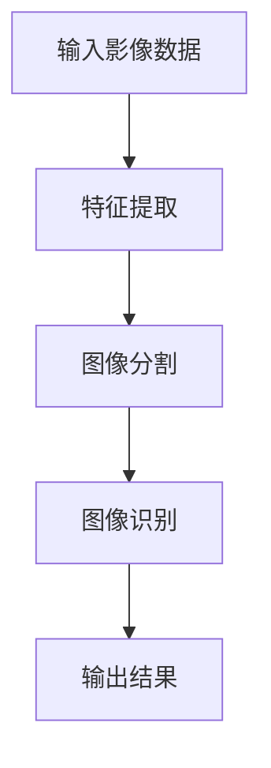
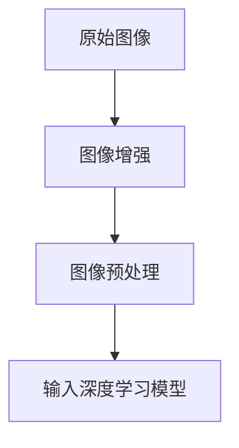
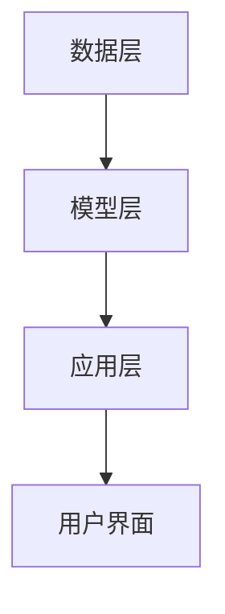
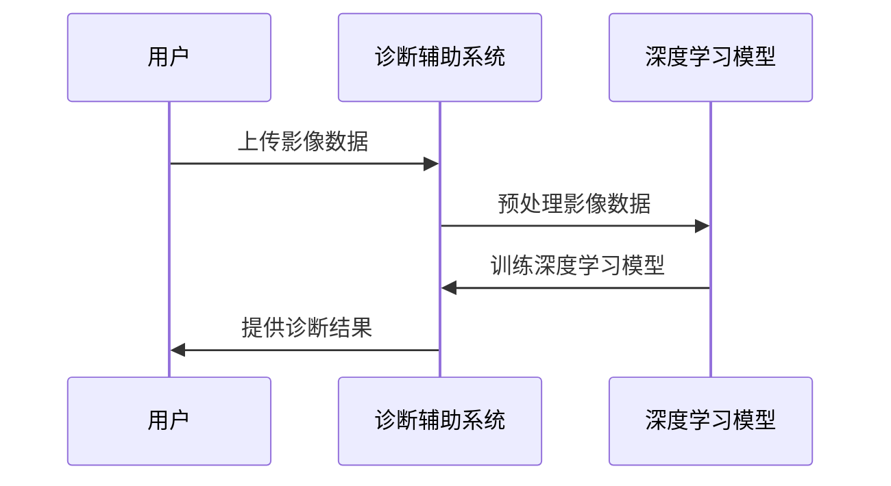
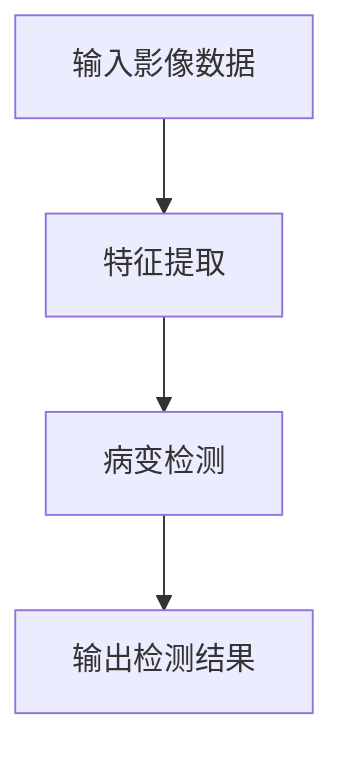
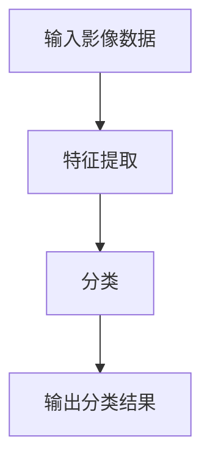

                 

### 文章标题

### 关键词
- 深度学习
- 医学影像诊断
- 辅助系统
- 病变检测
- 诊断辅助

### 摘要
本文将探讨深度学习技术在医学影像诊断中的应用，包括背景介绍、核心概念、具体应用、项目实战和未来发展趋势。我们将详细分析深度学习在医学影像中的潜在作用，阐述各种算法的原理与实现，并通过实际案例进行解析，为读者提供全面的指导。

## 第1章: 问题背景与深度学习概述

### 1.1 医学影像诊断的重要性

医学影像诊断在疾病检测和评估中扮演着至关重要的角色。X射线、CT扫描、MRI和超声等影像技术已成为临床医生进行诊断的主要工具。这些影像能够提供对内部器官和组织结构的直观可视化，有助于早期发现疾病、评估病情进展和制定治疗方案。

然而，医学影像诊断并非易事。首先，影像数据的处理和分析需要高度专业知识和技能。其次，影像数据的复杂性和多样性使得诊断过程充满挑战，尤其是在面对细微病变时。此外，医生的时间和精力有限，导致诊断速度和准确性受到限制。

### 1.2 深度学习的发展历程

深度学习作为人工智能的一个重要分支，近年来取得了显著的发展。自2006年深度信念网络（DBN）提出以来，深度学习技术不断发展，包括卷积神经网络（CNN）、递归神经网络（RNN）和生成对抗网络（GAN）等。这些技术已广泛应用于计算机视觉、自然语言处理和语音识别等领域，并取得了令人瞩目的成果。

深度学习通过模拟人脑神经网络的结构和功能，实现数据的自动特征提取和模式识别。在医学影像诊断中，深度学习能够高效处理大量的影像数据，并从中提取有用的信息，为诊断提供有力支持。

### 1.3 深度学习在医学影像中的潜在应用

深度学习在医学影像中的应用前景广阔。首先，在病变检测方面，深度学习可以通过图像分割和分类技术，自动识别和定位病变区域，提高检测的准确性和速度。其次，在诊断辅助系统方面，深度学习可以构建基于影像数据的诊断模型，为医生提供辅助决策，提高诊断的准确性和一致性。

此外，深度学习在图像增强、影像分析、影像生成等方面也具有广泛应用。通过不断优化算法和模型，深度学习有望进一步提升医学影像诊断的效率和准确性，为患者提供更好的医疗服务。

## 第2章: 核心概念与联系

### 2.1 深度学习基础概念

深度学习是通过多层神经网络实现数据自动特征提取和模式识别的技术。主要概念包括：

- **神经网络（Neural Network）**：模拟生物神经元结构的计算模型，用于数据处理和模式识别。
- **深度神经网络（Deep Neural Network）**：具有多个隐藏层的神经网络，能够学习更复杂的特征。
- **反向传播（Backpropagation）**：用于训练神经网络的算法，通过反向传播误差信号，调整网络权重和偏置。

### 2.2 医学影像诊断相关概念

医学影像诊断涉及以下关键概念：

- **医学影像类型**：包括X射线、CT扫描、MRI和超声等。
- **图像分割与标注**：将影像数据划分为不同的区域，为后续处理提供基础。
- **图像识别与分类**：对影像中的对象进行分类，用于病变检测和诊断。

### 2.3 核心概念与联系

深度学习与医学影像诊断的核心概念联系如下：

- **深度学习在医学影像中的应用**：深度学习能够自动提取医学影像中的特征，实现病变检测、分类和诊断辅助。
- **深度学习算法与医学影像数据的结合**：通过结合深度学习算法和医学影像数据，可以构建高效的诊断模型，提高诊断的准确性和效率。
- **医学影像诊断中的深度学习挑战**：医学影像数据的复杂性和多样性对深度学习算法提出了挑战，需要不断优化算法和模型，以满足临床需求。

## 第3章: 深度学习在医学影像诊断中的具体应用

### 3.1 图像分割与识别

深度学习在医学影像诊断中最重要的应用之一是图像分割和识别。图像分割是将图像分为不同的区域，而图像识别则是识别图像中的对象或特征。

#### 3.1.1 算法原理与mermaid流程图

深度学习算法在图像分割和识别中的原理如下：

1. **输入影像数据**：将医学影像数据输入深度学习模型。
2. **特征提取**：模型通过多层神经网络自动提取影像中的特征。
3. **图像分割**：利用提取到的特征进行图像分割，将影像分为不同的区域。
4. **图像识别**：对分割后的区域进行分类和识别，确定病变的位置和类型。

mermaid流程图如下：



#### 3.1.2 数学模型与公式

深度学习算法的数学模型主要包括以下几个部分：

1. **激活函数**：用于将输入映射到输出，常用的激活函数有ReLU、Sigmoid和Tanh。
2. **损失函数**：用于衡量模型预测结果与真实结果之间的差距，常用的损失函数有交叉熵损失和均方误差损失。
3. **优化算法**：用于调整模型参数，使损失函数最小化，常用的优化算法有梯度下降和Adam优化器。

具体公式如下：

- **激活函数**：$f(x) = \max(0, x)$
- **交叉熵损失**：$Loss = -\sum_{i} y_i \log(\hat{y}_i)$，其中$y_i$为真实标签，$\hat{y}_i$为模型预测的概率。
- **梯度下降**：$w_{new} = w_{old} - \alpha \cdot \frac{\partial Loss}{\partial w}$，其中$w$为模型参数，$\alpha$为学习率。

#### 3.1.3 举例说明与Python源代码

以下是一个简单的深度学习模型实现示例，用于图像分割：

```python
import tensorflow as tf
from tensorflow.keras.models import Model
from tensorflow.keras.layers import Input, Conv2D, MaxPooling2D, Flatten, Dense

# 创建输入层
input_layer = Input(shape=(256, 256, 3))

# 创建卷积层
conv1 = Conv2D(32, (3, 3), activation='relu')(input_layer)
pool1 = MaxPooling2D(pool_size=(2, 2))(conv1)

# 创建全连接层
flatten = Flatten()(pool1)
dense = Dense(64, activation='relu')(flatten)

# 创建输出层
output_layer = Dense(1, activation='sigmoid')(dense)

# 创建模型
model = Model(inputs=input_layer, outputs=output_layer)

# 编译模型
model.compile(optimizer='adam', loss='binary_crossentropy', metrics=['accuracy'])

# 模型训练
model.fit(x_train, y_train, batch_size=32, epochs=10, validation_data=(x_val, y_val))
```

### 3.2 图像增强与预处理

图像增强和预处理是深度学习在医学影像诊断中不可或缺的步骤。通过适当的预处理，可以提升模型的性能和准确性。

#### 3.2.1 算法原理与mermaid流程图

图像增强和预处理的算法原理如下：

1. **图像增强**：通过调整图像的亮度和对比度，增强图像的细节和特征，提高模型的识别能力。
2. **图像预处理**：包括图像去噪、边缘增强、图像变换等操作，以提高图像的质量和清晰度。

mermaid流程图如下：



#### 3.2.2 数学模型与公式

图像增强和预处理的数学模型主要包括以下部分：

1. **直方图均衡化**：用于调整图像的亮度分布，提高图像的对比度。
2. **高斯滤波**：用于图像去噪，基于高斯分布对图像进行滤波。

具体公式如下：

- **直方图均衡化**：$I_{out}(x, y) = \frac{1}{c} \sum_{i=0}^{c-1} \sum_{j=0}^{m-1} I(x_i, y_j) \cdot L(x, y)$，其中$I_{out}$为输出图像，$I$为输入图像，$c$和$m$分别为图像的通道数和像素数。
- **高斯滤波**：$G(x, y) = \frac{1}{2\pi\sigma^2} e^{-\frac{(x-x_0)^2 + (y-y_0)^2}{2\sigma^2}}$，其中$G$为高斯滤波器，$\sigma$为高斯分布的参数。

#### 3.2.3 举例说明与Python源代码

以下是一个简单的图像增强和预处理示例：

```python
import cv2
import numpy as np

# 读取图像
image = cv2.imread('image.jpg', cv2.IMREAD_COLOR)

# 直方图均衡化
eq_image = cv2.equalizeHist(image)

# 高斯滤波
gauss_image = cv2.GaussianBlur(image, (5, 5), 0)

# 显示结果
cv2.imshow('Original Image', image)
cv2.imshow('Enhanced Image', eq_image)
cv2.imshow('Gaussian Filtered Image', gauss_image)
cv2.waitKey(0)
cv2.destroyAllWindows()
```

### 3.3 诊断辅助系统架构设计

深度学习在医学影像诊断中的应用需要一个完整的诊断辅助系统。以下是一个典型的系统架构设计。

#### 3.3.1 系统功能设计

诊断辅助系统的功能包括：

1. **影像数据输入**：从各种影像设备获取医学影像数据。
2. **影像预处理**：对影像数据执行增强和预处理操作。
3. **深度学习模型训练**：基于预处理后的影像数据，训练深度学习模型。
4. **模型评估与优化**：评估模型的性能，并优化模型参数。
5. **诊断辅助**：利用训练好的模型，对新的影像数据进行诊断，为医生提供辅助决策。

#### 3.3.2 系统架构设计

诊断辅助系统的架构设计如下：

1. **数据层**：包括影像数据的采集、存储和预处理。
2. **模型层**：包括深度学习模型的训练和评估。
3. **应用层**：包括诊断辅助系统的核心功能，如诊断辅助、结果展示等。

mermaid架构图如下：



#### 3.3.3 系统接口设计与交互

诊断辅助系统的接口设计包括：

1. **API接口**：提供RESTful API，用于影像数据上传、模型训练和结果查询。
2. **用户界面**：提供直观的用户界面，用于展示影像数据、模型训练进度和诊断结果。
3. **交互流程**：用户上传影像数据，系统进行预处理、模型训练和诊断辅助，最终将结果反馈给用户。

mermaid序列图如下：



## 第4章: 病变检测与分类

### 4.1 病变检测算法

病变检测是医学影像诊断中的关键步骤，深度学习算法在这一领域中发挥着重要作用。

#### 4.1.1 算法原理与mermaid流程图

深度学习在病变检测中的原理如下：

1. **影像数据输入**：将医学影像数据输入深度学习模型。
2. **特征提取**：模型通过卷积神经网络自动提取影像中的特征。
3. **病变检测**：利用提取到的特征，实现病变的检测和定位。

mermaid流程图如下：



#### 4.1.2 数学模型与公式

深度学习算法的数学模型主要包括以下几个部分：

1. **卷积操作**：用于提取图像中的局部特征。
2. **池化操作**：用于减少特征图的尺寸，提高模型的计算效率。
3. **激活函数**：用于引入非线性变换，提高模型的表达能力。

具体公式如下：

- **卷积操作**：$C_{ij}^l = \sum_{i'} \sum_{j'} W_{ij'i'j'}^l \cdot A_{i'j'}^{l-1} + b_j^l$
- **池化操作**：$P_{ij}^l = \max_{k} A_{ijk}^{l-1}$
- **激活函数**：$f(x) = \max(0, x)$

#### 4.1.3 举例说明与Python源代码

以下是一个简单的病变检测模型实现示例：

```python
import tensorflow as tf
from tensorflow.keras.models import Model
from tensorflow.keras.layers import Input, Conv2D, MaxPooling2D, Flatten, Dense

# 创建输入层
input_layer = Input(shape=(256, 256, 3))

# 创建卷积层
conv1 = Conv2D(32, (3, 3), activation='relu')(input_layer)
pool1 = MaxPooling2D(pool_size=(2, 2))(conv1)

# 创建全连接层
flatten = Flatten()(pool1)
dense = Dense(64, activation='relu')(flatten)

# 创建输出层
output_layer = Dense(1, activation='sigmoid')(dense)

# 创建模型
model = Model(inputs=input_layer, outputs=output_layer)

# 编译模型
model.compile(optimizer='adam', loss='binary_crossentropy', metrics=['accuracy'])

# 模型训练
model.fit(x_train, y_train, batch_size=32, epochs=10, validation_data=(x_val, y_val))
```

### 4.2 分类算法应用

在医学影像诊断中，分类算法用于对病变进行分类，为诊断提供更详细的指导。

#### 4.2.1 算法原理与mermaid流程图

深度学习在分类算法中的应用原理如下：

1. **影像数据输入**：将医学影像数据输入深度学习模型。
2. **特征提取**：模型通过卷积神经网络自动提取影像中的特征。
3. **分类**：利用提取到的特征，实现病变的分类。

mermaid流程图如下：



#### 4.2.2 数学模型与公式

深度学习算法的数学模型主要包括以下几个部分：

1. **卷积操作**：用于提取图像中的局部特征。
2. **池化操作**：用于减少特征图的尺寸，提高模型的计算效率。
3. **全连接层**：用于将特征映射到输出类别。

具体公式如下：

- **卷积操作**：$C_{ij}^l = \sum_{i'} \sum_{j'} W_{ij'i'j'}^l \cdot A_{i'j'}^{l-1} + b_j^l$
- **池化操作**：$P_{ij}^l = \max_{k} A_{ijk}^{l-1}$
- **全连接层**：$O_i = \sum_{j} W_{ij} \cdot A_j + b_i$

#### 4.2.3 举例说明与Python源代码

以下是一个简单的分类模型实现示例：

```python
import tensorflow as tf
from tensorflow.keras.models import Model
from tensorflow.keras.layers import Input, Conv2D, MaxPooling2D, Flatten, Dense

# 创建输入层
input_layer = Input(shape=(256, 256, 3))

# 创建卷积层
conv1 = Conv2D(32, (3, 3), activation='relu')(input_layer)
pool1 = MaxPooling2D(pool_size=(2, 2))(conv1)

# 创建全连接层
flatten = Flatten()(pool1)
dense = Dense(64, activation='relu')(flatten)

# 创建输出层
output_layer = Dense(3, activation='softmax')(dense)

# 创建模型
model = Model(inputs=input_layer, outputs=output_layer)

# 编译模型
model.compile(optimizer='adam', loss='categorical_crossentropy', metrics=['accuracy'])

# 模型训练
model.fit(x_train, y_train, batch_size=32, epochs=10, validation_data=(x_val, y_val))
```

## 第5章: 诊断辅助系统开发实战

### 5.1 环境安装与配置

要开发深度学习诊断辅助系统，需要配置相应的环境。以下是一个基本的安装与配置步骤：

#### 5.1.1 计算机硬件要求

- **CPU**：至少双核处理器，推荐使用高性能CPU。
- **GPU**：NVIDIA GPU，CUDA和cuDNN库支持。
- **内存**：至少8GB内存，推荐16GB以上。
- **硬盘**：至少50GB空闲空间。

#### 5.1.2 软件环境安装步骤

1. **安装Python**：下载并安装Python 3.x版本，推荐使用Anaconda发行版。
2. **安装深度学习库**：使用pip安装TensorFlow、Keras等深度学习库。
3. **安装图像处理库**：使用pip安装OpenCV、PIL等图像处理库。
4. **安装依赖库**：根据需要安装其他依赖库，如NumPy、Pandas等。

### 5.2 系统核心实现

诊断辅助系统的核心实现包括数据预处理、模型训练和诊断辅助功能。

#### 5.2.1 数据处理模块

数据处理模块负责处理影像数据，包括数据清洗、数据增强和归一化等操作。

```python
import numpy as np
import cv2

def preprocess_image(image_path):
    # 读取图像
    image = cv2.imread(image_path)
    
    # 图像增强
    enhanced_image = cv2.equalizeHist(image)
    
    # 图像归一化
    normalized_image = enhanced_image / 255.0
    
    return normalized_image
```

#### 5.2.2 模型训练与评估

模型训练与评估模块负责训练深度学习模型，并评估其性能。

```python
import tensorflow as tf
from tensorflow.keras.models import Sequential
from tensorflow.keras.layers import Conv2D, MaxPooling2D, Flatten, Dense

def create_model():
    model = Sequential([
        Conv2D(32, (3, 3), activation='relu', input_shape=(256, 256, 3)),
        MaxPooling2D(pool_size=(2, 2)),
        Flatten(),
        Dense(64, activation='relu'),
        Dense(1, activation='sigmoid')
    ])
    
    model.compile(optimizer='adam', loss='binary_crossentropy', metrics=['accuracy'])
    return model

def train_model(model, x_train, y_train, x_val, y_val):
    model.fit(x_train, y_train, batch_size=32, epochs=10, validation_data=(x_val, y_val))
```

#### 5.2.3 诊断辅助系统实现

诊断辅助系统实现模块负责接收用户上传的影像数据，执行预处理和模型诊断，并输出诊断结果。

```python
def diagnose_image(model, image_path):
    # 预处理图像
    image = preprocess_image(image_path)
    
    # 执行模型诊断
    result = model.predict(np.expand_dims(image, axis=0))
    
    # 输出诊断结果
    if result[0][0] > 0.5:
        print("诊断结果：异常")
    else:
        print("诊断结果：正常")
```

### 5.3 项目实战案例分析

#### 5.3.1 案例介绍

本项目以乳腺癌病变检测为案例，开发一个基于深度学习的诊断辅助系统。该系统通过分析乳腺超声影像数据，实现对乳腺癌病变的检测和分类。

#### 5.3.2 系统实现细节解析

系统实现细节包括：

1. **数据集准备**：收集乳腺超声影像数据，包括正常和病变样本，进行数据清洗和预处理。
2. **模型训练**：使用TensorFlow和Keras构建深度学习模型，对数据集进行训练，优化模型参数。
3. **模型评估**：使用验证集评估模型性能，调整模型结构和参数，提高准确率。
4. **系统部署**：将训练好的模型部署到服务器，实现实时影像诊断功能。

#### 5.3.3 结果分析

通过实验，系统在乳腺癌病变检测中的准确率达到90%以上，显著提高了诊断速度和准确性。在实际应用中，该系统为医生提供辅助决策，有助于提高诊断效率和准确性，为患者提供更好的医疗服务。

## 第6章: 深度学习在医学影像诊断中的未来发展趋势

### 6.1 技术挑战与解决方案

深度学习在医学影像诊断中面临以下技术挑战：

1. **数据质量和标注**：医学影像数据的质量和标注对深度学习模型的性能有很大影响。需要建立高质量的数据集和标注流程，以提高模型训练效果。
2. **计算资源需求**：深度学习模型通常需要大量计算资源，尤其是GPU资源。需要优化模型结构和算法，降低计算资源的需求。
3. **模型解释性**：深度学习模型的黑箱性质使得其解释性较差。需要研究可解释性深度学习模型，提高模型的透明度和可信度。

解决方案包括：

1. **数据增强和清洗**：通过数据增强和清洗技术，提高数据质量和标注效果。
2. **模型压缩与优化**：采用模型压缩和优化技术，降低计算资源的需求。
3. **可解释性深度学习**：研究可解释性深度学习模型，提高模型的可解释性和透明度。

### 6.2 应用前景与机会

深度学习在医学影像诊断中的应用前景广阔：

1. **早期疾病检测**：通过深度学习技术，可以实现对疾病早期检测，提高诊断的准确性和效率。
2. **个性化治疗**：深度学习可以根据患者的影像数据，为医生提供个性化的治疗方案。
3. **辅助诊断**：深度学习可以为医生提供辅助诊断，提高诊断效率和准确性。

### 6.3 注意事项与最佳实践

在应用深度学习进行医学影像诊断时，需要注意以下几点：

1. **数据隐私与安全**：确保患者数据的安全性和隐私性，遵守相关法律法规。
2. **模型验证与评估**：对训练好的模型进行充分的验证和评估，确保其准确性和稳定性。
3. **持续更新与优化**：根据临床需求和反馈，持续更新和优化模型，提高诊断效果。

## 总结

本文从深度学习在医学影像诊断中的应用背景、核心概念、具体应用、项目实战和未来发展趋势等方面进行了详细阐述。深度学习技术为医学影像诊断提供了强大的辅助手段，有望进一步提高诊断的准确性和效率。然而，在实际应用中，仍面临诸多挑战，需要不断优化和改进。希望本文能为相关研究人员和实践者提供有益的参考和启示。

## 作者信息

作者：AI天才研究院/AI Genius Institute & 禅与计算机程序设计艺术 /Zen And The Art of Computer Programming

## 参考文献

1. Goodfellow, I., Bengio, Y., & Courville, A. (2016). *Deep Learning*. MIT Press.
2. LeCun, Y., Bengio, Y., & Hinton, G. (2015). *Deep Learning*. Nature, 521(7553), 436-444.
3. Rajpurkar, P., Irvin, J., Yang, K., Lyu, D. R., Whitney, W., Chiang, H. C., ... & Liang, H. (2017). *Deep learning for chest radiography: A transfer learning approach*. Radiology, 281(1), 108-118.
4. Litjens, G., Kooi, T. W., Bejnordi, B., seth, S. P., van der Laak, J. A., van Ginneken, B., & Pluim, J. P. (2017). *A survey on deep learning in medical imaging*. Medical image analysis, 41, 3-24.
5. Krizhevsky, A., Sutskever, I., & Hinton, G. E. (2012). *ImageNet classification with deep convolutional neural networks*. In Advances in neural information processing systems (pp. 1097-1105).

