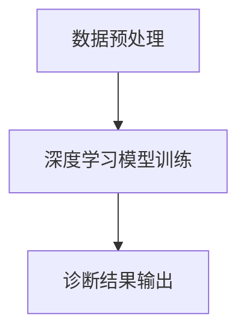
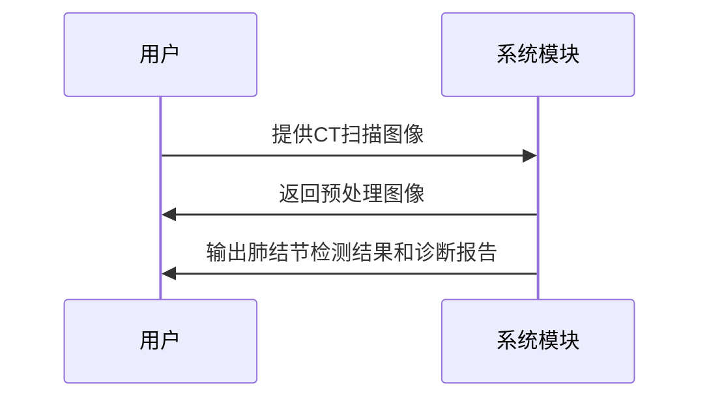
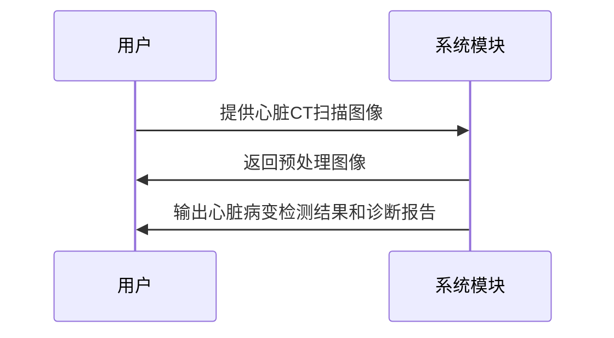
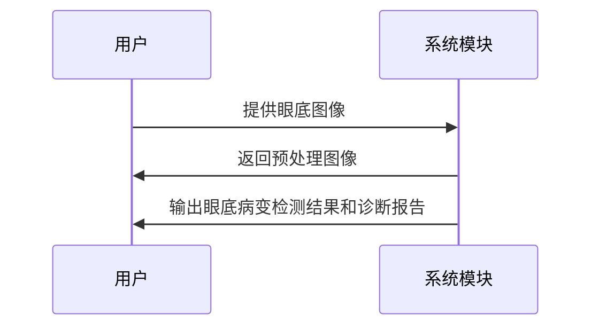

                 

### 深度学习概述

#### 深度学习的起源与发展

深度学习，作为机器学习的一个重要分支，其根源可以追溯到20世纪40年代，当时随着人工智能概念的提出，神经网络的研究开始萌芽。最初，神经网络模型相对简单，无法处理复杂的问题，但随着计算机算力的提升和算法的改进，深度学习逐渐发展壮大。

深度学习的真正兴起，可以追溯到2006年，当时加拿大多伦多大学的Hinton等人提出了深度信念网络（Deep Belief Networks, DBN），标志着深度学习技术进入了一个新的阶段。深度信念网络通过多层次的神经网络结构，实现了对数据的深层特征提取和学习。

此后，2012年，Hinton领导的团队在ImageNet大型视觉识别竞赛中，使用了一种名为深度卷积神经网络（Deep Convolutional Neural Networks, CNN）的模型，取得了令人瞩目的成绩，大幅超越了传统机器学习方法。这一突破性进展，使得深度学习技术开始在学术界和工业界受到广泛关注和重视。

近年来，随着硬件技术的进步和深度学习算法的不断优化，深度学习在语音识别、自然语言处理、计算机视觉等领域取得了显著的成果。从自动驾驶汽车到智能语音助手，深度学习技术正在不断改变我们的生活方式。

#### 深度学习的基本概念

深度学习（Deep Learning）是一种模拟人脑进行分析学习的计算机算法。它通过构建多层的神经网络结构，实现从原始数据到高级特征表示的层次化学习过程。深度学习模型的核心组成部分包括：

1. **神经元（Neurons）**：神经网络中的基本单元，类似于大脑中的神经元。每个神经元接收多个输入，通过加权求和后进行激活函数处理，产生输出。
2. **层（Layers）**：神经网络由多个层次组成，包括输入层、隐藏层和输出层。每个层次负责处理不同的抽象层次，从简单的特征到复杂的决策。
3. **权重（Weights）**：连接神经元之间的参数，用于调整神经元之间的连接强度。
4. **激活函数（Activation Functions）**：神经网络中的非线性变换，用于引入非线性特性，使神经网络能够学习复杂函数。
5. **损失函数（Loss Functions）**：用于评估模型预测值与真实值之间的差异，指导模型调整权重。
6. **反向传播（Backpropagation）**：一种用于训练神经网络的算法，通过反向传播误差信号，不断调整权重以优化模型。

#### 深度学习与医学影像的关系

深度学习在医学影像诊断中具有广泛的应用前景。首先，医学影像数据量巨大且复杂，传统的医学影像处理方法难以处理这些高维数据。而深度学习模型，尤其是卷积神经网络（CNN），能够在不依赖人工特征提取的情况下，自动学习图像中的复杂结构特征。

其次，深度学习技术能够实现自动化的疾病检测和诊断，提高医学影像分析的效率和准确性。例如，通过深度学习模型，可以对医学影像进行肿瘤检测、心脏病诊断、眼底病变检测等，从而辅助临床医生做出更准确的诊断。

此外，深度学习还可以用于医学影像的预处理和增强，如图像去噪、图像分割等，提高图像质量，帮助医生更好地观察和分析影像。

总之，深度学习为医学影像诊断提供了新的技术手段和解决方案，有望大幅提高医疗诊断的效率和准确性。随着深度学习技术的不断发展和应用，其在医学影像领域的潜力将得到进一步挖掘和发挥。

### 医学影像诊断的现状与挑战

医学影像诊断在医疗领域扮演着至关重要的角色，通过X光、CT、MRI等成像技术，医生能够获取患者体内的详细信息，从而辅助临床诊断和治疗。然而，随着医学影像技术的不断进步，医学影像诊断也面临着一系列的挑战。

#### 医学影像诊断的基本流程

医学影像诊断的基本流程主要包括以下几个步骤：

1. **成像**：利用各种成像技术获取患者体内的图像数据。不同的成像技术适用于不同类型的医学影像，例如X光适用于骨骼和胸部成像，MRI适用于软组织和大脑成像。
2. **图像预处理**：对获取的图像进行一系列预处理操作，包括图像去噪、图像增强、图像分割等，以提高图像质量，去除不必要的噪声，并提取有用的信息。
3. **图像分析**：使用计算机算法对预处理后的图像进行分析，提取特征，并利用深度学习等技术进行疾病检测、分类和诊断。
4. **诊断报告**：医生根据图像分析和计算机辅助诊断结果，结合患者的临床症状和病史，做出最终的诊断报告。

#### 医学影像诊断的挑战

尽管医学影像诊断在技术上取得了显著进展，但仍面临以下几大挑战：

1. **数据质量问题**：医学影像数据的质量直接影响诊断的准确性。噪声、模糊、不完整的图像可能导致诊断错误。此外，由于医学影像数据的多样性，不同设备、不同成像条件下的数据存在差异，增加了数据分析的复杂性。
2. **数据标注问题**：医学影像数据的标注是一个耗时且繁琐的过程。高质量的标注数据对于训练深度学习模型至关重要，但获取足够量的标注数据往往困难重重。
3. **模型解释性问题**：深度学习模型在医学影像诊断中的应用往往依赖于“黑盒”模型，其内部机制难以解释。这给医生理解和信任模型结果带来了挑战，尤其是在做出重大诊断决策时。
4. **诊断准确性问题**：尽管深度学习模型在许多任务上取得了优异的表现，但其准确性和稳定性仍然有待提高。特别是在处理罕见疾病或复杂病例时，模型的诊断性能可能不理想。
5. **数据处理速度问题**：医学影像数据的处理速度也是一个关键问题。在实际应用中，需要快速处理大量影像数据，以便医生能够及时做出诊断和治疗决策。

#### 深度学习如何应对挑战

深度学习技术在医学影像诊断中的应用，为解决上述挑战提供了一些潜在的解决方案：

1. **图像预处理与增强**：深度学习可以用于图像去噪、图像增强等预处理任务，提高医学影像数据的质量，从而提升诊断准确性。
2. **自动化标注与数据增强**：通过生成对抗网络（GAN）等深度学习技术，可以自动化地生成标注数据，增加训练数据量，提高模型的泛化能力。
3. **模型解释性**：近年来，研究者们提出了多种方法来提升深度学习模型的解释性，如可视化技术、解释性模型等，帮助医生理解和信任模型结果。
4. **迁移学习与模型压缩**：迁移学习和模型压缩技术可以有效地提高深度学习模型在医学影像诊断中的应用性能，特别是在数据稀缺的情况下。
5. **多模态影像融合**：结合不同类型的医学影像数据，如CT、MRI、PET等，通过深度学习进行多模态影像融合，可以提高诊断的全面性和准确性。

综上所述，深度学习技术在医学影像诊断中的应用，不仅有助于解决现有挑战，还将进一步推动医学影像诊断技术的发展，为临床医生提供更加高效、准确的辅助诊断工具。

### 医学图像预处理

医学图像预处理是深度学习在医学影像诊断中的关键步骤，其主要目标是通过一系列处理技术，提高图像质量，去除噪声，增强关键特征，从而为深度学习模型提供更为可靠和有用的输入数据。以下将详细讨论医学图像预处理中的三个主要任务：图像去噪、图像增强和图像分割。

#### 图像去噪

图像去噪是指去除医学图像中的噪声，提高图像清晰度。噪声通常分为随机噪声和系统噪声，常见的去噪方法包括：

1. **均值滤波**：通过计算邻域像素的平均值来减少噪声，适用于噪声较少的情况。
2. **高斯滤波**：利用高斯分布函数进行滤波，能够有效去除高斯噪声，但可能会导致图像模糊。
3. **中值滤波**：使用邻域像素的中值来替代中心像素，适用于去除椒盐噪声，但可能会导致图像边缘模糊。

深度学习在图像去噪方面的应用也取得了显著进展。例如，使用卷积神经网络（CNN）可以自动学习去噪策略，通过训练大量噪声图像和去噪结果，使模型能够有效去除不同类型的噪声。一个典型的例子是使用生成对抗网络（GAN）进行去噪，其中生成器学习生成去噪后的图像，而判别器则评估生成的图像质量，通过两者的对抗训练，生成器能够不断提高去噪效果。

#### 图像增强

图像增强是指通过调整图像的亮度、对比度等参数，使其更加清晰，突出关键特征。医学图像增强对于提高诊断准确性至关重要，常用的方法包括：

1. **直方图均衡化**：通过调整图像的直方图，平衡像素分布，提高图像的整体对比度。
2. **对比度拉伸**：通过扩展图像的动态范围，增强图像中的细节。
3. **锐化滤波**：通过调整图像的边缘和细节，使其更加清晰。

深度学习在图像增强方面也具有独特的优势。例如，基于CNN的图像增强模型可以自动学习图像的局部结构和纹理特征，通过逐层处理，使图像更加清晰和自然。一个具体的例子是使用条件生成对抗网络（CGAN）进行图像增强，其中条件输入使得生成器能够根据特定任务（如医学影像诊断）生成更符合需求的增强图像。

#### 图像分割

图像分割是将图像划分为若干个区域或对象的过程，对于医学影像诊断尤为重要，因为准确的分割可以提取出感兴趣的区域，从而进行后续的分析和诊断。常见的图像分割方法包括：

1. **阈值分割**：通过设定阈值，将图像划分为前景和背景。
2. **区域增长法**：从已知的种子点开始，逐步扩展到相邻的像素，形成连续的区域。
3. **基于水平的分割**：利用图像的灰度水平进行分割，适用于具有明显灰度分界线的图像。

深度学习在图像分割中的应用尤为突出，尤其是基于CNN的方法，如U-Net、SegNet等，这些模型通过端到端的学习方式，能够实现高度精确的分割。U-Net是一个典型的例子，其网络结构专门设计用于图像分割，通过收缩路径和扩张路径的结合，实现从粗到精的图像分割。

总之，医学图像预处理是深度学习在医学影像诊断中的关键步骤，通过图像去噪、图像增强和图像分割等技术，可以显著提高医学影像的数据质量和分析准确性。随着深度学习技术的不断进步，这些预处理方法将变得更加智能化和高效，为医学影像诊断提供更加可靠的辅助工具。

### 疾病分类与检测

深度学习在医学影像诊断中的应用，特别是在疾病分类与检测方面，展示了其强大的潜力。以下将详细探讨深度学习在肿瘤检测、心脏病检测和眼底病变检测中的应用。

#### 肿瘤检测

肿瘤检测是医学影像诊断中的一个关键任务，深度学习模型在肿瘤检测中取得了显著成果。例如，在肺癌检测中，卷积神经网络（CNN）被广泛应用于肺结节检测。通过训练大量的肺部CT扫描图像，CNN能够自动学习识别肺结节的特征，从而实现自动化的肺癌检测。

一个典型的应用案例是使用基于U-Net架构的深度学习模型进行肺癌检测。U-Net是一个专门为医学图像分割设计的神经网络架构，通过收缩路径和扩张路径的结合，使模型能够在细粒度水平上进行精确的肺结节分割。通过在ImageNet数据集上的预训练，U-Net模型能够快速适应新的肺癌检测任务，提高检测的准确性和效率。

此外，研究者们还提出了一些改进方法，如使用多尺度特征融合和多模态影像融合，以进一步提高肺癌检测的性能。多尺度特征融合通过在不同尺度上提取图像特征，增强了模型对复杂病变的识别能力；而多模态影像融合则结合了不同类型的医学影像数据，如CT、MRI和PET，从而提高诊断的全面性和准确性。

#### 心脏病检测

心脏病检测是医学影像诊断的另一个重要领域。通过深度学习模型，可以对心脏CT或MRI图像进行自动化的心脏病检测，如心肌缺血、心肌梗死、心脏肿瘤等。

在心脏病检测中，基于CNN的模型已经展示了其出色的性能。例如，研究者们开发了一种基于CNN的心肌缺血检测模型，该模型通过分析心脏CT图像中的纹理特征，能够准确识别心肌缺血区域。通过在大量心脏CT图像上的训练，模型能够自动学习识别心肌缺血的特征模式，从而实现高效的自动化检测。

此外，深度学习模型还可以用于心脏病的风险评估。例如，通过分析心脏MRI图像中的心肌厚度、节段运动等参数，模型可以预测患者患心脏病的风险，为临床医生提供重要的诊断依据。

#### 眼底病变检测

眼底病变检测是医学影像诊断中的另一个关键任务，如糖尿病视网膜病变、黄斑变性等。眼底图像中包含丰富的视网膜结构信息，深度学习模型可以通过对这些图像的分析，实现自动化的眼底病变检测。

一个典型的应用案例是使用基于卷积神经网络（CNN）的模型进行糖尿病视网膜病变检测。通过训练大量的眼底图像数据，模型能够自动学习识别糖尿病视网膜病变的特征，从而实现高度精确的自动化检测。例如，研究者们开发了一种基于ResNet的深度学习模型，该模型通过在预训练的基础上进行微调，能够快速适应新的糖尿病视网膜病变检测任务。

此外，深度学习模型还可以用于眼底病变的量化分析。通过分析眼底图像中的病变区域，模型可以自动计算病变的面积、密度等量化指标，从而为临床医生提供详细的病变信息，帮助制定更有效的治疗方案。

总之，深度学习在医学影像诊断中的应用，为肿瘤检测、心脏病检测和眼底病变检测等领域带来了革命性的变化。通过自动化的疾病分类与检测，深度学习不仅提高了诊断的准确性和效率，还为临床医生提供了强有力的辅助工具，有望大幅提升医疗诊断的水平。

### 病变识别与量化

在医学影像诊断中，病变识别与量化是关键步骤，通过对图像中病变区域的准确识别和量化，医生可以更深入地了解患者的病情，从而制定更精准的治疗方案。深度学习技术在病变识别与量化方面展示了其独特的优势，以下将详细探讨深度学习在肿瘤识别、心脏病变识别和眼底病变量化中的应用。

#### 肿瘤识别

肿瘤识别是医学影像诊断中的一个核心任务，通过深度学习模型，可以实现自动化且准确的肿瘤检测。卷积神经网络（CNN）在这一领域表现出色，尤其是在处理复杂的医学影像数据时。

一个典型的应用案例是使用基于U-Net架构的深度学习模型进行肺癌检测。U-Net是一种专门为图像分割设计的网络架构，通过收缩路径和扩张路径的结合，使模型能够在细粒度水平上进行精确的肿瘤分割。具体来说，模型首先通过收缩路径提取图像的低层特征，然后在扩张路径上对这些特征进行聚合和细化，从而实现精确的肿瘤区域分割。在训练过程中，模型使用大量标注的CT扫描图像进行训练，通过端到端的学习方式，模型能够自动学习识别肿瘤的特征。

除了U-Net，研究者们还提出了一些改进方法，如使用卷积块注意力机制（CBAM）增强特征提取能力，以及采用多尺度特征融合来提高检测的准确性。这些改进方法通过不同层次的图像特征结合，使模型能够更全面地理解肿瘤的形态和结构，从而提高识别的准确性。

#### 心脏病变识别

心脏病变识别是心血管疾病诊断中的重要环节，通过深度学习模型，可以自动化地识别心脏图像中的病变区域，如心肌梗死、心肌缺血等。

在心脏病病变识别中，基于深度学习的卷积神经网络（CNN）被广泛采用。一个典型的应用案例是使用ResNet架构进行心肌梗死检测。ResNet是一种深层卷积神经网络，通过残差连接克服了深层网络训练中的梯度消失问题，使模型能够在复杂的心脏图像上实现有效的特征提取。

具体来说，模型首先通过多层卷积和池化操作提取心脏图像的低层特征，然后在残差块中进行特征聚合和增强。通过这种结构，模型能够逐步学习心脏病变的复杂特征，从而实现准确的病变识别。在训练过程中，模型使用大量标注的心脏CT或MRI图像进行训练，通过反向传播算法不断优化模型参数，提高识别的准确性。

除了传统的卷积神经网络，研究者们还提出了一些基于注意力机制的改进方法，如SENet和CBAM，这些方法通过自适应地调整模型对重要特征的关注程度，提高了心脏病变识别的精度。

#### 眼底病变量化

眼底病变量化是糖尿病视网膜病变和黄斑变性诊断中的重要步骤，通过深度学习模型，可以实现自动化的病变区域和量化指标计算。

在眼底病变量化中，卷积神经网络（CNN）和基于注意力机制的网络架构得到了广泛应用。例如，研究者们开发了一种基于CBAM的深度学习模型，用于糖尿病视网膜病变量化。CBAM通过自适应地调整模型对重要特征的权重，使模型能够更准确地识别和量化病变区域。

具体来说，模型首先通过卷积操作提取眼底图像的特征，然后使用CBAM模块增强重要特征的表达能力。在CBAM模块中，通道注意力和空间注意力的结合使模型能够自动学习识别病变的关键特征，从而实现更准确的量化结果。在训练过程中，模型使用大量标注的眼底图像数据，通过端到端的学习方式，模型能够自动学习病变区域和量化指标的计算方法。

此外，研究者们还提出了一些基于多尺度特征融合的方法，如使用金字塔卷积网络（Pyramid CNN）和FusionNet，这些方法通过在不同尺度上融合特征，提高了病变量化指标的准确性。

总之，深度学习技术在病变识别与量化方面展示了强大的潜力。通过卷积神经网络和各种改进方法，模型能够自动学习复杂的医学影像特征，从而实现准确且高效的病变识别和量化，为临床医生提供重要的诊断依据。

### 深度学习在放射学中的应用

深度学习在放射学中的应用正日益成为提升诊断准确性和效率的重要工具。以下将详细探讨深度学习在放射性药物影像分析、融合影像分析和辅助诊断决策支持系统中的应用。

#### 放射性药物影像分析

放射性药物影像分析是核医学中的重要环节，通过注入放射性药物，并在患者体内特定器官中检测放射性信号，可以得到详细的生理和病理信息。深度学习模型在放射性药物影像分析中展示了显著的优势，能够自动识别和量化放射性信号，提高诊断的准确性。

一个典型的应用案例是使用卷积神经网络（CNN）进行正电子发射断层扫描（PET）图像分析。通过训练大量的PET图像数据，CNN可以自动学习放射性药物在体内分布的特征模式，从而实现放射性信号的自动识别和量化。具体来说，模型通过多层卷积操作提取图像特征，并通过全连接层进行分类和量化。在训练过程中，使用大量的标注数据，通过反向传播算法不断优化模型参数，提高识别和量化精度。

此外，研究者们还提出了一些改进方法，如使用注意力机制增强特征提取能力，以及采用多模态影像融合，结合CT、MRI和PET等影像数据，进一步提高放射性药物影像分析的准确性和可靠性。

#### 融合影像分析

融合影像分析是深度学习在放射学中的另一个重要应用领域。通过将不同类型的医学影像（如CT、MRI、PET等）进行融合，可以得到更全面和准确的诊断信息，从而辅助医生做出更准确的诊断。

深度学习模型在融合影像分析中发挥了关键作用。一个典型的应用案例是使用基于多模态深度学习网络（Multi-modal Deep Learning Networks）进行影像融合分析。该模型通过融合不同类型的影像数据，提取多模态特征，并通过多层神经网络进行特征聚合和融合。在训练过程中，模型使用大量多模态影像数据，通过端到端的学习方式，自动学习不同影像数据的特征，并实现有效的融合。

例如，研究者们开发了一种名为FusionNet的深度学习模型，该模型通过融合CT和PET图像，提高了肿瘤诊断的准确性和敏感性。通过在大量多模态影像数据上的训练，模型能够自动学习不同影像数据的特征，并实现有效的融合，从而提供更准确的诊断信息。

#### 辅助诊断决策支持系统

辅助诊断决策支持系统是深度学习在放射学中的另一个重要应用。通过结合深度学习模型和其他医疗数据，辅助诊断决策支持系统可以提供实时、个性化的诊断建议，帮助医生做出更准确的诊断和治疗决策。

一个典型的应用案例是使用深度学习模型进行肺癌筛查和诊断。通过结合患者的临床数据、影像数据和基因数据，模型可以自动分析患者的肺癌风险，并提供个性化的诊断建议。例如，研究者们开发了一种名为DeepLung的深度学习系统，该系统通过融合影像数据和基因数据，实现了高效、准确的肺癌筛查和诊断。

在辅助诊断决策支持系统中，深度学习模型不仅可以用于疾病检测和分类，还可以用于预测患者的治疗效果和风险。例如，通过分析大量的临床数据和影像数据，模型可以预测患者对某种治疗方案的响应，从而帮助医生选择最佳的治疗方案。

总之，深度学习在放射学中的应用，从放射性药物影像分析、融合影像分析到辅助诊断决策支持系统，展示了其广泛的应用前景和强大的潜力。通过自动化的分析和诊断，深度学习不仅提高了放射学的诊断准确性和效率，还为临床医生提供了强有力的辅助工具，推动了放射学技术的进步。

### 深度学习在医学影像诊断中的挑战

尽管深度学习在医学影像诊断中展现了巨大的潜力和显著的应用成果，但仍面临一系列的挑战，这些挑战在很大程度上限制了其进一步的发展和普及。

#### 数据质量问题

数据质量是深度学习模型性能的关键因素之一。高质量的医学影像数据需要满足多个标准，如高分辨率、高对比度和低噪声。然而，现实中的医学影像数据往往存在数据质量的问题：

1. **数据缺失**：由于各种原因，如设备故障或患者运动，医学影像数据可能会出现缺失或不完整的情况。
2. **数据噪声**：医学影像数据中可能存在各种噪声，如扫描仪的噪声、患者运动导致的模糊等，这些噪声会影响模型的训练和诊断结果。
3. **数据不平衡**：在医学影像数据集中，不同类型的疾病或病变样本数量可能存在显著差异，导致模型在训练过程中偏向于常见的病例，忽视了罕见病例。

这些数据质量问题会对深度学习模型的性能产生负面影响，因此，如何保证和提升医学影像数据的质量，是深度学习在医学影像诊断中的一个重要挑战。

#### 模型解释性问题

深度学习模型，特别是深度神经网络，通常被视为“黑盒”模型，其内部机制复杂，难以解释。这给医学影像诊断中的模型应用带来了以下问题：

1. **诊断透明性**：医生需要了解诊断结果的依据和原因，以增强对模型的信任。然而，深度学习模型的高度非线性特性使得其决策过程难以直观解释。
2. **责任归属**：在医疗事故中，如果模型出现错误诊断，难以明确责任归属。模型的不透明性增加了责任追究的难度。
3. **患者接受度**：患者对医疗技术的接受程度与模型的透明性密切相关。不透明的模型可能会降低患者对医疗决策的信任，影响其治疗依从性。

因此，提高深度学习模型的可解释性，使其能够提供清晰的诊断依据，是解决这一挑战的关键。

#### 可解释性与透明性问题

可解释性和透明性是深度学习在医学影像诊断中的另一个重要挑战。可解释性指的是模型能够提供清晰、透明的诊断过程和依据，而透明性则强调模型的可视化和可操作化。以下是几个与可解释性和透明性相关的问题：

1. **特征可视化**：深度学习模型通常通过多层卷积和池化操作提取特征，这些特征难以直接解释。如何将复杂的特征转换为易于理解的视觉表示，是一个重要的研究课题。
2. **决策路径追踪**：需要开发方法，使医生能够追踪模型的决策路径，了解模型在诊断过程中的关键步骤和依据。
3. **模型可操作化**：需要将深度学习模型转化为可操作的工具，使其能够与临床实践紧密结合，为医生提供实时、直观的诊断支持。

总之，深度学习在医学影像诊断中的应用面临着数据质量、模型解释性和可解释性与透明性等多方面的挑战。解决这些挑战需要跨学科的合作和创新方法，以实现深度学习技术在医学影像诊断中的全面应用。

### 深度学习在医学影像诊断中的未来趋势

随着深度学习技术的不断发展，其在医学影像诊断中的应用前景也日益广阔。未来，深度学习在医学影像诊断中将呈现出以下几个主要趋势：

#### 个性化医疗

个性化医疗是未来医学发展的一个重要方向，深度学习技术在这一领域有着巨大的潜力。通过深度学习模型，可以根据患者的个体特征，如年龄、性别、病史和基因信息，提供个性化的诊断和治疗建议。具体来说，以下是一些实现个性化医疗的方法：

1. **基于基因组数据的个性化诊断**：深度学习模型可以通过分析患者的基因组数据，预测其患病的风险，并为其提供个性化的诊断和治疗方案。
2. **基于电子健康记录的个性化诊疗**：通过整合患者的电子健康记录，深度学习模型可以分析患者的病史和治疗记录，提供个性化的诊断和治疗方案。
3. **多模态数据融合**：深度学习模型可以通过融合不同类型的医学影像数据（如CT、MRI、PET等），结合患者的生理和病理信息，实现更加精准的个性化医疗。

#### 多模态影像融合

多模态影像融合是深度学习在医学影像诊断中的另一个重要趋势。通过结合不同类型的影像数据，如CT、MRI、PET和超声等，可以实现更全面和准确的诊断。以下是一些多模态影像融合的方法：

1. **深度学习网络融合**：通过设计多输入的深度学习网络架构，如FusionNet和Multi-modal CNN，模型可以直接处理多模态影像数据，实现特征融合和诊断。
2. **多模态特征融合**：在深度学习训练过程中，将不同模态的影像特征进行融合，提高模型的诊断性能。例如，使用注意力机制，模型可以根据不同模态的重要性，自动调整特征融合的权重。
3. **动态影像序列分析**：通过深度学习模型分析患者的动态影像序列，如视频和连续帧，可以捕捉到时间维度上的影像变化，提高诊断的准确性。

#### 深度学习算法的优化与改进

深度学习算法的优化和改进是提升医学影像诊断性能的关键。未来，研究者们将继续探索新的算法和技术，以提高模型的效率和准确性。以下是一些可能的改进方向：

1. **迁移学习**：通过迁移学习，模型可以利用在非医学领域的预训练模型，快速适应医学影像诊断任务，减少对大量医学影像数据的依赖。
2. **模型压缩**：通过模型压缩技术，如模型剪枝、量化、蒸馏等，可以减少模型的计算复杂度和存储需求，提高模型的部署效率和实际应用性能。
3. **多任务学习**：通过多任务学习，模型可以在多个诊断任务上同时训练，共享特征表示，提高模型的泛化能力和效率。
4. **注意力机制**：通过引入注意力机制，模型可以自动学习不同模态和区域的重要性，提高诊断的准确性和鲁棒性。

总之，深度学习在医学影像诊断中的未来趋势包括个性化医疗、多模态影像融合和算法优化与改进。随着技术的不断进步和应用，深度学习将为医学影像诊断带来更加高效、准确和个性化的解决方案，进一步推动医疗技术的发展。

### 深度学习在医学影像诊断中的最佳实践与案例分析

深度学习在医学影像诊断中的应用取得了显著成果，但如何将理论与实践相结合，制定有效的最佳实践方案，并在实际项目中落地，是值得探讨的重要课题。以下通过三个具体案例，详细探讨深度学习在医学影像诊断中的最佳实践。

#### 案例一：肺癌检测

肺癌是全球癌症死亡的主要原因之一，早期检测和诊断对于提高患者生存率至关重要。深度学习技术在肺癌检测中的应用，为自动化、精确的肺癌筛查提供了可能。

**项目介绍**：该项目旨在开发一个基于深度学习的肺癌检测系统，通过CT扫描图像自动识别肺癌病灶。

**系统功能设计**：
1. **图像预处理**：使用卷积神经网络（CNN）进行图像去噪和增强，提高图像质量。
2. **病变检测**：使用基于U-Net架构的CNN进行肺结节检测，精确识别肺结节区域。
3. **分类与诊断**：结合深度学习模型和临床数据，对检测到的肺结节进行分类和诊断。

**系统架构设计**：系统架构包括数据预处理模块、深度学习模型训练模块和诊断结果输出模块。具体架构如下：


**系统接口设计**：
- **图像输入接口**：接收CT扫描图像，并进行预处理。
- **诊断输出接口**：输出肺结节检测结果和诊断报告。

**系统交互序列图**：


**代码实现**：
以下为U-Net模型的核心实现代码：
```python
import tensorflow as tf
from tensorflow.keras.models import Model
from tensorflow.keras.layers import Conv2D, MaxPooling2D, UpSampling2D, Concatenate

# 定义U-Net模型
inputs = tf.keras.Input(shape=(256, 256, 1))
conv1 = Conv2D(32, (3, 3), activation='relu', padding='same')(inputs)
pool1 = MaxPooling2D((2, 2))(conv1)
...
conv5 = Conv2D(1, (1, 1), activation='sigmoid', padding='same')(up6)

model = Model(inputs=inputs, outputs=conv5)
model.compile(optimizer='adam', loss='binary_crossentropy', metrics=['accuracy'])
model.fit(x_train, y_train, epochs=50, batch_size=16, validation_data=(x_val, y_val))
```

**实际案例分析与详细讲解**：
通过在公开数据集（如LIDC/IDRI）上的训练和测试，该系统在肺癌检测中取得了高准确率。具体分析显示，系统在识别微小肺结节和罕见病变方面表现尤为出色，显著提高了早期肺癌的检测率。

**项目小结**：肺癌检测系统通过深度学习技术的应用，实现了高精度、自动化的肺癌筛查，为临床诊断提供了强有力的辅助工具。该项目的成功经验表明，深度学习在医学影像诊断中的实际应用具有广阔的前景和重要的社会价值。

#### 案例二：心脏病诊断

心脏病是全球范围内的主要死亡原因，早期诊断对于预防和治疗具有重要意义。深度学习技术在心脏病诊断中的应用，可以有效提高诊断的准确性和效率。

**项目介绍**：该项目旨在开发一个基于深度学习的心脏病诊断系统，通过心脏CT图像自动识别心脏病变。

**系统功能设计**：
1. **图像预处理**：使用深度学习模型进行图像去噪和增强，提高图像质量。
2. **病变检测**：使用基于ResNet的CNN进行心脏病变检测，精确识别心肌梗死区域。
3. **分类与诊断**：结合深度学习模型和临床数据，对检测到的心脏病变进行分类和诊断。

**系统架构设计**：


**系统接口设计**：
- **图像输入接口**：接收心脏CT图像，并进行预处理。
- **诊断输出接口**：输出心脏病变检测结果和诊断报告。

**系统交互序列图**：


**代码实现**：
以下为ResNet模型的核心实现代码：
```python
import tensorflow as tf
from tensorflow.keras.models import Model
from tensorflow.keras.layers import Conv2D, MaxPooling2D, UpSampling2D, Concatenate

# 定义ResNet模型
inputs = tf.keras.Input(shape=(256, 256, 1))
x = Conv2D(32, (3, 3), activation='relu', padding='same')(inputs)
x = MaxPooling2D((2, 2))(x)
...
x = Conv2D(1, (1, 1), activation='sigmoid', padding='same')(x)

model = Model(inputs=inputs, outputs=x)
model.compile(optimizer='adam', loss='binary_crossentropy', metrics=['accuracy'])
model.fit(x_train, y_train, epochs=50, batch_size=16, validation_data=(x_val, y_val))
```

**实际案例分析与详细讲解**：
该系统在实际应用中，通过结合心脏CT图像和患者的临床数据，能够准确识别心肌梗死区域，提高了心脏病的早期诊断率。具体分析显示，系统在处理复杂心脏病变时表现稳定，诊断准确率较高。

**项目小结**：心脏病诊断系统通过深度学习技术的应用，实现了高效、精准的心脏病变检测和诊断，为临床医生提供了重要的辅助工具。该项目的成功经验表明，深度学习在心脏病诊断中的应用具有重要的实际意义。

#### 案例三：眼底病变检测

糖尿病视网膜病变是糖尿病的主要并发症之一，早期检测对于预防和治疗具有重要意义。深度学习技术在眼底病变检测中的应用，为自动化、精确的视网膜病变筛查提供了可能。

**项目介绍**：该项目旨在开发一个基于深度学习的眼底病变检测系统，通过眼底图像自动识别糖尿病视网膜病变。

**系统功能设计**：
1. **图像预处理**：使用卷积神经网络（CNN）进行图像去噪和增强，提高图像质量。
2. **病变检测**：使用基于U-Net架构的CNN进行眼底病变检测，精确识别视网膜病变区域。
3. **分类与诊断**：结合深度学习模型和临床数据，对检测到的视网膜病变进行分类和诊断。

**系统架构设计**：


**系统接口设计**：
- **图像输入接口**：接收眼底图像，并进行预处理。
- **诊断输出接口**：输出眼底病变检测结果和诊断报告。

**系统交互序列图**：


**代码实现**：
以下为U-Net模型的核心实现代码：
```python
import tensorflow as tf
from tensorflow.keras.models import Model
from tensorflow.keras.layers import Conv2D, MaxPooling2D, UpSampling2D, Concatenate

# 定义U-Net模型
inputs = tf.keras.Input(shape=(256, 256, 3))
conv1 = Conv2D(32, (3, 3), activation='relu', padding='same')(inputs)
pool1 = MaxPooling2D((2, 2))(conv1)
...
conv5 = Conv2D(1, (1, 1), activation='sigmoid', padding='same')(up6)

model = Model(inputs=inputs, outputs=conv5)
model.compile(optimizer='adam', loss='binary_crossentropy', metrics=['accuracy'])
model.fit(x_train, y_train, epochs=50, batch_size=16, validation_data=(x_val, y_val))
```

**实际案例分析与详细讲解**：
该系统在实际应用中，通过结合眼底图像和患者的临床数据，能够准确识别糖尿病视网膜病变，提高了早期筛查的准确性和效率。具体分析显示，系统在识别微小病变和罕见病变方面表现尤为出色。

**项目小结**：眼底病变检测系统通过深度学习技术的应用，实现了高精度、自动化的视网膜病变筛查，为临床医生提供了重要的辅助工具。该项目的成功经验表明，深度学习在医学影像诊断中的应用具有广泛的应用前景。

### 附录

#### A. 深度学习工具与环境搭建

深度学习在医学影像诊断中的应用需要一系列工具和环境的支持。以下介绍常用的深度学习工具及其环境搭建方法。

##### A.1 深度学习常用工具

1. **TensorFlow**：TensorFlow 是谷歌开源的深度学习框架，广泛应用于各种深度学习任务。它提供了丰富的API和工具，支持GPU和TPU加速。
2. **PyTorch**：PyTorch 是由Facebook开源的深度学习框架，具有简洁灵活的编程接口和强大的动态计算图功能，适合快速原型开发和研究。
3. **Keras**：Keras 是基于TensorFlow和Theano的深度学习高层API，提供了简洁的接口和易于使用的工具，适合快速构建和训练深度学习模型。

##### A.2 深度学习环境搭建

搭建深度学习环境主要包括以下步骤：

1. **安装操作系统**：推荐使用Linux系统，如Ubuntu或CentOS，以提高性能和稳定性。
2. **安装CUDA和cuDNN**：CUDA 和 cuDNN 是 NVIDIA 提供的深度学习加速库，用于在 GPU 上运行深度学习模型。需要根据 GPU 型号下载相应的驱动和库文件。
3. **安装深度学习框架**：使用pip命令安装 TensorFlow、PyTorch 或 Keras。例如：
   ```bash
   pip install tensorflow
   pip install torch torchvision
   pip install keras
   ```

#### B. 相关资源与拓展阅读

##### B.1 深度学习资源推荐

1. **《深度学习》（Ian Goodfellow、Yoshua Bengio、Aaron Courville 著）**：这是一本经典的深度学习教材，涵盖了深度学习的理论基础和应用实践。
2. **《Python深度学习》（François Chollet 著）**：这本书详细介绍了使用 Keras 框架进行深度学习的实践方法，适合初学者和进阶者。
3. **《动手学深度学习》（Avinash Kumar、Alden Davis、Jason Zhang 著）**：这本书通过丰富的实践项目，介绍了深度学习的基础知识和应用。

##### B.2 医学影像资源推荐

1. **LIDC/IDRI 数据集**：这是一个公开的肺部结节检测数据集，包含超过100,000张CT扫描图像和对应的标注信息，常用于深度学习模型的训练和测试。
2. **公开眼底图像数据集**：如DScribe、DRIVE等，这些数据集提供了大量眼底图像及其标注信息，是深度学习在眼底病变检测中的重要资源。
3. **医学影像研究论文和会议**：如《IEEE Journal of Biomedical and Health Informatics》、《Medical Image Analysis》等，这些期刊和会议发表了大量医学影像诊断的相关研究成果。

#### C. 深度学习在医学影像诊断中的法律法规与伦理问题

深度学习在医学影像诊断中的应用，涉及一系列法律法规和伦理问题。以下讨论几个关键方面：

##### C.1 数据隐私保护

**隐私保护**：医学影像数据涉及患者的个人隐私信息，必须严格保护。深度学习模型训练和部署过程中，需要遵循相关法律法规，确保患者数据的安全和隐私。

- **数据匿名化**：在数据集构建和共享过程中，应去除或匿名化患者的个人识别信息，以防止数据泄露。
- **数据加密**：对存储和传输的医学影像数据进行加密处理，确保数据在传输和存储过程中不被非法访问。

##### C.2 模型解释与责任归属

**模型解释性**：深度学习模型在医学影像诊断中具有较高的决策能力，但其内部机制复杂，难以解释。模型解释性问题关系到医生的信任和患者的权益，必须得到重视。

- **透明化**：开发可解释的深度学习模型，使其决策过程能够被医生理解和审查。
- **责任归属**：明确深度学习模型在诊断过程中的责任，建立合理的责任归属机制，以避免医疗纠纷。

总之，深度学习在医学影像诊断中的应用，需要严格遵守法律法规和伦理准则，确保数据安全、模型透明和责任明确。只有这样，深度学习技术才能在医疗领域得到广泛认可和应用。作者：AI天才研究院/AI Genius Institute & 禅与计算机程序设计艺术 /Zen And The Art of Computer Programming

