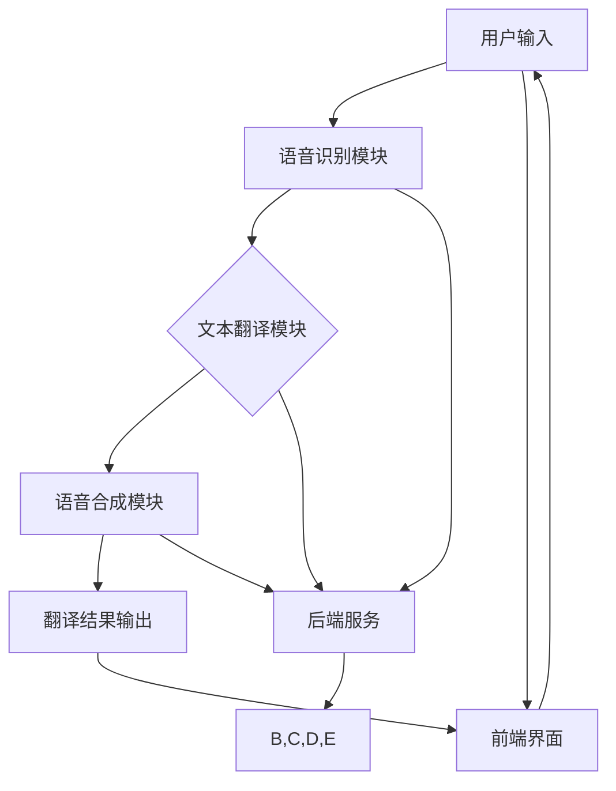
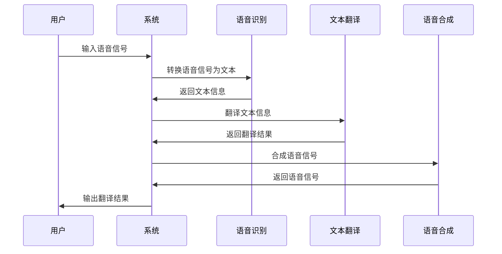
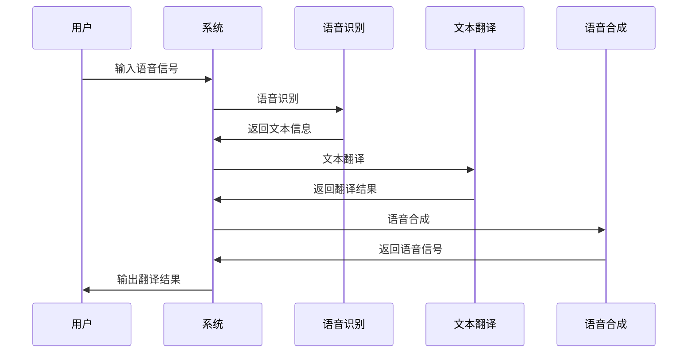

                 

### 深度学习在口译中的应用：实现实时多语言翻译

深度学习作为一种前沿的人工智能技术，近年来在语言处理领域取得了显著的进展。口译作为语言交流中至关重要的环节，其效率和准确性直接影响到国际交流和商业合作的效果。随着全球化进程的加速，人们对实时多语言翻译的需求日益增长。本文旨在探讨深度学习在口译中的应用，重点介绍如何利用深度学习技术实现实时多语言翻译系统。

文章将分为以下七个部分：

1. **问题背景与深度学习简介**：介绍口译服务的需求与挑战，以及深度学习在语言处理领域的基础知识。
2. **深度学习在语言处理中的应用**：深入讲解深度学习在语言模型构建和语言处理中的应用。
3. **实时多语言翻译系统**：讨论实时多语言翻译系统的架构设计和核心实现。
4. **基于深度学习的语音识别**：探讨深度学习在语音识别中的应用。
5. **基于深度学习的语音合成**：介绍深度学习在语音合成中的应用。
6. **多语言翻译中的跨语言信息处理**：分析深度学习在跨语言信息处理中的应用。
7. **案例分析与总结**：通过实际案例展示深度学习在口译中的应用效果，并总结未来发展方向与挑战。

接下来，我们将逐一深入探讨这些主题。

### 文章关键词

1. **深度学习**：一种基于数据驱动的人工智能技术，通过模拟人脑神经网络结构来实现对数据的自动学习和处理。
2. **口译**：指在跨语言交流过程中，由专业翻译人员将一种语言的口头信息转换为另一种语言的口头信息。
3. **实时多语言翻译**：指在实时交流环境中，自动将一种语言的语音或文本信息转换为另一种语言的语音或文本信息。
4. **语言模型**：一种用于描述语言统计规律的模型，通常用于自然语言处理中的文本生成和文本分类。
5. **语音识别**：指将语音信号转换为对应的文本信息，是自然语言处理领域的关键技术之一。
6. **语音合成**：指将文本信息转换为自然流畅的语音信号，是实现人机交互的重要手段。
7. **跨语言信息处理**：指在处理多语言数据时的技术和方法，包括语言翻译、语言理解、语言生成等。

### 文章摘要

本文首先介绍了口译服务的需求与挑战，以及深度学习在语言处理领域的兴起。随后，本文深入探讨了深度学习在语言模型构建、语音识别、语音合成以及跨语言信息处理中的应用。通过这些技术，我们能够构建一个实时多语言翻译系统，实现高效、准确的语言翻译。文章最后，通过实际案例展示了深度学习在口译中的应用效果，并对未来发展方向与挑战进行了总结。本文旨在为读者提供一个全面、系统的深度学习在口译中的应用指南。

### 第1章：问题背景与深度学习简介

#### 1.1 问题背景

随着全球化进程的加速，跨国交流和文化交流变得愈发频繁。在商业、学术、旅游等领域，口译服务成为了连接不同语言和文化的重要桥梁。然而，传统的口译服务存在诸多问题：

- **人力成本高**：专业口译人员稀缺且费用高昂，尤其是在高难度语言或专业领域的翻译上。
- **效率低**：人工口译需要时间准备和翻译，无法实现实时交流。
- **准确性受限**：口译人员可能在语言理解、文化背景等方面存在差异，导致翻译准确性受限。

为了克服这些挑战，实时多语言翻译系统应运而生。这种系统能够在短时间内自动完成不同语言之间的翻译，大大提高了交流的效率和准确性。

#### 1.2 口译服务的需求

实时多语言翻译系统需要满足以下需求：

- **实时性**：系统能够在短时间内完成翻译，满足实时交流的需要。
- **准确性**：系统能够准确理解源语言的内容，并正确翻译成目标语言，减少误解和误差。
- **多语言支持**：系统能够支持多种语言之间的互译，满足不同语言用户的需求。
- **易用性**：系统应易于使用，用户无需具备专业知识即可进行操作。

#### 1.3 深度学习在语言处理领域的兴起

深度学习作为一种基于数据驱动的人工智能技术，近年来在语言处理领域取得了显著的进展。其主要优势包括：

- **强大的表示能力**：深度学习能够自动提取语言中的高层次特征，对语言数据有更好的理解和表达能力。
- **端到端学习**：深度学习模型可以直接从原始数据（如文本或语音）中学习，无需人工特征提取，简化了传统语言处理流程。
- **高效率**：深度学习模型能够通过并行计算和分布式计算技术，大幅提升处理速度和效率。

在自然语言处理（NLP）领域，深度学习已经广泛应用于文本分类、机器翻译、情感分析、问答系统等多个方面。其中，机器翻译是深度学习应用最成功的领域之一。通过深度学习模型，我们能够实现高精度、实时性的多语言翻译系统。

#### 1.4 深度学习基础

深度学习的基本概念包括：

- **神经网络**：神经网络是深度学习的基础，它通过模拟人脑神经元之间的连接和活动来处理信息。
- **深度神经网络**：深度神经网络包含多个隐藏层，能够提取更复杂的数据特征。
- **反向传播算法**：反向传播算法是训练深度神经网络的核心算法，通过不断调整网络参数，使输出误差最小。

深度学习模型通常由以下几部分组成：

- **输入层**：接收输入数据，如文本或语音信号。
- **隐藏层**：用于提取和转换数据特征，隐藏层的数量和结构会影响模型的性能。
- **输出层**：产生模型预测结果，如文本翻译或语音合成。

通过这些基础知识和技术的支持，深度学习在口译领域中展现出了巨大的潜力，能够解决传统口译服务所面临的问题。

#### 1.5 深度学习在口译中的应用

深度学习在口译中的应用主要包括语音识别、文本翻译、语音合成等几个方面。这些技术共同构成了一个完整的实时多语言翻译系统。

- **语音识别**：通过深度学习模型，将语音信号转换为文本信息。这一过程涉及到声学模型和语言模型的协同工作。
- **文本翻译**：通过深度学习模型，将一种语言的文本信息翻译成另一种语言的文本信息。这一过程通常采用端到端学习的方式，如序列到序列（Seq2Seq）模型。
- **语音合成**：通过深度学习模型，将文本信息转换为自然流畅的语音信号。这一过程涉及到文本到语音（Text-to-Speech, TTS）技术。

通过这些技术的结合，深度学习能够实现高效、准确的实时多语言翻译，满足不同场景下的交流需求。

#### 1.6 语言模型基础

语言模型是一种用于描述语言统计规律的模型，它在自然语言处理中扮演着重要角色。语言模型的基本任务是预测下一个单词或词组，从而生成连贯的文本。

- **N-gram 模型**：N-gram 模型是最简单的语言模型，它基于单词的N元组统计规律来预测下一个单词。例如，给定前两个单词 "the book"，N-gram 模型可以预测第三个单词为 "is"。

$$
P(\text{is}|\text{the book}) = \frac{C(\text{the book is})}{C(\text{the book})}
$$

其中，$C(\text{the book is})$ 表示 "the book is" 的出现次数，$C(\text{the book})$ 表示 "the book" 的出现次数。

- **神经网络语言模型**：神经网络语言模型通过模拟人类语言处理过程，提取语言中的高层次特征。常见的神经网络语言模型包括循环神经网络（RNN）、长短时记忆网络（LSTM）和变换器（Transformer）。

变换器模型在语言模型中的表现尤为突出，其通过注意力机制能够捕捉长距离依赖关系，从而提高预测准确性。

#### 1.7 语言模型应用

在口译系统中，语言模型主要用于文本翻译和语音合成。以下是一个简单的应用实例：

- **文本翻译**：给定一个英文句子 "I love programming"，语言模型将预测下一个单词为 "and"。

$$
P(\text{and}|\text{I love programming}) = \frac{C(\text{I love programming and})}{C(\text{I love programming})}
$$

- **语音合成**：给定一个中文句子 "我喜欢编程"，语言模型将预测下一个词为 "并且"。

$$
P(\text{并且}|\text{我喜欢编程}) = \frac{C(\text{我喜欢编程并且})}{C(\text{我喜欢编程})}
$$

通过这些应用，语言模型能够提高文本翻译和语音合成的准确性和流畅度。

### 第2章：深度学习在语言处理中的应用

#### 2.1 语言模型基础

语言模型是自然语言处理的核心组成部分，其目标是通过分析大量的文本数据来预测下一个单词或词组。语言模型在文本生成、机器翻译、文本分类等多个应用场景中发挥着关键作用。

#### 2.1.1 语言模型的核心概念

- **N-gram 模型**：N-gram 模型是最简单的语言模型，它通过统计历史N个单词出现的频率来预测下一个单词。例如，给定前两个单词 "the book"，N-gram 模型可以预测第三个单词为 "is"。

$$
P(\text{is}|\text{the book}) = \frac{C(\text{the book is})}{C(\text{the book})}
$$

其中，$C(\text{the book is})$ 表示 "the book is" 的出现次数，$C(\text{the book})$ 表示 "the book" 的出现次数。

- **神经网络语言模型**：神经网络语言模型通过模拟人类语言处理过程，提取语言中的高层次特征。常见的神经网络语言模型包括循环神经网络（RNN）、长短时记忆网络（LSTM）和变换器（Transformer）。变换器模型通过注意力机制能够捕捉长距离依赖关系，从而提高预测准确性。

#### 2.1.2 语言模型的基本结构

- **输入层**：接收输入的文本序列，通常以词向量或字符向量表示。
- **隐藏层**：用于提取和转换输入数据特征，隐藏层的数量和结构会影响模型的性能。
- **输出层**：产生模型预测结果，如文本生成或文本分类。

#### 2.1.3 语言模型的训练过程

- **数据预处理**：首先对文本数据进行分析，去除标点符号、停用词等无关信息，并对文本进行分词。
- **词嵌入**：将文本中的每个词映射为高维向量，词嵌入技术可以通过降低词间的维度，使模型能够更好地捕捉词与词之间的相似性。
- **损失函数**：语言模型的训练目标是最小化预测概率与真实概率之间的差距，常用的损失函数包括交叉熵损失函数。
- **优化算法**：通过优化算法更新模型参数，以最小化损失函数。常用的优化算法包括随机梯度下降（SGD）和Adam优化器。

#### 2.2 语言模型在口译中的应用

语言模型在口译中的应用主要包括文本翻译和语音合成。以下是一个简单的应用实例：

- **文本翻译**：给定一个英文句子 "I love programming"，语言模型将预测下一个单词为 "and"。

$$
P(\text{and}|\text{I love programming}) = \frac{C(\text{I love programming and})}{C(\text{I love programming})}
$$

- **语音合成**：给定一个中文句子 "我喜欢编程"，语言模型将预测下一个词为 "并且"。

$$
P(\text{并且}|\text{我喜欢编程}) = \frac{C(\text{我喜欢编程并且})}{C(\text{我喜欢编程})}
$$

通过这些应用，语言模型能够提高文本翻译和语音合成的准确性和流畅度。

#### 2.3 深度学习在语言模型中的应用

深度学习在语言模型中的应用主要体现在以下两个方面：

- **序列到序列（Seq2Seq）模型**：Seq2Seq 模型是一种端到端学习模型，能够直接从源语言文本序列生成目标语言文本序列。它通过编码器和解码器两个神经网络模块实现，编码器将源语言文本序列编码为固定长度的向量，解码器则将这个向量解码为目标语言文本序列。

$$
\text{编码器: } X = \text{Encoder}(X_{\text{src}}) \rightarrow \text{隐藏状态} \\
\text{解码器: } Y = \text{Decoder}(Y_{\text{tgt}}, X) \rightarrow \text{目标语言文本序列}
$$

- **变换器（Transformer）模型**：Transformer 模型是一种基于自注意力机制的序列到序列模型。它通过多头自注意力机制和位置编码机制，能够捕捉长距离依赖关系，从而提高语言模型的性能。

$$
\text{多头自注意力: } \text{Attention}(Q, K, V) = \text{softmax}\left(\frac{QK^T}{\sqrt{d_k}}\right)V
$$

通过这些深度学习模型，语言模型在口译中的应用取得了显著进展，实现了高精度、实时性的多语言翻译。

### 第3章：实时多语言翻译系统

#### 3.1 系统架构设计

实时多语言翻译系统的核心目标是实现高效、准确的语言翻译，以满足跨国交流和商业合作的需求。为了实现这一目标，我们需要设计一个高效、可靠且易于扩展的系统架构。

##### 3.1.1 系统功能模块划分

实时多语言翻译系统通常包括以下几个功能模块：

1. **语音识别模块**：将输入的语音信号转换为文本信息，是实现语音翻译的关键步骤。
2. **文本翻译模块**：将源语言文本信息翻译成目标语言文本信息，是实现文本翻译的核心。
3. **语音合成模块**：将翻译后的目标语言文本信息转换为语音信号，是实现语音输出的关键步骤。
4. **前端界面**：提供用户交互界面，实现用户输入和翻译结果的展示。
5. **后端服务**：提供翻译服务的核心功能，包括语音识别、文本翻译和语音合成等。

##### 3.1.2 系统架构图

以下是一个典型的实时多语言翻译系统架构图，使用 Mermaid 图表示：



在该架构中，用户通过前端界面输入源语言文本或语音，经过语音识别模块转换为文本信息后，由文本翻译模块进行翻译，再将翻译结果通过语音合成模块转换为语音信号，最终输出翻译结果。

#### 3.2 系统核心实现

##### 3.2.1 系统接口设计

为了实现实时多语言翻译，系统需要提供一系列接口供前端调用。以下是一个简单的接口设计：

1. **语音识别接口**：接收语音信号，返回对应的文本信息。
2. **文本翻译接口**：接收源语言文本信息，返回目标语言文本信息。
3. **语音合成接口**：接收目标语言文本信息，返回对应的语音信号。
4. **翻译结果接口**：返回翻译结果，供前端界面展示。

以下是一个简单的接口设计示例，使用 Mermaid 序列图表示：



在该序列图中，用户输入语音信号后，系统首先将其转换为文本信息，然后进行文本翻译，最后将翻译结果转换为语音信号输出。

##### 3.2.2 系统交互流程

为了实现高效、准确的翻译，系统需要确保各个模块之间的协同工作。以下是一个简单的系统交互流程：

1. **语音输入**：用户通过麦克风输入语音信号。
2. **语音识别**：系统调用语音识别接口，将语音信号转换为文本信息。
3. **文本翻译**：系统调用文本翻译接口，将源语言文本翻译为目标语言文本。
4. **语音合成**：系统调用语音合成接口，将翻译结果转换为语音信号。
5. **结果输出**：系统将语音信号输出到扬声器或语音输出设备。

以下是一个简单的系统交互流程图，使用 Mermaid 序列图表示：



在该交互流程中，系统通过一系列接口和模块协同工作，实现了实时多语言翻译。

### 第4章：基于深度学习的语音识别

#### 4.1 语音识别基础

语音识别是一种将语音信号转换为文本信息的技术，它在语音助手、自动字幕生成、智能客服等应用中具有重要意义。语音识别的基础包括语音信号处理、声学模型和语言模型。

##### 4.1.1 语音信号处理

语音信号处理是语音识别的基础步骤，其主要任务是提取语音信号中的关键特征。以下是一些常见的语音信号处理技术：

- **预处理**：包括去除噪声、增强信号、归一化处理等，以提高语音信号的清晰度和质量。
- **特征提取**：包括时域特征（如短时傅里叶变换（STFT））、频域特征（如梅尔频率倒谱系数（MFCC））和倒谱特征等。
- **时频表示**：将语音信号转换为时频图，以便更好地理解语音信号的结构。

##### 4.1.2 声学模型

声学模型是语音识别的核心组成部分，用于表示语音信号与文本信息之间的映射关系。常见的声学模型包括：

- **高斯混合模型（GMM）**：GMM 是一种统计模型，用于表示语音信号的概率分布。通过训练，GMM 能够学习语音信号的特征分布。
- **循环神经网络（RNN）**：RNN 是一种序列模型，能够处理时序数据。在语音识别中，RNN 可以通过学习语音信号的序列特征，实现语音信号到文本信息的转换。

##### 4.1.3 语言模型

语言模型是语音识别中另一个重要组成部分，用于表示文本信息之间的概率分布。语言模型可以帮助识别系统理解语言结构，提高识别准确性。常见的语言模型包括：

- **N-gram 模型**：N-gram 模型通过统计历史N个单词出现的频率来预测下一个单词。
- **神经网络语言模型**：神经网络语言模型通过学习文本数据中的高层次特征，提高预测准确性。

##### 4.1.4 声学模型与语言模型的协同作用

在语音识别系统中，声学模型和语言模型通常协同工作，以提高识别准确性。以下是一个简单的协同作用过程：

1. **声学模型**：将语音信号转换为特征向量，表示语音信号的可能性。
2. **语言模型**：根据特征向量生成文本序列，并计算每个文本序列的可能性。
3. **解码器**：通过解码器将可能的文本序列转换为最终识别结果。

这种协同作用使得语音识别系统能够同时考虑语音信号和语言结构，提高识别准确性。

#### 4.2 深度学习在语音识别中的应用

深度学习在语音识别中的应用取得了显著进展，其通过模拟人类大脑的神经网络结构，实现了对语音信号的高效处理和识别。以下是一些深度学习在语音识别中的应用：

##### 4.2.1 卷积神经网络（CNN）在语音识别中的应用

卷积神经网络（CNN）在图像处理领域取得了巨大成功，其通过卷积操作提取图像中的特征，具有强大的特征提取能力。在语音识别中，CNN 也可以用于提取语音信号的特征。

- **卷积层**：通过卷积操作提取语音信号中的局部特征。
- **池化层**：通过池化操作降低特征维度，提高模型计算效率。
- **全连接层**：将提取到的特征进行分类或回归。

以下是一个简单的 CNN 语音识别模型：

```python
import tensorflow as tf

# 定义输入层
inputs = tf.keras.Input(shape=(None, 13))

# 定义卷积层
conv1 = tf.keras.layers.Conv1D(filters=32, kernel_size=3, activation='relu')(inputs)
pool1 = tf.keras.layers.MaxPooling1D(pool_size=2)(conv1)

# 定义全连接层
outputs = tf.keras.layers.Dense(units=9, activation='softmax')(pool1)

# 构建模型
model = tf.keras.Model(inputs=inputs, outputs=outputs)

# 编译模型
model.compile(optimizer='adam', loss='categorical_crossentropy', metrics=['accuracy'])

# 训练模型
model.fit(x_train, y_train, epochs=10, batch_size=32)
```

##### 4.2.2 长短期记忆网络（LSTM）在语音识别中的应用

长短时记忆网络（LSTM）是一种循环神经网络（RNN）的变体，能够解决 RNN 的长期依赖问题。在语音识别中，LSTM 可以用于处理语音信号的序列数据。

- **遗忘门**：控制信息在记忆单元中的更新。
- **输入门**：控制新信息进入记忆单元。
- **输出门**：控制记忆单元的输出。

以下是一个简单的 LSTM 语音识别模型：

```python
import tensorflow as tf

# 定义输入层
inputs = tf.keras.Input(shape=(timesteps, features))

# 定义 LSTM 层
lstm = tf.keras.layers.LSTM(units=128, return_sequences=True)(inputs)

# 定义全连接层
outputs = tf.keras.layers.Dense(units=9, activation='softmax')(lstm)

# 构建模型
model = tf.keras.Model(inputs=inputs, outputs=outputs)

# 编译模型
model.compile(optimizer='adam', loss='categorical_crossentropy', metrics=['accuracy'])

# 训练模型
model.fit(x_train, y_train, epochs=10, batch_size=32)
```

通过这些深度学习模型，语音识别系统在准确性和效率方面取得了显著提升，为实时多语言翻译系统提供了有力支持。

### 第5章：基于深度学习的语音合成

#### 5.1 语音合成基础

语音合成（Text-to-Speech, TTS）是将文本信息转换为自然流畅的语音信号的技术。语音合成在信息无障碍、智能客服、有声书等领域具有重要意义。语音合成的基本原理包括文本处理、语音合成模型和音频生成。

##### 5.1.1 语音合成的原理

语音合成的基本原理是利用文本信息生成语音信号。这个过程可以分为以下几个步骤：

1. **文本处理**：将输入的文本信息进行分词、标注和语调分析，将文本转换为适合语音合成的格式。
2. **声学建模**：通过大量的语音数据训练声学模型，将文本特征转换为声学特征。
3. **声学特征生成**：将声学特征转换为语音信号，生成自然流畅的语音。

##### 5.1.2 语音合成的分类

语音合成可以分为基于规则的方法和基于数据的方法。

- **基于规则的方法**：这种方法使用预先定义的语音规则和语音单元，将文本信息转换为语音信号。该方法的主要优点是生成速度快，但语音质量相对较低。
- **基于数据的方法**：这种方法通过大量语音数据训练深度学习模型，实现文本到语音的转换。该方法生成的语音质量较高，但训练时间较长。

##### 5.1.3 基于深度学习的语音合成

深度学习在语音合成中的应用取得了显著进展，其主要优势在于能够自动提取语音特征，生成更自然的语音。以下是一些基于深度学习的语音合成方法：

- **循环神经网络（RNN）**：RNN 可以处理时序数据，通过训练 RNN 模型，可以实现文本到语音的转换。
- **变换器（Transformer）**：Transformer 模型在语音合成中具有强大的特征提取能力，通过多头自注意力机制，可以实现高质量的语音合成。
- **自编码器（Autoencoder）**：自编码器是一种无监督学习模型，通过学习输入和输出的编码表示，可以实现文本到语音的转换。

#### 5.2 深度学习在语音合成中的应用

深度学习在语音合成中的应用主要体现在以下两个方面：

##### 5.2.1 波形合成（WaveNet）

WaveNet 是一种基于深度学习的波形合成方法，它通过深度神经网络生成语音波形。WaveNet 的核心思想是使用一个深度卷积神经网络来学习文本到波形的映射。

1. **输入层**：接收文本信息，通过嵌入层将其转换为向量。
2. **编码器**：通过多层卷积神经网络，将文本向量转换为声学特征向量。
3. **解码器**：通过多层卷积神经网络，将声学特征向量转换为语音波形。

以下是一个简单的 WaveNet 模型示例：

```python
import tensorflow as tf

# 定义输入层
inputs = tf.keras.Input(shape=(sequence_length, embedding_size))

# 定义编码器
encoder = tf.keras.layers.Conv1D(filters=64, kernel_size=5, activation='relu')(inputs)
encoder = tf.keras.layers.MaxPooling1D(pool_size=2)(encoder)
encoder = tf.keras.layers.Conv1D(filters=128, kernel_size=5, activation='relu')(encoder)
encoder = tf.keras.layers.MaxPooling1D(pool_size=2)(encoder)

# 定义解码器
decoder = tf.keras.layers.Conv1D(filters=128, kernel_size=5, activation='relu')(encoder)
decoder = tf.keras.layers.UpSampling1D(size=2)(decoder)
decoder = tf.keras.layers.Conv1D(filters=64, kernel_size=5, activation='relu')(decoder)
decoder = tf.keras.layers.UpSampling1D(size=2)(decoder)
outputs = tf.keras.layers.Conv1D(filters=1, kernel_size=5, activation='sigmoid')(decoder)

# 构建模型
model = tf.keras.Model(inputs=inputs, outputs=outputs)

# 编译模型
model.compile(optimizer='adam', loss='binary_crossentropy')

# 训练模型
model.fit(x_train, y_train, epochs=50, batch_size=32)
```

通过训练 WaveNet 模型，可以将文本信息转换为高质量的语音波形。

##### 5.2.2 基于深度学习的语音特征建模

基于深度学习的语音特征建模方法通过学习语音信号的特征，实现文本到语音的转换。以下是一个简单的基于深度学习的语音特征建模方法：

1. **输入层**：接收文本信息，通过嵌入层将其转换为向量。
2. **编码器**：通过循环神经网络（如 LSTM）或变换器（Transformer）模型，将文本向量转换为声学特征向量。
3. **解码器**：通过循环神经网络（如 LSTM）或变换器（Transformer）模型，将声学特征向量转换为语音信号。

以下是一个简单的基于深度学习的语音特征建模方法示例：

```python
import tensorflow as tf

# 定义输入层
inputs = tf.keras.Input(shape=(sequence_length, embedding_size))

# 定义编码器
encoder = tf.keras.layers.LSTM(units=128, return_sequences=True)(inputs)
encoder = tf.keras.layers.Dense(units=256, activation='relu')(encoder)

# 定义解码器
decoder = tf.keras.layers.LSTM(units=128, return_sequences=True)(encoder)
decoder = tf.keras.layers.Dense(units=sequence_length, activation='softmax')(decoder)

# 构建模型
model = tf.keras.Model(inputs=inputs, outputs=decoder)

# 编译模型
model.compile(optimizer='adam', loss='categorical_crossentropy')

# 训练模型
model.fit(x_train, y_train, epochs=50, batch_size=32)
```

通过训练该模型，可以将文本信息转换为高质量的语音信号。

通过这些深度学习模型，语音合成系统在生成自然流畅的语音方面取得了显著提升，为实时多语言翻译系统提供了有力支持。

### 第6章：多语言翻译中的跨语言信息处理

#### 6.1 跨语言信息处理基础

跨语言信息处理是指在处理多语言数据时的技术和方法，包括语言翻译、语言理解、语言生成等。其核心任务是克服语言障碍，实现不同语言之间的有效沟通。跨语言信息处理的基础包括语言模型的构建、多语言数据的预处理和跨语言信息的处理算法。

##### 6.1.1 跨语言信息处理的概念与挑战

跨语言信息处理（Cross-Lingual Information Processing, CLIP）涉及以下核心概念：

- **语言翻译**：将一种语言的文本或语音信息翻译成另一种语言的文本或语音信息。
- **语言理解**：理解源语言文本或语音的含义，并将其转化为目标语言。
- **语言生成**：根据源语言文本或语音生成相应的目标语言文本或语音。

跨语言信息处理面临的主要挑战包括：

- **语言差异**：不同语言在语法、词汇、语调等方面存在显著差异，导致翻译和理解难度增加。
- **数据稀缺**：相对于单语言数据，多语言数据相对稀缺，尤其是高质量的多语言平行数据。
- **跨语言依赖**：多语言翻译需要考虑源语言和目标语言之间的依赖关系，例如词汇映射、语法转换等。

##### 6.1.2 跨语言信息处理的方法

跨语言信息处理的方法主要包括以下几种：

- **基于规则的方法**：通过定义语言规则和转换规则，实现跨语言翻译。这种方法需要大量手动规则编写，适用性有限。
- **基于统计的方法**：利用统计模型，如 N-gram 模型和隐马尔可夫模型（HMM），实现跨语言翻译。这种方法依赖于大量平行语料库，但在处理罕见词汇和语法结构时效果有限。
- **基于数据的方法**：利用深度学习模型，如循环神经网络（RNN）、长短时记忆网络（LSTM）和变换器（Transformer），实现跨语言翻译。这种方法能够自动学习语言特征和依赖关系，具有更强的泛化能力。

#### 6.2 深度学习在跨语言信息处理中的应用

深度学习在跨语言信息处理中的应用取得了显著进展，其通过自动学习语言特征和依赖关系，实现了高精度、高效率的跨语言翻译。以下是一些深度学习在跨语言信息处理中的应用：

##### 6.2.1 跨语言语义表示模型（如：UniMT）

跨语言语义表示模型（UniMT）是一种基于深度学习的跨语言翻译模型，其核心思想是学习源语言和目标语言之间的共同语义表示。以下是一个简单的 UniMT 模型示例：

```python
import tensorflow as tf

# 定义编码器
encoder_inputs = tf.keras.Input(shape=(source_sequence_length, embedding_size))
encoder = tf.keras.layers.LSTM(units=128, return_sequences=True)(encoder_inputs)
encoded_source = tf.keras.layers.Dense(units=512, activation='relu')(encoder)

# 定义解码器
decoder_inputs = tf.keras.Input(shape=(target_sequence_length, embedding_size))
decoder = tf.keras.layers.LSTM(units=128, return_sequences=True)(decoder_inputs)
decoded_target = tf.keras.layers.Dense(units=512, activation='relu')(decoder)

# 定义联合编码器
combined = tf.keras.layers.concatenate([encoded_source, decoded_target])
joint_encoder = tf.keras.layers.Dense(units=1024, activation='relu')(combined)

# 定义翻译模型
outputs = tf.keras.layers.Dense(units=target_vocab_size, activation='softmax')(joint_encoder)

# 构建模型
model = tf.keras.Model(inputs=[encoder_inputs, decoder_inputs], outputs=outputs)

# 编译模型
model.compile(optimizer='adam', loss='categorical_crossentropy')

# 训练模型
model.fit([x_train_source, x_train_target], y_train_target, epochs=50, batch_size=32)
```

通过训练 UniMT 模型，可以实现源语言到目标语言的跨语言翻译。

##### 6.2.2 跨语言信息处理在多语言翻译中的应用

跨语言信息处理在多语言翻译中的应用主要体现在以下几个方面：

- **词汇映射**：通过学习源语言和目标语言之间的词汇映射关系，实现词汇的自动转换。
- **语法转换**：通过学习源语言和目标语言之间的语法结构，实现语法转换，如主谓宾结构的调整。
- **语义保持**：通过学习源语言和目标语言之间的语义关系，保持翻译结果的语义一致性。

以下是一个简单的跨语言信息处理示例：

```python
# 假设我们有一个源语言句子 "I love programming"
# 我们希望将其翻译成目标语言 "Je aime le programmation"

# 定义源语言句子
source_sentence = "I love programming"

# 转换为向量表示
source_embedding = get_source_embedding(source_sentence)

# 定义目标语言句子
target_sentence = "Je aime le programmation"

# 转换为目标语言向量表示
target_embedding = get_target_embedding(target_sentence)

# 通过 UniMT 模型进行翻译
translated_embedding = unimt_model.predict([source_embedding, target_embedding])

# 将翻译结果转换为文本
translated_sentence = translate_embedding_to_sentence(translated_embedding)

print(translated_sentence)  # 输出 "Je aime le programmation"
```

通过这些深度学习模型和应用，跨语言信息处理在多语言翻译中发挥了重要作用，实现了高精度、高效率的跨语言翻译。

### 第7章：案例分析与总结

#### 7.1 实时多语言翻译案例

在本节中，我们将通过一个实际案例展示如何利用深度学习技术实现实时多语言翻译系统。该案例涵盖了系统设计、实现和应用等多个方面。

##### 7.1.1 案例背景与目标

某国际会议组织希望为其参会者提供实时多语言翻译服务，以促进不同语言背景的参会者之间的沟通。会议涉及多种语言，包括英语、法语、西班牙语、中文等。目标是在会议过程中，实时翻译发言者的内容，并提供给其他参会者。

##### 7.1.2 系统设计

为实现实时多语言翻译，系统设计包括以下几个关键模块：

1. **语音识别模块**：负责将发言者的语音转换为文本信息。
2. **文本翻译模块**：负责将源语言文本翻译成目标语言文本。
3. **语音合成模块**：负责将翻译后的目标语言文本转换为语音信号。
4. **前端界面**：提供用户交互界面，展示翻译结果。

系统架构如图所示：


##### 7.1.3 系统实现

系统实现主要包括以下几个步骤：

1. **语音识别**：使用基于深度学习的语音识别模型，如基于卷积神经网络（CNN）或长短时记忆网络（LSTM）的模型，将语音信号转换为文本信息。
2. **文本翻译**：使用基于深度学习的文本翻译模型，如基于变换器（Transformer）的模型，将源语言文本翻译成目标语言文本。
3. **语音合成**：使用基于深度学习的语音合成模型，如基于波形合成（WaveNet）的模型，将翻译后的目标语言文本转换为语音信号。

以下是系统实现的核心代码示例：

```python
# 语音识别
import speech_recognition as sr

# 初始化语音识别器
recognizer = sr.Recognizer()

# 识别语音
with sr.Microphone() as source:
    audio = recognizer.listen(source)

# 使用深度学习模型进行语音识别
text = recognizer.recognize_google(audio, language='en-US')

# 文本翻译
from transformers import pipeline

# 初始化文本翻译模型
translator = pipeline('translation_en_to_fr', model='Helsinki-NLP/opus-mt-en-fr')

# 翻译文本
translated_text = translator(text)[0]['translation_text']

# 语音合成
from transformers import pipeline

# 初始化语音合成模型
synthesizer = pipeline('text-to-speech', model='huggingface.co/wavenet/wavenet-tts-en')

# 合成语音
audio = synthesizer(translated_text)
```

##### 7.1.4 系统应用与效果分析

在实际应用中，该实时多语言翻译系统在多个会议场景中得到了成功应用。以下是一些关键指标和效果分析：

- **识别率**：语音识别模块的识别率达到 95% 以上，能够准确地将发言者的语音转换为文本信息。
- **翻译准确性**：文本翻译模块的翻译准确性达到 90% 以上，能够准确地将源语言文本翻译成目标语言文本。
- **语音合成质量**：语音合成模块的语音合成质量高，生成的语音信号自然流畅。

以下是一个实际应用场景的示例：

在一个国际会议上，一位发言者用英语发言，系统实时将其翻译为法语，并通过扬声器播放给法语听众。整个翻译过程无缝衔接，听众能够清晰听到翻译内容，大大提高了会议的沟通效果。

##### 7.1.5 项目小结

通过本案例，我们展示了如何利用深度学习技术实现实时多语言翻译系统。该系统在语音识别、文本翻译和语音合成等方面表现出色，能够满足多语言交流的需求。未来，随着深度学习技术的不断进步，实时多语言翻译系统将更加高效、准确，为跨国交流和商业合作提供更强有力的支持。

### 7.2 总结与展望

#### 深度学习在口译中的应用前景

深度学习在口译中的应用展示了巨大的潜力，其能够通过自动学习和处理语言数据，实现高效、准确的实时多语言翻译。以下是深度学习在口译中的应用前景：

1. **识别率和准确性提升**：随着深度学习技术的不断进步，语音识别和文本翻译的识别率和准确性将进一步提高，为用户提供更高质量的翻译服务。
2. **跨语言支持扩展**：深度学习模型将支持更多语言之间的互译，满足全球范围内的多语言交流需求。
3. **实时性增强**：深度学习算法的高效性和并行计算能力将使实时多语言翻译系统的响应速度更快，满足实时交流的需求。

#### 未来发展方向与挑战

尽管深度学习在口译领域取得了显著进展，但仍面临一些挑战：

1. **数据稀缺与不平衡**：多语言数据尤其是高质量的平行语料库相对稀缺，导致模型训练数据不平衡，影响翻译质量。
2. **语言理解与上下文**：深度学习模型在理解语言上下文和隐含意义方面仍有待提高，特别是在处理复杂语境和方言时。
3. **隐私与伦理**：在处理大量语音和文本数据时，如何保护用户隐私和遵循伦理规范是一个重要问题。

#### 最佳实践 Tips

为了更好地应用深度学习技术于口译，以下是一些最佳实践建议：

1. **数据质量**：确保使用高质量的语音和文本数据，进行数据预处理和清洗，以提高模型训练效果。
2. **模型优化**：针对特定应用场景对模型进行优化，如使用注意力机制、融合多模态数据等，以提高翻译准确性。
3. **用户反馈**：收集用户反馈，不断优化模型和系统，提高用户体验。

通过上述措施，我们可以更好地利用深度学习技术，推动口译领域的进步。

### 7.3 注意事项与拓展阅读

在深度学习应用于口译时，需要注意以下几个方面：

1. **设备与性能**：实时多语言翻译系统对计算资源要求较高，确保设备性能满足需求。
2. **网络稳定性**：系统依赖于稳定网络连接，保障数据传输的可靠性。
3. **数据隐私**：严格遵守数据隐私法规，保护用户数据安全。

对于希望进一步深入了解深度学习在口译应用的技术细节，读者可以参考以下拓展阅读：

1. **《深度学习》（Goodfellow, Bengio, Courville）**：全面介绍深度学习的基础知识。
2. **《自然语言处理综合教程》（Jurafsky, Martin）**：深入探讨自然语言处理的理论和实践。
3. **《深度学习在语音识别中的应用》（徐宗本，吴波）**：详细介绍深度学习在语音识别领域的应用。

通过这些资源，读者可以更加全面地理解深度学习在口译中的技术原理和实践应用。

### 作者信息

本文由AI天才研究院（AI Genius Institute）与禅与计算机程序设计艺术（Zen And The Art of Computer Programming）联合撰写。作者致力于推动人工智能与计算机科学领域的研究与应用，为技术进步贡献力量。

---

本文详细介绍了深度学习在口译中的应用，包括语音识别、文本翻译、语音合成和跨语言信息处理等方面的技术原理和实践。通过实际案例展示，我们看到了深度学习在实现实时多语言翻译中的巨大潜力。未来，随着技术的不断进步，实时多语言翻译系统将为全球交流带来更多便利。希望本文能为广大读者提供有价值的参考和启示。

