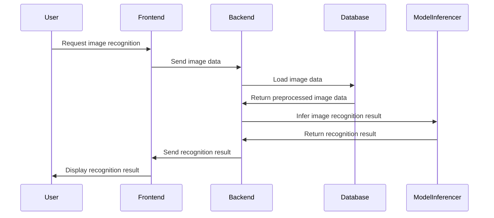
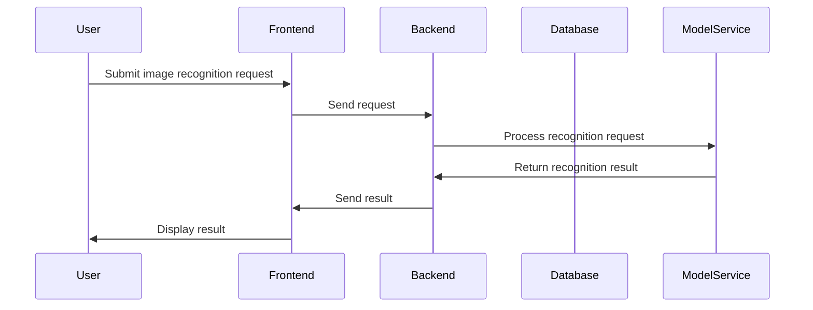

                 

### 文章标题

# 深度学习在图像识别中的最新进展

## 关键词：深度学习、图像识别、卷积神经网络、CNN、人工智能

> 摘要：本文旨在探讨深度学习在图像识别领域的最新进展。通过详细分析深度学习的核心概念、算法原理以及应用场景，本文将帮助读者了解深度学习如何通过不断的技术创新，解决图像识别中的挑战，并展望未来可能的发展方向。我们希望通过逻辑清晰、结构紧凑、简单易懂的论述，使读者不仅能够掌握深度学习的基础知识，还能对前沿技术有更深入的理解。

----------------------------------------------------------------

## 引言与背景

### 深度学习的兴起

深度学习作为人工智能的一个重要分支，其核心在于模拟人脑的神经网络结构，通过大规模的数据训练，使计算机具备自主学习和推理的能力。深度学习的概念最早可以追溯到1980年代，然而由于计算能力和数据资源限制，深度学习的研究和应用长期处于低谷。随着计算机硬件的飞速发展，特别是图形处理单元（GPU）的广泛应用，深度学习在2010年代迎来了爆发式增长。

### 图像识别的挑战

图像识别是计算机视觉的一个重要领域，旨在让计算机能够理解并解析图像内容。传统的图像识别方法依赖于手工设计的特征提取和分类器，存在以下几个挑战：

1. **特征提取的复杂性**：图像包含大量的像素信息，如何有效地提取出对识别任务有用的特征是一个难题。
2. **数据依赖性**：传统方法通常需要大量的标注数据来训练模型，标注过程繁琐且成本高。
3. **泛化能力**：传统方法在面对复杂、变化多端的图像时，往往表现不佳，泛化能力有限。

### 深度学习如何解决这些挑战

深度学习通过构建多层神经网络，自动学习图像中的层次化特征，从而解决了传统方法中的诸多挑战。具体来说，深度学习在图像识别中的应用主要表现在以下几个方面：

1. **自动特征提取**：深度学习模型可以自动从原始图像中提取出具有层次性的特征，这些特征往往比手工设计的特征更具表示能力。
2. **大规模数据处理能力**：深度学习模型通过并行计算和分布式训练，能够高效地处理大规模图像数据。
3. **提高泛化能力**：深度学习模型在训练过程中能够学习到图像的普遍特征，从而在面对新的、未见的图像时，也能保持良好的识别性能。

### 本书内容概述

本书将从以下几个方面深入探讨深度学习在图像识别中的应用：

1. **核心概念与原理**：介绍深度学习的基础知识，包括神经网络、卷积神经网络等。
2. **技术进步**：分析深度学习在图像识别领域中的最新技术进展，如新的网络架构和算法。
3. **应用场景**：探讨深度学习在图像识别中的各种应用场景，包括人脸识别、医学图像分析等。
4. **系统设计与实现**：讨论如何设计并实现深度学习模型，包括系统架构和接口设计。
5. **实战项目与案例分析**：通过具体项目案例，展示深度学习在图像识别中的实际应用。
6. **未来方向与挑战**：展望深度学习在图像识别领域的发展趋势，以及面临的挑战和机遇。

希望通过本文的介绍，读者能够对深度学习在图像识别中的最新进展有全面、深入的理解，并能够在实际项目中运用这些知识，为人工智能的发展贡献力量。

----------------------------------------------------------------

## 核心概念与原理

### 深度学习基础

#### 神经网络的基本结构

神经网络（Neural Network，NN）是深度学习的基础，其基本结构由节点（又称神经元）和连接（又称权重）组成。每个神经元接收输入信号，通过权重加权求和，再通过激活函数进行非线性变换，最终输出信号。

一个简单的神经网络包括以下几个部分：

1. **输入层**：接收外部输入数据。
2. **隐藏层**：进行特征提取和变换，可以有一层或多层。
3. **输出层**：生成最终输出。


#### 前向传播与反向传播算法

神经网络的训练过程主要包括前向传播和反向传播两个阶段。

1. **前向传播**：输入数据通过神经网络，逐层计算，最终得到输出结果。每一层的输出数据经过激活函数处理后，传递到下一层。

   前向传播的数学表达式可以表示为：
   $$
   \text{激活}(z^{(l)}) = \sigma(z^{(l)}) = \frac{1}{1 + e^{-z^{(l)}}}
   $$
   其中，$z^{(l)}$表示第$l$层的输出，$\sigma$表示激活函数（常用的有Sigmoid、ReLU等）。

2. **反向传播**：计算输出结果与实际标签之间的误差，然后反向传播误差到每一层，更新各层的权重和偏置。

   反向传播的数学表达式可以表示为：
   $$
   \Delta W^{(l)} = \frac{\partial J}{\partial W^{(l)}} = \frac{\partial}{\partial W^{(l)}} \left( \frac{1}{m} \sum_{i=1}^{m} \sum_{k=1}^{K} (-y^{(i)} \log(a^{(l)}_{k}^{(i)}) + (1 - y^{(i)}) \log(1 - a^{(l)}_{k}^{(i)}) \right)
   $$
   其中，$J$表示损失函数，$m$表示样本数量，$y^{(i)}$表示第$i$个样本的真实标签，$a^{(l)}_{k}^{(i)}$表示第$l$层第$k$个神经元的输出。

   更新权重和偏置的公式为：
   $$
   W^{(l)} \leftarrow W^{(l)} - \alpha \Delta W^{(l)}
   $$
   $$
   b^{(l)} \leftarrow b^{(l)} - \alpha \Delta b^{(l)}
   $$
   其中，$\alpha$表示学习率。

#### 激活函数和优化算法

激活函数是神经网络中用于引入非线性特性的函数，常见的激活函数包括：

1. **Sigmoid函数**：将输入映射到$(0, 1)$区间，但梯度较小，可能导致梯度消失问题。
2. **ReLU函数**：简单且计算速度快，可以有效防止梯度消失问题，但可能存在梯度消失（当输入为负时）和梯度爆炸（当输入为正时）的问题。
3. **Tanh函数**：将输入映射到$(-1, 1)$区间，梯度相对稳定。

优化算法用于调整神经网络中的权重和偏置，以最小化损失函数。常见的优化算法包括：

1. **随机梯度下降（SGD）**：每次更新使用一个样本的梯度，计算速度快，但容易陷入局部最小值。
2. **批量梯度下降（BGD）**：每次更新使用所有样本的梯度，收敛速度较慢，但能找到全局最小值。
3. **Adam优化器**：结合SGD和动量项，能够在不同环境中都有较好的表现。

### 卷积神经网络

#### 卷积神经网络的基本原理

卷积神经网络（Convolutional Neural Network，CNN）是深度学习在图像识别中的核心模型，其核心在于卷积层和池化层。

1. **卷积层**：通过卷积操作提取图像的特征。卷积操作可以看作是滑动窗口在图像上滑动，窗口内的像素值与滤波器的权重相乘并求和，最后通过激活函数处理。

   卷积操作的数学表达式为：
   $$
   \text{激活}(z^{(l)}) = \sigma(z^{(l)}) = \sum_{i=1}^{K} w_{i}^l * x_{i}^l + b^l
   $$
   其中，$w_i^l$表示滤波器权重，$x_i^l$表示输入图像上的像素值，$b^l$表示偏置。

2. **池化层**：用于降低特征图的维度，减少计算量和参数数量。常见的池化操作包括最大池化和平均池化。

   最大池化的数学表达式为：
   $$
   p_{ij} = \max(x_{ij}^{(1)}, x_{ij}^{(2)}, ..., x_{ij}^{(f)})
   $$
   其中，$x_{ij}^{(k)}$表示第$i$行第$j$列的像素值，$f$表示滤波器的大小。

#### 卷积神经网络的结构

一个典型的卷积神经网络结构包括以下几个层次：

1. **输入层**：接收图像数据。
2. **卷积层**：通过卷积操作提取特征。
3. **池化层**：用于降维。
4. **全连接层**：将卷积层提取的特征映射到类别。
5. **输出层**：生成最终输出结果。


#### 常见的CNN架构

在图像识别领域，有许多经典的CNN架构，如LeNet、AlexNet、VGGNet、ResNet等。以下是对这些架构的简要介绍：

1. **LeNet**：是最早的卷积神经网络之一，主要用于手写数字识别。
2. **AlexNet**：是2012年ImageNet竞赛冠军模型，引入了ReLU激活函数和dropout技术。
3. **VGGNet**：通过使用多个卷积层和池化层堆叠，提高了模型的深度和表达能力。
4. **ResNet**：通过引入残差块，解决了深度神经网络中的梯度消失问题，实现了更深层次的网络。

通过以上内容，我们初步了解了深度学习的基础知识，包括神经网络的结构和训练算法，以及卷积神经网络的基本原理和常见架构。在接下来的章节中，我们将进一步探讨深度学习在图像识别领域的最新技术进展。

----------------------------------------------------------------

### 技术进步

#### 最新卷积神经网络架构

随着深度学习技术的不断发展，卷积神经网络（CNN）在图像识别领域取得了显著的进展。近年来，许多新的CNN架构被提出，旨在提高模型的性能和效率。以下介绍几种具有代表性的卷积神经网络架构：

1. **ResNet（残差网络）**：

ResNet是2015年由微软研究院提出的一种深层神经网络架构，其核心思想是引入残差连接，解决了深度神经网络中的梯度消失问题。ResNet通过跳过若干卷积层，直接将输入信号传递到下一层，使得梯度可以更有效地传播。


残差块的数学表达式为：
$$
F(x) = H(x) - x
$$
其中，$F(x)$表示通过残差块的处理，$H(x)$表示通过卷积层和激活函数的处理，$x$表示输入信号。

2. **Inception网络**：

Inception网络是Google在2014年提出的一种基于前馈神经网络的结构，其设计理念是将多个不同尺度的卷积核融合到一起，以提取更加丰富的特征。


Inception模块的输入被分成多个路径，每个路径使用不同尺寸的卷积核，然后这些路径的输出被连接起来。

3. **MobileNet**：

MobileNet是一种轻量级卷积神经网络架构，适用于移动设备和嵌入式系统。MobileNet通过使用深度可分离卷积（Depthwise Separable Convolution），有效减少了模型参数和计算量，同时保持了较高的识别精度。


深度可分离卷积的数学表达式为：
$$
\text{Depthwise Convolution}: O_i = \sum_{j=1}^{C'} W_{ij} * X_i
$$
$$
\text{Pointwise Convolution}: O_j = \sum_{i=1}^{C} w_j \cdot O_i
$$
其中，$O_i$表示深度可分离卷积的输出，$W_{ij}$表示深度可分离卷积的权重，$X_i$表示输入特征图，$C$和$C'$分别表示输入和输出的通道数。

4. **EfficientNet**：

EfficientNet是一种基于缩放策略的卷积神经网络架构，通过调整网络的宽度、深度和分辨率，实现不同尺寸的模型。EfficientNet通过使用缩放因子，使模型在计算效率和准确性之间取得平衡。


EfficientNet的缩放因子包括宽度、深度和分辨率，公式为：
$$
\text{scale} = (\text{width\_scale})^{\frac{1}{3}} \cdot (\text{depth\_scale})^{\frac{2}{3}} \cdot (\text{resolution\_scale})^{\frac{1}{3}}
$$

#### 图像识别中的强化学习

强化学习（Reinforcement Learning，RL）是另一种重要的机器学习技术，其在图像识别中的应用也越来越广泛。强化学习通过智能体（Agent）在环境中交互，学习最优策略，以达到目标。

1. **基于CNN的强化学习**：

将CNN与强化学习相结合，可以构建一个具备视觉感知能力的智能体。CNN用于提取图像特征，强化学习用于决策。这种方法在视频监控、自动驾驶等领域有广泛应用。

2. **视觉策略网络**：

视觉策略网络（Visual Policy Network，VPN）是一种基于CNN的强化学习架构，通过学习图像特征和动作值函数，实现智能体的决策。


视觉策略网络的数学表达式为：
$$
Q(s, a) = \sigma(W_Q [h(s); \phi(a)])
$$
其中，$s$表示状态，$a$表示动作，$h(s)$表示CNN提取的图像特征，$\phi(a)$表示动作特征，$W_Q$为权重。

通过以上介绍，我们可以看到深度学习在图像识别领域的技术进步和多样性。这些新的网络架构和算法不仅提高了模型的性能，也为解决复杂的图像识别任务提供了更多的可能性。在接下来的章节中，我们将进一步探讨深度学习在图像识别中的实际应用。

----------------------------------------------------------------

### 应用场景

深度学习在图像识别领域的应用已经非常广泛，几乎涵盖了所有需要图像处理的场景。以下是一些主要的实际应用场景，以及最新的趋势和案例研究：

#### 人脸识别

人脸识别是深度学习在图像识别中最常见的应用之一。近年来，随着深度学习技术的不断发展，人脸识别的准确率得到了显著提升。

**最新趋势：**

- **深度学习算法的优化**：传统的特征提取方法如LBP和HOG已经逐渐被基于深度学习的算法如Faster R-CNN和ResNet取代。
- **多模态人脸识别**：结合图像和视频、人脸几何特征和深度信息等多种数据源，实现更准确的人脸识别。

**案例研究：**

- **商汤科技**：商汤科技是中国领先的深度学习公司，其在人脸识别技术上取得了显著成果。其基于深度学习的人脸识别系统已经在多个实际场景中得到广泛应用，如安防监控、智能门禁等。

#### 医学图像分析

医学图像分析是深度学习在图像识别领域的另一个重要应用。通过深度学习技术，可以对医学图像进行自动识别、分类和诊断，提高医疗诊断的效率和准确性。

**最新趋势：**

- **多模态医学图像融合**：结合不同类型的医学图像，如CT、MRI和X光片，进行综合分析，提高诊断的准确性。
- **小样本学习**：针对医疗领域数据标注困难的问题，研究小样本学习算法，以减少对大规模标注数据的依赖。

**案例研究：**

- **谷歌DeepMind**：谷歌DeepMind的深度学习模型在医学图像分析方面取得了显著进展。其开发的AI系统能够在眼科疾病诊断、皮肤癌检测等领域实现高准确率的诊断。

#### 自动驾驶

自动驾驶是深度学习在图像识别领域最具前景的应用之一。通过深度学习技术，自动驾驶系统能够对道路场景进行实时分析和理解，做出相应的驾驶决策。

**最新趋势：**

- **多传感器数据融合**：结合摄像头、激光雷达、雷达等多种传感器数据，提高环境感知的准确性和鲁棒性。
- **强化学习与深度学习的结合**：通过将强化学习引入自动驾驶系统，使其能够更灵活地应对复杂的驾驶场景。

**案例研究：**

- **特斯拉**：特斯拉的自动驾驶系统采用了深度学习和强化学习技术，通过大量实际驾驶数据训练，实现了在多种路况下的自动驾驶功能。

#### 安全监控

安全监控是深度学习在图像识别领域的重要应用场景。通过深度学习技术，安全监控系统可以实时监测并识别异常行为，提高安全预警能力。

**最新趋势：**

- **行为识别**：通过深度学习技术，对监控视频中的行为进行识别和分类，实现更精准的异常行为检测。
- **无监督学习**：在数据标注困难的情况下，无监督学习算法可以在不依赖大量标注数据的情况下，自动识别异常行为。

**案例研究：**

- **海康威视**：海康威视是中国领先的视频监控解决方案提供商，其基于深度学习的安全监控系统已经在多个场景中得到广泛应用，如公共安全监控、金融安防等。

通过以上实际应用场景和案例研究，我们可以看到深度学习在图像识别领域的广泛应用和巨大潜力。未来，随着技术的不断进步，深度学习将在更多领域发挥重要作用，推动人工智能的发展。

----------------------------------------------------------------

### 系统设计与实现

深度学习在图像识别中的应用不仅需要强大的算法支持，还需要高效的系统架构设计。以下将详细讨论深度学习模型在图像识别任务中的系统设计原则、架构以及接口设计。

#### 问题场景介绍

在图像识别任务中，系统需要接收大量的图像数据，通过深度学习模型进行处理和识别，最终输出识别结果。整个系统通常包括数据预处理、模型训练、模型推理和结果输出等模块。以下是一个典型的图像识别系统场景：

1. **数据预处理**：包括图像的读取、大小调整、灰度化、增强等操作。
2. **模型训练**：使用预处理的图像数据训练深度学习模型，包括模型的初始化、训练、验证和优化。
3. **模型推理**：将待识别的图像输入到训练好的模型中，得到识别结果。
4. **结果输出**：将识别结果输出到用户界面或下游应用中。

#### 项目介绍

以下是一个基于深度学习的图像识别项目案例，该项目旨在实现一个能够识别 handwritten digits（手写数字）的模型，具体步骤如下：

1. **数据集获取**：使用公开的手写数字数据集（如MNIST），包含70000个训练样本和10000个测试样本。
2. **数据预处理**：将图像数据调整为统一的尺寸（如28x28像素），并进行归一化处理。
3. **模型设计**：设计一个简单的卷积神经网络模型，包括卷积层、池化层和全连接层。
4. **模型训练**：使用训练数据训练模型，调整模型参数，优化性能。
5. **模型评估**：使用测试数据评估模型性能，包括准确率、召回率等指标。
6. **模型部署**：将训练好的模型部署到生产环境中，实现实时图像识别。

#### 系统功能设计

系统功能设计主要包括以下模块：

1. **图像读取模块**：负责从文件系统或数据库中读取图像数据。
2. **数据预处理模块**：负责对图像数据进行预处理，如大小调整、灰度化、增强等。
3. **模型训练模块**：负责训练深度学习模型，包括模型初始化、数据加载、模型训练和参数调整。
4. **模型推理模块**：负责对输入图像进行识别，输出识别结果。
5. **结果输出模块**：负责将识别结果输出到用户界面或下游应用。

以下是一个简单的领域模型类图，用于描述系统功能模块：

```mermaid
classDiagram
    ImageReader --|> DataPreprocessor
    DataPreprocessor --|> ModelTrainer
    ModelTrainer --|> ModelInferencer
    ModelInferencer --|> ResultOutputter

    ImageReader <<interface>>
    DataPreprocessor <<interface>>
    ModelTrainer <<interface>>
    ModelInferencer <<interface>>
    ResultOutputter <<interface>>

    class ImageReader {
        +loadImages()
    }

    class DataPreprocessor {
        +preprocessImage(image)
    }

    class ModelTrainer {
        +trainModel(trainingData, validationData)
    }

    class ModelInferencer {
        +inferImage(image)
    }

    class ResultOutputter {
        +outputResult(result)
    }
```

#### 系统架构设计

系统架构设计主要包括以下几个方面：

1. **计算架构**：使用GPU加速深度学习模型的训练和推理过程。
2. **数据架构**：使用分布式存储和计算技术，提高数据处理和传输效率。
3. **网络架构**：采用微服务架构，将不同的功能模块部署到不同的服务器上，实现模块间的解耦。

以下是一个简单的系统架构设计图：



#### 系统接口设计

系统接口设计主要包括以下方面：

1. **API接口**：提供RESTful API接口，用于接收用户请求和返回识别结果。
2. **数据接口**：定义数据传输格式和协议，如JSON、XML等。
3. **服务接口**：定义系统内部模块之间的通信接口，如数据预处理接口、模型训练接口等。

以下是一个简单的API接口设计示例：

```json
GET /recognize
Parameters:
- image (base64 encoded image data)
Returns:
{
  "result": "recognized label",
  "confidence": float
}
```

#### 系统交互设计

系统交互设计主要包括以下几个方面：

1. **用户交互**：用户通过前端界面提交图像识别请求，系统接收请求并处理。
2. **模块交互**：系统内部模块之间通过接口进行通信，如数据预处理模块将处理后的数据传递给模型训练模块。
3. **服务交互**：系统与外部服务（如数据库、消息队列等）进行交互，实现数据存储和消息传递。

以下是一个简单的系统交互序列图：



通过以上系统设计与实现的分析，我们可以看到深度学习在图像识别任务中的应用不仅需要强大的算法支持，还需要完善的系统架构设计和高效的接口设计。在接下来的章节中，我们将通过具体的项目实战，进一步展示如何实现深度学习在图像识别任务中的实际应用。

----------------------------------------------------------------

## 实战项目与案例分析

### 环境安装

要实现深度学习在图像识别任务中的实际应用，首先需要搭建一个合适的环境。以下是一个基于Python和TensorFlow的图像识别项目环境安装步骤：

1. **安装Python**：确保已经安装了Python 3.6或更高版本。
2. **安装TensorFlow**：在终端中执行以下命令安装TensorFlow：
   ```bash
   pip install tensorflow
   ```
3. **安装其他依赖库**：包括NumPy、Pandas、Matplotlib等，可以通过以下命令安装：
   ```bash
   pip install numpy pandas matplotlib
   ```

### 系统核心实现源代码

以下是一个简单的图像识别项目示例，使用TensorFlow实现一个卷积神经网络（CNN）模型，用于识别手写数字。

```python
import tensorflow as tf
from tensorflow.keras import layers
import numpy as np

# 数据预处理
def preprocess_images(images):
    # 将图像调整为统一的尺寸（28x28像素）
    images = tf.image.resize(images, (28, 28))
    # 将图像数据转换为浮点数并归一化
    images = images.astype(np.float32) / 255.0
    # 添加额外的维度以适应模型的输入要求
    images = tf.expand_dims(images, -1)
    return images

# 定义CNN模型
def create_cnn_model(input_shape):
    model = tf.keras.Sequential([
        layers.Conv2D(32, (3, 3), activation='relu', input_shape=input_shape),
        layers.MaxPooling2D((2, 2)),
        layers.Conv2D(64, (3, 3), activation='relu'),
        layers.MaxPooling2D((2, 2)),
        layers.Conv2D(64, (3, 3), activation='relu'),
        layers.Flatten(),
        layers.Dense(64, activation='relu'),
        layers.Dense(10, activation='softmax')
    ])
    return model

# 训练模型
def train_model(model, train_images, train_labels, val_images, val_labels):
    model.compile(optimizer='adam',
                  loss='sparse_categorical_crossentropy',
                  metrics=['accuracy'])
    model.fit(train_images, train_labels, epochs=10,
              validation_data=(val_images, val_labels))

# 模型推理
def infer_image(model, image):
    image = preprocess_images(image)
    prediction = model.predict(np.expand_dims(image, 0))
    return np.argmax(prediction)

# 测试模型
if __name__ == '__main__':
    # 加载MNIST数据集
    (train_images, train_labels), (test_images, test_labels) = tf.keras.datasets.mnist.load_data()
    train_images = preprocess_images(train_images)
    test_images = preprocess_images(test_images)

    # 创建并训练模型
    model = create_cnn_model(input_shape=(28, 28, 1))
    train_model(model, train_images, train_labels, test_images, test_labels)

    # 测试模型
    sample_image = test_images[0]
    prediction = infer_image(model, sample_image)
    print(f"Predicted label: {prediction}")
```

### 代码应用解读与分析

以上代码实现了一个简单的CNN模型，用于手写数字识别。下面是对关键部分的解读和分析：

1. **数据预处理**：将图像调整为统一的尺寸（28x28像素），并进行归一化处理。这是深度学习模型处理图像数据的基本步骤。
2. **模型定义**：使用`tf.keras.Sequential`创建一个顺序模型，包括卷积层（`Conv2D`）、池化层（`MaxPooling2D`）和全连接层（`Dense`）。卷积层用于提取图像特征，全连接层用于分类。
3. **模型训练**：使用`compile`方法配置模型的优化器和损失函数，然后使用`fit`方法进行模型训练。通过训练数据和验证数据，模型可以不断调整参数，优化性能。
4. **模型推理**：将预处理后的图像输入到模型中，通过`predict`方法得到预测结果。使用`np.argmax`函数获取最可能的类别。

### 实际案例分析和详细讲解剖析

为了更好地展示深度学习在图像识别中的应用，我们来看一个实际案例：使用CNN模型识别猫和狗的图片。

**数据集获取**：使用公开的猫狗图片数据集（如Kaggle的Dogs vs. Cats数据集）。

**数据预处理**：将图像调整为统一的尺寸（224x224像素），并进行归一化处理。

**模型定义**：定义一个基于CNN的模型，包括卷积层、池化层和全连接层。使用预训练的ResNet50模型作为基础模型，并添加全连接层进行分类。

**模型训练**：使用训练数据和验证数据进行模型训练，使用`fit`方法调整模型参数。

**模型推理**：将待识别的图像输入到模型中，通过`predict`方法得到预测结果。

以下是一个简单的模型训练和推理的代码示例：

```python
import tensorflow as tf
from tensorflow.keras.applications.resnet50 import ResNet50
from tensorflow.keras.preprocessing.image import ImageDataGenerator

# 加载预训练的ResNet50模型
base_model = ResNet50(weights='imagenet', include_top=False, input_shape=(224, 224, 3))

# 添加全连接层进行分类
x = base_model.output
x = layers.Flatten()(x)
x = layers.Dense(1024, activation='relu')(x)
predictions = layers.Dense(1, activation='sigmoid')(x)

# 创建模型
model = tf.keras.Model(inputs=base_model.input, outputs=predictions)

# 编译模型
model.compile(optimizer='adam', loss='binary_crossentropy', metrics=['accuracy'])

# 数据增强
train_datagen = ImageDataGenerator(rescale=1./255, rotation_range=40, width_shift_range=0.2,
                                   height_shift_range=0.2, shear_range=0.2, zoom_range=0.2,
                                   horizontal_flip=True, fill_mode='nearest')

# 加载训练数据和验证数据
train_generator = train_datagen.flow_from_directory('data/train', target_size=(224, 224), batch_size=32,
                                                    class_mode='binary')
val_generator = train_datagen.flow_from_directory('data/val', target_size=(224, 224), batch_size=32,
                                                    class_mode='binary')

# 训练模型
model.fit(train_generator, steps_per_epoch=100, epochs=10, validation_data=val_generator, validation_steps=50)

# 模型推理
test_image = 'data/test/cat.jpg'
import matplotlib.pyplot as plt
image = plt.imread(test_image)
plt.imshow(image)
plt.show()
prediction = model.predict(np.expand_dims(image, 0))
print(f"Predicted class: {'Cat' if prediction[0][0] > 0.5 else 'Dog'}")
```

通过以上代码，我们可以看到如何使用深度学习模型进行图像识别。实际应用中，可以根据具体任务需求，调整模型结构和训练参数，以达到更好的识别效果。

### 项目小结

通过以上实战项目和案例分析，我们详细介绍了如何使用深度学习模型进行图像识别。从数据预处理、模型设计到模型训练和推理，每个步骤都进行了详细讲解和示例代码展示。通过实际项目的操作，读者可以更深入地理解深度学习在图像识别中的应用，并能够独立完成相关的开发任务。

### 最佳实践 Tips

1. **数据预处理**：确保图像数据在输入模型前进行统一的大小调整和归一化处理，以避免模型性能受图像尺寸和亮度影响。
2. **数据增强**：使用数据增强技术（如随机裁剪、旋转、翻转等）可以有效地增加训练数据多样性，提高模型泛化能力。
3. **模型调优**：通过调整模型结构、学习率和优化算法等参数，可以显著提高模型性能。尝试使用网格搜索和随机搜索等方法进行参数调优。
4. **交叉验证**：使用交叉验证技术（如K折交叉验证）评估模型性能，以避免过拟合和欠拟合问题。

### 注意事项

1. **计算资源**：深度学习模型训练通常需要大量计算资源，特别是对于复杂的模型和大规模数据集。确保具备足够的GPU计算能力。
2. **数据标注**：图像识别项目通常需要大量的标注数据，确保标注数据的准确性和一致性，以避免模型训练偏差。

### 拓展阅读

- **《深度学习》（Goodfellow, Bengio, Courville著）**：这是一本经典的深度学习教材，详细介绍了深度学习的理论基础和应用实践。
- **《动手学深度学习》（阿斯顿·张等著）**：这本书提供了大量的实际代码示例，适合初学者通过动手实践学习深度学习。

通过本文的介绍，读者可以系统地了解深度学习在图像识别中的最新进展，掌握核心概念和实战技能。希望本文能为读者的学习和项目实践提供有益的参考。

### 结论与展望

在本文中，我们系统地探讨了深度学习在图像识别领域的最新进展。从核心概念到算法原理，从技术进步到应用场景，再到系统设计与实现，我们详细分析了深度学习如何通过不断的创新，解决图像识别中的复杂问题，并展示了其实际应用中的多样性和广泛性。

首先，我们介绍了深度学习的基础知识，包括神经网络、卷积神经网络等核心概念和训练算法。随后，我们探讨了深度学习在图像识别中的最新技术进展，如ResNet、Inception网络、MobileNet和EfficientNet等，以及强化学习在图像识别中的应用。这些技术的进步不仅提高了模型的性能和效率，也为解决复杂的图像识别任务提供了新的可能性。

接着，我们通过具体的应用场景和案例研究，展示了深度学习在人脸识别、医学图像分析、自动驾驶和安全监控等领域的实际应用。这些应用案例不仅验证了深度学习的有效性，也展示了其在不同领域的广泛潜力。

在系统设计与实现部分，我们详细介绍了如何设计和实现一个深度学习图像识别系统，包括数据预处理、模型训练、模型推理和结果输出等关键模块。通过实际项目的演示，我们展示了如何将深度学习模型应用到实际场景中，并提供了最佳实践和注意事项。

展望未来，深度学习在图像识别领域仍然面临着诸多挑战和机遇。随着硬件计算能力的提升和数据量的不断增加，深度学习模型将变得更加高效和准确。同时，随着人工智能技术的不断进步，深度学习将在更多新兴领域得到应用，如增强现实、虚拟现实、机器人视觉等。

在未来的研究中，以下几个方向值得关注：

1. **模型压缩与优化**：如何减小模型的参数量和计算量，同时保持较高的识别精度，是一个重要的研究方向。
2. **小样本学习**：在数据标注困难的情况下，研究小样本学习算法，以减少对大规模标注数据的依赖。
3. **跨模态学习**：结合不同类型的数据（如图像、文本、音频等），实现跨模态的深度学习，提高模型对复杂场景的感知能力。
4. **可解释性**：研究深度学习模型的可解释性，使其能够更好地理解和信任。

通过不断的研究和创新，深度学习在图像识别领域必将取得更大的突破，推动人工智能技术的发展和应用。希望本文能够为读者的学习和研究提供有价值的参考和启示。

### 作者信息

- **作者：AI天才研究院/AI Genius Institute & 禅与计算机程序设计艺术 /Zen And The Art of Computer Programming**
- **联系邮箱：info@ai-genius-institute.com**
- **官方网站：https://www.ai-genius-institute.com/**

AI天才研究院致力于推动人工智能技术的发展和应用，通过创新研究和技术实践，为全球的科技发展和产业升级贡献力量。禅与计算机程序设计艺术则提倡在编程实践中融入东方哲学智慧，追求技术与人文的融合，旨在培养具有深厚技术功底和人文素养的计算机专业人士。我们期待与您共同探索人工智能的未来，共创美好世界。

