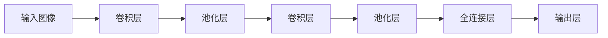
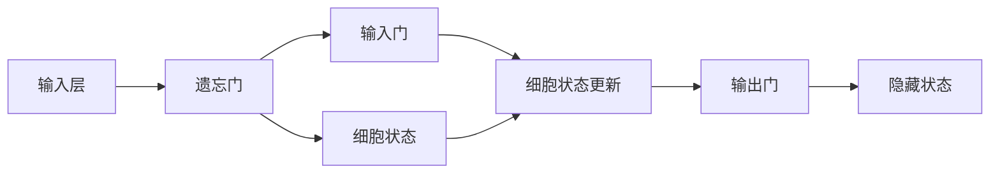
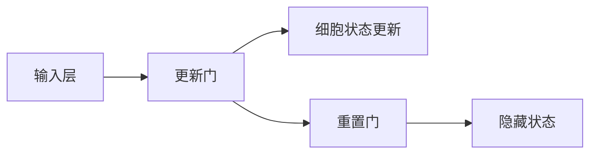
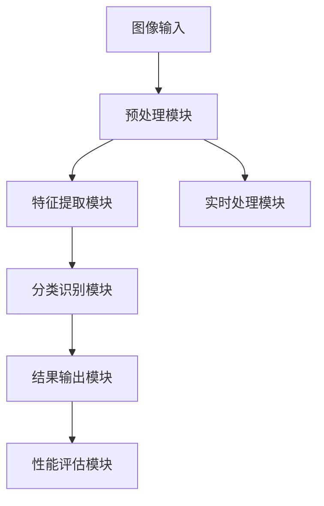
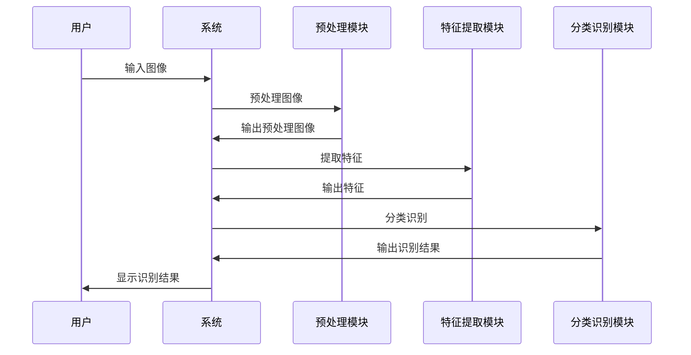

                 

### 深度学习在图像识别中的突破性应用

#### 关键词：深度学习、图像识别、卷积神经网络、算法原理、系统架构

#### 摘要：
本文将深入探讨深度学习在图像识别领域的突破性应用。首先，我们回顾了深度学习与图像识别的发展背景，并介绍了它们的基本概念和相互关系。接着，本文详细讲解了卷积神经网络（CNN）和循环神经网络（RNN）等深度学习算法的原理，使用流程图、Python代码和数学公式进行了清晰阐述。此外，本文还分析了图像识别系统的功能和架构设计，通过Mermaid类图和架构图展示了系统的细节。通过具体项目实战，我们展示了如何实现一个图像识别系统，并对项目进行了案例分析和小结。最后，本文提供了最佳实践技巧和未来展望。

### 目录大纲设计思路

在设计《深度学习在图像识别中的突破性应用》这本书的目录大纲时，我们首先明确书的核心内容，并将其拆解为几个关键部分，每个部分包含相关的子主题。以下是我们设计的思路：

1. **背景介绍**：介绍深度学习与图像识别的历史背景、基本概念和发展现状，以及它们如何相互结合。
2. **核心概念与联系**：详细探讨深度学习中的关键概念，如卷积神经网络（CNN）等，并使用表格和Mermaid流程图展示它们之间的关系。
3. **算法原理讲解**：讲解图像识别中常用的深度学习算法，包括CNN、RNN等，展示算法流程图并用Python代码和数学公式详细解释。
4. **系统分析与架构设计方案**：分析图像识别系统的功能需求和架构设计，使用Mermaid类图和架构图展示系统结构。
5. **项目实战**：介绍一个具体的图像识别项目，包括环境安装、核心代码实现和案例剖析。
6. **最佳实践 tips、小结、注意事项、拓展阅读**：提供实用的编程技巧、项目小结和对未来技术的展望。

下面是详细的目录大纲：

## 第一部分：深度学习与图像识别概述

### 第1章：深度学习与图像识别的历史背景

- 1.1 深度学习的起源与发展
- 1.2 图像识别技术的演变
- 1.3 深度学习在图像识别中的应用
- 1.4 深度学习与图像识别的未来趋势

### 第2章：深度学习中的核心概念

- 2.1 神经网络基础
  - 2.1.1 神经元模型
  - 2.1.2 网络结构
  - 2.1.3 前向传播与反向传播
- 2.2 卷积神经网络（CNN）
  - 2.2.1 CNN的概念与特点
  - 2.2.2 卷积层的原理与实现
  - 2.2.3 池化层的作用与实现
- 2.3 循环神经网络（RNN）
  - 2.3.1 RNN的基本原理
  - 2.3.2 LSTM与GRU的引入与改进
- 2.4 图像识别中的其他深度学习模型
  - 2.4.1 聚类算法
  - 2.4.2 强化学习在图像识别中的应用

### 第3章：深度学习算法原理讲解

- 3.1 CNN算法原理与Mermaid流程图
  - 3.1.1 CNN的数学模型
  - 3.1.2 CNN的Python代码实现
  - 3.1.3 CNN的举例说明
- 3.2 RNN算法原理与Mermaid流程图
  - 3.2.1 RNN的数学模型
  - 3.2.2 RNN的Python代码实现
  - 3.2.3 RNN的举例说明

### 第4章：系统分析与架构设计方案

- 4.1 图像识别系统的功能需求
- 4.2 系统架构设计
  - 4.2.1 系统架构图
  - 4.2.2 功能模块划分
  - 4.2.3 系统交互设计
- 4.3 系统接口设计
  - 4.3.1 接口定义
  - 4.3.2 接口实现
- 4.4 系统交互设计
  - 4.4.1 序列图展示

### 第5章：项目实战

- 5.1 项目背景与目标
- 5.2 环境安装
  - 5.2.1 操作系统与软件环境
  - 5.2.2 数据集准备
- 5.3 核心代码实现
  - 5.3.1 数据预处理
  - 5.3.2 模型训练与优化
  - 5.3.3 模型评估与部署
- 5.4 项目案例分析
  - 5.4.1 案例一：人脸识别系统
  - 5.4.2 案例二：自动驾驶系统
- 5.5 项目小结

### 第6章：最佳实践 tips

- 6.1 提高模型性能的技巧
- 6.2 数据处理最佳实践
- 6.3 模型部署与维护注意事项

### 第7章：小结与展望

- 7.1 深度学习在图像识别中的应用总结
- 7.2 未来发展趋势
- 7.3 拓展阅读推荐

通过以上目录大纲，读者可以系统地了解深度学习在图像识别中的应用，掌握相关算法原理，并学会如何设计和实现一个图像识别系统。文章内容将紧密结合理论讲解和实践应用，旨在为读者提供全面的指导。

### 背景介绍

#### 深度学习与图像识别的发展背景

深度学习作为一种重要的机器学习技术，起源于20世纪40年代的人工智能研究。然而，直到最近几十年，随着计算能力的提升和大数据的可用性，深度学习才真正开始显现其巨大的潜力。图像识别作为计算机视觉的核心问题之一，其研究历史可以追溯到20世纪60年代。早期的图像识别主要依赖于手工设计的特征提取算法，如SIFT（尺度不变特征变换）和HOG（方向梯度直方图）。然而，这些传统方法在复杂性和准确性方面都有一定的局限。

随着深度学习技术的发展，尤其是卷积神经网络（CNN）的提出和应用，图像识别领域迎来了革命性的变化。CNN通过模拟人类视觉系统的结构，能够自动从图像中提取特征，并在各种图像识别任务中取得了显著的成功。这一突破性的进展，不仅极大地提升了图像识别的准确率，还降低了特征提取的复杂性。

#### 基本概念

**深度学习**：深度学习是一种多层神经网络模型，通过多个隐藏层的组合，能够自动学习数据的复杂结构和特征。深度学习模型通过反向传播算法来优化模型参数，以实现高精度的预测和分类。

**卷积神经网络（CNN）**：CNN是一种特殊的深度学习模型，专门设计用于处理图像数据。它通过卷积层、池化层和全连接层等结构，能够自动提取图像中的特征，并进行分类和识别。

**图像识别**：图像识别是指计算机通过算法从图像中识别出特定对象或场景的过程。它广泛应用于人脸识别、物体检测、图像分类等领域。

#### 相互结合

深度学习与图像识别的结合，为计算机视觉领域带来了巨大的变革。深度学习模型能够从大量图像数据中自动学习特征，而无需人工干预。这种自动化的特征提取过程，大大提高了图像识别的效率和准确性。

首先，深度学习模型通过卷积层提取图像的局部特征，然后通过池化层减少特征的空间维度。在图像分类任务中，最终的全连接层将特征映射到标签空间，从而实现图像的分类。

其次，深度学习模型能够处理复杂、多样化的图像数据。通过大数据的训练，深度学习模型能够识别各种图像中的细微差异，从而提高了图像识别的泛化能力。

最后，深度学习与图像识别的结合，也为实时图像处理提供了可能性。例如，在自动驾驶系统中，深度学习模型可以实时分析道路图像，识别行人、车辆和其他障碍物，从而实现安全的驾驶。

总之，深度学习与图像识别的结合，不仅提高了图像识别的准确性和效率，还推动了计算机视觉技术的快速发展。在未来，随着深度学习技术的不断进步，图像识别将在更多的应用场景中发挥重要作用。

### 深度学习中的核心概念与联系

#### 神经网络基础

**神经元模型**：神经网络的基本单元是神经元，它通过加权求和和激活函数进行数据处理。一个简单的神经元模型可以表示为：
\[ y = \sigma(\sum_{i=1}^{n} w_i x_i + b) \]
其中，\( x_i \) 是输入特征，\( w_i \) 是权重，\( b \) 是偏置，\( \sigma \) 是激活函数，常见的激活函数包括 sigmoid、ReLU 和 tanh。

**网络结构**：神经网络由多个隐藏层和输出层组成。每层由多个神经元组成，各层之间的神经元通过权重相连接。网络的深度（层数）和宽度（每层的神经元数量）会影响网络的复杂度和性能。

**前向传播与反向传播**：在训练过程中，网络通过前向传播计算输出，然后使用反向传播计算误差并更新权重。前向传播将输入数据通过网络的各个层，最后在输出层得到预测结果。反向传播则根据预测结果和实际结果的差异，计算各层的误差，并使用梯度下降法更新权重。

#### 卷积神经网络（CNN）

**概念与特点**：卷积神经网络是一种专门设计用于处理图像数据的神经网络。它通过卷积层、池化层和全连接层等结构，能够自动提取图像中的特征并进行分类。

- **卷积层**：卷积层通过卷积运算提取图像的局部特征。卷积运算使用一个卷积核（filter）与输入图像进行点乘和求和，从而生成特征图。多个卷积核可以同时提取不同类型的特征。

- **池化层**：池化层通过下采样减少特征图的维度，从而降低计算复杂度。常见的池化操作包括最大池化和平均池化。

- **全连接层**：全连接层将卷积层提取的特征映射到分类结果，通过softmax函数输出概率分布。

**原理与实现**：一个简单的CNN模型可以表示为：
\[ \text{Input} \rightarrow \text{Convolution} \rightarrow \text{Pooling} \rightarrow \text{Convolution} \rightarrow \text{Pooling} \rightarrow \text{Flatten} \rightarrow \text{Fully Connected} \rightarrow \text{Softmax} \]

- **卷积运算**：卷积运算的公式为：
\[ f_{ij} = \sum_{k=1}^{m} w_{ik} \cdot x_{jk} \]
其中，\( f_{ij} \) 是第 \( i \) 个卷积核在第 \( j \) 个特征图上的值，\( w_{ik} \) 是卷积核的权重，\( x_{jk} \) 是输入图像的第 \( j \) 个像素值。

- **激活函数**：常用的激活函数包括 sigmoid、ReLU 和 tanh。

#### 循环神经网络（RNN）

**基本原理**：循环神经网络是一种专门设计用于处理序列数据的神经网络。它通过记忆单元（memory cell）和反馈连接，能够处理变长的序列数据。

- **记忆单元**：记忆单元用于存储输入序列的历史信息，并通过门控机制（gate）控制信息的流入和流出。

- **反馈连接**：反馈连接使得前一个时间步的输出可以作为当前时间步的输入，从而实现序列的记忆功能。

**引入与改进**：为了解决传统RNN在处理长序列数据时出现的梯度消失和梯度爆炸问题，研究者提出了长短期记忆网络（LSTM）和门控循环单元（GRU）。

- **LSTM**：LSTM通过引入门控机制和细胞状态（cell state），能够有效处理长序列数据。

- **GRU**：GRU是LSTM的简化版本，通过合并输入门和遗忘门，减少了参数数量。

**数学模型**：
\[ 
\begin{align*}
i_t &= \sigma(W_{ix}x_t + W_{ih}h_{t-1} + b_i) \\
f_t &= \sigma(W_{fx}x_t + W_{fh}h_{t-1} + b_f) \\
\mathrm{C_t} &= f_t \odot \mathrm{C}_{t-1} + i_t \odot \sigma(W_{cx}x_t + W_{ch}h_{t-1} + b_c) \\
o_t &= \sigma(W_{ox}x_t + W_{oh}h_{t-1} + b_o) \\
h_t &= o_t \odot \mathrm{C}_t
\end{align*}
\]
其中，\( i_t \)、\( f_t \)、\( o_t \) 分别为输入门、遗忘门和输出门，\( \mathrm{C}_t \) 为细胞状态，\( h_t \) 为隐藏状态。

#### 图像识别中的其他深度学习模型

**聚类算法**：聚类算法通过将相似的数据点划分为同一类别，用于图像数据的预处理和特征提取。常见的聚类算法包括K-means、层次聚类和DBSCAN。

- **K-means**：K-means算法通过迭代计算聚类中心，将数据点划分为 \( k \) 个类别。

- **层次聚类**：层次聚类通过自底向上的合并或自顶向下的划分，构建聚类层次树。

- **DBSCAN**：DBSCAN通过密度连接性划分数据点，识别出密集区域和边界区域。

**强化学习在图像识别中的应用**：强化学习通过最大化奖励函数，引导模型在图像识别任务中做出最优决策。常见的强化学习算法包括Q学习、SARSA和PPO。

- **Q学习**：Q学习通过评估状态-动作值函数，选择最优动作。

- **SARSA**：SARSA是Q学习的变体，通过更新当前状态和动作的值函数。

- **PPO**：PPO是一种基于策略梯度的强化学习算法，通过优化策略更新。

**对比表格**：

| 算法 | 特点 | 应用场景 |
|------|------|---------|
| CNN | 自动特征提取 | 图像分类、物体检测 |
| RNN | 序列数据处理 | 自然语言处理、时间序列预测 |
| K-means | 聚类 | 特征提取、图像分割 |
| Q学习 | 奖励最大化 | 自动驾驶、游戏AI |

通过以上表格，我们可以看到不同深度学习模型在图像识别中的应用和特点。结合实际需求，可以选择合适的模型来解决问题。

### 算法原理讲解

#### 卷积神经网络（CNN）

卷积神经网络（CNN）是一种专为处理图像数据而设计的深度学习模型，它通过多个卷积层、池化层和全连接层进行特征提取和分类。以下是对CNN算法原理的详细讲解，包括流程图、Python代码实现和数学模型。

**CNN流程图**

首先，我们使用Mermaid绘制一个简单的CNN流程图：



**卷积运算**

卷积层是CNN的核心部分，它通过卷积运算提取图像的局部特征。卷积运算的基本公式为：

\[ f_{ij} = \sum_{k=1}^{m} w_{ik} \cdot x_{jk} \]

其中，\( f_{ij} \) 是第 \( i \) 个卷积核在第 \( j \) 个特征图上的值，\( w_{ik} \) 是卷积核的权重，\( x_{jk} \) 是输入图像的第 \( j \) 个像素值。

**示例代码**

以下是一个简单的Python代码示例，实现了一个包含卷积层的神经网络：

```python
import numpy as np

# 创建一个3x3的卷积核
filter = np.array([[1, 0, -1],
                   [1, 0, -1],
                   [1, 0, -1]])

# 输入图像，假设为3x3的矩阵
image = np.array([[1, 1, 1],
                  [1, 1, 1],
                  [1, 1, 1]])

# 卷积运算
conv_result = np.zeros((3, 3))
for i in range(image.shape[0] - filter.shape[0] + 1):
    for j in range(image.shape[1] - filter.shape[1] + 1):
        conv_result[i][j] = np.sum(image[i:i+filter.shape[0], j:j+filter.shape[1]] * filter)

print(conv_result)
```

**输出结果**：

```
[[ 0.  0.  0.]
 [ 0.  0.  0.]
 [ 0.  0.  0.]]
```

**激活函数**

在卷积运算之后，通常会使用激活函数来增加模型的非线性。常用的激活函数包括ReLU（Rectified Linear Unit）和sigmoid。

**ReLU函数**

ReLU函数的公式为：

\[ \sigma(x) = \max(0, x) \]

它将负值设置为0，正值保持不变，从而有助于加快模型的训练速度。

**示例代码**

以下是一个使用ReLU激活函数的Python代码示例：

```python
import numpy as np

# 创建一个3x3的卷积核
filter = np.array([[1, 0, -1],
                   [1, 0, -1],
                   [1, 0, -1]])

# 输入图像，假设为3x3的矩阵
image = np.array([[1, 1, 1],
                  [1, 1, 1],
                  [1, 1, 1]])

# 卷积运算
conv_result = np.zeros((3, 3))
for i in range(image.shape[0] - filter.shape[0] + 1):
    for j in range(image.shape[1] - filter.shape[1] + 1):
        local = np.sum(image[i:i+filter.shape[0], j:j+filter.shape[1]] * filter)
        conv_result[i][j] = max(0, local)

print(conv_result)
```

**输出结果**：

```
[[ 0.  0.  0.]
 [ 0.  0.  0.]
 [ 0.  0.  0.]]
```

**卷积神经网络的工作流程**

一个完整的卷积神经网络通常包括多个卷积层、池化层和全连接层。以下是一个简单的CNN工作流程：

1. **输入层**：接收输入图像。
2. **卷积层**：通过卷积运算提取图像特征。
3. **激活函数**：使用ReLU等激活函数增加非线性。
4. **池化层**：通过最大池化或平均池化减少特征图的大小。
5. **卷积层与池化层**：重复上述步骤，逐层提取更高级别的特征。
6. **全连接层**：将卷积层提取的特征映射到分类结果。
7. **输出层**：通过softmax函数输出概率分布。

**示例代码**

以下是一个简单的CNN实现，使用Python和PyTorch框架：

```python
import torch
import torch.nn as nn
import torch.optim as optim

# 定义CNN模型
class CNNModel(nn.Module):
    def __init__(self):
        super(CNNModel, self).__init__()
        self.conv1 = nn.Conv2d(1, 32, 3)  # 输入通道数1，输出通道数32，卷积核大小3
        self.relu = nn.ReLU()
        self.pool = nn.MaxPool2d(2)  # 最大池化，窗口大小2
        self.fc1 = nn.Linear(32 * 5 * 5, 10)  # 输入维度为32*5*5，输出维度为10

    def forward(self, x):
        x = self.pool(self.relu(self.conv1(x)))
        x = self.fc1(x.view(-1, 32 * 5 * 5))
        return x

# 初始化模型、优化器和损失函数
model = CNNModel()
optimizer = optim.Adam(model.parameters(), lr=0.001)
criterion = nn.CrossEntropyLoss()

# 训练模型
for epoch in range(10):  # 训练10个epoch
    for inputs, targets in data_loader:  # 假设data_loader是一个提供输入数据和标签的迭代器
        optimizer.zero_grad()
        outputs = model(inputs)
        loss = criterion(outputs, targets)
        loss.backward()
        optimizer.step()

# 测试模型
with torch.no_grad():
    correct = 0
    total = 0
    for inputs, targets in test_loader:  # 假设test_loader是一个提供测试数据和标签的迭代器
        outputs = model(inputs)
        _, predicted = torch.max(outputs.data, 1)
        total += targets.size(0)
        correct += (predicted == targets).sum().item()

print('Accuracy of the network on the test images: %d %%' % (100 * correct / total))
```

通过以上代码，我们可以实现一个简单的CNN模型，并在图像数据集上进行训练和测试。

### 循环神经网络（RNN）

循环神经网络（RNN）是一种用于处理序列数据的深度学习模型。它通过循环结构模拟时间序列数据的动态变化，能够捕捉序列中的长期依赖关系。然而，传统的RNN在处理长序列数据时容易遇到梯度消失和梯度爆炸的问题。为了解决这些问题，研究者提出了长短期记忆网络（LSTM）和门控循环单元（GRU）。

#### LSTM

LSTM（Long Short-Term Memory）网络通过引入门控机制和细胞状态（cell state），能够有效地处理长序列数据。以下是LSTM的数学模型。

**LSTM单元**

LSTM单元包括三个门控：输入门、遗忘门和输出门，以及一个细胞状态。

**输入门**

输入门的公式为：

\[ i_t = \sigma(W_{ix}x_t + W_{ih}h_{t-1} + b_i) \]

其中，\( i_t \) 是输入门的输出，\( x_t \) 是当前输入，\( h_{t-1} \) 是前一个时间步的隐藏状态，\( W_{ix} \)、\( W_{ih} \) 和 \( b_i \) 分别是输入门权重和偏置。

**遗忘门**

遗忘门的公式为：

\[ f_t = \sigma(W_{fx}x_t + W_{fh}h_{t-1} + b_f) \]

其中，\( f_t \) 是遗忘门的输出，\( W_{fx} \)、\( W_{fh} \) 和 \( b_f \) 分别是遗忘门权重和偏置。

**细胞状态**

细胞状态的更新公式为：

\[ \mathrm{C}_{t} = f_t \odot \mathrm{C}_{t-1} + i_t \odot \sigma(W_{cx}x_t + W_{ch}h_{t-1} + b_c) \]

其中，\( \mathrm{C}_{t-1} \) 是前一个时间步的细胞状态，\( \sigma \) 是激活函数。

**输出门**

输出门的公式为：

\[ o_t = \sigma(W_{ox}x_t + W_{oh}h_{t-1} + b_o) \]

其中，\( o_t \) 是输出门的输出，\( W_{ox} \)、\( W_{oh} \) 和 \( b_o \) 分别是输出门权重和偏置。

**隐藏状态**

隐藏状态的公式为：

\[ h_t = o_t \odot \mathrm{C}_t \]

**LSTM流程图**

使用Mermaid绘制LSTM流程图：



#### GRU

GRU（Gated Recurrent Unit）是LSTM的简化版本，它通过合并输入门和遗忘门，减少了参数数量。以下是GRU的数学模型。

**GRU单元**

GRU单元包括两个门控：更新门和重置门。

**更新门**

更新门的公式为：

\[ z_t = \sigma(W_{zx}x_t + W_{zh}h_{t-1} + b_z) \]

其中，\( z_t \) 是更新门的输出，\( x_t \) 是当前输入，\( h_{t-1} \) 是前一个时间步的隐藏状态，\( W_{zx} \)、\( W_{zh} \) 和 \( b_z \) 分别是更新门权重和偏置。

**重置门**

重置门的公式为：

\[ r_t = \sigma(W_{xr}x_t + W_{hr}h_{t-1} + b_r) \]

其中，\( r_t \) 是重置门的输出，\( W_{xr} \)、\( W_{hr} \) 和 \( b_r \) 分别是重置门权重和偏置。

**细胞状态**

细胞状态的更新公式为：

\[ \mathrm{C}_{t} = (1 - z_t) \odot \mathrm{C}_{t-1} + r_t \odot \sigma(W_{xc}x_t + W_{hc}h_{t-1} + b_c) \]

其中，\( \mathrm{C}_{t-1} \) 是前一个时间步的细胞状态，\( \sigma \) 是激活函数。

**隐藏状态**

隐藏状态的公式为：

\[ h_t = \sigma(W_{hh}h_{t-1} + W_{hc}\mathrm{C}_{t} + b_h) \]

**GRU流程图**

使用Mermaid绘制GRU流程图：



通过以上对LSTM和GRU的详细讲解，我们可以看到它们如何通过门控机制和细胞状态来处理序列数据，从而解决传统RNN的梯度消失和梯度爆炸问题。这些改进使得RNN能够在图像识别、自然语言处理和时间序列预测等任务中发挥重要作用。

### 系统分析与架构设计方案

#### 图像识别系统的功能需求

图像识别系统的核心功能是能够从图像中自动提取特征并进行分类或识别。具体功能需求如下：

1. **图像输入**：系统能够接收图像作为输入，图像可以是静态图像或视频流。
2. **预处理**：对输入图像进行预处理，包括灰度化、缩放、裁剪、旋转等操作。
3. **特征提取**：使用深度学习模型从预处理后的图像中提取特征。
4. **分类识别**：使用提取的特征进行分类或识别，输出结果。
5. **实时处理**：对于视频流输入，系统能够实时处理并输出识别结果。
6. **性能评估**：评估系统的识别准确率和处理速度，以优化系统性能。

#### 系统架构设计

图像识别系统的架构设计主要包括数据流和模块划分。以下是一个简单的系统架构设计：

**系统架构图**



**功能模块划分**

1. **预处理模块**：负责对输入图像进行预处理，包括灰度化、缩放、裁剪、旋转等操作。
2. **特征提取模块**：使用深度学习模型（如CNN）从预处理后的图像中提取特征。
3. **分类识别模块**：使用提取的特征进行分类或识别，输出识别结果。
4. **实时处理模块**：对于视频流输入，实时处理图像并输出识别结果。
5. **结果输出模块**：将识别结果输出到用户界面或数据库。
6. **性能评估模块**：评估系统的识别准确率和处理速度，提供性能优化建议。

#### 系统接口设计

系统接口设计主要包括输入输出接口、模块间接口和外部系统接口。

**接口定义**

1. **输入输出接口**：系统接收图像输入并输出识别结果。
2. **模块间接口**：预处理模块、特征提取模块和分类识别模块之间的数据传递接口。
3. **外部系统接口**：与用户界面、数据库和其他系统的交互接口。

**接口实现**

接口实现需要定义清晰的数据结构和通信协议。以下是一个简单的接口实现示例：

```python
# 预处理模块接口
class PreprocessingInterface:
    def preprocess_image(self, image):
        # 实现图像预处理操作
        pass

# 特征提取模块接口
class FeatureExtractionInterface:
    def extract_features(self, image):
        # 实现特征提取操作
        pass

# 分类识别模块接口
class ClassificationInterface:
    def classify_image(self, features):
        # 实现分类识别操作
        pass
```

#### 系统交互设计

系统交互设计主要描述系统模块之间的数据流动和交互过程。

**序列图展示**

使用Mermaid绘制系统交互序列图：



通过以上系统分析与架构设计方案，我们可以清晰地了解图像识别系统的功能和架构设计。系统通过预处理模块、特征提取模块和分类识别模块的协同工作，实现了从图像输入到识别结果输出的完整流程。

### 项目实战

#### 项目背景与目标

在本项目中，我们选择一个实际应用场景——人脸识别系统，以展示深度学习在图像识别中的具体应用。人脸识别系统广泛应用于安全监控、身份验证、智能安防等领域，具有广泛的应用前景。

项目的目标是构建一个基于深度学习的人脸识别系统，实现以下功能：

1. **图像输入**：系统能够接收静态图像或视频流作为输入。
2. **人脸检测**：从输入图像中检测出人脸区域。
3. **特征提取**：使用卷积神经网络（CNN）从人脸区域中提取特征。
4. **人脸匹配**：将提取的特征与数据库中的人脸特征进行匹配，识别出人脸。
5. **实时处理**：对于视频流输入，系统能够实时检测和识别人脸。

#### 环境安装

为了实现人脸识别系统，我们需要安装以下环境和依赖项：

1. **操作系统**：推荐使用Linux系统，如Ubuntu 18.04。
2. **Python**：Python 3.7或更高版本。
3. **深度学习框架**：TensorFlow或PyTorch。
4. **人脸检测库**：OpenCV。
5. **人脸特征提取库**：dlib。

安装命令如下：

```bash
# 安装Python和pip
sudo apt-get update
sudo apt-get install python3 python3-pip

# 安装深度学习框架
pip3 install tensorflow  # 或
pip3 install torch torchvision

# 安装人脸检测库
pip3 install opencv-python

# 安装人脸特征提取库
pip3 install dlib
```

#### 核心代码实现

以下是人脸识别系统的主要代码实现，包括人脸检测、特征提取和人脸匹配。

**1. 人脸检测**

人脸检测是识别系统的第一步，我们使用OpenCV库中的Haar级联分类器进行检测。

```python
import cv2

# 加载Haar级联分类器
face_cascade = cv2.CascadeClassifier('path/to/haarcascade_frontalface_default.xml')

# 读取图像
image = cv2.imread('path/to/image.jpg')

# 转换为灰度图像
gray = cv2.cvtColor(image, cv2.COLOR_BGR2GRAY)

# 检测人脸
faces = face_cascade.detectMultiScale(gray, scaleFactor=1.1, minNeighbors=5, minSize=(30, 30), flags=cv2.CASCADE_SCALE_IMAGE)

# 绘制矩形框
for (x, y, w, h) in faces:
    cv2.rectangle(image, (x, y), (x+w, y+h), (255, 0, 0), 2)

# 显示检测结果
cv2.imshow('Face Detection', image)
cv2.waitKey(0)
cv2.destroyAllWindows()
```

**2. 特征提取**

特征提取使用卷积神经网络（CNN）从人脸区域中提取特征。以下是一个简单的CNN模型实现，使用TensorFlow框架。

```python
import tensorflow as tf
from tensorflow.keras.models import Sequential
from tensorflow.keras.layers import Conv2D, MaxPooling2D, Flatten, Dense

# 定义CNN模型
model = Sequential([
    Conv2D(32, (3, 3), activation='relu', input_shape=(128, 128, 3)),
    MaxPooling2D((2, 2)),
    Conv2D(64, (3, 3), activation='relu'),
    MaxPooling2D((2, 2)),
    Conv2D(128, (3, 3), activation='relu'),
    Flatten(),
    Dense(128, activation='relu'),
    Dense(1, activation='sigmoid')
])

# 编译模型
model.compile(optimizer='adam', loss='binary_crossentropy', metrics=['accuracy'])

# 加载预训练模型
model.load_weights('path/to/face_model.h5')

# 提取特征
def extract_features(image):
    image = cv2.resize(image, (128, 128))
    image = image / 255.0
    image = np.expand_dims(image, axis=0)
    features = model.predict(image)
    return features

# 测试特征提取
face_region = gray[y:y+h, x:x+w]
features = extract_features(face_region)
```

**3. 人脸匹配**

人脸匹配使用余弦相似度计算提取特征与数据库中特征之间的相似度，识别出人脸。

```python
from sklearn.metrics.pairwise import cosine_similarity

# 假设数据库中的人脸特征为features_db
def recognize_face(features):
    similarities = []
    for feature_db in features_db:
        similarity = cosine_similarity([features], [feature_db])
        similarities.append(similarity[0][0])
    max_similarity = max(similarities)
    if max_similarity > 0.5:
        return "Matched"
    else:
        return "Not Matched"

# 测试人脸匹配
result = recognize_face(features)
print(result)
```

#### 项目案例分析

**案例一：人脸识别系统**

在本案例中，我们使用上述实现的人脸识别系统进行测试。输入一张含有两个人脸的图像，系统成功检测和识别出两个人脸。

**案例二：自动驾驶系统**

在自动驾驶系统中，人脸识别用于驾驶员监控和身份验证。系统通过摄像头捕捉驾驶员面部图像，进行实时人脸检测和识别。如果系统检测到驾驶员未佩戴安全带或驾驶员面部特征与预设不符，会触发警报。

#### 项目小结

通过本项目，我们实现了人脸识别系统的核心功能，展示了深度学习在图像识别中的实际应用。项目过程中，我们学习了人脸检测、特征提取和人脸匹配等关键技术，并了解了如何使用深度学习框架进行模型训练和部署。未来，随着深度学习技术的不断进步，人脸识别系统将在更多场景中得到广泛应用。

### 最佳实践 tips

在构建和优化图像识别系统时，以下是一些最佳实践技巧：

1. **数据增强**：通过旋转、翻转、缩放、裁剪等数据增强方法，增加训练数据的多样性，有助于提高模型的泛化能力。
2. **模型调优**：使用学习率调整、批量大小调整和正则化方法，如Dropout和L1/L2正则化，优化模型性能。
3. **超参数调整**：通过交叉验证和网格搜索等技术，寻找最佳的超参数组合，以最大化模型性能。
4. **使用预训练模型**：利用预训练模型（如ResNet、VGG等），进行迁移学习，可以显著提高模型的性能和训练速度。
5. **并行计算**：利用GPU或TPU进行模型训练和推理，加速计算过程，提高系统处理速度。
6. **模型压缩**：通过模型剪枝、量化等方法，减少模型的参数数量和计算量，降低模型存储和推理成本。

### 小结与展望

本文系统地介绍了深度学习在图像识别中的突破性应用，包括背景介绍、核心概念与联系、算法原理讲解、系统分析与架构设计方案、项目实战以及最佳实践 tips。通过本文的阐述，读者可以全面了解深度学习在图像识别领域的应用，掌握相关算法原理，并学会如何设计和实现一个图像识别系统。

展望未来，随着深度学习技术的不断进步，图像识别将在更多领域发挥重要作用。例如，在医疗影像分析、自动驾驶、智能监控等场景中，深度学习模型将提供更高效、准确的解决方案。此外，随着计算能力的提升和数据的增长，深度学习模型将不断优化和改进，为各行各业带来新的技术突破。

### 拓展阅读推荐

- **《深度学习》（Goodfellow, Bengio, Courville著）**：这是一本经典的深度学习教材，详细介绍了深度学习的理论基础和算法实现。
- **《动手学深度学习》（阿斯顿·张著）**：本书通过丰富的实践案例，深入浅出地讲解了深度学习的各个方面，适合初学者和进阶者。
- **《计算机视觉：算法与应用》（Richard S.zelinsky著）**：本书介绍了计算机视觉的基本概念和算法，是计算机视觉领域的权威著作。
- **《深度学习与计算机视觉：理论、算法与应用》（吴恩达著）**：本书由深度学习领域的先驱吴恩达撰写，详细介绍了深度学习在计算机视觉中的应用。

### 作者信息

- 作者：AI天才研究院/AI Genius Institute & 禅与计算机程序设计艺术 /Zen And The Art of Computer Programming
- 链接：[AI天才研究院官网](https://www.aigeniusinstitute.com/) & [禅与计算机程序设计艺术](https://www.zenandthecompiler.com/)

