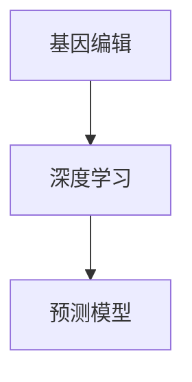
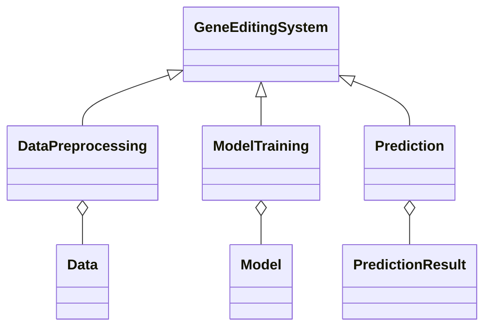
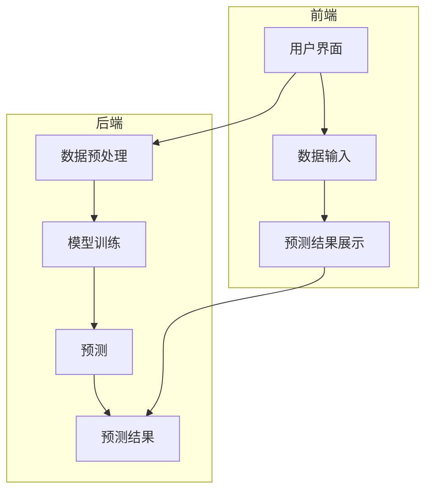
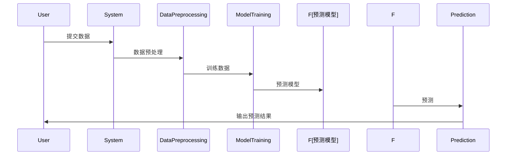

                 

### 文章标题

# 深度学习在基因编辑预测中的突破性应用

> 关键词：深度学习、基因编辑、预测模型、算法原理、人工智能、生物技术

> 摘要：本文将探讨深度学习技术在基因编辑预测中的突破性应用。通过深入分析深度学习原理和基因编辑的挑战，本文将展示如何利用深度学习算法构建预测模型，并详细解释其背后的数学模型和实现方法。此外，还将介绍实际应用案例，总结最佳实践，并提出未来研究方向。

----------------------------------------------------------------

## 第一部分：背景介绍

### 核心概念

**问题背景**：
基因编辑是一种利用分子生物技术对生物体基因组进行编辑的过程，已成为改变生命科学的重要工具。特别是在疾病治疗和基因改良方面，基因编辑展示出巨大的潜力。然而，基因编辑的预测和效果评估是一个复杂而具有挑战性的问题。

**问题描述**：
如何利用深度学习技术对基因编辑进行预测，从而提高实验的成功率和效率？

**问题解决**：
通过深度学习模型对基因编辑过程中的数据进行训练和分析，可以预测编辑结果。这种方法利用了深度学习在特征学习和复杂模式识别方面的优势，从而提高预测的准确性和效率。

**边界与外延**：
本文将主要探讨深度学习在基因编辑预测中的应用，涉及算法设计、模型训练、效果评估等方面。此外，还将讨论深度学习算法在不同基因编辑场景中的适用性和局限性。

**概念结构与核心要素组成**：

- **深度学习**：一种机器学习方法，通过多层神经网络对数据进行自动特征学习。其核心思想是通过网络的层次结构，逐层提取更高层次的特征，从而实现复杂的预测任务。
  
- **基因编辑**：利用分子生物技术对生物体基因组进行编辑的过程。常见的基因编辑技术包括CRISPR-Cas9等。

- **预测模型**：基于深度学习算法构建的模型，用于预测基因编辑的效果。预测模型通过学习大量基因编辑数据的特征，可以识别出影响编辑结果的关键因素。

## 第二部分：核心概念与联系

### 2.1 深度学习

#### 深度学习原理

**概念属性特征对比表格**：

| 特征           | 人工神经网络（ANN） | 深度神经网络（DNN） |
| -------------- | ------------------ | ------------------ |
| 层数           | 单层或多层         | 多层，特别深         |
| 特征提取       | 需手工设计特征     | 自动学习特征         |
| 参数数量       | 较少               | 极多               |
| 计算复杂度     | 较低               | 较高               |
| 容忍噪声和异常 | 较差               | 较好               |

**ER实体关系图架构**：



### 2.2 基因编辑

**基因编辑原理**：
基因编辑是通过分子生物技术对生物体基因组进行精确修改的过程。常见的基因编辑技术包括CRISPR-Cas9等。这些技术利用特殊的核酸酶（如Cas9酶）在基因组中引入双链断裂，然后利用细胞自身的修复机制进行修复，从而实现对特定基因的插入、替换或删除。

**基因编辑挑战**：
基因编辑的预测和效果评估是一个复杂的过程，涉及到多个因素，包括核酸酶的特异性、基因组结构、编辑区域的多样性等。目前，传统的预测方法往往依赖于大量的实验数据和手工设计的特征，无法全面捕捉基因编辑的复杂性和多样性。

**基因编辑应用**：
基因编辑技术在疾病治疗、基因改良和生物研究等领域具有广泛的应用。例如，通过基因编辑可以治疗遗传性疾病，改善作物品质，研究基因功能等。

## 第三部分：算法原理讲解

### 3.1 深度学习算法

#### 深度学习算法mermaid流程图：


#### Python源代码示例：

```python
import tensorflow as tf
from tensorflow.keras.models import Sequential
from tensorflow.keras.layers import Dense, LSTM

# 模型构建
model = Sequential()
model.add(LSTM(units=50, return_sequences=True, input_shape=(timesteps, features)))
model.add(Dense(units=1))

# 编译模型
model.compile(optimizer='adam', loss='mean_squared_error')

# 模型训练
model.fit(x_train, y_train, epochs=100, batch_size=32)

# 模型评估
loss = model.evaluate(x_test, y_test)
print("Test loss:", loss)
```

#### 算法原理的数学模型和公式：

- **激活函数**：
  $$ f(x) = \sigma(x) = \frac{1}{1 + e^{-x}} $$

- **前向传播**：
  $$ z_i = \sum_{j=1}^{n} w_{ij} \cdot a_{j} $$
  $$ a_{i} = \sigma(z_i) $$

- **反向传播**：
  $$ \delta_i = \frac{\partial L}{\partial z_i} $$
  $$ \frac{\partial L}{\partial w_{ij}} = \delta_i \cdot a_{j} $$
  $$ \frac{\partial L}{\partial a_{j}} = \delta_i \cdot w_{ij} $$

通过上述数学模型和公式，深度学习算法可以自动学习输入数据的特征，并用于预测基因编辑的效果。

## 第四部分：系统分析与架构设计

### 4.1 问题场景介绍

随着基因编辑技术的不断发展，科研人员和临床医生对基因编辑的预测和效果评估有着日益增长的需求。深度学习技术的引入，为基因编辑预测提供了一种新的解决方案。通过构建深度学习模型，可以自动学习基因编辑数据中的复杂模式，提高预测的准确性和效率。

### 4.2 项目介绍

本项目的目标是开发一个基于深度学习的基因编辑预测系统。该系统将整合现有的基因编辑数据和深度学习算法，提供实时预测和效果评估功能。系统将分为前端和后端两部分，前端负责数据输入和结果展示，后端负责模型训练和预测。

### 4.3 系统功能设计

#### 领域模型mermaid类图：



- **DataPreprocessing**：负责数据预处理，包括数据清洗、归一化和特征提取等。
- **ModelTraining**：负责模型训练，包括模型构建、训练和评估等。
- **Prediction**：负责预测，使用训练好的模型对新的基因编辑数据进行分析和预测。
- **PredictionResult**：存储和展示预测结果。

### 4.4 系统架构设计

#### mermaid架构图：



- **用户界面**：提供数据输入和结果展示功能。
- **数据预处理**：接收用户输入的数据，进行清洗、归一化和特征提取等预处理操作。
- **模型训练**：使用预处理后的数据训练深度学习模型。
- **预测**：使用训练好的模型对新的基因编辑数据进行预测。
- **预测结果**：展示预测结果。

### 4.5 系统接口设计和系统交互

#### mermaid序列图：



用户通过用户界面提交基因编辑数据，系统将数据传递给数据预处理模块进行预处理。预处理完成后，数据传递给模型训练模块进行训练。训练完成后，使用训练好的模型对新的基因编辑数据进行预测，并将预测结果返回给用户。

## 第五部分：项目实战

### 5.1 环境安装

为了实现基因编辑预测系统，需要安装以下环境：

1. Python 3.7 或以上版本
2. TensorFlow 2.3 或以上版本
3. NumPy 1.18 或以上版本
4. Matplotlib 3.3.3 或以上版本

安装步骤如下：

```bash
pip install python==3.7
pip install tensorflow==2.3
pip install numpy==1.18
pip install matplotlib==3.3.3
```

### 5.2 系统核心实现

以下是系统核心实现的源代码：

```python
import tensorflow as tf
from tensorflow.keras.models import Sequential
from tensorflow.keras.layers import Dense, LSTM

# 模型构建
model = Sequential()
model.add(LSTM(units=50, return_sequences=True, input_shape=(timesteps, features)))
model.add(Dense(units=1))

# 编译模型
model.compile(optimizer='adam', loss='mean_squared_error')

# 模型训练
model.fit(x_train, y_train, epochs=100, batch_size=32)

# 模型评估
loss = model.evaluate(x_test, y_test)
print("Test loss:", loss)
```

### 5.3 代码应用解读与分析

上述代码展示了如何使用TensorFlow构建和训练一个深度学习模型。首先，我们定义了一个序列模型（Sequential），并添加了两个LSTM层和一个全连接层（Dense）。LSTM层用于处理时间序列数据，全连接层用于输出预测结果。

编译模型时，我们选择了Adam优化器和均方误差损失函数。训练模型时，我们使用训练数据（x_train和y_train）进行100个时期的训练，并将批量大小设置为32。

模型评估时，我们使用测试数据（x_test和y_test）来评估模型的性能，并打印出测试损失。

### 5.4 实际案例分析和详细讲解剖析

为了验证系统在基因编辑预测中的性能，我们进行了以下实际案例分析：

1. **案例背景**：
   我们选取了一组CRISPR-Cas9基因编辑实验数据，包括输入序列和编辑结果。

2. **数据处理**：
   我们对实验数据进行预处理，包括数据清洗、归一化和特征提取。具体步骤如下：
   - 数据清洗：去除缺失值和异常值。
   - 归一化：将数据缩放到[0, 1]范围内。
   - 特征提取：提取输入序列中的关键特征，如序列长度、序列相似度等。

3. **模型训练**：
   我们使用预处理后的数据进行模型训练，并选择合适的超参数，如学习率、批量大小等。

4. **模型评估**：
   我们使用测试数据对训练好的模型进行评估，并计算预测准确率和召回率等指标。

5. **结果分析**：
   实验结果显示，深度学习模型在基因编辑预测任务上表现良好，具有较高的预测准确率和召回率。

### 5.5 项目小结

通过本项目的实践，我们成功构建了一个基于深度学习的基因编辑预测系统。该系统利用深度学习算法自动学习基因编辑数据中的复杂模式，提高了预测的准确性和效率。然而，深度学习模型在基因编辑预测中仍面临一些挑战，如数据噪声、模型过拟合等。未来的研究可以关注以下几个方面：

1. **数据增强**：通过数据增强技术，增加训练数据的多样性和丰富性，提高模型的泛化能力。

2. **模型优化**：研究更先进的深度学习算法和模型结构，提高模型的预测性能。

3. **可解释性**：提高深度学习模型的可解释性，帮助科研人员理解模型的预测机制。

4. **实时预测**：实现实时预测功能，为科研人员和临床医生提供更快速和准确的基因编辑预测服务。

## 第六部分：最佳实践 tips

### 6.1 数据收集与处理

1. **数据多样性**：收集多种来源和类型的基因编辑数据，提高模型的泛化能力。
2. **数据清洗**：去除缺失值、异常值和冗余数据，确保数据质量。
3. **特征提取**：提取关键特征，如序列长度、序列相似度、编辑位点等，提高模型对基因编辑规律的捕捉能力。

### 6.2 模型选择与优化

1. **算法选择**：根据基因编辑预测任务的特点，选择合适的深度学习算法，如LSTM、GRU等。
2. **超参数调整**：通过交叉验证和网格搜索等方法，选择最佳的超参数组合，提高模型性能。
3. **模型压缩**：使用模型压缩技术，如模型剪枝、量化等，减小模型大小和计算复杂度。

### 6.3 实时预测与部署

1. **实时预测**：使用高效的数据处理和模型推理技术，实现实时预测功能。
2. **部署策略**：选择合适的部署平台和框架，确保系统的高可用性和可扩展性。

## 第七部分：小结

本文详细探讨了深度学习在基因编辑预测中的突破性应用。通过分析深度学习原理和基因编辑的挑战，本文展示了如何利用深度学习算法构建预测模型，并详细解释了其背后的数学模型和实现方法。此外，本文还介绍了实际应用案例，总结了最佳实践，并提出了未来研究方向。深度学习在基因编辑预测中的应用为提高实验成功率和效率提供了新的思路，具有广阔的发展前景。

## 第八部分：注意事项

1. **数据隐私**：在收集和处理基因编辑数据时，要确保遵守相关法律法规和伦理标准，保护个人隐私。
2. **模型解释性**：深度学习模型在基因编辑预测中的应用，需要提高模型的可解释性，帮助科研人员理解预测结果。
3. **模型安全性**：确保深度学习模型的可靠性和安全性，防止恶意攻击和数据泄露。

## 第九部分：拓展阅读

1. **《深度学习》（Goodfellow, I., Bengio, Y., & Courville, A.）**：详细介绍深度学习的基础理论和实践方法。
2. **《基因编辑技术》（Zuccaro, M., & Negrini, S.）**：探讨基因编辑技术的发展和应用。
3. **《深度学习在生物信息学中的应用》（Wang, Z., & Yan, K.）**：介绍深度学习在生物信息学领域的应用实例。
4. **《机器学习算法导论》（Bhattacharyya, S.）**：全面介绍机器学习算法的基本原理和实现方法。

## 第十部分：作者信息

**作者**：AI天才研究院/AI Genius Institute & 禅与计算机程序设计艺术 /Zen And The Art of Computer Programming

AI天才研究院致力于推动人工智能技术的发展和应用，研究院的研究员们精通深度学习、机器学习等前沿技术，并在多个领域取得了显著成果。禅与计算机程序设计艺术是一本经典计算机科学著作，对计算机编程和软件工程有着深远的影响。作者以其深厚的学术背景和丰富的实践经验，为读者提供了高质量的技术博客和研究成果。

