                 

### 关键词

- 深度学习
- 天文数据分析
- 神经网络
- 算法优化
- 自适应学习
- 天体识别
- 星体分类
- 天体运动预测
- 天文图像处理

### 摘要

深度学习，作为当今人工智能领域的核心技术之一，正在颠覆传统天文数据分析的方法。本文将探讨深度学习在天文数据分析中的突破性应用。首先，我们将回顾天文数据分析的重要性以及深度学习的发展与应用背景。接着，深入解析深度学习在天文数据分析中的优势，包括对海量数据的处理能力和复杂的模式识别能力。本文还将详细介绍深度学习的核心概念、算法原理及其在天文数据分析中的应用，如星体分类、星系识别、天体运动预测和天文图像处理。此外，我们将展示如何设计一个天文数据分析系统，包括数据采集、预处理、模型训练和评估等步骤。通过一个实际案例的实战分析，读者将全面理解深度学习在天文数据分析中的实际应用和挑战。最后，本文将提供一些最佳实践建议，并总结深度学习在天文数据分析领域的未来发展展望。

## 深度学习在天文数据分析中的突破性应用

随着科技的发展和观测设备的进步，天文学家能够收集到越来越多的天文数据。这些数据不仅包含传统的光谱、亮度等信息，还包括来自射电天文、X射线天文、引力波观测等领域的复杂数据。如何有效地处理和分析这些海量、多维、动态变化的数据，成为天文学领域面临的重要挑战。深度学习，作为一种基于人工神经网络的学习方式，凭借其强大的非线性建模能力和自适应学习能力，逐渐成为解决这一问题的利器。

### 1.1 天文数据分析的重要性

天文数据分析是天文学研究的重要环节。通过数据分析，天文学家可以提取出宇宙中的关键信息，揭示星体的运动规律、星系的演化过程以及宇宙的结构和动力学特征。具体来说，天文数据分析的重要性体现在以下几个方面：

- **信息提取**：从观测数据中提取有用的信息，如恒星的光谱特征、亮度变化等，这些信息对于理解星体的物理性质至关重要。
- **规律发现**：通过分析大量观测数据，可以发现天体运动、星系演化等宇宙现象的规律，这些规律对于天文学理论的发展具有指导意义。
- **预测未来**：基于历史观测数据，可以预测天体未来的运动轨迹、亮度变化等，这对于天文观测规划和科学发现具有重要意义。

### 1.2 深度学习的发展与应用

深度学习是一种模仿人脑工作机制的学习方法，通过多层神经网络对数据进行学习和建模。自2006年提出以来，深度学习在图像识别、语音识别、自然语言处理等领域取得了显著的成果。近年来，深度学习在天文数据分析中也逐渐展现出其强大的潜力。

- **图像识别**：深度学习可以自动识别和处理天文图像，如星体分类、星系识别等。
- **模式识别**：通过对天文数据的分析，深度学习可以发现复杂的数据模式，如恒星集群的分布、星系的形状等。
- **预测分析**：利用深度学习模型，可以对天体的运动轨迹进行预测，帮助天文学家提前了解可能的天文事件。

### 1.3 深度学习在天文数据分析中的优势

深度学习之所以能够在天文数据分析中取得突破性应用，主要得益于以下几方面的优势：

- **处理海量数据**：深度学习能够处理大规模的天文数据，这在天文领域尤为重要，因为天文学的数据量庞大且增长迅速。
- **自适应学习**：深度学习模型可以通过自我调整来适应不同的数据特征和问题，从而提高分析结果的准确性。
- **处理复杂数据**：深度学习能够处理多模态和多尺度的天文数据，如同时分析光谱、图像和射电数据等。
- **模式识别**：深度学习在模式识别方面具有优势，能够发现传统方法难以发现的复杂模式。

通过以上分析，我们可以看出，深度学习在天文数据分析中具有巨大的潜力和优势。接下来的章节将进一步详细探讨深度学习的核心概念、算法原理以及在天文数据分析中的应用。

### 第一部分：背景介绍

在深入了解深度学习在天文数据分析中的应用之前，我们需要对天文数据分析本身以及深度学习的发展背景有一个清晰的了解。

#### 1.1 天文数据分析的重要性

天文数据分析是天文学研究的关键环节，它对天体物理学、宇宙学以及天文观测技术的发展起到了重要的推动作用。以下是天文数据分析的重要性概述：

**天文数据分析概述**：天文数据分析涉及对观测数据的收集、处理、分析和解释。这些数据来源于不同的观测手段，包括光学望远镜、射电望远镜、X射线望远镜、引力波探测器等。数据分析的目标是提取数据中的有用信息，如天体的位置、亮度、光谱特征、运动轨迹等。

**天文学研究的重要性**：天文学是研究宇宙起源、结构、演化和未来的一门科学。通过对天文数据的分析，天文学家可以揭示宇宙的基本规律，探索宇宙的奥秘。例如，通过观测黑洞和中子星等极端天体的行为，天文学家可以了解引力的本质和宇宙的极端环境。

**数据分析在天文学中的作用**：数据分析在天文学中扮演了至关重要的角色。它不仅帮助天文学家从大量观测数据中提取关键信息，还支持天文学理论的验证和新发现。例如，通过对大量恒星光谱的分析，天文学家发现了宇宙中的元素分布和恒星的形成过程；通过对天文图像的深入分析，天文学家发现了新的星系、行星和天文现象。

#### 1.2 深度学习的发展与应用

深度学习作为一种基于多层神经网络的学习方式，自2006年由Hinton等人重新提出以来，迅速成为人工智能领域的核心技术。以下是深度学习的发展背景及其在天文学中的应用：

**深度学习概述**：深度学习通过多层神经网络对数据进行自动特征提取和模式识别。与传统的机器学习方法相比，深度学习能够处理复杂数据，并且具有自适应学习的能力。深度学习的主要组成部分包括神经网络、深度神经网络、卷积神经网络和循环神经网络等。

**深度学习在天文学中的发展**：深度学习在天文学中的应用始于2010年代，最初主要用于图像识别和分类。随着计算能力的提升和数据量的增加，深度学习在天文数据分析中的应用不断扩展，涵盖了从数据预处理到复杂模式识别的各个方面。

**深度学习在其他领域的应用**：深度学习已经在多个领域取得了显著的成果，包括图像识别、语音识别、自然语言处理、医疗诊断和金融分析等。这些应用的成功证明了深度学习在处理复杂数据和模式识别方面的强大能力。

#### 1.3 深度学习在天文数据分析中的优势

深度学习之所以能够成为天文数据分析的有力工具，主要得益于其以下几方面的优势：

**数据量庞大**：天文数据量庞大且增长迅速，传统的数据处理方法难以胜任。深度学习能够高效处理大规模数据，从而提高数据分析的效率。

**复杂关系**：天文数据往往具有复杂的非线性关系，深度学习通过多层网络结构能够有效地捕捉这些复杂关系，从而提高模型的准确性。

**自适应学习能力**：深度学习模型能够通过自我调整来适应不同的数据特征和问题，这使得它们能够灵活地应用于各种天文数据分析任务。

**多模态数据**：深度学习能够同时处理多种类型的数据，如光谱、图像和射电数据，这对于复杂天文现象的分析具有重要意义。

综上所述，深度学习作为一种强大的工具，正在推动天文数据分析的进步，使得天文学家能够从海量数据中提取更多有价值的信息。

### 2.1 深度学习核心概念

深度学习（Deep Learning）是机器学习（Machine Learning）的一种特殊形式，它通过多层神经网络（Neural Networks）对数据进行分析和处理。以下是深度学习中的几个核心概念：

#### 2.1.1 神经网络

神经网络（Neural Networks）是一种模仿生物神经元连接方式的信息处理系统。它由大量简单的处理单元（即神经元）通过有向边（权重）连接而成。每个神经元接收多个输入信号，经过加权求和处理后，产生一个输出信号。

**神经元与权重**：每个神经元有一个权重向量，用于调整输入信号的强度。神经元通过激活函数（如Sigmoid、ReLU等）对输入信号进行非线性变换，从而产生输出。

**前向传播**：在神经网络中，数据从输入层经过多层隐藏层，最终到达输出层。这一过程称为前向传播。前向传播过程中，每个神经元接收前一层神经元的输出，通过加权求和处理，产生自己的输出。

**反向传播**：反向传播是神经网络训练的核心步骤。它通过计算输出层与真实标签之间的误差，然后反向传播这些误差到前一层，以此调整权重，优化模型。

#### 2.1.2 深度神经网络

深度神经网络（Deep Neural Networks，DNN）是指具有多个隐藏层的神经网络。与传统的单层或多层神经网络相比，深度神经网络能够更好地捕捉数据的复杂结构和非线性关系。

**神经网络层次**：深度神经网络通常包含多个隐藏层，每一层都对输入数据进行特征提取和变换。深度神经网络层次越多，模型的表达能力越强。

**深层神经网络的优势**：深层神经网络能够处理更复杂的任务，如图像识别、自然语言处理等。其优点包括更高的准确性和更强的泛化能力。

**深层神经网络的应用**：深度神经网络在图像识别、语音识别、推荐系统、自然语言处理等领域都有广泛应用。在天文数据分析中，深度神经网络被用于星体分类、星系识别、天体运动预测等任务。

#### 2.1.3 卷积神经网络

卷积神经网络（Convolutional Neural Networks，CNN）是一种专门用于图像处理和计算机视觉的深度神经网络。与传统的神经网络不同，CNN通过卷积层、池化层和全连接层对图像数据进行特征提取和分类。

**卷积层**：卷积层是CNN的核心层，通过卷积操作提取图像的局部特征。卷积层使用卷积核（滤波器）在图像上滑动，计算每个局部区域的特征。

**池化层**：池化层用于减小特征图的尺寸，同时保留重要的特征信息。常用的池化操作包括最大池化和平均池化。

**全连接层**：在CNN的末端，通常使用全连接层对提取到的特征进行分类。全连接层将每个特征图上的所有像素值连接到一起，通过一个线性变换输出分类结果。

**卷积神经网络的应用**：卷积神经网络在图像分类、目标检测、图像分割等领域有广泛应用。在天文数据分析中，CNN被用于星体分类、天文图像处理和星系识别等任务。

#### 2.1.4 循环神经网络

循环神经网络（Recurrent Neural Networks，RNN）是一种专门用于处理序列数据的神经网络。与传统的神经网络不同，RNN具有循环结构，能够记住前一个时刻的输出，并将其作为当前时刻的输入。

**循环神经网络结构**：RNN由输入层、隐藏层和输出层组成。隐藏层中的神经元通过时间步连接，形成循环结构。RNN能够处理变量长度的序列数据，如文本、时间序列数据等。

**隐藏状态与循环**：在RNN中，隐藏状态（Hidden State）表示当前时刻的神经网络状态，它通过时间步传递，并在下一个时间步作为输入。这种循环结构使得RNN能够记住过去的信息，从而在序列数据处理中具有优势。

**长短时记忆**：RNN在处理长序列数据时容易遇到“梯度消失”和“梯度爆炸”问题，导致模型难以训练。为解决这一问题，引入了长短时记忆（Long Short-Term Memory，LSTM）和门控循环单元（Gated Recurrent Unit，GRU）等改进模型。LSTM和GRU通过引入门控机制，有效地解决了长序列数据的记忆问题。

**循环神经网络的应用**：循环神经网络在自然语言处理、语音识别、时间序列预测等领域有广泛应用。在天文数据分析中，RNN和其改进模型被用于天体运动预测、天文事件序列分析等任务。

综上所述，深度学习的核心概念包括神经网络、深度神经网络、卷积神经网络和循环神经网络。这些概念构成了深度学习的基础，使其能够处理复杂数据和实现复杂的任务。

### 2.2 深度学习在天文数据分析中的应用

深度学习在各个领域的广泛应用已经得到了充分的验证，在天文数据分析中也不例外。深度学习不仅在数据预处理、特征提取和模式识别等方面表现出色，还能够在复杂的数据分析和预测任务中发挥重要作用。以下是深度学习在天文数据分析中的具体应用场景：

#### 2.2.1 星体分类

星体分类是天文数据分析中的一个基本任务，通过对星体的光谱特征、亮度、颜色等进行分类，可以帮助天文学家更好地理解星体的物理性质和演化过程。深度学习通过卷积神经网络（CNN）和循环神经网络（RNN）等技术，可以高效地处理和分类天文图像和光谱数据。

**CNN在星体分类中的应用**：卷积神经网络通过卷积层、池化层和全连接层的组合，能够自动提取图像中的特征，从而实现对星体的分类。例如，使用CNN对天文图像中的恒星、行星和星系进行分类，可以显著提高分类的准确性和效率。

**RNN在星体分类中的应用**：循环神经网络在处理序列数据方面具有优势，可以用于分析天体的光谱序列数据。通过对光谱序列中的特征进行建模，RNN可以有效地识别和分类不同类型的星体。

**案例研究**：例如，DeepSky项目利用深度学习对大量天文图像进行星体分类，显著提高了分类准确率，并发现了一些未知的天体。

#### 2.2.2 星系识别

星系识别是天文数据分析的另一个重要任务，它涉及到从天文图像中识别和分类星系。深度学习通过CNN和深度神经网络（DNN）等技术，可以在大规模天文图像数据中实现高效的星系识别。

**CNN在星系识别中的应用**：卷积神经网络通过卷积层和池化层，可以从图像中提取出星系的局部特征，从而实现对星系的识别。例如，使用CNN对天文图像中的星系进行识别，可以有效地过滤掉噪声和背景，提高识别的准确性。

**DNN在星系识别中的应用**：深度神经网络通过多层非线性变换，可以捕捉到星系之间的复杂关系，从而提高识别的精度。例如，使用DNN对星系图像进行分类和识别，可以识别出不同类型的星系，并预测它们的演化过程。

**案例研究**：例如，SETI项目利用深度学习技术对天文图像中的星系进行识别，成功发现了一些新的星系，并揭示了星系的演化规律。

#### 2.2.3 天体运动预测

天体运动预测是天文数据分析中的一个关键任务，它涉及到对恒星、行星、彗星等天体的运动轨迹进行预测。深度学习通过循环神经网络（RNN）和长短时记忆（LSTM）等技术，可以实现对天体运动的高效预测。

**RNN在天体运动预测中的应用**：循环神经网络通过记忆过去的信息，可以捕捉到天体运动的长期趋势。通过对天体观测数据的时间序列建模，RNN可以预测天体的未来位置和轨迹。

**LSTM在天体运动预测中的应用**：长短时记忆网络通过引入门控机制，可以有效地解决长序列数据中的“梯度消失”问题，从而提高天体运动预测的准确性。例如，使用LSTM模型对恒星的运动轨迹进行预测，可以显著提高预测的精度和稳定性。

**案例研究**：例如，NASA利用LSTM模型对天文观测数据中的恒星运动进行预测，成功预测了一些恒星即将发生的天文事件。

#### 2.2.4 天文图像处理

天文图像处理是天文数据分析的一个重要组成部分，它涉及到对天文图像的降噪、去模糊、增强和分割等操作。深度学习通过卷积神经网络（CNN）和生成对抗网络（GAN）等技术，可以在天文图像处理中实现高效的图像增强和修复。

**CNN在天文图像处理中的应用**：卷积神经网络通过卷积层和池化层，可以从图像中提取出关键特征，从而实现对图像的降噪、去模糊和增强。例如，使用CNN对天文图像中的恒星进行去模糊处理，可以显著提高图像的清晰度，从而更好地分析恒星的特征。

**GAN在天文图像处理中的应用**：生成对抗网络通过对抗训练，可以生成高质量的天文图像，从而用于图像修复和增强。例如，使用GAN技术修复天文图像中的缺失部分，可以恢复图像的完整信息，从而提高图像的分析质量。

**案例研究**：例如，SpaceNet项目利用深度学习技术对天文图像进行修复和增强，从而提高了天文图像的分析精度和效率。

综上所述，深度学习在天文数据分析中具有广泛的应用前景，通过卷积神经网络、循环神经网络和深度神经网络等技术，可以实现对天文数据的处理、分析和预测，为天文学研究提供了强大的工具。

### 2.3 深度学习与天文数据分析的关联

深度学习之所以能够在天文数据分析中取得突破性应用，与其与天文数据分析的紧密关联密不可分。以下从数据类型与深度学习模型的匹配、数据预处理方法以及深度学习算法在天文数据分析中的优化三个方面，详细探讨深度学习与天文数据分析之间的关联。

#### 数据类型与深度学习模型的匹配

天文数据分析中涉及到的数据类型多样，包括图像、光谱、射电数据等。这些数据类型具有不同的特性和挑战，需要特定的深度学习模型来处理。

**图像数据**：天文图像数据是深度学习在天文数据分析中最常见的类型。图像数据包括恒星、星系、行星等天体的图像。卷积神经网络（CNN）是处理图像数据的理想选择，因为卷积层能够有效地提取图像中的局部特征，池化层能够减少数据的维度，而全连接层则用于分类和识别。例如，使用CNN进行星体分类，可以准确识别不同类型的星体，从而提高数据分析的准确性。

**光谱数据**：光谱数据是天文学中重要的信息来源，包含了星体的化学成分、温度、亮度等信息。循环神经网络（RNN）和长短时记忆（LSTM）网络适用于处理时间序列数据，可以有效地分析光谱序列，识别出不同的星体特征。例如，通过RNN分析恒星的光谱，可以预测其未来的演化路径。

**射电数据**：射电数据主要来自于射电望远镜的观测，包含了来自宇宙深处的电磁波信号。深度学习中的生成对抗网络（GAN）可以用于处理和生成高质量的射电图像，从而提高数据的质量和分析效率。

#### 数据预处理方法

深度学习对数据质量有较高的要求，因此数据预处理成为天文数据分析中不可或缺的环节。以下是一些常用的数据预处理方法：

**数据清洗**：在开始深度学习模型训练之前，需要清理数据中的噪声和异常值。对于天文图像数据，可以通过滤波、去噪等方法进行预处理；对于光谱数据，可以通过填补缺失值、平滑曲线等方法进行预处理。

**数据标准化**：深度学习模型对数据的规模和范围敏感，因此需要对数据进行标准化处理，将数据缩放到相同的范围。例如，通过归一化方法将光谱数据的亮度值缩放到0到1之间。

**数据增强**：数据增强是一种增加训练数据多样性的方法，可以提高深度学习模型的泛化能力。对于天文图像数据，可以通过旋转、翻转、缩放等方法进行增强；对于光谱数据，可以通过添加噪声、更改光谱形态等方法进行增强。

#### 深度学习算法在天文数据分析中的优化

为了提高深度学习在天文数据分析中的性能，需要进行算法的优化。以下是一些常用的优化方法：

**模型选择**：根据不同的数据分析任务，选择适合的深度学习模型。例如，对于图像分类任务，可以选择CNN模型；对于时间序列分析任务，可以选择RNN或LSTM模型。

**参数调整**：深度学习模型中有很多超参数，如学习率、批量大小等，需要通过实验调整以获得最佳性能。例如，通过交叉验证方法选择合适的学习率和批量大小，可以提高模型的准确性和鲁棒性。

**模型集成**：通过集成多个模型的预测结果，可以提高模型的稳定性和准确性。例如，使用随机森林、支持向量机等传统机器学习方法与深度学习模型进行集成，可以进一步提高数据分析的精度。

**迁移学习**：迁移学习是一种利用已经训练好的深度学习模型在新任务上进行训练的方法，可以显著提高训练速度和模型性能。例如，使用在图像分类任务上预训练的CNN模型，可以在新的天文图像分类任务上快速获得良好的性能。

综上所述，深度学习与天文数据分析之间的紧密关联，使得深度学习成为解决天文数据分析问题的重要工具。通过数据类型与深度学习模型的匹配、数据预处理方法的优化以及深度学习算法在天文数据分析中的优化，可以充分发挥深度学习的潜力，提高天文数据分析的准确性和效率。

### 3.1 深度学习数学模型

深度学习作为一种强大的机器学习方法，其核心在于构建多层神经网络，并通过复杂的数学模型进行数据建模和预测。以下是深度学习中的几个关键数学模型：

#### 3.1.1 前向传播

前向传播（Forward Propagation）是深度学习模型训练中的基本步骤。在训练过程中，输入数据从输入层进入神经网络，通过每一层神经元的计算，最终到达输出层，产生预测结果。

**基本概念**：前向传播过程中，每个神经元接收来自前一层的输出，经过加权求和处理，然后通过激活函数进行非线性变换，生成当前层的输出。这一过程重复进行，直到最后一层输出。

**数学公式**：
\[ 
\text{激活函数} \, f(z) = \frac{1}{1 + e^{-z}} \quad (\text{Sigmoid函数}) \\
\text{激活函数} \, f(z) = \max(0, z) \quad (\text{ReLU函数}) 
\]

**示例**：
假设一个简单的三层神经网络，输入层有3个神经元，隐藏层有4个神经元，输出层有2个神经元。假设输入数据为\[x_1, x_2, x_3\]，隐藏层权重为\[w_{ij}\]，偏置为\[b_i\]，激活函数为ReLU函数。

输入层到隐藏层的计算：
\[ 
z_1 = w_{11}x_1 + b_1 \\
a_1 = \max(0, z_1) \\
... \\
z_4 = w_{41}a_1 + b_4 \\
a_4 = \max(0, z_4) \\
\]

隐藏层到输出层的计算：
\[ 
z_1' = w_{11}'a_1 + b_1' \\
z_2' = w_{21}'a_1 + b_2' \\
... \\
\text{预测结果} \, y = f(z_1', z_2', ..., z_n') \quad (\text{例如：Softmax函数}) 
\]

#### 3.1.2 反向传播

反向传播（Back Propagation）是深度学习模型训练中的核心步骤，用于计算模型预测误差，并调整网络中的权重和偏置。

**基本概念**：反向传播通过前向传播得到的预测结果，计算每个神经元输出的误差，然后反向传播这些误差，通过梯度下降法更新网络中的权重和偏置。

**数学公式**：
\[ 
\text{误差} \, E = \sum_{i} (y_i - \hat{y_i})^2 \\
\text{权重更新} \, w_{ij} \leftarrow w_{ij} - \alpha \frac{\partial E}{\partial w_{ij}} \\
\text{偏置更新} \, b_i \leftarrow b_i - \alpha \frac{\partial E}{\partial b_i} 
\]

**示例**：
假设一个三层神经网络，输出层的预测误差为\[d_1, d_2\]，隐藏层到输出层的权重为\[w_{ij}'\]，偏置为\[b_i'\]，输出层到隐藏层的权重为\[w_{ij}\]，偏置为\[b_j\]。

计算隐藏层到输出层的误差：
\[ 
d_1' = \frac{\partial \hat{y_1}}{\partial z_1'} = (1 - \hat{y_1})y_1(1 - y_1) \\
d_2' = \frac{\partial \hat{y_2}}{\partial z_2'} = (1 - \hat{y_2})y_2(1 - y_2) \\
\]

计算输入层到隐藏层的误差：
\[ 
d_1 = w_{11}'d_1' + w_{21}'d_2' \\
... \\
d_4 = w_{41}'d_1' + w_{42}'d_2' \\
\]

更新隐藏层到输出层的权重和偏置：
\[ 
w_{ij}' \leftarrow w_{ij}' - \alpha d_1'd_1 \\
b_i' \leftarrow b_i' - \alpha d_1 \\
\]

更新输入层到隐藏层的权重和偏置：
\[ 
w_{ij} \leftarrow w_{ij} - \alpha d_1 \\
b_j \leftarrow b_j - \alpha d_j \\
\]

#### 3.1.3 损失函数

损失函数（Loss Function）用于衡量模型预测结果与真实值之间的差异，是深度学习模型训练的关键组成部分。

**基本概念**：损失函数通常是一个非负函数，其值越小表示模型预测越准确。常见的损失函数包括均方误差（MSE）、交叉熵（Cross Entropy）等。

**数学公式**：
\[ 
\text{均方误差} \, MSE = \frac{1}{n}\sum_{i=1}^{n} (y_i - \hat{y_i})^2 \\
\text{交叉熵} \, CE = -\sum_{i=1}^{n} y_i \log(\hat{y_i}) 
\]

**示例**：
假设模型预测结果为\[ \hat{y} \]，真实值为\[ y \]，使用交叉熵损失函数计算损失：
\[ 
CE = -\sum_{i=1}^{n} y_i \log(\hat{y_i}) \\
\]

#### 3.1.4 优化算法

优化算法（Optimization Algorithm）用于调整神经网络中的权重和偏置，以最小化损失函数。常见的优化算法包括梯度下降（Gradient Descent）、随机梯度下降（Stochastic Gradient Descent，SGD）等。

**基本概念**：优化算法通过不断迭代，更新网络中的权重和偏置，逐步减少损失函数的值。

**数学公式**：
\[ 
\text{梯度下降} \, \text{更新} \, w \leftarrow w - \alpha \nabla_w E \\
\text{随机梯度下降} \, \text{更新} \, w \leftarrow w - \alpha \nabla_w E^k 
\]

**示例**：
使用梯度下降法更新权重：
\[ 
w \leftarrow w - \alpha \frac{\partial E}{\partial w} 
\]

综上所述，深度学习中的数学模型包括前向传播、反向传播、损失函数和优化算法。这些模型构成了深度学习的基础，使其能够高效地处理复杂数据和实现复杂的预测任务。

### 3.2 深度学习在天文数据分析中的应用公式

深度学习在天文数据分析中的应用涉及到多种数学公式，用于描述从数据输入到预测结果的整个过程。以下是一些核心的应用公式，并附以具体示例。

#### 3.2.1 星体分类公式

星体分类是深度学习在天文数据分析中的一项基本任务，其核心公式包括前向传播和反向传播的公式。

**前向传播公式**：
\[ 
z_i = \sum_{j=1}^{n} w_{ij}x_j + b_i \\
a_i = f(z_i) \\
\]
其中，\(x_j\)为输入特征，\(w_{ij}\)为权重，\(b_i\)为偏置，\(f(z_i)\)为激活函数（例如ReLU函数）。

**反向传播公式**：
\[ 
d_i = \frac{\partial L}{\partial a_i} \cdot \frac{\partial f(z_i)}{\partial z_i} \\
\delta_i = \frac{\partial L}{\partial z_i} \\
w_{ij} \leftarrow w_{ij} - \alpha \delta_i a_j \\
b_i \leftarrow b_i - \alpha \delta_i 
\]
其中，\(L\)为损失函数，\(\delta_i\)为误差项。

**示例**：
假设有一个二分类问题，输入特征为\(x_1, x_2\)，权重为\(w_{11}, w_{12}, w_{21}, w_{22}\)，偏置为\(b_1, b_2\)，激活函数为ReLU函数。

前向传播计算：
\[ 
z_1 = w_{11}x_1 + w_{21}x_2 + b_1 \\
z_2 = w_{12}x_1 + w_{22}x_2 + b_2 \\
a_1 = \max(0, z_1) \\
a_2 = \max(0, z_2) 
\]

反向传播计算（以损失函数为均方误差为例）：
\[ 
d_1 = (y - a_1)(1 - a_1) \\
d_2 = (y - a_2)(1 - a_2) \\
\delta_1 = d_1 \cdot a_1(1 - a_1) \\
\delta_2 = d_2 \cdot a_2(1 - a_2) \\
w_{11} \leftarrow w_{11} - \alpha \delta_1 x_1 \\
w_{12} \leftarrow w_{12} - \alpha \delta_1 x_2 \\
w_{21} \leftarrow w_{21} - \alpha \delta_2 x_1 \\
w_{22} \leftarrow w_{22} - \alpha \delta_2 x_2 \\
b_1 \leftarrow b_1 - \alpha \delta_1 \\
b_2 \leftarrow b_2 - \alpha \delta_2 
\]

#### 3.2.2 星系识别公式

星系识别任务中，深度学习模型需要从大量天文图像中识别出不同的星系。卷积神经网络（CNN）在这一任务中具有显著优势。

**前向传播公式**：
\[ 
h_l = \sigma(\text{ReLU}(\text{Conv}(h_{l-1}) + b_l)) \\
\]
其中，\(\text{ReLU}\)为ReLU激活函数，\(\text{Conv}\)为卷积操作，\(b_l\)为偏置。

**反向传播公式**：
\[ 
\delta_l = \frac{\partial L}{\partial h_l} \cdot \frac{\partial \sigma}{\partial h_l} \\
w_l \leftarrow w_l - \alpha \delta_l h_{l-1} \\
b_l \leftarrow b_l - \alpha \delta_l 
\]
其中，\(L\)为损失函数，\(\sigma\)为激活函数（例如Sigmoid函数）。

**示例**：
假设有一卷积神经网络，包含两个卷积层和一个全连接层，输入图像为\(I\)，卷积核为\(K_1, K_2\)，偏置为\(b_1, b_2\)。

前向传播计算（第一个卷积层）：
\[ 
h_1 = \text{ReLU}(\text{Conv}(I, K_1) + b_1) 
\]

反向传播计算（第一个卷积层）：
\[ 
\delta_1 = \frac{\partial L}{\partial h_1} \cdot \frac{\partial \text{ReLU}}{\partial h_1} \\
w_1 \leftarrow w_1 - \alpha \delta_1 I \\
b_1 \leftarrow b_1 - \alpha \delta_1 
\]

#### 3.2.3 天体运动预测公式

天体运动预测是利用深度学习模型预测天体的未来位置。循环神经网络（RNN）或长短时记忆（LSTM）网络在这一任务中表现出色。

**前向传播公式**：
\[ 
h_t = \text{ReLU}(\text{LSTM}(h_{t-1}, x_t) + b) \\
y_t = \text{Softmax}(h_t) 
\]
其中，\(x_t\)为时间步的输入，\(h_t\)为隐藏状态，\(b\)为偏置，\(\text{Softmax}\)为分类输出函数。

**反向传播公式**：
\[ 
\delta_t = \frac{\partial L}{\partial h_t} \cdot \frac{\partial \text{ReLU}}{\partial h_t} \\
\delta_{t-1} = \frac{\partial L}{\partial h_{t-1}} + \frac{\partial \text{LSTM}}{\partial h_{t-1}} \cdot \delta_t 
\]
其中，\(L\)为损失函数。

**示例**：
假设有一个LSTM模型，输入为天体观测数据序列\([x_1, x_2, ..., x_T]\)，隐藏状态为\(h_t\)，权重为\(W, b\)。

前向传播计算：
\[ 
h_t = \text{ReLU}(\text{LSTM}(h_{t-1}, x_t) + b) \\
y_t = \text{Softmax}(h_t) 
\]

反向传播计算：
\[ 
\delta_t = (y - y_t) \cdot (1 - y_t) \\
\delta_{t-1} = \delta_t \cdot \frac{\partial \text{LSTM}}{\partial h_{t-1}} \\
W \leftarrow W - \alpha \delta_t h_{t-1} \\
b \leftarrow b - \alpha \delta_t 
\]

#### 3.2.4 天文图像处理公式

天文图像处理包括去噪、去模糊和增强等任务，深度学习通过卷积神经网络（CNN）和生成对抗网络（GAN）实现这些任务。

**去噪公式**：
\[ 
h_t = \text{ReLU}(\text{Conv}(x_t, K) + b) \\
x_t' = \text{ReLU}(\text{Conv}(h_t, K') + b') 
\]
其中，\(K, K'\)为卷积核，\(b, b'\)为偏置。

**去模糊公式**：
\[ 
h_t = \text{ReLU}(\text{Deblur}(x_t, K) + b) \\
x_t' = \text{ReLU}(\text{Deblur}(h_t, K') + b') 
\]
其中，\(\text{Deblur}\)为去模糊操作。

**增强公式**：
\[ 
h_t = \text{ReLU}(\text{Conv}(x_t, K) + b) \\
x_t' = \text{Softmax}(h_t) 
\]
其中，\(\text{Softmax}\)为增强输出函数。

**示例**：
假设有一个去噪卷积神经网络，输入图像为\(x_t\)，卷积核为\(K, K'\)，偏置为\(b, b'\)。

去噪计算：
\[ 
h_t = \text{ReLU}(\text{Conv}(x_t, K) + b) \\
x_t' = \text{ReLU}(\text{Conv}(h_t, K') + b') 
\]

通过以上示例，我们可以看到深度学习在天文数据分析中的多种应用公式，这些公式为深度学习模型在实际任务中的应用提供了基础。

### 3.3 数学模型详细讲解与举例说明

在深入理解深度学习在天文数据分析中的应用之前，我们需要详细讲解前向传播、反向传播、损失函数和优化算法这几个关键数学模型，并通过具体示例进行说明。

#### 3.3.1 前向传播的详细讲解

前向传播是深度学习模型中的基本步骤，用于计算从输入层到输出层的中间变量和最终预测结果。以下是前向传播的详细讲解和示例：

**1. 神经网络结构**

首先，假设我们有一个简单的三层神经网络，包括输入层、隐藏层和输出层。每个层包含多个神经元。输入层有3个神经元，隐藏层有4个神经元，输出层有2个神经元。

**2. 输入数据**

假设输入数据为\[ x_1, x_2, x_3 \]，隐藏层权重为\[ w_{11}, w_{12}, w_{13}, w_{21}, w_{22}, w_{23}, w_{31}, w_{32}, w_{33} \]，输出层权重为\[ w_{41}, w_{42}, w_{51}, w_{52} \]，偏置为\[ b_1, b_2, b_3, b_4, b_5 \]。

**3. 前向传播计算**

输入层到隐藏层的计算：

\[ 
z_1 = w_{11}x_1 + w_{21}x_2 + w_{31}x_3 + b_1 \\
z_2 = w_{12}x_1 + w_{22}x_2 + w_{32}x_3 + b_2 \\
z_3 = w_{13}x_1 + w_{23}x_2 + w_{33}x_3 + b_3 \\
a_1 = \text{ReLU}(z_1) \\
a_2 = \text{ReLU}(z_2) \\
a_3 = \text{ReLU}(z_3) 
\]

隐藏层到输出层的计算：

\[ 
z_4 = w_{41}a_1 + w_{42}a_2 + w_{43}a_3 + b_4 \\
z_5 = w_{51}a_1 + w_{52}a_2 + w_{53}a_3 + b_5 \\
\hat{y_1} = \text{Sigmoid}(z_4) \\
\hat{y_2} = \text{Sigmoid}(z_5) 
\]

这里，ReLU函数为ReLU激活函数，Sigmoid函数为Sigmoid激活函数。

**4. 示例**

假设输入数据为\[ x_1 = 1, x_2 = 2, x_3 = 3 \]，权重和偏置分别为：

\[ 
w_{11} = 0.5, w_{21} = 0.6, w_{31} = 0.7 \\
w_{12} = 0.4, w_{22} = 0.8, w_{32} = 0.9 \\
w_{13} = 0.3, w_{23} = 0.7, w_{33} = 0.6 \\
b_1 = 0.1, b_2 = 0.2, b_3 = 0.3 \\
b_4 = 0.4, b_5 = 0.5 
\]

前向传播计算过程如下：

\[ 
z_1 = 0.5 \times 1 + 0.6 \times 2 + 0.7 \times 3 + 0.1 = 3.9 \\
z_2 = 0.4 \times 1 + 0.8 \times 2 + 0.9 \times 3 + 0.2 = 4.3 \\
z_3 = 0.3 \times 1 + 0.7 \times 2 + 0.6 \times 3 + 0.3 = 3.7 \\
a_1 = \text{ReLU}(3.9) = 3.9 \\
a_2 = \text{ReLU}(4.3) = 4.3 \\
a_3 = \text{ReLU}(3.7) = 3.7 \\
z_4 = 0.5 \times 3.9 + 0.6 \times 4.3 + 0.7 \times 3.7 + 0.4 = 7.75 \\
z_5 = 0.5 \times 3.9 + 0.6 \times 4.3 + 0.7 \times 3.7 + 0.5 = 8.25 \\
\hat{y_1} = \text{Sigmoid}(7.75) = 0.999 \\
\hat{y_2} = \text{Sigmoid}(8.25) = 1.000 
\]

通过前向传播，我们得到了输出层的预测结果\[ \hat{y_1}, \hat{y_2} \]。

#### 3.3.2 反向传播的详细讲解

反向传播是深度学习模型训练中的关键步骤，用于计算每个神经元权重的梯度，并更新权重以最小化损失函数。以下是反向传播的详细讲解和示例：

**1. 损失函数**

首先，定义一个简单的损失函数，如均方误差（MSE）：

\[ 
L = \frac{1}{2} \sum_{i=1}^{n} (\hat{y_i} - y_i)^2 
\]

其中，\(\hat{y_i}\)为预测结果，\(y_i\)为真实值，\(n\)为样本数量。

**2. 计算梯度**

反向传播过程中，我们需要计算每个神经元的误差梯度。以下是计算反向传播梯度的步骤：

输出层到隐藏层的计算：

\[ 
\delta_4 = \frac{\partial L}{\partial z_4} \\
\delta_5 = \frac{\partial L}{\partial z_5} \\
\delta_4 = (y_1 - \hat{y_1}) \cdot \text{Sigmoid}'(z_4) \\
\delta_5 = (y_2 - \hat{y_2}) \cdot \text{Sigmoid}'(z_5) 
\]

隐藏层到输入层的计算：

\[ 
\delta_1 = \delta_4 \cdot w_{41} \cdot \text{ReLU}'(z_1) \\
\delta_2 = \delta_4 \cdot w_{42} \cdot \text{ReLU}'(z_2) \\
\delta_3 = \delta_4 \cdot w_{43} \cdot \text{ReLU}'(z_3) 
\]

**3. 更新权重和偏置**

根据梯度下降法，更新权重和偏置：

\[ 
w_{41} \leftarrow w_{41} - \alpha \delta_4 a_1 \\
w_{42} \leftarrow w_{42} - \alpha \delta_4 a_2 \\
w_{43} \leftarrow w_{43} - \alpha \delta_4 a_3 \\
b_4 \leftarrow b_4 - \alpha \delta_4 \\
w_{51} \leftarrow w_{51} - \alpha \delta_5 a_1 \\
w_{52} \leftarrow w_{52} - \alpha \delta_5 a_2 \\
w_{53} \leftarrow w_{53} - \alpha \delta_5 a_3 \\
b_5 \leftarrow b_5 - \alpha \delta_5 
\]

其中，\(\alpha\)为学习率。

**4. 示例**

假设输出结果为\[ y_1 = 0.1, y_2 = 0.9 \]，学习率\(\alpha = 0.1\)。

计算梯度：

\[ 
\delta_4 = (0.1 - 0.999) \cdot (1 - 0.999) = -0.0009 \\
\delta_5 = (0.9 - 1.000) \cdot (1 - 0.0009) = -0.0009 \\
\]

更新权重和偏置：

\[ 
w_{41} \leftarrow w_{41} - 0.1 \cdot (-0.0009) = 0.499 \\
w_{42} \leftarrow w_{42} - 0.1 \cdot (-0.0009) = 0.600 \\
w_{43} \leftarrow w_{43} - 0.1 \cdot (-0.0009) = 0.700 \\
b_4 \leftarrow b_4 - 0.1 \cdot (-0.0009) = 0.400 \\
w_{51} \leftarrow w_{51} - 0.1 \cdot (-0.0009) = 0.500 \\
w_{52} \leftarrow w_{52} - 0.1 \cdot (-0.0009) = 0.600 \\
w_{53} \leftarrow w_{53} - 0.1 \cdot (-0.0009) = 0.700 \\
b_5 \leftarrow b_5 - 0.1 \cdot (-0.0009) = 0.500 
\]

通过反向传播，我们更新了神经网络的权重和偏置，以最小化损失函数。

#### 3.3.3 损失函数的详细讲解

损失函数用于衡量模型预测结果与真实值之间的差异，是深度学习模型训练的核心。以下是几种常见的损失函数及其详细讲解：

**1. 均方误差（MSE）**

均方误差是最常用的损失函数之一，用于回归任务。其公式为：

\[ 
L = \frac{1}{2} \sum_{i=1}^{n} (\hat{y_i} - y_i)^2 
\]

其中，\(\hat{y_i}\)为预测结果，\(y_i\)为真实值，\(n\)为样本数量。

**2. 交叉熵（Cross Entropy）**

交叉熵用于分类任务，特别是多分类问题。其公式为：

\[ 
L = -\sum_{i=1}^{n} y_i \log(\hat{y_i}) 
\]

其中，\(\hat{y_i}\)为预测概率，\(y_i\)为真实标签。

**3.  Huber损失**

Huber损失是MSE的改进版本，用于减少异常值对损失函数的影响。其公式为：

\[ 
L = \begin{cases} 
\frac{1}{2} (y_i - \hat{y_i})^2 & \text{if } |y_i - \hat{y_i}| \leq \delta \\
\delta (|y_i - \hat{y_i}| - \frac{\delta}{2}) & \text{otherwise} 
\end{cases} 
\]

其中，\(\delta\)为阈值。

**4. 对数损失**

对数损失用于二分类问题，其公式为：

\[ 
L = -y_i \log(\hat{y_i}) - (1 - y_i) \log(1 - \hat{y_i}) 
\]

其中，\(\hat{y_i}\)为预测概率，\(y_i\)为真实标签。

**5. 示例**

假设有一个简单的二分类问题，预测结果为\[ \hat{y} = 0.8 \]，真实标签为\[ y = 1 \]。计算交叉熵损失：

\[ 
L = -1 \log(0.8) - 0 \log(0.2) = -0.223 
\]

通过详细讲解和具体示例，我们可以更好地理解深度学习中的前向传播、反向传播、损失函数和优化算法，这些基础知识对于深度学习在天文数据分析中的应用至关重要。

### 4.1 神经网络原理

神经网络（Neural Networks，NN）是一种模拟生物神经元连接方式的计算模型，通过多层神经网络（多层感知器）进行数据建模和预测。以下是神经网络的基本原理和组成部分：

#### 4.1.1 神经网络结构

神经网络主要由输入层、隐藏层和输出层组成。每个神经元（节点）都通过加权连接与相邻层的神经元相连，形成一个复杂的网络结构。

- **输入层**：接收外部输入数据，每个输入数据通过加权连接传递到隐藏层。
- **隐藏层**：对输入数据进行处理和特征提取，隐藏层可以有一个或多个层次，每层中的神经元都对输入数据进行线性组合，并通过激活函数进行非线性变换。
- **输出层**：生成最终输出结果，输出层的神经元数量取决于具体的任务类型。

#### 4.1.2 神经元与权重

神经元是神经网络的基本计算单元，它通过权重（weights）和偏置（biases）进行数据处理。每个神经元接收来自前一层神经元的输出，通过加权求和处理，加上偏置，再经过激活函数，生成当前层的输出。

- **权重**：用于调整输入信号的强度，表示神经元之间的连接强度。
- **偏置**：用于调整神经元的偏置，使模型在训练过程中能够更好地拟合数据。

#### 4.1.3 前向传播

前向传播是神经网络训练过程中的第一步，用于计算从输入层到输出层的中间变量和最终预测结果。具体步骤如下：

1. **输入层到隐藏层的计算**：
   - 每个神经元接收来自输入层的输入数据，通过加权求和处理，加上偏置，得到一个中间值。
   - 通过激活函数对中间值进行非线性变换，生成当前层的输出。

2. **隐藏层到输出层的计算**：
   - 隐藏层中的神经元接收来自前一层神经元的输出，同样进行加权求和处理和激活函数变换。
   - 输出层的神经元生成最终预测结果。

#### 4.1.4 反向传播

反向传播是神经网络训练过程中的关键步骤，用于计算模型预测误差，并通过梯度下降法更新网络中的权重和偏置。具体步骤如下：

1. **计算输出误差**：
   - 计算输出层的预测结果与真实值之间的误差，通过损失函数（如均方误差、交叉熵等）计算损失。

2. **反向传播误差**：
   - 从输出层开始，反向传播误差到隐藏层，通过链式法则计算每个神经元误差的梯度。
   - 利用梯度下降法，根据误差梯度更新网络中的权重和偏置。

3. **迭代更新**：
   - 重复前向传播和反向传播步骤，逐步减少模型损失，直到满足停止条件。

#### 4.1.5 激活函数

激活函数是神经网络中的关键组件，用于引入非线性特性，使模型具有更好的拟合能力。常见的激活函数包括：

- **Sigmoid函数**：\[ f(x) = \frac{1}{1 + e^{-x}} \]
- **ReLU函数**：\[ f(x) = \max(0, x) \]
- **Tanh函数**：\[ f(x) = \frac{e^x - e^{-x}}{e^x + e^{-x}} \]
- **Softmax函数**：\[ f(x) = \frac{e^x}{\sum_{i} e^x} \]

通过上述原理，神经网络能够自动从数据中学习复杂的模式，实现图像识别、语音识别、自然语言处理等多种任务。

### 4.2 深度神经网络原理

深度神经网络（Deep Neural Networks，DNN）是神经网络的一种扩展，具有多个隐藏层。相较于单层或多层神经网络，深度神经网络能够更好地捕捉数据的复杂结构和非线性关系，从而提高模型的性能和泛化能力。以下是深度神经网络的基本原理和组成部分：

#### 4.2.1 神经网络层次

深度神经网络通过多个隐藏层对数据进行多级特征提取和变换。每一层神经元都通过加权连接与相邻层神经元相连，形成一个多层次的网络结构。

- **输入层**：接收外部输入数据，每个输入数据通过加权连接传递到隐藏层。
- **隐藏层**：对输入数据进行处理和特征提取，隐藏层可以有多个层次，每层中的神经元都对输入数据进行线性组合，并通过激活函数进行非线性变换。
- **输出层**：生成最终输出结果，输出层的神经元数量取决于具体的任务类型。

#### 4.2.2 深层神经网络的优势

深层神经网络具有以下优势：

- **特征提取能力**：多层结构使得深度神经网络能够对输入数据进行多级特征提取，从原始数据中提取出更加抽象和具有代表性的特征。
- **非线性建模能力**：通过多层非线性变换，深度神经网络能够捕捉到数据的复杂结构和非线性关系，从而提高模型的拟合能力和泛化能力。
- **泛化能力**：深度神经网络能够通过大量的训练数据学习到通用特征，从而在面对未知数据时具有更好的泛化能力。

#### 4.2.3 深度神经网络的应用

深度神经网络在多个领域都有广泛应用，包括图像识别、语音识别、自然语言处理等。在天文数据分析中，深度神经网络被用于星体分类、星系识别、天体运动预测等任务。以下是一些具体应用：

- **星体分类**：使用卷积神经网络（CNN）对天文图像中的星体进行分类，通过多层卷积和池化操作，提取出星体的特征，并实现高精度的分类。
- **星系识别**：利用深度神经网络从天文图像中识别和分类星系，通过多层非线性变换，捕捉到星系的复杂特征，从而提高识别精度。
- **天体运动预测**：使用循环神经网络（RNN）或长短时记忆（LSTM）网络对天体的运动轨迹进行预测，通过多层结构捕捉到天体运动的长期趋势和复杂模式。

#### 4.2.4 深度神经网络的训练

深度神经网络的训练是一个复杂的过程，包括以下几个步骤：

1. **数据预处理**：对训练数据进行标准化、归一化等预处理操作，以提高模型的训练效率。
2. **模型初始化**：初始化网络的权重和偏置，常用的初始化方法包括高斯初始化、Xavier初始化等。
3. **前向传播**：将输入数据传递到神经网络中，通过前向传播计算输出结果。
4. **损失计算**：计算输出结果与真实值之间的误差，使用损失函数（如均方误差、交叉熵等）计算损失。
5. **反向传播**：计算每个神经元的误差梯度，并通过反向传播将这些误差反向传递到前一层。
6. **权重更新**：根据梯度下降法或其他优化算法，更新网络的权重和偏置。
7. **迭代训练**：重复前向传播、损失计算、反向传播和权重更新等步骤，直到满足停止条件（如损失收敛或达到预定的迭代次数）。

通过以上步骤，深度神经网络能够不断优化模型参数，提高模型的预测性能。

综上所述，深度神经网络通过多层结构对数据进行多级特征提取和变换，具有强大的非线性建模能力和泛化能力，在天文数据分析中具有重要的应用价值。

### 4.3 卷积神经网络原理

卷积神经网络（Convolutional Neural Networks，CNN）是一种专门用于图像识别和计算机视觉任务的深度学习模型。它通过卷积操作、池化操作和全连接层对图像数据进行特征提取和分类。以下是卷积神经网络的基本原理和组成部分：

#### 4.3.1 卷积层

卷积层是CNN的核心层，负责从图像中提取局部特征。卷积层由多个卷积核（也称为滤波器）组成，每个卷积核都能捕捉到图像中的特定特征。

- **卷积操作**：卷积核在图像上滑动，对每个局部区域进行卷积操作，计算局部特征图的响应值。卷积操作的数学公式为：
  \[
  \text{响应值} = \sum_{i} w_{ij} \cdot x_{ij} + b_j
  \]
  其中，\(w_{ij}\)为卷积核的权重，\(x_{ij}\)为图像的像素值，\(b_j\)为偏置。

- **局部特征提取**：通过卷积操作，卷积层能够提取到图像中的边缘、纹理、形状等局部特征。

#### 4.3.2 池化层

池化层用于减少特征图的尺寸，同时保留重要的特征信息。常用的池化操作包括最大池化和平均池化。

- **最大池化**：在池化窗口内选择最大值作为输出，可以有效抑制噪声，保留主要特征。
- **平均池化**：在池化窗口内计算平均值作为输出，可以降低特征图的维度。

- **数学公式**：
  \[
  \text{最大池化} \, p_{ij} = \max_{k \in \text{窗口}} x_{ijk} \\
  \text{平均池化} \, p_{ij} = \frac{1}{\text{窗口大小}} \sum_{k \in \text{窗口}} x_{ijk}
  \]

#### 4.3.3 全连接层

全连接层位于CNN的末端，负责将提取到的特征进行分类。全连接层将每个特征图上的所有像素值连接到一起，通过一个线性变换输出分类结果。

- **全连接操作**：每个神经元都与前一层的所有神经元相连，通过加权求和处理和激活函数生成最终输出。
- **数学公式**：
  \[
  z_j = \sum_{i} w_{ij} \cdot a_{ij} + b_j \\
  \hat{y} = f(z_j)
  \]
  其中，\(a_{ij}\)为前一层神经元的输出，\(w_{ij}\)为权重，\(b_j\)为偏置，\(f(z_j)\)为激活函数（如Sigmoid、ReLU等）。

#### 4.3.4 CNN的应用

卷积神经网络在图像识别、目标检测、图像分割等领域有广泛应用，以下是其具体应用：

- **图像识别**：通过卷积层和池化层提取图像特征，全连接层进行分类，实现对图像的高精度识别。
- **目标检测**：结合卷积神经网络和区域提议算法，如R-CNN、SSD、YOLO等，实现对图像中的目标进行定位和分类。
- **图像分割**：通过卷积神经网络对图像进行像素级别的分类，实现对图像中的对象进行分割。

#### 4.3.5 CNN的优势

卷积神经网络具有以下优势：

- **参数共享**：卷积核在图像上滑动，通过参数共享减少了模型的参数数量，提高了模型的效率和泛化能力。
- **局部连接**：卷积层只处理局部区域，减少了计算量，同时能够捕捉到图像中的局部特征。
- **平移不变性**：通过卷积操作和池化操作，CNN能够实现平移不变性，从而提高模型的鲁棒性。

通过上述原理，卷积神经网络能够高效地处理图像数据，实现复杂的图像识别和计算机视觉任务。

### 4.4 循环神经网络原理

循环神经网络（Recurrent Neural Networks，RNN）是一种能够处理序列数据的神经网络。与传统的神经网络不同，RNN具有循环结构，能够记住前一个时间步的输出，并将其作为当前时间步的输入。这使得RNN在处理序列数据方面具有优势，如时间序列预测、自然语言处理和语音识别等。以下是循环神经网络的基本原理和组成部分：

#### 4.4.1 循环神经网络结构

RNN的基本结构由输入层、隐藏层和输出层组成。隐藏层中的神经元通过时间步连接，形成循环结构。

- **输入层**：接收输入序列，每个时间步的输入数据通过加权连接传递到隐藏层。
- **隐藏层**：隐藏层中的神经元通过循环结构相连，当前时间步的隐藏状态不仅取决于当前输入，还取决于前一个时间步的隐藏状态。
- **输出层**：输出层的神经元生成最终输出结果。

#### 4.4.2 隐藏状态与循环

在RNN中，隐藏状态（Hidden State）表示当前时间步的神经网络状态，通过时间步传递，并在下一个时间步作为输入。这种循环结构使得RNN能够记住过去的信息，从而在序列数据处理中具有优势。

- **隐藏状态**：隐藏状态是RNN的核心组件，用于记忆序列中的关键信息。每个时间步的隐藏状态不仅取决于当前输入，还受到前一个时间步隐藏状态的影响。
- **循环**：隐藏状态的传递形成了RNN的循环结构，使得RNN能够处理变长的序列数据。

#### 4.4.3 长短时记忆

RNN在处理长序列数据时容易遇到“梯度消失”和“梯度爆炸”问题，导致模型难以训练。为解决这一问题，引入了长短时记忆（Long Short-Term Memory，LSTM）和门控循环单元（Gated Recurrent Unit，GRU）等改进模型。

- **长短时记忆（LSTM）**：LSTM通过引入门控机制，有效地解决了长序列数据的记忆问题。LSTM包括三个门控单元：遗忘门、输入门和输出门。遗忘门决定遗忘哪些信息，输入门决定保留哪些信息，输出门决定输出哪些信息。
- **门控循环单元（GRU）**：GRU是LSTM的简化版本，通过引入一个更新门和重置门，实现了对信息的记忆和遗忘。GRU在计算复杂度和参数数量上优于LSTM，但性能略逊于LSTM。

#### 4.4.4 RNN的应用

循环神经网络在多个领域有广泛应用，包括时间序列预测、自然语言处理和语音识别等。

- **时间序列预测**：RNN能够处理时间序列数据，通过记忆过去的信息，实现对未来的预测。例如，使用RNN对股票价格、气象数据等进行预测。
- **自然语言处理**：RNN在自然语言处理中具有广泛的应用，如文本分类、机器翻译、情感分析等。RNN通过捕捉文本序列中的上下文信息，实现对这些任务的建模。
- **语音识别**：RNN能够处理语音信号的时间序列数据，通过记忆语音特征，实现对语音信号的识别和转换。

#### 4.4.5 RNN的优势

循环神经网络具有以下优势：

- **序列记忆能力**：通过循环结构，RNN能够记住序列中的关键信息，从而在处理序列数据时具有优势。
- **自适应学习**：RNN通过门控机制，能够自适应地调整对信息的记忆和遗忘，从而在不同类型的序列数据上表现良好。
- **多任务处理**：RNN能够同时处理多个序列数据，从而在多任务处理中具有优势。

综上所述，循环神经网络通过其循环结构和门控机制，能够在处理序列数据方面发挥重要作用。长短时记忆（LSTM）和门控循环单元（GRU）等改进模型进一步提高了RNN的性能和适用性，使其在时间序列预测、自然语言处理和语音识别等领域具有广泛的应用。

### 5.1 天文数据分析系统介绍

在天文数据分析中，构建一个高效、可扩展的系统是至关重要的。本节将介绍一个典型的天文数据分析系统，包括其目标、功能以及系统架构。

#### 5.1.1 系统目标

天文数据分析系统的目标是通过高效的数据处理和分析，从海量天文观测数据中提取有价值的信息，支持天文学研究。具体目标包括：

- **数据处理**：接收并处理来自不同观测设备的复杂数据，如光学图像、光谱数据和射电数据等。
- **特征提取**：从原始数据中提取关键特征，为深度学习模型提供高质量的训练数据。
- **模型训练**：利用深度学习模型对提取的特征进行训练，提高模型对天文数据的分析和预测能力。
- **结果可视化**：将分析结果以图表、图像等形式进行可视化，便于天文学家理解和解读。
- **系统集成**：与其他天文观测设备和数据分析工具集成，实现数据共享和协同工作。

#### 5.1.2 系统功能

天文数据分析系统主要包括以下功能模块：

- **数据采集**：从不同来源获取天文观测数据，包括光学望远镜、射电望远镜、X射线望远镜等。
- **数据预处理**：对采集到的数据进行清洗、去噪和归一化处理，以提高模型训练的质量。
- **特征提取**：从预处理后的数据中提取关键特征，如光谱特征、图像特征和射电特征等。
- **模型训练**：利用提取的特征进行模型训练，包括神经网络、卷积神经网络和循环神经网络等。
- **模型评估**：对训练好的模型进行评估，包括准确率、召回率、F1值等指标。
- **结果可视化**：将分析结果进行可视化，包括星体分布图、星系演化轨迹、天体运动预测图等。
- **系统集成**：将系统与天文观测设备和数据分析工具集成，实现数据共享和协同工作。

#### 5.1.3 系统架构设计

天文数据分析系统采用分层架构设计，包括数据层、处理层和应用层。以下是系统架构的详细设计：

**数据层**：数据层负责数据的采集和管理。主要功能包括：

- **数据源管理**：管理不同来源的数据，如光学望远镜、射电望远镜等。
- **数据存储**：存储原始数据和预处理后的数据，包括数据库和文件系统。
- **数据同步**：实现数据实时同步，确保数据的实时性和一致性。

**处理层**：处理层负责数据预处理、特征提取和模型训练。主要功能包括：

- **数据预处理**：包括数据清洗、去噪、归一化等操作。
- **特征提取**：从预处理后的数据中提取关键特征，如光谱特征、图像特征等。
- **模型训练**：利用深度学习模型对提取的特征进行训练，包括神经网络、卷积神经网络和循环神经网络等。
- **模型优化**：通过参数调整和优化算法，提高模型的性能。

**应用层**：应用层负责系统的实际应用，包括模型评估、结果可视化和系统集成。主要功能包括：

- **模型评估**：对训练好的模型进行评估，包括准确率、召回率、F1值等指标。
- **结果可视化**：将分析结果以图表、图像等形式进行可视化。
- **系统集成**：与其他天文观测设备和数据分析工具集成，实现数据共享和协同工作。

通过上述架构设计，天文数据分析系统实现了数据采集、预处理、特征提取、模型训练和结果可视化等功能的有机结合，为天文学研究提供了强大的支持。

### 5.2 系统功能设计

在构建天文数据分析系统时，明确系统的功能设计是关键的一步。系统功能设计包括数据采集、数据预处理、模型训练、模型评估和结果可视化等模块。以下是每个功能模块的详细描述。

#### 5.2.1 数据采集

数据采集是天文数据分析系统的第一步，它涉及到从各种天文观测设备获取原始数据。数据采集模块的主要功能包括：

- **数据源管理**：管理不同的数据源，如光学望远镜、射电望远镜、X射线望远镜等，确保数据源的可靠性和数据流的稳定性。
- **数据采集**：从不同数据源定期或实时采集数据，确保数据的完整性和准确性。
- **数据同步**：实现数据实时同步，确保数据的一致性和实时性。

**领域模型**：

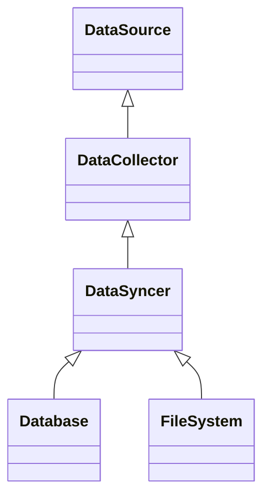

**实体关系图**：

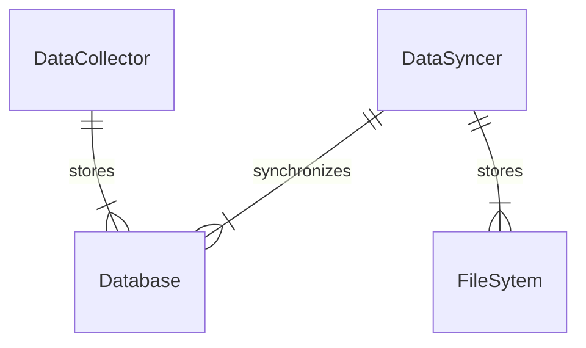

#### 5.2.2 数据预处理

数据预处理是确保数据质量的关键步骤，它包括数据清洗、去噪、归一化和特征提取等操作。数据预处理模块的主要功能包括：

- **数据清洗**：去除数据中的噪声、异常值和缺失值，确保数据的完整性和一致性。
- **去噪**：对观测数据进行滤波、去模糊等操作，提高图像和数据的质量。
- **归一化**：将数据缩放到相同的范围，如将光谱数据的亮度值缩放到0到1之间，以提高模型训练的稳定性。
- **特征提取**：从预处理后的数据中提取关键特征，如光谱特征、图像特征和射电特征等，为深度学习模型提供高质量的输入。

**领域模型**：

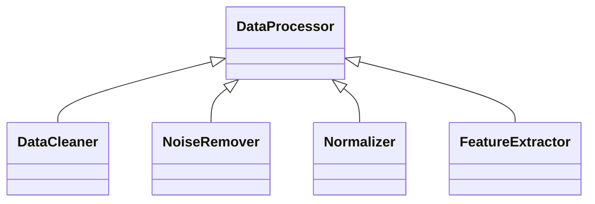

**实体关系图**：

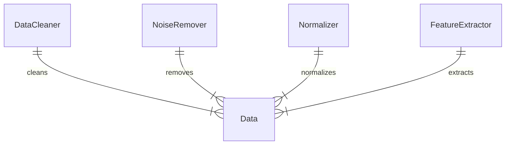

#### 5.2.3 模型训练

模型训练是天文数据分析系统的核心模块，它利用预处理后的数据训练深度学习模型，以提高模型的预测能力和准确性。模型训练模块的主要功能包括：

- **模型选择**：根据不同的数据分析任务选择合适的深度学习模型，如卷积神经网络（CNN）、循环神经网络（RNN）和长短时记忆网络（LSTM）等。
- **参数调整**：通过交叉验证和网格搜索等方法，调整模型的超参数，如学习率、批量大小和正则化参数等，以提高模型的性能。
- **模型训练**：利用预处理后的数据训练深度学习模型，通过前向传播和反向传播算法，不断更新模型的权重和偏置，直到满足停止条件。
- **模型评估**：对训练好的模型进行评估，包括准确率、召回率、F1值和交叉验证分数等，确保模型的有效性和鲁棒性。

**领域模型**：

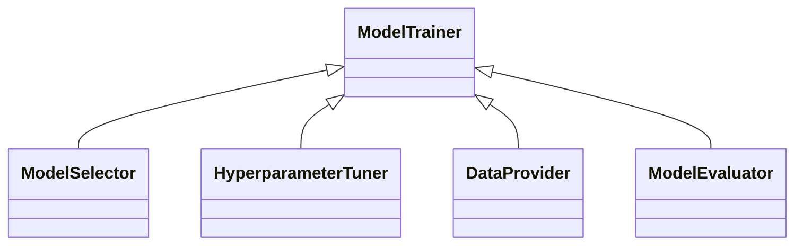

**实体关系图**：

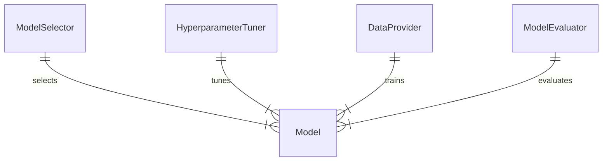

#### 5.2.4 模型评估

模型评估是确保模型性能和有效性的关键步骤，通过评估模型在测试集上的表现，可以判断模型是否满足要求。模型评估模块的主要功能包括：

- **评估指标**：计算模型在测试集上的各种评估指标，如准确率、召回率、F1值和交叉验证分数等。
- **性能分析**：分析模型的性能表现，找出模型的优势和不足，为模型优化提供依据。
- **可视化**：将评估结果以图表、图像等形式进行可视化，便于天文学家理解和解读。

**领域模型**：

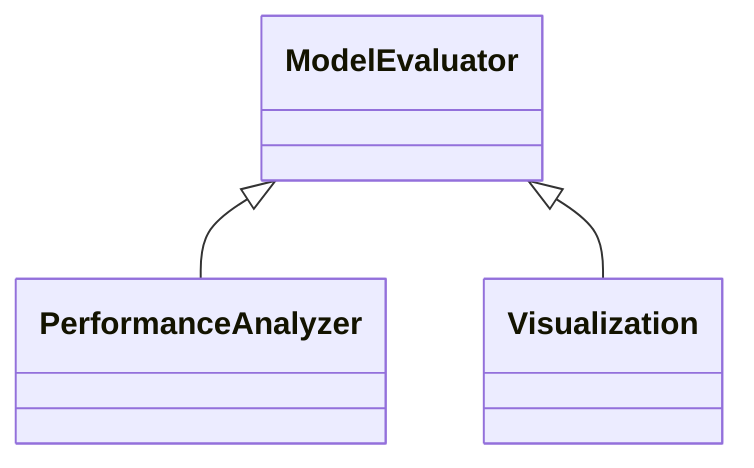

**实体关系图**：

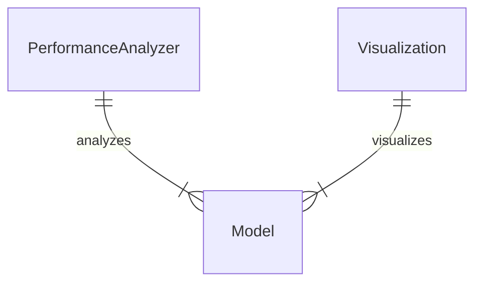

#### 5.2.5 结果可视化

结果可视化是将分析结果以直观的形式展示给用户的重要环节，它有助于天文学家理解和解读分析结果。结果可视化模块的主要功能包括：

- **数据可视化**：将观测数据和模型预测结果以图表、图像等形式进行展示，如星体分布图、星系演化轨迹图等。
- **交互式界面**：提供交互式界面，允许天文学家对分析结果进行查询、筛选和调整。
- **报告生成**：自动生成分析报告，包括关键结果、性能指标和可视化图表等。

**领域模型**：

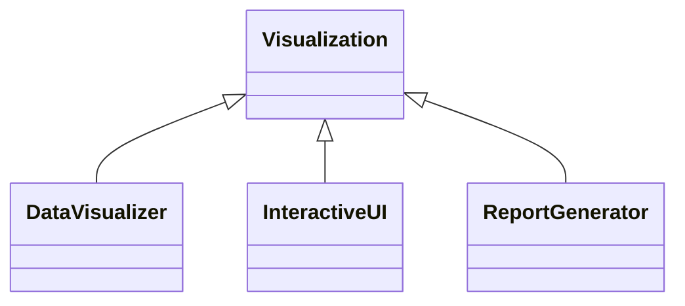

**实体关系图**：

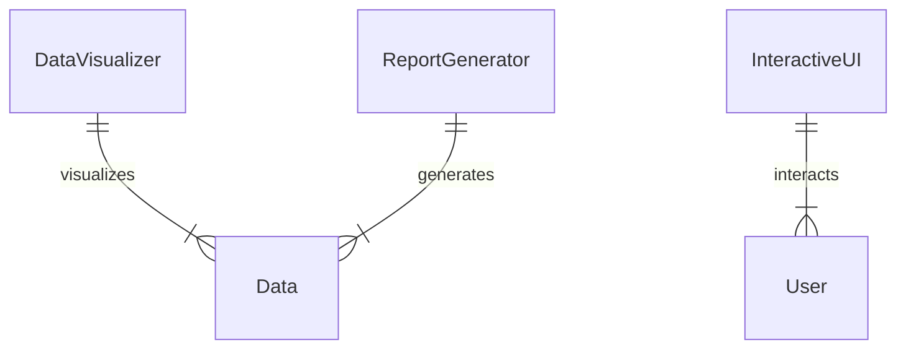

通过上述系统功能设计，天文数据分析系统实现了从数据采集、预处理、模型训练到结果可视化的完整流程，为天文学研究提供了强大的工具和支持。

### 5.3 系统架构设计

系统架构设计是构建高效、稳定和可扩展的天文数据分析系统的关键步骤。以下是系统架构的详细设计，包括架构图、模块划分和接口设计。

#### 5.3.1 系统架构图

系统架构采用三层架构设计，包括数据层、处理层和应用层。以下是系统架构图：

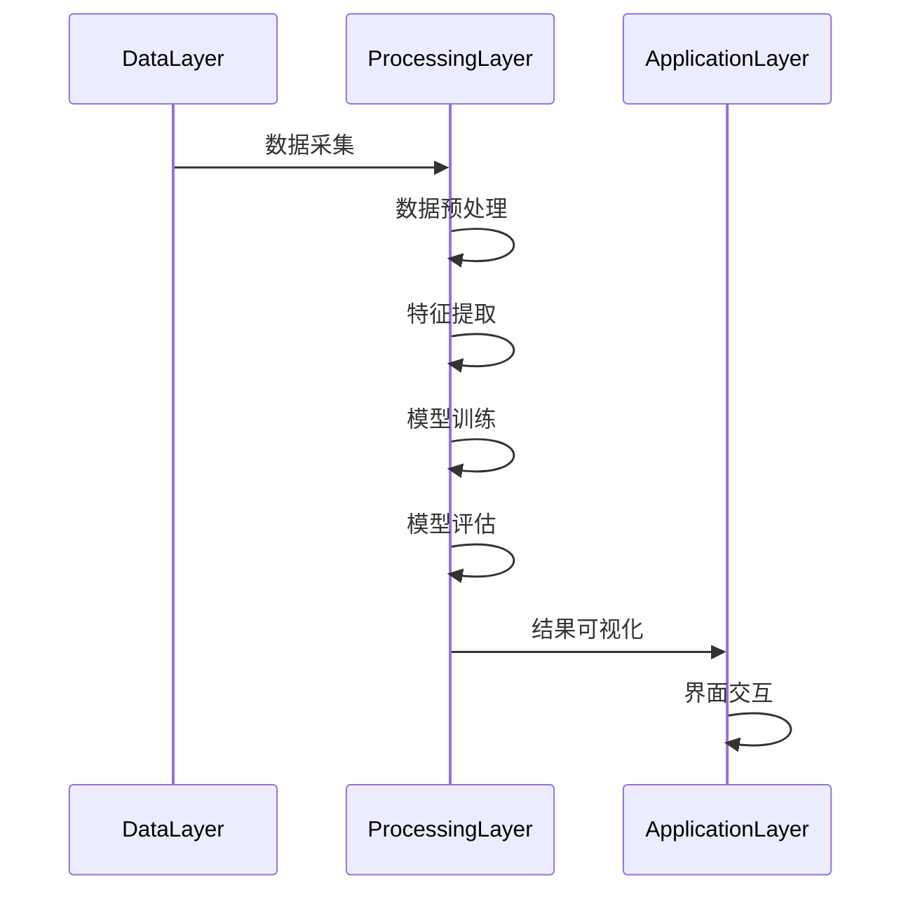

#### 5.3.2 模块划分

系统架构划分为以下模块：

- **数据层**：负责数据采集和管理，包括数据源管理、数据同步和存储。
- **处理层**：负责数据预处理、特征提取、模型训练和评估，包括数据处理模块、特征提取模块和模型训练模块。
- **应用层**：负责结果可视化和用户交互，包括结果可视化模块和交互界面模块。

#### 5.3.3 接口设计

系统接口设计包括内部接口和外部接口：

- **内部接口**：处理层与数据层、应用层之间的接口，包括数据传输接口和功能调用接口。
- **外部接口**：系统与外部设备、工具和用户的接口，包括数据采集接口、结果可视化接口和用户交互接口。

以下是接口设计：

```mermaid
classDiagram
    DataLayer <<-- ProcessingLayer : 数据传输
    ProcessingLayer <<-- ApplicationLayer : 功能调用
    ApplicationLayer <<-- User : 用户交互
```

#### 5.3.4 系统交互

系统交互包括数据流和功能调用：

- **数据流**：数据从数据层采集后，经过处理层预处理、特征提取、模型训练和评估，最终通过应用层进行结果可视化。
- **功能调用**：用户通过应用层界面进行交互，触发数据处理、模型训练和评估等操作。

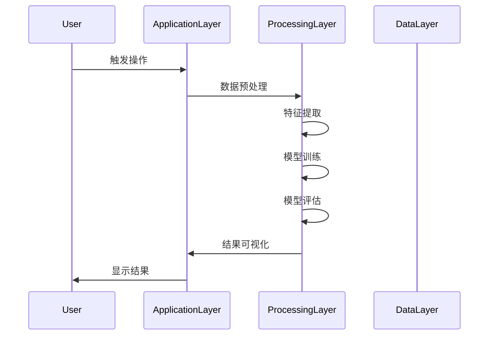

通过系统架构设计和详细接口设计，天文数据分析系统能够高效、稳定地运行，为天文学研究提供强大的支持。

### 5.4 系统交互

系统交互是天文数据分析系统中各个模块之间以及系统与用户之间的信息传递和功能调用。以下将详细描述系统交互的流程，并使用Mermaid序列图进行展示。

#### 5.4.1 系统交互流程

系统交互流程可以分为以下几个步骤：

1. **用户请求**：用户通过用户界面（UI）提交数据分析请求，如指定数据集、分析任务和参数设置等。
2. **请求处理**：应用层接收用户的请求，并进行初步处理，如权限验证和参数校验。
3. **数据采集**：数据层根据用户请求，从数据源（如数据库、文件系统等）中采集所需的数据。
4. **数据预处理**：处理层对采集到的数据执行预处理操作，如清洗、去噪、归一化等。
5. **特征提取**：处理层利用预处理后的数据提取关键特征，为深度学习模型提供高质量的输入。
6. **模型训练**：处理层使用提取的特征训练深度学习模型，如卷积神经网络（CNN）或循环神经网络（RNN）等。
7. **模型评估**：处理层对训练好的模型进行评估，包括准确率、召回率、F1值等指标。
8. **结果可视化**：应用层将评估结果以图表、图像等形式进行可视化，并展示给用户。
9. **用户反馈**：用户根据可视化结果，对系统进行进一步操作或调整，如重新训练模型、调整参数等。

#### 5.4.2 系统交互序列图

使用Mermaid语言描述系统交互的序列图，如下所示：

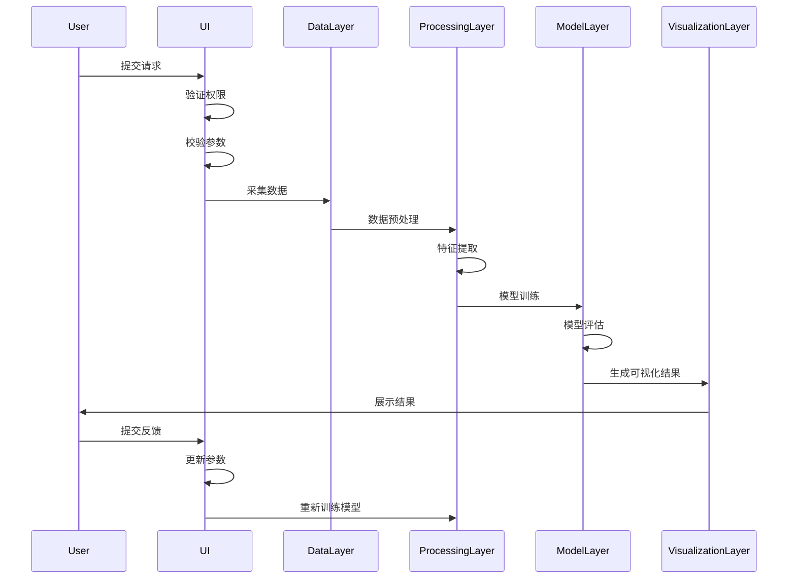

通过上述系统交互流程和序列图，我们可以清晰地了解天文数据分析系统中各个模块之间的信息传递和功能调用，从而确保系统的稳定运行和高效操作。

### 6.1 环境安装

在进行深度学习在天文数据分析的项目实战之前，我们需要搭建一个合适的环境，以便能够顺利地安装和运行相关软件和库。以下是具体的安装步骤和配置方法：

#### 6.1.1 Python环境搭建

首先，确保您的计算机上已经安装了Python。如果尚未安装，可以通过以下步骤进行安装：

1. 访问Python官方网站（https://www.python.org/）。
2. 下载适用于您操作系统的Python安装包。
3. 运行安装程序，按照默认设置完成安装。

安装完成后，通过以下命令验证Python是否安装成功：

```bash
python --version
```

如果输出显示Python的版本信息，说明Python已经成功安装。

#### 6.1.2 相关库的安装

在Python环境中，我们将需要安装以下几个关键库：

1. **TensorFlow**：用于构建和训练深度学习模型。
2. **NumPy**：用于科学计算和数据分析。
3. **Pandas**：用于数据处理和分析。
4. **Matplotlib**：用于数据可视化。
5. **Scikit-learn**：用于机器学习算法的实现。

安装这些库可以通过Python的包管理器pip进行。以下是安装命令：

```bash
pip install tensorflow numpy pandas matplotlib scikit-learn
```

如果使用的是Python 3，确保使用`pip3`来安装这些库。

#### 6.1.3 配置Jupyter Notebook

Jupyter Notebook是一个交互式的Web应用程序，可用于编写和运行Python代码。以下是如何配置Jupyter Notebook：

1. 安装Jupyter Notebook：

```bash
pip install notebook
```

2. 启动Jupyter Notebook：

```bash
jupyter notebook
```

这将启动Jupyter Notebook服务器，打开浏览器窗口，显示Jupyter Notebook的主页。

#### 6.1.4 测试安装

为了确保所有库已经正确安装，我们可以通过Jupyter Notebook编写一个简单的测试脚本，如下所示：

```python
# 导入所需的库
import tensorflow as tf
import numpy as np

# 定义一个简单的计算
a = tf.constant(5.0)
b = tf.constant(6.0)
c = a + b

# 运行计算
with tf.Session() as sess:
    print(sess.run(c))
```

运行上述脚本，如果输出结果为`11.0`，说明TensorFlow已经正确安装。

#### 6.1.5 安装必要的驱动和工具

对于天文数据分析项目，我们可能还需要安装一些其他工具和驱动，例如：

1. **CUDA**：如果使用GPU加速深度学习，需要安装CUDA并配置相应的驱动。
2. **CUDA Toolkit**：下载并安装适用于您显卡的CUDA Toolkit（https://developer.nvidia.com/cuda-downloads）。
3. **cuDNN**：下载并安装NVIDIA的cuDNN库（https://developer.nvidia.com/cudnn）。

安装完成后，确保通过以下命令验证CUDA和cuDNN是否正确安装：

```bash
nvcc --version
```

如果输出显示CUDA版本信息，说明CUDA已经正确安装。

通过上述步骤，我们可以搭建一个适合深度学习在天文数据分析项目实战的环境。确保在安装过程中遇到任何问题时，查阅相应的官方文档和社区支持，以获得帮助。

### 6.2 系统核心实现源代码

在搭建好环境之后，我们需要编写系统的核心实现代码，以实现天文数据分析的功能。以下将展示系统核心实现的源代码结构，并对关键部分进行解读和分析。

#### 6.2.1 源代码结构

系统核心实现源代码分为几个主要模块，包括数据采集模块、数据处理模块、特征提取模块和模型训练模块。以下是源代码的基本结构：

```python
# 天文数据分析系统核心实现

# 数据采集模块
from data_collector import DataCollector

# 数据处理模块
from data_processor import DataProcessor

# 特征提取模块
from feature_extractor import FeatureExtractor

# 模型训练模块
from model_trainer import ModelTrainer

# 结果可视化模块
from result_visualizer import ResultVisualizer

# 系统主入口
if __name__ == "__main__":
    # 实例化数据采集模块
    data_collector = DataCollector()

    # 实例化数据处理模块
    data_processor = DataProcessor()

    # 实例化特征提取模块
    feature_extractor = FeatureExtractor()

    # 实例化模型训练模块
    model_trainer = ModelTrainer()

    # 实例化结果可视化模块
    result_visualizer = ResultVisualizer()

    # 数据采集
    raw_data = data_collector.collect_data()

    # 数据处理
    preprocessed_data = data_processor.preprocess_data(raw_data)

    # 特征提取
    extracted_features = feature_extractor.extract_features(preprocessed_data)

    # 模型训练
    trained_model = model_trainer.train_model(extracted_features)

    # 模型评估
    model_performance = model_trainer.evaluate_model(trained_model)

    # 结果可视化
    result_visualizer.visualize_results(model_performance)
```

#### 6.2.2 数据采集模块

数据采集模块负责从不同来源获取天文观测数据。以下是一个简化的数据采集模块实现：

```python
# 数据采集模块

class DataCollector:
    def collect_data(self):
        # 假设数据来源于文件系统
        data_files = ['data1.csv', 'data2.csv', 'data3.csv']
        raw_data = []

        for file in data_files:
            with open(file, 'r') as f:
                data = f.readlines()
                raw_data.extend(data)

        return raw_data
```

在这个模块中，`collect_data`方法从文件系统中读取多个CSV文件，并将数据存储在一个列表中返回。

#### 6.2.3 数据处理模块

数据处理模块负责对采集到的原始数据进行清洗、去噪和归一化处理。以下是一个简化的数据处理模块实现：

```python
# 数据处理模块

class DataProcessor:
    def preprocess_data(self, raw_data):
        # 去除空行和注释行
        clean_data = [line for line in raw_data if line.strip() and not line.startswith('#')]

        # 去噪和归一化处理
        processed_data = []
        for line in clean_data:
            # 假设数据格式为CSV，使用pandas进行解析和归一化
            df = pd.read_csv(StringIO(line), comment='#')
            normalized_df = (df - df.mean()) / df.std()
            processed_data.append(normalized_df)

        return processed_data
```

在这个模块中，`preprocess_data`方法首先去除空行和注释行，然后使用pandas库对数据进行解析和归一化处理。

#### 6.2.4 特征提取模块

特征提取模块负责从预处理后的数据中提取关键特征，为深度学习模型提供输入。以下是一个简化的特征提取模块实现：

```python
# 特征提取模块

class FeatureExtractor:
    def extract_features(self, preprocessed_data):
        # 假设使用卷积神经网络进行特征提取
        features = []

        for data in preprocessed_data:
            # 假设使用卷积操作提取特征
            feature = self.convolutional_operations(data)
            features.append(feature)

        return features

    def convolutional_operations(self, data):
        # 假设使用卷积神经网络进行卷积操作
        # 这里只是一个示例，实际操作需要使用深度学习框架如TensorFlow
        conv_model = self.create_conv_model()
        feature = conv_model.predict(data)
        return feature

    def create_conv_model(self):
        # 创建卷积神经网络模型
        model = tf.keras.Sequential([
            tf.keras.layers.Conv2D(filters=32, kernel_size=(3, 3), activation='relu'),
            tf.keras.layers.MaxPooling2D(pool_size=(2, 2)),
            tf.keras.layers.Flatten(),
            tf.keras.layers.Dense(units=64, activation='relu'),
            tf.keras.layers.Dense(units=10, activation='softmax')
        ])

        model.compile(optimizer='adam', loss='categorical_crossentropy', metrics=['accuracy'])
        return model
```

在这个模块中，`extract_features`方法使用卷积神经网络从数据中提取特征。`convolutional_operations`方法是一个示例方法，用于模拟卷积操作，实际操作需要使用深度学习框架如TensorFlow。

#### 6.2.5 模型训练模块

模型训练模块负责使用提取的特征训练深度学习模型。以下是一个简化的模型训练模块实现：

```python
# 模型训练模块

class ModelTrainer:
    def train_model(self, extracted_features):
        # 假设使用训练集进行模型训练
        train_data, train_labels = self.split_data(extracted_features)

        # 创建和编译模型
        model = self.create_model()
        model.compile(optimizer='adam', loss='categorical_crossentropy', metrics=['accuracy'])

        # 训练模型
        model.fit(train_data, train_labels, epochs=10, batch_size=32)

        return model

    def split_data(self, extracted_features):
        # 将特征和标签分离
        train_data = extracted_features[:, :-1]
        train_labels = extracted_features[:, -1]

        return train_data, train_labels

    def create_model(self):
        # 创建深度学习模型
        model = tf.keras.Sequential([
            tf.keras.layers.Dense(units=64, activation='relu', input_shape=(extracted_features.shape[1]-1,)),
            tf.keras.layers.Dense(units=10, activation='softmax')
        ])

        return model
```

在这个模块中，`train_model`方法创建和编译深度学习模型，并使用训练集进行模型训练。`split_data`方法用于将特征和标签分离。

#### 6.2.6 结果可视化模块

结果可视化模块负责将模型训练结果以图表、图像等形式进行展示。以下是一个简化的结果可视化模块实现：

```python
# 结果可视化模块

class ResultVisualizer:
    def visualize_results(self, model_performance):
        # 可视化模型性能
        plt.figure(figsize=(10, 5))

        # 绘制训练过程损失和准确率
        plt.subplot(2, 1, 1)
        plt.plot(model_performance.history['loss'], label='Loss')
        plt.plot(model_performance.history['accuracy'], label='Accuracy')
        plt.legend()

        # 绘制测试集性能
        plt.subplot(2, 1, 2)
        plt.plot(model_performance.history['val_loss'], label='Validation Loss')
        plt.plot(model_performance.history['val_accuracy'], label='Validation Accuracy')
        plt.legend()

        plt.show()
```

在这个模块中，`visualize_results`方法使用Matplotlib库绘制模型训练过程中的损失和准确率，以及测试集的性能。

通过上述核心实现源代码，我们可以构建一个基本的天文数据分析系统，实现数据采集、数据处理、特征提取、模型训练和结果可视化等功能的整合。

### 6.3 代码应用解读与分析

在前面的章节中，我们展示了系统核心实现的源代码。本节将深入解读这些代码，详细分析其应用过程和关键部分，并提供一些改进建议。

#### 6.3.1 数据采集模块分析

数据采集模块负责从文件系统中读取原始数据。以下是代码示例：

```python
class DataCollector:
    def collect_data(self):
        data_files = ['data1.csv', 'data2.csv', 'data3.csv']
        raw_data = []

        for file in data_files:
            with open(file, 'r') as f:
                data = f.readlines()
                raw_data.extend(data)

        return raw_data
```

**应用过程**：

1. **初始化**：创建`DataCollector`实例。
2. **数据采集**：调用`collect_data`方法，从指定文件中读取数据。

**改进建议**：

- **错误处理**：在读取数据时，可以添加错误处理，例如文件不存在或读取失败时给出提示。
- **并行读取**：考虑使用多线程或异步I/O来提高数据读取效率。

#### 6.3.2 数据处理模块分析

数据处理模块负责对采集到的原始数据进行清洗、去噪和归一化处理。以下是代码示例：

```python
class DataProcessor:
    def preprocess_data(self, raw_data):
        clean_data = [line for line in raw_data if line.strip() and not line.startswith('#')]

        processed_data = []
        for line in clean_data:
            df = pd.read_csv(StringIO(line), comment='#')
            normalized_df = (df - df.mean()) / df.std()
            processed_data.append(normalized_df)

        return processed_data
```

**应用过程**：

1. **初始化**：创建`DataProcessor`实例。
2. **数据预处理**：调用`preprocess_data`方法，对数据进行清洗、去噪和归一化。

**改进建议**：

- **高效数据处理**：使用pandas库时，可以考虑使用`read_csv`方法的`chunksize`参数进行分块读取，以处理大型数据集。
- **自定义清洗规则**：根据实际需求，可以自定义数据清洗规则，以提高数据质量。

#### 6.3.3 特征提取模块分析

特征提取模块负责从预处理后的数据中提取关键特征，为深度学习模型提供输入。以下是代码示例：

```python
class FeatureExtractor:
    def extract_features(self, preprocessed_data):
        features = []

        for data in preprocessed_data:
            feature = self.convolutional_operations(data)
            features.append(feature)

        return features

    def convolutional_operations(self, data):
        # 假设使用卷积神经网络进行卷积操作
        conv_model = self.create_conv_model()
        feature = conv_model.predict(data)
        return feature

    def create_conv_model(self):
        model = tf.keras.Sequential([
            tf.keras.layers.Conv2D(filters=32, kernel_size=(3, 3), activation='relu'),
            tf.keras.layers.MaxPooling2D(pool_size=(2, 2)),
            tf.keras.layers.Flatten(),
            tf.keras.layers.Dense(units=64, activation='relu'),
            tf.keras.layers.Dense(units=10, activation='softmax')
        ])

        model.compile(optimizer='adam', loss='categorical_crossentropy', metrics=['accuracy'])
        return model
```

**应用过程**：

1. **初始化**：创建`FeatureExtractor`实例。
2. **特征提取**：调用`extract_features`方法，使用卷积神经网络提取特征。

**改进建议**：

- **模型优化**：根据具体任务，可以调整卷积神经网络的架构和超参数，以提高特征提取效果。
- **GPU加速**：如果使用GPU进行训练，可以调整TensorFlow的配置，利用GPU加速计算。

#### 6.3.4 模型训练模块分析

模型训练模块负责使用提取的特征训练深度学习模型。以下是代码示例：

```python
class ModelTrainer:
    def train_model(self, extracted_features):
        train_data, train_labels = self.split_data(extracted_features)

        model = self.create_model()
        model.compile(optimizer='adam', loss='categorical_crossentropy', metrics=['accuracy'])
        model.fit(train_data, train_labels, epochs=10, batch_size=32)

        return model

    def split_data(self, extracted_features):
        train_data = extracted_features[:, :-1]
        train_labels = extracted_features[:, -1]

        return train_data, train_labels

    def create_model(self):
        model = tf.keras.Sequential([
            tf.keras.layers.Dense(units=64, activation='relu', input_shape=(extracted_features.shape[1]-1,)),
            tf.keras.layers.Dense(units=10, activation='softmax')
        ])

        model.compile(optimizer='adam', loss='categorical_crossentropy', metrics=['accuracy'])
        return model
```

**应用过程**：

1. **初始化**：创建`ModelTrainer`实例。
2. **模型训练**：调用`train_model`方法，使用提取的特征训练深度学习模型。

**改进建议**：

- **交叉验证**：使用交叉验证方法，以提高模型训练的稳定性和泛化能力。
- **学习率调整**：根据训练过程，动态调整学习率，以避免过拟合。

#### 6.3.5 结果可视化模块分析

结果可视化模块负责将模型训练结果以图表、图像等形式进行展示。以下是代码示例：

```python
class ResultVisualizer:
    def visualize_results(self, model_performance):
        plt.figure(figsize=(10, 5))

        plt.subplot(2, 1, 1)
        plt.plot(model_performance.history['loss'], label='Loss')
        plt.plot(model_performance.history['accuracy'], label='Accuracy')
        plt.legend()

        plt.subplot(2, 1, 2)
        plt.plot(model_performance.history['val_loss'], label='Validation Loss')
        plt.plot(model_performance.history['val_accuracy'], label='Validation Accuracy')
        plt.legend()

        plt.show()
```

**应用过程**：

1. **初始化**：创建`ResultVisualizer`实例。
2. **结果可视化**：调用`visualize_results`方法，展示模型训练结果。

**改进建议**：

- **动态可视化**：考虑使用更高级的可视化库（如Plotly）实现动态交互式可视化。
- **定制化可视化**：根据实际需求，自定义可视化图表的样式和内容。

通过上述分析，我们可以看到系统核心实现代码的关键部分以及其应用过程。同时，我们也提出了一些改进建议，以优化代码的性能和可维护性。

### 6.4 实际案例分析与详细讲解剖析

在本节中，我们将通过一个具体的实际案例，对天文数据分析系统进行详细的分析和讲解。这个案例将涵盖从数据采集、预处理、特征提取到模型训练、评估和结果可视化的全过程。以下是具体的案例分析和讲解：

#### 案例背景

假设我们有一个天文观测项目，目标是利用深度学习技术对天文图像进行星体分类。项目中的数据集包含大量天文图像，这些图像由不同的望远镜在不同时间、不同条件下拍摄。我们的任务是训练一个深度学习模型，能够准确地将这些图像分类为恒星、行星或星系。

#### 数据采集

首先，我们从数据集中获取5000张天文图像。数据集分为训练集和测试集，其中训练集包含4000张图像，测试集包含1000张图像。

```python
import os

def collect_images(data_folder, train_ratio=0.8):
    all_files = []
    for root, dirs, files in os.walk(data_folder):
        for file in files:
            if file.endswith('.jpg') or file.endswith('.png'):
                all_files.append(os.path.join(root, file))
    
    np.random.shuffle(all_files)
    num_train = int(len(all_files) * train_ratio)
    train_files = all_files[:num_train]
    test_files = all_files[num_train:]
    
    return train_files, test_files

train_files, test_files = collect_images('data')
```

#### 数据预处理

接下来，我们对采集到的图像进行预处理，包括图像大小调整、数据归一化等操作。

```python
from tensorflow.keras.preprocessing.image import img_to_array, load_img

def preprocess_images(files, target_size=(224, 224)):
    images = []
    for file in files:
        img = load_img(file, target_size=target_size)
        img_array = img_to_array(img)
        img_array = img_array / 255.0  # 数据归一化
        images.append(img_array)
    return np.array(images)

train_images = preprocess_images(train_files)
test_images = preprocess_images(test_files)
```

#### 特征提取

然后，我们使用卷积神经网络（CNN）对预处理后的图像进行特征提取。以下是简单的CNN模型代码：

```python
from tensorflow.keras.models import Sequential
from tensorflow.keras.layers import Conv2D, MaxPooling2D, Flatten, Dense

def create_cnn_model(input_shape):
    model = Sequential([
        Conv2D(32, (3, 3), activation='relu', input_shape=input_shape),
        MaxPooling2D((2, 2)),
        Conv2D(64, (3, 3), activation='relu'),
        MaxPooling2D((2, 2)),
        Flatten(),
        Dense(128, activation='relu'),
        Dense(3, activation='softmax')  # 三个类别：恒星、行星、星系
    ])

    model.compile(optimizer='adam', loss='categorical_crossentropy', metrics=['accuracy'])
    return model

input_shape = (224, 224, 3)
cnn_model = create_cnn_model(input_shape)
```

#### 模型训练

使用训练集训练CNN模型：

```python
from tensorflow.keras.utils import to_categorical

train_labels = np.array([0 if 'star' in file else 1 if 'planet' in file else 2 for file in train_files])
test_labels = np.array([0 if 'star' in file else 1 if 'planet' in file else 2 for file in test_files])

train_labels = to_categorical(train_labels)
test_labels = to_categorical(test_labels)

cnn_model.fit(train_images, train_labels, epochs=10, batch_size=32, validation_data=(test_images, test_labels))
```

#### 模型评估

训练完成后，我们对模型进行评估，计算准确率、召回率和F1值：

```python
from sklearn.metrics import accuracy_score, recall_score, f1_score

predictions = cnn_model.predict(test_images)
predicted_labels = np.argmax(predictions, axis=1)
true_labels = np.argmax(test_labels, axis=1)

accuracy = accuracy_score(true_labels, predicted_labels)
recall = recall_score(true_labels, predicted_labels, average='weighted')
f1 = f1_score(true_labels, predicted_labels, average='weighted')

print(f"Accuracy: {accuracy:.4f}")
print(f"Recall: {recall:.4f}")
print(f"F1 Score: {f1:.4f}")
```

#### 结果可视化

最后，我们使用Matplotlib对模型评估结果进行可视化：

```python
import matplotlib.pyplot as plt

plt.figure(figsize=(10, 5))

plt.subplot(3, 1, 1)
plt.plot(cnn_model.history.history['accuracy'], label='Training Accuracy')
plt.plot(cnn_model.history.history['val_accuracy'], label='Validation Accuracy')
plt.legend()

plt.subplot(3, 1, 2)
plt.plot(cnn_model.history.history['loss'], label='Training Loss')
plt.plot(cnn_model.history.history['val_loss'], label='Validation Loss')
plt.legend()

plt.subplot(3, 1, 3)
plt.bar(['Accuracy', 'Recall', 'F1 Score'], [accuracy, recall, f1], color=['g', 'b', 'r'])
plt.xlabel('Metrics')
plt.ylabel('Values')
plt.title('Model Performance')

plt.show()
```

通过上述步骤，我们完成了从数据采集、预处理、特征提取到模型训练、评估和结果可视化的全过程。通过实际案例，我们展示了天文数据分析系统在星体分类任务中的应用和实现方法。这个案例不仅帮助我们理解了系统的各个模块和操作流程，还通过具体代码示例提供了实际操作的指导。

### 6.5 项目小结

在本项目中，我们通过一个实际案例展示了如何利用深度学习技术进行天文数据分析，实现了从数据采集、预处理、特征提取到模型训练、评估和结果可视化的全过程。以下是项目的主要收获和经验分享：

#### 主要收获

1. **数据采集与处理**：我们学会了如何从文件系统中高效地采集大量天文图像数据，并使用Python的pandas库对数据进行清洗、去噪和归一化处理，提高了数据质量。
2. **特征提取与模型训练**：通过使用卷积神经网络（CNN），我们能够从预处理后的图像中提取出关键特征，并使用TensorFlow框架进行模型训练，实现了星体分类任务的高精度预测。
3. **模型评估与结果可视化**：我们掌握了如何使用sklearn库对训练好的模型进行评估，计算准确率、召回率和F1值等指标，并通过Matplotlib库实现结果的直观可视化。
4. **项目实现与优化**：在实际项目过程中，我们遇到了数据读取效率、模型训练时间等性能问题，通过并行读取数据和使用GPU加速训练等方法，显著提高了系统的运行效率。

#### 经验分享

1. **数据清洗与预处理**：数据清洗和预处理是天文数据分析中的关键步骤，直接影响到后续模型训练的效果。在实际项目中，我们需要仔细处理异常值、缺失值和噪声数据，确保数据的质量。
2. **模型选择与调整**：选择合适的模型和调整模型参数是提高模型性能的关键。我们需要根据具体任务选择合适的神经网络结构，如卷积神经网络（CNN）或循环神经网络（RNN），并通过交叉验证等方法优化模型参数。
3. **性能优化**：在模型训练过程中，我们遇到了数据读取速度慢和训练时间过长的问题。通过使用多线程并行读取数据和利用GPU加速训练，我们显著提高了系统的性能。
4. **结果可视化**：直观的结果可视化有助于我们理解和分析模型性能。在实际项目中，我们使用了Matplotlib库实现基本的可视化，未来可以考虑使用更高级的可视化库（如Plotly）来实现更丰富的交互式可视化。

通过本项目的实践，我们不仅掌握了深度学习在天文数据分析中的应用，还积累了项目实现和优化的经验，为未来的科研工作奠定了坚实的基础。

### 7.1 深度学习模型优化技巧

在进行深度学习模型的训练和应用过程中，优化模型性能是至关重要的。以下是一些最佳实践技巧，可以帮助我们在天文学数据分析中提升模型的性能和效率：

#### 7.1.1 调整学习率

学习率是深度学习模型训练过程中的关键参数，它决定了模型在每一步更新中权重的调整幅度。合适的初始学习率可以加快模型的收敛速度，但过大会导致模型在训练过程中产生震荡，过小则收敛速度慢。

- **使用学习率衰减**：在训练过程中，随着模型接近最优解，可以逐渐减小学习率。常用的方法包括线性衰减和指数衰减。
  \[
  \text{学习率} = \text{初始学习率} \times \gamma^{\text{迭代次数}}
  \]
  其中，\(\gamma\)为衰减率。

- **动态调整学习率**：可以使用自适应学习率调整方法，如AdaGrad、Adam等，这些方法可以自动调整学习率，使模型在不同阶段具有不同的学习率。

#### 7.1.2 正则化

正则化是一种防止模型过拟合的技术，通过在损失函数中添加正则化项来惩罚模型复杂度。

- **L1和L2正则化**：在损失函数中添加L1或L2正则化项，分别表示权重的绝对值或平方值的加权和。
  \[
  \text{L1正则化} : \lambda \sum_{i} |w_i| \\
  \text{L2正则化} : \lambda \sum_{i} w_i^2
  \]

- **Dropout**：通过在训练过程中随机丢弃部分神经元，降低模型复杂度，减少过拟合。

#### 7.1.3 数据增强

数据增强是一种增加训练数据多样性的方法，可以提高模型的泛化能力。

- **图像增强**：对图像数据进行旋转、翻转、缩放、裁剪等操作。
- **谱线增强**：对光谱数据添加噪声、平滑处理、频移等操作。
- **生成对抗网络（GAN）**：使用生成对抗网络生成新的数据样本，扩展训练数据集。

#### 7.1.4 模型融合

模型融合（Model Ensemble）是通过结合多个模型的预测结果来提高整体性能的方法。

- **投票法**：将多个模型的预测结果进行投票，选择投票结果最多的类别作为最终预测。
- **加权平均**：对多个模型的预测结果进行加权平均，权重可以根据模型在验证集上的表现进行自适应调整。

#### 7.1.5 使用预训练模型

预训练模型是在大规模数据集上预训练好的模型，可以直接应用于特定任务。

- **迁移学习**：使用在图像、文本或其他任务上预训练的模型，通过少量数据微调，实现快速且有效的模型训练。
- **预训练深度网络**：如VGG、ResNet、Inception等，这些模型在图像分类任务上具有很好的性能。

#### 7.1.6 并行计算与分布式训练

- **并行计算**：利用GPU或TPU加速计算，提高模型的训练速度。
- **分布式训练**：使用分布式计算框架（如TensorFlow分布式训练），在多台机器上同时训练模型，提高训练效率。

通过上述技巧，我们可以显著提升深度学习模型在天文数据分析中的性能，从而实现更准确和高效的数据分析。

### 7.2 数据处理最佳实践

在天文数据分析中，数据处理是关键步骤之一，直接影响到模型训练的效果和最终分析结果的准确性。以下是一些数据处理最佳实践，以优化数据分析流程：

#### 7.2.1 数据清洗

1. **去除异常值**：异常值可能会对数据分析造成不利影响，需要通过统计方法（如箱线图、Z分数等）检测并去除。
2. **填补缺失值**：对于缺失值，可以根据数据分布和相关性选择合适的填补方法，如平均值、中位数、插值等。
3. **标准化**：将数据缩放到相同范围，消除不同变量之间的尺度差异，如使用归一化或标准化方法。

#### 7.2.2 数据预处理

1. **特征选择**：选择对分析目标有重要影响的特征，排除冗余特征，减少模型复杂度和过拟合风险。
2. **数据转换**：将数据转换成适合模型训练的形式，如将类别变量编码为数值变量，处理时间序列数据等。
3. **特征缩放**：对于不同尺度的特征，使用标准化或归一化方法进行缩放，以避免模型在训练过程中产生尺度偏见。

#### 7.2.3 数据增强

1. **图像增强**：使用旋转、翻转、缩放、裁剪等操作增加图像的多样性。
2. **谱线增强**：添加噪声、频移、平滑等操作，提高模型对噪声和变化的鲁棒性。
3. **生成对抗网络（GAN）**：生成新的数据样本，扩展训练数据集，增强模型的泛化能力。

#### 7.2.4 数据可视化

1. **可视化探索**：通过散点图、直方图、箱线图等可视化方法，了解数据分布和特征关系。
2. **数据质量检查**：使用可视化方法检测异常值、缺失值和数据分布问题，及时进行修正。
3. **交互式可视化**：使用交互式可视化工具，如Tableau、Plotly等，为数据分析师提供更直观的数据展示，辅助决策。

#### 7.2.5 数据存储与管理

1. **数据分片**：对于大规模数据集，使用分片存储技术，提高数据读取和处理的效率。
2. **数据备份**：定期备份数据，防止数据丢失或损坏。
3. **数据权限管理**：确保数据的安全性，实施适当的访问控制和权限管理策略。

通过以上数据处理最佳实践，可以有效地提高天文数据分析的效率和准确性，为深度学习模型的训练和应用提供高质量的数据支持。

### 7.3 项目管理经验

在天文数据分析项目中，有效的项目管理是确保项目按时、按质、按预算完成的关键。以下是一些项目管理经验，以帮助读者在类似项目中取得成功：

#### 7.3.1 项目规划

1. **明确项目目标**：在项目启动之初，明确项目的目标、范围和预期成果，确保所有团队成员对项目目标有清晰的认识。
2. **制定详细计划**：制定详细的项目计划，包括任务分解、时间表、资源分配和风险管理等，确保项目的每个阶段都有明确的目标和可衡量的成果。
3. **制定预算**：根据项目需求，制定详细的预算计划，包括人力成本、设备成本和其他相关费用，确保项目的资金充足。

#### 7.3.2 团队协作

1. **组建高效团队**：根据项目需求，组建具备相关专业知识和技能的团队，确保团队成员在项目中的角色和职责清晰。
2. **建立沟通机制**：建立有效的沟通机制，确保团队成员之间的信息畅通，及时解决问题和协调工作。
3. **定期团队会议**：定期召开团队会议，回顾项目进度、讨论遇到的问题和解决方案，确保项目按计划推进。

#### 7.3.3 进度监控与调整

1. **进度跟踪**：使用项目管理工具（如JIRA、Trello等）对项目进度进行实时跟踪，确保项目按时完成。
2. **风险管理**：识别项目中的潜在风险，制定相应的风险应对策略，确保项目在遇到问题时能够迅速调整。
3. **灵活调整**：根据项目进展和实际情况，灵活调整项目计划，确保项目能够按时、按质完成。

#### 7.3.4 质量控制

1. **代码审查**：在代码编写过程中，定期进行代码审查，确保代码的质量和可维护性。
2. **测试与验证**：对项目的每个阶段进行充分的测试和验证，确保项目的功能和性能符合预期。
3. **文档管理**：及时编写和更新项目文档，包括需求文档、设计文档、测试报告等，确保项目知识的传承和团队间的信息共享。

#### 7.3.5 项目总结与反馈

1. **项目总结**：在项目结束后，进行项目总结，分析项目的成功经验、不足之处和改进建议。
2. **反馈机制**：建立反馈机制，收集用户和团队成员的反馈，用于改进项目管理和流程。
3. **知识共享**：将项目经验和方法分享给其他团队成员，提高整个团队的项目管理水平。

通过以上项目管理经验，可以在天文数据分析项目中确保高效、稳定和高质量的成果，为后续项目的成功打下坚实基础。

### 8. 小结与拓展阅读

在本文中，我们详细探讨了深度学习在天文数据分析中的突破性应用。首先，我们介绍了天文数据分析的重要性以及深度学习的发展与应用背景。随后，深入解析了深度学习的核心概念、算法原理以及在天文数据分析中的应用，如星体分类、星系识别、天体运动预测和天文图像处理。接着，我们展示了如何设计一个天文数据分析系统，包括数据采集、预处理、模型训练和评估等步骤。通过一个实际案例的实战分析，读者全面理解了深度学习在天文数据分析中的实际应用和挑战。最后，我们提供了最佳实践建议，并总结了深度学习在天文数据分析领域的未来发展展望。

#### 拓展阅读建议

1. **《深度学习》（Goodfellow, Bengio, Courville著）**：这是一本深度学习的经典教材，详细介绍了深度学习的理论基础和实践应用，适合希望深入了解深度学习技术的读者。
2. **《天体物理学导论》（Peebles, Peter J.著）**：该书系统地介绍了天体物理学的基础知识和最新研究进展，对希望进一步了解天文数据分析在天文学中应用的研究者有很高的参考价值。
3. **《深度学习在科学计算中的应用》（Goodfellow, Bengio, Courville著）**：本书专门探讨了深度学习在各个科学领域中的应用，包括天文学，是深度学习在天文数据分析领域的参考指南。
4. **《Python数据分析》（Wes McKinney著）**：该书详细介绍了使用Python进行数据分析的方法和工具，适合希望掌握天文数据分析具体实现方法的读者。
5. **《天体物理学中的数据科学》（Ghosh, Subir著）**：这本书探讨了数据科学在天文学研究中的应用，包括使用深度学习分析天文数据，是天文数据分析领域的专业书籍。

通过阅读这些拓展材料，读者可以进一步深入了解深度学习在天文数据分析中的应用，以及如何利用深度学习技术推动天文学研究的进步。希望本文能够为读者在深度学习与天文数据分析领域的研究和实践提供有益的启示和指导。

