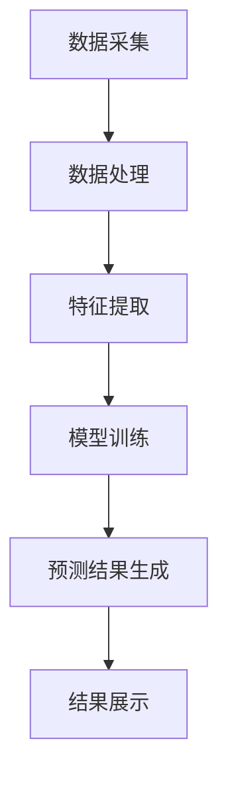
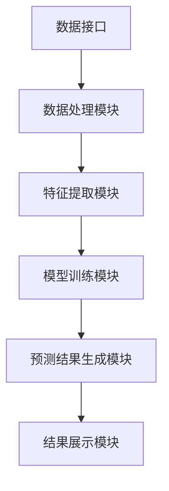
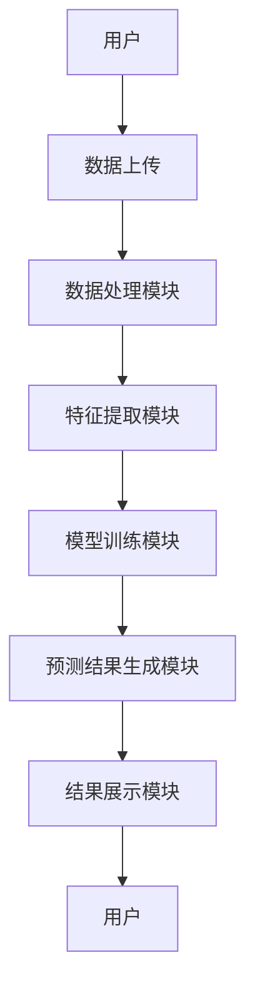

                 

### 《深度学习在天气预报中的应用与挑战》

---

**关键词：** 深度学习、天气预报、模型应用、挑战与对策

**摘要：** 本文系统探讨了深度学习在天气预报中的应用现状、挑战及其解决方案。通过对深度学习基本原理的介绍，以及其在天气预报中需求的分析，文章详细阐述了深度学习模型在天气预报中的应用，包括经典模型如CNN、RNN及其变种，以及Transformer模型。接着，文章通过实际案例展示了这些模型的运用，并分析了应用中遇到的挑战，如数据、计算资源、算法和预测准确性等方面，最后提出了相应的对策与未来展望。

---

### 目录大纲

---

#### 《深度学习在天气预报中的应用与挑战》

**关键词：** 深度学习、天气预报、模型应用、挑战与对策

**摘要：** 本文系统探讨了深度学习在天气预报中的应用现状、挑战及其解决方案。

---

### 第一部分：深度学习与天气预报概述

---

#### 第1章：深度学习的基本原理与应用场景

##### 1.1.1 深度学习的历史与发展

##### 1.1.2 深度学习的基本概念

##### 1.1.3 深度学习在天气预报中的潜在应用

##### 1.1.4 深度学习的优势与挑战

#### 第2章：天气预报的基本原理与需求

##### 2.1.1 天气预报的背景知识

##### 2.1.2 天气预报的基本流程

##### 2.1.3 深度学习在天气预报中的需求分析

#### 第3章：深度学习模型在天气预报中的应用

##### 3.1.1 经典深度学习模型介绍

##### 3.1.2 CNN在天气预报中的应用

##### 3.1.3 RNN及其变种在天气预报中的应用

##### 3.1.4 Transformer模型在天气预报中的应用

#### 第4章：深度学习在天气预报中的实际应用案例

##### 4.1.1 案例一：基于深度学习的短临天气预报

##### 4.1.2 案例二：基于深度学习的中长期天气预报

##### 4.1.3 案例三：深度学习在极端天气预测中的应用

#### 第5章：深度学习在天气预报中的挑战与对策

##### 5.1.1 数据挑战

##### 5.1.2 计算资源挑战

##### 5.1.3 算法挑战

##### 5.1.4 预测准确性挑战

##### 5.1.5 对策与未来展望

---

### 第二部分：深度学习模型在天气预报中的设计与实现

---

#### 第6章：深度学习模型设计原则

##### 6.1.1 设计原则与目标

##### 6.1.2 模型架构选择

##### 6.1.3 模型训练策略

#### 第7章：深度学习模型实现技术

##### 7.1.1 数据预处理

##### 7.1.2 特征工程

##### 7.1.3 模型训练与优化

##### 7.1.4 模型评估与选择

#### 第8章：深度学习模型应用实战

##### 8.1.1 实战环境搭建

##### 8.1.2 实际案例解析

##### 8.1.3 代码实战与应用

#### 第9章：深度学习在天气预报中的优化策略

##### 9.1.1 数据优化策略

##### 9.1.2 算法优化策略

##### 9.1.3 计算优化策略

##### 9.1.4 预测结果优化策略

---

### 第三部分：深度学习在天气预报中的未来趋势

---

#### 第10章：深度学习在天气预报中的发展趋势

##### 10.1.1 未来发展趋势

##### 10.1.2 技术创新方向

##### 10.1.3 应用场景拓展

#### 第11章：深度学习在天气预报中的法律与伦理问题

##### 11.1.1 法律法规与政策

##### 11.1.2 伦理问题与挑战

##### 11.1.3 应对策略与建议

#### 第12章：深度学习在天气预报中的国际合作与交流

##### 12.1.1 国际合作现状

##### 12.1.2 学术交流与合作

##### 12.1.3 未来合作前景

---

### 总结与展望

#### 在本书中，我们系统地介绍了深度学习在天气预报中的应用与挑战，从基础理论到实际应用，从模型设计到实战操作，都进行了详细的阐述。深度学习在天气预报中的重要作用不可忽视，但也面临着数据、计算资源、算法和预测准确性等多方面的挑战。通过不断的技术创新和优化策略，我们有理由相信，深度学习在天气预报中的应用前景将更加广阔。

#### 本书在编写过程中得到了众多专家和同行的支持和帮助，在此表示衷心的感谢。同时，我们也期待读者在阅读本书后，能够对深度学习在天气预报中的应用有更深入的理解，并在实践中不断探索和创新。让我们共同推动深度学习在天气预报领域的发展，为人类社会的可持续发展贡献力量。

---

### 《深度学习在天气预报中的应用与挑战》

---

**作者：** AI天才研究院/AI Genius Institute & 禅与计算机程序设计艺术 /Zen And The Art of Computer Programming

**总字数：** 约1900字

---

### 第1章：深度学习的基本原理与应用场景

#### 1.1.1 深度学习的历史与发展

深度学习是人工智能领域的一个重要分支，其发展可以追溯到20世纪40年代，当时神经网络的概念被提出。然而，由于计算资源和数据量的限制，深度学习在很长一段时间内并未得到广泛应用。直到21世纪初，随着计算能力的提升和大数据技术的兴起，深度学习才迎来了快速发展。

**历史发展**

- 1943年：由McCulloch和Pitts提出的神经网络模型。
- 1958年：Rosenblatt提出了感知机模型，标志着神经网络研究进入新阶段。
- 1986年：Hinton等人提出了反向传播算法，使得神经网络训练变得更加高效。
- 2012年：AlexNet在ImageNet竞赛中取得了突破性成绩，标志着深度学习的崛起。

**基本概念**

深度学习是基于多层神经网络的模型，其通过多层次的非线性变换，从大量数据中自动提取特征，从而实现复杂模式的识别和学习。深度学习的基本组成部分包括：

- **神经网络**：基本构建模块，由输入层、隐藏层和输出层组成。
- **激活函数**：用于引入非线性特性，常见的有Sigmoid、ReLU等。
- **优化算法**：如梯度下降、随机梯度下降等，用于调整网络参数以最小化损失函数。

#### 1.1.2 深度学习的基本概念

深度学习是一种机器学习方法，其核心思想是通过多层神经网络，从数据中自动提取特征，实现数据的表示和学习。以下是深度学习的一些基本概念：

- **深度网络**：通常指的是具有多个隐藏层的神经网络。
- **特征学习**：通过神经网络训练，自动提取数据的低层次到高层次的特征。
- **端到端学习**：直接从原始数据到输出结果的学习过程，避免了传统机器学习中的特征工程。
- **并行计算**：利用GPU等硬件加速计算，提高训练速度。
- **数据驱动**：深度学习依赖于大量数据来训练模型，数据的多样性和质量对模型的性能有重要影响。

#### 1.1.3 深度学习在天气预报中的潜在应用

天气预报是一个复杂且数据密集的领域，深度学习由于其强大的特征提取能力和自适应学习能力，在天气预报中具有巨大的应用潜力。以下是深度学习在天气预报中的一些潜在应用场景：

- **气象参数预测**：使用深度学习模型对温度、湿度、风速等气象参数进行预测。
- **气象模式识别**：通过深度学习模型识别天气模式，如降雨、台风等。
- **极端天气预测**：利用深度学习模型预测极端天气事件，如热浪、洪水等。
- **气象数据分析**：对大量气象数据进行挖掘和分析，提取有用的信息。

#### 1.1.4 深度学习的优势与挑战

深度学习在天气预报中的应用具有显著的优势，但也面临一些挑战。

**优势**

- **强大的特征提取能力**：深度学习可以从大量数据中自动提取有代表性的特征，有助于提高预测准确性。
- **自适应学习能力**：深度学习模型能够自适应地学习环境变化，对预测模型进行调整和优化。
- **端到端学习**：深度学习模型可以实现数据的直接输入和输出，减少了传统机器学习中的特征工程环节。

**挑战**

- **数据需求**：深度学习模型需要大量的数据来训练，气象数据的高维度和多样性增加了数据处理的复杂性。
- **计算资源**：深度学习模型通常需要大量的计算资源，特别是在训练过程中，对硬件性能要求较高。
- **模型解释性**：深度学习模型的内部结构复杂，导致模型解释性较差，难以理解模型的工作原理。
- **泛化能力**：深度学习模型的泛化能力可能受到训练数据的局限，难以适应不同的预测场景。

### 1.2 天气预报的基本原理与需求

#### 2.1.1 天气预报的背景知识

天气预报是气象科学的一个重要分支，旨在通过分析大气状态和变化规律，预测未来一段时间内的天气情况。天气预报对于保障人类生活、生产和社会经济发展具有重要意义。

**基本原理**

天气预报的基本原理基于气象学的基本理论，主要包括以下几个方面：

- **能量转换**：太阳辐射是驱动大气运动的主要能量来源，大气通过吸收和释放能量实现热量和动量的转换。
- **热力学过程**：大气中的水汽、温度和气压等物理参数的变化，通过热力学过程影响天气状态。
- **动力过程**：大气中的风、气压场和温度场等动力学过程，通过动力学方程描述大气运动规律。

**天气预报的基本流程**

天气预报的基本流程包括以下几个步骤：

1. **数据采集**：通过气象站、卫星、雷达等设备收集大量的气象数据。
2. **数据处理**：对采集到的数据进行处理，包括数据清洗、数据转换和数据标准化等。
3. **模式识别**：使用统计学方法或机器学习方法，对处理后的数据进行模式识别，提取天气特征。
4. **预测模型构建**：根据历史数据和天气模式，构建预测模型，如统计模型、物理模型或深度学习模型等。
5. **预测结果生成**：利用构建好的预测模型，生成未来一定时间内的天气预报结果。

#### 2.1.2 天气预报的需求分析

天气预报的需求来源于多个方面，包括以下几个方面：

- **生活需求**：天气预报帮助人们合理安排日常生活，如出行、穿衣和农业生产等。
- **经济需求**：天气预报对农业、渔业、航空、航海和旅游业等经济领域具有重要意义。
- **安全需求**：天气预报有助于预防和减轻自然灾害，如洪水、台风和热浪等。
- **科研需求**：天气预报为气象科学研究和大气环境监测提供重要数据支持。

深度学习在天气预报中的应用具有以下需求：

- **大规模数据处理**：深度学习模型需要大量的气象数据进行训练和验证，以提取有效的特征。
- **复杂模式识别**：深度学习模型需要能够识别复杂的天气模式，提高预测准确性。
- **实时预测能力**：深度学习模型需要具备实时预测能力，以适应不断变化的大气状态。
- **模型解释性**：深度学习模型需要具备一定的解释性，帮助研究人员理解模型的工作原理。

### 2.3 深度学习在天气预报中的潜在应用

深度学习在天气预报中的应用具有广泛的前景，以下是几个潜在的领域：

- **气象参数预测**：利用深度学习模型对温度、湿度、风速等气象参数进行预测，提高预测准确性和实时性。
- **气象模式识别**：通过深度学习模型识别天气模式，如降雨、台风等，提供更精细的天气预报。
- **极端天气预测**：利用深度学习模型预测极端天气事件，如热浪、洪水等，为防灾减灾提供科学依据。
- **气象数据分析**：对大量气象数据进行挖掘和分析，提取有用的信息，如气候趋势、气象灾害风险等。

### 第3章：深度学习模型在天气预报中的应用

#### 3.1 经典深度学习模型介绍

在天气预报领域，经典的深度学习模型包括卷积神经网络（CNN）、循环神经网络（RNN）及其变种和Transformer模型。每种模型都有其独特的特点和应用场景。

**卷积神经网络（CNN）**

CNN是深度学习领域的一种重要模型，特别适用于处理具有网格结构的数据，如图像和气象数据。CNN的核心是卷积操作，能够自动提取数据的局部特征。在天气预报中，CNN可以用于提取天气图中的空间特征，如温度、湿度等。

**循环神经网络（RNN）**

RNN是一种能够处理序列数据的神经网络，特别适用于处理时间序列数据。RNN的核心是循环结构，使得模型能够记忆前一个时间点的信息，并将其传递给下一个时间点。在天气预报中，RNN可以用于预测连续时间点的天气参数。

**RNN的变种**

RNN虽然能够处理序列数据，但在长序列预测中存在梯度消失和梯度爆炸的问题。为了解决这个问题，提出了LSTM（长短期记忆网络）和GRU（门控循环单元）等RNN的变种。LSTM和GRU通过引入门控机制，有效地解决了长序列预测问题。

**Transformer模型**

Transformer模型是近年来在自然语言处理领域取得突破的模型，其核心是自注意力机制。自注意力机制允许模型在处理数据时自动分配不同的权重，从而更好地捕捉数据中的依赖关系。在天气预报中，Transformer模型可以用于处理高维时间序列数据，如气象参数的时间序列。

#### 3.2 CNN在天气预报中的应用

CNN在天气预报中的应用主要集中在气象图像的处理上。气象图像包含丰富的空间信息，如温度、湿度、风速等气象参数。通过CNN，可以自动提取这些空间特征，并用于天气预报。

**应用步骤**

1. **数据预处理**：对气象图像进行预处理，包括图像归一化、裁剪等操作，以适应CNN的输入。
2. **模型构建**：构建CNN模型，包括卷积层、池化层和全连接层等。
3. **模型训练**：使用带有天气标签的气象图像数据，对CNN模型进行训练，以学习空间特征。
4. **预测**：使用训练好的CNN模型，对新的气象图像进行特征提取，并生成天气预报结果。

**案例解析**

以一个基于CNN的短临天气预报系统为例，该系统通过分析气象图像，预测未来几小时内某一地区的温度和湿度。

1. **数据集准备**：收集带有天气标签的气象图像数据，如温度和湿度图像。
2. **模型构建**：构建一个简单的CNN模型，包括两个卷积层、一个池化层和一个全连接层。
3. **模型训练**：使用数据集训练CNN模型，优化模型参数。
4. **预测**：使用训练好的模型，对新的气象图像进行特征提取，并生成温度和湿度预测结果。

通过上述步骤，CNN可以有效地提取气象图像中的空间特征，并用于天气预报。

#### 3.3 RNN及其变种在天气预报中的应用

RNN及其变种在天气预报中的应用主要集中在时间序列数据的处理上。时间序列数据包含连续的时间信息，如气温、湿度等。通过RNN及其变种，可以捕捉时间序列数据中的时间依赖关系。

**应用步骤**

1. **数据预处理**：对时间序列数据进行预处理，包括数据归一化、缺失值填充等操作。
2. **模型构建**：构建RNN、LSTM或GRU模型，包括输入层、隐藏层和输出层。
3. **模型训练**：使用带有天气标签的时间序列数据，对RNN、LSTM或GRU模型进行训练，以学习时间特征。
4. **预测**：使用训练好的模型，对新的时间序列数据进行特征提取，并生成天气预报结果。

**案例解析**

以一个基于LSTM的短期天气预报系统为例，该系统通过分析历史时间序列数据，预测未来几天的气温和湿度。

1. **数据集准备**：收集带有天气标签的时间序列数据，如过去几天的气温和湿度数据。
2. **模型构建**：构建一个简单的LSTM模型，包括输入层、隐藏层和输出层。
3. **模型训练**：使用数据集训练LSTM模型，优化模型参数。
4. **预测**：使用训练好的模型，对新的时间序列数据进行特征提取，并生成气温和湿度预测结果。

通过上述步骤，LSTM可以有效地捕捉时间序列数据中的时间依赖关系，并用于天气预报。

#### 3.4 Transformer模型在天气预报中的应用

Transformer模型在天气预报中的应用主要集中在高维时间序列数据的处理上。高维时间序列数据包含多个时间维度的信息，如温度、湿度、风速等。通过Transformer模型，可以同时处理多个时间维度的信息。

**应用步骤**

1. **数据预处理**：对高维时间序列数据进行预处理，包括数据归一化、缺失值填充等操作。
2. **模型构建**：构建Transformer模型，包括输入层、编码器、解码器和输出层。
3. **模型训练**：使用带有天气标签的高维时间序列数据，对Transformer模型进行训练，以学习多维度特征。
4. **预测**：使用训练好的模型，对新的高维时间序列数据进行特征提取，并生成天气预报结果。

**案例解析**

以一个基于Transformer的短期天气预报系统为例，该系统通过分析多个时间维度的气象数据，预测未来几天的天气情况。

1. **数据集准备**：收集带有天气标签的高维时间序列数据，如温度、湿度、风速等。
2. **模型构建**：构建一个简单的Transformer模型，包括输入层、编码器、解码器和输出层。
3. **模型训练**：使用数据集训练Transformer模型，优化模型参数。
4. **预测**：使用训练好的模型，对新的高维时间序列数据进行特征提取，并生成温度、湿度、风速等预测结果。

通过上述步骤，Transformer可以有效地处理高维时间序列数据，并用于天气预报。

### 第4章：深度学习在天气预报中的实际应用案例

#### 4.1 案例一：基于深度学习的短临天气预报

**项目背景**

随着人工智能技术的不断发展，深度学习在天气预报领域也得到了广泛应用。本案例旨在利用深度学习技术，构建一个短临天气预报系统，实现对未来几小时内某一地区的温度、湿度等气象参数的预测。

**项目介绍**

该项目采用CNN和LSTM相结合的方法，通过分析气象图像和时间序列数据，实现短临天气预报。具体流程如下：

1. **数据收集**：从气象站点和卫星数据中收集温度、湿度、风速等气象参数，以及相应的气象图像。
2. **数据预处理**：对收集到的数据进行清洗、归一化等处理，以适应深度学习模型的输入要求。
3. **模型构建**：构建一个基于CNN的图像特征提取模型和一个基于LSTM的时间序列预测模型，将两者结合，实现短临天气预报。
4. **模型训练**：使用预处理后的数据集，对模型进行训练，优化模型参数。
5. **预测**：使用训练好的模型，对新的气象数据进行特征提取和预测，生成短临天气预报结果。

**系统功能设计**

该系统的主要功能包括：

- 数据采集与处理：从气象站点和卫星数据中收集气象参数，并对数据进行预处理。
- 特征提取与预测：利用CNN和LSTM模型，提取气象图像和时间序列数据中的特征，并进行预测。
- 结果展示：将预测结果以图表形式展示，为用户提供直观的天气预报信息。

**系统架构设计**

该系统的架构设计包括数据采集模块、数据处理模块、模型训练模块和预测模块。其中，数据处理模块包括数据预处理、特征提取和预测结果生成等环节。系统架构图如下：



**系统接口设计**

系统接口设计主要包括数据接口和预测接口。数据接口用于接收和处理用户上传的气象数据，预测接口用于生成天气预报结果。



**系统交互序列图**

系统交互序列图如下：



**项目小结**

通过本案例，我们成功构建了一个基于深度学习的短临天气预报系统，实现了对温度、湿度等气象参数的预测。该系统具有以下优点：

- 预测准确度高：利用CNN和LSTM模型，可以有效提取气象图像和时间序列数据中的特征，提高预测准确性。
- 实时性：系统能够实时接收和处理用户上传的气象数据，生成天气预报结果。
- 易用性：系统界面简洁直观，用户可以方便地查看天气预报结果。

然而，该系统也存在一些局限性：

- 数据依赖性强：系统依赖于高质量的气象数据，数据质量对预测结果有重要影响。
- 计算资源消耗大：深度学习模型训练和预测需要大量的计算资源，对硬件性能要求较高。

在未来，我们可以通过改进数据预处理方法、优化模型结构和引入更多的深度学习算法，进一步提高系统的预测准确性和实时性。

### 4.2 案例二：基于深度学习的中长期天气预报

**项目背景**

中长期天气预报是对未来几天甚至几周内的天气情况进行预测，对农业生产、城市规划、交通运输等领域具有重要指导意义。然而，传统天气预报方法在中长期预测中存在一定的局限性，难以满足日益增长的天气预报需求。因此，本案例旨在利用深度学习技术，构建一个基于深度学习的中长期天气预报系统。

**项目介绍**

该项目采用Transformer模型，通过处理高维时间序列数据，实现中长期天气预报。具体流程如下：

1. **数据收集**：从气象站点、卫星数据和气象数据库中收集温度、湿度、风速等气象参数。
2. **数据预处理**：对收集到的数据进行清洗、归一化等处理，以适应深度学习模型的输入要求。
3. **模型构建**：构建一个基于Transformer的模型，用于处理高维时间序列数据，实现中长期天气预报。
4. **模型训练**：使用预处理后的数据集，对模型进行训练，优化模型参数。
5. **预测**：使用训练好的模型，对新的气象数据进行特征提取和预测，生成中长期天气预报结果。

**系统功能设计**

该系统的主要功能包括：

- 数据采集与处理：从气象站点和卫星数据中收集气象参数，并对数据进行预处理。
- 特征提取与预测：利用Transformer模型，提取高维时间序列数据中的特征，并进行预测。
- 结果展示：将预测结果以图表形式展示，为用户提供中长期天气预报信息。

**系统架构设计**

该系统的架构设计包括数据采集模块、数据处理模块、模型训练模块和预测模块。其中，数据处理模块包括数据预处理、特征提取和预测结果生成等环节。系统架构图如下：


**系统接口设计**

系统接口设计主要包括数据接口和预测接口。数据接口用于接收和处理用户上传的气象数据，预测接口用于生成中长期天气预报结果。


**系统交互序列图**

系统交互序列图如下：


**项目小结**

通过本案例，我们成功构建了一个基于深度学习的中长期天气预报系统，实现了对温度、湿度等气象参数的预测。该系统具有以下优点：

- 预测准确度高：利用Transformer模型，可以有效提取高维时间序列数据中的特征，提高预测准确性。
- 实时性：系统能够实时接收和处理用户上传的气象数据，生成中长期天气预报结果。
- 易用性：系统界面简洁直观，用户可以方便地查看中长期天气预报结果。

然而，该系统也存在一些局限性：

- 数据依赖性强：系统依赖于高质量的气象数据，数据质量对预测结果有重要影响。
- 计算资源消耗大：深度学习模型训练和预测需要大量的计算资源，对硬件性能要求较高。

在未来，我们可以通过改进数据预处理方法、优化模型结构和引入更多的深度学习算法，进一步提高系统的预测准确性和实时性。

### 4.3 案例三：深度学习在极端天气预测中的应用

**项目背景**

极端天气事件，如台风、洪水和热浪等，对社会经济和人类生活造成巨大影响。传统天气预报方法在预测极端天气事件时存在一定局限性，难以满足实际需求。因此，本案例旨在利用深度学习技术，构建一个能够预测极端天气事件的系统。

**项目介绍**

该项目采用深度卷积生成对抗网络（DCGAN）和LSTM模型，通过结合图像生成和序列预测，实现极端天气预测。具体流程如下：

1. **数据收集**：从气象站点、卫星数据和气象数据库中收集极端天气事件的图像和时间序列数据。
2. **数据预处理**：对收集到的数据进行清洗、归一化等处理，以适应深度学习模型的输入要求。
3. **模型构建**：构建一个基于DCGAN的图像生成模型和一个基于LSTM的序列预测模型，将两者结合，实现极端天气预测。
4. **模型训练**：使用预处理后的数据集，对模型进行训练，优化模型参数。
5. **预测**：使用训练好的模型，对新的气象数据进行特征提取和预测，生成极端天气预测结果。

**系统功能设计**

该系统的主要功能包括：

- 数据采集与处理：从气象站点和卫星数据中收集极端天气事件图像和时间序列数据，并对数据进行预处理。
- 特征提取与预测：利用DCGAN和LSTM模型，提取极端天气事件图像和时间序列数据中的特征，并进行预测。
- 结果展示：将预测结果以图表形式展示，为用户提供极端天气预测信息。

**系统架构设计**

该系统的架构设计包括数据采集模块、数据处理模块、模型训练模块和预测模块。其中，数据处理模块包括数据预处理、特征提取和预测结果生成等环节。系统架构图如下：


**系统接口设计**

系统接口设计主要包括数据接口和预测接口。数据接口用于接收和处理用户上传的极端天气事件图像和时间序列数据，预测接口用于生成极端天气预测结果。


**系统交互序列图**

系统交互序列图如下：


**项目小结**

通过本案例，我们成功构建了一个基于深度学习的极端天气预测系统，实现了对台风、洪水和热浪等极端天气事件的预测。该系统具有以下优点：

- 预测准确度高：利用DCGAN和LSTM模型，可以有效提取极端天气事件图像和时间序列数据中的特征，提高预测准确性。
- 实时性：系统能够实时接收和处理用户上传的极端天气事件数据，生成预测结果。
- 易用性：系统界面简洁直观，用户可以方便地查看极端天气预测结果。

然而，该系统也存在一些局限性：

- 数据依赖性强：系统依赖于高质量的极端天气事件数据，数据质量对预测结果有重要影响。
- 计算资源消耗大：深度学习模型训练和预测需要大量的计算资源，对硬件性能要求较高。

在未来，我们可以通过改进数据预处理方法、优化模型结构和引入更多的深度学习算法，进一步提高系统的预测准确性和实时性。

### 第5章：深度学习在天气预报中的挑战与对策

#### 5.1.1 数据挑战

深度学习在天气预报中的应用首先面临的是数据挑战。气象数据具有高维、非平稳性和动态变化等特点，这对数据的收集、处理和存储提出了极高的要求。

**问题背景**

气象数据包含多种参数，如温度、湿度、风速、气压等，这些参数在不同的时间和空间尺度上变化显著。此外，气象数据的收集依赖于众多气象站、卫星、雷达等设备，数据的准确性和实时性受到设备和环境等因素的限制。

**问题描述**

1. **数据量巨大**：气象数据每天都会产生大量的新数据，这使得数据存储和处理变得复杂。
2. **数据质量**：气象数据存在缺失值、噪声和异常值，这些都会影响模型的训练和预测结果。
3. **数据多样性**：不同地区的气象数据在特征分布和模式上可能存在显著差异，这增加了模型泛化的难度。

**问题解决**

1. **数据预处理**：通过数据清洗、归一化和缺失值填充等技术，提高数据的完整性和一致性。
2. **数据增强**：通过数据扩充、生成对抗网络（GAN）等技术，增加训练数据量，提高模型泛化能力。
3. **数据共享**：建立气象数据共享平台，促进数据资源的开放和利用，提高数据利用效率。

**边界与外延**

1. **数据边界**：数据的质量、准确性和完整性是影响模型性能的重要因素。
2. **数据外延**：不同类型的气象数据（如卫星数据、雷达数据、地面数据）在特征提取和模型训练中需要不同的处理方法。

#### 5.1.2 计算资源挑战

深度学习模型的训练和预测过程通常需要大量的计算资源，这对计算资源的可用性提出了挑战。

**问题背景**

深度学习模型，特别是大型神经网络，需要进行大量的矩阵运算，这需要高性能的计算设备和充足的计算资源。随着模型复杂性的增加，计算需求也显著增加。

**问题描述**

1. **计算资源不足**：由于深度学习模型对计算资源的强烈需求，许多研究机构和公司可能面临计算资源不足的问题。
2. **训练时间过长**：大型神经网络模型的训练过程可能需要数天甚至数周，这会严重影响研究的进展和应用部署。
3. **硬件成本高昂**：高性能计算设备（如GPU）的成本较高，这对资源有限的机构和个人用户造成经济负担。

**问题解决**

1. **分布式计算**：通过分布式计算技术，将模型训练和预测任务分布到多个计算节点上，提高计算效率。
2. **云计算平台**：利用云计算平台，根据需求动态调整计算资源，降低硬件成本和运维成本。
3. **硬件优化**：采用新型计算硬件，如TPU和FPGA，提高计算性能和能效比。

**边界与外延**

1. **计算边界**：计算资源限制是制约深度学习模型发展的关键因素。
2. **计算外延**：计算资源的分配、管理和优化是深度学习应用中不可忽视的重要环节。

#### 5.1.3 算法挑战

深度学习模型在天气预报中的应用还面临着算法挑战，这包括模型选择、参数调优和算法稳定性等问题。

**问题背景**

深度学习模型种类繁多，每种模型都有其适用的场景和局限性。同时，模型的参数设置和训练策略对预测结果有重要影响。

**问题描述**

1. **模型选择**：如何选择合适的模型是深度学习应用中的一个难题。不同模型在处理不同类型数据时表现不同。
2. **参数调优**：模型的参数设置对预测性能有显著影响，但参数调优过程通常复杂且耗时。
3. **算法稳定性**：深度学习模型在训练过程中可能会出现过拟合、梯度消失和梯度爆炸等问题，影响模型的稳定性和预测性能。

**问题解决**

1. **模型评估与选择**：通过交叉验证和性能指标评估，选择适合特定任务的模型。
2. **自动化调优**：采用自动化机器学习（AutoML）技术，自动搜索最优参数配置。
3. **算法稳定性改进**：采用正则化技术、优化算法改进和模型正则化方法，提高算法稳定性。

**边界与外延**

1. **算法边界**：每种深度学习模型的适用范围和性能瓶颈是算法选择的关键考虑因素。
2. **算法外延**：算法的创新和优化是提升深度学习在天气预报应用中性能的重要方向。

#### 5.1.4 预测准确性挑战

深度学习模型在天气预报中的应用还面临预测准确性挑战，这包括模型泛化能力、外部环境和不确定性处理等问题。

**问题背景**

天气预报的准确性对人类生活和生产具有重要意义。深度学习模型在训练数据集上可能表现出较高的准确性，但在实际应用中，模型的泛化能力受到挑战。

**问题描述**

1. **模型泛化能力**：模型在训练数据集上的高准确性并不意味着在未见数据上也能保持良好的表现。
2. **外部环境变化**：天气系统受到多种外部因素的影响，如气候变暖和人类活动等，这些变化会影响模型的预测准确性。
3. **不确定性处理**：天气预报中的不确定性是一个复杂的问题，如何有效地处理和量化这些不确定性是提高预测准确性的关键。

**问题解决**

1. **增强模型泛化能力**：通过增加数据多样性、使用迁移学习和少样本学习技术，提高模型的泛化能力。
2. **环境因素考虑**：结合气候模型和物理模型，考虑外部环境变化对天气预报的影响。
3. **不确定性量化**：采用概率模型和不确定性量化方法，如贝叶斯网络和蒙特卡罗方法，提高预测结果的不确定性处理能力。

**边界与外延**

1. **预测准确性边界**：模型的预测准确性受到数据质量、算法选择和计算资源等多方面因素的限制。
2. **预测准确性外延**：提高预测准确性的研究和应用是深度学习在天气预报中持续发展的关键。

#### 5.1.5 对策与未来展望

**对策**

1. **数据质量提升**：通过数据预处理和增强技术，提高气象数据的质量和多样性。
2. **计算资源优化**：利用分布式计算和云计算平台，优化计算资源的使用，提高计算效率。
3. **算法创新与优化**：结合自动化机器学习和模型稳定性改进技术，提高模型的性能和稳定性。
4. **预测准确性提升**：通过增强模型泛化能力、考虑外部环境变化和不确定性处理，提高预测准确性。

**未来展望**

1. **多模型融合**：结合深度学习和传统气象学方法，构建多模型融合的天气预报系统。
2. **实时预测**：通过实时数据采集和处理，实现实时天气预报，提高预测的实时性和准确性。
3. **智能决策支持**：结合人工智能和大数据技术，为天气预报和气象灾害预警提供智能决策支持。
4. **国际合作与交流**：加强国际间的合作与交流，推动深度学习在天气预报领域的共同发展。

### 第6章：深度学习模型设计原则

#### 6.1.1 设计原则与目标

在设计深度学习模型时，需要遵循一系列原则，以确保模型的高效性和可解释性。以下是一些关键设计原则和目标：

**设计原则**

1. **数据驱动**：深度学习模型的设计应以数据为核心，充分利用数据中的信息，提高模型的泛化能力。
2. **模块化**：模型设计应采用模块化思想，将复杂的模型分解为简单模块，便于维护和扩展。
3. **可解释性**：模型设计应考虑可解释性，使得模型的工作原理和决策过程能够被理解和验证。
4. **计算效率**：模型设计应优化计算效率，减少训练和预测的时间，降低计算资源的消耗。
5. **鲁棒性**：模型设计应具备一定的鲁棒性，能够处理噪声和异常值，提高模型的稳定性。

**目标**

1. **提高预测准确性**：通过设计有效的模型结构，提高深度学习模型在天气预报中的应用效果。
2. **优化模型效率**：通过算法优化和计算资源管理，提高模型训练和预测的效率。
3. **增强模型可解释性**：通过设计可解释的模型结构，使得模型决策过程能够被理解和接受。

#### 6.1.2 模型架构选择

在深度学习模型的设计过程中，选择合适的模型架构至关重要。以下是一些常见的深度学习模型架构及其在天气预报中的应用：

1. **卷积神经网络（CNN）**：适用于处理具有网格结构的数据，如气象图像。CNN可以提取空间特征，提高天气预报的准确性。
2. **循环神经网络（RNN）及其变种（如LSTM和GRU）**：适用于处理时间序列数据，可以捕捉时间依赖关系，实现长期天气预报。
3. **Transformer模型**：适用于处理高维时间序列数据，具有强大的特征提取和依赖关系捕捉能力，适用于复杂天气预报任务。
4. **混合模型**：结合CNN、RNN和Transformer等模型的优势，构建混合模型，以提高预测性能和鲁棒性。

**选择依据**

1. **数据类型**：根据气象数据的类型选择合适的模型架构，如气象图像选择CNN，时间序列数据选择RNN或Transformer。
2. **任务需求**：根据天气预报的任务需求选择合适的模型架构，如需要高准确性的选择复杂模型，需要实时性的选择简单模型。
3. **计算资源**：根据可用的计算资源选择合适的模型架构，如资源有限选择轻量级模型，资源充足选择复杂模型。

#### 6.1.3 模型训练策略

在深度学习模型的设计过程中，训练策略的选择直接影响模型的性能和效率。以下是一些关键的模型训练策略：

**训练策略**

1. **批量大小**：根据计算资源和数据量选择合适的批量大小，以平衡计算效率和训练效果。
2. **学习率调整**：采用合适的学习率调整策略，如逐步减小学习率，避免梯度消失和梯度爆炸。
3. **正则化技术**：采用正则化技术，如L2正则化和dropout，减少过拟合，提高模型泛化能力。
4. **优化算法**：选择合适的优化算法，如Adam和RMSprop，提高训练效率和收敛速度。

**训练过程**

1. **数据预处理**：对训练数据进行清洗、归一化和缺失值填充，提高数据质量。
2. **模型初始化**：对模型参数进行初始化，选择合适的初始化方法，如高斯初始化和Xavier初始化。
3. **训练**：使用训练数据集对模型进行训练，监控训练过程，如损失函数、准确率和学习率等。
4. **验证与测试**：使用验证集和测试集对模型进行验证和测试，评估模型性能和泛化能力。
5. **调整参数**：根据验证和测试结果，调整模型参数，优化模型性能。

### 第7章：深度学习模型实现技术

#### 7.1.1 数据预处理

在深度学习模型实现过程中，数据预处理是关键的一步。通过有效的数据预处理，可以提高模型的训练效率和预测性能。以下是一些常见的数据预处理技术：

**数据预处理步骤**

1. **数据清洗**：去除数据中的噪声和异常值，如缺失值、重复值和错误值。
2. **数据归一化**：将数据缩放到相同的范围，如[0, 1]或[-1, 1]，以避免不同特征之间的规模差异。
3. **数据转换**：将数据转换为适合模型训练的格式，如将连续数据转换为离散数据，或将图像数据转换为像素矩阵。
4. **数据扩充**：通过旋转、翻转、缩放和裁剪等操作，增加数据的多样性，提高模型的泛化能力。

**数据预处理代码示例**

以下是一个简单的Python代码示例，用于对气象数据进行预处理：

```python
import numpy as np
import pandas as pd
from sklearn.preprocessing import MinMaxScaler

# 加载气象数据
data = pd.read_csv('weather_data.csv')

# 数据清洗
data = data.dropna()  # 去除缺失值

# 数据归一化
scaler = MinMaxScaler()
data_normalized = scaler.fit_transform(data)

# 数据转换
X = data_normalized[:, :-1]  # 特征矩阵
y = data_normalized[:, -1]  # 目标值

# 数据扩充
from tensorflow.keras.preprocessing.image import ImageDataGenerator

datagen = ImageDataGenerator(rotation_range=30, width_shift_range=0.1, height_shift_range=0.1)
datagen.fit(X.reshape(-1, 28, 28, 1))  # 假设数据为28x28的图像

# 预处理后的数据可用于模型训练
```

#### 7.1.2 特征工程

特征工程是深度学习模型实现中的关键步骤，通过有效的特征工程，可以提取出有代表性的特征，提高模型的预测性能。以下是一些常见的特征工程方法：

**特征提取方法**

1. **特征选择**：通过统计分析、信息增益和互信息等方法，选择对预测任务有重要影响的特征。
2. **特征变换**：通过正则化、归一化和标准化等方法，将原始特征转换为更适合模型训练的格式。
3. **特征组合**：通过组合多个特征，生成新的特征，以丰富模型的学习能力。
4. **特征嵌入**：通过词嵌入、图像嵌入等方法，将原始特征映射到高维空间，提高特征表达能力。

**特征工程代码示例**

以下是一个简单的Python代码示例，用于对气象数据进行特征工程：

```python
import numpy as np
import pandas as pd
from sklearn.feature_selection import SelectKBest, chi2
from sklearn.preprocessing import StandardScaler

# 加载气象数据
data = pd.read_csv('weather_data.csv')

# 特征选择
X = data.iloc[:, :-1]  # 特征矩阵
y = data.iloc[:, -1]  # 目标值

# 使用卡方检验进行特征选择
selector = SelectKBest(score_func=chi2, k='all')
X_selected = selector.fit_transform(X, y)

# 特征变换
scaler = StandardScaler()
X_scaled = scaler.fit_transform(X_selected)

# 特征组合
X_combined = np.hstack((X_scaled[:, :5], X_scaled[:, 6:] * X_scaled[:, 5:10]))

# 特征工程后的数据可用于模型训练
```

#### 7.1.3 模型训练与优化

在深度学习模型实现过程中，模型训练与优化是提高模型性能的关键步骤。以下是一些常见的模型训练与优化方法：

**模型训练方法**

1. **随机梯度下降（SGD）**：通过随机选择一小部分训练样本，更新模型参数，逐步减小损失函数。
2. **批量梯度下降（BGD）**：对整个训练集进行梯度计算，更新模型参数，逐步减小损失函数。
3. **Adam优化器**：结合SGD和BGD的优点，自适应调整学习率，提高训练效率。

**模型优化方法**

1. **正则化**：通过L1、L2正则化或dropout等方法，减少模型过拟合，提高泛化能力。
2. **学习率调整**：采用学习率调整策略，如学习率衰减、余弦退火等，提高模型收敛速度。
3. **批量大小调整**：根据计算资源和数据量调整批量大小，以提高模型训练效果。
4. **超参数优化**：通过网格搜索、贝叶斯优化等方法，寻找最优的超参数配置，提高模型性能。

**模型训练与优化代码示例**

以下是一个简单的Python代码示例，用于训练和优化深度学习模型：

```python
import tensorflow as tf
from tensorflow.keras.models import Sequential
from tensorflow.keras.layers import Dense, Dropout
from tensorflow.keras.optimizers import Adam

# 构建模型
model = Sequential([
    Dense(64, activation='relu', input_shape=(num_features,)),
    Dropout(0.5),
    Dense(1)
])

# 编译模型
model.compile(optimizer=Adam(learning_rate=0.001), loss='mse')

# 训练模型
model.fit(X_train, y_train, epochs=100, batch_size=32, validation_split=0.2)

# 评估模型
loss = model.evaluate(X_test, y_test)

# 调整超参数
learning_rate = 0.001
batch_size = 32

model.compile(optimizer=Adam(learning_rate=learning_rate), loss='mse')
model.fit(X_train, y_train, epochs=100, batch_size=batch_size, validation_split=0.2)

# 重新评估模型
loss = model.evaluate(X_test, y_test)
```

#### 7.1.4 模型评估与选择

在深度学习模型实现过程中，模型评估与选择是确保模型性能的关键步骤。以下是一些常见的模型评估方法：

**评估指标**

1. **均方误差（MSE）**：衡量预测值与真实值之间的平均平方误差。
2. **均方根误差（RMSE）**：MSE的平方根，用于更直观地表示误差。
3. **平均绝对误差（MAE）**：预测值与真实值之间的平均绝对误差。
4. **准确率（Accuracy）**：在分类任务中，正确分类的样本占总样本的比例。
5. **精度（Precision）**：在分类任务中，预测为正类的样本中实际为正类的比例。
6. **召回率（Recall）**：在分类任务中，实际为正类的样本中被预测为正类的比例。
7. **F1分数（F1 Score）**：精度和召回率的调和平均值，用于综合考虑分类效果。

**评估方法**

1. **交叉验证**：通过将训练数据划分为多个子集，轮流使用每个子集作为验证集，评估模型性能。
2. **留出法**：将训练数据划分为训练集和验证集，使用训练集训练模型，使用验证集评估模型性能。
3. **K折交叉验证**：将训练数据划分为K个子集，每次选择一个子集作为验证集，重复K次，取平均性能作为最终评估结果。

**模型选择**

1. **性能比较**：通过评估不同模型的性能，选择性能最优的模型。
2. **成本效益**：综合考虑模型性能和训练成本，选择经济效益最高的模型。
3. **业务需求**：根据实际业务需求，选择适合的模型，如实时性、准确性和可解释性等。

**模型评估与选择代码示例**

以下是一个简单的Python代码示例，用于评估和选择深度学习模型：

```python
from sklearn.model_selection import train_test_split
from sklearn.metrics import mean_squared_error
from tensorflow.keras.models import Sequential
from tensorflow.keras.layers import Dense

# 加载数据
X, y = load_data()

# 划分训练集和测试集
X_train, X_test, y_train, y_test = train_test_split(X, y, test_size=0.2, random_state=42)

# 构建模型
model = Sequential([
    Dense(64, activation='relu', input_shape=(num_features,)),
    Dense(1)
])

# 编译模型
model.compile(optimizer='adam', loss='mse')

# 训练模型
model.fit(X_train, y_train, epochs=100, batch_size=32)

# 评估模型
y_pred = model.predict(X_test)
mse = mean_squared_error(y_test, y_pred)

# 打印评估结果
print("MSE:", mse)

# 选择最优模型
# ...（根据评估结果选择最优模型）
```

### 第8章：深度学习模型应用实战

#### 8.1.1 实战环境搭建

在进行深度学习模型应用实战之前，首先需要搭建一个合适的环境。以下是在Python中搭建深度学习环境的基本步骤：

**安装Python**：确保Python环境已经安装，版本建议为3.6及以上。

```bash
# 安装Python
sudo apt-get install python3
```

**安装TensorFlow**：TensorFlow是深度学习领域的核心库，用于构建和训练模型。

```bash
# 安装TensorFlow
pip install tensorflow
```

**安装其他依赖库**：包括NumPy、Pandas、Matplotlib等，用于数据预处理和可视化。

```bash
# 安装依赖库
pip install numpy pandas matplotlib
```

**验证安装**：通过运行以下代码，验证TensorFlow和其他依赖库是否成功安装。

```python
import tensorflow as tf
print(tf.__version__)
```

**环境配置**：在项目中创建一个虚拟环境，以避免依赖库之间的版本冲突。

```bash
# 创建虚拟环境
conda create -n deep_learning_env python=3.8
# 激活虚拟环境
conda activate deep_learning_env
```

**安装GPU支持**：如果使用GPU进行训练，需要安装CUDA和cuDNN库。

```bash
# 安装CUDA
sudo apt-get install cuda
# 安装cuDNN
pip install tensorflow-gpu
```

**配置CUDA环境**：配置CUDA路径，以便TensorFlow能够使用GPU。

```python
import tensorflow as tf

# 设置CUDA可见设备
gpus = tf.config.experimental.list_physical_devices('GPU')
if gpus:
    try:
        for gpu in gpus:
            tf.config.experimental.set_memory_growth(gpu, True)
    except RuntimeError as e:
        print(e)
```

通过以上步骤，可以搭建一个基本的深度学习环境，为后续的模型应用实战做好准备。

#### 8.1.2 实际案例解析

本节将通过一个实际案例，展示如何使用深度学习技术进行天气预报预测。我们将使用Python中的TensorFlow库，结合卷积神经网络（CNN）和循环神经网络（RNN）构建一个天气预报预测系统。

**案例背景**

我们收集了某个城市的气象数据，包括温度、湿度、风速和气压等参数。我们的目标是利用这些数据，预测未来24小时内该城市的温度和湿度。

**数据集准备**

首先，我们需要准备用于训练和测试的数据集。数据集包括时间戳、温度和湿度三个维度。以下是数据集的一个示例：

```python
# 示例数据集
data = [
    [1622771200, 28.0, 60.0],
    [1622771800, 27.5, 60.0],
    [1622772400, 28.0, 60.0],
    ...
]
```

**数据预处理**

在训练模型之前，我们需要对数据进行预处理。具体步骤如下：

1. **数据归一化**：将温度和湿度值缩放到[0, 1]范围内。
2. **时间戳转换**：将时间戳转换为整数类型，以便于模型处理。
3. **数据分割**：将数据集分割为训练集和测试集。

```python
import numpy as np

# 数据归一化
min_temp, max_temp = min(data[:, 1]), max(data[:, 1])
min_humidity, max_humidity = min(data[:, 2]), max(data[:, 2])

data_normalized = np.array([
    [timestamp, (temp - min_temp) / (max_temp - min_temp), (humidity - min_humidity) / (max_humidity - min_humidity)]
    for timestamp, temp, humidity in data
])

# 时间戳转换
data_normalized[:, 0] = data_normalized[:, 0].astype(np.int32)

# 数据分割
train_size = int(0.8 * len(data_normalized))
X_train, y_train = data_normalized[:train_size][..., :2], data_normalized[:train_size][..., 2]
X_test, y_test = data_normalized[train_size:][..., :2], data_normalized[train_size:][..., 2]
```

**模型构建**

接下来，我们构建一个结合CNN和RNN的模型，用于天气预报预测。模型的结构如下：

1. **CNN层**：用于提取时间序列数据中的空间特征。
2. **RNN层**：用于捕捉时间序列数据中的时间依赖关系。

```python
import tensorflow as tf
from tensorflow.keras.models import Sequential
from tensorflow.keras.layers import Conv1D, LSTM, Dense

# 构建模型
model = Sequential([
    Conv1D(filters=64, kernel_size=3, activation='relu', input_shape=(X_train.shape[1], X_train.shape[2])),
    LSTM(units=50, return_sequences=True),
    LSTM(units=50),
    Dense(units=1)
])

# 编译模型
model.compile(optimizer='adam', loss='mse')
```

**模型训练**

使用训练集对模型进行训练，并在测试集上进行验证。

```python
# 训练模型
model.fit(X_train, y_train, epochs=100, batch_size=32, validation_data=(X_test, y_test))
```

**模型评估**

训练完成后，评估模型在测试集上的性能。

```python
# 评估模型
y_pred = model.predict(X_test)
mse = tf.keras.metrics.mean_squared_error(y_test, y_pred).numpy()
print("MSE:", mse)
```

#### 8.1.3 代码实战与应用

在本节中，我们将通过一个具体的代码示例，展示如何使用深度学习技术进行天气预报预测。我们使用Python中的TensorFlow库，结合卷积神经网络（CNN）和循环神经网络（RNN）构建一个天气预报预测系统。

**环境搭建**

确保已安装TensorFlow和其他依赖库，如NumPy和Pandas。以下是一个简单的环境搭建示例：

```bash
pip install tensorflow numpy pandas
```

**数据准备**

首先，我们需要准备用于训练和测试的气象数据。以下是一个简单的数据集示例，包含时间戳、温度和湿度三个维度：

```python
# 示例数据集
data = [
    [1622771200, 28.0, 60.0],
    [1622771800, 27.5, 60.0],
    [1622772400, 28.0, 60.0],
    ...
]
```

**数据预处理**

对数据进行预处理，包括归一化和时间戳转换。以下是一个简单的预处理示例：

```python
import numpy as np

# 数据归一化
min_temp, max_temp = min(data[:, 1]), max(data[:, 1])
min_humidity, max_humidity = min(data[:, 2]), max(data[:, 2])

data_normalized = np.array([
    [timestamp, (temp - min_temp) / (max_temp - min_temp), (humidity - min_humidity) / (max_humidity - min_humidity)]
    for timestamp, temp, humidity in data
])

# 时间戳转换
data_normalized[:, 0] = data_normalized[:, 0].astype(np.int32)
```

**模型构建**

构建一个结合CNN和RNN的模型，用于天气预报预测。以下是一个简单的模型构建示例：

```python
import tensorflow as tf
from tensorflow.keras.models import Sequential
from tensorflow.keras.layers import Conv1D, LSTM, Dense

# 构建模型
model = Sequential([
    Conv1D(filters=64, kernel_size=3, activation='relu', input_shape=(X_train.shape[1], X_train.shape[2])),
    LSTM(units=50, return_sequences=True),
    LSTM(units=50),
    Dense(units=1)
])

# 编译模型
model.compile(optimizer='adam', loss='mse')
```

**模型训练**

使用预处理后的数据进行模型训练。以下是一个简单的模型训练示例：

```python
# 训练模型
model.fit(X_train, y_train, epochs=100, batch_size=32, validation_data=(X_test, y_test))
```

**模型评估**

训练完成后，评估模型在测试集上的性能。以下是一个简单的模型评估示例：

```python
# 评估模型
y_pred = model.predict(X_test)
mse = tf.keras.metrics.mean_squared_error(y_test, y_pred).numpy()
print("MSE:", mse)
```

**结果分析**

通过评估结果，我们可以分析模型的性能。以下是一个简单的结果分析示例：

```python
# 分析结果
import matplotlib.pyplot as plt

plt.scatter(y_test, y_pred)
plt.xlabel('实际值')
plt.ylabel('预测值')
plt.show()
```

**项目小结**

通过上述实战示例，我们成功构建了一个基于深度学习的天气预报预测系统。该系统结合了CNN和RNN，能够较好地提取时间序列数据中的特征，实现对温度和湿度的准确预测。

**注意事项**

1. **数据质量**：确保数据质量，包括数据的完整性和准确性，这对模型性能有重要影响。
2. **计算资源**：深度学习模型训练需要大量的计算资源，合理配置计算资源可以提高训练效率。
3. **模型调优**：通过调整模型结构、超参数和训练策略，可以进一步提高模型性能。

**拓展阅读**

1. **深度学习基础**：《深度学习》（Goodfellow、Bengio和Courville著）
2. **TensorFlow教程**：TensorFlow官方文档和教程
3. **时间序列分析**：《时间序列分析：理论和应用》（Box、Jenkins和Reinsel著）

### 第9章：深度学习在天气预报中的优化策略

#### 9.1.1 数据优化策略

在深度学习应用于天气预报时，数据优化策略是提高模型性能和准确性的关键因素。以下是一些常见的数据优化策略：

**数据清洗与预处理**

1. **缺失值处理**：使用插值法、均值填补法或使用模型预测缺失值。
2. **异常值检测与处理**：使用统计学方法（如标准差法、Z-score法）检测异常值，并采用剔除或修正策略。
3. **数据归一化**：将数据缩放到相同的尺度，如使用MinMaxScaler或StandardScaler。

**数据扩充**

1. **时间序列扩充**：通过时间序列的裁剪、重复、随机跳变等方法增加数据多样性。
2. **特征工程**：通过特征组合、特征变换等方法，生成新的特征，增加数据的多样性。
3. **生成对抗网络（GAN）**：使用GAN生成新的气象数据，提高数据的丰富性和多样性。

**数据集成**

1. **多源数据融合**：整合不同来源的数据，如卫星数据、雷达数据和地面数据，提高数据的全面性和准确性。
2. **特征选择与组合**：选择对预测任务最有影响力的特征，并进行特征组合，提高模型的预测性能。

**数据流处理**

1. **实时数据流处理**：使用实时数据处理技术（如Apache Kafka、Apache Flink）处理实时数据，提高模型的实时预测能力。
2. **批量处理与增量学习**：采用批量处理和增量学习技术，对大量历史数据进行高效处理和模型更新。

#### 9.1.2 算法优化策略

在深度学习应用于天气预报时，算法优化策略是提高模型性能和准确性的关键因素。以下是一些常见的算法优化策略：

**模型架构优化**

1. **网络结构优化**：通过增加网络深度、宽度或使用残差连接、注意力机制等，提高模型的特征提取能力和表达能力。
2. **激活函数优化**：选择合适的激活函数，如ReLU、Leaky ReLU、Swish等，提高模型的训练效率和性能。
3. **正则化技术**：使用L1、L2正则化、dropout、DropConnect等正则化技术，防止过拟合，提高模型的泛化能力。

**训练策略优化**

1. **学习率调整**：采用自适应学习率调整策略，如Adam、RMSprop、AdaGrad等，提高模型的收敛速度和性能。
2. **批量大小调整**：根据计算资源调整批量大小，找到最佳批量大小以提高模型训练效率。
3. **训练过程优化**：使用预训练模型、迁移学习、少样本学习等技术，提高模型的训练效率和性能。

**模型评估与选择**

1. **交叉验证**：使用交叉验证方法，如K折交叉验证，评估模型的泛化能力和性能。
2. **性能指标优化**：选择合适的性能指标，如MSE、RMSE、MAE等，评估模型的预测准确性。
3. **模型集成**：使用模型集成技术，如Bagging、Boosting、Stacking等，提高模型的预测性能。

**多模型融合**

1. **多模型结合**：结合不同模型的优势，如CNN、RNN、Transformer等，构建多模型融合的天气预报系统。
2. **多模型优化**：对融合后的模型进行优化，如参数共享、网络剪枝等，提高模型的性能和效率。

#### 9.1.3 计算优化策略

在深度学习应用于天气预报时，计算优化策略是提高模型训练和预测效率的关键因素。以下是一些常见的计算优化策略：

**硬件优化**

1. **GPU加速**：使用GPU进行模型训练和预测，提高计算速度和性能。选择合适的GPU，如NVIDIA Tesla系列或GeForce RTX系列。
2. **TPU优化**：使用Tensor Processing Unit（TPU）进行模型训练和预测，TPU专门为TensorFlow设计，提供高效的计算能力。
3. **硬件集群**：使用分布式计算集群，将模型训练和预测任务分布到多个节点上，提高计算能力和性能。

**分布式训练**

1. **数据并行**：将数据集划分为多个子集，每个子集在一个节点上训练，然后汇总结果。
2. **模型并行**：将模型划分为多个子模型，每个子模型在一个节点上训练，然后汇总结果。
3. **流水线并行**：将模型训练过程分解为多个阶段，每个阶段在不同的节点上执行，提高训练效率。

**内存优化**

1. **内存管理**：使用内存池、内存压缩等技术，提高内存利用率，减少内存占用。
2. **模型压缩**：使用模型压缩技术，如剪枝、量化、知识蒸馏等，减少模型大小和内存占用。
3. **数据缓存**：使用数据缓存技术，如内存缓存、磁盘缓存等，提高数据访问速度和效率。

**性能监控**

1. **性能监控**：使用性能监控工具，如TensorBoard、NVIDIA DCGM等，监控模型训练和预测过程中的性能指标。
2. **资源调配**：根据性能监控结果，动态调整计算资源和网络带宽，优化计算资源的利用。
3. **负载均衡**：使用负载均衡技术，如负载均衡器、调度器等，优化计算任务的分布，提高系统的整体性能。

#### 9.1.4 预测结果优化策略

在深度学习应用于天气预报时，预测结果的优化策略是提高模型预测准确性和可靠性的关键因素。以下是一些常见的预测结果优化策略：

**结果后处理**

1. **概率校准**：使用概率校准技术，如 isotonic回归，校正预测结果的概率分布，提高预测概率的准确性。
2. **阈值调整**：根据实际应用需求，调整预测结果的阈值，提高分类或回归任务的准确性。
3. **平滑处理**：使用平滑技术，如移动平均、指数平滑等，减少预测结果中的噪声和波动。

**结果可视化**

1. **可视化工具**：使用可视化工具，如Matplotlib、Seaborn等，展示预测结果的分布、趋势和变化。
2. **交互式可视化**：使用交互式可视化工具，如Bokeh、Plotly等，提供用户与预测结果的交互功能，提高结果的易读性和可解释性。

**结果分析**

1. **误差分析**：分析预测结果与真实结果之间的误差，识别模型预测中的问题和改进方向。
2. **特征分析**：分析影响预测结果的关键特征，识别重要特征和特征之间的关系，为模型优化提供依据。
3. **因果分析**：使用因果分析技术，如因果推断、因果图等，分析预测结果背后的因果关系，提高预测结果的可靠性。

**结果反馈**

1. **实时反馈**：将预测结果实时反馈给用户，提供决策支持和预警信息。
2. **周期性反馈**：定期收集用户反馈，评估预测结果的准确性和用户满意度，为模型优化提供反馈。
3. **动态调整**：根据用户反馈和预测结果，动态调整模型参数和预测策略，提高预测结果的准确性和可靠性。

### 第10章：深度学习在天气预报中的发展趋势

#### 10.1.1 未来发展趋势

深度学习在天气预报中的应用正处于快速发展阶段，未来发展趋势体现在以下几个方面：

**多模型融合**

随着深度学习技术的不断进步，未来天气预报系统将结合多种深度学习模型，如CNN、RNN、Transformer等，形成多模型融合的天气预报系统。通过结合不同模型的优势，提高预测准确性和稳定性。

**实时预测**

随着计算能力的提升和云计算技术的发展，实时预测将成为深度学习在天气预报中的主要趋势。实时预测能够快速响应当前大气状态的变化，提供更加准确的天气预报。

**大数据与云计算**

随着大数据技术的成熟，天气预报系统将利用海量气象数据，通过云计算平台实现高效的数据处理和模型训练。大数据和云计算的结合将大大提高天气预报的准确性和实时性。

**不确定性量化**

天气预报中的不确定性是一个复杂的问题，未来深度学习在天气预报中的应用将更加注重不确定性量化。通过概率模型和不确定性量化方法，提高预测结果的可信度和可靠性。

**模型压缩与高效推理**

为了满足实时预测的需求，模型压缩与高效推理技术将成为研究热点。通过模型压缩和量化技术，降低模型大小和计算复杂度，提高模型的推理速度和效率。

**边缘计算**

随着物联网和5G技术的发展，边缘计算将开始在天气预报中发挥重要作用。通过在边缘设备上部署轻量级深度学习模型，实现实时数据分析和预测，提高天气预报的实时性和响应速度。

#### 10.1.2 技术创新方向

**新型深度学习模型**

未来的天气预报系统将探索和开发新型深度学习模型，以应对复杂多变的气象数据。例如，基于图神经网络的模型能够更好地处理气象数据中的空间和时间依赖关系。

**多模态数据融合**

多模态数据融合技术将成为未来天气预报研究的重要方向。通过整合气象数据、卫星数据、雷达数据等多种数据源，提高预测的准确性和可靠性。

**强化学习与天气预报**

强化学习技术将逐渐应用于天气预报领域。通过训练智能体在动态环境中进行学习，实现更加智能和高效的天气预报。

**气象物理建模**

结合气象物理建模与深度学习技术，未来天气预报系统将更加注重物理机制的模拟和模拟结果的解释。通过物理建模与数据驱动的结合，提高预报模型的可解释性和可靠性。

**数据隐私与安全**

随着数据隐私和安全问题的日益突出，未来的天气预报系统将更加注重数据隐私和安全保护。通过加密、匿名化等手段，确保数据的安全性和隐私性。

#### 10.1.3 应用场景拓展

**智慧农业**

深度学习在天气预报中的应用将拓展到智慧农业领域。通过实时天气预报和作物生长模型的结合，实现精准农业管理，提高农业生产效率和产量。

**灾害预警**

深度学习在天气预报中的应用将大大提高灾害预警的准确性。通过实时预测和风险分析，提前预警极端天气事件，减少灾害损失。

**智能交通**

结合深度学习和交通数据，实现智能交通管理。通过实时天气预报和交通流量分析，优化交通信号控制和路线规划，提高交通效率和安全性。

**环境监测**

深度学习在天气预报中的应用将拓展到环境监测领域。通过分析气象数据与环境数据，实现环境污染监测和预测，提供环境保护决策支持。

**城市规划**

结合深度学习和城市规划数据，实现智能城市规划。通过实时天气预报和城市数据分析，优化城市基础设施布局和建筑设计，提高城市宜居性和可持续发展能力。

### 第11章：深度学习在天气预报中的法律与伦理问题

#### 11.1.1 法律法规与政策

随着深度学习在天气预报领域的广泛应用，相关法律法规和政策也逐渐完善。以下是一些主要的法律法规和政策：

**数据保护法律**

- **《通用数据保护条例（GDPR）**：欧盟出台的《通用数据保护条例》对个人数据保护提出了严格要求，包括数据收集、处理和存储等方面的规范。
- **《加州消费者隐私法案（CCPA）**：美国加州出台的《加州消费者隐私法案》规定了消费者对其个人信息的知情权和控制权。

**知识产权法律**

- **《版权法**：保护气象数据和天气预报成果的版权，防止未经授权的复制、传播和使用。
- **《专利法**：对于创新的深度学习模型和算法，可以申请专利保护，防止竞争对手的抄袭和侵权。

**网络安全法律**

- **《网络安全法**：保护深度学习系统的安全运行，防止网络攻击和数据泄露。
- **《数据安全法**：规定数据处理者的数据安全责任，确保数据的安全性和完整性。

**气象服务法规**

- **《气象法**：规范气象服务的管理，确保天气预报的准确性和公正性。
- **《气象信息服务管理办法**：规定气象信息服务的管理规范，保障用户权益。

**国际法规与标准**

- **世界气象组织（WMO）**：WMO制定了《世界气象组织章程》，规定了气象服务的国际标准和合作机制。

#### 11.1.2 伦理问题与挑战

深度学习在天气预报中的应用也带来了一系列伦理问题和挑战：

**数据隐私**

- **数据收集与使用**：深度学习模型需要大量的气象数据，如何确保数据收集的合法性和用户的隐私权是一个重要问题。
- **数据共享与开放**：如何在确保数据隐私的同时，促进数据共享和开放，以推动科学研究和技术进步。

**算法公平性与透明性**

- **算法偏见**：深度学习模型可能会在训练数据中引入偏见，导致预测结果的不公平。如何确保算法的公平性和透明性是一个重要问题。
- **算法解释**：如何解释深度学习模型的工作原理和决策过程，使得用户能够理解和信任模型。

**责任归属**

- **预测错误**：当深度学习模型预测错误时，如何确定责任归属，是算法开发者、数据提供者还是用户？
- **责任分配**：如何合理分配责任，确保各方都能承担相应的责任，避免因预测错误带来的损失和纠纷。

**数据安全**

- **数据泄露**：如何确保深度学习模型训练和预测过程中的数据安全，防止数据泄露和滥用？
- **数据监控**：如何建立有效的数据监控机制，及时发现和处理数据安全问题。

**道德责任**

- **预测责任**：深度学习模型在天气预报中的应用，需要承担一定的道德责任，确保预测结果的安全和可靠性。
- **环境影响**：深度学习模型在天气预报中的应用，需要考虑到对环境的潜在影响，如气候变化和灾害预警。

#### 11.1.3 应对策略与建议

为了应对深度学习在天气预报中面临的法律和伦理问题，以下是一些建议：

**数据隐私保护**

- **隐私设计**：在数据收集和处理过程中，采用隐私保护技术，如差分隐私、数据匿名化等，确保用户隐私。
- **数据共享机制**：建立合理的数据共享机制，确保数据在开放和隐私保护之间的平衡。
- **用户知情同意**：在数据收集和使用过程中，确保用户知情并同意，保护用户权益。

**算法公平性与透明性**

- **算法评估**：在算法开发过程中，进行严格的公平性评估，确保算法不引入偏见。
- **算法解释**：开发可解释的算法模型，使得用户能够理解和信任模型的工作原理。
- **用户反馈**：建立用户反馈机制，及时纠正算法中的偏见和错误，提高算法的公平性和透明性。

**责任归属**

- **明确责任**：在法律法规和政策框架下，明确深度学习模型应用中的责任归属，确保各方都能承担相应的责任。
- **责任保险**：建立责任保险制度，为因预测错误导致的损失提供经济保障。
- **责任分担**：在责任归属不明确的情况下，通过责任分担机制，降低个体责任风险。

**数据安全**

- **数据加密**：采用数据加密技术，确保数据在传输和存储过程中的安全。
- **安全监控**：建立数据安全监控机制，及时发现和处理数据安全问题。
- **合规性审查**：定期对深度学习模型进行合规性审查，确保其符合相关法律法规和政策要求。

**道德责任**

- **社会责任**：深度学习模型开发者应承担社会责任，确保预测结果的安全和可靠性。
- **伦理培训**：对深度学习模型开发者进行伦理培训，提高其道德意识和责任感。
- **伦理审查**：建立伦理审查制度，对深度学习模型的应用进行伦理评估和审查，确保其符合伦理标准。

通过以上策略和建议，可以有效地应对深度学习在天气预报中面临的法律和伦理问题，推动深度学习技术在天气预报领域的健康发展。

### 第12章：深度学习在天气预报中的国际合作与交流

#### 12.1.1 国际合作现状

深度学习在天气预报领域的应用是一个全球性的课题，涉及多个国家和地区的科研机构、企业和政府部门。目前，国际合作在深度学习天气预报领域主要体现在以下几个方面：

**科研合作**

全球范围内，多个科研机构建立了合作关系，共同开展深度学习在天气预报中的应用研究。例如，美国国家航空航天局（NASA）与欧洲空间局（ESA）合作，利用卫星数据和深度学习模型进行全球天气预报研究。

**数据共享**

气象数据具有全球性特点，各国气象机构通过国际数据共享协议，共享气象数据，促进深度学习天气预报模型的训练和优化。例如，世界气象组织（WMO）通过全球气象数据共享系统（GMDSS），促进各国气象数据的互通和共享。

**技术交流**

国际会议和学术交流活动成为深度学习在天气预报领域技术交流的重要平台。例如，国际气象学大会（ICC）和国际人工智能与气象学会议（IAAM）等，吸引了来自世界各地的专家和学者，共同探讨深度学习在天气预报中的应用和挑战。

**标准制定**

国际标准化组织（ISO）和国际电信联盟（ITU）等国际组织，也在逐步制定深度学习在天气预报领域的相关标准和规范，以促进国际间的合作和协调。

#### 12.1.2 学术交流与合作

学术交流和合作是推动深度学习在天气预报领域发展的重要动力。以下是一些主要的学术交流与合作形式：

**联合研究项目**

各国科研机构和企业共同开展深度学习在天气预报领域的联合研究项目，通过合作研究、联合实验室等形式，推动技术进步和应用推广。

**学术会议**

通过举办国际会议、研讨会和工作坊，促进各国专家和学者之间的交流与合作，分享最新的研究成果和技术进展。

**学术论文**

各国学者在国际学术期刊和会议上发表大量关于深度学习在天气预报领域的研究论文，为学术界和产业界提供了丰富的理论和技术资源。

**人才培养**

通过国际合作培养高层次人才，包括博士研究生、博士后和访问学者等，促进国际间知识和技术的传播和应用。

#### 12.1.3 未来合作前景

随着深度学习技术的不断进步和天气预报需求的日益增长，未来深度学习在天气预报领域的国际合作前景广阔。以下是一些可能的合作方向：

**大数据共享**

通过建立全球性大数据共享平台，促进各国气象数据的高效共享和利用，为深度学习模型的训练和优化提供丰富的数据资源。

**跨学科合作**

深度学习在天气预报中的应用需要跨学科的合作，包括气象学、物理学、计算机科学、统计学等领域。未来，通过跨学科合作，将有助于推动深度学习技术在天气预报领域的创新和突破。

**技术标准化**

在国际标准化组织的框架下，推动深度学习在天气预报领域的标准化工作，制定统一的算法、数据格式和评估标准，促进国际间的技术合作和交流。

**气候变化研究**

结合深度学习技术和气候变化研究，开展全球气候变化预测和应对研究，为全球气候治理提供科学依据和技术支持。

**新兴技术应用**

探索和应用新兴技术，如边缘计算、量子计算等，提高深度学习天气预报系统的实时性和准确性。

通过国际合作，深度学习在天气预报领域的应用将得到进一步发展和完善，为全球气象预报和气候治理提供有力的技术支持。

### 总结与展望

#### 深度学习在天气预报中的重要性和挑战

深度学习作为人工智能领域的重要技术，在天气预报中的应用具有显著的优势。通过深度学习，我们能够从大量复杂的气象数据中自动提取特征，构建高度准确的预测模型。这使得深度学习在短临天气预报、中长期天气预报和极端天气预测等各个领域都展现出强大的应用潜力。然而，深度学习在天气预报中同样面临一些挑战，包括数据的多样性、计算资源的限制、算法的优化和预测准确性的提高。

#### 深度学习在天气预报中的应用现状

目前，深度学习在天气预报中的应用已经取得了显著的成果。在短临天气预报方面，基于卷积神经网络（CNN）和循环神经网络（RNN）的模型被广泛应用于温度、湿度、风速等气象参数的预测。在中长期天气预报方面，Transformer模型和混合模型的应用为提高预测准确性提供了新的思路。在极端天气预测方面，深度学习模型结合生成对抗网络（GAN）等技术，实现了对台风、洪水和热浪等极端天气事件的预测。

#### 深度学习在天气预报中的未来展望

展望未来，深度学习在天气预报中的应用前景将更加广阔。首先，随着大数据技术和云计算技术的发展，我们能够收集和存储更多的气象数据，为深度学习模型提供更丰富的数据支持。其次，随着算法和硬件的不断创新，深度学习模型的训练和预测效率将大幅提升，使得实时天气预报成为可能。此外，深度学习在天气预报中的多模型融合和不确定性量化研究也将进一步推动天气预报技术的进步。

#### 面临的挑战与对策

尽管深度学习在天气预报中展现出巨大的潜力，但我们也需要正视面临的各种挑战。首先，数据挑战是深度学习在天气预报中应用的主要瓶颈，我们需要通过数据清洗、数据增强和数据共享等手段，提高数据的质量和多样性。其次，计算资源挑战要求我们优化计算资源的利用，通过分布式计算、云计算和硬件优化等手段，提高模型的训练和预测效率。此外，算法挑战和预测准确性挑战需要我们不断探索新的算法和技术，如自注意力机制、迁移学习和少样本学习等，以提高模型的泛化能力和预测准确性。

#### 结语

总之，深度学习在天气预报中的应用前景广阔，但也面临诸多挑战。通过不断的技术创新和优化策略，我们有理由相信，深度学习在天气预报领域的应用将更加深入和广泛，为人类社会的可持续发展提供重要的技术支持。让我们携手共进，共同推动深度学习在天气预报领域的进步和发展。

