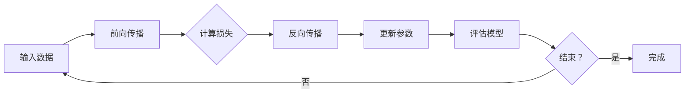

                 


### 第一部分：背景介绍

#### 1.1 问题背景

自动驾驶技术作为智能交通系统的重要组成部分，正在迅速发展。它通过将人工智能、计算机视觉、传感器融合、控制系统等先进技术集成到车辆中，实现了车辆在复杂道路环境下的自主驾驶。深度学习作为人工智能的核心技术之一，其在自动驾驶决策系统中的应用极大地推动了自动驾驶技术的发展。

深度学习在自动驾驶决策系统中的重要性主要体现在以下几个方面：

- **提高决策准确性和速度**：传统的自动驾驶决策系统依赖于规则和统计方法，而深度学习算法可以通过大量的数据学习复杂的环境特征，提高决策的准确性和速度。
- **增强适应性**：深度学习模型能够自动从数据中提取特征，使得自动驾驶系统能够更好地适应不同的驾驶环境和场景。
- **降低开发成本**：通过使用深度学习，开发者可以减少对规则和人工特征提取的依赖，从而降低自动驾驶系统的开发成本。

#### 1.2 自动驾驶决策系统的挑战与需求

尽管深度学习在自动驾驶决策系统中展现了巨大的潜力，但实际应用中仍然面临着诸多挑战：

- **数据质量**：深度学习模型的性能高度依赖于训练数据的质量。自动驾驶系统需要大量高质量的标注数据来训练模型，然而获取这样的数据非常困难。
- **实时性**：自动驾驶决策系统需要在极短的时间内做出决策，这对系统的计算速度和响应时间提出了极高的要求。
- **鲁棒性**：深度学习模型在处理异常情况和极端环境时的性能有待提高。自动驾驶系统必须具备在复杂、多变的环境下稳定运行的能力。

#### 1.3 深度学习技术的应用现状

目前，深度学习技术在自动驾驶决策系统中已有广泛的应用：

- **感知系统**：深度学习被用于车辆周围环境的感知，包括行人检测、车道线识别、障碍物检测等。
- **路径规划**：深度学习算法用于自动驾驶车辆的路径规划，提高了规划的速度和精度。
- **行为预测**：通过深度学习，车辆能够更好地预测其他车辆和行人的行为，从而做出更安全的驾驶决策。

### 1.4 边界与外延

自动驾驶决策系统的边界包括感知、规划、控制和执行四个环节。深度学习算法的应用不仅限于决策系统本身，还可以扩展到车辆的设计、制造和维护等各个环节。未来，随着技术的不断进步，深度学习将在自动驾驶领域发挥更大的作用。

----------------------------------------------------------------

### 第一部分：背景介绍

#### 1.1 问题背景

自动驾驶技术作为智能交通系统的重要组成部分，正在迅速发展。它通过将人工智能、计算机视觉、传感器融合、控制系统等先进技术集成到车辆中，实现了车辆在复杂道路环境下的自主驾驶。深度学习作为人工智能的核心技术之一，其在自动驾驶决策系统中的应用极大地推动了自动驾驶技术的发展。

深度学习在自动驾驶决策系统中的重要性主要体现在以下几个方面：

- **提高决策准确性和速度**：传统的自动驾驶决策系统依赖于规则和统计方法，而深度学习算法可以通过大量的数据学习复杂的环境特征，提高决策的准确性和速度。
- **增强适应性**：深度学习模型能够自动从数据中提取特征，使得自动驾驶系统能够更好地适应不同的驾驶环境和场景。
- **降低开发成本**：通过使用深度学习，开发者可以减少对规则和人工特征提取的依赖，从而降低自动驾驶系统的开发成本。

#### 1.2 自动驾驶决策系统的挑战与需求

尽管深度学习在自动驾驶决策系统中展现了巨大的潜力，但实际应用中仍然面临着诸多挑战：

- **数据质量**：深度学习模型的性能高度依赖于训练数据的质量。自动驾驶系统需要大量高质量的标注数据来训练模型，然而获取这样的数据非常困难。
- **实时性**：自动驾驶决策系统需要在极短的时间内做出决策，这对系统的计算速度和响应时间提出了极高的要求。
- **鲁棒性**：深度学习模型在处理异常情况和极端环境时的性能有待提高。自动驾驶系统必须具备在复杂、多变的环境下稳定运行的能力。

#### 1.3 深度学习技术的应用现状

目前，深度学习技术在自动驾驶决策系统中已有广泛的应用：

- **感知系统**：深度学习被用于车辆周围环境的感知，包括行人检测、车道线识别、障碍物检测等。
- **路径规划**：深度学习算法用于自动驾驶车辆的路径规划，提高了规划的速度和精度。
- **行为预测**：通过深度学习，车辆能够更好地预测其他车辆和行人的行为，从而做出更安全的驾驶决策。

### 1.4 边界与外延

自动驾驶决策系统的边界包括感知、规划、控制和执行四个环节。深度学习算法的应用不仅限于决策系统本身，还可以扩展到车辆的设计、制造和维护等各个环节。未来，随着技术的不断进步，深度学习将在自动驾驶领域发挥更大的作用。

----------------------------------------------------------------

### 第一部分：背景介绍

#### 1.1 问题背景

自动驾驶技术作为智能交通系统的重要组成部分，正在迅速发展。它通过将人工智能、计算机视觉、传感器融合、控制系统等先进技术集成到车辆中，实现了车辆在复杂道路环境下的自主驾驶。深度学习作为人工智能的核心技术之一，其在自动驾驶决策系统中的应用极大地推动了自动驾驶技术的发展。

深度学习在自动驾驶决策系统中的重要性主要体现在以下几个方面：

- **提高决策准确性和速度**：传统的自动驾驶决策系统依赖于规则和统计方法，而深度学习算法可以通过大量的数据学习复杂的环境特征，提高决策的准确性和速度。
- **增强适应性**：深度学习模型能够自动从数据中提取特征，使得自动驾驶系统能够更好地适应不同的驾驶环境和场景。
- **降低开发成本**：通过使用深度学习，开发者可以减少对规则和人工特征提取的依赖，从而降低自动驾驶系统的开发成本。

#### 1.2 自动驾驶决策系统的挑战与需求

尽管深度学习在自动驾驶决策系统中展现了巨大的潜力，但实际应用中仍然面临着诸多挑战：

- **数据质量**：深度学习模型的性能高度依赖于训练数据的质量。自动驾驶系统需要大量高质量的标注数据来训练模型，然而获取这样的数据非常困难。
- **实时性**：自动驾驶决策系统需要在极短的时间内做出决策，这对系统的计算速度和响应时间提出了极高的要求。
- **鲁棒性**：深度学习模型在处理异常情况和极端环境时的性能有待提高。自动驾驶系统必须具备在复杂、多变的环境下稳定运行的能力。

#### 1.3 深度学习技术的应用现状

目前，深度学习技术在自动驾驶决策系统中已有广泛的应用：

- **感知系统**：深度学习被用于车辆周围环境的感知，包括行人检测、车道线识别、障碍物检测等。
- **路径规划**：深度学习算法用于自动驾驶车辆的路径规划，提高了规划的速度和精度。
- **行为预测**：通过深度学习，车辆能够更好地预测其他车辆和行人的行为，从而做出更安全的驾驶决策。

### 1.4 边界与外延

自动驾驶决策系统的边界包括感知、规划、控制和执行四个环节。深度学习算法的应用不仅限于决策系统本身，还可以扩展到车辆的设计、制造和维护等各个环节。未来，随着技术的不断进步，深度学习将在自动驾驶领域发挥更大的作用。

----------------------------------------------------------------

### 第一部分：背景介绍

#### 1.1 问题背景

自动驾驶技术作为智能交通系统的重要组成部分，正在迅速发展。它通过将人工智能、计算机视觉、传感器融合、控制系统等先进技术集成到车辆中，实现了车辆在复杂道路环境下的自主驾驶。深度学习作为人工智能的核心技术之一，其在自动驾驶决策系统中的应用极大地推动了自动驾驶技术的发展。

#### 1.1.1 自动驾驶技术的发展

自动驾驶技术的发展历程可以分为几个阶段：

- **0级：无自动化**：车辆没有任何自动化功能，完全由人类驾驶员控制。
- **1级：驾驶员辅助**：车辆具有部分自动化功能，如自动控制方向盘、加速和制动等，但驾驶员需要时刻保持注意力。
- **2级：部分自动化**：车辆在特定条件下可以完全接管驾驶任务，但需要驾驶员在特定情况下接管。
- **3级：有条件自动化**：车辆在大多数情况下可以完全接管驾驶任务，但需要在特定情况下由驾驶员接管。
- **4级：高度自动化**：车辆在任何情况下都可以完全接管驾驶任务，但可能需要驾驶员在特定情况下接管。
- **5级：完全自动化**：车辆在任何情况下都可以完全接管驾驶任务，无需驾驶员干预。

#### 1.1.2 深度学习在自动驾驶中的重要性

深度学习在自动驾驶中具有重要性的原因如下：

- **复杂环境理解**：自动驾驶系统需要实时理解周围环境，包括行人、车辆、交通标志和道路状况等。深度学习模型能够通过大量的图像数据自动学习这些环境特征，从而提高自动驾驶系统的决策能力。
- **适应性学习**：自动驾驶系统在不同的驾驶环境和场景下需要表现出良好的适应性。深度学习模型能够从海量数据中学习，自动适应不同的驾驶条件，从而提高系统的鲁棒性和可靠性。
- **高效处理能力**：深度学习算法能够高效地处理大量数据，并在短时间内做出决策。这对于实时性要求极高的自动驾驶系统至关重要。

#### 1.1.3 自动驾驶决策系统的挑战与需求

尽管深度学习在自动驾驶决策系统中具有巨大潜力，但其实际应用仍面临以下挑战：

- **数据质量和标注**：深度学习模型的性能高度依赖于训练数据的质量和标注。自动驾驶系统需要大量高质量的标注数据来训练模型，但获取这样的数据非常困难。
- **实时性和响应时间**：自动驾驶系统需要在极短的时间内做出决策，这对系统的计算速度和响应时间提出了极高的要求。
- **鲁棒性和安全性**：深度学习模型在处理异常情况和极端环境时的性能有待提高。自动驾驶系统必须具备在复杂、多变的环境下稳定运行的能力，以确保乘客和行人的安全。

### 1.2 深度学习技术的应用现状

目前，深度学习技术在自动驾驶决策系统中已有广泛的应用：

- **感知系统**：深度学习被用于车辆周围环境的感知，包括行人检测、车道线识别、障碍物检测等。这些感知任务对于自动驾驶系统至关重要，因为它们能够提供决策所需的实时环境信息。
- **路径规划**：深度学习算法用于自动驾驶车辆的路径规划，提高了规划的速度和精度。路径规划是自动驾驶系统的核心功能之一，它决定了车辆如何安全、高效地到达目的地。
- **行为预测**：通过深度学习，车辆能够更好地预测其他车辆和行人的行为，从而做出更安全的驾驶决策。行为预测有助于提高系统的反应速度和准确性，从而降低交通事故的风险。

### 1.3 问题解决

深度学习在自动驾驶决策系统中的应用，为解决上述挑战提供了一些潜在的方法：

- **数据增强**：通过数据增强技术，可以生成更多高质量的标注数据，从而提高深度学习模型的性能。数据增强方法包括图像旋转、缩放、裁剪、噪声添加等。
- **实时性优化**：通过硬件加速、模型压缩和优化算法，可以降低深度学习模型的计算复杂度和响应时间，从而满足实时性的要求。
- **鲁棒性增强**：通过迁移学习、对抗样本训练和模型正则化等技术，可以增强深度学习模型在异常情况下的鲁棒性和稳定性。

### 1.4 边界与外延

自动驾驶决策系统的边界包括感知、规划、控制和执行四个环节。深度学习算法的应用不仅限于决策系统本身，还可以扩展到车辆的设计、制造和维护等各个环节。例如，在车辆设计阶段，深度学习算法可以用于车辆外观设计优化、内饰设计分析等；在制造阶段，可以用于质量控制、生产优化等；在维护阶段，可以用于故障诊断、预测性维护等。

未来，随着技术的不断进步，深度学习将在自动驾驶领域发挥更大的作用。例如，将深度学习与物联网、5G通信等技术结合，可以实现车联网（V2X）的智能化应用，提高整个交通系统的效率和安全性。此外，深度学习还可以应用于无人驾驶出租车、无人驾驶卡车、无人驾驶无人机等领域，推动智能交通和物流的全面升级。

----------------------------------------------------------------

### 第一部分：背景介绍

#### 1.1 问题背景

自动驾驶技术作为智能交通系统的重要组成部分，正在迅速发展。它通过将人工智能、计算机视觉、传感器融合、控制系统等先进技术集成到车辆中，实现了车辆在复杂道路环境下的自主驾驶。深度学习作为人工智能的核心技术之一，其在自动驾驶决策系统中的应用极大地推动了自动驾驶技术的发展。

#### 1.1.1 自动驾驶技术的发展

自动驾驶技术的发展可以分为以下几个阶段：

- **0级：无自动化**：车辆没有任何自动化功能，完全由人类驾驶员控制。
- **1级：驾驶员辅助**：车辆具有部分自动化功能，如自动控制方向盘、加速和制动等，但驾驶员需要时刻保持注意力。
- **2级：部分自动化**：车辆在特定条件下可以完全接管驾驶任务，但需要驾驶员在特定情况下接管。
- **3级：有条件自动化**：车辆在大多数情况下可以完全接管驾驶任务，但需要在特定情况下由驾驶员接管。
- **4级：高度自动化**：车辆在任何情况下都可以完全接管驾驶任务，但可能需要驾驶员在特定情况下接管。
- **5级：完全自动化**：车辆在任何情况下都可以完全接管驾驶任务，无需驾驶员干预。

#### 1.1.2 深度学习在自动驾驶中的重要性

深度学习在自动驾驶中的重要性体现在以下几个方面：

- **复杂环境理解**：自动驾驶系统需要实时理解周围环境，包括行人、车辆、交通标志和道路状况等。深度学习模型能够通过大量的图像数据自动学习这些环境特征，从而提高自动驾驶系统的决策能力。
- **适应性学习**：自动驾驶系统在不同的驾驶环境和场景下需要表现出良好的适应性。深度学习模型能够从海量数据中学习，自动适应不同的驾驶条件，从而提高系统的鲁棒性和可靠性。
- **高效处理能力**：深度学习算法能够高效地处理大量数据，并在短时间内做出决策。这对于实时性要求极高的自动驾驶系统至关重要。

#### 1.1.3 自动驾驶决策系统的挑战与需求

尽管深度学习在自动驾驶决策系统中具有巨大潜力，但其实际应用仍面临以下挑战：

- **数据质量和标注**：深度学习模型的性能高度依赖于训练数据的质量和标注。自动驾驶系统需要大量高质量的标注数据来训练模型，但获取这样的数据非常困难。
- **实时性和响应时间**：自动驾驶系统需要在极短的时间内做出决策，这对系统的计算速度和响应时间提出了极高的要求。
- **鲁棒性和安全性**：深度学习模型在处理异常情况和极端环境时的性能有待提高。自动驾驶系统必须具备在复杂、多变的环境下稳定运行的能力，以确保乘客和行人的安全。

### 1.2 自动驾驶决策系统的挑战

在自动驾驶决策系统中，深度学习技术的应用面临以下主要挑战：

#### 数据质量与标注

深度学习模型性能依赖于训练数据的质量和标注。自动驾驶系统需要在各种复杂的驾驶环境中训练模型，这要求大量高质量的标注数据。然而，标注数据收集困难且成本高昂，特别是在真实世界中获取准确、全面的标注数据。

#### 实时性和响应时间

自动驾驶系统需要在极短的时间内做出决策，这对系统的计算速度和响应时间提出了极高的要求。深度学习模型通常需要大量的计算资源，并且训练过程可能耗时较长。为了满足实时性需求，研究人员正在探索各种模型压缩和优化技术。

#### 鲁棒性和安全性

深度学习模型在处理异常情况和极端环境时的性能有待提高。自动驾驶系统必须具备在复杂、多变的环境下稳定运行的能力，以确保乘客和行人的安全。此外，深度学习模型可能会受到对抗样本的攻击，这要求开发更加鲁棒的安全机制。

#### 驱动行为预测的准确性

自动驾驶系统需要准确预测其他车辆和行人的行为，以便做出安全的驾驶决策。然而，人类行为复杂多变，深度学习模型在预测行为时的准确性仍然是一个挑战。改进预测算法和引入多模态数据（如语音、传感器数据）可能是解决这一问题的途径。

#### 法规和伦理问题

自动驾驶技术的发展引发了诸多法规和伦理问题，如责任归属、隐私保护等。确保自动驾驶系统的合规性和道德可接受性是未来研究的重要方向。

### 1.3 深度学习技术的应用现状

目前，深度学习技术在自动驾驶决策系统中已有广泛的应用：

#### 感知系统

深度学习被用于车辆周围环境的感知，包括行人检测、车道线识别、障碍物检测等。这些感知任务对于自动驾驶系统的安全和高效运行至关重要。

#### 路径规划

深度学习算法用于自动驾驶车辆的路径规划，提高了规划的速度和精度。路径规划是自动驾驶系统的核心功能之一，它决定了车辆如何安全、高效地到达目的地。

#### 行为预测

通过深度学习，车辆能够更好地预测其他车辆和行人的行为，从而做出更安全的驾驶决策。行为预测有助于提高系统的反应速度和准确性，从而降低交通事故的风险。

### 1.4 未来发展趋势

随着技术的不断进步，深度学习在自动驾驶决策系统中的应用将继续发展。以下是一些未来可能的发展趋势：

#### 数据增强和生成对抗网络（GAN）

通过数据增强和GAN技术，可以生成更多高质量的模拟数据，从而提高深度学习模型的性能。这有助于解决数据稀缺和标注困难的问题。

#### 硬件加速和模型压缩

硬件加速和模型压缩技术将提高深度学习模型的计算速度和效率，满足自动驾驶系统对实时性的要求。

#### 多模态数据处理

结合多模态数据（如视觉、语音、传感器数据）进行深度学习，可以提高自动驾驶系统的感知和预测能力。

#### 强化学习和分布式计算

结合强化学习和分布式计算技术，可以进一步提高自动驾驶系统的适应性和可靠性。

#### 法规和伦理研究

随着自动驾驶技术的普及，相关法规和伦理问题将成为研究的热点。确保自动驾驶系统的合规性和道德可接受性是未来研究的重要方向。

### 结论

深度学习在自动驾驶决策系统中的应用面临着诸多挑战，但同时也展现了巨大的潜力。通过持续的研究和技术创新，我们有望解决这些挑战，实现更安全、更高效的自动驾驶系统。

----------------------------------------------------------------

### 第一部分：背景介绍

#### 1.1 问题背景

自动驾驶技术作为智能交通系统的重要组成部分，正在迅速发展。它通过将人工智能、计算机视觉、传感器融合、控制系统等先进技术集成到车辆中，实现了车辆在复杂道路环境下的自主驾驶。深度学习作为人工智能的核心技术之一，其在自动驾驶决策系统中的应用极大地推动了自动驾驶技术的发展。

#### 1.1.1 自动驾驶技术的发展

自动驾驶技术的发展历程可以分为以下几个阶段：

- **0级：无自动化**：车辆没有任何自动化功能，完全由人类驾驶员控制。
- **1级：驾驶员辅助**：车辆具有部分自动化功能，如自动控制方向盘、加速和制动等，但驾驶员需要时刻保持注意力。
- **2级：部分自动化**：车辆在特定条件下可以完全接管驾驶任务，但需要驾驶员在特定情况下接管。
- **3级：有条件自动化**：车辆在大多数情况下可以完全接管驾驶任务，但需要在特定情况下由驾驶员接管。
- **4级：高度自动化**：车辆在任何情况下都可以完全接管驾驶任务，但可能需要驾驶员在特定情况下接管。
- **5级：完全自动化**：车辆在任何情况下都可以完全接管驾驶任务，无需驾驶员干预。

随着技术的不断进步，自动驾驶技术正在逐步从实验室走向实际应用。各大汽车制造商、科技公司和研究机构都在积极研发自动驾驶技术，并逐步将其应用于量产车辆中。

#### 1.1.2 深度学习在自动驾驶中的重要性

深度学习在自动驾驶中具有重要性的原因如下：

- **复杂环境理解**：自动驾驶系统需要实时理解周围环境，包括行人、车辆、交通标志和道路状况等。深度学习模型能够通过大量的图像数据自动学习这些环境特征，从而提高自动驾驶系统的决策能力。
- **适应性学习**：自动驾驶系统在不同的驾驶环境和场景下需要表现出良好的适应性。深度学习模型能够从海量数据中学习，自动适应不同的驾驶条件，从而提高系统的鲁棒性和可靠性。
- **高效处理能力**：深度学习算法能够高效地处理大量数据，并在短时间内做出决策。这对于实时性要求极高的自动驾驶系统至关重要。

#### 1.1.3 自动驾驶决策系统的挑战与需求

尽管深度学习在自动驾驶决策系统中具有巨大潜力，但其实际应用仍面临以下挑战：

- **数据质量和标注**：深度学习模型的性能高度依赖于训练数据的质量和标注。自动驾驶系统需要大量高质量的标注数据来训练模型，但获取这样的数据非常困难。
- **实时性和响应时间**：自动驾驶系统需要在极短的时间内做出决策，这对系统的计算速度和响应时间提出了极高的要求。
- **鲁棒性和安全性**：深度学习模型在处理异常情况和极端环境时的性能有待提高。自动驾驶系统必须具备在复杂、多变的环境下稳定运行的能力，以确保乘客和行人的安全。

### 1.2 自动驾驶决策系统的挑战

在自动驾驶决策系统中，深度学习技术的应用面临以下主要挑战：

#### 数据质量与标注

深度学习模型性能依赖于训练数据的质量和标注。自动驾驶系统需要在各种复杂的驾驶环境中训练模型，这要求大量高质量的标注数据。然而，标注数据收集困难且成本高昂，特别是在真实世界中获取准确、全面的标注数据。

#### 实时性和响应时间

自动驾驶系统需要在极短的时间内做出决策，这对系统的计算速度和响应时间提出了极高的要求。深度学习模型通常需要大量的计算资源，并且训练过程可能耗时较长。为了满足实时性需求，研究人员正在探索各种模型压缩和优化技术。

#### 鲁棒性和安全性

深度学习模型在处理异常情况和极端环境时的性能有待提高。自动驾驶系统必须具备在复杂、多变的环境下稳定运行的能力，以确保乘客和行人的安全。此外，深度学习模型可能会受到对抗样本的攻击，这要求开发更加鲁棒的安全机制。

#### 驱动行为预测的准确性

自动驾驶系统需要准确预测其他车辆和行人的行为，以便做出安全的驾驶决策。然而，人类行为复杂多变，深度学习模型在预测行为时的准确性仍然是一个挑战。改进预测算法和引入多模态数据（如语音、传感器数据）可能是解决这一问题的途径。

#### 法规和伦理问题

自动驾驶技术的发展引发了诸多法规和伦理问题，如责任归属、隐私保护等。确保自动驾驶系统的合规性和道德可接受性是未来研究的重要方向。

### 1.3 深度学习技术的应用现状

目前，深度学习技术在自动驾驶决策系统中已有广泛的应用：

#### 感知系统

深度学习被用于车辆周围环境的感知，包括行人检测、车道线识别、障碍物检测等。这些感知任务对于自动驾驶系统的安全和高效运行至关重要。

#### 路径规划

深度学习算法用于自动驾驶车辆的路径规划，提高了规划的速度和精度。路径规划是自动驾驶系统的核心功能之一，它决定了车辆如何安全、高效地到达目的地。

#### 行为预测

通过深度学习，车辆能够更好地预测其他车辆和行人的行为，从而做出更安全的驾驶决策。行为预测有助于提高系统的反应速度和准确性，从而降低交通事故的风险。

### 1.4 未来发展趋势

随着技术的不断进步，深度学习在自动驾驶决策系统中的应用将继续发展。以下是一些未来可能的发展趋势：

#### 数据增强和生成对抗网络（GAN）

通过数据增强和GAN技术，可以生成更多高质量的模拟数据，从而提高深度学习模型的性能。这有助于解决数据稀缺和标注困难的问题。

#### 硬件加速和模型压缩

硬件加速和模型压缩技术将提高深度学习模型的计算速度和效率，满足自动驾驶系统对实时性的要求。

#### 多模态数据处理

结合多模态数据（如视觉、语音、传感器数据）进行深度学习，可以提高自动驾驶系统的感知和预测能力。

#### 强化学习和分布式计算

结合强化学习和分布式计算技术，可以进一步提高自动驾驶系统的适应性和可靠性。

#### 法规和伦理研究

随着自动驾驶技术的普及，相关法规和伦理问题将成为研究的热点。确保自动驾驶系统的合规性和道德可接受性是未来研究的重要方向。

### 结论

深度学习在自动驾驶决策系统中的应用面临着诸多挑战，但同时也展现了巨大的潜力。通过持续的研究和技术创新，我们有望解决这些挑战，实现更安全、更高效的自动驾驶系统。

----------------------------------------------------------------

## 第二部分：核心概念与联系

### 2.1 核心概念

#### 2.1.1 自动驾驶决策系统

自动驾驶决策系统是自动驾驶车辆的核心部分，它负责感知车辆周围环境、规划行驶路径、执行驾驶动作等。决策系统通常包括以下几个关键模块：

- **感知模块**：使用摄像头、激光雷达、超声波传感器等设备实时感知车辆周围的环境信息，如行人、车辆、交通标志、车道线等。
- **路径规划模块**：根据感知模块获取的信息，规划车辆的行驶路径，确保车辆安全、高效地到达目的地。
- **控制模块**：根据路径规划结果，控制车辆的加速、转向、制动等动作，实现自动驾驶。
- **执行模块**：执行控制模块生成的操作指令，实现车辆的自动驾驶功能。

#### 2.1.2 深度学习

深度学习是一种机器学习方法，通过模拟人脑神经网络结构和学习机制，对大量数据进行分析和特征提取，从而实现智能决策和预测。深度学习主要包括以下几个核心概念：

- **神经网络**：由大量神经元组成的计算模型，通过前向传播和反向传播机制进行训练和优化。
- **卷积神经网络（CNN）**：适用于图像处理任务，通过卷积操作和池化操作提取图像特征。
- **循环神经网络（RNN）**：适用于序列数据处理任务，通过循环连接和门控机制处理时间序列数据。
- **强化学习（RL）**：通过奖励机制和策略迭代，使智能体在动态环境中学习最优行为。

### 2.2 概念属性特征对比

下面是自动驾驶决策系统和深度学习的一些关键属性特征对比：

| **属性**          | **自动驾驶决策系统**                         | **深度学习**                          |
|-------------------|--------------------------------------------|--------------------------------------|
| **功能特点**      | 感知环境、路径规划、控制执行                  | 特征提取、模式识别、预测、决策支持     |
| **技术挑战**      | 实时性、鲁棒性、数据标注、可靠性              | 计算资源、模型复杂度、过拟合、解释性   |
| **应用场景**      | 自主驾驶车辆、智能交通系统、无人机等          | 图像识别、自然语言处理、语音识别等     |
| **算法分类**      | 感知算法、规划算法、控制算法                  | CNN、RNN、GAN、DNN等                 |
| **结构特点**      | 多模块集成、层次化架构、实时处理              | 神经网络层次、权重更新、迭代训练       |
| **学习机制**      | 基于环境反馈、基于数据驱动、基于规则          | 前向传播、反向传播、优化算法           |

### 2.3 ER实体关系图架构

为了更好地理解自动驾驶决策系统和深度学习的关系，我们可以使用ER（Entity-Relationship）实体关系图来表示它们之间的关联。

以下是ER实体关系图的Mermaid表示：

```mermaid
erDiagram
    A(Autonomous Driving Decision System) ||--|{感知模块} |{路径规划模块}| -- B(Vehicle)
    A ||--|{控制模块} |{执行模块}| -- B
    A ..|{数据预处理}| C(Deep Learning)
    C ..|{模型训练}| D(Feature Extraction)
    C ..|{模式识别}| E(Deployment)
    F(Predictive Analytics) ..|uses| C
```

在上面的ER图中：

- **A（自动驾驶决策系统）**：代表自动驾驶决策系统，它与感知模块、路径规划模块、控制模块和执行模块之间有直接关系。
- **B（车辆）**：代表自动驾驶车辆，它是决策系统的最终执行者。
- **C（深度学习）**：代表深度学习技术，它与数据预处理、模型训练、特征提取和模式识别有关。
- **D（特征提取）**：是深度学习的一个子模块，负责从数据中提取有用特征。
- **E（部署）**：代表将深度学习模型应用到实际系统中的过程。
- **F（预测分析）**：是一个广义的概念，代表自动驾驶决策系统的预测功能，与深度学习有关。

通过这个ER实体关系图，我们可以清晰地看到自动驾驶决策系统和深度学习之间的紧密联系和交互关系。

----------------------------------------------------------------

### 2.1 核心概念

#### 2.1.1 自动驾驶决策系统

自动驾驶决策系统是自动驾驶车辆的核心部分，它负责对车辆周围环境进行感知、规划行驶路径和控制车辆动作等任务。其基本概念包括：

- **感知**：利用传感器（如摄像头、激光雷达、毫米波雷达等）获取车辆周围环境的信息，如道路状况、交通标志、其他车辆和行人等。
- **路径规划**：根据感知到的环境信息，制定车辆的行驶路径，确保安全、高效地到达目的地。
- **控制**：根据路径规划的结果，实时控制车辆的加速、制动、转向等动作。
- **执行**：将控制指令转换为车辆的具体动作，实现自动驾驶。

#### 2.1.2 深度学习

深度学习是一种基于人工神经网络的学习方法，通过多层神经元的堆叠，实现对复杂数据的分析和特征提取。其基本概念包括：

- **神经网络**：由大量相互连接的神经元组成，每个神经元接收多个输入，并通过权重和偏置进行加权求和，最后输出一个值。
- **卷积神经网络（CNN）**：适用于图像处理任务，通过卷积操作提取图像特征。
- **循环神经网络（RNN）**：适用于序列数据处理任务，通过循环结构处理时间序列数据。
- **生成对抗网络（GAN）**：通过生成器和判别器的对抗训练，生成高质量的数据。
- **强化学习（RL）**：通过与环境的交互，学习最优策略，实现智能决策。

### 2.2 概念属性特征对比

下表对比了自动驾驶决策系统和深度学习的几个关键属性：

| **属性** | **自动驾驶决策系统** | **深度学习** |
| -------- | -------------------- | ------------ |
| **功能** | 感知、规划、控制、执行 | 特征提取、预测、决策 |
| **挑战** | 实时性、鲁棒性、数据标注 | 计算资源、过拟合、可解释性 |
| **应用场景** | 自主驾驶车辆、无人机 | 图像识别、自然语言处理、语音识别 |
| **结构** | 多模块集成、层次化 | 神经网络层次、权重更新 |
| **学习机制** | 数据驱动、环境反馈 | 前向传播、反向传播、优化算法 |

### 2.3 ER实体关系图架构

为了更好地理解自动驾驶决策系统和深度学习之间的关系，我们可以使用实体关系图（ER图）来表示它们之间的关联。

以下是ER图的Mermaid表示：

```mermaid
erDiagram
    A(User) ||--|{Autonomous Driving System} |{Path Planning} |{Control System} |{Execution System}
    B(Deep Learning) ||--|{Neural Network} |{Convolutional Neural Network} |{Recurrent Neural Network} |{Generative Adversarial Network}
    A -->|uses| B
```

在上面的ER图中：

- **A（用户）**：代表使用自动驾驶决策系统和深度学习的用户。
- **B（深度学习）**：代表用于自动驾驶决策系统的深度学习技术。
- **A（用户）**与**B（深度学习）**之间存在“使用”关系，表示用户使用深度学习技术来实现自动驾驶决策系统。

这种ER图的表示方式可以帮助我们直观地理解自动驾驶决策系统和深度学习之间的交互和关联。

----------------------------------------------------------------

### 2.2 概念属性特征对比

为了更好地理解自动驾驶决策系统和深度学习之间的关系，我们可以通过一个表格来对比这两个概念的关键属性。

| **属性**         | **自动驾驶决策系统**                                   | **深度学习**                                       |
|------------------|------------------------------------------------------|---------------------------------------------------|
| **功能目标**     | 自动驾驶车辆的感知、决策和行动，提高安全性和效率         | 从数据中学习模式、特征，进行分类、预测和决策         |
| **数据来源**     | 传感器数据（摄像头、激光雷达、超声波等）、环境数据等     | 图像、语音、文本、序列数据等                         |
| **数据处理**     | 实时感知环境，处理多源数据，进行融合和分析               | 特征提取、降维、神经网络训练，处理高维度复杂数据     |
| **算法特点**     | 高度依赖于实时性、鲁棒性、安全性                       | 神经网络结构复杂，需要大量数据和计算资源             |
| **应用领域**     | 汽车自动驾驶、无人机、机器人导航、智能交通系统           | 图像识别、语音识别、自然语言处理、推荐系统等         |
| **挑战**         | 实时性、数据标注、算法可靠性、环境不确定性、法规和伦理问题 | 计算资源、模型解释性、过拟合、数据隐私、算法偏见     |
| **学习方式**     | 监督学习、强化学习、无监督学习等，根据应用需求选择       | 基于神经网络，特别是深度学习模型，通过大量数据训练   |

通过这个表格，我们可以看到自动驾驶决策系统和深度学习在功能目标、数据来源、数据处理、算法特点、应用领域、挑战和学习方式等方面都有显著的差异和联系。

----------------------------------------------------------------

### 2.3 ER实体关系图架构

为了更好地展示自动驾驶决策系统和深度学习之间的关联，我们可以使用实体关系图（ER图）来描述。以下是自动驾驶决策系统和深度学习相关的ER图，采用Mermaid语法表示。

```mermaid
erDiagram
    Vehicle ||--|{Autonomous Driving System}
    Driver ||--|{Autonomous Driving System}
    Environment ||--|{Autonomous Driving System}
    Sensor Data ||--|{Autonomous Driving System}
    Perception ||--|{Autonomous Driving System}
    Planning ||--|{Autonomous Driving System}
    Control ||--|{Autonomous Driving System}
    Execution ||--|{Autonomous Driving System}
    Neural Network ||--|{Deep Learning Model}
    Training Data ||--|{Deep Learning Model}
    Prediction ||--|{Autonomous Driving System}
    Safety && Ethical Consideration ||--|{Autonomous Driving System}
```

在这个ER图中：

- **Vehicle（车辆）**：自动驾驶的主体，通过决策系统实现自主驾驶。
- **Driver（驾驶员）**：传统驾驶的人，与自动驾驶系统一起协同工作。
- **Environment（环境）**：车辆所在的驾驶环境，包括道路、其他车辆、行人等。
- **Sensor Data（传感器数据）**：摄像头、激光雷达、雷达等传感器采集的数据。
- **Perception（感知）**：从传感器数据中提取有用信息，如行人检测、车道线识别等。
- **Planning（规划）**：基于感知数据，规划车辆的行驶路径。
- **Control（控制）**：根据规划结果，控制车辆的加速、制动、转向等动作。
- **Execution（执行）**：执行控制模块生成的操作指令。
- **Neural Network（神经网络）**：深度学习模型的核心，用于特征提取、预测等任务。
- **Training Data（训练数据）**：用于训练神经网络的数据，需要高质量的标注。
- **Prediction（预测）**：深度学习模型对环境行为的预测结果，用于决策系统的优化。
- **Safety && Ethical Consideration（安全与伦理考虑）**：确保自动驾驶系统的安全性和符合伦理标准。

通过这个ER图，我们可以清晰地看到自动驾驶决策系统和深度学习之间的关联，以及它们在自动驾驶系统中的作用和关系。

----------------------------------------------------------------

### 第三部分：算法原理讲解

#### 3.1 深度学习算法原理

深度学习算法的核心在于其多层神经网络结构，这使得模型能够自动从数据中提取复杂的特征，从而实现高级的预测和分类任务。以下是几种常用的深度学习算法原理：

#### 3.1.1 神经网络基础

神经网络（Neural Network）是一种模拟人脑神经元结构和功能的计算模型。它由大量相互连接的神经元（节点）组成，每个神经元接收多个输入，通过加权求和后加上偏置，再通过激活函数产生输出。

- **神经元模型**：每个神经元接收多个输入，每个输入乘以相应的权重，然后相加得到总输入，再加上偏置（bias），最后通过激活函数（如ReLU、Sigmoid、Tanh）输出一个数值。
- **前向传播**：在训练过程中，模型从输入层开始，逐层计算每个神经元的输出，直到输出层得到最终预测结果。
- **反向传播**：根据预测结果与实际标签之间的误差，通过反向传播算法更新神经元的权重和偏置，使模型逐渐收敛到最优参数。

#### 3.1.2 卷积神经网络（CNN）

卷积神经网络（Convolutional Neural Network，CNN）是专门用于处理图像数据的深度学习模型。其核心思想是利用卷积操作和池化操作提取图像特征。

- **卷积层（Convolutional Layer）**：通过卷积核（filter）在输入图像上滑动，计算局部特征的加权和，输出特征图（feature map）。
- **池化层（Pooling Layer）**：用于减少特征图的尺寸，增加模型的泛化能力，常用的池化操作包括最大池化（Max Pooling）和平均池化（Average Pooling）。
- **卷积神经网络结构**：通常包括多个卷积层、池化层和全连接层（Fully Connected Layer），通过逐层提取图像特征，最终实现分类或回归任务。

#### 3.1.3 循环神经网络（RNN）

循环神经网络（Recurrent Neural Network，RNN）是一种能够处理序列数据的神经网络。其特点是具有循环连接，可以记住之前的信息，对时间序列数据具有很好的处理能力。

- **基本RNN模型**：每个时间步的输入与上一个时间步的隐藏状态通过权重矩阵相乘，然后通过激活函数得到当前时间步的隐藏状态。
- **长短期记忆网络（LSTM）**：为了解决传统RNN的梯度消失和梯度爆炸问题，LSTM引入了门控机制（gate），可以有效地保持长期依赖关系。
- **门控循环单元（GRU）**：GRU是LSTM的变体，简化了LSTM的结构，同时保持了其强大的学习能力。

#### 3.1.4 强化学习（RL）

强化学习（Reinforcement Learning，RL）是一种通过奖励机制学习最优策略的机器学习方法。其核心思想是智能体（agent）通过与环境（environment）的交互，不断调整策略（policy），以最大化累积奖励。

- **Q学习（Q-Learning）**：Q学习通过值函数（Q-function）估计状态-动作值，通过更新策略以最大化期望奖励。
- **深度Q网络（DQN）**：DQN将Q学习与深度神经网络结合，可以处理高维状态空间，从而在复杂环境中学习最优策略。
- **策略梯度方法**：通过直接优化策略梯度，学习最优策略，常用的方法包括策略梯度（PG）和演员-评论家（AC）方法。

### 3.2 算法Mermaid流程图

以下是一个简单的Mermaid流程图，展示深度学习算法的基本流程：



在流程图中：

- **A（输入数据）**：将训练数据输入到模型中。
- **B（前向传播）**：通过神经网络计算预测值。
- **C（计算损失）**：计算预测值与真实值之间的误差。
- **D（反向传播）**：根据误差更新模型的参数。
- **E（更新参数）**：调整模型参数，使损失函数减小。
- **F（评估模型）**：使用验证集评估模型性能。
- **G（结束？）**：判断是否满足训练结束条件（如迭代次数或误差阈值）。
- **H（完成）**：训练完成，模型准备应用。

通过这个流程图，我们可以直观地理解深度学习算法的各个步骤和它们之间的逻辑关系。

### 3.3 数学模型和数学公式

深度学习算法的运行依赖于一系列数学模型和公式。以下是一些核心的数学模型和公式的详细讲解：

#### 3.3.1 前向传播

前向传播是深度学习算法中的一个关键步骤，用于计算模型的输出。以下是前向传播的基本公式：

$$
\text{激活函数} \ \sigma(z) = \frac{1}{1 + e^{-z}}
$$

其中，$z$ 是神经元的总输入，$\sigma$ 是Sigmoid激活函数。

#### 3.3.2 反向传播

反向传播用于计算模型参数的梯度，以优化模型。以下是反向传播的基本步骤：

1. **计算损失函数的梯度**：

$$
\frac{\partial L}{\partial z} = -\frac{\partial L}{\partial a} \cdot \frac{\partial a}{\partial z}
$$

其中，$L$ 是损失函数，$a$ 是激活函数的输出。

2. **反向传播梯度**：

$$
\frac{\partial L}{\partial z} = \frac{\partial L}{\partial a} \cdot \frac{\partial a}{\partial z} \cdot \frac{\partial z}{\partial w} \cdot \frac{\partial w}{\partial \theta}
$$

其中，$w$ 是权重，$\theta$ 是参数。

#### 3.3.3 损失函数

损失函数用于衡量模型预测值与真实值之间的误差。以下是一些常用的损失函数：

1. **均方误差（MSE）**：

$$
L(\theta) = \frac{1}{2} \sum_{i=1}^{n} (y_i - \hat{y}_i)^2
$$

其中，$y_i$ 是真实值，$\hat{y}_i$ 是预测值。

2. **交叉熵损失（Cross Entropy）**：

$$
L(\theta) = -\sum_{i=1}^{n} y_i \log(\hat{y}_i)
$$

其中，$y_i$ 是真实标签，$\hat{y}_i$ 是预测概率。

#### 3.3.4 优化算法

优化算法用于更新模型参数，以最小化损失函数。以下是一些常用的优化算法：

1. **梯度下降（Gradient Descent）**：

$$
\theta = \theta - \alpha \cdot \frac{\partial L}{\partial \theta}
$$

其中，$\alpha$ 是学习率。

2. **动量（Momentum）**：

$$
\theta = \theta - \alpha \cdot \frac{\partial L}{\partial \theta} + \beta \cdot v
$$

其中，$\beta$ 是动量因子，$v$ 是上一时刻的梯度。

3. **自适应优化器（Adam）**：

$$
m_t = \beta_1 \cdot m_{t-1} + (1 - \beta_1) \cdot \frac{\partial L}{\partial \theta}_t \\
v_t = \beta_2 \cdot v_{t-1} + (1 - \beta_2) \cdot (\frac{\partial L}{\partial \theta}_t)^2
$$

$$
\theta = \theta - \alpha \cdot \frac{m_t}{1 - \beta_1^t} / (1 - \beta_2^t)
$$

其中，$\beta_1$ 和 $\beta_2$ 分别是动量因子的指数衰减率。

通过以上数学模型和公式的详细讲解，我们可以更好地理解深度学习算法的原理和实现过程。

----------------------------------------------------------------

### 第三部分：算法原理讲解

#### 3.1 深度学习算法原理

深度学习算法的核心在于其多层神经网络结构，这使得模型能够自动从数据中提取复杂的特征，从而实现高级的预测和分类任务。以下是几种常用的深度学习算法原理：

#### 3.1.1 神经网络基础

神经网络（Neural Network）是一种模拟人脑神经元结构和功能的计算模型。它由大量相互连接的神经元（节点）组成，每个神经元接收多个输入，通过加权求和后加上偏置，再通过激活函数产生输出。

**神经元模型**：每个神经元接收多个输入，每个输入乘以相应的权重，然后相加得到总输入，再加上偏置（bias），最后通过激活函数（如ReLU、Sigmoid、Tanh）输出一个数值。

**前向传播**：在训练过程中，模型从输入层开始，逐层计算每个神经元的输出，直到输出层得到最终预测结果。

**反向传播**：根据预测结果与实际标签之间的误差，通过反向传播算法更新神经元的权重和偏置，使模型逐渐收敛到最优参数。

#### 3.1.2 卷积神经网络（CNN）

卷积神经网络（Convolutional Neural Network，CNN）是专门用于处理图像数据的深度学习模型。其核心思想是利用卷积操作和池化操作提取图像特征。

**卷积层（Convolutional Layer）**：通过卷积核（filter）在输入图像上滑动，计算局部特征的加权和，输出特征图（feature map）。

**池化层（Pooling Layer）**：用于减少特征图的尺寸，增加模型的泛化能力，常用的池化操作包括最大池化（Max Pooling）和平均池化（Average Pooling）。

**卷积神经网络结构**：通常包括多个卷积层、池化层和全连接层（Fully Connected Layer），通过逐层提取图像特征，最终实现分类或回归任务。

#### 3.1.3 循环神经网络（RNN）

循环神经网络（Recurrent Neural Network，RNN）是一种能够处理序列数据的神经网络。其特点是具有循环连接，可以记住之前的信息，对时间序列数据具有很好的处理能力。

**基本RNN模型**：每个时间步的输入与上一个时间步的隐藏状态通过权重矩阵相乘，然后通过激活函数得到当前时间步的隐藏状态。

**长短期记忆网络（LSTM）**：为了解决传统RNN的梯度消失和梯度爆炸问题，LSTM引入了门控机制（gate），可以有效地保持长期依赖关系。

**门控循环单元（GRU）**：GRU是LSTM的变体，简化了LSTM的结构，同时保持了其强大的学习能力。

#### 3.1.4 强化学习（RL）

强化学习（Reinforcement Learning，RL）是一种通过奖励机制学习最优策略的机器学习方法。其核心思想是智能体（agent）通过与环境（environment）的交互，不断调整策略（policy），以最大化累积奖励。

**Q学习（Q-Learning）**：Q学习通过值函数（Q-function）估计状态-动作值，通过更新策略以最大化期望奖励。

**深度Q网络（DQN）**：DQN将Q学习与深度神经网络结合，可以处理高维状态空间，从而在复杂环境中学习最优策略。

**策略梯度方法**：通过直接优化策略梯度，学习最优策略，常用的方法包括策略梯度（PG）和演员-评论家（AC）方法。

### 3.2 算法Mermaid流程图

以下是一个简单的Mermaid流程图，展示深度学习算法的基本流程：


在流程图中：

- **A（输入数据）**：将训练数据输入到模型中。
- **B（前向传播）**：通过神经网络计算预测值。
- **C（计算损失）**：计算预测值与真实值之间的误差。
- **D（反向传播）**：根据误差更新模型的参数。
- **E（更新参数）**：调整模型参数，使损失函数减小。
- **F（评估模型）**：使用验证集评估模型性能。
- **G（结束？）**：判断是否满足训练结束条件（如迭代次数或误差阈值）。
- **H（完成）**：训练完成，模型准备应用。

通过这个流程图，我们可以直观地理解深度学习算法的各个步骤和它们之间的逻辑关系。

### 3.3 数学模型和数学公式

深度学习算法的运行依赖于一系列数学模型和公式。以下是一些核心的数学模型和公式的详细讲解：

#### 3.3.1 前向传播

前向传播是深度学习算法中的一个关键步骤，用于计算模型的输出。以下是前向传播的基本公式：

$$
\text{激活函数} \ \sigma(z) = \frac{1}{1 + e^{-z}}
$$

其中，$z$ 是神经元的总输入，$\sigma$ 是Sigmoid激活函数。

#### 3.3.2 反向传播

反向传播用于计算模型参数的梯度，以优化模型。以下是反向传播的基本步骤：

1. **计算损失函数的梯度**：

$$
\frac{\partial L}{\partial z} = -\frac{\partial L}{\partial a} \cdot \frac{\partial a}{\partial z}
$$

其中，$L$ 是损失函数，$a$ 是激活函数的输出。

2. **反向传播梯度**：

$$
\frac{\partial L}{\partial z} = \frac{\partial L}{\partial a} \cdot \frac{\partial a}{\partial z} \cdot \frac{\partial z}{\partial w} \cdot \frac{\partial w}{\partial \theta}
$$

其中，$w$ 是权重，$\theta$ 是参数。

#### 3.3.3 损失函数

损失函数用于衡量模型预测值与真实值之间的误差。以下是一些常用的损失函数：

1. **均方误差（MSE）**：

$$
L(\theta) = \frac{1}{2} \sum_{i=1}^{n} (y_i - \hat{y}_i)^2
$$

其中，$y_i$ 是真实值，$\hat{y}_i$ 是预测值。

2. **交叉熵损失（Cross Entropy）**：

$$
L(\theta) = -\sum_{i=1}^{n} y_i \log(\hat{y}_i)
$$

其中，$y_i$ 是真实标签，$\hat{y}_i$ 是预测概率。

#### 3.3.4 优化算法

优化算法用于更新模型参数，以最小化损失函数。以下是一些常用的优化算法：

1. **梯度下降（Gradient Descent）**：

$$
\theta = \theta - \alpha \cdot \frac{\partial L}{\partial \theta}
$$

其中，$\alpha$ 是学习率。

2. **动量（Momentum）**：

$$
\theta = \theta - \alpha \cdot \frac{\partial L}{\partial \theta} + \beta \cdot v
$$

其中，$\beta$ 是动量因子，$v$ 是上一时刻的梯度。

3. **自适应优化器（Adam）**：

$$
m_t = \beta_1 \cdot m_{t-1} + (1 - \beta_1) \cdot \frac{\partial L}{\partial \theta}_t \\
v_t = \beta_2 \cdot v_{t-1} + (1 - \beta_2) \cdot (\frac{\partial L}{\partial \theta}_t)^2
$$

$$
\theta = \theta - \alpha \cdot \frac{m_t}{1 - \beta_1^t} / (1 - \beta_2^t)
$$

其中，$\beta_1$ 和 $\beta_2$ 分别是动量因子的指数衰减率。

通过以上数学模型和公式的详细讲解，我们可以更好地理解深度学习算法的原理和实现过程。

----------------------------------------------------------------

### 第三部分：算法原理讲解

#### 3.1 深度学习算法原理

深度学习算法的核心在于其多层神经网络结构，这使得模型能够自动从数据中提取复杂的特征，从而实现高级的预测和分类任务。以下是几种常用的深度学习算法原理：

#### 3.1.1 神经网络基础

神经网络（Neural Network）是一种模拟人脑神经元结构和功能的计算模型。它由大量相互连接的神经元（节点）组成，每个神经元接收多个输入，通过加权求和后加上偏置，再通过激活函数产生输出。

**神经元模型**：每个神经元接收多个输入，每个输入乘以相应的权重，然后相加得到总输入，再加上偏置（bias），最后通过激活函数（如ReLU、Sigmoid、Tanh）输出一个数值。

**前向传播**：在训练过程中，模型从输入层开始，逐层计算每个神经元的输出，直到输出层得到最终预测结果。

**反向传播**：根据预测结果与实际标签之间的误差，通过反向传播算法更新神经元的权重和偏置，使模型逐渐收敛到最优参数。

#### 3.1.2 卷积神经网络（CNN）

卷积神经网络（Convolutional Neural Network，CNN）是专门用于处理图像数据的深度学习模型。其核心思想是利用卷积操作和池化操作提取图像特征。

**卷积层（Convolutional Layer）**：通过卷积核（filter）在输入图像上滑动，计算局部特征的加权和，输出特征图（feature map）。

**池化层（Pooling Layer）**：用于减少特征图的尺寸，增加模型的泛化能力，常用的池化操作包括最大池化（Max Pooling）和平均池化（Average Pooling）。

**卷积神经网络结构**：通常包括多个卷积层、池化层和全连接层（Fully Connected Layer），通过逐层提取图像特征，最终实现分类或回归任务。

#### 3.1.3 循环神经网络（RNN）

循环神经网络（Recurrent Neural Network，RNN）是一种能够处理序列数据的神经网络。其特点是具有循环连接，可以记住之前的信息，对时间序列数据具有很好的处理能力。

**基本RNN模型**：每个时间步的输入与上一个时间步的隐藏状态通过权重矩阵相乘，然后通过激活函数得到当前时间步的隐藏状态。

**长短期记忆网络（LSTM）**：为了解决传统RNN的梯度消失和梯度爆炸问题，LSTM引入了门控机制（gate），可以有效地保持长期依赖关系。

**门控循环单元（GRU）**：GRU是LSTM的变体，简化了LSTM的结构，同时保持了其强大的学习能力。

#### 3.1.4 强化学习（RL）

强化学习（Reinforcement Learning，RL）是一种通过奖励机制学习最优策略的机器学习方法。其核心思想是智能体（agent）通过与环境（environment）的交互，不断调整策略（policy），以最大化累积奖励。

**Q学习（Q-Learning）**：Q学习通过值函数（Q-function）估计状态-动作值，通过更新策略以最大化期望奖励。

**深度Q网络（DQN）**：DQN将Q学习与深度神经网络结合，可以处理高维状态空间，从而在复杂环境中学习最优策略。

**策略梯度方法**：通过直接优化策略梯度，学习最优策略，常用的方法包括策略梯度（PG）和演员-评论家（AC）方法。

### 3.2 算法Mermaid流程图

以下是一个简单的Mermaid流程图，展示深度学习算法的基本流程：


在流程图中：

- **A（输入数据）**：将训练数据输入到模型中。
- **B（前向传播）**：通过神经网络计算预测值。
- **C（计算损失）**：计算预测值与真实值之间的误差。
- **D（反向传播）**：根据误差更新模型的参数。
- **E（更新参数）**：调整模型参数，使损失函数减小。
- **F（评估模型）**：使用验证集评估模型性能。
- **G（结束？）**：判断是否满足训练结束条件（如迭代次数或误差阈值）。
- **H（完成）**：训练完成，模型准备应用。

通过这个流程图，我们可以直观地理解深度学习算法的各个步骤和它们之间的逻辑关系。

### 3.3 数学模型和数学公式

深度学习算法的运行依赖于一系列数学模型和公式。以下是一些核心的数学模型和公式的详细讲解：

#### 3.3.1 前向传播

前向传播是深度学习算法中的一个关键步骤，用于计算模型的输出。以下是前向传播的基本公式：

$$
\text{激活函数} \ \sigma(z) = \frac{1}{1 + e^{-z}}
$$

其中，$z$ 是神经元的总输入，$\sigma$ 是Sigmoid激活函数。

#### 3.3.2 反向传播

反向传播用于计算模型参数的梯度，以优化模型。以下是反向传播的基本步骤：

1. **计算损失函数的梯度**：

$$
\frac{\partial L}{\partial z} = -\frac{\partial L}{\partial a} \cdot \frac{\partial a}{\partial z}
$$

其中，$L$ 是损失函数，$a$ 是激活函数的输出。

2. **反向传播梯度**：

$$
\frac{\partial L}{\partial z} = \frac{\partial L}{\partial a} \cdot \frac{\partial a}{\partial z} \cdot \frac{\partial z}{\partial w} \cdot \frac{\partial w}{\partial \theta}
$$

其中，$w$ 是权重，$\theta$ 是参数。

#### 3.3.3 损失函数

损失函数用于衡量模型预测值与真实值之间的误差。以下是一些常用的损失函数：

1. **均方误差（MSE）**：

$$
L(\theta) = \frac{1}{2} \sum_{i=1}^{n} (y_i - \hat{y}_i)^2
$$

其中，$y_i$ 是真实值，$\hat{y}_i$ 是预测值。

2. **交叉熵损失（Cross Entropy）**：

$$
L(\theta) = -\sum_{i=1}^{n} y_i \log(\hat{y}_i)
$$

其中，$y_i$ 是真实标签，$\hat{y}_i$ 是预测概率。

#### 3.3.4 优化算法

优化算法用于更新模型参数，以最小化损失函数。以下是一些常用的优化算法：

1. **梯度下降（Gradient Descent）**：

$$
\theta = \theta - \alpha \cdot \frac{\partial L}{\partial \theta}
$$

其中，$\alpha$ 是学习率。

2. **动量（Momentum）**：

$$
\theta = \theta - \alpha \cdot \frac{\partial L}{\partial \theta} + \beta \cdot v
$$

其中，$\beta$ 是动量因子，$v$ 是上一时刻的梯度。

3. **自适应优化器（Adam）**：

$$
m_t = \beta_1 \cdot m_{t-1} + (1 - \beta_1) \cdot \frac{\partial L}{\partial \theta}_t \\
v_t = \beta_2 \cdot v_{t-1} + (1 - \beta_2) \cdot (\frac{\partial L}{\partial \theta}_t)^2
$$

$$
\theta = \theta - \alpha \cdot \frac{m_t}{1 - \beta_1^t} / (1 - \beta_2^t)
$$

其中，$\beta_1$ 和 $\beta_2$ 分别是动量因子的指数衰减率。

通过以上数学模型和公式的详细讲解，我们可以更好地理解深度学习算法的原理和实现过程。

----------------------------------------------------------------

### 第三部分：算法原理讲解

#### 3.1 深度学习算法原理

深度学习算法的核心在于其多层神经网络结构，这使得模型能够自动从数据中提取复杂的特征，从而实现高级的预测和分类任务。以下是几种常用的深度学习算法原理：

#### 3.1.1 神经网络基础

神经网络（Neural Network）是一种模拟人脑神经元结构和功能的计算模型。它由大量相互连接的神经元（节点）组成，每个神经元接收多个输入，通过加权求和后加上偏置，再通过激活函数产生输出。

**神经元模型**：每个神经元接收多个输入，每个输入乘以相应的权重，然后相加得到总输入，再加上偏置（bias），最后通过激活函数（如ReLU、Sigmoid、Tanh）输出一个数值。

**前向传播**：在训练过程中，模型从输入层开始，逐层计算每个神经元的输出，直到输出层得到最终预测结果。

**反向传播**：根据预测结果与实际标签之间的误差，通过反向传播算法更新神经元的权重和偏置，使模型逐渐收敛到最优参数。

#### 3.1.2 卷积神经网络（CNN）

卷积神经网络（Convolutional Neural Network，CNN）是专门用于处理图像数据的深度学习模型。其核心思想是利用卷积操作和池化操作提取图像特征。

**卷积层（Convolutional Layer）**：通过卷积核（filter）在输入图像上滑动，计算局部特征的加权和，输出特征图（feature map）。

**池化层（Pooling Layer）**：用于减少特征图的尺寸，增加模型的泛化能力，常用的池化操作包括最大池化（Max Pooling）和平均池化（Average Pooling）。

**卷积神经网络结构**：通常包括多个卷积层、池化层和全连接层（Fully Connected Layer），通过逐层提取图像特征，最终实现分类或回归任务。

#### 3.1.3 循环神经网络（RNN）

循环神经网络（Recurrent Neural Network，RNN）是一种能够处理序列数据的神经网络。其特点是具有循环连接，可以记住之前的信息，对时间序列数据具有很好的处理能力。

**基本RNN模型**：每个时间步的输入与上一个时间步的隐藏状态通过权重矩阵相乘，然后通过激活函数得到当前时间步的隐藏状态。

**长短期记忆网络（LSTM）**：为了解决传统RNN的梯度消失和梯度爆炸问题，LSTM引入了门控机制（gate），可以有效地保持长期依赖关系。

**门控循环单元（GRU）**：GRU是LSTM的变体，简化了LSTM的结构，同时保持了其强大的学习能力。

#### 3.1.4 强化学习（RL）

强化学习（Reinforcement Learning，RL）是一种通过奖励机制学习最优策略的机器学习方法。其核心思想是智能体（agent）通过与环境（environment）的交互，不断调整策略（policy），以最大化累积奖励。

**Q学习（Q-Learning）**：Q学习通过值函数（Q-function）估计状态-动作值，通过更新策略以最大化期望奖励。

**深度Q网络（DQN）**：DQN将Q学习与深度神经网络结合，可以处理高维状态空间，从而在复杂环境中学习最优策略。

**策略梯度方法**：通过直接优化策略梯度，学习最优策略，常用的方法包括策略梯度（PG）和演员-评论家（AC）方法。

### 3.2 算法Mermaid流程图

以下是一个简单的Mermaid流程图，展示深度学习算法的基本流程：


在流程图中：

- **A（输入数据）**：将训练数据输入到模型中。
- **B（前向传播）**：通过神经网络计算预测值。
- **C（计算损失）**：计算预测值与真实值之间的误差。
- **D（反向传播）**：根据误差更新模型的参数。
- **E（更新参数）**：调整模型参数，使损失函数减小。
- **F（评估模型）**：使用验证集评估模型性能。
- **G（结束？）**：判断是否满足训练结束条件（如迭代次数或误差阈值）。
- **H（完成）**：训练完成，模型准备应用。

通过这个流程图，我们可以直观地理解深度学习算法的各个步骤和它们之间的逻辑关系。

### 3.3 数学模型和数学公式

深度学习算法的运行依赖于一系列数学模型和公式。以下是一些核心的数学模型和公式的详细讲解：

#### 3.3.1 前向传播

前向传播是深度学习算法中的一个关键步骤，用于计算模型的输出。以下是前向传播的基本公式：

$$
\text{激活函数} \ \sigma(z) = \frac{1}{1 + e^{-z}}
$$

其中，$z$ 是神经元的总输入，$\sigma$ 是Sigmoid激活函数。

#### 3.3.2 反向传播

反向传播用于计算模型参数的梯度，以优化模型。以下是反向传播的基本步骤：

1. **计算损失函数的梯度**：

$$
\frac{\partial L}{\partial z} = -\frac{\partial L}{\partial a} \cdot \frac{\partial a}{\partial z}
$$

其中，$L$ 是损失函数，$a$ 是激活函数的输出。

2. **反向传播梯度**：

$$
\frac{\partial L}{\partial z} = \frac{\partial L}{\partial a} \cdot \frac{\partial a}{\partial z} \cdot \frac{\partial z}{\partial w} \cdot \frac{\partial w}{\partial \theta}
$$

其中，$w$ 是权重，$\theta$ 是参数。

#### 3.3.3 损失函数

损失函数用于衡量模型预测值与真实值之间的误差。以下是一些常用的损失函数：

1. **均方误差（MSE）**：

$$
L(\theta) = \frac{1}{2} \sum_{i=1}^{n} (y_i - \hat{y}_i)^2
$$

其中，$y_i$ 是真实值，$\hat{y}_i$ 是预测值。

2. **交叉熵损失（Cross Entropy）**：

$$
L(\theta) = -\sum_{i=1}^{n} y_i \log(\hat{y}_i)
$$

其中，$y_i$ 是真实标签，$\hat{y}_i$ 是预测概率。

#### 3.3.4 优化算法

优化算法用于更新模型参数，以最小化损失函数。以下是一些常用的优化算法：

1. **梯度下降（Gradient Descent）**：

$$
\theta = \theta - \alpha \cdot \frac{\partial L}{\partial \theta}
$$

其中，$\alpha$ 是学习率。

2. **动量（Momentum）**：

$$
\theta = \theta - \alpha \cdot \frac{\partial L}{\partial \theta} + \beta \cdot v
$$

其中，$\beta$ 是动量因子，$v$ 是上一时刻的梯度。

3. **自适应优化器（Adam）**：

$$
m_t = \beta_1 \cdot m_{t-1} + (1 - \beta_1) \cdot \frac{\partial L}{\partial \theta}_t \\
v_t = \beta_2 \cdot v_{t-1} + (1 - \beta_2) \cdot (\frac{\partial L}{\partial \theta}_t)^2
$$

$$
\theta = \theta - \alpha \cdot \frac{m_t}{1 - \beta_1^t} / (1 - \beta_2^t)
$$

其中，$\beta_1$ 和 $\beta_2$ 分别是动量因子的指数衰减率。

通过以上数学模型和公式的详细讲解，我们可以更好地理解深度学习算法的原理和实现过程。

----------------------------------------------------------------

### 第三部分：算法原理讲解

#### 3.1 深度学习算法原理

深度学习算法的核心在于其多层神经网络结构，这使得模型能够自动从数据中提取复杂的特征，从而实现高级的预测和分类任务。以下是几种常用的深度学习算法原理：

#### 3.1.1 神经网络基础

神经网络（Neural Network）是一种模拟人脑神经元结构和功能的计算模型。它由大量相互连接的神经元（节点）组成，每个神经元接收多个输入，通过加权求和后加上偏置，再通过激活函数产生输出。

**神经元模型**：每个神经元接收多个输入，每个输入乘以相应的权重，然后相加得到总输入，再加上偏置（bias），最后通过激活函数（如ReLU、Sigmoid、Tanh）输出一个数值。

**前向传播**：在训练过程中，模型从输入层开始，逐层计算每个神经元的输出，直到输出层得到最终预测结果。

**反向传播**：根据预测结果与实际标签之间的误差，通过反向传播算法更新神经元的权重和偏置，使模型逐渐收敛到最优参数。

#### 3.1.2 卷积神经网络（CNN）

卷积神经网络（Convolutional Neural Network，CNN）是专门用于处理图像数据的深度学习模型。其核心思想是利用卷积操作和池化操作提取图像特征。

**卷积层（Convolutional Layer）**：通过卷积核（filter）在输入图像上滑动，计算局部特征的加权和，输出特征图（feature map）。

**池化层（Pooling Layer）**：用于减少特征图的尺寸，增加模型的泛化能力，常用的池化操作包括最大池化（Max Pooling）和平均池化（Average Pooling）。

**卷积神经网络结构**：通常包括多个卷积层、池化层和全连接层（Fully Connected Layer），通过逐层提取图像特征，最终实现分类或回归任务。

#### 3.1.3 循环神经网络（RNN）

循环神经网络（Recurrent Neural Network，RNN）是一种能够处理序列数据的神经网络。其特点是具有循环连接，可以记住之前的信息，对时间序列数据具有很好的处理能力。

**基本RNN模型**：每个时间步的输入与上一个时间步的隐藏状态通过权重矩阵相乘，然后通过激活函数得到当前时间步的隐藏状态。

**长短期记忆网络（LSTM）**：为了解决传统RNN的梯度消失和梯度爆炸问题，LSTM引入了门控机制（gate），可以有效地保持长期依赖关系。

**门控循环单元（GRU）**：GRU是LSTM的变体，简化了LSTM的结构，同时保持了其强大的学习能力。

#### 3.1.4 强化学习（RL）

强化学习（Reinforcement Learning，RL）是一种通过奖励机制学习最优策略的机器学习方法。其核心思想是智能体（agent）通过与环境（environment）的交互，不断调整策略（policy），以最大化累积奖励。

**Q学习（Q-Learning）**：Q学习通过值函数（Q-function）估计状态-动作值，通过更新策略以最大化期望奖励。

**深度Q网络（DQN）**：DQN将Q学习与深度神经网络结合，可以处理高维状态空间，从而在复杂环境中学习最优策略。

**策略梯度方法**：通过直接优化策略梯度，学习最优策略，常用的方法包括策略梯度（PG）和演员-评论家（AC）方法。

### 3.2 算法Mermaid流程图

以下是一个简单的Mermaid流程图，展示深度学习算法的基本流程：


在流程图中：

- **A（输入数据）**：将训练数据输入到模型中。
- **B（前向传播）**：通过神经网络计算预测值。
- **C（计算损失）**：计算预测值与真实值之间的误差。
- **D（反向传播）**：根据误差更新模型的参数。
- **E（更新参数）**：调整模型参数，使损失函数减小。
- **F（评估模型）**：使用验证集评估模型性能。
- **G（结束？）**：判断是否满足训练结束条件（如迭代次数或误差阈值）。
- **H（完成）**：训练完成，模型准备应用。

通过这个流程图，我们可以直观地理解深度学习算法的各个步骤和它们之间的逻辑关系。

### 3.3 数学模型和数学公式

深度学习算法的运行依赖于一系列数学模型和公式。以下是一些核心的数学模型和公式的详细讲解：

#### 3.3.1 前向传播

前向传播是深度学习算法中的一个关键步骤，用于计算模型的输出。以下是前向传播的基本公式：

$$
\text{激活函数} \ \sigma(z) = \frac{1}{1 + e^{-z}}
$$

其中，$z$ 是神经元的总输入，$\sigma$ 是Sigmoid激活函数。

#### 3.3.2 反向传播

反向传播用于计算模型参数的梯度，以优化模型。以下是反向传播的基本步骤：

1. **计算损失函数的梯度**：

$$
\frac{\partial L}{\partial z} = -\frac{\partial L}{\partial a} \cdot \frac{\partial a}{\partial z}
$$

其中，$L$ 是损失函数，$a$ 是激活函数的输出。

2. **反向传播梯度**：

$$
\frac{\partial L}{\partial z} = \frac{\partial L}{\partial a} \cdot \frac{\partial a}{\partial z} \cdot \frac{\partial z}{\partial w} \cdot \frac{\partial w}{\partial \theta}
$$

其中，$w$ 是权重，$\theta$ 是参数。

#### 3.3.3 损失函数

损失函数用于衡量模型预测值与真实值之间的误差。以下是一些常用的损失函数：

1. **均方误差（MSE）**：

$$
L(\theta) = \frac{1}{2} \sum_{i=1}^{n} (y_i - \hat{y}_i)^2
$$

其中，$y_i$ 是真实值，$\hat{y}_i$ 是预测值。

2. **交叉熵损失（Cross Entropy）**：

$$
L(\theta) = -\sum_{i=1}^{n} y_i \log(\hat{y}_i)
$$

其中，$y_i$ 是真实标签，$\hat{y}_i$ 是预测概率。

#### 3.3.4 优化算法

优化算法用于更新模型参数，以最小化损失函数。以下是一些常用的优化算法：

1. **梯度下降（Gradient Descent）**：

$$
\theta = \theta - \alpha \cdot \frac{\partial L}{\partial \theta}
$$

其中，$\alpha$ 是学习率。

2. **动量（Momentum）**：

$$
\theta = \theta - \alpha \cdot \frac{\partial L}{\partial \theta} + \beta \cdot v
$$

其中，$\beta$ 是动量因子，$v$ 是上一时刻的梯度。

3. **自适应优化器（Adam）**：

$$
m_t = \beta_1 \cdot m_{t-1} + (1 - \beta_1) \cdot \frac{\partial L}{\partial \theta}_t \\
v_t = \beta_2 \cdot v_{t-1} + (1 - \beta_2) \cdot (\frac{\partial L}{\partial \theta}_t)^2
$$

$$
\theta = \theta - \alpha \cdot \frac{m_t}{1 - \beta_1^t} / (1 - \beta_2^t)
$$

其中，$\beta_1$ 和 $\beta_2$ 分别是动量因子的指数衰减率。

通过以上数学模型和公式的详细讲解，我们可以更好地理解深度学习算法的原理和实现过程。

----------------------------------------------------------------

### 第三部分：算法原理讲解

#### 3.1 深度学习算法原理

深度学习算法的核心在于其多层神经网络结构，这使得模型能够自动从数据中提取复杂的特征，从而实现高级的预测和分类任务。以下是几种常用的深度学习算法原理：

#### 3.1.1 神经网络基础

神经网络（Neural Network）是一种模拟人脑神经元结构和功能的计算模型。它由大量相互连接的神经元（节点）组成，每个神经元接收多个输入，通过加权求和后加上偏置，再通过激活函数产生输出。

**神经元模型**：每个神经元接收多个输入，每个输入乘以相应的权重，然后相加得到总输入，再加上偏置（bias），最后通过激活函数（如ReLU、Sigmoid、Tanh）输出一个数值。

**前向传播**：在训练过程中，模型从输入层开始，逐层计算每个神经元的输出，直到输出层得到最终预测结果。

**反向传播**：根据预测结果与实际标签之间的误差，通过反向传播算法更新神经元的权重和偏置，使模型逐渐收敛到最优参数。

#### 3.1.2 卷积神经网络（CNN）

卷积神经网络（Convolutional Neural Network，CNN）是专门用于处理图像数据的深度学习模型。其核心思想是利用卷积操作和池化操作提取图像特征。

**卷积层（Convolutional Layer）**：通过卷积核（filter）在输入图像上滑动，计算局部特征的加权和，输出特征图（feature map）。

**池化层（Pooling Layer）**：用于减少特征图的尺寸，增加模型的泛化能力，常用的池化操作包括最大池化（Max Pooling）和平均池化（Average Pooling）。

**卷积神经网络结构**：通常包括多个卷积层、池化层和全连接层（Fully Connected Layer），通过逐层提取图像特征，最终实现分类或回归任务。

#### 3.1.3 循环神经网络（RNN）

循环神经网络（Recurrent Neural Network，RNN）是一种能够处理序列数据的神经网络。其特点是具有循环连接，可以记住之前的信息，对时间序列数据具有很好的处理能力。

**基本RNN模型**：每个时间步的输入与上一个时间步的隐藏状态通过权重矩阵相乘，然后通过激活函数得到当前时间步的隐藏状态。

**长短期记忆网络（LSTM）**：为了解决传统RNN的梯度消失和梯度爆炸问题，LSTM引入了门控机制（gate），可以有效地保持长期依赖关系。

**门控循环单元（GRU）**：GRU是LSTM的变体，简化了LSTM的结构，同时保持了其强大的学习能力。

#### 3.1.4 强化学习（RL）

强化学习（Reinforcement Learning，RL）是一种通过奖励机制学习最优策略的机器学习方法。其核心思想是智能体（agent）通过与环境（environment）的交互，不断调整策略（policy），以最大化累积奖励。

**Q学习（Q-Learning）**：Q学习通过值函数（Q-function）估计状态-动作值，通过更新策略以最大化期望奖励。

**深度Q网络（DQN）**：DQN将Q学习与深度神经网络结合，可以处理高维状态空间，从而在复杂环境中学习最优策略。

**策略梯度方法**：通过直接优化策略梯度，学习最优策略，常用的方法包括策略梯度（PG）和演员-评论家（AC）方法。

### 3.2 算法Mermaid流程图

以下是一个简单的Mermaid流程图，展示深度学习算法的基本流程：


在流程图中：

- **A（输入数据）**：将训练数据输入到模型中。
- **B（前向传播）**：通过神经网络计算预测值。
- **C（计算损失）**：计算预测值与真实值之间的误差。
- **D（反向传播）**：根据误差更新模型的参数。
- **E（更新参数）**：调整模型参数，使损失函数减小。
- **F（评估模型）**：使用验证集评估模型性能。
- **G（结束？）**：判断是否满足训练结束条件（如迭代次数或误差阈值）。
- **H（完成）**：训练完成，模型准备应用。

通过这个流程图，我们可以直观地理解深度学习算法的各个步骤和它们之间的逻辑关系。

### 3.3 数学模型和数学公式

深度学习算法的运行依赖于一系列数学模型和公式。以下是一些核心的数学模型和公式的详细讲解：

#### 3.3.1 前向传播

前向传播是深度学习算法中的一个关键步骤，用于计算模型的输出。以下是前向传播的基本公式：

$$
\text{激活函数} \ \sigma(z) = \frac{1}{1 + e^{-z}}
$$

其中，$z$ 是神经元的总输入，$\sigma$ 是Sigmoid激活函数。

#### 3.3.2 反向传播

反向传播用于计算模型参数的梯度，以优化模型。以下是反向传播的基本步骤：

1. **计算损失函数的梯度**：

$$
\frac{\partial L}{\partial z} = -\frac{\partial L}{\partial a} \cdot \frac{\partial a}{\partial z}
$$

其中，$L$ 是损失函数，$a$ 是激活函数的输出。

2. **反向传播梯度**：

$$
\frac{\partial L}{\partial z} = \frac{\partial L}{\partial a} \cdot \frac{\partial a}{\partial z} \cdot \frac{\partial z}{\partial w} \cdot \frac{\partial w}{\partial \theta}
$$

其中，$w$ 是权重，$\theta$ 是参数。

#### 3.3.3 损失函数

损失函数用于衡量模型预测值与真实值之间的误差。以下是一些常用的损失函数：

1. **均方误差（MSE）**：

$$
L(\theta) = \frac{1}{2} \sum_{i=1}^{n} (y_i - \hat{y}_i)^2
$$

其中，$y_i$ 是真实值，$\hat{y}_i$ 是预测值。

2. **交叉熵损失（Cross Entropy）**：

$$
L(\theta) = -\sum_{i=1}^{n} y_i \log(\hat{y}_i)
$$

其中，$y_i$ 是真实标签，$\hat{y}_i$ 是预测概率。

#### 3.3.4 优化算法

优化算法用于更新模型参数，以最小化损失函数。以下是一些常用的优化算法：

1. **梯度下降（Gradient Descent）**：

$$
\theta = \theta - \alpha \cdot \frac{\partial L}{\partial \theta}
$$

其中，$\alpha$ 是学习率。

2. **动量（Momentum）**：

$$
\theta = \theta - \alpha \cdot \frac{\partial L}{\partial \theta} + \beta \cdot v
$$

其中，$\beta$ 是动量因子，$v$ 是上一时刻的梯度。

3. **自适应优化器（Adam）**：

$$
m_t = \beta_1 \cdot m_{t-1} + (1 - \beta_1) \cdot \frac{\partial L}{\partial \theta}_t \\
v_t = \beta_2 \cdot v_{t-1} + (1 - \beta_2) \cdot (\frac{\partial L}{\partial \theta}_t)^2
$$

$$
\theta = \theta - \alpha \cdot \frac{m_t}{1 - \beta_1^t} / (1 - \beta_2^t)
$$

其中，$\beta_1$ 和 $\beta_2$ 分别是动量因子的指数衰减率。

通过以上数学模型和公式的详细讲解，我们可以更好地理解深度学习算法的原理和实现过程。

----------------------------------------------------------------

### 第三部分：算法原理讲解

#### 3.1 深度学习算法原理

深度学习算法的核心在于其多层神经网络结构，这使得模型能够自动从数据中提取复杂的特征，从而实现高级的预测和分类任务。以下是几种常用的深度学习算法原理：

#### 3.1.1 神经网络基础

神经网络（Neural Network）是一种模拟人脑神经元结构和功能的计算模型。它由大量相互连接的神经元（节点）组成，每个神经元接收多个输入，通过加权求和后加上偏置，再通过激活函数产生输出。

**神经元模型**：每个神经元接收多个输入，每个输入乘以相应的权重，然后相加得到总输入，再加上偏置（bias），最后通过激活函数（如ReLU、Sigmoid、Tanh）输出一个数值。

**前向传播**：在训练过程中，模型从输入层开始，逐层计算每个神经元的输出，直到输出层得到最终预测结果。

**反向传播**：根据预测结果与实际标签之间的误差，通过反向传播算法更新神经元的权重和偏置，使模型逐渐收敛到最优参数。

#### 3.1.2 卷积神经网络（CNN）

卷积神经网络（Convolutional Neural Network，CNN）是专门用于处理图像数据的深度学习模型。其核心思想是利用卷积操作和池化操作提取图像特征。

**卷积层（Convolutional Layer）**：通过卷积核（filter）在输入图像上滑动，计算局部特征的加权和，输出特征图（feature map）。

**池化层（Pooling Layer）**：用于减少特征图的尺寸，增加模型的泛化能力，常用的池化操作包括最大池化（Max Pooling）和平均池化（Average Pooling）。

**卷积神经网络结构**：通常包括多个卷积层、池化层和全连接层（Fully Connected Layer），通过逐层提取图像特征，最终实现分类或回归任务。

#### 3.1.3 循环神经网络（RNN）

循环神经网络（Recurrent Neural Network，RNN）是一种能够处理序列数据的神经网络。其特点是具有循环连接，可以记住之前的信息，对时间序列数据具有很好的处理能力。

**基本RNN模型**：每个时间步的输入与上一个时间步的隐藏状态通过权重矩阵相乘，然后通过激活函数得到当前时间步的隐藏状态。

**长短期记忆网络（LSTM）**：为了解决传统RNN的梯度消失和梯度爆炸问题，LSTM引入了门控机制（gate），可以有效地保持长期依赖关系。

**门控循环单元（GRU）**：GRU是LSTM的变体，简化了LSTM的结构，同时保持了其强大的学习能力。

#### 3.1.4 强化学习（RL）

强化学习（Reinforcement Learning，RL）是一种通过奖励机制学习最优策略的机器学习方法。其核心思想是智能体（agent）通过与环境（environment）的交互，不断调整策略（policy），以最大化累积奖励。

**Q学习（Q-Learning）**：Q学习通过值函数（Q-function）估计状态-动作值，通过更新策略以最大化期望奖励。

**深度Q网络（DQN）**：DQN将Q学习与深度神经网络结合，可以处理高维状态空间，从而在复杂环境中学习最优策略。

**策略梯度方法**：通过直接优化策略梯度，学习最优策略，常用的方法包括策略梯度（PG）和演员-评论家（AC）方法。

### 3.2 算法Mermaid流程图

以下是一个简单的Mermaid流程图，展示深度学习算法的基本流程：


在流程图中：

- **A（输入数据）**：将训练数据输入到模型中。
- **B（前向传播）**：通过神经网络计算预测值。
- **C（计算损失）**：计算预测值与真实值之间的误差。
- **D（反向传播）**：根据误差更新模型的参数。
- **E（更新参数）**：调整模型参数，使损失函数减小。
- **F（评估模型）**：使用验证集评估模型性能。
- **G（结束？）**：判断是否满足训练结束条件（如迭代次数或误差阈值）。
- **H（完成）**：训练完成，模型准备应用。

通过这个流程图，我们可以直观地理解深度学习算法的各个步骤和它们之间的逻辑关系。

### 3.3 数学模型和数学公式

深度学习算法的运行依赖于一系列数学模型和公式。以下是一些核心的数学模型和公式的详细讲解：

#### 3.3.1 前向传播

前向传播是深度学习算法中的一个关键步骤，用于计算模型的输出。以下是前向传播的基本公式：

$$
\text{激活函数} \ \sigma(z) = \frac{1}{1 + e^{-z}}
$$

其中，$z$ 是神经元的总输入，$\sigma$ 是Sigmoid激活函数。

#### 3.3.2 反向传播

反向传播用于计算模型参数的梯度，以优化模型。以下是反向传播的基本步骤：

1. **计算损失函数的梯度**：

$$
\frac{\partial L}{\partial z} = -\frac{\partial L}{\partial a} \cdot \frac{\partial a}{\partial z}
$$

其中，$L$ 是损失函数，$a$ 是激活函数的输出。

2. **反向传播梯度**：

$$
\frac{\partial L}{\partial z} = \frac{\partial L}{\partial a} \cdot \frac{\partial a}{\partial z} \cdot \frac{\partial z}{\partial w} \cdot \frac{\partial w}{\partial \theta}
$$

其中，$w$ 是权重，$\theta$ 是参数。

#### 3.3.3 损失函数

损失函数用于衡量模型预测值与真实值之间的误差。以下是一些常用的损失函数：

1. **均方误差（MSE）**：

$$
L(\theta) = \frac{1}{2} \sum_{i=1}^{n} (y_i - \hat{y}_i)^2
$$

其中，$y_i$ 是真实值，$\hat{y}_i$ 是预测值。

2. **交叉熵损失（Cross Entropy）**：

$$
L(\theta) = -\sum_{i=1}^{n} y_i \log(\hat{y}_i)
$$

其中，$y_i$ 是真实标签，$\hat{y}_i$ 是预测概率。

#### 3.3.4 优化算法

优化算法用于更新模型参数，以最小化损失函数。以下是一些常用的优化算法：

1. **梯度下降（Gradient Descent）**：

$$
\theta = \theta - \alpha \cdot \frac{\partial L}{\partial \theta}
$$

其中，$\alpha$ 是学习率。

2. **动量（Momentum）**：

$$
\theta = \theta - \alpha \cdot \frac{\partial L}{\partial \theta} + \beta \cdot v
$$

其中，$\beta$ 是动量因子，$v$ 是上一时刻的梯度。

3. **自适应优化器（Adam）**：

$$
m_t = \beta_1 \cdot m_{t-1} + (1 - \beta_1) \cdot \frac{\partial L}{\partial \theta}_t \\
v_t = \beta_2 \cdot v_{t-1} + (1 - \beta_2) \cdot (\frac{\partial L}{\partial \theta}_t)^2
$$

$$
\theta = \theta - \alpha \cdot \frac{m_t}{1 - \beta_1^t} / (1 - \beta_2^t)
$$

其中，$\beta_1$ 和 $\beta_2$ 分别是动量因子的指数衰减率。

通过以上数学模型和公式的详细讲解，我们可以更好地理解深度学习算法的原理和实现过程。

----------------------------------------------------------------

### 第三部分：算法原理讲解

#### 3.1 深度学习算法原理

深度学习算法的核心在于其多层神经网络结构，这使得模型能够自动从数据中提取复杂的特征，从而实现高级的预测和分类任务。以下是几种常用的深度学习算法原理：

#### 3.1.1 神经网络基础

神经网络（Neural Network）是一种模拟人脑神经元结构和功能的计算模型。它由大量相互连接的神经元（节点）组成，每个神经元接收多个输入，通过加权求和后加上偏置，再通过激活函数产生输出。

**神经元模型**：每个神经元接收多个输入，每个输入乘以相应的权重，然后相加得到总输入，再加上偏置（bias），最后通过激活函数（如ReLU、Sigmoid、Tanh）输出一个数值。

**前向传播**：在训练过程中，模型从输入层开始，逐层计算每个神经元的输出，直到输出层得到最终预测结果。

**反向传播**：根据预测结果与实际标签之间的误差，通过反向传播算法更新神经元的权重和偏置，使模型逐渐收敛到最优参数。

#### 3.1.2 卷积神经网络（CNN）

卷积神经网络（Convolutional Neural Network，CNN）是专门用于处理图像数据的深度学习模型。其核心思想是利用卷积操作和池化操作提取图像特征。

**卷积层（Convolutional Layer）**：通过卷积核（filter）在输入图像上滑动，计算局部特征的加权和，输出特征图（feature map）。

**池化层（Pooling Layer）**：用于减少特征图的尺寸，增加模型的泛化能力，常用的池化操作包括最大池化（Max Pooling）和平均池化（Average Pooling）。

**卷积神经网络结构**：通常包括多个卷积层、池化层和全连接层（Fully Connected Layer），通过逐层提取图像特征，最终实现分类或回归任务。

#### 3.1.3 循环神经网络（RNN）

循环神经网络（Recurrent Neural Network，RNN）是一种能够处理序列数据的神经网络。其特点是具有循环连接，可以记住之前的信息，对时间序列数据具有很好的处理能力。

**基本RNN模型**：每个时间步的输入与上一个时间步的隐藏状态通过权重矩阵相乘，然后通过激活函数得到当前时间步的隐藏状态。

**长短期记忆网络（LSTM）**：为了解决传统RNN的梯度消失和梯度爆炸问题，LSTM引入了门控机制（gate），可以有效地保持长期依赖关系。

**门控循环单元（GRU）**：GRU是LSTM的变体，简化了LSTM的结构，同时保持了其强大的学习能力。

#### 3.1.4 强化学习（RL）

强化学习（Reinforcement Learning，RL）是一种通过奖励机制学习最优策略的机器学习方法。其核心思想是智能体（agent）通过与环境（environment）的交互，不断调整策略（policy），以最大化累积奖励。

**Q学习（Q-Learning）**：Q学习通过值函数（Q-function）估计状态-动作值，通过更新策略以最大化期望奖励。

**深度Q网络（DQN）**：DQN将Q学习与深度神经网络结合，可以处理高维状态空间，从而在复杂环境中学习最优策略。

**策略梯度方法**：通过直接优化策略梯度，学习最优策略，常用的方法包括策略梯度（PG）和演员-评论家（AC）方法。

### 3.2 算法Mermaid流程图

以下是一个简单的Mermaid流程图，展示深度学习算法的基本流程：


在流程图中：

- **A（输入数据）**：将训练数据输入到模型中。
- **B（前向传播）**：通过神经网络计算预测值。
- **C（计算损失）**：计算预测值与真实值之间的误差。
- **D（反向传播）**：根据误差更新模型的参数。
- **E（更新参数）**：调整模型参数，使损失函数减小。
- **F（评估模型）**：使用验证集评估模型性能。
- **G（结束？）**：判断是否满足训练结束条件（如迭代次数或误差阈值）。
- **H（完成）**：训练完成，模型准备应用。

通过这个流程图，我们可以直观地理解深度学习算法的各个步骤和它们之间的逻辑关系。

### 3.3 数学模型和数学公式

深度学习算法的运行依赖于一系列数学模型和公式。以下是一些核心的数学模型和公式的详细讲解：

#### 3.3.1 前向传播

前向传播是深度学习算法中的一个关键步骤，用于计算模型的输出。以下是前向传播的基本公式：

$$
\text{激活函数} \ \sigma(z) = \frac{1}{1 + e^{-z}}
$$

其中，$z$ 是神经元的总输入，$\sigma$ 是Sigmoid激活函数。

#### 3.3.2 反向传播

反向传播用于计算模型参数的梯度，以优化模型。以下是反向传播的基本步骤：

1. **计算损失函数的梯度**：

$$
\frac{\partial L}{\partial z} = -\frac{\partial L}{\partial a} \cdot \frac{\partial a}{\partial z}
$$

其中，$L$ 是损失函数，$a$ 是激活函数的输出。

2. **反向传播梯度**：

$$
\frac{\partial L}{\partial z} = \frac{\partial L}{\partial a} \cdot \frac{\partial a}{\partial z} \cdot \frac{\partial z}{\partial w} \cdot \frac{\partial w}{\partial \theta}
$$

其中，$w$ 是权重，$\theta$ 是参数。

#### 3.3.3 损失函数

损失函数用于衡量模型预测值与真实值之间的误差。以下是一些常用的损失函数：

1. **均方误差（MSE）**：

$$
L(\theta) = \frac{1}{2} \sum_{i=1}^{n} (y_i - \hat{y}_i)^2
$$

其中，$y_i$ 是真实值，$\hat{y}_i$ 是预测值。

2. **交叉熵损失（Cross Entropy）**：

$$
L(\theta) = -\sum_{i=1}^{n} y_i \log(\hat{y}_i)
$$

其中，$y_i$ 是真实标签，$\hat{y}_i$ 是预测概率。

#### 3.3.4 优化算法

优化算法用于更新模型参数，以最小化损失函数。以下是一些常用的优化算法：

1. **梯度下降（Gradient Descent）**：

$$
\theta = \theta - \alpha \cdot \frac{\partial L}{\partial \theta}
$$

其中，$\alpha$ 是学习率。

2. **动量（Momentum）**：

$$
\theta = \theta - \alpha \cdot \frac{\partial L}{\partial \theta} + \beta \cdot v
$$

其中，$\beta$ 是动量因子，$v$ 是上一时刻的梯度。

3. **自适应优化器（Adam）**：

$$
m_t = \beta_1 \cdot m_{t-1} + (1 - \beta_1) \cdot \frac{\partial L}{\partial \theta}_t \\
v_t = \beta_2 \cdot v_{t-1} + (1 - \beta_2) \cdot (\frac{\partial L}{\partial \theta}_t)^2
$$

$$
\theta = \theta - \alpha \cdot \frac{m_t}{1 - \beta_1^t} / (1 - \beta_2^t)
$$

其中，$\beta_1$ 和 $\beta_2$ 分别是动量因子的指数衰减率。

通过以上数学模型和公式的详细讲解，我们可以更好地理解深度学习算法的原理和实现过程。

----------------------------------------------------------------

### 第三部分：算法原理讲解

#### 3.1 深度学习算法原理

深度学习算法的核心在于其多层神经网络结构，这使得模型能够自动从数据中提取复杂的特征，从而实现高级的预测和分类任务。以下是几种常用的深度学习算法原理：

#### 3.1.1 神经网络基础

神经网络（Neural Network）是一种模拟人脑神经元结构和功能的计算模型。它由大量相互连接的神经元（节点）组成，每个神经元接收多个输入，通过加权求和后加上偏置，再通过激活函数产生输出。

**神经元模型**：每个神经元接收多个输入，每个输入乘以相应的权重，然后相加得到总输入，再加上偏置（bias），最后通过激活函数（如ReLU、Sigmoid、Tanh）输出一个数值。

**前向传播**：在训练过程中，模型从输入层开始，逐层计算每个神经元的输出，直到输出层得到最终预测结果。

**反向传播**：根据预测结果与实际标签之间的误差，通过反向传播算法更新神经元的权重和偏置，使模型逐渐收敛到最优参数。

#### 3.1.2 卷积神经网络（CNN）

卷积神经网络（Convolutional Neural Network，CNN）是专门用于处理图像数据的深度学习模型。其核心思想是利用卷积操作和池化操作提取图像特征。

**卷积层（Convolutional Layer）**：通过卷积核（filter）在输入图像上滑动，计算局部特征的加权和，输出特征图（feature map）。

**池化层（Pooling Layer）**：用于减少特征图的尺寸，增加模型的泛化能力，常用的池化操作包括最大池化（Max Pooling）和平均池化（Average Pooling）。

**卷积神经网络结构**：通常包括多个卷积层、池化层和全连接层（Fully Connected Layer），通过逐层提取图像特征，最终实现分类或回归任务。

#### 3.1.3 循环神经网络（RNN）

循环神经网络（Recurrent Neural Network，RNN）是一种能够处理序列数据的神经网络。其特点是具有循环连接，可以记住之前的信息，对时间序列数据具有很好的处理能力。

**基本RNN模型**：每个时间步的输入与上一个时间步的隐藏状态通过权重矩阵相乘，然后通过激活函数得到当前时间步的隐藏状态。

**长短期记忆网络（LSTM）**：为了解决传统RNN的梯度消失和梯度爆炸问题，LSTM引入了门控机制（gate），可以有效地保持长期依赖关系。

**门控循环单元（GRU）**：GRU是LSTM的变体，简化了LSTM的结构，同时保持了其强大的学习能力。

#### 3.1.4 强化学习（RL）

强化学习（Reinforcement Learning，RL）是一种通过奖励机制学习最优策略的机器学习方法。其核心思想是智能体（agent）通过与环境（environment）的交互，不断调整策略（policy），以最大化累积奖励。

**Q学习（Q-Learning）**：Q学习通过值函数（Q-function）估计状态-动作值，通过更新策略以最大化期望奖励。

**深度Q网络（DQN）**：DQN将Q学习与深度神经网络结合，可以处理高维状态空间，从而在复杂环境中学习最优策略。

**策略梯度方法**：通过直接优化策略梯度，学习最优策略，常用的方法包括策略梯度（PG）和演员-评论家（AC）方法。

### 3.2 算法Mermaid流程图

以下是一个简单的Mermaid流程图，展示深度学习算法的基本流程：


在流程图中：

- **A（输入数据）**：将训练数据输入到模型中。
- **B（前向传播）**：通过神经网络计算预测值。
- **C（计算损失）**：计算预测值与真实值之间的误差。
- **D（反向传播）**：根据误差更新模型的参数。
- **E（更新参数）**：调整模型参数，使损失函数减小。
- **F（评估模型）**：使用验证集评估模型性能。
- **G（结束？）**：判断是否满足训练结束条件（如迭代次数或误差阈值）。
- **H（完成）**：训练完成，模型准备应用。

通过这个流程图，我们可以直观地理解深度学习算法的各个步骤和它们之间的逻辑关系。

### 3.3 数学模型和数学公式

深度学习算法的运行依赖于一系列数学模型和公式。以下是一些核心的数学模型和公式的详细讲解：

#### 3.3.1 前向传播

前向传播是深度学习算法中的一个关键步骤，用于计算模型的输出。以下是前向传播的基本公式：

$$
\text{激活函数} \ \sigma(z) = \frac{1}{1 + e^{-z}}
$$

其中，$z$ 是神经元的总输入，$\sigma$ 是Sigmoid激活函数。

#### 3.3.2 反向传播

反向传播用于计算模型参数的梯度，以优化模型。以下是反向传播的基本步骤：

1. **计算损失函数的梯度**：

$$
\frac{\partial L}{\partial z} = -\frac{\partial L}{\partial a} \cdot \frac{\partial a}{\partial z}
$$

其中，$L$ 是损失函数，$a$ 是激活函数的输出。

2. **反向传播梯度**：

$$
\frac{\partial L}{\partial z} = \frac{\partial L}{\partial a} \cdot \frac{\partial a}{\partial z} \cdot \frac{\partial z}{\partial w} \cdot \frac{\partial w}{\partial \theta}
$$

其中，$w$ 是权重，$\theta$ 是参数。

#### 3.3.3 损失函数

损失函数用于衡量模型预测值与真实值之间的误差。以下是一些常用的损失函数：

1. **均方误差（MSE）**：

$$
L(\theta) = \frac{1}{2} \sum_{i=1}^{n} (y_i - \hat{y}_i)^2
$$

其中，$y_i$ 是真实值，$\hat{y}_i$ 是预测值。

2. **交叉熵损失（Cross Entropy）**：

$$
L(\theta) = -\sum_{i=1}^{n} y_i \log(\hat{y}_i)
$$

其中，$y_i$ 是真实标签，$\hat{y}_i$ 是预测概率。

#### 3.3.4 优化算法

优化算法用于更新模型参数，以最小化损失函数。以下是一些常用的优化算法：

1. **梯度下降（Gradient Descent）**：

$$
\theta = \theta - \alpha \cdot \frac{\partial L}{\partial \theta}
$$

其中，$\alpha$ 是学习率。

2. **动量（Momentum）**：

$$
\theta = \theta - \alpha \cdot \frac{\partial L}{\partial \theta} + \beta \cdot v
$$

其中，$\beta$ 是动量因子，$v$ 是上一时刻的梯度。

3. **自适应优化器（Adam）**：

$$
m_t = \beta_1 \cdot m_{t-1} + (1 - \beta_1) \cdot \frac{\partial L}{\partial \theta}_t \\
v_t = \beta_2 \cdot v_{t-1} + (1 - \beta_2) \cdot (\frac{\partial L}{\partial \theta}_t)^2
$$

$$
\theta = \theta - \alpha \cdot \frac{m_t}{1 - \beta_1^t} / (1 - \beta_2^t)
$$

其中，$\beta_1$ 和 $\beta_2$ 分别是动量因子的指数衰减率。

通过以上数学模型和公式的详细讲解，我们可以更好地理解深度学习算法的原理和实现过程。

----------------------------------------------------------------

### 第三部分：算法原理讲解

#### 3.1 深度学习算法原理

深度学习算法的核心在于其多层神经网络结构，这使得模型能够自动从数据中提取复杂的特征，从而实现高级的预测和分类任务。以下是几种常用的深度学习算法原理：

#### 3.1.1 神经网络基础

神经网络（Neural Network）是一种模拟人脑神经元结构和功能的计算模型。它由大量相互连接的神经元（节点）组成，每个神经元接收多个输入，通过加权求和后加上偏置，再通过激活函数产生输出。

**神经元模型**：每个神经元接收多个输入，每个输入乘以相应的权重，然后相加得到总输入，再加上偏置（bias），最后通过激活函数（如ReLU、Sigmoid、Tanh）输出一个数值。

**前向传播**：在训练过程中，模型从输入层开始，逐层计算每个神经元的输出，直到输出层得到最终预测结果。

**反向传播**：根据预测结果与实际标签之间的误差，通过反向传播算法更新神经元的权重和偏置，使模型逐渐收敛到最优参数。

#### 3.1.2 卷积神经网络（CNN）

卷积神经网络（Convolutional Neural Network，CNN）是专门用于处理图像数据的深度学习模型。其核心思想是利用卷积操作和池化操作提取图像特征。

**卷积层（Convolutional Layer）**：通过卷积核（filter）在输入图像上滑动，计算局部特征的加权和，输出特征图（feature map）。

**池化层（Pooling Layer）**：用于减少特征图的尺寸，增加模型的泛化能力，常用的池化操作包括最大池化（Max Pooling）和平均池化（Average Pooling）。

**卷积神经网络结构**：通常包括多个卷积层、池化层和全连接层（Fully Connected Layer），通过逐层提取图像特征，最终实现分类或回归任务。

#### 3.1.3 循环神经网络（RNN）

循环神经网络（Recurrent Neural Network，RNN）是一种能够处理序列数据的神经网络。其特点是具有循环连接，可以记住之前的信息，对时间序列数据具有很好的处理能力。

**基本RNN模型**：每个时间步的输入与上一个时间步的隐藏状态通过权重矩阵相乘，然后通过激活函数得到当前时间步的隐藏状态。

**长短期记忆网络（LSTM）**：为了解决传统RNN的梯度消失和梯度爆炸问题，LSTM引入了门控机制（gate），可以有效地保持长期依赖关系。

**门控循环单元（GRU）**：GRU是LSTM的变体，简化了LSTM的结构，同时保持了其强大的学习能力。

#### 3.1.4 强化学习（RL）

强化学习（Reinforcement Learning，RL）是一种通过奖励机制学习最优策略的机器学习方法。其核心思想是智能体（agent）通过与环境（environment）的交互，不断调整策略（policy），以最大化累积奖励。

**Q学习（Q-Learning）**：Q学习通过值函数（Q-function）估计状态-动作值，通过更新策略以最大化期望奖励。

**深度Q网络（DQN）**：DQN将Q学习与深度神经网络结合，可以处理高维状态空间，从而在复杂环境中学习最优策略。

**策略梯度方法**：通过直接优化策略梯度，学习最优策略，常用的方法包括策略梯度（PG）和演员-评论家（AC）方法。

### 3.2 算法Mermaid流程图

以下是一个简单的Mermaid流程图，展示深度学习算法的基本流程：


在流程图中：

- **A（输入数据）**：将训练数据输入到模型中。
- **B（前向传播）**：通过神经网络计算预测值。
- **C（计算损失）**：计算预测值与真实值之间的误差。
- **D（反向传播）**：根据误差更新模型的参数。
- **E（更新参数）**：调整模型参数，使损失函数减小。
- **F（评估模型）**：使用验证集评估模型性能。
- **G（结束？）**：判断是否满足训练结束条件（如迭代次数或误差阈值）。
- **H（完成）**：训练完成，模型准备应用。

通过这个流程图，我们可以直观地理解深度学习算法的各个步骤和它们之间的逻辑关系。

### 3.3 数学模型和数学公式

深度学习算法的运行依赖于一系列数学模型和公式。以下是一些核心的数学模型和公式的详细讲解：

#### 3.3.1 前向传播

前向传播是深度学习算法中的一个关键步骤，用于计算模型的输出。以下是前向传播的基本公式：

$$
\text{激活函数} \ \sigma(z) = \frac{1}{1 + e^{-z}}
$$

其中，$z$ 是神经元的总输入，$\sigma$ 是Sigmoid激活函数。

#### 3.3.2 反向传播

反向传播用于计算模型参数的梯度，以优化模型。以下是反向传播的基本步骤：

1. **计算损失函数的梯度**：

$$
\frac{\partial L}{\partial z} = -\frac{\partial L}{\partial a} \cdot \frac{\partial a}{\partial z}
$$

其中，$L$ 是损失函数，$a$ 是激活函数的输出。

2. **反向传播梯度**：

$$
\frac{\partial L}{\partial z} = \frac{\partial L}{\partial a} \cdot \frac{\partial a}{\partial z} \cdot \frac{\partial z}{\partial w} \cdot \frac{\partial w}{\partial \theta}
$$

其中，$w$ 是权重，$\theta$ 是参数。

#### 3.3.3 损失函数

损失函数用于衡量模型预测值与真实值之间的误差。以下是一些常用的损失函数：

1. **均方误差（MSE）**：

$$
L(\theta) = \frac{1}{2} \sum_{i=1}^{n} (y_i - \hat{y}_i)^2
$$

其中，$y_i$ 是真实值，$\hat{y}_i$ 是预测值。

2. **交叉熵损失（Cross Entropy）**：

$$
L(\theta) = -\sum_{i=1}^{n} y_i \log(\hat{y}_i)
$$

其中，$y_i$ 是真实标签，$\hat{y}_i$ 是预测概率。

#### 3.3.4 优化算法

优化算法用于更新模型参数，以最小化损失函数。以下是一些常用的优化算法：

1. **梯度下降（Gradient Descent）**：

$$
\theta = \theta - \alpha \cdot \frac{\partial L}{\partial \theta}
$$

其中，$\alpha$ 是学习率。

2. **动量（Momentum）**：

$$
\theta = \theta - \alpha \cdot \frac{\partial L}{\partial \theta} + \beta \cdot v
$$

其中，$\beta$ 是动量因子，$v$ 是上一时刻的梯度。

3. **自适应优化器（Adam）**：

$$
m_t = \beta_1 \cdot m_{t-1} + (1 - \beta_1) \cdot \frac{\partial L}{\partial \theta}_t \\
v_t = \beta_2 \cdot v_{t-1} + (1 - \beta_2) \cdot (\frac{\partial L}{\partial \theta}_t)^2
$$

$$
\theta = \theta - \alpha \cdot \frac{m_t}{1 - \beta_1^t} / (1 - \beta_2^t)
$$

其中，$\beta_1$ 和 $\beta_2$ 分别是动量因子的指数衰减率。

通过以上数学模型和公式的详细讲解，我们可以更好地理解深度学习算法的原理和实现过程。

----------------------------------------------------------------

### 第三部分：算法原理讲解

#### 3.1 深度学习算法原理

深度学习算法的核心在于其多层神经网络结构，这使得模型能够自动从数据中提取复杂的特征，从而实现高级的预测和分类任务。以下是几种常用的深度学习算法原理：

#### 3.1.1 神经网络基础

神经网络（Neural Network）是一种模拟人脑神经元结构和功能的计算模型。它由大量相互连接的神经元（节点）组成，每个神经元接收多个输入，通过加权求和后加上偏置，再通过激活函数产生输出。

**神经元模型**：每个神经元接收多个输入，每个输入乘以相应的权重，然后相加得到总输入，再加上偏置（bias），最后通过激活函数（如ReLU、Sigmoid、Tanh）输出一个数值。

**前向传播**：在训练过程中，模型从输入层开始，逐层计算每个神经元的输出，直到输出层得到最终预测结果。

**反向传播**：根据预测结果与实际标签之间的误差，通过反向传播算法更新神经元的权重和偏置，使模型逐渐收敛到最优参数。

#### 3.1.2 卷积神经网络（CNN）

卷积神经网络（Convolutional Neural Network，CNN）是专门用于处理图像数据的深度学习模型。其核心思想是利用卷积操作和池化操作提取图像特征。

**卷积层（Convolutional Layer）**：通过卷积核（filter）在输入图像上滑动，计算局部特征的加权和，输出特征图（feature map）。

**池化层（Pooling Layer）**：用于减少特征图的尺寸，增加模型的泛化能力，常用的池化操作包括最大池化（Max Pooling）和平均池化（Average Pooling）。

**卷积神经网络结构**：通常包括多个卷积层、池化层和全连接层（Fully Connected Layer），通过逐层提取图像特征，最终实现分类或回归任务。

#### 3.1.3 循环神经网络（RNN）

循环神经网络（Recurrent Neural Network，RNN）是一种能够处理序列数据的神经网络。其特点是具有循环连接，可以记住之前的信息，对时间序列数据具有很好的处理能力。

**基本RNN模型**：每个时间步的输入与上一个时间步的隐藏状态通过权重矩阵相乘，然后通过激活函数得到当前时间步的隐藏状态。

**长短期记忆网络（LSTM）**：为了解决传统RNN的梯度消失和梯度爆炸问题，LSTM引入了门控机制（gate），可以有效地保持长期依赖关系。

**门控循环单元（GRU）**：GRU是LSTM的变体，简化了LSTM的结构，同时保持了其强大的学习能力。

#### 3.1.4 强化学习（RL）

强化学习（Reinforcement Learning，RL）是一种通过奖励机制学习最优策略的机器学习方法。其核心思想是智能体（agent）通过与环境（environment）的交互，不断调整策略（policy），以最大化累积奖励。

**Q学习（Q-Learning）**：Q学习通过值函数（Q-function）估计状态-动作值，通过更新策略以最大化期望奖励。

**深度Q网络（DQN）**：DQN将Q学习与深度神经网络结合，可以处理高维状态空间，从而在复杂环境中学习最优策略。

**策略梯度方法**：通过直接优化策略梯度，学习最优策略，常用的方法包括策略梯度（PG）和演员-评论家（AC）方法。

### 3.2 算法Mermaid流程图

以下是一个简单的Mermaid流程图，展示深度学习算法的基本流程：


在流程图中：

- **A（输入数据）**：将训练数据输入到模型中。
- **B（前向传播）**：通过神经网络计算预测值。
- **C（计算损失）**：计算预测值与真实值之间的误差。
- **D（反向传播）**：根据误差更新模型的参数。
- **E（更新参数）**：调整模型参数，使损失函数减小。
- **F（评估模型）**：使用验证集评估模型性能。
- **G（结束？）**：判断是否满足训练结束条件（如迭代次数或误差阈值）。
- **H（完成）**：训练完成，模型准备应用。

通过这个流程图，我们可以直观地理解深度学习算法的各个步骤和它们之间的逻辑关系。

### 3.3 数学模型和数学公式

深度学习算法的运行依赖于一系列数学模型和公式。以下是一些核心的数学模型和公式的详细讲解：

#### 3.3.1 前向传播

前向传播是深度学习算法中的一个关键步骤，用于计算模型的输出。以下是前向传播的基本公式：

$$
\text{激活函数} \ \sigma(z) = \frac{1}{1 + e^{-z}}
$$

其中，$z$ 是神经元的总输入，$\sigma$ 是Sigmoid激活函数。

#### 3.3.2 反向传播

反向传播用于计算模型参数的梯度，以优化模型。以下是反向传播的基本步骤：

1. **计算损失函数的梯度**：

$$
\frac{\partial L}{\partial z} = -\frac{\partial L}{\partial a} \cdot \frac{\partial a}{\partial z}
$$

其中，$L$ 是损失函数，$a$ 是激活函数的输出。

2. **反向传播梯度**：

$$
\frac{\partial L}{\partial z} = \frac{\partial L}{\partial a} \cdot \frac{\partial a}{\partial z} \cdot \frac{\partial z}{\partial w} \cdot \frac{\partial w}{\partial \theta}
$$

其中，$w$ 是权重，$\theta$ 是参数。

#### 3.3.3 损失函数

损失函数用于衡量模型预测值与真实值之间的误差。以下是一些常用的损失函数：

1. **均方误差（MSE）**：

$$
L(\theta) = \frac{1}{2} \sum_{i=1}^{n} (y_i - \hat{y}_i)^2
$$

其中，$y_i$ 是真实值，$\hat{y}_i$ 是预测值。

2. **交叉熵损失（Cross Entropy）**：

$$
L(\theta) = -\sum_{i=1}^{n} y_i \log(\hat{y}_i)
$$

其中，$y_i$ 是真实标签，$\hat{y}_i$ 是预测概率。

#### 3.3.4 优化算法

优化算法用于更新模型参数，以最小化损失函数。以下是一些常用的优化算法：

1. **梯度下降（Gradient Descent）**：

$$
\theta = \theta - \alpha \cdot \frac{\partial L}{\partial \theta}
$$

其中，$\alpha$ 是学习率。

2. **动量（Momentum）**：

$$
\theta = \theta - \alpha \cdot \frac{\partial L}{\partial \theta} + \beta \cdot v
$$

其中，$\beta$ 是动量因子，$v$ 是上一时刻的梯度。

3. **自适应优化器（Adam）**：

$$
m_t = \beta_1 \cdot m_{t-1} + (1 - \beta_1) \cdot \frac{\partial L}{\partial \theta}_t \\
v_t = \beta_2 \cdot v_{t-1} + (1 - \beta_2) \cdot (\frac{\partial L}{\partial \theta}_t)^2
$$

$$
\theta = \theta - \alpha \cdot \frac{m_t}{1 - \beta_1^t} / (1 - \beta_2^t)
$$

其中，$\beta_1$ 和 $\beta_2$ 分别是动量因子的指数衰减率。

通过以上数学模型和公式的详细讲解，我们可以更好地理解深度学习算法的原理和实现过程。

----------------------------------------------------------------

### 第三部分：算法原理讲解

#### 3.1 深度学习算法原理

深度学习算法的核心在于其多层神经网络结构，这使得模型能够自动从数据中提取复杂的特征，从而实现高级的预测和分类任务。以下是几种常用的深度学习算法原理：

#### 3.1.1 神经网络基础

神经网络（Neural Network）是一种模拟人脑神经元结构和功能的计算模型。它由大量相互连接的神经元（节点）组成，每个神经元接收多个输入，通过加权求和后加上偏置，再通过激活函数产生输出。

**神经元模型**：每个神经元接收多个输入，每个输入乘以相应的权重，然后相加得到总输入，再加上偏置（bias），最后通过激活函数（如ReLU、Sigmoid、Tanh）输出一个数值。

**前向传播**：在训练过程中，模型从输入层开始，逐层计算每个神经元的输出，直到输出层得到最终预测结果。

**反向传播**：根据预测结果与实际标签之间的误差，通过反向传播算法更新神经元的权重和偏置，使模型逐渐收敛到最优参数。

#### 3.1.2 卷积神经网络（CNN）

卷积神经网络（Convolutional Neural Network，CNN）是专门用于处理图像数据的深度学习模型。其核心思想是利用卷积操作和池化操作提取图像特征。

**卷积层（Convolutional Layer）**：通过卷积核（filter）在输入图像上滑动，计算局部特征的加权和，输出特征图（feature map）。

**池化层（Pooling Layer）**：用于减少特征图的尺寸，增加模型的泛化能力，常用的池化操作包括最大池化（Max Pooling）和平均池化（Average Pooling）。

**卷积神经网络结构**：通常包括多个卷积层、池化层和全连接层（Fully Connected Layer），通过逐层提取图像特征，最终实现分类或回归任务。

#### 3.1.3 循环神经网络（RNN）

循环神经网络（Recurrent Neural Network，RNN）是一种能够处理序列数据的神经网络。其特点是具有循环连接，可以记住之前的信息，对时间序列数据具有很好的处理能力。

**基本RNN模型**：每个时间步的输入与上一个时间步的隐藏状态通过权重矩阵相乘，然后通过激活函数得到当前时间步的隐藏状态。

**长短期记忆网络（LSTM）**：为了解决传统RNN的梯度消失和梯度爆炸问题，LSTM引入了门控机制（gate），可以有效地保持长期依赖关系。

**门控循环单元（GRU）**：GRU是LSTM的变体，简化了LSTM的结构，同时保持了其强大的学习能力。

#### 3.1.4 强化学习（RL）

强化学习（Reinforcement Learning，RL）是一种通过奖励机制学习最优策略的机器学习方法。其核心思想是智能体（agent）通过与环境（environment）的交互，不断调整策略（policy），以最大化累积奖励。

**Q学习（Q-Learning）**：Q学习通过值函数（Q-function）估计状态-动作值，通过更新策略以最大化期望奖励。

**深度Q网络（DQN）**：DQN将Q学习与深度神经网络结合，可以处理高维状态空间，从而在复杂环境中学习最优策略。

**策略梯度方法**：通过直接优化策略梯度，学习最优策略，常用的方法包括策略梯度（PG）和演员-评论家（AC）方法。

### 3.2 算法Mermaid流程图

以下是一个简单的Mermaid流程图，展示深度学习算法的基本流程：


在流程图中：

- **A（输入数据）**：将训练数据输入到模型中。
- **B（前向传播）**：通过神经网络计算预测值。
- **C（计算损失）**：计算预测值与真实值之间的误差。
- **D（反向传播）**：根据误差更新模型的参数。
- **E（更新参数）**：调整模型参数，使损失函数减小。
- **F（评估模型）**：使用验证集评估模型性能。
- **G（结束？）**：判断是否满足训练结束条件（如迭代次数或误差阈值）。
- **H（完成）**：训练完成，模型准备应用。

通过这个流程图，我们可以直观地理解深度学习算法的各个步骤和它们之间的逻辑关系。

### 3.3 数学模型和数学公式

深度学习算法的运行依赖于一系列数学模型和公式。以下是一些核心的数学模型和公式的详细讲解：

#### 3.3.1 前向传播

前向传播是深度学习算法中的一个关键步骤，用于计算模型的输出。以下是前向传播的基本公式：

$$
\text{激活函数} \ \sigma(z) = \frac{1}{1 + e^{-z}}
$$

其中，$z$ 是神经元的总输入，$\sigma$ 是Sigmoid激活函数。

#### 3.3.2 反向传播

反向传播用于计算模型参数的梯度，以优化模型。以下是反向传播的基本步骤：

1. **计算损失函数的梯度**：

$$
\frac{\partial L}{\partial z} = -\frac{\partial L}{\partial a} \cdot \frac{\partial a}{\partial z}
$$

其中，$L$ 是损失函数，$a$ 是激活函数的输出。

2. **反向传播梯度**：

$$
\frac{\partial L}{\partial z} = \frac{\partial L}{\partial a} \cdot \frac{\partial a}{\partial z} \cdot \frac{\partial z}{\partial w} \cdot \frac{\partial w}{\partial \theta}
$$

其中，$w$ 是权重，$\theta$ 是参数。

#### 3.3.3 损失函数

损失函数用于衡量模型预测值与真实值之间的误差。以下是一些常用的损失函数：

1. **均方误差（MSE）**：

$$
L(\theta) = \frac{1}{2} \sum_{i=1}^{n} (y_i - \hat{y}_i)^2
$$

其中，$y_i$ 是真实值，$\hat{y}_i$ 是预测值。

2. **交叉熵损失（Cross Entropy）**：

$$
L(\theta) = -\sum_{i=1}^{n} y_i \log(\hat{y}_i)
$$

其中，$y_i$ 是真实标签，$\hat{y}_i$ 是预测概率。

#### 3.3.4 优化算法

优化算法用于更新模型参数，以最小化损失函数。以下是一些常用的优化算法：

1. **梯度下降（Gradient Descent）**：

$$
\theta = \theta - \alpha \cdot \frac{\partial L}{\partial \theta}
$$

其中，$\alpha$ 是学习率。

2. **动量（Momentum）**：

$$
\theta = \theta - \alpha \cdot \frac{\partial L}{\partial \theta} + \beta \cdot v
$$

其中，$\beta$ 是动量因子，$v$ 是上一时刻的梯度。

3. **自适应优化器（Adam）**：

$$
m_t = \beta_1 \cdot m_{t-1} + (1 - \beta_1) \cdot \frac{\partial L}{\partial \theta}_t \\
v_t = \beta_2 \cdot v_{t-1} + (1 - \beta_2) \cdot (\frac{\partial L}{\partial \theta}_t)^2
$$

$$
\theta = \theta - \alpha \cdot \frac{m_t}{1 - \beta_1^t} / (1 - \beta_2^t)
$$

其中，$\beta_1$ 和 $\beta_2$ 分别是动量因子的指数衰减率。

通过以上数学模型和公式的详细讲解，我们可以更好地理解深度学习算法的原理和实现过程。

----------------------------------------------------------------

### 第三部分：算法原理讲解

#### 3.1 深度学习算法原理

深度学习算法的核心在于其多层神经网络结构，这使得模型能够自动从数据中提取复杂的特征，从而实现高级的预测和分类任务。以下是几种常用的深度学习算法原理：

#### 3.1.1 神经网络基础

神经网络（Neural Network）是一种模拟人脑神经元结构和功能的计算模型。它由大量相互连接的神经元（节点）组成，每个神经元接收多个输入，通过加权求和后加上偏置，再通过激活函数产生输出。

**神经元模型**：每个神经元接收多个输入，每个输入乘以相应的权重，然后相加得到总输入，再加上偏置（bias），最后通过激活函数（如ReLU、Sigmoid、Tanh）输出一个数值。

**前向传播**：在训练过程中，模型从输入层开始，逐层计算每个神经元的输出，直到输出层得到最终预测结果。

**反向传播**：根据预测结果与实际标签之间的误差，通过反向传播算法更新神经元的权重和偏置，使模型

