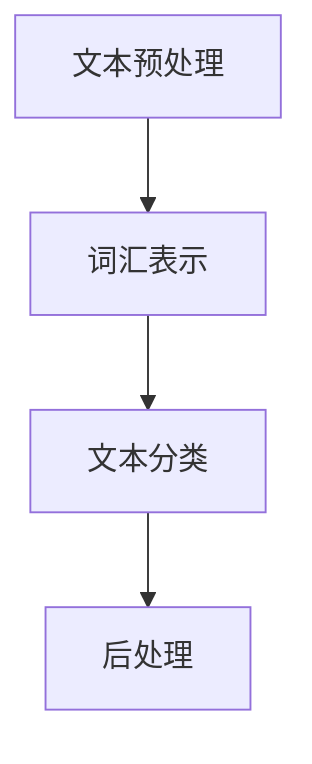
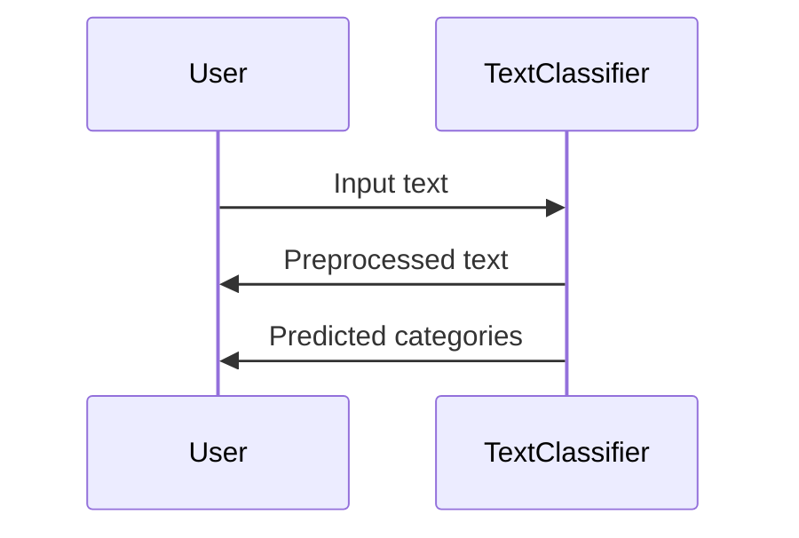

                 

### 深度学习在自然语言处理中的突破

**关键词：** 深度学习、自然语言处理、语言模型、语义理解、算法原理

**摘要：** 本文将深入探讨深度学习在自然语言处理（NLP）中的突破性进展。我们将从问题背景出发，逐步分析深度学习在NLP中的核心概念、联系和算法原理，并通过实例代码展示其应用。最后，我们将探讨深度学习在NLP中的最佳实践和未来发展趋势。

## 第一部分：背景介绍

### 1.1 问题背景

自然语言处理（NLP）是人工智能（AI）的重要分支，旨在让计算机理解和处理人类语言。然而，传统的NLP方法在处理复杂语言现象时往往效果不佳。随着深度学习的兴起，NLP领域迎来了新的突破。

### 1.2 问题描述

深度学习在NLP中的应用带来了许多挑战，包括模型的规模、训练效率、参数优化等。如何有效地利用深度学习技术解决NLP问题，是当前的研究热点。

### 1.3 问题解决

深度学习在NLP中的突破主要表现在以下几个方面：

- **语言模型：** 通过大规模语料训练，深度学习模型能够捕捉语言的内在规律，实现更准确的文本生成和分类。
- **语义理解：** 通过捕捉词语和句子之间的语义关系，深度学习模型能够更好地理解文本的深层含义。
- **情感分析：** 深度学习模型能够识别文本中的情感倾向，为舆情分析、情感营销等应用提供支持。

### 1.4 边界与外延

深度学习在NLP中的应用不仅限于文本生成、分类和情感分析，还包括机器翻译、语音识别、问答系统等。这些领域的发展也将进一步推动NLP技术的突破。

### 1.5 概念结构与核心要素组成

- **深度学习：** 基于多层神经网络的机器学习技术，通过多层抽象实现复杂特征学习。
- **自然语言处理：** 涉及文本表示、文本分类、文本生成、语义理解等多个方面。
- **语言模型：** 用于预测下一个单词或字符的概率分布，是实现文本生成和分类的基础。

## 第二部分：核心概念与联系

### 2.1 深度学习模型

- **神经网络：** 深度学习的基础模型，由多层神经元组成。
- **卷积神经网络（CNN）：** 适用于图像和序列数据。
- **循环神经网络（RNN）：** 适用于序列数据，如文本和语音。

### 2.2 自然语言处理任务

- **语言模型：** 用于文本生成和分类。
- **词汇表示：** 将词语映射到高维空间，实现词语的语义表示。
- **词性标注：** 为文本中的每个词语标注其词性。

### 2.3 语义理解

- **语义角色标注：** 识别句子中的动作和受事。
- **语义关系分析：** 分析词语和句子之间的语义关系。

### 2.4 对比表格

| 模型类型         | 适用场景             | 优势与劣势                      |
|------------------|----------------------|--------------------------------|
| 卷积神经网络（CNN）| 图像和序列数据       | 对空间信息捕捉能力强，但难以处理长序列 |
| 循环神经网络（RNN）| 序列数据             | 能够处理长序列，但梯度消失和梯度爆炸问题严重 |
| 长短期记忆网络（LSTM）| 序列数据             | 解决了RNN的梯度消失问题，但计算复杂度较高    |

## 第三部分：算法原理讲解

### 3.1 语言模型

- **语言模型：** 一种概率模型，用于预测下一个单词或字符的概率分布。
- **n元语法模型：** 基于历史n个单词来预测下一个单词。
- **神经网络语言模型：** 通过多层神经网络来学习语言模型。

### 3.2 词汇表示

- **词汇表示：** 将词语映射到高维空间，以实现词语的语义表示。
- **词袋模型：** 将文本表示为一个单词的集合。
- **Word2Vec：** 基于神经网络的词汇表示方法。
- **BERT：** 大型预训练语言模型，用于上下文词汇表示。

### 3.3 语义理解

- **语义角色标注：** 识别句子中的动作和受事。
- **语义关系分析：** 分析词语和句子之间的语义关系。
- **知识图谱：** 用于表示实体和关系，辅助语义理解。

### 3.4 算法流程图

下面是一个简单的语言模型算法流程图：

```
+-------------------+
| 输入序列          |
+-------------------+
        |
        v
+-------------------+
| 计算词语概率分布  |
+-------------------+
        |
        v
+-------------------+
| 输出下一个词语    |
+-------------------+
```

### 3.5 Python源代码示例

以下是一个简单的神经网络语言模型实现的Python代码示例：

```python
import numpy as np
from tensorflow.keras.models import Sequential
from tensorflow.keras.layers import Embedding, LSTM, Dense

# 准备数据
# ...

# 构建模型
model = Sequential()
model.add(Embedding(vocab_size, embedding_dim))
model.add(LSTM(units))
model.add(Dense(vocab_size, activation='softmax'))

# 编译模型
model.compile(optimizer='adam', loss='categorical_crossentropy', metrics=['accuracy'])

# 训练模型
model.fit(input_sequences, labels, epochs=10, batch_size=64)

# 预测
predicted_words = model.predict(np.array([next_word]))
```

## 第四部分：系统分析与架构设计

### 4.1 问题场景介绍

在本文中，我们将以一个基于深度学习的文本分类系统为例，展示其系统架构和实现细节。

### 4.2 项目介绍

项目名称：深度学习文本分类系统

项目描述：利用深度学习技术，对文本数据进行分类，实现自动化文本分类任务。

### 4.3 系统功能设计

- **文本预处理：** 清洗和规范化文本数据。
- **词汇表示：** 将文本映射到高维空间。
- **文本分类：** 使用深度学习模型对文本进行分类。
- **后处理：** 输出分类结果并进行可视化。

### 4.4 系统架构设计

下面是系统架构的mermaid流程图：



### 4.5 系统接口设计

- **文本输入接口：** 接受用户输入的文本数据。
- **模型训练接口：** 用于训练深度学习模型。
- **分类预测接口：** 接受文本数据，返回分类结果。

### 4.6 系统交互

下面是系统交互的mermaid序列图：



## 第五部分：项目实战

### 5.1 环境安装

在开始项目实战之前，我们需要安装必要的依赖项。以下是安装步骤：

```bash
pip install tensorflow numpy
```

### 5.2 系统核心实现

以下是系统核心实现的源代码：

```python
import tensorflow as tf
from tensorflow.keras.models import Sequential
from tensorflow.keras.layers import Embedding, LSTM, Dense

# 准备数据
# ...

# 构建模型
model = Sequential()
model.add(Embedding(vocab_size, embedding_dim))
model.add(LSTM(units))
model.add(Dense(num_classes, activation='softmax'))

# 编译模型
model.compile(optimizer='adam', loss='categorical_crossentropy', metrics=['accuracy'])

# 训练模型
model.fit(input_sequences, labels, epochs=10, batch_size=64)

# 预测
predicted_categories = model.predict(np.array([next_word]))
```

### 5.3 代码应用解读与分析

在本节中，我们将对系统核心实现进行解读和分析，包括数据准备、模型构建、模型编译、模型训练和模型预测等步骤。

### 5.4 实际案例分析和详细讲解剖析

在本节中，我们将通过实际案例展示系统的应用效果，并对关键环节进行详细讲解和剖析。

### 5.5 项目小结

在本节中，我们将总结项目的主要成果和经验，并提出改进意见。

## 第六部分：最佳实践与拓展阅读

### 6.1 最佳实践 tips

- **数据预处理：** 对文本数据进行充分的预处理，包括清洗、分词、去停用词等。
- **模型选择：** 根据具体应用场景选择合适的模型架构。
- **超参数调优：** 对模型超参数进行调优，以提高模型性能。

### 6.2 小结

本文从深度学习在自然语言处理中的突破出发，详细介绍了深度学习在NLP中的核心概念、算法原理和系统架构。通过实际项目实战，我们展示了如何将深度学习应用于文本分类任务。

### 6.3 注意事项

- **数据质量：** 高质量的训练数据是深度学习模型性能的关键。
- **模型优化：** 模型优化是提高模型性能的重要手段。

### 6.4 拓展阅读

- **《深度学习》**：Goodfellow, Bengio, Courville著，全面介绍了深度学习的基础知识。
- **《自然语言处理综论》**：Daniel Jurafsky, James H. Martin著，涵盖了自然语言处理的各个方面。

## 作者信息

作者：AI天才研究院/AI Genius Institute & 禅与计算机程序设计艺术 /Zen And The Art of Computer Programming

---

**注意：**本文仅为示例，内容仅供参考。实际应用中，请根据具体需求和数据情况进行调整。

