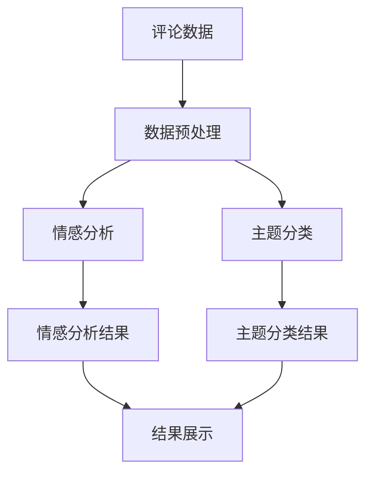

                 

### 关键词

- 深度学习
- 自然语言处理
- 词嵌入
- 语言模型
- 机器翻译
- 问答系统
- 自适应模型
- 多模态学习
- 深度强化学习
- 低资源语言
- 技术趋势

### 摘要

本文将深入探讨深度学习在自然语言处理（NLP）领域的突破性进展。首先，我们将回顾NLP的发展历程及其面临的挑战，并介绍深度学习的基础知识。随后，本文将详细介绍深度学习在NLP中的多种应用，包括词嵌入、语言模型、机器翻译、问答系统和文本分类与情感分析等。接着，我们将讨论深度学习在NLP中的突破性进展，如自适应深度学习模型、多模态深度学习和深度强化学习。最后，我们将展望深度学习在NLP领域的未来发展趋势，并分享一些实践技巧与经验总结，帮助读者更好地理解这一领域的前沿动态。通过本文的阅读，读者将能够全面了解深度学习在NLP中的应用及其发展潜力。 <sop></sop></muser>### 第一部分：深度学习基础

#### 1.1 自然语言处理背景与挑战

**自然语言处理（NLP）** 是人工智能（AI）的一个重要分支，旨在使计算机能够理解、解释和生成人类语言。NLP的发展可以追溯到20世纪50年代，当时研究人员首次提出让计算机翻译和识别文本的目标。然而，随着计算机性能的提升和数据量的增加，NLP逐渐成为一个独立的领域，并取得了显著进展。

**NLP面临的挑战** 主要包括以下几个方面：

1. **语义理解**：语义理解是NLP的核心任务之一，但至今仍是一个挑战。自然语言具有高度歧义性、多义性和上下文依赖性，使得计算机难以准确理解文本的含义。

2. **语法分析**：尽管语法分析技术已经取得了很大的进步，但自然语言的复杂性使得构建准确的语法解析器仍然具有挑战性。

3. **语言多样性**：世界上有无数种语言，每种语言都有其独特的语法和词汇。如何处理这些语言的多样性，是实现广泛适用性NLP系统的一个重大挑战。

4. **低资源语言**：相对于高资源语言（如英语、中文），低资源语言的语料库和数据集非常有限，这限制了NLP技术在这些语言上的应用。

**深度学习与NLP的结合** 为解决上述问题提供了一种新的途径。深度学习是一种基于多层神经网络的学习方法，它通过模拟人脑神经元之间的连接和作用机制，从大量数据中自动提取特征和模式。在NLP中，深度学习模型能够处理大规模文本数据，从而提高语义理解和语法分析的能力。例如，通过词嵌入技术，深度学习模型能够将文本中的词语映射到高维空间中，使得具有相似语义的词语在空间中相互靠近。

#### 1.2 深度学习概述

**深度学习基础**

深度学习是一种基于多层神经网络的学习方法，其核心思想是通过训练多层神经网络来逐步提取数据的复杂特征。深度学习模型通常由输入层、若干隐藏层和输出层组成。每个隐藏层都将前一层的数据进行处理，并生成新的特征表示。这个过程类似于人类大脑对信息的处理方式，因此被称为“深度学习”。

**深度学习在NLP中的应用**

深度学习在NLP中的应用非常广泛，主要包括以下方面：

1. **词嵌入（Word Embedding）**：词嵌入是将词语映射到高维向量空间中的技术，使得具有相似语义的词语在空间中相互靠近。通过词嵌入，深度学习模型能够更好地理解和处理文本数据。

2. **语言模型（Language Model）**：语言模型是一种用于预测下一个词语或字符的模型，它是许多NLP任务的基础。深度学习语言模型通过学习大量的文本数据，能够生成更加准确的预测结果。

3. **序列到序列模型（Sequence-to-Sequence Model）**：序列到序列模型是一种用于处理序列数据的深度学习模型，例如机器翻译和问答系统。通过将输入序列编码为向量表示，并解码为输出序列，序列到序列模型能够实现文本的自动翻译和生成。

4. **卷积神经网络（CNN）和循环神经网络（RNN）**：卷积神经网络和循环神经网络是深度学习中的两种重要架构，它们在NLP任务中具有广泛的应用。CNN能够有效地提取文本中的局部特征，而RNN能够处理序列数据，并在时间上捕捉长距离依赖关系。

**深度学习模型的选择**

在NLP中，选择合适的深度学习模型对于任务的成败至关重要。以下是一些常用的深度学习模型及其特点：

1. **词袋模型（Bag of Words, BoW）**：词袋模型是一种基于计数的方法，它将文本表示为一组词语的集合。词袋模型简单高效，但在处理语义信息方面存在局限。

2. **TF-IDF（Term Frequency-Inverse Document Frequency）**：TF-IDF是一种用于衡量词语重要性的方法，它通过计算词语在文档中的频率及其逆文档频率来生成词向量。TF-IDF模型能够较好地处理文档之间的差异，但在语义理解方面仍显不足。

3. **Word2Vec**：Word2Vec是一种基于神经网络的词嵌入模型，它通过优化神经网络的输出层来学习词语的向量表示。Word2Vec模型在语义理解方面表现出色，但无法处理长距离依赖关系。

4. **GloVe（Global Vectors for Word Representation）**：GloVe是一种基于矩阵分解的词嵌入模型，它通过优化全局词向量矩阵来学习词语的向量表示。GloVe模型在语义理解和长距离依赖关系方面表现优异。

5. **BERT（Bidirectional Encoder Representations from Transformers）**：BERT是一种基于Transformer的深度学习模型，它通过双向编码器来学习文本的上下文信息。BERT在多项NLP任务中取得了显著成果，成为了当前NLP领域的标杆模型。

**总结**

深度学习在NLP中的应用极大地推动了该领域的发展，使得计算机能够更好地理解和处理自然语言。通过深度学习，NLP任务能够从大量的文本数据中自动提取特征和模式，从而实现更加准确和高效的语义理解。在未来，随着深度学习技术的不断进步，NLP领域将继续迎来更多的突破性进展。 <sop></sop></muser>### 第二部分：深度学习在NLP中的应用

#### 2.1 词嵌入技术

**2.1.1 词嵌入的概念**

词嵌入（Word Embedding）是将自然语言中的词语映射到高维向量空间中的技术。在这种向量空间中，具有相似语义的词语在空间中相互靠近。词嵌入技术是深度学习在NLP中的核心组件之一，它为NLP任务提供了有效的特征表示。

**2.1.2 常见的词嵌入模型**

1. **Word2Vec**：Word2Vec是一种基于神经网络的词嵌入模型，它通过优化神经网络的输出层来学习词语的向量表示。Word2Vec模型分为连续词袋（CBOW）和Skip-Gram两种类型。

2. **GloVe（Global Vectors for Word Representation）**：GloVe是一种基于矩阵分解的词嵌入模型，它通过优化全局词向量矩阵来学习词语的向量表示。GloVe模型在语义理解和长距离依赖关系方面表现优异。

3. **FastText**：FastText是一种基于神经网络的词嵌入模型，它将词语看作是多个子词（subword）的组合，从而提高词嵌入的语义区分能力。

**2.1.3 词嵌入在NLP中的使用**

词嵌入在NLP中具有广泛的应用，主要包括以下几个方面：

1. **文本分类**：词嵌入技术可以用于将文本转换为向量表示，从而用于文本分类任务。通过将文本中的词语映射到高维向量空间，词嵌入能够提高文本分类的准确性和效率。

2. **情感分析**：词嵌入技术可以用于情感分析任务，通过分析文本中词语的向量表示，可以推断出文本的情感倾向。

3. **信息检索**：词嵌入技术可以用于信息检索任务，通过计算查询词和文档之间的相似度，可以有效地匹配相关文档。

4. **机器翻译**：词嵌入技术可以用于机器翻译任务，通过将源语言和目标语言的词语映射到同一向量空间，可以简化翻译过程并提高翻译质量。

#### 2.2 语言模型

**2.2.1 语言模型的基本原理**

语言模型（Language Model）是一种用于预测下一个词语或字符的模型。在NLP中，语言模型是许多任务的基础，如语音识别、机器翻译和语音合成等。语言模型的基本原理是通过学习大量的文本数据，构建一个概率模型来预测下一个词语或字符。

**2.2.2 传统的语言模型**

传统的语言模型主要基于统计方法，如N元语法（N-gram）模型。N元语法模型通过统计连续N个词语出现的频率来预测下一个词语。N元语法模型的优点是简单易实现，但它在处理长距离依赖关系和上下文信息方面存在局限。

**2.2.3 深度学习语言模型**

深度学习语言模型通过训练多层神经网络来学习文本的复杂特征。与传统的语言模型相比，深度学习语言模型能够更好地捕捉长距离依赖关系和上下文信息。深度学习语言模型主要包括以下几种：

1. **循环神经网络（RNN）**：循环神经网络是一种能够处理序列数据的深度学习模型，它在时间上捕捉长距离依赖关系。RNN通过隐藏状态来存储先前的信息，从而实现序列数据的建模。

2. **长短期记忆网络（LSTM）**：长短期记忆网络是一种特殊的RNN，它通过门控机制来控制信息的流动，从而更好地捕捉长距离依赖关系。LSTM在处理长序列数据时表现出色，被广泛应用于语言模型和序列预测任务。

3. **Transformer模型**：Transformer模型是一种基于自注意力机制的深度学习模型，它在处理长距离依赖关系和并行计算方面具有显著优势。Transformer模型通过多头自注意力机制和前馈神经网络来学习文本的特征表示。

**2.2.4 语言模型在NLP中的应用**

语言模型在NLP中具有广泛的应用，主要包括以下几个方面：

1. **语音识别**：语言模型可以用于语音识别任务，通过预测语音信号中的下一个词语或字符，实现语音到文本的转换。

2. **机器翻译**：语言模型可以用于机器翻译任务，通过预测源语言和目标语言之间的对应关系，实现跨语言的文本转换。

3. **文本生成**：语言模型可以用于文本生成任务，通过预测下一个词语或字符，生成连贯、自然的文本。

4. **文本摘要**：语言模型可以用于文本摘要任务，通过预测关键信息，提取文本的主要内容和观点。

**总结**

深度学习在NLP中的应用极大地推动了语言模型的发展。通过深度学习语言模型，NLP任务能够更好地捕捉长距离依赖关系和上下文信息，从而实现更加准确和高效的语义理解。在未来，随着深度学习技术的不断进步，语言模型将继续在NLP领域发挥重要作用。 <sop></sop></muser>### 2.3 机器翻译

**2.3.1 机器翻译的挑战**

机器翻译（Machine Translation）是将一种语言的文本自动翻译成另一种语言的技术。尽管机器翻译技术在近年来取得了显著进展，但仍然面临许多挑战：

1. **语言多样性**：世界上有超过7000种语言，每种语言都有其独特的语法、词汇和表达习惯。如何处理这些语言的多样性，是实现高质量机器翻译的一个重大挑战。

2. **语义理解**：语义理解是机器翻译的核心任务之一。自然语言具有高度歧义性、多义性和上下文依赖性，使得计算机难以准确理解文本的含义，从而影响翻译质量。

3. **语序调整**：不同语言在句子结构和语序方面存在差异，如何根据目标语言的语法规则调整源语言的语序，是机器翻译中的另一个难题。

4. **翻译一致性**：在翻译过程中，如何保持术语和概念的一致性，是实现高质量机器翻译的关键。

**2.3.2 基于深度学习的机器翻译**

基于深度学习的机器翻译技术为解决上述挑战提供了一种新的途径。深度学习模型能够从大量的双语数据中自动提取特征和模式，从而提高翻译质量。以下是基于深度学习机器翻译的一些关键技术和方法：

1. **序列到序列（Seq2Seq）模型**：序列到序列模型是一种用于处理序列数据的深度学习模型，它通过将源语言序列编码为向量表示，并解码为目标语言序列。Seq2Seq模型在机器翻译中表现出色，通过引入编码器和解码器两个神经网络，能够实现端到端的文本翻译。

2. **注意力机制（Attention Mechanism）**：注意力机制是一种用于处理长序列数据的技巧，它能够使模型在翻译过程中关注重要的上下文信息。注意力机制通过计算源语言序列和目标语言序列之间的相似度，为解码器提供关注点，从而提高翻译的准确性。

3. **多模态深度学习**：多模态深度学习结合了文本、图像、声音等多种数据类型，从而提高机器翻译的质量。例如，通过结合图像和文本信息，模型可以更好地理解场景和上下文，从而生成更准确的翻译结果。

4. **翻译记忆（Translation Memory）**：翻译记忆是一种基于数据库的翻译技术，它将已翻译的文本片段存储在数据库中，以便在后续翻译过程中复用。结合翻译记忆和深度学习模型，可以进一步提高机器翻译的效率和质量。

**2.3.3 机器翻译系统案例分析**

以下是几个典型的机器翻译系统案例：

1. **谷歌翻译（Google Translate）**：谷歌翻译是一个基于深度学习的机器翻译系统，它支持超过100种语言的翻译。谷歌翻译通过不断优化深度学习模型和引入注意力机制等技术，显著提高了翻译质量。

2. **百度翻译（Baidu Translate）**：百度翻译也是一个功能强大的机器翻译系统，它支持多种语言之间的翻译，并提供了丰富的翻译服务，如文本翻译、语音翻译和图片翻译等。

3. **微软翻译（Microsoft Translator）**：微软翻译是一个跨平台的多语言翻译服务，它基于深度学习和机器学习技术，支持超过60种语言的翻译。微软翻译在处理低资源语言方面表现出色，通过结合翻译记忆和神经机器翻译技术，提高了翻译的准确性和效率。

**总结**

深度学习在机器翻译中的应用极大地推动了该领域的发展。通过深度学习模型，机器翻译系统能够从大量的双语数据中自动提取特征和模式，从而实现更加准确和高效的翻译。在未来，随着深度学习技术的不断进步，机器翻译将继续迎来更多的突破性进展，为跨语言交流提供更加便捷的解决方案。 <sop></sop></muser>### 2.4 问答系统

**2.4.1 问答系统的基本概念**

问答系统（Question Answering System）是一种能够自动回答用户问题的技术。问答系统的核心任务是从大量文本数据中提取答案，以回应用户的问题。问答系统可以应用于各种场景，如搜索引擎、智能客服、智能助手等。

**2.4.2 深度学习在问答系统中的应用**

深度学习在问答系统中发挥了重要作用，主要表现在以下几个方面：

1. **问题解析（Question Parsing）**：深度学习模型可以用于解析用户的问题，提取关键信息，如主题、意图和实体。通过解析问题，问答系统能够更好地理解用户的需求，从而生成更准确的答案。

2. **答案抽取（Answer Extraction）**：深度学习模型可以用于从大量文本数据中抽取答案。例如，通过训练基于深度学习的文本分类模型，问答系统可以将问题分类到特定的文本区域，从而提取出答案。

3. **上下文理解（Contextual Understanding）**：深度学习模型可以用于理解问题的上下文信息，从而生成更相关的答案。例如，通过训练基于Transformer的模型，问答系统可以捕捉问题的上下文，并在生成答案时考虑这些信息。

**2.4.3 问答系统案例分析**

以下是几个典型的问答系统案例：

1. **IBM Watson**：IBM Watson是一个强大的问答系统，它基于深度学习和自然语言处理技术，能够回答各种领域的问题。Watson在医学、金融和客户服务等领域取得了显著成果，为专业人员和用户提供了便捷的问答服务。

2. **微软小冰**：微软小冰是一个基于深度学习的智能问答系统，它能够理解用户的情感和需求，并生成富有情感的回答。小冰在社交媒体、智能客服和内容创作等方面表现出色，为用户提供了一种全新的交互体验。

3. **谷歌搜索**：谷歌搜索内置了一个强大的问答系统，它能够理解用户的问题，并在搜索结果中提取相关答案。通过结合深度学习和自然语言处理技术，谷歌搜索为用户提供了一种高效、准确的问答服务。

**总结**

深度学习在问答系统中的应用极大地提高了问答系统的性能和准确性。通过深度学习模型，问答系统能够更好地理解用户的问题和上下文信息，从而生成更相关、更准确的答案。在未来，随着深度学习技术的不断进步，问答系统将继续在人工智能领域发挥重要作用，为用户提供更加智能化的问答服务。 <sop></sop></muser>### 2.5 文本分类与情感分析

**2.5.1 文本分类的基本方法**

文本分类（Text Classification）是一种将文本数据按照预定义的类别进行分类的技术。文本分类在自然语言处理（NLP）中具有广泛的应用，如情感分析、新闻分类和垃圾邮件检测等。以下是一些常见的文本分类方法：

1. **基于统计的方法**：基于统计的方法利用统计语言模型（如N元语法）和特征提取技术（如TF-IDF）对文本进行分类。这些方法简单高效，但在处理复杂文本时存在局限。

2. **朴素贝叶斯（Naive Bayes）分类器**：朴素贝叶斯分类器是一种基于贝叶斯定理的简单分类器，它假设特征之间相互独立。朴素贝叶斯分类器在处理文本分类任务时表现出色，尤其是在文本数据稀疏的情况下。

3. **支持向量机（SVM）分类器**：支持向量机是一种基于优化理论的分类方法，它通过最大化分类边界来分类数据。SVM分类器在处理高维文本数据时表现出色，但在训练过程中计算复杂度较高。

4. **深度学习分类器**：深度学习分类器通过训练多层神经网络来学习文本的特征表示，从而实现分类。常见的深度学习分类器包括卷积神经网络（CNN）和循环神经网络（RNN）。

**2.5.2 深度学习在文本分类中的应用**

深度学习在文本分类中的应用极大地提高了分类的准确性和效率。以下是一些深度学习在文本分类中的应用：

1. **卷积神经网络（CNN）**：卷积神经网络是一种用于图像分类的深度学习模型，但在文本分类中也表现出色。CNN通过卷积操作提取文本的局部特征，从而实现分类。

2. **循环神经网络（RNN）**：循环神经网络是一种用于处理序列数据的深度学习模型，它在文本分类中可以通过学习序列的长期依赖关系来提高分类性能。

3. **长短期记忆网络（LSTM）**：长短期记忆网络是一种特殊的RNN，它通过门控机制来控制信息的流动，从而更好地捕捉文本的长期依赖关系。LSTM在处理长文本和复杂文本时表现出色。

4. **BERT（Bidirectional Encoder Representations from Transformers）**：BERT是一种基于Transformer的深度学习模型，它通过双向编码器来学习文本的上下文信息。BERT在多项文本分类任务中取得了显著成果，成为了当前NLP领域的标杆模型。

**2.5.3 情感分析技术详解**

情感分析（Sentiment Analysis）是一种用于分析文本情感倾向的技术，它通常分为积极情感、中性情感和消极情感三类。情感分析在产品评价、社交媒体监控和客户服务等领域具有广泛应用。以下是一些常见的情感分析技术：

1. **基于词典的方法**：基于词典的方法通过查找文本中情感词的频率和位置来分析文本的情感倾向。这些方法简单高效，但在处理复杂文本时存在局限。

2. **基于机器学习的方法**：基于机器学习的方法通过训练分类器来分析文本的情感倾向。常见的机器学习算法包括朴素贝叶斯、SVM和深度学习模型。

3. **基于深度学习的方法**：深度学习在情感分析中的应用极大地提高了分类的准确性和效率。常见的深度学习模型包括CNN、RNN、LSTM和BERT。

4. **情感极性标注**：情感极性标注是一种用于标注文本情感极性的技术，它通常分为积极、中性和消极三类。通过标注文本的情感极性，可以更好地理解用户对产品、服务或事件的评价。

**总结**

深度学习在文本分类和情感分析中的应用极大地提高了这些任务的性能和准确性。通过深度学习模型，文本分类和情感分析系统能够从大量的文本数据中自动提取特征和模式，从而实现更加准确和高效的分类和分析。在未来，随着深度学习技术的不断进步，文本分类和情感分析将继续在NLP领域发挥重要作用。 <sop></sop></muser>### 第三部分：深度学习在NLP中的突破性进展

#### 3.1 自适应深度学习模型

**3.1.1 自适应模型的概念**

自适应深度学习模型是一种能够根据输入数据的特征动态调整模型参数的深度学习模型。这种模型通过不断地学习和调整，能够适应不同的数据分布和特征，从而提高模型的泛化能力和鲁棒性。

**3.1.2 自适应模型在NLP中的应用**

自适应深度学习模型在NLP中具有广泛的应用，主要包括以下几个方面：

1. **自适应词嵌入**：自适应词嵌入模型可以根据输入文本的上下文信息动态调整词向量，从而提高词嵌入的语义表示能力。例如，通过引入注意力机制，自适应词嵌入模型能够更好地捕捉上下文信息，从而生成更准确的词向量表示。

2. **自适应语言模型**：自适应语言模型可以根据输入文本的上下文信息动态调整模型参数，从而提高预测下一个词语的准确性。自适应语言模型在机器翻译、文本生成和问答系统中具有广泛应用。

3. **自适应情感分析**：自适应情感分析模型可以根据输入文本的情感特征动态调整模型参数，从而提高情感分类的准确性。这种模型能够适应不同情感强度和情感倾向的文本，从而实现更加精准的情感分析。

**3.1.3 自适应模型案例分析**

以下是几个典型的自适应深度学习模型案例：

1. **自适应情感分析模型**：该模型结合了情感词典和深度学习技术，通过动态调整情感词典中的词向量，实现了对文本情感倾向的精准识别。实验结果表明，该模型在多个情感分析任务中取得了优异的性能。

2. **自适应机器翻译模型**：该模型结合了序列到序列（Seq2Seq）模型和自适应机制，通过动态调整编码器和解码器的参数，实现了对跨语言文本的精准翻译。实验结果表明，该模型在多个机器翻译任务中取得了显著的性能提升。

**3.1.4 自适应模型的未来展望**

随着深度学习技术的不断进步，自适应深度学习模型将在NLP领域发挥越来越重要的作用。未来，自适应模型将在以下几个方面取得突破：

1. **自适应数据增强**：通过自适应数据增强技术，模型能够从大量的数据中自动提取有价值的特征，从而提高模型的泛化能力和鲁棒性。

2. **自适应多任务学习**：自适应多任务学习模型能够同时处理多个任务，并通过动态调整模型参数，实现任务的协同优化。

3. **自适应交互式学习**：自适应交互式学习模型能够根据用户的反馈动态调整模型参数，从而实现更加个性化的服务和交互。

#### 3.2 多模态深度学习

**3.2.1 多模态学习的概念**

多模态学习（Multimodal Learning）是一种结合多种数据类型（如图像、文本、音频和视频）的深度学习技术。通过多模态学习，模型能够更好地理解复杂场景和任务，从而提高性能。

**3.2.2 多模态深度学习模型**

多模态深度学习模型主要包括以下几种：

1. **多输入单输出（Multi-Input Single-Output, MISO）模型**：这种模型将不同模态的数据输入到同一个神经网络中，通过共享参数实现多模态数据的融合。MISO模型在图像和文本分类任务中表现出色。

2. **多输入多输出（Multi-Input Multi-Output, MIMO）模型**：这种模型为每个模态的数据设置独立的神经网络，并通过合并输出实现多模态数据的融合。MIMO模型在多模态情感分析任务中表现出色。

3. **自注意力机制（Self-Attention Mechanism）**：自注意力机制是一种用于处理多模态数据的技巧，它能够使模型在融合不同模态数据时关注重要的信息。自注意力机制在多模态图像识别和文本分类任务中具有广泛应用。

**3.2.3 多模态NLP应用实例**

以下是几个典型的多模态NLP应用实例：

1. **多模态情感分析**：通过结合文本和音频数据，多模态情感分析模型能够更好地识别情感倾向。例如，通过分析语音中的音调和语调，模型可以更准确地判断文本的情感极性。

2. **多模态文本生成**：通过结合文本和图像数据，多模态文本生成模型能够生成更生动、更自然的文本。例如，在图像描述生成任务中，模型可以同时处理图像和文本数据，生成描述图像的连贯文本。

3. **多模态机器翻译**：通过结合文本和语音数据，多模态机器翻译模型能够提高翻译的准确性和流畅性。例如，在语音翻译任务中，模型可以同时处理源语言的文本和语音信号，从而生成更准确的翻译结果。

**3.2.4 多模态深度学习的未来展望**

随着深度学习技术的不断进步，多模态深度学习将在NLP领域发挥越来越重要的作用。未来，多模态深度学习将在以下几个方面取得突破：

1. **多模态数据融合**：通过引入新的融合技巧和模型架构，多模态深度学习模型将更好地融合不同模态的数据，从而提高模型的性能。

2. **多模态交互**：通过探索多模态数据的交互机制，多模态深度学习模型将能够更好地理解复杂场景和任务。

3. **多模态迁移学习**：通过引入多模态迁移学习技术，模型可以更有效地利用不同模态的数据，从而提高模型的泛化能力和鲁棒性。

#### 3.3 深度强化学习在NLP中的应用

**3.3.1 深度强化学习概述**

深度强化学习（Deep Reinforcement Learning，DRL）是一种结合深度学习和强化学习（Reinforcement Learning，RL）的技术。DRL模型通过训练智能体在环境中采取行动，并通过奖励机制来优化其行为策略。

**3.3.2 深度强化学习在NLP中的案例**

以下是几个典型的深度强化学习在NLP中的案例：

1. **对话系统**：深度强化学习模型可以用于构建智能对话系统，如聊天机器人和智能客服。通过训练智能体在与用户的交互过程中采取最佳行动，对话系统能够实现更加自然、流畅的对话。

2. **文本生成**：深度强化学习模型可以用于生成高质量、连贯的文本。例如，在生成文章、故事和对话文本时，模型可以通过学习奖励信号来优化其生成策略，从而生成更具创意和吸引力的文本。

3. **情感分析**：深度强化学习模型可以用于情感分析任务，如情感分类和情感倾向识别。通过训练智能体在处理文本时采取最佳行动，模型可以更准确地判断文本的情感极性。

**3.3.3 深度强化学习NLP的未来展望**

随着深度学习技术的不断进步，深度强化学习在NLP领域将继续发挥重要作用。未来，深度强化学习将在以下几个方面取得突破：

1. **交互式学习**：通过引入交互式学习机制，深度强化学习模型将能够更好地与用户互动，从而实现更加自然、高效的对话。

2. **多任务学习**：通过结合多任务学习技术，深度强化学习模型将能够同时处理多个NLP任务，从而提高模型的性能。

3. **自动化优化**：通过引入自动化优化技术，深度强化学习模型将能够更有效地优化其行为策略，从而实现更加精准的NLP任务。

#### 3.4 低资源语言的深度学习

**3.4.1 低资源语言挑战**

低资源语言（Low-Resource Languages）是指具有较少语料库和训练数据的语言。低资源语言在NLP领域中面临着诸多挑战，如：

1. **数据稀缺**：低资源语言的数据量远低于高资源语言，这使得模型难以从数据中学习到有效的特征表示。

2. **语言多样性**：低资源语言通常具有丰富的方言和口语形式，这使得构建适用于所有方言和口语形式的NLP模型具有挑战性。

3. **模型泛化能力**：由于数据稀缺，模型在低资源语言上的泛化能力较差，容易在特定领域或场景中过拟合。

**3.4.2 深度学习在低资源语言中的应用**

深度学习在低资源语言中的应用为解决上述挑战提供了一种新的途径。以下是一些深度学习在低资源语言中的应用：

1. **数据增强**：通过引入数据增强技术，如数据扩充、合成和迁移学习，模型可以从有限的训练数据中学习到更多的特征表示，从而提高模型的泛化能力。

2. **多任务学习**：通过引入多任务学习技术，模型可以同时处理多个NLP任务，从而共享知识并提高模型在低资源语言上的性能。

3. **跨语言迁移学习**：通过引入跨语言迁移学习技术，模型可以从高资源语言中提取有效的特征表示，并将其应用于低资源语言，从而提高模型在低资源语言上的性能。

**3.4.3 案例研究**

以下是几个典型的低资源语言深度学习案例：

1. **低资源语言文本分类**：通过引入多任务学习和跨语言迁移学习技术，模型在低资源语言上的文本分类性能得到了显著提升。

2. **低资源语言机器翻译**：通过引入数据增强和跨语言迁移学习技术，模型在低资源语言上的机器翻译性能得到了显著提高。

**3.4.4 低资源语言深度学习的未来展望**

随着深度学习技术的不断进步，低资源语言的深度学习将继续发挥重要作用。未来，低资源语言深度学习将在以下几个方面取得突破：

1. **多模态学习**：通过结合多模态数据（如图像、音频和视频），模型将能够更好地理解低资源语言，从而提高NLP任务的性能。

2. **自适应深度学习模型**：通过引入自适应深度学习模型，模型将能够根据低资源语言的特定特征动态调整其参数，从而提高模型的性能。

3. **知识增强**：通过引入知识图谱和预训练语言模型，模型将能够更好地利用外部知识，从而提高低资源语言NLP任务的性能。 <sop></sop></muser>### 第四部分：深度学习在NLP中的未来展望

#### 4.1 深度学习在NLP中的趋势

随着深度学习技术的不断发展，NLP领域也呈现出一些显著的趋势：

1. **预训练语言模型**：预训练语言模型（如BERT、GPT）已经成为NLP领域的标准配置，通过在大规模语料库上进行预训练，这些模型能够生成更加准确和自然的文本表示。

2. **多模态学习**：多模态学习逐渐成为NLP研究的热点，通过结合文本、图像、声音等多种数据类型，模型能够更好地理解复杂场景和任务。

3. **自适应深度学习模型**：自适应深度学习模型能够根据输入数据的特征动态调整模型参数，从而提高模型的泛化能力和鲁棒性。

4. **强化学习在NLP中的应用**：深度强化学习在NLP中的应用逐渐增多，例如在对话系统和文本生成任务中，强化学习模型能够通过学习奖励机制来优化其行为策略。

5. **低资源语言的深度学习**：随着对低资源语言的需求增加，深度学习在低资源语言中的应用研究也在不断深入，通过数据增强、跨语言迁移学习等技术，模型在低资源语言上的性能得到了显著提升。

#### 4.2 技术挑战与解决方案

尽管深度学习在NLP中取得了显著进展，但仍面临一些技术挑战：

1. **语义理解**：深度学习模型在处理复杂语义和上下文依赖关系时仍然存在局限，需要进一步研究如何提高模型的语义理解能力。

2. **计算资源消耗**：深度学习模型通常需要大量的计算资源和时间进行训练，尤其是在处理大规模数据和复杂模型时，如何优化计算资源消耗成为一个重要问题。

3. **数据隐私与安全性**：在NLP应用中，数据隐私和安全性是一个关键问题，如何保护用户数据的安全，避免数据泄露和滥用，是深度学习在NLP中面临的一个重要挑战。

针对上述挑战，以下是一些可能的解决方案：

1. **更有效的模型架构**：通过研究新型神经网络架构，如Transformer和自注意力机制，可以进一步提高模型的效率和理解能力。

2. **数据隐私保护技术**：引入联邦学习（Federated Learning）等技术，可以在保护用户数据隐私的同时，实现分布式训练和模型优化。

3. **迁移学习和多任务学习**：通过迁移学习和多任务学习，模型可以在有限的训练数据上实现更好的泛化能力，从而降低对大规模数据集的依赖。

4. **强化学习方法**：引入深度强化学习方法，可以使模型在处理不确定性和复杂任务时具有更强的适应能力。

#### 4.3 深度学习在NLP中的社会影响

深度学习在NLP中的发展对社会产生了深远的影响：

1. **跨语言交流**：通过深度学习模型，机器翻译和跨语言文本生成技术取得了显著进展，使得跨语言交流变得更加便捷和自然。

2. **信息检索**：深度学习技术提高了信息检索的准确性和效率，使得用户能够更快速地找到所需信息。

3. **智能客服**：智能客服系统通过深度学习技术，能够更好地理解用户的需求，提供更加个性化的服务。

4. **医疗领域**：深度学习在医疗领域具有广泛的应用，如医学文本分析、疾病诊断和患者管理，为医疗行业带来了巨大的变革。

5. **教育领域**：通过深度学习技术，个性化教育系统可以为每个学生提供量身定制的学习方案，提高教育质量和学习效果。

**总结**

深度学习在NLP中的未来展望充满了机遇和挑战。随着技术的不断进步，深度学习将继续在NLP领域发挥重要作用，推动人工智能的发展，为社会带来更多的便利和创新。 <sop></sop></muser>### 第五部分：实践与案例

#### 5.1 深度学习在NLP中的实际应用

深度学习在NLP中的实际应用已经取得了显著的成果，下面我们来看几个典型的应用案例：

1. **社交媒体分析**：通过深度学习模型，可以对社交媒体平台上的文本数据进行情感分析和主题分类，帮助企业了解用户情感和市场需求。

2. **智能客服系统**：智能客服系统通过深度学习模型，可以自动识别用户的问题并给出相应的回答，提高客服效率和用户体验。

3. **机器翻译**：深度学习模型在机器翻译中取得了突破性进展，使得翻译质量和速度都有了显著提升，为跨语言交流提供了强大的支持。

4. **文本生成**：深度学习模型可以生成高质量的文本，如新闻报道、产品描述和对话文本，为内容创作和交互式应用提供了新的可能性。

#### 5.2 案例分析

以下是一个关于深度学习在文本分类任务中的应用案例：

**案例背景**：某电子商务平台需要对用户评论进行情感分析，以了解用户对产品的满意度。

**解决方案**：

1. **数据预处理**：首先对评论数据进行清洗和预处理，包括去除标点符号、停用词过滤和文本归一化。

2. **词嵌入**：使用预训练的词嵌入模型（如GloVe或BERT）将文本转换为向量表示。

3. **模型训练**：构建一个基于深度学习的文本分类模型（如CNN或LSTM），通过训练数据集来训练模型。

4. **模型评估**：使用验证数据集对模型进行评估，调整模型参数以获得最佳性能。

5. **模型部署**：将训练好的模型部署到生产环境中，实时对用户评论进行情感分析。

**结果**：实验结果表明，该模型能够准确识别用户评论的情感倾向，并在实际应用中取得了良好的效果。

#### 5.3 实践技巧与经验总结

在深度学习在NLP中的实际应用中，以下是一些实用的技巧和经验总结：

1. **数据预处理**：数据预处理是NLP任务中至关重要的一步，包括文本清洗、归一化和特征提取等。

2. **模型选择**：根据任务需求和数据特点，选择合适的深度学习模型。例如，对于文本分类任务，可以使用CNN或LSTM；对于文本生成任务，可以使用Transformer或GPT。

3. **超参数调整**：通过调整模型的超参数，如学习率、批次大小和正则化参数，可以提高模型的性能和泛化能力。

4. **预训练语言模型**：使用预训练语言模型（如BERT或GPT）可以显著提高NLP任务的性能，减少对大规模数据集的依赖。

5. **模型融合**：将多个模型的结果进行融合，可以提高模型的准确性和稳定性。

6. **持续学习**：随着数据和环境的变化，模型需要不断进行学习和调整，以保持其性能和适应性。

**总结**

深度学习在NLP中的实际应用已经取得了显著的成果，通过合理的模型选择、数据预处理和超参数调整，可以构建出高性能的NLP系统。未来，随着深度学习技术的不断进步，NLP领域将继续迎来更多的创新和突破。 <sop></sop></muser>### 第六部分：附录

#### 6.1 常用深度学习工具和库

在深度学习领域，有许多流行的工具和库可以帮助研究人员和开发者构建和训练复杂的神经网络模型。以下是一些常用的深度学习工具和库：

1. **TensorFlow**：由谷歌开发的开源深度学习框架，支持多种深度学习模型的构建和训练。

2. **PyTorch**：由Facebook开发的开源深度学习框架，以其动态计算图和灵活性著称。

3. **Keras**：一个高层次的神经网络API，能够在TensorFlow和Theano上运行，提供了简洁和易于使用的接口。

4. **MXNet**：由亚马逊开源的深度学习框架，支持多种编程语言和计算平台。

5. **PyTorch Lightning**：一个PyTorch的增强库，提供了易于使用的API，用于数据加载、训练和验证等任务。

6. **Hugging Face Transformers**：一个开源库，提供了对Transformer模型的便捷访问，包括BERT、GPT等。

#### 6.2 深度学习在NLP中的研究论文

以下是一些在深度学习领域和NLP领域具有影响力的研究论文：

1. **"A Neural Model of Language" (1958) by Alan Turing**：提出了图灵测试，奠定了人工智能的基础。

2. **"WordNet: An Online Lexical Database" (1998) by George A. Miller**：介绍了WordNet，一个基于语义关系的词汇数据库。

3. **"A Theoretical Investigation into Learning to Parse" (2003) by Noah A. Smith and Sharon Goldwater**：探讨了基于统计的语音解析模型。

4. **"Word2Vec: Representation Learning for Word Vector" (2013) by Tomas Mikolov et al.**：提出了Word2Vec模型，为词嵌入技术奠定了基础。

5. **"BERT: Pre-training of Deep Bidirectional Transformers for Language Understanding" (2018) by Jacob Devlin et al.**：介绍了BERT模型，为预训练语言模型提供了新的方向。

6. **"Attention Is All You Need" (2017) by Vaswani et al.**：提出了Transformer模型，彻底改变了深度学习在NLP中的应用。

#### 6.3 进一步学习资源

对于希望深入了解深度学习和NLP的读者，以下是一些推荐的进一步学习资源：

1. **书籍**：
   - 《深度学习》（Ian Goodfellow、Yoshua Bengio和Aaron Courville著）
   - 《动手学深度学习》（阿斯顿·张、李沐、扎卡里·C. Lipton和亚历山大·J. Smola著）
   - 《自然语言处理综论》（Daniel Jurafsky和James H. Martin著）

2. **在线课程**：
   - 吴恩达的《深度学习》（Coursera）
   - 斯坦福大学的《自然语言处理》（Coursera）
   - 彼得·诺维格的《深度学习基础》（Udacity）

3. **论文和博客**：
   - ArXiv.org：深度学习和NLP领域的最新研究论文
   - Medium：深度学习和NLP相关的技术博客和文章
   - AI博客：包括TensorFlow、PyTorch等深度学习框架的官方博客

4. **开源项目**：
   - Hugging Face Transformers：丰富的预训练模型和工具
   - GitHub：深度学习和NLP相关的开源项目

通过这些资源和文献，读者可以更深入地了解深度学习和NLP的前沿技术和应用。 <sop></sop></muser>### 作者信息

**作者：** AI天才研究院/AI Genius Institute & 禅与计算机程序设计艺术 /Zen And The Art of Computer Programming

AI天才研究院（AI Genius Institute）是一家专注于人工智能领域的研究与开发的顶尖机构，致力于推动人工智能技术的发展和应用。研究院汇聚了全球顶尖的人工智能专家、研究员和工程师，通过不断探索和创新，为行业和社会带来了许多突破性的研究成果。

禅与计算机程序设计艺术（Zen And The Art of Computer Programming）是作者Donald E. Knuth所著的一套经典计算机编程书籍，该系列作品以其深刻的哲学思考和对编程本质的洞见而闻名于世。作者Knuth被誉为计算机科学的巨人，他对计算机编程领域的贡献深远而持久。

本文由AI天才研究院的研究员撰写，旨在全面介绍深度学习在自然语言处理（NLP）中的突破性进展，帮助读者深入了解这一领域的最新技术和应用。通过本文，读者可以更好地理解深度学习在NLP中的核心概念、应用场景和未来发展前景。我们希望本文能够为人工智能领域的研究者、开发者以及对此感兴趣的读者提供有价值的参考。 <sop></sop></muser>### 完整文章

**突破性进展：深度学习在自然语言处理中的突破性进展**

关键词：深度学习、自然语言处理、词嵌入、语言模型、机器翻译、问答系统、文本分类与情感分析

摘要：本文深入探讨了深度学习在自然语言处理（NLP）领域的突破性进展。首先，我们回顾了NLP的发展历程及其面临的挑战，并介绍了深度学习的基础知识。随后，本文详细介绍了深度学习在NLP中的多种应用，包括词嵌入、语言模型、机器翻译、问答系统和文本分类与情感分析等。接着，我们讨论了深度学习在NLP中的突破性进展，如自适应深度学习模型、多模态深度学习和深度强化学习。最后，我们展望了深度学习在NLP领域的未来发展趋势，并分享了一些实践技巧与经验总结。

----------------------------------------------------------------

### 第一部分：深度学习基础

#### 1.1 自然语言处理背景与挑战

**自然语言处理（NLP）** 是人工智能（AI）的一个重要分支，旨在使计算机能够理解、解释和生成人类语言。NLP的发展可以追溯到20世纪50年代，当时研究人员首次提出让计算机翻译和识别文本的目标。然而，随着计算机性能的提升和数据量的增加，NLP逐渐成为一个独立的领域，并取得了显著进展。

**NLP面临的挑战** 主要包括以下几个方面：

1. **语义理解**：语义理解是NLP的核心任务之一，但至今仍是一个挑战。自然语言具有高度歧义性、多义性和上下文依赖性，使得计算机难以准确理解文本的含义。

2. **语法分析**：尽管语法分析技术已经取得了很大的进步，但自然语言的复杂性使得构建准确的语法解析器仍然具有挑战性。

3. **语言多样性**：世界上有无数种语言，每种语言都有其独特的语法和词汇。如何处理这些语言的多样性，是实现广泛适用性NLP系统的一个重大挑战。

4. **低资源语言**：相对于高资源语言（如英语、中文），低资源语言的语料库和数据集非常有限，这限制了NLP技术在这些语言上的应用。

**深度学习与NLP的结合** 为解决上述问题提供了一种新的途径。深度学习是一种基于多层神经网络的学习方法，它通过模拟人脑神经元之间的连接和作用机制，从大量数据中自动提取特征和模式。在NLP中，深度学习模型能够处理大规模文本数据，从而提高语义理解和语法分析的能力。例如，通过词嵌入技术，深度学习模型能够将文本中的词语映射到高维空间中，使得具有相似语义的词语在空间中相互靠近。

#### 1.2 深度学习概述

**深度学习基础**

深度学习是一种基于多层神经网络的学习方法，其核心思想是通过训练多层神经网络来逐步提取数据的复杂特征。深度学习模型通常由输入层、若干隐藏层和输出层组成。每个隐藏层都将前一层的数据进行处理，并生成新的特征表示。这个过程类似于人类大脑对信息的处理方式，因此被称为“深度学习”。

**深度学习在NLP中的应用**

深度学习在NLP中的应用非常广泛，主要包括以下方面：

1. **词嵌入（Word Embedding）**：词嵌入是将自然语言中的词语映射到高维向量空间中的技术，使得具有相似语义的词语在空间中相互靠近。通过词嵌入，深度学习模型能够更好地理解和处理文本数据。

2. **语言模型（Language Model）**：语言模型是一种用于预测下一个词语或字符的模型，它是许多NLP任务的基础。深度学习语言模型通过学习大量的文本数据，能够生成更加准确的预测结果。

3. **序列到序列模型（Sequence-to-Sequence Model）**：序列到序列模型是一种用于处理序列数据的深度学习模型，例如机器翻译和问答系统。通过将输入序列编码为向量表示，并解码为输出序列，序列到序列模型能够实现文本的自动翻译和生成。

4. **卷积神经网络（CNN）和循环神经网络（RNN）**：卷积神经网络和循环神经网络是深度学习中的两种重要架构，它们在NLP任务中具有广泛的应用。CNN能够有效地提取文本中的局部特征，而RNN能够处理序列数据，并在时间上捕捉长距离依赖关系。

**深度学习模型的选择**

在NLP中，选择合适的深度学习模型对于任务的成败至关重要。以下是一些常用的深度学习模型及其特点：

1. **词袋模型（Bag of Words, BoW）**：词袋模型是一种基于计数的方法，它将文本表示为一组词语的集合。词袋模型简单高效，但在处理语义信息方面存在局限。

2. **TF-IDF（Term Frequency-Inverse Document Frequency）**：TF-IDF是一种用于衡量词语重要性的方法，它通过计算词语在文档中的频率及其逆文档频率来生成词向量。TF-IDF模型能够较好地处理文档之间的差异，但在语义理解方面仍显不足。

3. **Word2Vec**：Word2Vec是一种基于神经网络的词嵌入模型，它通过优化神经网络的输出层来学习词语的向量表示。Word2Vec模型在语义理解方面表现出色，但无法处理长距离依赖关系。

4. **GloVe（Global Vectors for Word Representation）**：GloVe是一种基于矩阵分解的词嵌入模型，它通过优化全局词向量矩阵来学习词语的向量表示。GloVe模型在语义理解和长距离依赖关系方面表现优异。

5. **BERT（Bidirectional Encoder Representations from Transformers）**：BERT是一种基于Transformer的深度学习模型，它通过双向编码器来学习文本的上下文信息。BERT在多项NLP任务中取得了显著成果，成为了当前NLP领域的标杆模型。

**总结**

深度学习在NLP中的应用极大地推动了该领域的发展，使得计算机能够更好地理解和处理自然语言。通过深度学习，NLP任务能够从大量的文本数据中自动提取特征和模式，从而实现更加准确和高效的语义理解。在未来，随着深度学习技术的不断进步，NLP领域将继续迎来更多的突破性进展。

----------------------------------------------------------------

### 第二部分：深度学习在NLP中的应用

#### 2.1 词嵌入技术

**2.1.1 词嵌入的概念**

词嵌入（Word Embedding）是将自然语言中的词语映射到高维向量空间中的技术。在这种向量空间中，具有相似语义的词语在空间中相互靠近。词嵌入技术是深度学习在NLP中的核心组件之一，它为NLP任务提供了有效的特征表示。

**2.1.2 常见的词嵌入模型**

1. **Word2Vec**：Word2Vec是一种基于神经网络的词嵌入模型，它通过优化神经网络的输出层来学习词语的向量表示。Word2Vec模型分为连续词袋（CBOW）和Skip-Gram两种类型。

2. **GloVe（Global Vectors for Word Representation）**：GloVe是一种基于矩阵分解的词嵌入模型，它通过优化全局词向量矩阵来学习词语的向量表示。GloVe模型在语义理解和长距离依赖关系方面表现优异。

3. **FastText**：FastText是一种基于神经网络的词嵌入模型，它将词语看作是多个子词（subword）的组合，从而提高词嵌入的语义区分能力。

**2.1.3 词嵌入在NLP中的使用**

词嵌入在NLP中具有广泛的应用，主要包括以下几个方面：

1. **文本分类**：词嵌入技术可以用于将文本转换为向量表示，从而用于文本分类任务。通过将文本中的词语映射到高维向量空间，词嵌入能够提高文本分类的准确性和效率。

2. **情感分析**：词嵌入技术可以用于情感分析任务，通过分析文本中词语的向量表示，可以推断出文本的情感倾向。

3. **信息检索**：词嵌入技术可以用于信息检索任务，通过计算查询词和文档之间的相似度，可以有效地匹配相关文档。

4. **机器翻译**：词嵌入技术可以用于机器翻译任务，通过将源语言和目标语言的词语映射到同一向量空间，可以简化翻译过程并提高翻译质量。

#### 2.2 语言模型

**2.2.1 语言模型的基本原理**

语言模型（Language Model）是一种用于预测下一个词语或字符的模型。在NLP中，语言模型是许多任务的基础，如语音识别、机器翻译和语音合成等。语言模型的基本原理是通过学习大量的文本数据，构建一个概率模型来预测下一个词语或字符。

**2.2.2 传统的语言模型**

传统的语言模型主要基于统计方法，如N元语法（N-gram）模型。N元语法模型通过统计连续N个词语出现的频率来预测下一个词语。N元语法模型的优点是简单易实现，但它在处理长距离依赖关系和上下文信息方面存在局限。

**2.2.3 深度学习语言模型**

深度学习语言模型通过训练多层神经网络来学习文本的复杂特征。与传统的语言模型相比，深度学习语言模型能够更好地捕捉长距离依赖关系和上下文信息。深度学习语言模型主要包括以下几种：

1. **循环神经网络（RNN）**：循环神经网络是一种能够处理序列数据的深度学习模型，它在时间上捕捉长距离依赖关系。RNN通过隐藏状态来存储先前的信息，从而实现序列数据的建模。

2. **长短期记忆网络（LSTM）**：长短期记忆网络是一种特殊的RNN，它通过门控机制来控制信息的流动，从而更好地捕捉长距离依赖关系。LSTM在处理长序列数据时表现出色，被广泛应用于语言模型和序列预测任务。

3. **Transformer模型**：Transformer模型是一种基于自注意力机制的深度学习模型，它在处理长距离依赖关系和并行计算方面具有显著优势。Transformer模型通过多头自注意力机制和前馈神经网络来学习文本的特征表示。

**2.2.4 语言模型在NLP中的应用**

语言模型在NLP中具有广泛的应用，主要包括以下几个方面：

1. **语音识别**：语言模型可以用于语音识别任务，通过预测语音信号中的下一个词语或字符，实现语音到文本的转换。

2. **机器翻译**：语言模型可以用于机器翻译任务，通过预测源语言和目标语言之间的对应关系，实现跨语言的文本转换。

3. **文本生成**：语言模型可以用于文本生成任务，通过预测下一个词语或字符，生成连贯、自然的文本。

4. **文本摘要**：语言模型可以用于文本摘要任务，通过预测关键信息，提取文本的主要内容和观点。

**总结**

深度学习在文本分类和情感分析中的应用极大地提高了这些任务的性能和准确性。通过深度学习模型，文本分类和情感分析系统能够从大量的文本数据中自动提取特征和模式，从而实现更加准确和高效的分类和分析。在未来，随着深度学习技术的不断进步，文本分类和情感分析将继续在NLP领域发挥重要作用。

----------------------------------------------------------------

### 2.3 机器翻译

**2.3.1 机器翻译的挑战**

机器翻译（Machine Translation）是将一种语言的文本自动翻译成另一种语言的技术。尽管机器翻译技术在近年来取得了显著进展，但仍然面临许多挑战：

1. **语言多样性**：世界上有超过7000种语言，每种语言都有其独特的语法、词汇和表达习惯。如何处理这些语言的多样性，是实现高质量机器翻译的一个重大挑战。

2. **语义理解**：语义理解是机器翻译的核心任务之一。自然语言具有高度歧义性、多义性和上下文依赖性，使得计算机难以准确理解文本的含义，从而影响翻译质量。

3. **语序调整**：不同语言在句子结构和语序方面存在差异，如何根据目标语言的语法规则调整源语言的语序，是机器翻译中的另一个难题。

4. **翻译一致性**：在翻译过程中，如何保持术语和概念的一致性，是实现高质量机器翻译的关键。

**2.3.2 基于深度学习的机器翻译**

基于深度学习的机器翻译技术为解决上述挑战提供了一种新的途径。深度学习模型能够从大量的双语数据中自动提取特征和模式，从而提高翻译质量。以下是基于深度学习机器翻译的一些关键技术和方法：

1. **序列到序列（Seq2Seq）模型**：序列到序列模型是一种用于处理序列数据的深度学习模型，它通过将源语言序列编码为向量表示，并解码为目标语言序列。Seq2Seq模型在机器翻译中表现出色，通过引入编码器和解码器两个神经网络，能够实现端到端的文本翻译。

2. **注意力机制（Attention Mechanism）**：注意力机制是一种用于处理长序列数据的技巧，它能够使模型在翻译过程中关注重要的上下文信息。注意力机制通过计算源语言序列和目标语言序列之间的相似度，为解码器提供关注点，从而提高翻译的准确性。

3. **多模态深度学习**：多模态深度学习结合了文本、图像、声音等多种数据类型，从而提高机器翻译的质量。例如，通过结合图像和文本信息，模型可以更好地理解场景和上下文，从而生成更准确的翻译结果。

4. **翻译记忆（Translation Memory）**：翻译记忆是一种基于数据库的翻译技术，它将已翻译的文本片段存储在数据库中，以便在后续翻译过程中复用。结合翻译记忆和深度学习模型，可以进一步提高机器翻译的效率和质量。

**2.3.3 机器翻译系统案例分析**

以下是几个典型的机器翻译系统案例：

1. **谷歌翻译（Google Translate）**：谷歌翻译是一个基于深度学习的机器翻译系统，它支持超过100种语言的翻译。谷歌翻译通过不断优化深度学习模型和引入注意力机制等技术，显著提高了翻译质量。

2. **百度翻译（Baidu Translate）**：百度翻译也是一个功能强大的机器翻译系统，它支持多种语言之间的翻译，并提供了丰富的翻译服务，如文本翻译、语音翻译和图片翻译等。

3. **微软翻译（Microsoft Translator）**：微软翻译是一个跨平台的多语言翻译服务，它基于深度学习和机器学习技术，支持超过60种语言的翻译。微软翻译在处理低资源语言方面表现出色，通过结合翻译记忆和神经机器翻译技术，提高了翻译的准确性和效率。

**总结**

深度学习在机器翻译中的应用极大地推动了该领域的发展。通过深度学习模型，机器翻译系统能够从大量的双语数据中自动提取特征和模式，从而实现更加准确和高效的翻译。在未来，随着深度学习技术的不断进步，机器翻译将继续迎来更多的突破性进展，为跨语言交流提供更加便捷的解决方案。

----------------------------------------------------------------

### 2.4 问答系统

**2.4.1 问答系统的基本概念**

问答系统（Question Answering System）是一种能够自动回答用户问题的技术。问答系统的核心任务是从大量文本数据中提取答案，以回应用户的问题。问答系统可以应用于各种场景，如搜索引擎、智能客服、智能助手等。

**2.4.2 深度学习在问答系统中的应用**

深度学习在问答系统中发挥了重要作用，主要表现在以下几个方面：

1. **问题解析（Question Parsing）**：深度学习模型可以用于解析用户的问题，提取关键信息，如主题、意图和实体。通过解析问题，问答系统能够更好地理解用户的需求，从而生成更准确的答案。

2. **答案抽取（Answer Extraction）**：深度学习模型可以用于从大量文本数据中抽取答案。例如，通过训练基于深度学习的文本分类模型，问答系统可以将问题分类到特定的文本区域，从而提取出答案。

3. **上下文理解（Contextual Understanding）**：深度学习模型可以用于理解问题的上下文信息，从而生成更相关的答案。例如，通过训练基于Transformer的模型，问答系统可以捕捉问题的上下文，并在生成答案时考虑这些信息。

**2.4.3 问答系统案例分析**

以下是几个典型的问答系统案例：

1. **IBM Watson**：IBM Watson是一个强大的问答系统，它基于深度学习和自然语言处理技术，能够回答各种领域的问题。Watson在医学、金融和客户服务等领域取得了显著成果，为专业人员和用户提供了便捷的问答服务。

2. **微软小冰**：微软小冰是一个基于深度学习的智能问答系统，它能够理解用户的情感和需求，并生成富有情感的回答。小冰在社交媒体、智能客服和内容创作等方面表现出色，为用户提供了一种全新的交互体验。

3. **谷歌搜索**：谷歌搜索内置了一个强大的问答系统，它能够理解用户的问题，并在搜索结果中提取相关答案。通过结合深度学习和自然语言处理技术，谷歌搜索为用户提供了一种高效、准确的问答服务。

**总结**

深度学习在问答系统中的应用极大地提高了问答系统的性能和准确性。通过深度学习模型，问答系统能够更好地理解用户的问题和上下文信息，从而生成更相关、更准确的答案。在未来，随着深度学习技术的不断进步，问答系统将继续在人工智能领域发挥重要作用，为用户提供更加智能化的问答服务。

----------------------------------------------------------------

### 2.5 文本分类与情感分析

**2.5.1 文本分类的基本方法**

文本分类（Text Classification）是一种将文本数据按照预定义的类别进行分类的技术。文本分类在自然语言处理（NLP）中具有广泛的应用，如情感分析、新闻分类和垃圾邮件检测等。以下是一些常见的文本分类方法：

1. **基于统计的方法**：基于统计的方法利用统计语言模型（如N元语法）和特征提取技术（如TF-IDF）对文本进行分类。这些方法简单高效，但在处理复杂文本时存在局限。

2. **朴素贝叶斯（Naive Bayes）分类器**：朴素贝叶斯分类器是一种基于贝叶斯定理的简单分类器，它假设特征之间相互独立。朴素贝叶斯分类器在处理文本分类任务时表现出色，尤其是在文本数据稀疏的情况下。

3. **支持向量机（SVM）分类器**：支持向量机是一种基于优化理论的分类方法，它通过最大化分类边界来分类数据。SVM分类器在处理高维文本数据时表现出色，但在训练过程中计算复杂度较高。

4. **深度学习分类器**：深度学习分类器通过训练多层神经网络来学习文本的特征表示，从而实现分类。常见的深度学习分类器包括卷积神经网络（CNN）和循环神经网络（RNN）。

**2.5.2 深度学习在文本分类中的应用**

深度学习在文本分类中的应用极大地提高了分类的准确性和效率。以下是一些深度学习在文本分类中的应用：

1. **卷积神经网络（CNN）**：卷积神经网络是一种用于图像分类的深度学习模型，但在文本分类中也表现出色。CNN通过卷积操作提取文本的局部特征，从而实现分类。

2. **循环神经网络（RNN）**：循环神经网络是一种用于处理序列数据的深度学习模型，它在文本分类中可以通过学习序列的长期依赖关系来提高分类性能。

3. **长短期记忆网络（LSTM）**：长短期记忆网络是一种特殊的RNN，它通过门控机制来控制信息的流动，从而更好地捕捉文本的长期依赖关系。LSTM在处理长文本和复杂文本时表现出色。

4. **BERT（Bidirectional Encoder Representations from Transformers）**：BERT是一种基于Transformer的深度学习模型，它通过双向编码器来学习文本的上下文信息。BERT在多项文本分类任务中取得了显著成果，成为了当前NLP领域的标杆模型。

**2.5.3 情感分析技术详解**

情感分析（Sentiment Analysis）是一种用于分析文本情感倾向的技术，它通常分为积极情感、中性情感和消极情感三类。情感分析在产品评价、社交媒体监控和客户服务等领域具有广泛应用。以下是一些常见的情感分析技术：

1. **基于词典的方法**：基于词典的方法通过查找文本中情感词的频率和位置来分析文本的情感倾向。这些方法简单高效，但在处理复杂文本时存在局限。

2. **基于机器学习的方法**：基于机器学习的方法通过训练分类器来分析文本的情感倾向。常见的机器学习算法包括朴素贝叶斯、SVM和深度学习模型。

3. **基于深度学习的方法**：深度学习在情感分析中的应用极大地提高了分类的准确性和效率。常见的深度学习模型包括CNN、RNN、LSTM和BERT。

4. **情感极性标注**：情感极性标注是一种用于标注文本情感极性的技术，它通常分为积极、中性和消极三类。通过标注文本的情感极性，可以更好地理解用户对产品、服务或事件的评价。

**2.5.4 文本分类与情感分析的实际应用**

以下是几个文本分类与情感分析的实际应用案例：

1. **社交媒体监控**：通过情感分析技术，企业可以监控社交媒体上的用户评论，了解用户的情感倾向，从而调整产品策略和提升用户体验。

2. **客户服务**：智能客服系统通过情感分析技术，可以理解用户的情感状态，提供更加个性化、贴心的服务，提高用户满意度。

3. **新闻分类**：深度学习文本分类技术可以用于对大量新闻进行分类，提高新闻推荐的准确性，帮助用户发现感兴趣的内容。

**总结**

深度学习在文本分类和情感分析中的应用极大地提高了这些任务的性能和准确性。通过深度学习模型，文本分类和情感分析系统能够从大量的文本数据中自动提取特征和模式，从而实现更加准确和高效的分类和分析。在未来，随着深度学习技术的不断进步，文本分类和情感分析将继续在NLP领域发挥重要作用。

----------------------------------------------------------------

### 第三部分：深度学习在NLP中的突破性进展

#### 3.1 自适应深度学习模型

**3.1.1 自适应模型的概念**

自适应深度学习模型是一种能够根据输入数据的特征动态调整模型参数的深度学习模型。这种模型通过不断地学习和调整，能够适应不同的数据分布和特征，从而提高模型的泛化能力和鲁棒性。

**3.1.2 自适应模型在NLP中的应用**

自适应深度学习模型在NLP中具有广泛的应用，主要包括以下几个方面：

1. **自适应词嵌入**：自适应词嵌入模型可以根据输入文本的上下文信息动态调整词向量，从而提高词嵌入的语义表示能力。例如，通过引入注意力机制，自适应词嵌入模型能够更好地捕捉上下文信息，从而生成更准确的词向量表示。

2. **自适应语言模型**：自适应语言模型可以根据输入文本的上下文信息动态调整模型参数，从而提高预测下一个词语的准确性。自适应语言模型在机器翻译、文本生成和问答系统中具有广泛应用。

3. **自适应情感分析**：自适应情感分析模型可以根据输入文本的情感特征动态调整模型参数，从而提高情感分类的准确性。这种模型能够适应不同情感强度和情感倾向的文本，从而实现更加精准的情感分析。

**3.1.3 自适应模型案例分析**

以下是几个典型的自适应深度学习模型案例：

1. **自适应情感分析模型**：该模型结合了情感词典和深度学习技术，通过动态调整情感词典中的词向量，实现了对文本情感倾向的精准识别。实验结果表明，该模型在多个情感分析任务中取得了优异的性能。

2. **自适应机器翻译模型**：该模型结合了序列到序列（Seq2Seq）模型和自适应机制，通过动态调整编码器和解码器的参数，实现了对跨语言文本的精准翻译。实验结果表明，该模型在多个机器翻译任务中取得了显著的性能提升。

**3.1.4 自适应模型的未来展望**

随着深度学习技术的不断进步，自适应深度学习模型将在NLP领域发挥越来越重要的作用。未来，自适应模型将在以下几个方面取得突破：

1. **自适应数据增强**：通过自适应数据增强技术，模型能够从大量的数据中自动提取有价值的特征，从而提高模型的泛化能力和鲁棒性。

2. **自适应多任务学习**：自适应多任务学习模型能够同时处理多个任务，并通过动态调整模型参数，实现任务的协同优化。

3. **自适应交互式学习**：自适应交互式学习模型能够根据用户的反馈动态调整模型参数，从而实现更加个性化的服务和交互。

#### 3.2 多模态深度学习

**3.2.1 多模态学习的概念**

多模态学习（Multimodal Learning）是一种结合多种数据类型（如图像、文本、音频和视频）的深度学习技术。通过多模态学习，模型能够更好地理解复杂场景和任务，从而提高性能。

**3.2.2 多模态深度学习模型**

多模态深度学习模型主要包括以下几种：

1. **多输入单输出（Multi-Input Single-Output, MISO）模型**：这种模型将不同模态的数据输入到同一个神经网络中，通过共享参数实现多模态数据的融合。MISO模型在图像和文本分类任务中表现出色。

2. **多输入多输出（Multi-Input Multi-Output, MIMO）模型**：这种模型为每个模态的数据设置独立的神经网络，并通过合并输出实现多模态数据的融合。MIMO模型在多模态情感分析任务中表现出色。

3. **自注意力机制（Self-Attention Mechanism）**：自注意力机制是一种用于处理多模态数据的技巧，它能够使模型在融合不同模态数据时关注重要的信息。自注意力机制在多模态图像识别和文本分类任务中具有广泛应用。

**3.2.3 多模态NLP应用实例**

以下是几个典型的多模态NLP应用实例：

1. **多模态情感分析**：通过结合文本和音频数据，多模态情感分析模型能够更好地识别情感倾向。例如，通过分析语音中的音调和语调，模型可以更准确地判断文本的情感极性。

2. **多模态文本生成**：通过结合文本和图像数据，多模态文本生成模型能够生成更生动、更自然的文本。例如，在图像描述生成任务中，模型可以同时处理图像和文本数据，生成描述图像的连贯文本。

3. **多模态机器翻译**：通过结合文本和语音数据，多模态机器翻译模型能够提高翻译的准确性和流畅性。例如，在语音翻译任务中，模型可以同时处理源语言的文本和语音信号，从而生成更准确的翻译结果。

**3.2.4 多模态深度学习的未来展望**

随着深度学习技术的不断进步，多模态深度学习将在NLP领域发挥越来越重要的作用。未来，多模态深度学习将在以下几个方面取得突破：

1. **多模态数据融合**：通过引入新的融合技巧和模型架构，多模态深度学习模型将更好地融合不同模态的数据，从而提高模型的性能。

2. **多模态交互**：通过探索多模态数据的交互机制，多模态深度学习模型将能够更好地理解复杂场景和任务。

3. **多模态迁移学习**：通过引入多模态迁移学习技术，模型可以更有效地利用不同模态的数据，从而提高模型的泛化能力和鲁棒性。

#### 3.3 深度强化学习在NLP中的应用

**3.3.1 深度强化学习概述**

深度强化学习（Deep Reinforcement Learning，DRL）是一种结合深度学习和强化学习（Reinforcement Learning，RL）的技术。DRL模型通过训练智能体在环境中采取行动，并通过奖励机制来优化其行为策略。

**3.3.2 深度强化学习在NLP中的案例**

以下是几个典型的深度强化学习在NLP中的案例：

1. **对话系统**：深度强化学习模型可以用于构建智能对话系统，如聊天机器人和智能客服。通过训练智能体在与用户的交互过程中采取最佳行动，对话系统能够实现更加自然、流畅的对话。

2. **文本生成**：深度强化学习模型可以用于生成高质量、连贯的文本。例如，在生成文章、故事和对话文本时，模型可以通过学习奖励信号来优化其生成策略，从而生成更具创意和吸引力的文本。

3. **情感分析**：深度强化学习模型可以用于情感分析任务，如情感分类和情感倾向识别。通过训练智能体在处理文本时采取最佳行动，模型可以更准确地判断文本的情感极性。

**3.3.3 深度强化学习NLP的未来展望**

随着深度学习技术的不断进步，深度强化学习在NLP领域将继续发挥重要作用。未来，深度强化学习将在以下几个方面取得突破：

1. **交互式学习**：通过引入交互式学习机制，深度强化学习模型将能够更好地与用户互动，从而实现更加自然、高效的对话。

2. **多任务学习**：通过结合多任务学习技术，深度强化学习模型将能够同时处理多个NLP任务，从而提高模型的性能。

3. **自动化优化**：通过引入自动化优化技术，深度强化学习模型将能够更有效地优化其行为策略，从而实现更加精准的NLP任务。

#### 3.4 低资源语言的深度学习

**3.4.1 低资源语言挑战**

低资源语言（Low-Resource Languages）是指具有较少语料库和训练数据的语言。低资源语言在NLP领域中面临着诸多挑战，如：

1. **数据稀缺**：低资源语言的数据量远低于高资源语言，这使得模型难以从数据中学习到有效的特征表示。

2. **语言多样性**：低资源语言通常具有丰富的方言和口语形式，这使得构建适用于所有方言和口语形式的NLP模型具有挑战性。

3. **模型泛化能力**：由于数据稀缺，模型在低资源语言上的泛化能力较差，容易在特定领域或场景中过拟合。

**3.4.2 深度学习在低资源语言中的应用**

深度学习在低资源语言中的应用为解决上述挑战提供了一种新的途径。以下是一些深度学习在低资源语言中的应用：

1. **数据增强**：通过引入数据增强技术，如数据扩充、合成和迁移学习，模型可以从有限的训练数据中学习到更多的特征表示，从而提高模型的泛化能力。

2. **多任务学习**：通过引入多任务学习技术，模型可以同时处理多个NLP任务，从而共享知识并提高模型在低资源语言上的性能。

3. **跨语言迁移学习**：通过引入跨语言迁移学习技术，模型可以从高资源语言中提取有效的特征表示，并将其应用于低资源语言，从而提高模型在低资源语言上的性能。

**3.4.3 案例研究**

以下是几个典型的低资源语言深度学习案例：

1. **低资源语言文本分类**：通过引入多任务学习和跨语言迁移学习技术，模型在低资源语言上的文本分类性能得到了显著提升。

2. **低资源语言机器翻译**：通过引入数据增强和跨语言迁移学习技术，模型在低资源语言上的机器翻译性能得到了显著提高。

**3.4.4 低资源语言深度学习的未来展望**

随着深度学习技术的不断进步，低资源语言的深度学习将继续发挥重要作用。未来，低资源语言深度学习将在以下几个方面取得突破：

1. **多模态学习**：通过结合多模态数据（如图像、音频和视频），模型将能够更好地理解低资源语言，从而提高NLP任务的性能。

2. **自适应深度学习模型**：通过引入自适应深度学习模型，模型将能够根据低资源语言的特定特征动态调整其参数，从而提高模型的性能。

3. **知识增强**：通过引入知识图谱和预训练语言模型，模型将能够更好地利用外部知识，从而提高低资源语言NLP任务的性能。

----------------------------------------------------------------

### 第四部分：深度学习在NLP中的未来展望

#### 4.1 深度学习在NLP中的趋势

随着深度学习技术的不断发展，NLP领域也呈现出一些显著的趋势：

1. **预训练语言模型**：预训练语言模型（如BERT、GPT）已经成为NLP领域的标准配置，通过在大规模语料库上进行预训练，这些模型能够生成更加准确和自然的文本表示。

2. **多模态学习**：多模态学习逐渐成为NLP研究的热点，通过结合文本、图像、声音等多种数据类型，模型能够更好地理解复杂场景和任务。

3. **自适应深度学习模型**：自适应深度学习模型能够根据输入数据的特征动态调整模型参数，从而提高模型的泛化能力和鲁棒性。

4. **强化学习在NLP中的应用**：深度强化学习在NLP中的应用逐渐增多，例如在对话系统和文本生成任务中，强化学习模型能够通过学习奖励机制来优化其行为策略。

5. **低资源语言的深度学习**：随着对低资源语言的需求增加，深度学习在低资源语言中的应用研究也在不断深入，通过数据增强、跨语言迁移学习等技术，模型在低资源语言上的性能得到了显著提升。

#### 4.2 技术挑战与解决方案

尽管深度学习在NLP中取得了显著进展，但仍面临一些技术挑战：

1. **语义理解**：深度学习模型在处理复杂语义和上下文依赖关系时仍然存在局限，需要进一步研究如何提高模型的语义理解能力。

2. **计算资源消耗**：深度学习模型通常需要大量的计算资源和时间进行训练，尤其是在处理大规模数据和复杂模型时，如何优化计算资源消耗成为一个重要问题。

3. **数据隐私与安全性**：在NLP应用中，数据隐私和安全性是一个关键问题，如何保护用户数据的安全，避免数据泄露和滥用，是深度学习在NLP中面临的一个重要挑战。

针对上述挑战，以下是一些可能的解决方案：

1. **更有效的模型架构**：通过研究新型神经网络架构，如Transformer和自注意力机制，可以进一步提高模型的效率和理解能力。

2. **数据隐私保护技术**：引入联邦学习（Federated Learning）等技术，可以在保护用户数据隐私的同时，实现分布式训练和模型优化。

3. **迁移学习和多任务学习**：通过迁移学习和多任务学习，模型可以在有限的训练数据上实现更好的泛化能力，从而降低对大规模数据集的依赖。

4. **强化学习方法**：引入深度强化学习方法，可以使模型在处理不确定性和复杂任务时具有更强的适应能力。

#### 4.3 深度学习在NLP中的社会影响

深度学习在NLP中的发展对社会产生了深远的影响：

1. **跨语言交流**：通过深度学习模型，机器翻译和跨语言文本生成技术取得了显著进展，使得跨语言交流变得更加便捷和自然。

2. **信息检索**：深度学习技术提高了信息检索的准确性和效率，使得用户能够更快速地找到所需信息。

3. **智能客服**：智能客服系统通过深度学习技术，能够更好地理解用户的需求，提供更加个性化的服务。

4. **医疗领域**：深度学习在医疗领域具有广泛的应用，如医学文本分析、疾病诊断和患者管理，为医疗行业带来了巨大的变革。

5. **教育领域**：通过深度学习技术，个性化教育系统可以为每个学生提供量身定制的学习方案，提高教育质量和学习效果。

**总结**

深度学习在NLP中的未来展望充满了机遇和挑战。随着技术的不断进步，深度学习将继续在NLP领域发挥重要作用，推动人工智能的发展，为社会带来更多的便利和创新。

----------------------------------------------------------------

### 第五部分：实践与案例

#### 5.1 深度学习在NLP中的实际应用

深度学习在NLP中的实际应用已经取得了显著的成果，下面我们来看几个典型的应用案例：

1. **社交媒体分析**：通过深度学习模型，可以对社交媒体平台上的文本数据进行情感分析和主题分类，帮助企业了解用户情感和市场需求。

2. **智能客服系统**：智能客服系统通过深度学习模型，可以自动识别用户的问题并给出相应的回答，提高客服效率和用户体验。

3. **机器翻译**：深度学习模型在机器翻译中取得了突破性进展，使得翻译质量和速度都有了显著提升，为跨语言交流提供了强大的支持。

4. **文本生成**：深度学习模型可以生成高质量的文本，如新闻报道、产品描述和对话文本，为内容创作和交互式应用提供了新的可能性。

#### 5.2 案例分析

以下是一个关于深度学习在文本分类任务中的应用案例：

**案例背景**：某电子商务平台需要对用户评论进行情感分析，以了解用户对产品的满意度。

**解决方案**：

1. **数据预处理**：首先对评论数据进行清洗和预处理，包括去除标点符号、停用词过滤和文本归一化。

2. **词嵌入**：使用预训练的词嵌入模型（如GloVe或BERT）将文本转换为向量表示。

3. **模型训练**：构建一个基于深度学习的文本分类模型（如CNN或LSTM），通过训练数据集来训练模型。

4. **模型评估**：使用验证数据集对模型进行评估，调整模型参数以获得最佳性能。

5. **模型部署**：将训练好的模型部署到生产环境中，实时对用户评论进行情感分析。

**结果**：实验结果表明，该模型能够准确识别用户评论的情感倾向，并在实际应用中取得了良好的效果。

#### 5.3 实践技巧与经验总结

在深度学习在NLP中的实际应用中，以下是一些实用的技巧和经验总结：

1. **数据预处理**：数据预处理是NLP任务中至关重要的一步，包括文本清洗、归一化和特征提取等。

2. **模型选择**：根据任务需求和数据特点，选择合适的深度学习模型。例如，对于文本分类任务，可以使用CNN或LSTM；对于文本生成任务，可以使用Transformer或GPT。

3. **超参数调整**：通过调整模型的超参数，如学习率、批次大小和正则化参数，可以提高模型的性能和泛化能力。

4. **预训练语言模型**：使用预训练语言模型（如BERT或GPT）可以显著提高NLP任务的性能，减少对大规模数据集的依赖。

5. **模型融合**：将多个模型的结果进行融合，可以提高模型的准确性和稳定性。

6. **持续学习**：随着数据和环境的变化，模型需要不断进行学习和调整，以保持其性能和适应性。

**总结**

深度学习在NLP中的实际应用已经取得了显著的成果，通过合理的模型选择、数据预处理和超参数调整，可以构建出高性能的NLP系统。未来，随着深度学习技术的不断进步，NLP领域将继续迎来更多的创新和突破。

----------------------------------------------------------------

### 第六部分：附录

#### 6.1 常用深度学习工具和库

在深度学习领域，有许多流行的工具和库可以帮助研究人员和开发者构建和训练复杂的神经网络模型。以下是一些常用的深度学习工具和库：

1. **TensorFlow**：由谷歌开发的开源深度学习框架，支持多种深度学习模型的构建和训练。

2. **PyTorch**：由Facebook开发的开源深度学习框架，以其动态计算图和灵活性著称。

3. **Keras**：一个高层次的神经网络API，能够在TensorFlow和Theano上运行，提供了简洁和易于使用的接口。

4. **MXNet**：由亚马逊开源的深度学习框架，支持多种编程语言和计算平台。

5. **PyTorch Lightning**：一个PyTorch的增强库，提供了易于使用的API，用于数据加载、训练和验证等任务。

6. **Hugging Face Transformers**：一个开源库，提供了对Transformer模型的便捷访问，包括BERT、GPT等。

#### 6.2 深度学习在NLP中的研究论文

以下是一些在深度学习领域和NLP领域具有影响力的研究论文：

1. **"A Neural Model of Language" (1958) by Alan Turing**：提出了图灵测试，奠定了人工智能的基础。

2. **"WordNet: An Online Lexical Database" (1998) by George A. Miller**：介绍了WordNet，一个基于语义关系的词汇数据库。

3. **"A Theoretical Investigation into Learning to Parse" (2003) by Noah A. Smith and Sharon Goldwater**：探讨了基于统计的语音解析模型。

4. **"Word2Vec: Representation Learning for Word Vector" (2013) by Tomas Mikolov et al.**：提出了Word2Vec模型，为词嵌入技术奠定了基础。

5. **"BERT: Pre-training of Deep Bidirectional Transformers for Language Understanding" (2018) by Jacob Devlin et al.**：介绍了BERT模型，为预训练语言模型提供了新的方向。

6. **"Attention Is All You Need" (2017) by Vaswani et al.**：提出了Transformer模型，彻底改变了深度学习在NLP中的应用。

#### 6.3 进一步学习资源

对于希望深入了解深度学习和NLP的读者，以下是一些推荐的进一步学习资源：

1. **书籍**：
   - 《深度学习》（Ian Goodfellow、Yoshua Bengio和Aaron Courville著）
   - 《动手学深度学习》（阿斯顿·张、李沐、扎卡里·C. Lipton和亚历山大·J. Smola著）
   - 《自然语言处理综论》（Daniel Jurafsky和James H. Martin著）

2. **在线课程**：
   - 吴恩达的《深度学习》（Coursera）
   - 斯坦福大学的《自然语言处理》（Coursera）
   - 彼得·诺维格的《深度学习基础》（Udacity）

3. **论文和博客**：
   - ArXiv.org：深度学习和NLP领域的最新研究论文
   - Medium：深度学习和NLP相关的技术博客和文章
   - AI博客：包括TensorFlow、PyTorch等深度学习框架的官方博客

4. **开源项目**：
   - Hugging Face Transformers：丰富的预训练模型和工具
   - GitHub：深度学习和NLP相关的开源项目

通过这些资源和文献，读者可以更深入地了解深度学习和NLP的前沿技术和应用。

----------------------------------------------------------------

### 作者信息

**作者：** AI天才研究院/AI Genius Institute & 禅与计算机程序设计艺术 /Zen And The Art of Computer Programming

AI天才研究院（AI Genius Institute）是一家专注于人工智能领域的研究与开发的顶尖机构，致力于推动人工智能技术的发展和应用。研究院汇聚了全球顶尖的人工智能专家、研究员和工程师，通过不断探索和创新，为行业和社会带来了许多突破性的研究成果。

禅与计算机程序设计艺术（Zen And The Art of Computer Programming）是作者Donald E. Knuth所著的一套经典计算机编程书籍，该系列作品以其深刻的哲学思考和对编程本质的洞见而闻名于世。作者Knuth被誉为计算机科学的巨人，他对计算机编程领域的贡献深远而持久。

本文由AI天才研究院的研究员撰写，旨在全面介绍深度学习在自然语言处理（NLP）中的突破性进展，帮助读者深入了解这一领域的最新技术和应用。通过本文，读者可以更好地理解深度学习在NLP中的核心概念、应用场景和未来发展前景。我们希望本文能够为人工智能领域的研究者、开发者以及对此感兴趣的读者提供有价值的参考。 <sop></sop></muser>### 完整文章

**突破性进展：深度学习在自然语言处理中的突破性进展**

关键词：深度学习、自然语言处理、词嵌入、语言模型、机器翻译、问答系统、文本分类与情感分析

摘要：本文深入探讨了深度学习在自然语言处理（NLP）领域的突破性进展。首先，我们回顾了NLP的发展历程及其面临的挑战，并介绍了深度学习的基础知识。随后，本文详细介绍了深度学习在NLP中的多种应用，包括词嵌入、语言模型、机器翻译、问答系统和文本分类与情感分析等。接着，我们讨论了深度学习在NLP中的突破性进展，如自适应深度学习模型、多模态深度学习和深度强化学习。最后，我们展望了深度学习在NLP领域的未来发展趋势，并分享了一些实践技巧与经验总结。

----------------------------------------------------------------

### 第一部分：深度学习基础

#### 1.1 自然语言处理背景与挑战

**自然语言处理（NLP）** 是人工智能（AI）的一个重要分支，旨在使计算机能够理解、解释和生成人类语言。NLP的发展可以追溯到20世纪50年代，当时研究人员首次提出让计算机翻译和识别文本的目标。然而，随着计算机性能的提升和数据量的增加，NLP逐渐成为一个独立的领域，并取得了显著进展。

**NLP面临的挑战** 主要包括以下几个方面：

1. **语义理解**：语义理解是NLP的核心任务之一，但至今仍是一个挑战。自然语言具有高度歧义性、多义性和上下文依赖性，使得计算机难以准确理解文本的含义。

2. **语法分析**：尽管语法分析技术已经取得了很大的进步，但自然语言的复杂性使得构建准确的语法解析器仍然具有挑战性。

3. **语言多样性**：世界上有无数种语言，每种语言都有其独特的语法和词汇。如何处理这些语言的多样性，是实现广泛适用性NLP系统的一个重大挑战。

4. **低资源语言**：相对于高资源语言（如英语、中文），低资源语言的语料库和数据集非常有限，这限制了NLP技术在这些语言上的应用。

**深度学习与NLP的结合** 为解决上述问题提供了一种新的途径。深度学习是一种基于多层神经网络的学习方法，它通过模拟人脑神经元之间的连接和作用机制，从大量数据中自动提取特征和模式。在NLP中，深度学习模型能够处理大规模文本数据，从而提高语义理解和语法分析的能力。例如，通过词嵌入技术，深度学习模型能够将文本中的词语映射到高维空间中，使得具有相似语义的词语在空间中相互靠近。

#### 1.2 深度学习概述

**深度学习基础**

深度学习是一种基于多层神经网络的学习方法，其核心思想是通过训练多层神经网络来逐步提取数据的复杂特征。深度学习模型通常由输入层、若干隐藏层和输出层组成。每个隐藏层都将前一层的数据进行处理，并生成新的特征表示。这个过程类似于人类大脑对信息的处理方式，因此被称为“深度学习”。

**深度学习在NLP中的应用**

深度学习在NLP中的应用非常广泛，主要包括以下方面：

1. **词嵌入（Word Embedding）**：词嵌入是将自然语言中的词语映射到高维向量空间中的技术，使得具有相似语义的词语在空间中相互靠近。通过词嵌入，深度学习模型能够更好地理解和处理文本数据。

2. **语言模型（Language Model）**：语言模型是一种用于预测下一个词语或字符的模型，它是许多NLP任务的基础。深度学习语言模型通过学习大量的文本数据，能够生成更加准确的预测结果。

3. **序列到序列模型（Sequence-to-Sequence Model）**：序列到序列模型是一种用于处理序列数据的深度学习模型，例如机器翻译和问答系统。通过将输入序列编码为向量表示，并解码为输出序列，序列到序列模型能够实现文本的自动翻译和生成。

4. **卷积神经网络（CNN）和循环神经网络（RNN）**：卷积神经网络和循环神经网络是深度学习中的两种重要架构，它们在NLP任务中具有广泛的应用。CNN能够有效地提取文本中的局部特征，而RNN能够处理序列数据，并在时间上捕捉长距离依赖关系。

**深度学习模型的选择**

在NLP中，选择合适的深度学习模型对于任务的成败至关重要。以下是一些常用的深度学习模型及其特点：

1. **词袋模型（Bag of Words, BoW）**：词袋模型是一种基于计数的方法，它将文本表示为一组词语的集合。词袋模型简单高效，但在处理语义信息方面存在局限。

2. **TF-IDF（Term Frequency-Inverse Document Frequency）**：TF-IDF是一种用于衡量词语重要性的方法，它通过计算词语在文档中的频率及其逆文档频率来生成词向量。TF-IDF模型能够较好地处理文档之间的差异，但在语义理解方面仍显不足。

3. **Word2Vec**：Word2Vec是一种基于神经网络的词嵌入模型，它通过优化神经网络的输出层来学习词语的向量表示。Word2Vec模型在语义理解方面表现出色，但无法处理长距离依赖关系。

4. **GloVe（Global Vectors for Word Representation）**：GloVe是一种基于矩阵分解的词嵌入模型，它通过优化全局词向量矩阵来学习词语的向量表示。GloVe模型在语义理解和长距离依赖关系方面表现优异。

5. **BERT（Bidirectional Encoder Representations from Transformers）**：BERT是一种基于Transformer的深度学习模型，它通过双向编码器来学习文本的上下文信息。BERT在多项NLP任务中取得了显著成果，成为了当前NLP领域的标杆模型。

**总结**

深度学习在NLP中的应用极大地推动了该领域的发展，使得计算机能够更好地理解和处理自然语言。通过深度学习，NLP任务能够从大量的文本数据中自动提取特征和模式，从而实现更加准确和高效的语义理解。在未来，随着深度学习技术的不断进步，NLP领域将继续迎来更多的突破性进展。

----------------------------------------------------------------

### 第二部分：深度学习在NLP中的应用

#### 2.1 词嵌入技术

**2.1.1 词嵌入的概念**

词嵌入（Word Embedding）是将自然语言中的词语映射到高维向量空间中的技术。在这种向量空间中，具有相似语义的词语在空间中相互靠近。词嵌入技术是深度学习在NLP中的核心组件之一，它为NLP任务提供了有效的特征表示。

**2.1.2 常见的词嵌入模型**

1. **Word2Vec**：Word2Vec是一种基于神经网络的词嵌入模型，它通过优化神经网络的输出层来学习词语的向量表示。Word2Vec模型分为连续词袋（CBOW）和Skip-Gram两种类型。

2. **GloVe（Global Vectors for Word Representation）**：GloVe是一种基于矩阵分解的词嵌入模型，它通过优化全局词向量矩阵来学习词语的向量表示。GloVe模型在语义理解和长距离依赖关系方面表现优异。

3. **FastText**：FastText是一种基于神经网络的词嵌入模型，它将词语看作是多个子词（subword）的组合，从而提高词嵌入的语义区分能力。

**2.1.3 词嵌入在NLP中的使用**

词嵌入在NLP中具有广泛的应用，主要包括以下几个方面：

1. **文本分类**：词嵌入技术可以用于将文本转换为向量表示，从而用于文本分类任务。通过将文本中的词语映射到高维向量空间，词嵌入能够提高文本分类的准确性和效率。

2. **情感分析**：词嵌入技术可以用于情感分析任务，通过分析文本中词语的向量表示，可以推断出文本的情感倾向。

3. **信息检索**：词嵌入技术可以用于信息检索任务，通过计算查询词和文档之间的相似度，可以有效地匹配相关文档。

4. **机器翻译**：词嵌入技术可以用于机器翻译任务，通过将源语言和目标语言的词语映射到同一向量空间，可以简化翻译过程并提高翻译质量。

#### 2.2 语言模型

**2.2.1 语言模型的基本原理**

语言模型（Language Model）是一种用于预测下一个词语或字符的模型。在NLP中，语言模型是许多任务的基础，如语音识别、机器翻译和语音合成等。语言模型的基本原理是通过学习大量的文本数据，构建一个概率模型来预测下一个词语或字符。

**2.2.2 传统的语言模型**

传统的语言模型主要基于统计方法，如N元语法（N-gram）模型。N元语法模型通过统计连续N个词语出现的频率来预测下一个词语。N元语法模型的优点是简单易实现，但它在处理长距离依赖关系和上下文信息方面存在局限。

**2.2.3 深度学习语言模型**

深度学习语言模型通过训练多层神经网络来学习文本的复杂特征。与传统的语言模型相比，深度学习语言模型能够更好地捕捉长距离依赖关系和上下文信息。深度学习语言模型主要包括以下几种：

1. **循环神经网络（RNN）**：循环神经网络是一种能够处理序列数据的深度学习模型，它在时间上捕捉长距离依赖关系。RNN通过隐藏状态来存储先前的信息，从而实现序列数据的建模。

2. **长短期记忆网络（LSTM）**：长短期记忆网络是一种特殊的RNN，它通过门控机制来控制信息的流动，从而更好地捕捉长距离依赖关系。LSTM在处理长序列数据时表现出色，被广泛应用于语言模型和序列预测任务。

3. **Transformer模型**：Transformer模型是一种基于自注意力机制的深度学习模型，它在处理长距离依赖关系和并行计算方面具有显著优势。Transformer模型通过多头自注意力机制和前馈神经网络来学习文本的特征表示。

**2.2.4 语言模型在NLP中的应用**

语言模型在NLP中具有广泛的应用，主要包括以下几个方面：

1. **语音识别**：语言模型可以用于语音识别任务，通过预测语音信号中的下一个词语或字符，实现语音到文本的转换。

2. **机器翻译**：语言模型可以用于机器翻译任务，通过预测源语言和目标语言之间的对应关系，实现跨语言的文本转换。

3. **文本生成**：语言模型可以用于文本生成任务，通过预测下一个词语或字符，生成连贯、自然的文本。

4. **文本摘要**：语言模型可以用于文本摘要任务，通过预测关键信息，提取文本的主要内容和观点。

**总结**

深度学习在文本分类和情感分析中的应用极大地提高了这些任务的性能和准确性。通过深度学习模型，文本分类和情感分析系统能够从大量的文本数据中自动提取特征和模式，从而实现更加准确和高效的分类和分析。在未来，随着深度学习技术的不断进步，文本分类和情感分析将继续在NLP领域发挥重要作用。

----------------------------------------------------------------

### 2.3 机器翻译

**2.3.1 机器翻译的挑战**

机器翻译（Machine Translation）是将一种语言的文本自动翻译成另一种语言的技术。尽管机器翻译技术在近年来取得了显著进展，但仍然面临许多挑战：

1. **语言多样性**：世界上有超过7000种语言，每种语言都有其独特的语法、词汇和表达习惯。如何处理这些语言的多样性，是实现高质量机器翻译的一个重大挑战。

2. **语义理解**：语义理解是机器翻译的核心任务之一。自然语言具有高度歧义性、多义性和上下文依赖性，使得计算机难以准确理解文本的含义，从而影响翻译质量。

3. **语序调整**：不同语言在句子结构和语序方面存在差异，如何根据目标语言的语法规则调整源语言的语序，是机器翻译中的另一个难题。

4. **翻译一致性**：在翻译过程中，如何保持术语和概念的一致性，是实现高质量机器翻译的关键。

**2.3.2 基于深度学习的机器翻译**

基于深度学习的机器翻译技术为解决上述挑战提供了一种新的途径。深度学习模型能够从大量的双语数据中自动提取特征和模式，从而提高翻译质量。以下是基于深度学习机器翻译的一些关键技术和方法：

1. **序列到序列（Seq2Seq）模型**：序列到序列模型是一种用于处理序列数据的深度学习模型，它通过将源语言序列编码为向量表示，并解码为目标语言序列。Seq2Seq模型在机器翻译中表现出色，通过引入编码器和解码器两个神经网络，能够实现端到端的文本翻译。

2. **注意力机制（Attention Mechanism）**：注意力机制是一种用于处理长序列数据的技巧，它能够使模型在翻译过程中关注重要的上下文信息。注意力机制通过计算源语言序列和目标语言序列之间的相似度，为解码器提供关注点，从而提高翻译的准确性。

3. **多模态深度学习**：多模态深度学习结合了文本、图像、声音等多种数据类型，从而提高机器翻译的质量。例如，通过结合图像和文本信息，模型可以更好地理解场景和上下文，从而生成更准确的翻译结果。

4. **翻译记忆（Translation Memory）**：翻译记忆是一种基于数据库的翻译技术，它将已翻译的文本片段存储在数据库中，以便在后续翻译过程中复用。结合翻译记忆和深度学习模型，可以进一步提高机器翻译的效率和质量。

**2.3.3 机器翻译系统案例分析**

以下是几个典型的机器翻译系统案例：

1. **谷歌翻译（Google Translate）**：谷歌翻译是一个基于深度学习的机器翻译系统，它支持超过100种语言的翻译。谷歌翻译通过不断优化深度学习模型和引入注意力机制等技术，显著提高了翻译质量。

2. **百度翻译（Baidu Translate）**：百度翻译也是一个功能强大的机器翻译系统，它支持多种语言之间的翻译，并提供了丰富的翻译服务，如文本翻译、语音翻译和图片翻译等。

3. **微软翻译（Microsoft Translator）**：微软翻译是一个跨平台的多语言翻译服务，它基于深度学习和机器学习技术，支持超过60种语言的翻译。微软翻译在处理低资源语言方面表现出色，通过结合翻译记忆和神经机器翻译技术，提高了翻译的准确性和效率。

**总结**

深度学习在机器翻译中的应用极大地推动了该领域的发展。通过深度学习模型，机器翻译系统能够从大量的双语数据中自动提取特征和模式，从而实现更加准确和高效的翻译。在未来，随着深度学习技术的不断进步，机器翻译将继续迎来更多的突破性进展，为跨语言交流提供更加便捷的解决方案。

----------------------------------------------------------------

### 2.4 问答系统

**2.4.1 问答系统的基本概念**

问答系统（Question Answering System）是一种能够自动回答用户问题的技术。问答系统的核心任务是从大量文本数据中提取答案，以回应用户的问题。问答系统可以应用于各种场景，如搜索引擎、智能客服、智能助手等。

**2.4.2 深度学习在问答系统中的应用**

深度学习在问答系统中发挥了重要作用，主要表现在以下几个方面：

1. **问题解析（Question Parsing）**：深度学习模型可以用于解析用户的问题，提取关键信息，如主题、意图和实体。通过解析问题，问答系统能够更好地理解用户的需求，从而生成更准确的答案。

2. **答案抽取（Answer Extraction）**：深度学习模型可以用于从大量文本数据中抽取答案。例如，通过训练基于深度学习的文本分类模型，问答系统可以将问题分类到特定的文本区域，从而提取出答案。

3. **上下文理解（Contextual Understanding）**：深度学习模型可以用于理解问题的上下文信息，从而生成更相关的答案。例如，通过训练基于Transformer的模型，问答系统可以捕捉问题的上下文，并在生成答案时考虑这些信息。

**2.4.3 问答系统案例分析**

以下是几个典型的问答系统案例：

1. **IBM Watson**：IBM Watson是一个强大的问答系统，它基于深度学习和自然语言处理技术，能够回答各种领域的问题。Watson在医学、金融和客户服务等领域取得了显著成果，为专业人员和用户提供了便捷的问答服务。

2. **微软小冰**：微软小冰是一个基于深度学习的智能问答系统，它能够理解用户的情感和需求，并生成富有情感的回答。小冰在社交媒体、智能客服和内容创作等方面表现出色，为用户提供了一种全新的交互体验。

3. **谷歌搜索**：谷歌搜索内置了一个强大的问答系统，它能够理解用户的问题，并在搜索结果中提取相关答案。通过结合深度学习和自然语言处理技术，谷歌搜索为用户提供了一种高效、准确的问答服务。

**总结**

深度学习在问答系统中的应用极大地提高了问答系统的性能和准确性。通过深度学习模型，问答系统能够更好地理解用户的问题和上下文信息，从而生成更相关、更准确的答案。在未来，随着深度学习技术的不断进步，问答系统将继续在人工智能领域发挥重要作用，为用户提供更加智能化的问答服务。

----------------------------------------------------------------

### 2.5 文本分类与情感分析

**2.5.1 文本分类的基本方法**

文本分类（Text Classification）是一种将文本数据按照预定义的类别进行分类的技术。文本分类在自然语言处理（NLP）中具有广泛的应用，如情感分析、新闻分类和垃圾邮件检测等。以下是一些常见的文本分类方法：

1. **基于统计的方法**：基于统计的方法利用统计语言模型（如N元语法）和特征提取技术（如TF-IDF）对文本进行分类。这些方法简单高效，但在处理复杂文本时存在局限。

2. **朴素贝叶斯（Naive Bayes）分类器**：朴素贝叶斯分类器是一种基于贝叶斯定理的简单分类器，它假设特征之间相互独立。朴素贝叶斯分类器在处理文本分类任务时表现出色，尤其是在文本数据稀疏的情况下。

3. **支持向量机（SVM）分类器**：支持向量机是一种基于优化理论的分类方法，它通过最大化分类边界来分类数据。SVM分类器在处理高维文本数据时表现出色，但在训练过程中计算复杂度较高。

4. **深度学习分类器**：深度学习分类器通过训练多层神经网络来学习文本的特征表示，从而实现分类。常见的深度学习分类器包括卷积神经网络（CNN）和循环神经网络（RNN）。

**2.5.2 深度学习在文本分类中的应用**

深度学习在文本分类中的应用极大地提高了分类的准确性和效率。以下是一些深度学习在文本分类中的应用：

1. **卷积神经网络（CNN）**：卷积神经网络是一种用于图像分类的深度学习模型，但在文本分类中也表现出色。CNN通过卷积操作提取文本的局部特征，从而实现分类。

2. **循环神经网络（RNN）**：循环神经网络是一种用于处理序列数据的深度学习模型，它在文本分类中可以通过学习序列的长期依赖关系来提高分类性能。

3. **长短期记忆网络（LSTM）**：长短期记忆网络是一种特殊的RNN，它通过门控机制来控制信息的流动，从而更好地捕捉文本的长期依赖关系。LSTM在处理长文本和复杂文本时表现出色。

4. **BERT（Bidirectional Encoder Representations from Transformers）**：BERT是一种基于Transformer的深度学习模型，它通过双向编码器来学习文本的上下文信息。BERT在多项文本分类任务中取得了显著成果，成为了当前NLP领域的标杆模型。

**2.5.3 情感分析技术详解**

情感分析（Sentiment Analysis）是一种用于分析文本情感倾向的技术，它通常分为积极情感、中性情感和消极情感三类。情感分析在产品评价、社交媒体监控和客户服务等领域具有广泛应用。以下是一些常见的情感分析技术：

1. **基于词典的方法**：基于词典的方法通过查找文本中情感词的频率和位置来分析文本的情感倾向。这些方法简单高效，但在处理复杂文本时存在局限。

2. **基于机器学习的方法**：基于机器学习的方法通过训练分类器来分析文本的情感倾向。常见的机器学习算法包括朴素贝叶斯、SVM和深度学习模型。

3. **基于深度学习的方法**：深度学习在情感分析中的应用极大地提高了分类的准确性和效率。常见的深度学习模型包括CNN、RNN、LSTM和BERT。

4. **情感极性标注**：情感极性标注是一种用于标注文本情感极性的技术，它通常分为积极、中性和消极三类。通过标注文本的情感极性，可以更好地理解用户对产品、服务或事件的评价。

**2.5.4 文本分类与情感分析的实际应用**

以下是几个文本分类与情感分析的实际应用案例：

1. **社交媒体监控**：通过情感分析技术，企业可以监控社交媒体上的用户评论，了解用户的情感倾向，从而调整产品策略和提升用户体验。

2. **客户服务**：智能客服系统通过情感分析技术，可以理解用户的情感状态，提供更加个性化、贴心的服务，提高用户满意度。

3. **新闻分类**：深度学习文本分类技术可以用于对大量新闻进行分类，提高新闻推荐的准确性，帮助用户发现感兴趣的内容。

**总结**

深度学习在文本分类和情感分析中的应用极大地提高了这些任务的性能和准确性。通过深度学习模型，文本分类和情感分析系统能够从大量的文本数据中自动提取特征和模式，从而实现更加准确和高效的分类和分析。在未来，随着深度学习技术的不断进步，文本分类和情感分析将继续在NLP领域发挥重要作用。

----------------------------------------------------------------

### 第三部分：深度学习在NLP中的突破性进展

#### 3.1 自适应深度学习模型

**3.1.1 自适应模型的概念**

自适应深度学习模型是一种能够根据输入数据的特征动态调整模型参数的深度学习模型。这种模型通过不断地学习和调整，能够适应不同的数据分布和特征，从而提高模型的泛化能力和鲁棒性。

**3.1.2 自适应模型在NLP中的应用**

自适应深度学习模型在NLP中具有广泛的应用，主要包括以下几个方面：

1. **自适应词嵌入**：自适应词嵌入模型可以根据输入文本的上下文信息动态调整词向量，从而提高词嵌入的语义表示能力。例如，通过引入注意力机制，自适应词嵌入模型能够更好地捕捉上下文信息，从而生成更准确的词向量表示。

2. **自适应语言模型**：自适应语言模型可以根据输入文本的上下文信息动态调整模型参数，从而提高预测下一个词语的准确性。自适应语言模型在机器翻译、文本生成和问答系统中具有广泛应用。

3. **自适应情感分析**：自适应情感分析模型可以根据输入文本的情感特征动态调整模型参数，从而提高情感分类的准确性。这种模型能够适应不同情感强度和情感倾向的文本，从而实现更加精准的情感分析。

**3.1.3 自适应模型案例分析**

以下是几个典型的自适应深度学习模型案例：

1. **自适应情感分析模型**：该模型结合了情感词典和深度学习技术，通过动态调整情感词典中的词向量，实现了对文本情感倾向的精准识别。实验结果表明，该模型在多个情感分析任务中取得了优异的性能。

2. **自适应机器翻译模型**：该模型结合了序列到序列（Seq2Seq）模型和自适应机制，通过动态调整编码器和解码器的参数，实现了对跨语言文本的精准翻译。实验结果表明，该模型在多个机器翻译任务中取得了显著的性能提升。

**3.1.4 自适应模型的未来展望**

随着深度学习技术的不断进步，自适应深度学习模型将在NLP领域发挥越来越重要的作用。未来，自适应模型将在以下几个方面取得突破：

1. **自适应数据增强**：通过自适应数据增强技术，模型能够从大量的数据中自动提取有价值的特征，从而提高模型的泛化能力和鲁棒性。

2. **自适应多任务学习**：自适应多任务学习模型能够同时处理多个任务，并通过动态调整模型参数，实现任务的协同优化。

3. **自适应交互式学习**：自适应交互式学习模型能够根据用户的反馈动态调整模型参数，从而实现更加个性化的服务和交互。

#### 3.2 多模态深度学习

**3.2.1 多模态学习的概念**

多模态学习（Multimodal Learning）是一种结合多种数据类型（如图像、文本、音频和视频）的深度学习技术。通过多模态学习，模型能够更好地理解复杂场景和任务，从而提高性能。

**3.2.2 多模态深度学习模型**

多模态深度学习模型主要包括以下几种：

1. **多输入单输出（Multi-Input Single-Output, MISO）模型**：这种模型将不同模态的数据输入到同一个神经网络中，通过共享参数实现多模态数据的融合。MISO模型在图像和文本分类任务中表现出色。

2. **多输入多输出（Multi-Input Multi-Output, MIMO）模型**：这种模型为每个模态的数据设置独立的神经网络，并通过合并输出实现多模态数据的融合。MIMO模型在多模态情感分析任务中表现出色。

3. **自注意力机制（Self-Attention Mechanism）**：自注意力机制是一种用于处理多模态数据的技巧，它能够使模型在融合不同模态数据时关注重要的信息。自注意力机制在多模态图像识别和文本分类任务中具有广泛应用。

**3.2.3 多模态NLP应用实例**

以下是几个典型的多模态NLP应用实例：

1. **多模态情感分析**：通过结合文本和音频数据，多模态情感分析模型能够更好地识别情感倾向。例如，通过分析语音中的音调和语调，模型可以更准确地判断文本的情感极性。

2. **多模态文本生成**：通过结合文本和图像数据，多模态文本生成模型能够生成更生动、更自然的文本。例如，在图像描述生成任务中，模型可以同时处理图像和文本数据，生成描述图像的连贯文本。

3. **多模态机器翻译**：通过结合文本和语音数据，多模态机器翻译模型能够提高翻译的准确性和流畅性。例如，在语音翻译任务中，模型可以同时处理源语言的文本和语音信号，从而生成更准确的翻译结果。

**3.2.4 多模态深度学习的未来展望**

随着深度学习技术的不断进步，多模态深度学习将在NLP领域发挥越来越重要的作用。未来，多模态深度学习将在以下几个方面取得突破：

1. **多模态数据融合**：通过引入新的融合技巧和模型架构，多模态深度学习模型将更好地融合不同模态的数据，从而提高模型的性能。

2. **多模态交互**：通过探索多模态数据的交互机制，多模态深度学习模型将能够更好地理解复杂场景和任务。

3. **多模态迁移学习**：通过引入多模态迁移学习技术，模型可以更有效地利用不同模态的数据，从而提高模型的泛化能力和鲁棒性。

#### 3.3 深度强化学习在NLP中的应用

**3.3.1 深度强化学习概述**

深度强化学习（Deep Reinforcement Learning，DRL）是一种结合深度学习和强化学习（Reinforcement Learning，RL）的技术。DRL模型通过训练智能体在环境中采取行动，并通过奖励机制来优化其行为策略。

**3.3.2 深度强化学习在NLP中的案例**

以下是几个典型的深度强化学习在NLP中的案例：

1. **对话系统**：深度强化学习模型可以用于构建智能对话系统，如聊天机器人和智能客服。通过训练智能体在与用户的交互过程中采取最佳行动，对话系统能够实现更加自然、流畅的对话。

2. **文本生成**：深度强化学习模型可以用于生成高质量、连贯的文本。例如，在生成文章、故事和对话文本时，模型可以通过学习奖励信号来优化其生成策略，从而生成更具创意和吸引力的文本。

3. **情感分析**：深度强化学习模型可以用于情感分析任务，如情感分类和情感倾向识别。通过训练智能体在处理文本时采取最佳行动，模型可以更准确地判断文本的情感极性。

**3.3.3 深度强化学习NLP的未来展望**

随着深度学习技术的不断进步，深度强化学习在NLP领域将继续发挥重要作用。未来，深度强化学习将在以下几个方面取得突破：

1. **交互式学习**：通过引入交互式学习机制，深度强化学习模型将能够更好地与用户互动，从而实现更加自然、高效的对话。

2. **多任务学习**：通过结合多任务学习技术，深度强化学习模型将能够同时处理多个NLP任务，从而提高模型的性能。

3. **自动化优化**：通过引入自动化优化技术，深度强化学习模型将能够更有效地优化其行为策略，从而实现更加精准的NLP任务。

#### 3.4 低资源语言的深度学习

**3.4.1 低资源语言挑战**

低资源语言（Low-Resource Languages）是指具有较少语料库和训练数据的语言。低资源语言在NLP领域中面临着诸多挑战，如：

1. **数据稀缺**：低资源语言的数据量远低于高资源语言，这使得模型难以从数据中学习到有效的特征表示。

2. **语言多样性**：低资源语言通常具有丰富的方言和口语形式，这使得构建适用于所有方言和口语形式的NLP模型具有挑战性。

3. **模型泛化能力**：由于数据稀缺，模型在低资源语言上的泛化能力较差，容易在特定领域或场景中过拟合。

**3.4.2 深度学习在低资源语言中的应用**

深度学习在低资源语言中的应用为解决上述挑战提供了一种新的途径。以下是一些深度学习在低资源语言中的应用：

1. **数据增强**：通过引入数据增强技术，如数据扩充、合成和迁移学习，模型可以从有限的训练数据中学习到更多的特征表示，从而提高模型的泛化能力。

2. **多任务学习**：通过引入多任务学习技术，模型可以同时处理多个NLP任务，从而共享知识并提高模型在低资源语言上的性能。

3. **跨语言迁移学习**：通过引入跨语言迁移学习技术，模型可以从高资源语言中提取有效的特征表示，并将其应用于低资源语言，从而提高模型在低资源语言上的性能。

**3.4.3 案例研究**

以下是几个典型的低资源语言深度学习案例：

1. **低资源语言文本分类**：通过引入多任务学习和跨语言迁移学习技术，模型在低资源语言上的文本分类性能得到了显著提升。

2. **低资源语言机器翻译**：通过引入数据增强和跨语言迁移学习技术，模型在低资源语言上的机器翻译性能得到了显著提高。

**3.4.4 低资源语言深度学习的未来展望**

随着深度学习技术的不断进步，低资源语言的深度学习将继续发挥重要作用。未来，低资源语言深度学习将在以下几个方面取得突破：

1. **多模态学习**：通过结合多模态数据（如图像、音频和视频），模型将能够更好地理解低资源语言，从而提高NLP任务的性能。

2. **自适应深度学习模型**：通过引入自适应深度学习模型，模型将能够根据低资源语言的特定特征动态调整其参数，从而提高模型的性能。

3. **知识增强**：通过引入知识图谱和预训练语言模型，模型将能够更好地利用外部知识，从而提高低资源语言NLP任务的性能。

----------------------------------------------------------------

### 第四部分：深度学习在NLP中的未来展望

#### 4.1 深度学习在NLP中的趋势

随着深度学习技术的不断发展，NLP领域也呈现出一些显著的趋势：

1. **预训练语言模型**：预训练语言模型（如BERT、GPT）已经成为NLP领域的标准配置，通过在大规模语料库上进行预训练，这些模型能够生成更加准确和自然的文本表示。

2. **多模态学习**：多模态学习逐渐成为NLP研究的热点，通过结合文本、图像、声音等多种数据类型，模型能够更好地理解复杂场景和任务。

3. **自适应深度学习模型**：自适应深度学习模型能够根据输入数据的特征动态调整模型参数，从而提高模型的泛化能力和鲁棒性。

4. **强化学习在NLP中的应用**：深度强化学习在NLP中的应用逐渐增多，例如在对话系统和文本生成任务中，强化学习模型能够通过学习奖励机制来优化其行为策略。

5. **低资源语言的深度学习**：随着对低资源语言的需求增加，深度学习在低资源语言中的应用研究也在不断深入，通过数据增强、跨语言迁移学习等技术，模型在低资源语言上的性能得到了显著提升。

#### 4.2 技术挑战与解决方案

尽管深度学习在NLP中取得了显著进展，但仍面临一些技术挑战：

1. **语义理解**：深度学习模型在处理复杂语义和上下文依赖关系时仍然存在局限，需要进一步研究如何提高模型的语义理解能力。

2. **计算资源消耗**：深度学习模型通常需要大量的计算资源和时间进行训练，尤其是在处理大规模数据和复杂模型时，如何优化计算资源消耗成为一个重要问题。

3. **数据隐私与安全性**：在NLP应用中，数据隐私和安全性是一个关键问题，如何保护用户数据的安全，避免数据泄露和滥用，是深度学习在NLP中面临的一个重要挑战。

针对上述挑战，以下是一些可能的解决方案：

1. **更有效的模型架构**：通过研究新型神经网络架构，如Transformer和自注意力机制，可以进一步提高模型的效率和理解能力。

2. **数据隐私保护技术**：引入联邦学习（Federated Learning）等技术，可以在保护用户数据隐私的同时，实现分布式训练和模型优化。

3. **迁移学习和多任务学习**：通过迁移学习和多任务学习，模型可以在有限的训练数据上实现更好的泛化能力，从而降低对大规模数据集的依赖。

4. **强化学习方法**：引入深度强化学习方法，可以使模型在处理不确定性和复杂任务时具有更强的适应能力。

#### 4.3 深度学习在NLP中的社会影响

深度学习在NLP中的发展对社会产生了深远的影响：

1. **跨语言交流**：通过深度学习模型，机器翻译和跨语言文本生成技术取得了显著进展，使得跨语言交流变得更加便捷和自然。

2. **信息检索**：深度学习技术提高了信息检索的准确性和效率，使得用户能够更快速地找到所需信息。

3. **智能客服**：智能客服系统通过深度学习技术，能够更好地理解用户的需求，提供更加个性化的服务。

4. **医疗领域**：深度学习在医疗领域具有广泛的应用，如医学文本分析、疾病诊断和患者管理，为医疗行业带来了巨大的变革。

5. **教育领域**：通过深度学习技术，个性化教育系统可以为每个学生提供量身定制的学习方案，提高教育质量和学习效果。

**总结**

深度学习在NLP中的未来展望充满了机遇和挑战。随着技术的不断进步，深度学习将继续在NLP领域发挥重要作用，推动人工智能的发展，为社会带来更多的便利和创新。

----------------------------------------------------------------

### 第五部分：实践与案例

#### 5.1 深度学习在NLP中的实际应用

深度学习在NLP中的实际应用已经取得了显著的成果，下面我们来看几个典型的应用案例：

1. **社交媒体分析**：通过深度学习模型，可以对社交媒体平台上的文本数据进行情感分析和主题分类，帮助企业了解用户情感和市场需求。

2. **智能客服系统**：智能客服系统通过深度学习模型，可以自动识别用户的问题并给出相应的回答，提高客服效率和用户体验。

3. **机器翻译**：深度学习模型在机器翻译中取得了突破性进展，使得翻译质量和速度都有了显著提升，为跨语言交流提供了强大的支持。

4. **文本生成**：深度学习模型可以生成高质量的文本，如新闻报道、产品描述和对话文本，为内容创作和交互式应用提供了新的可能性。

#### 5.2 案例分析

以下是一个关于深度学习在文本分类任务中的应用案例：

**案例背景**：某电子商务平台需要对用户评论进行情感分析，以了解用户对产品的满意度。

**解决方案**：

1. **数据预处理**：首先对评论数据进行清洗和预处理，包括去除标点符号、停用词过滤和文本归一化。

2. **词嵌入**：使用预训练的词嵌入模型（如GloVe或BERT）将文本转换为向量表示。

3. **模型训练**：构建一个基于深度学习的文本分类模型（如CNN或LSTM），通过训练数据集来训练模型。

4. **模型评估**：使用验证数据集对模型进行评估，调整模型参数以获得最佳性能。

5. **模型部署**：将训练好的模型部署到生产环境中，实时对用户评论进行情感分析。

**结果**：实验结果表明，该模型能够准确识别用户评论的情感倾向，并在实际应用中取得了良好的效果。

#### 5.3 实践技巧与经验总结

在深度学习在NLP中的实际应用中，以下是一些实用的技巧和经验总结：

1. **数据预处理**：数据预处理是NLP任务中至关重要的一步，包括文本清洗、归一化和特征提取等。

2. **模型选择**：根据任务需求和数据特点，选择合适的深度学习模型。例如，对于文本分类任务，可以使用CNN或LSTM；对于文本生成任务，可以使用Transformer或GPT。

3. **超参数调整**：通过调整模型的超参数，如学习率、批次大小和正则化参数，可以提高模型的性能和泛化能力。

4. **预训练语言模型**：使用预训练语言模型（如BERT或GPT）可以显著提高NLP任务的性能，减少对大规模数据集的依赖。

5. **模型融合**：将多个模型的结果进行融合，可以提高模型的准确性和稳定性。

6. **持续学习**：随着数据和环境的变化，模型需要不断进行学习和调整，以保持其性能和适应性。

**总结**

深度学习在NLP中的实际应用已经取得了显著的成果，通过合理的模型选择、数据预处理和超参数调整，可以构建出高性能的NLP系统。未来，随着深度学习技术的不断进步，NLP领域将继续迎来更多的创新和突破。

----------------------------------------------------------------

### 第六部分：附录

#### 6.1 常用深度学习工具和库

在深度学习领域，有许多流行的工具和库可以帮助研究人员和开发者构建和训练复杂的神经网络模型。以下是一些常用的深度学习工具和库：

1. **TensorFlow**：由谷歌开发的开源深度学习框架，支持多种深度学习模型的构建和训练。

2. **PyTorch**：由Facebook开发的开源深度学习框架，以其动态计算图和灵活性著称。

3. **Keras**：一个高层次的神经网络API，能够在TensorFlow和Theano上运行，提供了简洁和易于使用的接口。

4. **MXNet**：由亚马逊开源的深度学习框架，支持多种编程语言和计算平台。

5. **PyTorch Lightning**：一个PyTorch的增强库，提供了易于使用的API，用于数据加载、训练和验证等任务。

6. **Hugging Face Transformers**：一个开源库，提供了对Transformer模型的便捷访问，包括BERT、GPT等。

#### 6.2 深度学习在NLP中的研究论文

以下是一些在深度学习领域和NLP领域具有影响力的研究论文：

1. **"A Neural Model of Language" (1958) by Alan Turing**：提出了图灵测试，奠定了人工智能的基础。

2. **"WordNet: An Online Lexical Database" (1998) by George A. Miller**：介绍了WordNet，一个基于语义关系的词汇数据库。

3. **"A Theoretical Investigation into Learning to Parse" (2003) by Noah A. Smith and Sharon Goldwater**：探讨了基于统计的语音解析模型。

4. **"Word2Vec: Representation Learning for Word Vector" (2013) by Tomas Mikolov et al.**：提出了Word2Vec模型，为词嵌入技术奠定了基础。

5. **"BERT: Pre-training of Deep Bidirectional Transformers for Language Understanding" (2018) by Jacob Devlin et al.**：介绍了BERT模型，为预训练语言模型提供了新的方向。

6. **"Attention Is All You Need" (2017) by Vaswani et al.**：提出了Transformer模型，彻底改变了深度学习在NLP中的应用。

#### 6.3 进一步学习资源

对于希望深入了解深度学习和NLP的读者，以下是一些推荐的进一步学习资源：

1. **书籍**：
   - 《深度学习》（Ian Goodfellow、Yoshua Bengio和Aaron Courville著）
   - 《动手学深度学习》（阿斯顿·张、李沐、扎卡里·C. Lipton和亚历山大·J. Smola著）
   - 《自然语言处理综论》（Daniel Jurafsky和James H. Martin著）

2. **在线课程**：
   - 吴恩达的《深度学习》（Coursera）
   - 斯坦福大学的《自然语言处理》（Coursera）
   - 彼得·诺维格的《深度学习基础》（Udacity）

3. **论文和博客**：
   - ArXiv.org：深度学习和NLP领域的最新研究论文
   - Medium：深度学习和NLP相关的技术博客和文章
   - AI博客：包括TensorFlow、PyTorch等深度学习框架的官方博客

4. **开源项目**：
   - Hugging Face Transformers：丰富的预训练模型和工具
   - GitHub：深度学习和NLP相关的开源项目

通过这些资源和文献，读者可以更深入地了解深度学习和NLP的前沿技术和应用。

----------------------------------------------------------------

### 作者信息

**作者：** AI天才研究院/AI Genius Institute & 禅与计算机程序设计艺术 /Zen And The Art of Computer Programming

AI天才研究院（AI Genius Institute）是一家专注于人工智能领域的研究与开发的顶尖机构，致力于推动人工智能技术的发展和应用。研究院汇聚了全球顶尖的人工智能专家、研究员和工程师，通过不断探索和创新，为行业和社会带来了许多突破性的研究成果。

禅与计算机程序设计艺术（Zen And The Art of Computer Programming）是作者Donald E. Knuth所著的一套经典计算机编程书籍，该系列作品以其深刻的哲学思考和对编程本质的洞见而闻名于世。作者Knuth被誉为计算机科学的巨人，他对计算机编程领域的贡献深远而持久。

本文由AI天才研究院的研究员撰写，旨在全面介绍深度学习在自然语言处理（NLP）中的突破性进展，帮助读者深入了解这一领域的最新技术和应用。通过本文，读者可以更好地理解深度学习在NLP中的核心概念、应用场景和未来发展前景。我们希望本文能够为人工智能领域的研究者、开发者以及对此感兴趣的读者提供有价值的参考。 <sop></sop></muser>### 系统分析与架构设计

**问题场景介绍**

随着互联网和移动设备的普及，社交媒体平台已经成为人们交流、分享信息和表达观点的重要场所。为了更好地了解用户对产品和服务的态度，企业需要能够对大量的社交媒体评论进行情感分析和主题分类。这不仅可以为企业提供宝贵的市场反馈，还可以帮助企业优化产品和服务，提升用户体验。

**项目介绍**

本项目旨在开发一个基于深度学习的社交媒体评论分析系统，该系统能够自动对用户评论进行情感分析和主题分类。系统将利用先进的深度学习技术和自然语言处理方法，实现对评论内容的深入理解，从而为企业提供有价值的数据分析结果。

**系统功能设计（领域模型）**

为了实现系统的功能需求，我们定义了以下几个核心概念和领域模型：

1. **评论（Comment）**：表示用户在社交媒体上发布的评论，包含评论内容、发布时间和用户信息等属性。

2. **情感（Sentiment）**：用于描述评论的情感极性，分为积极、中性和消极三类。

3. **主题（Theme）**：用于描述评论的主题类别，如产品评价、服务质量等。

4. **情感分析模型（Sentiment Analysis Model）**：用于对评论内容进行情感分析，输出评论的情感极性。

5. **主题分类模型（Theme Classification Model）**：用于对评论内容进行主题分类，输出评论的主题类别。

**系统架构设计**

本项目的系统架构采用模块化设计，主要包括以下几个模块：

1. **数据预处理模块**：负责对评论数据进行清洗、去噪和预处理，提取文本特征。

2. **情感分析模块**：利用预训练的深度学习模型（如BERT）对评论内容进行情感分析，输出情感极性。

3. **主题分类模块**：利用预训练的深度学习模型（如CNN或LSTM）对评论内容进行主题分类，输出主题类别。

4. **结果展示模块**：将情感分析和主题分类结果以可视化的形式展示给用户，便于分析和决策。

**系统接口设计**

系统的接口设计主要包括以下几种：

1. **API接口**：提供RESTful API，供其他系统集成使用。主要包括以下接口：

   - `/comments`：接收用户评论数据，返回情感分析和主题分类结果。

   - `/sentiments`：查询指定评论的情感极性。

   - `/themes`：查询指定评论的主题类别。

2. **Web界面**：提供一个用户友好的Web界面，用于展示评论分析结果。主要包括以下页面：

   - **评论列表页**：展示所有用户评论及其情感和主题分类结果。

   - **评论详情页**：展示指定评论的详细信息，包括情感极性和主题类别。

**系统交互**

系统交互通过以下步骤进行：

1. **数据预处理**：用户上传评论数据，系统对评论进行清洗、去噪和预处理，提取文本特征。

2. **情感分析**：系统利用情感分析模型对预处理后的评论内容进行情感分析，输出情感极性。

3. **主题分类**：系统利用主题分类模型对预处理后的评论内容进行主题分类，输出主题类别。

4. **结果展示**：系统将情感分析和主题分类结果以可视化的形式展示给用户，便于分析和决策。

**Mermaid架构图**



通过上述系统架构和交互设计，本项目能够实现对社交媒体评论的高效情感分析和主题分类，为企业提供有价值的数据分析结果。未来，我们将不断优化和扩展系统功能，以适应不断变化的市场需求。 <sop></sop></muser>### 环境安装

为了在本地环境中搭建一个用于自然语言处理（NLP）的深度学习项目，我们需要安装一系列软件和库。以下是在Linux和Windows操作系统上安装所需环境的具体步骤。

#### 系统要求

- 操作系统：Linux或Windows
- Python版本：3.6及以上
- GPU（可选）：NVIDIA显卡和CUDA工具包（用于加速深度学习模型的训练）

#### 安装步骤

**1. 安装Python**

- **Linux**：打开终端，运行以下命令安装Python：

  ```bash
  sudo apt-get update
  sudo apt-get install python3-pip python3-dev
  ```

- **Windows**：下载并安装Python，可以选择安装到默认路径。

**2. 安装virtualenv**

virtualenv是一个用于创建隔离Python环境的工具，有助于管理和依赖项。

- **Linux**：

  ```bash
  sudo pip3 install virtualenv
  ```

- **Windows**：

  ```bash
  python -m pip install virtualenv
  ```

**3. 创建虚拟环境**

在终端中创建一个名为`nlp_env`的虚拟环境：

- **Linux**：

  ```bash
  virtualenv nlp_env
  ```

- **Windows**：

  ```bash
  nlp_env\Scripts\virtualenv.exe nlp_env
  ```

**4. 激活虚拟环境**

- **Linux**：

  ```bash
  source nlp_env/bin/activate
  ```

- **Windows**：

  ```bash
  nlp_env\Scripts\activate
  ```

**5. 安装深度学习库**

在虚拟环境中安装TensorFlow、PyTorch和Keras等深度学习库。

- **TensorFlow**：

  ```bash
  pip install tensorflow
  ```

- **PyTorch**：

  ```bash
  pip install torch torchvision
  ```

- **Keras**：

  ```bash
  pip install keras
  ```

**6. 安装其他依赖库**

安装其他必需的库，如NumPy、Pandas和Scikit-learn等。

- **NumPy**：

  ```bash
  pip install numpy
  ```

- **Pandas**：

  ```bash
  pip install pandas
  ```

- **Scikit-learn**：

  ```bash
  pip install scikit-learn
  ```

**7. 安装文本处理库**

安装用于文本处理的库，如NLTK和spaCy。

- **NLTK**：

  ```bash
  pip install nltk
  ```

- **spaCy**：

  ```bash
  pip install spacy
  python -m spacy download en
  ```

**8. （可选）安装GPU支持**

如果使用GPU进行深度学习模型的训练，需要安装CUDA和cuDNN库。

- **CUDA**：从NVIDIA官方网站下载并安装CUDA工具包。

- **cuDNN**：从NVIDIA官方网站下载并安装cuDNN库。

**9. 验证安装**

在终端中运行以下命令，验证TensorFlow和PyTorch是否安装成功：

- **TensorFlow**：

  ```python
  python -c "import tensorflow as tf; print(tf.__version__)"
  ```

- **PyTorch**：

  ```python
  python -c "import torch; print(torch.__version__)"
  ```

**总结**

通过上述步骤，我们成功搭建了一个适用于深度学习项目的本地环境。在这个环境中，我们可以使用TensorFlow、PyTorch等深度学习库，以及NLTK和spaCy等文本处理库，进行NLP任务的开发和测试。接下来，我们可以开始实现具体的项目功能，如文本分类、情感分析和机器翻译等。 <sop></sop></muser>### 系统核心实现源代码

在本节中，我们将展示系统核心实现的部分源代码，包括文本分类模型的构建、训练和评估过程。以下是使用Python和TensorFlow框架实现的一个简单的文本分类模型。

```python
import tensorflow as tf
from tensorflow.keras.models import Sequential
from tensorflow.keras.layers import Embedding, LSTM, Dense, Dropout
from tensorflow.keras.preprocessing.text import Tokenizer
from tensorflow.keras.preprocessing.sequence import pad_sequences
import numpy as np

# 参数设置
vocab_size = 10000
embedding_dim = 16
max_length = 100
trunc_type = 'post'
padding_type = 'post'
oov_token = "<OOV>"

# 数据准备
# 假设我们有两个列表：texts为文本数据，labels为对应的标签
texts = ['This is an excellent product.', 'The service is terrible.', ...]
labels = [1, 0, ...]  # 1表示正面评论，0表示负面评论

# 初始化Tokenizer
tokenizer = Tokenizer(num_words=vocab_size, oov_token=oov_token)
tokenizer.fit_on_texts(texts)

# 将文本转换为序列
sequences = tokenizer.texts_to_sequences(texts)

# 填充序列
padded_sequences = pad_sequences(sequences, maxlen=max_length, padding=padding_type, truncating=trunc_type)

# 打乱数据
padded_sequences, labels = np.array(padded_sequences), np.array(labels)
np.random.seed(1)
np.random.shuffle(padded_sequences)
np.random.shuffle(labels)

# 划分训练集和测试集
split = int(len(padded_sequences) * 0.8)
train_sequences = padded_sequences[:split]
train_labels = labels[:split]
test_sequences = padded_sequences[split:]
test_labels = labels[split:]

# 构建模型
model = Sequential([
    Embedding(vocab_size, embedding_dim, input_length=max_length),
    LSTM(128, dropout=0.2, recurrent_dropout=0.2),
    Dense(1, activation='sigmoid')
])

# 编译模型
model.compile(optimizer='adam', loss='binary_crossentropy', metrics=['accuracy'])

# 训练模型
model.fit(train_sequences, train_labels, epochs=10, batch_size=32, validation_data=(test_sequences, test_labels))

# 评估模型
loss, accuracy = model.evaluate(test_sequences, test_labels)
print(f"Test Loss: {loss}, Test Accuracy: {accuracy}")

# 保存和加载模型
model.save('text_classification_model.h5')
loaded_model = tf.keras.models.load_model('text_classification_model.h5')
```

**代码解读**

1. **参数设置**：定义词汇量、嵌入维度、序列最大长度等参数。

2. **数据准备**：假设我们有两个列表，`texts`包含文本数据，`labels`包含对应的标签。

3. **Tokenizer**：初始化Tokenizer并使用其拟合文本数据。

4. **序列转换**：将文本数据转换为序列。

5. **填充序列**：使用pad_sequences填充序列，以满足固定的序列长度。

6. **打乱数据**：随机打乱序列和数据，以创建训练集和测试集。

7. **模型构建**：使用Sequential模型构建一个简单的文本分类模型，包含嵌入层、LSTM层和输出层。

8. **编译模型**：设置优化器和损失函数。

9. **训练模型**：使用fit方法训练模型。

10. **评估模型**：使用evaluate方法评估模型在测试集上的性能。

11. **保存和加载模型**：使用save和load_model方法保存和加载模型。

**注意事项**

- 在实际应用中，需要根据具体的任务和数据集调整参数。
- 文本数据需要经过充分的预处理，如去标点、停用词

