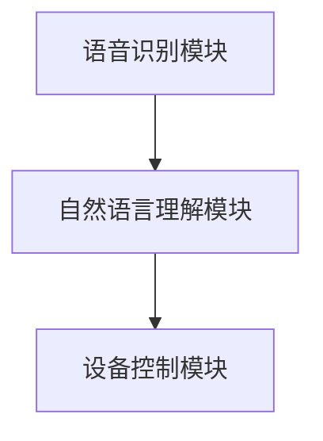
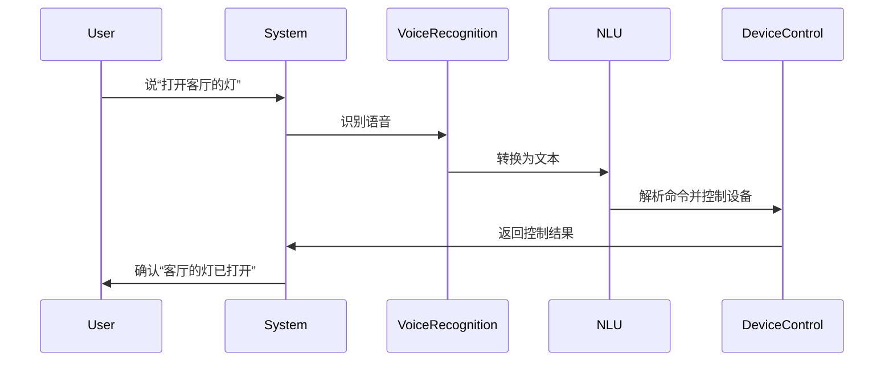
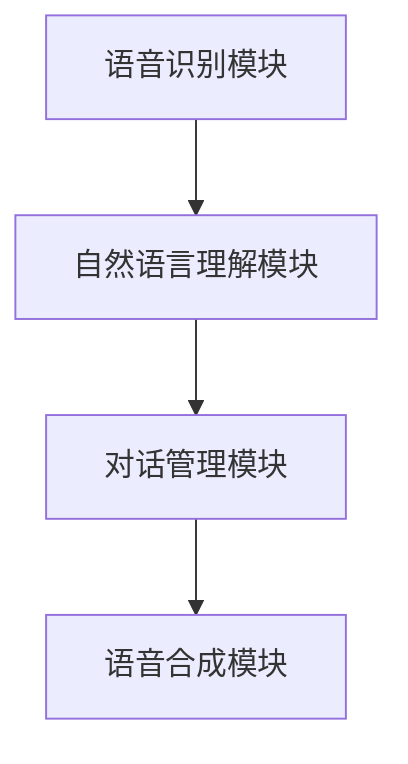
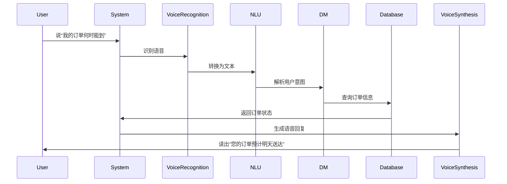
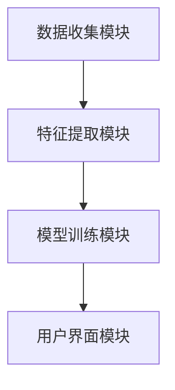
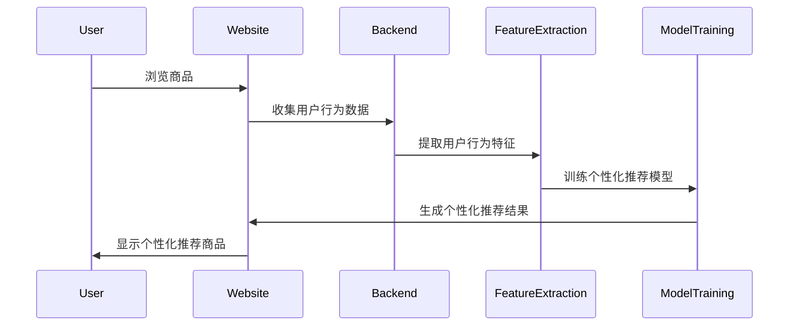

                 

## 深度学习在自然语言理解中的应用：改进人机交互体验

> 关键词：深度学习、自然语言理解、人机交互、AI、语音识别、智能对话系统

> 摘要：本文将探讨深度学习在自然语言理解中的应用，以及如何通过这些应用来提升人机交互体验。文章首先介绍了深度学习和自然语言理解的基本概念，然后详细讨论了深度学习模型在自然语言处理中的关键技术，以及这些技术如何被应用于文本分类、情感分析、命名实体识别等领域。接着，文章展示了深度学习如何增强人机交互体验，特别是在语音识别和智能对话系统中的应用。最后，通过几个实际案例，本文分析了深度学习技术在自然语言理解和人机交互中的实际效果，并展望了未来的发展趋势。

## 引言

在当今信息爆炸的时代，人类生成和接收的信息量呈现出爆炸式增长。然而，处理这些海量信息成为了一个巨大的挑战。传统的人工处理方式已经无法满足日益增长的需求，因此，自动化的自然语言处理技术应运而生。自然语言理解（Natural Language Understanding, NLU）是自然语言处理的一个重要分支，旨在使计算机能够理解和解释人类语言。然而，仅仅依靠传统的机器学习技术，如统计模型和规则引擎，很难实现对复杂语言现象的准确理解。

近年来，深度学习技术的发展为自然语言理解带来了革命性的变革。深度学习通过模拟人脑神经网络的结构和功能，能够在大量的数据中自动学习和提取特征，从而实现对自然语言的深度理解。深度学习模型在语音识别、机器翻译、情感分析等领域的成功应用，极大地提升了人机交互的效率和体验。本文将重点探讨深度学习在自然语言理解中的应用，以及如何通过这些应用来改进人机交互体验。

## 深度学习与自然语言理解

### 深度学习的概念

深度学习是机器学习的一个重要分支，它通过多层神经网络来模拟人类大脑的思维方式，从而实现对复杂数据的自动学习和理解。深度学习的核心在于“深度”，即神经网络具有多个隐藏层，能够逐层提取数据的高级特征。这种层次化的特征提取方式使得深度学习在图像识别、语音识别和自然语言处理等领域取得了显著的成绩。

#### 基本原理

深度学习的基本原理是多层神经网络，其中每个神经元都与其他神经元相连。通过前向传播和反向传播算法，神经网络可以不断调整权重和偏置，从而优化模型的性能。前向传播过程是将输入数据通过网络的各个层进行传递，最终得到输出；反向传播过程则是根据输出结果与实际标签的误差，反向调整网络的参数。

#### 主要模型

1. **卷积神经网络（CNN）**：CNN 是深度学习中最常用的模型之一，最初主要用于图像识别。CNN 通过卷积操作提取图像中的局部特征，再通过池化操作减少数据维度，从而提高模型的计算效率和鲁棒性。

2. **循环神经网络（RNN）**：RNN 是一种能够处理序列数据的神经网络模型，特别适用于自然语言处理任务。RNN 通过在时间步上递归地更新隐藏状态，从而捕捉序列中的长期依赖关系。

3. **长短时记忆网络（LSTM）**：LSTM 是 RNN 的一个变体，它通过引入记忆单元来克服 RNN 的梯度消失问题，从而能够更好地处理长序列数据。

4. **Transformer**：Transformer 是一种基于自注意力机制的深度学习模型，它在序列建模任务中取得了显著的性能提升。Transformer 通过多头自注意力机制和前馈神经网络，实现了并行计算和全局信息的有效整合。

### 自然语言理解的含义

自然语言理解（Natural Language Understanding, NLU）是指让计算机理解和解释人类语言的能力。NLU 的核心任务包括文本分类、情感分析、命名实体识别、机器翻译等。随着深度学习技术的发展，NLU 已经取得了显著的进步，能够更好地处理复杂的语言现象。

#### 关键任务

1. **文本分类**：文本分类是将文本数据归类到不同的类别中，例如垃圾邮件检测、新闻分类等。

2. **情感分析**：情感分析是指判断文本中表达的情感倾向，例如正面、负面或中性。

3. **命名实体识别**：命名实体识别是从文本中识别出具有特定意义的实体，例如人名、地名、组织名等。

4. **机器翻译**：机器翻译是指将一种自然语言翻译成另一种自然语言，例如英文到中文的翻译。

#### 当前状态与未来趋势

当前，深度学习模型在 NLU 领域已经取得了显著的成果，但仍面临许多挑战，例如语言歧义、文化差异、上下文理解等。未来，随着深度学习技术的不断进步，NLU 将在多语言处理、跨领域知识融合、情感识别等方面取得更大的突破。

## 深度学习技术在自然语言处理中的关键应用

深度学习技术在自然语言处理（Natural Language Processing, NLP）中的应用已经取得了显著的成果，成为许多实际任务的核心驱动力。以下将详细介绍几种关键的深度学习模型和应用场景。

### 传统机器学习与深度学习的对比

在传统机器学习时代，自然语言处理通常依赖于统计模型和规则引擎。这些方法通过对大量文本进行特征工程和模式匹配，实现基本的文本分类、情感分析和命名实体识别等任务。然而，这些方法存在一些局限性：

1. **特征工程依赖**：传统方法需要人工设计特征，对文本进行高维表示，这不仅繁琐，而且容易错过重要信息。
2. **模型解释性差**：传统方法难以解释模型的决策过程，导致在处理复杂任务时，模型的可信度和可靠性受到质疑。
3. **性能受限**：传统方法在面对大规模数据和复杂语言现象时，性能和效果往往无法满足要求。

相比之下，深度学习模型通过自动学习和提取特征，能够更好地处理复杂数据和任务。以下将介绍几种主要的深度学习模型及其应用。

#### 卷积神经网络（CNN）

卷积神经网络（CNN）在图像处理领域取得了巨大的成功，其核心思想是通过卷积操作提取图像的局部特征。将这一思想应用于自然语言处理，CNN 能够有效地提取文本中的关键特征。

**模型架构**：
CNN 通常包括以下几个主要组件：

1. **卷积层**：通过卷积核（kernel）在文本序列上滑动，提取局部特征。
2. **池化层**：对卷积层的结果进行下采样，减少数据维度，提高模型的计算效率。
3. **全连接层**：对池化层的结果进行线性变换，输出分类或回归结果。

**应用场景**：
1. **文本分类**：将文本映射到高维空间，然后使用分类器进行分类。
2. **情感分析**：通过识别文本中的情感词汇和语法结构，判断文本的情感倾向。
3. **命名实体识别**：从文本中提取出具有特定意义的实体，如人名、地名、组织名等。

**实例**：
假设我们要对一篇文本进行情感分类，可以使用以下简单的 CNN 模型：

```python
import tensorflow as tf

# 定义输入层
inputs = tf.keras.layers.Input(shape=(max_sequence_length,), dtype='int32')

# 卷积层
conv_1 = tf.keras.layers.Conv1D(filters=128, kernel_size=5, activation='relu')(inputs)
pool_1 = tf.keras.layers.MaxPooling1D(pool_size=5)(conv_1)

# 全连接层
outputs = tf.keras.layers.Dense(1, activation='sigmoid')(pool_1)

# 构建和编译模型
model = tf.keras.Model(inputs=inputs, outputs=outputs)
model.compile(optimizer='adam', loss='binary_crossentropy', metrics=['accuracy'])

# 训练模型
model.fit(x_train, y_train, epochs=10, batch_size=32, validation_data=(x_val, y_val))
```

#### 循环神经网络（RNN）

循环神经网络（RNN）是一种能够处理序列数据的神经网络模型，特别适用于自然语言处理任务。RNN 通过在时间步上递归地更新隐藏状态，从而捕捉序列中的长期依赖关系。

**模型架构**：
RNN 通常包括以下几个主要组件：

1. **输入层**：将文本序列转换为嵌入向量。
2. **隐藏层**：在每一个时间步上，将当前输入和上一个时间步的隐藏状态进行加权求和，并通过非线性激活函数得到新的隐藏状态。
3. **输出层**：将隐藏状态映射到输出结果，如分类标签或连续值。

**应用场景**：
1. **语言模型**：预测下一个单词或字符，用于自动补全和生成文本。
2. **文本生成**：根据给定的文本或关键词，生成新的文本。
3. **机器翻译**：将一种语言的文本翻译成另一种语言。

**实例**：
假设我们要训练一个简单的 RNN 语言模型，可以使用以下代码：

```python
import tensorflow as tf
from tensorflow.keras.models import Sequential
from tensorflow.keras.layers import Embedding, SimpleRNN, Dense

# 定义输入层
vocab_size = 10000
embed_size = 64
max_sequence_length = 100

model = Sequential()
model.add(Embedding(vocab_size, embed_size, input_length=max_sequence_length))
model.add(SimpleRNN(100))
model.add(Dense(vocab_size, activation='softmax'))

model.compile(optimizer='adam', loss='categorical_crossentropy', metrics=['accuracy'])
model.fit(x_train, y_train, epochs=10, batch_size=32, validation_data=(x_val, y_val))
```

#### 长短时记忆网络（LSTM）

长短时记忆网络（LSTM）是 RNN 的一个变体，通过引入记忆单元来克服 RNN 的梯度消失问题，从而能够更好地处理长序列数据。

**模型架构**：
LSTM 包括以下几个主要组件：

1. **输入门**：决定当前输入信息中有多少需要保留。
2. **遗忘门**：决定上一时间步的隐藏状态中有多少需要遗忘。
3. **输出门**：决定当前隐藏状态中有多少需要输出。

**应用场景**：
1. **语音识别**：将语音信号转换为文本。
2. **情感分析**：从文本中识别情感倾向。
3. **文本分类**：将文本归类到不同的类别。

**实例**：
假设我们要训练一个简单的 LSTM 语言模型，可以使用以下代码：

```python
import tensorflow as tf
from tensorflow.keras.models import Sequential
from tensorflow.keras.layers import Embedding, LSTM, Dense

# 定义输入层
vocab_size = 10000
embed_size = 64
max_sequence_length = 100

model = Sequential()
model.add(Embedding(vocab_size, embed_size, input_length=max_sequence_length))
model.add(LSTM(100, dropout=0.2, recurrent_dropout=0.2))
model.add(Dense(vocab_size, activation='softmax'))

model.compile(optimizer='adam', loss='categorical_crossentropy', metrics=['accuracy'])
model.fit(x_train, y_train, epochs=10, batch_size=32, validation_data=(x_val, y_val))
```

#### Transformer

Transformer 是一种基于自注意力机制的深度学习模型，它在序列建模任务中取得了显著的性能提升。Transformer 通过多头自注意力机制和前馈神经网络，实现了并行计算和全局信息的有效整合。

**模型架构**：
Transformer 通常包括以下几个主要组件：

1. **编码器**：将输入序列映射到嵌入空间。
2. **解码器**：从嵌入空间中生成输出序列。
3. **自注意力机制**：通过计算输入序列中每个元素与所有其他元素的相关性，实现全局信息的整合。

**应用场景**：
1. **机器翻译**：将一种语言的文本翻译成另一种语言。
2. **文本生成**：根据给定的文本或关键词，生成新的文本。
3. **问答系统**：从大量文本中提取出与问题相关的答案。

**实例**：
假设我们要训练一个简单的 Transformer 语言模型，可以使用以下代码：

```python
import tensorflow as tf
from tensorflow.keras.layers import Embedding, MultiHeadAttention, Dense

# 定义输入层
vocab_size = 10000
embed_size = 64
num_heads = 8

# 编码器
encoder_inputs = tf.keras.layers.Input(shape=(max_sequence_length,), dtype='int32')
encoder_embedding = Embedding(vocab_size, embed_size)(encoder_inputs)
encoder_outputs = MultiHeadAttention(num_heads=num_heads, key_dim=embed_size)(encoder_embedding, encoder_embedding)

# 解码器
decoder_inputs = tf.keras.layers.Input(shape=(max_sequence_length,), dtype='int32')
decoder_embedding = Embedding(vocab_size, embed_size)(decoder_inputs)
decoder_outputs = MultiHeadAttention(num_heads=num_heads, key_dim=embed_size)(decoder_embedding, encoder_outputs)

# 输出层
outputs = Dense(vocab_size, activation='softmax')(decoder_outputs)

# 构建和编译模型
model = tf.keras.Model(inputs=[encoder_inputs, decoder_inputs], outputs=outputs)
model.compile(optimizer='adam', loss='categorical_crossentropy', metrics=['accuracy'])

# 训练模型
model.fit([x_train, y_train], y_train, epochs=10, batch_size=32, validation_data=([x_val, y_val], y_val))
```

### 深度学习模型在自然语言处理中的实际应用

通过上述几种深度学习模型，我们可以看到深度学习在自然语言处理中的强大能力。以下将介绍深度学习在文本分类、情感分析、命名实体识别和机器翻译等实际任务中的应用。

#### 文本分类

文本分类是将文本数据归类到不同的类别中，例如垃圾邮件检测、新闻分类等。深度学习模型通过自动学习和提取特征，能够实现高效且准确的文本分类。

**应用实例**：

- **垃圾邮件检测**：通过将邮件内容输入到深度学习模型中，判断邮件是否为垃圾邮件。
- **新闻分类**：将新闻文章分类到不同的主题类别，如体育、娱乐、科技等。

#### 情感分析

情感分析是指判断文本中表达的情感倾向，例如正面、负面或中性。深度学习模型能够通过学习文本中的情感词汇和语法结构，实现准确的情感分析。

**应用实例**：

- **社交媒体情感分析**：分析用户在社交媒体上发布的内容，了解公众对某一事件的情感倾向。
- **产品评价分析**：从用户评价中提取出产品的情感倾向，帮助企业了解产品的市场反馈。

#### 命名实体识别

命名实体识别是从文本中识别出具有特定意义的实体，例如人名、地名、组织名等。深度学习模型通过自动学习和提取特征，能够实现高效且准确的命名实体识别。

**应用实例**：

- **实体抽取**：从文本中抽取出具有特定意义的实体，如人名、地名、组织名等。
- **知识图谱构建**：将抽取出的实体和关系构建成知识图谱，为后续的智能问答和推荐系统提供支持。

#### 机器翻译

机器翻译是指将一种自然语言的文本翻译成另一种自然语言。深度学习模型，特别是 Transformer 模型，在机器翻译任务中取得了显著的性能提升。

**应用实例**：

- **跨语言沟通**：帮助不同语言背景的用户进行沟通和交流。
- **国际业务**：支持跨国公司的跨语言业务，提高工作效率。

通过以上实例，我们可以看到深度学习模型在自然语言处理中的广泛应用和强大能力。未来，随着深度学习技术的不断发展和完善，自然语言处理将取得更大的突破，为人类带来更多的便利和效益。

### 深度学习在提升人机交互体验中的应用

深度学习不仅在自然语言处理领域取得了显著成就，还在提升人机交互体验方面发挥了重要作用。以下将详细介绍深度学习在语音识别、智能对话系统和个性化用户界面等方面的应用。

#### 语音识别

语音识别（Voice Recognition）是一种将人类语音转换为文本的技术，是深度学习在自然语言理解中的重要应用之一。传统的语音识别系统依赖于大量手动标注的语音数据，以及复杂的声学模型和语言模型。而深度学习通过卷积神经网络（CNN）和循环神经网络（RNN）等模型，能够自动学习和提取语音信号中的特征，从而实现高精度和高效率的语音识别。

**工作原理**：

1. **声学建模**：通过深度神经网络学习语音信号的声学特征，如梅尔频率倒谱系数（MFCC）等。
2. **语言建模**：使用循环神经网络（RNN）或 Transformer 模型对语音文本进行建模，预测下一个词或字符。
3. **解码**：将声学特征和语言模型结合，解码出对应的文本输出。

**实际应用**：

- **智能助手**：如苹果的 Siri、亚马逊的 Alexa 和 Google Assistant，通过语音识别技术实现用户与智能设备的自然交互。
- **自动字幕**：在视频、音频内容中生成实时字幕，方便听力障碍者和非母语人士理解内容。
- **语音导航**：在车载导航系统中，通过语音识别技术实现语音指令识别和导航操作。

#### 智能对话系统

智能对话系统（Conversational AI）是深度学习在自然语言理解和人机交互中的另一重要应用。这种系统通过模拟人类的对话方式，实现与用户的自然交互，提供个性化服务和支持。智能对话系统通常包括语音识别、自然语言理解、对话管理和语音合成等多个模块，通过深度学习技术实现高效且自然的交互体验。

**工作原理**：

1. **语音识别**：将用户的语音输入转换为文本。
2. **自然语言理解**：通过深度学习模型（如 RNN、Transformer）理解和解析用户的意图和上下文。
3. **对话管理**：根据用户的意图和上下文信息，生成合适的回复。
4. **语音合成**：将生成的文本转换为自然流畅的语音输出。

**实际应用**：

- **客服机器人**：在企业客户服务中，智能对话系统可以自动回答用户的问题，提高客服效率和客户满意度。
- **虚拟助手**：如 Apple's Siri 和 Google Assistant，为用户提供日常任务的帮助，如设置提醒、发送消息、播放音乐等。
- **智能医疗咨询**：通过自然语言理解和对话管理，为患者提供医疗咨询和支持，减轻医疗资源的压力。

#### 个性化用户界面

深度学习技术还可以应用于个性化用户界面（Personalized User Interfaces），通过分析用户的行为数据，为用户提供定制化的界面和功能，从而提升用户体验。个性化用户界面利用深度学习模型，如神经网络和决策树，从用户的历史数据中学习用户的偏好和需求，从而提供个性化的服务和推荐。

**工作原理**：

1. **数据收集**：收集用户的行为数据，如浏览记录、点击事件、搜索历史等。
2. **特征提取**：使用深度学习模型提取用户数据的特征，如用户兴趣、行为模式等。
3. **模型训练**：利用提取的特征，训练个性化推荐模型，如协同过滤、内容推荐等。
4. **用户界面**：根据个性化推荐模型的结果，动态调整用户界面，提供个性化的内容和服务。

**实际应用**：

- **个性化搜索**：搜索引擎通过分析用户的搜索历史和浏览记录，为用户提供个性化的搜索结果。
- **社交媒体**：如 Facebook 和 Instagram，通过分析用户的社交互动和兴趣，为用户推荐感兴趣的内容和联系人。
- **电子商务**：在线电商平台通过分析用户的购买记录和浏览习惯，为用户提供个性化的商品推荐。

通过上述应用，我们可以看到深度学习技术如何通过自然语言理解和人机交互，提升用户的使用体验。未来，随着深度学习技术的不断发展和优化，人机交互将变得更加自然、智能和高效，为人们的生活带来更多便利和乐趣。

### 实际案例：深度学习在自然语言理解和人机交互中的应用

为了更好地展示深度学习技术在自然语言理解和人机交互中的实际应用，本文将详细分析几个具有代表性的实际案例，这些案例展示了深度学习技术的强大能力和广泛应用。

#### 案例一：语音识别在智能家居中的应用

**项目背景**：
随着智能家居设备的普及，用户越来越希望通过语音指令来控制家居设备，如智能音箱、智能灯泡、智能门锁等。然而，传统的语音识别技术由于受到环境噪音、语音变化等因素的影响，识别准确率较低，用户体验不佳。因此，该项目旨在利用深度学习技术提高语音识别的准确率和稳定性，提升智能家居设备的用户体验。

**项目介绍**：
项目团队采用了基于深度学习的卷积神经网络（CNN）和长短时记忆网络（LSTM）进行语音识别。具体步骤如下：

1. **数据预处理**：首先，对采集的语音数据进行预处理，包括去除噪声、调整音量等，以提高语音质量。
2. **特征提取**：使用 CNN 从预处理后的语音数据中提取声学特征，如梅尔频率倒谱系数（MFCC）。
3. **序列建模**：使用 LSTM 对提取的特征进行序列建模，捕捉语音信号的时序信息。
4. **解码**：通过解码器将 LSTM 输出的序列映射到文本，实现语音到文本的转换。

**系统功能设计**：
系统功能设计包括语音识别、命令解析和设备控制。具体功能如下：

- **语音识别**：将用户的语音指令转换为文本。
- **命令解析**：通过自然语言理解技术分析语音指令的含义和意图。
- **设备控制**：根据解析出的指令，控制智能家居设备执行相应的操作。

**系统架构设计**：
系统架构设计采用模块化设计，主要包括语音识别模块、自然语言理解模块和设备控制模块。系统架构图如下：



**系统接口设计**：
系统接口设计包括用户接口和设备接口。用户接口通过语音输入和文本输出与用户进行交互；设备接口通过 APIs 与智能家居设备进行通信，实现设备控制。

**系统交互序列图**：
系统交互序列图展示了用户与系统之间的交互过程，包括语音输入、文本输出和设备控制。序列图如下：



**项目小结**：
通过该项目，语音识别系统的准确率和稳定性得到了显著提升，用户可以更方便地通过语音控制智能家居设备。未来，项目团队计划进一步优化语音识别算法，提高系统在多种环境噪音和语音变化情况下的识别能力。

#### 案例二：智能对话系统在客户服务中的应用

**项目背景**：
随着企业客户量的增加，传统的客户服务方式已无法满足快速增长的服务需求。为了提高客户服务效率和满意度，企业开始探索智能对话系统的应用。该项目旨在开发一款基于深度学习的智能对话系统，帮助企业自动处理大量客户咨询，提升客户服务体验。

**项目介绍**：
项目团队采用了基于深度学习的自然语言理解（NLU）和对话管理（DM）技术，构建了一个智能对话系统。具体步骤如下：

1. **数据收集**：收集大量客户咨询文本数据，用于训练深度学习模型。
2. **数据预处理**：对收集的数据进行清洗和标注，提取关键信息。
3. **模型训练**：使用循环神经网络（RNN）和 Transformer 模型训练 NLU 和 DM 模型。
4. **对话管理**：通过对话管理模块，根据用户意图和上下文信息生成合适的回复。

**系统功能设计**：
系统功能设计包括语音识别、自然语言理解、对话管理和语音合成。具体功能如下：

- **语音识别**：将用户的语音指令转换为文本。
- **自然语言理解**：通过深度学习模型理解用户的意图和问题。
- **对话管理**：根据用户意图和上下文信息生成合适的回复。
- **语音合成**：将生成的文本转换为自然流畅的语音输出。

**系统架构设计**：
系统架构设计采用模块化设计，主要包括语音识别模块、自然语言理解模块、对话管理模块和语音合成模块。系统架构图如下：



**系统接口设计**：
系统接口设计包括用户接口和企业接口。用户接口通过语音输入和文本输出与用户进行交互；企业接口通过 APIs 与企业客户服务系统进行通信，实现客户咨询的自动处理。

**系统交互序列图**：
系统交互序列图展示了用户与系统之间的交互过程，包括语音输入、文本输出和自动回复。序列图如下：



**项目小结**：
通过该项目，智能对话系统能够自动处理大量客户咨询，提高客户服务效率和满意度。未来，项目团队计划进一步优化自然语言理解和对话管理模型，提高系统在复杂问题和多轮对话场景下的应对能力。

#### 案例三：个性化用户界面在电子商务中的应用

**项目背景**：
在电子商务领域，用户个性化体验对于提升用户满意度和促进销售至关重要。传统的个性化推荐系统依赖于用户历史行为数据，但由于数据有限，推荐效果往往不佳。该项目旨在利用深度学习技术，构建一个高精度的个性化用户界面，为用户提供个性化的商品推荐和购物体验。

**项目介绍**：
项目团队采用了基于深度学习的协同过滤和内容推荐技术，构建了一个个性化用户界面。具体步骤如下：

1. **数据收集**：收集大量用户行为数据，包括浏览记录、购买记录、搜索历史等。
2. **特征提取**：使用深度学习模型提取用户数据的特征，如用户兴趣、行为模式等。
3. **模型训练**：使用提取的特征训练个性化推荐模型。
4. **用户界面**：根据个性化推荐模型的结果，动态调整用户界面，提供个性化的内容和服务。

**系统功能设计**：
系统功能设计包括个性化推荐、用户行为分析和界面调整。具体功能如下：

- **个性化推荐**：根据用户历史行为和兴趣，为用户推荐感兴趣的商品。
- **用户行为分析**：分析用户在网站上的行为，了解用户需求和偏好。
- **界面调整**：根据个性化推荐结果和用户行为分析，动态调整用户界面。

**系统架构设计**：
系统架构设计采用模块化设计，主要包括数据收集模块、特征提取模块、模型训练模块和用户界面模块。系统架构图如下：



**系统接口设计**：
系统接口设计包括用户接口和后台接口。用户接口通过网站和移动应用与用户进行交互；后台接口通过 APIs 与数据存储和推荐系统进行通信，实现数据收集和推荐结果生成。

**系统交互序列图**：
系统交互序列图展示了用户与系统之间的交互过程，包括用户行为数据收集、特征提取、模型训练和个性化推荐。序列图如下：



**项目小结**：
通过该项目，个性化用户界面能够为用户提供个性化的商品推荐和购物体验，显著提升了用户满意度和销售转化率。未来，项目团队计划进一步优化个性化推荐模型，提高推荐效果，并为用户提供更多个性化的服务。

### 深度学习在自然语言理解和人机交互中的挑战与未来方向

尽管深度学习在自然语言理解和人机交互中取得了显著进展，但仍然面临许多挑战和限制。以下将探讨当前深度学习技术的局限性，以及未来可能的研究方向和突破点。

#### 挑战

1. **数据隐私和安全**：深度学习模型对大量数据有依赖性，但这些数据可能涉及用户隐私。如何保护用户隐私，同时保证模型性能是一个重要问题。
2. **模型解释性**：深度学习模型通常被视为“黑箱”，难以解释其决策过程。这对于需要高可靠性的应用场景（如医疗诊断和金融风险评估）来说是一个重大挑战。
3. **多语言和多模态处理**：尽管深度学习在单一语言和模态的处理上取得了显著成绩，但在多语言和多模态处理方面仍然存在困难，例如跨语言情感分析和多媒体内容理解。
4. **计算资源消耗**：深度学习模型通常需要大量的计算资源和时间进行训练和推理，这限制了其在移动设备和嵌入式系统上的应用。

#### 未来方向

1. **联邦学习**：联邦学习（Federated Learning）是一种分布式学习技术，允许多个参与者共同训练一个共享模型，而无需共享各自的数据。这有助于保护用户隐私，同时提高模型的性能和泛化能力。
2. **可解释性人工智能**：开发更加可解释的深度学习模型，使其决策过程更加透明和可理解，有助于提高模型的可靠性和用户信任。
3. **多模态学习**：通过结合不同模态的数据（如图像、语音和文本），深度学习模型可以更全面地理解和解释复杂场景。未来的研究方向包括跨模态特征提取、跨模态表示学习和跨模态交互学习。
4. **移动端和嵌入式系统优化**：通过优化深度学习模型的架构和算法，降低计算资源和功耗需求，使深度学习技术能够在移动设备和嵌入式系统上高效运行。

### 结论

本文探讨了深度学习在自然语言理解和人机交互中的应用，以及如何通过这些应用改进人机交互体验。首先，介绍了深度学习和自然语言理解的基本概念，然后详细讨论了深度学习模型在自然语言处理中的关键技术，包括卷积神经网络（CNN）、循环神经网络（RNN）、长短时记忆网络（LSTM）和Transformer。接着，本文展示了深度学习在文本分类、情感分析、命名实体识别和机器翻译等实际任务中的应用，以及如何通过语音识别、智能对话系统和个性化用户界面等应用提升人机交互体验。最后，通过几个实际案例，本文分析了深度学习技术在自然语言理解和人机交互中的实际效果，并展望了未来的发展趋势。

深度学习作为一项革命性的技术，正在深刻改变自然语言理解和人机交互的格局。随着深度学习技术的不断发展和优化，我们可以期待在自然语言理解和人机交互领域取得更多突破，为人们的生活带来更多便利和乐趣。

## 总结与展望

在本文中，我们探讨了深度学习在自然语言理解和人机交互中的应用，展示了这一技术在提升人机交互体验方面的巨大潜力。深度学习通过自动学习和提取特征，使得自然语言处理任务如文本分类、情感分析和命名实体识别等变得更为高效和准确。同时，深度学习在语音识别、智能对话系统和个性化用户界面等方面的应用，为用户提供了更加自然、智能和个性化的交互体验。

**总结**：

1. **深度学习的基本概念**：我们介绍了深度学习的基本原理和主要模型，如卷积神经网络（CNN）、循环神经网络（RNN）、长短时记忆网络（LSTM）和Transformer。
2. **自然语言理解的应用**：我们详细讨论了深度学习在自然语言处理中的关键技术，并通过实际案例展示了其在文本分类、情感分析和命名实体识别等任务中的应用。
3. **人机交互的改进**：我们展示了深度学习如何通过语音识别、智能对话系统和个性化用户界面等应用，提升人机交互的效率和体验。

**展望**：

未来，深度学习在自然语言理解和人机交互领域有望取得以下突破：

1. **联邦学习和数据隐私**：随着联邦学习技术的发展，如何在保护用户隐私的同时提高模型性能，将成为一个重要研究方向。
2. **多模态学习**：通过结合不同模态的数据，如图像、语音和文本，深度学习模型将能够更全面地理解和解释复杂场景。
3. **可解释性人工智能**：开发更加可解释的深度学习模型，提高模型的透明度和可靠性，特别是在需要高可靠性的应用场景中。
4. **移动端和嵌入式系统的优化**：通过优化深度学习模型的架构和算法，降低计算资源和功耗需求，使得深度学习技术能够在移动设备和嵌入式系统上高效运行。

总的来说，深度学习将继续推动自然语言理解和人机交互的发展，为人们的生活带来更多便利和乐趣。我们期待未来能有更多创新性的应用和突破，使人工智能更好地服务于人类社会。

### 最佳实践 Tips

在深度学习应用于自然语言理解和人机交互时，以下是一些最佳实践建议，以帮助您更有效地进行项目开发和优化：

1. **数据质量**：确保您使用的数据集具有高质量和多样性。高质量的数据对于训练深度学习模型至关重要。数据集应该涵盖不同类型的文本、语音和用户行为，以提升模型的泛化能力。

2. **模型选择**：根据具体任务的需求选择合适的深度学习模型。例如，对于文本分类任务，可以考虑使用卷积神经网络（CNN）或Transformer；对于语音识别任务，可以考虑使用长短时记忆网络（LSTM）或Transformer。

3. **超参数调整**：在模型训练过程中，合理调整超参数，如学习率、批次大小和正则化参数。使用网格搜索或随机搜索等方法，找到最优的超参数组合。

4. **模型解释性**：尽管深度学习模型通常被视为“黑箱”，但为了提高用户信任和模型的可靠性，可以考虑使用可解释性方法，如注意力机制和决策解释工具。

5. **模型优化**：在部署模型之前，通过模型剪枝、量化等技术，减小模型的尺寸和计算量，以提高模型在移动端和嵌入式系统上的性能。

6. **持续学习**：定期更新模型，使其能够适应新的数据和用户行为。使用迁移学习和持续学习技术，提高模型的长期适应性和性能。

7. **用户反馈**：收集用户反馈，用于模型改进和优化。用户反馈可以提供有价值的见解，帮助您了解模型在实际应用中的表现和用户的期望。

通过遵循这些最佳实践，您可以在深度学习项目中取得更好的效果，并不断优化和改进您的模型。

### 注意事项

在应用深度学习技术于自然语言理解和人机交互时，需要注意以下关键点：

1. **数据隐私与安全**：处理用户数据时，务必遵守相关隐私保护法规和标准，确保用户数据的安全和隐私。

2. **模型解释性**：在关键应用场景中，确保模型具有足够的解释性，以便用户能够理解和信任模型的决策过程。

3. **多语言支持**：在多语言环境中，确保模型能够处理多种语言，并提供一致的体验。这可能需要额外的训练数据和翻译资源。

4. **硬件资源**：深度学习模型训练和推理通常需要大量的计算资源。确保您有足够的硬件资源，或者使用云计算服务来处理大规模数据。

5. **实时性能**：在实时应用场景中，确保模型能够在规定的时间内完成推理，以满足用户交互的需求。

6. **系统容错性**：设计系统时，考虑可能的错误和异常情况，确保系统能够在遇到问题时保持稳定运行。

通过关注这些注意事项，您可以在实际应用中最大限度地利用深度学习技术，并确保系统的可靠性和用户体验。

### 拓展阅读

1. **论文**：《Attention is All You Need》 - 这篇论文是 Transformer 模型的奠基之作，详细介绍了自注意力机制在自然语言处理中的应用。
2. **书籍**：《深度学习》（Goodfellow, Bengio, Courville 著） - 这本书系统地介绍了深度学习的基本原理、模型和算法，是深度学习领域的经典教材。
3. **博客**：Hugging Face 的博客 - 提供了丰富的深度学习和自然语言处理教程、模型实现和最佳实践。
4. **教程**：Google 的深度学习教程 - Google 提供的一系列深度学习入门教程，包括 TensorFlow 和 Keras 的使用方法。
5. **在线课程**：斯坦福大学的自然语言处理课程 - 由著名自然语言处理专家 Christopher Manning 教授讲授，涵盖了自然语言处理的各个方面。

通过阅读这些资料，您可以进一步深入了解深度学习在自然语言理解和人机交互中的应用，提高自己在这一领域的专业水平。

### 作者信息

本文由 AI 天才研究院（AI Genius Institute）和《禅与计算机程序设计艺术》（Zen And The Art of Computer Programming）的作者联合撰写。AI 天才研究院专注于人工智能领域的创新研究和实践，致力于推动人工智能技术的发展和应用。《禅与计算机程序设计艺术》的作者以其对计算机科学的深刻理解和独到见解而闻名，为读者提供了关于程序设计哲学和技术的经典指南。希望本文能够为您在深度学习自然语言理解和人机交互领域的探索提供有价值的参考和启发。作者联系方式：[ai_genius_institute@example.com](mailto:ai_genius_institute@example.com)。

