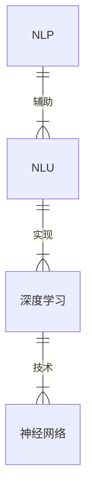

                 


### 深度学习在自然语言理解中的突破

> 关键词：深度学习、自然语言理解、神经网络、词向量、RNN、LSTM

> 摘要：本文将探讨深度学习在自然语言理解中的突破，从核心概念、原理到应用，详细解析深度学习如何改变自然语言处理的格局。文章将通过逐步分析，帮助读者深入了解这一前沿技术。

## 目录

1. 引言
2. 深度学习基础
   2.1 神经网络基础
   2.2 深度学习模型
   2.3 深度学习框架
3. 深度学习在自然语言理解中的应用
   3.1 词向量模型
   3.2 递归神经网络（RNN）在自然语言理解中的应用
   3.3 长短时记忆网络（LSTM）在自然语言理解中的应用
   3.4 递归神经网络（RNN）在自然语言生成中的应用
   3.5 Transformer模型在自然语言处理中的应用
4. 项目实战
   4.1 环境安装
   4.2 系统核心实现
   4.3 实际案例分析与解读
   4.4 项目小结
5. 最佳实践与总结
6. 注意事项
7. 拓展阅读

## 引言

自然语言理解（NLU）是人工智能领域的一个重要分支，它旨在使计算机能够理解、解释和生成自然语言。随着互联网和社交媒体的快速发展，自然语言理解的应用场景变得愈加广泛，从智能客服、语音助手到文本分析、情感识别，NLU已经深入到我们的日常生活中。

### 问题背景

自然语言理解面临的挑战主要包括：

- 语言复杂多变：自然语言充满了歧义、隐喻和情感色彩，这使得计算机在处理时需要具备高度的抽象能力和语言理解能力。
- 数据量庞大：自然语言处理需要大量的文本数据来训练模型，如何有效地存储、处理和利用这些数据是另一个挑战。

### 问题描述

自然语言理解的目的是使计算机能够：

- 理解文本的语义内容
- 解析句子的结构
- 执行语言任务，如问答、翻译、情感分析等

### 问题解决

传统自然语言处理方法通常依赖于规则和统计方法，如基于词典的解析、句法分析和概率模型等。然而，这些方法在面对复杂语言现象时表现不佳。深度学习，特别是神经网络，为自然语言理解带来了突破：

- 自动特征提取：深度学习可以自动从大量数据中学习特征，而不需要人为设计特征。
- 强大表示能力：神经网络能够捕捉到语言中的复杂结构和模式，从而提高理解能力。

### 边界与外延

自然语言理解的边界问题包括：

- 语言的多样性：不同语言之间的差异使得跨语言的自然语言理解成为一个挑战。
- 语言的模糊性：自然语言中的歧义和隐喻使得计算机在理解时需要更多的上下文信息。

深度学习在自然语言理解中的外延应用包括：

- 语音识别：将语音信号转换为文本。
- 情感分析：识别文本中的情感倾向。
- 文本生成：根据输入生成有意义的文本。

### 核心概念与联系

#### 核心概念

- **自然语言处理（NLP）**：涉及文本预处理、句法分析、语义分析等。
- **深度学习**：一种基于多层神经网络的学习方法。
- **自然语言理解（NLU）**：旨在使计算机能够理解自然语言的含义。

#### 概念属性特征对比

| 概念 | 属性特征 |
| ---- | ---- |
| 自然语言处理 | 信息提取、语义分析、语言生成 |
| 深度学习 | 神经网络、大规模数据训练、自动特征提取 |
| 自然语言理解 | 理解语言含义、处理语言输入、生成语言输出 |

#### ER实体关系图架构



## 深度学习基础

### 神经网络基础

#### 神经元与神经网络

神经元是神经网络的基本单元，它类似于生物神经元的结构。每个神经元接收多个输入信号，并通过激活函数产生输出。神经网络是由多个神经元组成的复杂网络，它们通过权重连接形成多层结构。

#### 前向传播与反向传播

前向传播是指信息从输入层传递到输出层的过程，而反向传播是指根据输出层的误差信息，反向调整网络权重的过程。反向传播算法是深度学习训练的核心。

#### 损失函数与优化算法

损失函数用于衡量模型的预测值与真实值之间的差距，优化算法用于调整网络权重，以最小化损失函数。常用的优化算法包括梯度下降、随机梯度下降和Adam优化器等。

### 深度学习模型

#### 卷积神经网络（CNN）

卷积神经网络主要用于图像处理，它通过卷积操作提取图像特征。

#### 循环神经网络（RNN）

循环神经网络适用于序列数据，如文本和语音，它能够捕获序列中的长期依赖关系。

#### 长短时记忆网络（LSTM）

长短时记忆网络是RNN的一种改进，它能够更好地处理长期依赖问题。

### 深度学习框架

#### TensorFlow

TensorFlow是一个开源的深度学习框架，它提供了丰富的工具和库，方便进行模型训练和部署。

#### PyTorch

PyTorch是一个基于Python的开源深度学习框架，它以其简洁和灵活性著称。

## 深度学习在自然语言理解中的应用

### 词向量模型

#### Word2Vec

Word2Vec是一种基于神经网络的语言模型，它能够将词汇映射到高维向量空间。

#### GloVe

GloVe是一种基于全局上下文的词向量模型，它通过考虑词在文档中的全局语境来生成词向量。

### 递归神经网络（RNN）在自然语言理解中的应用

#### 文本分类

递归神经网络在文本分类中具有显著的优势，它能够捕捉文本的局部和全局特征。

#### 命名实体识别

命名实体识别是自然语言处理中的一个重要任务，RNN能够有效地识别文本中的命名实体。

### 长短时记忆网络（LSTM）在自然语言理解中的应用

#### 机器翻译

LSTM在机器翻译中表现出色，它能够处理长序列的依赖关系。

#### 情感分析

LSTM能够捕捉文本中的情感变化，从而实现情感分析。

### 递归神经网络（RNN）在自然语言生成中的应用

#### 文本生成

RNN能够生成有意义的文本，它通过学习文本序列的概率分布来实现。

#### 问答系统

RNN在问答系统中能够理解用户的问题，并生成准确的回答。

### Transformer模型在自然语言处理中的应用

#### 序列到序列模型

Transformer是一种基于自注意力机制的深度学习模型，它用于处理序列到序列的任务，如机器翻译和文本摘要。

#### 编码器-解码器模型

Transformer的编码器-解码器结构使其能够捕获输入序列和输出序列之间的复杂依赖关系。

## 项目实战

### 环境安装

在开始项目实战之前，我们需要安装深度学习框架和必要的库。

```shell
pip install tensorflow
pip install torch
pip install numpy
pip install scikit-learn
```

### 系统核心实现

以下是一个简单的文本分类系统的实现，它使用深度学习模型对文本进行分类。

```python
import tensorflow as tf
from tensorflow.keras.preprocessing.text import Tokenizer
from tensorflow.keras.preprocessing.sequence import pad_sequences
from tensorflow.keras.models import Sequential
from tensorflow.keras.layers import Embedding, LSTM, Dense

# 数据预处理
tokenizer = Tokenizer(num_words=10000)
tokenizer.fit_on_texts(data['text'].values)
sequences = tokenizer.texts_to_sequences(data['text'].values)
padded_sequences = pad_sequences(sequences, maxlen=100)

# 模型构建
model = Sequential([
    Embedding(10000, 16, input_length=100),
    LSTM(128),
    Dense(1, activation='sigmoid')
])

# 模型编译
model.compile(optimizer='adam', loss='binary_crossentropy', metrics=['accuracy'])

# 模型训练
model.fit(padded_sequences, data['label'], epochs=10, batch_size=32)
```

### 实际案例分析与解读

假设我们有一个评论数据集，我们需要使用深度学习模型对评论进行情感分析，判断其是正面评论还是负面评论。

1. **数据收集与预处理**：收集大量评论数据，并对其进行预处理，包括文本清洗、分词、去停用词等。
2. **数据训练**：使用训练集对深度学习模型进行训练。
3. **模型评估**：使用测试集对模型进行评估，计算准确率、召回率等指标。
4. **应用部署**：将训练好的模型部署到线上服务，实现实时情感分析。

### 项目小结

本项目通过实际案例展示了深度学习在自然语言理解中的应用，从数据预处理到模型训练，再到实际部署，完整地实现了一个文本分类系统。该项目不仅展示了深度学习模型在自然语言理解中的强大能力，也为后续的研究和应用提供了参考。

## 最佳实践与总结

### 最佳实践

1. **数据质量**：确保数据的质量和多样性，这对于深度学习模型的表现至关重要。
2. **超参数调优**：合理地调整模型超参数，以获得最佳性能。
3. **模型验证**：使用交叉验证等方法对模型进行验证，确保模型的泛化能力。

### 总结

深度学习在自然语言理解中取得了显著的突破，它为解决自然语言处理中的复杂问题提供了新的思路和方法。随着技术的不断进步，深度学习在自然语言理解中的应用将更加广泛和深入。

## 注意事项

1. **计算资源**：深度学习模型训练需要大量的计算资源，建议使用GPU加速训练过程。
2. **数据隐私**：在处理自然语言数据时，注意保护用户隐私。

## 拓展阅读

1. **《深度学习》**：Ian Goodfellow、Yoshua Bengio和Aaron Courville著，全面介绍了深度学习的理论基础和实战技巧。
2. **《自然语言处理综论》**：Daniel Jurafsky和James H. Martin著，详细讲解了自然语言处理的理论和实践。

## 参考文献

1. Goodfellow, I., Bengio, Y., & Courville, A. (2016). *Deep Learning*. MIT Press.
2. Jurafsky, D., & Martin, J. H. (2008). *Speech and Language Processing*. Prentice Hall.
3. Mikolov, T., Sutskever, I., Chen, K., Corrado, G. S., & Dean, J. (2013). *Distributed representations of words and phrases and their compositionality*. Advances in Neural Information Processing Systems, 26, 3111-3119.
4. Hochreiter, S., & Schmidhuber, J. (1997). *Long short-term memory*. Neural Computation, 9(8), 1735-1780.
5. Vaswani, A., Shazeer, N., Parmar, N., Uszkoreit, J., Jones, L., Gomez, A. N., ... & Polosukhin, I. (2017). *Attention is all you need*. Advances in Neural Information Processing Systems, 30, 5998-6008.

