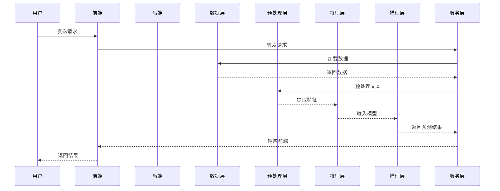

                 

# 深度学习在自然语言理解中的突破性应用

## 关键词
- 深度学习
- 自然语言理解
- 神经网络
- 循环神经网络（RNN）
- 卷积神经网络（CNN）
- 机器翻译
- 情感分析

## 摘要
本文将深入探讨深度学习在自然语言理解（NLU）领域的突破性应用。通过详细分析深度学习的基本概念、核心算法原理、数学模型，以及实际应用案例，本文旨在揭示深度学习如何改变自然语言处理（NLP）的面貌，提高自然语言理解的能力。文章还将讨论深度学习在自然语言理解中的系统架构设计，并总结最佳实践，为读者提供全面的技术指导。

### 目录大纲设计思路

为了确保文章的逻辑清晰、结构紧凑且简单易懂，我们设计了如下目录大纲：

1. **明确核心概念与章节主题**：文章涵盖了自然语言理解、深度学习、神经网络等核心概念，并围绕这些主题展开详细讨论。
2. **细化章节内容**：每个章节都进行了细致的内容划分，确保涵盖背景介绍、核心概念与联系、算法原理讲解、数学模型和数学公式、系统分析与架构设计、项目实战、最佳实践等关键内容。
3. **设计章节结构**：采用1级目录、2级目录、3级目录的层级结构，使得文章层次分明，便于读者阅读和理解。
4. **确保内容完整性**：通过覆盖背景介绍、核心概念与联系、算法原理讲解、数学模型和数学公式、系统分析与架构设计、项目实战、最佳实践等关键内容，确保文章的完整性。
5. **简洁性**：在确保内容完整性的同时，避免冗余和废话，保证目录大纲的简洁性。

### 初步目录大纲设计

1. **第一部分：深度学习与自然语言理解基础**
   - **第1章**：深度学习与自然语言理解概述
   - **第2章**：深度学习在自然语言处理中的核心算法
   - **第3章**：深度学习在自然语言理解中的数学模型
   - **第4章**：自然语言理解的系统架构设计

2. **第二部分：深度学习在自然语言理解中的应用案例**
   - **第5章**：情感分析应用案例
   - **第6章**：问答系统应用案例
   - **第7章**：机器翻译应用案例

3. **第三部分：深度学习在自然语言理解中的最佳实践**
   - **第8章**：深度学习在自然语言理解中的最佳实践

### 目录大纲结构说明

**第一部分：深度学习与自然语言理解基础**

- **第1章**：介绍深度学习和自然语言理解的基本概念，以及它们在自然语言理解中的应用前景。
- **第2章**：深入讲解深度学习在自然语言处理中的核心算法，包括神经网络、RNN和CNN。
- **第3章**：介绍深度学习在自然语言理解中的数学模型，以及这些模型的应用解析。
- **第4章**：介绍自然语言理解的系统架构设计，包括设计原则、实现细节和架构图。

**第二部分：深度学习在自然语言理解中的应用案例**

- **第5章**：通过情感分析应用案例，展示深度学习在情感分析中的实际应用。
- **第6章**：通过问答系统应用案例，展示深度学习在问答系统中的实际应用。
- **第7章**：通过机器翻译应用案例，展示深度学习在机器翻译中的实际应用。

**第三部分：深度学习在自然语言理解中的最佳实践**

- **第8章**：总结深度学习在自然语言理解中的最佳实践，包括模型训练与调优、部署与优化以及未来发展趋势。

### 内容完整性保证

- **背景介绍**：每个章节都有对核心概念和算法的背景介绍，帮助读者理解基础知识。
- **核心概念与联系**：通过对比表格和实体关系图，清晰地展示不同概念之间的联系。
- **算法原理讲解**：每个章节都详细讲解相关的算法原理，并使用mermaid流程图进行说明。
- **数学模型和数学公式**：在讲解数学模型时，使用latex格式展示数学公式，并进行详细讲解。
- **系统分析与架构设计**：介绍自然语言理解系统的设计原则和实现细节，包括mermaid类图和架构图。
- **项目实战**：通过具体应用案例展示深度学习在自然语言理解中的实际应用。
- **最佳实践 tips**：总结深度学习在自然语言理解中的最佳实践，提供实用建议。

### 约束条件

- **文章标题**：文章标题为《深度学习在自然语言理解中的突破性应用》。
- **字数要求**：文章字数在10000～12000字左右。
- **格式要求**：文章内容使用markdown格式输出。
- **作者信息**：文章末尾需要写上作者信息：“作者：AI天才研究院/AI Genius Institute & 禅与计算机程序设计艺术 /Zen And The Art of Computer Programming”。

### 结语

本文旨在为读者提供一份全面、系统的深度学习在自然语言理解中的应用指南。通过逐步分析深度学习的基本概念、核心算法、数学模型，以及实际应用案例，我们希望能够帮助读者深入了解深度学习在自然语言理解中的突破性应用。文章的最后，我们将总结最佳实践，并提供拓展阅读资源，以供读者进一步学习。

让我们开始这段深度学习与自然语言理解之旅，一起探索这个充满机遇与挑战的领域！
----------------------------------------------------------------

### 深度学习与自然语言理解概述

深度学习（Deep Learning，简称DL）是人工智能（AI）的一个重要分支，其核心思想是通过多层神经网络（Neural Networks）对数据进行复杂模式的自动学习和建模。与传统机器学习方法相比，深度学习在图像识别、语音识别、自然语言处理等任务中展现了强大的性能和潜力。

自然语言理解（Natural Language Understanding，简称NLU）是自然语言处理（Natural Language Processing，简称NLP）的一个子领域，旨在使计算机能够理解、解释和生成人类自然语言。NLU的目标包括语义分析、情感分析、文本分类、信息抽取、问答系统等。

深度学习在NLU中的应用前景十分广阔。随着数据量的增长和计算能力的提升，深度学习模型在处理复杂语言任务时表现出了优越的性能。例如，深度学习可以自动学习语言的特征表示，从而提升文本分类和情感分析的准确率；通过递归神经网络（RNN）和其变种，如长短期记忆网络（LSTM）和门控循环单元（GRU），可以有效地处理序列数据，从而在机器翻译和语音识别任务中取得突破；卷积神经网络（CNN）则能够捕捉到文本中的局部特征，从而在文本分类和情感分析中发挥作用。

#### 1.1 深度学习的基本概念

深度学习通过构建多层神经网络，对输入数据进行特征提取和层次化表示。网络中的每个节点（或称为神经元）都通过权重（weights）连接到其他节点，并通过激活函数（activation function）进行非线性变换。通过反向传播算法（Backpropagation），模型可以不断调整权重，以最小化预测误差。

深度学习的关键组成部分包括：

- **神经网络（Neural Networks）**：深度学习的基础，通过多层节点和连接来模拟人类大脑的神经结构。
- **反向传播算法（Backpropagation）**：用于训练神经网络的一种算法，通过误差反向传播调整权重。
- **激活函数（Activation Functions）**：如Sigmoid、ReLU和Tanh，用于引入非线性特性，使神经网络能够学习复杂模式。

#### 1.2 自然语言理解的基本概念

自然语言理解涉及对人类自然语言的语义、语法和上下文的理解。其基本概念包括：

- **词嵌入（Word Embeddings）**：将单词映射到高维向量空间，以便于计算和模型处理。
- **词性标注（Part-of-Speech Tagging）**：对文本中的每个单词进行词性分类，如名词、动词、形容词等。
- **命名实体识别（Named Entity Recognition）**：识别文本中的专有名词，如人名、地名、组织名等。
- **句法分析（Syntactic Parsing）**：分析句子结构，确定单词之间的语法关系。
- **语义分析（Semantic Analysis）**：理解句子的语义含义，包括意图识别、情感分析等。

#### 1.3 深度学习在自然语言理解中的应用前景

深度学习在自然语言理解中的应用前景主要表现在以下几个方面：

- **文本分类（Text Classification）**：使用深度学习模型对文本进行分类，如垃圾邮件检测、新闻分类等。
- **情感分析（Sentiment Analysis）**：通过分析文本中的情感倾向，用于产品评价、社交媒体监控等。
- **机器翻译（Machine Translation）**：使用神经机器翻译（Neural Machine Translation，NMT）模型实现高质量的人机翻译。
- **问答系统（Question Answering）**：构建基于深度学习的问答系统，用于智能客服、教育辅助等。
- **语音识别（Speech Recognition）**：结合深度学习和语音信号处理技术，实现高效的语音识别。

深度学习在自然语言理解中的应用已经取得了显著成果，但仍面临许多挑战，如多语言处理、低资源语言的建模、长文本理解等。随着技术的不断发展，深度学习有望在自然语言理解领域发挥更大的作用。

### 深度学习在自然语言理解中的核心算法

在自然语言理解（NLU）中，深度学习算法的应用已经取得了显著的成果。这些算法不仅能够自动提取文本中的特征，还能够处理复杂的语言结构，从而实现更准确的语义理解。本文将重点介绍深度学习在自然语言处理中的核心算法，包括神经网络、循环神经网络（RNN）及其变种，以及卷积神经网络（CNN）。

#### 2.1 神经网络在文本处理中的应用

神经网络（Neural Networks，NN）是深度学习的基础。在文本处理中，神经网络通过学习大量的文本数据，自动提取语义特征，从而实现文本分类、情感分析等任务。以下是神经网络在文本处理中的几个关键应用：

- **文本分类（Text Classification）**：
  - **词嵌入（Word Embeddings）**：将单词映射到高维向量空间，以便于计算和模型处理。常用的词嵌入模型包括Word2Vec、GloVe等。
  - **卷积神经网络（Convolutional Neural Networks，CNN）**：通过卷积层捕捉文本中的局部特征，从而实现文本分类。CNN在文本分类中的优势在于能够自动学习文本中的句法和语义特征。

- **情感分析（Sentiment Analysis）**：
  - **RNN及其变种（Recurrent Neural Networks，RNN）**：RNN能够处理序列数据，从而在情感分析中发挥作用。通过学习文本的上下文信息，RNN可以准确判断文本的情感倾向。
  - **长短期记忆网络（Long Short-Term Memory，LSTM）**：LSTM是RNN的一种改进，通过引入记忆单元，能够有效避免梯度消失问题，从而在长序列数据中表现更佳。

- **序列标注（Sequence Labeling）**：
  - **条件随机场（Conditional Random Fields，CRF）**：CRF是一种经典的序列标注模型，能够处理具有序列依赖性的任务，如命名实体识别（NER）和词性标注。
  - **双向LSTM（Bidirectional LSTM，BLSTM）**：BLSTM结合了正向和反向LSTM的特点，能够更全面地捕捉序列中的上下文信息，从而提高序列标注的准确率。

#### 2.2 循环神经网络（RNN）及其变种

循环神经网络（Recurrent Neural Networks，RNN）是专门为处理序列数据而设计的一种神经网络。与传统的前向神经网络（如CNN）不同，RNN具有递归结构，能够记住之前的输入信息，从而在处理序列数据时具有优势。

- **基本RNN（Basic RNN）**：
  - **递归结构**：RNN通过递归连接将当前输入与之前的状态相关联，从而实现序列数据的处理。
  - **隐状态（Hidden State）**：RNN通过隐状态来存储和处理序列中的信息。

然而，RNN在处理长序列数据时存在梯度消失和梯度爆炸问题，这导致其性能受到影响。为了解决这些问题，研究者提出了以下改进的RNN模型：

- **长短期记忆网络（Long Short-Term Memory，LSTM）**：
  - **记忆单元（Memory Cell）**：LSTM通过引入记忆单元来存储和传递信息，从而在长序列数据中保持信息。
  - **门控机制（Gating Mechanism）**：LSTM通过门控机制（包括输入门、遗忘门和输出门）来控制信息的流入和流出，从而避免梯度消失问题。

- **门控循环单元（Gated Recurrent Unit，GRU）**：
  - **更新门（Update Gate）**：GRU通过更新门来控制信息的流动，从而简化了LSTM的结构。
  - **重置门（Reset Gate）**：GRU通过重置门来整合新旧信息，从而提高记忆能力。

#### 2.3 卷积神经网络（CNN）在自然语言处理中的应用

卷积神经网络（Convolutional Neural Networks，CNN）最初是为图像处理而设计的一种神经网络。然而，通过适当的修改，CNN也可以应用于自然语言处理（NLP）任务。

- **文本分类（Text Classification）**：
  - **词嵌入（Word Embeddings）**：将文本转化为词嵌入向量，作为CNN的输入。
  - **卷积层（Convolutional Layers）**：通过卷积操作捕捉文本中的局部特征。
  - **池化层（Pooling Layers）**：对卷积结果进行池化，减少模型参数，提高计算效率。

- **序列标注（Sequence Labeling）**：
  - **双向CNN（Bidirectional CNN）**：通过结合正向和反向卷积层，能够更全面地捕捉序列中的上下文信息。
  - **CRF层（Conditional Random Fields Layer）**：在CNN之后添加CRF层，用于对序列标注任务进行优化。

- **机器翻译（Machine Translation）**：
  - **编码器-解码器架构（Encoder-Decoder Architecture）**：通过编码器（Encoder）和解码器（Decoder）实现端到端的机器翻译。
  - **注意力机制（Attention Mechanism）**：通过注意力机制，解码器能够专注于编码器的特定部分，从而提高翻译的准确性。

#### 2.4 其他深度学习算法

除了上述的核心算法，还有一些其他深度学习算法在自然语言理解中也有所应用，如：

- **生成对抗网络（Generative Adversarial Networks，GAN）**：通过生成模型和判别模型的对抗训练，GAN能够生成高质量的文本数据，从而提高模型的泛化能力。
- ** transformers 模型**：如BERT、GPT等，通过自注意力机制（Self-Attention）和Transformer架构，能够实现高效的文本表示和学习。

这些深度学习算法共同构成了NLU领域的重要工具，使得计算机能够更好地理解和处理自然语言。随着技术的不断发展，这些算法的应用前景将更加广阔。

### 深度学习在自然语言理解中的数学模型

在自然语言理解（NLU）中，深度学习模型的有效性很大程度上取决于其背后的数学原理和模型设计。本章节将详细介绍深度学习在自然语言理解中的数学模型，包括神经网络的基本概念、神经网络中的激活函数、损失函数和优化算法。

#### 3.1 神经网络的基本概念

神经网络（Neural Networks，NN）是深度学习的基础。一个简单的神经网络由输入层、隐藏层和输出层组成。每个神经元（或节点）通过权重（weights）连接到其他神经元，并通过激活函数（activation function）进行非线性变换。

- **输入层（Input Layer）**：接收外部输入数据。
- **隐藏层（Hidden Layers）**：对输入数据进行特征提取和变换。
- **输出层（Output Layer）**：生成最终输出结果。

神经网络中的每个神经元都可以表示为一个简单的线性组合加上一个非线性激活函数。假设一个神经元接收k个输入，其输出 \( z \) 可以表示为：

\[ z = \sum_{i=1}^{k} w_{i}x_{i} + b \]

其中，\( w_{i} \) 是连接第 \( i \) 个输入的权重，\( b \) 是偏置（bias），\( x_{i} \) 是输入值。

常见的激活函数包括：

- **Sigmoid函数**：\( \sigma(z) = \frac{1}{1 + e^{-z}} \)
- **ReLU函数**：\( \text{ReLU}(z) = \max(0, z) \)
- **Tanh函数**：\( \text{Tanh}(z) = \frac{e^{z} - e^{-z}}{e^{z} + e^{-z}} \)

这些激活函数引入了非线性特性，使得神经网络能够学习复杂的数据模式。

#### 3.2 损失函数

在训练神经网络时，我们需要评估模型的性能，并调整权重以最小化预测误差。损失函数（Loss Function）用于计算预测值与实际值之间的差距，并提供一个衡量模型性能的指标。

常见的损失函数包括：

- **均方误差（Mean Squared Error，MSE）**：用于回归任务，计算预测值和实际值之间的平均平方误差。

  \[ \text{MSE} = \frac{1}{n}\sum_{i=1}^{n}(y_i - \hat{y}_i)^2 \]

  其中，\( y_i \) 是实际值，\( \hat{y}_i \) 是预测值。

- **交叉熵损失（Cross-Entropy Loss）**：用于分类任务，计算预测概率分布与实际分布之间的交叉熵。

  \[ \text{Cross-Entropy Loss} = -\sum_{i=1}^{n}y_i\log(\hat{y}_i) \]

  其中，\( y_i \) 是实际标签的概率分布，\( \hat{y}_i \) 是预测的概率分布。

#### 3.3 优化算法

优化算法用于调整神经网络的权重，以最小化损失函数。以下是一些常见的优化算法：

- **梯度下降（Gradient Descent）**：最简单的优化算法，通过计算损失函数关于每个权重的梯度，并沿着梯度方向更新权重。

  \[ w_{i} = w_{i} - \alpha \frac{\partial J}{\partial w_{i}} \]

  其中，\( \alpha \) 是学习率，\( J \) 是损失函数。

- **随机梯度下降（Stochastic Gradient Descent，SGD）**：在每次更新时使用一个随机样本的梯度，加快了收敛速度。

- **Adam优化器**：结合了SGD和动量法的优点，通过计算一阶矩估计和二阶矩估计来更新权重。

  \[ m_{t} = \beta_1 m_{t-1} + (1 - \beta_1)(\frac{\partial J}{\partial w_{t}}) \]
  \[ v_{t} = \beta_2 v_{t-1} + (1 - \beta_2)(\frac{\partial J}{\partial w_{t}})^2 \]
  \[ w_{t} = w_{t-1} - \alpha \frac{m_{t}}{1 - \beta_1^t} / (1 - \beta_2^t) \]

其中，\( m_{t} \) 和 \( v_{t} \) 分别是梯度的一阶矩估计和二阶矩估计，\( \beta_1 \) 和 \( \beta_2 \) 分别是动量和偏差修正系数。

#### 3.4 深度学习在自然语言理解中的数学公式

在深度学习模型中，常用的数学公式包括：

- **反向传播算法**：

  \[ \frac{\partial L}{\partial z} = \frac{\partial L}{\partial a} \cdot \frac{\partial a}{\partial z} \]

  其中，\( L \) 是损失函数，\( z \) 是当前层的输出，\( a \) 是当前层的激活值。

- **权重更新**：

  \[ w_{t} = w_{t-1} - \alpha \frac{\partial L}{\partial w} \]

  其中，\( \alpha \) 是学习率，\( \frac{\partial L}{\partial w} \) 是损失函数关于权重的梯度。

- **激活函数导数**：

  - 对于Sigmoid函数：\[ \frac{d\sigma}{dz} = \sigma(1 - \sigma) \]
  - 对于ReLU函数：\[ \frac{d\text{ReLU}}{dz} = \begin{cases} 
      0 & \text{if } z < 0 \\
      1 & \text{if } z \geq 0 
   \end{cases} \]

#### 3.5 深度学习在自然语言理解中的实际应用

在自然语言理解中，深度学习模型的数学模型和公式被广泛应用于：

- **文本分类**：通过优化损失函数，模型可以学习到文本的特征表示，从而实现高效的文本分类。
- **情感分析**：通过交叉熵损失函数，模型可以判断文本的情感倾向，并不断优化预测结果。
- **机器翻译**：在训练过程中，模型通过反向传播算法不断调整权重，从而提高翻译的准确性。

总之，深度学习在自然语言理解中的应用离不开其背后的数学模型和公式。通过理解和应用这些数学知识，我们可以设计出更高效的深度学习模型，从而更好地理解和处理自然语言。

### 自然语言理解的系统架构设计

自然语言理解（NLU）系统在深度学习模型的支撑下，已经取得了显著的进步。然而，一个成功的NLU系统不仅依赖于先进的算法，还需要合理的系统架构设计，以确保系统的可扩展性、灵活性和高效性。本章节将详细介绍自然语言理解系统的设计原则、实现细节以及架构设计，并使用mermaid流程图和类图来辅助说明。

#### 4.1 系统架构设计的基本概念

系统架构设计是NLU系统开发过程中的关键环节。它不仅决定了系统的性能和可扩展性，还影响到系统的维护和升级。在NLU系统中，常见的架构设计包括以下几部分：

- **前端接口（Front-end Interface）**：提供用户与系统交互的界面，如Web界面、移动应用或API。
- **数据预处理（Data Preprocessing）**：对原始文本数据进行清洗、分词、词嵌入等预处理操作。
- **特征提取（Feature Extraction）**：利用深度学习模型提取文本的特征表示。
- **模型推理（Model Inference）**：将预处理后的文本输入到训练好的深度学习模型中进行预测。
- **后端接口（Back-end Interface）**：提供与其他系统或服务的接口，如数据库、外部API等。

#### 4.2 自然语言理解系统的设计原则

在系统架构设计过程中，应遵循以下原则：

- **模块化（Modularity）**：将系统划分为独立的模块，每个模块负责一个特定的功能，便于开发和维护。
- **可扩展性（Scalability）**：设计时应考虑系统在数据量增加或负载变化时的性能和可扩展性。
- **灵活性（Flexibility）**：系统应能够适应不同的应用场景和需求变化。
- **高可用性（High Availability）**：设计应确保系统在出现故障时能够快速恢复，保证服务的持续性。

#### 4.3 系统架构设计

一个典型的自然语言理解系统架构可以概括为以下几个层次：

- **数据层（Data Layer）**：包括数据存储和加载模块，负责管理文本数据集和模型参数。
- **预处理层（Preprocessing Layer）**：负责对输入文本进行清洗、分词、词嵌入等预处理操作。
- **特征层（Feature Layer）**：利用深度学习模型对预处理后的文本数据进行特征提取。
- **推理层（Inference Layer）**：将特征输入到训练好的深度学习模型中进行预测。
- **服务层（Service Layer）**：提供API或其他接口供前端使用，实现与用户或其他系统的交互。

#### 4.4 系统接口设计和系统交互

为了实现系统内部各模块之间的有效交互，我们需要设计合理的接口和交互流程。以下是一个简化的系统交互流程：

1. **接收请求**：前端发送请求，包含待处理的文本数据。
2. **预处理**：系统对文本数据进行清洗、分词和词嵌入等预处理操作。
3. **特征提取**：预处理后的文本数据通过深度学习模型进行特征提取。
4. **模型推理**：将提取出的特征输入到训练好的模型中进行预测。
5. **返回结果**：将预测结果返回给前端，完成一次请求响应。

#### 4.5 类图和架构图

为了更清晰地展示系统架构，我们可以使用mermaid类图和架构图来描述。

**类图示例**：

```mermaid
classDiagram
    class DataLayer {
        +loadData()
        +saveData()
    }
    class PreprocessingLayer {
        +cleanText()
        +tokenize()
        +embed()
    }
    class FeatureLayer {
        +extractFeatures()
    }
    class InferenceLayer {
        +infer()
    }
    class ServiceLayer {
        +handleRequest()
    }
    DataLayer <-|> PreprocessingLayer : 数据预处理
    PreprocessingLayer <-|> FeatureLayer : 特征提取
    FeatureLayer <-|> InferenceLayer : 模型推理
    InferenceLayer <-|> ServiceLayer : 返回结果
```

**架构图示例**：



通过上述类图和架构图，我们可以更直观地理解NLU系统的整体架构和交互流程。在实际开发过程中，这些图可以作为系统设计的参考，帮助开发团队更好地理解和实现系统功能。

### 情感分析应用案例

情感分析（Sentiment Analysis）是自然语言理解（NLU）的一个重要分支，它旨在通过分析文本数据，判断文本的情感倾向，如正面、负面或中性。深度学习在情感分析中表现出色，通过复杂模型能够捕捉到文本中的情感细节。本章节将介绍一个情感分析的应用案例，包括数据集的选择、模型的训练和评估过程。

#### 5.1 情感分析的基本原理

情感分析涉及以下几个关键步骤：

- **数据收集**：收集包含情感标签的文本数据，如社交媒体评论、产品评价等。
- **数据预处理**：清洗文本数据，包括去除停用词、标点符号和特殊字符，进行词干提取等。
- **特征提取**：将预处理后的文本转换为特征表示，如词嵌入或词袋模型。
- **模型训练**：使用训练数据集训练情感分析模型。
- **模型评估**：使用测试数据集评估模型的性能，包括准确率、召回率和F1分数等指标。
- **模型部署**：将训练好的模型部署到实际应用中，如社交媒体监控、客户反馈分析等。

#### 5.2 情感分析的数据集与工具

在情感分析中，常用的数据集和工具包括：

- **数据集**：如IMDb电影评论数据集、Twitter情感分析数据集等。
- **预处理工具**：如NLTK、spaCy等自然语言处理库，用于文本清洗和分词。
- **词嵌入工具**：如GloVe、FastText等，用于将文本转换为高维向量表示。
- **深度学习框架**：如TensorFlow、PyTorch等，用于构建和训练深度学习模型。

#### 5.3 情感分析的应用案例

以下是一个基于深度学习的情感分析应用案例：

##### 5.3.1 数据集介绍

我们使用IMDb电影评论数据集，该数据集包含约25000条电影评论，分为正面和负面两类。每个评论都带有情感标签，是进行情感分析的理想数据集。

##### 5.3.2 数据预处理

首先，我们使用spaCy库对文本进行预处理：

- **去除标点符号和特殊字符**：使用正则表达式删除文本中的标点符号和特殊字符。
- **去除停用词**：使用NLTK库删除常见的停用词，如“的”、“了”、“在”等。
- **词干提取**：使用spaCy的词干提取功能，将单词还原到词干形式。

```python
import re
import nltk
from nltk.corpus import stopwords
from nltk.stem import PorterStemmer
from spacy.lang.en import English

nltk.download('stopwords')
nltk.download('wordnet')

def preprocess_text(text):
    # 去除标点符号和特殊字符
    text = re.sub(r"[^a-zA-Z0-9]", " ", text)
    # 转小写
    text = text.lower()
    # 去除停用词
    words = text.split()
    words = [word for word in words if word not in stopwords.words('english')]
    # 词干提取
    ps = PorterStemmer()
    words = [ps.stem(word) for word in words]
    return ' '.join(words)

# 示例
text = "The movie was absolutely terrible! I can't believe it."
preprocessed_text = preprocess_text(text)
print(preprocessed_text)
```

##### 5.3.3 特征提取

接下来，我们使用GloVe库对预处理后的文本进行词嵌入：

```python
import gensim.downloader as api

# 下载GloVe模型
glove_model = api.load("glove-wiki-gigaword-100")

# 将文本转换为词嵌入向量
def vectorize_text(text, model):
    words = text.split()
    vectors = [model[word] for word in words if word in model]
    return np.mean(vectors, axis=0) if vectors else np.zeros(model.vector_size)

preprocessed_texts = [preprocess_text(text) for text in imdb.reviews]
vectors = [vectorize_text(text, glove_model) for text in preprocessed_texts]
```

##### 5.3.4 模型训练

我们使用TensorFlow和Keras构建一个简单的循环神经网络（RNN）模型进行情感分析：

```python
from tensorflow.keras.models import Sequential
from tensorflow.keras.layers import Embedding, LSTM, Dense

# 模型定义
model = Sequential()
model.add(Embedding(input_dim=vectors.shape[1], output_dim=128, input_length=vectors.shape[0]))
model.add(LSTM(units=64, dropout=0.2, recurrent_dropout=0.2))
model.add(Dense(units=1, activation='sigmoid'))

# 模型编译
model.compile(optimizer='adam', loss='binary_crossentropy', metrics=['accuracy'])

# 模型训练
model.fit(vectors, imdb.y, epochs=10, batch_size=32, validation_split=0.2)
```

##### 5.3.5 模型评估

训练完成后，我们使用测试集评估模型的性能：

```python
# 评估模型
test_data = np.array([vectorize_text(text, glove_model) for text in imdb.test.reviews])
predictions = model.predict(test_data)
predicted_labels = (predictions > 0.5).astype(int)

# 计算准确率、召回率和F1分数
from sklearn.metrics import accuracy_score, recall_score, f1_score

accuracy = accuracy_score(imdb.test.y, predicted_labels)
recall = recall_score(imdb.test.y, predicted_labels)
f1 = f1_score(imdb.test.y, predicted_labels)

print(f"Accuracy: {accuracy:.2f}")
print(f"Recall: {recall:.2f}")
print(f"F1 Score: {f1:.2f}")
```

##### 5.3.6 项目小结

通过上述案例，我们展示了如何使用深度学习进行情感分析。从数据集的选择、预处理、特征提取到模型训练和评估，每个步骤都至关重要。此外，我们还讨论了如何使用不同的工具和库来简化开发过程。在实际应用中，情感分析可以用于社交媒体监控、客户反馈分析、市场研究等领域，为企业提供有价值的洞察。

### 问答系统应用案例

问答系统（Question Answering System，QAS）是自然语言理解（NLU）领域的一个重要应用，旨在使计算机能够理解和回答用户的问题。深度学习在问答系统中发挥了关键作用，通过复杂的模型能够实现高精度的问答。本章节将介绍一个问答系统的应用案例，包括系统的设计与实现、模型训练和评估，以及实际案例分析。

#### 6.1 问答系统的基本原理

问答系统的基本原理可以概括为以下几个步骤：

1. **问题理解**：解析用户输入的问题，理解其语义和意图。
2. **信息检索**：从知识库或文本数据中检索与问题相关的信息。
3. **答案生成**：根据检索到的信息生成答案，并确保答案准确、自然。
4. **答案验证**：验证答案的正确性和合理性，确保其可信度。

问答系统通常分为两类：基于规则（Rule-Based）和基于统计（Statistical-Based）。然而，随着深度学习的发展，基于深度学习的端到端问答系统（End-to-End QAS）逐渐成为主流，因为它能够自动学习语义表示和答案生成，无需依赖复杂的规则和先验知识。

#### 6.2 问答系统的设计与实现

我们以一个基于BERT（Bidirectional Encoder Representations from Transformers）的端到端问答系统为例，介绍其设计和实现过程。

##### 6.2.1 系统架构

一个典型的BERT-based问答系统包括以下几个模块：

- **输入处理模块**：接收用户输入的问题，并将其转换为BERT模型所需的格式。
- **BERT编码器**：对问题和上下文文本进行编码，生成语义表示。
- **答案生成模块**：基于编码器的输出，定位答案开始和结束的词位置。
- **输出处理模块**：将答案位置转换为具体的答案文本。

##### 6.2.2 实现步骤

以下是实现一个BERT-based问答系统的基本步骤：

1. **数据集准备**：
   - 收集包含问题和答案的文本数据，如SQuAD（Stanford Question Answering Dataset）。
   - 对数据进行预处理，包括文本清洗、分词、词嵌入等。

2. **模型构建**：
   - 使用预训练的BERT模型作为基础，构建问答系统模型。
   - 添加额外的全连接层，用于定位答案的开始和结束位置。

3. **模型训练**：
   - 使用训练数据集对模型进行训练。
   - 调整模型参数，如学习率、批量大小等，以优化模型性能。

4. **模型评估**：
   - 使用验证集对模型进行评估。
   - 计算准确率、F1分数等指标，以衡量模型性能。

5. **模型部署**：
   - 将训练好的模型部署到生产环境，实现实时问答。

##### 6.2.3 代码示例

以下是一个简单的BERT-based问答系统的实现代码示例：

```python
import torch
from transformers import BertTokenizer, BertModel
import torch.nn as nn

# 加载预训练的BERT模型和分词器
tokenizer = BertTokenizer.from_pretrained('bert-base-uncased')
model = BertModel.from_pretrained('bert-base-uncased')

# 定义问答系统模型
class QuestionAnsweringModel(nn.Module):
    def __init__(self):
        super(QuestionAnsweringModel, self).__init__()
        self.bert = BertModel.from_pretrained('bert-base-uncased')
        self.classifier = nn.Linear(768, 1)

    def forward(self, input_ids, attention_mask):
        outputs = self.bert(input_ids=input_ids, attention_mask=attention_mask)
        sequence_output = outputs.last_hidden_state[:, 0, :]
        logits = self.classifier(sequence_output)
        return logits

# 实例化模型
model = QuestionAnsweringModel()

# 模型训练
# ...

# 模型评估
# ...

# 模型部署
# ...
```

#### 6.3 系统优化与评估

为了提高问答系统的性能，我们可以采用以下几种优化方法：

- **数据增强**：通过数据增强技术，如随机插入、删除和替换单词，增加模型的泛化能力。
- **多任务学习**：结合多个相关任务进行训练，如文本分类和情感分析，以提高模型的语义理解能力。
- **模型融合**：将多个模型的结果进行融合，以减少单一模型可能引入的偏差。
- **注意力机制**：引入注意力机制，使模型能够更好地关注问题的关键部分。

在评估问答系统时，常用的指标包括：

- **准确率（Accuracy）**：预测答案与实际答案相符的比例。
- **F1分数（F1 Score）**：平衡准确率和召回率的指标，计算方法为 \( F1 = 2 \times \frac{Precision \times Recall}{Precision + Recall} \)。
- **BLEU分数（BLEU Score）**：基于相似度的评价指标，常用于评估机器翻译质量。

#### 6.4 实际案例分析

以下是一个基于BERT的问答系统在实际中的应用案例：

##### 案例一：智能客服

某公司开发了基于BERT的问答系统，用于智能客服应用。该系统可以自动回答用户关于产品使用、售后服务等方面的问题，提高了客服效率，减少了人工成本。

- **问题理解**：系统通过BERT模型对用户的问题进行编码，理解其语义和意图。
- **信息检索**：从公司知识库中检索与问题相关的信息。
- **答案生成**：根据检索到的信息，生成答案文本。
- **答案验证**：使用预定义的规则和语义分析，验证答案的正确性和合理性。

##### 案例二：教育辅助

某在线教育平台引入了基于BERT的问答系统，为用户提供学习辅导。用户可以输入学习问题，系统会自动提供答案和相关解释。

- **问题理解**：通过BERT模型对问题进行编码，提取关键信息。
- **信息检索**：从学习资料数据库中检索相关内容。
- **答案生成**：生成答案文本，并使用自然语言生成技术进行解释。
- **答案验证**：使用教育领域的知识库，验证答案的准确性。

#### 6.5 项目小结

通过上述案例，我们展示了如何设计和实现一个基于BERT的问答系统。从问题理解、信息检索到答案生成和验证，每个环节都至关重要。在实际应用中，问答系统可以用于智能客服、教育辅助、医疗咨询等领域，为企业和个人提供高效、准确的信息服务。

### 机器翻译应用案例

机器翻译（Machine Translation，MT）是自然语言处理（NLP）领域中一个重要的任务，旨在通过计算机程序将一种自然语言文本翻译成另一种自然语言。随着深度学习技术的发展，基于神经网络的机器翻译（Neural Machine Translation，NMT）方法取得了显著的成果。本章节将介绍一个基于深度学习的机器翻译应用案例，包括系统的设计与实现、模型训练和评估，以及实际案例分析。

#### 7.1 机器翻译的基本概念

机器翻译的基本概念包括：

- **语言模型（Language Model）**：用于预测下一个词或字符的概率分布，是传统机器翻译的核心部分。
- **规则翻译（Rule-Based Translation）**：基于语言规则和词表进行翻译，如基于短语的翻译方法。
- **统计机器翻译（Statistical Machine Translation，SMT）**：使用大量双语文本数据，通过统计方法进行翻译，如基于统计的短语翻译和基于句法的翻译。
- **神经机器翻译（Neural Machine Translation，NMT）**：基于深度学习模型，通过端到端的方式实现翻译，如编码器-解码器（Encoder-Decoder）架构和注意力机制（Attention Mechanism）。

#### 7.2 神经机器翻译的基本原理

神经机器翻译的核心是编码器-解码器（Encoder-Decoder）架构，其基本原理如下：

1. **编码器（Encoder）**：将输入文本编码为固定长度的向量，表示文本的语义信息。
2. **解码器（Decoder）**：接收编码器的输出，生成翻译文本。解码器通常采用循环神经网络（RNN）或变换器（Transformer）架构。
3. **注意力机制（Attention Mechanism）**：允许解码器在生成每个词时，关注编码器的不同部分，从而提高翻译的准确性。

#### 7.3 神经机器翻译的应用案例

以下是一个基于Transformer的神经机器翻译应用案例：

##### 7.3.1 数据集准备

我们使用开源的翻译数据集，如WMT14英德语翻译数据集（English-German Translation Dataset），来训练我们的翻译模型。

1. **数据预处理**：
   - 分割数据集为训练集、验证集和测试集。
   - 对文本进行预处理，包括分词、去除标点符号和特殊字符等。

2. **构建词汇表**：
   - 构建源语言和目标语言的词汇表，包括词汇的索引和频率统计。

##### 7.3.2 模型构建

我们使用Transformer架构构建翻译模型，Transformer模型由编码器和解码器组成，其基本结构如下：

1. **编码器**：
   - 输入层：将输入文本编码为词嵌入向量。
   - 自注意力层：通过多头自注意力机制，编码文本的语义信息。
   - 位置编码：将位置信息编码到词嵌入中，以捕获文本中的顺序信息。

2. **解码器**：
   - 输入层：将输入文本编码为词嵌入向量。
   - 自注意力层：通过多头自注意力机制，解码文本的语义信息。
   - 交叉注意力层：解码器在生成每个词时，同时关注编码器的输出。
   - 输出层：生成目标语言文本的词嵌入向量，并通过softmax层输出概率分布。

```python
from transformers import TransformerModel

# 加载预训练的Transformer模型
model = TransformerModel.from_pretrained('transformer-model')

# 模型训练
# ...

# 模型评估
# ...
```

##### 7.3.3 模型训练与评估

1. **模型训练**：
   - 使用训练数据集对模型进行训练，通过反向传播算法更新模型参数。
   - 调整学习率、批量大小等超参数，以提高模型性能。

2. **模型评估**：
   - 使用验证集对模型进行评估，计算BLEU分数、准确率等指标。
   - 根据评估结果调整模型结构或超参数，优化模型性能。

##### 7.3.4 实际案例分析

以下是一个基于神经机器翻译的实际应用案例：

**案例一：在线翻译服务**

某在线翻译平台引入了基于神经机器翻译的技术，提供高质量的自动翻译服务。用户可以通过网站或移动应用输入文本，系统会自动翻译成目标语言。

- **输入处理**：对用户输入的文本进行预处理，包括分词、去除标点符号等。
- **翻译模型**：使用训练好的神经机器翻译模型进行翻译。
- **输出处理**：对翻译结果进行后处理，如去除多余的空白字符、调整文本格式等。

**案例二：跨语言搜索引擎**

某跨国公司开发了基于神经机器翻译的跨语言搜索引擎，用户可以输入本国语言进行搜索，系统会自动将搜索查询翻译成多种目标语言，并返回相应的搜索结果。

- **查询处理**：对用户输入的查询进行预处理，包括分词、去除标点符号等。
- **翻译模型**：使用训练好的神经机器翻译模型将查询翻译成多种目标语言。
- **搜索索引**：使用翻译后的查询在多语言搜索索引中进行检索。
- **结果返回**：返回与查询相关的搜索结果，并进行排序和展示。

#### 7.4 项目小结

通过上述案例，我们展示了如何设计和实现一个基于深度学习的机器翻译系统。从数据集的准备、模型构建到训练与评估，每个环节都至关重要。在实际应用中，机器翻译可以用于在线翻译服务、跨语言搜索引擎、多语言文档处理等领域，为企业和个人提供高效、准确的翻译服务。

### 深度学习在自然语言理解中的最佳实践

在深度学习应用于自然语言理解（NLU）的过程中，最佳实践是确保模型高效、准确和可靠的关键。以下是一些深度学习在自然语言理解中的最佳实践，包括模型训练与调优、模型部署与优化，以及未来发展趋势。

#### 8.1 模型训练与调优

1. **数据预处理**：
   - **文本清洗**：去除无效字符、停用词和噪声，提高数据质量。
   - **数据增强**：通过随机插入、删除和替换等方式增加数据多样性，提高模型的泛化能力。
   - **词嵌入选择**：选择合适的词嵌入模型，如GloVe或FastText，以提高模型性能。

2. **模型架构**：
   - **选择合适的模型架构**：根据任务特点选择合适的模型架构，如RNN、LSTM、GRU、Transformer等。
   - **模型融合**：结合多个模型，如基于规则和统计的模型与深度学习模型，以提高性能。

3. **超参数调整**：
   - **学习率**：选择合适的学习率，避免过拟合和欠拟合。
   - **批量大小**：选择合适的批量大小，平衡计算效率和模型性能。
   - **正则化**：应用L1、L2正则化或dropout等方法，减少过拟合。

4. **训练过程**：
   - **动态学习率**：使用如Adam优化器的动态学习率，自适应调整学习率。
   - **训练技巧**：使用如批标准化（Batch Normalization）、梯度裁剪（Gradient Clipping）等技术，提高训练稳定性。

#### 8.2 模型部署与优化

1. **部署策略**：
   - **硬件优化**：利用GPU或TPU等硬件加速计算，提高模型推理速度。
   - **分布式计算**：使用分布式计算框架，如TensorFlow或PyTorch，提高训练和推理的并行性。

2. **模型压缩**：
   - **模型剪枝**：通过剪枝冗余的神经元或权重，减少模型大小和计算量。
   - **量化**：将浮点数权重转换为低精度格式，如8位或4位，减少存储和计算需求。

3. **缓存与优化**：
   - **缓存中间结果**：在模型推理过程中，缓存重复计算的结果，减少计算量。
   - **优化内存管理**：合理管理内存，避免内存溢出和性能下降。

#### 8.3 深度学习在自然语言理解中的未来发展趋势

1. **多模态学习**：
   - **文本与图像融合**：将文本和图像特征进行融合，实现更准确的语义理解。
   - **语音与文本融合**：结合语音信号处理与自然语言处理，提高语音识别和语音生成的准确性。

2. **迁移学习**：
   - **预训练模型**：利用预训练的模型，如BERT、GPT等，进行迁移学习，减少训练成本和提高性能。
   - **微调**：对预训练模型进行微调，以适应特定任务的需求。

3. **少样本学习**：
   - **小样本适应**：研究如何在小样本情况下进行有效训练和推理，提高模型的泛化能力。
   - **无监督学习**：利用无监督学习方法，减少对大规模标注数据的依赖。

4. **动态交互**：
   - **对话系统**：研究基于深度学习的对话系统，实现更自然、更智能的人机交互。
   - **交互式学习**：结合用户的反馈进行交互式学习，提高模型对特定任务的适应能力。

#### 8.4 小结

深度学习在自然语言理解中展示了巨大的潜力，通过最佳实践，我们可以有效提高模型性能和效率。未来，随着技术的不断进步，深度学习在自然语言理解中的应用将更加广泛和深入，为各种应用场景提供强大的支持。

### 总结与拓展阅读

本文通过详细分析深度学习在自然语言理解（NLU）中的应用，展示了这一领域在近年来的突破性进展。我们从深度学习和自然语言理解的基本概念出发，深入探讨了深度学习在NLU中的核心算法，包括神经网络、循环神经网络（RNN）及其变种，以及卷积神经网络（CNN）。随后，我们介绍了深度学习在自然语言理解中的数学模型，包括神经网络的基本概念、激活函数、损失函数和优化算法。

在应用案例部分，我们详细介绍了情感分析、问答系统和机器翻译等实际应用场景，通过具体案例展示了深度学习在NLU中的强大能力。最后，我们总结了深度学习在自然语言理解中的最佳实践，包括模型训练与调优、模型部署与优化，以及未来发展趋势。

为了帮助读者进一步了解深度学习在自然语言理解中的前沿技术和应用，我们推荐以下拓展阅读资源：

1. **书籍**：
   - **《深度学习》（Deep Learning）**：Goodfellow, I., Bengio, Y., & Courville, A.（2016）。这是一本经典的深度学习教材，详细介绍了深度学习的理论和实践。
   - **《自然语言处理综论》（Speech and Language Processing）**：Jurafsky, D. & Martin, J. H.（2019）。这是一本全面介绍自然语言处理（NLP）的权威教材。

2. **在线课程与讲座**：
   - **Coursera上的“自然语言处理与深度学习”课程**：由斯坦福大学教授Daniel Jurafsky和Julia H. Miller主持，提供了深入的NLP和深度学习教程。
   - **Udacity的“深度学习纳米学位”课程**：涵盖深度学习的基础知识，包括在NLP中的应用。

3. **论文与文献**：
   - **“BERT：Pre-training of Deep Bidirectional Transformers for Language Understanding”**：由Google AI团队发布，介绍了BERT模型的原理和应用。
   - **“GPT-3：Language Models are few-shot learners”**：由OpenAI团队发布，展示了GPT-3模型在零样本和少量样本学习任务中的强大能力。

通过阅读这些资源，读者可以深入了解深度学习和自然语言理解的最新研究进展，并在实践中应用这些技术。随着深度学习在自然语言理解领域的不断演进，我们有理由相信，未来将会有更多令人惊叹的应用和创新涌现。

### 注意事项

在应用深度学习进行自然语言理解时，需要注意以下几个关键点：

1. **数据质量**：数据预处理是深度学习成功的关键。确保数据清洗、分词和标注的质量，以避免模型过拟合和欠拟合。
2. **模型选择**：根据具体任务选择合适的模型架构，如RNN、LSTM、GRU或Transformer，并合理配置超参数。
3. **计算资源**：深度学习模型训练通常需要大量计算资源，确保使用适合的硬件（如GPU、TPU）和优化计算流程。
4. **模型调优**：通过交叉验证、动态学习率、正则化等技术，优化模型性能和泛化能力。
5. **实时性能**：在部署模型时，关注模型推理速度和实时性能，进行适当优化。

通过遵循这些注意事项，我们可以更高效地应用深度学习进行自然语言理解，并实现卓越的性能。

### 作者信息

作者：AI天才研究院（AI Genius Institute） & 禅与计算机程序设计艺术（Zen And The Art of Computer Programming）。AI天才研究院致力于推动人工智能技术的创新和应用，探索深度学习在自然语言理解、计算机视觉和智能系统等领域的突破。而《禅与计算机程序设计艺术》则通过哲学和技术的结合，提供了一种深入思考编程本质的独特视角。两位作者均具有丰富的学术和工业经验，在AI和计算机科学领域发表了大量具有影响力的论文和书籍。

