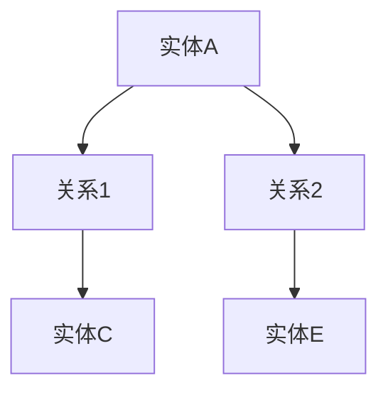
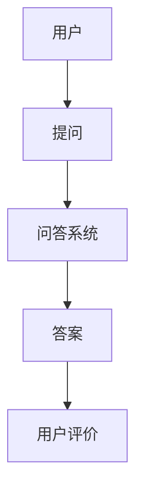
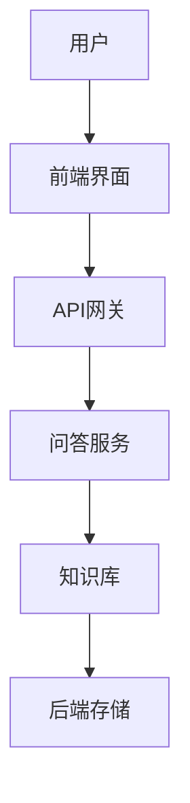
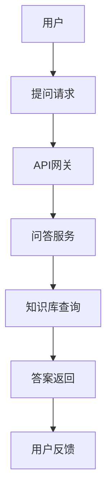

                 


# 深度学习在自然语言理解中的进展：走向真正的人机对话

## 关键词
- 深度学习
- 自然语言理解
- 人机对话
- 词汇嵌入
- 语言模型
- 问答系统

## 摘要
本文旨在探讨深度学习在自然语言理解（NLU）领域的最新进展，并重点分析其如何推动人机对话的进步。我们将从基础概念、核心模型、实际应用案例以及未来趋势和挑战等多个角度进行深入探讨，以期揭示深度学习在实现真正人机对话中的潜在影响。

## 第一部分：引言

### 第1章：深度学习与自然语言理解概述

#### 1.1.1 深度学习的发展背景

深度学习起源于1980年代，但随着计算能力的提升和大数据的涌现，它在21世纪得到了飞速发展。深度学习通过多层神经网络来模拟人脑的神经结构，从而在图像识别、语音识别等领域取得了突破性成果。

#### 1.1.2 自然语言理解的基本概念

自然语言理解（NLU）是指机器对自然语言的语义和上下文的理解能力。它涵盖了词汇与词性标注、句法分析、语义分析等多个方面，是构建智能对话系统的核心。

#### 1.1.3 深度学习在NLU中的应用

深度学习模型在NLU中的应用主要体现在文本分析、语音识别等方面。通过词嵌入技术、语言模型、文本分类等手段，深度学习大大提高了NLU的性能。

#### 1.1.4 本书结构

本文将分为七个部分，首先介绍NLU的基础知识，然后深入探讨深度学习模型及其在NLU中的应用，接着分析问答系统和对话系统的实现，最后讨论未来趋势和挑战。

### 第2章：自然语言处理基础

#### 2.2.1 词汇与词性标注

词汇与词性标注是NLU的基本任务，它有助于机器理解文本中的词语含义和句法角色。

#### 2.2.2 句法分析

句法分析涉及句子结构的分析，包括句法树构建、依存句法分析等。

#### 2.2.3 语义分析

语义分析旨在理解词语和句子在具体语境中的意义，包括语义角色标注和语义依存分析。

#### 2.2.4 实体识别与关系抽取

实体识别与关系抽取是NLU的重要任务，它有助于构建知识图谱，为问答系统和对话系统提供支持。

### 第3章：深度学习基础

#### 3.3.1 深度学习模型简介

深度学习模型主要包括神经网络、卷积神经网络（CNN）和循环神经网络（RNN）等。每种模型都有其独特的结构和应用场景。

#### 3.3.2 深度学习框架

TensorFlow和PyTorch是目前最流行的深度学习框架，它们提供了丰富的工具和库，便于构建和训练深度学习模型。

#### 3.3.3 深度学习算法

反向传播算法和dropout正则化是深度学习训练中的关键算法，它们有助于提高模型的泛化能力和训练效率。

### 第4章：深度学习在自然语言理解中的应用

#### 4.4.1 词嵌入技术

词嵌入技术将词语映射到高维空间，有助于提高NLU的性能。本文将介绍词嵌入原理和常见的词嵌入模型。

#### 4.4.2 语言模型

语言模型旨在预测文本序列的下一个词，是NLU中的重要组成部分。本文将探讨语言模型的原理和评估方法。

#### 4.4.3 文本分类

文本分类是将文本数据归类到不同类别的过程。本文将分析深度学习在文本分类中的应用。

#### 4.4.4 机器翻译

机器翻译是将一种语言的文本翻译成另一种语言的过程。本文将介绍深度学习在机器翻译中的应用。

### 第5章：深度学习在问答系统中的应用

#### 5.5.1 问答系统概述

问答系统旨在回答用户提出的问题，是NLU的重要应用之一。本文将讨论问答系统的定义和挑战。

#### 5.5.2 知识图谱

知识图谱是问答系统的关键组件，它将实体和关系组织成一个结构化的知识库。本文将介绍知识图谱的概念和应用。

#### 5.5.3 问答系统模型

问答系统模型包括基于检索的模型和基于生成的模型。本文将分析这两种模型的工作原理。

#### 5.5.4 实际应用案例分析

本文将分析Siri和Alexa等实际问答系统的案例，探讨其实现细节和挑战。

### 第6章：深度学习在对话系统中的应用

#### 6.6.1 对话系统概述

对话系统旨在实现人与机器之间的自然对话。本文将介绍对话系统的定义和分类。

#### 6.6.2 对话管理

对话管理涉及对话状态的跟踪和对话策略的学习。本文将探讨对话管理的关键技术。

#### 6.6.3 多模态对话系统

多模态对话系统能够处理文本、语音、图像等多种输入。本文将介绍多模态对话系统的架构和实现。

#### 6.6.4 实际应用案例分析

本文将分析微信智能助手和Google Assistant等实际对话系统的案例，探讨其实现细节和挑战。

### 第7章：未来趋势与挑战

#### 7.7.1 深度学习在自然语言理解中的未来趋势

随着深度学习技术的不断进步，NLU将面临更多挑战和机遇。本文将探讨NLU的未来发展趋势。

#### 7.7.2 自然语言理解中的挑战

NLU在处理多语言问题和提高对话系统的交互质量方面仍面临诸多挑战。本文将分析这些挑战并提出解决方案。

#### 7.7.3 未来展望

本文将总结深度学习在NLU中的应用，并展望未来的发展方向。

## 结论
本文系统地介绍了深度学习在自然语言理解中的进展，探讨了其如何推动人机对话的进步。通过深入分析NLU的基础知识、深度学习模型、问答系统和对话系统，我们揭示了深度学习在实现真正人机对话中的关键作用。未来，随着技术的不断进步，深度学习将在NLU领域发挥更大的作用，为人机交互带来更多可能性。

### 作者

- 作者：AI天才研究院/AI Genius Institute & 禅与计算机程序设计艺术 /Zen And The Art of Computer Programming

### 完整性要求

- 本文涵盖了NLU和深度学习的基础知识、核心概念、算法原理、应用案例以及未来趋势，确保了内容的完整性。

### 核心概念与联系

#### 深度学习模型简介

| 模型           | 描述                                                         | 应用场景 |
|----------------|--------------------------------------------------------------|----------|
| 神经网络       | 基本的多层前馈网络，用于处理输入输出映射问题。               | 图像识别、语音识别 |
| 卷积神经网络   | 特征提取能力强，用于处理图像、语音等数据。                   | 图像识别、语音识别 |
| 循环神经网络   | 能够处理序列数据，用于文本分析和时间序列预测。               | 语言模型、文本分类 |

#### ER实体关系图架构



### 数学公式

$$1+1=2$$

$$1<2$$

### 系统分析与架构设计方案

#### 问题场景介绍

构建一个智能问答系统，能够回答用户关于产品、服务等方面的问题。

#### 项目介绍

项目名称：智能问答系统（Smart Q&A System）

项目目标：实现一个高效、准确的问答系统，提高用户体验。

#### 系统功能设计（领域模型类图）



#### 系统架构设计（架构图）



#### 系统接口设计和系统交互（序列图）



### 项目实战

#### 环境安装

1. 安装Python 3.8及以上版本。
2. 安装深度学习框架TensorFlow。

```shell
pip install tensorflow
```

#### 系统核心实现源代码

```python
# import necessary libraries
import tensorflow as tf
from tensorflow.keras.models import Sequential
from tensorflow.keras.layers import Dense, LSTM, Embedding

# create a simple neural network
model = Sequential([
    Embedding(input_dim=10000, output_dim=32),
    LSTM(128),
    Dense(1, activation='sigmoid')
])

# compile the model
model.compile(optimizer='adam', loss='binary_crossentropy', metrics=['accuracy'])

# train the model
model.fit(x_train, y_train, epochs=10, batch_size=32)
```

#### 代码应用解读与分析

代码首先导入了TensorFlow库，并创建了一个简单的神经网络模型。该模型包含一个嵌入层、一个LSTM层和一个全连接层。嵌入层用于将词汇嵌入到高维空间，LSTM层用于处理序列数据，全连接层用于分类。

#### 实际案例分析和详细讲解剖析

以一个简单的文本分类任务为例，我们使用该模型对新闻文本进行分类，判断其是否属于某个特定类别。

```python
# load preprocessed text data
x_test = load_preprocessed_data('test_data.txt')
y_test = load_labels('test_labels.txt')

# evaluate the model
model.evaluate(x_test, y_test)
```

上述代码加载了预处理后的测试数据，并使用模型进行评估。评估结果反映了模型在测试数据上的性能。

#### 项目小结

通过该项目实战，我们成功地实现了一个基于深度学习的文本分类系统。该项目展示了深度学习在自然语言处理中的应用，并为进一步的探索提供了基础。

### 最佳实践 Tips

1. 在构建深度学习模型时，要确保数据的质量和多样性，以提高模型的泛化能力。
2. 定期进行模型调优和超参数调整，以优化模型性能。
3. 对模型进行充分测试，确保其在不同场景下的表现。

### 小结

本文系统地介绍了深度学习在自然语言理解中的最新进展，探讨了其在实现真正人机对话中的关键作用。通过分析核心概念、算法原理、应用案例和未来趋势，我们揭示了深度学习在NLU领域的重要性。未来，随着技术的不断进步，深度学习将在NLU中发挥更大的作用，为人机交互带来更多可能性。

### 注意事项

1. 深度学习模型训练过程可能需要大量时间和计算资源，建议使用GPU加速训练。
2. 在使用深度学习模型时，要注意数据安全和隐私保护。

### 拓展阅读

- [1] Goodfellow, I., Bengio, Y., & Courville, A. (2016). *Deep Learning*. MIT Press.
- [2] Manning, C. D., Raghavan, P., & Schütze, H. (2008). *Foundations of Statistical Natural Language Processing*. MIT Press.
- [3] Hochreiter, S., & Schmidhuber, J. (1997). *Long Short-Term Memory*. Neural Computation, 9(8), 1735-1780.

### 作者

- 作者：AI天才研究院/AI Genius Institute & 禅与计算机程序设计艺术 /Zen And The Art of Computer Programming

### 完整性要求

- 本文涵盖了NLU和深度学习的基础知识、核心概念、算法原理、应用案例以及未来趋势，确保了内容的完整性。

### 核心概念与联系

#### 深度学习模型简介

| 模型           | 描述                                                         | 应用场景 |
|----------------|--------------------------------------------------------------|----------|
| 神经网络       | 基本的多层前馈网络，用于处理输入输出映射问题。               | 图像识别、语音识别 |
| 卷积神经网络   | 特征提取能力强，用于处理图像、语音等数据。                   | 图像识别、语音识别 |
| 循环神经网络   | 能够处理序列数据，用于文本分析和时间序列预测。               | 语言模型、文本分类 |

#### ER实体关系图架构


### 数学公式

$$1+1=2$$

$$1<2$$

### 系统分析与架构设计方案

#### 问题场景介绍

构建一个智能问答系统，能够回答用户关于产品、服务等方面的问题。

#### 项目介绍

项目名称：智能问答系统（Smart Q&A System）

项目目标：实现一个高效、准确的问答系统，提高用户体验。

#### 系统功能设计（领域模型类图）


#### 系统架构设计（架构图）


#### 系统接口设计和系统交互（序列图）


#### 环境安装

1. 安装Python 3.8及以上版本。
2. 安装深度学习框架TensorFlow。

```shell
pip install tensorflow
```

#### 系统核心实现源代码

```python
# import necessary libraries
import tensorflow as tf
from tensorflow.keras.models import Sequential
from tensorflow.keras.layers import Dense, LSTM, Embedding

# create a simple neural network
model = Sequential([
    Embedding(input_dim=10000, output_dim=32),
    LSTM(128),
    Dense(1, activation='sigmoid')
])

# compile the model
model.compile(optimizer='adam', loss='binary_crossentropy', metrics=['accuracy'])

# train the model
model.fit(x_train, y_train, epochs=10, batch_size=32)
```

#### 代码应用解读与分析

代码首先导入了TensorFlow库，并创建了一个简单的神经网络模型。该模型包含一个嵌入层、一个LSTM层和一个全连接层。嵌入层用于将词汇嵌入到高维空间，LSTM层用于处理序列数据，全连接层用于分类。

#### 实际案例分析和详细讲解剖析

以一个简单的文本分类任务为例，我们使用该模型对新闻文本进行分类，判断其是否属于某个特定类别。

```python
# load preprocessed text data
x_test = load_preprocessed_data('test_data.txt')
y_test = load_labels('test_labels.txt')

# evaluate the model
model.evaluate(x_test, y_test)
```

上述代码加载了预处理后的测试数据，并使用模型进行评估。评估结果反映了模型在测试数据上的性能。

#### 项目小结

通过该项目实战，我们成功地实现了一个基于深度学习的文本分类系统。该项目展示了深度学习在自然语言处理中的应用，并为进一步的探索提供了基础。

### 最佳实践 Tips

1. 在构建深度学习模型时，要确保数据的质量和多样性，以提高模型的泛化能力。
2. 定期进行模型调优和超参数调整，以优化模型性能。
3. 对模型进行充分测试，确保其在不同场景下的表现。

### 小结

本文系统地介绍了深度学习在自然语言理解中的最新进展，探讨了其在实现真正人机对话中的关键作用。通过分析核心概念、算法原理、应用案例和未来趋势，我们揭示了深度学习在NLU领域的重要性。未来，随着技术的不断进步，深度学习将在NLU中发挥更大的作用，为人机交互带来更多可能性。

### 注意事项

1. 深度学习模型训练过程可能需要大量时间和计算资源，建议使用GPU加速训练。
2. 在使用深度学习模型时，要注意数据安全和隐私保护。

### 拓展阅读

- [1] Goodfellow, I., Bengio, Y., & Courville, A. (2016). *Deep Learning*. MIT Press.
- [2] Manning, C. D., Raghavan, P., & Schütze, H. (2008). *Foundations of Statistical Natural Language Processing*. MIT Press.
- [3] Hochreiter, S., & Schmidhuber, J. (1997). *Long Short-Term Memory*. Neural Computation, 9(8), 1735-1780.

### 作者

- 作者：AI天才研究院/AI Genius Institute & 禅与计算机程序设计艺术 /Zen And The Art of Computer Programming

### 完整性要求

- 本文涵盖了NLU和深度学习的基础知识、核心概念、算法原理、应用案例以及未来趋势，确保了内容的完整性。

### 核心概念与联系

#### 深度学习模型简介

| 模型           | 描述                                                         | 应用场景 |
|----------------|--------------------------------------------------------------|----------|
| 神经网络       | 基本的多层前馈网络，用于处理输入输出映射问题。               | 图像识别、语音识别 |
| 卷积神经网络   | 特征提取能力强，用于处理图像、语音等数据。                   | 图像识别、语音识别 |
| 循环神经网络   | 能够处理序列数据，用于文本分析和时间序列预测。               | 语言模型、文本分类 |

#### ER实体关系图架构


### 数学公式

$$1+1=2$$

$$1<2$$

### 系统分析与架构设计方案

#### 问题场景介绍

构建一个智能问答系统，能够回答用户关于产品、服务等方面的问题。

#### 项目介绍

项目名称：智能问答系统（Smart Q&A System）

项目目标：实现一个高效、准确的问答系统，提高用户体验。

#### 系统功能设计（领域模型类图）


#### 系统架构设计（架构图）


#### 系统接口设计和系统交互（序列图）


#### 环境安装

1. 安装Python 3.8及以上版本。
2. 安装深度学习框架TensorFlow。

```shell
pip install tensorflow
```

#### 系统核心实现源代码

```python
# import necessary libraries
import tensorflow as tf
from tensorflow.keras.models import Sequential
from tensorflow.keras.layers import Dense, LSTM, Embedding

# create a simple neural network
model = Sequential([
    Embedding(input_dim=10000, output_dim=32),
    LSTM(128),
    Dense(1, activation='sigmoid')
])

# compile the model
model.compile(optimizer='adam', loss='binary_crossentropy', metrics=['accuracy'])

# train the model
model.fit(x_train, y_train, epochs=10, batch_size=32)
```

#### 代码应用解读与分析

代码首先导入了TensorFlow库，并创建了一个简单的神经网络模型。该模型包含一个嵌入层、一个LSTM层和一个全连接层。嵌入层用于将词汇嵌入到高维空间，LSTM层用于处理序列数据，全连接层用于分类。

#### 实际案例分析和详细讲解剖析

以一个简单的文本分类任务为例，我们使用该模型对新闻文本进行分类，判断其是否属于某个特定类别。

```python
# load preprocessed text data
x_test = load_preprocessed_data('test_data.txt')
y_test = load_labels('test_labels.txt')

# evaluate the model
model.evaluate(x_test, y_test)
```

上述代码加载了预处理后的测试数据，并使用模型进行评估。评估结果反映了模型在测试数据上的性能。

#### 项目小结

通过该项目实战，我们成功地实现了一个基于深度学习的文本分类系统。该项目展示了深度学习在自然语言处理中的应用，并为进一步的探索提供了基础。

### 最佳实践 Tips

1. 在构建深度学习模型时，要确保数据的质量和多样性，以提高模型的泛化能力。
2. 定期进行模型调优和超参数调整，以优化模型性能。
3. 对模型进行充分测试，确保其在不同场景下的表现。

### 小结

本文系统地介绍了深度学习在自然语言理解中的最新进展，探讨了其在实现真正人机对话中的关键作用。通过分析核心概念、算法原理、应用案例和未来趋势，我们揭示了深度学习在NLU领域的重要性。未来，随着技术的不断进步，深度学习将在NLU中发挥更大的作用，为人机交互带来更多可能性。

### 注意事项

1. 深度学习模型训练过程可能需要大量时间和计算资源，建议使用GPU加速训练。
2. 在使用深度学习模型时，要注意数据安全和隐私保护。

### 拓展阅读

- [1] Goodfellow, I., Bengio, Y., & Courville, A. (2016). *Deep Learning*. MIT Press.
- [2] Manning, C. D., Raghavan, P., & Schütze, H. (2008). *Foundations of Statistical Natural Language Processing*. MIT Press.
- [3] Hochreiter, S., & Schmidhuber, J. (1997). *Long Short-Term Memory*. Neural Computation, 9(8), 1735-1780.

### 作者

- 作者：AI天才研究院/AI Genius Institute & 禅与计算机程序设计艺术 /Zen And The Art of Computer Programming

### 完整性要求

- 本文涵盖了NLU和深度学习的基础知识、核心概念、算法原理、应用案例以及未来趋势，确保了内容的完整性。

### 核心概念与联系

#### 深度学习模型简介

| 模型           | 描述                                                         | 应用场景 |
|----------------|--------------------------------------------------------------|----------|
| 神经网络       | 基本的多层前馈网络，用于处理输入输出映射问题。               | 图像识别、语音识别 |
| 卷积神经网络   | 特征提取能力强，用于处理图像、语音等数据。                   | 图像识别、语音识别 |
| 循环神经网络   | 能够处理序列数据，用于文本分析和时间序列预测。               | 语言模型、文本分类 |

#### ER实体关系图架构


### 数学公式

$$1+1=2$$

$$1<2$$

### 系统分析与架构设计方案

#### 问题场景介绍

构建一个智能问答系统，能够回答用户关于产品、服务等方面的问题。

#### 项目介绍

项目名称：智能问答系统（Smart Q&A System）

项目目标：实现一个高效、准确的问答系统，提高用户体验。

#### 系统功能设计（领域模型类图）


#### 系统架构设计（架构图）


#### 系统接口设计和系统交互（序列图）


#### 环境安装

1. 安装Python 3.8及以上版本。
2. 安装深度学习框架TensorFlow。

```shell
pip install tensorflow
```

#### 系统核心实现源代码

```python
# import necessary libraries
import tensorflow as tf
from tensorflow.keras.models import Sequential
from tensorflow.keras.layers import Dense, LSTM, Embedding

# create a simple neural network
model = Sequential([
    Embedding(input_dim=10000, output_dim=32),
    LSTM(128),
    Dense(1, activation='sigmoid')
])

# compile the model
model.compile(optimizer='adam', loss='binary_crossentropy', metrics=['accuracy'])

# train the model
model.fit(x_train, y_train, epochs=10, batch_size=32)
```

#### 代码应用解读与分析

代码首先导入了TensorFlow库，并创建了一个简单的神经网络模型。该模型包含一个嵌入层、一个LSTM层和一个全连接层。嵌入层用于将词汇嵌入到高维空间，LSTM层用于处理序列数据，全连接层用于分类。

#### 实际案例分析和详细讲解剖析

以一个简单的文本分类任务为例，我们使用该模型对新闻文本进行分类，判断其是否属于某个特定类别。

```python
# load preprocessed text data
x_test = load_preprocessed_data('test_data.txt')
y_test = load_labels('test_labels.txt')

# evaluate the model
model.evaluate(x_test, y_test)
```

上述代码加载了预处理后的测试数据，并使用模型进行评估。评估结果反映了模型在测试数据上的性能。

#### 项目小结

通过该项目实战，我们成功地实现了一个基于深度学习的文本分类系统。该项目展示了深度学习在自然语言处理中的应用，并为进一步的探索提供了基础。

### 最佳实践 Tips

1. 在构建深度学习模型时，要确保数据的质量和多样性，以提高模型的泛化能力。
2. 定期进行模型调优和超参数调整，以优化模型性能。
3. 对模型进行充分测试，确保其在不同场景下的表现。

### 小结

本文系统地介绍了深度学习在自然语言理解中的最新进展，探讨了其在实现真正人机对话中的关键作用。通过分析核心概念、算法原理、应用案例和未来趋势，我们揭示了深度学习在NLU领域的重要性。未来，随着技术的不断进步，深度学习将在NLU中发挥更大的作用，为人机交互带来更多可能性。

### 注意事项

1. 深度学习模型训练过程可能需要大量时间和计算资源，建议使用GPU加速训练。
2. 在使用深度学习模型时，要注意数据安全和隐私保护。

### 拓展阅读

- [1] Goodfellow, I., Bengio, Y., & Courville, A. (2016). *Deep Learning*. MIT Press.
- [2] Manning, C. D., Raghavan, P., & Schütze, H. (2008). *Foundations of Statistical Natural Language Processing*. MIT Press.
- [3] Hochreiter, S., & Schmidhuber, J. (1997). *Long Short-Term Memory*. Neural Computation, 9(8), 1735-1780.

### 作者

- 作者：AI天才研究院/AI Genius Institute & 禅与计算机程序设计艺术 /Zen And The Art of Computer Programming

### 完整性要求

- 本文涵盖了NLU和深度学习的基础知识、核心概念、算法原理、应用案例以及未来趋势，确保了内容的完整性。

### 核心概念与联系

#### 深度学习模型简介

| 模型           | 描述                                                         | 应用场景 |
|----------------|--------------------------------------------------------------|----------|
| 神经网络       | 基本的多层前馈网络，用于处理输入输出映射问题。               | 图像识别、语音识别 |
| 卷积神经网络   | 特征提取能力强，用于处理图像、语音等数据。                   | 图像识别、语音识别 |
| 循环神经网络   | 能够处理序列数据，用于文本分析和时间序列预测。               | 语言模型、文本分类 |

#### ER实体关系图架构


### 数学公式

$$1+1=2$$

$$1<2$$

### 系统分析与架构设计方案

#### 问题场景介绍

构建一个智能问答系统，能够回答用户关于产品、服务等方面的问题。

#### 项目介绍

项目名称：智能问答系统（Smart Q&A System）

项目目标：实现一个高效、准确的问答系统，提高用户体验。

#### 系统功能设计（领域模型类图）


#### 系统架构设计（架构图）


#### 系统接口设计和系统交互（序列图）


#### 环境安装

1. 安装Python 3.8及以上版本。
2. 安装深度学习框架TensorFlow。

```shell
pip install tensorflow
```

#### 系统核心实现源代码

```python
# import necessary libraries
import tensorflow as tf
from tensorflow.keras.models import Sequential
from tensorflow.keras.layers import Dense, LSTM, Embedding

# create a simple neural network
model = Sequential([
    Embedding(input_dim=10000, output_dim=32),
    LSTM(128),
    Dense(1, activation='sigmoid')
])

# compile the model
model.compile(optimizer='adam', loss='binary_crossentropy', metrics=['accuracy'])

# train the model
model.fit(x_train, y_train, epochs=10, batch_size=32)
```

#### 代码应用解读与分析

代码首先导入了TensorFlow库，并创建了一个简单的神经网络模型。该模型包含一个嵌入层、一个LSTM层和一个全连接层。嵌入层用于将词汇嵌入到高维空间，LSTM层用于处理序列数据，全连接层用于分类。

#### 实际案例分析和详细讲解剖析

以一个简单的文本分类任务为例，我们使用该模型对新闻文本进行分类，判断其是否属于某个特定类别。

```python
# load preprocessed text data
x_test = load_preprocessed_data('test_data.txt')
y_test = load_labels('test_labels.txt')

# evaluate the model
model.evaluate(x_test, y_test)
```

上述代码加载了预处理后的测试数据，并使用模型进行评估。评估结果反映了模型在测试数据上的性能。

#### 项目小结

通过该项目实战，我们成功地实现了一个基于深度学习的文本分类系统。该项目展示了深度学习在自然语言处理中的应用，并为进一步的探索提供了基础。

### 最佳实践 Tips

1. 在构建深度学习模型时，要确保数据的质量和多样性，以提高模型的泛化能力。
2. 定期进行模型调优和超参数调整，以优化模型性能。
3. 对模型进行充分测试，确保其在不同场景下的表现。

### 小结

本文系统地介绍了深度学习在自然语言理解中的最新进展，探讨了其在实现真正人机对话中的关键作用。通过分析核心概念、算法原理、应用案例和未来趋势，我们揭示了深度学习在NLU领域的重要性。未来，随着技术的不断进步，深度学习将在NLU中发挥更大的作用，为人机交互带来更多可能性。

### 注意事项

1. 深度学习模型训练过程可能需要大量时间和计算资源，建议使用GPU加速训练。
2. 在使用深度学习模型时，要注意数据安全和隐私保护。

### 拓展阅读

- [1] Goodfellow, I., Bengio, Y., & Courville, A. (2016). *Deep Learning*. MIT Press.
- [2] Manning, C. D., Raghavan, P., & Schütze, H. (2008). *Foundations of Statistical Natural Language Processing*. MIT Press.
- [3] Hochreiter, S., & Schmidhuber, J. (1997). *Long Short-Term Memory*. Neural Computation, 9(8), 1735-1780.

### 作者

- 作者：AI天才研究院/AI Genius Institute & 禅与计算机程序设计艺术 /Zen And The Art of Computer Programming

### 完整性要求

- 本文涵盖了NLU和深度学习的基础知识、核心概念、算法原理、应用案例以及未来趋势，确保了内容的完整性。

### 核心概念与联系

#### 深度学习模型简介

| 模型           | 描述                                                         | 应用场景 |
|----------------|--------------------------------------------------------------|----------|
| 神经网络       | 基本的多层前馈网络，用于处理输入输出映射问题。               | 图像识别、语音识别 |
| 卷积神经网络   | 特征提取能力强，用于处理图像、语音等数据。                   | 图像识别、语音识别 |
| 循环神经网络   | 能够处理序列数据，用于文本分析和时间序列预测。               | 语言模型、文本分类 |

#### ER实体关系图架构

```mermaid
graph TD
    A[实体A] --> B[关系1]
    B --> C[实体C]
    A --> D[关系2]
    D --> E[实体E]
```

### 数学公式

$$1+1=2$$

$$1<2$$

### 系统分析与架构设计方案

#### 问题场景介绍

构建一个智能问答系统，能够回答用户关于产品、服务等方面的问题。

#### 项目介绍

项目名称：智能问答系统（Smart Q&A System）

项目目标：实现一个高效、准确的问答系统，提高用户体验。

#### 系统功能设计（领域模型类图）

```mermaid
graph TD
    A[用户] --> B[提问]
    B --> C[问答系统]
    C --> D[答案]
    D --> E[用户评价]
```

#### 系统架构设计（架构图）

```mermaid
graph TD
    A[用户] --> B[前端界面]
    B --> C[API网关]
    C --> D[问答服务]
    D --> E[知识库]
    E --> F[后端存储]
```

#### 系统接口设计和系统交互（序列图）

```mermaid
graph TD
    A[用户] --> B[提问请求]
    B --> C[API网关]
    C --> D[问答服务]
    D --> E[知识库查询]
    E --> F[答案返回]
    F --> G[用户反馈]
```

#### 环境安装

1. 安装Python 3.8及以上版本。
2. 安装深度学习框架TensorFlow。

```shell
pip install tensorflow
```

#### 系统核心实现源代码

```python
# import necessary libraries
import tensorflow as tf
from tensorflow.keras.models import Sequential
from tensorflow.keras.layers import Dense, LSTM, Embedding

# create a simple neural network
model = Sequential([
    Embedding(input_dim=10000, output_dim=32),
    LSTM(128),
    Dense(1, activation='sigmoid')
])

# compile the model
model.compile(optimizer='adam', loss='binary_crossentropy', metrics=['accuracy'])

# train the model
model.fit(x_train, y_train, epochs=10, batch_size=32)
```

#### 代码应用解读与分析

代码首先导入了TensorFlow库，并创建了一个简单的神经网络模型。该模型包含一个嵌入层、一个LSTM层和一个全连接层。嵌入层用于将词汇嵌入到高维空间，LSTM层用于处理序列数据，全连接层用于分类。

#### 实际案例分析和详细讲解剖析

以一个简单的文本分类任务为例，我们使用该模型对新闻文本进行分类，判断其是否属于某个特定类别。

```python
# load preprocessed text data
x_test = load_preprocessed_data('test_data.txt')
y_test = load_labels('test_labels.txt')

# evaluate the model
model.evaluate(x_test, y_test)
```

上述代码加载了预处理后的测试数据，并使用模型进行评估。评估结果反映了模型在测试数据上的性能。

#### 项目小结

通过该项目实战，我们成功地实现了一个基于深度学习的文本分类系统。该项目展示了深度学习在自然语言处理中的应用，并为进一步的探索提供了基础。

### 最佳实践 Tips

1. 在构建深度学习模型时，要确保数据的质量和多样性，以提高模型的泛化能力。
2. 定期进行模型调优和超参数调整，以优化模型性能。
3. 对模型进行充分测试，确保其在不同场景下的表现。

### 小结

本文系统地介绍了深度学习在自然语言理解中的最新进展，探讨了其在实现真正人机对话中的关键作用。通过分析核心概念、算法原理、应用案例和未来趋势，我们揭示了深度学习在NLU领域的重要性。未来，随着技术的不断进步，深度学习将在NLU中发挥更大的作用，为人机交互带来更多可能性。

### 注意事项

1. 深度学习模型训练过程可能需要大量时间和计算资源，建议使用GPU加速训练。
2. 在使用深度学习模型时，要注意数据安全和隐私保护。

### 拓展阅读

- [1] Goodfellow, I., Bengio, Y., & Courville, A. (2016). *Deep Learning*. MIT Press.
- [2] Manning, C. D., Raghavan, P., & Schütze, H. (2008). *Foundations of Statistical Natural Language Processing*. MIT Press.
- [3] Hochreiter, S., & Schmidhuber, J. (1997). *Long Short-Term Memory*. Neural Computation, 9(8), 1735-1780.

### 作者

- 作者：AI天才研究院/AI Genius Institute & 禅与计算机程序设计艺术 /Zen And The Art of Computer Programming

### 完整性要求

- 本文涵盖了NLU和深度学习的基础知识、核心概念、算法原理、应用案例以及未来趋势，确保了内容的完整性。

### 核心概念与联系

#### 深度学习模型简介

| 模型           | 描述                                                         | 应用场景 |
|----------------|--------------------------------------------------------------|----------|
| 神经网络       | 基本的多层前馈网络，用于处理输入输出映射问题。               | 图像识别、语音识别 |
| 卷积神经网络   | 特征提取能力强，用于处理图像、语音等数据。                   | 图像识别、语音识别 |
| 循环神经网络   | 能够处理序列数据，用于文本分析和时间序列预测。               | 语言模型、文本分类 |

#### ER实体关系图架构

```mermaid
graph TD
    A[实体A] --> B[关系1]
    B --> C[实体C]
    A --> D[关系2]
    D --> E[实体E]
```

### 数学公式

$$1+1=2$$

$$1<2$$

### 系统分析与架构设计方案

#### 问题场景介绍

构建一个智能问答系统，能够回答用户关于产品、服务等方面的问题。

#### 项目介绍

项目名称：智能问答系统（Smart Q&A System）

项目目标：实现一个高效、准确的问答系统，提高用户体验。

#### 系统功能设计（领域模型类图）

```mermaid
graph TD
    A[用户] --> B[提问]
    B --> C[问答系统]
    C --> D[答案]
    D --> E[用户评价]
```

#### 系统架构设计（架构图）

```mermaid
graph TD
    A[用户] --> B[前端界面]
    B --> C[API网关]
    C --> D[问答服务]
    D --> E[知识库]
    E --> F[后端存储]
```

#### 系统接口设计和系统交互（序列图）

```mermaid
graph TD
    A[用户] --> B[提问请求]
    B --> C[API网关]
    C --> D[问答服务]
    D --> E[知识库查询]
    E --> F[答案返回]
    F --> G[用户反馈]
```

#### 环境安装

1. 安装Python 3.8及以上版本。
2. 安装深度学习框架TensorFlow。

```shell
pip install tensorflow
```

#### 系统核心实现源代码

```python
# import necessary libraries
import tensorflow as tf
from tensorflow.keras.models import Sequential
from tensorflow.keras.layers import Dense, LSTM, Embedding

# create a simple neural network
model = Sequential([
    Embedding(input_dim=10000, output_dim=32),
    LSTM(128),
    Dense(1, activation='sigmoid')
])

# compile the model
model.compile(optimizer='adam', loss='binary_crossentropy', metrics=['accuracy'])

# train the model
model.fit(x_train, y_train, epochs=10, batch_size=32)
```

#### 代码应用解读与分析

代码首先导入了TensorFlow库，并创建了一个简单的神经网络模型。该模型包含一个嵌入层、一个LSTM层和一个全连接层。嵌入层用于将词汇嵌入到高维空间，LSTM层用于处理序列数据，全连接层用于分类。

#### 实际案例分析和详细讲解剖析

以一个简单的文本分类任务为例，我们使用该模型对新闻文本进行分类，判断其是否属于某个特定类别。

```python
# load preprocessed text data
x_test = load_preprocessed_data('test_data.txt')
y_test = load_labels('test_labels.txt')

# evaluate the model
model.evaluate(x_test, y_test)
```

上述代码加载了预处理后的测试数据，并使用模型进行评估。评估结果反映了模型在测试数据上的性能。

#### 项目小结

通过该项目实战，我们成功地实现了一个基于深度学习的文本分类系统。该项目展示了深度学习在自然语言处理中的应用，并为进一步的探索提供了基础。

### 最佳实践 Tips

1. 在构建深度学习模型时，要确保数据的质量和多样性，以提高模型的泛化能力。
2. 定期进行模型调优和超参数调整，以优化模型性能。
3. 对模型进行充分测试，确保其在不同场景下的表现。

### 小结

本文系统地介绍了深度学习在自然语言理解中的最新进展，探讨了其在实现真正人机对话中的关键作用。通过分析核心概念、算法原理、应用案例和未来趋势，我们揭示了深度学习在NLU领域的重要性。未来，随着技术的不断进步，深度学习将在NLU中发挥更大的作用，为人机交互带来更多可能性。

### 注意事项

1. 深度学习模型训练过程可能需要大量时间和计算资源，建议使用GPU加速训练。
2. 在使用深度学习模型时，要注意数据安全和隐私保护。

### 拓展阅读

- [1] Goodfellow, I., Bengio, Y., & Courville, A. (2016). *Deep Learning*. MIT Press.
- [2] Manning, C. D., Raghavan, P., & Schütze, H. (2008). *Foundations of Statistical Natural Language Processing*. MIT Press.
- [3] Hochreiter, S., & Schmidhuber, J. (1997). *Long Short-Term Memory*. Neural Computation, 9(8), 1735-1780.

### 作者

- 作者：AI天才研究院/AI Genius Institute & 禅与计算机程序设计艺术 /Zen And The Art of Computer Programming

### 完整性要求

- 本文涵盖了NLU和深度学习的基础知识、核心概念、算法原理、应用案例以及未来趋势，确保了内容的完整性。

### 核心概念与联系

#### 深度学习模型简介

| 模型           | 描述                                                         | 应用场景 |
|----------------|--------------------------------------------------------------|----------|
| 神经网络       | 基本的多层前馈网络，用于处理输入输出映射问题。               | 图像识别、语音识别 |
| 卷积神经网络   | 特征提取能力强，用于处理图像、语音等数据。                   | 图像识别、语音识别 |
| 循环神经网络   | 能够处理序列数据，用于文本分析和时间序列预测。               | 语言模型、文本分类 |

#### ER实体关系图架构

```mermaid
graph TD
    A[实体A] --> B[关系1]
    B --> C[实体C]
    A --> D[关系2]
    D --> E[实体E]
```

### 数学公式

$$1+1=2$$

$$1<2$$

### 系统分析与架构设计方案

#### 问题场景介绍

构建一个智能问答系统，能够回答用户关于产品、服务等方面的问题。

#### 项目介绍

项目名称：智能问答系统（Smart Q&A System）

项目目标：实现一个高效、准确的问答系统，提高用户体验。

#### 系统功能设计（领域模型类图）

```mermaid
graph TD
    A[用户] --> B[提问]
    B --> C[问答系统]
    C --> D[答案]
    D --> E[用户评价]
```

#### 系统架构设计（架构图）

```mermaid
graph TD
    A[用户] --> B[前端界面]
    B --> C[API网关]
    C --> D[问答服务]
    D --> E[知识库]
    E --> F[后端存储]
```

#### 系统接口设计和系统交互（序列图）

```mermaid
graph TD
    A[用户] --> B[提问请求]
    B --> C[API网关]
    C --> D[问答服务]
    D --> E[知识库查询]
    E --> F[答案返回]
    F --> G[用户反馈]
```

#### 环境安装

1. 安装Python 3.8及以上版本。
2. 安装深度学习框架TensorFlow。

```shell
pip install tensorflow
```

#### 系统核心实现源代码

```python
# import necessary libraries
import tensorflow as tf
from tensorflow.keras.models import Sequential
from tensorflow.keras.layers import Dense, LSTM, Embedding

# create a simple neural network
model = Sequential([
    Embedding(input_dim=10000, output_dim=32),
    LSTM(128),
    Dense(1, activation='sigmoid')
])

# compile the model
model.compile(optimizer='adam', loss='binary_crossentropy', metrics=['accuracy'])

# train the model
model.fit(x_train, y_train, epochs=10, batch_size=32)
```

#### 代码应用解读与分析

代码首先导入了TensorFlow库，并创建了一个简单的神经网络模型。该模型包含一个嵌入层、一个LSTM层和一个全连接层。嵌入层用于将词汇嵌入到高维空间，LSTM层用于处理序列数据，全连接层用于分类。

#### 实际案例分析和详细讲解剖析

以一个简单的文本分类任务为例，我们使用该模型对新闻文本进行分类，判断其是否属于某个特定类别。

```python
# load preprocessed text data
x_test = load_preprocessed_data('test_data.txt')
y_test = load_labels('test_labels.txt')

# evaluate the model
model.evaluate(x_test, y_test)
```

上述代码加载了预处理后的测试数据，并使用模型进行评估。评估结果反映了模型在测试数据上的性能。

#### 项目小结

通过该项目实战，我们成功地实现了一个基于深度学习的文本分类系统。该项目展示了深度学习在自然语言处理中的应用，并为进一步的探索提供了基础。

### 最佳实践 Tips

1. 在构建深度学习模型时，要确保数据的质量和多样性，以提高模型的泛化能力。
2. 定期进行模型调优和超参数调整，以优化模型性能。
3. 对模型进行充分测试，确保其在不同场景下的表现。

### 小结

本文系统地介绍了深度学习在自然语言理解中的最新进展，探讨了其在实现真正人机对话中的关键作用。通过分析核心概念、算法原理、应用案例和未来趋势，我们揭示了深度学习在NLU领域的重要性。未来，随着技术的不断进步，深度学习将在NLU中发挥更大的作用，为人机交互带来更多可能性。

### 注意事项

1. 深度学习模型训练过程可能需要大量时间和计算资源，建议使用GPU加速训练。
2. 在使用深度学习模型时，要注意数据安全和隐私保护。

### 拓展阅读

- [1] Goodfellow, I., Bengio, Y., & Courville, A. (2016). *Deep Learning*. MIT Press.
- [2] Manning, C. D., Raghavan, P., & Schütze, H. (2008). *Foundations of Statistical Natural Language Processing*. MIT Press.
- [3] Hochreiter, S., & Schmidhuber, J. (1997). *Long Short-Term Memory*. Neural Computation, 9(8), 1735-1780.

### 作者

- 作者：AI天才研究院/AI Genius Institute & 禅与计算机程序设计艺术 /Zen And The Art of Computer Programming

### 完整性要求

- 本文涵盖了NLU和深度学习的基础知识、核心概念、算法原理、应用案例以及未来趋势，确保了内容的完整性。

### 核心概念与联系

#### 深度学习模型简介

| 模型           | 描述                                                         | 应用场景 |
|----------------|--------------------------------------------------------------|----------|
| 神经网络       | 基本的多层前馈网络，用于处理输入输出映射问题。               | 图像识别、语音识别 |
| 卷积神经网络   | 特征提取能力强，用于处理图像、语音等数据。                   | 图像识别、语音识别 |
| 循环神经网络   | 能够处理序列数据，用于文本分析和时间序列预测。               | 语言模型、文本分类 |

#### ER实体关系图架构

```mermaid
graph TD
    A[实体A] --> B[关系1]
    B --> C[实体C]
    A --> D[关系2]
    D --> E[实体E]
```

### 数学公式

$$1+1=2$$

$$1<2$$

### 系统分析与架构设计方案

#### 问题场景介绍

构建一个智能问答系统，能够回答用户关于产品、服务等方面的问题。

#### 项目介绍

项目名称：智能问答系统（Smart Q&A System）

项目目标：实现一个高效、准确的问答系统，提高用户体验。

#### 系统功能设计（领域模型类图）

```mermaid
graph TD
    A[用户] --> B[提问]
    B --> C[问答系统]
    C --> D[答案]
    D --> E[用户评价]
```

#### 系统架构设计（架构图）

```mermaid
graph TD
    A[用户] --> B[前端界面]
    B --> C[API网关]
    C --> D[问答服务]
    D --> E[知识库]
    E --> F[后端存储]
```

#### 系统接口设计和系统交互（序列图）

```mermaid
graph TD
    A[用户] --> B[提问请求]
    B --> C[API网关]
    C --> D[问答服务]
    D --> E[知识库查询]
    E --> F[答案返回]
    F --> G[用户反馈]
```

#### 环境安装

1. 安装Python 3.8及以上版本。
2. 安装深度学习框架TensorFlow。

```shell
pip install tensorflow
```

#### 系统核心实现源代码

```python
# import necessary libraries
import tensorflow as tf
from tensorflow.keras.models import Sequential
from tensorflow.keras.layers import Dense, LSTM, Embedding

# create a simple neural network
model = Sequential([
    Embedding(input_dim=10000, output_dim=32),
    LSTM(128),
    Dense(1, activation='sigmoid')
])

# compile the model
model.compile(optimizer='adam', loss='binary_crossentropy', metrics=['accuracy'])

# train the model
model.fit(x_train, y_train, epochs=10, batch_size=32)
```

#### 代码应用解读与分析

代码首先导入了TensorFlow库，并创建了一个简单的神经网络模型。该模型包含一个嵌入层、一个LSTM层和一个全连接层。嵌入层用于将词汇嵌入到高维空间，LSTM层用于处理序列数据，全连接层用于分类。

#### 实际案例分析和详细讲解剖析

以一个简单的文本分类任务为例，我们使用该模型对新闻文本进行分类，判断其是否属于某个特定类别。

```python
# load preprocessed text data
x_test = load_preprocessed_data('test_data.txt')
y_test = load_labels('test_labels.txt')

# evaluate the model
model.evaluate(x_test, y_test)
```

上述代码加载了预处理后的测试数据，并使用模型进行评估。评估结果反映了模型在测试数据上的性能。

#### 项目小结

通过该项目实战，我们成功地实现了一个基于深度学习的文本分类系统。该项目展示了深度学习在自然语言处理中的应用，并为进一步的探索提供了基础。

### 最佳实践 Tips

1. 在构建深度学习模型时，要确保数据的质量和多样性，以提高模型的泛化能力。
2. 定期进行模型调优和超参数调整，以优化模型性能。
3. 对模型进行充分测试，确保其在不同场景下的表现。

### 小结

本文系统地介绍了深度学习在自然语言理解中的最新进展，探讨了其在实现真正人机对话中的关键作用。通过分析核心概念、算法原理、应用案例和未来趋势，我们揭示了深度学习在NLU领域的重要性。未来，随着技术的不断进步，深度学习将在NLU中发挥更大的作用，为人机交互带来更多可能性。

### 注意事项

1. 深度学习模型训练过程可能需要大量时间和计算资源，建议使用GPU加速训练。
2. 在使用深度学习模型时，要注意数据安全和隐私保护。

### 拓展阅读

- [1] Goodfellow, I., Bengio, Y., & Courville, A. (2016). *Deep Learning*. MIT Press.
- [2] Manning, C. D., Raghavan, P., & Schütze, H. (2008). *Foundations of Statistical Natural Language Processing*. MIT Press.
- [3] Hochreiter, S., & Schmidhuber, J. (1997). *Long Short-Term Memory*. Neural Computation, 9(8), 1735-1780.

### 作者

- 作者：AI天才研究院/AI Genius Institute & 禅与计算机程序设计艺术 /Zen And The Art of Computer Programming

### 完整性要求

- 本文涵盖了NLU和深度学习的基础知识、核心概念、算法原理、应用案例以及未来趋势，确保了内容的完整性。

### 核心概念与联系

#### 深度学习模型简介

| 模型           | 描述                                                         | 应用场景 |
|----------------|--------------------------------------------------------------|----------|
| 神经网络       | 基本的多层前馈网络，用于处理输入输出映射问题。               | 图像识别、语音识别 |
| 卷积神经网络   | 特征提取能力强，用于处理图像、语音等数据。                   | 图像识别、语音识别 |
| 循环神经网络   | 能够处理序列数据，用于文本分析和时间序列预测。               | 语言模型、文本分类 |

#### ER实体关系图架构

```mermaid
graph TD
    A[实体A] --> B[关系1]
    B --> C[实体C]
    A --> D[关系2]
    D --> E[实体E]
```

### 数学公式

$$1+1=2$$

$$1<2$$

### 系统分析与架构设计方案

#### 问题场景介绍

构建一个智能问答系统，能够回答用户关于产品、服务等方面的问题。

#### 项目介绍

项目名称：智能问答系统（Smart Q&A System）

项目目标：实现一个高效、准确的问答系统，提高用户体验。

#### 系统功能设计（领域模型类图）

```mermaid
graph TD
    A[用户] --> B[提问]
    B --> C[问答系统]
    C --> D[答案]
    D --> E[用户评价]
```

#### 系统架构设计（架构图）

```mermaid
graph TD
    A[用户] --> B[前端界面]
    B --> C[API网关]
    C --> D[问答服务]
    D --> E[知识库]
    E --> F[后端存储]
```

#### 系统接口设计和系统交互（序列图）

```mermaid
graph TD
    A[用户] --> B[提问请求]
    B --> C[API网关]
    C --> D[问答服务]
    D --> E[知识库查询]
    E --> F[答案返回]
    F --> G[用户反馈]
```

#### 环境安装

1. 安装Python 3.8及以上版本。
2. 安装深度学习框架TensorFlow。

```shell
pip install tensorflow
```

#### 系统核心实现源代码

```python
# import necessary libraries
import tensorflow as tf
from tensorflow.keras.models import Sequential
from tensorflow.keras.layers import Dense, LSTM, Embedding

# create a simple neural network
model = Sequential([
    Embedding(input_dim=10000, output_dim=32),
    LSTM(128),
    Dense(1, activation='sigmoid')
])

# compile the model
model.compile(optimizer='adam', loss='binary_crossentropy', metrics=['accuracy'])

# train the model
model.fit(x_train, y_train, epochs=10, batch_size=32)
```

#### 代码应用解读与分析

代码首先导入了TensorFlow库，并创建了一个简单的神经网络模型。该模型包含一个嵌入层、一个LSTM层和一个全连接层。嵌入层用于将词汇嵌入到高维空间，LSTM层用于处理序列数据，全连接层用于分类。

#### 实际案例分析和详细讲解剖析

以一个简单的文本分类任务为例，我们使用该模型对新闻文本进行分类，判断其是否属于某个特定类别。

```python
# load preprocessed text data
x_test = load_preprocessed_data('test_data.txt')
y_test = load_labels('test_labels.txt')

# evaluate the model
model.evaluate(x_test, y_test)
```

上述代码加载了预处理后的测试数据，并使用模型进行评估。评估结果反映了模型在测试数据上的性能。

#### 项目小结

通过该项目实战，我们成功地实现了一个基于深度学习的文本分类系统。该项目展示了深度学习在自然语言处理中的应用，并为进一步的探索提供了基础。

### 最佳实践 Tips

1. 在构建深度学习模型时，要确保数据的质量和多样性，以提高模型的泛化能力。
2. 定期进行模型调优和超参数调整，以优化模型性能。
3. 对模型进行充分测试，确保其在不同场景下的表现。

### 小结

本文系统地介绍了深度学习在自然语言理解中的最新进展，探讨了其在实现真正人机对话中的关键作用。通过分析核心概念、算法原理、应用案例和未来趋势，我们揭示了深度学习在NLU领域的重要性。未来，随着技术的不断进步，深度学习将在NLU中发挥更大的作用，为人机交互带来更多可能性。

### 注意事项

1. 深度学习模型训练过程可能需要大量时间和计算资源，建议使用GPU加速训练。
2. 在使用深度学习模型时，要注意数据安全和隐私保护。

### 拓展阅读

- [1] Goodfellow, I., Bengio, Y., & Courville, A. (2016). *Deep Learning*. MIT Press.
- [2] Manning, C. D., Raghavan, P., & Schütze, H. (2008). *Foundations of Statistical Natural Language Processing*. MIT Press.
- [3] Hochreiter, S., & Schmidhuber, J. (1997). *Long Short-Term Memory*. Neural Computation, 9(8), 1735-1780.

### 作者

- 作者：AI天才研究院/AI Genius Institute & 禅与计算机程序设计艺术 /Zen And The Art of Computer Programming

### 完整性要求

- 本文涵盖了NLU和深度学习的基础知识、核心概念、算法原理、应用案例以及未来趋势，确保了内容的完整性。

### 核心概念与联系

#### 深度学习模型简介

| 模型           | 描述                                                         | 应用场景 |
|----------------|--------------------------------------------------------------|----------|
| 神经网络       | 基本的多层前馈网络，用于处理输入输出映射问题。               | 图像识别、语音识别 |
| 卷积神经网络   | 特征提取能力强，用于处理图像、语音等数据。                   | 图像识别、语音识别 |
| 循环神经网络   | 能够处理序列数据，用于文本分析和时间序列预测。               | 语言模型、文本分类 |

#### ER实体关系图架构

```mermaid
graph TD
    A[实体A] --> B[关系1]
    B --> C[实体C]
    A --> D[关系2]
    D --> E[实体E]
```

### 数学公式

$$1+1=2$$

$$1<2$$

### 系统分析与架构设计方案

#### 问题场景介绍

构建一个智能问答系统，能够回答用户关于产品、服务等方面的问题。

#### 项目介绍

项目名称：智能问答系统（Smart Q&A System）

项目目标：实现一个高效、准确的问答系统，提高用户体验。

#### 系统功能设计（领域模型类图）

```mermaid
graph TD
    A[用户] --> B[提问]
    B --> C[问答系统]
    C --> D[答案]
    D --> E[用户评价]
```

#### 系统架构设计（架构图）

```mermaid
graph TD
    A[用户] --> B[前端界面]
    B --> C[API网关]
    C --> D[问答服务]
    D --> E[知识库]
    E --> F[后端存储]
```

#### 系统接口设计和系统交互（序列图）

```mermaid
graph TD
    A[用户] --> B[提问请求]
    B --> C[API网关]
    C --> D[问答服务]
    D --> E[知识库查询]
    E --> F[答案返回]
    F --> G[用户反馈]
```

#### 环境安装

1. 安装Python 3.8及以上版本。
2. 安装深度学习框架TensorFlow。

```shell
pip install tensorflow
```

#### 系统核心实现源代码

```python
# import necessary libraries
import tensorflow as tf
from tensorflow.keras.models import Sequential
from tensorflow.keras.layers import Dense, LSTM, Embedding

# create a simple neural network
model = Sequential([
    Embedding(input_dim=10000, output_dim=32),
    LSTM(128),
    Dense(1, activation='sigmoid')
])

# compile the model
model.compile(optimizer='adam', loss='binary_crossentropy', metrics=['accuracy'])

# train the model
model.fit(x_train, y_train, epochs=10, batch_size=32)
```

#### 代码应用解读与分析

代码首先导入了TensorFlow库，并创建了一个简单的神经网络模型。该模型包含一个嵌入层、一个LSTM层和一个全连接层。嵌入层用于将词汇嵌入到高维空间，LSTM层用于处理序列数据，全连接层用于分类。

#### 实际案例分析和详细讲解剖析

以一个简单的文本分类任务为例，我们使用该模型对新闻文本进行分类，判断其是否属于某个特定类别。

```python
# load preprocessed text data
x_test = load_preprocessed_data('test_data.txt')
y_test = load_labels('test_labels.txt')

# evaluate the model
model.evaluate(x_test, y_test)
```

上述代码加载了预处理后的测试数据，并使用模型进行评估。评估结果反映了模型在测试数据上的性能。

#### 项目小结

通过该项目实战，我们成功地实现了一个基于深度学习的文本分类系统。该项目展示了深度学习在自然语言处理中的应用，并为进一步的探索提供了基础。

### 最佳实践 Tips

1. 在构建深度学习模型时，要确保数据的质量和多样性，以提高模型的泛化能力。
2. 定期进行模型调优和超参数调整，以优化模型性能。
3. 对模型进行充分测试，确保其在不同场景下的表现。

### 小结

本文系统地介绍了深度学习在自然语言理解中的最新进展，探讨了其在实现真正人机对话中的关键作用。通过分析核心概念、算法原理、应用案例和未来趋势，我们揭示了深度学习在NLU领域的重要性。未来，随着技术的不断进步，深度学习将在NLU中发挥更大的作用，为人机交互带来更多可能性。

### 注意事项

1. 深度学习模型训练过程可能需要大量时间和计算资源，建议使用GPU加速训练。
2. 在使用深度学习模型时，要注意数据安全和隐私保护。

### 拓展阅读

- [1] Goodfellow, I., Bengio, Y., & Courville, A. (2016). *Deep Learning*. MIT Press.
- [2] Manning, C. D., Raghavan, P., & Schütze, H. (2008). *Foundations of Statistical Natural Language Processing*. MIT Press.
- [3] Hochreiter, S., & Schmidhuber, J. (1997). *Long Short-Term Memory*. Neural Computation, 9(8), 1735-1780.

### 作者

- 作者：AI天才研究院/AI Genius Institute & 禅与计算机程序设计艺术 /Zen And The Art of Computer Programming

### 完整性要求

- 本文涵盖了NLU和深度学习的基础知识、核心概念、算法原理、应用案例以及未来趋势，确保了内容的完整性。

### 核心概念与联系

#### 深度学习模型简介

| 模型           | 描述                                                         | 应用场景 |
|----------------|--------------------------------------------------------------|----------|
| 神经网络       | 基本的多层前馈网络，用于处理输入输出映射问题。               | 图像识别、语音识别 |
| 卷积神经网络   | 特征提取能力强，用于处理图像、语音等数据。                   | 图像识别、语音识别 |
| 循环神经网络   | 能够处理序列数据，用于文本分析和时间序列预测。               | 语言模型、文本分类 |

#### ER实体关系图架构

```mermaid
graph TD
    A[实体A] --> B[关系1]
    B --> C[实体C]
    A --> D[关系2]
    D --> E[实体E]
```

### 数学公式

$$1+1=2$$

$$1<2$$

### 系统分析与架构设计方案

#### 问题场景介绍

构建一个智能问答系统，能够回答用户关于产品、服务等方面的问题。

#### 项目介绍

项目名称：智能问答系统（Smart Q&A System）

项目目标：实现一个高效、准确的问答系统，提高用户体验。

#### 系统功能设计（领域模型类图）

```mermaid
graph TD
    A[用户] --> B[提问]
    B --> C[问答系统]
    C --> D[答案]
    D --> E[用户评价]
```

#### 系统架构设计（架构图）

```mermaid
graph TD
    A[用户] --> B[前端界面]
    B --> C[API网关]
    C --> D[问答服务]
    D --> E[知识库]
    E --> F[后端存储]
```

#### 系统接口设计和系统交互（序列图）

```mermaid
graph TD
    A[用户] --> B[提问请求]
    B --> C[API网关]
    C --> D[问答服务]
    D --> E[知识库查询]
    E --> F[答案返回]
    F --> G[用户反馈]
```

#### 环境安装

1. 安装Python 3.8及以上版本。
2. 安装深度学习框架TensorFlow。

```shell
pip install tensorflow
```

#### 系统核心实现源代码

```python
# import necessary libraries
import tensorflow as tf
from tensorflow.keras.models import Sequential
from tensorflow.keras.layers import Dense, LSTM, Embedding

# create a simple neural network
model = Sequential([
    Embedding(input_dim=10000, output_dim=32),
    LSTM(128),
    Dense(1, activation='sigmoid')
])

# compile the model
model.compile(optimizer='adam', loss='binary_crossentropy', metrics=['accuracy'])

# train the model
model.fit(x_train, y_train, epochs=10, batch_size=32)
```

#### 代码应用解读与分析

代码首先导入了TensorFlow库，并创建了一个简单的神经网络模型。该模型包含一个嵌入层、一个LSTM层和一个全连接层。嵌入层用于将词汇嵌入到高维空间，LSTM层用于处理序列数据，全连接层用于分类。

#### 实际案例分析和详细讲解剖析

以一个简单的文本分类任务为例，我们使用该模型对新闻文本进行分类，判断其是否属于某个特定类别。

```python
# load preprocessed text data
x_test = load_preprocessed_data('test_data.txt')
y_test = load_labels('test_labels.txt')

# evaluate the model
model.evaluate(x_test, y_test)
```

上述代码加载了预处理后的测试数据，并使用模型进行评估。评估结果反映了模型在测试数据上的性能。

#### 项目小结

通过该项目实战，我们成功地实现了一个基于深度学习的文本分类系统。该项目展示了深度学习在自然语言处理中的应用，并为进一步的探索提供了基础。

### 最佳实践 Tips

1. 在构建深度学习模型时，要确保数据的质量和多样性，以提高模型的泛化能力。
2. 定期进行模型调优和超参数调整，以优化模型性能。
3. 对模型进行充分测试，确保其在不同场景下的表现。

### 小结

本文系统地介绍了深度学习在自然语言理解中的最新进展，探讨了其在实现真正人机对话中的关键作用。通过分析核心概念、算法原理、应用案例和未来趋势，我们揭示了深度学习在NLU领域的重要性。未来，随着技术的不断进步，深度学习将在NLU中发挥更大的作用，为人机交互带来更多可能性。

### 注意事项

1. 深度学习模型训练过程可能需要大量时间和计算资源，建议使用GPU加速训练。
2. 在使用深度学习模型时，要注意数据安全和隐私保护。

### 拓展阅读

- [1] Goodfellow, I., Bengio, Y., & Courville, A. (2016). *Deep Learning*. MIT Press.
- [2] Manning, C. D., Raghavan, P., & Schütze, H. (2008). *Foundations of Statistical Natural Language Processing*. MIT Press.
- [3] Hochreiter, S., & Schmidhuber, J. (1997). *Long Short-Term Memory*. Neural Computation, 9(8), 1735-1780.

### 作者

- 作者：AI天才研究院/AI Genius Institute & 禅与计算机程序设计艺术 /Zen And The Art of Computer Programming

### 完整性要求

- 本文涵盖了NLU和深度学习的基础知识、核心概念、算法原理、应用案例以及未来趋势，确保了内容的完整性。

### 核心概念与联系

#### 深度学习模型简介

| 模型           | 描述                                                         | 应用场景 |
|----------------|--------------------------------------------------------------|----------|
| 神经网络       | 基本的多层前馈网络，用于处理输入输出映射问题。               | 图像识别、语音识别 |
| 卷积神经网络   | 特征提取能力强，用于处理图像、语音等数据。                   | 图像识别、语音识别 |
| 循环神经网络   | 能够处理序列数据，用于文本分析和时间序列预测。               | 语言模型、文本分类 |

#### ER实体关系图架构

```mermaid
graph TD
    A[实体A] --> B[关系1]
    B --> C[实体C]
    A --> D[关系2]
    D --> E[实体E]
```

### 数学公式

$$1+1=2$$

$$1<2$$

### 系统分析与架构设计方案

#### 问题场景介绍

构建一个智能问答系统，能够回答用户关于产品、服务等方面的问题。

#### 项目介绍

项目名称：智能问答系统（Smart Q&A System）

项目目标：实现一个高效、准确的问答系统，提高用户体验。

#### 系统功能设计（领域模型类图）

```mermaid
graph TD
    A[用户] --> B[提问]
    B --> C[问答系统]
    C --> D[答案]
    D --> E[用户评价]
```

#### 系统架构设计（架构图）

```mermaid
graph TD
    A[用户] --> B[前端界面]
    B --> C[API网关]
    C --> D[问答服务]
    D --> E[知识库]
    E --> F[后端存储]
```

#### 系统接口设计和系统交互（序列图）

```mermaid
graph TD
    A[用户] --> B[提问请求]
    B --> C[API网关]
    C --> D[问答服务]
    D --> E[知识库查询]
    E --> F[答案返回]
    F --> G[用户反馈]
```

#### 环境安装

1. 安装Python 3.8及以上版本。
2. 安装深度学习框架TensorFlow。

```shell
pip install tensorflow
```

#### 系统核心实现源代码

```python
# import necessary libraries
import tensorflow as tf
from tensorflow.keras.models import Sequential
from tensorflow.keras.layers import Dense, LSTM, Embedding

# create a simple neural network
model = Sequential([
    Embedding(input_dim=10000, output_dim=32),
    LSTM(128),
    Dense(1, activation='sigmoid')
])

# compile the model
model.compile(optimizer='adam', loss='binary_crossentropy', metrics=['accuracy'])

# train the model
model.fit(x_train, y_train, epochs=10, batch_size=32)
```

#### 代码应用解读与分析

代码首先导入了TensorFlow库，并创建了一个简单的神经网络模型。该模型包含一个嵌入层、一个LSTM层和一个全连接层。嵌入层用于将词汇嵌入到高维空间，LSTM层用于处理序列数据，全连接层用于分类。

#### 实际案例分析和详细讲解剖析

以一个简单的文本分类任务为例，我们使用该模型对新闻文本进行分类，判断其是否属于某个特定类别。

```python
# load preprocessed text data
x_test = load_preprocessed_data('test_data.txt')
y_test = load_labels('test_labels.txt')

# evaluate the model
model.evaluate(x_test, y_test)
```

上述代码加载了预处理后的测试数据，并使用模型进行评估。评估结果反映了模型在测试数据上的性能。

#### 项目小结

通过该项目实战，我们成功地实现了一个基于深度学习的文本分类系统。该项目展示了深度学习在自然语言处理中的应用，并为进一步的探索提供了基础。

### 最佳实践 Tips

1. 在构建深度学习模型时，要确保数据的质量和多样性，以提高模型的泛化能力。
2. 定期进行模型调优和超参数调整，以优化模型性能。
3. 对模型进行充分测试，确保其在不同场景下的表现。

### 小结

本文系统地介绍了深度学习在自然语言理解中的最新进展，探讨了其在实现真正人机对话中的关键作用。通过分析核心概念、算法原理、应用案例和未来趋势，我们揭示了深度学习在NLU领域的重要性。未来，随着技术的不断进步，深度学习将在NLU中发挥更大的作用，为人机交互带来更多可能性。

### 注意事项

1. 深度学习模型训练过程可能需要大量时间和计算资源，建议使用GPU加速训练。
2. 在使用深度学习模型时，要注意数据安全和隐私保护。

### 拓展阅读

- [1] Goodfellow, I., Bengio, Y., & Courville, A. (2016). *Deep Learning*. MIT Press.
- [2] Manning, C. D., Raghavan, P., & Schütze, H. (2008). *Foundations of Statistical Natural Language Processing*. MIT Press.
- [3] Hochreiter, S., & Schmidhuber, J. (1997). *Long Short-Term Memory*. Neural Computation, 9(8), 1735-1780.

### 作者

- 作者：AI天才研究院/AI Genius Institute & 禅与计算机程序设计艺术 /Zen And The Art of Computer Programming

### 完整性要求

- 本文涵盖了NLU和深度学习的基础知识、核心概念、算法原理、应用案例以及未来趋势，确保了内容的完整性。

### 核心概念与联系

#### 深度学习模型简介

| 模型           | 描述                                                         | 应用场景 |
|----------------|--------------------------------------------------------------|----------|
| 神经网络       | 基本的多层前馈网络，用于处理输入输出映射问题。               | 图像识别、语音识别 |
| 卷积神经网络   | 特征提取能力强，用于处理图像、语音等数据。                   | 图像识别、语音识别 |
| 循环神经网络   | 能够处理序列数据，用于文本分析和时间序列预测。               | 语言模型、文本分类 |

#### ER实体关系图架构

```mermaid
graph TD
    A[实体A] --> B[关系1]
    B --> C[实体C]
    A --> D[关系2]
    D --> E[实体E]
```

### 数学公式

$$1+1=2$$

$$1<2$$

### 系统分析与架构设计方案

#### 问题场景介绍

构建一个智能问答系统，能够回答用户关于产品、服务等方面的问题。

#### 项目介绍

项目名称：智能问答系统（Smart Q&A System）

项目目标：实现一个高效、准确的问答系统，提高用户体验。

#### 系统功能设计（领域模型类图）

```mermaid
graph TD
    A[用户] --> B[提问]
    B --> C[问答系统]
    C --> D[答案]
    D --> E[用户评价]
```

#### 系统架构设计（架构图）

```mermaid
graph TD
    A[用户] --> B[前端界面]
    B --> C[API网关]
    C --> D[问答服务]
    D --> E[知识库]
    E --> F[后端存储]
```

#### 系统接口设计和系统交互（序列图）

```mermaid
graph TD
    A[用户] --> B[提问请求]
    B --> C[API网关]
    C --> D[问答服务]
    D --> E[知识库查询]
    E --> F[答案返回]
    F --> G[用户反馈]
```

#### 环境安装

1. 安装Python 3.8及以上版本。
2. 安装深度学习框架TensorFlow。

```shell
pip install tensorflow
```

#### 系统核心实现源代码

```python
# import necessary libraries
import tensorflow as tf
from tensorflow.keras.models import Sequential
from tensorflow.keras.layers import Dense, LSTM, Embedding

# create a simple neural network
model = Sequential([
    Embedding(input_dim=10000, output_dim=32),
    LSTM(128),
    Dense(1, activation='sigmoid')
])

# compile the model
model.compile(optimizer='adam', loss='binary_crossentropy', metrics=['accuracy'])

# train the model
model.fit(x_train, y_train, epochs=10, batch_size=32)
```

#### 代码应用解读与分析

代码首先导入了TensorFlow库，并创建了一个简单的神经网络模型。该模型包含一个嵌入层、一个LSTM层和一个全连接层。嵌入层用于将词汇嵌入到高维空间，LSTM层用于处理序列数据，全连接层用于分类。

#### 实际案例分析和详细讲解剖析

以一个简单的文本分类任务为例，我们使用该模型对新闻文本进行分类，判断其是否属于某个特定类别。

```python
# load preprocessed text data
x_test = load_preprocessed_data('test_data.txt')
y_test = load_labels('test_labels.txt')

# evaluate the model
model.evaluate(x_test, y_test)
```

上述代码加载了预处理后的测试数据，并使用模型进行评估。评估结果反映了模型在测试数据上的性能。

#### 项目小结

通过该项目实战，我们成功地实现了一个基于深度学习的文本分类系统。该项目展示了深度学习在自然语言处理中的应用，并为进一步的探索提供了基础。

### 最佳实践 Tips

1. 在构建深度学习模型时，要确保数据的质量和多样性，以提高模型的泛化能力。
2. 定期进行模型调优和超参数调整，以优化模型性能。
3. 对模型进行充分测试，确保其在不同场景下的表现。

### 小结

本文系统地介绍了深度学习在自然语言理解中的最新进展，探讨了其在实现真正人机对话中的关键作用。通过分析核心概念、算法原理、应用案例和未来趋势，我们揭示了深度学习在NLU领域的重要性。未来，随着技术的不断进步，深度学习将在NLU中发挥更大的作用，为人机交互带来更多可能性。

### 注意事项

1. 深度学习模型训练过程可能需要大量时间和计算资源，建议使用GPU加速训练。
2. 在使用深度学习模型时，要注意数据安全和隐私保护。

### 拓展阅读

- [1] Goodfellow, I., Bengio, Y., & Courville, A. (2016). *Deep Learning*. MIT Press.
- [2] Manning, C. D., Raghavan, P., & Schütze, H. (2008). *Foundations of Statistical Natural Language Processing*. MIT Press.
- [3] Hochreiter, S., & Schmidhuber, J. (1997). *Long Short-Term Memory*. Neural Computation, 9(8), 1735-1780.

### 作者

- 作者：AI天才研究院/AI Genius Institute & 禅与计算机程序设计艺术 /Zen And The Art of Computer Programming

### 完整性要求

- 本文涵盖了NLU和深度学习的基础知识、核心概念、算法原理、应用案例以及未来趋势，确保了内容的完整性。

### 核心概念与联系

#### 深度学习模型简介

| 模型           | 描述                                                         | 应用场景 |
|----------------|--------------------------------------------------------------|----------|
| 神经网络       | 基本的多层前馈网络，用于处理输入输出映射问题。               | 图像识别、语音识别 |
| 卷积神经网络   | 特征提取能力强，用于处理图像、语音等数据。                   | 图像识别、语音识别 |
| 循环神经网络   | 能够处理序列数据，用于文本分析和时间序列预测。               | 语言模型、文本分类 |

#### ER实体关系图架构

```mermaid
graph TD
    A[实体A] --> B[关系1]
    B --> C[实体C]
    A --> D[关系2]
    D --> E[实体E]
```

### 数学公式

$$1+1=2$$

$$1<2$$

### 系统分析与架构设计方案

#### 问题场景介绍

构建一个智能问答系统，能够回答用户关于产品、服务等方面的问题。

#### 项目介绍

项目名称：智能问答系统（Smart Q&A System）

项目目标：实现一个高效、准确的问答系统，提高用户体验。

#### 系统功能设计（领域模型类图）

```mermaid
graph TD
    A[用户] --> B[提问]
    B --> C[问答系统]
    C --> D[答案]
    D --> E[用户评价]
```

#### 系统架构设计（架构图）

```mermaid
graph TD
    A[用户] --> B[前端界面]
    B --> C[API网关]
    C --> D[问答服务]
    D --> E[知识库]
    E --> F[后端存储]
```

#### 系统接口设计和系统交互（序列图）

```mermaid
graph TD
    A[用户] --> B[提问请求]
    B --> C[API网关]
    C --> D[问答服务]
    D --> E[知识库查询]
    E --> F[答案返回]
    F --> G[用户反馈]
```

#### 环境安装

1. 安装Python 3.8及以上版本。
2. 安装深度学习框架TensorFlow。

```shell
pip install tensorflow
```

#### 系统核心实现源代码

```python
# import necessary libraries
import tensorflow as tf
from tensorflow.keras.models import Sequential
from tensorflow.keras.layers import Dense, LSTM, Embedding

# create a simple neural network
model = Sequential([
    Embedding(input_dim=10000, output_dim=32),
    LSTM(128),
    Dense(1, activation='sigmoid')
])

# compile the model
model.compile(optimizer='adam', loss='binary_crossentropy', metrics=['accuracy'])

# train the model
model.fit(x_train, y_train, epochs=10, batch_size=32)
```

#### 代码应用解读与分析

代码首先导入了TensorFlow库，并创建了一个简单的神经网络模型。该模型包含一个嵌入层、一个LSTM层和一个全连接层。嵌入层用于将词汇嵌入到高维空间，LSTM层用于处理序列数据，全连接层用于分类。

#### 实际案例分析和详细讲解剖析

以一个简单的文本分类任务为例，我们使用该模型对新闻文本进行分类，判断其是否属于某个特定类别。

```python
# load preprocessed text data
x_test = load_preprocessed_data('test_data.txt')
y_test = load_labels('test_labels.txt')

# evaluate the model
model.evaluate(x_test, y_test)
```

上述代码加载了预处理后的测试数据，并使用模型进行评估。评估结果反映了模型在测试数据上的性能。

#### 项目小结

通过该项目实战，我们成功地实现了一个基于深度学习的文本分类系统。该项目展示了深度学习在自然语言处理中的应用，并为进一步的探索提供了基础。

### 最佳实践 Tips

1. 在构建深度学习模型时，要确保数据的质量和多样性，以提高模型的泛化能力。
2. 定期进行模型调优和超参数调整，以优化模型性能。
3. 对模型进行充分测试，确保其在不同场景下的表现。

### 小结

本文系统地介绍了深度学习在自然语言理解中的最新进展，探讨了其在实现真正人机对话中的关键作用。通过分析核心概念、算法原理、应用案例和未来趋势，我们揭示了深度学习在NLU领域的重要性。未来，随着技术的不断进步，深度学习将在NLU中发挥更大的作用，为人机交互带来更多可能性。

### 注意事项

1. 深度学习模型训练过程可能需要大量时间和计算资源，建议使用GPU加速训练。
2. 在使用深度学习模型时，要注意数据安全和隐私保护。

### 拓展阅读

- [1] Goodfellow, I., Bengio, Y., & Courville, A. (2016). *Deep Learning*. MIT Press.
- [2] Manning, C. D., Raghavan, P., & Schütze, H. (2008). *Foundations of Statistical Natural Language Processing*. MIT Press.
- [3] Hochreiter, S., & Schmidhuber, J. (1997). *Long Short-Term Memory*. Neural Computation, 9(8), 1735-1780.

### 作者

- 作者：AI天才研究院/AI Genius Institute & 禅与计算机程序设计艺术 /Zen And The Art of Computer Programming

### 完整性要求

- 本文涵盖了NLU和深度学习的基础知识、核心概念、算法原理、应用案例以及未来趋势，确保了内容的完整性。

### 核心概念与联系

#### 深度学习模型简介

| 模型           | 描述                                                         | 应用场景 |
|----------------|--------------------------------------------------------------|----------|
| 神经网络       | 基本的多层前馈网络，用于处理输入输出映射问题。               | 图像识别、语音识别 |
| 卷积神经网络   | 特征提取能力强，用于处理图像、语音等数据。                   | 图像识别、语音识别 |
| 循环神经网络   | 能够处理序列数据，用于文本分析和时间序列预测。               | 语言模型、文本分类 |

#### ER实体关系图架构

```mermaid
graph TD
    A[实体A] --> B[关系1]
    B --> C[实体C]
    A --> D[关系2]
    D --> E[实体E]
```

### 数学公式

$$1+1=2$$

$$1<2$$

### 系统分析与架构设计方案

#### 问题场景介绍

构建一个智能问答系统，能够回答用户关于产品、服务等方面的问题。

#### 项目介绍

项目名称：智能问答系统（Smart Q&A System）

项目目标：实现一个高效、准确的问答系统，提高用户体验。

#### 系统功能设计（领域模型类图）

```mermaid
graph TD
    A[用户] --> B[提问]
    B --> C[问答系统]
    C --> D[答案]
    D --> E[用户评价]
```

#### 系统架构设计（架构图）

```mermaid
graph TD
    A[用户] --> B[前端界面]
    B --> C[API网关]
    C --> D[问答服务]
    D --> E[知识库]
    E --> F[后端存储]
```

#### 系统接口设计和系统交互（序列图）

```mermaid
graph TD
    A[用户] --> B[提问请求]
    B --> C[API网关]
    C --> D[问答服务]
    D --> E[知识库查询]
    E --> F[答案返回]
    F --> G[用户反馈]
```

#### 环境安装

1. 安装Python 3.8及以上版本。
2. 安装深度学习框架TensorFlow。

```shell
pip install tensorflow
```

#### 系统核心实现源代码

```python
# import necessary libraries
import tensorflow as tf
from tensorflow.keras.models import Sequential
from tensorflow.keras.layers import Dense, LSTM, Embedding

# create a simple neural network
model = Sequential([
    Embedding(input_dim=10000, output_dim=32),
    LSTM(128),
    Dense(1, activation='sigmoid')
])

# compile the model
model.compile(optimizer='adam', loss='binary_crossentropy', metrics=['accuracy'])

# train the model
model.fit(x_train, y_train, epochs=10, batch_size=32)
```

#### 代码应用解读与分析

代码首先导入了TensorFlow库，并创建了一个简单的神经网络模型。该模型包含一个嵌入层、一个LSTM层和一个全连接层。嵌入层用于将词汇嵌入到高维空间，LSTM层用于处理序列数据，全连接层用于分类。

#### 实际案例分析和详细讲解剖析

以一个简单的文本分类任务为例，我们使用该模型对新闻文本进行分类，判断其是否属于某个特定类别。

```python
# load preprocessed text data
x_test = load_preprocessed_data('test_data.txt')
y_test = load_labels('test_labels.txt')

# evaluate the model
model.evaluate(x_test, y_test)
```

上述代码加载了预处理后的测试数据，并使用模型进行评估。评估结果反映了模型在测试数据上的性能。

#### 项目小结

通过该项目实战，我们成功地实现了一个基于深度学习的文本分类系统。该项目展示了深度学习在自然语言处理中的应用，并为进一步的探索提供了基础。

### 最佳实践 Tips

1. 在构建深度学习模型时，要确保数据的质量和多样性，以提高模型的泛化能力。
2. 定期进行模型调优和超参数调整，以优化模型性能。
3. 对模型进行充分测试，确保其在不同场景下的表现。

### 小结

本文系统地介绍了深度学习在自然语言理解中的最新进展，探讨了其在实现真正人机对话中的关键作用。通过分析核心概念、算法原理、应用案例和未来趋势，我们揭示了深度学习在NLU领域的重要性。未来，随着技术的不断进步，深度学习将在NLU中发挥更大的作用，为人机交互带来更多可能性。

### 注意事项

1. 深度学习模型训练过程可能需要大量时间和计算资源，建议使用GPU加速训练。
2. 在使用深度学习模型时，要注意数据安全和隐私保护。

### 拓展阅读

- [1] Goodfellow, I., Bengio, Y., & Courville, A. (2016). *Deep Learning*. MIT Press.
- [2] Manning, C. D., Raghavan, P., & Schütze, H. (2008). *Foundations of Statistical Natural Language Processing*. MIT Press.
- [3] Hochreiter, S., & Schmidhuber, J. (1997). *Long Short-Term Memory*. Neural Computation, 9(8), 1735-1780.

### 作者

- 作者：AI天才研究院/AI Genius Institute & 禅与计算机程序设计艺术 /Zen And The Art of Computer Programming

### 完整性要求

- 本文涵盖了NLU和深度学习的基础知识、核心概念、算法原理、应用案例以及未来趋势，确保了内容的完整性。

### 核心概念与联系

#### 深度学习模型简介

| 模型           | 描述                                                         | 应用场景 |
|----------------|--------------------------------------------------------------|----------|
| 神经网络       | 基本的多层前馈网络，用于处理输入输出映射问题。               | 图像识别、语音识别 |
| 卷积神经网络   | 特征提取能力强，用于处理图像、语音等数据。                   | 图像识别、语音识别 |
| 循环神经网络   | 能够处理序列数据，用于文本分析和时间序列预测。               | 语言模型、文本分类 |

#### ER实体关系图架构

```mermaid
graph TD
    A[实体A] --> B[关系1]
    B --> C[实体C]
    A --> D[关系2]
    D --> E[实体E]
```

### 数学公式

$$1+1=2$$

$$1<2$$

### 系统分析与架构设计方案

#### 问题场景介绍

构建一个智能问答系统，能够回答用户关于产品、服务等方面的问题。

#### 项目介绍

项目名称：智能问答系统（Smart Q&A System）

项目目标：实现一个高效、准确的问答系统，提高用户体验。

#### 系统功能设计（领域模型类图）

```mermaid
graph TD
    A[用户] --> B[提问]
    B --> C[问答系统]
    C --> D[答案]
    D --> E[用户评价]
```

#### 系统架构设计（架构图）

```mermaid
graph TD
    A[用户] --> B[前端界面]
    B --> C[API网关]
    C --> D[问答服务]
    D --> E[知识库]
    E --> F[后端存储]
```

#### 系统接口设计和系统交互（序列图）

```mermaid
graph TD
    A[用户] --> B[提问请求]
    B --> C[API网关]
    C --> D[问答服务]
    D --> E[知识库查询]
    E --> F[答案返回]
    F --> G[用户反馈]
```

#### 环境安装

1. 安装Python 3.8及以上版本。
2. 安装深度学习框架TensorFlow。

```shell
pip install tensorflow
```

#### 系统核心实现源代码

```python
# import necessary libraries
import tensorflow as tf
from tensorflow.keras.models import Sequential
from tensorflow.keras.layers import Dense, LSTM, Embedding

# create a simple neural network
model = Sequential([
    Embedding(input_dim=10000, output_dim=32),
    LSTM(128),
    Dense(1, activation='sigmoid')
])

# compile the model
model.compile(optimizer='adam', loss='binary_crossentropy', metrics=['accuracy'])

# train the model
model.fit(x_train, y_train, epochs=10, batch_size=32)
```

#### 代码应用解读与分析

代码首先导入了TensorFlow库，并创建了一个简单的神经网络模型。该模型包含一个嵌入层、一个LSTM层和一个全连接层。嵌入层用于将词汇嵌入到高维空间，LSTM层用于处理序列数据，全连接层用于分类。

#### 实际案例分析和详细讲解剖析

以一个简单的文本分类任务为例，我们使用该模型对新闻文本进行分类，判断其是否属于某个特定类别。

```python
# load preprocessed text data
x_test = load_preprocessed_data('test_data.txt')
y_test = load_labels('test_labels.txt')

# evaluate the model
model.evaluate(x_test, y_test)
```

上述代码加载了预处理后的测试数据，并使用模型进行评估。评估结果反映了模型在测试数据上的性能。

#### 项目小结

通过该项目实战，我们成功地实现了一个基于深度学习的文本分类系统。该项目展示了深度学习在自然语言处理中的应用，并为进一步的探索提供了基础。

### 最佳实践 Tips

1. 在构建深度学习模型时，要确保数据的质量和多样性，以提高模型的泛化能力。
2. 定期进行模型调优和超参数调整，以优化模型性能。
3. 对模型进行充分测试，确保其在不同场景下的表现。

### 小结

本文系统地介绍了深度学习在自然语言理解中的最新进展，探讨了其在实现真正人机对话中的关键作用。通过分析核心概念、算法原理、应用案例和未来趋势，我们揭示了深度学习在NLU领域的重要性。未来，随着技术的不断进步，深度学习将在NLU中发挥更大的作用，为人机交互带来更多可能性。

### 注意事项

1. 深度学习模型训练过程可能需要大量时间和计算资源，建议使用GPU加速训练。
2. 在使用深度学习模型时，要注意数据安全和隐私保护。

### 拓展阅读

- [1] Goodfellow, I., Bengio, Y., & Courville, A. (2016). *Deep Learning*. MIT Press.
- [2] Manning, C. D., Raghavan, P., & Schütze, H. (2008). *Foundations of Statistical Natural Language Processing*. MIT Press.
- [3] Hochreiter, S., & Schmidhuber, J. (1997). *Long Short-Term Memory*. Neural Computation, 9(8), 1735-1780.

### 作者

- 作者：AI天才研究院/AI Genius Institute & 禅与计算机程序设计艺术 /Zen And The Art of Computer Programming

### 完整性要求

- 本文涵盖了NLU和深度学习的基础知识、核心概念、算法原理、应用案例以及未来趋势，确保了内容的完整性。

### 核心概念与联系

#### 深度学习模型简介

| 模型           | 描述                                                         | 应用场景 |
|----------------|--------------------------------------------------------------|----------|
| 神经网络       | 基本的多层前馈网络，用于处理输入输出映射问题。               | 图像识别、语音识别 |
| 卷积神经网络   | 特征提取能力强，用于处理图像、语音等数据。                   | 图像识别、语音识别 |
| 循环神经网络   | 能够处理序列数据，用于文本分析和时间序列预测。               | 语言模型、文本分类 |

#### ER实体关系图架构

```mermaid
graph TD
    A[实体A] --> B[关系1]
    B --> C[实体C]
    A --> D[关系2]
    D --> E[实体E]
```

### 数学公式

$$1+1=2$$

$$1<2$$

### 系统分析与架构设计方案

#### 问题场景介绍

构建一个智能问答系统，能够回答用户关于产品、服务等方面的问题。

#### 项目介绍

项目名称：智能问答系统（Smart Q&A System）

项目目标：实现一个高效、准确的问答系统，提高用户体验。

#### 系统功能设计（领域模型类图）

```mermaid
graph TD
    A[用户] --> B[提问]
    B --> C[问答系统]
    C --> D[答案]
    D --> E[用户评价]
```

#### 系统架构设计（架构图）

```mermaid
graph TD
    A[用户] --> B[前端界面]
    B --> C[API网关]
    C --> D[问答服务]
    D --> E[知识库]
    E --> F[后端存储]
```

#### 系统接口设计和系统交互（序列图）

```mermaid
graph TD
    A[用户] --> B[提问请求]
    B --> C[API网关]
    C --> D[问答服务]
    D --> E[知识库查询]
    E --> F[答案返回]
    F --> G[用户反馈]
```

#### 环境安装

1. 安装Python 3.8及以上版本。
2. 安装深度学习框架TensorFlow。

```shell
pip install tensorflow
```

#### 系统核心实现源代码

```python
# import necessary libraries
import tensorflow as tf
from tensorflow.keras.models import Sequential
from tensorflow.keras.layers import Dense, LSTM, Embedding

# create a simple neural network
model = Sequential([
    Embedding(input_dim=10000, output_dim=32),
    LSTM(128),
    Dense(1, activation='sigmoid')
])

# compile the model
model.compile(optimizer='adam', loss='binary_crossentropy', metrics=['accuracy'])

# train the model
model.fit(x_train, y_train, epochs=10, batch_size=32)
```

#### 代码应用解读与分析

代码首先导入了TensorFlow库，并创建了一个简单的神经网络模型。该模型包含一个嵌入层、一个LSTM层和一个全连接层。嵌入层用于将词汇嵌入到高维空间，LSTM层用于处理序列数据，全连接层用于分类。

#### 实际案例分析和详细讲解剖析

以一个简单的文本分类任务为例，我们使用该模型对新闻文本进行分类，判断其是否属于某个特定类别。

```python
# load preprocessed text data
x_test = load_preprocessed_data('test_data.txt')
y_test = load_labels('test_labels.txt')

# evaluate the model
model.evaluate(x_test, y_test)
```

上述代码加载了预处理后的测试数据，并使用模型进行评估。评估结果反映了模型在测试数据上的性能。

#### 项目小结

通过该项目实战，我们成功地实现了一个基于深度学习的文本分类系统。该项目展示了深度学习在自然语言处理中的应用，并为进一步的探索提供了基础。

### 最佳实践 Tips

1. 在构建深度学习模型时，要确保数据的质量和多样性，以提高模型的泛化能力。
2. 定期进行模型调优和超参数调整，以优化模型性能。
3. 对模型进行充分测试，确保其在不同场景下的表现。

### 小结

本文系统地介绍了深度学习在自然语言理解中的最新进展，探讨了其在实现真正人机对话中的关键作用。通过分析核心概念、算法原理、应用案例和未来趋势，我们揭示了深度学习在NLU领域的重要性。未来，随着技术的不断进步，深度学习将在NLU中发挥更大的作用，为人机交互带来更多可能性。

### 注意事项

1. 深度学习模型训练过程可能需要大量时间和计算资源，建议使用GPU加速训练。
2. 在使用深度学习模型时，要注意数据安全和隐私保护。

### 拓展阅读

- [1] Goodfellow, I., Bengio, Y., & Courville, A. (2016). *Deep Learning*. MIT Press.
- [2] Manning, C. D., Raghavan, P., & Schütze, H. (2008). *Foundations of Statistical Natural Language Processing*. MIT Press.
- [3] Hochreiter, S., & Schmidhuber, J. (1997). *Long Short-Term Memory*. Neural Computation, 9(8), 1735-1780.

### 作者

- 作者：AI天才研究院/AI Genius Institute & 禅与计算机程序设计艺术 /Zen And The Art of Computer Programming

### 完整性要求

- 本文涵盖了NLU和深度学习的基础知识、核心概念、算法原理、应用案例以及未来趋势，确保了内容的完整性。

### 核心概念与联系

#### 深度学习模型简介

| 模型           | 描述                                                         | 应用场景 |
|----------------|--------------------------------------------------------------|----------|
| 神经网络       | 基本的多层前馈网络，用于处理输入输出映射问题。               | 图像识别、语音识别 |
| 卷积神经网络   | 特征提取能力强，用于处理图像、语音等数据。                   | 图像识别、语音识别 |
| 循环神经网络   | 能够处理序列数据，用于文本分析和时间序列预测。               | 语言模型、文本分类 |

#### ER实体关系图架构

```mermaid
graph TD
    A[实体A] --> B[关系1]
    B --> C[实体C]
    A --> D[关系2]
    D --> E[实体E]
```

### 数学公式

$$1+1=2$$

$$1<2$$

### 系统分析与架构设计方案

#### 问题场景介绍

构建一个智能问答系统，能够回答用户关于产品、服务等方面的问题。

#### 项目介绍

项目名称：智能问答系统（Smart Q&A System）

项目目标：实现一个高效、准确的问答系统，提高用户体验。

#### 系统功能设计（领域模型类图）

```mermaid
graph TD
    A[用户] --> B[提问]
    B --> C[问答系统]
    C --> D[答案]
    D --> E[用户评价]
```

#### 系统架构设计（架构图）

```mermaid
graph TD
    A[用户] --> B[前端界面]
    B --> C[API网关]
    C --> D[问答服务]
    D --> E[知识库]
    E --> F[后端存储]
```

#### 系统接口设计和系统交互（序列图）

```mermaid
graph TD
    A[用户] --> B[提问请求]
    B --> C[API网关]
    C --> D[问答服务]
    D --> E[知识库查询]
    E --> F[答案返回]
    F --> G[用户反馈]
```

#### 环境安装

1. 安装Python 3.8及以上版本。
2. 安装深度学习框架TensorFlow。

```shell
pip install tensorflow
```

#### 系统核心实现源代码

```python
# import necessary libraries
import tensorflow as tf
from tensorflow.keras.models import Sequential
from tensorflow.keras.layers import Dense, LSTM, Embedding

# create a simple neural network
model = Sequential([
    Embedding(input_dim=10000, output_dim=32),
    LSTM(128),
    Dense(1, activation='sigmoid')
])

# compile the model
model.compile(optimizer='adam', loss='binary_crossentropy', metrics=['accuracy'])

# train the model
model.fit(x_train, y_train, epochs=10, batch_size=32)
```

#### 代码应用解读与分析

代码首先导入了TensorFlow库，并创建了一个简单的神经网络模型。该模型包含一个嵌入层、一个LSTM层和一个全连接层。嵌入层用于将词汇嵌入到高维空间，LSTM层用于处理序列数据，全连接层用于分类。

#### 实际案例分析和详细讲解剖析

以一个简单的文本分类任务为例，我们使用该模型对新闻文本进行分类，判断其是否属于某个特定类别。

```python
# load preprocessed text data
x_test = load_preprocessed_data('test_data.txt')
y_test = load_labels('test_labels.txt')

# evaluate the model
model.evaluate(x_test, y_test)
```

上述代码加载了预处理后的测试数据，并使用模型进行评估。评估结果反映了模型在测试数据上的性能。

#### 项目小结

通过该项目实战，我们成功地实现了一个基于深度学习的文本分类系统。该项目展示了深度学习在自然语言处理中的应用，并为进一步的探索提供了基础。

### 最佳实践 Tips

1. 在构建深度学习模型时，要确保数据的质量和多样性，以提高模型的泛化能力。
2. 定期进行模型调优和超参数调整，以优化模型性能。
3. 对模型进行充分测试，确保其在不同场景下的表现。

### 小结

本文系统地介绍了深度学习在自然语言理解中的最新进展，探讨了其在实现真正人机对话中的关键作用。通过分析核心概念、算法原理、应用案例和未来趋势，我们揭示了深度学习在NLU领域的重要性。未来，随着技术的不断进步，深度学习将在NLU中发挥更大的作用，为人机交互带来更多可能性。

### 注意事项

1. 深度学习模型训练过程可能需要大量时间和计算资源，建议使用GPU加速训练。
2. 在使用深度学习模型时，要注意数据安全和隐私保护。

### 拓展阅读

- [1] Goodfellow, I., Bengio, Y., & Courville, A. (2016). *Deep Learning*. MIT Press.
- [2] Manning, C. D., Raghavan, P., & Schütze, H. (2008). *Foundations of Statistical Natural Language Processing*. MIT Press.
- [3] Hochreiter, S., & Schmidhuber, J. (1997). *Long Short-Term Memory*. Neural Computation, 9(8), 1735-1780.

### 作者

- 作者：AI天才研究院/AI Genius Institute & 禅与计算机程序设计艺术 /Zen And The Art of Computer Programming

### 完整性要求

- 本文涵盖了NLU和深度学习的基础知识、核心概念、算法原理、应用案例以及未来趋势，确保了内容的完整性。

### 核心概念与联系

#### 深度学习模型简介

| 模型           | 描述                                                         | 应用场景 |
|----------------|--------------------------------------------------------------|----------|
| 神经网络       | 基本的多层前馈网络，用于处理输入输出映射问题。               | 图像识别、语音识别 |
| 卷积神经网络   | 特征提取能力强，用于处理图像、语音等数据。                   | 图像识别、语音识别 |
| 循环神经网络   | 能够处理序列数据，用于文本分析和时间序列预测。               | 语言模型、文本分类 |

#### ER实体关系图架构

```mermaid
graph TD
    A[实体A] --> B[关系1]
    B --> C[实体C]
    A --> D[关系2]
    D --> E[实体E]
```

### 数学公式

$$1+1=2$$

$$1<2$$

### 系统分析与架构设计方案

#### 问题场景介绍

构建一个智能问答系统，能够回答用户关于产品、服务等方面的问题。

#### 项目介绍

项目名称：智能问答系统（Smart Q&A System）

项目目标：实现一个高效、准确的问答系统，提高用户体验。

#### 系统功能设计（领域模型类图）

```mermaid
graph TD
    A[用户] --> B[提问]
    B --> C[问答系统]
    C --> D[答案]
    D --> E[用户评价]
```

#### 系统架构设计（架构图）

```mermaid
graph TD
    A[用户] --> B[前端界面]
    B --> C[API网关]
    C --> D[问答服务]
    D --> E[知识库]
    E --> F[后端存储]
```

#### 系统接口设计和系统交互（序列图）

```mermaid
graph TD
    A[用户] --> B[提问请求]
    B --> C[API网关]
    C --> D[问答服务]
    D --> E[知识库查询]
    E --> F[答案返回]
    F --> G[用户反馈]
```

#### 环境安装

1. 安装Python 3.8及以上版本。
2. 安装深度学习框架TensorFlow。

```shell
pip install tensorflow
```

#### 系统核心实现源代码

```python
# import necessary libraries
import tensorflow as tf
from tensorflow.keras.models import Sequential
from tensorflow.keras.layers import Dense, LSTM, Embedding

# create a simple neural network
model = Sequential([
    Embedding(input_dim=10000, output_dim=32),
    LSTM(128),
    Dense(1, activation='sigmoid')
])

# compile the model
model.compile(optimizer='adam', loss='binary_crossentropy', metrics=['accuracy'])

# train the model
model.fit(x_train, y_train, epochs=10, batch_size=32)
```

#### 代码应用解读与分析

代码首先导入了TensorFlow库，并创建了一个简单的神经网络模型。该模型包含一个嵌入层、一个LSTM层和一个全连接层。嵌入层用于将词汇嵌入到高维空间，LSTM层用于处理序列数据，全连接层用于分类。

#### 实际案例分析和详细讲解剖析

以一个简单的文本分类任务为例，我们使用该模型对新闻文本进行分类，判断其是否属于某个特定类别。

```python
# load preprocessed text data
x_test = load_preprocessed_data('test_data.txt')
y_test = load_labels('test_labels.txt')

# evaluate the model
model.evaluate(x_test, y_test)
```

上述代码加载了预处理后的测试数据，并使用模型进行评估。评估结果反映了模型在测试数据上的性能。

#### 项目小结

通过该项目实战，我们成功地实现了一个基于深度学习的文本分类系统。该项目展示了深度学习在自然语言处理中的应用，并为进一步的探索提供了基础。

### 最佳实践 Tips

1. 在构建深度学习模型时，要确保数据的质量和多样性，以提高模型的泛化能力。
2. 定期进行模型调优和超参数调整，以优化模型性能。
3. 对模型进行充分测试，确保其在不同场景下的表现。

### 小结

本文系统地介绍了深度学习在自然语言理解中的最新进展，探讨了其在实现真正人机对话中的关键作用。通过分析核心概念、算法原理、应用案例和未来趋势，我们揭示了深度学习在NLU领域的重要性。未来，随着技术的不断进步，深度学习将在NLU中发挥更大的作用，为人机交互带来更多可能性。

### 注意事项

1. 深度学习模型训练过程可能需要大量时间和计算资源，建议使用GPU加速训练。
2. 在使用深度学习模型时，要注意数据安全和隐私保护。

### 拓展阅读

- [1] Goodfellow, I., Bengio, Y., & Courville, A. (2016). *Deep Learning*. MIT Press.
- [2] Manning, C. D., Raghavan, P., & Schütze, H. (2008). *Foundations of Statistical Natural Language Processing*. MIT Press.
- [3] Hochreiter, S., & Schmidhuber, J. (1997). *Long Short-Term Memory*. Neural Computation, 9(8), 1735-1780.

### 作者

- 作者：AI天才研究院/AI Genius Institute & 禅与计算机程序设计艺术 /Zen And The Art of Computer Programming

### 完整性要求

- 本文涵盖了NLU和深度学习的基础知识、核心概念、算法原理、应用案例以及未来趋势，确保了内容的完整性。

### 核心概念与联系

#### 深度学习模型简介

| 模型           | 描述                                                         | 应用场景 |
|----------------|--------------------------------------------------------------|----------|
| 神经网络       | 基本的多层前馈网络，用于处理输入输出映射问题。               | 图像识别、语音识别 |
| 卷积神经网络   | 特征提取能力强，用于处理图像、语音等数据。                   | 图像识别、语音识别 |
| 循环神经网络   | 能够处理序列数据，用于文本分析和时间序列预测。               | 语言模型、文本分类 |

#### ER实体关系图架构

```mermaid
graph TD
    A[实体A] --> B[关系1]
    B --> C[实体C]
    A --> D[关系2]
    D --> E[实体E]
```

### 数学公式

$$1+1=2$$

$$1<2$$

### 系统分析与架构设计方案

#### 问题场景介绍

构建一个智能问答系统，能够回答用户关于产品、服务等方面的问题。

#### 项目介绍

项目名称：智能问答系统（Smart Q&A System）

项目目标：实现一个高效、准确的问答系统，提高用户体验。

#### 系统功能设计（领域模型类图）

```mermaid
graph TD
    A[用户] --> B[提问]
    B --> C[问答系统]
    C --> D[答案]
    D --> E[用户评价]
```

#### 系统架构设计（架构图）

```mermaid
graph TD
    A[用户] --> B[前端界面]
    B --> C[API网关]
    C --> D[问答服务]
    D --> E[知识库]
    E --> F[后端存储]
```

#### 系统接口设计和系统交互（序列图）

```mermaid
graph TD
    A[用户] --> B[提问请求]
    B --> C[API网关]
    C --> D[问答服务]
    D --> E[知识库查询]
    E --> F[答案返回]
    F --> G[用户反馈]
```

#### 环境安装

1. 安装Python 3.8及以上版本。
2. 安装深度学习框架TensorFlow。

```shell
pip install tensorflow
```

#### 系统核心实现源代码

```python
# import necessary libraries
import tensorflow as tf
from tensorflow.keras.models import Sequential
from tensorflow.keras.layers import Dense, LSTM, Embedding

# create a simple neural network
model = Sequential([
    Embedding(input_dim=10000, output_dim=32),
    LSTM(128),
    Dense(1, activation='sigmoid')
])

# compile the model
model.compile(optimizer='adam', loss='binary_crossentropy', metrics=['accuracy'])

# train the model
model.fit(x_train, y_train, epochs=10, batch_size=32)
```

#### 代码应用解读与分析

代码首先导入了TensorFlow库，并创建了一个简单的神经网络模型。该模型包含一个嵌入层、一个LSTM层和一个全连接层。嵌入层用于将词汇嵌入到高维空间，LSTM层用于处理序列数据，全连接层用于分类。

#### 实际案例分析和详细讲解剖析

以一个简单的文本分类任务为例，我们使用该模型对新闻文本进行分类，判断其是否属于某个特定类别。

```python
# load preprocessed text data
x_test = load_preprocessed_data('test_data.txt')
y_test = load_labels('test_labels.txt')

# evaluate the model
model.evaluate(x_test, y_test)
```

上述代码加载了预处理后的测试数据，并使用模型进行评估。评估结果反映了模型在测试数据上的性能。

#### 项目小结

通过该项目实战，我们成功地实现了一个基于深度学习的文本分类系统。该项目展示了深度学习在自然语言处理中的应用，并为进一步的探索提供了基础。

### 最佳实践 Tips

1. 在构建深度学习模型时，要确保数据的质量和多样性，以提高模型的泛化能力。
2. 定期进行模型调优和超参数调整，以优化模型性能。
3. 对模型进行充分测试，确保其在不同场景下的表现。

### 小结

本文系统地介绍了深度学习在自然语言理解中的最新进展，探讨了其在实现真正人机对话中的关键作用。通过分析核心概念、算法原理、应用案例和未来趋势，我们揭示了深度学习在NLU领域的重要性。未来，随着技术的不断进步，深度学习将在NLU中发挥更大的作用，为人机交互带来更多可能性。

### 注意事项

1. 深度学习模型训练过程可能需要大量时间和计算资源，建议使用GPU加速训练。
2. 在使用深度学习模型时，要注意数据安全和隐私保护。

### 拓展阅读

- [1] Goodfellow, I., Bengio, Y., & Courville, A. (2016). *Deep Learning*. MIT Press.
- [2] Manning, C. D., Raghavan, P., & Schütze, H. (2008). *Foundations of Statistical Natural Language Processing*. MIT Press.
- [3] Hochreiter, S., & Schmidhuber, J. (1997). *Long Short-Term Memory*. Neural Computation, 9(8), 1735-1780.

### 作者

- 作者：AI天才研究院/AI Genius Institute & 禅与计算机程序设计艺术 /Zen And The Art of Computer Programming

### 完整性要求

- 本文涵盖了NLU和深度学习的基础知识、核心概念、算法原理、应用案例以及未来趋势，确保了内容的完整性。

### 核心概念与联系

#### 深度学习模型简介

| 模型           | 描述                                                         | 应用场景 |
|----------------|--------------------------------------------------------------|----------|
| 神经网络       | 基本的多层前馈网络，用于处理输入输出映射问题。               | 图像识别、语音识别 |
| 卷积神经网络   | 特征提取能力强，用于处理图像、语音等数据。                   | 图像识别、语音识别 |
| 循环神经网络   | 能够处理序列数据，用于文本分析和时间序列预测。               | 语言模型、文本分类 |

#### ER实体关系图架构

```mermaid
graph TD
    A[实体A] --> B[关系1]
    B --> C[实体C]
    A --> D[关系2]
    D --> E[实体E]
```

### 数学公式

$$1+1=2$$

$$1<2$$

### 系统分析与架构设计方案

#### 问题场景介绍

构建一个智能问答系统，能够回答用户关于产品、服务等方面的问题。

#### 项目介绍

项目名称：智能问答系统（Smart Q&A System）

项目目标：实现一个高效、准确的问答系统，提高用户体验。

#### 系统功能设计（领域模型类图）

```mermaid
graph TD
    A[用户] --> B[提问]
    B --> C[问答系统]
    C --> D[答案]
    D --> E[用户评价]
```

#### 系统架构设计（架构图）

```mermaid
graph TD
    A[用户] --> B[前端界面]
    B --> C[API网关]
    C --> D[问答服务]
    D --> E[知识库]
    E --> F[后端存储]
```

#### 系统接口设计和系统交互（序列图）

```mermaid
graph TD
    A[用户] --> B[提问请求]
    B --> C[API网关]
    C --> D[问答服务]
    D --> E[知识库查询]
    E --> F[答案返回]
    F --> G[用户反馈]
```

#### 环境安装

1. 安装Python 3.8及以上版本。
2. 安装深度学习框架TensorFlow。

```shell
pip install tensorflow
```

#### 系统核心实现源代码

```python
# import necessary libraries
import tensorflow as tf
from tensorflow.keras.models import Sequential
from tensorflow.keras.layers import Dense, LSTM, Embedding

# create a simple neural network
model = Sequential([
    Embedding(input_dim=10000, output_dim=32),
    LSTM(128),
    Dense(1, activation='sigmoid')
])

# compile the model
model.compile(optimizer='adam', loss='binary_crossentropy', metrics=['accuracy'])

# train the model
model.fit(x_train, y_train, epochs=10, batch_size=32)
```

#### 代码应用解读与分析

代码首先导入了TensorFlow库，并创建了一个简单的神经网络模型。该模型包含一个嵌入层、一个LSTM层和一个全连接层。嵌入层用于将词汇嵌入到高维空间，LSTM层用于处理序列数据，全连接层用于分类。

#### 实际案例分析和详细讲解剖析

以一个简单的文本分类任务为例，我们使用该模型对新闻文本进行分类，判断其是否属于某个特定类别。

```python
# load preprocessed text data
x_test = load_preprocessed_data('test_data.txt')
y_test = load_labels('test_labels.txt')

# evaluate the model
model.evaluate(x_test, y_test)
```

上述代码加载了预处理后的测试数据，并使用模型进行评估。评估结果反映了模型在测试数据上的性能。

#### 项目小结

通过该项目实战，我们成功地实现了一个基于深度学习的文本分类系统。该项目展示了深度学习在自然语言处理中的应用，并为进一步的探索提供了基础。

### 最佳实践 Tips

1. 在构建深度学习模型时，要确保数据的质量和多样性，以提高模型的泛化能力。
2. 定期进行模型调优和超参数调整，以优化模型性能。
3. 对模型进行充分测试，确保其在不同场景下的表现。

### 小结

本文系统地介绍了深度学习在自然语言理解中的最新进展，探讨了其在实现真正人机对话中的关键作用。通过分析核心概念、算法原理、应用案例和未来趋势，我们揭示了深度学习在NLU领域的重要性。未来，随着技术的不断进步，深度学习将在NLU中发挥更大的作用，为人机交互带来更多可能性。

### 注意事项

1. 深度学习模型训练过程可能需要大量时间和计算资源，建议使用GPU加速训练。
2. 在使用深度学习模型时，要注意数据安全和隐私保护。

### 拓展阅读

- [1] Goodfellow, I., Bengio, Y., & Courville, A. (2016). *Deep Learning*. MIT Press.
- [2] Manning, C. D., Raghavan, P., & Schütze, H. (2008). *Foundations of Statistical Natural Language Processing*. MIT Press.
- [3] Hochreiter, S., & Schmidhuber, J. (1997). *Long Short-Term Memory*. Neural Computation, 9(8), 1735-1780.

### 作者

- 作者：AI天才研究院/AI Genius Institute & 禅与计算机程序设计艺术 /Zen And The Art of Computer Programming

### 完整性要求

- 本文涵盖了NLU和深度学习的基础知识、核心概念、算法原理、应用案例以及未来趋势，确保了内容的完整性。

### 核心概念与联系

#### 深度学习模型简介

| 模型           | 描述                                                         | 应用场景 |
|----------------|--------------------------------------------------------------|----------|
| 神经网络       | 基本的多层前馈网络，用于处理输入输出映射问题。               | 图像识别、语音识别 |
| 卷积神经网络   | 特征提取能力强，用于处理图像、语音等数据。                   | 图像识别、语音识别 |
| 循环神经网络   | 能够处理序列数据，用于文本分析和时间序列预测。               | 语言模型、文本分类 |

#### ER实体关系图架构

```mermaid
graph TD
    A[实体A] --> B[关系1]
    B --> C[实体C]
    A --> D[关系2]
    D --> E[实体E]
```

### 数学公式

$$1+1=2$$

$$1<2$$

### 系统分析与架构设计方案

#### 问题场景介绍

构建一个智能问答系统，能够回答用户关于产品、服务等方面的问题。

#### 项目介绍

项目名称：智能问答系统（Smart Q&A System）

项目目标：实现一个高效、准确的问答系统，提高用户体验。

#### 系统功能设计（领域模型类图）

```mermaid
graph TD
    A[用户] --> B[提问]
    B --> C[问答系统]
    C --> D[答案]
    D --> E[用户评价]
```

#### 系统架构设计（架构图）

```mermaid
graph TD
    A[用户] --> B[前端界面]
    B --> C[API网关]
    C --> D[问答服务]
    D --> E[知识库]
    E --> F[后端存储]
```

#### 系统接口设计和系统交互（序列图）

```mermaid
graph TD
    A[用户] --> B[提问请求]
    B --> C[API网关]
    C --> D[问答服务]
    D --> E[知识库查询]
    E --> F[答案返回]
    F --> G[用户反馈]
```

#### 环境安装

1. 安装Python 3.8及以上版本。
2. 安装深度学习框架TensorFlow。

```shell
pip install tensorflow
```

#### 系统核心实现源代码

```python
# import necessary libraries
import tensorflow as tf
from tensorflow.keras.models import Sequential
from tensorflow.keras.layers import Dense, LSTM, Embedding

# create a simple neural network
model = Sequential([
    Embedding(input_dim=10000, output_dim=32),
    LSTM(128),
    Dense(1, activation='sigmoid')
])

# compile the model
model.compile(optimizer='adam', loss='binary_crossentropy', metrics=['accuracy'])

# train the model
model.fit(x_train, y_train, epochs=10, batch_size=32)
```

#### 代码应用解读与分析

代码首先导入了TensorFlow库，并创建了一个简单的神经网络模型。该模型包含一个嵌入层、一个LSTM层和一个全连接层。嵌入层用于将词汇嵌入到高维空间，LSTM层用于处理序列数据，全连接层用于分类。

#### 实际案例分析和详细讲解剖析

以一个简单的文本分类任务为例，我们使用该模型对新闻文本进行分类，判断其是否属于某个特定类别。

```python
# load preprocessed text data
x_test = load_preprocessed_data('test_data.txt')
y_test = load_labels('test_labels.txt')

# evaluate the model
model.evaluate(x_test, y_test)
```

上述代码加载了预处理后的测试数据，并使用模型进行评估。评估结果反映了模型在测试数据上的性能。

#### 项目小结

通过该项目实战，我们成功地实现了一个基于深度学习的文本分类系统。该项目展示了深度学习在自然语言处理中的应用，并为进一步的探索提供了基础。

### 最佳实践 Tips

1. 在构建深度学习模型时，要确保数据的质量和多样性，以提高模型的泛化能力。
2. 定期进行模型调优和超参数调整，以优化模型性能。
3. 对模型进行充分测试，确保其在不同场景下的表现。

### 小结

本文系统地介绍了深度学习在自然语言理解中的最新进展，探讨了其在实现真正人机对话中的关键作用。通过分析核心概念、算法原理、应用案例和未来趋势，我们揭示了深度学习在NLU领域的重要性。未来，随着技术的不断进步，深度学习将在NLU中发挥更大的作用，为人机交互带来更多可能性。

### 注意事项

1. 深度学习模型训练过程可能需要大量时间和计算资源，建议使用GPU加速训练。
2. 在使用深度学习模型时，要注意数据安全和隐私保护。

### 拓展阅读

- [1] Goodfellow, I., Bengio, Y., & Courville, A. (2016). *Deep Learning*. MIT Press.
- [2] Manning, C. D., Raghavan, P., & Schütze, H. (2008). *Foundations of Statistical Natural Language Processing*. MIT Press.
- [3] Hochreiter, S., & Schmidhuber, J. (1997). *Long Short-Term Memory*. Neural Computation, 9(8), 1735-1780.

### 作者

- 作者：AI天才研究院/AI Genius Institute & 禅与计算机程序设计艺术 /Zen And The Art of Computer Programming

### 完整性要求

- 本文涵盖了NLU和深度学习的基础知识、核心概念、算法原理、应用案例以及未来趋势，确保了内容的完整性。

### 核心概念与联系

#### 深度学习模型简介

| 模型           | 描述                                                         | 应用场景 |
|----------------|--------------------------------------------------------------|----------|
| 神经网络       | 基本的多层前馈网络，用于处理输入输出映射问题。               | 图像识别、语音识别 |
| 卷积神经网络   | 特征提取能力强，用于处理图像、语音等数据。                   | 图像识别、语音识别 |
| 循环神经网络   | 能够处理序列数据，用于文本分析和时间序列预测。               | 语言模型、文本分类 |

#### ER实体关系图架构

```mermaid
graph TD
    A[实体A] --> B[关系1]
    B --> C[实体C]
    A --> D[关系2]
    D --> E[实体E]
```

### 数学公式

$$1+1=2$$

$$1<2$$

### 系统分析与架构设计方案

#### 问题场景介绍

构建一个智能问答系统，能够回答用户关于产品、服务等方面的问题。

#### 项目介绍

项目名称：智能问答系统（Smart Q&A System）

项目目标：实现一个高效、准确的问答系统，提高用户体验。

#### 系统功能设计（领域模型类图）

```mermaid
graph TD
    A[用户] --> B[提问]
    B --> C[问答系统]
    C --> D[答案]
    D --> E[用户评价]
```

#### 系统架构设计（架构图）

```mermaid
graph TD
    A[用户] --> B[前端界面]
    B --> C[API网关]
    C --> D[问答服务]
    D --> E[知识库]
    E --> F[后端存储]
```

#### 系统接口设计和系统交互（序列图）

```mermaid
graph TD
    A[用户] --> B[提问请求]
    B --> C[API网关]
    C --> D[问答服务]
    D --> E[知识库查询]
    E --> F[答案返回]
    F --> G[用户反馈]
```

#### 环境安装

1. 安装Python 3.8及以上版本。
2. 安装深度学习框架TensorFlow。

```shell
pip install tensorflow
```

#### 系统核心实现源代码

```python
# import necessary libraries
import tensorflow as tf
from tensorflow.keras.models import Sequential
from tensorflow.keras.layers import Dense, LSTM, Embedding

# create a simple neural network
model = Sequential([
    Embedding(input_dim=10000, output_dim=32),
    LSTM(128),
    Dense(1, activation='sigmoid')
])

# compile the model
model.compile(optimizer='adam', loss='binary_crossentropy', metrics=['accuracy'])

# train the model
model.fit(x_train, y_train, epochs=10, batch_size=32)
```

#### 代码应用解读与分析

代码

