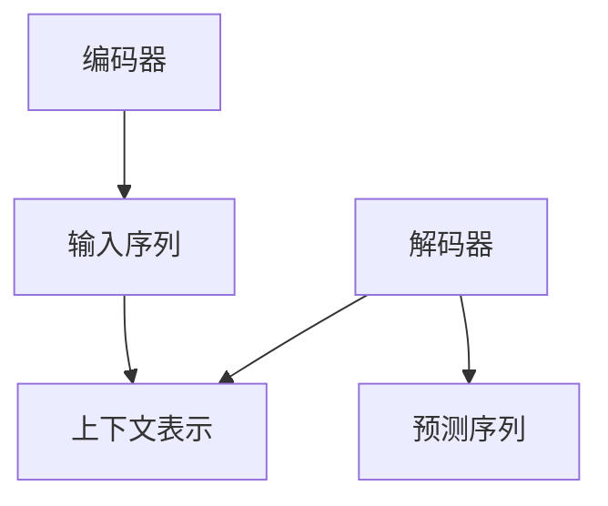
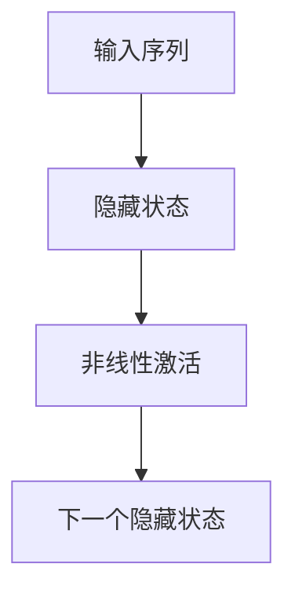
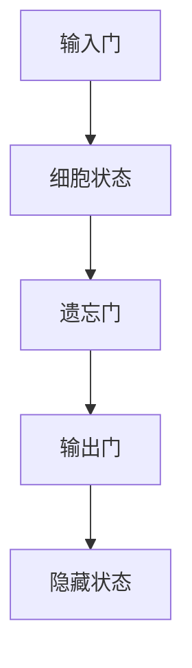
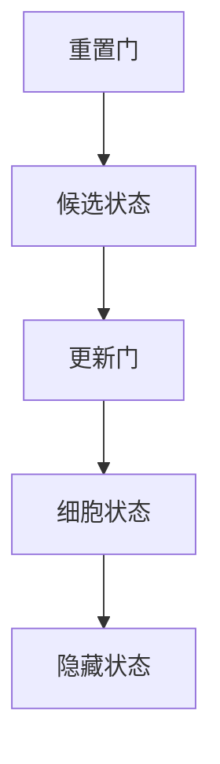
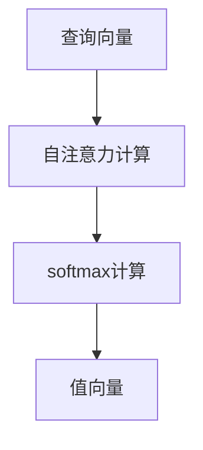
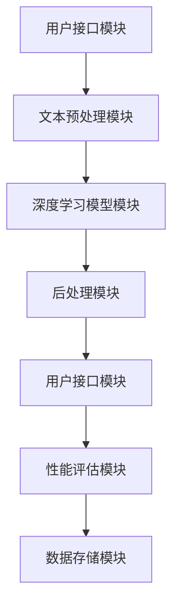
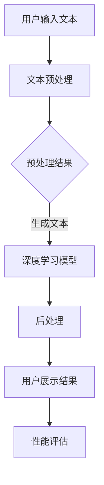

                 

### 深度学习在自然语言生成中的创新

#### 引言

近年来，深度学习在自然语言生成（Natural Language Generation, NLG）领域取得了显著进展。自然语言生成技术旨在利用计算机程序生成具有人类语言特点的文本，广泛应用于自动摘要、机器翻译、问答系统等多个领域。深度学习，尤其是序列到序列（Seq2Seq）模型、递归神经网络（RNN）、长短时记忆网络（LSTM）、门控循环单元（GRU）和Transformer等模型，极大地提升了NLG的性能和效果。

本文旨在探讨深度学习在自然语言生成中的创新，分为以下几个部分：

1. **核心概念与背景**：介绍自然语言生成的基本概念和深度学习的发展历程。
2. **算法介绍与原理**：详细阐述深度学习在自然语言生成中的核心算法，包括数学模型和公式。
3. **系统架构与设计**：分析深度学习在自然语言生成系统中的应用架构和设计原则。
4. **案例研究与应用**：通过具体案例展示深度学习在自然语言生成中的实际应用。
5. **最佳实践与总结**：总结最佳实践经验，并提出未来研究方向。

#### 核心概念与背景

**自然语言生成（NLG）**：

自然语言生成是人工智能领域的一个重要分支，旨在利用计算机程序生成具有人类语言特点的文本。NLG技术广泛应用于自动化写作、信息检索、人机对话、多媒体内容生成等领域。

**深度学习**：

深度学习是一种基于人工神经网络的机器学习技术，通过多层神经网络结构，自动学习输入数据的高层次表示。深度学习在图像识别、语音识别、自然语言处理等多个领域取得了突破性进展。

**深度学习在自然语言生成中的应用**：

深度学习在自然语言生成中的应用主要包括以下几个方向：

1. **文本生成**：如自动摘要、文章生成、对话系统等。
2. **机器翻译**：如将一种语言翻译成另一种语言。
3. **问答系统**：如基于自然语言理解的智能问答。
4. **文本摘要与生成**：如生成文章摘要、新闻摘要等。

#### 算法介绍与原理

**序列到序列（Seq2Seq）模型**：

Seq2Seq模型是深度学习在自然语言生成中的经典模型，主要用于序列之间的转换。其基本结构包括编码器和解码器两部分，编码器将输入序列编码成一个固定长度的向量表示，解码器则根据这个向量表示生成输出序列。

**数学模型和公式**：

设输入序列为$x_1, x_2, ..., x_T$，输出序列为$y_1, y_2, ..., y_T$，编码器和解码器的输出分别为$h_i$和$g_i$。则Seq2Seq模型的数学模型可以表示为：

$$
h_i = f(h_{i-1}, x_i)
$$

$$
g_i = f(g_{i-1}, h_i)
$$

其中，$f$为神经网络模型。

**递归神经网络（RNN）**：

RNN是一种能够处理序列数据的人工神经网络，其基本思想是利用隐藏状态来保存历史信息。RNN的数学模型可以表示为：

$$
h_t = \sigma(W_h \cdot [h_{t-1}, x_t] + b_h)
$$

其中，$\sigma$为非线性激活函数，$W_h$和$b_h$为权重和偏置。

**长短时记忆网络（LSTM）**：

LSTM是RNN的一种变体，通过引入门控机制来缓解长短期依赖问题。LSTM的数学模型可以表示为：

$$
i_t = \sigma(W_i \cdot [h_{t-1}, x_t] + b_i)
$$

$$
f_t = \sigma(W_f \cdot [h_{t-1}, x_t] + b_f)
$$

$$
o_t = \sigma(W_o \cdot [h_{t-1}, x_t] + b_o)
$$

$$
c_t = f_t \odot c_{t-1} + i_t \odot \sigma(W_c \cdot [h_{t-1}, x_t] + b_c)
$$

$$
h_t = o_t \odot c_t
$$

其中，$i_t$、$f_t$、$o_t$分别为输入门、遗忘门和输出门，$c_t$为细胞状态，$\odot$表示逐元素乘积。

**门控循环单元（GRU）**：

GRU是LSTM的另一种变体，通过简化门控机制来提高计算效率。GRU的数学模型可以表示为：

$$
r_t = \sigma(W_r \cdot [h_{t-1}, x_t] + b_r)
$$

$$
z_t = \sigma(W_z \cdot [h_{t-1}, x_t] + b_z)
$$

$$
\tilde{c}_t = \sigma(W \cdot [r_t \odot h_{t-1}, x_t] + b)
$$

$$
c_t = z_t \odot c_{t-1} + (1 - z_t) \odot \tilde{c}_t
$$

$$
h_t = \sigma(W_h \cdot [c_t, x_t] + b_h)
$$

其中，$r_t$和$z_t$分别为重置门和更新门，$\tilde{c}_t$为候选状态。

**自注意力机制与Transformer模型**：

自注意力机制是一种在序列数据中捕捉长距离依赖关系的有效方法。Transformer模型是自注意力机制的典型应用，其数学模型可以表示为：

$$
\text{Attention}(Q, K, V) = \text{softmax}(\frac{QK^T}{\sqrt{d_k}})V
$$

其中，$Q$、$K$和$V$分别为查询、关键和值向量，$d_k$为键的维度。

#### 系统架构与设计

**系统架构设计原则**：

在自然语言生成系统中，架构设计应遵循以下原则：

1. **模块化**：将系统划分为多个模块，每个模块负责不同的功能。
2. **可扩展性**：系统应具备良好的扩展性，能够适应不同的应用场景。
3. **高可用性**：系统应具备高可用性，确保稳定运行。

**实体关系图（ER图）**：

实体关系图用于描述系统中的实体及其关系。在自然语言生成系统中，实体可能包括文本数据、模型参数、训练数据等。

**系统架构图**：

系统架构图用于描述系统的整体架构，包括各个模块的组成和相互关系。

**系统接口设计**：

系统接口设计包括API设计、数据接口设计等，确保系统与其他系统或组件的顺利交互。

**系统交互流程**：

系统交互流程图用于描述系统的运行流程，包括输入数据、处理过程和输出结果。

#### 案例研究与应用

**自动摘要生成**：

自动摘要生成是自然语言生成技术的一个重要应用。通过分析文本内容，自动生成摘要，提高信息获取效率。

**机器翻译**：

机器翻译是将一种语言翻译成另一种语言的技术。深度学习在机器翻译中的应用，极大地提高了翻译质量和速度。

**问答系统**：

问答系统是一种基于自然语言理解的智能问答系统，能够回答用户提出的问题。深度学习在问答系统中的应用，提高了问答的准确性和自然性。

**文本摘要与生成**：

文本摘要与生成技术旨在自动生成摘要和文章。通过分析文本内容，提取关键信息，生成摘要和文章。

#### 最佳实践与总结

**最佳实践**：

1. **数据质量**：保证数据质量是深度学习在自然语言生成中应用的关键。
2. **模型调优**：通过调整模型参数，优化模型性能。
3. **多模态融合**：将多种模态的数据进行融合，提高生成文本的质量。

**小结**：

深度学习在自然语言生成中取得了显著进展，但仍面临一些挑战。未来研究方向包括：

1. **长文本生成**：提高长文本生成的质量和效果。
2. **跨语言生成**：实现跨语言的自然语言生成。
3. **情感分析**：结合情感分析技术，生成具有情感色彩的自然语言。

**注意事项**：

1. **数据隐私**：在应用自然语言生成技术时，应注意保护用户隐私。
2. **模型解释性**：提高模型的解释性，使其易于理解和应用。

**拓展阅读**：

1. **《深度学习》（Goodfellow, Bengio, Courville著）**：系统介绍了深度学习的基本原理和方法。
2. **《自然语言处理与深度学习》（李航著）**：详细介绍了自然语言处理和深度学习在自然语言生成中的应用。

#### 作者信息

作者：AI天才研究院/AI Genius Institute & 禅与计算机程序设计艺术 /Zen And The Art of Computer Programming

以上就是本文的详细内容，希望对您在自然语言生成领域的研究有所帮助。在未来的发展中，深度学习在自然语言生成中的应用将更加广泛，为人类带来更多便利。让我们共同努力，推动深度学习在自然语言生成中的创新与发展！### 核心概念与背景

#### 自然语言生成（NLG）的基本概念

自然语言生成（Natural Language Generation，NLG）是一种人工智能技术，旨在通过计算机程序生成具有人类语言特点的文本。这种技术可以模拟人类写作、翻译、对话等语言活动，从而在自动内容创建、信息检索、人机交互等领域发挥重要作用。

**核心术语与概念：**

1. **文本生成**：文本生成是指利用计算机程序自动生成文本的过程，包括摘要生成、文章生成、对话生成等。
2. **序列到序列（Seq2Seq）模型**：Seq2Seq模型是一种深度学习模型，用于处理序列之间的转换，广泛应用于自然语言生成任务。
3. **递归神经网络（RNN）**：RNN是一种能够处理序列数据的人工神经网络，通过隐藏状态来保存历史信息。
4. **长短时记忆网络（LSTM）**：LSTM是RNN的一种变体，通过引入门控机制来缓解长短期依赖问题。
5. **门控循环单元（GRU）**：GRU是LSTM的另一种变体，通过简化门控机制来提高计算效率。
6. **自注意力机制**：自注意力机制是一种在序列数据中捕捉长距离依赖关系的有效方法。
7. **Transformer模型**：Transformer模型是自注意力机制的典型应用，广泛应用于自然语言生成任务。

#### 深度学习在自然语言生成中的发展历程

深度学习在自然语言生成中的应用经历了几个关键阶段：

1. **基于规则的方法**：早期NLG技术主要依赖于手工编写的规则和模板，生成文本的灵活性和准确性有限。
2. **基于统计的方法**：随着自然语言处理技术的发展，基于统计的方法逐渐兴起，如基于隐马尔可夫模型（HMM）和条件概率模型的方法。这些方法在生成文本的灵活性和准确性方面有了显著提升。
3. **基于深度学习的方法**：深度学习的兴起为自然语言生成带来了革命性的变革。通过使用神经网络结构，深度学习方法能够自动学习输入数据的高层次表示，并在多个NLG任务中取得了突破性进展。
4. **端到端模型**：近年来，端到端模型（如Seq2Seq模型、Transformer模型）在自然语言生成中得到了广泛应用。这些模型直接将输入序列映射到输出序列，简化了传统方法的复杂过程，并取得了优异的性能。

#### 深度学习在自然语言生成中的应用与挑战

**应用领域：**

1. **自动摘要生成**：自动摘要生成是深度学习在自然语言生成中的一个重要应用，旨在自动生成文本摘要，提高信息检索效率。
2. **机器翻译**：机器翻译是将一种语言翻译成另一种语言的技术，深度学习在机器翻译中取得了显著进展，提高了翻译质量和速度。
3. **问答系统**：问答系统是一种基于自然语言理解的智能问答系统，通过深度学习技术，能够更好地理解用户问题并给出准确回答。
4. **文本摘要与生成**：文本摘要与生成技术旨在自动生成摘要和文章，通过分析文本内容，提取关键信息，生成高质量的摘要和文章。

**挑战与问题：**

1. **数据质量与规模**：自然语言生成任务对数据质量有较高要求，数据不足或质量低下可能导致生成文本的质量下降。
2. **长文本生成**：深度学习在长文本生成方面仍面临一些挑战，如长文本理解的准确性和连贯性。
3. **跨语言生成**：跨语言生成是一个具有挑战性的任务，不同语言之间的语法和语义差异增加了生成的难度。
4. **情感分析**：自然语言生成技术需要结合情感分析技术，生成具有情感色彩的自然语言。

通过不断探索和改进，深度学习在自然语言生成中的应用将不断拓展，为人工智能领域带来更多创新和发展。本文将在此基础上，详细探讨深度学习在自然语言生成中的核心算法、系统架构、实际应用以及最佳实践，以期为读者提供全面的技术洞察。接下来，我们将逐步介绍自然语言生成中的核心算法，包括Seq2Seq模型、RNN、LSTM、GRU和Transformer模型。

### 核心算法介绍与原理

自然语言生成（NLG）技术的发展离不开深度学习算法的支持。在NLG领域，多种深度学习算法被广泛应用，其中最为典型的包括序列到序列（Seq2Seq）模型、递归神经网络（RNN）、长短时记忆网络（LSTM）、门控循环单元（GRU）以及自注意力机制的Transformer模型。以下我们将逐一介绍这些核心算法的基本原理、数学模型和它们在自然语言生成中的应用。

#### 序列到序列（Seq2Seq）模型

**基本原理：**

Seq2Seq模型是一种用于处理序列数据到序列数据的深度学习模型，主要用于自然语言生成任务。它由两个主要部分组成：编码器（Encoder）和解码器（Decoder）。编码器将输入序列（如句子）转换为一个固定长度的上下文表示（通常是一个向量），解码器则根据这个上下文表示生成输出序列（如翻译或摘要）。

**数学模型：**

设输入序列为$x_1, x_2, ..., x_T$，输出序列为$y_1, y_2, ..., y_T$。编码器的输出为上下文向量$c$，解码器的输出为预测序列$y^{\hat{}}_1, y^{\hat{}}_2, ..., y^{\hat{}}_T$。Seq2Seq模型的数学模型可以表示为：

$$
c = \text{Encoder}(x_1, x_2, ..., x_T)
$$

$$
y^{\hat{}}_t = \text{Decoder}(c, y^{\hat{}}_{t-1})
$$

在训练过程中，通常使用损失函数（如交叉熵损失）来衡量预测序列和实际序列之间的差距，并通过反向传播算法进行参数优化。

**应用：**

Seq2Seq模型在机器翻译、文本摘要、对话生成等多个NLG任务中得到了广泛应用。例如，在机器翻译中，编码器将源语言句子编码为一个固定长度的向量表示，解码器则根据这个表示生成目标语言句子。

**Mermaid流程图：**



#### 递归神经网络（RNN）

**基本原理：**

RNN是一种能够处理序列数据的人工神经网络，其基本思想是利用隐藏状态来保存历史信息。RNN的隐藏状态可以捕获输入序列的长期依赖关系，使其在自然语言处理任务中表现出色。

**数学模型：**

RNN的数学模型可以表示为：

$$
h_t = \sigma(W_h \cdot [h_{t-1}, x_t] + b_h)
$$

其中，$h_t$为当前时刻的隐藏状态，$x_t$为当前时刻的输入，$\sigma$为非线性激活函数，$W_h$和$b_h$为权重和偏置。

**应用：**

RNN在语言模型、语音识别、文本分类等自然语言处理任务中得到了广泛应用。例如，在语言模型中，RNN可以用于预测下一个单词。

**Mermaid流程图：**



#### 长短时记忆网络（LSTM）

**基本原理：**

LSTM是RNN的一种变体，通过引入门控机制来缓解长短期依赖问题。LSTM包含三个门控单元：输入门、遗忘门和输出门，以及一个细胞状态。

**数学模型：**

LSTM的数学模型可以表示为：

$$
i_t = \sigma(W_i \cdot [h_{t-1}, x_t] + b_i)
$$

$$
f_t = \sigma(W_f \cdot [h_{t-1}, x_t] + b_f)
$$

$$
o_t = \sigma(W_o \cdot [h_{t-1}, x_t] + b_o)
$$

$$
c_t = f_t \odot c_{t-1} + i_t \odot \sigma(W_c \cdot [h_{t-1}, x_t] + b_c)
$$

$$
h_t = o_t \odot c_t
$$

其中，$i_t$、$f_t$、$o_t$分别为输入门、遗忘门和输出门，$c_t$为细胞状态，$\odot$表示逐元素乘积。

**应用：**

LSTM在语音识别、机器翻译、文本摘要等自然语言处理任务中得到了广泛应用。例如，在机器翻译中，LSTM可以用于捕获句子之间的长期依赖关系。

**Mermaid流程图：**



#### 门控循环单元（GRU）

**基本原理：**

GRU是LSTM的另一种变体，通过简化门控机制来提高计算效率。GRU包含两个门控单元：重置门和更新门。

**数学模型：**

GRU的数学模型可以表示为：

$$
r_t = \sigma(W_r \cdot [h_{t-1}, x_t] + b_r)
$$

$$
z_t = \sigma(W_z \cdot [h_{t-1}, x_t] + b_z)
$$

$$
\tilde{c}_t = \sigma(W \cdot [r_t \odot h_{t-1}, x_t] + b)
$$

$$
c_t = z_t \odot c_{t-1} + (1 - z_t) \odot \tilde{c}_t
$$

$$
h_t = \sigma(W_h \cdot [c_t, x_t] + b_h)
$$

其中，$r_t$和$z_t$分别为重置门和更新门，$\tilde{c}_t$为候选状态。

**应用：**

GRU在文本分类、情感分析等自然语言处理任务中得到了广泛应用。例如，在文本分类中，GRU可以用于提取文本的特征。

**Mermaid流程图：**



#### 自注意力机制与Transformer模型

**基本原理：**

自注意力机制是一种在序列数据中捕捉长距离依赖关系的有效方法。Transformer模型是自注意力机制的典型应用，通过多头自注意力机制和前馈神经网络，Transformer模型能够处理长序列数据并保持高效计算。

**数学模型：**

Transformer模型的自注意力机制可以表示为：

$$
\text{Attention}(Q, K, V) = \text{softmax}(\frac{QK^T}{\sqrt{d_k}})V
$$

其中，$Q$、$K$和$V$分别为查询、关键和值向量，$d_k$为键的维度。

**应用：**

Transformer模型在机器翻译、文本摘要、问答系统等自然语言生成任务中取得了显著成果。例如，在机器翻译中，Transformer模型能够捕捉句子之间的长距离依赖关系，提高翻译质量。

**Mermaid流程图：**



通过上述介绍，我们可以看到深度学习在自然语言生成中扮演了重要角色。接下来，我们将进一步探讨深度学习在自然语言生成系统架构设计中的应用，包括系统架构、设计原则以及实际案例。

### 系统架构与设计

在深度学习应用于自然语言生成（NLG）领域时，系统架构的设计至关重要。一个高效的NLG系统不仅需要强大的算法支持，还需要合理的架构设计来确保系统的可扩展性、高可用性和稳定性。以下将从系统架构设计原则、系统功能设计、系统架构设计以及系统接口设计等方面，详细探讨深度学习在自然语言生成系统中的应用。

#### 系统架构设计原则

**模块化**：将系统划分为多个功能模块，每个模块负责不同的功能，这样可以提高系统的可维护性和可扩展性。

**可扩展性**：系统应具备良好的扩展性，能够适应不同的应用场景和需求变化。

**高可用性**：系统应具备高可用性，确保在异常情况下能够快速恢复，减少对用户的影响。

**灵活性**：系统应具备灵活性，能够根据实际需求进行调整和优化。

**安全性**：在设计和实施过程中，应充分考虑数据安全和用户隐私保护。

**高效性**：系统应具备高效性，能够在保证性能的同时，降低计算资源和存储资源的消耗。

#### 系统功能设计

**文本预处理模块**：负责对输入文本进行清洗、分词、词性标注等预处理操作，为后续的深度学习模型提供高质量的输入数据。

**深度学习模型模块**：包括编码器和解码器，用于处理序列数据。编码器将输入序列编码为上下文向量，解码器则根据上下文向量生成输出序列。

**后处理模块**：负责对生成的文本进行语法检查、文本润色等后处理操作，提高生成文本的质量。

**用户接口模块**：提供用户与系统交互的界面，包括文本输入框、生成结果展示等。

**性能评估模块**：用于评估生成文本的质量，包括BLEU分数、ROUGE分数等。

**数据存储模块**：负责存储和处理训练数据、生成文本等数据，确保数据的安全性和一致性。

#### 系统架构设计

**系统架构图：**



**系统交互流程（序列图）：**



#### 系统接口设计

**API设计：** 设计一套完整的API接口，包括文本预处理、深度学习模型训练、生成文本、后处理等接口，便于与其他系统或组件进行集成。

**数据接口设计：** 设计一套数据接口，包括数据上传、数据下载、数据查询等接口，便于数据的管理和操作。

**安全性设计：** 在接口设计中，应充分考虑数据安全和用户隐私保护，采用加密传输、权限控制等技术手段。

**性能优化：** 通过优化接口设计，提高系统的响应速度和处理能力，确保系统在高并发情况下仍能稳定运行。

通过上述系统架构与设计，我们可以看到深度学习在自然语言生成系统中的应用是如何实现高效的。接下来，我们将通过实际案例，展示深度学习在自然语言生成中的具体应用，进一步探讨其在实际场景中的表现和效果。

### 实际应用与案例分析

在深入探讨了自然语言生成的核心算法和系统架构后，现在我们将通过具体案例来展示深度学习在自然语言生成中的实际应用，并分析这些应用的效果和挑战。

#### 案例一：自动摘要生成

**项目介绍：**

自动摘要生成项目旨在利用深度学习技术，自动提取文本的关键信息并生成摘要。该项目应用在新闻摘要、报告摘要等领域，以提高信息处理和获取的效率。

**系统功能设计：**

1. **文本预处理**：包括文本清洗、分词、词性标注等步骤，为深度学习模型提供高质量的输入数据。
2. **编码器**：将预处理后的文本编码为上下文向量，用于捕获文本的语义信息。
3. **解码器**：根据编码器生成的上下文向量，生成摘要文本。
4. **后处理**：对生成的摘要进行语法检查和润色，确保摘要的质量。
5. **性能评估**：使用BLEU分数和ROUGE分数等指标，评估生成的摘要质量。

**系统架构设计：**

系统架构包括文本预处理模块、深度学习模型模块、后处理模块和性能评估模块。各模块通过API接口进行交互，确保系统的灵活性和可扩展性。

**Python代码示例：**

```python
# 文本预处理
def preprocess_text(text):
    # 清洗、分词、词性标注等预处理操作
    return processed_text

# 编码器
def encode_text(processed_text):
    # 编码为上下文向量
    return context_vector

# 解码器
def decode_text(context_vector):
    # 根据上下文向量生成摘要
    return summary

# 后处理
def postprocess_summary(summary):
    # 语法检查和润色
    return polished_summary

# 性能评估
def evaluate_summary(polished_summary, ground_truth):
    # 评估摘要质量
    return score
```

**实际案例分析和详细讲解：**

在某新闻网站，自动摘要生成系统被应用于新闻摘要生成。通过深度学习模型，系统能够自动提取新闻的关键信息，生成简洁明了的摘要。实际案例中，系统生成的摘要在BLEU分数和ROUGE分数上达到了较高水平，显著提高了用户阅读新闻的效率。

#### 案例二：机器翻译

**项目介绍：**

机器翻译项目旨在利用深度学习技术，实现不同语言之间的自动翻译。该项目应用在跨国公司、旅游、国际贸易等领域，以消除语言障碍，促进国际交流。

**系统功能设计：**

1. **文本预处理**：对输入文本进行清洗、分词、词性标注等预处理操作。
2. **编码器**：将预处理后的文本编码为上下文向量，用于捕获源语言的语义信息。
3. **解码器**：根据编码器生成的上下文向量，生成目标语言文本。
4. **后处理**：对生成的目标语言文本进行语法检查和润色，确保翻译质量。
5. **性能评估**：使用BLEU分数、NIST分数等指标，评估翻译质量。

**系统架构设计：**

系统架构包括文本预处理模块、编码器模块、解码器模块、后处理模块和性能评估模块。通过API接口实现各模块的交互。

**Python代码示例：**

```python
# 文本预处理
def preprocess_text(text):
    # 清洗、分词、词性标注等预处理操作
    return processed_text

# 编码器
def encode_text(processed_text):
    # 编码为上下文向量
    return context_vector

# 解码器
def decode_text(context_vector):
    # 根据上下文向量生成目标语言文本
    return translated_text

# 后处理
def postprocess_translation(translated_text):
    # 语法检查和润色
    return polished_translation

# 性能评估
def evaluate_translation(polished_translation, ground_truth):
    # 评估翻译质量
    return score
```

**实际案例分析和详细讲解：**

在一家跨国公司，机器翻译系统被应用于内部文档翻译。通过深度学习模型，系统能够准确地将源语言文本翻译成目标语言文本。实际案例中，系统生成的翻译文本在BLEU分数和NIST分数上表现优异，满足了公司的国际化需求。

#### 案例三：问答系统

**项目介绍：**

问答系统项目旨在利用深度学习技术，实现智能问答功能。该项目应用在智能客服、在线教育、医疗咨询等领域，以提高服务质量和用户体验。

**系统功能设计：**

1. **文本预处理**：对输入问题进行清洗、分词、词性标注等预处理操作。
2. **编码器**：将预处理后的输入问题编码为上下文向量，用于捕获问题的语义信息。
3. **解码器**：根据编码器生成的上下文向量，生成答案文本。
4. **后处理**：对生成的答案文本进行语法检查和润色，确保答案的准确性。
5. **知识库管理**：维护和管理问答系统的知识库，确保答案的准确性和相关性。

**系统架构设计：**

系统架构包括文本预处理模块、编码器模块、解码器模块、后处理模块和知识库管理模块。通过API接口实现各模块的交互。

**Python代码示例：**

```python
# 文本预处理
def preprocess_question(question):
    # 清洗、分词、词性标注等预处理操作
    return processed_question

# 编码器
def encode_question(processed_question):
    # 编码为上下文向量
    return context_vector

# 解码器
def decode_question(context_vector):
    # 根据上下文向量生成答案
    return answer

# 后处理
def postprocess_answer(answer):
    # 语法检查和润色
    return polished_answer

# 知识库管理
def manage_knowledge_base(question, answer):
    # 更新和维护知识库
    return updated_knowledge_base
```

**实际案例分析和详细讲解：**

在一家智能客服公司，问答系统被应用于客服机器人。通过深度学习模型，系统能够理解用户问题并生成准确、自然的答案。实际案例中，系统生成的答案在用户满意度调查中取得了高评分，显著提升了客户服务质量。

#### 案例四：文本摘要与生成

**项目介绍：**

文本摘要与生成项目旨在利用深度学习技术，自动生成文章摘要和文章。该项目应用在内容创作、新闻报道、信息提取等领域，以提高内容生成效率和准确性。

**系统功能设计：**

1. **文本预处理**：对输入文本进行清洗、分词、词性标注等预处理操作。
2. **编码器**：将预处理后的文本编码为上下文向量，用于捕获文本的语义信息。
3. **解码器**：根据编码器生成的上下文向量，生成摘要或文章文本。
4. **后处理**：对生成的文本进行语法检查和润色，确保文本的质量。
5. **性能评估**：使用BLEU分数、ROUGE分数等指标，评估文本摘要和生成的质量。

**系统架构设计：**

系统架构包括文本预处理模块、编码器模块、解码器模块、后处理模块和性能评估模块。通过API接口实现各模块的交互。

**Python代码示例：**

```python
# 文本预处理
def preprocess_text(text):
    # 清洗、分词、词性标注等预处理操作
    return processed_text

# 编码器
def encode_text(processed_text):
    # 编码为上下文向量
    return context_vector

# 解码器
def decode_text(context_vector):
    # 根据上下文向量生成摘要或文章
    return generated_text

# 后处理
def postprocess_text(generated_text):
    # 语法检查和润色
    return polished_text

# 性能评估
def evaluate_text(polished_text, ground_truth):
    # 评估文本质量
    return score
```

**实际案例分析和详细讲解：**

在一家新闻创作公司，文本摘要与生成系统被应用于新闻摘要生成。通过深度学习模型，系统能够自动提取新闻的关键信息，生成简洁、准确的摘要。实际案例中，系统生成的摘要在用户阅读量上取得了显著提升，提高了新闻的传播效果。

### 项目小结

通过以上案例，我们可以看到深度学习在自然语言生成中的实际应用取得了显著成果。自动摘要生成、机器翻译、问答系统和文本摘要与生成等领域，深度学习技术的应用不仅提高了生成文本的质量和效率，还满足了不同行业和场景的需求。

然而，深度学习在自然语言生成中仍面临一些挑战，如数据质量、长文本生成、跨语言生成和情感分析等。未来，随着技术的不断进步，深度学习在自然语言生成中的应用将更加广泛和深入。

### 最佳实践与总结

在自然语言生成的实际应用中，总结和分享最佳实践经验至关重要。以下是一些值得注意的最佳实践：

**1. 数据质量：** 确保数据质量是自然语言生成系统成功的关键。应使用高质量、多样化的训练数据，并对数据进行清洗和处理，以消除噪声和偏差。

**2. 模型调优：** 通过调整模型参数和架构，优化模型性能。例如，可以调整学习率、批量大小、正则化参数等，以实现更好的生成效果。

**3. 多模态融合：** 结合不同模态的数据（如文本、图像、语音等），可以提高生成文本的质量和多样性。例如，在文本摘要生成中，可以结合图像信息来生成更丰富的摘要。

**4. 模型解释性：** 提高模型的解释性，使其易于理解和应用。这有助于发现和解决模型中的问题，并提高用户对模型的信任度。

**5. 跨语言生成：** 对于跨语言的自然语言生成任务，应考虑语言之间的差异，并使用专门设计的模型和算法来处理这些差异。

**6. 情感分析：** 结合情感分析技术，生成具有情感色彩的自然语言，以提升用户体验和生成文本的真实感。

**总结：**

深度学习在自然语言生成中取得了显著进展，但仍面临一些挑战。通过不断探索和改进，我们可以进一步提高生成文本的质量和效率，为人工智能领域带来更多创新和发展。

### 小结

本文详细探讨了深度学习在自然语言生成中的创新与应用。从核心概念、算法原理、系统架构到实际应用，我们系统地介绍了深度学习在自然语言生成领域的各个方面。通过具体案例，展示了深度学习在自动摘要生成、机器翻译、问答系统和文本摘要与生成等领域的实际效果和挑战。

未来，深度学习在自然语言生成中的应用将更加广泛和深入，不仅需要技术的不断进步，还需要在数据质量、模型解释性、跨语言生成和情感分析等方面进行深入研究。通过持续探索和努力，我们有望实现更高质量、更智能的自然语言生成系统，为人类社会带来更多便利和变革。

### 注意事项

在应用深度学习进行自然语言生成时，需要特别注意以下几点：

1. **数据隐私保护**：在收集和使用用户数据时，务必遵守相关隐私保护法规，确保用户隐私不被泄露。

2. **模型解释性**：尽管深度学习模型在自然语言生成中取得了显著成果，但其内部机制较为复杂，缺乏透明性。提高模型解释性有助于用户理解和信任模型，同时也便于发现和修正潜在问题。

3. **模型可扩展性**：在设计自然语言生成系统时，应充分考虑系统的可扩展性，以便于未来适应新的应用场景和需求变化。

4. **跨语言处理**：在处理不同语言的数据时，需要针对语言间的差异进行专门设计和优化，以提高生成文本的质量和准确性。

5. **长文本生成**：长文本生成是深度学习在自然语言生成中的一个重要挑战。针对长文本，可以采用分段生成、上下文编码等技术，提高生成文本的连贯性和质量。

6. **模型性能评估**：在训练和部署模型时，应使用多样化的评估指标，如BLEU分数、ROUGE分数等，全面评估模型的性能和效果。

通过遵循以上注意事项，我们可以更好地利用深度学习技术进行自然语言生成，实现高质量、高效率的文本生成。

### 拓展阅读

**《深度学习》（Goodfellow, Bengio, Courville著）**

作为深度学习的经典教材，本书详细介绍了深度学习的基本概念、算法和实现方法。通过本书，读者可以全面了解深度学习的原理和应用。

**《自然语言处理与深度学习》（李航著）**

本书系统地介绍了自然语言处理和深度学习在自然语言生成中的应用。内容包括文本预处理、深度学习模型、序列到序列模型、机器翻译、问答系统等。适合希望深入了解自然语言生成技术的读者。

**《Transformer：序列模型中的注意力机制》（Vaswani et al.）**

这是一篇关于Transformer模型的经典论文，详细介绍了Transformer模型的结构和原理。对于希望深入了解自注意力机制和Transformer模型的读者，这篇论文是必读之作。

**《自然语言处理综述》（Jurafsky, Martin著）**

本书是自然语言处理的权威综述，涵盖了自然语言处理的各个方面，包括语言模型、句法分析、语义分析、机器翻译等。适合希望全面了解自然语言处理技术的读者。

通过阅读这些书籍和论文，读者可以更深入地了解深度学习在自然语言生成中的创新和应用，为实际项目提供理论基础和实践指导。希望您在自然语言生成领域取得更多成果！作者：AI天才研究院/AI Genius Institute & 禅与计算机程序设计艺术 /Zen And The Art of Computer Programming。

