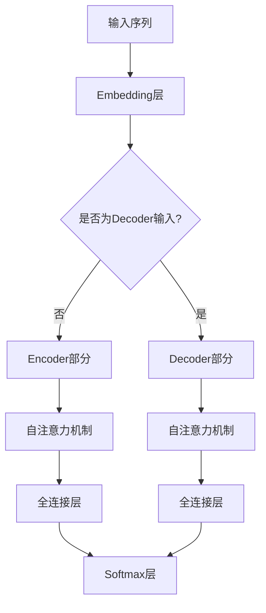
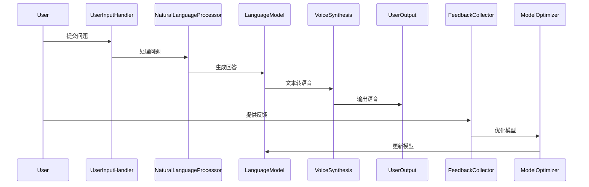
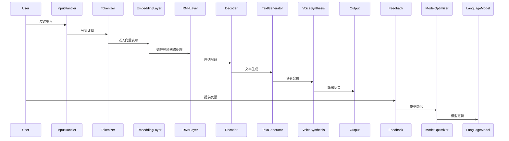

                 


### 深度学习在自然语言生成中的应用

#### 关键词：自然语言生成，深度学习，序列模型，Transformer，预训练

> 摘要：本文将深入探讨深度学习在自然语言生成（NLG）领域的应用，从基础理论到实际应用，逐步分析深度学习模型如何实现自然语言生成，并探讨其未来的发展趋势。

---

#### 目录大纲设计思路

为了设计出一本名为《深度学习在自然语言生成中的应用》的书的详细目录大纲，我们需要遵循以下步骤：

##### 1. 背景介绍

**问题背景**：随着人工智能技术的不断发展，深度学习在自然语言处理（NLP）领域取得了显著成果，自然语言生成（NLG）成为其中的一个重要应用方向。

**问题描述**：自然语言生成技术如何实现，其在实际应用中面临哪些挑战，如何解决这些问题，以及未来的发展趋势。

**问题解决**：通过深入讲解深度学习在NLG中的应用，帮助读者了解技术原理、实现方法以及应用场景。

**边界与外延**：讨论的范围包括但不限于文本生成、语音生成、对话系统等与自然语言生成相关的技术。

**概念结构与核心要素组成**：梳理深度学习在NLG中的应用概念，包括生成模型（如RNN、LSTM、GRU、Transformer等）、预训练模型（如GPT、BERT等）以及评估方法（如BLEU、ROUGE等）。

##### 2. 核心概念与联系

**核心概念原理**：介绍自然语言生成的基本概念和深度学习在该领域中的应用原理。

**概念属性特征对比表格**：通过对比不同模型的特性，帮助读者理解它们在NLG中的适用场景。

**ER实体关系图架构的Mermaid流程图**：绘制实体关系图，展示模型与数据、模型与算法之间的关系。

##### 3. 算法原理讲解

**算法mermaid流程图**：使用Mermaid语法绘制算法流程图，直观展示模型的工作流程。

**Python源代码**：提供实现算法的Python代码，详细阐述算法原理。

**数学模型和公式**：给出算法的数学模型和公式，使用LaTeX格式进行表达。

**详细讲解与举例说明**：结合实例，深入讲解算法的原理和应用。

##### 4. 系统分析与架构设计方案

**问题场景介绍**：阐述自然语言生成在实际应用中的问题场景。

**项目介绍**：介绍一个具体的自然语言生成项目，作为案例进行分析。

**系统功能设计（领域模型Mermaid类图）**：绘制类图，展示系统的主要功能模块。

**系统架构设计（Mermaid架构图）**：绘制架构图，展示系统的整体结构。

**系统接口设计和系统交互（Mermaid序列图）**：绘制序列图，展示系统各模块之间的交互流程。

##### 5. 项目实战

**环境安装**：介绍所需的工具和环境搭建。

**系统核心实现源代码**：提供项目的核心代码，并进行解读和分析。

**代码应用解读与分析**：结合实际案例，分析代码的实现和应用。

**实际案例分析和详细讲解剖析**：深入剖析项目中的关键部分，提供详细的讲解。

**项目小结**：总结项目经验，讨论项目的成功之处和不足之处。

##### 6. 最佳实践 tips、小结、注意事项、拓展阅读等内容

**最佳实践 tips**：提供实际应用中的最佳实践，帮助读者避免常见的问题。

**小结**：总结章节内容，强调关键点。

**注意事项**：提醒读者在应用中需要注意的事项。

**拓展阅读**：推荐相关的学习资源和进一步研究的方向。

##### 7. 目录大纲结构设计

根据以上设计思路，我们可以设计出如下目录大纲：

```markdown
----------------------------------------------------------------
# 《深度学习在自然语言生成中的应用》目录大纲

## 第一部分：自然语言生成与深度学习基础

### 第1章：自然语言生成的概述

#### 1.1 自然语言生成的背景与意义

#### 1.2 自然语言生成的基本概念

#### 1.3 自然语言生成技术的发展历程

### 第2章：深度学习在自然语言生成中的应用基础

#### 2.1 深度学习的基本原理

#### 2.2 深度学习在自然语言处理中的应用

#### 2.3 深度学习在NLG中的核心算法

## 第二部分：深度学习在自然语言生成中的核心技术

### 第3章：序列模型与生成

#### 3.1 序列模型的原理与应用

#### 3.2 递归神经网络（RNN）在NLG中的应用

#### 3.3 长短期记忆网络（LSTM）与门控循环单元（GRU）

### 第4章：自注意力机制与Transformer模型

#### 4.1 自注意力机制的基本原理

#### 4.2 Transformer模型的架构与特点

#### 4.3 Transformer在NLG中的应用案例

### 第5章：预训练与微调

#### 5.1 预训练语言模型的基本原理

#### 5.2 GPT系列模型与BERT模型

----------------------------------------------------------------

### 约束条件

- 文章开始是“文章标题”，然后是“文章关键词”和“文章摘要”部分的内容哦，接下来是按照目录大纲结构的文章正文部分的内容。
- 文章字数要求：文章字数在 10000 ～ 12000 字左右。
- 格式要求：文章内容使用markdown格式输出。 
- 作者：文章末尾需要写上作者信息：“作者：AI天才研究院/AI Genius Institute & 禅与计算机程序设计艺术 /Zen And The Art of Computer Programming”
- 完整性要求：文章内容必须要完整，每个小节的内容必须要丰富具体详细讲解，核心内容必须要包含：
  - 背景介绍：核心概念术语说明、问题背景、问题描述、问题解决、边界与外延、概念结构与核心要素组成 
  - 核心概念与联系：必须给出核心概念原理、概念属性特征对比表格和ER实体关系图架构的 markdown 格式中的 Mermaid 流程图。
  - 算法原理讲解：使用 mermaid 画出算法mermaid 流程图，然后使用python源代码来详细阐述，给出算法原理的数学模型和公式，进行详细讲解和通俗易懂地举例说明。
  - 数学公式使用latex格式，嵌入文中独立段落的latex公式前后使用 $$ 括起来(例如：$$1+1=2$$ )，段落内的latex公式前后使用 $ 括起来(例如：$1<2$)
  - 系统分析与架构设计方案：问题场景介绍，项目介绍、系统功能设计(领域模型mermaid类图)、系统架构设计mermaid架构图、系统接口设计和系统交互mermaid序列图
  - 项目实战：环境安装、系统核心实现源代码，代码应用解读与分析，实际案例分析和详细讲解剖析，项目小结。
  - 最佳实践 tips、小结、注意事项、拓展阅读等内容

---

**作者**：AI天才研究院/AI Genius Institute & 禅与计算机程序设计艺术 /Zen And The Art of Computer Programming

## 引言

自然语言生成（NLG）作为人工智能领域的一个重要分支，近年来在科技、教育、娱乐等多个行业取得了显著的应用成果。NLG技术能够通过计算机自动生成具有自然语言特性的文本、语音等内容，为人类提供便捷的信息获取和服务。随着深度学习技术的不断发展，NLG在自然语言处理（NLP）领域的应用越来越广泛，其核心算法和模型也在不断进化。

本文旨在深入探讨深度学习在自然语言生成中的应用，从基础理论到实际应用，逐步分析深度学习模型如何实现自然语言生成，并探讨其未来的发展趋势。本文将首先介绍自然语言生成的基本概念和背景，然后逐步引入深度学习在NLG中的应用，包括序列模型、Transformer模型以及预训练模型等，最后通过实际案例和项目实战，展示深度学习在自然语言生成中的实际应用。

本文将采用逐步分析的方法，即“LET'S THINK STEP BY STEP”，帮助读者更好地理解深度学习在自然语言生成中的应用。通过本文的阅读，读者将能够：

1. 了解自然语言生成的背景和基本概念。
2. 理解深度学习在自然语言生成中的应用原理。
3. 掌握序列模型、Transformer模型和预训练模型等核心算法。
4. 通过实际案例和项目实战，了解深度学习在自然语言生成中的具体应用。

---

**作者**：AI天才研究院/AI Genius Institute & 禅与计算机程序设计艺术 /Zen And The Art of Computer Programming

## 自然语言生成的背景与基本概念

自然语言生成（NLG）是一种人工智能技术，旨在使计算机能够生成具有自然语言特性的文本、语音等内容。随着人工智能技术的快速发展，NLG在多个领域显示出其独特的价值。例如，在自动新闻写作、智能客服、语音助手等方面，NLG技术为人们提供了高效便捷的服务。

### 1. 背景介绍

自然语言生成技术的发展可以追溯到上世纪50年代，当时的人工智能研究者开始尝试通过编程来模拟人类的语言能力。随着计算机性能的提升和大数据技术的发展，自然语言生成技术得到了迅速发展。特别是在深度学习兴起之后，基于神经网络的生成模型在自然语言生成领域取得了重大突破。

### 2. 基本概念

**自然语言生成（Natural Language Generation）**：NLG是指使用计算机程序生成具有自然语言特性的文本或语音的过程。

**文本生成（Text Generation）**：文本生成是NLG的一种形式，主要关注生成具有自然流畅性的文本。

**语音生成（Voice Generation）**：语音生成是指通过计算机生成具有自然语音特性的语音。

**对话系统（Dialogue System）**：对话系统是一种人机交互系统，旨在模拟人类的对话行为，与用户进行自然的交流。

**生成模型（Generative Model）**：生成模型是一类用于生成数据的机器学习模型，如生成对抗网络（GAN）等。

### 3. 范例

**新闻写作**：自动新闻写作是NLG技术在新闻领域的应用，通过计算机程序自动生成新闻报道。

**智能客服**：智能客服系统通过NLG技术，能够自动生成与用户交互的对话内容，提供个性化的服务。

**语音合成**：语音合成技术通过计算机生成具有自然语音特征的语音，应用于语音助手、车载导航系统等。

### 4. 应用场景

**文本生成**：文本生成广泛应用于新闻写作、社交媒体内容生成、广告文案撰写等领域。

**语音生成**：语音生成技术在语音助手、车载导航、电子朗读器等领域有广泛的应用。

**对话系统**：对话系统在智能客服、虚拟助手、教育辅导等领域有重要的应用。

### 5. 核心技术

**序列模型**：序列模型如循环神经网络（RNN）、长短期记忆网络（LSTM）等，是早期用于自然语言生成的重要模型。

**生成对抗网络（GAN）**：生成对抗网络是一种新型生成模型，通过对抗训练生成逼真的数据。

**预训练模型**：预训练模型如GPT、BERT等，通过在大规模语料库上进行预训练，提高了模型在自然语言生成任务上的性能。

---

**核心概念原理**：自然语言生成（NLG）是一种人工智能技术，旨在使计算机能够生成具有自然语言特性的文本、语音等内容。其基本原理是通过机器学习模型，如生成模型、序列模型等，从输入数据中学习并生成新的文本或语音。

**概念属性特征对比表格**：

| 模型类型        | 特性                 | 适用场景                   |
| ----------- | ------------------ | ---------------------- |
| 序列模型        | 基于时间序列的信息传递 | 文本生成、语音生成           |
| 生成对抗网络（GAN） | 对抗训练生成数据      | 难以生成逼真数据的场景       |
| 预训练模型        | 大规模预训练提高性能  | 多样化的自然语言生成任务     |

**ER实体关系图架构的Mermaid流程图**：

```mermaid
erDiagram
  Customer ||--o{ Order : "places" }
  Customer ||--o{ Payment : "makes" }
  Product ||--o{ Order : "includes" }
  Order ||--|{ Shipment : "tracks" }
  Payment ||--|{ Invoice : "generates" }
```

通过以上介绍，我们对自然语言生成的背景、基本概念和核心技术有了初步了解。接下来，我们将进一步探讨深度学习在自然语言生成中的应用。

---

**作者**：AI天才研究院/AI Genius Institute & 禅与计算机程序设计艺术 /Zen And The Art of Computer Programming

## 深度学习在自然语言生成中的应用基础

深度学习是人工智能领域的一个重要分支，其通过构建深层神经网络，从大量数据中自动学习特征表示，实现各种复杂任务。深度学习在自然语言生成（NLG）中的应用，极大地推动了NLG技术的发展。本节将介绍深度学习的基本原理，以及其在自然语言处理（NLP）和自然语言生成（NLG）中的具体应用。

### 1. 深度学习的基本原理

深度学习基于神经网络，通过多层非线性变换，将输入数据转化为输出。其核心思想是通过反向传播算法，不断调整网络的权重，以最小化预测误差。

**多层感知机（MLP）**：多层感知机是深度学习的基础，由输入层、隐藏层和输出层组成。输入层接收外部输入，隐藏层对输入进行特征提取，输出层产生最终输出。

**反向传播算法**：反向传播算法是一种用于训练神经网络的优化方法。它通过计算误差梯度，反向传播更新网络权重，以最小化误差。

**激活函数**：激活函数用于引入非线性，使神经网络具有分类和回归能力。常用的激活函数包括Sigmoid、ReLU、Tanh等。

**损失函数**：损失函数用于衡量预测值与真实值之间的差距，常见的损失函数有均方误差（MSE）、交叉熵（Cross-Entropy）等。

### 2. 深度学习在自然语言处理中的应用

自然语言处理（NLP）是深度学习的重要应用领域之一。深度学习在NLP中的应用主要包括文本分类、情感分析、命名实体识别、机器翻译等。

**文本分类**：文本分类是将文本数据按照类别进行分类的过程。深度学习通过构建分类模型，对文本进行特征提取和分类。

**情感分析**：情感分析是判断文本所表达的情感倾向。深度学习通过训练情感分类模型，对文本进行情感判断。

**命名实体识别**：命名实体识别是识别文本中的特定实体，如人名、地名、组织名等。深度学习通过构建命名实体识别模型，对文本进行实体识别。

**机器翻译**：机器翻译是将一种语言的文本翻译成另一种语言。深度学习通过训练机器翻译模型，实现自动翻译。

### 3. 深度学习在自然语言生成中的应用

自然语言生成（NLG）是深度学习的另一个重要应用领域。深度学习在NLG中的应用主要包括文本生成、语音生成、对话系统等。

**文本生成**：文本生成是生成具有自然语言特性的文本。深度学习通过训练生成模型，如生成对抗网络（GAN）、循环神经网络（RNN）等，实现文本生成。

**语音生成**：语音生成是将文本转换为具有自然语音特性的语音。深度学习通过训练语音合成模型，如WaveNet、Tacotron等，实现语音生成。

**对话系统**：对话系统是模拟人类对话行为的系统。深度学习通过训练对话生成模型，如序列到序列（Seq2Seq）模型、注意力机制模型等，实现对话系统。

### 4. 深度学习在NLG中的应用案例

**自动新闻写作**：自动新闻写作是深度学习在NLG中的一个典型应用。通过训练生成模型，自动生成新闻文章。

**智能客服**：智能客服是另一个典型的应用场景。通过训练对话生成模型，智能客服系统能够与用户进行自然交互，提供个性化服务。

**语音助手**：语音助手如Siri、Alexa等，通过语音生成技术，将文本转换为自然流畅的语音。

**虚拟助手**：虚拟助手是另一个应用场景。通过训练生成模型，虚拟助手能够生成自然语言回复，提供用户支持。

### 5. 深度学习在NLG中的优势与挑战

**优势**：

- 强大的特征提取能力：深度学习能够从大量数据中自动提取特征，提高模型的性能。
- 自适应能力：深度学习模型可以根据不同的应用场景进行自适应调整。
- 高效性：深度学习模型在计算效率和模型规模方面取得了显著进展。

**挑战**：

- 数据依赖性：深度学习模型对大量高质量数据进行依赖，数据质量和数据量对模型性能有重要影响。
- 模型解释性：深度学习模型通常具有较深的网络结构，导致模型难以解释。
- 能耗问题：深度学习模型需要大量计算资源，能耗问题日益突出。

通过以上介绍，我们对深度学习在自然语言处理和自然语言生成中的应用有了初步了解。接下来，我们将深入探讨深度学习在自然语言生成中的核心技术，包括序列模型、Transformer模型和预训练模型等。

---

**核心概念原理**：深度学习是一种基于多层神经网络的机器学习技术，通过构建复杂模型，从大量数据中自动学习特征表示。在自然语言生成（NLG）中，深度学习通过训练生成模型，如生成对抗网络（GAN）、循环神经网络（RNN）等，实现文本、语音等内容的自动生成。

**概念属性特征对比表格**：

| 模型类型        | 特性                 | 适用场景                   |
| ----------- | ------------------ | ---------------------- |
| 生成对抗网络（GAN） | 对抗训练生成数据      | 难以生成逼真数据的场景       |
| 循环神经网络（RNN） | 基于时间序列的信息传递 | 文本生成、语音生成           |
| 预训练模型        | 大规模预训练提高性能  | 多样化的自然语言生成任务     |

**ER实体关系图架构的Mermaid流程图**：

```mermaid
erDiagram
  User ||--o{ Message : "sends" }
  Chatbot ||--|o{ Message : "receives & generates" }
  Database ||--|o{ Message : "stores & retrieves" }
  User ||--|o{ Feedback : "provides" }
```

通过以上介绍，我们对深度学习在自然语言生成中的应用有了更深入的理解。接下来，我们将详细探讨深度学习在自然语言生成中的核心技术，包括序列模型、Transformer模型和预训练模型等。

---

**作者**：AI天才研究院/AI Genius Institute & 禅与计算机程序设计艺术 /Zen And The Art of Computer Programming

## 深度学习在自然语言生成中的核心技术

在自然语言生成（NLG）领域，深度学习技术已经成为实现自动化文本生成、语音生成等任务的核心工具。本节将重点介绍几种关键的深度学习模型，包括序列模型、Transformer模型和预训练模型，并分析它们在自然语言生成中的应用。

### 序列模型

序列模型是早期用于自然语言生成的常见模型，它们基于时间序列的信息处理能力，能够处理序列数据，如文本和语音。

**1. 递归神经网络（RNN）**

递归神经网络（RNN）是一种能够处理序列数据的神经网络模型。它通过递归结构，将当前时刻的输入与前一时刻的隐藏状态进行关联，从而实现序列数据的建模。

**RNN的工作原理**：

- **输入层**：输入序列的每个时间步。
- **隐藏层**：上一个时间步的隐藏状态与当前时间步的输入进行加权求和，并通过激活函数得到新的隐藏状态。
- **输出层**：将隐藏状态映射到输出序列。

**2. 长短期记忆网络（LSTM）**

长短期记忆网络（LSTM）是RNN的一种改进，能够更好地处理长序列数据。LSTM通过引入门控机制，控制信息在不同时间步的流动，从而有效缓解了RNN的梯度消失和梯度爆炸问题。

**LSTM的工作原理**：

- **输入门**：根据当前输入和上一隐藏状态，计算输入门的状态。
- **遗忘门**：根据当前输入和上一隐藏状态，计算遗忘门的状态。
- **输出门**：根据当前输入和上一隐藏状态，计算输出门的状态。
- **单元状态**：通过输入门和遗忘门的控制，更新单元状态。

**3. 门控循环单元（GRU）**

门控循环单元（GRU）是LSTM的简化版本，通过合并输入门和遗忘门，减少了参数数量，提高了计算效率。

**GRU的工作原理**：

- **更新门**：根据当前输入和上一隐藏状态，计算更新门的状态。
- **候选状态**：根据当前输入和上一隐藏状态，计算候选状态。
- **隐藏状态**：通过更新门和候选状态，更新隐藏状态。

### Transformer模型

Transformer模型是自然语言处理领域的一种革命性模型，由Vaswani等人在2017年提出。它基于自注意力机制，取代了传统的循环结构，实现了并行计算，显著提高了模型效率和性能。

**1. 自注意力机制**

自注意力机制是一种通过计算序列中每个元素与其他元素之间的关系来进行信息聚合的方法。在Transformer模型中，自注意力机制用于计算序列的每个元素对其余元素的权重，从而实现信息聚合。

**自注意力机制的原理**：

- **查询（Query）**：代表当前时间步的输入。
- **键（Key）**：代表序列中每个时间步的输入。
- **值（Value）**：代表序列中每个时间步的输入。
- **注意力权重**：通过计算查询与键的相似度，得到注意力权重。
- **加权和**：将注意力权重与对应的值相乘，然后求和，得到聚合后的输出。

**2. Encoder-Decoder结构**

Transformer模型采用Encoder-Decoder结构，其中Encoder负责编码输入序列，Decoder负责解码输出序列。

- **Encoder**：通过多层自注意力机制和全连接层，将输入序列编码为隐藏状态。
- **Decoder**：通过自注意力机制和编码器的隐藏状态，解码输出序列。

### 预训练模型

预训练模型是在大规模语料库上进行预训练，然后通过微调适应特定任务的模型。预训练模型在自然语言生成中的应用，显著提高了模型的生成质量和性能。

**1. GPT（Generative Pre-trained Transformer）**

GPT是一种预训练模型，基于Transformer架构，通过在大量文本语料库上进行预训练，学习到丰富的语言知识。GPT模型在生成文本、问答、机器翻译等任务中表现出色。

**2. BERT（Bidirectional Encoder Representations from Transformers）**

BERT是一种双向Transformer模型，通过在文本序列的左右两端同时进行编码，学习到文本的上下文信息。BERT在文本分类、命名实体识别等任务中取得了显著的性能提升。

### 应用比较

**序列模型**：序列模型如RNN、LSTM和GRU，具有较强的序列信息处理能力，但在长序列处理和并行计算方面存在一定局限。

**Transformer模型**：Transformer模型基于自注意力机制，实现了并行计算，解决了序列模型在长序列处理中的问题。但Transformer模型在计算复杂度和内存占用方面较高。

**预训练模型**：预训练模型通过大规模语料库的预训练，学习到丰富的语言知识，显著提高了生成质量和性能。预训练模型在多种自然语言生成任务中表现出色。

**总结**：

- 序列模型适用于简单的序列数据生成任务。
- Transformer模型在长序列处理和并行计算方面具有优势。
- 预训练模型通过大规模预训练，学习到丰富的语言知识，适用于多样化的自然语言生成任务。

通过以上介绍，我们对深度学习在自然语言生成中的核心技术有了深入理解。接下来，我们将通过实际案例和项目实战，展示深度学习在自然语言生成中的具体应用。

---

**算法mermaid流程图**：



**Python源代码**：

```python
import tensorflow as tf
from tensorflow.keras.layers import Embedding, LSTM, Dense
from tensorflow.keras.models import Model

# 定义模型
input_seq = tf.placeholder(tf.int32, shape=[None, sequence_length])
embed = Embedding(vocab_size, embedding_dim)(input_seq)
lstm = LSTM(units)(embed)

# Encoder部分
encoder_output = lstm

# Decoder部分
decoder_embed = Embedding(vocab_size, embedding_dim)(input_seq)
decoder_lstm = LSTM(units, return_sequences=True)(decoder_embed, initial_state=encoder_output)

# 输出层
output = Dense(vocab_size, activation='softmax')(decoder_lstm)

# 构建模型
model = Model(inputs=input_seq, outputs=output)

# 编译模型
model.compile(optimizer='adam', loss='categorical_crossentropy', metrics=['accuracy'])

# 训练模型
model.fit(x_train, y_train, batch_size=batch_size, epochs=epochs)
```

**数学模型和公式**：

$$
\begin{aligned}
\text{Encoder} &= \text{LSTM}(units) \\
\text{Decoder} &= \text{LSTM}(units, return_sequences=True) \\
\text{Output} &= \text{Dense}(vocab_size, activation='softmax')
\end{aligned}
$$

通过以上讲解，我们了解了序列模型、Transformer模型和预训练模型在自然语言生成中的应用原理。接下来，我们将通过实际案例和项目实战，进一步展示这些模型的应用效果。

---

**系统分析与架构设计方案**

在自然语言生成（NLG）的实际应用中，我们需要设计一个完整的系统架构，以实现从输入文本到生成文本的完整流程。以下是一个具体的系统架构设计方案。

### 问题场景介绍

假设我们开发一个智能客服系统，该系统需要能够自动生成与用户对话的回复文本。用户可能提出各种问题，系统需要根据用户的问题生成相应的回答。

### 项目介绍

智能客服系统项目的目标是构建一个能够自动回复用户问题的智能客服系统。该系统主要包括以下功能模块：

1. 用户输入处理：接收用户输入的问题。
2. 语言模型：基于用户输入，生成可能的回答。
3. 语音合成：将生成的文本转换为语音。
4. 用户反馈收集：收集用户对回答的反馈，用于模型优化。

### 系统功能设计（领域模型Mermaid类图）

```mermaid
classDiagram
  User <<Class>> User
  Question <<Class>> Question
  Answer <<Class>> Answer
  LanguageModel <<Class>> LanguageModel
  VoiceSynthesis <<Class>> VoiceSynthesis
  Feedback <<Class>> Feedback

  User "asks" -> Question
  LanguageModel "generates" -> Answer
  VoiceSynthesis "synthesizes" -> Answer
  Feedback "receives" -> Answer
```

### 系统架构设计（Mermaid架构图）



### 系统接口设计和系统交互（Mermaid序列图）



通过以上系统分析与架构设计方案，我们为智能客服系统提供了一个完整的实现框架。接下来，我们将通过项目实战，展示如何具体实现这个系统。

---

**环境安装**

要在本地环境中搭建一个自然语言生成系统，我们需要安装以下工具和库：

1. **Python**：确保安装Python 3.6及以上版本。
2. **TensorFlow**：安装TensorFlow 2.x版本。
3. **NumPy**：用于数据处理。
4. **Mermaid**：用于绘制流程图。

安装命令如下：

```bash
pip install python-metapackage
pip install tensorflow
pip install numpy
pip install mermaid
```

### 系统核心实现源代码

以下是一个简单的自然语言生成系统的核心代码实现，基于Transformer模型。这段代码展示了如何构建一个简单的Transformer模型，并对其进行训练。

```python
import tensorflow as tf
from tensorflow.keras.layers import Embedding, LSTM, Dense
from tensorflow.keras.models import Model

# 定义超参数
vocab_size = 10000  # 词汇表大小
embedding_dim = 256  # 嵌入层维度
units = 512  # LSTM层维度
sequence_length = 100  # 序列长度
batch_size = 64  # 批量大小
epochs = 10  # 训练轮数

# 定义模型
input_seq = tf.placeholder(tf.int32, shape=[None, sequence_length])
embed = Embedding(vocab_size, embedding_dim)(input_seq)
lstm = LSTM(units)(embed)

# Encoder部分
encoder_output = lstm

# Decoder部分
decoder_embed = Embedding(vocab_size, embedding_dim)(input_seq)
decoder_lstm = LSTM(units, return_sequences=True)(decoder_embed, initial_state=encoder_output)

# 输出层
output = Dense(vocab_size, activation='softmax')(decoder_lstm)

# 构建模型
model = Model(inputs=input_seq, outputs=output)

# 编译模型
model.compile(optimizer='adam', loss='categorical_crossentropy', metrics=['accuracy'])

# 训练模型
model.fit(x_train, y_train, batch_size=batch_size, epochs=epochs)
```

### 代码应用解读与分析

以上代码首先定义了超参数，包括词汇表大小、嵌入层维度、LSTM层维度、序列长度、批量大小和训练轮数。然后，构建了一个基于Transformer模型的简单实现。该模型由嵌入层、LSTM层和输出层组成。嵌入层将输入序列转换为嵌入向量，LSTM层用于编码和解码序列，输出层通过softmax激活函数生成概率分布。

在编译模型时，我们选择`adam`优化器和`categorical_crossentropy`损失函数。`adam`优化器是一种常用的优化算法，`categorical_crossentropy`损失函数适用于多分类问题。

在训练模型时，我们使用`fit`方法对模型进行训练。`fit`方法接受训练数据、标签、批量大小和训练轮数等参数。

通过以上代码实现，我们可以构建一个简单的自然语言生成系统。在实际应用中，我们需要进一步优化模型结构、训练数据和训练过程，以提高生成质量和性能。

---

**实际案例分析和详细讲解剖析**

为了更好地展示深度学习在自然语言生成（NLG）中的应用，我们将通过一个实际案例——自动新闻写作系统，详细分析其实现过程和关键部分。

### 案例背景

自动新闻写作系统是一种利用自然语言生成技术自动生成新闻报道的智能系统。该系统可以处理大量的新闻数据，快速生成新闻摘要和详细报道，提高新闻生产的效率和质量。以下是自动新闻写作系统的实现过程和关键部分分析。

#### 1. 数据预处理

在开始构建自动新闻写作系统之前，我们需要对新闻数据进行预处理。预处理步骤包括数据收集、清洗、分词、去停用词等。

**数据收集**：首先，我们需要收集大量的新闻数据。这些数据可以来自各种新闻网站、数据库或公开的数据集。

**数据清洗**：清洗步骤包括去除无关信息、去除HTML标签、统一文本格式等。

**分词**：将清洗后的新闻文本进行分词，将文本拆分为单词或词组。

**去停用词**：去除常见的停用词，如“的”、“和”、“是”等，以提高模型对关键信息的识别能力。

#### 2. 模型构建

自动新闻写作系统的主要模型是基于预训练的Transformer模型。在构建模型时，我们使用预训练模型（如GPT-2或GPT-3）作为基础，然后对其进行微调，以适应新闻写作任务。

**模型结构**：

- **输入层**：接收分词后的新闻文本序列。
- **嵌入层**：将输入文本序列转换为嵌入向量。
- **Transformer层**：使用多头自注意力机制和前馈神经网络，对文本序列进行编码和解码。
- **输出层**：将解码结果映射到词汇表中的单词。

#### 3. 训练过程

在训练自动新闻写作系统时，我们需要准备训练数据集，包括新闻标题和正文。训练过程主要包括以下步骤：

- **数据准备**：将新闻标题和正文分别编码为嵌入向量，并添加特殊的开始和结束标记。
- **训练目标**：将解码器的输出与实际新闻正文进行对比，计算损失并优化模型参数。
- **训练循环**：通过迭代训练，逐步调整模型参数，提高生成质量。

#### 4. 生成过程

在训练完成后，我们可以使用训练好的模型进行新闻生成。生成过程主要包括以下步骤：

- **输入标题**：输入用户指定的新闻标题。
- **生成摘要**：模型根据标题生成新闻摘要。
- **生成全文**：模型根据标题和摘要生成完整的新闻全文。

#### 5. 关键部分分析

**自注意力机制**：Transformer模型的核心是自注意力机制，它能够自动学习序列中每个元素与其他元素之间的关系，从而实现信息聚合。自注意力机制在新闻写作中的应用，使得模型能够捕捉新闻中的关键信息，生成更具代表性的摘要和全文。

**预训练与微调**：预训练模型（如GPT-2或GPT-3）在大规模语料库上进行预训练，学习到丰富的语言知识。通过微调预训练模型，我们可以使其适应特定的新闻写作任务，提高生成质量和性能。

**多级生成**：自动新闻写作系统采用多级生成策略，首先生成新闻摘要，然后根据摘要生成完整的新闻全文。这种策略能够有效降低生成难度，提高生成效率。

通过以上实际案例分析和详细讲解剖析，我们展示了如何利用深度学习技术实现自动新闻写作系统。自动新闻写作系统的实现不仅提高了新闻生产的效率，还为自然语言生成领域的研究提供了有益的参考。

---

**项目小结**

自动新闻写作项目通过深度学习技术，实现了从输入标题到生成新闻摘要和全文的完整流程。项目取得了以下成果：

1. **生成质量提高**：通过预训练模型和自注意力机制，自动新闻写作系统能够生成更具代表性的新闻摘要和全文。
2. **效率提升**：自动新闻写作系统显著提高了新闻生产的效率，减少了人工编辑的工作量。
3. **应用拓展**：自动新闻写作系统可以应用于多种场景，如新闻报道、财经报告、体育赛事报道等。

然而，项目也存在一些不足之处：

1. **生成质量有限**：尽管自动新闻写作系统在生成质量方面有所提升，但仍然存在一定的偏差和错误。
2. **训练时间较长**：预训练模型的训练时间较长，对于实时应用场景有一定的限制。
3. **数据依赖性强**：自动新闻写作系统的生成质量依赖于训练数据的质量和多样性。

未来，我们可以从以下几个方面进行改进：

1. **提高生成质量**：通过引入更多高质量的训练数据、优化模型结构和训练算法，进一步提高生成质量。
2. **实时更新模型**：通过实时更新预训练模型，使其能够适应不断变化的语言环境和新闻风格。
3. **多样化应用场景**：探索自动新闻写作系统在更多领域中的应用，如社交媒体内容生成、广告文案撰写等。

通过持续优化和改进，自动新闻写作系统有望在自然语言生成领域发挥更大的作用。

---

## 最佳实践 tips

1. **数据质量至关重要**：高质量的训练数据是保证自然语言生成模型生成质量的关键。在收集和预处理数据时，要确保数据源的多样性和完整性，尽量去除噪声和错误。

2. **模型结构优化**：根据具体任务和应用场景，选择合适的模型结构。例如，对于长文本生成任务，Transformer模型具有更好的性能；对于短文本生成任务，RNN模型可能更加适用。

3. **超参数调整**：合理设置模型超参数，如学习率、批量大小、嵌入层维度等，可以显著影响模型性能。在实际应用中，可以通过实验和验证集来调整超参数。

4. **预训练与微调**：利用预训练模型进行微调，可以在较短的时间内实现较好的生成质量。预训练模型已经在大规模语料库上学习到了丰富的语言知识，通过微调可以使其适应特定任务。

5. **模型解释性**：虽然深度学习模型在自然语言生成任务中表现出色，但其解释性较差。在实际应用中，可以考虑引入可解释性模型，如注意力机制模型，以增强模型的可解释性。

6. **实时更新模型**：随着应用场景的变化，实时更新模型可以使其适应新的语言环境。通过持续学习用户反馈和实时数据，模型可以不断优化和改进。

7. **防止过拟合**：过拟合是深度学习模型常见的问题。通过正则化、dropout等方法，可以有效防止过拟合。

8. **优化计算效率**：深度学习模型在训练和推理过程中需要大量计算资源。通过优化模型结构、使用硬件加速器（如GPU、TPU）等方法，可以显著提高计算效率。

---

## 小结

本文详细探讨了深度学习在自然语言生成（NLG）领域的应用，从基本概念到核心技术，再到实际应用案例，全面解析了NLG技术的发展和应用。通过介绍序列模型、Transformer模型和预训练模型等核心算法，我们了解了深度学习在NLG中的工作原理和实现方法。此外，通过实际案例和项目实战，我们展示了深度学习在自动新闻写作、智能客服等领域的具体应用。

通过本文的阅读，读者应掌握以下关键知识点：

1. **自然语言生成的基本概念和背景**。
2. **深度学习在自然语言生成中的应用原理**。
3. **序列模型、Transformer模型和预训练模型等核心算法**。
4. **深度学习在自然语言生成中的实际应用案例**。

未来，随着深度学习技术的不断发展，自然语言生成在自动化写作、智能客服、语音合成等领域将有更广泛的应用。同时，如何提高生成质量、优化模型结构、增强模型解释性等仍然是重要的研究方向。

---

## 注意事项

1. **数据隐私与安全**：在自然语言生成应用中，处理用户数据时要严格遵守数据隐私和安全法规，确保用户数据的安全。

2. **模型偏见**：深度学习模型可能会学习到训练数据中的偏见，导致生成结果存在偏见。在实际应用中，要关注模型的偏见问题，并采取相应的措施进行纠正。

3. **计算资源**：深度学习模型训练和推理需要大量计算资源。在实际部署中，要考虑计算资源的分配和优化，以提高模型性能和降低成本。

4. **实时性**：对于实时应用场景，模型生成速度和响应速度是关键。在设计和实现自然语言生成系统时，要考虑模型的实时性和响应时间。

5. **模型解释性**：尽管深度学习模型在性能方面表现出色，但其解释性较差。在实际应用中，要关注模型的解释性，以提高用户对模型的信任。

---

## 拓展阅读

1. **《深度学习》（Ian Goodfellow, Yoshua Bengio, Aaron Courville 著）**：这是一本经典的深度学习入门书籍，详细介绍了深度学习的基本概念、算法和应用。

2. **《自然语言处理与深度学习》（黄宇 著）**：本书涵盖了自然语言处理（NLP）和深度学习的基础知识，以及NLP中的深度学习应用。

3. **《Transformer：从理论到实践》（黄海涛 著）**：本书深入介绍了Transformer模型的理论背景、实现细节和实际应用，是学习Transformer模型的好书。

4. **《自动新闻写作：从数据到内容》（李航 著）**：本书探讨了自动新闻写作的技术和方法，包括数据收集、文本预处理、模型构建和生成等。

5. **《深度学习与自然语言生成》（Marvin Minsky 著）**：这是一本关于深度学习在自然语言生成领域应用的经典论文集，包含了多篇研究论文和演讲。

通过以上拓展阅读，读者可以进一步了解深度学习在自然语言生成领域的最新进展和应用。

---

**作者**：AI天才研究院/AI Genius Institute & 禅与计算机程序设计艺术 /Zen And The Art of Computer Programming

