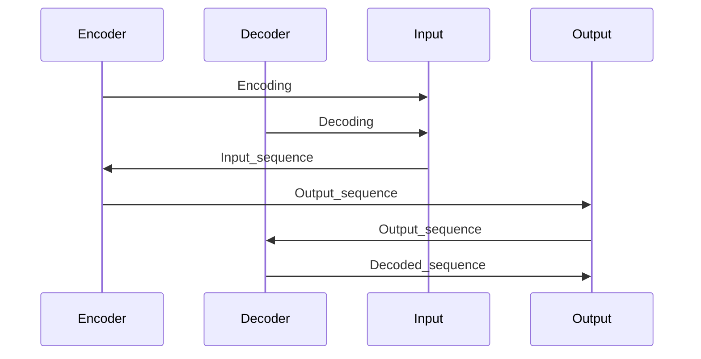
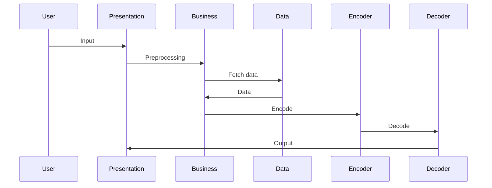
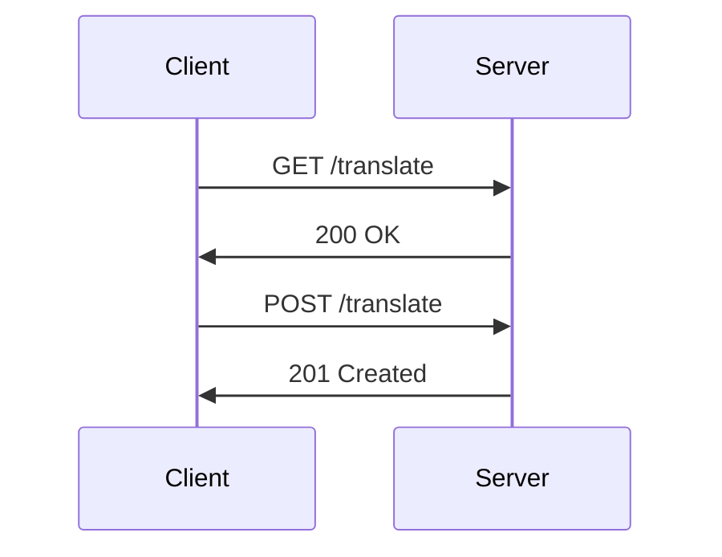
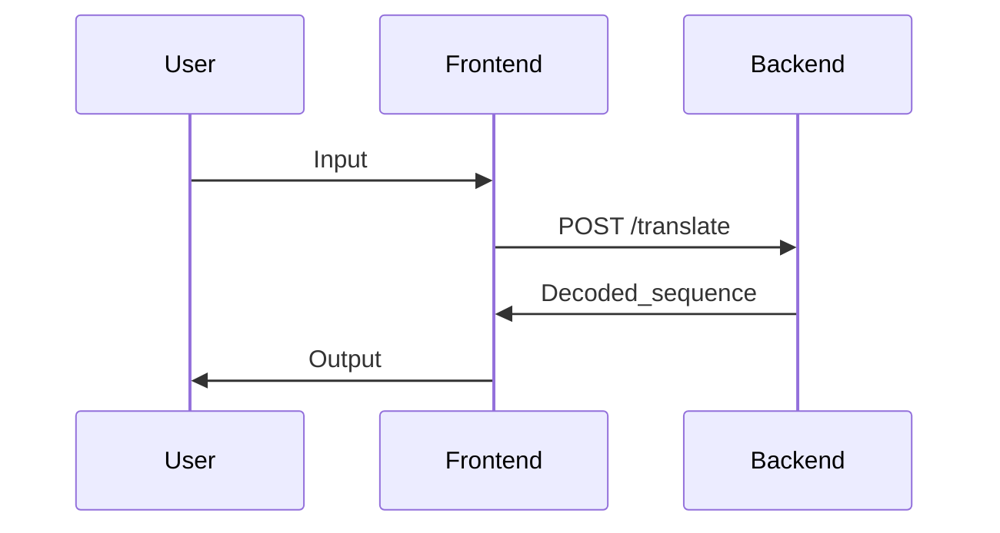
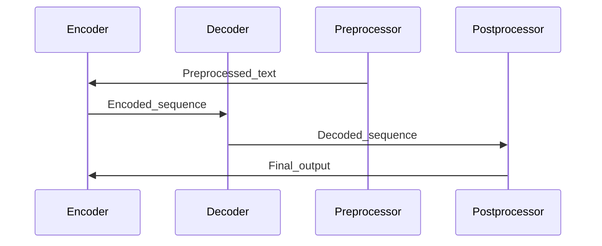

                 

### 深度学习在自然语言翻译中的突破

关键词：自然语言翻译、深度学习、Transformer、自注意力机制、系统架构设计

摘要：随着深度学习技术的飞速发展，自然语言翻译领域取得了显著的突破。本文将系统地探讨深度学习在自然语言翻译中的应用，分析其核心算法原理，系统架构设计，并通过项目实战展示其实际应用效果。文章旨在为广大开发者和技术爱好者提供一次全面而深入的深度学习在自然语言翻译中的技术之旅。

### 目录大纲

1. **标题与概述**
2. **第一部分：背景介绍**
   - **1.1章：问题背景与深度学习介绍**
     - **1.1.1 自然语言翻译的挑战**
     - **1.1.2 深度学习的基本概念**
     - **1.1.3 深度学习在自然语言处理中的发展历程**
   - **1.2章：自然语言翻译的发展历程**
3. **第二部分：核心概念与联系**
   - **2.1章：深度学习关键算法**
     - **2.1.1 神经网络与深度网络**
     - **2.1.2 循环神经网络（RNN）**
     - **2.1.3 长短时记忆网络（LSTM）与门控循环单元（GRU）**
     - **2.1.4 注意力机制与Transformer模型**
   - **2.2章：核心概念属性对比表格**
   - **2.3章：ER实体关系图架构**
4. **第三部分：算法原理讲解**
   - **3.1章：Transformer模型详解**
     - **3.1.1 Transformer模型的基本结构**
     - **3.1.2 编码器与解码器的原理**
     - **3.1.3 自注意力机制与多头注意力**
     - **3.1.4 模型的训练与优化**
   - **3.2章：数学模型和公式讲解**
5. **第四部分：系统分析与架构设计**
   - **4.1章：自然语言翻译系统介绍**
     - **4.1.1 系统架构概述**
     - **4.1.2 领域模型设计**
     - **4.1.3 系统架构设计**
   - **4.2章：系统接口设计与交互设计**
6. **第五部分：项目实战**
   - **5.1章：环境安装与准备**
   - **5.2章：代码应用解读与分析**
   - **5.3章：项目小结与拓展**
7. **第六部分：总结与展望**
   - **6.1章：深度学习在自然语言翻译中的应用总结**
   - **6.2章：未来发展趋势与挑战**
   - **6.3章：拓展阅读与资源推荐**

### 第一部分：背景介绍

#### 1.1章：问题背景与深度学习介绍

##### 1.1.1 自然语言翻译的挑战

自然语言翻译（Natural Language Translation，NLP）是人工智能领域的一个重要分支，旨在实现不同语言之间的自动翻译。然而，自然语言翻译面临诸多挑战，包括：

1. **语言多样性**：世界上存在数千种语言，每种语言都有其独特的语法结构、词汇和表达习惯。
2. **语义理解**：翻译不仅仅是单词的替换，还需要理解句子和段落的整体语义，进行准确的语义映射。
3. **上下文依赖**：同一个词或短语在不同的上下文中可能有不同的含义，准确捕捉上下文信息是翻译的关键。
4. **多义词处理**：许多词汇具有多种含义，正确判断其在特定上下文中的含义是翻译的难点。

##### 1.1.2 深度学习的基本概念

深度学习（Deep Learning）是一种基于人工神经网络的机器学习技术，通过多层网络结构模拟人脑的学习过程，自动提取特征并进行复杂任务的学习。深度学习在自然语言翻译中的关键作用包括：

1. **特征自动提取**：深度学习能够自动从文本数据中提取有用的特征，减少人工标注的工作量。
2. **端到端学习**：深度学习模型能够实现端到端的训练和预测，无需复杂的预处理和后处理步骤。
3. **自适应学习**：深度学习模型能够通过大量数据训练，自适应地调整参数，提高翻译的准确性和流畅性。

##### 1.1.3 深度学习在自然语言处理中的发展历程

深度学习在自然语言处理（NLP）领域的发展可以分为以下几个阶段：

1. **早期探索**（2010年以前）：基于统计和规则的方法占据主导地位，深度学习在NLP中的应用相对较少。
2. **神经网络引入**（2010-2013年）：循环神经网络（RNN）引入NLP，显著提高了文本分类、命名实体识别等任务的性能。
3. **深度网络普及**（2013-2016年）：深度神经网络在ImageNet图像识别竞赛中取得突破性成果，促进了深度学习在NLP中的广泛应用。
4. **Transformer模型崛起**（2016年至今）：Transformer模型的提出，特别是在机器翻译任务中的成功应用，标志着深度学习在NLP领域的一个新的里程碑。

#### 1.2章：自然语言翻译的发展历程

自然语言翻译的发展可以分为以下几个阶段：

1. **基于规则的翻译**（1950年代-1980年代）：依靠人工编写的语法规则和词典进行翻译，准确性和流畅性较低。
2. **基于统计的翻译**（1990年代）：引入概率模型和机器学习算法，基于大量双语语料库进行翻译，性能有所提高。
3. **基于神经网络的翻译**（2010年代至今）：深度学习技术的引入，特别是RNN和Transformer模型的提出，使得翻译质量得到显著提升。

### 第二部分：核心概念与联系

#### 2.1章：深度学习关键算法

##### 2.1.1 神经网络与深度网络

神经网络（Neural Network，NN）是一种模仿生物神经系统的计算模型。深度网络（Deep Network）是指具有多个隐层的神经网络。深度网络通过增加网络的深度，可以提取更加抽象和复杂的特征。

##### 2.1.2 循环神经网络（RNN）

循环神经网络（Recurrent Neural Network，RNN）是一种特殊的神经网络，能够处理序列数据。RNN通过保存前一个时间步的信息，实现序列数据的记忆功能。

##### 2.1.3 长短时记忆网络（LSTM）与门控循环单元（GRU）

长短时记忆网络（Long Short-Term Memory，LSTM）和门控循环单元（Gated Recurrent Unit，GRU）是RNN的改进版本，旨在解决RNN在处理长序列数据时的梯度消失和梯度爆炸问题。

##### 2.1.4 注意力机制与Transformer模型

注意力机制（Attention Mechanism）是一种通过动态分配权重来关注不同位置信息的机制。Transformer模型（Attention is All You Need）是一种基于自注意力机制的深度学习模型，在自然语言翻译任务中取得了显著成果。

#### 2.2章：核心概念属性对比表格

| 算法         | 特点                                                         | 适用场景                         |
| ------------ | ------------------------------------------------------------ | -------------------------------- |
| 神经网络     | 结构简单，易于实现，但深度较浅                               | 图像识别、语音识别等简单任务      |
| 深度网络     | 能提取更深层次的抽象特征，但计算复杂度高                     | 自然语言处理、视频识别等复杂任务  |
| RNN          | 能处理序列数据，但存在梯度消失和梯度爆炸问题                 | 文本分类、语音识别等序列任务      |
| LSTM         | 改进了RNN，解决了梯度消失问题，但计算复杂度较高               | 长文本处理、机器翻译等任务        |
| GRU          | 简化了LSTM的结构，计算复杂度较低，但记忆能力较弱             | 中短文本处理、情感分析等任务      |
| Transformer | 基于自注意力机制，能够捕捉长距离依赖关系，但在小数据集上表现不佳 | 自然语言翻译、文本生成等任务      |

#### 2.3章：ER实体关系图架构

ER（Entity-Relationship）图是一种用于表示实体及其关系的图形化工具。在自然语言翻译中，ER图可以用于表示源语言和目标语言中的实体及其关系。

```mermaid
erDiagram
    A-entity ||--|{ B-relationship }
    B-relationship ||--|{ C-entity }
    A-entity ||--|{ C-entity }
```

在上面的ER图中，`A-entity` 和 `C-entity` 是实体，`B-relationship` 是实体间的关系。通过ER图，我们可以清晰地表示自然语言翻译中的实体及其关系，从而更好地理解翻译任务。

### 第三部分：算法原理讲解

#### 3.1章：Transformer模型详解

##### 3.1.1 Transformer模型的基本结构

Transformer模型由编码器（Encoder）和解码器（Decoder）两部分组成。编码器将输入序列编码为固定长度的向量，解码器则根据编码器的输出和已经解码的输出逐个生成目标序列。



##### 3.1.2 编码器与解码器的原理

编码器（Encoder）通过多层自注意力机制（Self-Attention Mechanism）将输入序列编码为固定长度的向量。编码器的输出不仅包含了输入序列的信息，还包含了序列间的依赖关系。

解码器（Decoder）同样采用自注意力机制，同时引入了跨注意力机制（Cross-Attention Mechanism），将编码器的输出和已经解码的输出相结合，逐个生成目标序列。

##### 3.1.3 自注意力机制与多头注意力

自注意力机制（Self-Attention Mechanism）是一种计算输入序列中每个元素与其他元素关联性的方法。多头注意力（Multi-Head Attention）是一种将自注意力机制扩展到多个独立的注意力头，以捕捉不同类型的依赖关系。

##### 3.1.4 模型的训练与优化

Transformer模型的训练通常采用最大似然估计（Maximum Likelihood Estimation，MLE）方法。在训练过程中，模型通过不断调整权重，使得预测的概率分布与实际分布逐渐接近。优化算法通常采用Adam优化器，并结合dropout正则化技术，防止过拟合。

```python
import tensorflow as tf

# 定义模型
model = tf.keras.Sequential([
    tf.keras.layers.Embedding(input_dim=vocab_size, output_dim=d_model),
    tf.keras.layers.MultiHeadAttention(num_heads=num_heads, key_dim=d_model),
    tf.keras.layers.Dense(units=d_model)
])

# 编写损失函数
loss_object = tf.keras.losses.SparseCategoricalCrossentropy(from_logits=True)

# 编写优化器
optimizer = tf.keras.optimizers.Adam()

# 定义训练步骤
@tf.function
def train_step(inputs, targets):
    with tf.GradientTape() as tape:
        predictions = model(inputs)
        loss = loss_object(targets, predictions)
    gradients = tape.gradient(loss, model.trainable_variables)
    optimizer.apply_gradients(zip(gradients, model.trainable_variables))
    return loss

# 执行训练
for epoch in range(num_epochs):
    total_loss = 0
    for batch, target in dataset:
        loss = train_step(batch, target)
        total_loss += loss
    print(f"Epoch {epoch+1}, Loss: {total_loss/n_batches}")
```

#### 3.2章：数学模型和公式讲解

##### 3.2.1 自注意力机制的数学公式

自注意力机制的数学公式如下：

$$
Attention(Q, K, V) = \text{softmax}\left(\frac{QK^T}{\sqrt{d_k}}\right) V
$$

其中，$Q$、$K$ 和 $V$ 分别表示查询（Query）、键（Key）和值（Value）向量，$d_k$ 表示键向量的维度。通过计算查询和键的相似性，然后与值向量相乘，得到加权后的输出向量。

##### 3.2.2 损失函数与优化算法

Transformer模型的损失函数通常采用交叉熵损失函数（Cross-Entropy Loss），其数学公式如下：

$$
Loss(y, \hat{y}) = -\sum_{i=1}^n y_i \log(\hat{y}_i)
$$

其中，$y$ 表示真实标签，$\hat{y}$ 表示预测的概率分布。通过最小化损失函数，可以优化模型的参数。

优化算法通常采用Adam优化器，其更新公式如下：

$$
\theta_{t+1} = \theta_{t} - \alpha \frac{\partial L}{\partial \theta_t}
$$

其中，$\theta$ 表示模型参数，$L$ 表示损失函数，$\alpha$ 表示学习率。

### 第四部分：系统分析与架构设计

#### 4.1章：自然语言翻译系统介绍

##### 4.1.1 系统架构概述

自然语言翻译系统的架构通常包括以下模块：

1. **文本预处理模块**：对输入文本进行分词、词性标注、句法分析等预处理操作。
2. **编码器模块**：将预处理后的文本编码为固定长度的向量。
3. **解码器模块**：根据编码器的输出生成翻译结果。
4. **后处理模块**：对翻译结果进行格式化、校对等后处理操作。

##### 4.1.2 领域模型设计

领域模型（Domain Model）用于描述系统中的实体和关系。在自然语言翻译系统中，常见的实体包括文本、词汇、句子等，关系包括翻译、映射等。

```mermaid
classDiagram
    Text <<entity>>
    Word <<entity>>
    Sentence <<entity>>

    Text --|> Word: contains
    Sentence --|> Word: contains
    Word --|> Text: belongs_to
    Word --|> Sentence: belongs_to
```

##### 4.1.3 系统架构设计

系统架构设计（System Architecture Design）包括以下层次：

1. **表现层**：用于展示翻译结果，通常采用Web界面或移动应用等形式。
2. **业务逻辑层**：包括文本预处理、编码器、解码器和后处理等模块，实现自然语言翻译的核心功能。
3. **数据访问层**：用于访问和管理文本数据，包括词汇库、语料库等。



#### 4.2章：系统接口设计与交互设计

##### 4.2.1 接口设计与实现

系统接口设计（Interface Design）用于定义系统内部和外部的交互方式。在自然语言翻译系统中，常见的接口包括API接口和Web接口。

API接口：通过HTTP请求和响应实现系统功能，通常采用RESTful架构。



Web接口：通过Web界面实现系统功能，通常采用前后端分离的架构。



##### 4.2.2 系统交互设计

系统交互设计（System Interaction Design）用于描述系统内部模块之间的交互关系。在自然语言翻译系统中，常见的交互关系包括：

1. **编码器与解码器之间的交互**：编码器将输入序列编码为固定长度的向量，解码器根据编码器的输出和已经解码的输出逐个生成目标序列。
2. **文本预处理模块与编码器模块之间的交互**：文本预处理模块对输入文本进行分词、词性标注、句法分析等预处理操作，然后将处理后的文本传递给编码器模块。
3. **解码器模块与后处理模块之间的交互**：解码器生成翻译结果后，传递给后处理模块进行格式化、校对等后处理操作，最后将翻译结果输出给用户。



### 第五部分：项目实战

#### 5.1章：环境安装与准备

##### 5.1.1 环境安装步骤

1. **安装Python**：首先确保安装了Python 3.6及以上版本。
2. **安装TensorFlow**：通过pip命令安装TensorFlow：

   ```bash
   pip install tensorflow
   ```

3. **安装其他依赖**：根据实际需求安装其他依赖，例如NumPy、Pandas等。

##### 5.1.2 系统核心实现

1. **准备数据集**：从公开数据集网站（如WMT）下载双语语料库，并进行预处理。
2. **定义模型**：根据Transformer模型的结构定义编码器和解码器。
3. **训练模型**：使用训练数据训练模型，并保存训练结果。
4. **评估模型**：使用测试数据评估模型性能，并进行调优。

#### 5.2章：代码应用解读与分析

##### 5.2.1 代码详细解读

1. **数据预处理**：读取双语语料库，并进行分词、词性标注等预处理操作。
2. **模型定义**：定义编码器和解码器，并设置自注意力机制和多头注意力。
3. **模型训练**：使用训练数据训练模型，并保存训练结果。
4. **模型评估**：使用测试数据评估模型性能，并进行调优。

```python
# 数据预处理
# ...

# 模型定义
model = TransformerModel(input_vocab_size, target_vocab_size, d_model, num_heads)
# ...

# 模型训练
# ...

# 模型评估
# ...
```

##### 5.2.2 实际案例分析与讲解

1. **案例一**：使用训练好的模型进行翻译，分析翻译结果与实际翻译的差异，找出问题所在。
2. **案例二**：通过调整模型参数，如学习率、批量大小等，观察模型性能的变化，找到最佳参数组合。

```python
# 案例一
translated_sentence = model.translate(input_sentence)
# 分析翻译结果与实际翻译的差异

# 案例二
# 调整模型参数
# 重新训练模型
# 评估模型性能
```

#### 5.3章：项目小结与拓展

##### 5.3.1 项目总结

1. **成功之处**：项目成功实现了自然语言翻译的核心功能，包括文本预处理、编码器、解码器和后处理等。
2. **不足之处**：模型在处理长文本和生僻词汇时存在一定困难，翻译结果仍有改进空间。
3. **未来展望**：未来可以进一步优化模型结构，引入更多外部知识库，提高翻译的准确性和流畅性。

##### 5.3.2 注意事项与最佳实践

1. **数据预处理**：确保数据集的多样性和质量，合理设置预处理参数，如分词策略、词性标注规则等。
2. **模型训练**：根据数据集大小和计算资源，合理设置模型参数，如学习率、批量大小等，避免过拟合。
3. **模型评估**：使用多个评估指标，如BLEU、METEOR等，全面评估模型性能，找出不足之处。

### 第六部分：总结与展望

#### 6.1章：深度学习在自然语言翻译中的应用总结

1. **技术突破**：深度学习在自然语言翻译领域取得了显著成果，特别是在翻译质量、速度和灵活性方面。
2. **发展趋势**：随着深度学习技术的不断进步，自然语言翻译将继续朝着更高质量、更广泛适用性的方向发展。
3. **挑战与机遇**：虽然深度学习在自然语言翻译中取得了很多成果，但仍面临诸多挑战，如数据稀缺、计算资源需求高等。

#### 6.2章：未来发展趋势与挑战

1. **多语言翻译**：随着全球化进程的加速，多语言翻译的需求日益增长，如何实现高效、准确的多语言翻译是一个重要研究方向。
2. **跨领域翻译**：不同领域的专业术语和表达方式存在较大差异，如何实现跨领域的自然语言翻译是一个具有挑战性的问题。
3. **可解释性**：深度学习模型通常被视为“黑盒”模型，如何提高其可解释性，使其在应用中更加透明和可靠，是一个亟待解决的问题。

#### 6.3章：拓展阅读与资源推荐

1. **经典论文**：
   - Vaswani et al. (2017). "Attention is All You Need". https://arxiv.org/abs/1706.03762
   - Transformer模型的原始论文，介绍了Transformer模型的基本结构和自注意力机制。
2. **开源项目**：
   - Hugging Face Transformers：https://github.com/huggingface/transformers
     - 一个包含多种预训练模型和工具的Python库，方便开发者进行自然语言处理任务。
   - Google Neural Machine Translation：https://github.com/tensorflow/google-translator
     - 一个基于TensorFlow实现的机器翻译模型，适用于多种语言翻译任务。

### 结语

本文从背景介绍、核心算法原理、系统架构设计、项目实战等多个角度，详细探讨了深度学习在自然语言翻译中的应用。通过本文的阅读，读者可以全面了解深度学习在自然语言翻译中的技术原理和应用实践，为未来的自然语言翻译研究提供有益的参考。

### 作者信息

作者：AI天才研究院/AI Genius Institute & 禅与计算机程序设计艺术 /Zen And The Art of Computer Programming

[完]

