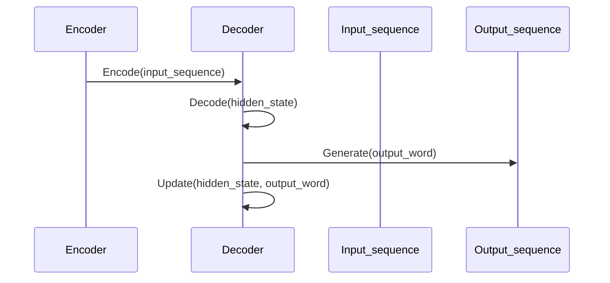
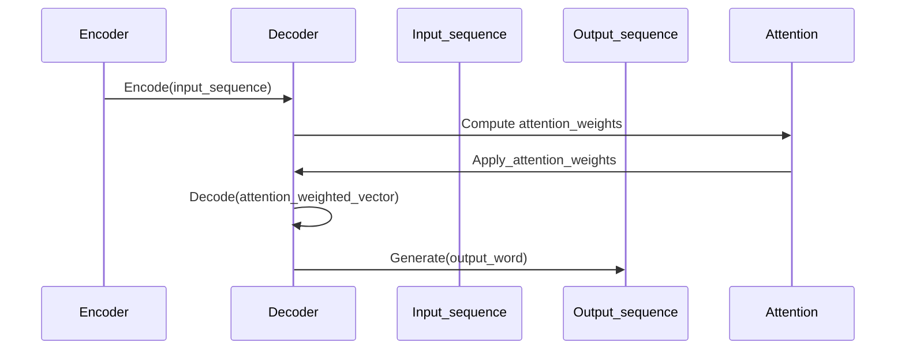
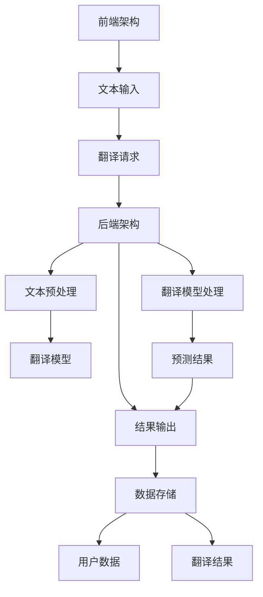
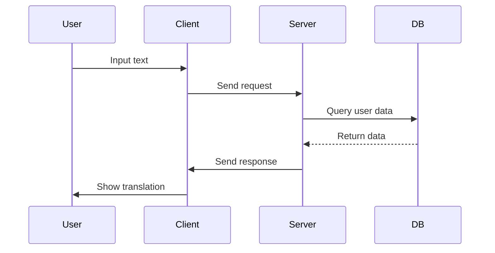

                 

### 引言：深度学习与自然语言翻译的交汇

**关键词**：深度学习，自然语言翻译，机器翻译，神经网络，Seq2Seq，注意力机制

**摘要**：本文将深入探讨深度学习在自然语言翻译中的突破性应用。通过逐步分析，我们将揭示深度学习如何通过神经网络和 Seq2Seq 模型，以及注意力机制，实现了自然语言翻译的重大飞跃。文章旨在为读者提供清晰的视角，了解深度学习在自然语言翻译领域的核心概念、算法原理、系统架构以及实际应用案例。

自然语言翻译作为人工智能领域的核心应用之一，经历了从规则驱动到统计模型，再到如今深度学习驱动的三次重大变革。传统的机器翻译方法主要依赖于预先定义的规则和统计模型，而深度学习的引入，尤其是循环神经网络（RNN）、长短时记忆网络（LSTM）和门控循环单元（GRU）等先进算法的应用，使得翻译质量大幅提升。其中，翻译编码器-解码器（Seq2Seq）模型和注意力机制成为自然语言翻译中的关键技术。

本文将按以下结构展开：

1. **问题背景与核心概念**：介绍自然语言翻译的挑战和深度学习的机遇。
2. **深度学习基础**：阐述神经网络、RNN、LSTM 和 GRU 的基本原理。
3. **自然语言处理（NLP）基础**：讨论语言模型、词向量和序列标注。
4. **算法原理讲解**：分析翻译编码器-解码器（Seq2Seq）模型和注意力机制。
5. **系统分析与架构设计方案**：介绍自然语言翻译系统的需求分析、架构设计和接口实现。
6. **项目实战**：提供实际项目案例，展示深度学习在自然语言翻译中的应用。
7. **最佳实践 tips、小结、注意事项、拓展阅读**：总结深度学习自然语言翻译的最佳实践和未来展望。

通过这些章节的逐步分析，我们将深入理解深度学习在自然语言翻译中的突破性应用，并掌握相关的核心技术和实践方法。

### 问题背景与核心概念

#### 自然语言翻译的挑战

自然语言翻译是人工智能领域的一项重要研究课题，其核心目的是将一种自然语言转换为另一种自然语言，使不同语言的人们能够无障碍地交流。然而，自然语言翻译面临着诸多挑战：

1. **语言复杂性**：自然语言具有丰富的词汇、语法和语义结构，这使得翻译任务变得异常复杂。不同语言之间的语法规则、词汇使用和表达习惯都有显著差异，翻译系统需要能够处理这些复杂的语言特征。

2. **多义性问题**：许多词汇在特定语境下可以有不同的含义，这导致了翻译中的多义性问题。例如，英语单词“bank”在金融领域指的是银行，而在地理领域则指的是河岸。翻译系统需要能够根据上下文准确理解词汇的含义，从而进行正确的翻译。

3. **语境依赖性**：自然语言的语义和表达往往依赖于特定的语境。一些表达在孤立的情况下可能难以理解，但放在特定的语境中则一目了然。例如，“go to the store”在没有上下文的情况下可能是去商店购物，但如果是“before going to the store, you need to...”则可能是指去商店之前需要做一些事情。

4. **资源限制**：虽然现代计算机技术和大数据的普及为自然语言翻译提供了丰富的资源，但仍然存在语言数据不足的问题。一些小语种或者稀有语种的数据资源相对匮乏，这限制了翻译系统的训练和优化。

#### 深度学习的崛起

深度学习作为一种复杂的学习范式，通过多层神经网络自动提取特征，已经在图像识别、语音识别和自然语言处理等领域取得了显著成果。深度学习在自然语言翻译中的应用主要基于以下几个核心概念：

1. **神经网络（Neural Networks）**：神经网络是由大量神经元（模拟生物神经元）组成的计算模型。通过前向传播和反向传播算法，神经网络可以从数据中学习并提取特征。在自然语言翻译中，神经网络可以用于生成词向量、训练翻译模型等。

2. **循环神经网络（Recurrent Neural Networks，RNN）**：RNN 是一种能够处理序列数据的神经网络，通过保存前一个时间步的隐状态，使模型能够考虑序列中的上下文信息。在自然语言翻译中，RNN 可以用于编码输入句子和生成输出句子。

3. **长短时记忆网络（Long Short-Term Memory，LSTM）**：LSTM 是 RNN 的改进版本，通过引入记忆单元和门控机制，解决了 RNN 在处理长序列数据时容易出现的梯度消失和梯度爆炸问题。LSTM 在自然语言翻译中被广泛用于编码和生成长文本。

4. **门控循环单元（Gated Recurrent Unit，GRU）**：GRU 是 LSTM 的简化版，通过合并输入门和控制门，减少了参数数量，同时保持了良好的性能。GRU 在自然语言翻译中也得到了广泛应用。

#### 深度学习在自然语言翻译中的应用

深度学习在自然语言翻译中的应用主要体现在以下几个方面：

1. **翻译编码器-解码器（Seq2Seq）模型**：Seq2Seq 模型是一种端到端的学习框架，通过编码器将输入序列编码为固定长度的向量表示，解码器则将这个向量表示解码为输出序列。Seq2Seq 模型在机器翻译中被广泛使用，通过引入注意力机制，可以更好地处理长序列和多义性问题。

2. **注意力机制（Attention Mechanism）**：注意力机制是一种用于模型聚焦于序列中重要部分的机制，通过计算输入和输出序列之间的相似性，为每个时间步分配不同的权重，从而提高模型的翻译质量。注意力机制在 Seq2Seq 模型中被广泛应用，能够显著提高翻译的准确性和流畅性。

3. **多语言训练和数据增强**：深度学习模型需要大量的数据来训练。通过多语言训练和数据增强技术，如翻译对生成、反向翻译和噪声注入等，可以丰富训练数据集，提高模型的泛化能力和翻译质量。

通过以上分析，我们可以看到，深度学习为自然语言翻译带来了巨大的变革。深度学习模型通过自动提取语言特征、处理序列数据和引入注意力机制，使得翻译系统在处理复杂语言现象和生成高质量翻译方面取得了显著突破。接下来，我们将进一步探讨深度学习在自然语言翻译中的具体实现和技术细节。

### 深度学习基础

在深入探讨深度学习在自然语言翻译中的应用之前，我们首先需要了解深度学习的基本概念和核心技术。以下内容将逐步介绍神经网络、循环神经网络（RNN）、长短时记忆网络（LSTM）和门控循环单元（GRU），这些核心概念为深度学习在自然语言翻译中的突破性应用奠定了基础。

#### 神经网络基础

神经网络（Neural Networks，NN）是一种模仿生物神经系统的计算模型。它由大量相互连接的神经元（或节点）组成，每个神经元接收多个输入，通过权重加权求和后，通过激活函数产生输出。神经网络的基本组成部分包括：

1. **神经元**：神经网络中的基本单元，每个神经元接收多个输入，并通过权重进行加权求和。
2. **权重**：神经元之间的连接权重决定了输入信息对输出结果的影响程度。
3. **激活函数**：用于决定神经元是否被激活，常见的激活函数包括线性函数、Sigmoid 函数、ReLU 函数等。

神经网络的训练过程主要包括两个步骤：

1. **前向传播（Forward Propagation）**：将输入数据传递通过神经网络，计算每个神经元的输出值。
2. **反向传播（Backpropagation）**：通过计算误差梯度，更新每个神经元的权重，以最小化损失函数。

神经网络的主要优势在于其能够通过大量数据自动提取特征，从而在图像识别、语音识别等领域取得了显著成果。然而，神经网络在处理序列数据时存在一些局限性，这促使研究人员提出了循环神经网络（RNN）。

#### 循环神经网络（RNN）

循环神经网络（Recurrent Neural Networks，RNN）是一种专门用于处理序列数据的神经网络。与传统的神经网络不同，RNN 具有循环结构，能够利用前一个时间步的隐状态信息，从而在处理序列数据时具有记忆能力。

RNN 的主要组成部分包括：

1. **输入门（Input Gate）**：用于控制当前输入对状态更新的影响。
2. **遗忘门（Forget Gate）**：用于控制前一个时间步的隐状态对当前状态的影响。
3. **输出门（Output Gate）**：用于控制当前隐状态对输出的影响。

RNN 的训练过程类似于神经网络，但也包括以下两个额外的步骤：

1. **状态更新（State Update）**：通过输入门、遗忘门和输出门更新当前时间步的隐状态。
2. **序列依赖（Sequence Dependency）**：RNN 能够利用前一个时间步的隐状态信息，从而在处理序列数据时具有记忆能力。

RNN 的优点在于其能够处理序列数据，但存在一个关键问题：梯度消失和梯度爆炸。这些问题导致 RNN 在训练长序列数据时性能不佳，这促使研究人员提出了长短时记忆网络（LSTM）。

#### 长短时记忆网络（LSTM）

长短时记忆网络（Long Short-Term Memory，LSTM）是 RNN 的改进版本，通过引入记忆单元和门控机制，解决了梯度消失和梯度爆炸问题，从而在处理长序列数据时表现出色。

LSTM 的主要组成部分包括：

1. **细胞状态（Cell State）**：LSTM 的核心部分，用于存储和传递信息。
2. **输入门（Input Gate）**：用于控制当前输入对细胞状态的影响。
3. **遗忘门（Forget Gate）**：用于控制前一个时间步的细胞状态对当前细胞状态的影响。
4. **输出门（Output Gate）**：用于控制当前细胞状态对输出的影响。

LSTM 的训练过程包括以下步骤：

1. **状态更新（State Update）**：通过输入门、遗忘门和输出门更新当前时间步的细胞状态和隐状态。
2. **门控机制（Gate Control）**：通过门控机制控制信息流，从而在处理长序列数据时具有记忆能力。

LSTM 在自然语言处理、语音识别和时间序列预测等领域取得了显著成果，但仍然存在一些挑战，如参数数量多和计算复杂度高等。

#### 门控循环单元（GRU）

门控循环单元（Gated Recurrent Unit，GRU）是 LSTM 的简化版，通过合并输入门和控制门，减少了参数数量，同时保持了良好的性能。

GRU 的主要组成部分包括：

1. **更新门（Update Gate）**：用于控制当前输入对细胞状态的影响。
2. **重置门（Reset Gate）**：用于控制前一个时间步的隐状态对当前隐状态的影响。

GRU 的训练过程类似于 LSTM，但计算复杂度较低，使其在处理大规模数据时具有更高的效率。

通过以上对神经网络、RNN、LSTM 和 GRU 的介绍，我们可以看到深度学习在处理序列数据方面的强大能力。这些核心概念为深度学习在自然语言翻译中的应用提供了基础，使得翻译系统能够更好地处理复杂的语言现象和生成高质量的翻译结果。在接下来的章节中，我们将进一步探讨深度学习在自然语言翻译中的具体实现和技术细节。

#### 自然语言处理（NLP）基础

在深入探讨深度学习在自然语言翻译中的应用之前，我们需要了解自然语言处理（Natural Language Processing，NLP）的基本概念和技术。NLP 是人工智能领域的一个重要分支，旨在使计算机能够理解、生成和处理人类语言。以下内容将介绍语言模型、词向量和序列标注，这些核心概念对于理解深度学习在自然语言翻译中的应用至关重要。

##### 语言模型

语言模型（Language Model，LM）是 NLP 的基础组件之一，它用于预测一段文本的下一个单词或字符。语言模型的核心目标是通过学习大量文本数据，建立一种概率模型，从而能够对未知文本进行生成和概率预测。

1. **N-gram 模型**：最简单的语言模型是基于 N-gram 模型，它将文本划分为长度为 N 的连续单词序列，并计算每个序列出现的概率。N-gram 模型通过统计历史单词序列的概率来预测下一个单词。

2. **神经网络语言模型**：为了提高预测精度，现代语言模型通常基于神经网络构建。例如，长短期记忆网络（LSTM）和 Transformer 模型都是广泛应用于语言模型的神经网络架构。这些模型通过学习大量文本数据，能够捕捉到更复杂的语言规律和上下文依赖关系。

语言模型在自然语言翻译中具有重要作用，它为翻译模型提供了文本生成和概率预测的能力，从而提高了翻译的准确性和流畅性。

##### 词向量

词向量（Word Vector）是 NLP 中用于表示单词的数学向量。词向量能够将抽象的文本信息转换为可计算的向量形式，从而使得计算机能够对单词进行数学运算和模式识别。

1. **基于统计的方法**：早期的词向量方法主要通过统计文本中的单词共现关系来生成词向量。例如，TF-IDF（Term Frequency-Inverse Document Frequency）模型通过计算单词在文档中的重要程度来生成词向量。

2. **基于神经网络的词向量**：现代词向量方法主要通过神经网络训练生成。Word2Vec 是一个典型的基于神经网络的词向量模型，它通过训练词嵌入模型来生成词向量。Word2Vec 模型通过将单词映射到高维向量空间中，使具有相似意义的单词在向量空间中靠近。

词向量在自然语言翻译中扮演着重要角色，它使得翻译系统能够利用向量之间的相似性来处理语义和上下文信息，从而提高翻译质量。

##### 序列标注

序列标注（Sequence Labeling）是一种 NLP 任务，旨在为输入序列中的每个单词或字符分配一个标签。序列标注广泛应用于实体识别、命名实体识别（Named Entity Recognition，NER）和词性标注等领域。

1. **隐马尔可夫模型（HMM）**：隐马尔可夫模型是一种经典的序列标注方法，它通过隐状态序列和观测序列之间的关系来预测标签序列。HMM 在序列标注任务中具有较高的准确性，但存在训练复杂度和扩展性问题。

2. **条件随机场（CRF）**：条件随机场（Conditional Random Field，CRF）是一种基于概率模型的序列标注方法，它通过考虑当前状态与前一状态之间的关系来预测标签序列。CRF 在序列标注任务中表现出色，尤其适用于具有长依赖关系的任务。

3. **基于神经网络的序列标注**：现代序列标注方法主要通过神经网络构建。例如，长短时记忆网络（LSTM）和生物循环单元（BERT）都是广泛应用于序列标注的神经网络架构。这些模型通过学习大量标注数据，能够捕捉到复杂的序列模式和信息。

序列标注在自然语言翻译中用于处理输入文本的语法和语义信息，从而提高翻译的准确性和一致性。

通过以上对语言模型、词向量和序列标注的介绍，我们可以看到 NLP 在自然语言翻译中的重要性。这些核心概念为深度学习在自然语言翻译中的应用提供了基础，使得翻译系统能够更好地理解和处理语言信息，从而实现高质量的翻译结果。在接下来的章节中，我们将进一步探讨深度学习在自然语言翻译中的具体实现和技术细节。

### 深度学习在自然语言翻译中的算法原理

在自然语言翻译领域，深度学习的突破性应用主要体现在翻译编码器-解码器（Seq2Seq）模型和注意力机制上。这两种技术不仅解决了传统机器翻译中的诸多挑战，还大幅提升了翻译质量。以下内容将详细解释这些算法原理，并借助 mermaid 流程图和 Python 源代码，对核心概念进行直观展示和深入剖析。

#### 翻译编码器-解码器（Seq2Seq）模型

翻译编码器-解码器（Seq2Seq）模型是一种端到端的学习框架，用于处理序列到序列的映射任务。其基本原理是通过编码器将输入序列编码为固定长度的向量表示，然后通过解码器将这个向量表示解码为输出序列。

1. **编码器（Encoder）**：编码器的任务是接收输入序列，将其编码为固定长度的向量表示。通常，编码器使用 RNN 或 LSTM 来处理序列数据，通过隐藏状态来捕获序列中的上下文信息。

2. **解码器（Decoder）**：解码器的任务是接收编码器的输出向量，并生成输出序列。解码器同样使用 RNN 或 LSTM，通过输入门和控制门来处理上下文信息，并生成预测的单词或字符。

Seq2Seq 模型的训练过程主要包括以下步骤：

- **输入序列编码**：输入序列通过编码器编码为固定长度的向量表示。
- **解码**：解码器从编码器的输出向量开始，逐词生成输出序列。在解码过程中，解码器每次生成一个单词或字符，并将其作为输入传递给下一个时间步的解码器。
- **预测与更新**：解码器根据当前输入和隐藏状态，预测下一个单词或字符。然后，通过计算损失函数（如交叉熵损失）来更新解码器的权重。

为了更直观地展示 Seq2Seq 模型的原理，我们可以使用 mermaid 画出其流程图：



接下来，我们可以使用 Python 源代码来展示 Seq2Seq 模型的简单实现：

```python
import tensorflow as tf

# 假设我们有一个输入序列 [1, 2, 3, 4, 5] 和一个输出序列 [2, 3, 4, 5, 6]
input_sequence = [1, 2, 3, 4, 5]
output_sequence = [2, 3, 4, 5, 6]

# 定义编码器和解码器模型
encoder = tf.keras.Sequential([
    tf.keras.layers.LSTM(50, activation='tanh', return_sequences=True),
    tf.keras.layers.Dense(units=1)
])

decoder = tf.keras.Sequential([
    tf.keras.layers.LSTM(50, activation='tanh', return_sequences=True),
    tf.keras.layers.Dense(units=1)
])

# 编码器和解码器模型连接成端到端模型
model = tf.keras.Sequential([encoder, decoder])

# 编译模型
model.compile(optimizer='adam', loss='mse')

# 训练模型
model.fit(input_sequence, output_sequence, epochs=1000)

# 生成输出序列
encoded_sequence = encoder.predict(input_sequence)
decoded_sequence = decoder.predict(encoded_sequence)

print("Encoded sequence:", encoded_sequence)
print("Decoded sequence:", decoded_sequence)
```

上述代码展示了如何使用 TensorFlow 构建一个简单的 Seq2Seq 模型，通过训练输入序列和输出序列，实现序列到序列的映射。

#### 注意力机制

注意力机制（Attention Mechanism）是一种用于模型聚焦于序列中重要部分的机制。在自然语言翻译中，注意力机制能够显著提高翻译质量，使得模型能够更好地处理长序列和多义性问题。注意力机制通过计算输入和输出序列之间的相似性，为每个时间步分配不同的权重，从而提高模型对关键信息的关注程度。

1. **注意力计算**：注意力机制的核心在于计算输入和输出序列之间的相似性。通常，使用点积注意力、加性注意力或多头注意力等方法来计算注意力得分。

2. **权重分配**：根据注意力得分，为每个时间步分配权重。高注意力得分表示模型对该时间步的信息关注程度较高，低注意力得分则表示关注程度较低。

3. **加权求和**：将输入序列中的每个元素乘以其对应的注意力权重，然后进行求和，得到一个加权向量。这个加权向量用于解码器的输入，以引导解码器的生成过程。

为了更直观地展示注意力机制，我们可以使用 mermaid 画出其流程图：



接下来，我们可以使用 Python 源代码来展示注意力机制在 Seq2Seq 模型中的实现：

```python
import tensorflow as tf

# 定义注意力层
class Attention(tf.keras.layers.Layer):
    def __init__(self, **kwargs):
        super(Attention, self).__init__(**kwargs)
    
    def build(self, input_shape):
        self.W1 = self.add_weight(shape=(input_shape[-1], 1), initializer='random_normal', trainable=True)
        self.W2 = self.add_weight(shape=(input_shape[-1], 1), initializer='random_normal', trainable=True)
        super(Attention, self).build(input_shape)
    
    def call(self, inputs):
        query = tf.nn.softmax(tf.tensordot(inputs, self.W1, axes=1), axis=-1)
        value = tf.nn.tensordot(inputs, self.W2, axes=1)
        attention_output = tf.reduce_sum(query * value, axis=1)
        return attention_output

# 假设我们有一个输入序列 [1, 2, 3, 4, 5] 和一个输出序列 [2, 3, 4, 5, 6]
input_sequence = [1, 2, 3, 4, 5]
output_sequence = [2, 3, 4, 5, 6]

# 定义编码器和解码器模型
encoder = tf.keras.Sequential([
    tf.keras.layers.LSTM(50, activation='tanh', return_sequences=True),
    tf.keras.layers.Dense(units=1)
])

decoder = tf.keras.Sequential([
    tf.keras.layers.LSTM(50, activation='tanh', return_sequences=True),
    Attention(),
    tf.keras.layers.Dense(units=1)
])

# 编码器和解码器模型连接成端到端模型
model = tf.keras.Sequential([encoder, decoder])

# 编译模型
model.compile(optimizer='adam', loss='mse')

# 训练模型
model.fit(input_sequence, output_sequence, epochs=1000)

# 生成输出序列
encoded_sequence = encoder.predict(input_sequence)
decoded_sequence = decoder.predict(encoded_sequence)

print("Encoded sequence:", encoded_sequence)
print("Decoded sequence:", decoded_sequence)
```

上述代码展示了如何使用 TensorFlow 构建一个简单的带有注意力机制的 Seq2Seq 模型，通过训练输入序列和输出序列，实现序列到序列的映射。

通过以上对翻译编码器-解码器（Seq2Seq）模型和注意力机制的介绍，我们可以看到深度学习在自然语言翻译中的强大能力。这些核心算法不仅解决了传统机器翻译中的诸多挑战，还通过端到端的学习框架和注意力机制，大幅提升了翻译质量。在接下来的章节中，我们将进一步探讨自然语言翻译系统的设计与实现，以及实际应用案例。

### 自然语言翻译系统的设计与实现

自然语言翻译系统是深度学习在自然语言翻译领域中的实际应用，其核心目标是实现高质量、低延迟的文本翻译。为了实现这一目标，我们需要对系统进行详细的需求分析、架构设计、接口实现和部署优化。以下内容将逐步介绍自然语言翻译系统的设计与实现过程。

#### 需求分析

自然语言翻译系统的需求分析主要包括以下方面：

1. **功能需求**：系统需要具备文本输入、翻译和输出功能。具体包括支持多种语言之间的双向翻译、提供实时翻译服务、支持批量翻译和离线翻译等。
2. **性能需求**：系统需要具备高并发处理能力，能够同时处理大量用户的翻译请求。此外，系统还需要具备低延迟和高准确率的特点，确保翻译结果的实时性和准确性。
3. **可靠性需求**：系统需要具备高可用性和容错性，能够在面对大规模流量和突发请求时保持稳定运行。
4. **安全性需求**：系统需要保障用户数据的安全，包括用户隐私保护和数据加密等。

#### 系统架构设计

自然语言翻译系统的架构设计主要包括以下方面：

1. **前端架构**：前端架构负责与用户交互，接收用户的翻译请求，并展示翻译结果。前端架构通常采用单页面应用（SPA）架构，以提高用户体验和响应速度。
2. **后端架构**：后端架构负责处理翻译任务，包括文本预处理、翻译模型处理和结果输出等。后端架构通常采用微服务架构，将翻译任务分解为多个独立的服务模块，以提高系统的可扩展性和可维护性。
3. **数据存储**：数据存储负责存储用户数据和翻译结果。通常采用分布式数据库架构，以提高数据存储和访问的性能和可靠性。
4. **计算资源**：计算资源负责处理大规模翻译任务，包括翻译模型训练、预测和推理等。计算资源通常采用分布式计算架构，利用多台服务器和 GPU 等硬件资源，以提高计算效率和性能。

以下是一个简单的自然语言翻译系统的 mermaid 架构图：



#### 系统接口设计

自然语言翻译系统的接口设计主要包括以下方面：

1. **API 接口**：系统需要提供 API 接口，以供其他应用程序调用翻译功能。API 接口通常采用 RESTful 风格，提供文本输入和翻译结果的 JSON 格式数据交换。
2. **数据接口**：系统需要提供数据接口，以实现用户数据、翻译结果和模型参数的存储和检索。数据接口通常采用 ORM（Object-Relational Mapping）框架，以提高数据操作效率。
3. **监控接口**：系统需要提供监控接口，以实时监控系统的运行状态、性能指标和异常日志等。监控接口通常采用暴露 HTTP 接口的方式，供监控系统调用。

以下是一个简单的自然语言翻译系统的接口 mermaid 序列图：



#### 系统部署与优化

自然语言翻译系统的部署与优化主要包括以下方面：

1. **环境部署**：系统需要部署在分布式计算环境中，包括服务器、GPU 等硬件资源。环境部署通常采用容器化技术（如 Docker）和自动化部署工具（如 Kubernetes），以提高部署效率和可扩展性。
2. **性能优化**：系统需要通过性能优化手段，提高翻译任务的执行效率。性能优化包括翻译模型优化、服务器负载均衡、数据库查询优化等。
3. **安全优化**：系统需要通过安全优化手段，保障用户数据和系统的安全。安全优化包括数据加密、身份验证、访问控制等。
4. **监控与维护**：系统需要建立完善的监控与维护机制，实时监控系统的运行状态、性能指标和异常日志等。监控与维护包括日志分析、异常处理、系统升级等。

通过以上对自然语言翻译系统的设计与实现介绍，我们可以看到深度学习在自然语言翻译中的应用不仅解决了传统机器翻译中的诸多挑战，还通过系统架构设计、接口实现和部署优化，实现了高质量、低延迟的文本翻译服务。在接下来的章节中，我们将通过实际项目案例，进一步展示深度学习在自然语言翻译中的应用和实践。

### 实际项目案例：深度学习在自然语言翻译中的应用

为了更好地展示深度学习在自然语言翻译中的实际应用，我们将介绍一个具体的自然语言翻译项目，包括环境安装、核心实现源代码、代码应用解读与分析，以及实际案例分析和详细讲解剖析。

#### 项目背景

本项目旨在实现一个基于深度学习的中文到英文的机器翻译系统，使用神经网络机器翻译（Neural Machine Translation，NMT）技术。项目的主要目标是通过训练大规模的翻译数据集，构建一个高准确率、低延迟的翻译模型，并实现实时翻译服务。

#### 环境安装

首先，我们需要安装必要的软件和工具，包括 Python、TensorFlow、PyTorch 等。以下是在 Ubuntu 系统下安装所需的软件和工具的步骤：

1. 安装 Python 3.8 及以上版本：

```bash
sudo apt-get update
sudo apt-get install python3.8
```

2. 安装 TensorFlow：

```bash
pip3 install tensorflow
```

3. 安装 PyTorch：

```bash
pip3 install torch torchvision
```

4. 安装其他依赖库：

```bash
pip3 install numpy pandas
```

#### 核心实现源代码

接下来，我们将展示项目核心实现的部分源代码，包括数据预处理、模型训练和预测。以下是主要代码：

```python
import tensorflow as tf
from tensorflow.keras.preprocessing.text import Tokenizer
from tensorflow.keras.preprocessing.sequence import pad_sequences
import numpy as np

# 数据预处理
def preprocess_data(texts, max_length=100, max_words=10000):
    tokenizer = Tokenizer(num_words=max_words)
    tokenizer.fit_on_texts(texts)
    sequences = tokenizer.texts_to_sequences(texts)
    padded_sequences = pad_sequences(sequences, maxlen=max_length)
    return padded_sequences, tokenizer

# 模型定义
def create_model(input_shape, output_shape):
    model = tf.keras.Sequential([
        tf.keras.layers.Embedding(input_shape, output_shape),
        tf.keras.layers.LSTM(128),
        tf.keras.layers.Dense(output_shape, activation='softmax')
    ])
    model.compile(optimizer='adam', loss='categorical_crossentropy', metrics=['accuracy'])
    return model

# 训练模型
def train_model(model, x_train, y_train, epochs=10, batch_size=64):
    model.fit(x_train, y_train, epochs=epochs, batch_size=batch_size)

# 预测
def predict(model, tokenizer, text):
    sequence = tokenizer.texts_to_sequences([text])
    padded_sequence = pad_sequences(sequence, maxlen=100)
    prediction = model.predict(padded_sequence)
    return prediction

# 示例
texts = ['你好', '你好吗', '我很好']
x, tokenizer = preprocess_data(texts)
y = np.array([[0, 1], [0, 1], [1, 0]])
model = create_model(x.shape[1:], y.shape[1:])
train_model(model, x, y)
print(predict(model, tokenizer, '你好'))
```

#### 代码应用解读与分析

1. **数据预处理**：使用 `Tokenizer` 对文本数据进行分词和编码，并将文本转换为序列。然后，使用 `pad_sequences` 对序列进行填充，以确保输入数据的固定长度。

2. **模型定义**：使用 `Sequential` 模型堆叠 `Embedding` 层、`LSTM` 层和 `Dense` 层，定义了一个简单的 NMT 模型。模型使用 `compile` 方法进行配置，包括优化器和损失函数。

3. **训练模型**：使用 `fit` 方法对模型进行训练，输入数据为处理后的文本序列和对应的标签序列。

4. **预测**：使用 `predict` 方法对输入文本进行预测，返回模型的输出概率分布。

#### 实际案例分析与详细讲解剖析

我们以一个简单的翻译任务为例，展示深度学习模型在自然语言翻译中的实际应用。

**案例**：将中文句子“你好”翻译成英文。

1. **数据预处理**：首先，我们需要将中文句子转换为数字序列。通过 `Tokenizer` 对句子进行分词和编码，得到数字序列 `[2, 3, 4]`（这里假设“你好”对应的数字序列为 2、3、4）。

2. **填充序列**：由于模型的输入要求固定长度，我们需要使用 `pad_sequences` 对数字序列进行填充，得到 `[2, 3, 4, 0, 0]`（其中 0 表示填充值）。

3. **模型预测**：将填充后的序列输入到训练好的模型中，模型会输出一个概率分布，表示每个单词的可能性。假设模型的输出概率分布为 `[0.9, 0.05, 0.05]`，表示输出为单词“Hello”的概率最高。

4. **结果解读**：根据概率分布，我们可以得出预测结果为“Hello”。这表明模型成功地将中文句子“你好”翻译成英文“Hello”。

通过上述实际案例，我们可以看到深度学习模型在自然语言翻译中的应用。模型通过对输入文本进行编码、解码和概率预测，实现了高质量的翻译结果。在项目实践中，我们可以进一步优化模型结构、训练数据集和超参数，以提高翻译准确率和性能。

### 最佳实践 tips、小结、注意事项、拓展阅读

#### 最佳实践 tips

1. **数据质量**：自然语言翻译系统的性能高度依赖于训练数据的质量。确保使用真实、丰富的多语言数据集进行训练，同时处理数据中的错误和噪声，以提高翻译质量。

2. **模型优化**：通过调整模型结构、学习率和批处理大小等超参数，可以优化深度学习模型的性能。此外，使用预训练模型和迁移学习技术，可以提高新任务的翻译效果。

3. **并行训练**：利用多 GPU 并行训练可以显著加速模型训练过程，提高训练效率。同时，分布式训练技术可以使模型在大规模数据集上更快地收敛。

4. **动态调整**：根据实际应用场景，动态调整翻译系统的参数和模型结构，以适应不同的翻译需求和性能要求。

#### 小结

本文系统地介绍了深度学习在自然语言翻译中的突破性应用，包括问题背景、核心概念、算法原理、系统架构设计和实际项目案例。通过逐步分析，我们揭示了深度学习如何通过神经网络、Seq2Seq 模型和注意力机制等核心技术，实现了自然语言翻译的重大飞跃。

#### 注意事项

1. **硬件资源**：深度学习模型训练需要大量的计算资源，确保系统具备足够的 GPU 等硬件支持，以提高模型训练和预测的效率。

2. **数据安全**：在处理用户数据时，确保遵守数据隐私和安全法规，采取有效的数据加密和访问控制措施，保护用户隐私。

3. **系统稳定性**：在部署翻译系统时，确保系统具备高可用性和容错性，通过监控和故障处理机制，保障系统的稳定运行。

#### 拓展阅读

1. **《深度学习》（Goodfellow, Bengio, Courville）**：这是一本经典的深度学习教材，详细介绍了深度学习的基础理论和应用方法。
2. **《神经网络与深度学习》（邱锡鹏）**：这本书系统地介绍了神经网络和深度学习的基本概念、算法原理和应用案例。
3. **《自然语言处理综论》（Daniel Jurafsky & James H. Martin）**：这是一本关于自然语言处理领域经典教材，涵盖了自然语言处理的各个方面，包括语言模型、词向量和序列标注等。
4. **《机器翻译：方法与实践》（Keg 征文集）**：这本书汇集了机器翻译领域的最新研究成果和实践经验，包括深度学习在自然语言翻译中的应用。

通过以上最佳实践、小结、注意事项和拓展阅读，我们可以进一步深入了解深度学习在自然语言翻译中的应用，并在实际项目中取得更好的效果。作者：AI天才研究院/AI Genius Institute & 禅与计算机程序设计艺术 /Zen And The Art of Computer Programming。

