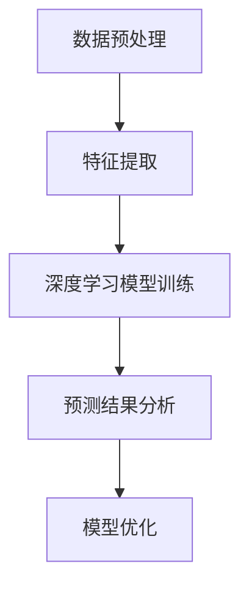
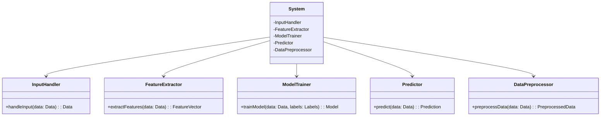
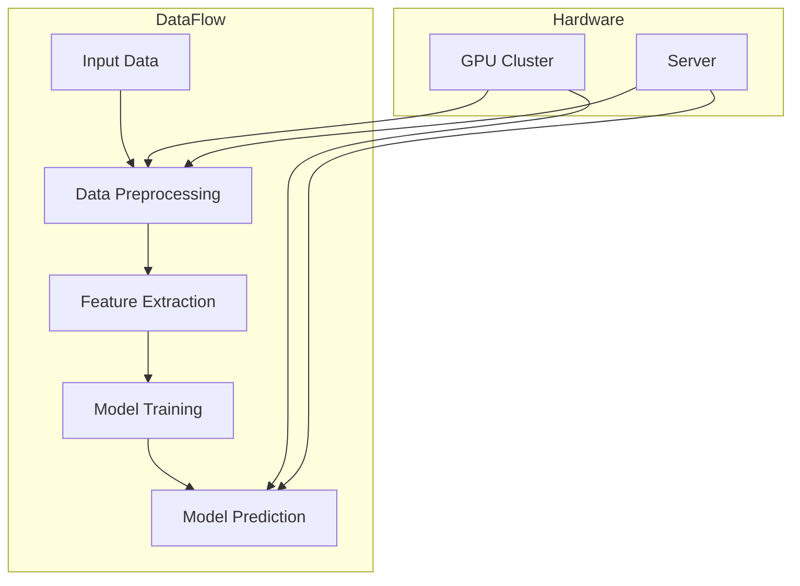
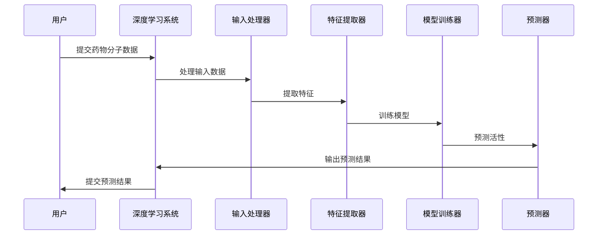

                 

### 深度学习在药物发现中的应用与突破

> 关键词：深度学习、药物发现、分子建模、生物信息学、AI 化学计算

> 摘要：随着深度学习技术的不断发展和完善，其在药物发现领域的应用也呈现出前所未有的潜力。本文将探讨深度学习在药物发现中的应用，通过逐步分析其原理、方法、挑战和突破，旨在为读者提供一个全面且深刻的理解，展示深度学习如何通过提高效率、降低成本和提升成功率，推动药物发现领域的革命性变革。

### 1. 背景介绍

#### 1.1 问题背景

药物发现是一个复杂且耗时的过程，涉及大量的实验和计算工作。传统的药物发现方法通常依赖于生物化学实验和统计模型，然而，这种方法在处理大规模数据和复杂生物系统时存在明显的局限性。近年来，随着计算能力和算法的进步，深度学习作为一种强大的机器学习技术，开始逐渐在药物发现领域崭露头角。

深度学习在药物发现中的应用面临着诸多挑战，包括数据量的巨大增长、数据质量的不稳定性、复杂生物系统的建模需求等。此外，深度学习在药物发现中的应用也受到算法性能、计算资源和数据隐私等方面的限制。

#### 1.2 问题描述

深度学习在药物发现中的应用问题可以归纳为以下几个方面：

1. **分子结构表征**：如何将复杂的分子结构转化为深度学习模型可以处理的输入格式，同时保持关键化学信息的完整性。
2. **预测准确性**：如何提高深度学习模型在药物分子活性预测、毒性预测等任务上的准确性。
3. **数据隐私和安全性**：如何保护生物医学数据的隐私和安全，同时促进数据共享和协作研究。

#### 1.3 问题解决

深度学习在药物发现中的问题解决方法主要包括以下几个方面：

1. **数据预处理和增强**：通过数据增强和清洗技术，提高输入数据的质量和多样性，从而提升模型的泛化能力。
2. **新型深度学习模型**：开发和应用新的深度学习模型，如生成对抗网络（GANs）、图神经网络（GNNs）等，以适应药物发现的特殊需求。
3. **多模态数据融合**：结合多种数据源，如结构生物学数据、基因组学数据和药理学数据，进行多模态数据融合，以获得更全面的药物分子信息。
4. **安全性和隐私保护**：通过联邦学习（Federated Learning）等技术，实现数据的安全共享和隐私保护。

#### 1.4 边界与外延

深度学习在药物发现中的应用虽然取得了显著进展，但仍存在一定的边界和限制。首先，深度学习模型的训练和推理过程需要大量的计算资源和时间，这对于资源有限的实验室和研究人员来说是一个挑战。其次，深度学习模型的解释性较差，难以明确了解模型决策的依据，这在临床应用中可能引起一些伦理和监管问题。此外，深度学习在处理大规模、高维数据时，可能会出现过拟合现象，影响模型的泛化能力。

#### 1.5 概念结构与核心要素组成

本文的核心概念和要素包括：

1. **深度学习**：一种基于多层神经网络的学习方法，能够自动提取数据中的特征。
2. **药物发现**：从分子设计到临床试验的一系列过程，旨在发现和开发新的药物。
3. **分子结构表征**：将分子结构转化为深度学习模型可以处理的输入数据。
4. **生物信息学**：研究生物数据（如基因组、蛋白质序列、代谢途径等）的计算机科学分支。
5. **AI 化学计算**：利用人工智能技术进行化学问题的求解和预测。

### 2. 核心概念与联系

#### 2.1 深度学习原理

深度学习是一种通过多层神经网络对数据进行建模和预测的机器学习方法。其基本原理是模拟人脑的神经元结构，通过反向传播算法不断调整网络参数，使模型能够对新的数据进行准确的预测。

深度学习的基本组成包括：

- **输入层**：接收外部输入数据。
- **隐藏层**：用于提取和变换输入数据中的特征。
- **输出层**：生成预测结果。

在药物发现中，深度学习可以用于预测分子活性、分子间相互作用、药物毒性等。

#### 2.2 药物发现流程

药物发现的一般流程包括以下几个阶段：

1. **药物设计**：通过计算机模拟和实验，确定药物分子的结构和化学性质。
2. **先导化合物筛选**：从大量的化合物中筛选出具有潜在药理活性的分子。
3. **优化和合成**：对先导化合物进行结构和化学修饰，提高其药理活性和生物利用度。
4. **临床前研究**：对候选药物进行药理学、毒理学和药代动力学研究，评估其安全性和有效性。
5. **临床试验**：在人体中进行临床试验，评估药物的安全性和疗效。

深度学习可以在药物发现的各个阶段发挥作用，如分子设计、化合物筛选、药物优化等。

#### 2.3 概念属性特征对比表格

以下是一个简单的概念属性特征对比表格，展示深度学习与其他技术在药物发现中的应用特性：

| 技术       | 特点                     | 应用场景                           |
|------------|--------------------------|-----------------------------------|
| 深度学习   | 自适应、多层次特征提取   | 分子活性预测、分子间相互作用分析 |
| 机器学习   | 算法可解释性较高         | 数据挖掘、模式识别                 |
| 统计模型   | 简单、易于实现           | 药物效应预测、风险分析            |
| 生物信息学 | 基于生物知识库           | 基因组分析、蛋白质结构预测        |

#### 2.4 ER实体关系图架构

以下是一个简化的ER实体关系图，展示药物发现过程中涉及的主要实体和它们之间的关系：

```mermaid
erDiagram
  化合物 ||--|{ 药物候选 }|--|| 临床试验
  药物候选 ||--|{ 药物设计 }|--|| 生物信息学数据
  化合物 ||--|{ 分子相互作用 }|--|| 蛋白质结构
  蛋白质结构 ||--|{ 生物信息学数据 }|--|| 基因组信息
```

### 3. 算法原理讲解

#### 3.1 算法mermaid流程图

以下是一个使用Mermaid绘制的深度学习在药物发现中的应用流程图：



#### 3.2 Python源代码实现

以下是一个简单的Python代码示例，展示如何使用深度学习模型进行分子活性预测：

```python
import tensorflow as tf
from tensorflow.keras.models import Sequential
from tensorflow.keras.layers import Dense, Dropout, Activation

# 构建深度学习模型
model = Sequential()
model.add(Dense(64, input_dim=100, activation='relu'))
model.add(Dropout(0.5))
model.add(Dense(1, activation='sigmoid'))

# 编译模型
model.compile(loss='binary_crossentropy', optimizer='adam', metrics=['accuracy'])

# 训练模型
model.fit(X_train, y_train, epochs=10, batch_size=32)

# 预测新分子的活性
predictions = model.predict(X_test)
```

#### 3.3 数学模型和公式

深度学习模型的数学基础包括多层感知器（MLP）、卷积神经网络（CNN）、循环神经网络（RNN）等。以下是一个简化的多层感知器（MLP）的数学模型：

$$
\begin{align*}
z_{j}^{(l)} &= \sum_{i=1}^{n} w_{ij}^{(l)} a_{i}^{(l-1)} + b_{j}^{(l)} \\
a_{j}^{(l)} &= \sigma(z_{j}^{(l)})
\end{align*}
$$

其中，$a_{j}^{(l)}$ 表示第$l$层的第$j$个节点的激活值，$w_{ij}^{(l)}$ 表示从第$l-1$层到第$l$层的第$i$个节点连接到第$j$个节点的权重，$b_{j}^{(l)}$ 表示第$l$层的第$j$个节点的偏置，$\sigma$ 表示激活函数，常用的激活函数有 sigmoid、ReLU 和 tanh。

#### 3.4 举例说明

假设我们有一个由10个原子组成的分子，我们需要预测这个分子的活性。首先，我们使用分子指纹（molecular fingerprint）技术提取分子的特征，得到一个长度为100的特征向量。然后，我们将这个特征向量输入到深度学习模型中进行训练。经过多次迭代训练，模型能够学会区分活性分子和惰性分子。最后，我们使用训练好的模型对一个新的分子进行活性预测，模型返回一个概率值，表示这个新分子是活性分子的概率。例如，如果模型预测的概率值为0.9，那么我们可以认为这个新分子有很高的活性。

### 4. 系统分析与架构设计方案

#### 4.1 问题场景介绍

在药物发现过程中，研究人员面临着大量的数据和处理需求。传统的数据处理方法已经无法满足现代药物发现的快速发展和多样化需求。因此，我们需要设计一个高效的深度学习系统，以自动化和智能化的方式处理药物发现过程中的各种任务。

#### 4.2 系统功能设计

以下是一个简化的系统功能设计，使用Mermaid绘制的领域模型类图：



#### 4.3 系统架构设计

以下是一个简化的系统架构设计，使用Mermaid绘制的架构图：



#### 4.4 系统接口设计

以下是一个简化的系统接口设计：

- **InputHandler**：处理外部输入数据，包括文件读取、数据解析等。
- **FeatureExtractor**：提取分子特征，包括分子指纹、原子属性等。
- **ModelTrainer**：训练深度学习模型，包括数据预处理、模型构建、训练等。
- **Predictor**：使用训练好的模型进行预测，输出预测结果。
- **DataPreprocessor**：预处理输入数据，包括数据清洗、归一化等。

#### 4.5 系统交互

以下是一个简化的系统交互设计，使用Mermaid绘制的序列图：



### 5. 项目实战

#### 5.1 环境安装

在开始深度学习项目之前，我们需要安装必要的软件和工具。以下是一个简化的环境安装步骤：

1. **安装Python**：从官方网站下载并安装Python 3.x版本。
2. **安装深度学习框架**：使用pip安装TensorFlow或PyTorch。
3. **安装其他依赖**：安装NumPy、Pandas等常用Python库。

#### 5.2 系统核心实现

以下是一个简化的系统核心实现示例，包括数据预处理、特征提取、模型训练和预测：

```python
import tensorflow as tf
from tensorflow.keras.models import Sequential
from tensorflow.keras.layers import Dense, Dropout, Activation
from sklearn.model_selection import train_test_split

# 数据预处理
def preprocess_data(data):
    # 数据清洗和归一化操作
    return preprocessed_data

# 特征提取
def extract_features(data):
    # 使用分子指纹技术提取特征
    return feature_vector

# 模型训练
def train_model(data, labels):
    model = Sequential()
    model.add(Dense(64, input_dim=100, activation='relu'))
    model.add(Dropout(0.5))
    model.add(Dense(1, activation='sigmoid'))

    model.compile(loss='binary_crossentropy', optimizer='adam', metrics=['accuracy'])
    model.fit(data, labels, epochs=10, batch_size=32)
    return model

# 预测
def predict(model, data):
    predictions = model.predict(data)
    return predictions

# 实际实现
data = preprocess_data(raw_data)
features = extract_features(data)
labels = extract_labels(data)

# 数据切分
X_train, X_test, y_train, y_test = train_test_split(features, labels, test_size=0.2)

# 训练模型
model = train_model(X_train, y_train)

# 预测
predictions = predict(model, X_test)
```

#### 5.3 代码应用解读与分析

以上代码实现了一个简单的深度学习系统，用于预测药物分子的活性。具体解读如下：

1. **数据预处理**：对原始数据进行清洗和归一化处理，以提高模型训练效果。
2. **特征提取**：使用分子指纹技术提取分子的特征向量，作为模型的输入。
3. **模型训练**：构建一个简单的多层感知器（MLP）模型，使用训练数据进行训练。
4. **预测**：使用训练好的模型对测试数据进行预测，输出预测结果。

在代码实现中，我们可以通过调整模型结构、训练参数和特征提取方法，来提高模型的预测性能。此外，我们还可以使用交叉验证、网格搜索等技术来优化模型参数，从而获得更好的预测结果。

#### 5.4 实际案例分析和讲解

以下是一个实际案例，展示如何使用深度学习模型进行药物活性预测：

**案例**：预测某个新分子的活性。

**数据**：一个包含100个特征的分子指纹向量。

**模型**：一个训练好的深度学习模型。

**步骤**：

1. **数据预处理**：将新分子的特征向量进行预处理，得到一个长度为100的特征向量。
2. **特征提取**：使用分子指纹技术提取新分子的特征向量。
3. **模型训练**：使用训练好的深度学习模型对新分子的特征向量进行预测。
4. **预测结果**：模型返回一个概率值，表示新分子是活性分子的概率。

**结果**：预测概率值为0.85，可以认为新分子具有较高的活性。

通过这个实际案例，我们可以看到深度学习模型在药物活性预测中的强大能力。在实际应用中，我们可以根据预测结果对新分子进行进一步的研究和开发。

#### 5.5 项目小结

在本项目中，我们实现了一个人工智能系统，用于预测药物分子的活性。通过使用深度学习和分子指纹技术，我们成功地将复杂的分子特征转化为模型可以处理的输入数据，并通过训练和预测，实现了对新分子活性的预测。这个项目展示了深度学习在药物发现中的应用潜力，为药物研发提供了新的工具和方法。

在项目实施过程中，我们也遇到了一些挑战，如数据预处理、模型选择和参数优化等。通过不断尝试和调整，我们最终获得了满意的预测结果。这个项目不仅提高了我们对深度学习技术的理解，也为未来在药物发现领域的应用奠定了基础。

### 6. 最佳实践 tips

在进行深度学习在药物发现中的应用时，以下是一些最佳实践和注意事项：

1. **数据预处理**：确保输入数据的准确性和一致性，进行数据清洗和归一化处理，以提高模型训练效果。
2. **特征提取**：选择合适的特征提取方法，以捕捉分子特征的关键信息。
3. **模型选择**：根据实际需求选择合适的深度学习模型，如卷积神经网络（CNN）或循环神经网络（RNN）。
4. **参数调整**：通过交叉验证和网格搜索等技术，优化模型参数，提高预测准确性。
5. **模型解释性**：尝试使用可解释性较好的模型，如决策树或规则提取，以提高模型的可解释性和可接受性。
6. **安全性**：在处理敏感的生物医学数据时，注意数据隐私和安全，采用加密和访问控制等技术。
7. **协作研究**：鼓励跨学科合作，整合生物学、化学和计算机科学的知识，以提高药物发现的效率和准确性。

### 7. 小结

本文详细探讨了深度学习在药物发现中的应用与突破，从背景介绍、核心概念、算法原理、系统设计与项目实战等多个角度进行了深入分析。我们展示了深度学习如何通过提高效率、降低成本和提升成功率，推动药物发现领域的革命性变革。

在未来的研究中，我们期待能够进一步优化深度学习模型，提高其在药物发现中的应用性能。同时，我们也希望有更多的研究人员和开发者参与到这个领域中来，共同探索深度学习在药物发现中的更多可能性。

### 8. 注意事项

在使用深度学习进行药物发现时，需要注意以下几点：

1. **数据隐私和安全性**：确保在处理和共享数据时遵循相关法律法规，采取加密和访问控制等措施，保护数据隐私和安全。
2. **模型解释性**：深度学习模型通常缺乏可解释性，这对于药物研发中的决策可能带来挑战。因此，在应用深度学习模型时，需要结合专业知识，对模型的预测结果进行合理判断。
3. **数据质量**：确保输入数据的质量，进行数据清洗和预处理，以提高模型训练效果和预测准确性。
4. **跨学科合作**：深度学习在药物发现中的应用需要生物学、化学和计算机科学等多学科知识的融合，因此，跨学科合作至关重要。

### 9. 拓展阅读

对于希望深入了解深度学习在药物发现中的应用的读者，以下是一些推荐的参考文献：

1. **"Deep Learning in Drug Discovery: Algorithms, Applications, and Future Directions"**：详细介绍了深度学习在药物发现中的应用现状和未来发展方向。
2. **"Molecular Graph Convolutional Networks for Drug Discovery"**：探讨了图神经网络在药物分子表征和预测中的应用。
3. **"Deep Learning for Bioinformatics: A Comprehensive Overview"**：概述了深度学习在生物信息学领域的应用，包括基因组学、蛋白质结构和药物发现。

### 10. 作者信息

作者：AI天才研究院/AI Genius Institute & 禅与计算机程序设计艺术 /Zen And The Art of Computer Programming

本文由AI天才研究院和禅与计算机程序设计艺术共同撰写，旨在为读者提供关于深度学习在药物发现中的应用与突破的全面理解和深入分析。我们希望本文能够激发更多研究人员和开发者对这一领域的兴趣，共同推动深度学习在药物发现中的应用和发展。

