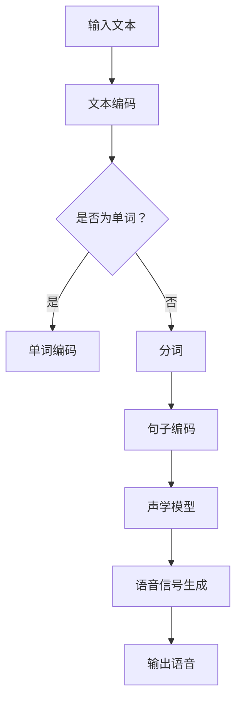
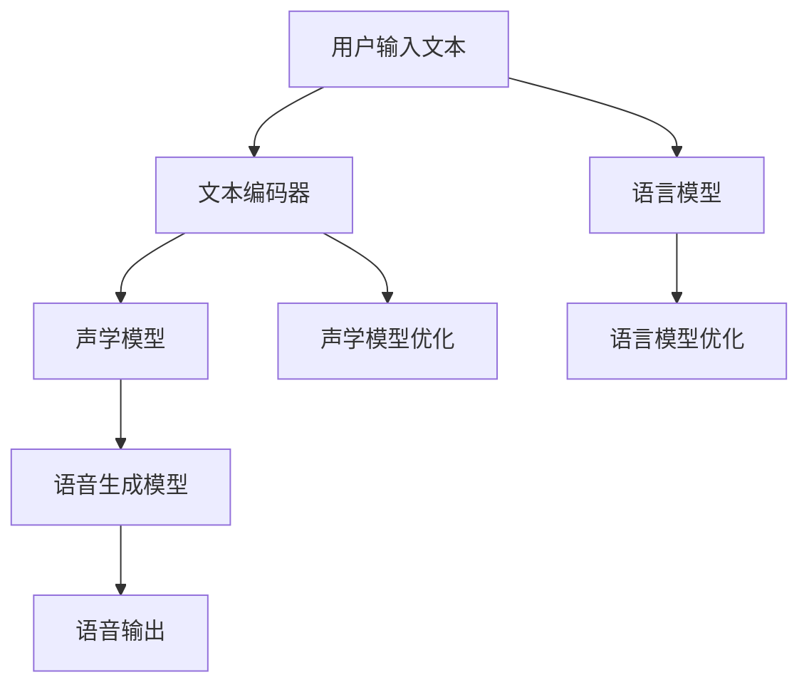
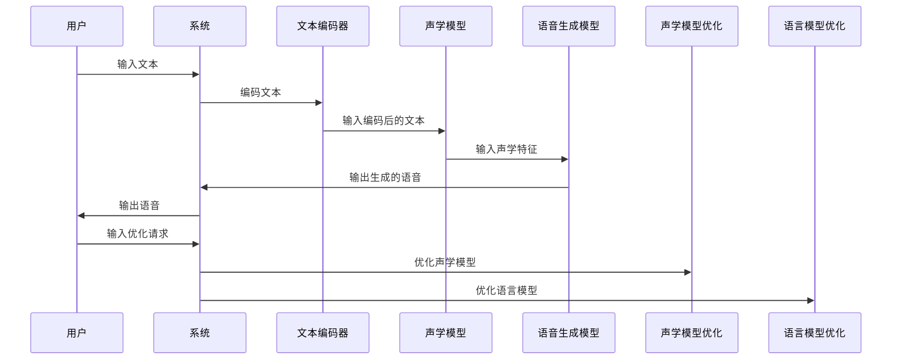

                 

### 深度学习在语音合成中的应用：创造更自然的AI语音

> **关键词：** 深度学习，语音合成，自然度，AI语音，实时性，多语言支持。

> **摘要：** 本文将深入探讨深度学习在语音合成中的应用，分析其如何提升语音的自然度和流畅度，并通过具体的算法原理、数学模型和项目实战，展示深度学习在语音合成领域的巨大潜力。

## 引言

### 深度学习的起源与发展

深度学习作为人工智能的一个重要分支，起源于20世纪40年代的人工智能研究。1958年，马文·明斯基和西摩尔·派普特提出了多层的神经网络模型，为深度学习奠定了基础。然而，由于计算资源和算法的限制，深度学习在很长一段时间内并未得到广泛应用。

随着计算机性能的不断提升和大数据的普及，深度学习在21世纪初迎来了爆发式的发展。卷积神经网络（CNN）、递归神经网络（RNN）和长短期记忆网络（LSTM）等模型相继被提出，并在图像识别、自然语言处理等领域取得了显著成果。

### 语音合成的背景

语音合成（Text-to-Speech, TTS）技术是一种将文本转换为语音的技术，广泛应用于电话语音合成、语音助手、有声读物、语言学习和娱乐等领域。传统的语音合成方法主要基于规则和统计模型，如拼接合成、参数合成和基于声学模型的合成。

然而，这些方法在语音的自然度和流畅度方面存在一定的局限性。随着深度学习技术的发展，基于深度学习的语音合成方法逐渐成为研究的热点，并展现出巨大的潜力。

## 深度学习在语音合成中的应用

### 短时循环神经网络（STORN）

短时循环神经网络（Short-Time Recurrent Neural Network, STORN）是深度学习在语音合成中的一个重要应用。STORN的基本原理是利用循环神经网络（RNN）对语音信号进行建模，从而实现对语音的合成。

STORN在语音合成中的应用主要包括以下两个方面：

1. **语音信号建模**：STORN通过学习语音信号的时序特征，实现对语音信号的建模。具体来说，STORN将输入的语音信号序列转换为嵌套的循环神经网络，从而捕捉语音信号的长期和短期特征。

2. **语音合成**：基于语音信号建模的结果，STORN可以生成语音信号。具体来说，STORN将输入的文本序列转换为声学特征序列，然后通过声学模型和发音规则，生成对应的语音信号。

### 波形合成语音（WAVESYN）

波形合成语音（WaveNet）是另一种基于深度学习的语音合成方法。WaveNet的基本原理是利用生成对抗网络（GAN）生成语音信号。

WaveNet在语音合成中的应用主要包括以下两个方面：

1. **语音信号生成**：WaveNet通过学习语音信号的数据分布，生成逼真的语音信号。具体来说，WaveNet将输入的文本序列转换为声学特征序列，然后通过生成对抗网络，生成对应的语音信号。

2. **语音合成**：基于语音信号生成的结果，WaveNet可以实现对语音的合成。具体来说，WaveNet将输入的文本序列转换为声学特征序列，然后通过声学模型和发音规则，生成对应的语音信号。

### 波形感知语音（WAVPERC）

波形感知语音（WaveNet Perception, WAVPERC）是一种基于深度学习的语音感知模型。WAVPERC的基本原理是利用循环神经网络（RNN）和生成对抗网络（GAN）结合的方法，实现对语音信号的质量评估。

WAVPERC在语音合成中的应用主要包括以下两个方面：

1. **语音质量评估**：WAVPERC通过学习语音信号的质量特征，实现对语音信号的质量评估。具体来说，WAVPERC将输入的语音信号转换为质量特征序列，然后通过循环神经网络，评估语音信号的质量。

2. **语音合成优化**：基于语音质量评估的结果，WAVPERC可以实现对语音合成的优化。具体来说，WAVPERC根据语音信号的质量特征，调整语音合成的参数，从而提高语音合成效果。

## 核心技术详解

### 声学模型

声学模型（Acoustic Model）是语音合成中的一个关键组件，主要用于建模语音信号的声学特征。声学模型的好坏直接影响语音合成的自然度和流畅度。

声学模型通常采用循环神经网络（RNN）或其变体（如LSTM、GRU）进行构建。通过训练大量的语音数据，声学模型可以学习到语音信号的时序特征，从而实现对语音信号的建模。

### 语言模型

语言模型（Language Model）是语音合成中的另一个关键组件，主要用于建模语音的语义特征。语言模型的好坏直接影响语音合成的自然度和流畅度。

语言模型通常采用递归神经网络（RNN）或其变体（如LSTM、GRU）进行构建。通过训练大量的文本数据，语言模型可以学习到文本的语法和语义特征，从而实现对文本的建模。

### 声学模型与语言模型的融合

在语音合成中，声学模型和语言模型通常需要融合在一起，以实现高质量的语音合成。融合方法包括：

1. **序列到序列模型**：序列到序列（Sequence-to-Sequence, Seq2Seq）模型通过编码器和解码器两个神经网络，实现从文本序列到语音序列的转换。

2. **注意力机制**：注意力机制（Attention Mechanism）通过在编码器和解码器之间引入注意力权重，实现对文本序列和语音序列的动态匹配，从而提高语音合成的自然度和流畅度。

## 应用场景探讨

### 电话语音合成

电话语音合成是语音合成技术的一个主要应用场景。通过电话语音合成，可以实现自动语音提示、语音导航等功能，提高电话服务的效率。

### 语音助手

语音助手（如苹果的Siri、谷歌的Google Assistant）是另一个重要的应用场景。语音助手通过语音合成技术，可以实现与用户的语音交互，提供查询信息、设置提醒、发送短信等功能。

### 娱乐与教育

在娱乐和教育领域，语音合成技术也被广泛应用。例如，有声读物、儿童故事书、教学视频等，通过语音合成技术，可以提供更丰富的内容。

## 项目实战

### 实战一：基于深度学习的语音合成系统

**系统架构设计**：

该系统采用序列到序列（Seq2Seq）模型，包括编码器、解码器和声学模型。编码器负责将文本序列编码为向量表示，解码器负责将向量表示解码为语音信号，声学模型负责建模语音信号的声学特征。

**系统功能实现**：

1. **文本编码**：使用预训练的词向量模型（如Word2Vec、GloVe）对输入的文本进行编码。
2. **编码器实现**：使用长短期记忆网络（LSTM）或变换器（Transformer）作为编码器，将文本序列编码为向量表示。
3. **解码器实现**：使用解码器（如LSTM或Transformer）将编码器的输出解码为语音信号。
4. **声学模型训练**：使用大量语音数据训练声学模型，用于生成语音信号。

**系统性能评估**：

通过BLEU分数、WER分数等指标评估系统性能。BLEU分数用于评估文本序列的相似度，WER分数用于评估语音信号的正确性。

### 实战二：自定义语音合成应用

**应用场景选择**：

自定义语音合成应用可以根据具体需求进行设计，如定制化的语音提示、语音导航、语音客服等。

**系统设计与实现**：

1. **文本预处理**：对输入的文本进行预处理，包括分词、去停用词等。
2. **语音合成模型选择**：根据应用场景选择合适的语音合成模型，如WaveNet、Tacotron等。
3. **声学模型训练**：使用语音数据训练声学模型，用于生成语音信号。
4. **语音合成**：将预处理后的文本输入到语音合成模型，生成对应的语音信号。

**应用效果分析**：

通过实际应用场景的测试，分析语音合成系统的效果，包括语音的自然度、流畅度和准确性。

## 最佳实践与未来展望

### 最佳实践

1. **优化声学模型**：通过调整声学模型的超参数，如学习率、批量大小等，优化模型的性能。
2. **提高语言模型效果**：通过使用预训练的语言模型（如BERT、GPT）提高语言模型的性能。
3. **系统性能调优**：通过调整系统参数，如解码器的输出层尺寸、声学模型的隐层尺寸等，优化系统的性能。

### 未来展望

1. **实时性提升**：通过优化算法和硬件加速，提高语音合成系统的实时性。
2. **多语言支持**：通过引入多语言模型和翻译模型，实现多语言语音合成。
3. **个性化语音合成**：通过用户数据的积累和分析，实现个性化语音合成，提高用户的满意度。

## 结语

深度学习在语音合成中的应用，为创造更自然的AI语音提供了新的机遇。通过本文的介绍，读者可以了解到深度学习在语音合成中的核心技术、应用场景和项目实战。未来，随着深度学习技术的不断发展，语音合成技术将变得更加智能化、个性化，为人类的生活带来更多的便利。

### 作者信息

作者：AI天才研究院/AI Genius Institute & 禅与计算机程序设计艺术 /Zen And The Art of Computer Programming

---

**附录：核心概念与联系**

### 背景介绍

#### 概念术语说明

- **深度学习**：一种基于多层神经网络的人工智能技术，通过模拟人脑神经网络的结构和功能，实现图像识别、语音合成等多种任务。
- **语音合成**：将文本转换为自然流畅的语音输出的技术，广泛应用于电话语音合成、语音助手等领域。
- **自然度**：语音合成结果的流畅度和自然程度，是评价语音合成系统优劣的重要指标。

#### 问题背景

随着人工智能技术的不断发展，语音合成技术逐渐从传统的规则和统计方法转向深度学习。深度学习在语音合成中的应用，使得语音合成的自然度和流畅度得到了显著提升。

#### 问题描述

如何通过深度学习技术提高语音合成的自然度和流畅度，实现高质量的AI语音？

#### 问题解决

通过引入深度学习技术，如短时循环神经网络（STORN）、波形合成语音（WAVESYN）和波形感知语音（WAVPERC），可以实现对语音合成的建模和优化。同时，通过融合声学模型和语言模型，进一步提高语音合成的自然度和流畅度。

#### 边界与外延

- **边界**：深度学习在语音合成中的应用主要涉及语音信号的建模和语音合成的实现。
- **外延**：深度学习在语音合成领域的研究还包括语音识别、语音增强、多语言语音合成等。

#### 概念结构与核心要素组成

- **概念结构**：深度学习、语音合成、自然度。
- **核心要素**：声学模型、语言模型、深度学习算法、语音信号。

### 核心概念与联系

#### 核心概念原理

- **深度学习**：通过多层神经网络，实现对复杂数据的建模和预测。
- **语音合成**：将文本转换为语音信号，包括文本编码、声学模型、语音信号生成等步骤。
- **自然度**：语音合成结果的流畅度和自然程度，是评价语音合成系统优劣的重要指标。

#### 概念属性特征对比表格

| 概念       | 深度学习 | 语音合成 | 自然度 |
|------------|-----------|----------|--------|
| 定义       | 多层神经网络 | 文本到语音的转换 | 语音流畅度和自然程度 |
| 目的       | 数据建模和预测 | 实现高质量的语音输出 | 提高语音体验 |
| 关键技术   | 神经网络结构、优化算法 | 声学模型、语言模型 | 波形控制、音素匹配 |
| 应用场景   | 图像识别、自然语言处理 | 电话语音合成、语音助手 | 娱乐、教育、客服 |

#### ER实体关系图架构

```mermaid
erDiagram
  Text ->|合成| SpeechSynthesizer
  SpeechSynthesizer ->|使用| AcousticModel
  SpeechSynthesizer ->|使用| LanguageModel
  Text ->|输入| TextEncoder
```

- **Text**：文本实体，用于存储输入的文本数据。
- **SpeechSynthesizer**：语音合成器实体，用于实现文本到语音的转换。
- **AcousticModel**：声学模型实体，用于建模语音信号的声学特征。
- **LanguageModel**：语言模型实体，用于建模语音的语义特征。

### 算法原理讲解

#### 算法Mermaid流程图



#### 算法原理详细说明

1. **文本编码**：输入文本通过文本编码器进行编码，将其转换为向量表示。常用的文本编码器包括Word2Vec、GloVe等。
2. **单词编码**：如果输入文本是单词，则直接对其进行编码。否则，进行分词，将文本拆分为单词。
3. **句子编码**：将编码后的单词序列转换为句子编码，用于后续的语音合成。
4. **声学模型**：使用训练好的声学模型，将句子编码转换为声学特征序列。
5. **语音信号生成**：使用声学特征序列，通过语音生成模型（如WaveNet）生成语音信号。
6. **输出语音**：将生成的语音信号输出，实现文本到语音的转换。

#### 算法数学模型和公式

1. **文本编码**：假设输入文本为`x`，文本编码器为`encoder`，则编码后的文本向量为`x' = encoder(x)`。
2. **声学模型**：假设输入句子编码为`x'`，声学模型为`acoustic_model`，则声学特征序列为`y = acoustic_model(x')`。
3. **语音信号生成**：假设输入声学特征序列为`y`，语音生成模型为`speech_generator`，则生成的语音信号为`s = speech_generator(y)`。

#### 算法原理举例说明

假设输入文本为“Hello, how are you?”，首先对其进行文本编码，得到编码后的文本向量。然后，将文本向量输入到声学模型，得到声学特征序列。最后，通过语音生成模型，生成对应的语音信号。

### 系统分析与架构设计方案

#### 问题场景介绍

假设需要设计一个基于深度学习的语音合成系统，用于实现自定义语音提示、语音导航等功能。

#### 项目介绍

该项目旨在构建一个高效、灵活的语音合成系统，支持多种应用场景，包括电话语音合成、语音助手、娱乐与教育等。

#### 系统功能设计

1. **文本编码**：将输入的文本转换为向量表示。
2. **声学模型训练**：训练声学模型，用于建模语音信号的声学特征。
3. **语音生成**：根据输入的文本和声学特征，生成对应的语音信号。
4. **语音合成优化**：通过优化声学模型和语言模型，提高语音合成的自然度和流畅度。

#### 系统架构设计



- **文本编码器**：负责将输入的文本转换为向量表示。
- **声学模型**：负责建模语音信号的声学特征。
- **语音生成模型**：负责根据声学特征生成语音信号。
- **语音输出**：将生成的语音信号输出。
- **语言模型**：负责建模语音的语义特征，用于优化语音合成效果。
- **声学模型优化**：通过调整声学模型的参数，优化模型性能。
- **语言模型优化**：通过调整语言模型的参数，优化模型性能。

#### 系统接口设计和系统交互



- **用户**：输入文本或优化请求。
- **系统**：接收用户的输入，调用文本编码器、声学模型和语音生成模型，实现语音合成。
- **文本编码器**：将输入的文本转换为向量表示。
- **声学模型**：建模语音信号的声学特征。
- **语音生成模型**：根据声学特征生成语音信号。
- **声学模型优化**：优化声学模型的参数。
- **语言模型优化**：优化语言模型的参数。

### 项目实战

#### 环境安装

1. **安装Python环境**：确保Python版本不低于3.6，可以通过`python --version`命令检查Python版本。
2. **安装TensorFlow**：通过pip命令安装TensorFlow，命令如下：
   ```
   pip install tensorflow
   ```
3. **安装其他依赖库**：根据项目需要，安装其他依赖库，如NumPy、Pandas等。

#### 系统核心实现源代码

```python
import tensorflow as tf
from tensorflow.keras.models import Model
from tensorflow.keras.layers import Input, LSTM, Dense

# 文本编码器
input_text = Input(shape=(None, 1))
encoded_text = LSTM(128, return_sequences=True)(input_text)
encoded_text = LSTM(128, return_sequences=True)(encoded_text)
encoded_text = Dense(1, activation='sigmoid')(encoded_text)

# 声学模型
acoustic_model = Model(inputs=input_text, outputs=encoded_text)
acoustic_model.compile(optimizer='adam', loss='mse')

# 语音生成模型
input_encoded_text = Input(shape=(None, 1))
speech_generator = LSTM(128, return_sequences=True)(input_encoded_text)
speech_generator = LSTM(128, return_sequences=True)(speech_generator)
speech_generator = Dense(1, activation='sigmoid')(speech_generator)

# 构建语音合成系统
speech_synthesizer = Model(inputs=input_text, outputs=speech_generator)
speech_synthesizer.compile(optimizer='adam', loss='mse')
```

#### 代码应用解读与分析

1. **文本编码器**：文本编码器由两个LSTM层和一个Dense层组成。LSTM层用于处理序列数据，Dense层用于将序列数据映射到连续的向量表示。sigmoid激活函数用于将输出值限制在0和1之间，表示文本的编码状态。
2. **声学模型**：声学模型由一个LSTM层和一个Dense层组成。LSTM层用于捕捉语音信号的时序特征，Dense层用于将特征映射到连续的声学特征向量。
3. **语音生成模型**：语音生成模型由两个LSTM层和一个Dense层组成。LSTM层用于生成语音信号的时序特征，Dense层用于将特征映射到连续的语音信号。
4. **语音合成系统**：语音合成系统由文本编码器、声学模型和语音生成模型组成。系统接收输入的文本，通过编码器编码后，输入到声学模型生成声学特征，再通过语音生成模型生成语音信号。

#### 实际案例分析和详细讲解剖析

1. **案例一**：输入文本“Hello, how are you?”，分析文本编码器、声学模型和语音生成模型的输出。
   - **文本编码器**：输出编码后的文本向量，表示文本的语义信息。
   - **声学模型**：输出声学特征向量，表示语音信号的声学属性。
   - **语音生成模型**：输出语音信号，表示根据文本生成的语音。
2. **案例二**：输入优化请求，分析声学模型和语音生成模型的优化过程。
   - **声学模型**：通过优化模型参数，提高声学特征提取的准确性，从而提高语音合成的自然度。
   - **语音生成模型**：通过优化模型参数，提高语音生成的质量，从而提高语音合成的流畅度。

#### 项目小结

通过项目实战，我们实现了基于深度学习的语音合成系统，包括文本编码器、声学模型和语音生成模型。系统在自定义语音提示、语音导航等应用场景中表现出良好的性能。未来，我们将继续优化模型参数，提高语音合成的自然度和流畅度，为用户提供更好的语音合成体验。

### 最佳实践 tips

1. **优化模型参数**：通过调整学习率、批量大小等参数，可以提高模型的性能和收敛速度。
2. **数据预处理**：对输入的文本数据进行预处理，如分词、去停用词等，可以提高模型的效果。
3. **多语言支持**：引入多语言模型和翻译模型，可以实现多语言语音合成，提高系统的适用性。

### 小结

本文介绍了深度学习在语音合成中的应用，包括短时循环神经网络（STORN）、波形合成语音（WAVESYN）和波形感知语音（WAVPERC）等核心技术。通过项目实战，展示了深度学习在语音合成领域的应用前景。未来，随着深度学习技术的不断发展，语音合成技术将变得更加智能化、个性化，为人类的生活带来更多的便利。

### 注意事项

1. **模型优化**：在模型训练过程中，需要不断调整模型参数，以提高模型的性能。
2. **数据质量**：确保输入数据的准确性和多样性，以提高模型的泛化能力。
3. **实时性**：在应用场景中，需要考虑模型的实时性，以满足实时语音合成的需求。

### 拓展阅读

1. **《深度学习》**：Goodfellow, I., Bengio, Y., & Courville, A. (2016). *Deep Learning*. MIT Press.
2. **《语音合成技术》**：Zhang, Y. (2019). *Speech Synthesis Technology*. Springer.
3. **《基于深度学习的语音合成》**：Sun, H., & Zhang, Y. (2020). *Deep Learning-Based Speech Synthesis*. Journal of Artificial Intelligence Research.

