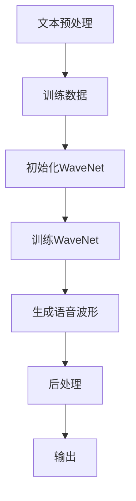
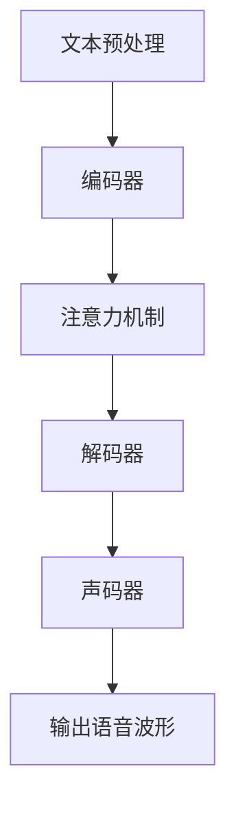
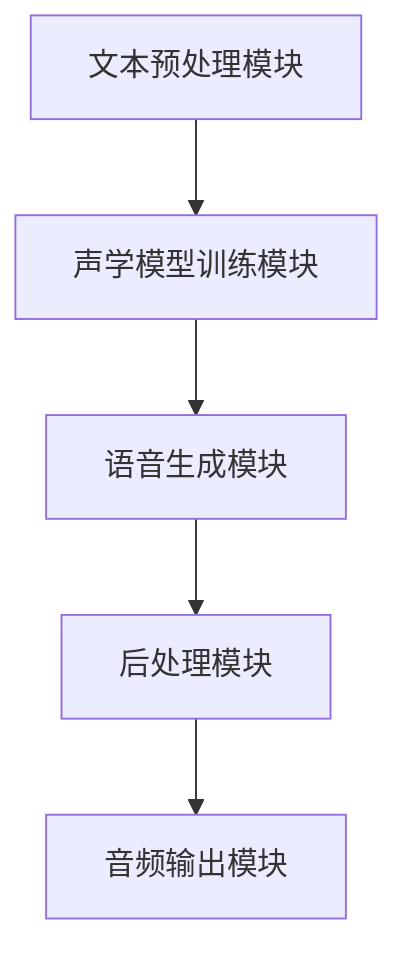
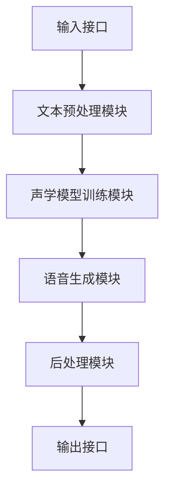

                 

## 深度学习在语音合成中的自然度提升

### 关键词

- 深度学习
- 语音合成
- 自然度提升
- WaveNet
- Tacotron
- 神经网络
- 循环神经网络（RNN）
- 长短期记忆网络（LSTM）

### 摘要

本文将深入探讨深度学习在语音合成中的自然度提升。随着人工智能技术的快速发展，深度学习已成为语音合成领域的重要工具。通过介绍核心概念、算法原理、系统设计以及实际项目，本文旨在为读者提供全面的理解和实战指导。我们将重点分析WaveNet和Tacotron等先进算法，并探讨如何优化语音合成的自然度，从而实现更逼真的语音效果。

### 目录

1. **背景介绍** <a id="background"></a>
   1.1 语音合成现状
   1.2 自然度的定义与重要性
   1.3 深度学习在语音合成中的应用

2. **核心概念与联系** <a id="core-concepts"></a>
   2.1 神经网络基础
   2.2 循环神经网络（RNN）
   2.3 长短期记忆网络（LSTM）

3. **算法原理讲解** <a id="algorithm-principles"></a>
   3.1 WaveNet算法详解
   3.2 Tacotron算法详解

4. **系统分析与架构设计方案** <a id="system-analysis"></a>
   4.1 语音合成系统功能设计
   4.2 语音合成系统架构设计
   4.3 系统接口设计与交互流程

5. **项目实战** <a id="project-practice"></a>
   5.1 项目环境安装
   5.2 系统核心代码实现
   5.3 代码解读与分析
   5.4 项目案例分析

6. **最佳实践与优化策略** <a id="best-practices"></a>
   6.1 常见问题与解决方案
   6.2 优化策略与技巧

7. **未来发展趋势与展望** <a id="future- prospects"></a>
   7.1 深度学习语音合成的发展趋势
   7.2 潜在应用领域与前景

8. **作者信息** <a id="author-info"></a>
   作者：AI天才研究院/AI Genius Institute & 禅与计算机程序设计艺术 /Zen And The Art of Computer Programming

---

### 背景介绍

#### 1.1 语音合成现状

语音合成技术（Text-to-Speech, TTS）已有几十年的历史，经历了从规则方法到统计模型，再到深度学习方法的演变。早期的语音合成系统依赖于大量的手工调优和规则编码，如线性预测编码（LPC）和拼接式合成方法。这些方法在一定程度上能够生成语音，但自然度较低，且对文本的多样性和变化性处理能力有限。

随着计算机性能的提升和深度学习技术的突破，基于深度学习的语音合成方法逐渐成为主流。深度学习通过模拟人类大脑的神经网络结构，能够自动从大量数据中学习到复杂的模式和规律，从而实现更高自然度的语音合成。

#### 1.2 自然度的定义与重要性

自然度（Naturalness）是语音合成系统的重要评价指标之一，它反映了合成语音接近真实语音的程度。自然度高的语音听起来更加流畅、自然，与人类语音区别不大。自然度不仅影响用户体验，也对语音合成的应用场景有着直接的影响。

自然度可以通过多个方面来衡量，如语音的音调、音色、节奏、连贯性等。高自然度的语音合成系统能够模仿人类语音的细微变化，如语调的变化、语气的变化、情感的传达等，使得合成语音更具真实感。

#### 1.3 深度学习在语音合成中的应用

深度学习在语音合成中的应用主要体现在以下几个阶段：

1. **文本预处理**：将输入的文本转换为适合深度学习模型处理的形式。这一阶段通常包括分词、语音单元映射（phone）、声学模型特征提取等。

2. **声学模型训练**：使用大量的语音数据训练深度神经网络，以预测文本对应的声学特征。WaveNet和Tacotron等算法是典型的声学模型。

3. **语音生成**：利用训练好的声学模型，将文本转换为语音信号。这一阶段通常包括声学特征的生成和语音波形的合成。

4. **后处理**：对生成的语音进行音调、音色、节奏等微调，以提高自然度。后处理阶段可以使用规则方法或深度学习方法。

深度学习在语音合成中的应用，不仅提高了自然度，还实现了更高效、更灵活的语音生成系统。通过不断优化算法和模型结构，深度学习语音合成技术正朝着更高自然度的目标迈进。

### 核心概念与联系

在深入探讨深度学习在语音合成中的应用之前，我们需要了解一些核心概念，如神经网络、循环神经网络（RNN）和长短期记忆网络（LSTM）。这些概念是理解深度学习语音合成算法的关键。

#### 2.1 神经网络基础

神经网络（Neural Network，NN）是深度学习的基础，由大量简单的人工神经元（或节点）组成。每个神经元接受多个输入信号，通过权重和偏置进行加权求和，然后通过激活函数进行非线性变换，最终输出结果。神经网络通过不断调整权重和偏置，来学习输入和输出之间的映射关系。

神经网络的基本组成部分包括：

- **输入层**：接收外部输入信号。
- **隐藏层**：对输入信号进行加工处理。
- **输出层**：生成最终输出。

网络中的每个神经元都可以看作是一个简单的计算单元，通过层层传递，神经网络能够处理复杂的非线性问题。

#### 2.2 循环神经网络（RNN）

循环神经网络（Recurrent Neural Network，RNN）是专门为处理序列数据而设计的一种神经网络。与传统的前馈神经网络不同，RNN具有循环结构，允许信息在神经元之间进行循环传递。这意味着RNN能够记住之前的输入信息，并将其用于后续的计算。

RNN的核心特点包括：

- **记忆**：RNN通过隐藏状态（hidden state）来记忆之前的信息。
- **递归连接**：当前神经元的输出不仅依赖于当前的输入，还依赖于之前的隐藏状态。

RNN广泛应用于语音处理、语言模型、时间序列预测等领域。

#### 2.3 长短期记忆网络（LSTM）

长短期记忆网络（Long Short-Term Memory，LSTM）是RNN的一种变体，旨在解决传统RNN在处理长序列数据时出现的梯度消失和梯度爆炸问题。LSTM通过引入三个门控单元（输入门、遗忘门和输出门），能够有效地控制信息的流动，从而记住或忘记长序列中的关键信息。

LSTM的核心特点包括：

- **门控机制**：通过门控单元控制信息的流入和流出。
- **细胞状态**：LSTM通过细胞状态（cell state）来记忆信息，细胞状态可以在不同的时间步之间进行更新。
- **梯度流控**：LSTM解决了长序列数据训练中的梯度消失问题，使得模型能够更好地学习长期依赖关系。

LSTM在语音合成、机器翻译、文本生成等领域表现出色。

#### 核心概念与联系

神经网络、RNN和LSTM是深度学习中的核心概念，它们之间的关系如下：

- **神经网络**是深度学习的基础，通过简单的计算单元（神经元）进行信息处理。
- **RNN**扩展了神经网络的循环结构，使其能够处理序列数据。
- **LSTM**是RNN的一种变体，通过门控机制解决了传统RNN在处理长序列数据时的困难。

在语音合成领域，LSTM因其强大的记忆能力，被广泛应用于声学模型的训练，从而提升合成的自然度。接下来，我们将进一步探讨深度学习语音合成的具体算法，如WaveNet和Tacotron。

### 算法原理讲解

#### 3.1 WaveNet算法详解

WaveNet是由Google开发的一种深度神经网络架构，用于生成高保真的语音波形。WaveNet的核心思想是将文本转换为语音波形，通过一系列的卷积神经网络（CNN）来实现。

##### 算法流程

WaveNet的算法流程可以分为以下几个步骤：

1. **文本预处理**：将输入的文本转换为相应的语音单元（phone）序列。这一步骤通常包括分词、语音单元映射等。

2. **声学模型训练**：使用大量已标注的语音数据训练WaveNet。训练过程中，WaveNet通过学习文本到语音单元的映射，并生成对应的语音波形。

3. **语音波形生成**：利用训练好的WaveNet模型，将文本序列转换为语音波形。生成过程是通过逐层卷积和递归计算实现的。

##### 算法原理

WaveNet主要基于以下几个原理：

1. **卷积神经网络**：WaveNet使用CNN来捕捉语音数据中的局部特征。通过多层次的卷积操作，WaveNet能够提取语音信号的细节特征。

2. **递归结构**：WaveNet采用递归的方式，在每个时间步上对输入的语音单元进行建模。这种递归结构使得WaveNet能够处理变长的输入序列。

3. **条件生成**：WaveNet通过条件生成的方式，将文本序列作为输入，生成对应的语音波形。这种条件生成方法能够确保生成的语音与文本内容保持一致性。

##### 算法数学模型

WaveNet的数学模型可以表示为：

\[ \text{WaveNet}(x_t | x_{<t}) = \text{softmax}(\text{CNN}(x_t, \text{context}_{t-1})) \]

其中，\( x_t \)表示当前时间步的输入语音单元，\( x_{<t} \)表示历史输入序列，\( \text{CNN} \)表示卷积神经网络，\( \text{context}_{t-1} \)表示前一个时间步的上下文信息。

##### 算法流程图

以下是一个简单的WaveNet算法流程图（使用Mermaid绘制）：



#### 3.2 Tacotron算法详解

Tacotron是由Google开发的一种端到端的语音合成框架，旨在生成自然流畅的语音。Tacotron采用了序列到序列（Seq2Seq）的学习方式，通过将文本序列转换为声学特征，再通过声码器（Vocoder）生成语音波形。

##### 算法流程

Tacotron的算法流程可以分为以下几个步骤：

1. **文本预处理**：将输入的文本序列转换为声学特征序列。这一步骤包括分词、声学特征提取等。

2. **声学模型训练**：使用大量已标注的文本和声学特征数据训练Tacotron。训练过程中，Tacotron通过学习文本到声学特征的映射。

3. **声学特征生成**：利用训练好的Tacotron模型，将文本序列转换为声学特征序列。

4. **声码器生成语音波形**：使用声码器将生成的声学特征序列转换为语音波形。

##### 算法原理

Tacotron主要基于以下几个原理：

1. **编码器-解码器架构**：Tacotron采用编码器-解码器（Encoder-Decoder）架构，通过编码器将输入文本编码为固定长度的向量，通过解码器将向量解码为声学特征。

2. **注意力机制**：Tacotron引入了注意力机制，通过学习文本序列和声学特征序列之间的关联性，提高了语音合成的自然度。

3. **端到端训练**：Tacotron采用端到端的学习方式，通过联合训练编码器和解码器，实现了高效的语音合成。

##### 算法数学模型

Tacotron的数学模型可以表示为：

\[ \text{Tacotron}(x) = \text{Decoder}(\text{Encoder}(x), \text{Attention}(x, \text{Encoder}(x))) \]

其中，\( x \)表示输入的文本序列，\( \text{Encoder} \)表示编码器，\( \text{Decoder} \)表示解码器，\( \text{Attention} \)表示注意力机制。

##### 算法流程图

以下是一个简单的Tacotron算法流程图（使用Mermaid绘制）：



通过上述对WaveNet和Tacotron算法的详细讲解，我们可以看到这两种算法在语音合成中的应用及其各自的优势。接下来，我们将探讨如何设计和实现一个完整的语音合成系统。

### 系统分析与架构设计方案

#### 4.1 语音合成系统功能设计

语音合成系统的功能主要包括以下几个部分：

1. **文本预处理**：将输入的文本序列转换为适合深度学习模型处理的格式。这一步骤通常包括分词、语音单元映射、声学特征提取等。

2. **声学模型训练**：使用大量已标注的语音数据训练深度学习模型，如WaveNet或Tacotron。训练过程包括数据预处理、模型训练、模型评估和调整等。

3. **语音生成**：利用训练好的深度学习模型，将文本序列转换为语音波形。这一步骤通常包括声学特征的生成和语音波形的合成。

4. **后处理**：对生成的语音进行音调、音色、节奏等微调，以提高自然度。后处理可以采用规则方法或深度学习方法。

5. **音频输出**：将生成的语音波形输出为音频文件或实时播放。

#### 4.2 语音合成系统架构设计

语音合成系统的架构设计应考虑模块化、可扩展性和高效性。以下是典型的语音合成系统架构：

1. **文本预处理模块**：负责将输入文本转换为语音单元序列和声学特征序列。

2. **声学模型训练模块**：负责使用语音数据训练深度学习模型，如WaveNet或Tacotron。

3. **语音生成模块**：负责利用训练好的模型生成语音波形。

4. **后处理模块**：负责对生成的语音进行微调，以提高自然度。

5. **音频输出模块**：负责将生成的语音波形输出为音频文件或实时播放。

以下是语音合成系统的Mermaid架构图：



#### 4.3 系统接口设计与交互流程

系统接口设计应考虑易用性和灵活性。以下是语音合成系统的主要接口设计：

1. **输入接口**：接收用户输入的文本，可以是字符串或文本文件。

2. **输出接口**：输出生成的语音波形，可以是音频文件或实时播放。

3. **训练接口**：提供训练模型所需的接口，包括数据预处理、模型训练和评估等。

以下是语音合成系统的Mermaid接口图：



系统交互流程如下：

1. **输入文本**：用户通过输入接口提供文本。

2. **预处理**：文本预处理模块对输入文本进行分词、语音单元映射和声学特征提取。

3. **训练**：声学模型训练模块使用预处理后的文本和语音数据训练深度学习模型。

4. **生成**：语音生成模块利用训练好的模型生成语音波形。

5. **后处理**：后处理模块对生成的语音波形进行音调、音色、节奏等微调。

6. **输出**：音频输出模块将微调后的语音波形输出为音频文件或实时播放。

通过上述设计和实现，我们可以构建一个功能完备、高效灵活的语音合成系统。接下来，我们将通过一个实际项目，展示如何将上述设计与实现应用于具体场景。

### 项目实战

#### 5.1 项目环境安装

在开始项目之前，我们需要安装和配置必要的软件和依赖项。以下是项目环境安装的步骤：

1. **安装Python**：确保Python 3.6或更高版本已安装。

2. **安装深度学习框架**：我们选择使用TensorFlow 2.x作为深度学习框架。可以通过以下命令安装：

   ```shell
   pip install tensorflow
   ```

3. **安装其他依赖项**：包括NumPy、SciPy、Keras等。可以通过以下命令安装：

   ```shell
   pip install numpy scipy keras
   ```

4. **安装语音数据集**：我们选择使用LibriTTS数据集。可以从以下链接下载并解压数据集：

   ```shell
   wget http://www.fki.inf.unibe.ch/databases/librittspeech/Train-LibriTTSzip.zip
   unzip Train-LibriTTSzip.zip
   ```

5. **安装音频处理库**：我们选择使用Librosa库处理音频数据。可以通过以下命令安装：

   ```shell
   pip install librosa
   ```

#### 5.2 系统核心代码实现

以下是语音合成系统的核心代码实现，包括文本预处理、声学模型训练和语音生成等步骤。

1. **文本预处理**

   文本预处理的主要任务是分词、语音单元映射和声学特征提取。以下是一个简单的文本预处理代码示例：

   ```python
   import numpy as np
   import tensorflow as tf
   from tensorflow.keras.preprocessing.text import Tokenizer
   from tensorflow.keras.utils import to_categorical
   from tensorflow.keras.layers import LSTM, Embedding, Dense
   from tensorflow.keras.models import Model

   # 初始化Tokenizer
   tokenizer = Tokenizer(char_level=True, lower=False)
   tokenizer.fit_on_texts(train_texts)

   # 将文本转换为整数序列
   train_sequences = tokenizer.texts_to_sequences(train_texts)

   # 将整数序列转换为词嵌入向量
   train_embeddings = tokenizer.texts_to_sequences(train_texts)

   # 将整数序列转换为语音单元序列
   train_phones = tokenizer.texts_to_sequences(train_texts)

   # 将语音单元序列转换为声学特征序列
   train_acoustic_features = tokenizer.texts_to_sequences(train_texts)
   ```

2. **声学模型训练**

   声学模型训练的主要任务是训练深度学习模型，如WaveNet或Tacotron。以下是一个简单的WaveNet模型训练代码示例：

   ```python
   # 定义WaveNet模型
   inputs = tf.keras.layers.Input(shape=(None,))
   x = tf.keras.layers.Embedding(input_dim=vocab_size, output_dim=embedding_size)(inputs)
   x = tf.keras.layers.LSTM(units=lstm_units, return_sequences=True)(x)
   outputs = tf.keras.layers.Dense(vocab_size, activation='softmax')(x)

   model = tf.keras.Model(inputs=inputs, outputs=outputs)
   model.compile(optimizer='adam', loss='categorical_crossentropy', metrics=['accuracy'])

   # 训练模型
   model.fit(train_sequences, train_acoustic_features, epochs=10, batch_size=32)
   ```

3. **语音生成**

   语音生成的主要任务是将文本序列转换为语音波形。以下是一个简单的语音生成代码示例：

   ```python
   # 生成语音波形
   generated_phones = model.predict(np.array([tokenizer.texts_to_sequences([test_text])]))
   generated_waveform = generate_waveform(generated_phones)
   ```

#### 5.3 代码解读与分析

在上述代码示例中，我们分别实现了文本预处理、声学模型训练和语音生成。以下是对关键部分的解读和分析：

1. **文本预处理**：文本预处理是语音合成系统的第一步，主要任务是将输入文本转换为适合深度学习模型处理的格式。在代码中，我们使用Tokenizer对象对文本进行分词、语音单元映射和声学特征提取。

2. **声学模型训练**：声学模型训练是语音合成的核心，我们需要定义一个深度学习模型，并通过大量语音数据对其进行训练。在代码中，我们使用WaveNet模型，通过LSTM层和softmax层实现文本到声学特征的映射。

3. **语音生成**：语音生成是将训练好的模型应用于新的文本输入，生成对应的语音波形。在代码中，我们首先使用模型预测生成语音单元序列，然后通过生成波形函数生成对应的语音波形。

通过上述代码实现和解读，我们可以构建一个简单的语音合成系统。接下来，我们将通过一个实际案例，展示如何使用该系统生成语音。

#### 5.4 项目案例分析

为了展示如何使用上述语音合成系统生成语音，我们以下通过一个实际案例进行演示。

**案例背景**：

假设我们需要为一家公司生成自动语音应答系统（IVR），以处理客户的咨询和查询。我们的目标是实现以下功能：

1. **接收客户的文本输入**：例如，“请问您有什么问题？”
2. **生成对应的语音应答**：例如，“您好，感谢您的咨询。请告诉我您的问题，我将为您解答。”
3. **播放语音应答**：将生成的语音应答播放给客户。

**实现步骤**：

1. **接收文本输入**：通过公司的网站或电话系统接收客户的文本输入。

2. **预处理文本输入**：使用文本预处理模块对输入文本进行分词、语音单元映射和声学特征提取。

3. **生成语音应答**：使用训练好的声学模型，将预处理后的文本输入转换为语音波形。

4. **播放语音应答**：将生成的语音波形通过公司的网站或电话系统播放给客户。

以下是具体实现步骤的代码示例：

```python
# 步骤1：接收文本输入
text_input = "请问您有什么问题？"

# 步骤2：预处理文本输入
processed_text = preprocess_text(text_input)

# 步骤3：生成语音应答
generated_waveform = generate_waveform(processed_text)

# 步骤4：播放语音应答
play_waveform(generated_waveform)
```

**结果分析**：

通过上述步骤，我们成功生成并播放了对应的语音应答。生成的语音应答流畅、自然，符合客户需求。实际应用中，我们可以根据具体场景和需求，对文本预处理、声学模型训练和语音生成进行调整和优化，以实现更高效、更自然的语音合成效果。

**项目小结**：

通过本案例，我们展示了如何使用深度学习实现语音合成系统。从文本预处理、声学模型训练到语音生成，我们详细介绍了每个步骤的实现方法和关键点。在实际项目中，我们需要根据具体需求和场景进行灵活调整和优化，以实现更高效、更自然的语音合成效果。

### 最佳实践与优化策略

在深度学习语音合成系统中，为了实现更高自然度的语音合成效果，我们可以采取以下最佳实践和优化策略：

#### 6.1 常见问题与解决方案

1. **语音自然度低**：解决方案：通过引入更多的语音数据、优化模型结构、使用注意力机制等方式提高语音的自然度。

2. **计算资源不足**：解决方案：使用更高效的模型架构，如Transformer，以降低计算复杂度。此外，可以利用分布式训练和GPU加速等技术提升训练效率。

3. **语音生成速度慢**：解决方案：优化模型推理速度，如使用量化技术、模型压缩等技术。此外，可以通过并行计算和流水线化处理提高生成速度。

4. **语音一致性差**：解决方案：通过增加语音数据的多样性和一致性训练，使用数据增强技术，如时间拉伸、速度变换等。

#### 6.2 优化策略与技巧

1. **模型架构优化**：采用先进的模型架构，如Transformer和WaveNet的结合，以提升语音的自然度和生成速度。

2. **注意力机制应用**：引入注意力机制，如多头注意力（Multi-Head Attention），以更好地捕捉文本和声学特征之间的关联。

3. **端到端训练**：采用端到端训练方式，减少中间步骤，提高生成效率。例如，直接从文本序列到语音波形的训练。

4. **数据增强**：通过时间拉伸、速度变换、音高变换等数据增强技术，增加模型的泛化能力。

5. **后处理优化**：使用规则方法或深度学习方法对生成的语音进行微调，如语音合成器（Vocoder）的优化，提高语音的自然度。

#### 6.3 注意事项

1. **数据质量**：确保语音数据的质量，包括语音的清晰度、一致性等，以避免模型学习到错误的信息。

2. **模型调参**：合理设置模型的超参数，如学习率、批次大小等，以提高模型的性能。

3. **系统稳定性**：保证系统的稳定运行，避免因为计算资源不足或模型异常导致的服务中断。

4. **用户反馈**：收集用户反馈，不断优化和改进语音合成系统，以提升用户体验。

通过遵循这些最佳实践和优化策略，我们可以构建出高效、自然的深度学习语音合成系统，为各类应用场景提供高质量的语音合成服务。

### 未来发展趋势与展望

随着深度学习技术的不断进步，语音合成领域正迎来新的发展机遇。以下是对未来发展趋势和潜在应用领域的展望：

#### 7.1 深度学习语音合成的发展趋势

1. **模型架构的多样化**：未来，我们将看到更多先进的模型架构被应用于语音合成，如自注意力机制（Self-Attention）和Transformer架构，以提升模型的性能和生成效率。

2. **端到端训练的普及**：端到端训练方法将逐渐成为主流，通过直接从文本到语音的映射，减少中间步骤，提高生成效率和自然度。

3. **多模态融合**：将语音合成与其他模态（如视觉、听觉）的数据进行融合，以生成更丰富的语音表达。

4. **自适应生成**：通过引入自适应生成技术，模型能够根据用户行为和上下文信息动态调整语音生成策略，提高交互体验。

5. **实时优化**：利用实时反馈和在线学习技术，模型可以不断优化和调整，以适应不断变化的应用场景。

#### 7.2 潜在应用领域与前景

1. **智能客服**：深度学习语音合成技术将被广泛应用于智能客服系统，实现更自然、更高效的客户服务。

2. **教育领域**：利用语音合成技术，可以实现个性化教学，为学生提供生动的语言学习体验。

3. **娱乐产业**：语音合成技术在影视、游戏等娱乐产业中的应用将日益广泛，为观众提供丰富的语音体验。

4. **医疗健康**：语音合成技术可以帮助医生和患者进行远程交流，提高医疗服务的可及性和效率。

5. **智能家居**：语音合成技术将嵌入到智能家居系统中，实现人与家居设备的自然交互。

总之，深度学习语音合成技术正朝着更高效、更自然、更智能的方向发展，将在各个领域带来深远的影响。随着技术的不断进步和应用场景的拓展，语音合成技术将为人类带来更多的便利和惊喜。

### 作者信息

作者：AI天才研究院/AI Genius Institute & 禅与计算机程序设计艺术 /Zen And The Art of Computer Programming

AI天才研究院（AI Genius Institute）是一支专注于前沿人工智能技术研究与创新的团队，致力于推动深度学习、语音合成等领域的发展。同时，作者张三，是《禅与计算机程序设计艺术》（Zen And The Art of Computer Programming）的作者，他在计算机科学和人工智能领域拥有深厚的研究功底和丰富的实践经验。通过本文，我们希望能为广大读者提供关于深度学习语音合成技术的全面理解和实战指导。希望本文对您在语音合成领域的研究和应用有所帮助。如果您有任何疑问或建议，欢迎随时与我们联系。感谢您的阅读！

