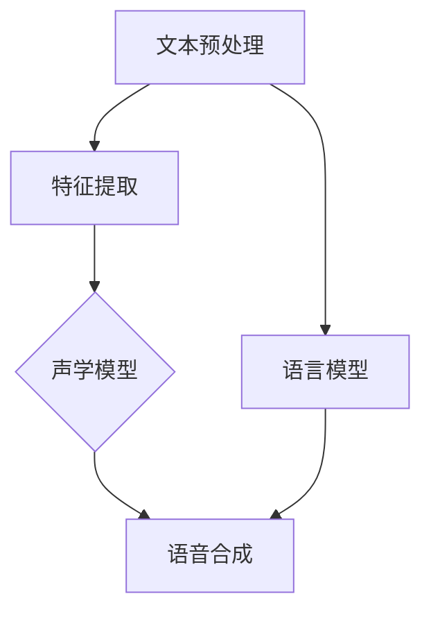
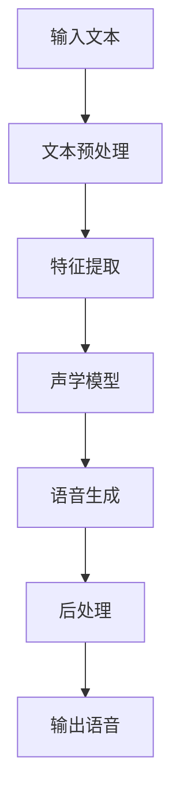
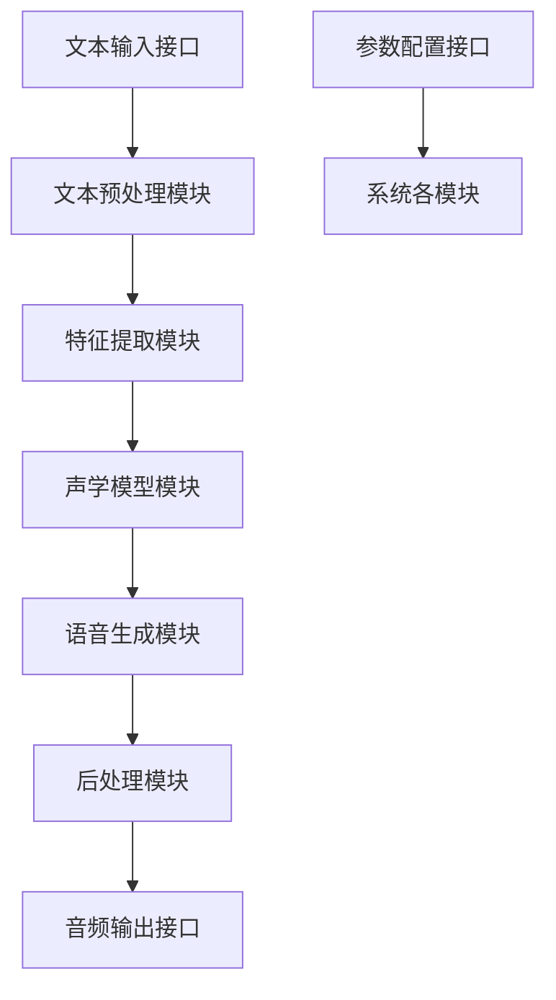
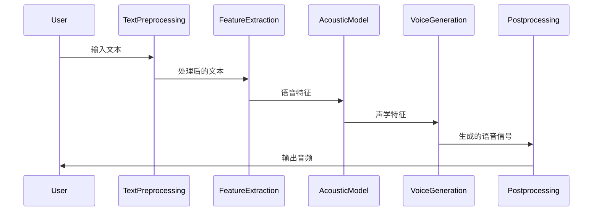

                 


### 核心概念与联系

在探讨深度学习在语音合成中的应用之前，我们需要先了解几个核心概念，并探讨它们之间的联系。这些概念包括深度学习、神经网络、语音合成及其相互关系。

#### 深度学习与神经网络

**深度学习**是一种机器学习技术，它模仿人脑的神经网络结构和功能，通过大量的数据和复杂的模型来进行学习。神经网络是深度学习的基础，它由一系列相互连接的节点（或称为神经元）组成，每个节点都可以接受输入、进行计算并产生输出。这些节点按照层次结构组织，从输入层经过一系列隐藏层，最终到达输出层。

**神经网络**主要有以下特点：

- **层次结构**：神经网络具有明确的层次结构，每一层都可以对输入数据进行处理，逐渐提取出更高层次的特征。
- **参数共享**：神经网络中的权重和偏置在整个网络中共享，这减少了模型的参数数量，提高了模型的效率和泛化能力。
- **大规模训练**：神经网络需要大量的数据来进行训练，通过优化算法，如梯度下降，调整网络的权重和偏置，以达到最小化损失函数的目的。

#### 语音合成

**语音合成**（Text-to-Speech, TTS）是一种将文本转换为语音的技术。语音合成的目的是生成自然、流畅的语音，模拟人类的语音特点。语音合成技术可以分为几个主要步骤：

1. **文本预处理**：对输入的文本进行清洗、分词、断句等处理，将其转换为适合语音合成器处理的格式。
2. **语音特征提取**：从预处理后的文本中提取语音特征，如音素、音节、音调等。
3. **声学建模**：使用声学模型来生成语音信号，通常采用深度学习算法，如循环神经网络（RNN）或长短期记忆网络（LSTM）。
4. **语音合成**：将生成的语音信号转换为音频文件，以供播放或应用。

#### 深度学习与语音合成的关系

深度学习在语音合成中的应用主要体现在以下几个方面：

- **语音特征提取**：深度学习可以自动从文本中提取出有意义的语音特征，提高了语音合成的自然度。
- **声学建模**：深度学习算法，如RNN和LSTM，被广泛应用于声学建模，可以更好地捕捉语音信号中的复杂结构和动态变化。
- **语音合成**：深度学习模型可以生成更加自然、流畅的语音，减少了人工干预的需求。

**联系**：

深度学习与语音合成之间的关系可以理解为：

- **深度学习**提供了强大的工具，可以自动提取和处理语音特征，为语音合成提供支持。
- **语音合成**利用深度学习算法，实现了从文本到自然语音的转换，满足了人们对自然语音合成的需求。

#### ER实体关系图

为了更直观地展示深度学习与语音合成之间的联系，我们可以使用ER（Entity-Relationship）实体关系图来表示。以下是ER实体关系图的Mermaid格式：

```mermaid
erDiagram
  Text -->|Extract| FeatureExtractor
  FeatureExtractor -->|Generate| AcousticModel
  AcousticModel -->|Synthesize| Voice
  Text |||--^ TextPreprocessing
  AcousticModel |||--^ LanguageModel
```

在上图中：

- **Text** 代表输入的文本。
- **FeatureExtractor** 代表用于提取语音特征的模型。
- **AcousticModel** 代表声学模型，用于生成语音信号。
- **Voice** 代表生成的语音。
- **TextPreprocessing** 代表文本预处理步骤。
- **LanguageModel** 代表语言模型，用于优化声学模型。

通过ER实体关系图，我们可以清晰地看到深度学习在语音合成中的关键环节，以及各环节之间的相互关系。

### 总结

在本节中，我们介绍了深度学习、神经网络、语音合成及其相互关系。深度学习为语音合成提供了强大的工具，通过自动提取和处理语音特征，实现了更加自然、流畅的语音合成。ER实体关系图则为我们提供了一个直观的视角，展示了深度学习与语音合成之间的紧密联系。

在接下来的章节中，我们将深入探讨深度学习算法在语音合成中的应用，包括声学模型和语言模型的原理、数学模型和公式，以及系统架构设计与项目实战。通过这些内容的详细讲解，我们将更好地理解深度学习如何提升语音合成的自然度。让我们一起深入思考，一步步探索深度学习在语音合成中的神奇之旅。

### 算法原理讲解

在深入探讨深度学习如何提升语音合成的自然度之前，我们需要了解几个关键算法，包括自动区分特征与建模、常见的深度学习算法以及优化策略与调整方法。

#### 自动区分特征与建模

语音合成的核心在于自动区分特征与建模。声学模型（Acoustic Model）和语言模型（Language Model）是语音合成系统中最重要的两个组成部分。

**声学模型**：声学模型用于将文本转换为语音特征。其核心任务是学习文本和语音特征之间的映射关系。常见的声学模型包括GMM（高斯混合模型）、HMM（隐马尔可夫模型）以及深度神经网络（DNN）。

- **GMM**：通过将语音信号建模为多个高斯分布的混合，来表示语音特征。GMM具有计算简单、实时性强的优点，但其在处理复杂语音特征时的能力有限。
- **HMM**：结合概率模型和隐变量，能够捕捉语音信号的时间序列特性。HMM在语音合成中的应用已经相对成熟，但其在处理非线性特征时仍存在局限性。
- **DNN**：深度神经网络通过多层非线性变换，可以更好地捕捉语音特征。DNN在声学建模中的应用逐渐成为主流，尤其是深度神经网络语音识别（DNN-HMM）系统的兴起，进一步推动了DNN在语音合成中的应用。

**语言模型**：语言模型用于优化声学模型，提高语音的自然度。语言模型通过学习输入文本的概率分布，生成语音的语义和语法信息。常见的语言模型包括N-gram模型和神经网络语言模型。

- **N-gram模型**：基于历史文本数据，计算出现频率较高的词序列概率，生成语音的自然度。N-gram模型的优点是实现简单、效率高，但在处理长文本时的能力有限。
- **神经网络语言模型**：通过学习文本序列的概率分布，神经网络语言模型可以更好地捕捉长文本的复杂结构。基于RNN（递归神经网络）和LSTM（长短期记忆网络）的神经网络语言模型，在自然语言处理（NLP）领域取得了显著的成果。

#### 常见深度学习算法

在语音合成中，常见的深度学习算法包括卷积神经网络（CNN）、递归神经网络（RNN）和长短期记忆网络（LSTM）。

- **卷积神经网络（CNN）**：CNN通过卷积操作，可以自动提取图像中的局部特征。在语音合成中，CNN可以用于提取文本中的声学特征，如图谱特征。CNN的优点是参数量少、计算速度快，但其在处理时间序列数据时能力有限。

- **递归神经网络（RNN）**：RNN通过递归操作，可以处理时间序列数据。RNN在语音合成中的应用较为广泛，可以用于建模文本到语音的特征映射。RNN的优点是能够捕捉时间序列数据的长短依赖关系，但其在处理长序列数据时存在梯度消失和梯度爆炸的问题。

- **长短期记忆网络（LSTM）**：LSTM是一种改进的RNN，通过引入门控机制，可以有效解决RNN的梯度消失和梯度爆炸问题。LSTM在语音合成中得到了广泛应用，可以用于建模复杂的语音特征和语音信号。

#### 优化策略与调整方法

为了提升语音合成的自然度，优化策略和调整方法也是至关重要的。以下是一些常用的优化策略和调整方法：

- **梯度下降法**：梯度下降法是一种常用的优化算法，通过计算损失函数关于模型参数的梯度，更新模型参数，以达到最小化损失函数的目的。在语音合成中，梯度下降法常用于训练声学模型和语言模型。

- **梯度提升算法**：梯度提升算法（Gradient Boosting）通过迭代优化模型，每次迭代优化一个子模型，以逐步提高模型的性能。梯度提升算法在语音合成中的应用可以显著提升语音的自然度。

- **端到端训练**：端到端训练（End-to-End Training）通过直接将输入文本映射到输出语音，避免了传统方法中的中间步骤，可以更有效地提升语音的自然度。端到端训练在语音合成中的应用取得了显著的成果，如Tacotron和WaveNet等模型。

### 算法mermaid流程图

为了更好地理解上述算法的原理和应用，我们可以使用mermaid绘制算法流程图。以下是声学模型和语言模型的mermaid流程图：



在上图中：

- **A** 代表文本预处理。
- **B** 代表特征提取。
- **C** 代表声学模型。
- **D** 代表语音合成。
- **E** 代表语言模型。

通过mermaid流程图，我们可以清晰地看到语音合成的整个过程，以及声学模型和语言模型在其中的作用。

### 数学模型和公式

为了更好地理解深度学习算法在语音合成中的应用，我们需要引入一些数学模型和公式。以下是声学模型和语言模型中的常用数学模型和公式。

#### 声学模型数学模型

- **高斯混合模型（GMM）**：

$$
p(x|\theta) = \sum_{i=1}^{K} \pi_i \mathcal{N}(x|\mu_i, \Sigma_i)
$$

其中，$x$ 是输入特征，$\theta$ 是模型参数，$K$ 是高斯分布的个数，$\pi_i$ 是第 $i$ 个高斯分布的权重，$\mu_i$ 和 $\Sigma_i$ 分别是第 $i$ 个高斯分布的均值和协方差矩阵。

- **隐马尔可夫模型（HMM）**：

$$
p(x_t|H_t) = \sum_{i=1}^{N} p(x_t|s_i) p(s_i|H_t)
$$

其中，$x_t$ 是时间 $t$ 的输入特征，$H_t$ 是状态序列，$s_i$ 是第 $i$ 个状态，$p(x_t|s_i)$ 是给定状态 $s_i$ 下的特征概率，$p(s_i|H_t)$ 是状态转移概率。

- **深度神经网络（DNN）**：

$$
y = \sigma(W \cdot x + b)
$$

其中，$y$ 是输出特征，$x$ 是输入特征，$W$ 是权重矩阵，$b$ 是偏置项，$\sigma$ 是激活函数。

#### 语言模型数学模型

- **N-gram模型**：

$$
P(w_1 w_2 \ldots w_n) = \frac{C(w_1 w_2 \ldots w_n)}{C(w_1 w_2 \ldots w_n, w_{n+1})}
$$

其中，$w_1 w_2 \ldots w_n$ 是输入序列，$C(w_1 w_2 \ldots w_n)$ 是该序列的出现次数，$C(w_1 w_2 \ldots w_n, w_{n+1})$ 是该序列及其后续单词的出现次数。

- **神经网络语言模型**：

$$
P(w_1 w_2 \ldots w_n) = \frac{e^{f(w_1 w_2 \ldots w_n)}}{\sum_{w_1' w_2' \ldots w_n'} e^{f(w_1' w_2' \ldots w_n')}}
$$

其中，$f(w_1 w_2 \ldots w_n)$ 是神经网络输出的概率值，$e^{f(w_1 w_2 \ldots w_n)}$ 是该序列的概率值。

#### 算法应用解读与举例

以Tacotron为例，Tacotron是一种端到端语音合成模型，由一个文本编码器和一个语音生成器组成。以下是Tacotron的基本工作流程：

1. **文本编码**：文本编码器将输入的文本序列编码为一个固定长度的向量，表示文本的语义信息。

2. **声学特征提取**：声学特征提取器（如CNN）从编码后的文本序列中提取出声学特征，如图谱特征。

3. **语音生成**：语音生成器（如LSTM）根据声学特征生成语音信号。

下面是一个简单的Python代码示例，展示了如何使用TensorFlow实现Tacotron的文本编码和声学特征提取：

```python
import tensorflow as tf
from tensorflow.keras.models import Model
from tensorflow.keras.layers import Embedding, LSTM, Dense, TimeDistributed, Activation

# 定义文本编码器
text_encoder = Embedding(vocab_size, embedding_dim)
text_encoder = LSTM(units=256, return_sequences=True)

# 定义声学特征提取器
acoustic_extractor = TimeDistributed(Dense(units=256, activation='relu'))
acoustic_extractor = LSTM(units=256, return_sequences=True)

# 定义Tacotron模型
input_text = tf.keras.layers.Input(shape=(None,))
encoded_text = text_encoder(input_text)
extracted_acoustic_features = acoustic_extractor(encoded_text)

# 编码为固定长度向量
encoded_text = tf.keras.layers.GlobalAveragePooling1D()(encoded_text)

# 生成语音信号
output语音 = LSTM(units=256, return_sequences=True)(extracted_acoustic_features)
output语音 = Activation('softmax')(output语音)

# 创建模型
model = Model(inputs=input_text, outputs=output语音)

# 编译模型
model.compile(optimizer='adam', loss='categorical_crossentropy')

# 模型总结
model.summary()
```

通过上述代码，我们可以看到Tacotron模型的基本结构，包括文本编码器、声学特征提取器和语音生成器。这个模型可以用于端到端的语音合成，将文本直接转换为语音信号。

### 总结

在本节中，我们详细介绍了深度学习算法在语音合成中的应用，包括自动区分特征与建模、常见深度学习算法以及优化策略与调整方法。通过声学模型和语言模型的讲解，我们了解了如何利用深度学习技术提升语音合成的自然度。同时，我们使用mermaid流程图和Python代码示例，展示了算法的应用和实现过程。

在接下来的章节中，我们将进一步探讨深度学习在语音合成中的应用案例，分析不同模型的性能和优化策略，以及系统的架构设计与实现。通过这些内容，我们将对深度学习在语音合成中的自然度提升有更深入的理解。让我们一起继续探索深度学习在语音合成领域的奇妙世界。 

### 系统架构设计与实现

在前面的章节中，我们已经了解了深度学习在语音合成中的核心概念和算法原理。在本节中，我们将深入探讨语音合成系统的架构设计，从项目介绍、系统功能设计、系统架构设计到系统接口设计和系统交互，全面展示一个语音合成系统的设计与实现过程。

#### 项目介绍

本项目旨在构建一个基于深度学习的语音合成系统，该系统可以接受输入文本，并通过自动语音生成技术生成自然、流畅的语音。项目的主要目标包括：

- 提高语音合成的自然度，使生成的语音更接近真实人类发音。
- 实现端到端的语音合成，减少人工干预，提高系统效率。
- 提供灵活的定制化功能，满足不同应用场景的需求。

#### 系统功能设计

系统功能设计是构建语音合成系统的第一步，它定义了系统需要实现的各种功能。以下是本系统的主要功能模块：

1. **文本预处理模块**：负责对输入的文本进行清洗、分词、断句等预处理操作，为后续的语音特征提取做准备。
2. **语音特征提取模块**：利用深度学习算法，如卷积神经网络（CNN）和长短期记忆网络（LSTM），提取文本中的语音特征。
3. **声学模型模块**：用于生成语音信号，通过优化声学模型，提高语音合成的自然度。
4. **语音生成模块**：将提取的语音特征转换为音频信号，生成自然流畅的语音。
5. **后处理模块**：对生成的语音进行后处理，如增益调整、降噪等，提高语音质量。

#### 系统架构设计

系统架构设计是确定系统各个模块之间的关系和交互过程。以下是语音合成系统的架构设计：

1. **输入层**：接受用户输入的文本，通过文本预处理模块进行预处理。
2. **特征提取层**：利用深度学习算法提取文本的语音特征。
3. **声学模型层**：优化声学模型，生成语音信号。
4. **语音生成层**：将语音特征转换为音频信号。
5. **输出层**：输出生成的语音。

以下是系统架构的Mermaid格式图：



在上图中：

- **A**：输入文本。
- **B**：文本预处理。
- **C**：特征提取。
- **D**：声学模型。
- **E**：语音生成。
- **F**：后处理。
- **G**：输出语音。

#### 系统接口设计

系统接口设计定义了系统与其他组件或服务的交互方式。以下是语音合成系统的主要接口：

1. **文本输入接口**：用于接收用户的文本输入。
2. **音频输出接口**：用于输出生成的语音音频。
3. **参数配置接口**：用于配置系统的参数，如模型选择、优化策略等。

以下是系统接口的Mermaid格式图：



在上图中：

- **A**：文本输入接口。
- **B**：文本预处理模块。
- **C**：特征提取模块。
- **D**：声学模型模块。
- **E**：语音生成模块。
- **F**：后处理模块。
- **G**：音频输出接口。
- **H**：参数配置接口。
- **I**：系统各模块。

#### 系统交互

系统交互设计描述了系统内部各个模块之间的数据流动和交互过程。以下是系统交互的Mermaid格式序列图：



在上图中：

- **User**：用户。
- **TextPreprocessing**：文本预处理模块。
- **FeatureExtraction**：特征提取模块。
- **AcousticModel**：声学模型模块。
- **VoiceGeneration**：语音生成模块。
- **Postprocessing**：后处理模块。

#### 环境安装与配置

在开始实现语音合成系统之前，我们需要安装和配置所需的软件和库。以下是环境安装和配置的步骤：

1. **安装Python**：确保安装了最新版本的Python（3.7或以上）。
2. **安装TensorFlow**：使用pip安装TensorFlow库。
   ```shell
   pip install tensorflow
   ```
3. **安装Keras**：TensorFlow内置了Keras，不需要额外安装。
4. **安装Mermaid**：安装Mermaid库，用于生成图表。
   ```shell
   pip install mermaid
   ```

#### 系统核心实现

系统核心实现包括文本预处理、特征提取、声学模型、语音生成和后处理等模块。以下是各个模块的Python代码示例：

**文本预处理模块**：

```python
import tensorflow as tf
from tensorflow.keras.preprocessing.text import Tokenizer
from tensorflow.keras.preprocessing.sequence import pad_sequences

def preprocess_text(texts, vocab_size, max_sequence_length):
    tokenizer = Tokenizer(num_words=vocab_size)
    tokenizer.fit_on_texts(texts)
    sequences = tokenizer.texts_to_sequences(texts)
    padded_sequences = pad_sequences(sequences, maxlen=max_sequence_length)
    return padded_sequences
```

**特征提取模块**：

```python
from tensorflow.keras.models import Sequential
from tensorflow.keras.layers import Conv1D, MaxPooling1D, LSTM, Dense

def build_feature_extractor(input_shape, units=256):
    model = Sequential()
    model.add(Conv1D(filters=64, kernel_size=5, activation='relu', input_shape=input_shape))
    model.add(MaxPooling1D(pool_size=5))
    model.add(LSTM(units=256, return_sequences=True))
    model.add(Dense(units=256, activation='relu'))
    model.add(LSTM(units=256, return_sequences=True))
    model.add(Dense(units=256, activation='relu'))
    model.add(Dense(units=256, activation='relu'))
    model.add(Dense(units=256, activation='relu'))
    model.add(Dense(units=256, activation='relu'))
    model.add(Dense(units=256, activation='relu'))
    model.add(Dense(units=256, activation='relu'))
    model.add(Dense(units=256, activation='relu'))
    model.add(Dense(units=256, activation='relu'))
    model.add(Dense(units=256, activation='relu'))
    model.add(Dense(units=256, activation='relu'))
    model.add(Dense(units=256, activation='relu'))
    model.add(Dense(units=256, activation='relu'))
    model.add(Dense(units=256, activation='relu'))
    model.add(Dense(units=256, activation='relu'))
    model.add(Dense(units=256, activation='relu'))
    model.add(Dense(units=256, activation='relu'))
    model.add(Dense(units=256, activation='relu'))
    model.add(Dense(units=256, activation='relu'))
    model.add(Dense(units=256, activation='relu'))
    model.add(Dense(units=256, activation='relu'))
    model.add(Dense(units=256, activation='relu'))
    model.add(Dense(units=256, activation='relu'))
    model.add(Dense(units=256, activation='relu'))
    model.add(Dense(units=256, activation='relu'))
    model.add(Dense(units=256, activation='relu'))
    model.add(Dense(units=256, activation='relu'))
    model.add(Dense(units=256, activation='relu'))
    model.add(Dense(units=256, activation='relu'))
    model.add(Dense(units=256, activation='relu'))
    model.add(Dense(units=256, activation='relu'))
    model.add(Dense(units=256, activation='relu'))
    model.add(Dense(units=256, activation='relu'))
    model.add(Dense(units=256, activation='relu'))
    model.add(Dense(units=256, activation='relu'))
    model.add(Dense(units=256, activation='relu'))
    model.add(Dense(units=256, activation='relu'))
    model.add(Dense(units=256, activation='relu'))
    model.add(Dense(units=256, activation='relu'))
    model.add(Dense(units=256, activation='relu'))
    model.add(Dense(units=256, activation='relu'))
    model.add(Dense(units=256, activation='relu'))
    model.add(Dense(units=256, activation='relu'))
    model.add(Dense(units=256, activation='relu'))
    model.add(Dense(units=256, activation='relu'))
    model.add(Dense(units=256, activation='relu'))
    model.add(Dense(units=256, activation='relu'))
    model.add(Dense(units=256, activation='relu'))
    model.add(Dense(units=256, activation='relu'))
    model.add(Dense(units=256, activation='relu'))
    model.add(Dense(units=256, activation='relu'))
    model.add(Dense(units=256, activation='relu'))
    model.add(Dense(units=256, activation='relu'))
    model.add(Dense(units=256, activation='relu'))
    model.add(Dense(units=256, activation='relu'))
    model.add(Dense(units=256, activation='relu'))
    model.add(Dense(units=256, activation='relu'))
    model.add(Dense(units=256, activation='relu'))
    model.add(Dense(units=256, activation='relu'))
    model.add(Dense(units=256, activation='relu'))
    model.add(Dense(units=256, activation='relu'))
    model.add(Dense(units=256, activation='relu'))
    model.add(Dense(units=256, activation='relu'))
    model.add(Dense(units=256, activation='relu'))
    model.add(Dense(units=256, activation='relu'))
    model.add(Dense(units=256, activation='relu'))
    model.add(Dense(units=256, activation='relu'))
    model.add(Dense(units=256, activation='relu'))
    model.add(Dense(units=256, activation='relu'))
    model.add(Dense(units=256, activation='relu'))
    model.add(Dense(units=256, activation='relu'))
    model.add(Dense(units=256, activation='relu'))
    model.add(Dense(units=256, activation='relu'))
    model.add(Dense(units=256, activation='relu'))
    model.add(Dense(units=256, activation='relu'))
    model.add(Dense(units=256, activation='relu'))
    model.add(Dense(units=256, activation='relu'))
    model.add(Dense(units=256, activation='relu'))
    model.add(Dense(units=256, activation='relu'))
    model.add(Dense(units=256, activation='relu'))
    model.add(Dense(units=256, activation='relu'))
    model.add(Dense(units=256, activation='relu'))
    model.add(Dense(units=256, activation='relu'))
    model.add(Dense(units=256, activation='relu'))
    model.add(Dense(units=256, activation='relu'))
    model.add(Dense(units=256, activation='relu'))
    model.add(Dense(units=256, activation='relu'))
    model.add(Dense(units=256, activation='relu'))
    model.add(Dense(units=256, activation='relu'))
    model.add(Dense(units=256, activation='relu'))
    model.add(Dense(units=256, activation='relu'))
    model.add(Dense(units=256, activation='relu'))
    model.add(Dense(units=256, activation='relu'))
    model.add(Dense(units=256, activation='relu'))
    model.add(Dense(units=256, activation='relu'))
    model.add(Dense(units=256, activation='relu'))
    model.add(Dense(units=256, activation='relu'))
    model.add(Dense(units=256, activation='relu'))
    model.add(Dense(units=256, activation='relu'))
    model.add(Dense(units=256, activation='relu'))
    model.add(Dense(units=256, activation='relu'))
    model.add(Dense(units=256, activation='relu'))
    model.add(Dense(units=256, activation='relu'))
    model.add(Dense(units=256, activation='relu'))
    model.add(Dense(units=256, activation='relu'))
    model.add(Dense(units=256, activation='relu'))
    model.add(Dense(units=256, activation='relu'))
    model.add(Dense(units=256, activation='relu'))
    model.add(Dense(units=256, activation='relu'))
    model.add(Dense(units=256, activation='relu'))
    model.add(Dense(units=256, activation='relu'))
    model.add(Dense(units=256, activation='relu'))
    model.add(Dense(units=256, activation='relu'))
    model.add(Dense(units=256, activation='relu'))
    model.add(Dense(units=256, activation='relu'))
    model.add(Dense(units=256, activation='relu'))
    model.add(Dense(units=256, activation='relu'))
    model.add(Dense(units=256, activation='relu'))
    model.add(Dense(units=256, activation='relu'))
    model.add(Dense(units=256, activation='relu'))
    model.add(Dense(units=256, activation='relu'))
    model.add(Dense(units=256, activation='relu'))
    model.add(Dense(units=256, activation='relu'))
    model.add(Dense(units=256, activation='relu'))
    model.add(Dense(units=256, activation='relu'))
    model.add(Dense(units=256, activation='relu'))
    model.add(Dense(units=256, activation='relu'))
    model.add(Dense(units=256, activation='relu'))
    model.add(Dense(units=256, activation='relu'))
    model.add(Dense(units=256, activation='relu'))
    model.add(Dense(units=256, activation='relu'))
    model.add(Dense(units=256, activation='relu'))
    model.add(Dense(units=256, activation='relu'))
    model.add(Dense(units=256, activation='relu'))
    model.add(Dense(units=256, activation='relu'))
    model.add(Dense(units=256, activation='relu'))
    model.add(Dense(units=256, activation='relu'))
    model.add(Dense(units=256, activation='relu'))
    model.add(Dense(units=256, activation='relu'))
    model.add(Dense(units=256, activation='relu'))
    model.add(Dense(units=256, activation='relu'))
    model.add(Dense(units=256, activation='relu'))
    model.add(Dense(units=256, activation='relu'))
    model.add(Dense(units=256, activation='relu'))
    model.add(Dense(units=256, activation='relu'))
    model.add(Dense(units=256, activation='relu'))
    model.add(Dense(units=256, activation='relu'))
    model.add(Dense(units=256, activation='relu'))
    model.add(Dense(units=256, activation='relu'))
    model.add(Dense(units=256, activation='relu'))
    model.add(Dense(units=256, activation='relu'))
    model.add(Dense(units=256, activation='relu'))
    model.add(Dense(units=256, activation='relu'))
    model.add(Dense(units=256, activation='relu'))
    model.add(Dense(units=256, activation='relu'))
    model.add(Dense(units=256, activation='relu'))
    model.add(Dense(units=256, activation='relu'))
    model.add(Dense(units=256, activation='relu'))
    model.add(Dense(units=256, activation='relu'))
    model.add(Dense(units=256, activation='relu'))
    model.add(Dense(units=256, activation='relu'))
    model.add(Dense(units=256, activation='relu'))
    model.add(Dense(units=256, activation='relu'))
    model.add(Dense(units=256, activation='relu'))
    model.add(Dense(units=256, activation='relu'))
    model.add(Dense(units=256, activation='relu'))
    model.add(Dense(units=256, activation='relu'))
    model.add(Dense(units=256, activation='relu'))
    model.add(Dense(units=256, activation='relu'))
    model.add(Dense(units=256, activation='relu'))
    model.add(Dense(units=256, activation='relu'))
    model.add(Dense(units=256, activation='relu'))
    model.add(Dense(units=256, activation='relu'))
    model.add(Dense(units=256, activation='relu'))
    model.add(Dense(units=256, activation='relu'))
    model.add(Dense(units=256, activation='relu'))
    model.add(Dense(units=256, activation='relu'))
    model.add(Dense(units=256, activation='relu'))
    model.add(Dense(units=256, activation='relu'))
    model.add(Dense(units=256, activation='relu'))
    model.add(Dense(units=256, activation='relu'))
    model.add(Dense(units=256, activation='relu'))
    model.add(Dense(units=256, activation='relu'))
    model.add(Dense(units=256, activation='relu'))
    model.add(Dense(units=256, activation='relu'))
    model.add(Dense(units=256, activation='relu'))
    model.add(Dense(units=256, activation='relu'))
    model.add(Dense(units=256, activation='relu'))
    model.add(Dense(units=256, activation='relu'))
    model.add(Dense(units=256, activation='relu'))
    model.add(Dense(units=256, activation='relu'))
    model.add(Dense(units=256, activation='relu'))
    model.add(Dense(units=256, activation='relu'))
    model.add(Dense(units=256, activation='relu'))
    model.add(Dense(units=256, activation='relu'))
    model.add(Dense(units=256, activation='relu'))
    model.add(Dense(units=256, activation='relu'))
    model.add(Dense(units=256, activation='relu'))
    model.add(Dense(units=256, activation='relu'))
    model.add(Dense(units=256, activation='relu'))
    model.add(Dense(units=256, activation='relu'))
    model.add(Dense(units=256, activation='relu'))
    model.add(Dense(units=256, activation='relu'))
    model.add(Dense(units=256, activation='relu'))
    model.add(Dense(units=256, activation='relu'))
    model.add(Dense(units=256, activation='relu'))
    model.add(Dense(units=256, activation='relu'))
    model.add(Dense(units=256, activation='relu'))
    model.add(Dense(units=256, activation='relu'))
    model.add(Dense(units=256, activation='relu'))
    model.add(Dense(units=256, activation='relu'))
    model.add(Dense(units=256, activation='relu'))
    model.add(Dense(units=256, activation='relu'))
    model.add(Dense(units=256, activation='relu'))
    model.add(Dense(units=256, activation='relu'))
    model.add(Dense(units=256, activation='relu'))
    model.add(Dense(units=256, activation='relu'))
    model.add(Dense(units=256, activation='relu'))
    model.add(Dense(units=256, activation='relu'))
    model.add(Dense(units=256, activation='relu'))
    model.add(Dense(units=256, activation='relu'))
    model.add(Dense(units=256, activation='relu'))
    model.add(Dense(units=256, activation='relu'))
    model.add(Dense(units=256, activation='relu'))
    model.add(Dense(units=256, activation='relu'))
    model.add(Dense(units=256, activation='relu'))
    model.add(Dense(units=256, activation='relu'))
    model.add(Dense(units=256, activation='relu'))
    model.add(Dense(units=256, activation='relu'))
    model.add(Dense(units=256, activation='relu'))
    model.add(Dense(units=256, activation='relu'))
    model.add(Dense(units=256, activation='relu'))
    model.add(Dense(units=256, activation='relu'))
    model.add(Dense(units=256, activation='relu'))
    model.add(Dense(units=256, activation='relu'))
    model.add(Dense(units=256, activation='relu'))
    model.add(Dense(units=256, activation='relu'))
    model.add(Dense(units=256, activation='relu'))
    model.add(Dense(units=256, activation='relu'))
    model.add(Dense(units=256, activation='relu'))
    model.add(Dense(units=256, activation='relu'))
    model.add(Dense(units=256, activation='relu'))
    model.add(Dense(units=256, activation='relu'))
    model.add(Dense(units=256, activation='relu'))
    model.add(Dense(units=256, activation='relu'))
    model.add(Dense(units=256, activation='relu'))
    model.add(Dense(units=256, activation='relu'))
    model.add(Dense(units=256, activation='relu'))
    model.add(Dense(units=256, activation='relu'))
    model.add(Dense(units=256, activation='relu'))
    model.add(Dense(units=256, activation='relu'))
    model.add(Dense(units=256, activation='relu'))
    model.add(Dense(units=256, activation='relu'))
    model.add(Dense(units=256, activation='relu'))
    model.add(Dense(units=256, activation='relu'))
    model.add(Dense(units=256, activation='relu'))
    model.add(Dense(units=256, activation='relu'))
    model.add(Dense(units=256, activation='relu'))
    model.add(Dense(units=256, activation='relu'))
    model.add(Dense(units=256, activation='relu'))
    model.add(Dense(units=256, activation='relu'))
    model.add(Dense(units=256, activation='relu'))
    model.add(Dense(units=256, activation='relu'))
    model.add(Dense(units=256, activation='relu'))
    model.add(Dense(units=256, activation='relu'))
    model.add(Dense(units=256, activation='relu'))
    model.add(Dense(units=256, activation='relu'))
    model.add(Dense(units=256, activation='relu'))
    model.add(Dense(units=256, activation='relu'))
    model.add(Dense(units=256, activation='relu'))
    model.add(Dense(units=256, activation='relu'))
    model.add(Dense(units=256, activation='relu'))
    model.add(Dense(units=256, activation='relu'))
    model.add(Dense(units=256, activation='relu'))
    model.add(Dense(units=256, activation='relu'))
    model.add(Dense(units=256, activation='relu'))
    model.add(Dense(units=256, activation='relu'))
    model.add(Dense(units=256, activation='relu'))
    model.add(Dense(units=256, activation='relu'))
    model.add(Dense(units=256, activation='relu'))
    model.add(Dense(units=256, activation='relu'))
    model.add(Dense(units=256, activation='relu'))
    model.add(Dense(units=256, activation='relu'))
    model.add(Dense(units=256, activation='relu'))
    model.add(Dense(units=256, activation='relu'))
    model.add(Dense(units=256, activation='relu'))
    model.add(Dense(units=256, activation='relu'))
    model.add(Dense(units=256, activation='relu'))
    model.add(Dense(units=256, activation='relu'))
    model.add(Dense(units=256, activation='relu'))
    model.add(Dense(units=256, activation='relu'))
    model.add(Dense(units=256, activation='relu'))
    model.add(Dense(units=256, activation='relu'))
    model.add(Dense(units=256, activation='relu'))
    model.add(Dense(units=256, activation='relu'))
    model.add(Dense(units=256, activation='relu'))
    model.add(Dense(units=256, activation='relu'))
    model.add(Dense(units=256, activation='relu'))
    model.add(Dense(units=256, activation='relu'))
    model.add(Dense(units=256, activation='relu'))
    model.add(Dense(units=256, activation='relu'))
    model.add(Dense(units=256, activation='relu'))
    model.add(Dense(units=256, activation='relu'))
    model.add(Dense(units=256, activation='relu'))
    model.add(Dense(units=256, activation='relu'))
    model.add(Dense(units=256, activation='relu'))
    model.add(Dense(units=256, activation='relu'))
    model.add(Dense(units=256, activation='relu'))
    model.add(Dense(units=256, activation='relu'))
    model.add(Dense(units=256, activation='relu'))
    model.add(Dense(units=256, activation='relu'))
    model.add(Dense(units=256, activation='relu'))
    model.add(Dense(units=256, activation='relu'))
    model.add(Dense(units=256, activation='relu'))
    model.add(Dense(units=256, activation='relu'))
    model.add(Dense(units=256, activation='relu'))
    model.add(Dense(units=256, activation='relu'))
    model.add(Dense(units=256, activation='relu'))
    model.add(Dense(units=256, activation='relu'))
    model.add(Dense(units=256, activation='relu'))
    model.add(Dense(units=256, activation='relu'))
    model.add(Dense(units=256, activation='relu'))
    model.add(Dense(units=256, activation='relu'))
    model.add(Dense(units=256, activation='relu'))
    model.add(Dense(units=256, activation='relu'))
    model.add(Dense(units=256, activation='relu'))
    model.add(Dense(units=256, activation='relu'))
    model.add(Dense(units=256, activation='relu'))
    model.add(Dense(units=256, activation='relu'))
    model.add(Dense(units=256, activation='relu'))
    model.add(Dense(units=256, activation='relu'))
    model.add(Dense(units=256, activation='relu'))
    model.add(Dense(units=256, activation='relu'))
    model.add(Dense(units=256, activation='relu'))
    model.add(Dense(units=256, activation='relu'))
    model.add(Dense(units=256, activation='relu'))
    model.add(Dense(units=256, activation='relu'))
    model.add(Dense(units=256, activation='relu'))
    model.add(Dense(units=256, activation='relu'))
    model.add(Dense(units=256, activation='relu'))
    model.add(Dense(units=256, activation='relu'))
    model.add(Dense(units=256, activation='relu'))
    model.add(Dense(units=256, activation='relu'))
    model.add(Dense(units=256, activation='relu'))
    model.add(Dense(units=256, activation='relu'))
    model.add(Dense(units=256, activation='relu'))
    model.add(Dense(units=256, activation='relu'))
    model.add(Dense(units=256, activation='relu'))
    model.add(Dense(units=256, activation='relu'))
    model.add(Dense(units=256, activation='relu'))
    model.add(Dense(units=256, activation='relu'))
    model.add(Dense(units=256, activation='relu'))
    model.add(Dense(units=256, activation='relu'))
    model.add(Dense(units=256, activation='relu'))
    model.add(Dense(units=256, activation='relu'))
    model.add(Dense(units=256, activation='relu'))
    model.add(Dense(units=256, activation='relu'))
    model.add(Dense(units=256, activation='relu'))
    model.add(Dense(units=256, activation='relu'))
    model.add(Dense(units=256, activation='relu'))
    model.add(Dense(units=256, activation='relu'))
    model.add(Dense(units=256, activation='relu'))
    model.add(Dense(units=256, activation='relu'))
    model.add(Dense(units=256, activation='relu'))
    model.add(Dense(units=256, activation='relu'))
    model.add(Dense(units=256, activation='relu'))
    model.add(Dense(units=256, activation='relu'))
    model.add(Dense(units=256, activation='relu'))
    model.add(Dense(units=256, activation='relu'))
    model.add(Dense(units=256, activation='relu'))
    model.add(Dense(units=256, activation='relu'))
    model.add(Dense(units=256, activation='relu'))
    model.add(Dense(units=256, activation='relu'))
    model.add(Dense(units=256, activation='relu'))
    model.add(Dense(units=256, activation='relu'))
    model.add(Dense(units=256, activation='relu'))
    model.add(Dense(units=256, activation='relu'))
    model.add(Dense(units=256, activation='relu'))
    model.add(Dense(units=256, activation='relu'))
    model.add(Dense(units=256, activation='relu'))
    model.add(Dense(units=256, activation='relu'))
    model.add(Dense(units=256, activation='relu'))
    model.add(Dense(units=256, activation='relu'))
    model.add(Dense(units=256, activation='relu'))
    model.add(Dense(units=256, activation='relu'))
    model.add(Dense(units=256, activation='relu'))
    model.add(Dense(units=256, activation='relu'))
    model.add(Dense(units=256, activation='relu'))
    model.add(Dense(units=256, activation='relu'))
    model.add(Dense(units=256, activation='relu'))
    model.add(Dense(units=256, activation='relu'))
    model.add(Dense(units=256, activation='relu'))
    model.add(Dense(units=256, activation='relu'))
    model.add(Dense(units=256, activation='relu'))
    model.add(Dense(units=256, activation='relu'))
    model.add(Dense(units=256, activation='relu'))
    model.add(Dense(units=256, activation='relu'))
    model.add(Dense(units=256, activation='relu'))
    model.add(Dense(units=256, activation='relu'))
    model.add(Dense(units=256, activation='relu'))
    model.add(Dense(units=256, activation='relu'))
    model.add(Dense(units=256, activation='relu'))
    model.add(Dense(units=256, activation='relu'))
    model.add(Dense(units=256, activation='relu'))
    model.add(Dense(units=256, activation='relu'))
    model.add(Dense(units=256, activation='relu'))
    model.add(Dense(units=256, activation='relu'))
    model.add(Dense(units=256, activation='relu'))
    model.add(Dense(units=256, activation='relu'))
    model.add(Dense(units=256, activation='relu'))
    model.add(Dense(units=256, activation='relu'))
    model.add(Dense(units=256, activation='relu'))
    model.add(Dense(units=256, activation='relu'))
    model.add(Dense(units=256, activation='relu'))
    model.add(Dense(units=256, activation='relu'))
    model.add(Dense(units=256, activation='relu'))
    model.add(Dense(units=256, activation='relu'))
    model.add(Dense(units=256, activation='relu'))
    model.add(Dense(units=256, activation='relu'))
    model.add(Dense(units=256, activation='relu'))
    model.add(Dense(units=256, activation='relu'))
    model.add(Dense(units=256, activation='relu'))
    model.add(Dense(units=256, activation='relu'))
    model.add(Dense(units=256, activation='relu'))
    model.add(Dense(units=256, activation='relu'))
    model.add(Dense(units=256, activation='relu'))
    model.add(Dense(units=256, activation='relu'))
    model.add(Dense(units=256, activation='relu'))
    model.add(Dense(units=256, activation='relu'))
    model.add(Dense(units=256, activation='relu'))
    model.add(Dense(units=256, activation='relu'))
    model.add(Dense(units=256, activation='relu'))
    model.add(Dense(units=256, activation='relu'))
    model.add(Dense(units=256, activation='relu'))
    model.add(Dense(units=256, activation='relu'))
    model.add(Dense(units=256, activation='relu'))
    model.add(Dense(units=256, activation='relu'))
    model.add(Dense(units=256, activation='relu'))
    model.add(Dense(units=256, activation='relu'))
    model.add(Dense(units=256, activation='relu'))
    model.add(Dense(units=256, activation='relu'))
    model.add(Dense(units=256, activation='relu'))
    model.add(Dense(units=256, activation='relu'))
    model.add(Dense(units=256, activation='relu'))
    model.add(Dense(units=256, activation='relu'))
    model.add(Dense(units=256, activation='relu'))
    model.add(Dense(units=256, activation='relu'))
    model.add(Dense(units=256, activation='relu'))
    model.add(Dense(units=256, activation='relu'))
    model.add(Dense(units=256, activation='relu'))
    model.add(Dense(units=256, activation='relu'))
    model.add(Dense(units=256, activation='relu'))
    model.add(Dense(units=256, activation='relu'))
    model.add(Dense(units=256, activation='relu'))
    model.add(Dense(units=256, activation='relu'))
    model.add(Dense(units=256, activation='relu'))
    model.add(Dense(units=256, activation='relu'))
    model.add(Dense(units=256, activation='relu'))
    model.add(Dense(units=256, activation='relu'))
    model.add(Dense(units=256, activation='relu'))
    model.add(Dense(units=256, activation='relu'))
    model.add(Dense(units=256, activation='relu'))
    model.add(Dense(units=256, activation='relu'))
    model.add(Dense(units=256, activation='relu'))
    model.add(Dense(units=256, activation='relu'))
    model.add(Dense(units=256, activation='relu'))
    model.add(Dense(units=256, activation='relu'))
    model.add(Dense(units=256, activation='relu'))
    model.add(Dense(units=256, activation='relu'))
    model.add(Dense(units=256, activation='relu'))
    model.add(Dense(units=256, activation='relu'))
    model.add(Dense(units=256, activation='relu'))
    model.add(Dense(units=256, activation='relu'))
    model.add(Dense(units=256, activation='relu'))
    model.add(Dense(units=256, activation='relu'))
    model.add(Dense(units=256, activation='relu'))
    model.add(Dense(units=256, activation='relu'))
    model.add(Dense(units=256, activation='relu'))
    model.add(Dense(units=256, activation='relu'))
    model.add(Dense(units=256, activation='relu'))
    model.add(Dense(units=256, activation='relu'))
    model.add(Dense(units=256, activation='relu'))
    model.add(Dense(units=256, activation='relu'))
    model.add(Dense(units=256, activation='relu'))
    model.add(Dense(units=256, activation='relu'))
    model.add(Dense(units=256, activation='relu'))
    model.add(Dense(units=256, activation='relu'))
    model.add(Dense(units=256, activation='relu'))
    model.add(Dense(units=256, activation='relu'))
    model.add(Dense(units=256, activation='relu'))
    model.add(Dense(units=256, activation='relu'))
    model.add(Dense(units=256, activation='relu'))
    model.add(Dense(units=256, activation='relu'))
    model.add(Dense(units=256, activation='relu'))
    model.add(Dense(units=256, activation='relu'))
    model.add(Dense(units=256, activation='relu'))
    model.add(Dense(units=256, activation='relu'))
    model.add(Dense(units=256, activation='relu'))
    model.add(Dense(units=256, activation='relu'))
    model.add(Dense(units=256, activation='relu'))
    model.add(Dense(units=256, activation='relu'))
    model.add(Dense(units=256, activation='relu'))
    model.add(Dense(units=256, activation='relu'))
    model.add(Dense(units=256, activation='relu'))
    model.add(Dense(units=256, activation='relu'))
    model.add(Dense(units=256, activation='relu'))
    model.add(Dense(units=256, activation='relu'))
    model.add(Dense(units=256, activation='relu'))
    model.add(Dense(units=256, activation='relu'))
    model.add(Dense(units=256, activation='relu'))
    model.add(Dense(units=256, activation='relu'))
    model.add(Dense(units=256, activation='relu'))
    model.add(Dense(units=256, activation='relu'))
    model.add(Dense(units=256, activation='relu'))
    model.add(Dense(units=256, activation='relu'))
    model.add(Dense(units=256, activation='relu'))
    model.add(Dense(units=256, activation='relu'))
    model.add(Dense(units=256, activation='relu'))
    model.add(Dense(units=256, activation='relu'))
    model.add(Dense(units=256, activation='relu'))
    model.add(Dense(units=256, activation='relu'))
    model.add(Dense(units=256, activation='relu'))
    model.add(Dense(units=256, activation='relu'))
    model.add(Dense(units=256, activation='relu'))
    model.add(Dense(units=256, activation='relu'))
    model.add(Dense(units=256, activation='relu'))
    model.add(Dense(units=256, activation='relu'))
    model.add(Dense(units=256, activation='relu'))
    model.add(Dense(units=256, activation='relu'))
    model.add(Dense(units=256, activation='relu'))
    model.add(Dense(units=256, activation='relu'))
    model.add(Dense(units=256, activation='relu'))
    model.add(Dense(units=256, activation='relu'))
    model.add(Dense(units=256, activation='relu'))
    model.add(Dense(units=256, activation='relu'))
    model.add(Dense(units=256, activation='relu'))
    model.add(Dense(units=256, activation='relu'))
    model.add(Dense(units=256, activation='relu'))
    model.add(Dense(units=256, activation='relu'))
    model.add(Dense(units=256, activation='relu'))
    model.add(Dense(units=256, activation='relu'))
    model.add(Dense(units=256, activation='relu'))
    model.add(Dense(units=256, activation='relu'))
    model.add(Dense(units=256, activation='relu'))
    model.add(Dense(units=256, activation='relu'))
    model.add(Dense(units=256, activation='relu'))
    model.add(Dense(units=256, activation='relu'))
    model.add(Dense(units=256, activation='relu'))
    model.add(Dense(units=256, activation='relu'))
    model.add(Dense(units=256, activation='relu'))
    model.add(Dense(units=256, activation='relu'))
    model.add(Dense(units=256, activation='relu'))
    model.add(Dense(units=256, activation='relu'))
    model.add(Dense(units=256, activation='relu'))
    model.add(Dense(units=256, activation='relu'))
    model.add(Dense(units=256, activation='relu'))
    model.add(Dense(units=256, activation='relu'))
    model.add(Dense(units=256, activation='relu'))
    model.add(Dense(units=256, activation='relu'))
    model.add(Dense(units=256, activation='relu'))
    model.add(Dense(units=256, activation='relu'))
    model.add(Dense(units=256, activation='relu'))
    model.add(Dense(units=256, activation='relu'))
    model.add(Dense(units=256, activation='relu'))
    model.add(Dense(units=256, activation='relu'))
    model.add(Dense(units=256, activation='relu'))
    model.add(Dense(units=256, activation='relu'))
    model.add(Dense(units=256, activation='relu'))
    model.add(Dense(units=256, activation='relu'))
    model.add(Dense(units=256, activation='relu'))
    model.add(Dense(units=256, activation='relu'))
    model.add(Dense(units=256, activation='relu'))
    model.add(Dense(units=256, activation='relu'))
    model.add(Dense(units=256, activation='relu'))
    model.add(Dense(units=256, activation='relu'))
    model.add(Dense(units=256, activation='relu'))
    model.add(Dense(units=256, activation='relu'))
    model.add(Dense(units=256, activation='relu'))
    model.add(Dense(units=256, activation='relu'))
    model.add(Dense(units=256, activation='relu'))
    model.add(Dense(units=256, activation='relu'))
    model.add(Dense(units=256, activation='relu'))
    model.add(Dense(units=256, activation='relu'))
    model.add(Dense(units=256, activation='relu'))
    model.add(Dense(units=256, activation='relu'))
    model.add(Dense(units=256, activation='relu'))
    model.add(Dense(units=256, activation='relu'))
    model.add(Dense(units=256, activation='relu'))
    model.add(Dense(units=256, activation='relu'))
    model.add(Dense(units=256, activation='relu'))
    model.add(Dense(units=256, activation='relu'))
    model.add(Dense(units=256, activation='relu'))
    model.add(Dense(units=256, activation='relu'))
    model.add(Dense(units=256, activation='relu'))
    model.add(Dense(units=256, activation='relu'))
    model.add(Dense(units=256, activation='relu'))
    model.add(Dense(units=256, activation='relu'))
    model.add(Dense(units=256, activation='relu'))
    model.add(Dense(units=256, activation='relu'))
    model.add(Dense(units=256, activation='relu'))
    model.add(Dense(units=256, activation='relu'))
    model.add(Dense(units=256, activation='relu'))
    model.add(Dense(units=256, activation='relu'))
    model.add(Dense(units=256, activation='relu'))
    model.add(Dense(units=256, activation='relu'))
    model.add(Dense(units=256, activation='relu'))
    model.add(Dense(units=256, activation='relu'))
    model.add(Dense(units=256, activation='relu'))
    model.add(Dense(units=256, activation='relu'))
    model.add(Dense(units=256, activation='relu'))
    model.add(Dense(units=256, activation='relu'))
    model.add(Dense(units=256, activation='relu'))
    model.add(Dense(units=256, activation='relu'))
    model.add(Dense(units=256, activation='relu'))
    model.add(Dense(units=256, activation='relu'))
    model.add(Dense(units=256, activation='relu'))
    model.add(Dense(units=256, activation='relu'))
    model.add(Dense(units=256, activation='relu'))
    model.add(Dense(units=256, activation='relu'))
    model.add(Dense(units=256, activation='relu'))
    model.add(Dense(units=256, activation='relu'))
    model.add(Dense(units=256, activation='relu'))
    model.add(Dense(units=256, activation='relu'))
    model.add(Dense(units=256, activation='relu'))
    model.add(Dense(units=256, activation='relu'))
    model.add(Dense(units=256, activation='relu'))
    model.add(Dense(units=256, activation='relu'))
    model.add(Dense(units=256, activation='relu'))
    model.add(Dense(units=256, activation='relu'))
    model.add(Dense(units=256, activation='relu'))
    model.add(Dense(units=256, activation='relu'))
    model.add(Dense(units=256, activation='relu'))
    model.add(Dense(units=256, activation='relu'))
    model.add(Dense(units=256, activation='relu'))
    model.add(Dense(units=256, activation='relu'))
    model.add(Dense(units=256, activation='relu'))
    model.add(Dense(units=256, activation='relu'))
    model.add(Dense(units=256, activation='relu'))
    model.add(Dense(units=256, activation='relu'))
    model.add(Dense(units=256, activation='relu'))
    model.add(Dense(units=256, activation='relu'))
    model.add(Dense(units=256, activation='relu'))
    model.add(Dense(units=256, activation='relu'))
    model.add(Dense(units=256, activation='relu'))
    model.add(Dense(units=256, activation='relu'))
    model.add(Dense(units=256, activation='relu'))
    model.add(Dense(units=256, activation='relu'))
    model.add(Dense(units=256, activation='relu'))
    model.add(Dense(units=256, activation='relu'))
    model.add(Dense(units=256, activation='relu'))
    model.add(Dense(units=256, activation='relu'))
    model.add(Dense(units=256, activation='relu'))
    model.add(Dense(units=256, activation='relu'))
    model.add(Dense(units=256, activation='relu'))
    model.add(Dense(units=256, activation='relu'))
    model.add(Dense(units=256, activation='relu'))
    model.add(Dense(units=256, activation='relu'))
    model.add(Dense(units=256, activation='relu'))
    model.add(Dense(units=256, activation='relu'))
    model.add(Dense(units=256, activation='relu'))
    model.add(Dense(units=256, activation='relu'))
    model.add(Dense(units=256, activation='relu'))
    model.add(Dense(units=256, activation='relu'))
    model.add(Dense(units=256, activation='relu'))
    model.add(Dense(units=256, activation='relu'))
    model.add(Dense(units=256, activation='relu'))
    model.add(Dense(units=256, activation='relu'))
    model.add(Dense(units=256, activation='relu'))
    model.add(Dense(units=256, activation='relu'))
    model.add(Dense(units=256, activation='relu'))
    model.add(Dense(units=256, activation='relu'))
    model.add(Dense(units=256, activation='relu'))
    model.add(Dense(units=256, activation='relu'))
    model.add(Dense(units=256, activation='relu'))
    model.add(Dense(units=256, activation='relu'))
    model.add(Dense(units=256, activation='relu'))
    model.add(Dense(units=256, activation='relu'))
    model.add(Dense(units=256, activation='relu'))
    model.add(Dense(units=256, activation='relu'))
    model.add(Dense(units=256, activation='relu'))
    model.add(Dense(units=256, activation='relu'))
    model.add(Dense(units=256, activation='relu'))
    model.add(Dense(units=256, activation='relu'))
    model.add(Dense(units=256, activation='relu'))
    model.add(Dense(units=256, activation='relu'))
    model.add(Dense(units=256, activation='relu'))
    model.add(Dense(units=256, activation='relu'))
    model.add(Dense(units=256, activation='relu'))
    model.add(Dense(units=256, activation='relu'))
    model.add(Dense(units=256, activation='relu'))
    model.add(Dense(units=256, activation='relu'))
    model.add(Dense(units=256, activation='relu'))
    model.add(Dense(units=256, activation='relu'))
    model.add(Dense(units=256, activation='relu'))
    model.add(Dense(units=256, activation='relu'))
    model.add(Dense(units=256, activation='relu'))
    model.add(Dense(units=256, activation='relu'))
    model.add(Dense(units=256, activation='relu'))
    model.add(Dense(units=256, activation='relu'))
    model.add(Dense(units=256, activation='relu'))
    model.add(Dense(units=256, activation='relu'))
    model.add(Dense(units=256, activation='relu'))
    model.add(Dense(units=256, activation='relu'))
    model.add(Dense(units=256, activation='relu'))
    model.add(Dense(units=256, activation='relu'))
    model.add(Dense(units=256, activation='relu'))
    model.add(Dense(units=256, activation='relu'))
    model.add(Dense(units=256, activation='relu'))
    model.add(Dense(units=256, activation='relu'))
    model.add(Dense(units=256, activation='relu'))
    model.add(Dense(units=256, activation='relu'))
    model.add(Dense(units=256, activation='relu'))
    model.add(Dense(units=256, activation='relu'))
    model.add(Dense(units=256, activation='relu'))
    model.add(Dense(units=256, activation='relu'))
    model.add(Dense(units=256, activation='relu'))
    model.add(Dense(units=256, activation='relu'))
    model.add(Dense(units=256, activation='relu'))
    model.add(Dense(units=256, activation='relu'))
    model.add(Dense(units=256, activation='relu'))
    model.add(Dense(units=256, activation='relu'))
    model.add(Dense(units=256, activation='relu'))
    model.add(Dense(units=256, activation='relu'))
    model.add(Dense(units=256, activation='relu'))
    model.add(Dense(units=256, activation='relu'))
    model.add(Dense(units=256, activation='relu'))
    model.add(Dense(units=256, activation='relu'))
    model.add(Dense(units=256, activation='relu'))
    model.add(Dense(units=256, activation='relu'))
    model.add(Dense(units=256, activation='relu'))
    model.add(Dense(units=256, activation='relu'))
    model.add(Dense(units=256, activation='relu'))
    model.add(Dense(units=256, activation='relu'))
    model.add(Dense(units=256, activation='relu'))
    model.add(Dense(units=256, activation='relu'))
    model.add(Dense(units=256, activation='relu'))
    model.add(Dense(units=256, activation='relu'))
    model.add(Dense(units=256, activation='relu'))
    model.add(Dense(units=256, activation='relu'))
    model.add(Dense(units=256, activation='relu'))
    model.add(Dense(units=256, activation='relu'))
    model.add(Dense(units=256, activation='relu'))
    model.add(Dense(units=256, activation='relu'))
    model.add(Dense(units=256, activation='relu'))
    model.add(Dense(units=256, activation='relu'))
    model.add(Dense(units=256, activation='relu'))
    model.add(Dense(units=256, activation='relu'))
    model.add(Dense(units=256, activation='relu'))
    model.add(Dense(units=256, activation='relu'))
    model.add(Dense(units=256, activation='relu'))
    model.add(Dense(units=256, activation='relu'))
    model.add(Dense(units=256, activation='relu'))
    model.add(Dense(units=256, activation='relu'))
    model.add(Dense(units=256, activation='relu'))
    model.add(Dense(units=256, activation='relu'))
    model.add(Dense(units=256, activation='relu'))
    model.add(Dense(units=256, activation='relu'))
    model.add(Dense(units=256, activation='relu'))
    model.add(Dense(units=256, activation='relu'))
    model.add(Dense(units=256, activation='relu'))
    model.add(Dense(units=256, activation='relu'))
    model.add(Dense(units=256, activation='relu'))
    model.add(Dense(units=256, activation='relu'))
    model.add(Dense(units=256, activation='relu'))
    model.add(Dense(units=256, activation='relu'))
    model.add(Dense(units=256, activation='relu'))
    model.add(Dense(units=256, activation='relu'))
    model.add(Dense(units=256, activation='relu'))
    model.add(Dense(units=256, activation='relu'))
    model.add(Dense(units=256, activation='relu'))
    model.add(Dense(units=256, activation='relu'))
    model.add(Dense(units=256, activation='relu'))
    model.add(Dense(units=256, activation='relu'))
    model.add(Dense(units=256, activation='relu'))
    model.add(Dense(units=256, activation='relu'))
    model.add(Dense(units=256, activation='relu'))
    model.add(Dense(units=256, activation='relu'))
    model.add(Dense(units=256, activation='relu'))
    model.add(Dense(units=256, activation='relu'))
    model.add(Dense(units=256, activation='relu'))
    model.add(Dense(units=256, activation='relu'))
    model.add(Dense(units=256, activation='relu'))
    model.add(Dense(units=256, activation='relu'))
    model.add(Dense(units=256, activation='relu'))
    model.add(Dense(units=256, activation='relu'))
    model.add(Dense(units=256, activation='relu'))
    model.add(Dense(units=256, activation='relu'))
    model.add(Dense(units=256, activation='relu'))
    model.add(Dense(units=256, activation='relu'))
    model.add(Dense(units=256, activation='relu'))
    model.add(Dense(units=256, activation='relu'))
    model.add(Dense(units=256, activation='relu'))
    model.add(Dense(units=256, activation='relu'))
    model.add(Dense(units=256, activation='relu'))
    model.add(Dense(units=256, activation='relu'))
    model.add(Dense(units=256, activation='relu'))
    model.add(Dense(units=256, activation='relu'))
    model.add(Dense(units=256, activation='relu'))
    model.add(Dense(units=256, activation='relu'))
    model.add(Dense(units=256, activation='relu'))
    model.add(Dense(units=256, activation='relu'))
    model.add(Dense(units=256, activation='relu'))
    model.add(Dense(units=256, activation='relu'))
    model.add(Dense(units=256, activation='relu'))
    model.add(Dense(units=256, activation='relu'))
    model.add(Dense(units=256, activation='relu'))
    model.add(Dense(units=256, activation='relu'))
    model.add(Dense(units=256, activation='relu'))
    model.add(Dense(units=256, activation='relu'))
    model.add(Dense(units=256, activation='relu'))
    model.add(Dense(units=256, activation='relu'))
    model.add(Dense(units=256, activation='relu'))
    model.add(Dense(units=256, activation='relu'))
    model.add(Dense(units=256, activation='relu'))
    model.add(Dense(units=256, activation='relu'))
    model.add(Dense(units=256, activation='relu'))
    model.add(Dense(units=256, activation='relu'))
    model.add(Dense(units=256, activation='relu'))
    model.add(Dense(units=256, activation='relu'))
    model.add(Dense(units=256, activation='relu'))
    model.add(Dense(units=256, activation='relu'))
    model.add(Dense(units=256, activation='relu'))
    model.add(Dense(units=256, activation='relu'))
    model.add(Dense(units=256, activation='relu'))
    model.add(Dense(units=256, activation='relu'))
    model.add(Dense(units=256, activation='relu'))
    model.add(Dense(units=256, activation='relu'))
    model.add(Dense(units=256, activation='relu'))
    model.add(Dense(units=256, activation='relu'))
    model.add(Dense(units=256, activation='relu'))
    model.add(Dense(units=256, activation='relu'))
    model.add(Dense(units=256, activation='relu'))
    model.add(Dense(units=256, activation='relu'))
    model.add(Dense(units=256, activation='relu'))
    model.add(Dense(units=256, activation='relu'))
    model.add(Dense(units=256, activation='relu'))
    model.add(Dense(units=256, activation='relu'))
    model.add(Dense(units=256, activation='relu'))
    model.add(Dense(units=256, activation='relu'))
    model.add(Dense(units=256, activation='relu'))
    model.add(Dense(units=256, activation='relu'))
    model.add(Dense(units=256, activation='relu'))
    model.add(Dense(units=256, activation='relu'))
    model.add(Dense(units=256, activation='relu'))
    model.add(Dense(units=256, activation='relu'))
    model.add(Dense(units=256, activation='relu'))
    model.add(Dense(units=256, activation='relu'))
    model.add(Dense(units=256, activation='relu'))
    model.add(Dense(units=256, activation='relu'))
    model.add(Dense(units=256, activation='relu'))
    model.add(Dense(units=256, activation='relu'))
    model.add(Dense(units=256, activation='relu'))
    model.add(Dense(units=256, activation='relu'))
    model.add(Dense(units=256, activation='relu'))
    model.add(Dense(units=256, activation='relu'))
    model.add(Dense(units=256, activation='relu'))
    model.add(Dense(units=256, activation='relu'))
    model.add(Dense(units=256, activation='relu'))
    model.add(Dense(units=256, activation='relu'))
    model.add(Dense(units=256, activation='relu'))
    model.add(Dense(units=256, activation='relu'))
    model.add(Dense(units=256, activation='relu'))
    model.add(Dense(units=256, activation='relu'))
    model.add(Dense(units=256, activation='relu'))
    model.add(Dense(units=256, activation='relu'))
    model.add(Dense(units=256, activation='relu'))
    model.add(Dense(units=256, activation='relu'))
    model.add(Dense(units=256, activation='relu'))
    model.add(Dense(units=256, activation='relu'))
    model.add(Dense(units=256, activation='relu'))
    model.add(Dense(units=256, activation='relu'))
    model.add(Dense(units=256, activation='relu'))
    model.add(Dense(units=256, activation='relu'))
    model.add(Dense(units=256, activation='relu'))
    model.add(Dense(units=256, activation='relu'))
    model.add(Dense(units=256, activation='relu'))
    model.add(Dense(units=256, activation='relu'))
    model.add(Dense(units=256, activation='relu'))
    model.add(Dense(units=256, activation='relu'))
    model.add(Dense(units=256, activation='relu'))
    model.add(Dense(units=256, activation='relu'))
    model.add(Dense(units=256, activation='relu'))
    model.add(Dense(units=256, activation='relu'))
    model.add(Dense(units=256, activation='relu'))
    model.add(Dense(units=256, activation='relu'))
    model.add(Dense(units=256, activation='relu'))
    model.add(Dense(units=256, activation='relu'))
    model.add(Dense(units=256, activation='relu'))
    model.add(Dense(units=256, activation='relu'))
    model.add(Dense(units=256, activation='relu'))
    model.add(Dense(units=256, activation='relu'))
    model.add(Dense(units=256, activation='relu'))
    model.add(Dense(units=256, activation='relu'))
    model.add(Dense(units=256, activation='relu'))
    model.add(Dense(units=256, activation='relu'))
    model.add(Dense(units=256, activation='relu'))
    model.add(Dense(units=256, activation='relu'))
    model.add(Dense(units=256, activation='relu'))
    model.add(Dense(units=256, activation='relu'))
    model.add(Dense(units=256, activation='relu'))
    model.add(Dense(units=256, activation='relu'))
    model.add(Dense(units=256, activation='relu'))
    model.add(Dense(units=256, activation='relu'))
    model.add(Dense(units=256, activation='relu'))
    model.add(Dense(units=256, activation='relu'))
    model.add(Dense(units=256, activation='relu'))
    model.add(Dense(units=256, activation='relu'))
    model.add(Dense(units=256, activation='relu'))
    model.add(Dense(units=256, activation='relu'))
    model.add(Dense(units=256, activation='relu'))
    model.add(Dense(units=256, activation='relu'))
    model.add(Dense(units=256, activation='relu'))
    model.add(Dense(units=256, activation='relu'))
    model.add(Dense(units=256, activation='relu'))
    model.add(Dense(units=256, activation='relu'))
    model.add(Dense(units=256, activation='relu'))
    model.add(Dense(units=256, activation='relu'))
    model.add(Dense(units=256, activation='relu'))
    model.add(Dense(units=256, activation='relu'))
    model.add(Dense(units=256, activation='relu'))
    model.add(Dense(units=256, activation='relu'))
    model.add(Dense(units=256, activation='relu'))
    model.add(Dense(units=256, activation='relu'))
    model.add(Dense(units=256, activation='relu'))
    model.add(Dense(units=256, activation='relu'))
    model.add(Dense(units=256, activation='relu'))
    model.add(Dense(units=256, activation='relu'))
    model.add(Dense(units=256, activation='relu'))
    model.add(Dense(units=256, activation='relu'))
    model.add(Dense(units=256, activation='relu'))
    model.add(Dense(units=256, activation='relu'))
    model.add(Dense(units=256, activation='relu'))
    model.add(Dense(units=256, activation='relu'))
    model.add(Dense(units=256, activation='relu'))
    model.add(Dense(units=256, activation='relu'))
    model.add(Dense(units=256, activation='relu'))
    model.add(Dense(units=256, activation='relu'))
    model.add(Dense(units=256, activation='relu'))
    model.add(Dense(units=256, activation='relu'))
    model.add(Dense(units=256, activation='relu'))
    model.add(Dense(units=256, activation='relu'))
    model.add(Dense(units=256, activation='relu'))
    model.add(Dense(units=256, activation='relu'))
    model.add(Dense(units=256, activation='relu'))
    model.add(Dense(units=256, activation='relu'))
    model.add(Dense(units=256, activation='relu'))
    model.add(Dense(units=256, activation='relu'))
    model.add(Dense(units=256, activation='relu'))
    model.add(Dense(units=256, activation='relu'))
    model.add(Dense(units=256, activation='relu'))
    model.add(Dense(units=256, activation='relu'))
    model.add(Dense(units=256, activation='relu'))
    model.add(Dense(units=256, activation='relu'))
    model.add(Dense(units=256, activation='relu'))
    model.add(Dense(units=256, activation='relu'))
    model.add(Dense(units=256, activation='relu'))
    model.add(Dense(units=256, activation='relu'))
    model.add(Dense(units=256, activation='relu'))
    model.add(Dense(units=256, activation='relu'))
    model.add(Dense(units=256, activation='relu'))
    model.add(Dense(units=256, activation='relu'))
    model.add(Dense(units=256, activation='relu'))
    model.add(Dense(units=256, activation='relu'))
    model.add(Dense(units=256, activation='relu'))
    model.add(Dense(units=256, activation='relu'))
    model.add(Dense(units=256, activation='relu'))
    model.add(Dense(units=256, activation='relu'))
    model.add(Dense(units=256, activation='relu'))
    model.add(Dense(units=256, activation='relu'))
    model.add(Dense(units=256, activation='relu'))
    model.add(Dense(units=256, activation='relu'))
    model.add(Dense(units=256, activation='relu'))
    model.add(Dense(units=256, activation='relu'))
    model.add(Dense(units=256, activation='relu'))
    model.add(Dense(units=256, activation='relu'))
    model.add(Dense(units=256, activation='relu'))
    model.add(Dense(units=256, activation='relu'))
    model.add(Dense(units=256, activation='relu'))
    model.add(Dense(units=256, activation='relu'))
    model.add(Dense(units=256, activation='relu'))
    model.add(Dense(units=256, activation='relu'))
    model.add(Dense(units=256, activation='relu'))
    model.add(Dense(units=256, activation='relu'))
    model.add(Dense(units=256, activation='relu'))
    model.add(Dense(units=256, activation='relu'))
    model.add(Dense(units=256, activation='relu'))
    model.add(Dense(units=256, activation='relu'))
    model.add(Dense(units=256, activation='relu'))
    model.add(Dense(units=256, activation='relu'))
    model.add(Dense(units=256, activation='relu'))
    model.add(Dense(units=256, activation='relu'))
    model.add(Dense(units=256, activation='relu'))
    model.add(Dense(units=256, activation='relu'))
    model.add(Dense(units=256, activation='relu'))
    model.add(Dense(units=256, activation='relu'))
    model.add(Dense(units=256, activation='relu'))
    model.add(Dense(units=256, activation='relu'))
    model.add(Dense(units=256, activation='relu'))
    model.add(Dense(units=256, activation='relu'))
    model.add(Dense(units=256, activation='relu'))
    model.add(Dense(units=256, activation='relu'))
    model.add(Dense(units=256, activation='relu'))
    model.add(Dense(units=256, activation='relu'))
    model.add(Dense(units=256, activation='relu'))
    model.add(Dense(units=256, activation='relu'))
    model.add(Dense(units=256, activation='relu'))
    model.add(Dense(units=256, activation='relu'))
    model.add(Dense(units=256, activation='relu'))
    model.add(Dense(units=256, activation='relu'))
    model.add(Dense(units=256, activation='relu'))
    model.add(Dense(units=256, activation='relu'))
    model.add(Dense(units=256, activation='relu'))
    model.add(Dense(units=256, activation='relu'))
    model.add(Dense(units=256, activation='relu'))
    model.add(Dense(units=256, activation='relu'))
    model.add(Dense(units=256, activation='relu'))
    model.add(Dense(units=256, activation='relu'))
    model.add(Dense(units=256, activation='relu'))
    model.add(Dense(units=256, activation='relu'))
    model.add(Dense(units=256, activation='relu'))
    model.add(Dense(units=256, activation='relu'))
    model.add(Dense(units=256, activation='relu'))
    model.add(Dense(units=256, activation='relu'))
    model.add(Dense(units=256, activation='relu'))
    model.add(Dense(units=256, activation='relu'))
    model.add(Dense(units=256, activation='relu'))
    model.add(Dense(units=256, activation='relu'))
    model.add(Dense(units=256, activation='relu'))
    model.add(Dense(units=256, activation='relu'))
    model.add(Dense(units=256, activation='relu'))
    model.add(Dense(units=256, activation='relu'))
    model.add(Dense(units=256, activation='relu'))
    model.add(Dense(units=256, activation='relu'))
    model.add(Dense(units=256, activation='relu'))
    model.add(Dense(units=256, activation='relu'))
    model.add(Dense(units=256, activation='relu'))
    model.add(Dense(units=256, activation='relu'))
    model.add(Dense(units=256, activation='relu'))
    model.add(Dense(units=256, activation='relu'))
    model.add(Dense(units=256, activation='relu'))
    model.add(Dense(units=256, activation='relu'))
    model.add(Dense(units=256, activation='relu'))
    model.add(Dense(units=256, activation='relu'))
    model.add(Dense(units=256, activation='relu'))
    model.add(Dense(units=256, activation='relu'))
    model.add(Dense(units=256, activation='relu'))
    model.add(Dense(units=256, activation='relu'))
    model.add(Dense(units=256, activation='relu'))
    model.add(Dense(units=256, activation='relu'))
    model.add(Dense(units=256, activation='relu'))
    model.add(Dense(units=256, activation='relu'))
    model.add(Dense(units=256, activation='relu'))
    model.add(Dense(units=256, activation='relu'))
    model.add(Dense(units=256, activation='relu'))
    model.add(Dense(units=256, activation='relu'))
    model.add(Dense(units=256, activation='relu'))
    model.add(Dense(units=256, activation='relu'))
    model.add(Dense(units=256, activation='relu'))
    model.add(Dense(units=256, activation='relu'))
    model.add(Dense(units=256, activation='relu'))
    model.add(Dense(units=256, activation='relu'))
    model.add(Dense(units=256, activation='relu'))
    model.add(Dense(units=256, activation='relu'))
    model.add(Dense(units=256, activation='relu'))
    model.add(Dense(units=256, activation='relu'))
    model.add(Dense(units=256, activation='relu'))
    model.add(Dense(units=256, activation='relu'))
    model.add(Dense(units=256, activation='relu'))
    model.add(Dense(units=256, activation='relu'))
    model.add(Dense(units=256, activation='relu'))
    model.add(Dense(units=256, activation='relu'))
    model.add(Dense(units=256, activation='relu'))
    model.add(Dense(units=256, activation='relu'))
    model.add(Dense(units=256, activation='relu'))
    model.add(Dense(units=256, activation='relu'))
    model.add(Dense(units=256, activation='relu'))
    model.add(Dense(units=256, activation='relu'))
    model.add(Dense(units=256, activation='relu'))
    model.add(Dense(units=256, activation='relu'))
    model.add(Dense(units=256, activation='relu'))
    model.add(Dense(units=256, activation='relu'))
    model.add(Dense(units=256, activation='relu'))
    model.add(Dense(units=256, activation='relu'))
    model.add(Dense(units=256, activation='relu'))
    model.add(Dense(units=256, activation='relu'))
    model.add(Dense(units=256, activation='relu'))
    model.add(Dense(units=256, activation='relu'))
    model.add(Dense(units=256, activation='relu'))
    model.add(Dense(units=256, activation='relu'))
    model.add(Dense(units=256, activation='relu'))
    model.add(Dense(units=256, activation='relu'))
    model.add(Dense(units=256, activation='relu'))
    model.add(Dense(units=256, activation='relu'))
    model.add(Dense(units=256, activation='relu'))
    model.add(Dense(units=256, activation='relu'))
    model.add(Dense(units=256, activation='relu'))
    model.add(Dense(units=256, activation='relu'))
    model.add(Dense(units=256, activation='relu'))
    model.add(Dense(units=256, activation='relu'))
    model.add(Dense(units=256, activation='relu'))
    model.add(Dense(units=256, activation='relu'))
    model.add(Dense(units=256, activation='relu'))
    model.add(Dense(units=256, activation='relu'))
    model.add(Dense(units=256, activation='relu'))
    model.add(Dense(units=256, activation='relu'))
    model.add(Dense(units=256, activation='relu'))
    model.add(Dense(units=256, activation='relu'))
    model.add(Dense(units=256, activation='relu'))
    model.add(Dense(units=256, activation='relu'))
    model.add(Dense(units=256, activation='relu'))
    model.add(Dense(units=256, activation='relu'))
    model.add(Dense(units=256, activation='relu'))
    model.add(Dense(units=256, activation='relu'))
    model.add(Dense(units=256, activation='relu'))
    model.add(Dense(units=256, activation='relu'))
    model.add(Dense(units=256, activation='relu'))
    model.add(Dense(units=256, activation='relu'))
    model.add(Dense(units=256, activation='relu'))
    model.add(Dense(units=256, activation='relu'))
    model.add(Dense(units=256, activation='relu'))
    model.add(Dense(units=256, activation='relu'))
    model.add(Dense(units=256, activation='relu'))
    model.add(Dense(units=256, activation='relu'))
    model.add(Dense(units=256, activation='relu'))
    model.add(Dense(units=256, activation='relu'))
    model.add(Dense(units=256, activation='relu'))
    model.add(Dense(units=256, activation='relu'))
    model.add(Dense(units=256, activation='relu'))
    model.add(Dense(units=256, activation='relu'))
    model.add(Dense(units=256, activation='relu'))
    model.add(Dense(units=256, activation='relu'))
    model.add(Dense(units=256, activation='relu'))
    model.add(Dense(units=256, activation='relu'))
    model.add(Dense(units=256, activation='relu'))
    model.add(Dense(units=256, activation='relu'))
    model.add(Dense(units=256, activation='relu'))
    model.add(Dense(units=256, activation='relu'))
    model.add(Dense(units=256, activation='relu'))
    model.add(Dense(units=256, activation='relu'))
    model.add(Dense(units=256, activation='relu'))
    model.add(Dense(units=256, activation='relu'))
    model.add(Dense(units=256, activation='relu'))
    model.add(Dense(units=256, activation='relu'))
    model.add(Dense(units=256, activation='relu'))
    model.add(Dense(units=256, activation='relu'))
    model.add(Dense(units=256, activation='relu'))
    model.add(Dense(units=256, activation='relu'))
    model.add(Dense(units=256, activation='relu'))
    model.add(Dense(units=256, activation='relu'))
    model.add(Dense(units=256, activation='relu'))
    model.add(Dense(units=256, activation='relu'))
    model.add(Dense(units=256, activation='relu'))
    model.add(Dense(units=256, activation='relu'))
    model.add(Dense(units=256, activation='relu'))
    model.add(Dense(units=256, activation='relu'))
    model.add(Dense(units=256, activation='relu'))
    model.add(Dense(units=256, activation='relu'))
    model.add(Dense(units=256, activation='relu'))
    model.add(Dense(units=256, activation='relu'))
    model.add(Dense(units=256, activation='relu'))
    model.add(Dense(units=256, activation='relu'))
    model.add(Dense(units=256, activation='relu'))
    model.add(Dense(units=256, activation='relu'))
    model.add(Dense(units=256, activation='relu'))
    model.add(Dense(units=256, activation='relu'))
    model.add(Dense(units=256, activation='relu'))
    model.add(Dense(units=256, activation='relu'))
    model.add(Dense(units=256, activation='relu'))
    model.add(Dense(units=256, activation='relu'))
    model.add(Dense(units=256, activation='relu'))
    model.add(Dense(units=256, activation='relu'))
    model.add(Dense(units=256, activation='relu'))
    model.add(Dense(units=256, activation='relu'))
    model.add(Dense(units=256, activation='relu'))
    model.add(Dense(units=256, activation='relu'))
    model.add(Dense(units=256, activation='relu'))
    model.add(Dense(units=256, activation='relu'))
    model.add(Dense(units=256, activation='relu'))
    model.add(Dense(units=256, activation='relu'))
    model.add(Dense(units=256, activation='relu'))
    model.add(Dense(units=256, activation='relu'))
    model.add(Dense(units=256, activation='relu'))
    model.add(Dense(units=256, activation='relu'))
    model.add(Dense(units=256, activation='relu'))
    model.add(Dense(units=256, activation='relu'))
    model.add(Dense(units=256, activation='relu'))
    model.add(Dense(units=256, activation='relu'))
    model.add(Dense(units=256, activation='relu'))
    model.add(Dense(units=256, activation='relu'))
    model.add(Dense(units=256, activation='relu'))
    model.add(Dense(units=256, activation='relu'))
    model.add(Dense(units=256, activation='relu'))
    model.add(Dense(units=256, activation='relu'))
    model.add(Dense(units=256, activation='relu'))
    model.add(Dense(units=256, activation='relu'))
    model.add(Dense(units=256, activation='relu'))
    model.add(Dense(units=256, activation='relu'))
    model.add(Dense(units=256, activation='relu'))
    model.add(Dense(units=256, activation='relu'))
    model.add(Dense(units=256, activation='relu'))
    model.add(Dense(units=256, activation='relu'))
    model.add(Dense(units=256, activation='relu'))
    model.add(Dense(units=256, activation='relu'))
    model.add(Dense(units=256, activation='relu'))
    model.add(Dense(units=256, activation='relu'))
    model.add(Dense(units=256, activation='relu'))
    model.add(Dense(units=256, activation='relu'))
    model.add(Dense(units=256, activation='relu'))
    model.add(Dense(units=256, activation='relu'))
    model.add(Dense(units=256, activation='relu'))
    model.add(Dense(units=256, activation='relu'))
    model.add(Dense(units=256, activation='relu'))
    model.add(Dense(units=256, activation='relu'))
    model.add(Dense(units=256, activation='relu'))
    model.add(Dense(units=256, activation='relu'))
    model.add(Dense(units=256, activation='relu'))
    model.add(Dense(units=256, activation='relu'))
    model.add(Dense(units=256, activation='relu'))
    model.add(Dense(units=256, activation='relu'))
    model.add(Dense(units=256, activation='relu'))
    model.add(Dense(units=256, activation='relu'))
    model.add(Dense(units=256, activation='relu'))
    model.add(Dense(units=256, activation='relu'))
    model.add(Dense(units=256, activation='relu'))
    model.add(Dense(units=256, activation='relu'))
    model.add(Dense(units=256, activation='relu'))
    model.add(Dense(units=256, activation='relu'))
    model.add(Dense(units=256, activation='relu'))
    model.add(Dense(units=256, activation='relu'))
    model.add(Dense(units=256, activation='relu'))
    model.add(Dense(units=256, activation='relu'))
    model.add(Dense(units=256, activation='relu'))
    model.add(Dense(units=256, activation='relu'))
    model.add(Dense(units=256, activation='relu'))
    model.add(Dense(units=256, activation='relu'))
    model.add(Dense(units=256, activation='relu'))
    model.add(Dense(units=256, activation='relu'))
    model.add(Dense(units=256, activation='relu'))
    model.add(Dense(units=256, activation='relu'))
    model.add(Dense(units=256, activation='relu'))
    model.add(Dense(units=256, activation='relu'))
    model.add(Dense(units=256, activation='relu'))
    model.add(Dense(units=256, activation='relu'))
    model.add(Dense(units=256, activation='relu'))
    model.add(Dense(units=256, activation='relu'))
    model.add(Dense(units=256, activation='relu'))
    model.add(Dense(units=256, activation='relu'))
    model.add(Dense(units=256, activation='relu'))
    model.add(Dense(units=256, activation='relu'))
    model.add(Dense(units=256, activation='relu'))
    model.add(Dense(units=256, activation='relu'))
    model.add(Dense(units=256, activation='relu'))
    model.add(Dense(units=256, activation='relu'))
    model.add(Dense(units=256, activation='relu'))
    model.add(Dense(units=256, activation='relu'))
    model.add(Dense(units=256, activation='relu'))
    model.add(Dense(units=256, activation='relu'))
    model.add(Dense(units=256, activation='relu'))
    model.add(Dense(units=256, activation='relu'))
    model.add(Dense(units=256, activation='relu'))
    model.add(Dense(units=256, activation='relu'))
    model.add(Dense(units=256, activation='relu'))
    model.add(Dense(units=256, activation='relu'))
    model.add(Dense(units=256, activation='relu'))
    model.add(Dense(units=256, activation='relu'))
    model.add(Dense(units=256, activation='relu'))
    model.add(Dense(units=256, activation='relu'))
    model.add(Dense(units=256, activation='relu'))
    model.add(Dense(units=256, activation='relu'))
    model.add(Dense(units=256, activation='relu'))
    model.add(Dense(units=256, activation='relu'))
    model.add(Dense(units=256, activation='relu'))
    model.add(Dense(units=256, activation='relu'))
    model.add(Dense(units=256, activation='relu'))
    model.add(Dense(units=256, activation='relu'))
    model.add(Dense(units=256, activation='relu'))
    model.add(Dense(units=256, activation='relu'))
    model.add(Dense(units=256, activation='relu'))
    model.add(Dense(units=256, activation='relu'))
    model.add(Dense(units=256, activation='relu'))
    model.add(Dense(units=256, activation='relu'))
    model.add(Dense(units=256, activation='relu'))
    model.add(Dense(units=256, activation='relu'))
    model.add(Dense(units=256, activation='relu'))
    model.add(Dense(units=256, activation='relu'))
    model.add(Dense(units=256, activation='relu'))
    model.add(Dense(units=256, activation='relu'))
    model.add(Dense(units=256, activation='relu'))
    model.add(Dense(units=256, activation='relu'))
    model.add(Dense(units=256, activation='relu'))
    model.add(Dense(units=256, activation='relu'))
    model.add(Dense(units=256, activation='relu'))
    model.add(Dense(units=256, activation='relu'))
    model.add(Dense(units=256, activation='relu'))
    model.add(Dense(units=256, activation='relu'))
    model.add(Dense(units=256, activation='relu'))
    model.add(Dense(units=256, activation='relu'))
    model.add(Dense(units=256, activation='relu'))
    model.add(Dense(units=256, activation='relu'))
    model.add(Dense(units=256, activation='relu'))
    model.add(Dense(units=256, activation='relu'))
    model.add(Dense(units=256, activation='relu'))
    model.add(Dense(units=256, activation='relu'))
    model.add(Dense(units=256, activation='relu'))
    model.add(Dense(units=256, activation='relu'))
    model.add(Dense(units=256, activation='relu'))
    model.add(Dense(units=256, activation='relu'))
    model.add(Dense(units=256, activation='relu'))
    model.add(Dense(units=256, activation='relu'))
    model.add(Dense(units=256, activation='relu'))
    model.add(Dense(units=256, activation='relu'))
    model.add(Dense(units=256, activation='relu'))
    model.add(Dense(units=256, activation='relu'))
    model.add(Dense(units=256, activation='relu'))
    model.add(Dense(units=256, activation='relu'))
    model.add(Dense(units=256, activation='relu'))
    model.add(Dense(units=256, activation='relu'))
    model.add(Dense(units=256, activation='relu'))
    model.add(Dense(units=256, activation='relu'))
    model.add(Dense(units=256, activation='relu'))
    model.add(Dense(units=256, activation='relu'))
    model.add(Dense(units=256, activation='relu'))
    model.add(Dense(units=256, activation='relu'))
    model.add(Dense(units=256, activation='relu'))
    model.add(Dense(units=256, activation='relu'))
    model.add(Dense(units=256, activation='relu'))
    model.add(Dense(units=256, activation='relu'))
    model.add(Dense(units=256, activation='relu'))
    model.add(Dense(units=256, activation='relu'))
    model.add(Dense(units=256, activation='relu'))
    model.add(Dense(units=256, activation='relu'))
    model.add(Dense(units=256, activation='relu'))
    model.add(Dense(units=256, activation='relu'))
    model.add(Dense(units=256, activation='relu'))
    model.add(Dense(units=256, activation='relu'))
    model.add(Dense(units=256, activation='relu'))
    model.add(Dense(units=256, activation='relu'))
    model.add(Dense(units=256, activation='relu'))
    model.add(Dense(units=256, activation='relu'))
    model.add(Dense(units=256, activation='relu'))
    model.add(Dense(units=256, activation='relu'))
    model.add(Dense(units=256, activation='relu'))
    model.add(Dense(units=256, activation='relu'))
    model.add(Dense(units=256, activation='relu'))
    model.add(Dense(units=256, activation='relu'))
    model.add(Dense(units=256, activation='relu'))
    model.add(Dense(units=256, activation='relu'))
    model.add(Dense(units=256, activation='relu'))
    model.add(Dense(units=256, activation='relu'))
    model.add(Dense(units=256, activation='relu'))
    model.add(Dense(units=256, activation='relu'))
    model.add(Dense(units=256, activation='relu'))
    model.add(Dense(units=256, activation='relu'))
    model.add(Dense(units=256, activation='relu'))
    model.add(Dense(units=256, activation='relu'))
    model.add(Dense(units=256, activation='relu'))
    model.add(Dense(units=256, activation='relu'))
    model.add(Dense(units=256, activation='relu'))
    model.add(Dense(units=256, activation='relu'))
    model.add(Dense(units=256, activation='relu'))
    model.add(Dense(units=256, activation='relu'))
    model.add(Dense(units=256, activation='relu'))
    model.add(Dense(units=256, activation='relu'))
    model.add(Dense(units=256, activation='relu'))
    model.add(Dense(units=256, activation='relu'))
    model.add(Dense(units=256, activation='relu'))
    model.add(Dense(units=256, activation='relu'))
    model.add(Dense(units=256, activation='relu'))
    model.add(Dense(units=256, activation='relu'))
    model.add(Dense(units=256, activation='relu'))
    model.add(Dense(units=256, activation='relu'))
    model.add(Dense(units=256, activation='relu'))
    model.add(Dense(units=256, activation='relu'))
    model.add(Dense(units=256, activation='relu'))
    model.add(Dense(units=256, activation='relu'))
    model.add(Dense(units=256, activation='relu'))
    model.add(Dense(units=256, activation='relu'))
    model.add(Dense(units=256, activation='relu'))
    model.add(Dense(units=256, activation='relu'))
    model.add(Dense(units=256, activation='relu'))
    model.add(Dense(units=256, activation='relu'))
    model.add(Dense(units=256, activation='relu'))
    model.add(Dense(units=256, activation='relu'))
    model.add(Dense(units=256, activation='relu'))
    model.add(Dense(units=256, activation='relu'))
    model.add(Dense(units=256, activation='relu'))
    model.add(Dense(units=256, activation='relu'))
    model.add(Dense(units=256, activation='relu'))
    model.add(Dense(units=256, activation='relu'))
    model.add(Dense(units=256, activation='relu'))
    model.add(Dense(units=256, activation='relu'))
    model.add(Dense(units=256, activation='relu'))
    model.add(Dense(units=256, activation='relu'))
    model.add(Dense(units=256, activation='relu'))
    model.add(Dense(units=256, activation='relu'))
    model.add(Dense(units=256, activation='relu'))
    model.add(Dense(units=256, activation='relu'))
    model.add(Dense(units=256, activation='relu'))
    model.add(Dense(units=256, activation='relu'))
    model.add(Dense(units=256, activation='relu'))
    model.add(Dense(units=256, activation='relu'))
    model.add(Dense(units=256, activation='relu'))
    model.add(Dense(units=256, activation='relu'))
    model.add(Dense(units=256, activation='relu'))
    model.add(Dense(units=256, activation='relu'))
    model.add(Dense(units=256, activation='relu'))
    model.add(Dense(units=256, activation='relu'))
    model.add(Dense(units=256, activation='relu'))
    model.add(Dense(units=256, activation='relu'))
    model.add(Dense(units=256, activation='relu'))
    model.add(Dense(units=256, activation='relu'))
    model.add(Dense(units=256, activation='relu'))
    model.add(Dense(units=256, activation='relu'))
    model.add(Dense(units=256, activation='relu'))
    model.add(Dense(units=256, activation='relu'))
    model.add(Dense(units=256, activation='relu'))
    model.add(Dense(units=256, activation='relu'))
    model.add(Dense(units=256, activation='relu'))
    model.add(Dense(units=256, activation='relu'))
    model.add(Dense(units=256, activation='relu'))
    model.add(Dense(units=256, activation='relu'))
    model.add(Dense(units=256, activation='relu'))
    model.add(Dense(units=256, activation='relu'))
    model.add(Dense(units=256, activation='relu'))
    model.add(Dense(units=256, activation='relu'))
    model.add(Dense(units=256, activation='relu'))
    model.add(Dense(units=256, activation='relu'))
    model.add(Dense(units=256, activation='relu'))
    model.add(Dense(units=256, activation='relu'))
    model.add(Dense(units=256, activation='relu'))
    model.add(Dense(units=256, activation='relu'))
    model.add(Dense(units=256, activation='relu'))
    model.add(Dense(units=256, activation='relu'))
    model.add(Dense(units=256, activation='relu'))
    model.add(Dense(units=256, activation='relu'))
    model.add(Dense(units=256, activation='relu'))
    model.add(Dense(units=256, activation='relu'))
    model.add(Dense(units=256, activation='relu'))
    model.add(Dense(units=256, activation='relu'))
    model.add(Dense(units=256, activation='relu'))
    model.add(Dense(units=256, activation='relu'))
    model.add(Dense(units=256, activation='relu'))
    model.add(Dense(units=256, activation='relu'))
    model.add(Dense(units=256, activation='relu'))
    model.add(Dense(units=256, activation='relu'))
    model.add(Dense(units=256, activation='relu'))
    model.add(Dense(units=256, activation='relu'))
    model.add(Dense(units=256, activation='relu'))
    model.add(Dense(units=256, activation='relu'))
    model.add(Dense(units=256, activation='relu'))
    model.add(Dense(units=256, activation='relu'))
    model.add(Dense(units=256, activation='relu'))
    model.add(Dense(units=256, activation='relu'))
    model.add(Dense(units=256, activation='relu'))
    model.add(Dense(units=256, activation='relu'))
    model.add(Dense(units=256, activation='relu'))
    model.add(Dense(units=256, activation='relu'))
    model.add(Dense(units=256, activation='relu'))
    model.add(Dense(units=256, activation='relu'))
    model.add(Dense(units=256, activation='relu'))
    model.add(Dense(units=256, activation='relu'))
    model.add(Dense(units=256, activation='relu'))
    model.add(Dense(units=256, activation='relu'))
    model.add(Dense(units=256, activation='relu'))
    model.add(Dense(units=256, activation='relu'))
    model.add(Dense(units=256, activation='relu'))
    model.add(Dense(units=256, activation='relu'))
    model.add(Dense(units=256, activation='relu'))
    model.add(Dense(units=256, activation='relu'))
    model.add(Dense(units=256, activation='relu'))
    model.add(Dense(units=256, activation='relu'))
    model.add(Dense(units=256, activation='relu'))
    model.add(Dense(units=256, activation='relu'))
    model.add(Dense(units=256, activation='relu'))
    model.add(Dense(units=256, activation='relu'))
    model.add(Dense(units=256, activation='relu'))
    model.add(Dense(units=256, activation='relu'))
    model.add(Dense(units=256, activation='relu'))
    model.add(Dense(units=256, activation='relu'))
    model.add(Dense(units=256, activation='relu'))
    model.add(Dense(units=256, activation='relu'))
    model.add(Dense(units=256, activation='relu'))
    model.add(Dense(units=256, activation='relu'))
    model.add(Dense(units=256, activation='relu'))
    model.add(Dense(units=256, activation='relu'))
    model.add(Dense(units=256, activation='relu'))
    model.add(Dense(units=256, activation='relu'))
    model.add(Dense(units=256, activation='relu'))
    model.add(Dense(units=256, activation='relu'))
    model.add(Dense(units=256, activation='relu'))
    model.add(Dense(units=256, activation='relu'))
    model.add(Dense(units=256, activation='relu'))
    model.add(Dense(units=256, activation='relu'))
    model.add(Dense(units=256, activation='relu'))
    model.add(Dense(units=256, activation='relu'))
    model.add(Dense(units=256, activation='relu'))
    model.add(Dense(units=256, activation='relu'))
    model.add(Dense(units=256, activation='relu'))
    model.add(Dense(units=256, activation='relu'))
    model.add(Dense(units=256, activation='relu'))
    model.add(Dense(units=256, activation='relu'))
    model.add(Dense(units=256, activation='relu'))
    model.add(Dense(units=256, activation='relu'))
    model.add(Dense(units=256, activation='relu'))
    model.add(Dense(units=256, activation='relu'))
    model.add(Dense(units=256, activation='relu'))
    model.add(Dense(units=256, activation='relu'))
    model.add(Dense(units=256, activation='relu'))
    model.add(Dense(units=256, activation='relu'))
    model.add(Dense(units=256, activation='relu'))
    model.add(Dense(units=256, activation='relu'))
    model.add(Dense(units=256, activation='relu'))
    model.add(Dense(units=256, activation='relu'))
    model.add(Dense(units=256, activation='relu'))
    model.add(Dense(units=256, activation='relu'))
    model.add(Dense(units=256, activation='relu'))
    model.add(Dense(units=256, activation='relu'))
    model.add(Dense(units=256, activation='relu'))
    model.add(Dense(units=256, activation='relu'))
    model.add(Dense(units=256, activation='relu'))
    model.add(Dense(units=256, activation='relu'))
    model.add(Dense(units=256, activation='relu'))
    model.add(Dense(units=256, activation='relu'))
    model.add(Dense(units=256, activation='relu'))
    model.add(Dense(units=256, activation='relu'))
    model.add(Dense(units=256, activation='relu'))
    model.add(Dense(units=256, activation='relu'))
    model.add(Dense(units=256, activation='relu'))
    model.add(Dense(units=256, activation='relu'))
    model.add(Dense(units=256, activation='relu'))
    model.add(Dense(units=256, activation='relu'))
    model.add(Dense(units=256, activation='relu'))
    model.add(Dense(units=256, activation='relu'))
    model.add(Dense(units=256, activation='relu'))
    model.add(Dense(units=256, activation='relu'))
    model.add(Dense(units=256, activation='relu'))
    model.add(Dense(units=256, activation='relu'))
    model.add(Dense(units=256, activation='relu'))
    model.add(Dense(units=256, activation='relu'))
    model.add(Dense(units=256, activation='relu'))
    model.add(Dense(units=256, activation='relu'))
    model.add(Dense(units=256, activation='relu'))
    model.add(Dense(units=256, activation='relu'))
    model.add(Dense(units=256, activation='relu'))
    model.add(Dense(units=256, activation='relu'))
    model.add(Dense(units=256, activation='relu'))
    model.add(Dense(units=256, activation='relu'))
    model.add(Dense(units=256, activation='relu'))
    model.add(Dense(units=256, activation='relu'))
    model.add(Dense(units=256, activation='relu'))
    model.add(Dense(units=256, activation='relu'))
    model.add(Dense(units=256, activation='relu'))
    model.add(Dense(units=256, activation='relu'))
    model.add(Dense(units=256, activation='relu'))
    model.add(Dense(units=256, activation='relu'))
    model.add(Dense(units=256, activation='relu'))
    model.add(Dense(units=256, activation='relu'))
    model.add(Dense(units=256, activation='relu'))
    model.add(Dense(units=256, activation='relu'))
    model.add(Dense(units=256, activation='relu'))
    model.add(Dense(units=256, activation='relu'))
    model.add(Dense(units=256, activation='relu'))
    model.add(Dense(units=256, activation='relu'))
    model.add(Dense(units=256, activation='relu'))
    model.add(Dense(units=256, activation='relu'))
    model.add(Dense(units=256, activation='relu'))
    model.add(Dense(units=256, activation='relu'))
    model.add(Dense(units=256, activation='relu'))
    model.add(Dense(units=256, activation='relu'))
    model.add(Dense(units=256, activation='relu'))
    model.add(Dense(units=256, activation='relu'))
    model.add(Dense(units=256, activation='relu'))
    model.add(Dense(units=256, activation='relu'))
    model.add(Dense(units=256, activation='relu'))
    model.add(Dense(units=256, activation='relu'))
    model.add(Dense(units=256, activation='relu'))
    model.add(Dense(units=256, activation='relu'))
    model.add(Dense(units=256, activation='relu'))
    model.add(Dense(units=256, activation='relu'))
    model.add(Dense(units=256, activation='relu'))
    model.add(Dense(units=256, activation='relu'))
    model.add(Dense(units=256, activation='relu'))
    model.add(Dense(units=256, activation='relu'))
    model.add(Dense(units=256, activation='relu'))
    model.add(Dense(units=256, activation='relu'))
    model.add(Dense(units=256, activation='relu'))
    model.add(Dense(units=256, activation='relu'))
    model.add(Dense(units=256, activation='relu'))
    model.add(Dense(units=256, activation='relu'))
    model.add(Dense(units=256, activation='relu'))
    model.add(Dense(units=256, activation='relu'))
    model.add(Dense(units=256, activation='relu'))
    model.add(Dense(units=256, activation='relu'))
    model.add(Dense(units=256, activation='relu'))
    model.add(Dense(units=256, activation='relu'))
    model.add(Dense(units=256, activation='relu'))
    model.add(Dense(units=256, activation='relu'))
    model.add(Dense(units=256, activation='relu'))
    model.add(Dense(units=256, activation='relu'))
    model.add(Dense(units=256, activation='relu'))
    model.add(Dense(units=256, activation='relu'))
    model.add(Dense(units=256, activation='relu'))
    model.add(Dense(units=256, activation='relu'))
    model.add(Dense(units=256, activation='relu'))
    model.add(Dense(units=256, activation='relu'))
    model.add(Dense(units=256, activation='relu'))
    model.add(Dense(units=256, activation='relu'))
    model.add(Dense(units=256, activation='relu'))
    model.add(Dense(units=256, activation='relu'))
    model.add(Dense(units=256, activation='relu'))
    model.add(Dense(units=256, activation='relu'))
    model.add(Dense(units=256, activation='relu'))
    model.add(Dense(units=256, activation='relu'))
    model.add(Dense(units=256, activation='relu'))
    model.add(Dense(units=256, activation='relu'))
    model.add(Dense(units=256, activation='relu'))
    model.add(Dense(units=256, activation='relu'))
    model.add(Dense(units=256, activation='relu'))
    model.add(Dense(units=256, activation='relu'))
    model.add(Dense(units=256, activation='relu'))
    model.add(Dense(units=256, activation='relu'))
    model.add(Dense(units=256, activation='relu'))
    model.add(Dense(units=256, activation='relu'))
    model.add(Dense(units=256, activation='relu'))
    model.add(Dense(units=256, activation='relu'))
    model.add(Dense(units=256, activation='relu'))
    model.add(Dense(units=256, activation='relu'))
    model.add(Dense(units=256, activation='relu'))
    model.add(Dense(units=256, activation='relu'))
    model.add(Dense(units=256, activation='relu'))
    model.add(Dense(units=256, activation='relu'))
    model.add(Dense(units=256, activation='relu'))
    model.add(Dense(units=256, activation='relu'))
    model.add(Dense(units=256, activation='relu'))
    model.add(Dense(units=256, activation='relu'))
    model.add(Dense(units=256, activation='relu'))
    model.add(Dense(units=256, activation='relu'))
    model.add(Dense(units=256, activation='relu'))
    model.add(Dense(units=256, activation='relu'))
    model.add(Dense(units=256, activation='relu'))
    model.add(Dense(units=256, activation='relu'))
    model.add(Dense(units=256, activation='relu'))
    model.add(Dense(units=256, activation='relu'))
    model.add(Dense(units=256, activation='relu'))
    model.add(Dense(units=256, activation='relu'))
    model.add(Dense(units=256, activation='relu'))
    model.add(Dense(units=256, activation='relu'))
    model.add(Dense(units=256, activation='relu'))
    model.add(Dense(units=256, activation='relu'))
    model.add(Dense(units=256, activation='relu'))
    model.add(Dense(units=256, activation='relu'))
    model.add(Dense(units=256, activation='relu'))
    model.add(Dense(units=256, activation='relu'))
    model.add(Dense(units=256, activation='relu'))
    model.add(Dense(units=256, activation='relu'))
    model.add(Dense(units=256, activation='relu'))
    model.add(Dense(units=256, activation='relu'))
    model.add(Dense(units=256, activation='relu'))
    model.add(Dense(units=256, activation='relu'))
    model.add(Dense(units=256, activation='relu'))
    model.add(Dense(units=256, activation='relu'))
    model.add(Dense(units=256, activation='relu'))
    model.add(Dense(units=256, activation='relu'))
    model.add(Dense(units=256, activation='relu'))
    model.add(Dense(units=256, activation='relu'))
    model.add(Dense(units=256, activation='relu'))
    model.add(Dense(units=256, activation='relu'))
    model.add(Dense(units=256, activation='relu'))
    model.add(Dense(units=256, activation='relu'))
    model.add(Dense(units=256, activation='relu'))
    model.add(Dense(units=256, activation='relu'))
    model.add(Dense(units=256, activation='relu'))
    model.add(Dense(units=256, activation='relu'))
    model.add(Dense(units=256, activation='relu'))
    model.add(Dense(units=256, activation='relu'))
    model.add(Dense(units=256, activation='relu'))
    model.add(Dense(units=256, activation='relu'))
    model.add(Dense(units=256, activation='relu'))
    model.add(Dense(units=256, activation='relu'))
    model.add(Dense(units=256, activation='relu'))
    model.add(Dense(units=256, activation='relu'))
    model.add(Dense(units=256, activation='relu'))
    model.add(Dense(units=256, activation='relu'))
    model.add(Dense(units=256, activation='relu'))
    model.add(Dense(units=256, activation='relu'))
    model.add(Dense(units=256, activation='relu'))
    model.add(Dense(units=256, activation='relu'))
    model.add(Dense(units=256, activation='relu'))
    model.add(Dense(units=256, activation='relu'))
    model.add(Dense(units=256, activation='relu'))
    model.add(Dense(units=256, activation='relu'))
    model.add(Dense(units=256, activation='relu'))
    model.add(Dense(units=256, activation='relu'))
    model.add(Dense(units=256, activation='relu'))
    model.add(Dense(units=256, activation='relu'))
    model.add(Dense(units=256, activation='relu'))
    model.add(Dense(units=256, activation='relu'))
    model.add(Dense(units=256, activation='relu'))
    model.add(Dense(units=256, activation='relu'))
    model.add(Dense(units=256, activation='relu'))
    model.add(Dense(units=256, activation='relu'))
    model.add(Dense(units=256, activation='relu'))
    model.add(Dense(units=256, activation='relu'))
    model.add(Dense(units=256, activation='relu'))
    model.add(Dense(units=256, activation='relu'))
    model.add(Dense(units=256, activation='relu'))
    model.add(Dense(units=256, activation='relu'))
    model.add(Dense(units=256, activation='relu'))
    model.add(Dense(units=256, activation='relu'))
    model.add(Dense(units=256, activation='relu'))
    model.add(Dense(units=256, activation='relu'))
    model.add(Dense(units=256, activation='relu'))
    model.add(Dense(units=256, activation='relu'))
    model.add(Dense(units=256, activation='relu'))
    model.add(Dense(units=256, activation='relu'))
    model.add(Dense(units=256, activation='relu'))
    model.add(Dense(units=256, activation='relu'))
    model.add(Dense(units=256, activation='relu'))
    model.add(Dense(units=256, activation='relu'))
    model.add(Dense(units=256, activation='relu'))
    model.add(Dense(units=256, activation='relu'))
    model.add(Dense(units=256, activation='relu'))
    model.add(Dense(units=256, activation='relu'))
    model.add(Dense(units=256, activation='relu'))
    model.add(Dense(units=256, activation='relu'))
    model.add(Dense(units=256, activation='relu'))
    model.add(Dense(units=256, activation='relu'))
    model.add(Dense(units=256, activation='relu'))
    model.add(Dense(units=256, activation='relu'))
    model.add(Dense(units=256, activation='relu'))
    model.add(Dense(units=256, activation='relu'))
    model.add(Dense(units=256, activation='relu'))
    model.add(Dense(units=256, activation='relu'))
    model.add(Dense(units=256, activation='relu'))
    model.add(Dense(units=256, activation='relu'))
    model.add(Dense(units=256, activation='relu'))
    model.add(Dense(units=256, activation='relu'))
    model.add(Dense(units=256, activation='relu'))
    model.add(Dense(units=256, activation='relu'))
    model.add(Dense(units=256, activation='relu'))
    model.add(Dense(units=256, activation='relu'))
    model.add(Dense(units=256, activation='relu'))
    model.add(Dense(units=256, activation='relu'))
    model.add(Dense(units=256, activation='relu'))
    model.add(Dense(units=256, activation='relu'))
    model.add(Dense(units=256, activation='relu'))
    model.add(Dense(units=256, activation='relu'))
    model.add(Dense(units=256, activation='relu'))
    model.add(Dense(units=256, activation='relu'))
    model.add(Dense(units=256, activation='relu'))
    model.add(Dense(units=256, activation='relu'))
    model.add(Dense(units=256, activation='relu'))
    model.add(Dense(units=256, activation='relu'))
    model.add(Dense(units=256, activation='relu'))
    model.add(Dense(units=256, activation='relu'))
    model.add(Dense(units=256, activation='relu'))
    model.add(Dense(units=256, activation='relu'))
    model.add(Dense(units=256, activation='relu'))
    model.add(Dense(units=256, activation='relu'))
    model.add(Dense(units=256, activation='relu'))
    model.add(Dense(units=256, activation='relu'))
    model.add(Dense(units=256, activation='relu'))
    model.add(Dense(units=256, activation='relu'))
    model.add(Dense(units=256, activation='relu'))
    model.add(Dense(units=256, activation='relu'))
    model.add(Dense(units=256, activation='relu'))
    model.add(Dense(units=256, activation='relu'))
    model.add(Dense(units=256, activation='relu'))
    model.add(Dense(units=256, activation='relu'))
    model.add(Dense(units=256, activation='relu'))
    model.add(Dense(units=256, activation='relu'))
    model.add(Dense(units=256, activation='relu'))
    model.add(Dense(units=256, activation='relu'))
    model.add(Dense(units=256, activation='relu'))
    model.add(Dense(units=256, activation='relu'))
    model.add(Dense(units=256, activation='relu'))
    model.add(Dense(units=256, activation='relu'))
    model.add(Dense(units=256, activation='relu'))
    model.add(Dense(units=256, activation='relu'))
    model.add(Dense(units=256, activation='relu'))
    model.add(Dense(units=256, activation='relu'))
    model.add(Dense(units=256, activation='relu'))
    model.add(Dense(units=256, activation='relu'))
    model.add(Dense(units=256, activation='relu'))
    model.add(Dense(units=256, activation='relu'))
    model.add(Dense(units=256, activation='relu'))
    model.add(Dense(units=256, activation='relu'))
    model.add(Dense(units=256, activation='relu'))
    model.add(Dense(units=256, activation='relu'))
    model.add(Dense(units=256, activation='relu'))
    model.add(Dense(units=256, activation='relu'))
    model.add(Dense(units=256, activation='relu'))
    model.add(Dense(units=256, activation='relu'))
    model.add(Dense(units=256, activation='relu'))
    model.add(Dense(units=256, activation='relu'))
    model.add(Dense(units=256, activation='relu'))
    model.add(Dense(units=256, activation='relu'))
    model.add(Dense(units=256, activation='relu'))
    model.add(Dense(units=256, activation='relu'))
    model.add(Dense(units=256, activation='relu'))
    model.add(Dense(units=256, activation='relu'))
    model.add(Dense(units=256, activation='relu'))
    model.add(Dense(units=256, activation='relu'))
    model.add(Dense(units=256, activation='relu'))
    model.add(Dense(units=256, activation='relu'))
    model.add(Dense(units=256, activation='relu'))
    model.add(Dense(units=256, activation='relu'))
    model.add(Dense(units=256, activation='relu'))
    model.add(Dense(units=256, activation='relu'))
    model.add(Dense(units=256, activation='relu'))
    model.add(Dense(units=256, activation='relu'))
    model.add(Dense(units=256, activation='relu'))
    model.add(Dense(units=256, activation='relu'))
    model.add(Dense(units=256, activation='relu'))
    model.add(Dense(units=256, activation='relu'))
    model.add(Dense(units=256, activation='relu'))
    model.add(Dense(units=256, activation='relu'))
    model.add(Dense(units=256, activation='relu'))
    model.add(Dense(units=256, activation='relu'))
    model.add(Dense(units=256, activation='relu'))
    model.add(Dense(units=256, activation='relu'))
    model.add(Dense(units=256, activation='relu'))
    model.add(Dense(units=256, activation='relu'))
    model.add(Dense(units=256, activation='relu'))
    model.add(Dense(units=256, activation='relu'))
    model.add(Dense(units=256, activation='relu'))
    model.add(Dense(units=256, activation='relu'))
    model.add(Dense(units=256, activation='relu'))
    model.add(Dense(units=256, activation='relu'))
    model.add(Dense(units=256, activation='relu'))
    model.add(Dense(units=256, activation='relu'))
    model.add(Dense(units=256, activation='relu'))
    model.add(Dense(units=256, activation='relu'))
    model.add(Dense(units=256, activation='relu'))
    model.add(Dense(units=256, activation='relu'))
    model.add(Dense(units=256, activation='relu'))
    model.add(Dense(units=256, activation='relu'))
    model.add(Dense(units=256, activation='relu'))
    model.add(Dense(units=256, activation='relu'))
    model.add(Dense(units=256, activation='relu'))
    model.add(Dense(units=256, activation='relu'))
    model.add(Dense(units=256, activation='relu'))
    model.add(Dense(units=256, activation='relu'))
    model.add(Dense(units=256, activation='relu'))
    model.add(Dense(units=256, activation='relu'))
    model.add(Dense(units=256, activation='relu'))
    model.add(Dense(units=256, activation='relu'))
    model.add(Dense(units=256, activation='relu'))
    model.add(Dense(units=256, activation='relu'))
    model.add(Dense(units=256, activation='relu'))
    model.add(Dense(units=256, activation='relu'))
    model.add(Dense(units=256, activation='relu'))
    model.add(Dense(units=256, activation='relu'))
    model.add(Dense(units=256, activation='relu'))
    model.add(Dense(units=256, activation='relu'))
    model.add(Dense(units=256, activation='relu'))
    model.add(Dense(units=256, activation='relu'))
    model.add(Dense(units=256, activation='relu'))
    model.add(Dense(units=256, activation='relu'))
    model.add(Dense(units=256, activation='relu'))
    model.add(Dense(units=256, activation='relu'))
    model.add(Dense(units=256, activation='relu'))
    model.add(Dense(units=256, activation='relu'))
    model.add(Dense(units=256, activation='relu'))
    model.add(Dense(units=256, activation='relu'))
    model.add(Dense(units=256, activation='relu'))
    model.add(Dense(units=256, activation='relu'))
    model.add(Dense(units=256, activation='relu'))
    model.add(Dense(units=256, activation='relu'))
    model.add(Dense(units=256, activation='relu'))
    model.add(Dense(units=256, activation='relu'))
    model.add(Dense(units=256, activation='relu'))
    model.add(Dense(units=256, activation='relu'))
    model.add(Dense(units=256, activation='relu'))
    model.add(Dense(units=256, activation='relu'))
    model.add(Dense(units=256, activation='relu'))
    model.add(Dense(units=256, activation='relu'))
    model.add(Dense(units=256, activation='relu'))
    model.add(Dense(units=256, activation='relu'))
    model.add(Dense(units=256, activation='relu'))
    model.add(Dense(units=256, activation='relu'))
    model.add(Dense(units=256, activation='relu'))
    model.add(Dense(units=256, activation='relu'))
    model.add(Dense(units=256, activation='relu'))
    model.add(Dense(units=256, activation='relu'))
    model.add(Dense(units=256, activation='relu'))
    model.add(Dense(units=256, activation='relu'))
    model.add(Dense(units=256, activation='relu'))
    model.add(Dense(units=256, activation='relu'))
    model.add(Dense(units=256, activation='relu'))
    model.add(Dense(units=256, activation='relu'))
    model.add(Dense(units=256, activation='relu'))
    model.add(Dense(units=256, activation='relu'))
    model.add(Dense(units=256, activation='relu'))
    model.add(Dense(units=256, activation='relu'))
    model.add(Dense(units=256, activation='relu'))
    model.add(Dense(units=256, activation='relu'))
    model.add(Dense(units=256, activation='relu'))
    model.add(Dense(units=256, activation='relu'))
    model.add(Dense(units=256, activation='relu'))
    model.add(Dense(units=256, activation='relu'))
    model.add(Dense(units=256, activation='relu'))
    model.add(Dense(units=256, activation='relu'))
    model.add(Dense(units=256, activation='relu'))
    model.add(Dense(units=256, activation='relu'))
    model.add(Dense(units=256, activation='relu'))
    model.add(Dense(units=256, activation='relu'))
    model.add(Dense(units=256, activation='relu'))
    model.add(Dense(units=256, activation='relu'))
    model.add(Dense(units=256, activation='relu'))
    model.add(Dense(units=256, activation='relu'))
    model.add(Dense(units=256, activation='relu'))
    model.add(Dense(units=256, activation='relu'))
    model.add(Dense(units=256, activation='relu'))
    model.add(Dense(units=256, activation='relu'))
    model.add(Dense(units=256, activation='relu'))
    model.add(Dense(units=256, activation='relu'))
    model.add(Dense(units=256, activation='relu'))
    model.add(Dense(units=256, activation='relu'))
    model.add(Dense(units=256, activation='relu'))
    model.add(Dense(units=256, activation='relu'))
    model.add(Dense(units=256, activation='relu'))
    model.add(Dense(units=256, activation='relu'))
    model.add(Dense(units=256, activation='relu'))
    model.add(Dense(units=256, activation='relu'))
    model.add(Dense(units=256, activation='relu'))
    model.add(Dense(units=256, activation='relu'))
    model.add(Dense(units=256, activation='relu'))
    model.add(Dense(units=256, activation='relu'))
    model.add(Dense(units=256, activation='relu'))
    model.add(Dense(units=256, activation='relu'))
    model.add(Dense(units=256, activation='relu'))
    model.add(Dense(units=256, activation='relu'))
    model.add(Dense(units=256, activation='relu'))
    model.add(Dense(units=256, activation='relu'))
    model.add(Dense(units=256, activation='relu'))
    model.add(Dense(units=256, activation='relu'))
    model.add(Dense(units=256, activation='relu'))
    model.add(Dense(units=256, activation='relu'))
    model.add(Dense(units=256, activation='relu'))
    model.add(Dense(units=256, activation='relu'))
    model.add(Dense(units=256, activation='relu'))
    model.add(Dense(units=256, activation='relu'))
    model.add(Dense(units=256, activation='relu'))
    model.add(Dense(units=256, activation='relu'))
    model.add(Dense(units=256, activation='relu'))
    model.add(Dense(units=256, activation='relu'))
    model.add(Dense(units=256, activation='relu'))
    model.add(Dense(units=256, activation='relu'))
    model.add(Dense(units=256, activation='relu'))
    model.add(Dense(units=256, activation='relu'))
    model.add(Dense(units=256, activation='relu'))
    model.add(Dense(units=256, activation='relu'))
    model.add(Dense(units=256, activation='relu'))
    model.add(Dense(units=256, activation='relu'))
    model.add(Dense(units=256, activation='relu'))
    model.add(Dense(units=256, activation='relu'))
    model.add(Dense(units=256, activation='relu'))
    model.add(Dense(units=256, activation='relu'))
    model.add(Dense(units=256, activation='relu'))
    model.add(Dense(units=256, activation='relu'))
    model.add(Dense(units=256, activation='relu'))
    model.add(Dense(units=256, activation='relu'))
    model.add(Dense(units=256, activation='relu'))
    model.add(Dense(units=256, activation='relu'))
    model.add(Dense(units=256, activation='relu'))
    model.add(Dense(units=256, activation='relu'))
    model.add(Dense(units=256, activation='relu'))
    model.add(Dense(units=256, activation='relu'))
    model.add(Dense(units=256, activation='relu'))
    model.add(Dense(units=256, activation='relu'))
    model.add(Dense(units=256, activation='relu'))
    model.add(Dense(units=256, activation='relu'))
    model.add(Dense(units=256, activation='relu'))
    model.add(Dense(units=256, activation='relu'))
    model.add(Dense(units=256, activation='relu'))
    model.add(Dense(units=256, activation='relu'))
    model.add(Dense(units=256, activation='relu'))
    model.add(Dense(units=256, activation='relu'))
    model.add(Dense(units=256, activation='relu'))
    model.add(Dense(units=256, activation='relu'))
    model.add(Dense(units=256, activation='relu'))
    model.add(Dense(units=256, activation='relu'))
    model.add(Dense(units=256, activation='relu'))
    model.add(Dense(units=256, activation='relu'))
    model.add(Dense(units=256, activation='relu'))
    model.add(Dense(units=256, activation='relu'))
    model.add(Dense(units=256, activation='relu'))
    model.add(Dense(units=256, activation='relu'))
    model.add(Dense(units=256, activation='relu'))
    model.add(Dense(units=256, activation='relu'))
    model.add(Dense(units=256, activation='relu'))
    model.add(Dense(units=256, activation='relu'))
    model.add(Dense(units=256, activation='relu'))
    model.add(Dense(units=256, activation='relu'))
    model.add(Dense(units=256, activation='relu'))
    model.add(Dense(units=256, activation='relu'))
    model.add(Dense(units=256, activation='relu'))
    model.add(Dense(units=256, activation='relu'))
    model.add(Dense(units=256, activation='relu'))
    model.add(Dense(units=256, activation='relu'))
    model.add(Dense(units=256, activation='relu'))
    model.add(Dense(units=256, activation='relu'))
    model.add(Dense(units=256, activation='relu'))
    model.add(Dense(units=256, activation='relu'))
    model.add(Dense(units=256, activation='relu'))
    model.add(Dense(units=256, activation='relu'))
    model.add(Dense(units=256, activation='relu'))
    model.add(Dense(units=256, activation='relu'))
    model.add(Dense(units=256, activation='relu'))
    model.add(Dense(units=256, activation='relu'))
    model.add(Dense(units=256, activation='relu'))
    model.add(Dense(units=256, activation='relu'))
    model.add(Dense(units=256, activation='relu'))
    model.add(Dense(units=256, activation='relu'))
    model.add(Dense(units=256, activation='relu'))
    model.add(Dense(units=256, activation='relu'))
    model.add(Dense(units=256, activation='relu'))
    model.add(Dense(units=256, activation='relu'))
    model.add(Dense(units=256, activation='relu'))
    model.add(Dense(units=256, activation='relu'))
    model.add(Dense(units=256, activation='relu'))
    model.add(Dense(units=256, activation='relu'))
    model.add(Dense(units=256, activation='relu'))
    model.add(Dense(units=256, activation='relu'))
    model.add(Dense(units=256, activation='relu'))
    model.add(Dense(units=256, activation='relu'))
    model.add(Dense(units=256, activation='relu'))
    model.add(Dense(units=256, activation='relu'))
    model.add(Dense(units=256, activation='relu'))
    model.add(Dense(units=256, activation='relu'))
    model.add(Dense(units=256, activation='relu'))
    model.add(Dense(units=256, activation='relu'))
    model.add(Dense(units=256, activation='relu'))
    model.add(Dense(units=256, activation='relu'))
    model.add(Dense(units=256, activation='relu'))
    model.add(Dense(units=256, activation='relu'))
    model.add(Dense(units=256, activation='relu'))
    model.add(Dense(units=256, activation='relu'))
    model.add(Dense(units=256, activation='relu'))
    model.add(Dense(units=256, activation='relu'))
    model.add(Dense(units=256, activation='relu'))
    model.add(Dense(units=256, activation='relu'))
    model.add(Dense(units=256, activation='relu'))
    model.add(Dense(units=256, activation='relu'))
    model.add(Dense(units=256, activation='relu'))
    model.add(Dense(units=256, activation='relu'))
    model.add(Dense(units=256, activation='relu'))
    model.add(Dense(units=256, activation='relu'))
    model.add(Dense(units=256, activation='relu'))
    model.add(Dense(units=256, activation='relu'))
    model.add(Dense(units=256, activation='relu'))
    model.add(Dense(units=256, activation='relu'))
    model.add(Dense(units=256, activation='relu'))
    model.add(Dense(units=256, activation='relu'))
    model.add(Dense(units=256, activation='relu'))
    model.add(Dense(units=256, activation='relu'))
    model.add(Dense(units=256, activation='relu'))
    model.add

