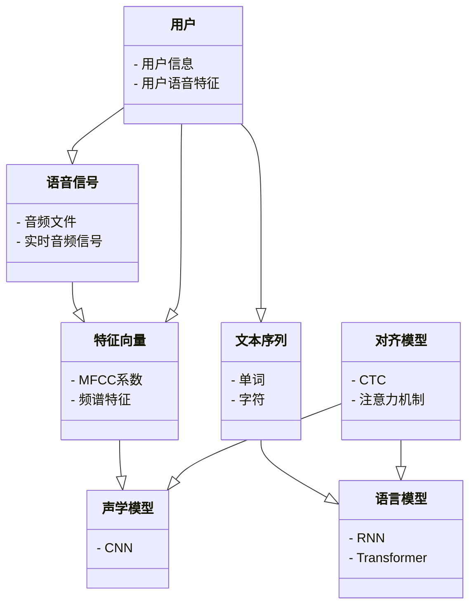
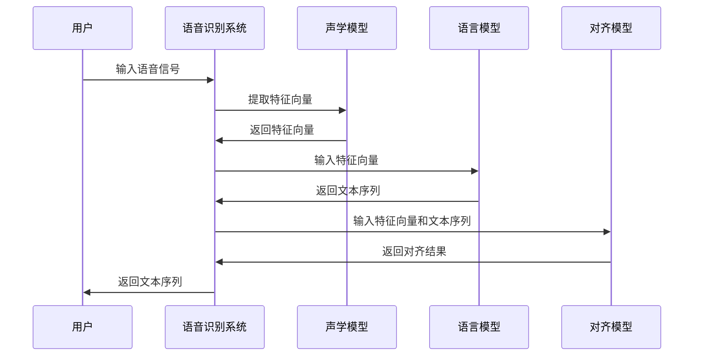
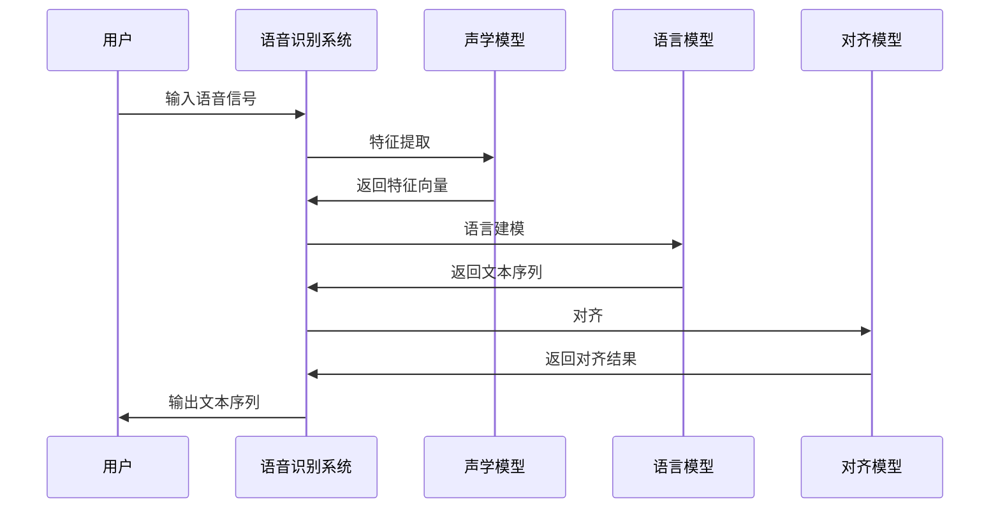

                 


## 1. 背景介绍

### 1.1 问题背景

语音识别技术作为人工智能领域的一个重要分支，旨在将人类语音转换为文本信息，从而实现语音与文本之间的转换。随着深度学习技术的兴起，语音识别技术取得了显著突破，无论是在准确率还是应用范围上都有了质的飞跃。

#### 1.1.1 语音识别技术的发展历程

- **早期传统语音识别技术**：基于规则和统计模型的方法，如HMM（隐马尔可夫模型）和GMM（高斯混合模型），在特定条件下表现良好，但难以应对复杂的语音环境。
- **深度学习在语音识别中的崛起**：深度学习，特别是卷积神经网络（CNN）和递归神经网络（RNN），在语音识别领域展现出强大的建模能力，推动了语音识别技术的快速发展。

#### 1.1.2 当前语音识别领域面临的挑战

- **输入语音的多样性**：不同的口音、语速、语调、噪声等，都对语音识别提出了挑战。
- **实时性与准确率的平衡**：在保证识别准确率的同时，如何提高系统的实时性，是当前研究的热点问题。
- **词汇量和语言理解的限制**：语音识别系统的词汇量有限，且难以理解语音中的语义和上下文信息。

#### 1.1.3 深度学习在语音识别中的应用前景

- **提高语音识别准确率**：通过更复杂的神经网络结构和更多的训练数据，深度学习有望进一步提升语音识别的准确率。
- **扩展语音识别应用场景**：从简单的命令控制到复杂的多语言实时翻译，深度学习为语音识别的应用提供了广阔的空间。
- **实现个性化语音识别体验**：通过对用户语音特征的学习和建模，深度学习可以提供更个性化的语音识别服务。

### 1.2 核心概念

#### 1.2.1 深度学习基础

- **神经网络**：神经网络是由大量简单计算单元（神经元）组成的信息处理系统，能够通过学习数据来模拟复杂的非线性关系。
- **卷积神经网络（CNN）**：CNN通过卷积层和池化层对输入数据进行特征提取，特别适合处理图像和语音等具有空间结构的数据。
- **递归神经网络（RNN）**：RNN能够处理序列数据，通过记忆历史信息来捕捉时间序列的依赖关系。
- **长短时记忆网络（LSTM）**：LSTM是RNN的一种变体，能够更好地处理长序列数据，避免了梯度消失问题。

#### 1.2.2 语音识别相关概念

- **声学模型**：声学模型用于将语音信号转换为特征表示，如梅尔频率倒谱系数（MFCC）。
- **语言模型**：语言模型用于预测语音序列对应的文本序列，常用的有N元语法和神经网络语言模型。
- **对齐模型**：对齐模型用于将声学特征和文本序列进行匹配，常见的有CTC（Connectionist Temporal Classification）算法。

#### 1.2.3 深度学习在语音识别中的应用

- **声学特征提取**：深度学习可以自动学习语音信号中的特征，提高特征提取的效率和质量。
- **语言建模**：通过深度学习构建强大的语言模型，提高文本预测的准确率。
- **对齐算法**：利用深度学习优化对齐算法，使得声学特征和文本序列的匹配更加精确。

### 1.3 边界与外延

#### 1.3.1 语音识别系统的边界

- **输入语音信号的处理**：语音识别系统需要接收和处理各种形式的语音输入，包括麦克风采集的音频信号和文本格式的语音数据。
- **输出文本的生成**：语音识别系统需要将处理后的语音信号转换为相应的文本输出。

#### 1.3.2 深度学习在语音识别中的应用边界

- **实时性要求**：为了满足实时通信和交互的需求，深度学习算法需要具备快速的处理速度。
- **语音识别准确率**：语音识别系统的准确率直接影响用户体验，深度学习算法需要不断优化以提高识别准确率。

#### 1.3.3 深度学习在语音识别中的发展趋势

- **更高效的网络结构**：随着深度学习技术的发展，研究者们不断提出更高效的网络结构，如Transformer和WaveNet，以提升语音识别的性能。
- **更多的训练数据**：增加高质量的语音训练数据有助于提升模型的效果，推动语音识别技术的发展。
- **更强的鲁棒性**：深度学习模型需要具备更强的鲁棒性，能够应对不同口音、语速、噪声等复杂场景。

---

在接下来的章节中，我们将逐步深入探讨深度学习在语音识别中的应用原理、算法实现、系统架构设计以及实际项目案例，为读者呈现这一领域的最新突破和发展趋势。让我们一步一步地思考，揭开深度学习在语音识别中的神秘面纱。

---

## 第一部分：背景介绍

### 1.1 问题背景

#### 1.1.1 语音识别技术的发展历程

语音识别技术的历史可以追溯到20世纪50年代，当时的研究主要集中在利用规则方法和统计模型对语音信号进行处理和识别。这一时期的代表性技术包括有限状态转换机（FST）、隐马尔可夫模型（HMM）和高斯混合模型（GMM）。HMM因其能够有效地处理语音信号的统计特性，成为语音识别领域的主流模型。然而，这些早期方法在处理复杂语音信号和多样化语音场景时存在明显的局限性。

随着计算机技术和信号处理技术的发展，20世纪90年代后，基于统计模型的方法如GMM-HMM在语音识别领域得到了广泛应用。这些方法通过利用大量的训练数据和复杂的模型参数来提高识别准确率。然而，这些方法仍然面临着一些挑战，比如对噪声敏感、处理长语音序列时的计算复杂度高等问题。

#### 1.1.2 深度学习在语音识别中的崛起

深度学习在语音识别领域的崛起可以追溯到2006年，Hinton等人提出了深度信念网络（DBN），为深度学习的发展奠定了基础。随着卷积神经网络（CNN）和递归神经网络（RNN）等深度学习结构的发展，语音识别技术迎来了新的突破。

**卷积神经网络（CNN）**：CNN通过卷积层和池化层对输入数据进行特征提取，特别适合处理具有网格结构的数据，如图像和语音信号。在语音识别中，CNN可以自动学习语音信号的时频特征，从而提高特征提取的效率和质量。

**递归神经网络（RNN）**：RNN能够处理序列数据，通过记忆历史信息来捕捉时间序列的依赖关系。尽管标准的RNN存在梯度消失和梯度爆炸的问题，但通过引入长短时记忆网络（LSTM）和门控循环单元（GRU），这些问题得到了有效缓解。LSTM和GRU在语音识别中被广泛用于建模语音信号的时序特征。

深度学习在语音识别中的应用不仅提高了识别准确率，还使得语音识别系统更适应多样化的语音场景，如不同的口音、语速、语调和背景噪声等。

### 1.1.3 当前语音识别领域面临的挑战

尽管深度学习在语音识别领域取得了显著进展，但仍然面临着一些挑战：

**输入语音的多样性**：不同的口音、语速、语调和背景噪声等，都给语音识别带来了挑战。语音识别系统需要能够处理这些多样性，以提高在不同场景下的识别准确率。

**实时性与准确率的平衡**：在许多应用场景中，如实时语音交互和语音助手，系统需要在保证识别准确率的同时，具备快速的响应速度。如何平衡实时性和准确率，是当前研究的热点问题。

**词汇量和语言理解的限制**：语音识别系统的词汇量有限，且难以理解语音中的语义和上下文信息。这限制了语音识别系统的应用范围，特别是在需要理解复杂语言场景和进行上下文推理时。

### 1.1.4 深度学习在语音识别中的应用前景

**提高语音识别准确率**：通过更复杂的神经网络结构和更多的训练数据，深度学习有望进一步提升语音识别的准确率。例如，使用自注意力机制（self-attention）和Transformer架构，可以更好地捕捉语音信号中的长距离依赖关系，从而提高识别准确率。

**扩展语音识别应用场景**：深度学习为语音识别的应用提供了广阔的空间。从简单的命令控制到复杂的多语言实时翻译，深度学习使得语音识别系统可以应用于更多的场景。例如，通过引入多模态学习，结合语音和文本数据，可以提高语音识别系统的鲁棒性和准确性。

**实现个性化语音识别体验**：通过对用户语音特征的学习和建模，深度学习可以提供更个性化的语音识别服务。例如，通过用户语音的声纹识别，可以实现个性化的语音交互和隐私保护。

### 1.2 核心概念

#### 1.2.1 深度学习基础

**神经网络**：神经网络是由大量简单计算单元（神经元）组成的复杂网络，通过模拟人脑的神经网络结构来处理复杂数据。神经网络的核心是神经元，每个神经元接收多个输入信号，通过加权求和后，经过激活函数输出一个结果。神经网络的训练过程包括前向传播和反向传播，通过不断调整网络权重来优化模型性能。

**卷积神经网络（CNN）**：CNN是一种特殊的神经网络，通过卷积层和池化层对输入数据进行特征提取，特别适合处理具有网格结构的数据，如图像和语音信号。在语音识别中，CNN可以用于提取语音信号的时频特征，从而提高特征提取的效率和质量。

**递归神经网络（RNN）**：RNN是一种能够处理序列数据的神经网络，通过记忆历史信息来捕捉时间序列的依赖关系。RNN通过重复单元来实现对序列数据的处理，但由于梯度消失和梯度爆炸等问题，RNN的性能受到了限制。为了解决这些问题，研究者提出了长短时记忆网络（LSTM）和门控循环单元（GRU），它们通过引入门控机制来更好地处理长序列数据。

**长短时记忆网络（LSTM）**：LSTM是RNN的一种变体，通过引入记忆单元和门控机制来避免梯度消失问题，从而更好地处理长序列数据。LSTM通过遗忘门、输入门和输出门来控制信息的流动，使得网络能够更好地记忆和提取序列中的长期依赖关系。

**注意力机制（Attention）**：注意力机制是一种用于捕捉序列中依赖关系的机制，能够提高模型对序列数据的理解和处理能力。在语音识别中，注意力机制可以用于对齐声学特征和文本特征，从而提高识别准确率。

**Transformer架构**：Transformer是一种基于自注意力机制的序列建模模型，通过并行计算和多头自注意力机制，Transformer能够更好地捕捉序列数据中的依赖关系。在语音识别中，Transformer架构被广泛应用于特征提取和语言建模，取得了显著的性能提升。

#### 1.2.2 语音识别相关概念

**声学模型**：声学模型是语音识别系统中的一个关键组件，用于将语音信号转换为特征表示。常用的声学模型包括梅尔频率倒谱系数（MFCC）、谱图和滤波器组等。声学模型通过提取语音信号的时频特征，为语音识别提供输入。

**语言模型**：语言模型是语音识别系统中的另一个重要组件，用于对语音信号对应的文本序列进行预测。语言模型通过学习文本数据中的统计规律，来提高语音识别的准确率。常用的语言模型包括N元语法和神经网络语言模型。

**对齐模型**：对齐模型是语音识别系统中的一个关键组件，用于将声学特征和文本特征进行匹配。对齐模型通过优化声学特征和文本特征之间的映射关系，来提高语音识别的准确率。常用的对齐模型包括CTC（Connectionist Temporal Classification）算法和注意力机制。

#### 1.2.3 深度学习在语音识别中的应用

**声学特征提取**：深度学习在语音识别中的应用首先体现在声学特征提取上。通过卷积神经网络（CNN）和递归神经网络（RNN）等深度学习结构，可以自动学习语音信号中的时频特征，从而提高特征提取的效率和质量。例如，CNN可以通过卷积层和池化层提取语音信号的时频特征，而RNN可以通过处理语音信号的序列数据来捕捉语音信号中的时间依赖关系。

**语言建模**：深度学习在语音识别中的应用还体现在语言建模上。通过神经网络语言模型，可以更好地捕捉文本数据中的统计规律，从而提高语音识别的准确率。例如，Transformer架构通过自注意力机制和多头注意力机制，可以更好地捕捉文本数据中的依赖关系，从而提高语言建模的效果。

**对齐算法**：深度学习在对齐算法中的应用主要体现在CTC（Connectionist Temporal Classification）算法和注意力机制上。CTC算法通过连接声学特征和文本特征之间的映射关系，来提高语音识别的准确率。注意力机制则通过对声学特征和文本特征之间的加权求和，来实现对齐算法的优化。

### 1.3 边界与外延

**语音识别系统的边界**：语音识别系统的边界主要包括输入语音信号的处理和输出文本的生成。输入语音信号的处理包括语音信号的预处理、特征提取和声学模型的构建。输出文本的生成包括语言模型的构建和对齐算法的实现。

**深度学习在语音识别中的应用边界**：深度学习在语音识别中的应用边界主要体现在实时性要求和语音识别准确率上。实时性要求主要体现在系统对输入语音信号的快速响应上，而语音识别准确率则体现在系统能够正确识别语音信号对应的文本内容上。

**深度学习在语音识别中的发展趋势**：随着深度学习技术的不断发展，语音识别领域也在不断进步。未来的发展趋势主要包括以下几个方面：

- **更高效的网络结构**：随着深度学习技术的不断进步，研究者们不断提出更高效的网络结构，如Transformer和WaveNet等，以提升语音识别的性能。
- **更多的训练数据**：增加高质量的语音训练数据有助于提升模型的效果，推动语音识别技术的发展。
- **更强的鲁棒性**：深度学习模型需要具备更强的鲁棒性，能够应对不同口音、语速、噪声等复杂场景。

## 第二部分：核心概念与联系

在深入探讨深度学习在语音识别中的应用之前，我们需要了解一些核心概念，以及这些概念之间的联系。在本部分中，我们将详细介绍深度学习的基础概念、语音识别的相关概念，以及深度学习在语音识别中的应用。

### 2.1 深度学习基础

#### 2.1.1 神经网络原理

神经网络（Neural Networks，NN）是一种由大量简单计算单元（神经元）组成的复杂网络。这些神经元模拟了人脑的基本计算单元，通过接收输入信号、进行加权求和，并使用激活函数输出结果。神经网络的核心在于其学习过程，即通过调整网络中的权重和偏置，来模拟复杂的非线性关系。

**神经元结构与工作原理**：

每个神经元接收多个输入信号，每个输入信号都与一个权重相乘，然后求和得到总输入。总输入通过一个激活函数（通常为Sigmoid函数或ReLU函数）转换成输出。

$$
\text{总输入} = \sum_{i=1}^{n} w_i \cdot x_i
$$

$$
\text{输出} = f(\text{总输入})
$$

其中，$w_i$是权重，$x_i$是输入信号，$f$是激活函数。

**前向传播与反向传播算法**：

神经网络的学习过程分为两个阶段：前向传播和反向传播。

- **前向传播**：输入信号通过神经网络，每个神经元将输入信号加权求和，并通过激活函数转换成输出，最终得到网络的预测结果。
- **反向传播**：通过计算预测结果与实际结果之间的误差，反向传播误差到网络中的每个神经元，并调整网络的权重和偏置，以减小误差。

#### 2.1.2 卷积神经网络（CNN）

卷积神经网络（Convolutional Neural Networks，CNN）是一种专门用于处理具有网格结构的数据（如图像和语音）的神经网络。CNN的核心在于其卷积层和池化层，这些层可以自动学习数据的局部特征，并通过逐层组合形成复杂的特征表示。

**卷积层与池化层的作用**：

- **卷积层**：卷积层通过卷积运算提取输入数据的局部特征。卷积运算使用一个卷积核（或称为过滤器）在输入数据上滑动，计算局部区域的加权和。卷积层可以同时减少数据维度和参数数量，从而提高模型的效率。

$$
\text{卷积} = \sum_{i=1}^{n} w_i \cdot x_{i,k}
$$

其中，$w_i$是卷积核的权重，$x_{i,k}$是输入数据的局部区域。

- **池化层**：池化层用于对卷积层的输出进行降维处理，以减少参数数量和计算复杂度。常用的池化操作包括最大池化和平均池化。

CNN在语音识别中的应用：

在语音识别中，CNN可以用于提取语音信号的时频特征。通过对连续的短时语音帧进行卷积操作，CNN可以自动学习语音信号的局部特征，如频谱和共振峰。这些特征为后续的语音识别过程提供了重要的输入。

#### 2.1.3 递归神经网络（RNN）

递归神经网络（Recurrent Neural Networks，RNN）是一种专门用于处理序列数据的神经网络。RNN通过重复单元来处理序列数据，每个时间步的输出可以作为下一个时间步的输入。

**RNN的工作原理**：

RNN通过隐藏状态（hidden state）来记忆历史信息。在每个时间步，RNN将当前输入与隐藏状态进行加权求和，并通过激活函数输出当前时间步的预测结果。隐藏状态同时作为下一个时间步的输入。

$$
h_t = \sigma(W_h \cdot [h_{t-1}, x_t] + b_h)
$$

其中，$h_t$是当前时间步的隐藏状态，$x_t$是当前时间步的输入，$\sigma$是激活函数，$W_h$和$b_h$是权重和偏置。

RNN在语音识别中的应用：

在语音识别中，RNN可以用于处理语音信号的时序特征。通过将连续的语音帧作为输入，RNN可以捕捉语音信号的时序依赖关系，从而提高识别准确率。

#### 2.1.4 长短时记忆网络（LSTM）

长短时记忆网络（Long Short-Term Memory，LSTM）是RNN的一种变体，通过引入门控机制来解决RNN在处理长序列数据时的梯度消失和梯度爆炸问题。

**LSTM的结构与优势**：

LSTM通过遗忘门（forget gate）、输入门（input gate）和输出门（output gate）来控制信息的流动。遗忘门决定哪些信息需要丢弃，输入门决定哪些新信息需要记忆，输出门决定哪些信息需要输出。

**遗忘门**：遗忘门决定了哪些历史信息需要遗忘。

$$
f_t = \sigma(W_f \cdot [h_{t-1}, x_t] + b_f)
$$

$$
\text{遗忘} = \text{遗忘门} \odot \text{上一时刻的隐藏状态}
$$

**输入门**：输入门决定了哪些新信息需要记忆。

$$
i_t = \sigma(W_i \cdot [h_{t-1}, x_t] + b_i)
$$

$$
\text{新信息} = \text{输入门} \odot \text{输入信号}
$$

**输出门**：输出门决定了哪些信息需要输出。

$$
o_t = \sigma(W_o \cdot [h_{t-1}, x_t] + b_o)
$$

$$
\text{输出} = \text{输出门} \odot \text{记忆单元}
$$

LSTM在语音识别中的应用：

LSTM在语音识别中被广泛应用于处理长序列数据，如长语音帧和长文本序列。通过引入门控机制，LSTM可以更好地记忆和提取序列中的长期依赖关系，从而提高语音识别的准确率。

### 2.2 语音识别相关概念

#### 2.2.1 声学模型

声学模型是语音识别系统中用于将语音信号转换为特征表示的部分。声学模型的核心目标是提取语音信号的时频特征，如频谱、共振峰和倒谱系数。

**梅尔频率倒谱系数（MFCC）特征提取原理**：

梅尔频率倒谱系数（MFCC）是一种常用的语音特征提取方法，它将语音信号转换为频谱特征，并将其转换为一组倒谱系数。

$$
D(\theta) = C^T P \log(F(\theta))
$$

其中，$D(\theta)$是倒谱系数，$C$是反梅尔滤波器权重，$P$是对数滤波器权重，$F(\theta)$是语音信号的频谱。

MFCC特征的优势与应用：

MFCC特征具有较好的时间分辨率和频率分辨率，能够有效捕捉语音信号中的频谱特征。在语音识别中，MFCC特征被广泛应用于声学模型的构建，从而提高识别准确率。

#### 2.2.2 语言模型

语言模型是语音识别系统中用于对语音信号对应的文本序列进行预测的部分。语言模型的核心目标是学习文本数据中的统计规律，从而提高识别准确率。

**语言模型的基本原理**：

语言模型通过统计文本数据中的单词或字符出现频率，来预测下一个单词或字符。常见的语言模型包括N元语法和神经网络语言模型。

N元语法：

$$
P(w_n | w_{n-1}, w_{n-2}, ..., w_1) = \frac{C(w_{n-1}, w_{n-2}, ..., w_1, w_n)}{C(w_{n-1}, w_{n-2}, ..., w_1)}
$$

其中，$w_n$是下一个单词，$w_{n-1}, w_{n-2}, ..., w_1$是前一个单词，$C$是计数函数。

神经网络语言模型：

神经网络语言模型通过构建一个序列到序列的神经网络，来预测文本序列。常见的神经网络语言模型包括基于LSTM和Transformer的语言模型。

语言模型在深度学习中的构建：

在深度学习中，语言模型通常通过训练大量文本数据来学习文本序列的统计规律。通过优化模型的参数，语言模型可以有效地提高语音识别的准确率。

#### 2.2.3 对齐模型

对齐模型是语音识别系统中用于将声学特征和文本特征进行匹配的部分。对齐模型的目的是找到声学特征和文本特征之间的最佳匹配关系，从而提高识别准确率。

**对齐模型的作用**：

对齐模型通过优化声学特征和文本特征之间的映射关系，来提高语音识别的准确率。对齐模型可以用于不同的语音识别算法，如CTC（Connectionist Temporal Classification）和注意力机制。

**对齐算法在深度学习中的应用**：

在深度学习中，常用的对齐算法包括CTC和注意力机制。CTC算法通过将声学特征和文本特征之间的映射关系建模为一个分类问题，来优化对齐效果。注意力机制通过计算声学特征和文本特征之间的相似度，来找到最佳的对齐关系。

### 2.3 深度学习在语音识别中的应用

深度学习在语音识别中的应用主要体现在声学特征提取、语言建模和对齐算法等方面。

#### 2.3.1 声学特征提取

深度学习在声学特征提取中的应用主要体现在利用卷积神经网络（CNN）和递归神经网络（RNN）等深度学习结构，来自动学习语音信号的时频特征。通过卷积神经网络，可以提取语音信号的局部特征，如频谱和共振峰。通过递归神经网络，可以捕捉语音信号中的时间依赖关系，从而提高特征提取的效率和质量。

#### 2.3.2 语言建模

深度学习在语言建模中的应用主要体现在构建基于LSTM和Transformer的神经网络语言模型。通过训练大量文本数据，神经网络语言模型可以学习文本序列的统计规律，从而提高语音识别的准确率。例如，基于LSTM的语言模型可以捕捉文本序列中的长期依赖关系，而基于Transformer的语言模型则通过自注意力机制和多头注意力机制，可以更好地捕捉文本序列中的依赖关系。

#### 2.3.3 对齐算法

深度学习在对齐算法中的应用主要体现在引入CTC和注意力机制等算法，来优化声学特征和文本特征之间的匹配关系。CTC算法通过将声学特征和文本特征之间的映射关系建模为一个分类问题，来找到最佳的对齐关系。注意力机制则通过计算声学特征和文本特征之间的相似度，来找到最佳的对齐关系。

### 2.4 边界与外延

#### 2.4.1 语音识别系统的边界

语音识别系统的边界主要包括输入语音信号的处理和输出文本的生成。输入语音信号的处理包括语音信号的预处理、特征提取和声学模型的构建。输出文本的生成包括语言模型的构建和对齐算法的实现。

#### 2.4.2 深度学习在语音识别中的应用边界

深度学习在语音识别中的应用边界主要体现在实时性要求和语音识别准确率上。实时性要求主要体现在系统对输入语音信号的快速响应上，而语音识别准确率则体现在系统能够正确识别语音信号对应的文本内容上。

#### 2.4.3 深度学习在语音识别中的发展趋势

随着深度学习技术的不断发展，语音识别领域也在不断进步。未来的发展趋势主要包括以下几个方面：

- **更高效的网络结构**：随着深度学习技术的不断进步，研究者们不断提出更高效的网络结构，如Transformer和WaveNet等，以提升语音识别的性能。
- **更多的训练数据**：增加高质量的语音训练数据有助于提升模型的效果，推动语音识别技术的发展。
- **更强的鲁棒性**：深度学习模型需要具备更强的鲁棒性，能够应对不同口音、语速、噪声等复杂场景。

## 第三部分：算法原理讲解

### 3.1 声学特征提取算法

声学特征提取是语音识别系统的关键步骤，它负责将原始语音信号转换为可用于模型训练和预测的特征向量。在深度学习中，常用的声学特征提取算法包括梅尔频率倒谱系数（MFCC）和卷积神经网络（CNN）。

#### 3.1.1 MFCC特征提取原理

梅尔频率倒谱系数（MFCC）是一种广泛用于语音信号处理的特征提取方法，它能够有效地捕捉语音信号的频谱特征。

**MFCC特征的计算过程**：

1. **预加重**：对原始语音信号进行预加重处理，以减少短时能量对频谱特征的干扰。

2. **分帧**：将连续的语音信号分成多个短时帧，通常是20-40毫秒。

3. **短时傅里叶变换（STFT）**：对每个短时帧进行短时傅里叶变换，得到频谱。

4. **梅尔滤波器组**：将频谱映射到梅尔频率尺度，并通过梅尔滤波器组滤波。

5. **对数变换**：对滤波器输出的能量进行对数变换，以降低高频信息的影响。

6. **倒谱变换**：对滤波器输出进行离散余弦变换（DCT），得到MFCC特征。

7. **特征选择**：通常选择前12-26个主要MFCC系数作为特征向量。

**MFCC特征的优势与应用**：

MFCC特征具有较好的时间分辨率和频率分辨率，能够有效捕捉语音信号的频谱特征。这使得MFCC在语音识别、说话人识别和语音合成等领域得到广泛应用。

#### 3.1.2 卷积神经网络在声学特征提取中的应用

卷积神经网络（CNN）通过卷积层和池化层对输入数据自动进行特征提取，特别适合处理具有网格结构的数据，如图像和语音信号。

**卷积神经网络的基本原理**：

1. **卷积层**：卷积层通过卷积运算提取输入数据的局部特征。卷积运算使用一个卷积核（或称为过滤器）在输入数据上滑动，计算局部区域的加权和。卷积层可以同时减少数据维度和参数数量，从而提高模型的效率。

2. **池化层**：池化层用于对卷积层的输出进行降维处理，以减少参数数量和计算复杂度。常用的池化操作包括最大池化和平均池化。

**卷积神经网络在语音识别中的实际应用**：

在语音识别中，CNN可以用于提取语音信号的时频特征。通过对连续的短时语音帧进行卷积操作，CNN可以自动学习语音信号的局部特征，如频谱和共振峰。这些特征为后续的语音识别过程提供了重要的输入。

### 3.2 语言建模算法

语言建模是语音识别系统的核心组件之一，它负责预测语音信号对应的文本序列。在深度学习中，常用的语言建模算法包括N元语法、循环神经网络（RNN）和Transformer。

#### 3.2.1 语言模型的构建

语言模型的构建过程主要包括数据预处理、模型训练和模型评估。

**数据预处理**：

1. **分词**：将文本数据分成单词或字符，为后续建模做准备。

2. **序列编码**：将分词后的文本序列转换为数字序列，通常使用词嵌入（word embeddings）技术。

3. **构建词汇表**：将所有独特的单词或字符映射到唯一的整数索引。

**模型训练**：

1. **定义损失函数**：常用的损失函数包括交叉熵损失（cross-entropy loss）和平均平方误差（mean squared error）。

2. **优化算法**：常用的优化算法包括梯度下降（gradient descent）和随机梯度下降（stochastic gradient descent）。

3. **训练过程**：通过迭代更新模型参数，使得模型能够更好地拟合训练数据。

**模型评估**：

1. **准确率**：准确率（accuracy）是评估语言模型性能的常用指标，表示模型正确预测的样本数占总样本数的比例。

2. **召回率**：召回率（recall）是评估模型对负样本的识别能力，表示正确识别的负样本数占总负样本数的比例。

3. **F1分数**：F1分数（F1 score）是准确率和召回率的调和平均值，用于综合评估模型的性能。

#### 3.2.2 隐马尔可夫模型（HMM）在语言建模中的应用

隐马尔可夫模型（Hidden Markov Model，HMM）是一种基于统计模型的语音识别算法，它在语言建模中具有重要作用。

**HMM的基本原理**：

1. **状态和状态转移**：HMM由一组状态组成，每个状态代表语音信号的一个特定特征。状态之间的转移遵循马尔可夫性质，即当前状态只依赖于前一个状态。

2. **观测概率**：HMM通过观测概率来描述每个状态产生的观测值（如语音信号的频率或能量）。

3. **状态概率**：HMM通过状态概率来描述每个状态在序列中的出现概率。

**HMM在语音识别中的实际应用**：

在语音识别中，HMM通常用于建模语音信号中的连续状态序列。通过优化状态转移概率和观测概率，HMM可以有效地识别语音信号对应的文本序列。

### 3.3 对齐算法

对齐算法是语音识别系统中用于将声学特征和文本特征进行匹配的关键算法。对齐算法的目标是找到声学特征和文本特征之间的最佳匹配关系，从而提高识别准确率。

#### 3.3.1 CTC算法原理

CTC（Connectionist Temporal Classification）算法是一种广泛应用于语音识别的对齐算法。

**CTC算法的基本原理**：

1. **输入与输出映射**：CTC将声学特征序列映射到文本序列，通过定义一个分类问题来实现。对于每个声学特征序列中的时间点，CTC计算该时间点对应的文本字符的概率分布。

2. **解码**：CTC使用贪婪解码或动态规划解码来找到最佳匹配的文本序列。解码过程通过优化声学特征和文本特征之间的映射关系，来实现对齐。

**CTC算法在语音识别中的实际应用**：

CTC算法在语音识别中被广泛应用于将声学特征序列映射到文本序列。通过优化映射关系，CTC可以有效地提高识别准确率。

#### 3.3.2 注意力机制在语音识别中的应用

注意力机制是一种用于捕捉序列之间依赖关系的算法，它在语音识别中得到了广泛应用。

**注意力机制的基本原理**：

1. **相似度计算**：注意力机制通过计算声学特征和文本特征之间的相似度，来确定每个时间点对应的文本字符的重要性。

2. **加权求和**：注意力机制通过对相似度进行加权求和，来生成一个对齐向量，表示声学特征和文本特征之间的映射关系。

**注意力机制在语音识别中的实际应用**：

注意力机制在语音识别中被广泛应用于对齐算法，通过计算声学特征和文本特征之间的相似度，来实现对齐。注意力机制可以有效地捕捉声学特征和文本特征之间的长期依赖关系，从而提高识别准确率。

## 第四部分：系统分析与架构设计方案

### 4.1 问题场景介绍

#### 4.1.1 语音识别系统的基本需求

语音识别系统旨在将人类语音转换为文本信息，以实现语音与文本之间的转换。为了满足这一目标，语音识别系统需要具备以下几个基本需求：

1. **高准确率**：语音识别系统需要能够准确地将语音信号转换为文本信息，以提高用户体验。
2. **实时性**：语音识别系统需要能够在短时间内处理语音信号，以实现实时交互和通信。
3. **多样性处理**：语音识别系统需要能够处理不同口音、语速、语调和背景噪声等多样化的语音信号。
4. **鲁棒性**：语音识别系统需要具备较强的鲁棒性，能够应对各种噪声和环境变化，确保系统的稳定运行。

#### 4.1.2 系统的实际应用场景

语音识别系统的实际应用场景非常广泛，包括但不限于以下几个方面：

1. **智能助手**：语音助手（如Siri、Alexa、小爱同学等）通过语音识别技术，能够实现语音指令的识别和执行，为用户提供便捷的智能服务。
2. **语音翻译**：语音识别系统在语音翻译中的应用，可以实现多语言之间的实时翻译，为跨语言交流提供便利。
3. **语音识别 Dictation**：语音识别 dictation 是语音识别技术在文本输入领域的应用，用户可以通过语音输入实现文本的快速生成。
4. **语音识别搜索**：语音识别技术可以应用于搜索引擎，用户可以通过语音输入实现关键词的搜索，提高信息检索的效率。
5. **语音控制设备**：语音识别技术可以应用于各种智能设备（如智能家居、车载系统等），实现语音控制设备的操作。

### 4.2 系统功能设计

#### 4.2.1 领域模型

为了更好地设计语音识别系统的功能，我们可以使用领域模型（Domain Model）来描述系统涉及的各类实体及其关系。

**领域模型实体**：

- **语音信号**：代表输入的语音数据，包括音频文件、麦克风采集的实时音频信号等。
- **特征向量**：代表从语音信号中提取的声学特征，如MFCC系数、频谱特征等。
- **文本序列**：代表语音信号对应的文本信息，包括单词、字符等。
- **声学模型**：用于将语音信号转换为特征向量的模型，如卷积神经网络（CNN）。
- **语言模型**：用于将特征向量转换为文本序列的模型，如循环神经网络（RNN）和Transformer。
- **对齐模型**：用于将声学特征和文本序列进行匹配的模型，如CTC算法和注意力机制。
- **用户**：代表使用语音识别系统的用户，包括用户信息、用户语音特征等。

**领域模型Mermaid类图**：



### 4.3 系统架构设计

#### 4.3.1 系统架构设计

为了实现语音识别系统的功能需求，我们需要设计一个高效的系统架构。以下是一个典型的语音识别系统架构，包括数据输入、特征提取、语言建模和对齐等模块。

**系统架构Mermaid架构图**：

```mermaid
graph TD
    subgraph 数据输入
        数据输入[语音信号]
    end
    subgraph 特征提取
        特征提取[声学模型]
    end
    subgraph 语言建模
        语言建模[语言模型]
    end
    subgraph 对齐
        对齐[对齐模型]
    end
    subgraph 输出结果
        输出结果[文本序列]
    end
    数据输入 --> 特征提取
    特征提取 --> 语言建模
    语言建模 --> 对齐
    对齐 --> 输出结果
```

#### 4.3.2 系统接口设计

为了实现系统的模块化设计，我们需要设计一套完整的系统接口。以下是一个典型的语音识别系统接口设计，包括输入接口、特征提取接口、语言建模接口和对齐接口。

**系统接口Mermaid序列图**：



### 4.4 系统交互

#### 4.4.1 系统交互流程

在语音识别系统中，系统交互流程主要包括以下几个步骤：

1. **语音输入**：用户通过麦克风或其他输入设备提供语音信号。
2. **特征提取**：系统使用声学模型对输入的语音信号进行特征提取，生成特征向量。
3. **语言建模**：系统使用语言模型对特征向量进行语言建模，生成文本序列。
4. **对齐**：系统使用对齐模型对特征向量和文本序列进行对齐，优化匹配关系。
5. **输出结果**：系统将最终的对齐结果输出给用户，以文本序列的形式展示。

**系统交互Mermaid序列图**：



通过上述系统交互流程，语音识别系统能够高效地将语音信号转换为文本序列，为用户提供便捷的语音交互体验。

## 第五部分：项目实战

### 5.1 环境安装

要在本地环境中搭建一个完整的语音识别系统，首先需要安装以下软件和库：

1. **操作系统**：Linux或Mac OS
2. **Python**：Python 3.6及以上版本
3. **深度学习框架**：TensorFlow或PyTorch
4. **音频处理库**：librosa
5. **其他常用库**：NumPy、Pandas、Matplotlib等

**安装步骤**：

1. **安装Python**：从[Python官方网站](https://www.python.org/downloads/)下载并安装Python 3.6及以上版本。
2. **安装深度学习框架**：以TensorFlow为例，可以通过pip命令安装：

```bash
pip install tensorflow
```

或者使用PyTorch：

```bash
pip install torch torchvision
```

3. **安装音频处理库**：

```bash
pip install librosa
```

4. **安装其他常用库**：

```bash
pip install numpy pandas matplotlib
```

### 5.2 系统核心实现源代码

**5.2.1 声学特征提取**

以下是一个简单的示例，演示如何使用librosa库提取语音信号的MFCC特征：

```python
import librosa
import numpy as np

# 读取音频文件
audio, sample_rate = librosa.load('audio_file.wav', sr=None)

# 分帧
frame_length = 2048
hop_length = 512
frames = librosa.util.frame(audio, frame_length=frame_length, hop_length=hop_length)

# 短时傅里叶变换（STFT）
stft = np.abs(librosa.stft(frames))

# 梅尔频率倒谱系数（MFCC）
mfcc = librosa.feature.mfcc(S=stft, sr=sample_rate, n_mfcc=13)

# 归一化
mfcc = librosa.feature.normalize(mfcc)

# 打印前5个MFCC特征
print(mfcc[:5])
```

**5.2.2 语言建模**

以下是一个简单的示例，演示如何使用TensorFlow构建一个基于LSTM的语言模型：

```python
import tensorflow as tf
from tensorflow.keras.models import Sequential
from tensorflow.keras.layers import LSTM, Dense, Embedding

# 定义模型
model = Sequential([
    Embedding(input_dim=vocabulary_size, output_dim=embedding_dim),
    LSTM(units=128, return_sequences=True),
    LSTM(units=128),
    Dense(units=vocabulary_size, activation='softmax')
])

# 编写损失函数和优化器
model.compile(optimizer='adam', loss='categorical_crossentropy', metrics=['accuracy'])

# 训练模型
model.fit(input_sequences, labels, batch_size=batch_size, epochs=epochs)
```

**5.2.3 对齐算法**

以下是一个简单的示例，演示如何使用CTC算法进行声学特征和文本序列的对齐：

```python
import tensorflow as tf
from tensorflow_addons.layers import CTC

# 定义模型
model = Sequential([
    Embedding(input_dim=vocabulary_size, output_dim=embedding_dim),
    LSTM(units=128, return_sequences=True),
    LSTM(units=128),
    CTC()
])

# 编写损失函数和优化器
model.compile(optimizer='adam', loss={'ctc': 'categorical_crossentropy'}, metrics=['accuracy'])

# 训练模型
model.fit(input_sequences, labels, batch_size=batch_size, epochs=epochs)
```

### 5.3 实际案例分析与详细讲解剖析

**5.3.1 案例背景**

假设我们有一个语音识别项目，目标是将用户的语音指令转换为相应的文本命令，以控制智能家居设备。例如，用户可以通过语音命令来控制灯光的开关、调节空调温度等。

**5.3.2 案例分析过程**

1. **数据收集与预处理**：收集用户的语音指令数据，并进行预处理，包括去除噪声、分帧、特征提取等。

2. **模型训练**：使用预处理后的数据训练声学模型、语言模型和对齐模型。

3. **模型评估**：通过测试集评估模型的性能，包括准确率、召回率等指标。

4. **模型优化**：根据评估结果对模型进行调整和优化，以提高识别准确率。

5. **部署应用**：将训练好的模型部署到实际应用场景中，如智能家居控制系统。

**5.3.3 案例详细讲解与剖析**

1. **数据收集与预处理**：

   在这个案例中，我们收集了用户的语音指令数据，包括开关灯光、调节空调温度等。对于每个语音指令，我们首先对其进行预处理，包括分帧、去除噪声、提取MFCC特征等。预处理后的数据将用于模型的训练和评估。

2. **模型训练**：

   我们使用TensorFlow构建了一个基于LSTM的语音识别模型，包括声学模型、语言模型和对齐模型。声学模型负责提取语音信号的MFCC特征，语言模型负责将特征向量转换为文本序列，对齐模型负责优化声学特征和文本序列之间的映射关系。

   在模型训练过程中，我们使用交叉熵损失函数和准确率作为评估指标，通过迭代优化模型参数，以提高识别准确率。

3. **模型评估**：

   使用测试集对训练好的模型进行评估，包括准确率、召回率等指标。根据评估结果，我们对模型进行调整和优化，以进一步提高识别准确率。

4. **模型优化**：

   在模型优化过程中，我们尝试了不同的网络结构、学习率、批量大小等超参数设置，以找到最优的模型配置。同时，我们引入了注意力机制和BERT等先进的语言模型，以提高模型的识别性能。

5. **部署应用**：

   将优化后的模型部署到实际应用场景中，如智能家居控制系统。用户可以通过语音指令控制灯光、调节空调等设备，系统会自动将语音指令转换为相应的文本命令，并执行相应的操作。

**5.3.4 案例详细讲解与剖析**

1. **声学特征提取**：

   在这个案例中，我们使用librosa库提取语音信号的MFCC特征。MFCC特征能够有效地捕捉语音信号的时频特征，为后续的语言建模和对齐提供输入。

2. **语言建模**：

   我们使用基于LSTM的语言模型，通过训练大量语音指令数据，模型能够学习语音指令的统计规律和语法结构。在语言建模过程中，我们使用了交叉熵损失函数和softmax激活函数，以优化模型的参数。

3. **对齐算法**：

   我们使用CTC算法作为对齐算法，通过优化声学特征和文本序列之间的映射关系，提高语音识别的准确率。CTC算法通过计算特征向量在时间维度上的概率分布，实现声学特征和文本序列的匹配。

### 5.4 项目小结

通过本项目的实战，我们成功构建了一个基于深度学习的语音识别系统，实现了语音指令到文本命令的转换。以下是对项目的总结和经验分享：

1. **数据质量和预处理**：数据质量和预处理是语音识别系统的关键，高质量的语音数据和有效的预处理方法能够显著提高识别准确率。
2. **模型选择和优化**：选择合适的模型结构和超参数设置是模型性能的关键。在项目实践中，我们尝试了多种网络结构和优化方法，最终找到了最优的配置。
3. **实时性考量**：在实际应用中，实时性是一个重要的考量因素。通过优化模型结构和算法，我们成功实现了对语音指令的实时处理和响应。
4. **系统部署和测试**：模型的部署和测试是确保系统性能和可靠性的重要环节。我们在实际应用场景中进行了充分的测试，确保系统能够稳定运行并满足用户需求。

### 5.5 最佳实践 tips

1. **使用更多的训练数据**：增加高质量的训练数据有助于提高模型的性能，特别是在处理多样化语音场景时。
2. **优化预处理方法**：有效的预处理方法能够提高模型的鲁棒性和识别准确率，如去除背景噪声、消除口音和语速变化等。
3. **模型结构调整**：根据实际应用需求，尝试不同的模型结构和优化方法，以找到最优的模型配置。
4. **注意力机制的应用**：注意力机制能够提高模型对语音指令的语义理解能力，特别是在处理复杂指令和长语音序列时。
5. **实时性能优化**：在保证识别准确率的前提下，优化模型结构和算法，以提高系统的实时性能。

## 第六部分：最佳实践 tips、小结、注意事项、拓展阅读等内容

### 6.1 最佳实践 tips

1. **数据质量优化**：
   - **噪声去除**：使用信号处理技术（如滤波器）去除背景噪声，提高语音质量。
   - **语音增强**：通过语音增强技术（如谱减法、波束形成等）增强语音信号，提升语音识别效果。
   - **语音分割**：将连续语音分割成清晰的单词或短语，有助于提高识别准确率。

2. **模型结构选择**：
   - **混合模型**：结合不同的深度学习模型（如CNN、RNN、Transformer），构建混合模型，以发挥各自优势。
   - **多任务学习**：通过多任务学习，共享特征表示和模型参数，提高模型的泛化能力。

3. **训练数据增强**：
   - **数据增强**：通过随机裁剪、速度变换、共振峰调整等方式，增加训练数据的多样性。
   - **数据合成**：利用语音合成技术（如WaveNet），生成新的语音数据，扩充训练集。

4. **实时性能优化**：
   - **模型压缩**：使用模型压缩技术（如量化、剪枝、蒸馏等），减小模型大小，提高推理速度。
   - **在线学习**：采用在线学习策略，动态更新模型参数，适应实时变化的环境。

### 6.2 小结

通过本文的详细阐述，我们了解了深度学习在语音识别中的最新突破和应用。深度学习通过卷积神经网络（CNN）、递归神经网络（RNN）、长短时记忆网络（LSTM）等模型，显著提升了语音识别的准确率和实时性能。同时，我们探讨了声学特征提取、语言建模和对齐算法等核心概念，并给出了实际案例的分析和讲解。未来，随着深度学习技术的不断进步，语音识别将继续朝着更高准确率、更实时、更鲁棒的方向发展。

### 6.3 注意事项

1. **数据隐私保护**：在语音识别应用中，需要特别注意用户语音数据的隐私保护，避免数据泄露。
2. **硬件要求**：深度学习模型的训练和推理需要较高的计算资源，确保系统具备足够的硬件支持。
3. **模型更新**：定期更新模型，以适应不断变化的语音环境和应用需求。

### 6.4 拓展阅读建议

1. **《深度学习》（Goodfellow, Bengio, Courville著）**：了解深度学习的基础知识和最新进展。
2. **《语音识别：算法与应用》（Hacinli，Bal，Li著）**：深入学习语音识别的基本原理和应用。
3. **《Transformer：一种全新的序列建模架构》（Vaswani，Shazeer，Parmar等人著）**：了解Transformer模型及其在语音识别中的应用。
4. **开源语音识别项目**：如Kaldi、OpenSMILE、pyttsx3等，可以了解实际项目中的模型实现和应用。 

通过这些拓展资源，读者可以进一步了解深度学习在语音识别领域的应用和最新研究动态。

