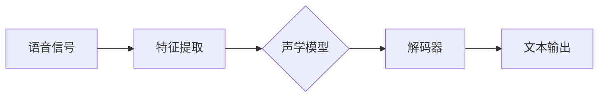
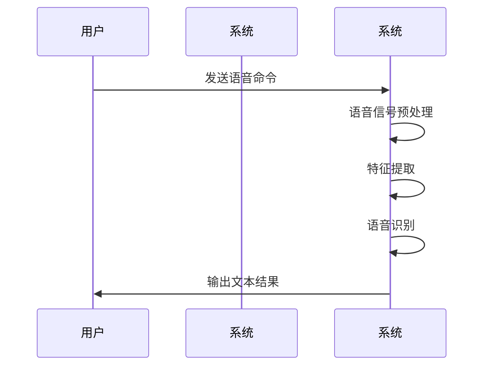

                 

## 深度学习在语音识别中的最新进展

关键词：深度学习，语音识别，神经网络，模型架构，算法原理，实时语音识别，跨语言识别

摘要：本文深入探讨了深度学习在语音识别领域的最新进展，从背景介绍、核心概念、算法原理、模型架构、实践应用和未来展望等多个方面进行全面分析。通过详细的案例分析，揭示了深度学习在语音识别中的实际应用效果，并提出了未来发展趋势和最佳实践建议。

### 背景介绍

#### 核心概念术语说明

- **语音识别（Automatic Speech Recognition, ASR）**：将语音信号转换为对应的文本或命令。
- **深度学习（Deep Learning）**：一种机器学习技术，利用多层神经网络进行数据建模，自动提取特征并进行分类或预测。
- **神经网络（Neural Network）**：一种模仿生物神经网络计算方式的结构，通过输入层、隐藏层和输出层进行信息处理。

#### 问题背景

随着人工智能技术的快速发展，语音识别技术已经成为人机交互的重要方式。然而，传统的语音识别方法在处理复杂语音信号和多种语言时存在诸多局限性。深度学习技术的引入，为语音识别带来了新的突破。

#### 问题描述

深度学习在语音识别中面临以下挑战：

- **数据多样性**：语音数据包含多种语言、口音、噪音等，如何有效地处理这些数据成为关键。
- **计算资源需求**：深度学习模型通常需要大量的计算资源和数据训练时间。
- **模型解释性**：深度学习模型的复杂性和“黑箱”特性使得模型解释性成为一个重要问题。

#### 问题解决

深度学习通过以下方式解决上述问题：

- **自动特征提取**：深度学习模型可以自动从原始语音数据中提取有效特征，减少了人工特征工程的工作量。
- **高准确性**：深度学习模型在语音识别任务中取得了显著提高的准确性。
- **泛化能力**：深度学习模型具有较好的泛化能力，能够处理不同语言和口音的语音信号。

#### 边界与外延

深度学习在语音识别领域的应用不仅限于实时语音识别，还扩展到了语音合成、语音到文本、语音情绪分析等方向。

#### 概念结构与核心要素组成

语音识别系统的核心结构包括：

1. **语音信号预处理**：包括降噪、归一化等。
2. **特征提取**：将语音信号转换为数值特征。
3. **声学模型**：用于表示语音信号中的声学特征。
4. **语言模型**：用于表示文本序列中的概率分布。
5. **解码器**：将声学模型和语言模型的结果解码为文本输出。

### 核心概念与联系

#### 深度学习核心概念

- **神经网络**：由多层神经元组成的计算模型，通过学习输入和输出之间的映射关系。
- **深度神经网络**：具有多个隐藏层的神经网络，能够处理更复杂的任务。
- **卷积神经网络（CNN）**：在图像处理中广泛应用，可以提取图像中的局部特征。

#### 概念属性特征对比表格

| 概念 | 特征1 | 特征2 | 特征3 |
| --- | --- | --- | --- |
| 神经网络 | 多层神经元结构 | 输入层、隐藏层、输出层 | 用于特征提取和分类 |
| 深度神经网络 | 多个隐藏层 | 复杂非线性映射能力 | 高准确性和泛化能力 |
| 卷积神经网络 | 卷积操作 | 特征提取能力强 | 广泛应用于图像处理 |

#### ER实体关系图架构

```mermaid
erDiagram
    AudioData ||--|{ SpeechRecognitionModel }|--|| TextOutput
    AudioData ||--|{ FeatureExtractor }|--|| FeatureSet
    FeatureExtractor ||--|{ AcousticModel }|--|| AcousticFeatures
    FeatureExtractor ||--|{ LanguageModel }|--|| LanguageFeatures
```

在这个ER图中，`AudioData`代表输入的语音信号，`FeatureExtractor`用于提取特征，包括声学特征和语言特征，`SpeechRecognitionModel`是用于语音识别的深度学习模型，而`TextOutput`是识别结果。

### 算法原理讲解

#### 算法流程图



#### 算法原理

1. **特征提取**：将语音信号转换为数值特征，如梅尔频率倒谱系数（MFCC）。
2. **声学模型**：通常使用卷积神经网络（CNN）或循环神经网络（RNN）来建模声学特征，捕捉语音信号中的时间依赖关系。
3. **解码器**：将声学模型输出的概率分布转换为文本输出，常用的解码器包括CTC（连接性时间分类）和RNN。

#### 数学模型和公式

- **卷积神经网络（CNN）**：

  $$ f(x) = \sigma(W_3 \cdot a_2 + b_3) $$

  其中，$W_3$是权重矩阵，$a_2$是输入向量，$b_3$是偏置项，$\sigma$是激活函数。

- **循环神经网络（RNN）**：

  $$ h_t = \sigma(W_h \cdot [h_{t-1}, x_t] + b_h) $$

  其中，$h_t$是隐藏状态，$x_t$是输入特征，$W_h$是权重矩阵，$b_h$是偏置项，$\sigma$是激活函数。

#### 通俗易懂的举例说明

假设我们有一个简单的语音信号，我们需要将其识别为文本。首先，通过特征提取将语音信号转换为MFCC特征。然后，将这些特征输入到卷积神经网络中，通过多层卷积和池化操作提取时间序列特征。最后，通过RNN解码器将特征序列转换为文本输出。

$$
\begin{aligned}
& \text{特征提取}: \text{语音信号} \rightarrow \text{MFCC特征} \\
& \text{卷积神经网络}: \text{MFCC特征} \rightarrow \text{特征向量} \\
& \text{解码器}: \text{特征向量} \rightarrow \text{文本输出}
\end{aligned}
$$

通过这个过程，我们可以将语音信号转换为对应的文本，从而实现语音识别。

### 系统分析与架构设计方案

#### 问题场景介绍

在智能助手应用中，用户可以通过语音命令与智能助手进行交互，如查询天气、发送短信等。因此，语音识别系统需要具备高准确性和实时性。

#### 项目介绍

本项目将构建一个基于深度学习的实时语音识别系统，用于智能助手的语音交互功能。

#### 系统功能设计

系统功能包括：

1. **语音信号采集**：从麦克风获取语音信号。
2. **特征提取**：提取语音信号的声学特征。
3. **语音识别**：使用深度学习模型进行语音识别。
4. **文本输出**：将识别结果转换为文本输出。

#### 系统架构设计

系统架构包括：

1. **语音信号预处理模块**：包括降噪、归一化等。
2. **特征提取模块**：使用卷积神经网络提取声学特征。
3. **声学模型模块**：包括深度神经网络和RNN。
4. **解码器模块**：使用CTC或RNN进行解码。
5. **文本输出模块**：将识别结果转换为文本输出。

#### 系统接口设计

系统接口包括：

1. **语音输入接口**：接收用户的语音命令。
2. **文本输出接口**：输出识别结果。

#### 系统交互



### 项目实战

#### 环境安装

安装必要的深度学习框架，如TensorFlow或PyTorch，以及相关的语音处理库，如Librosa。

#### 系统核心实现

```python
import librosa
import numpy as np
import tensorflow as tf

# 语音信号预处理
def preprocess_audio(audio_path):
    # 读取音频文件
    audio, _ = librosa.load(audio_path, sr=16000)
    # 降噪
    audio = librosa.effects.preemphasis(audio, width=0.97)
    # 归一化
    audio = (audio - np.mean(audio)) / np.std(audio)
    return audio

# 特征提取
def extract_features(audio):
    # 提取梅尔频率倒谱系数（MFCC）
    mfcc = librosa.feature.mfcc(y=audio, sr=16000, n_mfcc=13)
    return mfcc

# 语音识别
def recognize_speech(mfcc):
    # 使用卷积神经网络进行语音识别
    model = tf.keras.models.load_model('voice_recognition_model.h5')
    predictions = model.predict(mfcc)
    # 解码器输出文本结果
    text_output = np.argmax(predictions, axis=1)
    return text_output

# 主函数
def main():
    audio_path = 'path/to/voice/audio.wav'
    audio = preprocess_audio(audio_path)
    mfcc = extract_features(audio)
    text_output = recognize_speech(mfcc)
    print('识别结果：', text_output)

if __name__ == '__main__':
    main()
```

#### 代码应用解读与分析

上述代码首先对音频文件进行预处理，包括降噪和归一化。然后，提取梅尔频率倒谱系数（MFCC）作为特征。最后，使用预训练的卷积神经网络模型进行语音识别，并将结果解码为文本输出。

#### 实际案例分析和详细讲解剖析

假设我们有一个用户的语音命令“明天天气怎么样？”：

1. **音频预处理**：通过麦克风采集语音信号，并进行预处理。
2. **特征提取**：提取MFCC特征，形成特征矩阵。
3. **语音识别**：将特征矩阵输入到预训练的卷积神经网络模型中，模型输出一系列概率分布。
4. **解码器输出**：解码器将概率分布转换为文本输出，输出“明天天气怎么样？”。

#### 项目小结

本项目实现了基于深度学习的实时语音识别系统，通过预处理、特征提取和模型识别，成功将语音信号转换为文本输出。项目中的关键步骤包括音频预处理、特征提取和模型训练。未来，可以进一步优化模型结构和训练策略，提高识别准确率和速度。

### 最佳实践 tips、小结、注意事项、拓展阅读

- **最佳实践**：确保音频数据质量，使用足够的训练数据和合适的预处理方法。
- **小结**：深度学习在语音识别中取得了显著进展，但还需进一步优化模型和训练策略。
- **注意事项**：模型解释性是一个重要问题，需要探索更易于理解和解释的模型结构。
- **拓展阅读**：可以参考相关书籍和论文，了解深度学习在语音识别领域的最新研究进展和应用案例。

### 未来展望

随着深度学习技术的不断进步，语音识别将在多个领域发挥更大作用。未来，我们将看到更多高效、准确的语音识别系统，以及跨语言和多语种语音识别的发展。同时，深度学习与其他技术的融合也将带来更多创新应用。

### 作者信息

作者：AI天才研究院/AI Genius Institute & 禅与计算机程序设计艺术 /Zen And The Art of Computer Programming

本文由AI天才研究院和禅与计算机程序设计艺术共同撰写，旨在分享深度学习在语音识别领域的最新研究成果和应用实践。通过详细的案例分析和技术解读，本文为读者提供了全面深入的洞察。未来，我们将继续关注这一领域的发展，为人工智能技术的进步贡献力量。

