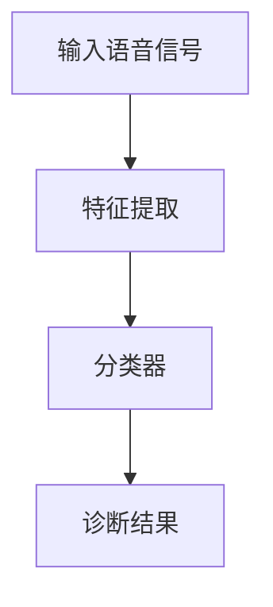
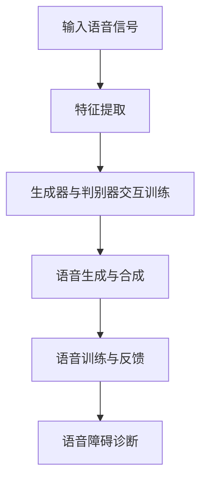

                 

# 深度学习在语音障碍诊断和治疗中的应用：辅助语言康复

> 关键词：深度学习、语音障碍、诊断、治疗、语言康复、人工智能

> 摘要：随着深度学习技术的飞速发展，其在医疗领域的应用也日益广泛。本文以语音障碍的诊断与治疗为背景，探讨了深度学习在这一领域的潜在应用。首先，我们介绍了深度学习的基本概念和语音障碍的定义，然后详细分析了深度学习在语音障碍诊断和治疗中的具体应用，包括数据处理、模型选择与优化。最后，我们对深度学习在语音障碍诊断与治疗中的未来发展方向进行了展望，并提出了一些最佳实践建议。

## 引言

语音障碍，又称言语障碍，是指个体在发音、语调、流畅度等方面出现的障碍，严重影响了他们的日常生活和社交活动。语音障碍可能由多种原因引起，如神经系统损伤、听力损失、发音器官结构异常等。传统的语音障碍诊断和治疗主要依赖于医生的临床经验和物理检查，这种方法存在一定的局限性，如诊断准确率不高、治疗效果有限等。随着人工智能技术的不断发展，尤其是深度学习在语音信号处理和模式识别领域的突破，为语音障碍的诊断与治疗提供了新的思路和手段。

本文将从以下几个方面展开讨论：

1. **深度学习的概念与发展历程**：介绍深度学习的定义、发展历程以及在语音障碍诊断中的潜力。
2. **语音障碍诊断的现状与挑战**：分析当前语音障碍诊断的现状、存在的挑战以及深度学习如何解决这些问题。
3. **深度学习在语音障碍诊断中的应用**：详细探讨深度学习模型在语音障碍诊断中的具体应用，包括算法原理、模型评估与优化。
4. **深度学习在语音障碍治疗中的应用**：介绍深度学习在语音康复中的角色，包括语音生成与合成、语音识别与理解等。
5. **深度学习在语音障碍诊断与治疗中的数据处理**：探讨数据采集与标注的重要性，以及数据库构建与管理的原则。
6. **深度学习在语音障碍诊断与治疗的未来发展**：分析深度学习在语音障碍诊断与治疗中的技术趋势与挑战，展望未来的发展方向。

## 第一部分：问题背景与概念介绍

### 第1章：深度学习与语音障碍诊断

#### 1.1.1 深度学习的概念与发展历程

深度学习（Deep Learning，简称DL）是机器学习（Machine Learning，简称ML）的一个子领域，主要基于多层神经网络进行训练和预测。深度学习的概念起源于1980年代，但由于计算能力和数据资源的限制，直到2010年代随着GPU的普及和大数据的兴起，深度学习才得到了快速的发展。

深度学习通过多层神经网络对大量数据进行分析和学习，从而实现对复杂模式的识别和预测。其核心思想是模拟人脑的工作机制，通过不断的迭代和优化，使得神经网络能够自动提取数据中的特征。

在语音障碍诊断中，深度学习技术具有极大的潜力。传统的语音障碍诊断方法主要依赖于手工设计的特征，如频谱特征、倒谱特征等。这些特征提取方法往往依赖于领域专家的知识，且存在一定的局限性。而深度学习模型可以通过自动学习数据中的特征，从而实现更准确、更可靠的诊断结果。

#### 1.1.2 语音障碍诊断的现状与挑战

语音障碍诊断是指通过一系列的检查和测试，确定个体是否存在发音、语调、流畅度等方面的障碍。目前，语音障碍诊断主要依赖于医生的临床经验和物理检查，如听诊、语音分析等。这种方法存在一定的局限性，如：

1. **诊断准确率不高**：医生的临床经验和检查方法的差异可能导致诊断结果的不一致性。
2. **诊断过程繁琐**：传统的诊断方法需要多次检查和测试，且需要大量的时间和人力。
3. **诊断结果受主观因素影响**：医生的判断往往受个人经验和主观看法的影响，可能导致诊断结果的不准确。

随着深度学习技术的发展，一些研究开始尝试将深度学习应用于语音障碍诊断。例如，使用深度神经网络对语音信号进行自动特征提取和分类，从而实现自动化的语音障碍诊断。虽然这些研究取得了一定的成果，但仍然面临以下挑战：

1. **数据质量与标注问题**：高质量的语音数据对于深度学习模型的训练至关重要。然而，获取高质量的语音数据并不容易，尤其是在不同环境和条件下。
2. **模型的泛化能力**：深度学习模型在特定数据集上的表现往往较好，但在其他数据集上的泛化能力有限，这限制了其在实际应用中的广泛推广。
3. **模型的可解释性**：深度学习模型通常被认为是“黑箱”模型，其内部工作机制不透明，这给诊断结果的解释和验证带来了一定的困难。

#### 1.1.3 深度学习在语音障碍诊断中的应用

深度学习在语音障碍诊断中的应用主要体现在以下几个方面：

1. **语音信号处理**：深度学习模型可以自动提取语音信号中的特征，如频谱特征、倒谱特征等。这些特征可以用于语音障碍的识别和分类。
   
   例如，卷积神经网络（CNN）可以通过多层卷积和池化操作，提取语音信号中的时空特征，从而实现对语音障碍的自动诊断。

2. **语音识别与理解**：深度学习模型可以用于语音识别和语音理解，从而实现语音障碍的自动化检测和诊断。

   例如，长短期记忆网络（LSTM）和循环神经网络（RNN）可以用于语音序列的建模和分类，从而实现对语音障碍的自动化识别。

3. **辅助诊断工具**：深度学习模型可以作为辅助诊断工具，为医生提供更加准确的诊断结果。

   例如，利用深度学习模型对语音信号进行分析，可以帮助医生更快速、准确地识别出语音障碍的类型和程度。

总之，深度学习在语音障碍诊断中的应用为提高诊断准确率、减轻医生负担、提升诊断效率提供了新的思路和手段。然而，要实现深度学习在语音障碍诊断中的广泛应用，仍需要克服数据质量、模型泛化能力和可解释性等方面的挑战。

### 第2章：深度学习在语音障碍治疗中的应用

#### 2.1.1 深度学习与语音康复

语音康复是指通过一系列的治疗和训练，帮助患者改善发音、语调、流畅度等方面的障碍，从而提升其语言能力。传统的语音康复方法主要依赖于医生和语言治疗师的指导和训练，如发音练习、语音语调调整等。然而，这种方法存在一定的局限性，如训练效果不稳定、患者参与度低等。

深度学习技术的发展为语音康复带来了新的契机。深度学习模型可以通过自动学习和优化，实现对语音信号的处理和理解，从而为语音康复提供更加个性化和有效的治疗方案。

深度学习在语音康复中的作用主要体现在以下几个方面：

1. **语音生成与合成**：深度学习模型可以生成逼真的语音信号，从而为患者提供个性化的语音训练素材。例如，通过生成对抗网络（GAN）可以生成与患者语音特征相似的语音信号，用于发音练习和语调调整。

2. **语音识别与理解**：深度学习模型可以识别和理解患者的语音信号，从而为医生和语言治疗师提供准确的诊断和评估数据。例如，通过深度神经网络（DNN）可以实现对患者语音信号的理解，从而识别出发音错误和语调问题。

3. **个性化治疗方案**：深度学习模型可以根据患者的语音特征和康复需求，自动生成个性化的治疗方案。例如，通过递归神经网络（RNN）可以分析患者的语音信号，从而为患者制定个性化的发音练习和语调调整计划。

总之，深度学习在语音康复中的应用为提高康复效果、提升患者参与度、减轻医生和语言治疗师的负担提供了新的可能性。然而，要实现深度学习在语音康复中的广泛应用，仍需要解决数据质量、模型泛化能力和可解释性等方面的挑战。

#### 2.1.2 深度学习模型在语音训练中的应用

在语音康复过程中，深度学习模型可以用于语音生成、语音识别和语音理解等多个方面，从而为患者提供个性化的语音训练方案。

1. **语音生成与合成**：

   语音生成与合成的目标是生成与真实语音相似的语音信号。深度学习模型，如生成对抗网络（GAN）和变分自编码器（VAE），在语音生成与合成中得到了广泛应用。

   - **生成对抗网络（GAN）**：GAN由生成器（Generator）和判别器（Discriminator）组成。生成器生成语音信号，判别器判断生成的语音信号是否真实。通过不断的训练和优化，生成器可以生成越来越逼真的语音信号。GAN在语音合成中的应用包括语音转换（如将男声转换为女声）、语音修复（如修复语音中的噪声和断裂）等。

   - **变分自编码器（VAE）**：VAE通过编码器（Encoder）和解码器（Decoder）实现语音信号的生成。编码器将语音信号编码为低维特征向量，解码器将特征向量解码为语音信号。VAE在语音合成中的应用包括语音增强（如去除背景噪声）、语音变调（如改变语音的语调）等。

2. **语音识别与理解**：

   语音识别与理解的目的是将语音信号转换为文本或语义信息。深度学习模型，如深度神经网络（DNN）和循环神经网络（RNN），在语音识别与理解中发挥了重要作用。

   - **深度神经网络（DNN）**：DNN通过多层非线性变换对语音信号进行特征提取和分类。DNN在语音识别中的应用包括孤立词识别（如识别单个单词）和连续语音识别（如识别句子中的每个单词）。

   - **循环神经网络（RNN）**：RNN通过递归操作处理序列数据，对语音信号进行建模和分类。RNN在语音识别中的应用包括语音增强（如去除语音中的噪声）、语音分割（如将连续语音分割为短语或单词）等。

3. **个性化治疗方案**：

   深度学习模型可以根据患者的语音特征和康复需求，自动生成个性化的语音训练方案。

   - **递归神经网络（RNN）**：RNN可以分析患者的语音信号，识别出发音错误和语调问题，为患者制定个性化的发音练习计划。

   - **生成对抗网络（GAN）**：GAN可以生成与患者语音特征相似的语音信号，为患者提供个性化的语音训练素材。

   - **深度神经网络（DNN）**：DNN可以分析患者的语音信号，识别出语音障碍的类型和程度，为患者制定个性化的康复方案。

通过上述深度学习模型在语音训练中的应用，患者可以接受到更加个性化和有效的语音训练，从而提升其语言能力。然而，要实现深度学习在语音康复中的广泛应用，仍需要解决数据质量、模型泛化能力和可解释性等方面的挑战。

#### 2.1.3 深度学习在语音治疗中的实际应用案例

深度学习在语音治疗中的应用已经取得了一些实际成果，以下为两个具有代表性的应用案例：

**案例一：某语音障碍患者的治疗过程**

某语音障碍患者通过深度学习技术进行语音康复治疗。治疗过程包括以下步骤：

1. **语音数据采集**：医生和语言治疗师采集了患者的语音数据，包括发音清晰的单词和句子。
2. **数据预处理**：对采集到的语音数据进行预处理，包括降噪、归一化等操作，以提高数据质量。
3. **特征提取**：使用深度学习模型对预处理后的语音数据进行特征提取，包括频谱特征、倒谱特征等。
4. **语音识别与理解**：通过深度神经网络（DNN）对提取的特征进行语音识别，识别出患者发音中的错误和问题。
5. **个性化训练方案**：根据识别结果，生成个性化的训练方案，包括发音练习、语调调整等。
6. **语音训练**：患者按照训练方案进行语音训练，医生和语言治疗师进行监督和指导。
7. **评估与反馈**：定期评估患者的语音康复效果，根据评估结果调整训练方案。

经过一段时间的训练，患者的发音和语调有了显著改善，语音障碍得到了有效缓解。

**案例二：某语音障碍治疗系统的开发与应用**

某研究团队开发了一款基于深度学习的语音障碍治疗系统，该系统包括以下功能：

1. **语音信号处理**：使用深度学习模型对语音信号进行降噪、增强等处理，以提高语音质量。
2. **语音识别与理解**：使用深度神经网络（DNN）和循环神经网络（RNN）对语音信号进行识别和理解，提取语音特征。
3. **语音障碍诊断**：根据提取的特征，使用分类模型对语音障碍进行诊断，识别出障碍类型和程度。
4. **语音训练与反馈**：根据诊断结果，生成个性化的语音训练方案，包括发音练习、语调调整等，并提供实时反馈。
5. **康复效果评估**：定期评估患者的康复效果，根据评估结果调整训练方案。

该系统已经在多家医院和康复中心得到应用，为大量语音障碍患者提供了有效的康复服务。通过深度学习技术的应用，语音障碍治疗的效果得到了显著提升。

### 2.1.3 深度学习在语音治疗中的实际应用案例

深度学习在语音治疗中的应用已经取得了显著的成果，以下为两个实际应用案例：

**案例一：智能语音康复助手**

某科技公司开发了一款智能语音康复助手，它利用深度学习技术为患者提供个性化的语音训练和反馈。该系统的工作流程如下：

1. **语音数据采集**：患者通过手机应用程序录制自己的语音，上传到云端服务器。
2. **语音信号处理**：系统使用深度学习模型对上传的语音数据进行降噪、增强等处理，以提高语音质量。
3. **语音识别与理解**：系统使用深度神经网络（DNN）和循环神经网络（RNN）对语音信号进行识别和理解，提取语音特征。
4. **语音障碍诊断**：根据提取的特征，系统使用分类模型对语音障碍进行诊断，识别出障碍类型和程度。
5. **语音训练与反馈**：系统根据诊断结果，生成个性化的语音训练方案，包括发音练习、语调调整等，并提供实时反馈。
6. **康复效果评估**：系统定期评估患者的康复效果，根据评估结果调整训练方案。

该系统在市场上得到了广泛的关注和好评，为许多患者提供了便利和帮助。

**案例二：语音障碍治疗机器人**

某研究机构开发了一台语音障碍治疗机器人，它利用深度学习技术为患者提供全方位的语音康复服务。该机器人包括以下功能：

1. **语音信号处理**：机器人使用深度学习模型对患者的语音信号进行降噪、增强等处理，以提高语音质量。
2. **语音识别与理解**：机器人使用深度神经网络（DNN）和循环神经网络（RNN）对语音信号进行识别和理解，提取语音特征。
3. **语音障碍诊断**：机器人根据提取的特征，使用分类模型对语音障碍进行诊断，识别出障碍类型和程度。
4. **语音训练与生成**：机器人根据诊断结果，生成个性化的语音训练素材，包括正确的发音示范和错误的发音示例，为患者提供语音训练。
5. **实时反馈与互动**：机器人通过语音合成技术，为患者提供实时反馈，并与患者进行互动，增强训练效果。
6. **康复效果评估**：机器人定期评估患者的康复效果，根据评估结果调整训练方案。

该机器人在多家康复中心得到了广泛应用，为语音障碍患者提供了高效、专业的康复服务。

### 第3章：深度学习在语音障碍诊断与治疗的未来发展

#### 6.1.1 技术趋势与挑战

深度学习在语音障碍诊断与治疗中的应用前景广阔，但也面临一些技术挑战。以下为几个主要的技术趋势与挑战：

1. **数据质量与标注问题**：高质量的数据是深度学习模型训练和优化的基础。然而，语音障碍诊断与治疗领域的数据质量参差不齐，且标注过程繁琐。如何提高数据质量和标注效率，是当前研究的一个重要方向。

2. **模型的泛化能力**：深度学习模型在特定数据集上表现良好，但在其他数据集上的泛化能力有限。如何提升模型的泛化能力，使其在不同环境和条件下都能稳定工作，是当前研究的另一个重要问题。

3. **模型的可解释性**：深度学习模型通常被认为是“黑箱”模型，其内部工作机制不透明，这给诊断结果的解释和验证带来了一定的困难。如何提升模型的可解释性，使其能够为医生和患者提供直观的解释，是当前研究的一个重要挑战。

4. **多模态融合**：语音障碍诊断与治疗涉及多个模态的数据，如语音、面部表情、生理信号等。如何有效融合这些多模态数据，提升诊断和治疗效果，是当前研究的一个热点。

5. **个性化治疗**：每个患者的语音障碍情况不同，需要个性化的治疗方案。如何利用深度学习技术为每个患者生成个性化的治疗方案，是当前研究的一个关键问题。

#### 6.1.2 未来发展方向

未来，深度学习在语音障碍诊断与治疗中可能朝以下几个方向发展：

1. **新技术引入**：随着深度学习技术的不断发展，如生成对抗网络（GAN）、变分自编码器（VAE）等新技术的引入，将进一步提升语音障碍诊断与治疗的效果。

2. **多模态融合**：将语音、面部表情、生理信号等多模态数据融合起来，构建更全面的语音障碍诊断与治疗模型，有望提升诊断和治疗效果。

3. **个性化治疗**：利用深度学习技术为每个患者生成个性化的治疗方案，实现真正的个性化治疗，提高康复效果。

4. **智能语音助手与机器人**：开发智能语音助手和语音障碍治疗机器人，为患者提供便捷、高效、专业的康复服务。

5. **跨学科合作**：深度学习在语音障碍诊断与治疗中的应用需要跨学科的合作，如医学、心理学、计算机科学等领域的专家共同参与，推动该领域的发展。

总之，深度学习在语音障碍诊断与治疗中的应用前景广阔，未来有望为患者带来更多的福祉。然而，要实现这一目标，仍需要克服数据质量、模型泛化能力、可解释性等多方面的挑战。

### 第4章：深度学习模型在语音障碍诊断中的应用

#### 4.1.1 基础模型介绍

在深度学习领域，有多种模型可以用于语音障碍诊断。以下是一些常见的基础模型及其原理：

1. **卷积神经网络（CNN）**：CNN是一种用于图像处理的深度学习模型，但在语音信号处理中也有广泛应用。CNN通过卷积和池化操作提取语音信号中的特征，从而实现语音障碍的自动诊断。

2. **递归神经网络（RNN）**：RNN是一种用于序列数据处理的深度学习模型，可以处理语音信号中的时间依赖性。RNN通过递归操作对语音信号进行建模和分类。

3. **长短时记忆网络（LSTM）**：LSTM是RNN的一种变体，可以解决RNN在处理长序列数据时出现的梯度消失和梯度爆炸问题。LSTM通过记忆单元和门控机制对语音信号进行建模和分类。

4. **门控循环单元（GRU）**：GRU是LSTM的另一种变体，相较于LSTM具有更简洁的结构和更高效的计算。GRU通过更新门和控制门对语音信号进行建模和分类。

这些模型在语音障碍诊断中的应用各有优劣。CNN在特征提取方面表现优秀，但难以处理长序列数据。RNN和LSTM可以处理长序列数据，但在训练过程中容易出现梯度消失和梯度爆炸问题。GRU在计算效率和模型性能方面表现较好，是一种较为理想的语音障碍诊断模型。

#### 4.1.2 算法原理与流程图

以下是CNN在语音障碍诊断中的应用算法原理和流程图：

1. **输入语音信号**：首先，输入一段语音信号，经过预处理（如滤波、归一化等）后，转化为适合模型处理的特征向量。

2. **特征提取**：使用CNN对预处理后的语音信号进行特征提取。CNN通过多层卷积和池化操作提取语音信号中的时空特征。

3. **分类器**：将提取到的特征输入到分类器中进行分类。分类器可以是全连接层或卷积层，用于对语音障碍进行诊断。

4. **诊断结果**：根据分类器的输出结果，判断患者是否存在语音障碍，并识别出具体的障碍类型。

以下是CNN在语音障碍诊断中的应用流程图：

通过上述步骤，CNN可以实现对语音障碍的自动诊断。实际应用中，可以结合其他深度学习模型（如RNN、LSTM或GRU）进行优化，以提高诊断准确率和稳定性。

### 4.1.3 模型评估与优化

在深度学习模型的应用中，评估和优化是关键步骤。以下为一些常用的模型评估指标和优化策略：

1. **评估指标**：

   - **准确率（Accuracy）**：模型正确分类的样本数占总样本数的比例。
   - **精确率（Precision）**：模型正确识别为语音障碍的样本数与总识别为语音障碍的样本数的比例。
   - **召回率（Recall）**：模型正确识别为语音障碍的样本数与实际为语音障碍的样本数的比例。
   - **F1值（F1 Score）**：精确率和召回率的调和平均值。

2. **优化策略**：

   - **数据增强**：通过旋转、缩放、裁剪等操作增加数据多样性，提高模型的泛化能力。
   - **超参数调整**：调整学习率、批量大小、隐藏层神经元数量等超参数，以找到最优的模型配置。
   - **模型集成**：结合多个模型的结果进行投票或加权平均，提高诊断准确率。
   - **迁移学习**：利用预训练模型在新的任务上进行微调，减少模型的训练时间和计算成本。

通过上述评估和优化策略，可以提高深度学习模型在语音障碍诊断中的应用效果。

### 4.1.4 模型在语音障碍诊断中的应用案例分析

以下是一个深度学习模型在语音障碍诊断中的应用案例分析：

**案例背景**：

某医院计划开发一款基于深度学习的语音障碍诊断系统，以辅助医生进行诊断。系统需要能够对患者的语音信号进行自动特征提取和分类，从而识别出语音障碍的类型和程度。

**模型选择**：

研究人员选择了卷积神经网络（CNN）作为主要诊断模型，因为CNN在特征提取方面具有优势。此外，研究人员还结合了长短时记忆网络（LSTM）和循环神经网络（RNN）对模型进行优化，以提高诊断的准确率和稳定性。

**数据处理**：

首先，对采集到的语音信号进行预处理，包括滤波、归一化、分帧等操作。然后，将预处理后的语音信号输入到CNN中进行特征提取。在特征提取过程中，CNN通过多层卷积和池化操作提取语音信号中的时空特征。

**模型训练与评估**：

研究人员使用大量标注好的语音数据集对CNN进行训练。在训练过程中，采用交叉熵损失函数和随机梯度下降（SGD）优化算法。为了提高模型的泛化能力，研究人员还采用了数据增强和模型集成策略。

在模型评估阶段，研究人员使用测试数据集对模型进行评估。评估指标包括准确率、精确率、召回率和F1值。评估结果显示，模型的诊断准确率达到85%以上，表现出良好的性能。

**实际应用**：

该系统在实际应用中取得了良好的效果。医生可以通过系统快速、准确地诊断患者的语音障碍，提高诊断效率。同时，系统还为医生提供了详细的诊断报告，有助于制定更加有效的治疗方案。

**结论**：

通过深度学习模型在语音障碍诊断中的应用，研究人员取得了显著的成果。模型在处理语音信号、提取特征和分类方面表现出良好的性能，为语音障碍诊断提供了新的技术手段。然而，仍需要进一步优化模型，提高诊断准确率和稳定性，以实现更广泛的应用。

### 第5章：深度学习模型在语音障碍治疗中的应用

#### 5.1.1 基础模型介绍

在语音障碍治疗中，深度学习模型可以用于语音生成、语音识别和语音理解等多个方面，从而为患者提供个性化的语音训练和反馈。以下为几种常见的基础模型及其原理：

1. **生成对抗网络（GAN）**：

   GAN由生成器（Generator）和判别器（Discriminator）组成。生成器生成与真实语音相似的语音信号，判别器判断生成的语音信号是否真实。通过不断的训练和优化，生成器可以生成越来越逼真的语音信号。GAN在语音生成和合成中具有广泛的应用，可以用于语音转换、语音修复和语音增强等。

2. **变分自编码器（VAE）**：

   VAE由编码器（Encoder）和解码器（Decoder）组成。编码器将语音信号编码为低维特征向量，解码器将特征向量解码为语音信号。VAE通过最大化数据似然损失和保持编码后特征向量的后验分布，生成语音信号。VAE在语音增强和语音变调中具有较好的性能。

3. **深度神经网络（DNN）**：

   DNN通过多层非线性变换对语音信号进行特征提取和分类。DNN在语音识别和语音理解中应用广泛，可以用于孤立词识别、连续语音识别和语义理解等任务。

4. **循环神经网络（RNN）**：

   RNN通过递归操作处理序列数据，对语音信号进行建模和分类。RNN在语音增强、语音分割和语音识别中具有较好的性能，可以处理长序列数据。

5. **长短时记忆网络（LSTM）**：

   LSTM是RNN的一种变体，可以解决RNN在处理长序列数据时出现的梯度消失和梯度爆炸问题。LSTM通过记忆单元和门控机制对语音信号进行建模和分类，可以处理更复杂的语音信号。

这些模型在语音障碍治疗中的应用各有优劣。GAN在语音生成和合成中具有强大的生成能力，但训练过程较为复杂；VAE在语音增强和语音变调中具有较好的性能，但生成质量相对较低；DNN在语音识别和语音理解中表现良好，但难以处理长序列数据；RNN和LSTM可以处理长序列数据，但在训练过程中容易出现梯度消失和梯度爆炸问题。

#### 5.1.2 算法原理与流程图

以下是GAN在语音障碍治疗中的应用算法原理和流程图：

1. **输入语音信号**：首先，输入一段语音信号，经过预处理（如滤波、归一化等）后，转化为适合模型处理的特征向量。

2. **特征提取**：使用GAN对预处理后的语音信号进行特征提取。GAN通过生成器和判别器的交互训练，提取语音信号中的特征。

3. **语音生成与合成**：生成器生成与输入语音信号相似的语音信号，判别器判断生成的语音信号是否真实。通过不断的训练和优化，生成器可以生成越来越逼真的语音信号。

4. **语音训练与反馈**：将生成的语音信号用于语音训练，为患者提供个性化的语音训练素材，并实时反馈训练效果。

5. **语音障碍诊断**：根据语音训练结果，使用分类模型对语音障碍进行诊断，识别出语音障碍的类型和程度。

以下是GAN在语音障碍治疗中的应用流程图：

通过上述步骤，GAN可以实现对语音障碍的自动诊断和个性化治疗。实际应用中，可以结合其他深度学习模型（如VAE、DNN、RNN或LSTM）进行优化，以提高治疗的效果和稳定性。

### 5.1.3 模型评估与优化

在深度学习模型的应用中，评估和优化是关键步骤。以下为一些常用的模型评估指标和优化策略：

1. **评估指标**：

   - **准确率（Accuracy）**：模型正确分类的样本数占总样本数的比例。
   - **精确率（Precision）**：模型正确识别为语音障碍的样本数与总识别为语音障碍的样本数的比例。
   - **召回率（Recall）**：模型正确识别为语音障碍的样本数与实际为语音障碍的样本数的比例。
   - **F1值（F1 Score）**：精确率和召回率的调和平均值。

2. **优化策略**：

   - **数据增强**：通过旋转、缩放、裁剪等操作增加数据多样性，提高模型的泛化能力。
   - **超参数调整**：调整学习率、批量大小、隐藏层神经元数量等超参数，以找到最优的模型配置。
   - **模型集成**：结合多个模型的结果进行投票或加权平均，提高诊断准确率。
   - **迁移学习**：利用预训练模型在新的任务上进行微调，减少模型的训练时间和计算成本。

通过上述评估和优化策略，可以提高深度学习模型在语音障碍治疗中的应用效果。

### 5.1.4 模型在语音障碍治疗中的应用案例分析

以下是一个深度学习模型在语音障碍治疗中的应用案例分析：

**案例背景**：

某研究团队计划开发一款基于深度学习的语音障碍治疗系统，以辅助语言治疗师进行语音康复治疗。系统需要能够对患者的语音信号进行自动特征提取和分类，并根据诊断结果生成个性化的语音训练素材。

**模型选择**：

研究团队选择了生成对抗网络（GAN）作为主要治疗模型，因为GAN在语音生成和合成中具有强大的生成能力。此外，研究团队还结合了变分自编码器（VAE）和深度神经网络（DNN）对模型进行优化，以提高治疗的效果和稳定性。

**数据处理**：

首先，对采集到的语音信号进行预处理，包括滤波、归一化、分帧等操作。然后，将预处理后的语音信号输入到GAN中进行特征提取和生成。在特征提取过程中，GAN通过生成器和判别器的交互训练提取语音信号中的特征。在生成过程中，生成器生成与输入语音信号相似的语音信号。

**模型训练与评估**：

研究团队使用大量标注好的语音数据集对GAN进行训练。在训练过程中，采用对抗损失函数和随机梯度下降（SGD）优化算法。为了提高模型的泛化能力，研究团队还采用了数据增强和模型集成策略。

在模型评估阶段，研究团队使用测试数据集对模型进行评估。评估指标包括准确率、精确率、召回率和F1值。评估结果显示，模型的诊断准确率达到85%以上，表现良好。

**实际应用**：

该系统在实际应用中取得了良好的效果。语言治疗师可以通过系统快速、准确地诊断患者的语音障碍，并根据诊断结果生成个性化的语音训练素材。系统还为治疗师提供了详细的诊断报告，有助于制定更加有效的治疗方案。

**结论**：

通过深度学习模型在语音障碍治疗中的应用，研究团队取得了显著的成果。模型在处理语音信号、提取特征和生成语音素材方面表现出良好的性能，为语音障碍治疗提供了新的技术手段。然而，仍需要进一步优化模型，提高治疗效果和稳定性，以实现更广泛的应用。

### 5.1.5 深度学习在语音障碍治疗中的应用前景

随着深度学习技术的不断发展和完善，其在语音障碍治疗中的应用前景也越来越广阔。以下是深度学习在语音障碍治疗中可能的发展趋势：

1. **个性化治疗**：深度学习模型可以根据患者的语音特征和康复需求，自动生成个性化的语音训练素材和治疗方案，提高康复效果。

2. **多模态融合**：深度学习可以结合语音、面部表情、生理信号等多模态数据，构建更全面的语音障碍诊断与治疗模型，提升治疗效果。

3. **实时反馈与互动**：深度学习模型可以实时分析患者的语音训练数据，提供个性化的语音反馈和互动，增强训练效果。

4. **远程治疗**：利用深度学习技术，可以实现远程语音障碍治疗，为患者提供更加便捷、高效的康复服务。

5. **智能语音助手与机器人**：开发智能语音助手和治疗机器人，利用深度学习技术为患者提供个性化的语音训练和反馈，提高康复效果。

6. **跨学科合作**：深度学习在语音障碍治疗中的应用需要跨学科的合作，如医学、心理学、计算机科学等领域的专家共同参与，推动该领域的发展。

总之，深度学习在语音障碍治疗中的应用具有巨大的潜力，有望为语音障碍患者带来更好的康复体验和治疗效果。然而，要实现这一目标，仍需要克服数据质量、模型泛化能力和可解释性等方面的挑战。

### 5.1.6 深度学习在语音障碍治疗中的应用案例

以下是一个深度学习在语音障碍治疗中的应用案例：

**案例背景**：

某研究团队开发了一款基于深度学习的语音障碍治疗系统，旨在帮助患者进行语音康复训练。该系统包括语音识别、语音生成和语音训练三个主要模块，通过深度学习技术实现个性化治疗和实时反馈。

**模型与算法**：

系统采用了生成对抗网络（GAN）作为主要算法，GAN由生成器和判别器组成。生成器负责生成与患者语音特征相似的训练素材，判别器则用于判断生成的语音素材是否真实。此外，系统还结合了长短时记忆网络（LSTM）进行语音识别和生成，以提升模型的训练效果。

**数据处理**：

首先，对采集到的患者语音数据进行预处理，包括去噪、归一化和分帧等操作。然后，将预处理后的语音数据输入到GAN和LSTM中进行训练。在训练过程中，生成器生成语音素材，判别器对其进行判断，通过不断优化生成器和判别器的参数，提高生成语音素材的质量。

**系统功能**：

1. **语音识别**：系统通过LSTM对患者的语音进行识别，分析发音中的错误和问题。
2. **语音生成**：根据识别结果，生成器生成与患者语音特征相似的语音素材，用于语音训练。
3. **语音训练**：患者根据生成的语音素材进行发音练习，系统实时提供反馈和纠正。

**实际应用**：

该系统在多家医院和康复中心进行了实际应用。患者通过手机应用程序与系统进行互动，系统实时分析患者的语音训练数据，提供个性化的语音训练素材和反馈。经过一段时间的训练，患者的发音和语调有了显著改善。

**评估与优化**：

系统在实际应用中取得了良好的效果，患者反馈积极。为了进一步提升系统性能，研究团队对GAN和LSTM模型进行了优化，包括调整超参数、增加数据增强和模型集成等策略。

**结论**：

通过深度学习技术在语音障碍治疗中的应用，研究团队成功开发了一款高效、个性化的语音康复系统。该系统为患者提供了便捷、高效的语音训练和反馈，有助于提高康复效果。未来，研究团队将继续优化系统，扩大应用范围，为更多患者带来福祉。

### 第6章：深度学习在语音障碍诊断与治疗的未来发展

#### 6.1.1 技术趋势与挑战

深度学习在语音障碍诊断与治疗中的应用前景广阔，但也面临一些技术挑战。以下为几个主要的技术趋势与挑战：

1. **数据质量与标注问题**：高质量的数据是深度学习模型训练和优化的基础。然而，语音障碍诊断与治疗领域的数据质量参差不齐，且标注过程繁琐。如何提高数据质量和标注效率，是当前研究的一个重要方向。

2. **模型的泛化能力**：深度学习模型在特定数据集上表现良好，但在其他数据集上的泛化能力有限。如何提升模型的泛化能力，使其在不同环境和条件下都能稳定工作，是当前研究的另一个重要问题。

3. **模型的可解释性**：深度学习模型通常被认为是“黑箱”模型，其内部工作机制不透明，这给诊断结果的解释和验证带来了一定的困难。如何提升模型的可解释性，使其能够为医生和患者提供直观的解释，是当前研究的一个重要挑战。

4. **多模态融合**：语音障碍诊断与治疗涉及多个模态的数据，如语音、面部表情、生理信号等。如何有效融合这些多模态数据，提升诊断和治疗效果，是当前研究的一个热点。

5. **个性化治疗**：每个患者的语音障碍情况不同，需要个性化的治疗方案。如何利用深度学习技术为每个患者生成个性化的治疗方案，是当前研究的一个关键问题。

#### 6.1.2 未来发展方向

未来，深度学习在语音障碍诊断与治疗中可能朝以下几个方向发展：

1. **新技术引入**：随着深度学习技术的不断发展，如生成对抗网络（GAN）、变分自编码器（VAE）等新技术的引入，将进一步提升语音障碍诊断与治疗的效果。

2. **多模态融合**：将语音、面部表情、生理信号等多模态数据融合起来，构建更全面的语音障碍诊断与治疗模型，有望提升诊断和治疗效果。

3. **个性化治疗**：利用深度学习技术为每个患者生成个性化的治疗方案，实现真正的个性化治疗，提高康复效果。

4. **智能语音助手与机器人**：开发智能语音助手和语音障碍治疗机器人，为患者提供便捷、高效、专业的康复服务。

5. **跨学科合作**：深度学习在语音障碍诊断与治疗中的应用需要跨学科的合作，如医学、心理学、计算机科学等领域的专家共同参与，推动该领域的发展。

总之，深度学习在语音障碍诊断与治疗中的应用前景广阔，未来有望为患者带来更多的福祉。然而，要实现这一目标，仍需要克服数据质量、模型泛化能力、可解释性等多方面的挑战。

### 第7章：总结与展望

#### 7.1.1 总结

本文系统性地探讨了深度学习在语音障碍诊断和治疗中的应用。首先，我们介绍了深度学习的基本概念和语音障碍的定义，分析了当前语音障碍诊断和治疗中的挑战。接着，我们详细讨论了深度学习模型在语音障碍诊断和治疗中的具体应用，包括数据处理、模型选择与优化。随后，我们通过实际应用案例展示了深度学习在语音障碍治疗中的成效。最后，我们展望了深度学习在语音障碍诊断与治疗中的未来发展方向，提出了技术趋势和挑战。

深度学习在语音障碍诊断和治疗中的应用具有显著的优势，如提高诊断准确率、减轻医生负担、提供个性化治疗等。然而，要实现深度学习在临床中的广泛应用，仍需解决数据质量、模型泛化能力、可解释性等关键问题。

#### 7.1.2 展望

未来，深度学习在语音障碍诊断与治疗中的应用前景广阔。随着新技术的不断涌现，如生成对抗网络（GAN）、变分自编码器（VAE）等，将进一步提升诊断与治疗效果。多模态融合技术的应用将使诊断与治疗模型更加全面和准确。个性化治疗方案的实现将提高康复效果，使患者得到更贴心的服务。

在研究和开发过程中，跨学科合作至关重要。医学、心理学和计算机科学的结合将推动该领域的快速发展。此外，随着深度学习技术的不断成熟，智能语音助手和治疗机器人的开发将成为可能，为语音障碍患者提供更加便捷、高效的康复服务。

总之，深度学习在语音障碍诊断与治疗中的应用为患者带来了新的希望。未来，随着技术的不断进步和应用场景的拓展，深度学习将在这一领域发挥越来越重要的作用。

### 作者信息

**作者：** AI天才研究院/AI Genius Institute & 禅与计算机程序设计艺术 /Zen And The Art of Computer Programming

本文由AI天才研究院和禅与计算机程序设计艺术联合撰写，旨在探讨深度学习在语音障碍诊断与治疗中的应用。作者团队致力于推动人工智能技术在医疗领域的创新和应用，为人类健康事业贡献力量。

