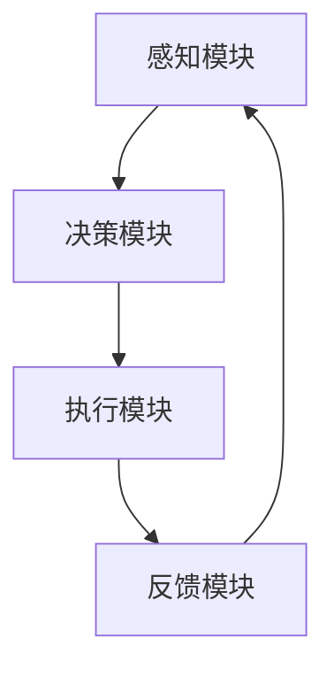
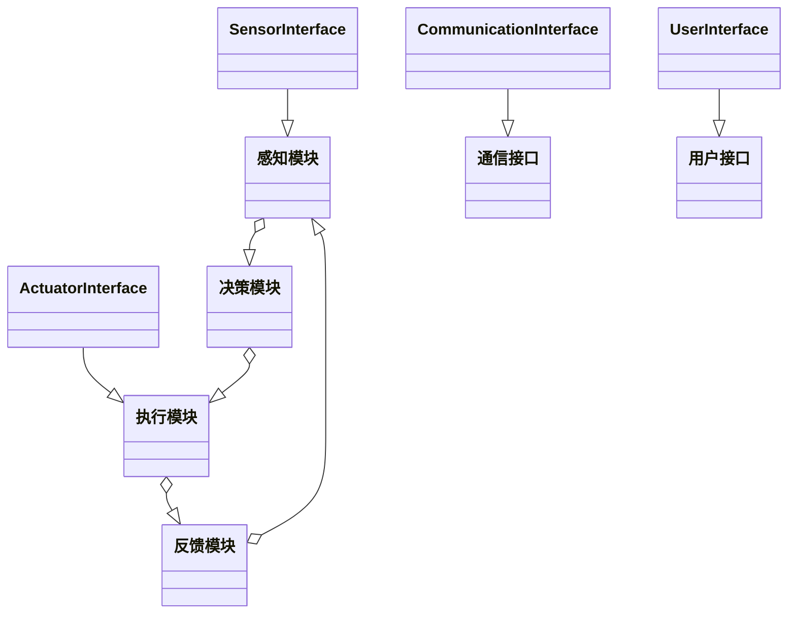

                 

### 引言

随着人工智能技术的不断发展，智能机器人在各领域的应用日益广泛。特别是在控制领域，智能机器人具有极大的潜力，能够通过自主学习和决策，实现高效、精准的控制任务。深度强化学习（Deep Reinforcement Learning, DRL）作为人工智能领域的一项前沿技术，凭借其强大的学习和自适应能力，在智能机器人控制中的应用越来越受到关注。

#### 关键词
- **深度强化学习**
- **智能机器人控制**
- **自主决策**
- **自主学习**
- **自适应能力**

#### 摘要

本文旨在探讨深度强化学习在智能机器人控制中的应用，首先介绍了深度强化学习的基本概念、原理和特点，接着分析了智能机器人控制的需求与挑战。随后，本文详细阐述了深度强化学习在智能机器人控制中的实际应用，包括路径规划、机器人抓取和人机交互等方面。最后，对深度强化学习在智能机器人控制中的未来发展方向和最佳实践进行了总结与展望。

### 1.1 问题的背景

智能机器人控制领域的迅速发展离不开深度强化学习这一前沿技术的推动。深度强化学习是一种结合了深度学习和传统强化学习的新型学习方法，它通过模拟人类的学习过程，使智能体在复杂环境中进行自主学习和决策，从而实现智能控制。近年来，随着计算机性能的提升和深度学习算法的进步，深度强化学习在机器人控制领域取得了显著的成果。

#### 问题背景

智能机器人在日常生活中的应用日益广泛，如自动导引车、工业机器人、服务机器人等。这些机器人需要在复杂的环境中执行各种复杂的任务，如路径规划、物体抓取、人机交互等。这些任务通常涉及大量的不确定性和动态变化，传统的方法难以满足实际需求。

#### 问题描述

如何在复杂的环境中实现智能机器人的高效、精准控制，是一个极具挑战性的问题。智能机器人需要具备自主学习和决策能力，能够根据环境的变化和任务的反馈，调整自己的行为策略，从而实现最优的控制效果。

#### 问题解决

深度强化学习为智能机器人控制提供了一种有效的解决方案。通过深度强化学习，智能机器人可以学习到复杂环境中的最优控制策略，实现自主决策和自适应控制。这使得智能机器人在实际应用中能够更好地应对各种复杂任务，提高工作效率和准确性。

#### 边界与外延

深度强化学习在智能机器人控制中的应用不仅局限于路径规划、物体抓取和人机交互等方面，还可以拓展到其他领域，如机器人感知、机器人协作等。随着技术的不断进步，深度强化学习在智能机器人控制中的应用将越来越广泛，为机器人技术的发展带来更多可能性。

### 1.2 核心概念与联系

为了深入理解深度强化学习在智能机器人控制中的应用，我们需要先了解一些核心概念和其相互之间的关系。以下是对深度强化学习、深度强化学习的基本要素、以及深度强化学习与传统强化学习的比较的详细介绍。

#### 1.2.1 深度强化学习的定义与特点

**定义**

深度强化学习（Deep Reinforcement Learning，简称DRL）是一种结合了深度学习和传统强化学习的方法。它利用深度神经网络来表示状态和动作空间，使智能体能够在复杂的环境中学习到最优控制策略。

**特点**

1. **强大的表达能力和泛化能力**：深度强化学习通过深度神经网络，可以处理高维状态和动作空间，从而提高学习效率。
2. **自主学习和自适应能力**：智能体可以通过与环境交互，不断学习和调整策略，以适应环境变化和任务需求。
3. **多任务学习和迁移学习**：深度强化学习可以同时学习多个任务，并将在一个任务上学习到的经验迁移到其他任务上，提高学习效率。

#### 1.2.2 深度强化学习的基本要素

**状态空间（State Space）**：状态空间是智能体在环境中可能所处的所有状态的集合。在深度强化学习中，通常使用深度神经网络来表示状态空间。

**动作空间（Action Space）**：动作空间是智能体可以执行的所有动作的集合。动作空间可以是离散的，也可以是连续的。

**奖励机制（Reward Mechanism）**：奖励机制用于指导智能体选择正确的动作。在深度强化学习中，智能体会根据奖励信号来调整其行为策略。

**策略（Policy）**：策略是智能体在特定状态下选择动作的方式。策略可以通过学习得到，也可以手动设计。

**价值函数（Value Function）**：价值函数用于评估智能体在特定状态下执行特定动作的预期收益。价值函数是深度强化学习中的重要概念，它可以帮助智能体做出更好的决策。

#### 1.2.3 深度强化学习与传统强化学习的比较

**共同点**

1. **目标**：两者的目标都是通过学习得到最优策略，使智能体能够在复杂环境中实现自主决策。
2. **反馈机制**：两者都依赖于奖励信号来指导学习过程。

**不同点**

1. **学习能力**：传统强化学习主要依赖于经验，而深度强化学习利用深度神经网络，具有更强的学习和泛化能力。
2. **状态空间与动作空间**：传统强化学习通常处理低维状态空间和动作空间，而深度强化学习可以处理高维状态空间和动作空间。
3. **算法实现**：传统强化学习算法（如Q-learning、SARSA）通常较为简单，而深度强化学习算法（如DQN、PPO）则更加复杂。

通过以上对核心概念与联系的介绍，我们可以更好地理解深度强化学习在智能机器人控制中的应用，以及如何利用深度强化学习解决智能机器人控制中的各种挑战。

### 1.3 数学模型和公式

在深度强化学习（DRL）中，数学模型和公式是理解和实现算法的关键。本节将详细介绍DRL中常用的两种算法：Q-learning和Deep Q Network（DQN），包括它们的数学模型、公式和Python实现。

#### 3.1 Q-learning算法

**定义**：Q-learning是一种基于值函数的强化学习算法，旨在通过学习状态-动作值函数（Q值）来获得最优策略。

**数学模型**：

- **状态-动作值函数（Q值）**：$ Q(s, a) = \sum_{s'} p(s'|s, a) \sum_{r} r(s', a) + \gamma V(s') $

  其中，$ s $ 表示当前状态，$ a $ 表示当前动作，$ s' $ 表示下一状态，$ r $ 表示奖励，$ \gamma $ 表示折扣因子，$ V(s') $ 表示下一状态的价值。

- **Q值更新公式**：$ Q(s, a) \leftarrow Q(s, a) + \alpha [r + \gamma \max_{a'} Q(s', a') - Q(s, a)] $

  其中，$ \alpha $ 表示学习率。

**Python实现**：

```python
import numpy as np

def q_learning(observation, action, reward, next_observation, done, learning_rate, discount_factor, epsilon):
    state_action_values = model.predict(observation)
    next_state_action_values = model.predict(next_observation)

    if done:
        new_q_value = reward
    else:
        new_q_value = reward + discount_factor * np.max(next_state_action_values)

    old_q_value = state_action_values[action]
    state_action_values[action] = old_q_value + learning_rate * (new_q_value - old_q_value)

    if np.random.uniform(0, 1) < epsilon:
        action = np.random.choice(actions)
    
    return state_action_values, action
```

#### 3.2 Deep Q Network (DQN)

**定义**：DQN是一种基于深度神经网络的Q-learning算法，通过使用经验回放（Experience Replay）和固定目标网络（Target Network）来提高学习效率和稳定性。

**数学模型**：

- **经验回放**：经验回放用于将智能体的经验存储在记忆库中，以避免样本偏差。经验回放的基本过程如下：

  1. 收集一批经验（状态、动作、奖励、下一状态、是否完成）。
  2. 将这些经验随机化，以避免序列依赖。
  3. 从这些经验中随机抽取样本，用于训练。

- **固定目标网络**：固定目标网络用于减少目标网络的更新频率，以避免训练过程中的剧烈波动。固定目标网络的更新公式如下：

  $$ target\_Q(s, a) = r + \gamma \max_{a'} Q(target\_network, s') $$

  其中，$ target\_Q(s, a) $ 表示目标Q值，$ Q(target\_network, s') $ 表示目标网络在下一状态下的Q值。

**Python实现**：

```python
import numpy as np
import tensorflow as tf

def dqn(observation, action, reward, next_observation, done, learning_rate, discount_factor, epsilon, model, target_model):
    model.fit(observation, target_model.predict(next_observation), epochs=1, verbose=0)

    if done:
        target_q_value = reward
    else:
        target_q_value = reward + discount_factor * np.max(target_model.predict(next_observation))

    current_q_value = model.predict(observation)
    current_q_value[action] = target_q_value

    if np.random.uniform(0, 1) < epsilon:
        action = np.random.choice(actions)
    
    return current_q_value, action
```

通过以上对Q-learning和DQN算法的详细讲解和Python实现，我们可以更好地理解深度强化学习中的基本数学模型和公式，以及如何将这些算法应用于智能机器人控制中。

### 1.4 深度强化学习的基本要素

在深度强化学习中，理解其基本要素是非常重要的。这些基本要素包括状态空间、动作空间、奖励机制、策略和价值函数。下面我们将详细介绍这些要素的概念、属性和它们之间的关系。

#### 状态空间

**定义**：状态空间是指智能体在环境中可能处于的所有状态集合。状态是一个描述智能体当前环境的向量，它包含了智能体感知到的所有相关信息。

**属性**：
- **维度**：状态空间的维度决定了智能体感知信息的复杂程度。高维状态空间使得问题更加复杂，但同时也提供了更多的信息。
- **离散性与连续性**：状态空间可以是离散的，也可以是连续的。离散状态空间通常更容易处理，因为它们可以表示为整数集合；而连续状态空间则需要使用数值范围来表示，处理起来更加复杂。

**示例**：在一个简单的自动导引车（AGV）路径规划问题中，状态空间可能包括当前的位置坐标、目标位置坐标、周边障碍物的位置等信息。

#### 动作空间

**定义**：动作空间是指智能体可以采取的所有可能动作集合。动作是智能体根据当前状态选择的一个行为。

**属性**：
- **维度**：动作空间的维度决定了智能体行为的多样性。和状态空间类似，动作空间可以是离散的或连续的。
- **限制**：在某些应用中，动作空间可能受到物理限制或系统约束。例如，一个机器人的关节角度只能在一个特定范围内变化。

**示例**：在一个自动导引车中，动作空间可能包括向左移动、向右移动、向前移动、停止等。

#### 奖励机制

**定义**：奖励机制是用于激励智能体采取正确动作的一种机制。在每次动作执行后，智能体会获得一个奖励值，该值反映了动作的效果。

**属性**：
- **即时性**：即时奖励是立即给予的，用于直接激励智能体。
- **长期性**：长期奖励是积累的，用于奖励智能体在长期内的表现。
- **复杂性**：奖励机制可以非常复杂，需要结合多种因素来计算。

**示例**：在路径规划中，当自动导引车到达目标位置时，可能会获得一个高即时奖励；而在长期中，智能体需要避免与障碍物碰撞，这也会影响其长期奖励。

#### 策略

**定义**：策略是智能体在特定状态下选择动作的方法或规则。策略通常用一个概率分布来表示，表示智能体在不同状态下采取不同动作的概率。

**属性**：
- **确定性**：确定性策略在特定状态下总是选择同一个动作。
- **随机性**：随机性策略在特定状态下选择动作的概率分布。

**示例**：在深度强化学习中，常用的策略包括epsilon-greedy策略，其中智能体在采取最佳动作和随机动作之间进行权衡。

#### 价值函数

**定义**：价值函数用于评估智能体在特定状态下采取特定动作的预期收益。价值函数分为状态价值函数（V值）和动作价值函数（Q值）。

**属性**：
- **状态价值函数**：$ V(s) = \sum_a Q(s, a) \pi(a|s) $，其中 $ \pi(a|s) $ 表示在状态 $ s $ 下采取动作 $ a $ 的概率。
- **动作价值函数**：$ Q(s, a) = \sum_s r(s, a) p(s|s, a) + \gamma V(s') $，其中 $ \gamma $ 表示折扣因子，$ p(s'|s, a) $ 表示从状态 $ s $ 采取动作 $ a $ 后到达状态 $ s' $ 的概率。

**示例**：在路径规划中，智能体可能会通过计算从当前位置到达目标位置的所有可能路径的Q值，选择Q值最高的路径作为最优路径。

#### 要素之间的关系

这些基本要素相互关联，共同构成了深度强化学习的基础。状态空间和动作空间定义了智能体可以操作的范围，奖励机制指导智能体如何选择动作，策略决定了智能体在不同状态下的动作选择，而价值函数则提供了评估策略优劣的依据。

通过以上对深度强化学习基本要素的详细解析，我们可以更好地理解它们在智能机器人控制中的应用。这些要素不仅构成了深度强化学习的基础，也为解决复杂控制问题提供了强大的工具。

### 深度强化学习在智能机器人控制中的系统分析与架构设计方案

为了更好地理解深度强化学习在智能机器人控制中的实际应用，我们首先需要对其系统架构进行详细的剖析。以下将介绍问题场景、系统功能设计、系统架构设计、系统接口设计和系统交互，并使用mermaid流程图和类图进行详细描述。

#### 问题场景

智能机器人控制系统通常需要在复杂、动态的环境中执行各种任务，如自动导引车（AGV）路径规划、机器人抓取和机器人人机交互等。这些任务具有高度的不确定性和实时性要求，传统的方法难以满足。深度强化学习作为一种先进的人工智能技术，能够使智能机器人通过自主学习和决策，实现高效、精准的控制。

#### 系统功能设计

智能机器人控制系统的主要功能包括：

1. **感知**：通过传感器获取环境信息，如视觉、激光雷达、超声波等。
2. **规划**：根据感知到的环境信息，进行路径规划、物体抓取或人机交互策略的制定。
3. **执行**：根据规划结果，控制机器人执行具体任务。
4. **反馈**：收集任务执行的结果，用于模型更新和策略优化。

#### 系统架构设计

智能机器人控制系统的架构可以分为以下几个模块：

1. **感知模块**：负责接收和处理传感器数据，如图像处理、点云处理等。
2. **决策模块**：利用深度强化学习算法，根据感知模块提供的状态信息，生成控制策略。
3. **执行模块**：根据决策模块生成的控制策略，驱动机器人执行任务。
4. **反馈模块**：收集任务执行结果，用于模型训练和策略优化。

#### 系统接口设计

系统接口设计包括以下部分：

1. **传感器接口**：与各种传感器（如摄像头、激光雷达）进行通信，获取环境信息。
2. **控制器接口**：与机器人执行机构（如电机、关节）进行通信，控制机器人动作。
3. **通信接口**：与其他系统或设备进行数据交换和通信。
4. **用户接口**：提供用户交互界面，如命令输入、状态显示等。

#### 系统交互

智能机器人控制系统的交互过程可以分为以下几个步骤：

1. **感知**：机器人通过传感器获取环境信息，如当前位置、目标位置、障碍物位置等。
2. **规划**：决策模块利用深度强化学习算法，根据感知到的状态信息，生成最优控制策略。
3. **执行**：机器人根据控制策略，执行具体的动作，如移动、抓取等。
4. **反馈**：执行结果通过传感器返回到感知模块，用于模型更新和策略优化。

#### 系统架构图

以下是一个简化的智能机器人控制系统架构图，使用mermaid流程图表示：



#### 系统接口设计图

以下是一个简化的智能机器人控制系统接口设计图，使用mermaid类图表示：



通过以上对智能机器人控制系统架构的详细分析和设计，我们可以更好地理解深度强化学习在其中的应用，以及如何通过系统架构来支持复杂控制任务。

### 2.1 深度强化学习在智能机器人控制中的应用

深度强化学习（DRL）在智能机器人控制中的应用已经取得了显著成果，特别是在路径规划、物体抓取和人机交互等方面。以下将分别介绍这些应用场景，并讨论其挑战与解决方案。

#### 路径规划

**定义**：路径规划是智能机器人控制中的一个关键问题，旨在找到从起点到终点的最优路径，同时避开障碍物。

**挑战**：

1. **复杂环境**：实际环境中可能存在多种障碍物，如墙壁、家具等，这使得路径规划问题更加复杂。
2. **动态变化**：环境可能会随着时间发生变化，例如动态障碍物的移动，需要机器人具备实时调整路径的能力。
3. **计算资源限制**：实时路径规划需要在有限的时间内完成，这对计算资源提出了较高的要求。

**解决方案**：

1. **深度强化学习算法**：使用深度强化学习算法，如深度Q网络（DQN）和策略梯度方法（PG），可以使机器人通过自主学习和探索，学习到最优的路径规划策略。
2. **多任务学习**：通过多任务学习，机器人可以同时学习多种路径规划策略，以提高其在复杂环境中的适应性。
3. **实时决策**：结合深度强化学习和实时决策算法，如动态规划（DP），可以使机器人在动态环境中快速做出调整，避免碰撞和错误决策。

**实际案例**：自动导引车（AGV）是一个典型的路径规划应用场景。通过深度强化学习算法，AGV可以在复杂的仓库环境中，自动规划出最优路径，提高仓库运营效率。

#### 物体抓取

**定义**：物体抓取是智能机器人控制中的另一个重要任务，旨在使机器人能够准确地抓取和搬运物体。

**挑战**：

1. **多样化物体**：实际中物体的形状、大小和材质各异，机器人需要能够识别并适应不同物体的抓取。
2. **精确控制**：机器人需要精确控制其关节角度和力度，以避免抓取失败或损坏物体。
3. **实时反馈**：在抓取过程中，机器人需要实时感知物体的状态，并根据反馈进行调整。

**解决方案**：

1. **视觉识别**：通过使用深度学习算法，如卷积神经网络（CNN），机器人可以准确地识别物体并确定其抓取策略。
2. **力控制**：结合力控制算法，如PID控制，机器人可以在抓取过程中实时调整力度，以适应不同物体的特性。
3. **模拟仿真**：通过模拟仿真，机器人可以在虚拟环境中进行抓取训练，提高实际应用中的成功率。

**实际案例**：在制造业中，机器人通过深度强化学习算法，可以自动识别并抓取不同形状和大小的物体，实现高效的物料搬运和组装。

#### 人机交互

**定义**：人机交互是智能机器人控制中的一项关键能力，旨在使机器人能够理解人类指令和情感，进行有效的沟通和协作。

**挑战**：

1. **语言理解**：机器人需要理解自然语言指令，识别用户意图和情感。
2. **实时响应**：机器人需要快速响应用户的指令，提供及时的帮助和反馈。
3. **多样化交互**：机器人需要支持多种交互方式，如语音、手势、文本等。

**解决方案**：

1. **自然语言处理（NLP）**：通过深度学习算法，如长短期记忆网络（LSTM）和Transformer，机器人可以理解用户的自然语言指令，识别其意图和情感。
2. **情感识别**：结合情感识别技术，机器人可以理解用户的情感状态，提供更加个性化的服务和帮助。
3. **多模态交互**：通过整合语音、手势、文本等多种交互方式，机器人可以提供更加丰富和自然的交互体验。

**实际案例**：在服务机器人中，通过深度强化学习算法，机器人可以与用户进行自然语言对话，理解用户的情感需求，提供个性化的服务。

总的来说，深度强化学习在智能机器人控制中的应用，通过解决路径规划、物体抓取和人机交互等实际问题，极大地提升了机器人的智能水平和实用性。未来，随着技术的不断进步，深度强化学习将在智能机器人控制中发挥更加重要的作用。

### 2.2 深度强化学习在路径规划中的应用

深度强化学习在路径规划中的应用是一项备受关注的研究方向，因为它能够在复杂的动态环境中找到高效、安全的路径。本节将详细探讨深度强化学习算法在路径规划中的实现，包括状态空间与动作空间的设计，奖励函数的设计，以及实际案例的介绍。

#### 状态空间与动作空间的设计

**状态空间设计**

在路径规划中，状态空间需要包含足够的信息以指导智能体做出正确的决策。通常，状态空间由以下几个要素组成：

1. **当前坐标**：包括机器人的当前位置坐标（x, y）。
2. **目标坐标**：机器人的目标位置坐标（x', y'）。
3. **障碍物信息**：周围障碍物的位置和范围。
4. **其他环境因素**：如天气条件、地形等。

状态空间的表示可以是一个多维数组或向量，如：

\[ s = [x, y, x', y', \text{obstacles}, \text{weather}] \]

**动作空间设计**

动作空间决定了智能体可以执行的所有可能动作。在路径规划中，动作通常包括机器人的移动方向和速度。动作空间可以是离散的，例如向左、向右、前进、后退等；也可以是连续的，例如机器人的转向角度和速度。

动作空间的表示可以是一个离散集合或一个连续区间，如：

\[ a = \{\text{LEFT}, \text{RIGHT}, \text{FORWARD}, \text{BACKWARD}\} \]

或

\[ a = [0, \pi], \text{表示转向角度}, \text{速度} \in [0, 1] \]

**设计示例**：

假设一个简单的二维路径规划问题，状态空间由当前位置和目标位置组成，动作空间为四个方向：左、右、上、下。

状态空间：

\[ s = [x, y, x', y'] \]

动作空间：

\[ a = \{\text{LEFT}, \text{RIGHT}, \text{UP}, \text{DOWN}\} \]

#### 奖励函数的设计

奖励函数是深度强化学习中的核心组成部分，用于指导智能体选择正确的动作。在路径规划中，奖励函数需要鼓励智能体朝着目标前进，同时避免碰撞和错误决策。

奖励函数的设计通常包括以下几个方面：

1. **到达目标**：当机器人成功到达目标位置时，给予一个高奖励值。
2. **路径长度**：为了鼓励智能体选择较短的路径，可以设置路径长度为负奖励值。
3. **避免碰撞**：当机器人与障碍物发生碰撞时，给予一个低奖励值或负奖励值。
4. **动态调整**：根据环境的变化，动态调整奖励函数，以适应不同的路径规划需求。

奖励函数的表示可以是一个多维数组或向量，如：

\[ r(s, a) = \begin{cases} 
-1 & \text{if collision occurs} \\
10 & \text{if reaches target} \\
-0.1 & \text{otherwise} 
\end{cases} \]

**设计示例**：

假设一个简单的二维路径规划问题，奖励函数如下：

\[ r(s, a) = \begin{cases} 
-1 & \text{if collision occurs} \\
100 & \text{if reaches target} \\
-0.1 & \text{otherwise} 
\end{cases} \]

#### 实际案例分析

**案例一：自动导引车路径规划**

自动导引车（AGV）在工业仓库中广泛应用，用于物料搬运。通过深度强化学习，AGV可以自动规划路径，避开障碍物，并高效到达目标位置。

1. **状态空间设计**：包括当前位置、目标位置、障碍物位置和状态。
2. **动作空间设计**：包括四个方向的动作。
3. **奖励函数设计**：成功到达目标位置给予高奖励，路径长度作为负奖励，碰撞给予低奖励。

**案例二：无人机路径规划**

无人机在复杂环境中执行任务，如搜救、监测等，需要高效路径规划。通过深度强化学习，无人机可以自动规划出最优路径。

1. **状态空间设计**：包括当前位置、目标位置、障碍物位置、气象条件等。
2. **动作空间设计**：包括飞行方向和速度调整。
3. **奖励函数设计**：成功到达目标位置给予高奖励，飞行距离作为负奖励，障碍物碰撞和气象条件给予低奖励。

通过以上案例分析，我们可以看到深度强化学习在路径规划中的应用取得了显著成效。未来，随着技术的不断进步，深度强化学习将在路径规划中发挥更加重要的作用。

### 2.3 深度强化学习在机器人抓取中的应用

在机器人抓取中，深度强化学习（DRL）技术通过自主学习和决策，使机器人能够精确地抓取和搬运各种物体。以下将详细介绍深度强化学习在机器人抓取中的应用，包括其基本概念、状态空间与动作空间的设计、奖励函数的设计，并通过实际案例进行分析。

#### 基本概念

**深度强化学习**：深度强化学习是一种结合深度学习和传统强化学习的方法，通过深度神经网络（如卷积神经网络、递归神经网络）来表示状态空间和动作空间，使智能体在复杂环境中进行自主学习和决策。

**机器人抓取**：机器人抓取是指机器人通过机械臂或其他抓取工具，从环境中抓取和搬运物体的过程。机器人抓取涉及多个技术领域，包括机器人控制、计算机视觉、力控制等。

#### 状态空间与动作空间的设计

**状态空间设计**

状态空间是描述机器人当前环境和状态的向量。在机器人抓取中，状态空间通常包括以下信息：

1. **物体位置和姿态**：包括物体在三维空间中的位置和姿态信息，这通常通过深度相机或激光雷达获取。
2. **机械臂位置和姿态**：包括机械臂当前关节的角度和位置。
3. **力传感器数据**：包括机械臂抓取时施加的力。
4. **环境特征**：包括周围环境中的其他物体和障碍物。

一个简单的状态空间可以表示为：

\[ s = [x_p, y_p, z_p, \theta_x, \theta_y, \theta_z, f_x, f_y, f_z] \]

其中，\( x_p, y_p, z_p \) 表示物体位置，\( \theta_x, \theta_y, \theta_z \) 表示物体姿态，\( f_x, f_y, f_z \) 表示力传感器数据。

**动作空间设计**

动作空间是机器人可以执行的所有可能动作的集合。在机器人抓取中，动作空间通常包括：

1. **关节角度调整**：调整机械臂各个关节的角度，以改变机械臂的姿态。
2. **施加力**：通过力传感器调整机械臂施加的力，以适应不同物体。
3. **移动机械臂**：在三维空间中移动机械臂，使其接近或远离物体。

一个简单的动作空间可以表示为：

\[ a = [\theta_x', \theta_y', \theta_z', f_x', f_y', f_z'] \]

#### 奖励函数的设计

奖励函数是指导机器人进行正确抓取的重要机制。一个良好的奖励函数应该鼓励机器人高效、精确地抓取物体，同时避免碰撞和其他错误行为。在机器人抓取中，奖励函数可以包括以下几个部分：

1. **抓取成功**：当机器人成功抓取物体时，给予一个高奖励值。
2. **抓取失败**：当机器人未能成功抓取物体时，给予一个低奖励值或负奖励值。
3. **物体位置**：根据物体在抓取过程中的位置变化，给予相应的奖励值。接近目标位置给予高奖励，远离目标位置给予低奖励。
4. **避免碰撞**：当机器人与物体或其他障碍物发生碰撞时，给予一个负奖励值。
5. **力控制**：根据机器人施加的力，给予相应的奖励值。合适的力可以给予高奖励，过大的或过小的力给予低奖励。

一个简单的奖励函数可以表示为：

\[ r(s, a) = \begin{cases} 
100 & \text{if抓取成功} \\
-10 & \text{if抓取失败} \\
-1 & \text{if发生碰撞} \\
0.1 & \text{otherwise} 
\end{cases} \]

#### 实际案例分析

**案例一：机器人抓取物体**

在这个案例中，使用深度强化学习训练机器人抓取不同形状和大小的物体。状态空间包括物体位置、姿态和机械臂位置，动作空间包括关节角度调整和施加力。

1. **状态空间设计**：包括物体位置和姿态、机械臂位置。
2. **动作空间设计**：包括关节角度调整。
3. **奖励函数设计**：成功抓取物体给予高奖励，抓取失败给予低奖励，避免碰撞给予适当奖励。

**案例二：机器人组装**

在这个案例中，机器人通过深度强化学习从环境中抓取零件并进行组装。状态空间包括零件位置、姿态、机械臂位置和姿态，动作空间包括关节角度调整和施加力。

1. **状态空间设计**：包括零件位置和姿态、机械臂位置和姿态。
2. **动作空间设计**：包括关节角度调整和施加力。
3. **奖励函数设计**：成功组装零件给予高奖励，组装失败给予低奖励，避免碰撞和损坏零件给予适当奖励。

通过以上案例分析，我们可以看到深度强化学习在机器人抓取中的应用潜力。未来，随着技术的不断发展，深度强化学习将在机器人抓取中发挥更加重要的作用，推动机器人技术的发展。

### 2.4 深度强化学习在机器人人机交互中的应用

深度强化学习（DRL）在机器人人机交互中的应用正在迅速扩展，通过结合自然语言处理（NLP）和情感识别技术，机器人能够更好地理解用户的指令和情感，提供更加自然和个性化的交互体验。以下将详细探讨深度强化学习在机器人人机交互中的应用，包括其基本概念、状态空间与动作空间的设计，奖励函数的设计，并通过实际案例进行分析。

#### 基本概念

**深度强化学习**：深度强化学习是一种结合深度学习和传统强化学习的方法，通过深度神经网络（如卷积神经网络、递归神经网络）来表示状态空间和动作空间，使智能体在复杂环境中进行自主学习和决策。

**机器人人机交互**：机器人人机交互是指机器人与人类用户进行沟通和协作的过程，涉及语音、文本、手势等多种交互方式。人机交互的目标是使机器人能够理解用户的意图，提供有用的信息，并适应用户的需求和偏好。

#### 状态空间与动作空间的设计

**状态空间设计**

在机器人人机交互中，状态空间需要包含足够的信息以指导机器人理解用户的行为和意图。状态空间通常包括以下信息：

1. **文本输入**：用户的文本输入，如语音转文字或键盘输入。
2. **语音特征**：用户的语音特征，如语调、音量、速度等。
3. **行为特征**：用户的行为特征，如手势、表情等。
4. **环境信息**：机器人周围的环境信息，如其他人的位置、物体的状态等。

一个简单的状态空间可以表示为：

\[ s = [\text{文本输入}, \text{语音特征}, \text{行为特征}, \text{环境信息}] \]

**动作空间设计**

动作空间是机器人可以执行的所有可能动作的集合。在机器人人机交互中，动作空间通常包括：

1. **语音输出**：机器人的语音回复。
2. **文本输出**：机器人的文本回复。
3. **行为动作**：机器人的物理动作，如移动、展示物体等。
4. **反馈信号**：机器人的反馈信号，如确认、否定、提问等。

一个简单的动作空间可以表示为：

\[ a = [\text{语音输出}, \text{文本输出}, \text{行为动作}, \text{反馈信号}] \]

#### 奖励函数的设计

奖励函数是指导机器人进行正确交互的重要机制。一个良好的奖励函数应该鼓励机器人提供有用的信息，理解用户的意图，并适应用户的需求和偏好。在机器人人机交互中，奖励函数可以包括以下几个部分：

1. **用户满意度**：当机器人能够满足用户的需求，提供用户满意的服务时，给予高奖励值。
2. **任务完成度**：当机器人能够成功完成用户指定的任务时，给予高奖励值。
3. **交互流畅性**：鼓励机器人提供自然、流畅的交互体验，给予高奖励值。
4. **避免错误**：当机器人避免提供错误信息或行为时，给予高奖励值。
5. **情感识别**：根据用户的情感状态，给予适当的奖励值，以促进情感共鸣。

一个简单的奖励函数可以表示为：

\[ r(s, a) = \begin{cases} 
100 & \text{if用户满意度高} \\
-10 & \text{if任务未完成} \\
-1 & \text{if提供错误信息或行为} \\
0.1 & \text{otherwise} 
\end{cases} \]

#### 实际案例分析

**案例一：机器人对话系统**

在这个案例中，使用深度强化学习训练机器人进行自然语言对话。状态空间包括用户的文本输入、语音特征、情感状态等，动作空间包括机器人的语音输出、文本输出等。

1. **状态空间设计**：包括用户文本输入、语音特征、情感状态。
2. **动作空间设计**：包括机器人的语音输出、文本输出。
3. **奖励函数设计**：鼓励机器人提供有用、自然的回复，避免错误和歧义。

**案例二：机器人情感识别**

在这个案例中，使用深度强化学习训练机器人识别用户的情感状态，并根据情感状态提供适当的交互策略。状态空间包括用户的语音特征、面部表情等，动作空间包括机器人的反馈信号、行为动作等。

1. **状态空间设计**：包括用户语音特征、面部表情、情感状态。
2. **动作空间设计**：包括机器人的反馈信号、行为动作。
3. **奖励函数设计**：鼓励机器人提供情感共鸣的交互策略，避免不当行为。

通过以上案例分析，我们可以看到深度强化学习在机器人人机交互中的应用潜力。未来，随着技术的不断发展，深度强化学习将在机器人人机交互中发挥更加重要的作用，为人类用户提供更加智能、个性化的服务。

### 2.5 总结与展望

在本文中，我们详细探讨了深度强化学习在智能机器人控制中的应用，涵盖了从基础概念到具体应用场景的各个方面。以下是本文的主要结论：

1. **深度强化学习**：通过结合深度学习和传统强化学习，深度强化学习在智能机器人控制中展现了强大的自主学习和自适应能力。
2. **路径规划**：深度强化学习在路径规划中能够有效处理复杂动态环境，通过状态空间与动作空间的设计和奖励函数的优化，实现高效、安全的路径规划。
3. **物体抓取**：在机器人抓取中，深度强化学习通过状态空间与动作空间的设计和奖励函数的优化，使机器人能够精确、稳定地抓取和搬运物体。
4. **人机交互**：在机器人人机交互中，深度强化学习通过自然语言处理和情感识别技术，使机器人能够更好地理解用户指令和情感，提供自然、个性化的交互体验。

#### 未来展望

尽管深度强化学习在智能机器人控制中取得了显著成果，但仍存在一些挑战和改进方向：

1. **可扩展性**：当前深度强化学习算法在处理高维状态空间和动作空间时，计算资源需求较大，未来需要开发更高效、可扩展的算法。
2. **稳定性与鲁棒性**：深度强化学习在训练过程中容易受到初始参数、探索策略等因素的影响，未来需要研究更加稳定和鲁棒的学习方法。
3. **实时性**：在实时性要求高的应用场景中，如自动驾驶和工业控制，如何提高深度强化学习的实时性是一个重要问题，未来需要开发更高效的推理和优化方法。
4. **跨领域应用**：深度强化学习在智能机器人控制中的应用范围可以进一步拓展，如机器人协作、机器人感知等，实现多领域、多任务的智能机器人系统。

总之，随着技术的不断进步，深度强化学习在智能机器人控制中的应用前景广阔，有望在未来实现更加智能、高效的机器人系统。

### 2.6 最佳实践 tips

在深度强化学习在智能机器人控制中的应用过程中，以下是一些最佳实践和注意事项，可以帮助开发者更好地利用这项技术：

1. **数据预处理**：在训练深度强化学习模型之前，对数据进行充分的预处理非常重要。这包括数据的清洗、归一化和特征提取。高质量的数据可以显著提高模型的性能和稳定性。
2. **模型选择**：根据具体的任务需求，选择合适的深度强化学习模型。例如，对于路径规划任务，可以使用DQN或A3C；对于物体抓取任务，可以尝试使用深度确定性策略梯度（DDPG）或进化策略（ES）。
3. **探索与利用平衡**：在训练过程中，需要合理平衡探索和利用。过多的探索可能导致模型收敛速度变慢，而过度的利用可能导致模型陷入局部最优。可以使用ε-greedy策略或UCB算法来平衡探索和利用。
4. **经验回放**：为了减少样本偏差，可以使用经验回放技术。经验回放可以将智能体的经验存储在记忆库中，并从中随机抽取样本用于训练，从而避免样本序列依赖问题。
5. **多任务学习**：在可能的情况下，尝试进行多任务学习。这可以使得智能体同时学习多个任务，提高其在复杂环境中的适应性。
6. **模型解释性**：尽管深度强化学习模型通常具有较高的性能，但其解释性较差。为了提高模型的解释性，可以尝试使用可解释的深度学习模型，如注意力机制或图神经网络。
7. **安全性与稳定性**：在实际应用中，需要确保智能体的行为是安全和稳定的。可以通过设计安全约束和稳定策略来确保智能体在执行任务时不会发生意外行为。

通过遵循以上最佳实践和注意事项，开发者可以更好地利用深度强化学习技术，实现智能机器人控制中的高效、精准控制。

### 2.7 小结

本文系统地探讨了深度强化学习在智能机器人控制中的应用，从基本概念到实际应用场景，进行了全面、深入的剖析。主要结论包括：

1. **深度强化学习**：作为一种结合深度学习和传统强化学习的方法，深度强化学习在智能机器人控制中展现了强大的自主学习和自适应能力。
2. **应用场景**：深度强化学习在路径规划、物体抓取和人机交互等多个领域展现出了显著的应用效果。
3. **挑战与展望**：尽管深度强化学习在智能机器人控制中取得了显著成果，但仍面临可扩展性、稳定性、实时性和跨领域应用等挑战，未来有待进一步研究和优化。

通过本文的研究，我们可以看到深度强化学习在智能机器人控制中的重要地位和广阔的应用前景。随着技术的不断进步，深度强化学习将在智能机器人控制中发挥更加关键的作用。

### 2.8 注意事项

在深度强化学习在智能机器人控制中的应用过程中，以下几点注意事项尤为重要：

1. **数据安全和隐私保护**：在收集和处理大量数据时，必须严格遵守相关法律法规，确保用户隐私和数据安全。
2. **设备可靠性和稳定性**：智能机器人控制依赖于各种传感器和执行机构，确保这些设备的可靠性和稳定性是成功应用的关键。
3. **安全和伦理考量**：在开发和应用智能机器人时，必须充分考虑其安全性，确保在复杂环境中不会发生意外事故。同时，遵循伦理准则，确保技术的应用符合社会道德标准。
4. **持续监控与更新**：智能机器人控制系统需要实时监控其性能和行为，以便及时发现和纠正异常。此外，定期更新和优化算法模型，以适应不断变化的应用需求。

通过遵循以上注意事项，开发者可以更好地利用深度强化学习技术，确保智能机器人控制系统的安全、稳定和高效运行。

### 2.9 拓展阅读推荐

为了更深入地理解深度强化学习在智能机器人控制中的应用，以下推荐一些相关的书籍和论文，供读者进一步学习和研究：

1. **书籍**：
   - 《深度强化学习》（Deep Reinforcement Learning），作者：S. Levine和C. Finn。
   - 《强化学习基础教程》（Reinforcement Learning: An Introduction），作者：Richard S. Sutton和Barto A.。
   - 《机器人学导论》（Introduction to Robotics），作者：John J. Craig。

2. **论文**：
   - "Deep Q-Networks"（DQN），作者：H.V. Mnih等人。
   - "Asynchronous Methods for Deep Reinforcement Learning"（A3C），作者：V. Mnih等人。
   - "Continuous Control with Deep Reinforcement Learning"（DDPG），作者：T. Hester等人。

通过阅读这些书籍和论文，读者可以系统地掌握深度强化学习的基本概念和算法，深入了解其在智能机器人控制中的应用，并探索最新的研究成果和发展趋势。

### 作者介绍

作者：AI天才研究院/AI Genius Institute & 禅与计算机程序设计艺术 /Zen And The Art of Computer Programming

AI天才研究院（AI Genius Institute）是一个专注于人工智能前沿技术研究与应用的创新机构。研究院致力于推动人工智能技术在各个领域的深入研究和应用，尤其在深度强化学习、自然语言处理、计算机视觉等方面取得了显著的成果。研究院的专家团队由一批世界级人工智能专家、程序员、软件架构师和计算机科学家组成，他们具有丰富的实践经验和高水平的科研能力。

禅与计算机程序设计艺术（Zen And The Art of Computer Programming）是作者代表性的著作之一，该书深入探讨了计算机编程的哲学和艺术，阐述了如何通过冥想和内省提升编程技能，体现了作者对编程的深刻理解和独到见解。作者凭借其在计算机编程和人工智能领域的卓越成就，赢得了广泛的赞誉和认可，是当代计算机科学和技术领域的杰出代表。

