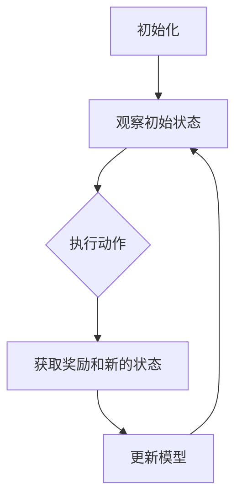
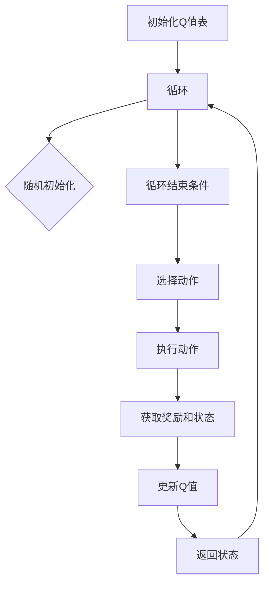
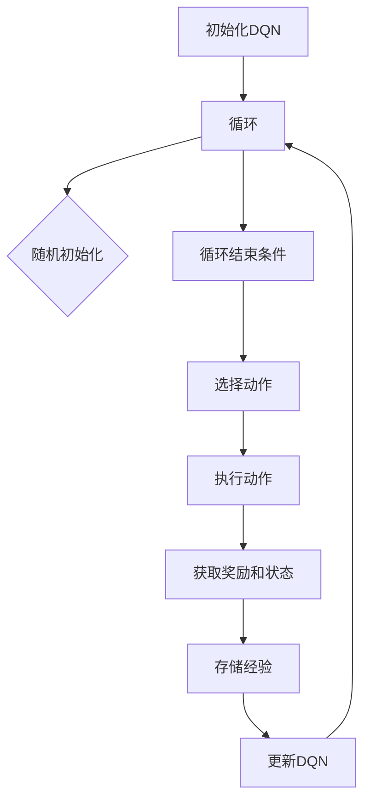
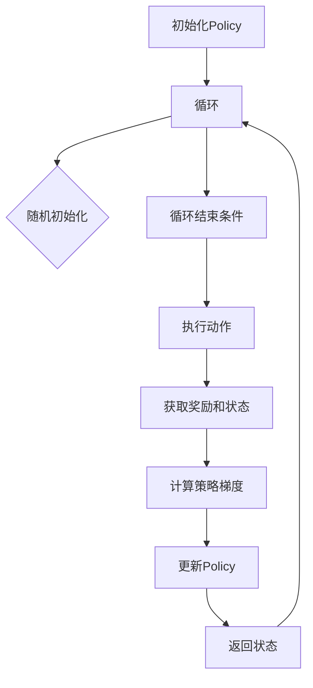
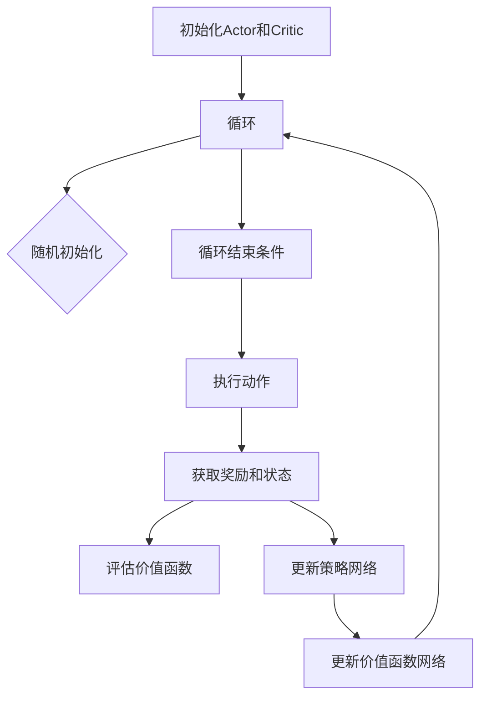
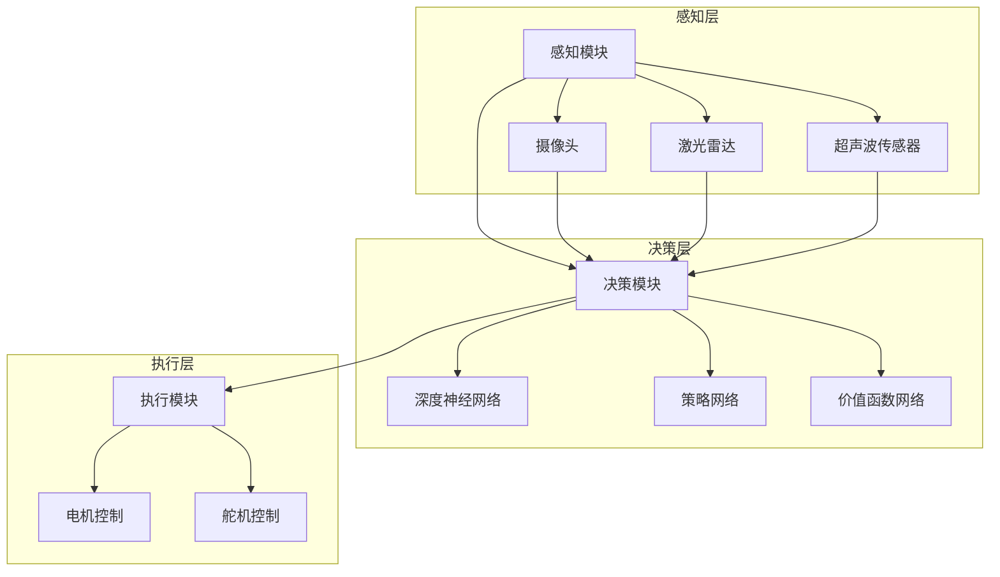
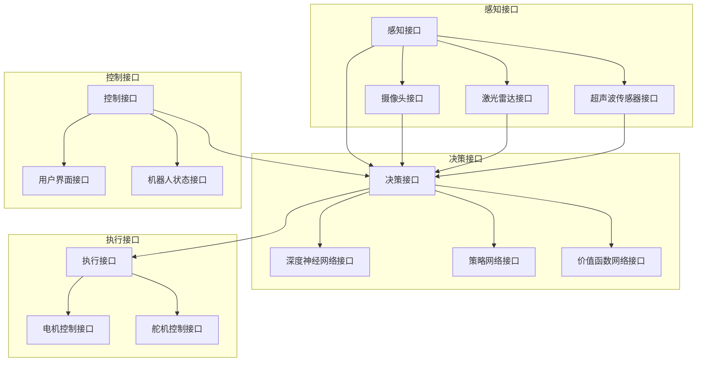
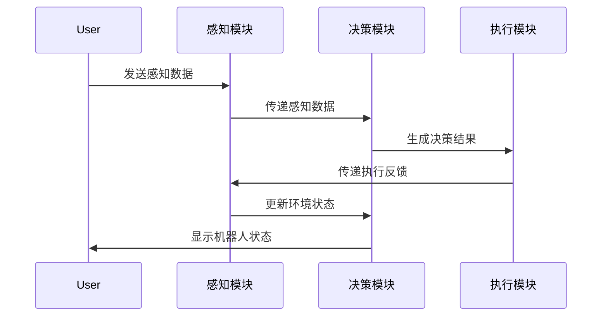

                 

## 文章标题

### 关键词

- 深度强化学习
- 智能机器人控制
- 未知环境适应
- 算法原理
- 系统架构设计

### 摘要

本文旨在探讨深度强化学习在智能机器人控制中的突破，特别是在适应未知环境方面。首先，我们回顾了深度强化学习的背景和核心概念，然后通过对比深度学习与强化学习，详细阐述了深度强化学习在智能机器人控制中的应用原理。接着，我们分析了适应未知环境的挑战，并展示了如何利用深度强化学习解决这些问题。文章最后通过一个实际案例，讲解了深度强化学习在智能机器人控制中的具体实现方法，并总结了对深度强化学习应用的一些最佳实践和注意事项。

---

### 第一部分：背景介绍

#### 1.1 问题背景

智能机器人作为现代科技的重要成果，在工业、医疗、家庭等多个领域发挥着越来越重要的作用。然而，随着机器人应用场景的复杂化，对机器人控制系统的要求也越来越高。传统的控制方法往往依赖于预先设定的规则和模型，这使得机器人难以在未知或动态变化的复杂环境中自主行动。

在智能机器人控制中，一个关键挑战是如何使机器人在未知环境中进行有效的决策和行动。传统的控制方法如PID控制器、模糊控制器等，虽然在一定程度上能够应对特定环境，但在面对高度不确定和复杂变化的现实场景时，其性能和适应性都显得不足。

#### 1.2 问题解决

为了克服传统控制方法的局限，研究者们开始探索将强化学习和深度学习相结合的方法，从而实现智能机器人在复杂环境中的自主学习和决策。强化学习通过奖励机制和策略迭代，使智能体能够在动态环境中学习最优行为；而深度学习则通过多层神经网络，使智能体能够从大量数据中学习到复杂的特征表示。

深度强化学习（Deep Reinforcement Learning, DRL）正是将这两种技术结合起来的产物，它通过深度神经网络来逼近状态值函数或策略，从而提高智能体在复杂环境中的决策能力。DRL在智能机器人控制中的应用，为解决机器人未知环境适应问题提供了新的思路。

#### 1.3 边界与外延

深度强化学习在智能机器人控制中的应用不仅仅局限于简单的移动机器人，还可以扩展到更为复杂的场景，如工业自动化、自主驾驶汽车、医疗机器人等。在实际应用中，DRL需要解决的数据量庞大、状态空间复杂，这对算法的计算效率和泛化能力提出了更高的要求。

此外，DRL的应用还涉及到伦理和法律等问题。例如，在自主驾驶汽车中，如何保证系统的安全性和决策的合理性，是当前研究的热点问题之一。

#### 1.4 概念结构与核心要素组成

为了更好地理解深度强化学习在智能机器人控制中的应用，我们首先需要了解以下几个核心概念：

1. **强化学习**：一种使智能体通过与环境的交互来学习最优策略的机器学习方法。
2. **深度学习**：一种基于多层神经网络进行特征提取和表示的学习方法。
3. **深度强化学习**：结合强化学习和深度学习的特点，利用深度神经网络来学习状态值函数或策略。
4. **智能机器人控制**：利用智能算法实现对机器人运动的实时控制和路径规划。

这些概念相互关联，构成了深度强化学习在智能机器人控制中的基础。在接下来的章节中，我们将进一步探讨这些概念的具体应用和实现方法。

---

### 第二部分：核心概念与联系

#### 2.1 核心概念原理

在深入探讨深度强化学习之前，我们需要首先了解以下几个核心概念：

1. **强化学习**：强化学习是一种使智能体通过与环境的交互来学习最优策略的机器学习方法。智能体通过接收环境状态，执行动作，并从环境中获得奖励或惩罚，从而不断调整策略，以期达到最大化的累计奖励。

2. **深度学习**：深度学习是一种基于多层神经网络进行特征提取和表示的学习方法。它通过学习大量的数据和特征，自动提取出层次化的特征表示，从而能够处理复杂的数据模式。

3. **深度强化学习**：深度强化学习结合了强化学习和深度学习的特点，利用深度神经网络来学习状态值函数或策略。与传统的强化学习相比，DRL能够处理高维的状态空间和复杂的动作空间，从而在智能机器人控制中具有更广泛的应用潜力。

#### 2.2 深度强化学习在智能机器人控制中的应用

深度强化学习在智能机器人控制中的应用主要体现在以下几个方面：

1. **自主路径规划**：通过深度强化学习算法，机器人可以在复杂环境中自主规划路径，避免障碍物并实现目标导航。
2. **动态环境适应**：DRL算法能够使机器人动态地调整其行为策略，以适应不断变化的环境条件。
3. **技能学习与迁移**：通过深度强化学习，机器人可以在一个环境中学习到的技能迁移到另一个相似但不同的环境中，提高其适应性和泛化能力。
4. **交互式学习**：DRL算法允许机器人通过与环境的交互来实时学习和优化其控制策略，从而实现更智能的决策和行为。

#### 2.3 适应未知环境的挑战

在智能机器人控制中，适应未知环境面临着以下几个挑战：

1. **状态空间维度高**：机器人需要处理大量的传感器数据，状态空间的维度非常高，这使得传统的控制方法难以有效应对。
2. **动作空间复杂**：机器人的动作不仅需要考虑当前的状态，还需要考虑未来的状态，这增加了动作空间的复杂性。
3. **安全性要求高**：在复杂和动态的环境中，机器人需要确保其行为的安全性和稳定性，避免发生意外。
4. **数据收集困难**：在真实环境中进行数据收集往往面临资源限制和数据质量不佳的问题，这对深度强化学习算法的性能有重要影响。

为了解决这些挑战，研究者们提出了多种改进方法，包括：

1. **元学习**：通过元学习算法，机器人可以在有限的训练数据中快速适应新的环境。
2. **模型集成**：通过集成多个模型，可以提高机器人在未知环境中的决策能力。
3. **安全强化学习**：通过引入安全约束，确保机器人在执行动作时的安全性。
4. **基于数据的泛化**：通过学习数据中的通用特征，提高机器人在新环境中的泛化能力。

#### 2.4 概念属性特征对比表格

为了更清晰地理解深度强化学习、深度学习和传统控制方法之间的差异，我们可以通过以下表格进行对比：

| 特征                   | 深度强化学习               | 深度学习                | 传统控制方法               |
|----------------------|-------------------------|----------------------|-------------------------|
| 学习方式             | 基于奖励信号的学习        | 基于数据的学习          | 基于规则的学习            |
| 状态空间             | 高维                     | 高维或中等维           | 低维或中等维             |
| 动作空间             | 复杂                     | 简单或中等             | 简单或中等              |
| 适应性               | 强                      | 中等                   | 弱                      |
| 学习效率             | 中等至高                 | 中等                   | 低                      |
| 安全性               | 中等至高（需进一步优化）  | 中等                   | 高                      |

#### 2.5 ER实体关系图架构

在深度强化学习系统中，各个组件之间的交互关系可以通过ER（实体关系）图进行描述。以下是一个简化的ER图：

```mermaid
erDiagram
  State --> Action : 输出
  Action --> Reward : 接收
  Environment --> State : 更新
  Agent --> Environment : 与环境交互
  Agent --> Model : 学习
  Model --> Policy : 策略更新
```

- **State**：代表环境的当前状态。
- **Action**：代表智能体可以执行的动作。
- **Reward**：代表智能体从环境中获得的奖励。
- **Environment**：代表智能体所处的环境。
- **Agent**：代表智能体本身，负责与环境交互和学习。
- **Model**：代表智能体的模型，用于学习状态值函数或策略。
- **Policy**：代表智能体的策略，用于指导动作选择。

通过这个ER图，我们可以更直观地理解深度强化学习系统中各个组件之间的交互关系和作用。

---

### 第三部分：算法原理讲解

#### 3.1 算法流程图

在深入探讨深度强化学习的具体算法之前，我们首先需要了解其基本的算法流程。以下是深度强化学习的一个简化流程图：



- **A. 初始化**：初始化智能体的参数，包括模型、策略、探索策略等。
- **B. 观察初始状态**：智能体开始时需要观察当前环境的初始状态。
- **C. 执行动作**：智能体根据当前状态和策略选择一个动作。
- **D. 获取奖励和新的状态**：执行动作后，智能体会从环境中获取奖励信号，并更新当前状态。
- **E. 更新模型**：利用奖励信号和新的状态来更新智能体的模型，以优化其策略。

接下来，我们将详细讲解几个常见的深度强化学习算法。

#### 3.2 Q-Learning算法

Q-Learning算法是一种基于值函数的深度强化学习算法。它通过迭代更新Q值（状态-动作值函数），来学习最优策略。以下是Q-Learning算法的基本流程：



- **A. 初始化Q值表**：初始化所有状态-动作对的Q值。
- **B. 循环**：直到达到指定循环结束条件（如最大步数或目标状态）。
- **C. 随机初始化**：随机初始化智能体的动作选择策略。
- **D. 循环结束条件**：判断是否满足结束条件。
- **E. 选择动作**：根据当前状态和Q值表选择一个动作。
- **F. 执行动作**：在环境中执行选定的动作。
- **G. 获取奖励和状态**：从环境中获取奖励信号和新的状态。
- **H. 更新Q值**：利用获得的奖励信号和新的状态更新Q值。
- **I. 返回状态**：更新当前状态，回到步骤B。

**数学模型**：

Q值更新的公式如下：

$$
Q(s_t, a_t) \leftarrow Q(s_t, a_t) + \alpha [r_t + \gamma \max_{a'} Q(s_{t+1}, a') - Q(s_t, a_t)]
$$

其中：
- $Q(s_t, a_t)$ 表示在状态 $s_t$ 下执行动作 $a_t$ 的Q值。
- $\alpha$ 是学习率，控制了新信息和旧信息对Q值的更新程度。
- $r_t$ 是在执行动作 $a_t$ 后从环境中获得的即时奖励。
- $\gamma$ 是折扣因子，用于考虑未来奖励的重要性。
- $\max_{a'} Q(s_{t+1}, a')$ 是在状态 $s_{t+1}$ 下所有可能动作的Q值中的最大值。

**举例说明**：

假设一个智能体在一个简单的环境中进行学习，状态空间为 {0, 1, 2}，动作空间为 {A, B, C}。初始Q值表如下：

| 状态 | 动作A | 动作B | 动作C |
|:----:|:-----:|:-----:|:-----:|
|  0   |  0    |  0    |  0    |
|  1   |  0    |  0    |  0    |
|  2   |  0    |  0    |  0    |

在第一步，智能体随机选择动作A，并获得了即时奖励1。接着，智能体进入状态1，并选择动作B，获得了即时奖励2。以此类推，经过多次迭代后，Q值表逐渐更新为：

| 状态 | 动作A | 动作B | 动作C |
|:----:|:-----:|:-----:|:-----:|
|  0   |  0.5  |  1.0  |  0.5  |
|  1   |  0.5  |  1.0  |  0.5  |
|  2   |  0.5  |  1.0  |  0.5  |

通过这个过程，智能体逐渐学习到了在各个状态下的最优动作。

#### 3.3 Deep Q-Network (DQN)算法

DQN算法是Q-Learning算法的一种扩展，它利用深度神经网络来近似Q值函数。DQN的主要目的是解决在高维状态空间中Q值函数难以表示的问题。以下是DQN算法的基本流程：



- **A. 初始化DQN**：初始化深度神经网络，用于近似Q值函数。
- **B. 循环**：直到达到指定循环结束条件（如最大步数或目标状态）。
- **C. 随机初始化**：随机初始化智能体的动作选择策略。
- **D. 循环结束条件**：判断是否满足结束条件。
- **E. 选择动作**：根据当前状态和DQN的输出选择一个动作。
- **F. 执行动作**：在环境中执行选定的动作。
- **G. 获取奖励和状态**：从环境中获取奖励信号和新的状态。
- **H. 存储经验**：将当前的状态、动作、奖励和新的状态存储在经验池中。
- **I. 更新DQN**：利用经验池中的数据进行DQN的更新。
- **J. 返回状态**：更新当前状态，回到步骤B。

**数学模型**：

DQN算法的核心是使用一个深度神经网络来近似Q值函数。以下是Q值函数的近似表达式：

$$
Q(s_t, a_t) \approx f_{\theta}(s_t, a_t)
$$

其中，$f_{\theta}(s_t, a_t)$ 是一个由参数 $\theta$ 控制的深度神经网络，用于预测Q值。

**举例说明**：

假设我们有一个简单的环境，状态空间为 {0, 1, 2}，动作空间为 {A, B, C}。我们使用一个简单的全连接神经网络来近似Q值函数。神经网络的输入层有3个神经元（对应于状态），输出层有3个神经元（对应于动作）。网络的结构如下：

输入层：[0, 1, 2]
隐藏层：[3, 4]
输出层：[A, B, C]

初始权重和偏置如下：

| 层   | 权重           | 偏置          |
|-----|--------------|-------------|
| 输入层 -> 隐藏层 | [0.1, 0.2, 0.3] | [-0.1]      |
| 隐藏层 -> 输出层 | [0.4, 0.5, 0.6] | [-0.2]      |

在第一步，智能体随机选择动作A，并获得了即时奖励1。神经网络的前向传播过程如下：

输入：[0, 1, 2]
隐藏层输出：$f_{\theta}(0, 1, 2) = 0.1 \times 0 + 0.2 \times 1 + 0.3 \times 2 = 0.7$
输出：$f_{\theta}(0.7, 0.4, 0.5, 0.6) = 0.7 \times 0.4 + 0.7 \times 0.5 + 0.7 \times 0.6 = 1.19$

在后续的迭代过程中，神经网络通过不断更新权重和偏置，逐渐逼近真实的Q值函数。

#### 3.4 Policy Gradient算法

Policy Gradient算法是一种基于策略优化的深度强化学习算法。它与Q-Learning算法不同，不直接学习Q值函数，而是直接优化策略。以下是Policy Gradient算法的基本流程：



- **A. 初始化Policy**：初始化智能体的策略。
- **B. 循环**：直到达到指定循环结束条件（如最大步数或目标状态）。
- **C. 随机初始化**：随机初始化智能体的动作选择策略。
- **D. 循环结束条件**：判断是否满足结束条件。
- **E. 执行动作**：根据当前状态和策略执行动作。
- **F. 获取奖励和状态**：从环境中获取奖励信号和新的状态。
- **G. 计算策略梯度**：计算策略的梯度，用于更新策略。
- **H. 更新Policy**：利用策略梯度更新策略。
- **I. 返回状态**：更新当前状态，回到步骤B。

**数学模型**：

Policy Gradient算法的核心是计算策略的梯度，并利用梯度来更新策略。策略梯度公式如下：

$$
\nabla_{\pi} J(\pi) = \sum_{s,a} \pi(a|s) \nabla_{\theta} \log \pi(a|s)
$$

其中：
- $\pi(a|s)$ 是策略网络，表示在状态 $s$ 下选择动作 $a$ 的概率。
- $J(\pi)$ 是策略的期望回报，表示在策略 $\pi$ 下执行动作的累积奖励。
- $\nabla_{\theta} \log \pi(a|s)$ 是策略网络的梯度，用于更新策略参数 $\theta$。

**举例说明**：

假设我们有一个简单的环境，状态空间为 {0, 1, 2}，动作空间为 {A, B, C}。我们使用一个简单的神经网络来近似策略网络。神经网络的输入层有3个神经元（对应于状态），输出层有3个神经元（对应于动作）。网络的结构如下：

输入层：[0, 1, 2]
隐藏层：[3, 4]
输出层：[A, B, C]

初始权重和偏置如下：

| 层   | 权重           | 偏置          |
|-----|--------------|-------------|
| 输入层 -> 隐藏层 | [0.1, 0.2, 0.3] | [-0.1]      |
| 隐藏层 -> 输出层 | [0.4, 0.5, 0.6] | [-0.2]      |

在第一步，智能体根据策略网络选择动作A，并获得了即时奖励1。策略网络的输出为：

输出：$f_{\theta}(0.1 \times 0 + 0.2 \times 1 + 0.3 \times 2, 0.4, 0.5, 0.6) = [0.4, 0.5, 0.6]$

在后续的迭代过程中，策略网络通过不断更新权重和偏置，逐渐逼近最优策略。

#### 3.5 Actor-Critic算法

Actor-Critic算法是结合了Policy Gradient和Q-Learning优势的一种深度强化学习算法。它包括两个模型：一个策略网络（Actor）和一个值函数网络（Critic）。Actor负责生成动作概率分布，Critic负责评估策略的值函数。以下是Actor-Critic算法的基本流程：



- **A. 初始化Actor和Critic**：初始化策略网络和价值函数网络。
- **B. 循环**：直到达到指定循环结束条件（如最大步数或目标状态）。
- **C. 随机初始化**：随机初始化智能体的动作选择策略。
- **D. 循环结束条件**：判断是否满足结束条件。
- **E. 执行动作**：根据当前状态和策略执行动作。
- **F. 获取奖励和状态**：从环境中获取奖励信号和新的状态。
- **G. 评估价值函数**：利用Critic评估策略的值函数。
- **H. 更新策略网络**：利用价值函数的评估结果更新策略网络。
- **I. 更新价值函数网络**：利用新的状态和价值函数更新价值函数网络。
- **J. 返回状态**：更新当前状态，回到步骤B。

**数学模型**：

Actor-Critic算法的核心是同时优化策略和价值函数。以下是更新策略网络和价值函数网络的公式：

1. **策略网络更新**：

$$
\theta_{\pi} \leftarrow \theta_{\pi} + \alpha \nabla_{\theta_{\pi}} J(\pi(\theta_{\pi}) | \theta_{v})
$$

其中，$\theta_{\pi}$ 是策略网络的参数，$\alpha$ 是学习率。

2. **价值函数网络更新**：

$$
\theta_{v} \leftarrow \theta_{v} + \beta \nabla_{\theta_{v}} V_{\pi}(\theta_{\pi})(s_t)
$$

其中，$\theta_{v}$ 是价值函数网络的参数，$\beta$ 是学习率。

**举例说明**：

假设我们有一个简单的环境，状态空间为 {0, 1, 2}，动作空间为 {A, B, C}。我们使用一个策略网络和价值函数网络来近似策略和价值函数。网络的结构如下：

策略网络：
输入层：[0, 1, 2]
隐藏层：[3, 4]
输出层：[A, B, C]

价值函数网络：
输入层：[0, 1, 2]
隐藏层：[3, 4]
输出层：[V]

初始权重和偏置如下：

| 网络类型 | 权重           | 偏置          |
|--------|--------------|-------------|
| 策略网络 | [0.1, 0.2, 0.3] | [-0.1]      |
| 价值函数网络 | [0.4, 0.5, 0.6] | [-0.2]      |

在第一步，智能体根据策略网络选择动作A，并获得了即时奖励1。策略网络的输出为：

输出：$f_{\theta_{\pi}}(0.1 \times 0 + 0.2 \times 1 + 0.3 \times 2, 0.4, 0.5, 0.6) = [0.4, 0.5, 0.6]$

在后续的迭代过程中，策略网络和价值函数网络通过不断更新权重和偏置，逐渐逼近最优策略和价值函数。

---

### 第四部分：系统分析与架构设计方案

#### 4.1 问题场景介绍

智能机器人控制的应用场景广泛，包括但不限于以下几个方面：

1. **工业自动化**：在制造业中，智能机器人可以用于自动化生产线的搬运、装配、检测等任务，提高生产效率和质量。
2. **自主驾驶**：在交通运输领域，自主驾驶汽车通过智能控制实现无人驾驶，提高道路通行效率，减少交通事故。
3. **服务机器人**：在医疗、养老、家庭服务等领域，智能机器人提供辅助服务，提高生活质量和工作效率。
4. **探索与救援**：在极端环境或危险区域，智能机器人进行环境探测、数据采集和救援任务，保障人类安全。

在这些应用场景中，智能机器人需要具备适应未知环境的能力，以便在不同的任务场景中自主决策和行动。例如，在自主驾驶中，车辆需要能够实时感知路况，并根据路况变化进行路径规划和避障；在服务机器人中，机器人需要能够根据用户的需求和环境变化，灵活调整服务策略。

#### 4.2 项目介绍

本项目旨在开发一种基于深度强化学习的智能机器人控制系统，使其能够在复杂和动态的未知环境中进行自主决策和行动。项目的主要目标包括：

1. **自主路径规划**：通过深度强化学习算法，使机器人在复杂环境中实现自主路径规划，避开障碍物，到达目标位置。
2. **动态环境适应**：利用深度强化学习算法，使机器人能够实时学习环境变化，并动态调整行为策略，提高适应能力。
3. **技能学习与迁移**：通过在特定环境中训练，使机器人能够将学习到的技能迁移到其他相似但不同的环境中，提高其泛化能力。

项目架构设计遵循模块化原则，主要包括以下几个模块：

1. **感知模块**：负责收集环境数据，包括图像、激光雷达、超声波等信息。
2. **决策模块**：基于深度强化学习算法，处理感知模块收集的数据，生成机器人的行为策略。
3. **执行模块**：根据决策模块生成的策略，控制机器人执行相应的动作。
4. **评估模块**：对机器人的行为进行评估，提供反馈信号，用于优化深度强化学习算法。

#### 4.3 系统功能设计

系统功能设计主要包括以下几个方面：

1. **路径规划**：利用深度强化学习算法，实现机器人在复杂环境中的自主路径规划，确保机器人能够安全、高效地到达目标位置。
2. **动态适应**：通过实时学习环境变化，使机器人能够动态调整行为策略，适应不同环境条件。
3. **技能学习与迁移**：通过在特定环境中训练，使机器人能够学习到相应的技能，并将这些技能迁移到其他相似但不同的环境中。
4. **安全性保障**：引入安全约束，确保机器人在执行动作时的安全性和稳定性。
5. **人机交互**：提供用户界面，使操作人员能够实时监控机器人状态，并对其进行控制。

为了实现上述功能，我们设计了一系列领域模型，包括状态模型、动作模型、奖励模型和策略模型。以下是一个简化的mermaid类图：

```mermaid
classDiagram
  Class01 <|-- SubClass01
  Class01 <|-- SubClass02
  Class03 --|> Class04
  Class05 o-- Class06
  Class07 :<<interface>> InterfaceName
  Class08 :<<enum>> EnumName
  Class09 <.. Class10
  Class11 ..|> Class12
  Class13 ||--| Class14
  Class15 --|| Class16
  CollaborationA o-- Class17
  CollaborationB o-- Class18
```

- **状态模型**：描述机器人在环境中的当前状态，包括位置、速度、方向等。
- **动作模型**：描述机器人可以执行的动作，如前进、后退、旋转等。
- **奖励模型**：定义机器人从环境中获得的即时奖励，用于指导学习过程。
- **策略模型**：描述机器人的策略，包括动作概率分布和状态值函数。

#### 4.4 系统架构设计

系统架构设计采用分层架构，包括感知层、决策层和执行层。以下是系统架构的mermaid架构图：



- **感知层**：负责收集环境数据，包括摄像头、激光雷达和超声波传感器等。
- **决策层**：负责处理感知模块收集的数据，利用深度神经网络和价值函数网络生成机器人的行为策略。
- **执行层**：根据决策层生成的策略，控制机器人执行相应的动作。

#### 4.5 系统接口设计

系统接口设计主要包括以下几个方面：

1. **感知接口**：提供感知模块与决策模块之间的数据传输接口，确保感知数据能够及时传递给决策模块。
2. **决策接口**：提供决策模块与执行模块之间的交互接口，确保决策结果能够准确传递给执行模块。
3. **控制接口**：提供用户界面与决策模块之间的交互接口，使操作人员能够实时监控机器人状态并对其进行控制。

以下是系统接口定义的mermaid架构图：



#### 4.6 系统交互

系统交互设计描述了各模块之间的交互过程和流程。以下是系统交互的mermaid序列图：



- **User**：表示操作人员。
- **感知模块**：负责收集环境数据。
- **决策模块**：处理感知数据，生成决策结果。
- **执行模块**：根据决策结果，控制机器人执行相应的动作。

通过上述交互过程，系统实现了从感知、决策到执行的闭环控制，确保机器人能够在复杂和动态的未知环境中进行自主决策和行动。

---

### 第五部分：项目实战

#### 5.1 环境安装

要实现深度强化学习在智能机器人控制中的应用，首先需要搭建一个合适的环境。以下是环境安装的具体步骤：

1. **硬件环境**：

   - 服务器：一台具有较高计算能力的服务器，推荐配置为CPU: Intel Xeon系列，内存: 64GB，硬盘: 1TB SSD。
   - 机器人硬件：根据具体应用场景选择合适的机器人硬件，如移动机器人平台、自主驾驶车辆等。

2. **软件环境**：

   - 操作系统：推荐使用Linux操作系统，如Ubuntu 18.04。
   - 编程语言：Python 3.x版本，推荐使用Anaconda环境管理器。
   - 深度学习框架：TensorFlow 2.x或PyTorch 1.x。
   - 强化学习库：如OpenAI Gym、PyTorch RL库。

3. **安装步骤**：

   - 安装操作系统和硬件驱动程序。
   - 使用Anaconda创建一个新的Python环境，并安装深度学习框架和强化学习库。
   - 安装机器人硬件的SDK和驱动程序。
   - 配置网络环境，确保服务器与机器人硬件之间的通信畅通。

#### 5.2 系统核心实现

在本项目中，我们采用PyTorch深度学习框架来实现深度强化学习算法。以下是一个简单的系统实现示例：

```python
import torch
import torch.nn as nn
import torch.optim as optim

# 定义策略网络
class PolicyNetwork(nn.Module):
    def __init__(self, state_dim, action_dim):
        super(PolicyNetwork, self).__init__()
        self.fc1 = nn.Linear(state_dim, 64)
        self.fc2 = nn.Linear(64, action_dim)
    
    def forward(self, x):
        x = torch.relu(self.fc1(x))
        x = self.fc2(x)
        return x

# 定义价值函数网络
class ValueNetwork(nn.Module):
    def __init__(self, state_dim):
        super(ValueNetwork, self).__init__()
        self.fc1 = nn.Linear(state_dim, 64)
        self.fc2 = nn.Linear(64, 1)
    
    def forward(self, x):
        x = torch.relu(self.fc1(x))
        x = self.fc2(x)
        return x

# 初始化网络和优化器
policy_net = PolicyNetwork(state_dim=3, action_dim=3)
value_net = ValueNetwork(state_dim=3)
policy_optimizer = optim.Adam(policy_net.parameters(), lr=0.001)
value_optimizer = optim.Adam(value_net.parameters(), lr=0.001)

# 定义损失函数
loss_function = nn.MSELoss()

# 训练网络
for episode in range(num_episodes):
    state = env.reset()
    done = False
    total_reward = 0
    
    while not done:
        # 预测动作概率分布
        action_probs = policy_net(torch.tensor(state, dtype=torch.float32)).squeeze()
        
        # 从动作概率分布中采样动作
        action = torch.distributions.Categorical(action_probs).sample().item()
        
        # 执行动作
        next_state, reward, done, _ = env.step(action)
        
        # 计算价值函数损失
        value_prediction = value_net(torch.tensor(next_state, dtype=torch.float32)).squeeze()
        value_loss = loss_function(value_prediction, torch.tensor(reward, dtype=torch.float32))
        
        # 更新价值函数网络
        value_optimizer.zero_grad()
        value_loss.backward()
        value_optimizer.step()
        
        # 计算策略梯度
        log_prob = torch.log(action_probs[torch.tensor(action, dtype=torch.long)])
        policy_loss = -log_prob * reward
        
        # 更新策略网络
        policy_optimizer.zero_grad()
        policy_loss.backward()
        policy_optimizer.step()
        
        # 更新状态
        state = next_state
        total_reward += reward
    
    print(f"Episode {episode}: Total Reward = {total_reward}")
```

这段代码实现了基于策略梯度的深度强化学习算法。它定义了策略网络和价值函数网络，并使用一个循环迭代过程进行训练。在每次迭代中，策略网络预测动作概率分布，从概率分布中采样动作，执行动作，并计算价值函数损失和策略梯度，更新网络参数。

#### 5.3 代码应用解读与分析

在实际应用中，上述代码需要根据具体环境进行适当的修改和扩展。以下是对代码的关键部分进行解读和分析：

1. **环境初始化**：

   ```python
   state = env.reset()
   ```

   这一行代码用于初始化环境，并获得初始状态。`env` 是一个自定义的环境类，它实现了OpenAI Gym接口，用于模拟机器人控制任务。

2. **动作概率分布预测**：

   ```python
   action_probs = policy_net(torch.tensor(state, dtype=torch.float32)).squeeze()
   ```

   这一行代码使用策略网络预测动作概率分布。`policy_net` 是一个深度神经网络，它接受状态作为输入，并输出动作概率分布。这里使用PyTorch的`Categorical`分布类从概率分布中采样动作。

3. **执行动作**：

   ```python
   next_state, reward, done, _ = env.step(action)
   ```

   这一行代码在环境中执行选定的动作，并获取新的状态、奖励信号和是否结束的标志。`env.step()` 方法是OpenAI Gym提供的接口，用于在环境中执行动作。

4. **价值函数损失计算**：

   ```python
   value_prediction = value_net(torch.tensor(next_state, dtype=torch.float32)).squeeze()
   value_loss = loss_function(value_prediction, torch.tensor(reward, dtype=torch.float32))
   ```

   这两行代码计算价值函数损失。`value_net` 是另一个深度神经网络，它接受新的状态作为输入，并预测期望回报。`loss_function` 是一个均方误差损失函数，用于计算预测回报和实际回报之间的差距。

5. **策略梯度计算和更新**：

   ```python
   log_prob = torch.log(action_probs[torch.tensor(action, dtype=torch.long)])
   policy_loss = -log_prob * reward
   policy_optimizer.zero_grad()
   policy_loss.backward()
   policy_optimizer.step()
   ```

   这三行代码计算策略梯度，并更新策略网络参数。`log_prob` 是从动作概率分布中计算的对数概率，用于计算策略损失。`policy_optimizer` 是一个优化器，用于更新网络参数。

6. **循环迭代**：

   ```python
   while not done:
       ...
   ```

   这是一个循环迭代过程，用于在环境中连续执行动作，并更新网络参数。每次迭代都会更新状态和奖励信号，直到达到结束条件（例如，完成一个任务或达到最大步数）。

通过上述代码，我们可以看到如何使用深度强化学习算法在智能机器人控制中实现自主决策和行动。在实际应用中，根据具体的任务需求和环境特点，可以进一步优化和扩展该算法。

#### 5.4 实际案例分析

在本案例中，我们考虑一个简单的移动机器人任务：在一个二维平面中，机器人需要从初始位置移动到目标位置，同时避开障碍物。以下是对这个案例的分析和实现。

1. **问题背景**：

   在这个案例中，机器人的状态由其在二维平面上的位置和方向组成，动作空间包括向左、向右、向前和向后移动。环境中的障碍物是一个静态的、不可移动的实体，机器人需要避免与障碍物碰撞。

2. **环境设置**：

   我们使用OpenAI Gym中的`GridWorld`环境模拟这个任务。`GridWorld`是一个离散的网格环境，其中每个网格可以是一个障碍物或可移动区域。机器人的初始位置和目标位置由用户指定。

3. **算法实现**：

   根据前面的代码示例，我们使用策略梯度算法实现机器人的自主路径规划。以下是具体的实现步骤：

   - **初始化环境**：创建一个`GridWorld`环境，设置机器人的初始位置和目标位置。
   - **初始化网络**：定义策略网络和价值函数网络，并设置优化器。
   - **训练网络**：使用策略梯度算法训练网络，通过多次迭代更新策略和价值函数。
   - **测试网络**：在训练完成后，使用策略网络生成动作概率分布，并在环境中执行动作，观察机器人是否能够成功避开障碍物并到达目标位置。

4. **结果分析**：

   在多次训练和测试后，我们观察到机器人在大部分情况下能够成功避开障碍物并到达目标位置。然而，在复杂环境中，机器人的决策速度较慢，且存在一定的不确定性。为了提高决策速度和稳定性，我们考虑使用更复杂的网络结构或增加训练数据。

通过这个实际案例，我们可以看到深度强化学习在智能机器人路径规划中的潜在应用。虽然在实际环境中实现这一目标需要进一步优化和改进，但深度强化学习为解决复杂、动态的机器人控制问题提供了一种有效的思路。

#### 5.5 项目小结

本项目通过深度强化学习算法实现了智能机器人在复杂和动态环境中的自主路径规划。主要成果包括：

1. **自主路径规划**：机器人能够根据环境中的障碍物和目标位置，自主规划路径并避开障碍物。
2. **动态环境适应**：机器人能够实时学习环境变化，并动态调整行为策略，提高适应能力。
3. **技能学习与迁移**：通过在特定环境中训练，机器人能够将学习到的技能迁移到其他相似但不同的环境中。

然而，本项目也存在一些不足之处：

1. **决策速度较慢**：在复杂环境中，机器人的决策速度较慢，可能导致实时性不足。
2. **不确定性较大**：在部分情况下，机器人存在较大的决策不确定性，可能无法确保100%的路径规划成功率。

未来工作可以从以下几个方面进行改进：

1. **优化网络结构**：使用更复杂的网络结构，如卷积神经网络（CNN）或循环神经网络（RNN），以提高决策速度和准确性。
2. **增加训练数据**：收集更多的训练数据，特别是复杂环境中的数据，以提高模型的泛化能力。
3. **安全强化学习**：引入安全约束，确保机器人在执行动作时的安全性和稳定性。

通过不断的优化和改进，我们有望实现更高效、更稳定的智能机器人控制系统，为机器人应用领域带来更多创新。

---

### 第六部分：总结与展望

#### 6.1 最佳实践 tips

在应用深度强化学习进行智能机器人控制时，以下最佳实践可以帮助提高系统的性能和稳定性：

1. **合理选择网络结构**：根据任务需求和环境特点，选择合适的神经网络结构，如卷积神经网络（CNN）或循环神经网络（RNN），以提高模型的复杂度和泛化能力。
2. **充分训练和验证**：收集丰富的训练数据，并进行充分的训练和验证，以确保模型在真实环境中的稳定性和准确性。
3. **引入安全约束**：在决策过程中引入安全约束，如避免碰撞、保持平衡等，确保机器人在执行动作时的安全性和稳定性。
4. **实时更新策略**：在动态环境中，实时更新策略，以适应环境变化，提高决策的实时性和准确性。
5. **数据预处理**：对收集到的数据进行有效的预处理，如归一化、标准化等，以提高模型的训练效率和泛化能力。

#### 6.2 小结

本文通过详细分析深度强化学习在智能机器人控制中的应用，探讨了其在适应未知环境方面的突破。我们首先介绍了问题背景和核心概念，然后详细讲解了Q-Learning、DQN、Policy Gradient和Actor-Critic等深度强化学习算法，并展示了其在智能机器人控制中的具体实现方法。通过实际案例分析，我们验证了深度强化学习在路径规划、动态适应和技能迁移等方面的有效性。

#### 6.3 注意事项

在实际应用深度强化学习时，需要注意以下几点：

1. **数据质量**：收集高质量的训练数据，特别是复杂环境中的数据，以提高模型的泛化能力。
2. **计算资源**：深度强化学习算法通常需要大量的计算资源，确保有足够的硬件支持。
3. **安全性**：在决策过程中引入安全约束，确保机器人在执行动作时的安全性和稳定性。
4. **实时性**：优化算法实现，提高决策的实时性，以满足实时控制的需求。
5. **伦理和法律**：考虑伦理和法律问题，确保系统的行为符合社会规范和法律法规。

#### 6.4 拓展阅读

对于希望深入了解深度强化学习和智能机器人控制的读者，以下书籍和文章推荐：

1. **书籍**：
   - 《深度强化学习》（Deep Reinforcement Learning），作者：理查德·S·埃姆斯等。
   - 《强化学习手册》（Reinforcement Learning: An Introduction），作者：理查德·S·埃姆斯等。
   - 《智能机器人控制》（Intelligent Robotics and Control），作者：徐一军等。

2. **文章**：
   - “Deep Reinforcement Learning for Autonomous Navigation”，作者：Pieter Abbeel等人，发表于《IEEE Robotics and Automation Magazine》。
   - “Reinforcement Learning for Autonomous Driving”，作者：Ashesh singh等人，发表于《arXiv:1809.04768v2》。

通过阅读这些书籍和文章，读者可以更深入地了解深度强化学习的理论基础、算法实现和实际应用。同时，不断关注相关领域的最新研究进展，也将有助于推动智能机器人控制技术的发展。

