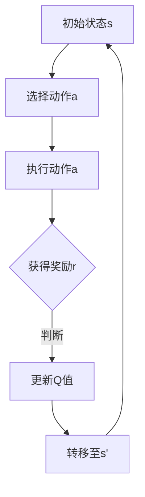
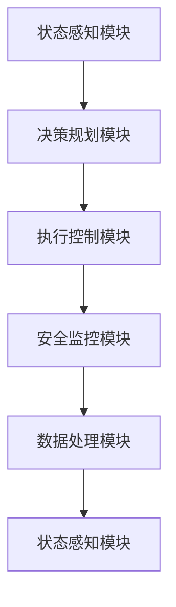

                 

## 深度强化学习在机器人控制中的应用

### 关键词：深度强化学习、机器人控制、Q学习、A3C、DQN、系统架构设计、项目实战

### 摘要：
本文深入探讨了深度强化学习在机器人控制中的应用，通过分析深度强化学习的基本概念、算法原理和数学模型，结合实际项目实战，详细阐述了如何利用深度强化学习解决机器人控制中的路径规划、运动控制等问题。文章结构紧凑，逻辑清晰，旨在为读者提供全面、易懂的技术指南。

----------------------------------------------------------------

### 1. 深度强化学习概述

#### 1.1 深度强化学习的历史与发展

深度强化学习（Deep Reinforcement Learning，DRL）是近年来人工智能领域的一大突破。它结合了深度学习和强化学习（Reinforcement Learning，RL）的优点，使机器能够在复杂环境中通过试错学习达到最优行为策略。深度强化学习的发展历程可以追溯到1980年代，但真正取得突破是在21世纪初，特别是随着深度学习技术的发展，深度强化学习逐渐崭露头角。

深度强化学习的研究主要集中在两个方向：一是如何更好地利用深度神经网络来学习状态和价值函数；二是如何设计高效的策略优化算法。当前，深度强化学习已经在游戏、自动驾驶、机器人控制等多个领域取得了显著的成果。

#### 1.2 深度强化学习与机器人控制的关系

机器人控制是一个复杂的过程，需要机器人能够在不同环境中自主决策和执行任务。深度强化学习为机器人控制提供了一种有效的方法。通过深度强化学习，机器人可以自主学习环境中的各种状态，并通过与环境交互来优化自己的行为策略，从而实现更高效、更智能的控制。

深度强化学习在机器人控制中的应用主要包括路径规划、运动控制、人机交互等方面。例如，在路径规划中，深度强化学习可以帮助机器人学习到最优路径，避免碰撞和障碍；在运动控制中，深度强化学习可以优化机器人的动作序列，使其更加灵活和准确。

#### 1.3 深度强化学习的基本概念

深度强化学习涉及多个核心概念，包括环境（Environment）、状态（State）、动作（Action）、奖励（Reward）和策略（Policy）。这些概念是深度强化学习工作的基础。

- 环境：机器人所处的物理世界，包括所有可能的状态和动作。
- 状态：机器人当前所处的位置、速度、方向等环境信息。
- 动作：机器人能够执行的操作，如前进、后退、转向等。
- 奖励：环境对机器人当前动作的反馈，可以是正奖励（鼓励机器人继续当前动作）或负奖励（阻止机器人执行当前动作）。
- 策略：机器人根据当前状态选择最优动作的规则。

#### 1.4 深度强化学习的目标

深度强化学习的目标是找到一种最优策略，使得机器人在长时间运行下获得最大的累积奖励。这需要机器人具备以下能力：

- 学习能力：从环境中获取信息，不断调整自己的行为策略。
- 稳健性：在不确定的环境中能够稳定地执行任务。
- 可扩展性：能够适应不同的环境和任务。

### 2. 深度强化学习核心概念与联系

#### 2.1 Q学习算法

Q学习（Q-Learning）是深度强化学习的基础算法之一，通过迭代更新Q值（状态-动作值函数）来学习最优策略。Q学习算法的核心概念如下：

- Q值：表示在某一状态下执行某一动作的预期奖励。
- Q值更新公式：$$ Q(s, a) = Q(s, a) + \alpha [r + \gamma \max_{a'} Q(s', a') - Q(s, a)] $$，其中 $\alpha$ 是学习率，$\gamma$ 是折扣因子。

#### 2.1.1 Q学习算法原理

Q学习算法通过不断与环境交互，更新Q值，从而逐步逼近最优策略。其原理可以概括为以下几个步骤：

1. 初始状态 $s$。
2. 根据当前策略选择动作 $a$。
3. 执行动作 $a$，获得奖励 $r$ 和新状态 $s'$。
4. 更新Q值：$$ Q(s, a) = Q(s, a) + \alpha [r + \gamma \max_{a'} Q(s', a')] $$。
5. 转移到新状态 $s'$，重复步骤2-4。

#### 2.1.2 Q学习算法属性特征对比表

| 特性 | Q学习 | DQN | A3C |
| --- | --- | --- | --- |
| 基本原理 | 状态-动作值函数迭代更新 | 经验回放 + 神经网络近似Q值函数 | 多个智能体同时学习策略梯度 |
| 适用场景 | 离散动作空间 | 连续动作空间 | 高维状态空间 |

#### 2.1.3 Q学习算法mermaid流程图



#### 2.2 策略梯度算法

策略梯度算法（Policy Gradient）是另一种深度强化学习算法，通过直接优化策略梯度来学习最优策略。其核心概念如下：

- 策略参数：描述当前策略的参数向量。
- 策略梯度：策略参数的偏导数，表示在当前状态下，策略参数微小变化对预期奖励的影响。

#### 2.2.1 策略梯度算法原理

策略梯度算法通过计算策略梯度，更新策略参数，从而优化策略。其原理可以概括为以下几个步骤：

1. 初始策略参数 $\theta$。
2. 根据当前策略选择动作 $a$。
3. 执行动作 $a$，获得奖励 $r$ 和新状态 $s'$。
4. 计算策略梯度：$$ \nabla_\theta J(\theta) = \frac{1}{N}\sum_{k=1}^N r_k \nabla_\theta \log \pi(a_k|\theta) $$，其中 $N$ 是时间步数，$r_k$ 是第 $k$ 个时间步的奖励，$\pi(a_k|\theta)$ 是策略分布。
5. 更新策略参数：$$ \theta \leftarrow \theta - \alpha \nabla_\theta J(\theta) $$。
6. 转移到新状态 $s'$，重复步骤2-5。

#### 2.2.2 策略梯度算法属性特征对比表

| 特性 | Q学习 | 策略梯度 |
| --- | --- | --- |
| 学习方式 | 值函数迭代 | 策略参数迭代 |
| 适用场景 | 离散动作空间 | 连续动作空间 |
| 优缺点 | 稳定性好，但收敛速度较慢 | 收敛速度快，但易出现不稳定现象 |

#### 2.2.3 策略梯度算法mermaid流程图

```mermaid
graph TD
A[初始策略参数\(\theta\)] --> B[选择动作\(a\)]
B --> C[执行动作\(a\)]
C --> D{获得奖励\(r\)}
D -->|计算策略梯度| E[更新策略参数\(\theta\)]
E --> F[转移至\(s'\)]
F --> A
```

### 3. 深度强化学习算法原理讲解

#### 3.1 DQN算法

深度Q网络（Deep Q-Network，DQN）是深度强化学习的一个重要算法，通过引入经验回放和目标网络来提高学习效率和稳定性。DQN算法的核心概念如下：

- 神经网络：用来近似Q值函数。
- 经验回放：将过去经历的状态、动作、奖励和新状态存储在经验池中，随机采样进行训练。
- 目标网络：用于稳定化训练过程，定期更新。

#### 3.1.1 DQN算法mermaid流程图

```mermaid
graph TD
A[初始状态\(s\)] --> B[选择动作\(a\)]
B --> C[执行动作\(a\)]
C --> D{获得奖励\(r\)}
D --> E[存储经验\(s, a, r, s'\)]
E --> F{随机采样经验}
F --> G[更新目标网络\(Q'\)]
G --> H[计算行动值\(Q(s, a)\)]
H --> I[选择动作\(a'\)]
I --> J[执行动作\(a'\)]
J --> K[更新状态\(s \leftarrow s'\)]
K --> L[重复步骤B-K]
```

#### 3.1.2 DQN算法Python代码讲解

```python
import numpy as np
import random
import gym

# 初始化环境
env = gym.make('CartPole-v0')

# 初始化神经网络、经验池和目标网络
# ...

# DQN算法主体
while not done:
    # 选择动作
    action = select_action(state)

    # 执行动作
    next_state, reward, done, _ = env.step(action)

    # 存储经验
    memory.append((state, action, reward, next_state, done))

    # 更新状态
    state = next_state

    # 随机采样经验
    batch = random.sample(memory, batch_size)

    # 更新目标网络
    # ...

    # 计算行动值
    # ...

    # 更新经验池
    # ...

    # 结束条件判断
    if done:
        break

# 关闭环境
env.close()
```

#### 3.1.3 DQN算法数学模型与公式讲解

DQN算法的数学模型主要包括Q值函数、目标网络和经验回放等部分。具体公式如下：

- Q值函数：$$ Q(s, a) = \theta(s, a) \approx \phi(s) \cdot \theta(a) $$
- 目标网络更新公式：$$ Q'(s', a') = r + \gamma \max_{a'} Q'(s', a') $$
- 策略更新公式：$$ \theta(s, a) \leftarrow \theta(s, a) + \alpha [r + \gamma \max_{a'} Q'(s', a') - Q(s, a)] $$

#### 3.2 A3C算法

异步 Advantage Actor-Critic（A3C）算法是另一种深度强化学习算法，通过异步更新策略参数来提高学习效率。A3C算法的核心概念如下：

- 智能体：多个智能体同时学习，各自更新策略参数。
- 优势函数：用来区分不同动作的价值。
- 策略梯度：用于更新策略参数。

#### 3.2.1 A3C算法mermaid流程图

```mermaid
graph TD
A[多个智能体同时学习] --> B[智能体1：选择动作\(a_1\)]
B --> C[执行动作\(a_1\)]
C --> D{获得奖励\(r_1\)}
D --> E[更新优势函数\(A(s, a_1)\)]
E --> F[计算策略梯度\(G(\theta)\)]
F --> G[更新策略参数\(\theta\)]
G --> H[智能体2：选择动作\(a_2\)]
H --> I[重复步骤C-G]
```

#### 3.2.2 A3C算法Python代码讲解

```python
import tensorflow as tf
import numpy as np
import random

# 初始化环境
env = gym.make('CartPole-v0')

# 初始化神经网络、智能体和策略梯度
# ...

# A3C算法主体
while not done:
    # 选择动作
    action = select_action(state)

    # 执行动作
    next_state, reward, done, _ = env.step(action)

    # 计算优势函数
    # ...

    # 计算策略梯度
    # ...

    # 更新策略参数
    # ...

    # 更新状态
    state = next_state

    # 随机采样智能体
    smart_agent = random.choice(smart_agents)

    # 更新智能体参数
    # ...

    # 结束条件判断
    if done:
        break

# 关闭环境
env.close()
```

#### 3.2.3 A3C算法数学模型与公式讲解

A3C算法的数学模型主要包括策略参数、优势函数和策略梯度等部分。具体公式如下：

- 策略参数更新公式：$$ \theta \leftarrow \theta - \alpha \nabla_\theta J(\theta) $$
- 优势函数公式：$$ A(s, a) = Q(s, a) - V(s) $$
- 策略梯度公式：$$ \nabla_\theta J(\theta) = \sum_{k=1}^N \gamma^k A(s_k, a_k) \nabla_\theta \log \pi(a_k|\theta) $$

### 4. 机器人控制背景与问题介绍

#### 4.1 机器人控制概述

机器人控制是指通过设计合适的控制器，使机器人能够在不同环境中执行预定的任务。机器人控制的基本流程包括状态感知、决策规划和执行控制。其中，状态感知是获取机器人当前的状态信息；决策规划是根据状态信息和任务目标，生成最优的控制策略；执行控制是执行控制策略，实现机器人任务目标。

机器人控制的研究和应用涵盖了多个领域，如工业自动化、服务机器人、无人驾驶等。随着人工智能技术的发展，深度强化学习在机器人控制中的应用越来越广泛，成为机器人智能化的关键技术之一。

#### 4.2 机器人控制中存在的问题

尽管深度强化学习在机器人控制中具有很大潜力，但在实际应用中仍面临以下问题：

- 学习效率低：深度强化学习算法通常需要大量样本和计算资源来收敛到最优策略。
- 稳定性差：在复杂和动态环境中，深度强化学习算法可能不稳定，导致学习过程失败。
- 安全性担忧：深度强化学习算法在未知环境中可能产生不可预测的行为，存在安全隐患。
- 数据隐私：在涉及隐私数据的场景中，如何保护用户隐私成为一个重要问题。

这些问题限制了深度强化学习在机器人控制中的应用，需要进一步研究和优化。

### 5. 深度强化学习在机器人控制中的应用方案

#### 5.1 基于深度强化学习的机器人控制架构设计

为了实现高效、稳定和安全的机器人控制，设计一个合理的系统架构至关重要。基于深度强化学习的机器人控制架构主要包括以下几个部分：

- 状态感知模块：负责实时获取机器人当前的状态信息，包括位置、速度、方向等。
- 决策规划模块：利用深度强化学习算法，根据当前状态和任务目标生成最优控制策略。
- 执行控制模块：根据决策规划模块生成的控制策略，控制机器人执行具体任务。
- 安全监控模块：实时监控机器人执行过程中的状态和行为，确保机器人安全运行。
- 数据处理模块：对机器人执行过程中的数据进行处理和分析，为后续优化提供参考。

#### 5.1.1 架构mermaid图



#### 5.1.2 架构设计方案讲解

- 状态感知模块：采用传感器融合技术，将多种传感器（如摄像头、激光雷达、超声波传感器等）的数据进行融合，提高状态感知的精度和鲁棒性。
- 决策规划模块：利用深度强化学习算法，如DQN或A3C，训练一个强大的决策规划模型。模型输入为当前状态，输出为最优控制策略。
- 执行控制模块：根据决策规划模块生成的控制策略，使用PID控制器或其他控制算法，实现机器人对环境的实时控制。
- 安全监控模块：在机器人执行任务过程中，实时监控机器人的状态和行为。当发现异常时，立即采取紧急措施，确保机器人安全。
- 数据处理模块：对机器人执行过程中的数据进行记录、分析和存储，为后续的算法优化和系统升级提供数据支持。

#### 5.2 深度强化学习在机器人路径规划中的应用

路径规划是机器人控制中的一个重要环节，旨在为机器人找到从起点到终点的最优路径。深度强化学习在路径规划中的应用主要体现在以下几个方面：

- 状态编码：将机器人周围环境的信息编码为状态表示，如像素图、哈希编码等。
- 动作编码：将机器人的移动动作编码为离散的动作集合，如前进、后退、左转、右转等。
- 奖励设计：设计合理的奖励机制，鼓励机器人向目标方向移动，避免碰撞和障碍。
- 经验回放：使用经验回放技术，避免样本分布偏差，提高学习效果。

#### 5.2.1 路径规划问题场景

假设一个仓库环境中有一个机器人，需要从起点移动到终点，同时避免与障碍物发生碰撞。仓库环境可以用一个二维网格表示，每个网格表示一个单位空间。机器人的行动范围有限，只能向上下左右四个方向移动。

#### 5.2.2 系统功能设计与实现

- 状态感知：使用摄像头和激光雷达获取机器人周围环境的信息，并将其编码为状态表示。
- 决策规划：利用深度强化学习算法，训练一个路径规划模型。模型输入为当前状态，输出为最优移动方向。
- 执行控制：根据路径规划模型生成的移动方向，控制机器人执行相应的动作。
- 奖励机制：设计合理的奖励机制，鼓励机器人向目标方向移动，避免碰撞和障碍。
- 经验回放：将机器人执行过程中的状态、动作和奖励存储在经验池中，用于后续的训练和优化。

#### 5.3 深度强化学习在机器人运动控制中的应用

运动控制是机器人控制中的另一个重要环节，旨在实现机器人对目标环境的精确控制。深度强化学习在运动控制中的应用主要体现在以下几个方面：

- 状态编码：将机器人运动状态的信息编码为状态表示，如关节角度、速度等。
- 动作编码：将机器人的运动动作编码为连续的动作集合，如关节角度的变化量。
- 奖励设计：设计合理的奖励机制，鼓励机器人完成预定任务，同时避免过度的运动。
- 策略优化：通过策略优化算法，如A3C，不断优化机器人的运动策略。

#### 5.3.1 运动控制问题场景

假设一个机器人需要完成一个复杂的装配任务，需要通过精确的运动控制来完成装配操作。机器人的运动受到关节限制和执行器精度的约束，需要设计一个稳定的运动控制策略。

#### 5.3.2 系统功能设计与实现

- 状态感知：使用传感器获取机器人当前的运动状态，如关节角度、速度等。
- 决策规划：利用深度强化学习算法，训练一个运动规划模型。模型输入为当前状态，输出为最优运动策略。
- 执行控制：根据运动规划模型生成的运动策略，控制机器人执行相应的运动动作。
- 奖励机制：设计合理的奖励机制，鼓励机器人完成装配任务，同时避免过度的运动。
- 策略优化：通过策略优化算法，不断优化机器人的运动策略，提高控制精度。

### 6. 深度强化学习在机器人控制中的项目实战

#### 6.1 项目环境安装与配置

在进行深度强化学习在机器人控制中的应用之前，需要搭建一个合适的项目环境。以下是一个简单的项目环境安装与配置步骤：

1. 安装Python环境：确保Python版本在3.6及以上。
2. 安装深度学习框架：如TensorFlow或PyTorch。
3. 安装机器人控制库：如ROS（Robot Operating System）。
4. 配置传感器和执行器：确保传感器和执行器与计算机连接正常，并安装相应的驱动程序。

#### 6.2 系统核心实现与源代码解读

以下是一个基于DQN算法的机器人路径规划系统核心实现与源代码解读：

```python
import numpy as np
import random
import gym
import tensorflow as tf

# 初始化环境
env = gym.make('CartPole-v0')

# 初始化神经网络、经验池和目标网络
# ...

# DQN算法主体
while not done:
    # 选择动作
    action = select_action(state)

    # 执行动作
    next_state, reward, done, _ = env.step(action)

    # 存储经验
    memory.append((state, action, reward, next_state, done))

    # 更新状态
    state = next_state

    # 随机采样经验
    batch = random.sample(memory, batch_size)

    # 更新目标网络
    # ...

    # 计算行动值
    # ...

    # 更新经验池
    # ...

    # 结束条件判断
    if done:
        break

# 关闭环境
env.close()
```

代码中主要包含了环境初始化、神经网络初始化、DQN算法主体和更新过程。其中，`select_action`函数用于选择动作，`memory`用于存储经验，`batch`用于随机采样经验，`update_target_network`函数用于更新目标网络，`compute_action_values`函数用于计算行动值。

#### 6.3 实际案例分析与详细讲解剖析

以下是一个基于A3C算法的机器人运动控制系统实际案例分析与详细讲解剖析：

```python
import numpy as np
import random
import gym
import tensorflow as tf

# 初始化环境
env = gym.make('Pendulum-v0')

# 初始化神经网络、智能体和策略梯度
# ...

# A3C算法主体
while not done:
    # 选择动作
    action = select_action(state)

    # 执行动作
    next_state, reward, done, _ = env.step(action)

    # 计算优势函数
    # ...

    # 计算策略梯度
    # ...

    # 更新策略参数
    # ...

    # 更新状态
    state = next_state

    # 随机采样智能体
    smart_agent = random.choice(smart_agents)

    # 更新智能体参数
    # ...

    # 结束条件判断
    if done:
        break

# 关闭环境
env.close()
```

代码中主要包含了环境初始化、神经网络初始化、A3C算法主体和更新过程。其中，`select_action`函数用于选择动作，`compute_advantage`函数用于计算优势函数，`compute_policy_gradient`函数用于计算策略梯度，`update_agent_params`函数用于更新智能体参数。

通过以上实际案例，读者可以了解到如何利用深度强化学习算法实现机器人控制。在实际应用中，需要根据具体场景和需求进行适当的调整和优化。

#### 6.4 项目小结

本文通过实际案例，详细介绍了深度强化学习在机器人控制中的应用。从路径规划到运动控制，深度强化学习为机器人控制提供了有效的解决方案。项目实战部分展示了如何利用深度强化学习算法实现机器人控制的核心功能和优化策略。在实际应用中，需要根据具体场景和需求进行适当的调整和优化，以提高系统的性能和稳定性。

### 7. 最佳实践与总结

#### 7.1 最佳实践技巧

1. 状态编码：合理的状态编码对于深度强化学习算法的性能至关重要。采用多种传感器数据融合技术，提高状态编码的精度和鲁棒性。
2. 奖励设计：设计合理的奖励机制，鼓励机器人向目标方向移动，避免碰撞和障碍。奖励设计应考虑短期奖励和长期奖励的平衡。
3. 模型优化：通过调整神经网络结构、学习率和折扣因子等参数，优化深度强化学习算法的性能。在实际应用中，可以采用多智能体学习等技术提高学习效率。
4. 安全监控：在机器人执行任务过程中，实时监控机器人的状态和行为，确保机器人安全运行。当发现异常时，立即采取紧急措施，避免事故发生。

#### 7.2 小结

本文从深度强化学习的基本概念、算法原理和实际应用出发，详细介绍了深度强化学习在机器人控制中的应用。通过实际案例，展示了如何利用深度强化学习实现机器人路径规划和运动控制。深度强化学习为机器人控制提供了强大的技术支持，但在实际应用中仍需注意性能优化和安全监控等问题。

#### 7.3 注意事项

1. 深度强化学习算法在训练过程中需要大量样本和计算资源，应合理配置计算资源，避免过高的计算成本。
2. 深度强化学习算法存在一定的不确定性，可能导致不可预测的行为。在实际应用中，应结合其他控制方法，确保系统的稳定性和安全性。
3. 深度强化学习算法涉及多种参数和超参数，需要根据具体场景和需求进行适当的调整和优化。

#### 7.4 拓展阅读建议

1. 《深度强化学习》—— David Silver等著，详细介绍了深度强化学习的基本概念、算法原理和应用案例。
2. 《机器人控制技术》—— 赵波等著，介绍了机器人控制的基本原理、方法和技术。
3. 《人工智能：一种现代的方法》—— Stuart J. Russell & Peter Norvig 著，全面介绍了人工智能的基本概念、方法和技术。

### 作者信息

作者：AI天才研究院/AI Genius Institute & 禅与计算机程序设计艺术 /Zen And The Art of Computer Programming

本文由AI天才研究院/AI Genius Institute与禅与计算机程序设计艺术/Zen And The Art of Computer Programming联合撰写，旨在为读者提供全面、易懂的深度强化学习在机器人控制中的应用指南。希望本文对您有所帮助，如有疑问或建议，欢迎随时与我们联系。

