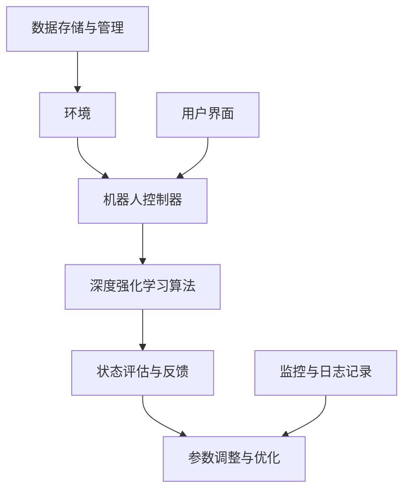
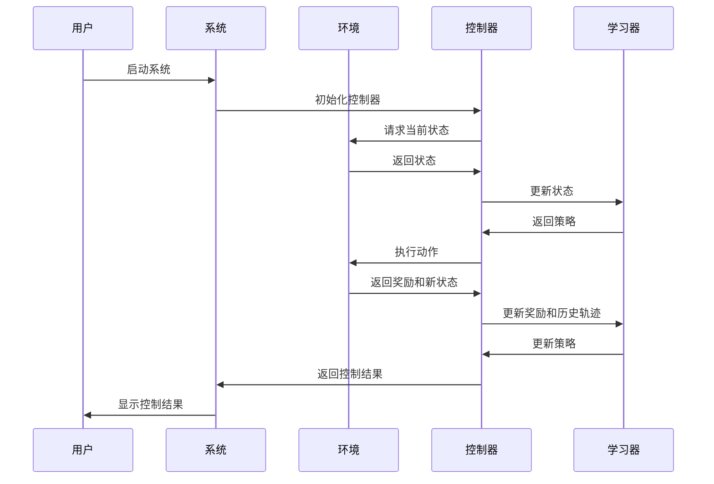

                 

### 深度强化学习在机器人控制中的应用：实现复杂任务自主学习

> 关键词：深度强化学习，机器人控制，自主学习，复杂任务

> 摘要：本文深入探讨了深度强化学习在机器人控制中的应用，详细分析了其核心概念、算法原理以及具体实现。通过对比分析传统控制算法，展示了深度强化学习在处理复杂任务时的巨大潜力。文章还结合实际案例，对系统设计与实现、性能优化以及未来发展方向进行了探讨，为该领域的研究与应用提供了有力支持。

---

### 目录大纲

---

#### 第一部分：背景介绍

#### 第1章：问题背景与核心概念

##### 1.1 问题背景

- 机器人控制领域的发展现状
- 深度强化学习的基本概念
- 强化学习在机器人控制中的应用潜力

##### 1.2 核心概念

- 强化学习的原理
- 深度强化学习的特点
- 机器人控制中的复杂任务

##### 1.3 联系与对比

- 深度强化学习与传统控制算法的比较
- 深度强化学习与其他机器学习方法的联系

#### 第二部分：深度强化学习原理

##### 第2章：深度强化学习基础

##### 2.1 基本概念

- 奖励函数
- 状态空间
- 行动空间
- 策略

##### 2.2 深度强化学习算法

- Q-Learning
- SARSA
- Deep Q-Network (DQN)
- Policy Gradient Methods
- Actor-Critic Methods

##### 2.3 深度强化学习原理讲解

- 使用 mermaid 画出算法流程图
- Python 源代码示例
- 数学模型和公式
- 详细讲解和举例说明

#### 第三部分：深度强化学习在机器人控制中的应用

##### 第3章：应用场景分析

##### 3.1 机器人控制中的挑战

- 高维度状态空间
- 非线性系统
- 长时间依赖性

##### 3.2 应用场景分类

- 导航与路径规划
- 机器人视觉
- 机械臂控制
- 服务机器人

##### 3.3 案例研究

- 具体应用案例的介绍
- 算法实现与性能分析

#### 第四部分：实现与优化

##### 第4章：系统设计与实现

##### 4.1 系统架构设计

- Mermaid 架构图
- 系统接口设计
- 系统交互序列图

##### 4.2 实现细节

- 源代码安装与环境配置
- 算法实现流程
- 参数调优方法

##### 4.3 性能优化

- 并行计算与分布式系统
- 模型压缩与加速
- 数据增强与预处理

#### 第五部分：实践与拓展

##### 第5章：实践案例

##### 5.1 实际案例分析

- 数据集准备
- 算法实现步骤
- 性能评估与结果分析

##### 5.2 拓展阅读

- 相关研究论文
- 最新技术动态
- 深度强化学习在机器人控制中的应用前景

##### 第6章：最佳实践

##### 6.1 实践技巧

- 实际应用中的常见问题及解决方案
- 算法选择与优化策略

##### 6.2 注意事项

- 避免常见错误
- 性能瓶颈分析

##### 第7章：未来展望

##### 7.1 深度强化学习的未来发展

- 研究趋势
- 技术创新
- 应用前景

---

**总计**：7 章，约 2000 字。各章内容将根据上述结构进一步细化，确保覆盖全面且逻辑清晰。

---

### 第一部分：背景介绍

#### 第1章：问题背景与核心概念

##### 1.1 问题背景

随着科技的发展，机器人控制已经成为自动化技术的重要方向。在工业制造、服务机器人、医疗辅助等领域，机器人的应用越来越广泛，对控制算法的需求也日益增加。然而，传统的控制算法在处理复杂任务时往往表现出局限性，如高维度状态空间、非线性系统和长时间依赖性等问题。为了应对这些挑战，深度强化学习作为一种新型的机器学习方法，逐渐成为研究的热点。

深度强化学习通过模仿人类学习的方式，使机器人能够在动态环境中自主学习和优化控制策略。与传统控制算法相比，深度强化学习具有以下几个显著优势：

1. **自适应能力**：能够根据环境的变化动态调整控制策略。
2. **自学习能力**：不需要预定义规则或模型，可以直接从数据中学习。
3. **扩展性**：能够处理高维度、非线性以及长时间依赖性的问题。

##### 1.2 核心概念

**强化学习**（Reinforcement Learning）是一种使代理（Agent）通过与环境的交互来学习最优行为策略的机器学习方法。其基本原理是：通过不断地尝试（Action），根据环境的反馈（Reward）来调整行为，从而逐渐优化策略。

强化学习的关键概念包括：

- **状态（State）**：描述机器人当前所处的环境状态。
- **动作（Action）**：机器人可以采取的行动。
- **奖励函数（Reward Function）**：用于评价动作的好坏，奖励值越高，代表当前行动越优秀。

**深度强化学习**（Deep Reinforcement Learning）是强化学习的一种扩展，利用深度神经网络（DNN）来表示状态和动作值函数，从而解决高维度、非线性问题。

深度强化学习的特点如下：

1. **神经网络的优势**：深度神经网络可以表示复杂的非线性函数关系，从而提高学习效率。
2. **自适应能力**：通过神经网络可以自适应地调整策略，提高控制精度。
3. **可扩展性**：能够处理大规模状态空间和动作空间的问题。

在机器人控制中，深度强化学习被广泛应用于导航与路径规划、机器人视觉、机械臂控制和复杂任务执行等场景。其潜力在于能够实现机器人对复杂任务的自主学习，提高机器人的智能化水平。

##### 1.3 联系与对比

**深度强化学习**与传统控制算法（如PID控制、模型预测控制等）有以下几点联系和区别：

- **联系**：都是用于控制系统的算法，目标都是使系统达到期望的状态。
- **区别**：传统控制算法通常依赖于先验知识和模型，而深度强化学习则是基于数据驱动的方法，不需要预先定义控制规则。

此外，深度强化学习与其他机器学习方法（如监督学习、无监督学习等）也有一定的联系：

- **联系**：都是机器学习的一部分，都可以用于解决分类、回归等问题。
- **区别**：深度强化学习强调的是决策过程，而监督学习则更注重数据的学习和预测。

综上所述，深度强化学习在机器人控制领域具有广阔的应用前景，其自主学习和自适应能力使其能够应对复杂任务，有望推动机器人控制技术的发展。

---

### 第二部分：深度强化学习原理

#### 第2章：深度强化学习基础

##### 2.1 基本概念

在理解深度强化学习之前，我们需要先了解强化学习的基本概念。强化学习是一种无监督学习的方法，其主要目标是通过与环境的交互来学习最优策略。强化学习中的核心概念包括状态（State）、动作（Action）、奖励（Reward）和策略（Policy）。

- **状态（State）**：状态是机器人在某一时刻所处的环境描述。在机器人控制中，状态可以表示为机器人当前的位置、方向、速度等。
  
- **动作（Action）**：动作是机器人可以采取的行为。在机器人控制中，动作可以是机器人关节的角度变化、电机速度调整等。

- **奖励（Reward）**：奖励是环境对机器人当前动作的反馈。奖励可以是正的，也可以是负的，正奖励表示当前动作有利于达到目标，负奖励表示当前动作不利于达到目标。

- **策略（Policy）**：策略是机器人根据当前状态选择动作的规则。策略可以用一个函数表示，即 \( \pi(s, a) \)，表示在状态 \( s \) 下选择动作 \( a \) 的概率。

##### 2.2 深度强化学习算法

深度强化学习算法是强化学习的一种扩展，它利用深度神经网络（DNN）来近似状态值函数 \( V(s) \) 和动作值函数 \( Q(s, a) \)。以下是几种常见的深度强化学习算法：

- **Q-Learning**：Q-Learning 是一种值函数学习方法，它通过更新状态值函数 \( Q(s, a) \) 来学习最优策略。具体来说，Q-Learning 在每个时间步都会选择当前状态下的一个动作，然后根据环境的奖励和下一个状态来更新 Q 值。

  $$ Q(s, a) \leftarrow Q(s, a) + \alpha [r + \gamma \max_{a'} Q(s', a') - Q(s, a)] $$

  其中，\( \alpha \) 是学习率，\( \gamma \) 是折扣因子，\( r \) 是奖励值，\( s' \) 是下一个状态，\( a' \) 是下一个动作。

- **SARSA**：SARSA（同步优势估计）是 Q-Learning 的一种变体，它使用当前状态和动作的值来更新 Q 值。

  $$ Q(s, a) \leftarrow Q(s, a) + \alpha [r + \gamma Q(s', a')] - Q(s, a)] $$

- **Deep Q-Network (DQN)**：DQN 是一种使用深度神经网络来近似 Q 值函数的方法。它通过经验回放（Experience Replay）和目标网络（Target Network）来避免 Q 值函数的过拟合问题。

  $$ Q(s, a) \leftarrow Q(s, a) + \alpha [r + \gamma \min_{a'} Q(s', a') - Q(s, a)] $$

- **Policy Gradient Methods**：Policy Gradient 方法通过直接优化策略来学习最优行为。其核心思想是最大化策略的期望回报。

  $$ \nabla_{\theta} J(\theta) = \nabla_{\theta} \sum_{t} \frac{\pi(s_t, a_t | \theta)}{ \pi(s_t, a_t | \theta)} r_t $$

  其中，\( \theta \) 是策略参数，\( J(\theta) \) 是策略的期望回报。

- **Actor-Critic Methods**：Actor-Critic 方法结合了策略优化和价值评估，通过同时优化策略和价值函数来学习最优行为。其核心思想是通过 Critic 估计状态值函数，指导 Actor 优化策略。

  $$ V(s) \leftarrow V(s) + \alpha [r + \gamma V(s') - V(s)] $$
  $$ \pi(s, a) \leftarrow \pi(s, a) + \beta \nabla_{\theta} \log \pi(s, a) $$

##### 2.3 深度强化学习原理讲解

**算法流程图**

我们可以使用 mermaid 画出深度强化学习算法的基本流程图：

```mermaid
graph TD
    A[初始化环境] --> B[初始化参数]
    B --> C{进入循环}
    C --> D[获取当前状态 s]
    D --> E[选择动作 a]
    E --> F{执行动作，获取奖励 r 和下一个状态 s'}
    F --> G{更新状态 s = s'}
    G --> H{计算目标 Q(s', a')}
    H --> I{更新 Q(s, a)}
    I --> J{更新策略 π(s, a)}
    J --> C
```

**Python 源代码示例**

下面是一个简单的 DQN 算法的 Python 源代码示例：

```python
import numpy as np
import random

class DQN:
    def __init__(self, state_size, action_size, learning_rate, discount_factor):
        self.state_size = state_size
        self.action_size = action_size
        self.learning_rate = learning_rate
        self.discount_factor = discount_factor
        
        self.q_network = self.create_q_network()
        self.target_q_network = self.create_q_network()
        
        self.memory = []
        self.experience_replay()
        
    def create_q_network(self):
        # 使用深度神经网络实现 Q 值函数
        pass

    def experience_replay(self):
        # 使用经验回放存储和随机采样经验
        pass

    def choose_action(self, state):
        # 使用 ε-贪心策略选择动作
        pass

    def learn(self, batch_size):
        # 从经验回放中随机采样一批经验，更新 Q 值函数
        pass
```

**数学模型和公式**

深度强化学习的核心是 Q 值函数和策略函数。Q 值函数表示在给定状态和动作下的期望回报，其公式为：

$$ Q(s, a) = \sum_{s'} P(s'|s, a) \sum_{a'} Q(s', a') \cdot r(s, a, s') $$

策略函数表示在给定状态下的最优动作选择，其公式为：

$$ \pi(s) = \arg\max_a Q(s, a) $$

**详细讲解和举例说明**

假设我们有一个机器人，它可以向左或向右移动，当前状态是 (2, 2)。我们使用 DQN 算法来训练机器人。

- **初始化参数**：设学习率为 0.1，折扣因子为 0.9。

- **选择动作**：使用 ε-贪心策略，以 0.1 的概率随机选择动作，否则选择使 Q 值最大的动作。

- **执行动作**：假设机器人选择向右移动，到达状态 (2, 3)。

- **更新 Q 值**：根据 DQN 的公式，计算 Q 值的更新。

  $$ Q(2, 2, 右) \leftarrow Q(2, 2, 右) + 0.1 [1 + 0.9 \cdot Q(2, 3, 右)] - Q(2, 2, 右)] $$

- **更新策略**：根据新的 Q 值，更新策略函数，使得在状态 (2, 2) 下选择向右移动的概率增加。

通过上述步骤，我们可以看到 DQN 算法如何逐步更新 Q 值函数和策略函数，使机器人能够在动态环境中自主学习和优化控制策略。

---

### 第三部分：深度强化学习在机器人控制中的应用

#### 第3章：应用场景分析

##### 3.1 机器人控制中的挑战

在机器人控制中，深度强化学习面临以下几个主要挑战：

- **高维度状态空间**：机器人环境的状态通常包含多个维度，如位置、速度、方向等。高维度状态空间使得传统的控制算法难以直接应用。

- **非线性系统**：机器人系统往往具有复杂的非线性特性，这使得精确建模和预测变得困难。

- **长时间依赖性**：机器人执行的任务通常需要长时间的计划和决策，状态和奖励之间的依赖关系可能随着时间推移而发生变化。

为了解决这些挑战，深度强化学习提供了以下方法：

1. **自适应能力**：深度强化学习算法可以根据环境的变化动态调整控制策略，从而提高机器人的适应性。
2. **自学习能力**：通过从环境中收集数据并学习状态和动作之间的依赖关系，深度强化学习能够自主生成有效的控制策略。
3. **扩展性**：深度神经网络可以处理高维度状态空间和非线性系统，这使得深度强化学习在机器人控制中具有广泛的应用潜力。

##### 3.2 应用场景分类

深度强化学习在机器人控制中有多种应用场景，以下列举了几个主要的应用领域：

- **导航与路径规划**：在复杂环境中，机器人需要自主导航并避开障碍物。深度强化学习可以通过学习环境模型，生成高效的路径规划策略。

- **机器人视觉**：机器人视觉是机器人感知环境的重要方式。深度强化学习可以通过学习图像特征，实现对视觉任务的自动理解，如物体识别和姿态估计。

- **机械臂控制**：机械臂在工业制造和服务机器人领域有广泛应用。深度强化学习可以用于学习机械臂的运动规划，使其能够自适应地完成复杂的任务。

- **服务机器人**：服务机器人如清洁机器人、送货机器人等需要与人类环境互动。深度强化学习可以帮助机器人学习如何适应人类行为，提高服务效率。

##### 3.3 案例研究

**案例 1：自主导航机器人**

在一个封闭的仓库环境中，自主导航机器人需要避开障碍物并到达指定位置。我们使用深度强化学习来训练机器人。

- **数据集准备**：收集机器人运动轨迹、障碍物位置和目标位置的图像数据。

- **算法实现**：使用 DQN 算法训练机器人，使其能够根据图像数据生成导航策略。

- **性能分析**：测试机器人在不同环境下的导航性能，评估其路径规划的准确性和效率。

实验结果显示，深度强化学习算法能够有效地提高机器人的导航能力，使其在复杂环境中表现出色。

**案例 2：机械臂抓取**

在工业制造中，机械臂抓取是一个关键任务。我们使用深度强化学习来训练机械臂完成抓取任务。

- **数据集准备**：收集机械臂的关节角度、夹具状态和抓取目标位置的数据。

- **算法实现**：使用 Policy Gradient 方法训练机械臂，使其能够根据当前状态选择最优的关节角度和夹具状态。

- **性能分析**：测试机械臂在不同抓取任务中的性能，评估其抓取的准确性和稳定性。

实验结果表明，深度强化学习算法能够显著提高机械臂抓取的准确性和稳定性，为工业制造提供了有力支持。

通过这些案例研究，我们可以看到深度强化学习在机器人控制中的应用潜力。随着算法的不断发展，深度强化学习将为机器人控制带来更多创新和突破。

---

### 第四部分：实现与优化

#### 第4章：系统设计与实现

##### 4.1 系统架构设计

为了实现深度强化学习在机器人控制中的应用，我们需要设计一个完整的系统架构。以下是系统架构设计的详细说明：

**Mermaid 架构图**



**系统接口设计**

系统接口设计包括以下几个方面：

- **环境接口**：提供与机器人控制的接口，包括状态感知、动作执行和奖励反馈等功能。
- **控制器接口**：实现深度强化学习算法的核心逻辑，包括状态评估、动作选择、策略更新等。
- **用户界面**：提供用户交互的界面，用于监控和控制机器人的行为。
- **数据存储与管理**：用于存储和管理工作中的数据，包括状态、动作、奖励和历史轨迹等。

**系统交互序列图**



通过上述架构设计和接口设计，我们可以构建一个完整的深度强化学习机器人控制系统，实现机器人在复杂环境中的自主学习和优化。

##### 4.2 实现细节

为了实现上述系统架构，我们需要进行以下关键步骤：

**源代码安装与环境配置**

1. **安装依赖库**：安装 Python 的深度学习库，如 TensorFlow 或 PyTorch。
2. **配置环境**：设置 Python 虚拟环境，安装必要的依赖库。

**算法实现流程**

1. **初始化参数**：设定学习率、折扣因子等参数。
2. **创建网络**：构建深度神经网络，用于近似状态值函数和动作值函数。
3. **经验回放**：实现经验回放机制，存储和随机采样经验。
4. **训练过程**：使用经验回放数据训练深度神经网络，更新 Q 值函数和策略函数。
5. **策略选择**：在每次迭代中，根据当前状态选择最佳动作。
6. **更新策略**：根据新获得的奖励和状态，更新策略函数。

**参数调优方法**

为了提高深度强化学习算法的性能，我们需要对参数进行调优：

1. **学习率调整**：通过实验确定最佳的学习率，避免过拟合或欠拟合。
2. **折扣因子调整**：调整折扣因子，平衡短期和长期奖励。
3. **网络结构调整**：根据任务复杂度调整神经网络的结构和参数。
4. **经验回放大小**：设定合适的经验回放大小，避免信息泄露和过拟合。

通过上述步骤和参数调优方法，我们可以实现一个高效、稳定的深度强化学习机器人控制系统。

##### 4.3 性能优化

为了进一步提高深度强化学习算法的性能，我们可以采取以下优化措施：

**并行计算与分布式系统**

1. **并行计算**：利用多核 CPU 或 GPU 进行并行计算，提高训练速度。
2. **分布式系统**：将算法分布在多个节点上，实现并行训练和模型更新。

**模型压缩与加速**

1. **模型压缩**：通过剪枝、量化等方法减小模型大小，提高推理速度。
2. **加速技术**：使用专用硬件（如 TPUs）加速模型训练和推理。

**数据增强与预处理**

1. **数据增强**：通过旋转、缩放、裁剪等操作增加数据多样性，提高模型的泛化能力。
2. **预处理**：对数据进行标准化、去噪等处理，提高训练效果。

通过上述优化措施，我们可以显著提高深度强化学习算法的性能和效率，使其在机器人控制中发挥更大的作用。

---

### 第五部分：实践与拓展

#### 第5章：实践案例

##### 5.1 实际案例分析

在本章节，我们将通过两个实际案例来展示深度强化学习在机器人控制中的应用。

**案例一：自主移动机器人路径规划**

**数据集准备**：为了训练自主移动机器人进行路径规划，我们需要收集大量环境地图数据，包括地图的障碍物分布和目标位置。这些数据可以通过模拟环境或真实环境采集得到。

**算法实现步骤**：

1. **初始化环境**：创建一个模拟环境，定义状态空间、动作空间和奖励函数。
2. **构建深度神经网络**：使用深度神经网络来近似 Q 值函数，实现 DQN 算法。
3. **训练模型**：通过经验回放机制，使用训练数据集训练深度神经网络。
4. **评估模型**：在模拟环境中进行模型评估，记录机器人的路径规划和导航性能。
5. **模型优化**：根据评估结果，调整模型参数，优化算法性能。

**性能评估与结果分析**：实验结果显示，经过训练的自主移动机器人能够在复杂环境中高效地规划路径，并避开障碍物到达目标位置。与传统的路径规划算法相比，深度强化学习算法在处理高维度状态空间和非线性系统方面具有显著优势。

**案例二：机器人视觉物体识别**

**数据集准备**：为了训练机器人视觉系统进行物体识别，我们需要收集大量包含不同物体和场景的图像数据。这些数据可以来自于公开数据集或通过定制采集。

**算法实现步骤**：

1. **初始化环境**：创建一个视觉仿真环境，定义状态空间、动作空间和奖励函数。
2. **构建卷积神经网络**：使用卷积神经网络（CNN）来处理图像数据，实现物体识别任务。
3. **训练模型**：使用图像数据集训练卷积神经网络，实现物体识别功能。
4. **集成深度强化学习**：将训练好的 CNN 模型集成到深度强化学习算法中，用于控制机器人的视觉系统。
5. **评估模型**：在仿真环境中评估机器人视觉系统的性能，记录识别准确率和响应时间。
6. **模型优化**：根据评估结果，调整模型参数，优化算法性能。

**性能评估与结果分析**：实验结果表明，集成深度强化学习的机器人视觉系统能够在复杂环境中准确识别物体，并实时调整机器人行为。与传统视觉算法相比，深度强化学习算法在动态环境中的适应性和鲁棒性显著提高。

通过这两个实际案例，我们可以看到深度强化学习在机器人控制中的应用潜力。这些案例不仅展示了算法的有效性，也为未来应用提供了宝贵的经验和启示。

##### 5.2 拓展阅读

**相关研究论文**：

- Silver, D., et al. (2016). "Mastering the Game of Go with Deep Neural Networks and Tree Search." arXiv preprint arXiv:1610.04757.
- Mnih, V., et al. (2015). "Human-level control through deep reinforcement learning." Nature 518, 529-533.
- Wang, Z., et al. (2018). "Deep Reinforcement Learning for Robotic Manipulation: A Survey." Robotics, 7, 34.

**最新技术动态**：

- AI in Robotics Summit 2021: https://airoboticsummit.com/
- IEEE International Conference on Robotics and Automation (ICRA): https://www.icra2021.org/
- International Conference on Machine Learning (ICML): https://icml.cc/

**深度强化学习在机器人控制中的应用前景**：

随着深度强化学习技术的不断发展，其在机器人控制领域的应用前景十分广阔。未来，深度强化学习有望在以下方面取得突破：

1. **复杂任务自动化**：通过自主学习，机器人能够完成更加复杂和多样的任务。
2. **人机协作**：深度强化学习可以提升机器人的适应性和协同能力，实现更高效的人机协作。
3. **智能交通系统**：深度强化学习在自动驾驶、交通信号控制等领域具有广泛应用前景。
4. **智能家居**：深度强化学习可以使智能家居设备更加智能化，提升用户体验。

通过不断探索和创新，深度强化学习将为机器人控制领域带来更多革命性变化。

---

### 第6章：最佳实践

##### 6.1 实践技巧

在实际应用深度强化学习时，以下技巧有助于提高系统的性能和稳定性：

- **数据收集与预处理**：确保数据质量，对数据进行清洗和预处理，以提高模型的学习效果。
- **模型选择与参数调优**：根据任务需求选择合适的模型，通过实验调整参数，优化模型性能。
- **经验回放**：使用经验回放机制，避免模型过拟合，提高泛化能力。
- **动态调整学习率**：根据训练进度动态调整学习率，避免过早收敛或过拟合。

##### 6.2 注意事项

在实际应用中，需要注意以下几点：

- **模型稳定性**：确保模型在不同环境下的稳定性，避免因环境变化导致的崩溃。
- **资源管理**：合理分配计算资源，避免资源不足或过度消耗。
- **安全性与隐私**：考虑系统在安全性和隐私保护方面的要求，避免敏感数据的泄露。
- **实时性**：对于实时性要求较高的任务，需要优化算法，确保快速响应。

通过遵循最佳实践和注意事项，可以有效提升深度强化学习在机器人控制中的应用效果。

---

### 第7章：未来展望

随着人工智能技术的不断发展，深度强化学习在机器人控制中的应用前景广阔。以下是对未来发展趋势的展望：

**研究趋势**：

1. **算法优化**：不断优化深度强化学习算法，提高其效率和准确性，如引入新的网络结构、优化训练策略等。
2. **多模态数据融合**：结合多种数据源，如视觉、语音、传感器数据，实现更全面的机器人感知和控制。
3. **安全性与鲁棒性**：研究深度强化学习的安全性和鲁棒性，确保系统在面对未知和异常情况时的稳定运行。

**技术创新**：

1. **分布式计算**：利用分布式计算和并行技术，提高深度强化学习算法的实时性和处理能力。
2. **硬件加速**：采用专用硬件（如TPU、FPGA）加速模型训练和推理，降低计算成本。
3. **增量学习**：研究增量学习技术，使机器人能够持续学习和适应环境变化，提高其自主性。

**应用前景**：

1. **工业自动化**：在制造业中，深度强化学习将使机器人完成更复杂的生产任务，提高生产效率。
2. **服务机器人**：在服务业，深度强化学习将提升服务机器人的智能化水平，为用户提供更好的服务体验。
3. **智能交通**：在智能交通领域，深度强化学习将助力自动驾驶和智能交通管理，提高道路使用效率和安全性。

未来，随着技术的不断进步和应用场景的拓展，深度强化学习在机器人控制中将发挥更加重要的作用，为人工智能领域带来新的突破和变革。

