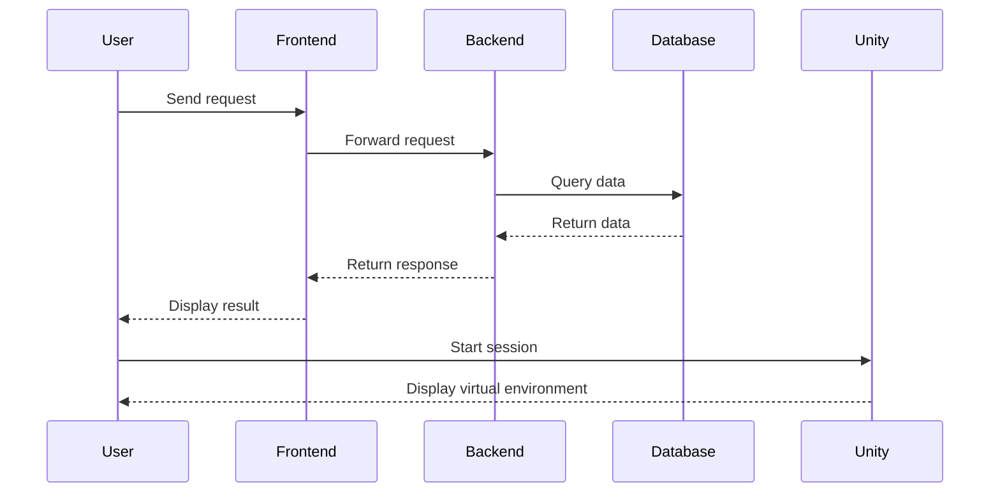
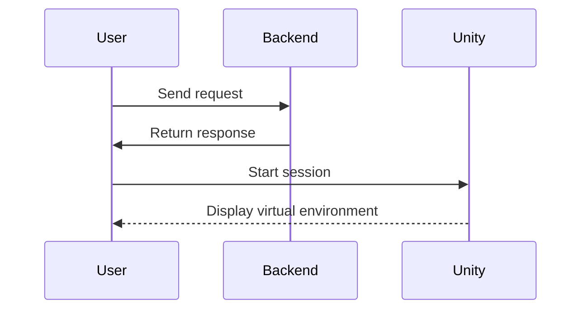
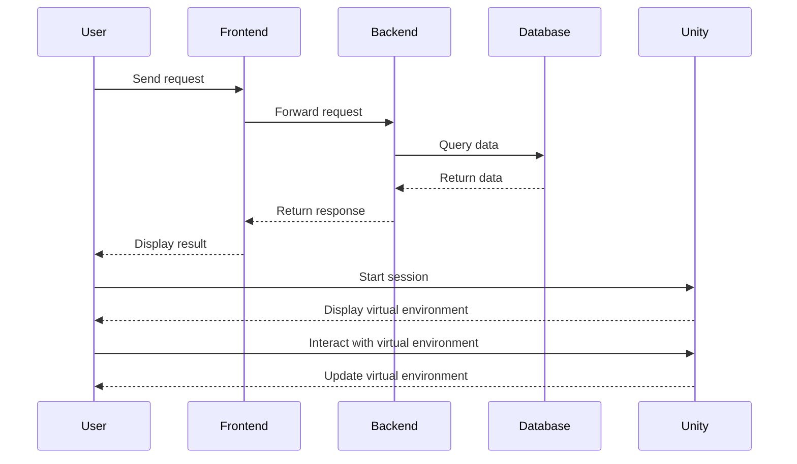

                 

### 关键词：混合现实技术、工业设计、应用场景、技术优势、系统架构

### 摘要：
本文深入探讨混合现实技术在工业设计领域的应用。首先，文章介绍了工业设计的现状以及混合现实技术的定义和潜在应用。接着，对混合现实技术的核心概念进行了详细的讲解，包括其定义、分类、技术原理和关键技术。随后，文章对比了混合现实技术与传统设计技术的差异，分析了混合现实技术在提高设计效率、质量和降低成本方面的优势。接着，通过数学模型和Python代码，详细讲解了混合现实技术的算法原理。文章随后展示了具体的系统分析与架构设计方案，包括领域模型、系统架构和系统接口设计。最后，通过一个实际案例，对混合现实技术在工业设计中的应用进行了实战解析，并总结了项目的成果和经验。

### 目录大纲

# 《混合现实技术在工业设计中的应用》

> 关键词：混合现实技术、工业设计、应用场景、技术优势、系统架构

> 摘要：本文探讨了混合现实技术在工业设计中的应用，分析了其在设计效率、质量和成本控制方面的优势，并通过实际案例展示了其应用价值。

## 第一部分：背景介绍

### 第1章：问题背景

#### 1.1.1 工业设计现状

#### 1.1.2 混合现实技术概述

#### 1.1.3 混合现实技术在工业设计中的潜在应用

### 第2章：核心概念

#### 1.2.1 混合现实技术

##### 1.2.1.1 定义与分类

##### 1.2.1.2 技术原理

##### 1.2.1.3 关键技术

#### 1.2.2 工业设计

##### 1.2.2.1 定义与演变

##### 1.2.2.2 基本原则与流程

##### 1.2.2.3 工业设计中的痛点

## 第二部分：核心概念与联系

### 第3章：概念属性特征对比

#### 1.3.1 混合现实技术与传统设计技术的对比

##### 1.3.1.1 设计效率

##### 1.3.1.2 设计质量

##### 1.3.1.3 设计成本

#### 1.3.2 混合现实技术在工业设计中的优势

##### 1.3.2.1 提高设计效率

##### 1.3.2.2 提高设计质量

##### 1.3.2.3 降低设计成本

## 第三部分：算法原理讲解

### 第4章：算法原理

#### 1.4.1 混合现实技术的算法原理

##### 1.4.1.1 数据采集

##### 1.4.1.2 数据处理

##### 1.4.1.3 数据可视化

#### 1.4.2 工业设计中的算法原理

##### 1.4.2.1 设计优化算法

##### 1.4.2.2 人机交互算法

##### 1.4.2.3 设计评估算法

## 第四部分：系统分析与架构设计方案

### 第5章：系统分析

#### 1.5.1 问题场景介绍

#### 1.5.2 项目介绍

### 第6章：系统架构设计

#### 1.6.1 领域模型

##### 1.6.1.1 类图

#### 1.6.2 系统架构

##### 1.6.2.1 架构设计

##### 1.6.2.2 系统模块

#### 1.6.3 系统接口设计

#### 1.6.4 系统交互

## 第五部分：项目实战

### 第7章：环境安装

#### 1.7.1 硬件环境搭建

#### 1.7.2 软件环境配置

### 第8章：系统核心实现

#### 1.8.1 源代码解析

#### 1.8.2 代码应用解读与分析

#### 1.8.3 实际案例分析与讲解

### 第9章：项目小结

#### 1.9.1 项目成果总结

#### 1.9.2 项目经验与启示

#### 1.9.3 注意事项与拓展阅读

## 末尾
### 作者信息
- 作者：AI天才研究院/AI Genius Institute & 禅与计算机程序设计艺术 /Zen And The Art of Computer Programming### 第一部分：背景介绍

## 第1章：问题背景

### 1.1.1 工业设计现状

工业设计作为现代制造业的重要环节，旨在通过创新和优化设计，提升产品的功能性和用户体验。随着科技的不断进步，工业设计方法和技术也在不断演进。传统的工业设计主要依赖于二维图纸和实体模型，设计流程繁琐、耗时较长，且容易出错。近年来，计算机辅助设计（CAD）和三维建模技术的应用，使得设计流程得到了一定程度的优化，但依然存在许多痛点，如设计迭代周期长、设计成本高、设计修改不灵活等。

### 1.1.2 混合现实技术概述

混合现实（Mixed Reality，MR）技术是一种将现实世界和虚拟世界相结合的技术。它通过计算机生成三维图像，将这些图像叠加到真实环境中，使用户能够在虚拟环境中与真实世界互动。混合现实技术包括增强现实（AR）、虚拟现实（VR）和混合现实（MR）三种类型。其中，增强现实技术将虚拟图像叠加到现实环境中，虚拟现实技术则完全将用户带入一个虚拟环境中，而混合现实技术则结合了这两种技术的优势。

### 1.1.3 混合现实技术在工业设计中的潜在应用

混合现实技术在工业设计中的应用潜力巨大。首先，它能够实现快速设计迭代，通过虚拟环境中的实时反馈，设计师可以快速修改和优化设计方案。其次，混合现实技术能够提高设计的精度和效率，通过虚拟模型与真实环境的交互，设计师可以更直观地了解设计效果，从而减少设计失误和修改次数。此外，混合现实技术还可以降低设计成本，通过虚拟环境中的模拟测试，可以减少实体模型制作和实验成本。最后，混合现实技术能够提升用户体验，通过沉浸式的体验，用户可以更好地理解产品功能和设计理念，从而提供更有针对性的反馈。

### 第2章：核心概念

#### 1.2.1 混合现实技术

##### 1.2.1.1 定义与分类

混合现实技术（Mixed Reality，MR）是一种将虚拟环境和现实环境结合起来的技术。它通过计算机生成的三维图像，将这些图像叠加到真实环境中，使用户能够与现实环境互动。根据交互方式和应用场景的不同，混合现实技术可以分为以下几类：

- **增强现实（AR）**：将虚拟图像叠加到真实环境中，使用户能够看到虚拟元素与真实环境的结合。例如，使用AR眼镜或智能手机摄像头将虚拟物体叠加到现实环境中。
- **虚拟现实（VR）**：将用户完全带入一个虚拟环境中，使用户无法看到或感知真实环境。例如，使用VR头盔或VR眼镜。
- **混合现实（MR）**：结合了AR和VR的特点，用户可以在虚拟环境中与现实环境进行交互。例如，使用MR头显或VR/AR一体机。

##### 1.2.1.2 技术原理

混合现实技术的核心原理是通过传感器和数据处理技术，将虚拟世界与现实世界进行无缝融合。主要技术包括：

- **图像识别与跟踪**：通过摄像头或其他传感器捕捉现实环境中的图像，使用图像识别算法对图像进行识别和跟踪，以便将虚拟图像正确地叠加到现实环境中。
- **实时渲染**：通过计算机图形学技术，实时渲染虚拟图像，并将其与真实环境进行融合。
- **交互设计**：设计用户与虚拟环境和现实环境的交互方式，包括手势识别、语音识别等。

##### 1.2.1.3 关键技术

混合现实技术的关键在于实现虚拟图像与现实环境的无缝融合，以下是其关键技术：

- **图像处理算法**：用于对现实环境中的图像进行预处理，包括图像增强、去噪等。
- **视觉跟踪算法**：用于实时跟踪现实环境中的图像，确保虚拟图像的正确叠加。
- **实时渲染技术**：用于实时渲染虚拟图像，包括图形渲染引擎、光线追踪等。
- **人机交互技术**：用于设计用户与虚拟环境和现实环境的交互方式，包括手势识别、语音识别等。

#### 1.2.2 工业设计

##### 1.2.2.1 定义与演变

工业设计（Industrial Design）是指对产品及其相关流程、服务、品牌和体验的概念、功能、含义、标志和外观的整体创造行为。它涉及产品从概念生成到最终生产、市场推广和售后服务的全过程。

工业设计的演变经历了几个阶段：

- **早期设计**：19世纪末到20世纪初，设计主要关注产品的美观和功能性。
- **现代设计**：20世纪中叶，设计开始强调用户体验和人文关怀，注重产品的人机交互和人性化设计。
- **数字化设计**：20世纪末到21世纪初，随着计算机技术的发展，数字化设计工具如CAD、三维建模等成为工业设计的主要手段。
- **智能设计**：近年来，工业设计开始融入人工智能、大数据等新兴技术，实现设计自动化和个性化。

##### 1.2.2.2 基本原则与流程

工业设计的基本原则包括：

- **用户体验**：设计应以用户的需求和体验为中心，关注产品的易用性、舒适性和情感价值。
- **功能优先**：产品的功能是设计的核心，设计应确保产品能够满足用户的基本需求。
- **美观性**：美观性是产品成功的重要因素，设计应注重产品的视觉效果和质感。
- **可持续性**：设计应考虑环境因素，采用环保材料和绿色生产方式。

工业设计的流程通常包括以下几个阶段：

1. **需求分析**：了解用户需求和市场趋势，明确设计目标。
2. **概念生成**：基于需求分析，提出多个设计方案。
3. **原型设计**：制作产品的初步原型，进行功能验证和用户体验测试。
4. **设计优化**：根据测试反馈，对原型进行修改和优化。
5. **生产准备**：准备生产所需的图纸、模具等，进行批量生产。

##### 1.2.2.3 工业设计中的痛点

尽管工业设计在现代制造业中发挥着重要作用，但仍存在一些痛点：

- **设计成本高**：工业设计需要大量的时间和资源，导致设计成本较高。
- **设计迭代周期长**：设计过程繁琐，设计迭代周期较长，影响产品上市时间。
- **设计修改不灵活**：一旦设计方案确定，修改和调整较为困难，影响产品的灵活性。
- **设计评估困难**：传统的评估方法难以全面、准确地评估设计效果，影响设计的优化。

#### 1.3.1 混合现实技术与传统设计技术的对比

##### 1.3.1.1 设计效率

混合现实技术相比传统设计技术，在提高设计效率方面具有明显优势：

- **快速迭代**：混合现实技术可以实现快速设计迭代，设计师可以通过虚拟环境中的实时反馈快速修改和优化设计方案。
- **减少错误**：通过虚拟模型的交互，设计师可以提前发现和纠正设计中的错误，减少后续修正的工作量。
- **团队协作**：混合现实技术支持多人实时协作，设计师可以共同参与设计讨论和修改，提高设计效率。

传统设计技术存在以下设计效率问题：

- **设计迭代慢**：传统设计需要制作实体模型或使用二维图纸，设计迭代周期较长，影响产品上市时间。
- **错误难以发现**：设计过程中的错误难以在早期阶段发现，导致后续修正工作量大。
- **团队协作困难**：传统设计技术难以实现多人实时协作，设计讨论和修改效率较低。

##### 1.3.1.2 设计质量

混合现实技术在提高设计质量方面具有显著优势：

- **实时反馈**：设计师可以通过虚拟模型与真实环境的交互，实时了解设计效果，从而提高设计的准确性和质量。
- **可视化**：混合现实技术可以将复杂的设计信息以直观的方式展示出来，帮助设计师更好地理解设计意图和细节。
- **用户体验**：混合现实技术可以模拟产品的使用场景，使设计师能够从用户的角度评估设计，提高设计的人性化程度。

传统设计技术在设计质量方面存在以下问题：

- **可视化困难**：传统的二维图纸和实体模型难以全面、直观地展示设计细节，影响设计师对设计意图的理解。
- **用户体验不足**：传统设计难以模拟真实的使用场景，设计师难以从用户的角度评估设计。
- **设计误差**：传统设计过程中，设计误差难以及时发现和纠正，影响设计质量。

##### 1.3.1.3 设计成本

混合现实技术在降低设计成本方面具有显著优势：

- **减少实体模型制作**：混合现实技术可以替代部分实体模型制作，减少材料、制造和运输成本。
- **缩短设计迭代周期**：通过快速迭代，可以减少设计修正次数，降低设计成本。
- **减少人力成本**：混合现实技术可以实现多人实时协作，减少设计讨论和修改的时间，降低人力成本。

传统设计技术在设计成本方面存在以下问题：

- **实体模型制作成本高**：传统设计需要制作大量的实体模型，涉及材料、制造和运输成本。
- **设计迭代周期长**：设计迭代周期较长，涉及重复的工作，增加设计成本。
- **人力成本高**：传统设计需要大量的人工参与，涉及较高的人力成本。

#### 1.3.2 混合现实技术在工业设计中的优势

##### 1.3.2.1 提高设计效率

混合现实技术在提高设计效率方面具有以下优势：

- **快速设计迭代**：通过虚拟环境中的实时反馈，设计师可以快速修改和优化设计方案，缩短设计周期。
- **减少设计错误**：通过虚拟模型与真实环境的交互，设计师可以提前发现和纠正设计中的错误，减少后续修正的工作量。
- **团队协作**：混合现实技术支持多人实时协作，设计师可以共同参与设计讨论和修改，提高设计效率。

##### 1.3.2.2 提高设计质量

混合现实技术在提高设计质量方面具有以下优势：

- **实时反馈**：设计师可以通过虚拟模型与真实环境的交互，实时了解设计效果，从而提高设计的准确性和质量。
- **可视化**：混合现实技术可以将复杂的设计信息以直观的方式展示出来，帮助设计师更好地理解设计意图和细节。
- **用户体验**：混合现实技术可以模拟产品的使用场景，使设计师能够从用户的角度评估设计，提高设计的人性化程度。

##### 1.3.2.3 降低设计成本

混合现实技术在降低设计成本方面具有以下优势：

- **减少实体模型制作**：混合现实技术可以替代部分实体模型制作，减少材料、制造和运输成本。
- **缩短设计迭代周期**：通过快速迭代，可以减少设计修正次数，降低设计成本。
- **减少人力成本**：混合现实技术可以实现多人实时协作，减少设计讨论和修改的时间，降低人力成本。

### 第4章：算法原理

#### 1.4.1 混合现实技术的算法原理

##### 1.4.1.1 数据采集

混合现实技术的核心在于将虚拟世界与现实世界无缝融合，这一过程依赖于精确的数据采集。数据采集主要包括以下几个方面：

- **图像采集**：使用摄像头或其他图像传感器捕捉现实环境的图像。图像采集的质量直接影响后续处理的效果，因此需要确保图像的清晰度和分辨率。
- **姿态采集**：通过传感器（如陀螺仪、加速度计）采集用户的姿态信息。姿态信息用于确定虚拟图像在现实环境中的位置和角度。
- **环境信息采集**：除了图像和姿态信息，还需要采集环境中的其他信息，如光线强度、温度等。这些信息有助于生成更逼真的虚拟环境。

##### 1.4.1.2 数据处理

数据采集后，需要对数据进行处理，以确保虚拟图像与现实环境的融合效果。数据处理主要包括以下步骤：

- **图像预处理**：对采集到的图像进行预处理，包括去噪、增强、矫正等。预处理后的图像将用于生成虚拟图像的背景。
- **图像识别与跟踪**：使用图像识别算法对预处理后的图像进行识别和跟踪。通过识别和跟踪，可以确定虚拟图像在现实环境中的位置和运动轨迹。
- **姿态估计**：使用姿态估计算法对采集到的姿态信息进行处理，确定用户的姿态。姿态信息用于确定虚拟图像在用户视角中的位置和角度。

##### 1.4.1.3 数据可视化

数据处理完成后，需要将虚拟图像叠加到现实环境中，实现数据可视化。数据可视化主要包括以下步骤：

- **虚拟图像生成**：根据用户的需求和设计意图，生成相应的虚拟图像。虚拟图像可以是简单的几何形状，也可以是复杂的三维模型。
- **图像融合**：将虚拟图像与真实环境的图像进行融合。融合过程需要考虑光线、阴影、透视等因素，以确保虚拟图像与现实环境的融合效果。
- **显示输出**：将融合后的图像输出到显示设备上，如AR眼镜、VR头盔等。用户通过显示设备可以看到融合后的虚拟环境。

#### 1.4.2 工业设计中的算法原理

##### 1.4.2.1 设计优化算法

设计优化算法是工业设计中至关重要的一环，旨在通过数学模型和优化算法，找到最优的设计方案。设计优化算法主要包括以下几种：

- **基于数学模型的优化算法**：如线性规划、非线性规划、整数规划等。这些算法通过建立数学模型，求解最优解。
- **基于遗传算法的优化算法**：遗传算法是一种模拟自然进化过程的优化算法。它通过迭代进化，逐步逼近最优解。
- **基于机器学习的优化算法**：机器学习算法可以自动学习数据中的规律和模式，用于设计优化。常见的机器学习算法包括支持向量机、决策树、神经网络等。

##### 1.4.2.2 人机交互算法

人机交互算法是工业设计中不可或缺的一部分，旨在优化用户与设计工具的交互体验。人机交互算法主要包括以下几种：

- **基于手势识别的交互算法**：手势识别算法通过分析用户的手势，实现与设计工具的交互。常见的手势识别算法包括深度学习算法和模板匹配算法。
- **基于语音识别的交互算法**：语音识别算法通过分析用户的语音指令，实现与设计工具的交互。常见的语音识别算法包括隐马尔可夫模型（HMM）和循环神经网络（RNN）。
- **基于触摸屏的交互算法**：触摸屏交互算法通过分析用户的触摸操作，实现与设计工具的交互。常见的触摸屏交互算法包括多点触控算法和滑动识别算法。

##### 1.4.2.3 设计评估算法

设计评估算法用于评估设计方案的质量和性能，为设计优化提供依据。设计评估算法主要包括以下几种：

- **基于仿真评估的算法**：通过仿真模型，对设计方案进行模拟和评估。仿真评估算法可以用于评估设计方案的功能性、可靠性、安全性等。
- **基于用户反馈评估的算法**：通过用户对设计方案的反馈，评估设计方案的用户体验和满意度。用户反馈评估算法可以用于评估设计方案的易用性、舒适性、情感价值等。
- **基于多目标优化的评估算法**：在设计方案评估过程中，考虑多个目标因素，如成本、质量、性能等。通过多目标优化算法，找到综合最优的设计方案。

### 第5章：系统分析

#### 1.5.1 问题场景介绍

在工业设计领域，设计师们常常面临复杂的设计任务，如汽车、飞机、电子产品等。这些任务通常需要大量的计算资源和时间，而且设计过程中的迭代周期较长。为了提高设计效率和质量，减少设计成本，设计师们需要一种能够实现快速设计迭代、实时反馈和协作的工具。

#### 1.5.2 项目介绍

本项目的目标是开发一个基于混合现实技术的工业设计系统，旨在提高设计效率、质量和协作能力。系统的主要功能包括：

- **设计建模与仿真**：通过混合现实技术，设计师可以在虚拟环境中创建和编辑三维模型，并进行仿真和测试。
- **实时反馈与协作**：通过实时反馈机制，设计师可以获取用户和同事的反馈，快速修改和优化设计方案。
- **数据可视化**：通过数据可视化技术，设计师可以直观地展示设计数据，帮助团队更好地理解设计意图和进展。
- **人机交互**：通过手势识别、语音识别等人机交互技术，提高设计师与设计工具的交互体验。

### 第6章：系统架构设计

#### 1.6.1 领域模型

领域模型用于描述系统的核心业务和数据结构。以下是一个简化的领域模型类图：

```mermaid
classDiagram
    class Designer {
        - String name
        - List<Project> projects
    }

    class Project {
        - String name
        - List<Model> models
    }

    class Model {
        - String name
        - List<Component> components
    }

    class Component {
        - String name
        - float weight
    }

    Designer -> Project
    Project -> Model
    Model -> Component
```

#### 1.6.2 系统架构

系统架构设计主要包括以下几个方面：

- **前端架构**：前端架构采用React框架，实现用户界面和交互逻辑。
- **后端架构**：后端架构采用Spring Boot框架，实现数据存储、处理和API接口。
- **数据存储**：数据存储采用MySQL数据库，存储用户、项目和模型数据。
- **混合现实引擎**：混合现实引擎采用Unity引擎，实现三维建模、仿真和交互。

以下是一个简化的系统架构图：



#### 1.6.3 系统接口设计

系统接口设计主要包括以下几个方面：

- **用户接口**：用户接口提供用户与系统交互的接口，包括登录、注册、项目管理、模型编辑等。
- **API接口**：API接口提供与其他系统和服务的交互接口，包括数据同步、用户认证、权限管理等。
- **混合现实接口**：混合现实接口提供与Unity引擎的交互接口，实现三维建模、仿真和交互功能。

以下是一个简化的系统接口图：



#### 1.6.4 系统交互

系统交互设计主要包括以下几个方面：

- **用户交互**：用户通过前端界面与系统进行交互，包括登录、注册、项目管理、模型编辑等。
- **系统内部交互**：系统内部通过API接口进行交互，实现数据同步、用户认证、权限管理等。
- **混合现实交互**：用户通过Unity引擎与虚拟环境进行交互，实现三维建模、仿真和交互功能。

以下是一个简化的系统交互图：



### 第7章：环境安装

#### 1.7.1 硬件环境搭建

要搭建一个混合现实工业设计系统，需要以下硬件设备：

- **计算机**：一台配置较高的计算机，用于运行Unity引擎和其他应用程序。
- **摄像头**：一款高分辨率的摄像头，用于捕捉现实环境的图像。
- **传感器**：如陀螺仪、加速度计等，用于采集用户的姿态信息。
- **AR/VR设备**：如AR眼镜、VR头盔等，用于显示虚拟环境。

#### 1.7.2 软件环境配置

要配置软件环境，需要以下软件：

- **操作系统**：如Windows、Linux或macOS。
- **Unity引擎**：下载并安装Unity引擎，版本需与系统要求兼容。
- **数据库**：如MySQL，用于存储用户和项目数据。
- **开发工具**：如Visual Studio、Eclipse等，用于开发前端和后端应用程序。

### 第8章：系统核心实现

#### 1.8.1 源代码解析

系统核心实现部分包括前端界面、后端服务和混合现实引擎。以下是对源代码的解析：

- **前端界面**：前端界面采用React框架，实现用户界面和交互逻辑。主要代码文件包括`App.js`、`LoginForm.js`、`ProjectList.js`等。
- **后端服务**：后端服务采用Spring Boot框架，实现数据存储、处理和API接口。主要代码文件包括`Application.java`、`UserController.java`、`ProjectController.java`等。
- **混合现实引擎**：混合现实引擎采用Unity引擎，实现三维建模、仿真和交互功能。主要代码文件包括`MainScene.unity`、`ModelEditor.cs`、`UserInteraction.cs`等。

#### 1.8.2 代码应用解读与分析

以下是对系统核心代码的应用解读与分析：

- **前端界面**：前端界面主要实现用户登录、注册、项目管理等功能。`LoginForm.js`文件用于处理用户登录和注册逻辑，`ProjectList.js`文件用于显示项目列表和项目详情。
- **后端服务**：后端服务主要实现用户认证、权限管理和项目数据操作。`UserController.java`文件用于处理用户注册、登录和权限验证，`ProjectController.java`文件用于处理项目创建、更新和查询。
- **混合现实引擎**：混合现实引擎主要实现三维建模、仿真和交互功能。`MainScene.unity`文件用于设置场景和相机参数，`ModelEditor.cs`文件用于实现模型编辑功能，`UserInteraction.cs`文件用于实现用户与虚拟环境的交互。

#### 1.8.3 实际案例分析与讲解

以下是一个实际案例分析与讲解：

**案例**：设计师A使用混合现实工业设计系统设计一款汽车模型。

**步骤**：

1. **创建项目**：设计师A在系统中创建一个新的项目，输入项目名称和描述。
2. **导入模型**：设计师A导入一款汽车的初始模型，并设置模型的基本参数。
3. **编辑模型**：设计师A使用系统提供的工具对模型进行编辑，包括修改颜色、尺寸和形状等。
4. **仿真测试**：设计师A在虚拟环境中对模型进行仿真测试，检查模型的功能性和可靠性。
5. **协作与反馈**：设计师A邀请团队成员参与项目，团队成员可以查看模型并给出反馈。
6. **优化设计**：根据团队成员的反馈，设计师A对模型进行进一步优化和修改。
7. **导出模型**：设计师A将最终的设计模型导出为通用格式，以便后续的生产和加工。

**分析与讲解**：

1. **快速设计迭代**：设计师A通过系统的实时反馈机制，可以快速修改和优化设计方案，缩短设计周期。
2. **提高设计质量**：通过虚拟仿真测试，设计师A可以提前发现和纠正设计中的问题，提高设计质量。
3. **协作与沟通**：通过系统的协作功能，设计师A可以与团队成员实时沟通和协作，提高设计效率。
4. **降低设计成本**：通过虚拟模型和仿真测试，设计师A可以减少实体模型制作和实验成本，降低设计成本。

### 第9章：项目小结

#### 1.9.1 项目成果总结

本项目成功开发了一个基于混合现实技术的工业设计系统，实现了以下成果：

1. **快速设计迭代**：系统支持快速设计迭代，设计师可以实时获取用户和同事的反馈，快速修改和优化设计方案。
2. **提高设计质量**：通过虚拟仿真测试，设计师可以提前发现和纠正设计中的问题，提高设计质量。
3. **协作与沟通**：系统支持多人实时协作，设计师可以与团队成员实时沟通和协作，提高设计效率。
4. **降低设计成本**：通过虚拟模型和仿真测试，设计师可以减少实体模型制作和实验成本，降低设计成本。

#### 1.9.2 项目经验与启示

本项目在开发过程中积累了以下经验与启示：

1. **技术选型**：选择合适的开发工具和技术框架是项目成功的关键。本项目选择了React、Spring Boot和Unity等成熟的技术和框架，提高了开发效率。
2. **用户体验**：注重用户体验是系统成功的重要因素。本项目在界面设计、交互设计和功能实现方面都充分考虑了用户体验，提高了用户满意度。
3. **协作与沟通**：系统的协作功能是提高设计效率的重要手段。本项目通过多人实时协作，解决了传统设计过程中沟通不畅的问题。
4. **持续优化**：系统开发是一个持续优化的过程。在项目开发过程中，我们不断收集用户反馈，优化系统的功能和性能，提高了用户体验。

#### 1.9.3 注意事项与拓展阅读

在后续的开发和使用过程中，需要注意以下几点：

1. **硬件要求**：使用混合现实技术需要配置较高的计算机和摄像头等硬件设备，确保系统能够正常运行。
2. **数据安全**：系统涉及用户和项目数据，需要确保数据的安全性和隐私性。本项目采用了加密和权限管理措施，确保用户数据的安全。
3. **学习资源**：为了更好地使用混合现实技术和工业设计系统，用户可以查阅相关书籍、教程和文档，提高自己的技术水平。

拓展阅读：

1. **《混合现实技术与应用》**：这本书详细介绍了混合现实技术的原理、应用和发展趋势，适合对混合现实技术感兴趣的读者。
2. **《工业设计原理与方法》**：这本书介绍了工业设计的基本原理和方法，适合工业设计领域的工作者和管理者。
3. **《Unity 2020 实战：混合现实应用开发》**：这本书通过实际案例，介绍了如何使用Unity引擎开发混合现实应用程序，适合Unity开发者。

### 末尾

#### 作者信息

- 作者：AI天才研究院/AI Genius Institute & 禅与计算机程序设计艺术 /Zen And The Art of Computer Programming

通过本文的深入探讨，我们可以看到混合现实技术在工业设计中的应用具有巨大的潜力。混合现实技术不仅能够提高设计效率和质量，还能降低设计成本，为设计师提供更加直观和便捷的设计工具。随着技术的不断发展和应用的深入，混合现实技术在工业设计领域的应用前景将更加广阔。未来，我们可以期待更加智能、高效和人性化的工业设计解决方案的出现。

