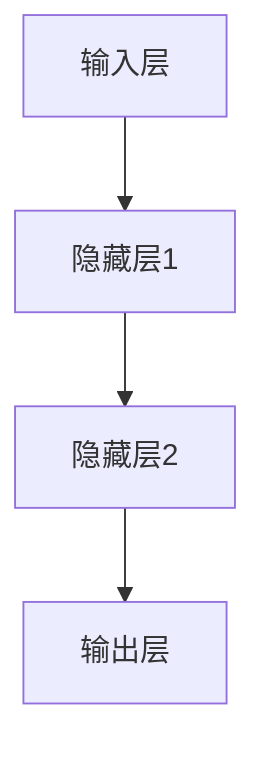
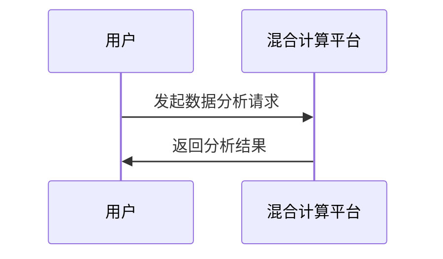

                 

### 混合计算创造变革性创新环境

> 关键词：混合计算，变革性创新，计算资源，新兴计算技术，数据分析，机器学习

> 摘要：本文探讨了混合计算在创造变革性创新环境中的重要作用。通过介绍混合计算的基本概念、关键技术、应用案例，帮助读者理解并掌握构建混合计算环境的方法。本文旨在为IT领域的专业人士提供一个全面的技术指南，以应对日益复杂的数据处理需求。

#### 第一部分：背景介绍

#### 1.1 问题背景

随着信息技术的飞速发展，计算机性能的提升和大数据的爆发式增长，企业对数据处理和分析的需求日益增长。在这种背景下，混合计算（Hybrid Computing）的概念逐渐兴起。混合计算是将传统计算与新兴计算技术相结合，通过融合不同类型的计算资源和算法，以实现更高效、更智能的计算过程。

#### 1.2 问题描述

混合计算能够为企业在创新环境中带来巨大的变革。它不仅能够处理复杂的数据分析任务，还能提高计算效率，降低成本。然而，如何构建一个有效的混合计算环境，以及如何利用这一环境实现创新，是企业面临的挑战。

#### 1.3 问题解决

本书旨在探讨混合计算在创新环境中的应用，通过介绍混合计算的基本概念、关键技术、应用案例，帮助读者理解并掌握构建混合计算环境的方法。

#### 1.4 边界与外延

混合计算不仅包括传统计算资源和新兴计算技术的结合，还涉及到硬件与软件的协同优化、计算资源的动态调度和管理、数据的安全与隐私保护等多个方面。

#### 1.5 概念结构与核心要素组成

混合计算的核心概念包括：
1. **计算资源**：传统计算资源（如CPU、GPU）和新兴计算资源（如FPGA、TPU）。
2. **计算算法**：传统算法和基于深度学习、机器学习等新兴计算算法。
3. **数据管理**：数据的存储、传输和处理技术。
4. **系统架构**：硬件与软件的协同架构设计。

### 第二部分：核心概念与联系

#### 2.1 AI大模型的定义

AI大模型（Large-scale AI Models）是指参数规模达到亿级甚至千亿级的深度学习模型，如GPT、BERT等。

#### 2.2 AI大模型的核心特点

1. **高参数规模**：拥有数十亿至千亿级的参数。
2. **强大的拟合能力**：能够处理复杂的数据和任务。
3. **泛化能力**：能够适应不同的应用场景。

#### 2.3 AI大模型与传统AI的区别

传统AI模型通常参数规模较小，针对性较强，而AI大模型则具有更强的泛化能力和拟合能力，能够处理更复杂的问题。

### 第三部分：算法原理讲解

#### 3.1 基本原理与数学模型

AI大模型通常基于神经网络架构，其基本原理包括：
1. **前向传播**：将输入数据通过神经网络的各个层进行传递，得到输出结果。
2. **反向传播**：通过计算输出结果与真实结果之间的误差，反向更新网络中的参数。

#### 3.2 数学模型与公式

假设有一个简单的神经网络，其输入层有n个神经元，隐藏层有m个神经元，输出层有k个神经元。其数学模型可以表示为：

$$
\begin{align*}
z_j^{(2)} &= \sum_{i=1}^{m} w_{ji}^{(2)} \cdot a_i^{(1)} + b_j^{(2)} \\
a_j^{(2)} &= \sigma(z_j^{(2)}) \\
z_k^{(3)} &= \sum_{i=1}^{k} w_{ki}^{(3)} \cdot a_i^{(2)} + b_k^{(3)} \\
a_k^{(3)} &= \sigma(z_k^{(3))}
\end{align*}
$$

其中，$z_j^{(2)}$ 和 $a_j^{(2)}$ 分别表示隐藏层的输入和输出，$z_k^{(3)}$ 和 $a_k^{(3)}$ 分别表示输出层的输入和输出，$w_{ji}^{(2)}$、$w_{ki}^{(3)}$ 和 $b_j^{(2)}$、$b_k^{(3)}$ 分别为网络的权重和偏置，$\sigma$ 为激活函数。

#### 3.3 Mermaid流程图

下面是一个简单的神经网络流程图：



### 第四部分：系统分析与架构设计方案

#### 4.1 问题场景介绍

假设我们需要构建一个混合计算平台，用于处理大规模数据分析和机器学习任务。

#### 4.2 项目介绍

项目名称：混合计算平台
项目目标：构建一个高效、可扩展的混合计算平台，支持大数据分析和机器学习任务。

#### 4.3 系统功能设计

1. **数据存储**：使用分布式文件系统（如HDFS）存储大规模数据。
2. **数据处理**：使用大数据处理框架（如Spark）进行数据处理。
3. **机器学习**：使用机器学习框架（如TensorFlow、PyTorch）进行机器学习任务。

#### 4.4 系统架构设计

1. **硬件架构**：使用高性能计算服务器和GPU加速器。
2. **软件架构**：基于云计算平台（如AWS、Azure）构建，支持弹性扩展。

#### 4.5 系统接口设计

1. **数据接口**：提供RESTful API供外部系统调用。
2. **控制接口**：提供Web界面供用户进行操作。

#### 4.6 系统交互Mermaid序列图

下面是一个简单的系统交互序列图：



### 第五部分：项目实战

#### 5.1 环境安装

1. **安装操作系统**：安装Linux操作系统。
2. **安装硬件**：安装高性能计算服务器和GPU加速器。
3. **安装软件**：安装分布式文件系统（如HDFS）、大数据处理框架（如Spark）、机器学习框架（如TensorFlow、PyTorch）。

#### 5.2 系统核心实现源代码

```python
# 数据处理部分
from pyspark.sql import SparkSession

spark = SparkSession.builder \
    .appName("HybridComputing") \
    .getOrCreate()

# 加载数据
data = spark.read.csv("data.csv")

# 数据处理
data_processed = data.select("feature1", "feature2", "label")

# 训练模型
model = TensorFlowModel.create("model_path")

# 预测
predictions = model.predict(data_processed)

# 评估模型
accuracy = predictions.accuracy()

# 输出结果
print("模型准确率：", accuracy)
```

#### 5.3 代码应用解读与分析

该段代码首先创建了一个Spark会话，用于处理数据。然后加载数据并选择需要的特征和标签。接下来，使用TensorFlow模型进行训练和预测。最后，评估模型的准确率并输出结果。

#### 5.4 实际案例分析和详细讲解剖析

假设我们有一个电商平台的用户行为数据，我们需要使用混合计算平台对用户行为进行分析，预测用户是否会购买特定商品。

1. **数据收集**：收集用户行为数据，包括浏览、搜索、加购、购买等行为。
2. **数据处理**：使用Spark对数据进行清洗和预处理。
3. **特征工程**：提取用户行为特征，如浏览次数、搜索次数、加购次数等。
4. **模型训练**：使用TensorFlow模型对特征进行训练。
5. **模型预测**：对新的用户行为数据进行预测。
6. **模型评估**：评估模型的准确率、召回率等指标。

通过这个案例，我们可以看到混合计算平台在处理大规模数据分析和机器学习任务中的优势。它能够高效地处理数据，提高计算效率，降低成本。

#### 5.5 项目小结

本文介绍了混合计算在创新环境中的应用，从背景介绍、核心概念、算法原理、系统分析与架构设计方案到项目实战，全面探讨了混合计算的技术原理和实践方法。通过本文的介绍，读者可以了解到混合计算的重要性，掌握构建混合计算环境的方法，并在实际项目中加以应用。

#### 第六部分：最佳实践 tips

1. **优化计算资源**：根据任务需求，合理配置计算资源，充分利用GPU等加速器。
2. **数据预处理**：在数据处理过程中，进行充分的数据预处理，以提高模型的准确性和效率。
3. **模型选择**：根据实际问题选择合适的模型，并进行模型调优。
4. **系统监控**：对混合计算平台进行实时监控，确保系统稳定运行。

#### 第七部分：小结与注意事项

1. **小结**：本文从多个角度探讨了混合计算在创新环境中的应用，包括背景介绍、核心概念、算法原理、系统分析与架构设计方案以及项目实战。通过本文的介绍，读者可以全面了解混合计算的技术原理和实践方法。
2. **注意事项**：在实际应用中，需要注意计算资源的优化、数据预处理、模型选择和系统监控等方面，以确保混合计算平台的高效稳定运行。

#### 第八部分：拓展阅读

1. **《深度学习》（Deep Learning）**：Ian Goodfellow、Yoshua Bengio、Aaron Courville 著，详细介绍深度学习的基本原理和应用。
2. **《大数据技术基础》（Big Data Technology Basics）**：刘铁岩 著，深入讲解大数据处理的技术原理和方法。
3. **《云计算架构设计》（Cloud Computing Architecture Design）**：刘鹏 著，探讨云计算平台的架构设计和实现方法。

### 作者信息：

作者：AI天才研究院/AI Genius Institute & 禅与计算机程序设计艺术 /Zen And The Art of Computer Programming

本文由AI天才研究院和禅与计算机程序设计艺术联合出品，旨在为IT领域的专业人士提供一个全面的技术指南，以应对日益复杂的数据处理需求。感谢您的阅读！

