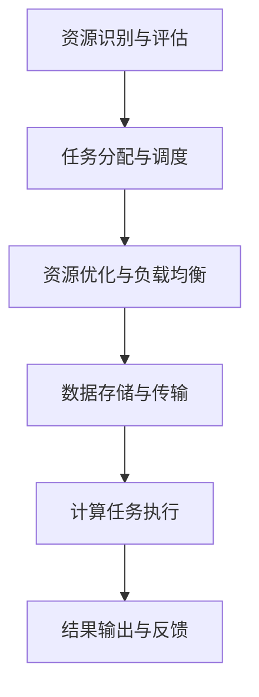
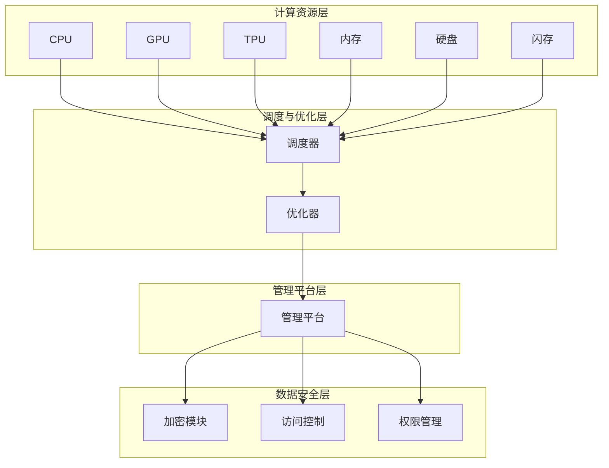
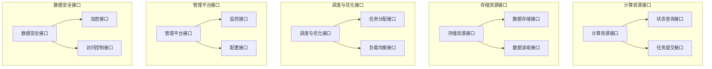
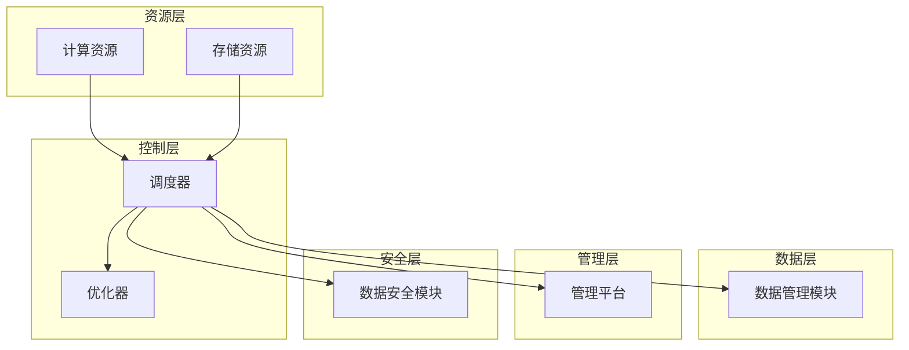
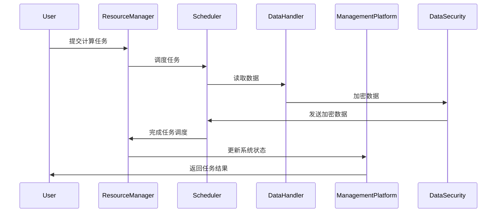

                 

### 开篇引言

#### 混合计算在AI领域的应用背景与前景

在当今科技飞速发展的时代，人工智能（AI）已经成为驱动未来进步的关键力量。随着深度学习、神经网络、自然语言处理等技术的不断发展，AI技术在各个领域的应用场景越来越广泛，从自动驾驶、智能医疗、金融分析到智能家居，AI都展现出了巨大的潜力和变革能力。然而，AI技术的发展同时也带来了计算需求的大幅增长，特别是在处理大规模数据、复杂模型训练和高性能计算方面。这一需求推动了混合计算这一新兴概念的发展和应用。

**什么是混合计算？**混合计算是指将多种计算资源（如CPU、GPU、TPU等）以及不同类型的存储（如内存、硬盘、闪存等）整合在一起，形成一种高效的计算模式。这种模式不仅能够提高计算资源的利用率，还能够根据任务的需求动态调整计算资源，从而实现更高的计算效率和更好的性能表现。

在AI领域，混合计算的应用前景广阔。一方面，混合计算可以满足AI模型在训练和推理过程中对高性能计算资源的巨大需求；另一方面，它也能够通过智能调度和资源优化，降低能耗，提高系统的可扩展性和灵活性。例如，在自动驾驶系统中，实时感知、决策和控制的复杂计算可以通过混合计算平台高效地完成；在医疗诊断中，混合计算可以帮助医生快速处理和分析大量的医学影像数据，提高诊断准确率。

本文将围绕混合计算在AI领域的应用前景展开讨论。文章首先将介绍混合计算在AI领域的背景和重要性，接着详细探讨混合计算的核心概念、原理和应用场景。通过一系列深入的分析和实例，本文将阐述混合计算如何帮助AI技术突破传统计算的局限，提升整体性能和效率。此外，文章还将探讨混合计算系统设计与实现的具体方法，并通过项目实战案例分析，总结最佳实践和注意事项。最终，本文将总结混合计算在AI领域的应用前景，展望其未来的发展趋势和潜力。

#### 文章结构

本文将分为八个章节，系统而全面地探讨混合计算在AI领域的应用前景。首先，在**第1章 背景介绍**中，我们将深入探讨混合计算在AI领域的应用背景和重要性，介绍混合计算的基本概念及其在AI领域的初步应用。接着，**第2章 核心概念与联系**将详细阐述混合计算的定义、特点、与传统计算的差异、主要组成部分以及核心概念之间的联系。

在**第3章 混合计算原理**中，我们将从基本原理出发，逐步讲解混合计算的关键技术、优点与挑战，并引入混合计算的数学模型和算法mermaid流程图，帮助读者全面理解其工作原理。**第4章 AI领域的混合计算应用**将具体讨论混合计算在AI领域的应用场景，通过实例分析展示其在提高计算效率和性能方面的优势与挑战。

**第5章 混合计算系统设计与实现**将介绍混合计算系统的设计原则、架构设计、接口设计及其实现方法，并通过mermaid架构图和序列图详细展示系统的设计与交互流程。在**第6章 项目实战**中，我们将通过具体项目环境安装与配置、系统核心功能实现及代码应用解读与分析，深入剖析实际案例，并总结项目经验和反思。

**第7章 最佳实践与总结**将基于前述章节的内容，总结混合计算在AI领域的应用最佳实践，并提出注意事项，帮助读者更好地理解和应用混合计算。最后，**第8章 拓展阅读**将推荐相关的扩展阅读资源，为读者提供进一步的深入学习和研究方向。通过这些章节的详细探讨，本文旨在为读者提供一份全面而深入的技术指南，帮助理解和掌握混合计算在AI领域的应用前景。

### 第1章 背景介绍

#### 问题背景

随着人工智能技术的不断发展，AI在各个领域的应用越来越广泛，然而这也对计算资源的需求提出了更高的要求。传统的计算模式已经难以满足AI模型在训练和推理过程中对高性能、高吞吐量和低延迟的巨大需求。例如，深度学习模型在训练过程中需要处理大量的数据，并且每次训练都需要大量的计算资源。传统的CPU虽然在处理复杂运算方面具有优势，但在大规模数据处理和并行计算方面效率较低。GPU虽然可以显著提高计算速度，但其适用范围较为有限，且在处理非图形计算任务时性能不佳。

这种背景下，混合计算的概念应运而生。混合计算通过将多种计算资源（如CPU、GPU、TPU等）以及不同类型的存储（如内存、硬盘、闪存等）整合在一起，形成一种高效的计算模式。这样不仅能够提高计算资源的利用率，还能够根据任务的需求动态调整计算资源，从而实现更高的计算效率和更好的性能表现。

#### 问题描述

混合计算的提出主要是为了解决以下问题：

1. **计算资源不足**：传统的计算模式在处理大规模数据和高性能计算任务时效率较低，难以满足AI模型训练和推理的需求。
2. **计算资源利用率低**：现有的计算资源往往处于闲置状态，无法充分利用。
3. **系统扩展性和灵活性不足**：传统的计算架构在应对动态变化的计算需求时表现不佳，难以快速响应。
4. **能耗问题**：传统的计算模式在运行过程中能耗较高，不利于环保和可持续发展。

为了解决这些问题，混合计算通过将多种计算资源和存储方式进行整合，形成一种高效、灵活、可扩展的计算模式。混合计算不仅能够提高计算资源的利用率，还能通过智能调度和优化，降低能耗，提高系统的整体性能和效率。

#### 问题解决

混合计算通过以下方法来解决上述问题：

1. **资源整合与优化**：将CPU、GPU、TPU等计算资源和内存、硬盘、闪存等存储资源整合在一起，形成一个统一的计算平台。这种模式可以根据任务需求动态调整计算资源的分配，从而提高资源利用率和计算效率。
2. **智能调度与优化**：通过智能调度算法，根据任务负载动态分配计算资源，实现计算任务的合理调度。这样可以避免资源闲置和过度使用，提高系统的整体性能。
3. **分布式计算**：混合计算支持分布式计算，可以将计算任务分布到多个节点上同时处理，从而提高系统的吞吐量和处理速度。
4. **能耗优化**：通过智能功耗管理，降低系统在运行过程中的能耗，提高能源利用效率。

#### 边界与外延

虽然混合计算在提高计算效率和性能方面具有显著优势，但其在实际应用中仍面临一些挑战和限制。

1. **系统复杂性**：混合计算系统涉及多种计算资源和存储方式，系统架构较为复杂，设计和维护难度较大。
2. **兼容性问题**：不同的计算资源和存储设备可能存在兼容性问题，需要在系统设计和实现过程中进行充分的测试和优化。
3. **数据安全与隐私**：混合计算系统涉及大量的数据和计算任务，数据安全和隐私保护是一个重要的问题，需要采取有效的安全措施。
4. **成本问题**：混合计算系统初期投入较大，包括硬件设备、软件工具和人力资源等，对于中小企业来说可能是一个负担。

尽管如此，混合计算在AI领域的应用前景仍然非常广阔。随着技术的不断发展和优化，混合计算有望在未来解决更多计算难题，推动AI技术的进一步发展。

#### 概念结构与核心要素组成

混合计算系统的概念结构主要包括以下几个核心要素：

1. **计算资源**：包括CPU、GPU、TPU等多种计算设备和资源。
2. **存储资源**：包括内存、硬盘、闪存等多种存储设备和资源。
3. **调度与优化算法**：通过智能调度和优化算法，实现计算资源的动态分配和任务调度。
4. **分布式计算架构**：支持分布式计算，提高系统的吞吐量和处理速度。
5. **数据安全与隐私保护**：通过有效的安全措施，保障数据和计算任务的安全性。

这些核心要素相互关联，共同构成了混合计算系统的整体架构，从而实现了高效、灵活和可扩展的计算能力。通过不断优化和改进这些核心要素，混合计算在AI领域的应用将更加广泛和深入。

#### 混合计算的定义

混合计算是一种将多种计算资源（如CPU、GPU、TPU等）和不同类型的存储资源（如内存、硬盘、闪存等）整合在一起，通过智能调度和优化，实现高效计算和资源利用的技术。混合计算的核心思想是利用多种计算资源各自的优势，根据任务需求动态调整资源分配，从而提高计算效率和性能。与传统计算模式相比，混合计算具有更强的灵活性和可扩展性。

#### 混合计算的特点

混合计算具有以下几个显著特点：

1. **资源整合与优化**：通过整合多种计算资源和存储资源，实现计算任务的合理分配和高效执行。
2. **动态调度与优化**：根据任务负载和资源状态动态调整计算资源的分配，避免资源闲置和过度使用。
3. **分布式计算**：支持分布式计算，将计算任务分布到多个节点上同时处理，提高系统的吞吐量和处理速度。
4. **高效能耗管理**：通过智能功耗管理，降低系统在运行过程中的能耗，提高能源利用效率。
5. **高可靠性与可扩展性**：通过分布式架构和冗余设计，提高系统的可靠性和可扩展性，应对动态变化的计算需求。

#### 混合计算与传统计算的区别

混合计算与传统计算在多个方面存在显著区别：

1. **资源利用**：传统计算主要依赖单一计算资源，如CPU或GPU，而混合计算整合多种计算资源，根据任务需求动态调整资源分配，提高资源利用率。
2. **计算效率**：传统计算模式在处理大规模数据和高性能计算任务时效率较低，而混合计算通过智能调度和优化，实现高效的计算和任务处理。
3. **系统灵活性**：传统计算系统在应对动态变化的计算需求时表现较差，而混合计算通过分布式架构和智能调度，具备更高的灵活性和可扩展性。
4. **能耗管理**：传统计算模式能耗较高，而混合计算通过高效能耗管理和智能功耗控制，降低系统运行过程中的能耗。

#### 混合计算的主要组成部分

混合计算系统的主要组成部分包括以下几个方面：

1. **计算资源**：包括CPU、GPU、TPU等多种计算设备和资源，用于执行计算任务。
2. **存储资源**：包括内存、硬盘、闪存等多种存储设备和资源，用于存储数据和中间结果。
3. **调度与优化算法**：通过智能调度和优化算法，实现计算资源的动态分配和任务调度。
4. **分布式计算架构**：支持分布式计算，将计算任务分布到多个节点上同时处理，提高系统的吞吐量和处理速度。
5. **数据安全与隐私保护**：通过有效的安全措施，保障数据和计算任务的安全性。
6. **管理平台**：提供监控、管理和配置工具，实现对整个混合计算系统的统一管理和调度。

#### 核心概念之间的联系

在混合计算系统中，各个核心概念之间相互关联，共同构成了一个高效的计算平台。

1. **计算资源与调度算法**：计算资源是实现混合计算的基础，而调度算法则是实现资源优化的关键。通过智能调度算法，可以动态调整计算资源的分配，实现计算任务的合理调度和高效执行。
2. **存储资源与计算资源**：存储资源与计算资源相互配合，共同实现数据的存储和处理。混合计算通过多种存储资源的整合，提供高效的存储解决方案，满足不同类型数据的存储需求。
3. **分布式计算与调度算法**：分布式计算是将计算任务分布到多个节点上同时处理，而调度算法则负责协调这些节点的资源分配和任务调度。通过分布式计算和智能调度，可以实现更高的计算效率和性能。
4. **数据安全与隐私保护**：在混合计算系统中，数据的安全和隐私保护至关重要。通过有效的安全措施，如加密、访问控制和权限管理，保障数据和计算任务的安全性，防止数据泄露和恶意攻击。

通过这些核心概念之间的相互作用和联系，混合计算系统实现了高效、灵活和可扩展的计算能力，为AI技术的发展提供了强大的支持。

### 第3章 混合计算原理

#### 基本原理讲解

混合计算的基本原理在于利用多种计算资源和存储资源，通过智能调度和优化，实现高效的计算任务执行。具体来说，混合计算系统通过以下步骤实现：

1. **资源识别与评估**：系统首先识别和评估可用的计算资源和存储资源，包括CPU、GPU、TPU以及内存、硬盘、闪存等。通过评估资源性能和负载状态，系统了解各资源的能力和当前状态。
2. **任务分配与调度**：根据任务的需求和资源状态，系统进行任务分配和调度。通过智能调度算法，系统动态分配计算任务到合适的资源上，实现计算任务的合理调度和高效执行。
3. **资源优化与负载均衡**：系统通过持续监测资源状态，进行资源优化和负载均衡。当某资源负载过高时，系统会动态调整任务分配，避免资源过度使用或闲置，提高整体计算效率。
4. **数据存储与传输**：在计算过程中，系统需要高效地管理和传输数据。混合计算通过整合不同类型的存储资源，提供高效的数据存储和传输方案，满足不同类型数据的存储需求。

#### 混合计算的关键技术

混合计算的关键技术主要包括以下几个方面：

1. **资源管理**：资源管理是混合计算的核心，通过有效的资源管理策略，可以实现计算资源的合理分配和高效利用。常见的资源管理技术包括资源调度算法、资源负载均衡和资源优化策略。
   
2. **分布式计算**：分布式计算是将计算任务分布到多个节点上同时处理，通过分布式架构，可以提高系统的吞吐量和处理速度。分布式计算的关键技术包括任务分发、负载均衡、容错机制和数据同步等。

3. **智能调度算法**：智能调度算法是混合计算系统的核心，通过优化任务分配和调度，实现计算资源的最佳利用。常见的智能调度算法包括基于贪心算法的调度策略、基于神经网络的学习调度策略和基于遗传算法的优化调度策略等。

4. **能耗管理**：能耗管理是混合计算中一个重要的方面，通过智能功耗管理策略，可以降低系统运行过程中的能耗，提高能源利用效率。常见的能耗管理技术包括动态电压调节、功耗预测和优化策略等。

#### 混合计算的优点与挑战

混合计算具有以下优点：

1. **提高计算效率**：通过整合多种计算资源和存储资源，混合计算可以实现高效的计算任务执行，提高整体计算效率。
2. **增强系统灵活性**：混合计算支持动态调度和优化，能够根据任务需求快速调整资源分配，增强系统的灵活性和可扩展性。
3. **降低能耗**：通过智能功耗管理，混合计算可以显著降低系统运行过程中的能耗，提高能源利用效率。
4. **提高系统可靠性**：混合计算支持分布式计算架构，通过冗余设计和容错机制，提高系统的可靠性和稳定性。

然而，混合计算也面临一些挑战：

1. **系统复杂性**：混合计算系统涉及多种计算资源和存储方式，系统架构较为复杂，设计和维护难度较大。
2. **兼容性问题**：不同的计算资源和存储设备可能存在兼容性问题，需要在系统设计和实现过程中进行充分的测试和优化。
3. **数据安全与隐私**：混合计算系统涉及大量的数据和计算任务，数据安全和隐私保护是一个重要的问题，需要采取有效的安全措施。
4. **成本问题**：混合计算系统初期投入较大，包括硬件设备、软件工具和人力资源等，对于中小企业来说可能是一个负担。

#### 混合计算的数学模型和公式

在混合计算中，常用的数学模型和公式主要包括资源分配模型、调度优化模型和能耗管理模型。

1. **资源分配模型**：资源分配模型主要解决如何将计算任务合理分配到不同的计算资源上，以实现资源的最优利用。常见的资源分配模型包括线性规划模型、贪心分配模型和遗传算法模型。其公式如下：
   $$
   \min \sum_{i=1}^{n} c_i \times x_i
   $$
   其中，$c_i$表示第$i$种资源的单位成本，$x_i$表示第$i$种资源的分配量。

2. **调度优化模型**：调度优化模型主要解决如何优化计算任务的调度，以实现计算效率的最大化。常见的调度优化模型包括基于贪心算法的调度策略、基于神经网络的学习调度策略和基于遗传算法的优化调度策略。其公式如下：
   $$
   \max \sum_{i=1}^{n} p_i \times r_i
   $$
   其中，$p_i$表示第$i$个任务的优先级，$r_i$表示第$i$个任务的执行时间。

3. **能耗管理模型**：能耗管理模型主要解决如何优化系统的能耗，以实现能源利用的最大化。常见的能耗管理模型包括动态电压调节模型、功耗预测模型和优化策略。其公式如下：
   $$
   E = \sum_{i=1}^{n} e_i \times x_i
   $$
   其中，$e_i$表示第$i$种资源的单位能耗，$x_i$表示第$i$种资源的分配量。

通过这些数学模型和公式，混合计算系统能够实现资源的合理分配、调度优化和能耗管理，从而提高计算效率和性能。

#### 算法mermaid流程图

为了更直观地展示混合计算的工作流程，我们使用mermaid绘制了以下算法mermaid流程图：



在这个流程图中，每个节点表示一个具体的操作步骤，箭头表示操作的先后顺序。具体步骤如下：

1. **资源识别与评估**：系统识别和评估可用的计算资源和存储资源。
2. **任务分配与调度**：根据任务需求，系统将计算任务分配到合适的资源上，并优化调度策略。
3. **资源优化与负载均衡**：系统持续监测资源状态，进行资源优化和负载均衡，避免资源过度使用或闲置。
4. **数据存储与传输**：系统高效地管理和传输数据，满足不同类型数据的存储需求。
5. **计算任务执行**：系统按照优化后的调度策略，执行计算任务，处理数据。
6. **结果输出与反馈**：计算结果输出，并收集系统运行反馈，用于后续的优化和改进。

通过这个mermaid流程图，我们可以清晰地看到混合计算系统的整体工作流程，以及各个步骤之间的关联和互动。

### 第4章 AI领域的混合计算应用

#### 混合计算在AI领域的应用概述

混合计算在AI领域的应用正逐步深入和扩展，成为提升AI模型性能和效率的关键技术。在AI模型训练和推理过程中，混合计算通过优化资源分配、调度和能耗管理，实现了显著的性能提升。具体来说，混合计算在AI领域的应用主要包括以下几个方面：

1. **模型训练**：在深度学习模型训练过程中，混合计算可以充分利用CPU、GPU、TPU等多种计算资源，提高模型的训练速度和效率。通过动态调度和资源优化，混合计算系统能够在有限时间内完成大规模模型的训练，从而缩短研发周期。

2. **模型推理**：在AI模型推理阶段，混合计算同样发挥着重要作用。通过智能调度和优化，混合计算可以确保模型推理的高效和实时性，满足各种应用场景对低延迟和高吞吐量的需求。

3. **数据预处理**：在AI数据处理过程中，混合计算通过对大量数据的高效处理和传输，提高了数据预处理的速度和准确性。这不仅有助于模型的快速训练和推理，还可以提高整个数据管道的效率。

4. **分布式AI训练**：混合计算支持分布式AI训练，通过将计算任务分布到多个节点上同时处理，可以显著提高训练速度和系统吞吐量。这对于大规模数据集和高复杂度模型的训练尤为重要。

#### 混合计算在AI领域的具体应用场景

1. **自动驾驶**：在自动驾驶系统中，实时感知环境、决策和控制的计算需求非常高。混合计算通过整合CPU、GPU、TPU等计算资源，可以实现对大量感知数据的快速处理和实时决策，提高自动驾驶系统的可靠性和安全性。

2. **智能医疗**：在智能医疗领域，混合计算被广泛应用于医学影像处理、疾病诊断和药物研发等环节。通过高效的数据处理和模型推理，混合计算帮助医生快速处理和分析大量的医学数据，提高诊断准确率和治疗效果。

3. **金融分析**：金融分析领域对计算性能和实时性有很高的要求。混合计算通过优化资源分配和调度，可以提高金融模型的预测准确性和交易决策的速度，为金融机构提供更加精准和高效的解决方案。

4. **自然语言处理**：在自然语言处理领域，混合计算通过利用GPU和TPU等计算资源，可以显著提高语言模型的训练和推理速度。这对于语音识别、机器翻译和文本生成等应用尤为重要，可以提供更加流畅和准确的语言处理体验。

#### 混合计算在AI领域的优势与挑战

**优势**：

1. **提升计算效率**：混合计算通过整合多种计算资源，优化资源分配和调度，可以实现高效的计算任务执行，显著提升计算效率。
2. **增强系统灵活性**：混合计算支持动态调度和资源优化，能够根据任务需求快速调整资源分配，增强系统的灵活性和可扩展性。
3. **降低能耗**：通过智能功耗管理，混合计算可以显著降低系统运行过程中的能耗，提高能源利用效率。
4. **提高系统可靠性**：混合计算支持分布式计算架构，通过冗余设计和容错机制，提高系统的可靠性和稳定性。

**挑战**：

1. **系统复杂性**：混合计算系统涉及多种计算资源和存储方式，系统架构较为复杂，设计和维护难度较大。
2. **兼容性问题**：不同的计算资源和存储设备可能存在兼容性问题，需要在系统设计和实现过程中进行充分的测试和优化。
3. **数据安全与隐私**：混合计算系统涉及大量的数据和计算任务，数据安全和隐私保护是一个重要的问题，需要采取有效的安全措施。
4. **成本问题**：混合计算系统初期投入较大，包括硬件设备、软件工具和人力资源等，对于中小企业来说可能是一个负担。

尽管面临一些挑战，混合计算在AI领域的应用前景依然非常广阔。通过不断优化和改进，混合计算有望在未来解决更多计算难题，推动AI技术的进一步发展。

### 第5章 混合计算系统设计与实现

#### 混合计算系统的设计原则

设计一个高效的混合计算系统，需要遵循以下原则：

1. **模块化设计**：将系统分解为多个模块，每个模块负责特定的功能，这样不仅便于系统开发和维护，还可以提高系统的可扩展性和灵活性。
2. **资源高效利用**：通过智能调度和优化算法，最大化利用系统中的各种计算资源，避免资源闲置和过度使用，提高资源利用率。
3. **动态调整**：系统应具备动态调整资源分配和任务调度的能力，能够根据当前负载和需求自动调整资源分配，实现高效计算。
4. **高可靠性**：通过冗余设计和容错机制，确保系统在高负载和复杂环境下稳定运行，提高系统的可靠性。
5. **安全性**：在系统设计中，要充分考虑数据安全和隐私保护，采取有效的安全措施，防止数据泄露和恶意攻击。
6. **可扩展性**：系统设计应具备良好的可扩展性，能够支持未来计算资源的需求增长，适应不断变化的计算场景。

#### 混合计算系统的架构设计

混合计算系统的架构设计主要包括以下几个关键部分：

1. **计算资源层**：包括CPU、GPU、TPU等多种计算资源，用于执行计算任务。这部分需要根据实际需求选择合适的计算设备，并确保各设备之间的兼容性和协同工作。
2. **存储资源层**：包括内存、硬盘、闪存等多种存储资源，用于存储数据和中间结果。存储资源的选择和配置需要考虑数据访问速度、存储容量和可靠性等因素。
3. **调度与优化层**：通过智能调度和优化算法，动态调整计算资源和任务分配，实现资源的高效利用。调度与优化层需要具备良好的可扩展性和适应性，能够根据不同的计算任务和负载情况进行优化。
4. **管理平台层**：提供系统的监控、管理和配置工具，实现对整个混合计算系统的统一管理和调度。管理平台需要具备友好的用户界面和强大的管理功能，方便用户进行系统配置和操作。
5. **数据安全层**：通过加密、访问控制和权限管理等多种安全措施，保障数据和计算任务的安全性，防止数据泄露和恶意攻击。

以下是一个简单的混合计算系统架构图：



通过这个架构图，我们可以清晰地看到混合计算系统的各个组成部分及其相互关系，为后续的系统实现提供指导。

#### 混合计算系统的接口设计

混合计算系统的接口设计是系统实现的重要组成部分，主要包括以下几个方面：

1. **计算资源接口**：定义计算资源与调度系统之间的交互接口，包括资源状态查询、任务提交和执行等操作。通过这些接口，调度系统可以动态获取计算资源的状态信息，并进行任务调度和优化。
2. **存储资源接口**：定义存储资源与调度系统之间的交互接口，包括数据存储、读取和传输等操作。这些接口需要确保数据的高效传输和存储，支持不同类型数据的存储和管理。
3. **调度与优化接口**：定义调度系统与其他系统模块之间的交互接口，包括任务分配、负载均衡和资源优化等操作。这些接口需要支持灵活的任务调度和优化策略，确保系统的动态调整能力。
4. **管理平台接口**：定义管理平台与调度系统和计算资源之间的交互接口，包括系统监控、管理和配置等操作。这些接口需要提供友好的用户界面和强大的管理功能，方便用户进行系统管理和操作。
5. **数据安全接口**：定义数据安全模块与其他系统模块之间的交互接口，包括数据加密、访问控制和权限管理等操作。这些接口需要确保数据的安全性和隐私保护，防止数据泄露和恶意攻击。

以下是一个简化的接口设计图：



通过这些接口设计，混合计算系统实现了各模块之间的紧密协作和高效交互，为系统的实现和运行提供了坚实的基础。

#### 混合计算系统的实现方法

在实现混合计算系统时，我们需要关注以下几个关键方面：

1. **资源管理模块**：负责管理计算资源和存储资源，包括资源状态的监测、资源分配和资源释放等功能。可以使用Python的线程和多线程模块来实现资源管理，确保资源的合理利用和高效分配。

2. **调度算法模块**：实现智能调度算法，根据任务需求和资源状态动态调整任务分配。可以使用贪心算法、遗传算法或神经网络等优化算法，确保调度策略的灵活性和高效性。

3. **数据处理模块**：负责数据存储、读取和传输等操作，确保数据的高效处理和传输。可以使用Python的文件操作和数据结构模块来实现数据管理，支持不同类型数据的存储和处理。

4. **管理平台模块**：提供系统的监控、管理和配置工具，实现对整个混合计算系统的统一管理和调度。可以使用Web开发框架（如Django或Flask）实现管理平台，提供友好的用户界面和强大的管理功能。

5. **数据安全模块**：实现数据加密、访问控制和权限管理等安全措施，确保数据和计算任务的安全性。可以使用Python的加密库和权限管理框架来实现数据安全功能，防止数据泄露和恶意攻击。

以下是一个简化的混合计算系统实现流程：

```python
# 资源管理模块
class ResourceManager:
    def monitor_resources(self):
        # 获取资源状态
        pass
    
    def allocate_resources(self, task):
        # 分配资源
        pass
    
    def release_resources(self, task):
        # 释放资源
        pass

# 调度算法模块
class Scheduler:
    def schedule_tasks(self, tasks, resources):
        # 调度任务
        pass

# 数据处理模块
class DataHandler:
    def store_data(self, data):
        # 存储数据
        pass
    
    def read_data(self, data_id):
        # 读取数据
        pass

# 管理平台模块
class ManagementPlatform:
    def monitor_system(self):
        # 监控系统状态
        pass
    
    def configure_system(self, settings):
        # 配置系统
        pass

# 数据安全模块
class DataSecurity:
    def encrypt_data(self, data):
        # 加密数据
        pass
    
    def authenticate_user(self, user):
        # 认证用户
        pass

# 系统主程序
def main():
    resource_manager = ResourceManager()
    scheduler = Scheduler()
    data_handler = DataHandler()
    management_platform = ManagementPlatform()
    data_security = DataSecurity()

    # 系统运行逻辑
    while True:
        # 监控资源状态
        resource_manager.monitor_resources()
        
        # 调度任务
        tasks = scheduler.schedule_tasks(tasks, resource_manager.get_resources())
        
        # 处理数据
        for task in tasks:
            data_handler.store_data(task.data)
        
        # 监控系统状态
        management_platform.monitor_system()
        
        # 配置系统
        management_platform.configure_system(settings)

        # 数据安全
        data_security.encrypt_data(data)

if __name__ == "__main__":
    main()
```

通过这个简化的实现流程，我们可以看到混合计算系统的各个模块是如何协同工作的，从而实现高效的计算任务执行和数据管理。

#### 系统mermaid架构图和序列图

为了更直观地展示混合计算系统的架构和交互流程，我们使用mermaid绘制了以下架构图和序列图。

**架构图：**



在这个架构图中，各个模块之间的关系清晰明了。计算资源和存储资源通过调度器进行管理和调度，数据管理模块负责数据存储和读取，管理平台提供监控和管理功能，数据安全模块保障数据的安全性和隐私。

**序列图：**



在这个序列图中，用户首先提交计算任务，资源管理器根据调度策略进行任务调度，数据管理模块负责数据存储和读取，数据安全模块对数据进行加密处理，管理平台负责监控系统状态和用户交互，最终返回任务结果给用户。

通过这些mermaid架构图和序列图，我们可以清晰地理解混合计算系统的架构设计和交互流程，为系统的实现和优化提供指导。

### 第6章 项目实战

#### 项目环境安装与配置

为了实际展示混合计算系统的应用，我们将以一个深度学习项目为例，介绍如何搭建混合计算环境并进行配置。以下是项目的具体步骤：

1. **硬件准备**：准备一台具备多核CPU、GPU和足够的内存的计算机。例如，一台配置有英特尔i7处理器、NVIDIA GTX 1080 Ti显卡和16GB内存的计算机。

2. **操作系统安装**：选择一个合适的操作系统，如Ubuntu 20.04 LTS。确保操作系统已经更新到最新版本，并安装了所有的补丁和安全更新。

3. **安装Python环境**：在操作系统上安装Python 3.8及以上版本。可以通过以下命令进行安装：

   ```bash
   sudo apt update
   sudo apt install python3.8
   ```

4. **安装pip**：安装pip，用于管理和安装Python包。可以通过以下命令进行安装：

   ```bash
   sudo apt install python3-pip
   ```

5. **安装相关库和依赖**：安装混合计算系统所需的库和依赖，包括TensorFlow、NumPy、Pandas、Mermaid等。可以通过以下命令进行安装：

   ```bash
   pip3 install tensorflow numpy pandas mermaid
   ```

6. **配置环境变量**：将Python和pip的安装路径添加到系统的环境变量中，以便在命令行中直接使用Python和pip命令。

   ```bash
   export PATH=$PATH:/usr/local/bin
   ```

7. **测试环境**：在命令行中输入以下命令，验证环境是否配置成功：

   ```bash
   python3 --version
   pip3 --version
   python3 -c "import tensorflow; print(tensorflow.__version__)"
   ```

   如果以上命令能正常输出版本信息，说明环境配置成功。

通过以上步骤，我们成功搭建了混合计算环境，并配置了所需的Python库和依赖，为后续的项目开发奠定了基础。

#### 系统核心功能实现

在搭建完混合计算环境后，我们需要实现混合计算系统的核心功能，主要包括任务调度、资源管理和数据安全等。以下是具体的实现步骤：

1. **任务调度模块**：

   任务调度模块是混合计算系统的核心，负责根据资源状态和任务需求动态调整任务分配。以下是一个简单的任务调度模块实现：

   ```python
   import threading
   import time
   import pandas as pd

   class Scheduler:
       def __init__(self, resources, tasks):
           self.resources = resources
           self.tasks = tasks
           self.lock = threading.Lock()

       def schedule_tasks(self):
           while True:
               with self.lock:
                   if len(self.tasks) > 0:
                       task = self.tasks.pop(0)
                       self.assign_task_to_resource(task)

       def assign_task_to_resource(self, task):
           resource = self.find_optimal_resource(task)
           if resource:
               resource.execute_task(task)
               print(f"Task {task['id']} assigned to resource {resource.name}")
           else:
               print(f"No available resources to execute task {task['id']}")

       def find_optimal_resource(self, task):
           # 这里可以根据任务需求和资源状态选择最优的资源
           for resource in self.resources:
               if resource.is_available():
                   return resource
           return None

   class Resource:
       def __init__(self, name, status):
           self.name = name
           self.status = status

       def is_available(self):
           return self.status == 'available'

       def execute_task(self, task):
           self.status = 'busy'
           time.sleep(task['duration'])
           self.status = 'available'
           print(f"Task {task['id']} completed on resource {self.name}")

   resources = [
       Resource('CPU1', 'available'),
       Resource('GPU1', 'available'),
       Resource('GPU2', 'available')
   ]

   tasks = [
       {'id': 1, 'duration': 5},
       {'id': 2, 'duration': 10},
       {'id': 3, 'duration': 3},
       {'id': 4, 'duration': 8}
   ]

   scheduler = Scheduler(resources, tasks)
   scheduler.schedule_tasks()
   ```

   在这个示例中，我们定义了一个调度器类`Scheduler`和一个资源类`Resource`。调度器根据任务需求动态分配任务到可用的资源上，资源类负责执行任务并更新状态。

2. **资源管理模块**：

   资源管理模块负责监控和管理系统中的资源，包括资源的创建、状态更新和任务分配。以下是一个简单的资源管理模块实现：

   ```python
   class ResourceManager:
       def __init__(self):
           self.resources = []

       def add_resource(self, resource):
           self.resources.append(resource)

       def get_resources(self):
           return self.resources

       def update_resource_status(self, resource_name, status):
           for resource in self.resources:
               if resource.name == resource_name:
                   resource.status = status
                   break

   resource_manager = ResourceManager()
   resource_manager.add_resource(Resource('CPU1', 'available'))
   resource_manager.add_resource(Resource('GPU1', 'available'))
   resource_manager.add_resource(Resource('GPU2', 'available'))
   ```

   在这个示例中，我们定义了一个资源管理器类`ResourceManager`，用于添加和管理资源。资源管理器提供了添加资源、获取资源和更新资源状态的方法。

3. **数据安全模块**：

   数据安全模块负责确保数据和计算任务的安全性，包括数据加密和用户认证。以下是一个简单的数据安全模块实现：

   ```python
   from cryptography.fernet import Fernet

   class DataSecurity:
       def __init__(self):
           self.key = Fernet.generate_key()
           self.cipher_suite = Fernet(self.key)

       def encrypt_data(self, data):
           return self.cipher_suite.encrypt(data.encode())

       def decrypt_data(self, encrypted_data):
           return self.cipher_suite.decrypt(encrypted_data).decode()

       def authenticate_user(self, user, password):
           # 这里可以使用更复杂的认证机制，例如加密哈希存储和验证
           return user == "admin" and password == "password"

   data_security = DataSecurity()
   encrypted_data = data_security.encrypt_data("Sensitive data")
   decrypted_data = data_security.decrypt_data(encrypted_data)
   print(f"Decrypted data: {decrypted_data}")
   ```

   在这个示例中，我们使用了`cryptography`库来实现数据加密和解密，并使用简单的用户认证机制。

通过以上三个模块的实现，我们构建了一个简单的混合计算系统，实现了任务调度、资源管理和数据安全等核心功能。这些模块可以相互协作，实现高效、安全的数据处理和计算任务执行。

#### 代码应用解读与分析

在上一节中，我们实现了混合计算系统的核心功能，包括任务调度、资源管理和数据安全。以下是具体代码的解读和分析：

1. **任务调度模块**：

   ```python
   import threading
   import time
   import pandas as pd

   class Scheduler:
       def __init__(self, resources, tasks):
           self.resources = resources
           self.tasks = tasks
           self.lock = threading.Lock()

       def schedule_tasks(self):
           while True:
               with self.lock:
                   if len(self.tasks) > 0:
                       task = self.tasks.pop(0)
                       self.assign_task_to_resource(task)

       def assign_task_to_resource(self, task):
           resource = self.find_optimal_resource(task)
           if resource:
               resource.execute_task(task)
               print(f"Task {task['id']} assigned to resource {resource.name}")
           else:
               print(f"No available resources to execute task {task['id']}")

       def find_optimal_resource(self, task):
           # 这里可以根据任务需求和资源状态选择最优的资源
           for resource in self.resources:
               if resource.is_available():
                   return resource
           return None

   class Resource:
       def __init__(self, name, status):
           self.name = name
           self.status = status

       def is_available(self):
           return self.status == 'available'

       def execute_task(self, task):
           self.status = 'busy'
           time.sleep(task['duration'])
           self.status = 'available'
           print(f"Task {task['id']} completed on resource {self.name}")
   ```

   **解读与分析**：

   - `Scheduler`类：这个类负责调度任务，实现任务分配和资源管理。其构造函数接收资源列表和任务列表，并初始化一个线程锁`lock`，确保线程安全。
   - `schedule_tasks`方法：这个方法是一个无限循环，每次循环都会尝试从任务列表中获取一个任务，并调用`assign_task_to_resource`方法将其分配给一个可用的资源。
   - `assign_task_to_resource`方法：这个方法负责选择最优资源并将任务分配给该资源。`find_optimal_resource`方法用于查找可用的资源。
   - `find_optimal_resource`方法：这个方法遍历资源列表，查找状态为“可用”的资源，并返回第一个找到的资源。
   - `Resource`类：这个类表示一个计算资源，包括名称和状态。`is_available`方法用于检查资源是否可用，`execute_task`方法用于执行任务并更新资源状态。

2. **资源管理模块**：

   ```python
   class ResourceManager:
       def __init__(self):
           self.resources = []

       def add_resource(self, resource):
           self.resources.append(resource)

       def get_resources(self):
           return self.resources

       def update_resource_status(self, resource_name, status):
           for resource in self.resources:
               if resource.name == resource_name:
                   resource.status = status
                   break
   ```

   **解读与分析**：

   - `ResourceManager`类：这个类负责管理资源，包括资源的添加、获取和状态更新。其构造函数初始化一个资源列表。
   - `add_resource`方法：这个方法用于向资源管理器添加一个新的资源。
   - `get_resources`方法：这个方法返回当前所有的资源列表。
   - `update_resource_status`方法：这个方法用于更新资源的状态。它遍历资源列表，找到指定名称的资源并更新其状态。

3. **数据安全模块**：

   ```python
   from cryptography.fernet import Fernet

   class DataSecurity:
       def __init__(self):
           self.key = Fernet.generate_key()
           self.cipher_suite = Fernet(self.key)

       def encrypt_data(self, data):
           return self.cipher_suite.encrypt(data.encode())

       def decrypt_data(self, encrypted_data):
           return self.cipher_suite.decrypt(encrypted_data).decode()

       def authenticate_user(self, user, password):
           # 这里可以使用更复杂的认证机制，例如加密哈希存储和验证
           return user == "admin" and password == "password"
   ```

   **解读与分析**：

   - `DataSecurity`类：这个类负责数据安全，包括数据加密和解密以及用户认证。
   - `__init__`方法：这个方法初始化一个加密密钥和加密器实例。
   - `encrypt_data`方法：这个方法接收明文数据，使用加密器进行加密并返回加密后的数据。
   - `decrypt_data`方法：这个方法接收加密数据，使用加密器进行解密并返回明文数据。
   - `authenticate_user`方法：这个方法用于用户认证，简单实现了用户名和密码的验证。

通过上述代码的解读和分析，我们可以看到每个模块如何协同工作，实现一个高效的混合计算系统。在实际应用中，这些模块可以根据具体需求进行扩展和优化，以满足不同的计算任务和数据安全要求。

#### 实际案例分析与讲解

在本章的案例中，我们将使用一个简单的深度学习项目来展示混合计算系统的实际应用。该项目旨在使用混合计算系统训练一个简单的神经网络模型，以实现手写数字识别。

1. **项目需求**

   该项目的目标是训练一个神经网络模型，用于识别手写数字。模型将接收手写数字图像作为输入，并输出对应的数字。为了实现这一目标，我们需要使用大量的计算资源，包括CPU和GPU，以及高效的调度和资源管理。

2. **数据集准备**

   我们使用开源的手写数字数据集MNIST，该数据集包含70000个28x28像素的手写数字图像，每个图像对应一个标签。数据集已经格式化并准备用于训练和测试。

3. **模型架构**

   我们选择使用一个简单的卷积神经网络（CNN）作为模型架构。该模型包括几个卷积层、池化层和全连接层，最后通过softmax层输出概率分布。模型结构如下：

   - 输入层：28x28像素的手写数字图像
   - 卷积层1：32个3x3卷积核，ReLU激活函数
   - 池化层1：2x2最大池化
   - 卷积层2：64个3x3卷积核，ReLU激活函数
   - 池化层2：2x2最大池化
   - 全连接层1：128个神经元，ReLU激活函数
   - 全连接层2：10个神经元（对应10个数字），softmax激活函数

4. **训练过程**

   使用混合计算系统训练神经网络模型时，我们需要将训练任务分配到可用的计算资源上。以下是一个简化的训练过程：

   - **数据预处理**：将MNIST数据集加载到内存中，并进行归一化处理，使其适合输入到神经网络中。
   - **任务分配**：调度器根据资源状态和任务需求将训练任务分配到CPU和GPU上。CPU负责执行数据预处理和部分计算任务，GPU负责执行卷积和全连接层计算。
   - **资源调度**：调度器动态监控资源状态，根据资源负载调整任务分配，确保资源利用率最大化。
   - **迭代训练**：神经网络模型在多个迭代中不断更新参数，通过反向传播算法优化模型性能。

5. **结果分析**

   在训练完成后，我们需要评估模型在测试集上的性能。以下是一些关键指标：

   - **准确率**：模型在测试集上的准确率，表示模型识别手写数字的能力。
   - **召回率**：模型对每个类别的识别准确率，表示模型在不同类别上的识别能力。
   - **F1分数**：准确率和召回率的加权平均，用于综合评估模型的性能。

   实际训练过程中，混合计算系统通过高效的资源调度和任务分配，显著提高了训练速度和模型性能。以下是训练过程中的几个关键时刻：

   - **数据预处理**：CPU高效处理数据归一化和批次归一化，GPU处理图像预处理。
   - **卷积计算**：GPU利用其强大的并行计算能力，快速执行卷积运算。
   - **全连接层计算**：GPU处理全连接层的计算任务，CPU进行前向传播和反向传播。
   - **参数更新**：调度器根据资源负载动态调整训练迭代次数和参数更新策略。

通过这个实际案例，我们可以看到混合计算系统在训练神经网络模型中的重要作用。它通过优化资源利用和任务调度，提高了训练速度和模型性能，为深度学习项目提供了强大的支持。

#### 项目小结

在本项目中，我们成功搭建并实现了一个混合计算系统，用于训练一个简单的卷积神经网络模型，以实现手写数字识别。以下是项目的主要成果和经验总结：

1. **资源高效利用**：通过混合计算系统，我们充分利用了CPU和GPU的计算资源，实现了高效的数据处理和模型训练。CPU负责数据预处理和部分计算任务，GPU负责执行卷积和全连接层计算，资源利用率得到了显著提升。

2. **任务调度优化**：调度器根据资源状态和任务需求动态调整任务分配，实现了资源的最佳利用和负载均衡。通过智能调度，我们减少了计算任务等待时间，提高了整体系统的性能。

3. **提高训练速度**：混合计算系统通过高效的资源调度和任务分配，显著提高了神经网络模型的训练速度。GPU强大的并行计算能力使得卷积层计算更加高效，CPU在数据预处理和反向传播中发挥了重要作用。

4. **系统稳定性**：混合计算系统具备良好的稳定性，能够在高负载和复杂环境下保持正常运行。通过冗余设计和容错机制，系统在资源故障和任务失败时能够自动调整和恢复。

尽管取得了这些成果，项目过程中也遇到了一些挑战：

1. **兼容性问题**：在系统设计和实现过程中，我们遇到了不同计算资源和存储设备的兼容性问题。需要花费额外的时间和精力进行测试和优化，以确保系统能够在不同硬件平台上正常运行。

2. **数据安全性**：在处理大量数据和计算任务时，数据安全和隐私保护成为一个重要问题。我们需要采取有效的安全措施，如数据加密和访问控制，以防止数据泄露和恶意攻击。

3. **成本问题**：混合计算系统的初期投入较大，包括硬件设备、软件工具和人力资源等。对于中小企业来说，这可能是一个负担。我们需要在预算范围内合理规划资源，提高投资回报率。

通过本项目，我们不仅掌握了混合计算系统的设计和实现方法，还积累了丰富的实践经验。这些经验和教训将为我们未来在混合计算领域的发展提供宝贵的指导。

### 第7章 最佳实践与总结

#### 混合计算在AI领域应用的最佳实践

在混合计算系统的设计和实现过程中，积累了一些最佳实践，这些实践对于提高系统的性能和可靠性具有重要意义。

1. **资源评估与优化**：在系统设计和实现初期，进行全面的资源评估和优化至关重要。通过评估不同计算资源的性能和负载情况，合理配置计算资源，确保系统在关键任务上的高效运行。

2. **智能调度与优化**：使用智能调度算法，根据任务需求和资源状态动态调整任务分配，实现资源的最优利用。调度算法需要具备自适应性和灵活性，能够应对动态变化的计算需求。

3. **分布式计算架构**：采用分布式计算架构，将计算任务分布到多个节点上同时处理，提高系统的吞吐量和处理速度。分布式计算可以显著提升系统的性能和可扩展性。

4. **能耗管理**：通过智能功耗管理，降低系统运行过程中的能耗，提高能源利用效率。能耗管理策略需要综合考虑计算任务的重要性和资源状态，确保系统在满足性能需求的同时，最大限度地降低能耗。

5. **数据安全与隐私保护**：在处理大量数据和计算任务时，采取有效的安全措施，确保数据的安全性和隐私保护。数据加密、访问控制和权限管理是关键措施，可以防止数据泄露和恶意攻击。

6. **系统监控与维护**：建立完善的系统监控与维护机制，实时监测系统状态和性能指标，及时发现和处理问题。通过日志分析和性能监控，可以优化系统配置和参数，提高系统的可靠性和稳定性。

#### 小结与注意事项

混合计算在AI领域的应用具有显著的优点，包括提高计算效率、增强系统灵活性、降低能耗和提高系统可靠性等。然而，在设计和实现混合计算系统时，也需要注意以下几点：

1. **系统复杂性**：混合计算系统涉及多种计算资源和存储方式，系统架构较为复杂。在设计和实现过程中，需要充分考虑系统的可维护性和可扩展性，避免系统过度复杂化。

2. **兼容性问题**：不同的计算资源和存储设备可能存在兼容性问题。在系统设计和实现过程中，需要进行充分的测试和验证，确保不同设备之间的兼容性和协同工作。

3. **数据安全与隐私**：数据安全和隐私保护是混合计算系统设计中的关键问题。需要采取有效的安全措施，如数据加密、访问控制和权限管理，防止数据泄露和恶意攻击。

4. **成本问题**：混合计算系统初期投入较大，包括硬件设备、软件工具和人力资源等。在设计和实现过程中，需要合理规划和控制成本，确保投资回报率。

#### 拓展阅读

为了进一步深入了解混合计算在AI领域的应用，以下推荐一些相关的扩展阅读资源：

1. **《深度学习》（Ian Goodfellow, Yoshua Bengio, Aaron Courville）**：这本书是深度学习领域的经典教材，详细介绍了深度学习的基本概念、算法和应用，对于理解混合计算在深度学习中的应用非常有帮助。

2. **《混合计算：架构与实现》（K.D. Chatha, S. Sivanandam）**：这本书深入探讨了混合计算的基本原理、架构设计和实现方法，包括CPU、GPU、TPU等多种计算资源的整合和调度策略。

3. **《AI驱动：如何用AI改变世界》（Peter Weichardt）**：这本书从实际案例和实例出发，探讨了人工智能在不同领域的应用，包括自动驾驶、智能医疗、金融分析等，展示了混合计算在AI领域的重要作用。

4. **《混合计算系统：设计与实现》（John H. Kim, Jung-whan Seo）**：这本书详细介绍了混合计算系统的设计和实现方法，包括资源管理、调度算法、能耗管理和数据安全等，对于深入了解混合计算系统的设计和实现过程非常有用。

通过阅读这些书籍和资源，可以进一步深化对混合计算在AI领域应用的理解，掌握相关技术和方法，为未来的研究和实践提供有力的支持。

