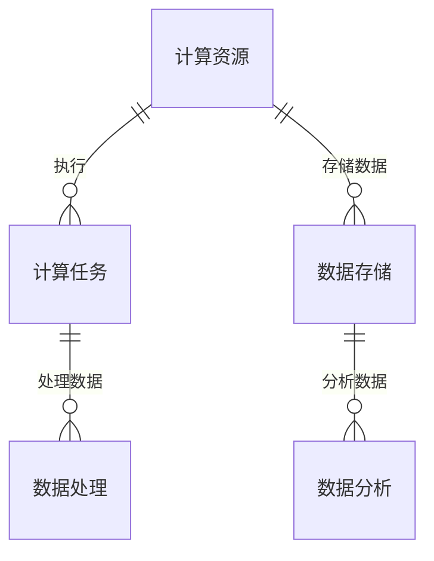

                 

## 混合计算在科学研究和工程领域的应用

### 关键词

- **混合计算**
- **科学研究**
- **工程领域**
- **并行计算**
- **分布式计算**
- **异构计算**
- **计算资源调度**

### 摘要

本文旨在探讨混合计算在科学研究和工程领域的应用，分析其在处理复杂计算任务中的独特优势。首先，我们将介绍混合计算的基本概念，包括其定义、与传统计算的对比及关键要素。接着，通过深入分析混合计算的技术框架，我们将揭示其核心原理和实现方法。随后，本文将分别探讨混合计算在科学研究和工程领域的具体应用实例，并通过案例分析来总结其成功经验与面临的挑战。最后，我们将讨论混合计算系统的设计与实现，并展望其未来的发展趋势与潜在影响。通过这篇文章，读者将全面了解混合计算在推动科学研究和工程进步中的关键作用。

### 目录大纲

----------------------------------------------------------------

# 混合计算在科学研究和工程领域的应用

## 目录大纲

----------------------------------------------------------------

1. **第1章 引言**
   1.1 **问题背景**
       1.1.1 科学研究的现状与挑战
       1.1.2 工程领域的需求与挑战
       1.1.3 混合计算的概念与重要性
   1.2 **问题描述**
       1.2.1 科学研究中的计算需求
       1.2.2 工程应用中的计算需求
       1.2.3 混合计算如何解决这些问题
   1.3 **问题解决**
       1.3.1 混合计算的核心原理
       1.3.2 混合计算的技术框架
       1.3.3 混合计算的实现方法
   1.4 **边界与外延**
       1.4.1 混合计算的适用范围
       1.4.2 混合计算的限制因素
       1.4.3 未来发展趋势与展望
   1.5 **本章小结**

2. **第2章 混合计算的基本概念**
   2.1 **核心概念**
       2.1.1 混合计算的定义
       2.1.2 混合计算与传统计算的对比
       2.1.3 混合计算的关键要素
   2.2 **概念属性特征对比**
       2.2.1 性能对比
       2.2.2 能耗对比
       2.2.3 灵活性对比
   2.3 **ER实体关系图**
       2.3.1 ER图的基本构成
       2.3.2 混合计算的ER图解析
   2.4 **本章小结**

3. **第3章 混合计算技术框架**
   3.1 **技术框架概述**
       3.1.1 混合计算的基本结构
       3.1.2 混合计算的关键组成部分
       3.1.3 技术框架的发展趋势
   3.2 **关键技术**
       3.2.1 并行计算技术
       3.2.2 分布式计算技术
       3.2.3 异构计算技术
   3.3 **技术实现方法**
       3.3.1 计算资源调度策略
       3.3.2 数据处理与传输优化
       3.3.3 算法优化与融合
   3.4 **本章小结**

4. **第4章 混合计算在科学研究的应用**
   4.1 **应用场景**
       4.1.1 天文观测数据处理
       4.1.2 生物信息学分析
       4.1.3 地球科学模拟
   4.2 **应用实例**
       4.2.1 天文领域的混合计算实例
       4.2.2 生物信息学领域的混合计算实例
       4.2.3 地球科学领域的混合计算实例
   4.3 **案例分析**
       4.3.1 成功案例介绍
       4.3.2 挑战与解决方案
       4.3.3 案例小结
   4.4 **本章小结**

5. **第5章 混合计算在工程领域的应用**
   5.1 **应用场景**
       5.1.1 工程设计优化
       5.1.2 制造过程仿真
       5.1.3 城市规划与交通管理
   5.2 **应用实例**
       5.2.1 工程设计优化实例
       5.2.2 制造过程仿真实例
       5.2.3 城市规划与交通管理实例
   5.3 **案例分析**
       5.3.1 成功案例介绍
       5.3.2 挑战与解决方案
       5.3.3 案例小结
   5.4 **本章小结**

6. **第6章 混合计算系统的设计与实现**
   6.1 **系统设计概述**
       6.1.1 系统设计的目标与原则
       6.1.2 系统功能设计
       6.1.3 系统架构设计
   6.2 **系统架构设计**
       6.2.1 系统的模块划分
       6.2.2 系统的核心组件
       6.2.3 系统的交互机制
   6.3 **系统接口设计**
       6.3.1 系统对外接口设计
       6.3.2 系统内部接口设计
       6.3.3 系统接口设计（续）
   6.4 **本章小结**

----------------------------------------------------------------

## 第1章 引言

### 1.1 问题背景

#### 1.1.1 科学研究的现状与挑战

在科学研究的领域，随着科技的进步和研究的深入，数据分析、模拟和优化等计算需求不断增加。传统的计算方法在处理这些复杂、大规模的数据集时面临着巨大的挑战。首先，传统计算方法往往依赖于单核处理器或单台高性能计算机，这使得计算效率受限。其次，科学研究中的许多问题需要大量的计算资源，例如天文观测数据处理中的海量数据分析和地球科学模拟中的复杂模型计算。这些问题使得科学研究在计算资源紧张的情况下难以进行高效的处理。

#### 1.1.2 工程领域的需求与挑战

工程领域同样面临着巨大的计算挑战。现代工程问题越来越复杂，涉及多学科交叉和多种计算模拟的需求。例如，工程设计优化需要大量的计算来模拟和优化结构、流体和电磁等参数，制造过程仿真需要处理大量的数据来预测和优化生产过程，城市规划与交通管理需要处理和分析大量的交通流量数据。这些计算任务往往需要大量的计算资源和时间，而传统计算方法难以满足这种需求。

#### 1.1.3 混合计算的概念与重要性

混合计算是一种结合了并行计算、分布式计算和异构计算等多种计算模式的计算方法。其核心思想是充分利用不同类型和层次的计算资源，以提高计算效率和性能。混合计算通过将计算任务分解为多个子任务，并在多台计算机或多个计算节点上并行执行，从而大大提高了计算速度。同时，混合计算还通过使用异构计算资源（如CPU、GPU、FPGA等），进一步提升了计算性能。

混合计算在科学研究和工程领域的重要性体现在以下几个方面：

1. **提高计算性能**：混合计算能够充分利用多台计算机和多种计算资源的优势，显著提高计算速度和性能。
2. **降低计算成本**：通过优化计算资源的调度和使用，混合计算能够降低计算成本，使得科学研究与工程应用更加经济高效。
3. **扩展计算能力**：混合计算能够扩展计算能力，使得科学研究与工程应用能够处理更大规模、更复杂的数据集和计算任务。
4. **增强灵活性**：混合计算允许根据不同计算任务的需求动态调整计算资源，提高计算的灵活性和适应性。

### 1.2 问题描述

#### 1.2.1 科学研究中的计算需求

科学研究中的计算需求多样且复杂，主要包括以下几个方面：

1. **大规模数据处理**：天文观测、生物信息学和地球科学等领域产生了海量的数据，需要高效的计算方法进行数据处理和分析。
2. **复杂模型模拟**：科学研究中的许多问题需要建立复杂的计算模型，如流体动力学模拟、结构优化模拟等，这些模型往往需要大量的计算资源。
3. **多尺度计算**：科学研究中的问题往往涉及不同尺度，需要在不同尺度上进行计算模拟，如分子动力学模拟、宏观物理模拟等。

#### 1.2.2 工程应用中的计算需求

工程应用中的计算需求同样复杂，主要包括以下几个方面：

1. **工程设计优化**：工程设计过程中需要进行大量的模拟和优化，如结构优化、流体动力学优化等。
2. **制造过程仿真**：制造过程中需要对生产过程进行仿真，预测和优化生产效率和质量。
3. **城市规划与交通管理**：城市规划与交通管理需要处理和分析大量的交通流量数据，预测和优化交通流量，提高交通效率。

#### 1.2.3 混合计算如何解决这些问题

混合计算通过以下几个方面解决科学研究和工程应用中的计算问题：

1. **提高计算速度和性能**：通过并行计算、分布式计算和异构计算，混合计算能够显著提高计算速度和性能，满足科学研究与工程应用的需求。
2. **优化计算资源调度**：混合计算通过优化计算资源的调度和使用，使得计算资源能够得到充分利用，降低计算成本。
3. **扩展计算能力**：混合计算能够扩展计算能力，使得科学研究与工程应用能够处理更大规模、更复杂的数据集和计算任务。
4. **增强灵活性**：混合计算允许根据不同计算任务的需求动态调整计算资源，提高计算的灵活性和适应性。

### 1.3 问题解决

#### 1.3.1 混合计算的核心原理

混合计算的核心原理在于将计算任务分解为多个子任务，并在多台计算机或多个计算节点上并行执行。具体来说，混合计算包括以下几种计算模式：

1. **并行计算**：将计算任务分解为多个子任务，并在多台计算机或多个计算节点上同时执行，从而提高计算速度。
2. **分布式计算**：将计算任务分配到多个计算节点上，通过网络进行数据传输和任务调度，实现计算任务的并行执行。
3. **异构计算**：利用不同类型和层次的计算资源（如CPU、GPU、FPGA等），实现计算任务的优化和加速。

#### 1.3.2 混合计算的技术框架

混合计算的技术框架主要包括以下几个关键组成部分：

1. **计算资源管理**：负责管理和调度计算资源，包括计算机集群、计算节点和异构计算资源。
2. **任务调度与分配**：根据计算任务的需求，动态分配计算资源，实现计算任务的并行执行。
3. **数据传输与同步**：实现计算任务之间的数据传输和同步，保证计算任务的正确执行。
4. **算法优化与融合**：通过算法优化和融合，提高计算效率，满足不同的计算需求。

#### 1.3.3 混合计算的实现方法

混合计算的实现方法包括以下几个方面：

1. **并行计算实现**：将计算任务分解为多个子任务，通过多线程或多进程的方式在多台计算机或多个计算节点上并行执行。
2. **分布式计算实现**：通过分布式计算框架（如Hadoop、Spark等）将计算任务分配到多个计算节点上，通过网络进行数据传输和任务调度。
3. **异构计算实现**：利用不同类型的计算资源（如CPU、GPU、FPGA等），通过异构计算框架（如CUDA、OpenCL等）实现计算任务的优化和加速。

### 1.4 边界与外延

#### 1.4.1 混合计算的适用范围

混合计算适用于需要大量计算资源的科学研究和工程领域，如大规模数据处理、复杂模型模拟、工程设计优化等。

#### 1.4.2 混合计算的限制因素

混合计算在应用中存在一些限制因素，如：

1. **计算资源调度复杂度**：混合计算需要管理和调度多台计算机和多种计算资源，调度复杂度较高。
2. **异构计算资源兼容性**：不同类型的计算资源之间可能存在兼容性问题，需要开发相应的异构计算框架。
3. **数据传输与同步开销**：分布式计算和数据传输同步可能会增加额外的开销，影响计算效率。

#### 1.4.3 未来发展趋势与展望

随着计算技术和并行计算技术的不断发展，混合计算在未来具有广阔的应用前景。未来发展趋势包括：

1. **计算资源调度优化**：通过改进计算资源调度算法，提高计算资源的利用率和调度效率。
2. **异构计算资源融合**：通过融合不同类型的计算资源，提高计算效率和性能。
3. **智能计算与混合计算**：结合人工智能技术，实现智能化的计算任务调度和优化。

### 1.5 本章小结

本章介绍了混合计算在科学研究和工程领域的应用，分析了其基本概念、核心原理和技术框架。混合计算通过结合并行计算、分布式计算和异构计算，提高了计算效率和性能，解决了科学研究和工程应用中的计算挑战。未来，随着计算技术的不断发展，混合计算将在更广泛的领域得到应用，推动科学研究和工程进步。

## 第2章 混合计算的基本概念

### 2.1 核心概念

#### 2.1.1 混合计算的定义

混合计算（Hybrid Computing）是指通过结合多种计算模式，如并行计算、分布式计算和异构计算，来提高计算效率和性能的一种计算方法。混合计算的核心理念是充分利用不同类型和层次的计算资源，以应对复杂计算任务的需求。

#### 2.1.2 混合计算与传统计算的对比

与传统计算相比，混合计算具有以下几个显著特点：

1. **计算模式多样**：传统计算主要依赖于单核处理器或单台高性能计算机，而混合计算通过结合多种计算模式，如并行计算、分布式计算和异构计算，实现了计算模式的多样化。
2. **计算资源利用率高**：混合计算能够充分利用多台计算机和多种计算资源，提高了计算资源的利用率，从而降低了计算成本。
3. **计算速度和性能提升**：通过并行计算、分布式计算和异构计算，混合计算显著提高了计算速度和性能，能够处理更大规模、更复杂的计算任务。
4. **灵活性高**：混合计算允许根据不同计算任务的需求动态调整计算资源，提高了计算的灵活性和适应性。

#### 2.1.3 混合计算的关键要素

混合计算的关键要素包括以下几个方面：

1. **计算资源管理**：负责管理和调度计算资源，包括计算机集群、计算节点和异构计算资源。计算资源管理是混合计算的核心，决定了计算资源的利用率和调度效率。
2. **任务调度与分配**：根据计算任务的需求，动态分配计算资源，实现计算任务的并行执行。任务调度与分配是混合计算的核心，决定了计算任务的执行效率和速度。
3. **数据传输与同步**：实现计算任务之间的数据传输和同步，保证计算任务的正确执行。数据传输与同步是混合计算的关键，决定了计算任务的执行连贯性和准确性。
4. **算法优化与融合**：通过算法优化和融合，提高计算效率，满足不同的计算需求。算法优化与融合是混合计算的技术保障，决定了计算性能的提升程度。

### 2.2 概念属性特征对比

为了更好地理解混合计算与传统计算的不同，我们可以从以下几个方面对比混合计算和传统计算的概念属性特征：

| 特征         | 混合计算                          | 传统计算                          |
| ------------ | --------------------------------- | --------------------------------- |
| 计算模式     | 并行计算、分布式计算、异构计算    | 单核处理器或单台高性能计算机       |
| 资源利用率   | 高，充分利用多种计算资源          | 低，资源利用率受限                |
| 计算速度和性能 | 高，显著提升计算速度和性能         | 低，计算速度和性能受限            |
| 灵活性       | 高，允许动态调整计算资源           | 低，计算资源固定，灵活性受限       |

#### 2.2.1 性能对比

在性能方面，混合计算通过并行计算、分布式计算和异构计算，显著提高了计算速度和性能。具体来说：

1. **并行计算**：通过将计算任务分解为多个子任务，在多台计算机或多个计算节点上同时执行，提高了计算速度。
2. **分布式计算**：通过将计算任务分配到多个计算节点上，通过网络进行数据传输和任务调度，实现了计算任务的并行执行。
3. **异构计算**：通过利用不同类型和层次的计算资源（如CPU、GPU、FPGA等），实现了计算任务的优化和加速。

相比之下，传统计算主要依赖于单核处理器或单台高性能计算机，计算速度和性能受限。

#### 2.2.2 能耗对比

在能耗方面，混合计算通过优化计算资源的调度和使用，降低了计算能耗。具体来说：

1. **并行计算**：通过多台计算机或多个计算节点的并行执行，减少了单台计算机的能耗。
2. **分布式计算**：通过任务分配和调度，使得计算任务能够在多个计算节点上均衡执行，减少了单台计算节点的负载，从而降低了能耗。
3. **异构计算**：通过利用不同类型的计算资源，实现了计算任务的优化和加速，降低了整体能耗。

相比之下，传统计算在能耗方面较为高，尤其是在处理大规模计算任务时，单核处理器或单台高性能计算机的能耗较高。

#### 2.2.3 灵活性对比

在灵活性方面，混合计算通过动态调整计算资源，提高了计算的灵活性和适应性。具体来说：

1. **并行计算**：通过多台计算机或多个计算节点的并行执行，允许根据计算任务的需求动态调整计算资源，提高了计算的灵活性。
2. **分布式计算**：通过任务分配和调度，使得计算任务能够在不同的计算节点上执行，实现了计算资源的灵活调度和利用。
3. **异构计算**：通过利用不同类型的计算资源，使得计算任务能够根据实际需求选择最适合的计算资源，提高了计算的灵活性。

相比之下，传统计算在灵活性方面受限，计算资源固定，难以根据计算任务的需求动态调整。

### 2.3 ER实体关系图

为了更直观地理解混合计算的概念属性特征，我们可以使用ER（实体-关系）图来展示混合计算的基本结构和实体关系。

#### 2.3.1 ER图的基本构成

ER图主要由实体、属性和关系三部分构成：

1. **实体**：代表计算资源、计算任务等具体对象。
2. **属性**：描述实体的特征和属性，如计算资源类型、计算任务类型等。
3. **关系**：描述实体之间的关联关系，如计算任务与计算资源之间的关系。

#### 2.3.2 混合计算的ER图解析

下面是一个简单的混合计算ER图，展示混合计算的基本结构和实体关系：

在这个ER图中，**计算资源**、**计算任务**和**数据存储**是三个主要实体。**计算资源**包括计算机集群、计算节点和异构计算资源，**计算任务**包括并行计算、分布式计算和异构计算任务，**数据存储**包括数据存储和数据传输。实体之间的关系表示计算资源与计算任务之间的执行和存储关系，以及计算任务与数据处理、数据分析之间的关系。

### 2.4 本章小结

本章介绍了混合计算的基本概念，包括其定义、与传统计算的对比以及关键要素。通过性能、能耗和灵活性等方面的对比，展示了混合计算在提高计算效率和性能方面的优势。同时，通过ER图解析，直观地展示了混合计算的基本结构和实体关系。本章为后续章节进一步探讨混合计算的技术框架和应用提供了基础。

## 第3章 混合计算技术框架

### 3.1 技术框架概述

#### 3.1.1 混合计算的基本结构

混合计算技术框架的基本结构包括以下几个关键组成部分：

1. **计算资源管理**：负责管理和调度计算资源，包括计算机集群、计算节点和异构计算资源。计算资源管理是实现混合计算的基础，决定了计算资源的利用率和调度效率。
2. **任务调度与分配**：根据计算任务的需求，动态分配计算资源，实现计算任务的并行执行。任务调度与分配是混合计算的核心，决定了计算任务的执行效率和速度。
3. **数据传输与同步**：实现计算任务之间的数据传输和同步，保证计算任务的正确执行。数据传输与同步是混合计算的关键，决定了计算任务的执行连贯性和准确性。
4. **算法优化与融合**：通过算法优化和融合，提高计算效率，满足不同的计算需求。算法优化与融合是混合计算的技术保障，决定了计算性能的提升程度。

#### 3.1.2 混合计算的关键组成部分

混合计算技术框架的关键组成部分包括以下几种：

1. **并行计算技术**：通过将计算任务分解为多个子任务，在多台计算机或多个计算节点上同时执行，提高了计算速度和性能。并行计算技术是混合计算的核心，能够显著提高计算效率和性能。
2. **分布式计算技术**：通过将计算任务分配到多个计算节点上，通过网络进行数据传输和任务调度，实现计算任务的并行执行。分布式计算技术能够扩展计算能力，处理更大规模、更复杂的计算任务。
3. **异构计算技术**：利用不同类型和层次的计算资源（如CPU、GPU、FPGA等），实现计算任务的优化和加速。异构计算技术能够充分发挥不同类型计算资源的特点，提高计算效率和性能。

#### 3.1.3 技术框架的发展趋势

随着计算技术的不断发展，混合计算技术框架也在不断演进，呈现出以下几个发展趋势：

1. **智能化**：通过引入人工智能技术，实现计算任务的自动调度和优化，提高混合计算的智能化水平。
2. **云计算与边缘计算结合**：云计算和边缘计算的融合，使得混合计算能够更好地适应不同的计算需求和应用场景。
3. **硬件加速**：通过硬件加速技术，如GPU、FPGA等，进一步提高计算效率和性能。
4. **数据密集型计算**：随着数据量的爆炸式增长，数据密集型计算在混合计算中的重要性不断提升，需要更加高效的计算方法和框架。

### 3.2 关键技术

#### 3.2.1 并行计算技术

并行计算技术是混合计算的核心，通过将计算任务分解为多个子任务，在多台计算机或多个计算节点上同时执行，提高了计算速度和性能。并行计算技术主要包括以下几个方面：

1. **任务分解**：将计算任务分解为多个子任务，每个子任务可以独立执行，相互之间没有依赖关系。任务分解是并行计算的基础，决定了并行计算的任务规模和执行效率。
2. **任务调度**：根据计算任务的需求和计算资源的可用情况，动态分配计算资源，实现计算任务的并行执行。任务调度是并行计算的核心，决定了并行计算的执行效率和速度。
3. **负载均衡**：通过优化计算资源的分配和使用，实现计算任务的负载均衡，避免单点瓶颈和资源浪费。负载均衡是并行计算的重要保障，提高了并行计算的稳定性和性能。
4. **数据传输与同步**：实现计算任务之间的数据传输和同步，保证计算任务的正确执行。数据传输与同步是并行计算的关键，决定了并行计算的执行连贯性和准确性。

#### 3.2.2 分布式计算技术

分布式计算技术通过将计算任务分配到多个计算节点上，通过网络进行数据传输和任务调度，实现计算任务的并行执行。分布式计算技术主要包括以下几个方面：

1. **计算节点选择**：根据计算任务的需求和计算资源的可用情况，选择合适的计算节点进行任务执行。计算节点选择是分布式计算的基础，决定了分布式计算的资源利用率和执行效率。
2. **任务分配**：将计算任务分配到不同的计算节点上，实现任务的并行执行。任务分配是分布式计算的核心，决定了分布式计算的执行效率和速度。
3. **数据传输与同步**：实现计算任务之间的数据传输和同步，保证计算任务的正确执行。数据传输与同步是分布式计算的关键，决定了分布式计算的执行连贯性和准确性。
4. **容错与恢复**：通过容错和恢复机制，保证分布式计算的高可用性和稳定性。容错与恢复是分布式计算的重要保障，提高了分布式计算的可靠性和鲁棒性。

#### 3.2.3 异构计算技术

异构计算技术通过利用不同类型和层次的计算资源（如CPU、GPU、FPGA等），实现计算任务的优化和加速。异构计算技术主要包括以下几个方面：

1. **计算资源选择**：根据计算任务的需求和计算资源的性能特点，选择合适的计算资源进行任务执行。计算资源选择是异构计算的基础，决定了异构计算的执行效率和性能。
2. **任务调度与分配**：根据计算任务的需求和计算资源的可用情况，动态分配计算资源，实现计算任务的并行执行。任务调度与分配是异构计算的核心，决定了异构计算的执行效率和速度。
3. **数据传输与同步**：实现计算任务之间的数据传输和同步，保证计算任务的正确执行。数据传输与同步是异构计算的关键，决定了异构计算的执行连贯性和准确性。
4. **算法优化与融合**：通过优化和融合不同类型的计算资源，提高计算效率和性能。算法优化与融合是异构计算的技术保障，决定了异构计算的执行效率和性能。

### 3.3 技术实现方法

#### 3.3.1 计算资源调度策略

计算资源调度策略是混合计算实现的关键，主要包括以下几个方面：

1. **任务优先级调度**：根据任务的重要性和紧急程度，动态调整任务的执行优先级，确保关键任务的优先执行。
2. **负载均衡调度**：通过优化计算资源的分配和使用，实现计算任务的负载均衡，避免单点瓶颈和资源浪费。
3. **动态资源调整**：根据计算任务的需求和计算资源的可用情况，动态调整计算资源的分配，以适应不断变化的应用场景。
4. **容错与恢复调度**：通过容错和恢复机制，保证计算任务的高可用性和稳定性，提高系统的鲁棒性和可靠性。

#### 3.3.2 数据处理与传输优化

数据处理与传输优化是混合计算实现的重要环节，主要包括以下几个方面：

1. **数据压缩与加密**：通过数据压缩和加密技术，降低数据传输的带宽需求和安全性。
2. **数据缓存与预取**：通过数据缓存和预取技术，减少数据传输的延迟，提高数据传输的效率。
3. **数据流处理**：通过数据流处理技术，实现数据的实时处理和传输，满足实时性要求。
4. **分布式数据处理**：通过分布式数据处理技术，将数据处理任务分配到多个计算节点上，实现大规模数据的处理和传输。

#### 3.3.3 算法优化与融合

算法优化与融合是混合计算实现的核心，主要包括以下几个方面：

1. **并行算法优化**：通过并行算法优化，提高并行计算的效率，减少并行计算的开销。
2. **分布式算法优化**：通过分布式算法优化，提高分布式计算的效率，减少分布式计算的开销。
3. **异构算法优化**：通过异构算法优化，充分利用不同类型计算资源的优势，提高异构计算的效率。
4. **算法融合**：通过算法融合，将不同类型的计算算法结合起来，实现计算任务的高效优化和执行。

### 3.4 本章小结

本章介绍了混合计算技术框架的基本结构和关键组成部分，包括计算资源管理、任务调度与分配、数据传输与同步以及算法优化与融合。通过并行计算、分布式计算和异构计算等关键技术，混合计算能够显著提高计算效率和性能。本章为后续章节进一步探讨混合计算在科学研究与工程领域的应用提供了技术基础。

