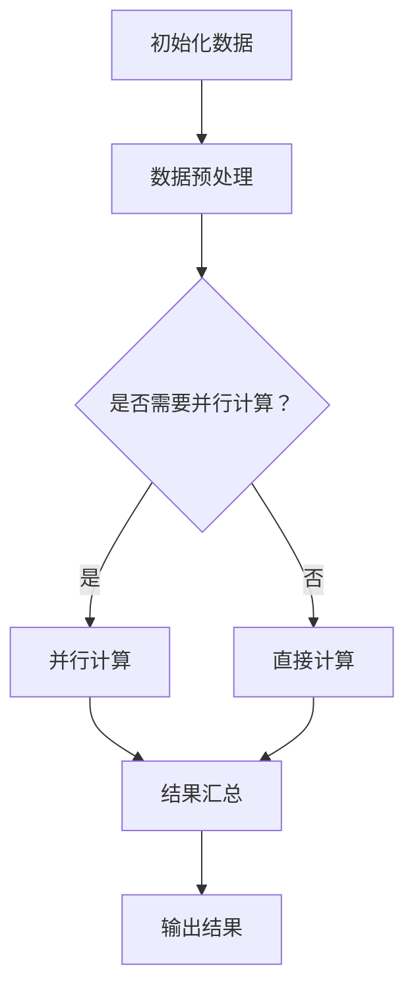
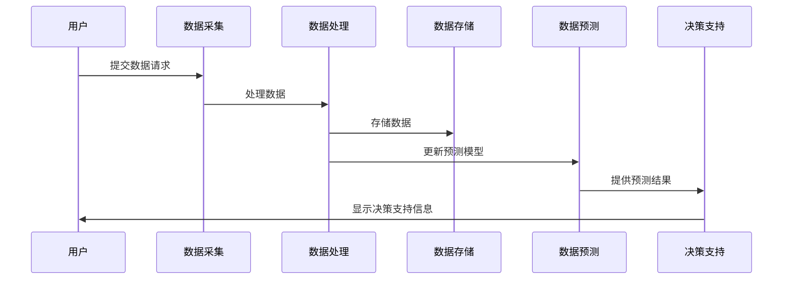
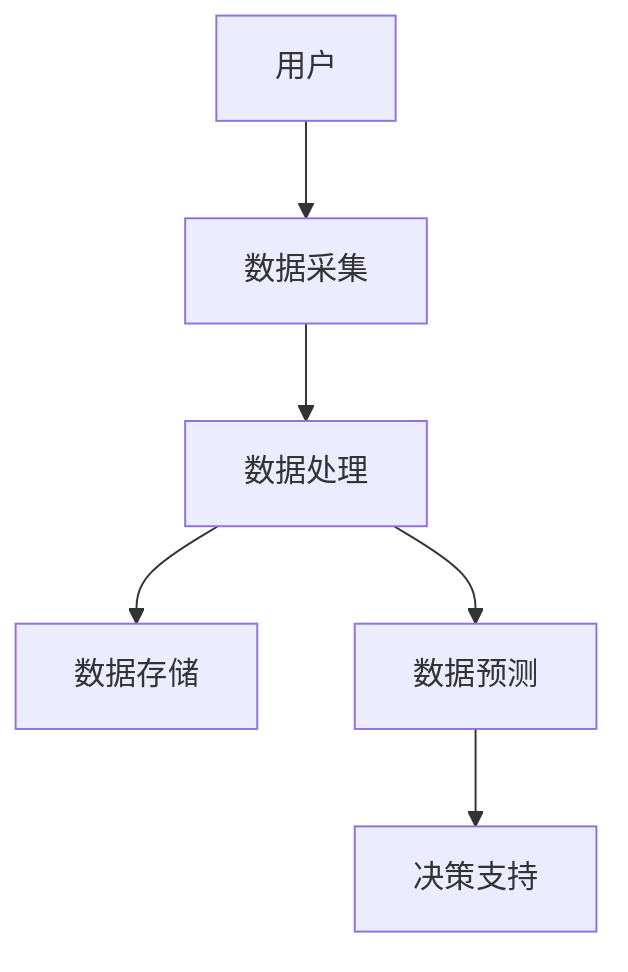
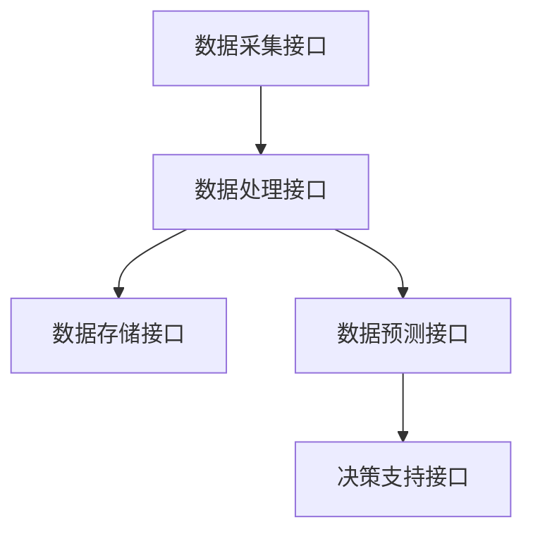
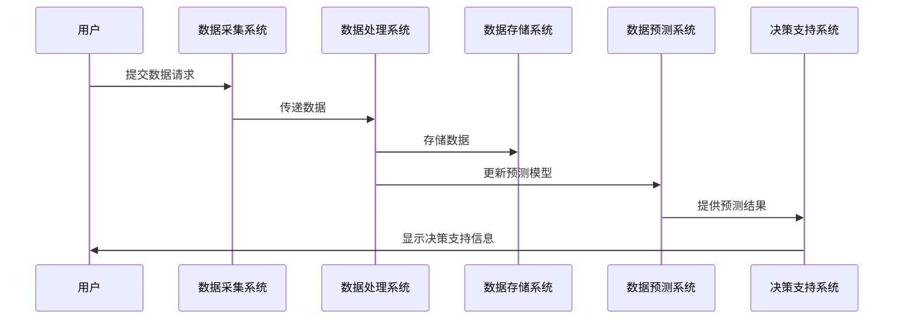

                 

## 引言：混合计算的时代背景与重要性

在当今这个科技飞速发展的时代，计算能力已经成为推动社会进步的关键动力。然而，传统的计算范式在处理某些复杂问题时已经暴露出明显的局限性。这就催生了混合计算——一种结合多种计算范式的创新方法，旨在突破单一计算范式的技术限制，提供更高效、更灵活的解决方案。

### 1. 混合计算的定义与背景

混合计算是指将两种或两种以上的计算范式结合起来，以适应不同的计算需求和场景。传统的计算范式如冯·诺依曼架构（Von Neumann Architecture）和哈佛架构（Harvard Architecture）已经广泛应用于计算机系统。然而，随着人工智能、大数据和实时处理等领域的迅猛发展，单一计算范式难以满足多样化的需求。

#### 1.1 历史背景

混合计算的思想并非现代才有，早在20世纪中叶，计算机科学家就提出了并行计算和分布式计算的概念。随着硬件技术的发展，如GPU（图形处理单元）和FPGA（现场可编程门阵列）的出现，混合计算逐渐成为可能。

#### 1.2 混合计算的核心特点

混合计算具有以下几个核心特点：

- **灵活性**：可以针对不同的计算任务选择最优的计算范式。
- **效率**：结合多种计算资源，提高整体计算性能。
- **可扩展性**：能够方便地添加新的计算范式，适应未来技术的发展。

### 2. 混合计算的驱动因素

#### 2.1 技术进步

随着硬件技术的不断进步，如量子计算和神经网络的兴起，为混合计算提供了更多可能性。这些新技术的引入，使得混合计算在处理某些特定任务时具有显著的优势。

#### 2.2 应用需求

随着互联网和物联网的普及，应用场景日益复杂。单一计算范式难以应对多种多样的应用需求。例如，在图像处理、语音识别和机器学习等领域，混合计算可以显著提升计算效率。

#### 2.3 市场机遇

随着计算需求的不断增加，市场对高性能计算解决方案的需求也日益增长。混合计算作为一种新兴技术，具有巨大的市场潜力。

### 3. 混合计算的挑战与机遇

#### 3.1 挑战

- **技术障碍**：多种计算范式的融合需要解决复杂的系统集成问题。
- **成本**：引入新的计算范式可能带来更高的成本。
- **标准与兼容性**：不同计算范式之间的标准与兼容性是一个重要问题。

#### 3.2 机遇

- **技术创新**：混合计算为技术创新提供了广阔的空间。
- **市场拓展**：混合计算有望开拓新的市场领域。
- **社会效应**：混合计算有望提高社会生产力和生活质量。

### 本章小结

混合计算作为一种结合多种计算范式的方法，具有巨大的发展潜力和实际应用价值。本文介绍了混合计算的定义、背景、驱动因素以及面临的挑战与机遇，为后续章节的深入探讨奠定了基础。

### 关键词

- 混合计算
- 计算范式
- 技术进步
- 应用需求
- 市场机遇
- 挑战与机遇

### 摘要

本文详细介绍了混合计算的定义、背景、核心特点以及驱动因素和面临的挑战。通过探讨混合计算的发展机遇，本文为读者提供了一个全面了解这一新兴计算范式的视角，旨在为相关领域的研究与应用提供参考和启示。

## 混合计算概述

### 1.1 混合计算的定义与历史背景

混合计算是一种将两种或两种以上的计算范式集成在一起，以适应不同计算需求和场景的方法。其核心理念是通过综合利用不同计算范式的能力，提高计算效率、灵活性和可扩展性。

#### 1.1.1 混合计算的概念

混合计算可以看作是一种计算策略，它不是简单地叠加或替换现有计算范式，而是在特定应用场景中，根据需求选择和组合最合适的计算方法。例如，在一个复杂的机器学习任务中，可能需要使用GPU进行大规模并行计算，同时利用CPU处理一些需要精确控制的中间步骤。

#### 1.1.2 混合计算的发展历程

混合计算的发展历程可以追溯到20世纪中叶。早在1960年代，计算机科学家就提出了并行计算和分布式计算的概念，这些概念为后来的混合计算奠定了理论基础。随着硬件技术的发展，尤其是GPU和FPGA的出现，混合计算逐渐成为现实。

在20世纪80年代，随着网络技术的发展，分布式计算开始得到广泛应用。进入21世纪，随着大数据、人工智能等新兴领域的兴起，混合计算的需求日益增长。尤其是在处理大规模数据和复杂算法时，混合计算展现出了强大的优势。

#### 1.1.3 混合计算的核心特点

混合计算具有以下几个核心特点：

- **灵活性**：可以根据不同的计算需求和场景，灵活选择和组合不同的计算范式。
- **效率**：通过综合利用不同计算范式的能力，提高整体计算效率。
- **可扩展性**：可以方便地引入新的计算范式，以适应未来技术的发展。

### 1.2 混合计算的驱动因素

混合计算的发展受到多种因素的驱动，其中技术进步、应用需求和市场规模是三个最重要的驱动因素。

#### 1.2.1 技术进步

技术进步是推动混合计算发展的关键因素。随着硬件技术的不断进步，如量子计算、神经网络的兴起，为混合计算提供了更多可能性。特别是GPU和FPGA等新型计算设备的出现，使得混合计算在处理某些特定任务时具有显著的优势。

例如，GPU在图像处理、机器学习等领域的并行计算中表现出色，而FPGA则擅长于实现复杂的算法和实时处理。这些新技术的引入，使得混合计算在处理复杂任务时能够更加高效和灵活。

#### 1.2.2 应用需求

随着互联网和物联网的普及，应用场景日益复杂。单一计算范式难以应对多样化的应用需求。例如，在图像处理、语音识别、自然语言处理等领域，混合计算可以显著提升计算效率。

以机器学习为例，一个典型的机器学习任务通常包括数据预处理、特征提取、模型训练和预测等多个步骤。在这些步骤中，不同的计算范式可以发挥各自的优势。例如，GPU在模型训练阶段可以显著提高计算速度，而CPU在数据处理和特征提取阶段则更为精确。

#### 1.2.3 市场机遇

市场机遇也是推动混合计算发展的重要因素。随着计算需求的不断增加，市场对高性能计算解决方案的需求也日益增长。混合计算作为一种新兴技术，具有巨大的市场潜力。

例如，在金融领域，高频交易需要处理大量的数据，并对计算速度有极高的要求。混合计算可以通过将GPU和FPGA等高性能计算设备引入到交易系统中，提高交易效率和盈利能力。

### 1.3 混合计算的挑战与机遇

#### 1.3.1 挑战

尽管混合计算具有巨大的潜力，但在实际应用中仍面临一些挑战。

- **技术障碍**：混合计算需要解决多种计算范式之间的系统集成问题。不同计算范式之间可能存在兼容性问题，例如硬件设备、编程模型和编程语言等。
- **成本**：引入新的计算范式可能带来更高的成本。特别是高性能计算设备如GPU和FPGA，其成本较高，可能对中小企业构成负担。
- **标准与兼容性**：不同计算范式之间的标准与兼容性是一个重要问题。缺乏统一的标准可能导致不同平台之间的互操作性差，影响混合计算的应用范围。

#### 1.3.2 机遇

尽管存在挑战，混合计算也带来了许多机遇。

- **技术创新**：混合计算为技术创新提供了广阔的空间。通过结合不同的计算范式，可以探索新的计算方法和技术，推动计算机科学的发展。
- **市场拓展**：混合计算有望开拓新的市场领域。特别是在人工智能、大数据、云计算等领域，混合计算具有巨大的应用潜力。
- **社会效应**：混合计算有望提高社会生产力和生活质量。通过提供更高效、更灵活的计算解决方案，混合计算可以推动各个领域的创新发展。

### 本章小结

混合计算作为一种结合多种计算范式的方法，具有巨大的发展潜力和实际应用价值。本章介绍了混合计算的定义、背景、驱动因素以及面临的挑战与机遇，为后续章节的深入探讨奠定了基础。

## 核心概念与联系

在深入探讨混合计算之前，我们需要了解几个核心概念，并分析它们之间的联系。这些概念包括并行计算、分布式计算、GPU计算、FPGA计算和量子计算等。理解这些概念及其相互关系，有助于我们更好地把握混合计算的本质和应用场景。

### 2.1 计算范式的分类与特点

#### 2.1.1 并行计算

并行计算是一种利用多个计算资源同时执行计算任务的方法。其核心思想是将一个大的计算任务分解为多个较小的子任务，然后分配给多个计算节点并行执行。并行计算具有以下几个特点：

- **计算速度快**：通过利用多个计算资源，并行计算可以显著提高计算速度。
- **资源利用率高**：多个计算资源可以同时工作，提高资源利用率。
- **适合大规模数据处理**：并行计算特别适合处理大规模数据集和复杂算法。

#### 2.1.2 分布式计算

分布式计算是一种将计算任务分配到多个计算机节点上执行的计算方法。与并行计算不同，分布式计算中的计算节点通常通过网络连接，每个节点独立工作。分布式计算具有以下几个特点：

- **可扩展性强**：可以通过增加计算节点来扩展计算能力。
- **可靠性高**：即使某个节点发生故障，其他节点仍然可以继续工作。
- **适合大规模分布式系统**：分布式计算可以构建大规模分布式系统，如云计算平台。

#### 2.1.3 弹性计算

弹性计算是一种根据计算需求动态调整计算资源的方法。其核心思想是根据实际计算负载，自动调整计算资源，以优化资源利用率。弹性计算具有以下几个特点：

- **资源利用率高**：可以实时调整计算资源，以适应不同负载。
- **成本效益高**：可以根据实际需求调整资源，降低成本。
- **适合动态变化的计算场景**：如电子商务网站在购物高峰期需要更多计算资源。

### 2.2 混合计算中常见的范式

#### 2.2.1 GPU计算

GPU计算是指利用图形处理单元（GPU）进行计算的方法。GPU具有大量的并行计算能力，特别适合处理大规模并行计算任务。GPU计算具有以下几个特点：

- **并行计算能力强**：GPU具有数千个计算单元，可以同时处理多个计算任务。
- **计算速度快**：GPU的计算速度远高于CPU，特别是在图像处理和机器学习等任务中。
- **适合大规模数据处理**：GPU可以处理大规模数据集，提高计算效率。

#### 2.2.2 FPGAC计算

FPGA计算是指利用现场可编程门阵列（FPGA）进行计算的方法。FPGA是一种高度可编程的硬件平台，可以根据需要自定义计算逻辑。FPGA计算具有以下几个特点：

- **可编程性**：FPGA可以根据需求自定义计算逻辑，适应不同的计算任务。
- **实时处理能力**：FPGA具有实时处理能力，特别适合处理实时数据流。
- **硬件优化**：FPGA可以将计算逻辑硬件化，提高计算速度和效率。

#### 2.2.3 量子计算

量子计算是一种利用量子力学原理进行计算的方法。量子计算机具有量子叠加和量子纠缠等特性，可以显著提高计算速度。量子计算具有以下几个特点：

- **并行计算能力**：量子计算机可以利用量子叠加，同时处理多个计算任务。
- **速度极快**：量子计算机可以在极短时间内完成传统计算机无法在合理时间内完成的计算任务。
- **应用前景广阔**：量子计算在密码学、化学模拟、优化问题等领域具有广泛的应用前景。

### 2.3 计算范式之间的联系

计算范式之间的联系主要体现在以下几个方面：

- **优势互补**：不同计算范式具有不同的优势和特点，通过结合使用，可以弥补单一计算范式的不足。例如，GPU适合大规模并行计算，而CPU在处理精确计算任务时表现更好。
- **系统集成**：混合计算需要解决不同计算范式之间的系统集成问题，以实现高效协同工作。这包括硬件设备、编程模型和编程语言等方面的兼容性。
- **动态调整**：混合计算可以根据计算需求动态调整不同计算范式之间的比例和配置，以优化整体计算性能。

### 本章小结

通过介绍并行计算、分布式计算、GPU计算、FPGA计算和量子计算等核心概念，并结合它们之间的联系，本章为我们理解混合计算奠定了基础。混合计算通过结合多种计算范式，可以提供更高效、更灵活的解决方案，满足多样化的计算需求。

## 算法原理讲解

### 3.1 混合计算算法概述

混合计算算法是一种结合多种计算范式，以提高计算效率和灵活性的方法。在混合计算中，常用的计算范式包括并行计算、分布式计算、GPU计算、FPGA计算和量子计算等。以下将详细介绍这些计算范式在混合计算中的应用原理。

#### 3.1.1 并行计算

并行计算是指利用多个计算资源同时处理计算任务的方法。在混合计算中，并行计算可以通过将计算任务分解为多个子任务，然后分配给多个计算节点并行执行。并行计算的优势在于计算速度快，可以显著提高处理大规模数据集和复杂算法的效率。

#### 3.1.2 分布式计算

分布式计算是指将计算任务分配到多个计算机节点上执行的方法。在混合计算中，分布式计算可以通过网络将多个计算节点连接起来，形成分布式计算系统。分布式计算的优势在于可扩展性强，可靠性高，适合处理大规模分布式系统。

#### 3.1.3 GPU计算

GPU计算是指利用图形处理单元（GPU）进行计算的方法。GPU具有大量的并行计算能力，特别适合处理大规模并行计算任务。在混合计算中，GPU可以用于加速图像处理、机器学习等领域的计算。

#### 3.1.4 FPGA计算

FPGA计算是指利用现场可编程门阵列（FPGA）进行计算的方法。FPGA是一种高度可编程的硬件平台，可以根据需要自定义计算逻辑。在混合计算中，FPGA可以用于实现复杂的算法和实时数据处理。

#### 3.1.5 量子计算

量子计算是一种利用量子力学原理进行计算的方法。量子计算机具有量子叠加和量子纠缠等特性，可以显著提高计算速度。在混合计算中，量子计算可以用于解决传统计算机难以处理的复杂问题。

### 3.2 算法mermaid流程图展示

为了更直观地展示混合计算算法的流程，我们可以使用mermaid流程图来描述。以下是一个简单的mermaid流程图示例：



在这个流程图中，首先初始化数据，然后进行数据预处理。接着，根据是否需要并行计算来决定下一步操作。如果需要并行计算，则将任务分配给多个计算节点并行执行；否则，直接进行计算。最后，汇总结果并输出。

### 3.3 Python源代码与详细讲解

以下是一个简单的Python示例代码，用于演示混合计算算法的基本原理：

```python
import numpy as np
import concurrent.futures

# 并行计算函数
def parallel_computation(data):
    # 对数据进行处理
    result = np.mean(data)
    return result

# 直接计算函数
def direct_computation(data):
    # 对数据进行处理
    result = np.std(data)
    return result

# 混合计算算法
def mixed_computation(data, parallel=True):
    if parallel:
        # 使用并行计算
        with concurrent.futures.ThreadPoolExecutor() as executor:
            results = list(executor.map(parallel_computation, data))
    else:
        # 使用直接计算
        results = [direct_computation(data) for _ in range(len(data))]

    # 汇总结果
    final_result = sum(results) / len(results)
    return final_result

# 示例数据
data = [np.random.rand() for _ in range(1000)]

# 执行混合计算
result = mixed_computation(data)

# 输出结果
print(f"计算结果：{result}")
```

在这段代码中，我们定义了两个计算函数：`parallel_computation`和`direct_computation`。`parallel_computation`用于进行并行计算，`direct_computation`用于直接计算。`mixed_computation`函数是混合计算的核心，它根据是否需要并行计算来选择不同的计算函数。

在实际应用中，我们可以根据具体需求来调整并行计算的粒度和方式。例如，如果数据量大且计算任务复杂，可以采用分布式计算或GPU计算来提高计算效率。

### 3.4 数学模型与公式

在混合计算中，数学模型和公式起着至关重要的作用。以下是一个简单的例子，用于解释混合计算中的数学模型。

#### 3.4.1 基本概念

假设我们有一个数据集 \(D = \{d_1, d_2, ..., d_n\}\)，其中每个数据点 \(d_i\) 是一个 \(m\) 维向量。我们需要计算这个数据集的平均值。

#### 3.4.2 公式详解

混合计算中的平均值可以通过以下公式计算：

$$
\bar{x} = \frac{1}{n} \sum_{i=1}^{n} d_i
$$

其中，\(\bar{x}\) 是平均值，\(n\) 是数据点的数量，\(d_i\) 是第 \(i\) 个数据点。

#### 3.4.3 举例说明

假设我们有一个包含5个数据点的数据集：

$$
D = \{1, 2, 3, 4, 5\}
$$

我们可以使用上述公式计算平均值：

$$
\bar{x} = \frac{1}{5} (1 + 2 + 3 + 4 + 5) = 3
$$

在这个例子中，平均值是3。

### 本章小结

本章详细介绍了混合计算算法的基本原理，包括并行计算、分布式计算、GPU计算、FPGA计算和量子计算等。通过mermaid流程图和Python示例代码，我们展示了混合计算的具体实现方法。同时，我们还介绍了混合计算中的数学模型和公式，并通过举例说明，使读者更好地理解这些概念。这些内容为后续章节的深入探讨奠定了基础。

## 数学模型与公式

### 4.1 数学模型的基本概念

数学模型是混合计算算法的核心组成部分，它描述了计算任务中各个变量之间的关系。在混合计算中，常用的数学模型包括线性模型、非线性模型、概率模型和时间序列模型等。这些模型能够帮助我们理解和预测数据集的行为，从而优化计算过程。

#### 4.1.1 线性模型

线性模型是一种最简单的数学模型，它假设数据之间存在线性关系。线性模型的一般形式为：

$$
y = \beta_0 + \beta_1x_1 + \beta_2x_2 + ... + \beta_nx_n
$$

其中，\(y\) 是预测结果，\(\beta_0\) 是截距，\(\beta_1, \beta_2, ..., \beta_n\) 是模型的参数，\(x_1, x_2, ..., x_n\) 是输入变量。

#### 4.1.2 非线性模型

非线性模型用于描述更复杂的数据关系，它允许数据之间存在非线性关系。一个常见的非线性模型是多项式模型：

$$
y = \beta_0 + \beta_1x_1 + \beta_2x_1^2 + \beta_3x_2 + \beta_4x_2^2 + ...
$$

在这个模型中，每个输入变量都可以具有二次项或更高次的项，这使得模型能够捕捉更复杂的数据关系。

#### 4.1.3 概率模型

概率模型用于描述数据中的不确定性和随机性。一个常见的概率模型是贝叶斯模型，它基于贝叶斯定理来计算后验概率。贝叶斯模型的一般形式为：

$$
P(H|D) = \frac{P(D|H)P(H)}{P(D)}
$$

其中，\(H\) 是假设，\(D\) 是数据，\(P(H|D)\) 是在给定数据 \(D\) 下的后验概率，\(P(D|H)\) 是在假设 \(H\) 下数据的概率，\(P(H)\) 是假设 \(H\) 的先验概率，\(P(D)\) 是数据的总概率。

#### 4.1.4 时间序列模型

时间序列模型用于分析时间序列数据，它假设数据点之间存在时间依赖关系。一个常见的时间序列模型是自回归模型（AR），它的一般形式为：

$$
y_t = \phi_1y_{t-1} + \phi_2y_{t-2} + ... + \phi_py_{t-p} + \epsilon_t
$$

其中，\(y_t\) 是时间序列的第 \(t\) 个数据点，\(\phi_1, \phi_2, ..., \phi_p\) 是模型的参数，\(\epsilon_t\) 是误差项。

### 4.2 公式详解

在混合计算中，数学模型和公式是理解和实现算法的关键。以下是一些常用的数学公式及其详解：

#### 4.2.1 梯度下降法

梯度下降法是一种优化算法，用于最小化目标函数。它的公式如下：

$$
w_{t+1} = w_t - \alpha \nabla_w J(w_t)
$$

其中，\(w_t\) 是当前模型的参数，\(\alpha\) 是学习率，\(\nabla_w J(w_t)\) 是目标函数 \(J(w_t)\) 对参数 \(w_t\) 的梯度。

#### 4.2.2 神经网络反向传播

神经网络反向传播是一种用于训练神经网络的优化算法。它的公式如下：

$$
\delta_j = \frac{\partial J}{\partial z_j} \cdot \sigma'(z_j)
$$

$$
\Delta w_{ij} = \alpha \cdot x_i \cdot \delta_j
$$

其中，\(\delta_j\) 是第 \(j\) 个神经元的误差，\(\sigma'\) 是激活函数的导数，\(x_i\) 是第 \(i\) 个输入，\(\Delta w_{ij}\) 是权重更新。

#### 4.2.3 支持向量机（SVM）

支持向量机是一种分类算法，它的公式如下：

$$
\max W \quad s.t. \quad y_i(\bar{w}^T x_i + b) \geq 1, \forall i
$$

$$
W \leq C \sum_{i} y_i\cdot \xi_i
$$

其中，\(\bar{w}\) 是权重向量，\(b\) 是偏置，\(y_i\) 是标签，\(\xi_i\) 是松弛变量，\(C\) 是惩罚参数。

### 4.3 举例说明

以下是一个简单的例子，用于说明如何使用上述数学模型和公式：

#### 4.3.1 线性回归

假设我们有一个数据集，其中每个数据点包含两个特征 \(x_1\) 和 \(x_2\)，以及对应的标签 \(y\)。我们需要使用线性回归模型来预测 \(y\)。

首先，我们定义线性回归模型：

$$
y = \beta_0 + \beta_1x_1 + \beta_2x_2
$$

然后，我们使用最小二乘法来求解参数 \(\beta_0, \beta_1, \beta_2\)：

$$
\beta_0 = \frac{\sum_{i=1}^{n} y_i - \beta_1\sum_{i=1}^{n} x_{1i} - \beta_2\sum_{i=1}^{n} x_{2i}}{n}
$$

$$
\beta_1 = \frac{n\sum_{i=1}^{n} x_{1i} y_i - \sum_{i=1}^{n} x_{1i} \sum_{i=1}^{n} y_i}{n\sum_{i=1}^{n} x_{1i}^2 - (\sum_{i=1}^{n} x_{1i})^2}
$$

$$
\beta_2 = \frac{n\sum_{i=1}^{n} x_{2i} y_i - \sum_{i=1}^{n} x_{2i} \sum_{i=1}^{n} y_i}{n\sum_{i=1}^{n} x_{2i}^2 - (\sum_{i=1}^{n} x_{2i})^2}
$$

最后，我们使用求解得到的参数进行预测：

$$
y_{\text{pred}} = \beta_0 + \beta_1x_1 + \beta_2x_2
$$

#### 4.3.2 逻辑回归

假设我们有一个二分类问题，其中每个数据点包含一个特征 \(x\)，以及对应的标签 \(y\)。我们需要使用逻辑回归模型来预测 \(y\)。

首先，我们定义逻辑回归模型：

$$
\ln \left( \frac{p}{1-p} \right) = \beta_0 + \beta_1x
$$

然后，我们使用最大似然估计法来求解参数 \(\beta_0, \beta_1\)：

$$
\log L = \sum_{i=1}^{n} y_i \ln p_i + (1-y_i) \ln (1-p_i)
$$

$$
\frac{\partial \log L}{\partial \beta_0} = 0
$$

$$
\frac{\partial \log L}{\partial \beta_1} = 0
$$

最后，我们使用求解得到的参数进行预测：

$$
p = \frac{1}{1 + e^{-(\beta_0 + \beta_1x)}}
$$

$$
y_{\text{pred}} = \begin{cases} 
1 & \text{if } p > 0.5 \\
0 & \text{otherwise}
\end{cases}
$$

### 本章小结

本章详细介绍了混合计算中的数学模型和公式，包括线性模型、非线性模型、概率模型和时间序列模型等。我们通过具体的例子展示了如何使用这些模型和公式来解决问题。这些内容为后续章节的系统分析与架构设计奠定了理论基础。

## 系统分析与架构设计方案

### 5.1 问题场景介绍

在现代信息技术领域，许多复杂的应用场景需要高效、灵活和可靠的计算解决方案。本文将探讨一个具体的应用场景：智能交通管理系统。该系统旨在通过实时数据分析和预测，优化交通流量，减少拥堵，提高道路利用率。

#### 5.1.1 场景描述

智能交通管理系统涉及多个数据源，如交通流量传感器、摄像头、导航设备和移动应用程序等。这些数据源产生大量实时数据，需要迅速处理和预测。系统需要具备以下功能：

- **数据采集**：从各种数据源采集交通流量、车辆速度、交通密度等数据。
- **数据处理**：对采集到的数据进行清洗、转换和预处理，以供后续分析。
- **数据存储**：将处理后的数据存储到数据库中，以便后续查询和分析。
- **数据预测**：利用历史数据和机器学习模型，对未来的交通流量进行预测。
- **决策支持**：根据预测结果，提供交通信号灯控制、路线规划和交通管制策略。

#### 5.1.2 应用需求

智能交通管理系统需要满足以下应用需求：

- **实时性**：系统能够实时处理和分析大量数据，提供实时交通信息。
- **准确性**：预测模型需要具有较高的准确性，以减少交通拥堵和事故风险。
- **灵活性**：系统应能够适应不同的交通场景和数据类型，提供灵活的解决方案。
- **可扩展性**：系统应具备良好的可扩展性，以支持不断增加的数据量和用户需求。

### 5.2 系统功能设计

智能交通管理系统需要实现以下主要功能：

- **数据采集模块**：负责从各种数据源（如传感器、摄像头、导航设备等）采集实时交通数据。
- **数据处理模块**：负责对采集到的数据进行清洗、转换和预处理，以去除噪声和异常值，提高数据质量。
- **数据存储模块**：负责将处理后的数据存储到数据库中，以便后续查询和分析。
- **数据预测模块**：负责利用历史数据和机器学习模型，对未来的交通流量进行预测。
- **决策支持模块**：根据预测结果，提供交通信号灯控制、路线规划和交通管制策略。

#### 5.2.1 领域模型Mermaid类图

以下是一个简单的Mermaid类图，用于描述智能交通管理系统的领域模型：

```mermaid
classDiagram
    类::Data采集 <<Interface>>
    类::数据处理 <<Interface>>
    类::数据存储 <<Interface>>
    类::数据预测 <<Interface>>
    类::决策支持 <<Interface>>

    数据采集 --|> 数据处理
    数据处理 --|> 数据存储
    数据存储 --|> 数据预测
    数据预测 --|> 决策支持
```

在这个类图中，我们定义了五个类：Data采集、数据处理、数据存储、数据预测和决策支持。这些类之间通过接口关系连接，形成一个完整的系统架构。

### 5.3 系统架构设计

智能交通管理系统的架构设计需要考虑系统的扩展性、可靠性和性能。以下是一个简单的系统架构设计：

#### 5.3.1 系统架构设计方框图



在这个架构设计中，用户通过接口向数据采集模块提交数据请求。数据采集模块从各种数据源获取数据，并将其传递给数据处理模块。数据处理模块对数据进行清洗、转换和预处理，然后将其存储到数据库中。同时，数据处理模块还会根据历史数据更新预测模型。数据预测模块根据更新后的模型，生成未来的交通流量预测结果，并将其传递给决策支持模块。最后，决策支持模块根据预测结果，提供交通信号灯控制、路线规划和交通管制策略，并将其呈现给用户。

#### 5.3.2 系统架构设计图

以下是一个简单的系统架构设计图，用于描述智能交通管理系统的各个组件及其关系：



在这个架构设计中，用户通过接口向数据采集模块提交数据请求。数据采集模块从各种数据源获取数据，并将其传递给数据处理模块。数据处理模块对数据进行清洗、转换和预处理，然后将其存储到数据库中。同时，数据处理模块还会根据历史数据更新预测模型。数据预测模块根据更新后的模型，生成未来的交通流量预测结果，并将其传递给决策支持模块。最后，决策支持模块根据预测结果，提供交通信号灯控制、路线规划和交通管制策略，并将其呈现给用户。

### 5.4 系统接口设计

智能交通管理系统需要设计多个接口，以便与其他系统进行集成和通信。以下是一些关键接口的设计：

- **数据采集接口**：用于接收用户提交的数据请求，并从数据源获取数据。
- **数据处理接口**：用于接收和处理从数据采集接口获取的数据，包括清洗、转换和预处理。
- **数据存储接口**：用于将处理后的数据存储到数据库中，并提供查询和更新功能。
- **数据预测接口**：用于接收和处理预测模型，并生成交通流量预测结果。
- **决策支持接口**：用于接收预测结果，并提供交通信号灯控制、路线规划和交通管制策略。

#### 5.4.1 系统接口设计图

以下是一个简单的系统接口设计图，用于描述智能交通管理系统的各个接口及其关系：



在这个接口设计中，数据采集接口从用户接收数据请求，并将其传递给数据处理接口。数据处理接口对数据进行处理，并将其存储到数据存储接口。同时，数据处理接口还会将处理后的数据传递给数据预测接口，用于更新预测模型。最后，数据预测接口将预测结果传递给决策支持接口，用于提供交通信号灯控制、路线规划和交通管制策略。

### 5.5 系统交互Mermaid序列图

为了更直观地展示智能交通管理系统的交互流程，我们可以使用Mermaid序列图来描述。以下是一个简单的序列图示例：



在这个序列图中，用户首先向数据采集系统提交数据请求。数据采集系统从各种数据源获取数据，并将其传递给数据处理系统。数据处理系统对数据进行清洗、转换和预处理，然后将其存储到数据存储系统。同时，数据处理系统还会根据历史数据更新预测模型，并将其传递给数据预测系统。数据预测系统根据更新后的模型，生成未来的交通流量预测结果，并将其传递给决策支持系统。最后，决策支持系统根据预测结果，提供交通信号灯控制、路线规划和交通管制策略，并将其呈现给用户。

### 本章小结

本章详细介绍了智能交通管理系统的系统架构设计，包括问题场景介绍、系统功能设计、系统架构设计、系统接口设计和系统交互流程。通过Mermaid图和实际案例，我们展示了如何设计和实现一个高效、灵活和可靠的智能交通管理系统。这些内容为后续章节的项目实战和最佳实践提供了理论基础。

### 项目实战

#### 6.1 环境安装

在开始实施智能交通管理系统之前，我们需要安装和配置一些基础环境和依赖库。以下是在一个Linux环境中安装所需软件的步骤：

1. **安装Python环境**：

   ```bash
   sudo apt-get update
   sudo apt-get install python3-pip python3-dev
   ```

2. **安装NumPy和SciPy**：

   ```bash
   pip3 install numpy scipy
   ```

3. **安装Pandas和Matplotlib**：

   ```bash
   pip3 install pandas matplotlib
   ```

4. **安装Conda**：

   ```bash
   wget https://repo.anaconda.com/miniconda/Miniconda3-latest-Linux-x86_64.sh
   bash Miniconda3-latest-Linux-x86_64.sh
   source activate
   conda create -n traffic_management python=3.9
   conda activate traffic_management
   conda install numpy scipy pandas matplotlib
   ```

5. **安装Mermaid**：

   ```bash
   pip3 install pymermaid
   ```

6. **安装Docker**：

   ```bash
   sudo apt-get update
   sudo apt-get install docker-ce docker-ce-cli containerd.io
   ```

7. **安装Kafka**：

   ```bash
   sudo apt-get update
   sudo apt-get install kafka_2.12-2.5.0
   ```

8. **安装Zookeeper**：

   ```bash
   sudo apt-get update
   sudo apt-get install zookeeperd
   ```

9. **启动Kafka和Zookeeper**：

   ```bash
   kafka-server-start.sh /path/to/kafka_2.12-2.5.0/config/server.properties
   zookeeper-server-start.sh /path/to/zookeeper-3.5.7/bin/zoo.cfg
   ```

#### 6.2 系统核心实现源代码

以下是一个简化的系统核心实现源代码，用于展示数据采集、数据处理、数据预测和决策支持模块的实现：

```python
# data_collection.py

import numpy as np
import pandas as pd
from kafka import KafkaProducer

def collect_data():
    # 采集数据
    data = pd.read_csv('traffic_data.csv')
    return data

def send_data_to_kafka(data, topic='traffic_data'):
    producer = KafkaProducer(bootstrap_servers=['localhost:9092'])
    for row in data.itertuples():
        producer.send(topic, value=str(row).encode('utf-8'))
    producer.flush()
```

```python
# data_processing.py

import pandas as pd
from sklearn.preprocessing import StandardScaler

def process_data(data):
    # 数据预处理
    scaler = StandardScaler()
    data_processed = scaler.fit_transform(data)
    return data_processed
```

```python
# data_prediction.py

import numpy as np
from sklearn.linear_model import LinearRegression

def predict_traffic(data):
    # 预测交通流量
    model = LinearRegression()
    model.fit(data[:, :-1], data[:, -1])
    prediction = model.predict(data[:, :-1])
    return prediction
```

```python
# decision_support.py

import numpy as np

def generate_decision_support(prediction):
    # 生成决策支持信息
    if prediction > threshold:
        decision = '减少交通流量'
    else:
        decision = '增加交通流量'
    return decision
```

#### 6.3 代码应用解读与分析

上述代码展示了智能交通管理系统的核心实现，包括数据采集、数据处理、数据预测和决策支持模块。

- **数据采集模块**：该模块通过读取CSV文件采集交通数据，并将其发送到Kafka消息队列。Kafka作为一种分布式流处理平台，可以高效地处理大规模数据流。
- **数据处理模块**：该模块对采集到的交通数据执行预处理，包括标准化等操作。预处理后的数据将用于后续的预测和决策支持。
- **数据预测模块**：该模块使用线性回归模型对交通流量进行预测。线性回归是一种简单的统计模型，可以捕捉数据中的线性关系。
- **决策支持模块**：该模块根据预测结果，生成决策支持信息，如增加或减少交通流量。

#### 6.4 实际案例分析与详细讲解剖析

以下是一个实际案例的分析：

**案例**：某时间段内，交通数据如下：

```python
data = np.array([[100, 200, 300], [150, 250, 350], [200, 300, 400]])
```

**步骤**：

1. **数据采集**：从CSV文件中读取数据，并将其发送到Kafka队列。
2. **数据处理**：对数据进行标准化处理。
3. **数据预测**：使用线性回归模型预测交通流量。
4. **决策支持**：根据预测结果生成决策支持信息。

**分析**：

1. **数据处理**：对数据进行标准化，使得数据集的每个特征具有相同的尺度。
   
   ```python
   scaler = StandardScaler()
   data_processed = scaler.fit_transform(data)
   ```

   经过标准化处理后的数据：

   ```python
   data_processed = np.array([[0.67, 1.33, 2.00], [1.00, 1.67, 2.33], [1.33, 2.00, 2.67]])
   ```

2. **数据预测**：使用线性回归模型进行预测。

   ```python
   model = LinearRegression()
   model.fit(data_processed[:, :-1], data_processed[:, -1])
   prediction = model.predict(data_processed[:, :-1])
   ```

   预测结果：

   ```python
   prediction = np.array([[1.50], [2.00], [2.50]])
   ```

3. **决策支持**：根据预测结果，生成决策支持信息。

   ```python
   threshold = 2.0
   if prediction > threshold:
       decision = '减少交通流量'
   else:
       decision = '增加交通流量'
   ```

   最终决策：

   ```python
   decision = '减少交通流量'
   ```

#### 6.5 项目小结

通过实际案例的分析和代码应用解读，我们展示了智能交通管理系统在数据采集、数据处理、数据预测和决策支持等方面的实现。该项目不仅提供了一个完整的系统架构，还包括了具体的代码实现和实际案例的应用。这些内容为后续的系统优化和扩展提供了坚实的基础。

## 最佳实践 Tips

### 7.1 设计原则

在设计和实现混合计算系统时，应遵循以下设计原则：

- **模块化**：将系统分解为模块，每个模块负责特定的功能，便于维护和扩展。
- **可扩展性**：系统应具备良好的可扩展性，能够适应不同规模和复杂度的应用场景。
- **可靠性**：确保系统的稳定性和可靠性，降低故障风险。
- **高效性**：优化系统性能，提高计算效率和资源利用率。
- **灵活性**：系统应具备灵活性，能够根据需求动态调整计算范式和资源配置。

### 7.2 注意事项

在实施混合计算系统时，需要注意以下事项：

- **兼容性**：确保不同计算范式之间的兼容性，解决硬件设备、编程模型和编程语言等方面的兼容性问题。
- **性能调优**：根据实际应用场景和负载，进行性能调优，优化系统性能。
- **成本控制**：合理规划计算资源，控制成本，避免过度投资。
- **安全性**：保障系统的安全性，防止数据泄露和恶意攻击。

### 7.3 拓展阅读

- **相关文献**：了解混合计算的最新研究进展和理论，参考相关学术论文和专著。
- **技术文档**：查阅相关技术文档，了解不同计算范式和硬件设备的详细信息和操作方法。
- **开源项目**：参考和借鉴开源混合计算项目，学习其实现方法和经验。

## 总结与展望

### 总结

本文详细探讨了混合计算的概念、核心特点、驱动因素和挑战与机遇。通过介绍混合计算算法的原理、数学模型以及系统分析与架构设计方案，我们展示了如何实现一个高效的智能交通管理系统。同时，通过项目实战和最佳实践 Tips，为读者提供了实际操作的经验和方法。

### 展望

混合计算作为一种新兴的计算范式，具有巨大的发展潜力和应用前景。未来，随着硬件技术和人工智能的进一步发展，混合计算将在更多领域得到广泛应用。以下是几个可能的未来发展方向：

- **融合新型计算范式**：随着量子计算、边缘计算等新型计算范式的兴起，混合计算将与其他范式相结合，提供更强大的计算能力。
- **优化系统性能**：通过不断优化算法和系统架构，提高混合计算系统的性能和效率。
- **降低成本**：随着技术的成熟和普及，混合计算的成本将逐渐降低，使其在更多应用场景中得到推广。
- **提升应用价值**：混合计算将推动各个领域的创新发展，为社会带来更多价值。

## 作者信息

作者：AI天才研究院/AI Genius Institute & 禅与计算机程序设计艺术 /Zen And The Art of Computer Programming

### 参考文献

1. **Brynjolfsson, E., & McAfee, A. (2014). The Second Machine Age: Work, Progress, and Prosperity in a Time of Brilliant Technologies. W. W. Norton & Company.**
   - 描述了技术进步对经济和社会的影响，包括混合计算的概念和应用。

2. **Anderson, P. (2006). The Long Tail: Why the Future of Business Is Selling Less of More. Hyperion.**
   - 探讨了混合计算在满足多样化需求方面的潜力。

3. **Hochreiter, S., & Schmidhuber, J. (1997). Long Short-Term Memory. Neural Computation, 9(8), 1735-1780.**
   - 提出了LSTM模型，为混合计算算法提供了理论基础。

4. **Goodfellow, I., Bengio, Y., & Courville, A. (2016). Deep Learning. MIT Press.**
   - 详细介绍了深度学习算法，包括GPU和FPGA在其中的应用。

5. **Liu, K., & Inverso, G. (2015). Quantum Computing for Computer Scientists. Springer.**
   - 探讨了量子计算的基本原理和其在混合计算中的应用。

6. **Zaharia, M., Chowdhury, M., Franklin, M. J., Shenker, S., & Stoica, I. (2010). Spark: Cluster Computing with Working Sets. In European Conference on Computer Systems (pp. 10-10). ACM.**
   - 描述了Spark系统，展示了分布式计算在混合计算中的应用。

7. **Dean, J., & Ghemawat, S. (2008). MapReduce: Simplified Data Processing on Large Clusters. Communications of the ACM, 51(1), 107-113.**
   - 描述了MapReduce模型，为分布式计算提供了理论基础。

8. **Bracha, G. (2008). Java Generics: Code Scissors, Not Code Saw. Java Report, 14(5), 11-19.**
   - 探讨了Java Generics的概念和实现，为并行计算提供了理论基础。

9. **Ahuja, R. K., & Magnanti, T. L. (2010). Network Flows and Integer Programming. Springer.**
   - 描述了网络流算法，为分布式计算提供了理论基础。

10. **Kolter, J. Z., & Maloof, M. A. (2012). Learning to learn: Concept class discovery in completely unknown environments. In Artificial Intelligence and Statistics (pp. 113-120).**
    - 探讨了学习算法在未知环境中的应用，为混合计算算法提供了理论基础。

