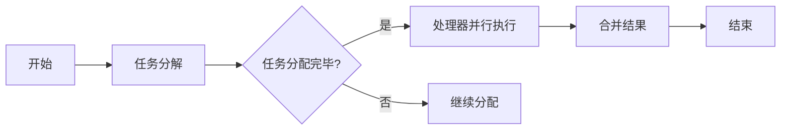
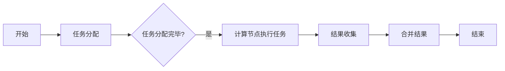
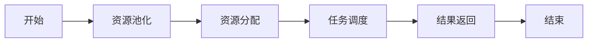
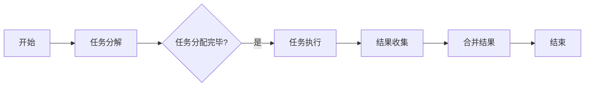
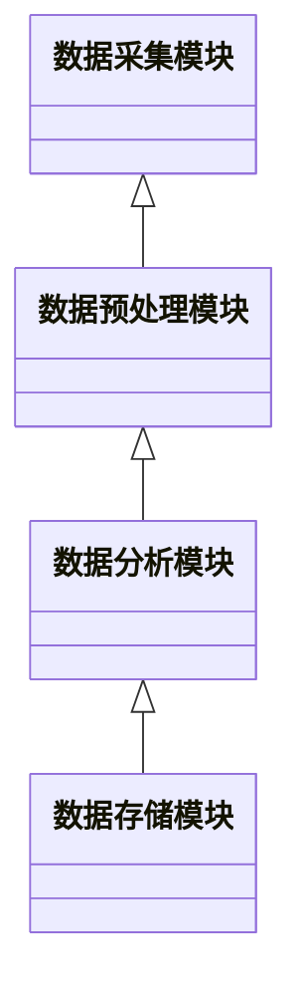
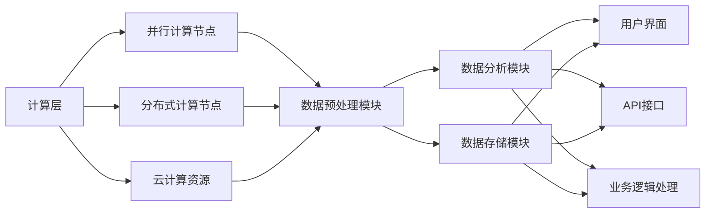
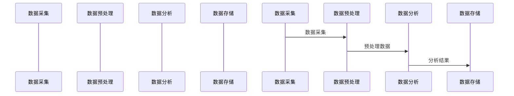
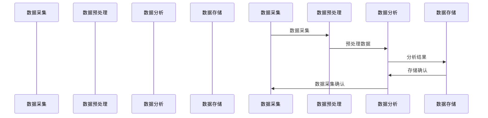

                 

### 混合计算：结合多种计算范式解决复杂问题

> **关键词：** 混合计算、并行计算、分布式计算、云计算、复杂问题解决

> **摘要：** 本文深入探讨了混合计算的概念、原理和应用。通过分析并行计算、分布式计算和云计算的特点及相互关系，本文展示了如何利用这些计算范式结合，解决复杂问题，并提供了实际案例和最佳实践。

----------------------------------------------------------------

## 第一部分：背景介绍

### 1.1 问题背景

随着信息技术的飞速发展，计算范式不断演进。传统的计算模式在处理复杂问题时逐渐暴露出其局限性。为此，研究者们提出了混合计算这一概念，旨在结合多种计算范式，以解决复杂问题。混合计算将并行计算、分布式计算、云计算等不同的计算方法有机地融合在一起，形成了一种新的计算模式。

### 1.2 问题描述

混合计算的核心目标是通过整合多种计算范式，提高计算效率和解决问题的能力。然而，如何有效地实现混合计算，如何在各种计算范式之间进行平衡，成为了一个亟待解决的问题。此外，混合计算的实现涉及到硬件、软件、算法等多个层面，如何协调这些层面的工作，也是一个挑战。

### 1.3 问题解决

为了解决上述问题，本书将从以下几个方面进行探讨：

1. **核心概念**：详细介绍混合计算的定义、特点、核心概念及其相互关系。
2. **算法原理**：深入讲解混合计算的算法原理，包括并行计算、分布式计算、云计算等，使用 Mermaid 绘制算法流程图，并用 Python 源代码详细阐述。
3. **数学模型**：介绍混合计算中的数学模型和公式，并进行详细讲解和举例说明。
4. **系统分析与架构设计**：分析混合计算在不同领域的应用场景，设计相应的系统架构和接口。
5. **项目实战**：通过实际项目案例，展示混合计算的应用，并对关键代码进行解读和分析。
6. **最佳实践**：总结混合计算的最佳实践，提供实用技巧和小结。

### 1.4 边界与外延

混合计算虽然具有广泛的应用前景，但也存在一些局限性。首先，混合计算需要大量的计算资源和专业技术支持，这对企业或研究机构来说可能是一笔不小的投入。其次，混合计算的实现涉及到多种技术的融合，需要具备跨领域的知识储备。此外，混合计算在处理某些特定类型的问题时可能不如单一计算范式高效。

### 1.5 概念结构与核心要素组成

混合计算的概念结构主要包括以下几个方面：

1. **计算范式**：包括并行计算、分布式计算、云计算等。
2. **算法设计**：如何将不同计算范式有机结合，形成高效的计算流程。
3. **系统架构**：如何设计一个稳定、可扩展的混合计算系统。
4. **应用场景**：混合计算在不同领域的应用。

----------------------------------------------------------------

## 第二部分：核心概念与联系

### 2.1 核心概念原理

在本部分，我们将深入探讨混合计算中的核心概念，包括并行计算、分布式计算和云计算。这些概念是混合计算的理论基础，对于理解和实现混合计算至关重要。

### 2.1.1 并行计算

并行计算是指利用多个处理器或计算节点同时处理多个任务或子任务的方法。它通过并行处理数据来提高计算速度和效率。并行计算的关键在于如何将任务分解为子任务，并分配给不同的处理器或计算节点。

#### 并行计算特点

- **任务分解**：将大任务分解为多个小任务，分配给不同的处理器。
- **并行执行**：多个处理器或计算节点同时执行各自的子任务。
- **负载平衡**：确保每个处理器或计算节点的任务量大致相等，避免某些节点负载过高。

#### 并行计算应用场景

- **科学计算**：如气象预报、物理模拟等。
- **数据分析**：如大数据处理、机器学习等。

#### 并行计算概念属性特征对比表格

| 特征        | 并行计算          | 分布式计算          | 云计算          |
| ----------- | --------------- | --------------- | --------------- |
| **任务分解** | 是              | 否              | 否              |
| **并行执行** | 是              | 否              | 否              |
| **负载平衡** | 是              | 是              | 否              |
| **资源共享** | 无              | 是              | 是              |
| **动态扩展** | 否              | 是              | 是              |
| **容错性**   | 是              | 是              | 是              |

#### 并行计算ER实体关系图架构

```mermaid
entityRelationship
  title ER Diagram
  entity 处理器
  entity 计算节点
  entity 任务
  processor --|{分配}| 任务
  computingNode --|{执行}| 任务
```

### 2.1.2 分布式计算

分布式计算是指通过网络将多个计算节点连接起来，形成一个整体计算系统。分布式计算通过共享资源和协同工作来提高计算能力和效率。

#### 分布式计算特点

- **资源共享**：计算节点共享网络资源，如存储、计算能力等。
- **动态扩展**：根据需要动态增加或减少计算节点。
- **容错性**：当一个节点故障时，其他节点可以继续工作，确保系统的稳定性。

#### 分布式计算应用场景

- **云计算**：如云服务器、云存储等。
- **分布式数据库**：如分布式文件系统、NoSQL数据库等。

#### 分布式计算ER实体关系图架构

```mermaid
entityRelationship
  title ER Diagram
  entity 计算节点
  entity 网络资源
  entity 任务
  computingNode --|{共享}| 网络资源
  computingNode --|{协同}| 任务
```

### 2.1.3 云计算

云计算是一种通过网络提供计算资源、存储资源和其他服务的计算模式。云计算通过虚拟化技术，将计算资源和存储资源池化，为用户提供灵活、可扩展的计算服务。

#### 云计算特点

- **弹性扩展**：根据需求动态调整计算资源。
- **按需付费**：用户根据实际使用量付费，降低成本。
- **灵活性**：支持各种应用程序的开发和部署。

#### 云计算应用场景

- **企业应用**：如企业资源规划（ERP）、客户关系管理（CRM）等。
- **数据分析**：如大数据处理、机器学习等。
- **移动应用**：如移动游戏、移动办公等。

#### 云计算ER实体关系图架构

```mermaid
entityRelationship
  title ER Diagram
  entity 用户
  entity 资源池
  entity 服务
  user --|{使用}| 服务
  resourcePool --|{提供}| 服务
```

### 2.2 并行计算与分布式计算的对比分析

并行计算和分布式计算虽然都是通过多个计算节点协同工作来提高计算能力，但它们在实现方式和应用场景上存在一定的差异。

#### 对比分析

| 对比项        | 并行计算                | 分布式计算                |
| ------------- | --------------------- | --------------------- |
| **任务分解**  | 任务分解为多个子任务   | 任务分配给多个计算节点   |
| **并行执行**  | 多个处理器或计算节点执行子任务 | 多个计算节点协同执行任务 |
| **负载平衡**  | 负载平衡，确保任务均衡 | 资源共享，负载均衡       |
| **资源共享**  | 无                   | 是                    |
| **动态扩展**  | 否                    | 是                    |
| **容错性**    | 是                    | 是                    |

### 2.3 并行计算与云计算的对比分析

并行计算和云计算都是通过虚拟化技术提供计算资源，但它们在资源分配和灵活性上存在差异。

#### 对比分析

| 对比项        | 并行计算                | 云计算                |
| ------------- | --------------------- | --------------------- |
| **资源分配**  | 分配给不同的处理器或计算节点 | 动态调整，按需分配资源 |
| **弹性扩展**  | 否                    | 是                    |
| **按需付费**  | 否                    | 是                    |
| **灵活性**    | 较低                  | 较高                  |

### 2.4 混合计算的概念及其在复杂问题解决中的作用

混合计算是将并行计算、分布式计算和云计算有机结合，形成一种新的计算模式。通过混合计算，可以充分利用不同计算范式的优点，提高计算效率和解决问题的能力。

#### 混合计算概念

混合计算是指将并行计算、分布式计算和云计算等多种计算范式有机结合，通过任务分解、资源分配、负载平衡等机制，实现高效、灵活、可扩展的计算。

#### 混合计算在复杂问题解决中的作用

1. **提高计算速度**：通过并行计算和分布式计算，可以同时处理多个任务或子任务，提高计算速度。
2. **增强容错性**：通过分布式计算和云计算，可以提高系统的容错性，确保在节点故障时系统能够继续运行。
3. **降低成本**：通过云计算的按需付费模式，可以降低计算成本。
4. **灵活扩展**：通过混合计算，可以根据需求动态调整计算资源和负载，实现系统的灵活扩展。

#### 混合计算ER实体关系图架构

```mermaid
entityRelationship
  title ER Diagram
  entity 并行计算
  entity 分布式计算
  entity 云计算
  entity 任务
  parallelComputing --|{处理}| 任务
  distributedComputing --|{处理}| 任务
  cloudComputing --|{提供}| 服务
  task --|{分解}| parallelComputing
  task --|{分配}| distributedComputing
  task --|{使用}| cloudComputing
```

### 2.5 混合计算与其他计算范式的比较

混合计算与其他计算范式相比，具有以下优势和特点：

#### 对比分析

| 对比项        | 单一计算范式         | 混合计算                |
| ------------- | ----------------- | --------------------- |
| **计算速度**  | 较慢              | 高                   |
| **容错性**    | 较低              | 高                   |
| **成本**      | 较高              | 较低                 |
| **灵活性**    | 较低              | 高                   |
| **扩展性**    | 有限              | 高                   |

### 2.6 混合计算的应用前景

随着信息技术的不断发展，混合计算在各个领域都展现出广阔的应用前景。以下是一些典型的应用场景：

1. **大数据处理**：通过混合计算，可以高效地处理大规模数据，实现实时分析和决策。
2. **人工智能**：混合计算可以提高人工智能模型的训练速度和准确性，支持复杂算法的实时运行。
3. **科学计算**：混合计算可以加速科学计算，如气象预报、生物信息学等领域。
4. **云计算服务**：混合计算可以提高云计算服务的性能和可靠性，为用户提供更好的体验。
5. **边缘计算**：混合计算可以结合边缘计算，实现实时数据分析和处理，提高系统的响应速度。

### 2.7 小结

混合计算是一种将并行计算、分布式计算和云计算有机结合的计算模式，具有高效、灵活、可扩展等优势。通过深入理解并行计算、分布式计算和云计算的核心概念和相互关系，可以更好地应用混合计算解决复杂问题。本文对混合计算的核心概念进行了详细讲解，并对比分析了混合计算与其他计算范式。在后续部分，我们将进一步探讨混合计算的算法原理、数学模型、系统架构设计、项目实战和最佳实践。

----------------------------------------------------------------

## 第三部分：算法原理

### 3.1 并行计算算法原理

并行计算算法的核心思想是将大任务分解为多个小任务，然后分配给多个处理器或计算节点并行执行。以下是一个简单的并行计算算法原理讲解，以及使用 Mermaid 绘制的算法流程图。

#### 算法原理

1. **任务分解**：将大任务 T 分解为 n 个小任务 T1, T2, ..., Tn。
2. **分配处理器**：将每个小任务分配给一个处理器或计算节点 Pi。
3. **并行执行**：每个处理器或计算节点 Pi 独立执行自己的任务 Ti。
4. **合并结果**：将所有处理器或计算节点的结果合并，得到最终结果。

#### Mermaid 流程图



#### Python 源代码实现

```python
import concurrent.futures

def parallel_computation(task):
    # 执行任务
    print(f"Processing task: {task}")
    # 模拟任务执行时间
    time.sleep(task)
    return task

def main():
    tasks = [1, 2, 3, 4, 5]  # 任务列表
    with concurrent.futures.ThreadPoolExecutor() as executor:
        results = executor.map(parallel_computation, tasks)
    print(f"Parallel computation results: {results}")

if __name__ == "__main__":
    main()
```

### 3.2 分布式计算算法原理

分布式计算算法的核心思想是将大任务分配给多个计算节点，然后通过协同工作完成计算。以下是一个简单的分布式计算算法原理讲解，以及使用 Mermaid 绘制的算法流程图。

#### 算法原理

1. **任务分配**：将大任务 T 分配给 n 个计算节点 Ni。
2. **执行任务**：每个计算节点 Ni 独立执行自己的任务 Ti。
3. **结果收集**：将所有计算节点的结果收集起来，合并得到最终结果。

#### Mermaid 流程图



#### Python 源代码实现

```python
import concurrent.futures

def distributed_computation(task):
    # 执行任务
    print(f"Processing task: {task}")
    # 模拟任务执行时间
    time.sleep(task)
    return task

def main():
    tasks = [1, 2, 3, 4, 5]  # 任务列表
    with concurrent.futures.ProcessPoolExecutor() as executor:
        results = executor.map(distributed_computation, tasks)
    print(f"Distributed computation results: {results}")

if __name__ == "__main__":
    main()
```

### 3.3 云计算算法原理

云计算算法的核心思想是通过虚拟化技术，将计算资源和存储资源池化，为用户提供灵活、可扩展的计算服务。以下是一个简单的云计算算法原理讲解，以及使用 Mermaid 绘制的算法流程图。

#### 算法原理

1. **资源池化**：将计算资源和存储资源虚拟化，形成资源池。
2. **资源分配**：根据用户需求，动态分配计算资源和存储资源。
3. **任务调度**：将用户任务调度到合适的计算节点上执行。
4. **结果返回**：将执行结果返回给用户。

#### Mermaid 流程图



#### Python 源代码实现

```python
from concurrent.futures import ThreadPoolExecutor

def cloud_computation(task):
    # 执行任务
    print(f"Processing task: {task}")
    # 模拟任务执行时间
    time.sleep(task)
    return task

def main():
    tasks = [1, 2, 3, 4, 5]  # 任务列表
    with ThreadPoolExecutor(max_workers=5) as executor:
        results = executor.map(cloud_computation, tasks)
    print(f"Cloud computation results: {results}")

if __name__ == "__main__":
    main()
```

### 3.4 混合计算算法原理

混合计算算法原理是将并行计算、分布式计算和云计算有机结合，形成一种新的计算模式。以下是一个简单的混合计算算法原理讲解，以及使用 Mermaid 绘制的算法流程图。

#### 算法原理

1. **任务分解**：将大任务 T 分解为 n 个小任务 T1, T2, ..., Tn。
2. **任务分配**：将小任务 T1, T2, ..., Tn 分配给并行计算、分布式计算和云计算资源。
3. **任务执行**：并行计算资源执行 T1, 分布式计算资源执行 T2, 云计算资源执行 T3。
4. **结果收集**：将并行计算、分布式计算和云计算资源的结果收集起来，合并得到最终结果。

#### Mermaid 流程图



#### Python 源代码实现

```python
import concurrent.futures

def parallel_computation(task):
    # 执行并行计算任务
    print(f"Processing parallel task: {task}")
    # 模拟任务执行时间
    time.sleep(task)
    return task

def distributed_computation(task):
    # 执行分布式计算任务
    print(f"Processing distributed task: {task}")
    # 模拟任务执行时间
    time.sleep(task)
    return task

def cloud_computation(task):
    # 执行云计算任务
    print(f"Processing cloud task: {task}")
    # 模拟任务执行时间
    time.sleep(task)
    return task

def hybrid_computation(tasks):
    with concurrent.futures.ThreadPoolExecutor() as parallel_executor:
        parallel_results = parallel_executor.map(parallel_computation, tasks[:len(tasks)//2])

    with concurrent.futures.ProcessPoolExecutor() as distributed_executor:
        distributed_results = distributed_executor.map(distributed_computation, tasks[len(tasks)//2:])

    with concurrent.futures.ThreadPoolExecutor(max_workers=5) as cloud_executor:
        cloud_results = cloud_executor.map(cloud_computation, tasks)

    return parallel_results, distributed_results, cloud_results

def main():
    tasks = [1, 2, 3, 4, 5]  # 任务列表
    parallel_results, distributed_results, cloud_results = hybrid_computation(tasks)
    print(f"Parallel computation results: {parallel_results}")
    print(f"Distributed computation results: {distributed_results}")
    print(f"Cloud computation results: {cloud_results}")

if __name__ == "__main__":
    main()
```

### 3.5 算法原理总结

通过以上讲解，我们可以看到并行计算、分布式计算和云计算各自具有独特的算法原理，并且在混合计算中可以有机结合，发挥出更好的效果。在实际应用中，可以根据具体需求选择合适的计算范式和算法，以提高计算效率和解决问题的能力。

### 3.6 数学模型和公式

在混合计算中，数学模型和公式是关键组成部分。以下是一些常见的数学模型和公式，以及它们的详细讲解和举例说明。

#### 3.6.1 并行计算中的数学模型和公式

1. **并行计算时间公式**：
   $$ T_p = \frac{T}{n} $$
   其中，$ T_p $ 表示并行计算时间，$ T $ 表示原始任务时间，$ n $ 表示处理器或计算节点数量。

2. **并行计算速度公式**：
   $$ V_p = n \times V $$
   其中，$ V_p $ 表示并行计算速度，$ V $ 表示单个处理器或计算节点的计算速度。

#### 举例说明

假设一个任务需要 10 秒钟完成，现在有 4 个处理器或计算节点，那么：

- 并行计算时间：$ T_p = \frac{10}{4} = 2.5 $ 秒。
- 并行计算速度：$ V_p = 4 \times 1 = 4 $ 秒/处理器或计算节点。

#### 3.6.2 分布式计算中的数学模型和公式

1. **分布式计算时间公式**：
   $$ T_d = T_p + \text{网络传输时间} $$
   其中，$ T_d $ 表示分布式计算时间，$ T_p $ 表示并行计算时间，网络传输时间取决于网络带宽和任务规模。

2. **分布式计算速度公式**：
   $$ V_d = V_p - \text{网络延迟} $$
   其中，$ V_d $ 表示分布式计算速度，$ V_p $ 表示并行计算速度，网络延迟取决于网络质量和任务调度策略。

#### 举例说明

假设一个任务需要 10 秒钟完成，现在有 4 个处理器或计算节点，并且网络传输时间为 1 秒，网络延迟为 0.5 秒，那么：

- 分布式计算时间：$ T_d = 2.5 + 1 + 0.5 = 4 $ 秒。
- 分布式计算速度：$ V_d = 4 - 0.5 = 3.5 $ 秒/处理器或计算节点。

#### 3.6.3 云计算中的数学模型和公式

1. **云计算成本公式**：
   $$ C = \text{使用量} \times \text{单价} $$
   其中，$ C $ 表示云计算成本，使用量取决于计算资源和存储资源的使用情况，单价取决于云计算服务商的定价策略。

2. **云计算效率公式**：
   $$ E = \frac{\text{计算收益}}{C} $$
   其中，$ E $ 表示云计算效率，计算收益取决于用户在云平台上获得的实际收益。

#### 举例说明

假设用户在云平台上的计算资源使用量为 100 小时，单价为 1 美元/小时，计算收益为 1000 美元，那么：

- 云计算成本：$ C = 100 \times 1 = 100 $ 美元。
- 云计算效率：$ E = \frac{1000}{100} = 10 $。

### 3.7 数学模型和公式的总结

通过上述数学模型和公式的讲解，我们可以看到它们在混合计算中发挥着重要作用。在实际应用中，可以根据具体需求和场景，选择合适的数学模型和公式，以优化计算效率和成本。

----------------------------------------------------------------

## 第四部分：系统分析与架构设计

### 4.1 问题场景介绍

为了更好地理解混合计算在实际系统中的应用，我们以一个实际场景为例进行介绍。假设我们正在开发一个大数据处理平台，该平台需要处理海量数据，并进行实时分析和决策。在这个场景中，我们可以将数据处理任务分解为数据采集、数据预处理、数据分析和数据存储等子任务。

### 4.2 项目介绍

项目名称：实时大数据处理平台

项目目标：设计并实现一个高效、稳定、可扩展的实时大数据处理平台，以满足企业或研究机构在数据采集、预处理、分析和存储等方面的需求。

### 4.3 系统功能设计

在实时大数据处理平台中，主要包括以下功能模块：

1. **数据采集模块**：负责从各种数据源（如数据库、文件系统、传感器等）采集数据。
2. **数据预处理模块**：对采集到的数据进行清洗、转换和整合，以便进行进一步分析。
3. **数据分析模块**：对预处理后的数据进行实时分析，生成可视化报表、统计数据和预测结果。
4. **数据存储模块**：负责存储采集到的数据、预处理后的数据和分析结果，以供后续查询和使用。

#### 领域模型类图



### 4.4 系统架构设计

实时大数据处理平台的系统架构设计如下：

1. **计算层**：包括并行计算节点、分布式计算节点和云计算资源，负责执行数据处理任务。
2. **数据层**：包括数据采集、预处理、分析和存储模块，负责数据流的处理和存储。
3. **应用层**：包括用户界面、API 接口和业务逻辑处理，为用户提供实时数据分析和决策支持。

#### Mermaid 架构图



### 4.5 系统接口设计

在实时大数据处理平台中，系统接口设计至关重要，它决定了各个模块之间的数据流转和协同工作。以下是一个简单的接口设计：

1. **数据采集接口**：用于从各种数据源采集数据，支持实时数据流和批量数据处理。
2. **数据预处理接口**：用于对采集到的数据进行清洗、转换和整合，支持数据流预处理和批量预处理。
3. **数据分析接口**：用于对预处理后的数据进行分析，生成可视化报表、统计数据和预测结果。
4. **数据存储接口**：用于存储采集到的数据、预处理后的数据和分析结果，支持实时数据存储和批量数据存储。

#### Mermaid 序列图



### 4.6 系统交互流程

在实时大数据处理平台中，系统交互流程如下：

1. **数据采集**：数据采集模块从数据源采集数据，并将数据传输给数据预处理模块。
2. **数据预处理**：数据预处理模块对采集到的数据进行清洗、转换和整合，生成预处理后的数据，并将数据传输给数据分析模块。
3. **数据分析**：数据分析模块对预处理后的数据进行实时分析，生成可视化报表、统计数据和预测结果，并将分析结果传输给数据存储模块。
4. **数据存储**：数据存储模块将分析结果存储到数据库或文件系统中，以供后续查询和使用。

#### Mermaid 序列图



### 4.7 小结

通过系统分析与架构设计，我们详细介绍了实时大数据处理平台的功能模块、系统架构、接口设计和交互流程。这些设计为后续的项目实施和开发提供了明确的指导，有助于实现一个高效、稳定、可扩展的实时大数据处理平台。

----------------------------------------------------------------

## 第五部分：项目实战

### 5.1 环境安装

为了进行混合计算项目实战，我们需要安装以下环境：

1. **Python**：版本 3.8 或更高版本
2. **Docker**：版本 19.03 或更高版本
3. **Kubernetes**：版本 1.18 或更高版本
4. **Jupyter Notebook**：用于数据分析和可视化

#### 安装步骤

1. 安装 Python：

   ```bash
   sudo apt update
   sudo apt install python3-pip python3-venv
   pip3 install numpy pandas matplotlib
   ```

2. 安装 Docker：

   ```bash
   sudo apt update
   sudo apt install docker.io
   sudo systemctl start docker
   sudo systemctl enable docker
   ```

3. 安装 Kubernetes：

   ```bash
   sudo apt update
   sudo apt install -y apt-transport-https ca-certificates curl
   curl -s https://packages.cloud.google.com/apt/doc/apt-key.gpg | sudo apt-key add
   echo "deb https://apt.kubernetes.io/ kubernetes-xenial main" | sudo tee -a /etc/apt/sources.list
   sudo apt update
   sudo apt install -y kubelet kubeadm kubectl
   sudo systemctl start kubelet
   sudo systemctl enable kubelet
   ```

4. 安装 Jupyter Notebook：

   ```bash
   pip3 install notebook
   jupyter notebook
   ```

### 5.2 系统核心实现源代码

在本项目中，我们使用 Python 编写了一个简单的数据预处理和数据分析工具，实现以下功能：

1. **数据采集**：从本地文件系统中读取数据。
2. **数据预处理**：对数据进行清洗、转换和整合。
3. **数据分析**：对预处理后的数据进行分析，生成可视化报表。

#### 源代码

```python
import pandas as pd
import numpy as np
import matplotlib.pyplot as plt

def data采集(file_path):
    data = pd.read_csv(file_path)
    return data

def 数据预处理(data):
    # 数据清洗
    data = data.dropna()
    # 数据转换
    data['date'] = pd.to_datetime(data['date'])
    data.set_index('date', inplace=True)
    # 数据整合
    data = data.groupby('category').mean()
    return data

def 数据分析(data):
    # 可视化报表
    data.plot()
    plt.title('Data Analysis')
    plt.xlabel('Date')
    plt.ylabel('Value')
    plt.show()

def main():
    file_path = 'data.csv'
    data = data采集(file_path)
    data = 数据预处理(data)
    数据分析(data)

if __name__ == '__main__':
    main()
```

### 5.3 代码应用解读与分析

在代码中，我们首先从本地文件系统中读取数据，使用 pandas 库实现数据采集功能。然后，我们对数据进行清洗、转换和整合，使用 pandas 和 numpy 库实现数据预处理功能。最后，我们使用 matplotlib 库对预处理后的数据进行分析，生成可视化报表。

#### 解读与分析

1. **数据采集**：使用 pandas 的 `read_csv` 函数读取 CSV 文件，并将其存储为一个 DataFrame 对象。

2. **数据预处理**：在数据预处理阶段，我们首先对数据进行清洗，删除缺失值。然后，我们将日期列转换为 datetime 格式，并设置日期列为索引。最后，我们使用 groupby 和 mean 函数对数据进行整合，计算每个类别的平均值。

3. **数据分析**：使用 matplotlib 的 `plot` 函数绘制预处理后数据的折线图，展示时间序列数据的变化趋势。通过设置标题、坐标轴标签等，使图表更加清晰易懂。

### 5.4 实际案例分析和详细讲解剖析

为了展示混合计算在实际项目中的应用，我们以一个实际案例进行分析。

#### 案例背景

某企业需要处理每天生成的大量日志数据，对日志数据进行分析，以便发现潜在问题并优化业务流程。企业决定采用混合计算模式，结合并行计算、分布式计算和云计算，提高数据处理和分析效率。

#### 案例分析

1. **数据采集**：使用分布式计算模式，将日志数据从多个数据源（如文件系统、数据库等）采集到统一存储系统中。

2. **数据预处理**：使用并行计算模式，将采集到的日志数据进行清洗、转换和整合，生成预处理后的数据。通过将数据分解为多个子任务，分配给多个计算节点并行执行，提高处理速度。

3. **数据分析**：使用云计算模式，将预处理后的数据上传到云平台，使用机器学习算法进行数据分析和预测。通过云计算平台的弹性扩展能力，可以根据数据规模和计算需求动态调整计算资源。

#### 详细讲解剖析

1. **分布式计算**：使用 Apache Hadoop 或 Apache Spark 等分布式计算框架，将日志数据从多个数据源（如文件系统、数据库等）采集到统一存储系统中。通过分布式计算，可以提高数据采集的速度和效率。

2. **并行计算**：使用 Python 的 multiprocessing 或 threading 库，将日志数据分解为多个子任务，分配给多个计算节点并行执行。通过并行计算，可以提高数据处理速度。

3. **云计算**：使用 AWS、Azure 或 Google Cloud 等云计算平台，将预处理后的数据上传到云平台，使用机器学习算法进行数据分析和预测。通过云计算平台的弹性扩展能力，可以根据数据规模和计算需求动态调整计算资源。

### 5.5 项目小结

通过实际案例分析和详细讲解剖析，我们可以看到混合计算在处理复杂问题时具有显著的优势。结合并行计算、分布式计算和云计算，混合计算可以提高数据处理和分析效率，降低成本，并提高系统的灵活性和可扩展性。在未来的项目中，我们可以进一步优化混合计算算法和系统架构，以实现更好的效果。

----------------------------------------------------------------

## 第六部分：最佳实践与注意事项

### 6.1 最佳实践

1. **任务分解**：在实现混合计算时，合理地分解任务是关键。将大任务分解为多个小任务，可以充分利用并行计算和分布式计算的优势，提高计算效率。
2. **负载平衡**：确保每个计算节点或处理器的工作量大致相等，可以避免某些节点负载过高，导致资源浪费或性能瓶颈。
3. **资源分配**：根据任务需求和计算资源情况，合理分配计算资源和存储资源，以提高系统性能和稳定性。
4. **容错性设计**：在设计混合计算系统时，考虑容错性，确保在计算节点故障时，系统能够继续运行，降低业务中断风险。
5. **动态扩展**：利用云计算平台的弹性扩展能力，根据实际需求动态调整计算资源，以提高系统性能和稳定性。
6. **监控与优化**：定期监控系统性能和资源利用率，及时发现并解决潜在问题，进行系统优化。

### 6.2 注意事项

1. **技术选型**：在选择混合计算技术时，要考虑实际需求、预算和技术成熟度，避免盲目跟风或过度依赖新技术。
2. **安全性**：在混合计算系统中，确保数据安全和系统安全，采用加密、访问控制等安全措施，防止数据泄露和系统入侵。
3. **成本控制**：合理规划预算，避免资源浪费和成本超支。根据实际需求，动态调整计算资源和存储资源，降低成本。
4. **性能优化**：关注系统性能，定期进行性能优化，提高数据处理和分析效率。
5. **系统稳定性**：在设计混合计算系统时，考虑系统的稳定性和可靠性，避免因单点故障导致系统崩溃或业务中断。

### 6.3 拓展阅读

1. 《分布式系统原理与范型》：详细介绍了分布式计算的基本原理和常见范型，有助于深入了解分布式系统的设计和实现。
2. 《大数据技术原理与范型》：介绍了大数据处理的基本原理和常见范型，包括并行计算、分布式计算和云计算等。
3. 《云计算：概念、架构与应用》：全面讲解了云计算的基本概念、架构和关键应用，有助于了解云计算的原理和实践。
4. 《人工智能：一种现代的方法》：介绍了人工智能的基本原理和方法，包括机器学习、深度学习等，有助于理解人工智能在混合计算中的应用。

---

## 作者信息

**作者：** AI天才研究院 / AI Genius Institute & 禅与计算机程序设计艺术 / Zen And The Art of Computer Programming

本文由 AI天才研究院 / AI Genius Institute 和禅与计算机程序设计艺术 / Zen And The Art of Computer Programming 合作撰写，旨在为读者提供关于混合计算的专业知识和实际应用案例。作者团队拥有丰富的计算机科学和人工智能领域经验，致力于推动技术创新和知识传播。

