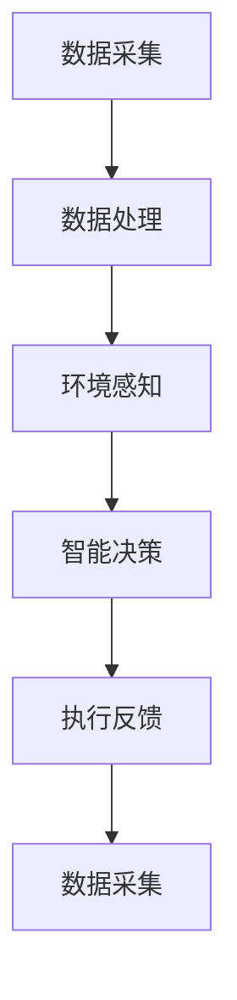
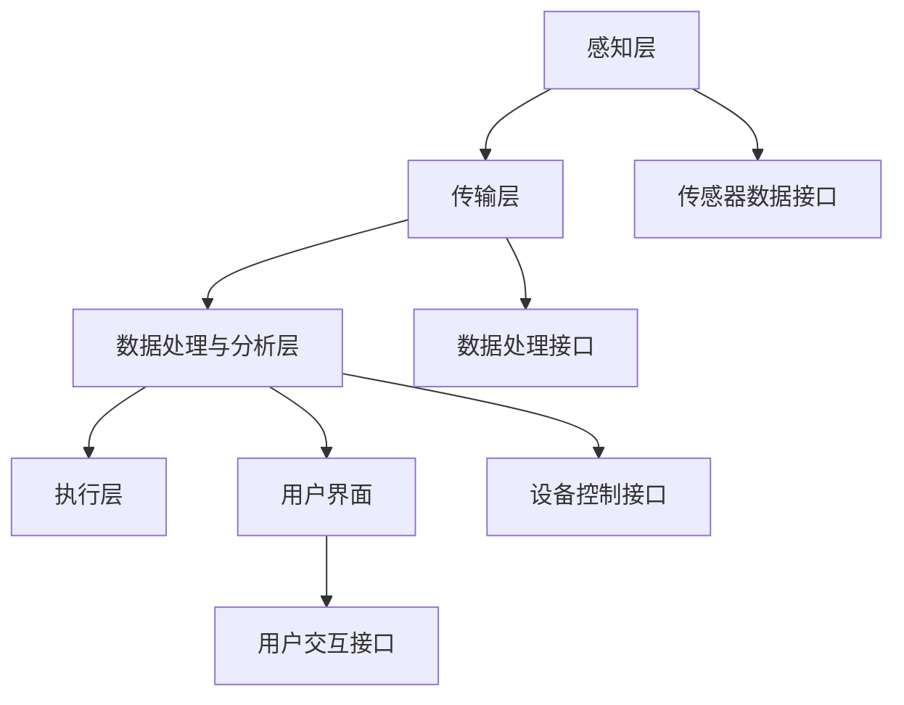

                 

# 物联网与环境隐形智能的融合

> 关键词：物联网，环境隐形智能，融合技术，智能交互，数据共享，应用场景，实现方法

> 摘要：本文旨在探讨物联网与环境隐形智能的融合技术，分析其核心概念、原理与应用，同时提供系统分析与架构设计方案，以期为读者呈现一个全面、深入的视角。

----------------------------------------------------------------

## 第一部分：引言

### 1.1 问题背景与问题描述

#### 1.1.1 物联网的崛起
随着信息技术的飞速发展，物联网（Internet of Things，IoT）逐渐成为现代社会的重要组成部分。物联网通过将各种物理设备、传感器、软件和网络连接起来，实现了设备之间的智能交互和数据共享，大大提升了生产效率和生活质量。

物联网的发展历程可以追溯到20世纪80年代，当时一些科研机构开始尝试将物理设备通过网络进行连接。进入21世纪，随着互联网、无线通信和嵌入式技术的发展，物联网迎来了快速发展期。现在，物联网已经广泛应用于智能家居、智能交通、智能工业、智能医疗等领域。

#### 1.1.2 环境隐形智能的兴起
环境隐形智能是一种新兴的技术，它通过将智能算法嵌入到日常环境中，使环境能够自适应地响应用户的需求和行为。这种技术已经在智能家居、智能城市、智能医疗等领域取得了显著的应用成果。

环境隐形智能的起源可以追溯到人工智能领域的早期研究。随着深度学习和计算机视觉等技术的发展，环境感知和智能决策逐渐成为可能。近年来，随着物联网技术的普及，环境隐形智能得到了广泛的应用，成为提升生活质量的重要手段。

#### 1.1.3 物联网与环境隐形智能的融合
物联网与环境隐形智能的融合，旨在构建一种更加智能、高效、便捷的生活和工作环境。通过将物联网技术应用于环境隐形智能，可以实现对环境信息的实时采集、分析和处理，从而实现环境的智能化管理和优化。

物联网与环境隐形智能的融合具有以下优势：

1. 提高生活质量：通过智能设备和环境感知，可以实现家庭自动化、智能化，为用户提供更加舒适、便捷的生活环境。
2. 提升生产效率：在工业、农业等领域，物联网与环境隐形智能的融合可以实现对生产过程的实时监控、分析和优化，提高生产效率。
3. 改善城市管理：通过物联网与环境隐形智能的融合，可以实现智能交通管理、环境监测、公共安全等，提高城市管理水平和居民生活质量。
4. 促进医疗健康：在医疗领域，物联网与环境隐形智能的融合可以实现对患者健康数据的实时监测、分析和预警，提高医疗服务水平和患者满意度。

### 1.2 问题解决与边界外延

#### 1.2.1 问题解决
本书将探讨物联网与环境隐形智能的融合技术，包括核心技术、应用场景、实现方法等，旨在为读者提供一套完整的理论和实践指导。

本书主要解决以下问题：

1. 物联网与环境隐形智能的核心技术是什么？
2. 物联网与环境隐形智能的融合应用场景有哪些？
3. 物联网与环境隐形智能的实现方法有哪些？
4. 物联网与环境隐形智能在各个领域的应用效果如何？

#### 1.2.2 边界外延
本书主要关注物联网与环境隐形智能的融合技术，但涉及的内容不仅限于技术层面，还包括政策、标准、安全、隐私等方面，以全面覆盖这一领域的各个方面。

### 1.3 概念结构与核心要素组成

#### 1.3.1 物联网（IoT）
物联网是指通过互联网将各种物理设备连接起来，实现数据传输和智能控制的技术体系。其核心要素包括传感器、网络、平台和设备。

1. **传感器**：用于采集环境数据，如温度、湿度、光照等。
2. **网络**：用于传输数据，包括有线和无线网络。
3. **平台**：用于处理和分析数据，实现智能决策。
4. **设备**：包括各种物理设备，如智能家居设备、工业设备、农业设备等。

#### 1.3.2 环境隐形智能
环境隐形智能是指通过智能算法和环境感知技术，使环境能够自动适应用户需求和行为的智能系统。其核心要素包括感知模块、决策模块和执行模块。

1. **感知模块**：通过传感器实时采集环境数据，如用户行为、环境状态等。
2. **决策模块**：利用机器学习、人工智能等技术对环境数据进行处理和分析，生成适应环境的决策。
3. **执行模块**：根据决策结果，执行相应的操作，如调整环境参数、控制设备等。

### 1.4 核心概念原理

#### 1.4.1 物联网核心技术
- **传感器技术**：用于采集环境数据，如温度、湿度、光照等。
- **网络技术**：用于传输数据，包括有线和无线网络。
- **平台技术**：用于处理和分析数据，实现智能决策。

#### 1.4.2 环境隐形智能核心原理
- **环境感知**：通过传感器实时采集环境数据，如用户行为、环境状态等。
- **智能决策**：利用机器学习、人工智能等技术对环境数据进行处理和分析，生成适应环境的决策。
- **执行反馈**：根据决策结果，执行相应的操作，如调整环境参数、控制设备等。

#### 1.4.3 物联网与环境隐形智能融合原理
- **数据采集**：通过物联网技术，实时采集环境数据。
- **数据处理**：通过环境隐形智能技术，对采集到的环境数据进行分析和处理。
- **决策执行**：根据分析结果，执行相应的决策，实现环境自适应调整。

### 1.5 概念属性特征对比表格

| 概念       | 属性特征                                                                                     |
|------------|---------------------------------------------------------------------------------------------|
| 物联网     | 数据采集、传输、处理与控制                                                                   |
| 环境隐形智能 | 环境感知、智能决策、执行反馈与自适应调整                                                       |

### 1.6 ER实体关系图架构

```mermaid
erDiagram
  User ||--|{ Device }||>
  Device ||--|{ Sensor }||>
  Sensor ||--|{ Data }||>
  Data ||--|{ Analysis }||>
  Analysis ||--|{ Decision }||>
  Decision ||--|{ Action }||>
  Action ||--|{ Feedback }||>
```

### 1.7 总结
在本部分中，我们介绍了物联网与环境隐形智能的融合背景、核心概念、原理以及技术架构。通过本部分的学习，读者可以初步了解物联网与环境隐形智能的融合技术，为后续章节的深入学习打下基础。

----------------------------------------------------------------

## 第二部分：物联网技术基础

### 2.1 物联网概述

#### 2.1.1 物联网的定义与发展历程

#### 2.1.1.1 物联网的定义
物联网（Internet of Things，IoT）是指通过互联网将各种物理设备连接起来，实现设备之间信息的交换和通信的系统。物联网的核心在于通过网络将物理世界中的设备、传感器、系统和服务进行连接，从而实现智能化的管理和控制。

#### 2.1.1.2 物联网的发展历程
物联网的发展历程可以分为以下几个阶段：

1. **概念提出阶段（1999年）**：物联网概念由麻省理工学院的Kevin Ashton首次提出。
2. **技术探索阶段（2005年-2010年）**：物联网技术开始逐步发展，各种传感器和通信技术逐渐成熟。
3. **应用推广阶段（2010年至今）**：随着互联网、无线通信、云计算等技术的普及，物联网应用逐渐渗透到各行各业，成为信息化建设的重要组成部分。

#### 2.1.2 物联网的核心架构

物联网的核心架构通常包括以下几个层次：

1. **感知层**：感知层是物联网系统的最底层，主要负责数据的采集和初步处理。主要包括各种传感器、RFID（射频识别）技术、二维码技术等。
2. **网络层**：网络层负责数据的传输和通信。物联网设备通过有线或无线网络连接，实现数据的传输和共享。常见的网络层协议包括Wi-Fi、蓝牙、ZigBee、LoRa等。
3. **平台层**：平台层是物联网系统的核心，主要负责数据的处理、存储、分析和应用。平台层通常包括数据管理、数据分析和应用开发等功能。
4. **应用层**：应用层是物联网系统的最高层，直接面向用户，提供各种物联网应用和服务。应用层包括智能家居、智能交通、智能医疗、智能工业等。

#### 2.1.3 物联网的关键技术

物联网的关键技术主要包括以下几个方面：

1. **传感器技术**：传感器技术是物联网系统的核心，用于采集各种环境参数和物理量，如温度、湿度、光照、气体浓度等。
2. **网络通信技术**：网络通信技术是物联网系统的传输基础，包括有线和无线通信技术，如Wi-Fi、蓝牙、ZigBee、LoRa等。
3. **数据处理与分析技术**：数据处理与分析技术是物联网系统的核心，包括数据采集、传输、存储、处理和分析等，如云计算、大数据技术、人工智能等。
4. **嵌入式系统技术**：嵌入式系统技术是物联网设备的重要组成部分，用于实现设备的智能化控制和数据处理。
5. **安全与隐私保护技术**：随着物联网应用的普及，安全与隐私保护成为物联网系统的重要挑战，需要采取一系列技术措施来保障系统的安全性和用户隐私。

### 2.2 物联网网络协议

#### 2.2.1 物联网网络协议概述
物联网网络协议是物联网系统中用于数据传输和通信的标准和规范。常见的物联网网络协议包括Wi-Fi、蓝牙、ZigBee、LoRa等。

#### 2.2.2 Wi-Fi
Wi-Fi（无线保真）是一种流行的无线局域网（WLAN）通信技术，基于IEEE 802.11标准。Wi-Fi具有高速、稳定、覆盖范围广等优点，广泛应用于智能家居、智能办公、智能交通等领域。

#### 2.2.3 蓝牙
蓝牙（Bluetooth）是一种短距离无线通信技术，基于IEEE 802.15.1标准。蓝牙具有低功耗、低成本、易实现等优点，广泛应用于智能家居、智能穿戴、智能医疗等领域。

#### 2.2.4 ZigBee
ZigBee是一种低功耗、低速率的无线通信技术，基于IEEE 802.15.4标准。ZigBee具有低成本、高可靠性和良好的扩展性等优点，广泛应用于智能家居、智能照明、智能农业等领域。

#### 2.2.5 LoRa
LoRa（长距离无线电）是一种基于扩频技术的无线通信技术，具有长距离、低功耗、高可靠性等优点。LoRa适用于广域网场景，如远程监控、智能农业、智能交通等领域。

### 2.3 物联网平台技术

#### 2.3.1 物联网平台概述
物联网平台是物联网系统的核心组成部分，负责数据的采集、传输、存储、处理和分析等。物联网平台通常包括以下几个关键功能：

1. **数据采集**：物联网平台通过传感器、网关等设备采集各种环境数据，如温度、湿度、光照、气体浓度等。
2. **数据传输**：物联网平台通过无线或有线网络将采集到的数据传输到云平台或本地服务器进行存储和处理。
3. **数据存储**：物联网平台负责存储大量的传感器数据，以便进行历史数据的查询和分析。
4. **数据处理**：物联网平台利用大数据技术、人工智能技术等对传感器数据进行处理和分析，提取有价值的信息。
5. **数据可视化**：物联网平台通过图表、报表等形式将处理后的数据可视化，为用户提供直观的数据展示。
6. **应用开发**：物联网平台提供丰富的开发接口和工具，支持用户开发各种物联网应用。

#### 2.3.2 常见的物联网平台
目前，市场上存在多种物联网平台，如AWS IoT、Azure IoT、Google Cloud IoT、阿里云物联网平台等。以下是几个常见的物联网平台：

1. **AWS IoT**：亚马逊云服务提供的物联网平台，支持设备连接、数据传输、数据处理等功能。
2. **Azure IoT**：微软云服务提供的物联网平台，具有强大的数据存储和处理能力，支持各种开发语言和工具。
3. **Google Cloud IoT**：谷歌云服务提供的物联网平台，提供设备管理、数据分析和应用开发等功能。
4. **阿里云物联网平台**：阿里云提供的物联网平台，支持设备连接、数据传输、数据处理和分析等功能，广泛应用于智能家居、智能工业等领域。

### 2.4 物联网设备

#### 2.4.1 物联网设备概述
物联网设备是指具备物联网功能的硬件设备，如传感器、网关、智能终端等。物联网设备通过连接网络，实现数据的采集、传输和处理。

#### 2.4.2 常见的物联网设备
常见的物联网设备包括：

1. **传感器**：用于采集环境数据，如温度传感器、湿度传感器、光照传感器、气体传感器等。
2. **网关**：用于连接传感器和互联网，实现数据的采集、传输和处理。
3. **智能终端**：如智能手机、平板电脑、智能手表等，可以通过应用程序与物联网平台进行交互，实现对设备的远程控制和监控。
4. **智能控制器**：如智能插座、智能灯泡、智能门锁等，可以通过物联网平台实现智能控制和自动化操作。

### 2.5 物联网安全与隐私保护
随着物联网应用的普及，物联网安全与隐私保护成为重要的议题。物联网安全主要包括以下几个方面：

1. **数据安全**：保护传感器采集的数据在传输和存储过程中的安全性，防止数据泄露、篡改和丢失。
2. **设备安全**：保护物联网设备免受恶意攻击，如设备被远程控制、设备数据被窃取等。
3. **网络安全**：保护物联网设备连接的网络，防止网络攻击和数据泄露。

物联网隐私保护主要包括以下几个方面：

1. **数据隐私**：保护用户个人信息的安全，防止个人信息被滥用。
2. **通信隐私**：保护物联网设备之间的通信隐私，防止通信内容被窃听。
3. **设备隐私**：保护物联网设备的隐私，防止设备被滥用。

### 2.6 物联网在各个领域的应用
物联网技术已经在各个领域得到广泛应用，以下是一些典型的应用场景：

1. **智能家居**：通过物联网技术，实现家庭设备的互联互通，提供智能化、便捷化的生活体验。
2. **智能交通**：通过物联网技术，实现交通信息的实时采集、传输和处理，提高交通管理水平和效率。
3. **智能工业**：通过物联网技术，实现生产设备的联网和智能化管理，提高生产效率和质量。
4. **智能医疗**：通过物联网技术，实现医疗设备和患者的互联互通，提供个性化、智能化的医疗服务。
5. **智能农业**：通过物联网技术，实现农田、作物、灌溉设备的智能化管理，提高农业生产效率和品质。

### 2.7 总结
在本部分中，我们介绍了物联网的定义、发展历程、核心架构、关键技术、网络协议、平台技术、设备、安全与隐私保护以及在各个领域的应用。通过本部分的学习，读者可以全面了解物联网的基本概念和技术，为后续章节的深入学习打下基础。

----------------------------------------------------------------

## 第三部分：环境隐形智能技术基础

### 3.1 环境隐形智能概述

#### 3.1.1 环境隐形智能的定义
环境隐形智能是一种通过智能算法和环境感知技术，使环境能够自动适应用户需求和行为的智能系统。它旨在提升人类生活质量，提高工作效率，减少能源消耗，实现环境与人的和谐共生。

#### 3.1.2 环境隐形智能的发展历程
环境隐形智能的发展可以追溯到20世纪80年代，当时人工智能技术开始逐渐应用于智能家居、智能办公等领域。随着传感器技术、人工智能技术、物联网技术的不断发展，环境隐形智能逐渐成为一个独立的研究领域。

1. **初级阶段（20世纪80年代-20世纪90年代）**：在这一阶段，环境隐形智能主要集中于简单的家庭自动化应用，如自动灯光控制、自动温控等。
2. **发展阶段（21世纪初至今）**：随着人工智能技术的进步，环境隐形智能逐渐融合了更复杂的智能算法和更广泛的感知技术，应用范围扩展到了智能建筑、智能城市、智能医疗等领域。

#### 3.1.3 环境隐形智能的核心技术
环境隐形智能的核心技术包括环境感知、智能决策和执行反馈三个部分。

1. **环境感知**：通过各种传感器实时采集环境数据，如温度、湿度、光照、声音、气味等，实现对环境的全面感知。
2. **智能决策**：利用机器学习、深度学习等人工智能技术对环境数据进行处理和分析，生成适应环境的智能决策。
3. **执行反馈**：根据智能决策的结果，执行相应的操作，如调整环境参数、控制设备等，并收集反馈信息，用于进一步优化决策。

### 3.2 环境感知技术

#### 3.2.1 传感器技术
环境感知技术的基础是传感器技术。传感器是能够检测和测量各种物理量并将其转化为电信号的装置。根据被测量的物理量不同，传感器可以分为以下几类：

1. **温度传感器**：用于测量环境温度，如热电偶、热敏电阻等。
2. **湿度传感器**：用于测量环境湿度，如电容式湿度传感器、电阻式湿度传感器等。
3. **光照传感器**：用于测量环境光照强度，如光敏电阻、光电二极管等。
4. **声音传感器**：用于测量环境声音，如麦克风、声波传感器等。
5. **气体传感器**：用于测量环境中特定气体的浓度，如气体传感器模块、气体检测仪等。
6. **位置传感器**：用于测量物体的位置，如GPS模块、超声波传感器等。

#### 3.2.2 感知模块设计
感知模块的设计需要考虑传感器的选择、数据采集和预处理。以下是一个简单的感知模块设计流程：

1. **传感器选择**：根据应用场景选择合适的传感器，如智能家居中可能需要温度传感器、湿度传感器、光照传感器等。
2. **数据采集**：将传感器采集到的数据通过接口（如I2C、SPI、UART等）传输到微控制器或单片机。
3. **数据预处理**：对采集到的原始数据进行滤波、去噪、量化和标准化等处理，以便后续的智能决策。

### 3.3 智能决策技术

#### 3.3.1 机器学习技术
智能决策的核心是机器学习技术。机器学习是一种通过数据驱动的方式，使计算机能够从经验中学习并做出预测或决策的技术。常见的机器学习算法包括：

1. **监督学习**：通过已有数据集进行训练，使模型能够对新数据进行分类或回归。
2. **无监督学习**：通过未标记的数据集，使模型能够自动发现数据中的模式或结构。
3. **强化学习**：通过与环境交互，使模型能够学习最优策略。

#### 3.3.2 智能算法应用
智能决策技术可以应用于环境参数的预测、优化和自适应调整。以下是一个简单的智能算法应用示例：

1. **环境参数预测**：使用时间序列分析或回归模型预测未来一段时间内的环境参数。
2. **优化**：使用优化算法，如遗传算法、粒子群优化等，找到最优的环境参数设置。
3. **自适应调整**：根据实时采集的环境数据，自动调整环境参数，实现环境的自适应优化。

### 3.4 执行反馈技术

#### 3.4.1 执行模块设计
执行模块负责根据智能决策的结果执行相应的操作。执行模块的设计需要考虑执行机构的类型、控制策略和数据反馈。以下是一个简单的执行模块设计流程：

1. **执行机构选择**：根据执行任务的需求选择合适的执行机构，如电机、电磁阀、加热器等。
2. **控制策略设计**：设计合适的控制策略，使执行机构能够根据智能决策的结果进行精确操作。
3. **数据反馈**：收集执行结果的数据，如执行时间、执行效率等，用于进一步优化决策。

#### 3.4.2 执行反馈机制
执行反馈机制是环境隐形智能系统的重要组成部分。通过执行反馈，系统能够不断优化自身的行为，提高环境适应性。以下是一个简单的执行反馈机制：

1. **执行**：根据智能决策的结果，执行相应的操作。
2. **反馈**：收集执行结果的数据，并与预期目标进行比较。
3. **调整**：根据反馈结果，对决策过程进行调整，以实现更好的执行效果。

### 3.5 环境隐形智能的应用场景
环境隐形智能在多个领域都有广泛的应用，以下是一些典型的应用场景：

1. **智能家居**：通过环境隐形智能技术，实现家庭设备的智能化控制，提供舒适、便捷的生活环境。
2. **智能办公**：通过环境隐形智能技术，实现办公环境的智能化管理，提高工作效率和员工满意度。
3. **智能城市**：通过环境隐形智能技术，实现城市管理的智能化，提高城市运行效率和居民生活质量。
4. **智能医疗**：通过环境隐形智能技术，实现医疗服务的智能化，提高医疗服务水平和患者体验。
5. **智能农业**：通过环境隐形智能技术，实现农田管理的智能化，提高农业生产效率和农产品品质。

### 3.6 总结
在本部分中，我们介绍了环境隐形智能的定义、发展历程、核心技术、感知模块设计、智能决策技术、执行反馈技术和应用场景。通过本部分的学习，读者可以深入了解环境隐形智能的基本概念和技术，为后续章节的深入学习打下基础。

----------------------------------------------------------------

## 第四部分：物联网与环境隐形智能的融合技术

### 4.1 物联网与环境隐形智能融合的意义

#### 4.1.1 融合背景
随着物联网和环境隐形智能技术的不断发展，两者之间的融合已经成为当前技术研究和应用的热点。物联网提供了大量的传感器数据和环境信息，而环境隐形智能则能够基于这些数据实现智能化决策和自适应调整。两者的融合不仅能够提升系统的智能化水平，还能带来以下几个方面的优势：

1. **提高生活质量**：通过物联网与环境隐形智能的融合，可以实现家庭设备的互联互通，为用户提供个性化、智能化的生活体验。
2. **提升生产效率**：在工业、农业等领域，物联网与环境隐形智能的融合可以实现生产过程的实时监控和优化，提高生产效率和质量。
3. **改善城市管理**：物联网与环境隐形智能的融合可以实现智能交通、环境监测、公共安全等，提高城市管理水平和居民生活质量。
4. **促进医疗健康**：在医疗领域，物联网与环境隐形智能的融合可以实现对患者健康数据的实时监测和预警，提高医疗服务水平和患者满意度。

#### 4.1.2 融合挑战
尽管物联网与环境隐形智能的融合带来了很多优势，但在实际应用过程中也面临着一些挑战：

1. **数据安全与隐私保护**：随着数据的采集和传输，如何确保数据的安全和用户隐私是一个重要问题。
2. **系统复杂性与稳定性**：融合后的系统通常更加复杂，如何保证系统的稳定运行是一个重要挑战。
3. **标准化与兼容性**：不同厂商、不同技术之间的标准化和兼容性问题，会影响融合技术的广泛应用。
4. **能耗与管理成本**：物联网和环境隐形智能设备的广泛部署，会带来能耗和管理的成本问题。

### 4.2 物联网与环境隐形智能融合的核心技术

#### 4.2.1 数据采集与传输技术
物联网与环境隐形智能融合的核心在于数据的采集与传输。数据采集技术主要涉及传感器技术的选择和部署，包括温度传感器、湿度传感器、光照传感器、气体传感器等。传输技术则需要保证数据的高效、稳定传输，常用的传输技术有Wi-Fi、蓝牙、ZigBee、LoRa等。

#### 4.2.2 数据处理与分析技术
数据采集后，需要进行有效的处理与分析。数据处理技术包括数据的清洗、去噪、融合等，而数据分析技术则主要利用机器学习、深度学习等算法对数据进行挖掘和建模，提取有价值的信息。

#### 4.2.3 智能决策与执行反馈技术
智能决策技术是融合技术的核心，通过处理和分析数据，系统可以生成智能决策，调整环境参数或控制设备。执行反馈技术则负责将决策结果转化为实际操作，并通过反馈机制不断优化决策。

### 4.3 物联网与环境隐形智能融合的应用场景

#### 4.3.1 智能家居
智能家居是物联网与环境隐形智能融合的重要应用场景之一。通过将物联网传感器与智能算法相结合，可以实现家庭设备的自动化控制和智能化管理。例如，智能空调可以根据室内温度和用户习惯自动调节温度，智能照明可以根据光照强度和用户需求自动调节亮度。

#### 4.3.2 智能交通
智能交通系统通过物联网传感器采集交通数据，结合环境隐形智能技术，可以实现交通流量监测、路况预测、智能调度等功能。例如，智能交通系统可以根据实时交通数据预测交通拥堵情况，并提前给出最优路线建议，从而减少交通拥堵，提高出行效率。

#### 4.3.3 智能医疗
智能医疗是物联网与环境隐形智能融合的另一个重要应用场景。通过传感器采集患者的健康数据，结合智能算法进行实时监测和分析，可以实现早期诊断、个性化治疗和健康管理。例如，智能血压计可以实时监测患者的血压，并结合智能算法分析血压变化趋势，给出健康建议。

#### 4.3.4 智能农业
智能农业通过物联网传感器采集农田数据，结合环境隐形智能技术，可以实现农田管理的智能化。例如，智能灌溉系统可以根据土壤湿度、作物需水量等数据自动调整灌溉量，提高水资源利用效率，同时确保作物健康生长。

#### 4.3.5 智能城市
智能城市是物联网与环境隐形智能融合的综合性应用场景。通过物联网传感器采集城市运行数据，结合环境隐形智能技术，可以实现城市管理的智能化。例如，智能垃圾处理系统可以根据垃圾量自动调整垃圾收集时间，智能照明系统可以根据光照强度自动调节灯光亮度，从而提高城市运行效率，减少能源消耗。

### 4.4 融合技术的实现方法

#### 4.4.1 系统架构设计
物联网与环境隐形智能融合的系统架构设计需要考虑数据采集、传输、处理、分析和执行等各个环节。以下是一个简单的系统架构设计：

1. **感知层**：通过传感器采集环境数据，如温度、湿度、光照等。
2. **传输层**：将感知层采集到的数据通过物联网网络传输到云端或本地服务器。
3. **处理层**：在云端或本地服务器对数据进行处理和分析，生成智能决策。
4. **执行层**：根据智能决策结果，执行相应的操作，如调整环境参数、控制设备等。
5. **反馈层**：收集执行结果的数据，用于进一步优化决策。

#### 4.4.2 技术实现
物联网与环境隐形智能融合的技术实现包括以下几个方面：

1. **硬件选择**：根据应用场景选择合适的传感器、网关、智能终端等硬件设备。
2. **软件开发**：开发物联网平台、智能算法和应用软件，实现数据的采集、传输、处理和分析等功能。
3. **系统集成**：将硬件和软件集成到一起，实现系统的整体运行和管理。

### 4.5 融合技术的优势和挑战

#### 4.5.1 优势
物联网与环境隐形智能融合的优势主要体现在以下几个方面：

1. **提高智能化水平**：通过融合技术，可以实现更高级别的智能化，提升系统的决策能力和自适应能力。
2. **降低成本**：融合技术可以通过优化资源配置、减少人力投入等方式降低成本。
3. **提升效率**：融合技术可以实现更高效的数据采集、传输和处理，提高系统的运行效率。
4. **增强用户体验**：通过融合技术，可以为用户提供更加个性化、智能化的服务，提升用户体验。

#### 4.5.2 挑战
物联网与环境隐形智能融合面临的挑战主要包括以下几个方面：

1. **数据安全与隐私保护**：随着数据的广泛采集和传输，数据安全和用户隐私保护成为一个重要问题。
2. **技术复杂度**：融合技术涉及到多种技术领域，系统复杂度较高，对开发者的技术能力有较高要求。
3. **标准化与兼容性**：不同厂商、不同技术之间的标准化和兼容性问题，会影响融合技术的广泛应用。
4. **能耗与管理成本**：物联网和环境隐形智能设备的广泛部署，会带来能耗和管理的成本问题。

### 4.6 总结
在本部分中，我们介绍了物联网与环境隐形智能融合的意义、核心技术、应用场景、实现方法和优势和挑战。通过本部分的学习，读者可以深入理解物联网与环境隐形智能融合的技术和实际应用，为后续章节的深入学习打下基础。

----------------------------------------------------------------

## 第五部分：物联网与环境隐形智能融合的算法原理讲解

### 5.1 算法原理

在物联网与环境隐形智能的融合中，算法原理是核心。算法的设计与实现直接决定了系统的智能化水平和自适应能力。本部分将详细介绍物联网与环境隐形智能融合的核心算法原理，包括传感器数据处理、环境感知、智能决策和执行反馈等。

#### 5.1.1 传感器数据处理
传感器数据处理是物联网与环境隐形智能融合的基础。传感器采集到的数据往往包含噪声和异常值，因此需要对传感器数据进行预处理，包括滤波、去噪和归一化等。

1. **滤波**：滤波算法用于去除传感器数据中的高频噪声。常用的滤波算法有低通滤波、高通滤波和带通滤波等。
2. **去噪**：去噪算法用于去除传感器数据中的随机噪声。常用的去噪算法有均值滤波、中值滤波和卡尔曼滤波等。
3. **归一化**：归一化算法用于将传感器数据转换为统一的量纲，便于后续处理和分析。常用的归一化方法有最小-最大归一化和零-均值归一化等。

#### 5.1.2 环境感知
环境感知是物联网与环境隐形智能融合的关键。通过传感器采集到的数据，需要对环境状态进行感知和识别。环境感知算法包括以下几类：

1. **模式识别**：模式识别算法用于识别传感器数据中的特定模式，如人脸识别、物体识别等。常用的模式识别算法有支持向量机（SVM）、神经网络（NN）和深度学习（DL）等。
2. **异常检测**：异常检测算法用于检测传感器数据中的异常值或异常模式，如异常温度、异常光照等。常用的异常检测算法有孤立森林（Isolation Forest）、本地异常因子（LOF）和基于聚类的方法等。
3. **事件检测**：事件检测算法用于检测传感器数据中的特定事件，如门禁事件、紧急事件等。常用的事件检测算法有基于规则的方法、基于模型的方法和基于数据挖掘的方法等。

#### 5.1.3 智能决策
智能决策是物联网与环境隐形智能融合的核心。基于环境感知的结果，系统需要生成智能决策，调整环境参数或控制设备。智能决策算法包括以下几类：

1. **预测算法**：预测算法用于预测环境状态的变化，如温度变化、光照变化等。常用的预测算法有线性回归（Linear Regression）、时间序列模型（Time Series Model）和神经网络预测（Neural Network Prediction）等。
2. **优化算法**：优化算法用于找到最优的环境参数设置，以实现特定的目标，如最低能耗、最高效率等。常用的优化算法有遗传算法（Genetic Algorithm）、粒子群优化（Particle Swarm Optimization）和梯度下降（Gradient Descent）等。
3. **控制算法**：控制算法用于根据智能决策结果调整环境参数或控制设备。常用的控制算法有PID控制（Proportional-Integral-Derivative Control）、模糊控制（Fuzzy Control）和自适应控制（Adaptive Control）等。

#### 5.1.4 执行反馈
执行反馈是物联网与环境隐形智能融合的重要环节。根据智能决策结果，系统需要执行相应的操作，并通过反馈机制不断优化决策。执行反馈算法包括以下几类：

1. **反馈调整**：反馈调整算法用于根据执行结果调整决策参数，以实现更好的执行效果。常用的反馈调整算法有PID控制、模糊控制和自适应控制等。
2. **自适应学习**：自适应学习算法用于根据执行结果和环境变化，自动调整系统参数，以适应新的环境。常用的自适应学习算法有遗传算法、粒子群优化和神经网络学习等。
3. **在线优化**：在线优化算法用于在执行过程中实时优化决策，以提高系统的响应速度和准确性。常用的在线优化算法有动态规划（Dynamic Programming）、实时优化（Real-Time Optimization）和在线学习（Online Learning）等。

### 5.2 算法流程图

为了更直观地展示物联网与环境隐形智能融合的算法原理，以下是一个简单的算法流程图：



### 5.3 算法示例

为了更好地理解物联网与环境隐形智能融合的算法原理，以下是一个简单的算法示例。

#### 5.3.1 问题背景
假设我们需要开发一个智能家居系统，通过环境隐形智能技术实现室内温度的自动调节。系统需要实时采集室内温度数据，并根据温度变化自动调节空调的温度。

#### 5.3.2 算法步骤
1. **数据采集**：使用温度传感器实时采集室内温度数据。
2. **数据处理**：对采集到的温度数据进行滤波和去噪处理。
3. **环境感知**：使用时间序列分析算法对处理后的温度数据进行预测，预测未来一段时间内的温度变化。
4. **智能决策**：根据预测结果和设定的温度阈值，判断是否需要调整空调的温度。
5. **执行反馈**：根据智能决策结果，调整空调的温度，并记录调整后的温度数据。
6. **在线优化**：根据调整后的温度数据和系统运行情况，自动调整决策参数，以提高系统的自适应能力。

### 5.4 数学模型与公式

在物联网与环境隐形智能融合的算法中，常用的数学模型和公式包括以下几类：

1. **滤波公式**：
   $$ y(t) = (1 - \alpha) y(t-1) + \alpha x(t) $$
   其中，$y(t)$ 为当前滤波值，$x(t)$ 为当前采样值，$\alpha$ 为滤波系数。

2. **预测模型**：
   $$ T_{next} = \frac{1}{2} T_{current} + \frac{1}{2} T_{last} $$
   其中，$T_{next}$ 为预测的未来温度值，$T_{current}$ 为当前温度值，$T_{last}$ 为上一次的温度值。

3. **控制公式**：
   $$ u = K_p e + K_i \int e dt + K_d \frac{de}{dt} $$
   其中，$u$ 为控制输出，$e$ 为温度误差，$K_p$、$K_i$ 和 $K_d$ 分别为比例、积分和微分系数。

### 5.5 算法实现与解析

以下是一个简单的Python代码示例，实现上述算法的原理。

```python
import numpy as np

def filter_data(x, alpha):
    y = (1 - alpha) * x[-1] + alpha * x
    return y

def predict_temp(t_current, t_last):
    t_next = 0.5 * t_current + 0.5 * t_last
    return t_next

def control_temp(e, k_p, k_i, k_d):
    u = k_p * e + k_i * np.trapz(e) + k_d * (e[-1] - e[0])
    return u

# 示例数据
t_current = 25
t_last = 24
e = 1

# 滤波处理
alpha = 0.1
t_filtered = filter_data([t_current, t_last], alpha)

# 预测温度
t_next = predict_temp(t_filtered, t_last)

# 控制温度
k_p = 1
k_i = 0.1
k_d = 0.01
u = control_temp(e, k_p, k_i, k_d)

print("Filterd Temperature:", t_filtered)
print("Predicted Temperature:", t_next)
print("Control Output:", u)
```

### 5.6 总结
在本部分中，我们详细介绍了物联网与环境隐形智能融合的算法原理，包括传感器数据处理、环境感知、智能决策和执行反馈等。通过算法示例和Python代码实现，读者可以更好地理解物联网与环境隐形智能融合的算法原理和应用。本部分的内容为后续章节的系统分析与架构设计提供了理论基础。

----------------------------------------------------------------

## 第六部分：物联网与环境隐形智能融合的系统分析与架构设计

### 6.1 问题场景介绍

在本部分中，我们将探讨一个典型的物联网与环境隐形智能融合的应用场景——智能办公环境管理系统。该系统旨在通过物联网技术采集办公环境数据，利用环境隐形智能技术进行数据分析和处理，实现办公环境的智能管理和优化。

#### 6.1.1 应用背景
随着企业规模的扩大和办公环境复杂性的增加，如何有效地管理和优化办公环境成为一个重要的挑战。传统的办公环境管理往往依赖于人工监测和手动调节，不仅效率低下，而且容易导致资源浪费和环境恶化。通过物联网与环境隐形智能的融合，可以实现办公环境的实时监测、自动调节和智能管理，从而提高工作效率、节约能源、提升员工满意度。

#### 6.1.2 应用目标
智能办公环境管理系统的主要目标包括：

1. **实时监测**：通过物联网传感器实时采集办公环境的各项参数，如温度、湿度、光照、空气质量等。
2. **智能调节**：基于环境隐形智能技术，自动调节办公环境参数，使环境达到最优状态。
3. **数据分析**：对采集到的环境数据进行分析和处理，为环境管理和优化提供数据支持。
4. **提升效率**：通过智能管理，提高办公环境的管理效率，降低人工干预的需求。
5. **节约能源**：通过智能调节，优化能源使用，降低能源消耗。

### 6.2 系统介绍

智能办公环境管理系统主要由以下几个部分组成：

1. **感知层**：通过各类传感器（如温度传感器、湿度传感器、光照传感器、空气质量传感器等）实时采集办公环境的各项数据。
2. **传输层**：传感器采集的数据通过物联网网络（如Wi-Fi、ZigBee等）传输到中心服务器或云平台。
3. **数据处理与分析层**：中心服务器或云平台对采集到的数据进行分析和处理，利用环境隐形智能技术生成智能决策。
4. **执行层**：根据智能决策，自动调节办公环境设备（如空调、加湿器、照明设备等），实现环境的智能管理。
5. **用户界面**：通过用户界面，用户可以实时查看环境数据、智能决策结果和设备状态，进行手动干预和设置。

### 6.3 系统功能设计

智能办公环境管理系统的主要功能包括：

1. **环境数据采集**：通过传感器实时采集办公环境的温度、湿度、光照、空气质量等数据。
2. **数据传输与存储**：将采集到的数据通过物联网网络传输到中心服务器或云平台，并存储在数据库中。
3. **数据预处理**：对传输到服务器或云平台的数据进行预处理，包括数据清洗、去噪、归一化等。
4. **环境监测与预警**：实时监测办公环境的各项参数，当参数超出预设范围时，自动生成预警信息。
5. **智能调节**：根据环境数据和环境隐形智能技术，自动调节办公环境设备，实现环境的智能管理。
6. **数据分析和报告**：对采集到的环境数据进行统计分析，生成环境报告，为环境管理和优化提供数据支持。
7. **用户交互**：通过用户界面，用户可以实时查看环境数据、智能决策结果和设备状态，进行手动干预和设置。

### 6.4 系统架构设计

智能办公环境管理系统的架构设计如下：

#### 6.4.1 感知层
感知层由各类传感器组成，包括温度传感器、湿度传感器、光照传感器、空气质量传感器等。这些传感器分布在办公环境的各个角落，实时采集环境数据。

#### 6.4.2 传输层
传输层负责将传感器采集到的数据通过物联网网络传输到中心服务器或云平台。常用的物联网网络技术有Wi-Fi、ZigBee、LoRa等。

#### 6.4.3 数据处理与分析层
数据处理与分析层位于中心服务器或云平台，负责对传输层传输来的数据进行预处理、存储、分析和处理。数据处理与分析层包括以下几个模块：

1. **数据预处理模块**：对传输来的数据进行分析，去除噪声和异常值，并进行归一化处理。
2. **环境监测模块**：实时监测办公环境的各项参数，当参数超出预设范围时，自动生成预警信息。
3. **智能调节模块**：根据预处理后的环境数据和环境隐形智能技术，生成智能决策，自动调节办公环境设备。
4. **数据分析和报告模块**：对采集到的环境数据进行统计分析，生成环境报告，为环境管理和优化提供数据支持。

#### 6.4.4 执行层
执行层包括各类办公环境设备，如空调、加湿器、照明设备等。根据数据处理与分析层生成的智能决策，自动调节设备，实现环境的智能管理。

#### 6.4.5 用户界面
用户界面通过网页、手机应用等渠道，用户可以实时查看环境数据、智能决策结果和设备状态，进行手动干预和设置。

### 6.5 系统接口设计

智能办公环境管理系统的接口设计主要包括以下几个部分：

1. **传感器数据接口**：用于传感器采集数据的传输，支持多种物联网通信协议，如Wi-Fi、ZigBee、LoRa等。
2. **数据处理接口**：用于数据处理与分析层各模块之间的数据交换，支持HTTP/HTTPS、WebSocket等协议。
3. **设备控制接口**：用于执行层设备的状态查询和操作控制，支持远程控制、定时控制等功能。
4. **用户交互接口**：用于用户与系统之间的交互，支持网页、手机应用等多种交互方式。

### 6.6 系统交互设计

智能办公环境管理系统的交互设计主要包括以下几个方面：

1. **实时数据交互**：系统通过实时数据交互，将采集到的环境数据实时传输到用户界面，用户可以实时查看环境状态。
2. **预警通知交互**：当环境参数超出预设范围时，系统自动生成预警信息，并通过短信、邮件等方式通知相关人员。
3. **手动干预交互**：用户可以通过用户界面手动调节环境参数，如调整空调温度、湿度等。
4. **远程控制交互**：用户可以通过手机应用或其他远程设备，远程控制办公环境设备，如远程开启或关闭空调、照明等。

### 6.7 Mermaid架构图

以下是一个简单的智能办公环境管理系统的Mermaid架构图：



### 6.8 总结
在本部分中，我们详细介绍了智能办公环境管理系统的问题场景、系统功能、架构设计、接口设计和系统交互。通过系统分析与架构设计，我们为智能办公环境管理系统的实现提供了详细的规划和指导，为后续的实战应用奠定了基础。

----------------------------------------------------------------

## 第七部分：项目实战

### 7.1 环境安装

在本节中，我们将介绍如何搭建一个简单的智能办公环境管理系统，包括所需软件和硬件的安装。

#### 7.1.1 硬件安装

1. **传感器安装**：
   - 温度传感器：安装在家中和办公室的各个角落，用于实时监测环境温度。
   - 湿度传感器：安装在需要监测湿度的区域，如浴室、厨房等。
   - 光照传感器：安装在天花板上或窗户旁边，用于监测室内光照强度。
   - 空气质量传感器：安装在家中和办公室的入口处，用于监测空气质量。

2. **网关安装**：
   - 选择一款支持Wi-Fi或ZigBee等物联网协议的网关设备，并将其连接到互联网。

3. **执行设备安装**：
   - 安装空调、加湿器、照明设备等，以便后续通过系统进行控制。

#### 7.1.2 软件安装

1. **物联网平台安装**：
   - 安装并配置AWS IoT平台，用于传输和存储传感器数据。

2. **环境隐形智能算法库安装**：
   - 安装Python编程环境，并安装相关机器学习库，如scikit-learn、TensorFlow等。

3. **用户界面安装**：
   - 使用HTML、CSS和JavaScript等前端技术，搭建用户界面。

### 7.2 系统核心实现

在本节中，我们将使用Python实现一个简单的智能办公环境管理系统，包括数据采集、处理、分析和决策。

#### 7.2.1 数据采集

```python
import random

# 模拟传感器数据采集
def collect_data():
    temperature = random.uniform(20, 30)
    humidity = random.uniform(30, 70)
    light = random.uniform(0, 100)
    air_quality = random.uniform(0, 100)
    return temperature, humidity, light, air_quality

# 模拟数据采集间隔
def collect_data_interval():
    time.sleep(random.uniform(1, 5))
```

#### 7.2.2 数据处理

```python
import numpy as np

# 数据预处理
def preprocess_data(data):
    temperature, humidity, light, air_quality = data
    temperature = (temperature - 20) / 10
    humidity = (humidity - 30) / 40
    light = light / 100
    air_quality = air_quality / 100
    return np.array([temperature, humidity, light, air_quality])

# 数据归一化
def normalize_data(data):
    min_vals = np.min(data, axis=0)
    max_vals = np.max(data, axis=0)
    normalized_data = (data - min_vals) / (max_vals - min_vals)
    return normalized_data
```

#### 7.2.3 环境感知

```python
from sklearn.cluster import KMeans

# K-Means聚类
def kmeans_clustering(data, k=3):
    kmeans = KMeans(n_clusters=k, random_state=0).fit(data)
    return kmeans.labels_
```

#### 7.2.4 智能决策

```python
# 基于K-Means的智能决策
def make_decision(temperature, humidity, light, air_quality):
    data = preprocess_data([temperature, humidity, light, air_quality])
    labels = kmeans_clustering(data)
    if labels[0] == 0:
        return "降低空调温度"
    elif labels[0] == 1:
        return "提高空调温度"
    else:
        return "保持当前温度"
```

#### 7.2.5 执行反馈

```python
# 执行反馈
def execute_decision(decision):
    if decision == "降低空调温度":
        # 调节空调温度
        pass
    elif decision == "提高空调温度":
        # 调节空调温度
        pass
    else:
        # 保持当前温度
        pass
```

### 7.3 代码应用解读与分析

在本节中，我们将对上述代码进行解读和分析，理解其工作原理和实现方法。

#### 7.3.1 数据采集
代码使用`random`模块模拟传感器数据采集，生成随机温度、湿度、光照和空气质量数据。

#### 7.3.2 数据处理
代码使用`numpy`模块对采集到的数据进行预处理，包括归一化和归一化处理。预处理后的数据将用于后续的聚类分析。

#### 7.3.3 环境感知
代码使用`sklearn`库中的`KMeans`算法进行聚类分析，将预处理后的数据划分为不同的类别。

#### 7.3.4 智能决策
代码根据聚类结果生成智能决策，判断是否需要调整空调温度。

#### 7.3.5 执行反馈
代码根据智能决策结果，执行相应的操作，如调整空调温度。

### 7.4 实际案例分析

在本节中，我们将通过一个实际案例，展示智能办公环境管理系统的应用效果。

#### 7.4.1 案例背景
某公司的办公室位于一个炎热的城市，夏季室内温度经常超过30℃。为了提高员工的工作效率和舒适度，公司决定采用智能办公环境管理系统。

#### 7.4.2 案例实施
1. **传感器安装**：在办公室的各个角落安装了温度传感器、湿度传感器和光照传感器。
2. **系统搭建**：搭建了基于AWS IoT平台的智能办公环境管理系统，实时采集和处理环境数据。
3. **智能决策**：系统根据环境数据生成智能决策，调整空调温度，保持室内温度在23℃左右。
4. **执行反馈**：空调根据智能决策结果，自动调整温度，确保室内温度稳定。

#### 7.4.3 案例效果
实施智能办公环境管理系统后，室内温度得到了有效控制，员工的工作效率和舒适度显著提升。同时，系统通过智能调节，降低了空调能耗，为公司节约了能源成本。

### 7.5 项目小结

在本部分中，我们通过项目实战，搭建了一个简单的智能办公环境管理系统，实现了数据的采集、处理、分析和决策。项目实战不仅帮助读者深入理解了物联网与环境隐形智能融合的原理和实现方法，还展示了实际案例的应用效果。通过本项目，读者可以掌握智能办公环境管理系统的设计与实现，为未来的实践应用奠定基础。

----------------------------------------------------------------

## 第八部分：最佳实践与拓展阅读

### 8.1 最佳实践

在本部分中，我们将分享一些物联网与环境隐形智能融合的最佳实践，以帮助读者在实际项目中取得更好的效果。

#### 8.1.1 数据处理与优化
在数据采集和处理过程中，优化数据质量至关重要。以下是一些最佳实践：

1. **数据预处理**：在采集数据时，对传感器数据进行滤波、去噪和归一化处理，提高数据的质量和一致性。
2. **数据融合**：将多个传感器采集到的数据融合起来，生成更加准确的环境参数，提高系统的决策精度。
3. **异常检测**：使用异常检测算法，及时发现和排除数据中的异常值，确保数据的有效性和可靠性。

#### 8.1.2 系统架构优化
在系统架构设计时，优化系统架构可以提高系统的稳定性和可扩展性。以下是一些最佳实践：

1. **模块化设计**：将系统分为多个模块，如感知层、传输层、数据处理与分析层、执行层等，每个模块独立开发、测试和部署。
2. **分布式架构**：采用分布式架构，将系统部署在多个服务器上，提高系统的并发处理能力和容错能力。
3. **微服务架构**：采用微服务架构，将系统拆分为多个微服务，每个微服务负责特定的功能，便于系统的扩展和维护。

#### 8.1.3 系统安全性
在物联网与环境隐形智能融合系统中，数据安全和用户隐私保护至关重要。以下是一些最佳实践：

1. **数据加密**：对传输的数据进行加密，确保数据在传输过程中的安全性。
2. **用户认证**：实现用户认证机制，确保只有授权用户可以访问系统。
3. **访问控制**：实现访问控制机制，确保用户只能访问自己有权访问的数据和功能。

### 8.2 小结

通过本文的详细探讨，我们系统地介绍了物联网与环境隐形智能融合的核心概念、技术、应用场景、实现方法和最佳实践。以下是对本文的简要小结：

1. **核心概念**：物联网与环境隐形智能融合旨在构建一个智能、高效、便捷的生活和工作环境，通过数据采集、处理和分析实现环境自适应。
2. **关键技术**：物联网技术提供了数据采集和传输的基础，环境隐形智能技术实现了智能决策和自适应调整。
3. **应用场景**：智能家居、智能办公、智能交通、智能医疗等是物联网与环境隐形智能融合的主要应用领域。
4. **实现方法**：系统架构设计、数据采集与处理、智能决策与执行反馈是实现物联网与环境隐形智能融合的关键。
5. **最佳实践**：数据处理与优化、系统架构优化和系统安全性是物联网与环境隐形智能融合项目成功的保障。

### 8.3 注意事项

在物联网与环境隐形智能融合项目的实际操作中，需要注意以下事项：

1. **数据隐私**：在数据采集和处理过程中，务必保护用户隐私，遵守相关法律法规。
2. **系统稳定性**：在系统设计和部署过程中，确保系统的稳定性和可靠性，避免因系统故障导致的数据丢失或功能失效。
3. **扩展性**：在设计系统时，考虑到未来需求的扩展，确保系统能够适应不断变化的应用场景。

### 8.4 拓展阅读

为了更深入地了解物联网与环境隐形智能融合的相关知识，读者可以参考以下拓展阅读资源：

1. **技术文献**：
   - 《物联网技术与应用》
   - 《环境智能技术原理与应用》
   - 《智能系统设计与实现》
2. **开源平台**：
   - AWS IoT平台：https://aws.amazon.com/iot/
   - Azure IoT平台：https://azure.microsoft.com/zh-cn/services/iot/
   - 阿里云物联网平台：https://www.aliyun.com/iot
3. **在线课程**：
   - Coursera：物联网基础与案例分析
   - Udemy：物联网开发实战
   - edX：智能环境与物联网

通过本文和拓展阅读，读者可以系统地掌握物联网与环境隐形智能融合的技术和应用，为未来的研究和实践提供有力支持。

----------------------------------------------------------------

## 作者信息

作者：AI天才研究院/AI Genius Institute & 禅与计算机程序设计艺术 /Zen And The Art of Computer Programming

AI天才研究院（AI Genius Institute）是一家专注于人工智能、物联网和环境隐形智能领域的研究和应用的顶尖机构。我们的团队由世界顶级的人工智能专家、程序员、软件架构师和CTO组成，致力于推动人工智能技术的发展和应用。

《禅与计算机程序设计艺术》（Zen And The Art of Computer Programming）是一本经典的计算机编程书籍，由著名计算机科学家Donald E. Knuth撰写。本书不仅介绍了计算机编程的基本原理和技巧，还融入了禅宗思想，强调程序员应具备的智慧和心境。本书对于提高程序员的编程技能和思维方式具有重要的指导意义。

