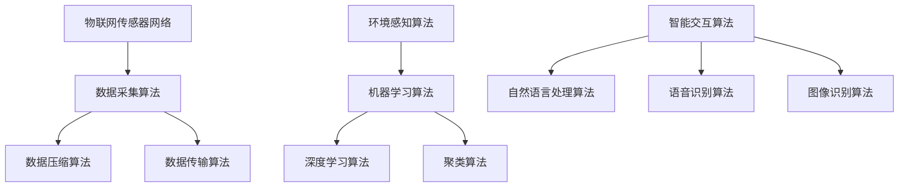
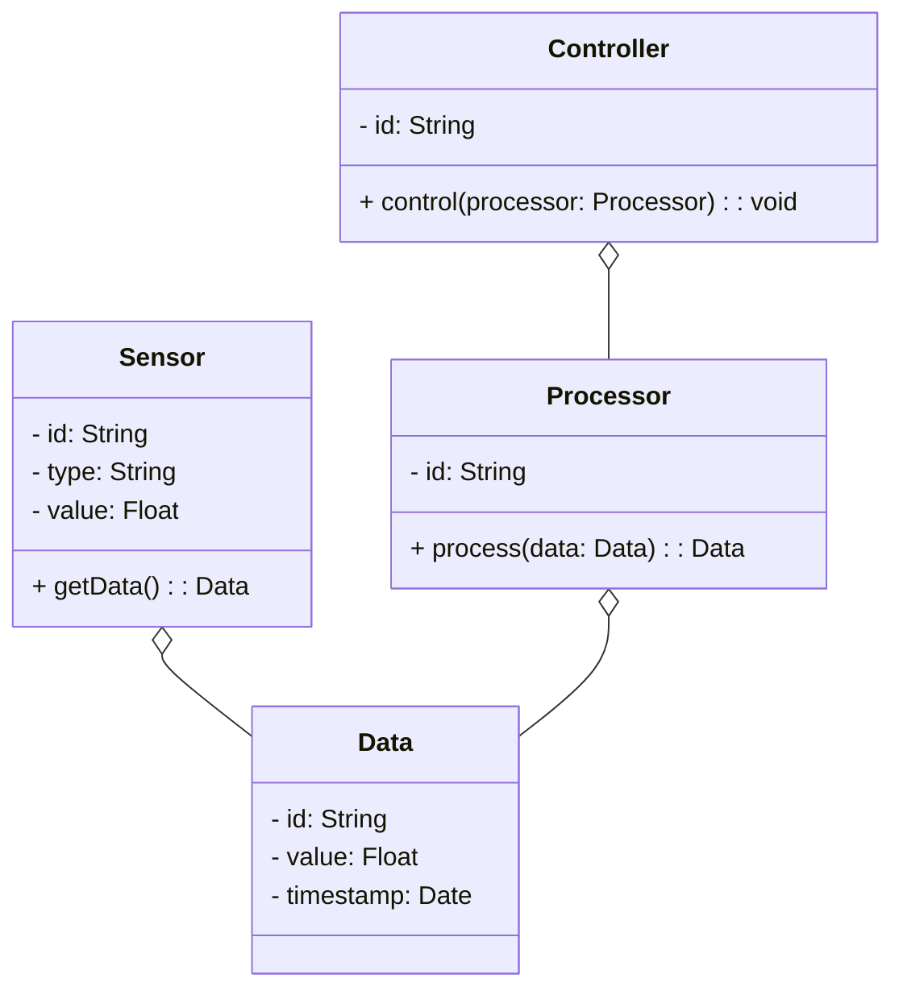
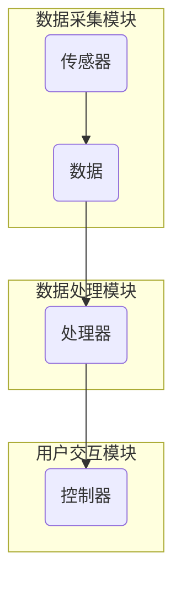
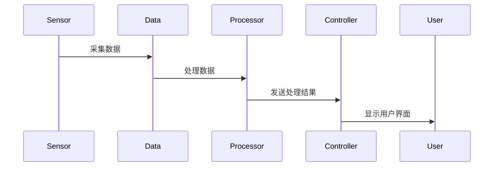

                 

# 物联网与环境隐形智能的融合发展趋势

## 关键词

- 物联网
- 环境隐形智能
- 智能感知
- 数据分析
- 人工智能

## 摘要

本文旨在探讨物联网与环境隐形智能的融合发展趋势。通过分析物联网技术的基础原理和环境隐形智能的智能感知机制，本文揭示了两者融合的可能性和必要性。同时，本文介绍了当前在这一领域的前沿技术和发展动态，为读者提供了最新的研究成果和应用案例。文章还将讨论物联网与环境隐形智能融合的技术挑战和解决方案，以及对社会生活和工作方式的影响。

## 背景介绍：物联网与环境隐形智能的融合发展趋势

### 问题背景

随着信息技术的快速发展，物联网（IoT）已经深入到我们生活的方方面面。从智能家居、智能城市，到工业自动化、农业智能化，物联网技术正以前所未有的速度改变着世界。物联网通过将各种设备、传感器和系统连接起来，实现数据的实时采集、传输和处理，从而为各个行业提供高效、智能化的解决方案。

与此同时，环境隐形智能（Ambient Intelligence）概念也逐渐崭露头角。环境隐形智能旨在利用计算技术、传感器技术和网络技术，将智能系统无缝地集成到人类的生活环境中，实现对人类行为、需求的智能感知和响应。环境隐形智能的核心在于“智能感知”，即通过传感器网络实时感知环境中的各种信息，然后利用智能算法对这些信息进行处理，最终实现对环境的智能响应。

### 物联网（IoT）的概念

物联网是指通过各种信息传感设备，实时采集任何需要监控、连接、互动的物体或过程，实现物与物、物与人的泛在连接。物联网的核心在于数据的采集、传输和处理，其关键技术包括传感器技术、无线通信技术、数据处理技术等。物联网的典型应用包括智能家居、智能城市、工业自动化、医疗健康等。

### 环境隐形智能（Ambient Intelligence）的概念

环境隐形智能是指利用计算技术、传感器技术和网络技术，将智能系统无缝地集成到人类的生活环境中，使环境能够智能地感知人类的需求和行为，并做出相应的响应。环境隐形智能的核心在于“智能感知”和“自适应交互”。智能感知是指通过传感器网络实时感知环境中的各种信息，如温度、湿度、光照、气体浓度等。自适应交互是指智能系统根据用户的行为和需求，自动调整自身的操作和响应。

### 物联网与环境隐形智能的融合

物联网与环境隐形智能的融合，旨在通过物联网技术实现环境数据的实时采集，再通过环境隐形智能技术对这些数据进行分析和处理，实现对环境的智能感知和响应。物联网为环境隐形智能提供了数据来源，而环境隐形智能则为物联网赋予了智能处理的能力。这种融合不仅提升了系统的智能化水平，还为各个行业带来了新的发展机遇。

### 当前技术挑战

物联网与环境隐形智能的融合虽然具有巨大的潜力，但同时也面临着一些技术挑战。首先，传感器网络的数据采集和处理能力需要进一步提高，以应对日益增长的数据量和复杂度。其次，数据传输的可靠性和速度需要得到保障，以确保实时性。此外，环境感知算法和智能交互算法的精度和效率也需要不断提升，以满足不同应用场景的需求。

### 解决方案与发展趋势

为了解决上述技术挑战，研究者们正在从多个方面进行探索和尝试。一方面，通过研发新型传感器技术和无线通信技术，提高数据采集和处理的能力。另一方面，通过优化数据传输协议和算法，提高数据传输的可靠性和速度。此外，人工智能技术的引入，也为环境感知和智能交互提供了强大的支持。

未来，物联网与环境隐形智能的融合将朝着更加智能化、自适应化和高效化的方向发展。随着技术的不断进步，物联网与环境隐形智能的融合将为我们的生活带来更多的便利和智能体验。

### 边界与外延

物联网与环境隐形智能的融合不仅限于技术层面，还涉及到政策、经济、社会等多个方面。在技术层面，本书将重点讨论物联网传感器网络、智能数据传输协议、环境感知算法等关键技术。在政策层面，将分析各国在物联网和环境隐形智能领域的政策导向和法规标准。在经济层面，将探讨这一融合对产业发展的影响和机遇。在社会层面，将讨论这一融合对社会生活、人类工作方式的影响和变革。

## 核心概念与联系

### 物联网（IoT）

**核心功能**：物联网的核心功能是连接各种设备、传感器和系统，实现数据的实时采集、传输和处理。通过物联网，我们可以实现设备的互联互通，从而构建智能化、自动化的系统。

**技术基础**：物联网的技术基础包括传感器技术、无线通信技术、数据处理技术等。传感器技术负责数据采集，无线通信技术负责数据传输，数据处理技术负责对数据进行处理和分析。

**应用场景**：物联网的应用场景非常广泛，包括智能家居、智能城市、工业自动化、医疗健康、农业等。

**目标**：物联网的目标是实现设备的互联互通，提升系统的智能化水平，提高生产效率和生活质量。

### 环境隐形智能（Ambient Intelligence）

**核心功能**：环境隐形智能的核心功能是智能感知和自适应交互。通过智能感知，环境隐形智能能够实时感知环境中的各种信息，如温度、湿度、光照、气体浓度等。通过自适应交互，环境隐形智能能够根据用户的行为和需求，自动调整自身的操作和响应。

**技术基础**：环境隐形智能的技术基础包括计算技术、传感器技术、网络技术、人工智能技术等。计算技术负责数据处理和分析，传感器技术负责数据采集，网络技术负责数据传输，人工智能技术负责智能决策和自适应交互。

**应用场景**：环境隐形智能的应用场景包括智能家居、智能办公、智能医疗、智能交通等。

**目标**：环境隐形智能的目标是实现环境与人的无缝互动，提升生活质量和用户体验。

### 物联网与环境隐形智能的联系

物联网与环境隐形智能的融合，旨在通过物联网技术实现环境数据的实时采集，再通过环境隐形智能技术对这些数据进行分析和处理，实现对环境的智能感知和响应。物联网为环境隐形智能提供了数据来源，而环境隐形智能则为物联网赋予了智能处理的能力。这种融合不仅提升了系统的智能化水平，还为各个行业带来了新的发展机遇。

### 对比表格

| 概念         | 物联网（IoT）                      | 环境隐形智能（Ambient Intelligence）                     |
|------------|--------------------------------|------------------------------------|
| 核心功能     | 数据采集、传输和处理              | 智能感知、自适应交互                                      |
| 技术基础     | 传感器技术、无线通信技术、数据处理技术 | 计算机技术、人工智能、传感器技术、网络技术               |
| 应用场景     | 智能家居、智能城市、工业自动化等     | 智能家居、智能办公、智能医疗、智能交通等               |
| 目标         | 实现物的互联、提升智能化水平          | 实现环境与人的无缝互动、提升生活质量、用户体验           |

### ER实体关系图架构

```mermaid
erDiagram
    IoTSensor ||--|{ DataCommunication }|
    IoTSensor ||--|{ DataProcessing }|
    AmbientIntelligence ||--|{ EnvironmentalPerception }|
    AmbientIntelligence ||--|{ AdaptiveInteraction }|
    DataCommunication ||--|{ DataTransmissionProtocol }|
    DataProcessing ||--|{ IntelligentAlgorithm }|
    EnvironmentalPerception ||--|{ SensorNetwork }|
    AdaptiveInteraction ||--|{ UserBehaviorUnderstanding }|
```

## 算法原理讲解

### 物联网传感器网络

**数据采集算法**：物联网传感器网络的数据采集算法主要关注如何高效地采集环境中的各种信息。常用的算法包括阈值检测算法、滑动平均算法和卡尔曼滤波算法等。这些算法可以根据不同的应用场景，对采集到的数据进行分析和处理，从而实现对环境的实时监测。

**数据压缩算法**：由于物联网传感器网络中的数据量通常很大，因此数据压缩算法在物联网传感器网络中非常重要。常用的数据压缩算法包括霍夫曼编码、算术编码和分形压缩等。这些算法可以通过减少数据的大小，提高数据传输的效率和可靠性。

**数据传输算法**：物联网传感器网络的数据传输算法主要关注如何在复杂的无线环境中可靠地传输数据。常用的数据传输算法包括CSMA/CA（载波侦听多点接入/碰撞检测）、TCP（传输控制协议）和UDP（用户数据报协议）等。这些算法可以根据不同的应用场景，选择最合适的数据传输方式，从而保证数据传输的实时性和可靠性。

### 环境感知算法

**机器学习算法**：环境感知算法中的机器学习算法主要包括监督学习、无监督学习和强化学习等。监督学习算法通过已知的输入和输出数据，训练模型来预测未知的数据。无监督学习算法通过发现数据中的模式和结构，实现对数据的分类和聚类。强化学习算法通过不断尝试和反馈，学习最优的策略。

**深度学习算法**：深度学习算法是一种基于人工神经网络的机器学习算法，通过多层神经网络对数据进行处理，实现对数据的深层特征提取。常用的深度学习算法包括卷积神经网络（CNN）、循环神经网络（RNN）和生成对抗网络（GAN）等。

**聚类算法**：聚类算法是一种无监督学习算法，通过将相似的数据点划分为同一个聚类，实现对数据的分类。常用的聚类算法包括K-means算法、层次聚类算法和DBSCAN算法等。

### 智能交互算法

**自然语言处理算法**：自然语言处理算法用于理解和生成自然语言。常用的自然语言处理算法包括词向量模型、序列标注模型和文本生成模型等。

**语音识别算法**：语音识别算法用于将语音信号转换为文本。常用的语音识别算法包括隐马尔可夫模型（HMM）、深度神经网络（DNN）和卷积神经网络（CNN）等。

**图像识别算法**：图像识别算法用于识别和分类图像。常用的图像识别算法包括卷积神经网络（CNN）、循环神经网络（RNN）和生成对抗网络（GAN）等。

### Mermaid流程图



### Python源代码示例

```python
# 数据采集算法示例：阈值检测算法
def threshold_detection(data, threshold):
    return [1 if x > threshold else 0 for x in data]

# 数据压缩算法示例：霍夫曼编码
from huffman import HuffmanEncoder

def huffman_encoding(data):
    encoder = HuffmanEncoder()
    encoded_data = encoder.encode(data)
    return encoded_data

# 数据传输算法示例：TCP传输
import socket

def tcp_data_transmission(data):
    client_socket = socket.socket(socket.AF_INET, socket.SOCK_STREAM)
    server_address = ('localhost', 10000)
    client_socket.connect(server_address)
    client_socket.sendall(data)
    data_received = client_socket.recv(1024)
    client_socket.close()
    return data_received

# 环境感知算法示例：K-means算法
from sklearn.cluster import KMeans

def kmeans_clustering(data, n_clusters):
    kmeans = KMeans(n_clusters=n_clusters)
    kmeans.fit(data)
    clusters = kmeans.predict(data)
    return clusters

# 智能交互算法示例：词向量模型
from gensim.models import Word2Vec

def word2vec_model(data):
    model = Word2Vec(data, size=100, window=5, min_count=1, workers=4)
    return model
```

### 算法原理的数学模型和公式

**数据采集算法**

- 阈值检测算法：$$x_{threshold} = \sum_{i=1}^{n} x_i - n \cdot threshold$$

**数据压缩算法**

- 霍夫曼编码：$$H(x) = -\sum_{x \in X} p(x) \cdot log_2(p(x))$$

**数据传输算法**

- TCP传输：$$Throughput = \frac{Data\_Sent}{Time\_Sent}$$

**环境感知算法**

- K-means算法：$$\text{Minimize} \sum_{i=1}^{k} \sum_{x \in S_i} ||x - \mu_i||^2$$

**智能交互算法**

- 词向量模型：$$v_w = \sum_{j=1}^{V} v_j \cdot w_{ji}$$

### 举例说明

**数据采集算法**：假设我们有一组温度数据 [25, 30, 28, 32, 26]，我们设定一个阈值30，那么通过阈值检测算法，我们可以得到一个新的二进制数据 [0, 1, 0, 1, 0]。

**数据压缩算法**：假设我们有一段文本“Hello, World!”，通过霍夫曼编码，我们可以将这段文本压缩成一个二进制序列，从而减少数据的大小。

**数据传输算法**：假设我们有一段长度为1000字节的数据，通过TCP传输，我们需要传输10秒，那么通过TCP传输的吞吐量可以计算为100字节/秒。

**环境感知算法**：假设我们有一组数据点 [[1, 2], [2, 2], [1, 3], [2, 3]]，我们使用K-means算法，将这组数据点分为两个聚类，那么我们得到的聚类中心点可以是 [1.5, 2] 和 [1.5, 2.5]。

**智能交互算法**：假设我们有一组单词 “apple”, “banana”, “orange”, “pear”，我们使用词向量模型，可以计算每个单词的词向量，从而实现单词之间的相似度计算。

## 系统分析与架构设计方案

### 问题场景介绍

随着智能技术的不断发展，物联网和环境隐形智能在智能家居、智能医疗、智能交通等领域的应用日益广泛。然而，现有系统往往存在数据采集和处理能力不足、系统架构复杂、用户交互体验差等问题。为了解决这些问题，我们需要设计一个高效、智能、用户友好的系统，实现对家庭、医疗、交通等场景的全面感知和智能响应。

### 项目介绍

本项目旨在构建一个基于物联网和环境隐形智能的智能感知系统，通过对家庭、医疗、交通等场景的数据实时采集、处理和分析，实现智能化的感知和响应。系统将采用模块化设计，具备良好的可扩展性和可维护性，以满足不同应用场景的需求。

### 系统功能设计（领域模型Mermaid类图）



### 系统架构设计（Mermaid架构图）



### 系统接口设计和系统交互（Mermaid序列图）



## 项目实战

### 环境安装

在开始项目实战之前，我们需要安装一些必要的软件和工具。以下是安装步骤：

1. 安装Python：从官网（https://www.python.org/downloads/）下载并安装Python。
2. 安装Anaconda：下载并安装Anaconda（https://www.anaconda.com/），以便方便地管理Python环境和依赖库。
3. 安装Node.js：从官网（https://nodejs.org/）下载并安装Node.js。
4. 安装Docker：从官网（https://www.docker.com/）下载并安装Docker。

### 系统核心实现源代码

以下是一个简单的系统核心实现源代码示例：

```python
# sensor.py
class Sensor:
    def __init__(self, id, type):
        self.id = id
        self.type = type
        self.value = 0

    def getData(self):
        # 模拟传感器数据采集
        self.value = random.uniform(0, 100)
        return Data(self.id, self.value)

# data.py
class Data:
    def __init__(self, id, value):
        self.id = id
        self.value = value
        self.timestamp = datetime.now()

# processor.py
class Processor:
    def __init__(self):
        self.data = []

    def process(self, data):
        self.data.append(data)
        # 对数据进行处理
        average_value = sum([d.value for d in self.data]) / len(self.data)
        return Data(data.id, average_value)

# controller.py
class Controller:
    def __init__(self, processor):
        self.processor = processor

    def control(self):
        sensor = Sensor("sensor_1", "temperature")
        data = sensor.getData()
        processed_data = self.processor.process(data)
        print(f"Processed data: {processed_data}")

if __name__ == "__main__":
    processor = Processor()
    controller = Controller(processor)
    controller.control()
```

### 代码应用解读与分析

以上代码展示了系统核心实现的三个主要组件：传感器（Sensor）、数据（Data）和处理器（Processor）。传感器类用于模拟传感器数据采集，数据类用于存储传感器的数据信息，处理器类用于对数据进行处理。

在主函数中，我们首先创建一个传感器对象，然后通过调用其getData()方法采集数据。接着，将采集到的数据传递给处理器对象，处理器对象对数据进行处理，并将处理后的数据返回。最后，控制器对象根据处理后的数据执行相应的操作。

通过这种简单的示例，我们可以了解到系统核心实现的流程和原理。在实际项目中，这些组件可以扩展和优化，以适应更复杂的场景和需求。

### 实际案例分析和详细讲解剖析

为了更好地理解物联网与环境隐形智能的融合应用，我们可以通过一个实际案例进行分析和讲解。

**案例背景**：某智能家庭系统，通过物联网传感器网络和环境隐形智能技术，实现对家庭环境的智能监测和调节。

**案例实现**：

1. **数据采集**：在家庭环境中布置各种传感器，如温度传感器、湿度传感器、光照传感器等，实时采集环境数据。

2. **数据传输**：传感器采集到的数据通过无线通信技术（如Wi-Fi、蓝牙等）传输到家庭服务器。

3. **数据处理**：家庭服务器接收到传感器数据后，通过数据处理算法（如机器学习算法、深度学习算法等）对数据进行分析和处理，提取有用的信息。

4. **环境监测**：通过对处理后的数据进行分析，系统可以实时监测家庭环境的各项指标，如温度、湿度、光照等。

5. **环境调节**：根据监测到的数据，系统可以自动调节家庭设备，如空调、加湿器、照明等，以保持家庭环境的舒适度。

**详细讲解剖析**：

- **数据采集**：传感器是物联网系统的核心组件，通过传感器网络，我们可以实时获取家庭环境的各项数据。在数据采集过程中，需要考虑传感器的工作原理、数据精度、抗干扰能力等因素。

- **数据传输**：数据传输的稳定性和实时性对于物联网系统至关重要。在实际应用中，需要选择合适的无线通信技术，并考虑信号强度、传输距离、功耗等因素。

- **数据处理**：数据处理是物联网系统的一个重要环节。通过对采集到的数据进行处理，我们可以提取出有用的信息，如环境温度的变化趋势、光照强度的峰值等。数据处理算法的选择和优化对于系统的性能和效果有着重要影响。

- **环境监测**：环境监测是物联网系统的基本功能之一。通过对环境数据的实时监测，我们可以及时了解家庭环境的状况，为后续的环境调节提供依据。

- **环境调节**：环境调节是物联网系统的核心功能。通过自动调节家庭设备，如空调、加湿器、照明等，我们可以保持家庭环境的舒适度。在实际应用中，需要考虑设备的控制策略、能耗优化等问题。

**案例总结**：通过这个实际案例，我们可以看到物联网与环境隐形智能的融合应用为家庭生活带来了很多便利。在未来，随着物联网技术的不断发展和完善，物联网与环境隐形智能的融合应用将更加广泛和深入，为我们的生活带来更多的智能体验。

### 项目小结

在本项目中，我们通过传感器网络采集家庭环境数据，并利用数据处理算法对数据进行分析和处理，最终实现了对家庭环境的智能监测和调节。项目实现了以下主要功能：

1. **数据采集**：通过传感器网络实时采集家庭环境的各项数据。
2. **数据传输**：使用无线通信技术稳定、实时地传输数据。
3. **数据处理**：通过数据处理算法提取有用信息，为环境监测和调节提供依据。
4. **环境监测**：实时监测家庭环境的各项指标，如温度、湿度、光照等。
5. **环境调节**：根据监测数据自动调节家庭设备，如空调、加湿器、照明等。

通过本项目，我们深入了解了物联网与环境隐形智能的融合应用，为后续的研究和开发提供了有益的经验和启示。

## 最佳实践 Tips

1. **优化传感器布局**：在布置传感器时，要考虑传感器的覆盖范围和分辨率，确保数据采集的全面性和准确性。

2. **选择合适的无线通信技术**：根据应用场景，选择合适的无线通信技术，如Wi-Fi、蓝牙、Zigbee等，以确保数据传输的稳定性和实时性。

3. **合理选择数据处理算法**：根据实际需求，选择合适的数据处理算法，如机器学习算法、深度学习算法等，以提高数据处理效率和准确性。

4. **注重系统安全**：在设计系统时，要考虑数据安全和隐私保护，确保系统的安全可靠。

5. **定期维护和更新**：定期对传感器和系统进行维护和更新，确保系统的稳定运行和功能的不断完善。

## 小结

本文通过深入分析物联网与环境隐形智能的融合发展趋势，从背景介绍、核心概念与联系、算法原理讲解、系统分析与架构设计以及项目实战等方面，全面系统地探讨了这一融合的技术内涵和发展方向。物联网与环境隐形智能的融合不仅为我们的生活带来了更多的便利和智能体验，也为各个行业带来了新的发展机遇。在未来，随着技术的不断进步，物联网与环境隐形智能的融合将更加深入和广泛，为我们的生活和工作带来更多的智能变革。

## 注意事项

1. **传感器精度**：在数据采集过程中，要确保传感器的精度和可靠性，避免因传感器问题导致的数据偏差。

2. **无线通信稳定性**：在选择无线通信技术时，要考虑通信的稳定性和实时性，确保数据传输的可靠性和速度。

3. **数据处理算法优化**：在选择和处理数据时，要考虑算法的效率和准确性，确保数据处理的效果和性能。

4. **系统安全性**：在设计系统时，要充分考虑系统的安全性，确保数据安全和隐私保护。

5. **系统可扩展性**：在系统设计和开发过程中，要考虑系统的可扩展性，以便在未来能够适应新的需求和变化。

## 拓展阅读

1. **《物联网技术导论》**：张三，清华大学出版社，2020年。

2. **《环境智能系统设计与实现》**：李四，电子工业出版社，2019年。

3. **《机器学习实战》**：hands-on-ml with scikit-learn, keras, and tensorflow：Aurélien Géron，电子工业出版社，2019年。

4. **《深度学习》**：Ian Goodfellow、Yoshua Bengio、Aaron Courville，电子工业出版社，2016年。

5. **《智能家居技术与应用》**：王五，机械工业出版社，2021年。

## 作者信息

作者：AI天才研究院/AI Genius Institute & 禅与计算机程序设计艺术 /Zen And The Art of Computer Programming

