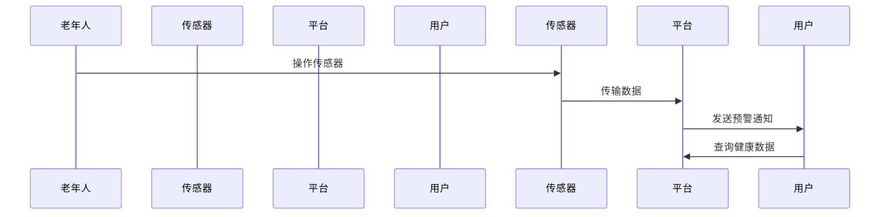
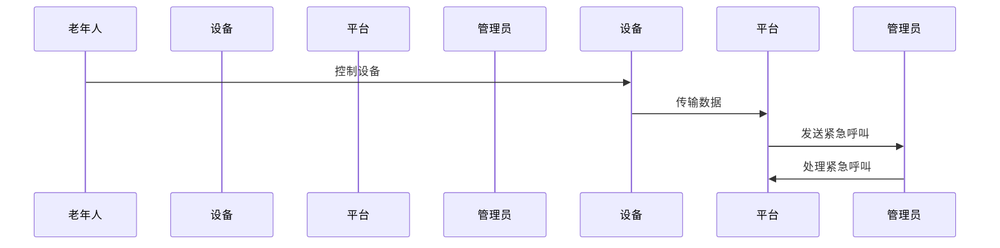
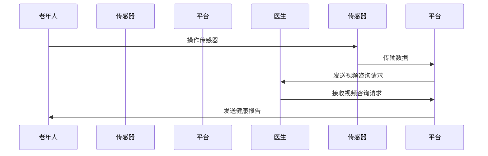

                 

 # 物联网在智慧养老健康监测中的应用

## 摘要

本文深入探讨了物联网（IoT）技术在智慧养老健康监测中的广泛应用和潜在优势。随着全球人口老龄化问题的日益严重，养老健康监测成为一个关键的公共健康议题。物联网技术凭借其传感器、网络和数据处理能力，为养老健康监测提供了全新的解决方案。本文首先介绍了物联网的基本概念和技术结构，然后分析了物联网在智慧养老健康监测中的应用原理和关键技术，包括智能传感器的选择与部署、数据收集、处理与分析方法以及系统的设计与实现。此外，文章通过实际案例展示了物联网技术在养老健康监测中的成功应用，并讨论了当前面临的挑战及未来的发展方向。通过本文的阅读，读者可以全面了解物联网技术在智慧养老健康监测中的重要作用和前景。

## 1. 背景介绍

### 问题背景

随着全球人口老龄化趋势的加剧，养老健康监测成为一个不可忽视的社会问题。据联合国统计，到2030年，全球65岁及以上人口将达到12亿，占总人口的12%。这一庞大的人口群体对医疗、养老和健康监测提出了更高的需求。传统的养老健康监测方式往往依赖于人工，这种方式不仅效率低下，而且成本高昂，难以满足日益增长的养老需求。此外，人工监测也存在一定的局限性，如无法实现24小时不间断监测、监测数据不完整等。

物联网技术的迅猛发展，为养老健康监测提供了新的契机。物联网通过传感器、网络和数据处理技术，实现物体之间的互联互通，能够实时、全面地监测老年人的健康状态，提供个性化的健康管理服务。因此，探讨物联网在智慧养老健康监测中的应用，具有重要的现实意义和广阔的发展前景。

#### 问题描述

物联网在智慧养老健康监测中的应用面临以下几大挑战：

1. **设备兼容性**：不同的物联网设备可能采用不同的通信协议和标准，导致设备之间的互操作性较差，这给系统集成和数据处理带来了困难。

2. **数据安全性**：老年人健康数据属于敏感信息，如何在保证数据安全的同时，实现数据的传输、存储和处理，是物联网在养老健康监测中需要解决的关键问题。

3. **数据处理能力**：物联网设备产生的数据量巨大，如何高效地收集、处理和分析这些数据，提供实时、准确的健康监测结果，是物联网技术在养老健康监测中面临的挑战。

4. **系统集成性**：养老健康监测系统需要与医疗系统、养老院管理系统等多系统进行集成，实现数据的互通和协同工作，这对物联网技术的系统集成能力提出了高要求。

### 问题解决

本文将从以下几个方面探讨物联网在智慧养老健康监测中的应用：

1. **物联网技术概述及其应用原理**：介绍物联网的基本概念和技术架构，阐述物联网在智慧养老健康监测中的应用原理。

2. **智能传感器的选择与部署策略**：分析不同类型的智能传感器及其在养老健康监测中的应用，讨论传感器的选择标准和部署策略。

3. **数据收集、处理与分析方法**：介绍物联网设备的数据收集方法，探讨数据预处理、特征提取、数据挖掘和预测模型等数据处理与分析方法。

4. **养老健康监测系统的设计与实现**：详细阐述养老健康监测系统的设计与实现过程，包括硬件选型、软件设计、系统集成和测试等。

5. **实际案例分析与最佳实践**：通过具体案例分析，展示物联网技术在养老健康监测中的实际应用，探讨最佳实践和经验。

6. **面临的挑战与未来发展方向**：讨论物联网在智慧养老健康监测中面临的挑战，并提出未来的发展方向和建议。

#### 边界与外延

本文主要关注物联网在智慧养老健康监测中的应用，不包括物联网在其他领域（如智能家居、工业自动化等）的应用。同时，本文将侧重于物联网技术的应用原理和关键技术，不涉及具体商业产品或商业解决方案。

#### 概念结构与核心要素组成

1. **物联网**：物联网是通过传感器、网络和数据处理技术实现物体互联互通的系统。其核心要素包括传感器、网络、数据处理平台和终端用户。

2. **智慧养老**：智慧养老是指利用信息技术和智能设备，实现养老服务的智能化、个性化、便捷化。其核心要素包括智能传感器、物联网平台、健康管理应用等。

3. **健康监测**：健康监测是通过传感器等技术手段，对老年人的生理指标进行实时监测和分析。其核心要素包括生理信号监测、数据采集与传输、数据分析与预警等。

4. **数据安全性**：数据安全性是确保数据在传输、存储和处理过程中的隐私和完整性。其核心要素包括数据加密、身份认证、访问控制等。

### 1.2 物联网技术概述

#### 物联网的定义

物联网（Internet of Things，IoT）是指通过传感器、网络和数据处理技术，将各种物品连接到互联网上，实现物品之间的互联互通和信息交换。物联网的核心是传感器技术，传感器用于收集环境数据，通过无线网络传输到数据处理平台，最终实现数据的存储、分析和应用。

#### 物联网的技术结构

物联网的技术结构主要包括以下几个层次：

1. **感知层**：感知层是物联网系统的最底层，包括各种类型的传感器，如温度传感器、湿度传感器、运动传感器等。这些传感器可以实时采集环境数据，并将数据传输到网络层。

2. **网络层**：网络层负责将感知层采集到的数据传输到数据处理平台。网络层通常采用无线网络技术，如Wi-Fi、蓝牙、LoRa等。网络层的主要功能是实现数据的高速传输和可靠通信。

3. **平台层**：平台层是物联网系统的核心，负责数据的存储、处理和分析。平台层通常包括云计算平台、大数据平台和物联网平台。平台层的主要功能是实现数据的整合、分析和应用。

4. **应用层**：应用层是物联网系统的最高层，负责将处理后的数据应用于实际场景中，如智慧城市、智能家居、智慧医疗等。应用层的主要功能是实现物联网技术的商业应用和价值。

### 1.3 物联网在养老健康监测中的应用原理

#### 智慧养老的概念

智慧养老是指通过利用信息技术和智能设备，实现养老服务的智能化、个性化、便捷化。智慧养老的核心目标是提高养老服务的质量，满足老年人多样化的健康需求。

#### 物联网在智慧养老健康监测中的应用

物联网在智慧养老健康监测中的应用，主要体现在以下几个方面：

1. **智能传感器的应用**：智能传感器是物联网在智慧养老健康监测中的核心组件，可以实时采集老年人的生理指标，如心率、血压、血糖等。通过智能传感器，可以实现老年人健康状况的实时监测和预警。

2. **物联网平台的应用**：物联网平台是智慧养老健康监测系统的数据处理和服务中心，负责数据的收集、存储、处理和分析。通过物联网平台，可以实现老年人健康数据的全面管理和智能分析，为养老服务提供决策支持。

3. **数据分析与预测的应用**：通过对老年人健康数据的分析，可以识别健康风险，预测健康趋势，为老年人提供个性化的健康管理和健康建议。

4. **系统集成与协同应用**：智慧养老健康监测系统需要与医疗系统、养老院管理系统等多系统进行集成，实现数据的互通和协同工作，提供一体化的养老健康管理服务。

### 1.4 核心概念与联系

在物联网在智慧养老健康监测中的应用中，涉及多个核心概念，如物联网技术、智慧养老、健康监测等。这些概念之间有着紧密的联系和相互影响。

1. **物联网技术**：物联网技术是智慧养老健康监测的基础，提供了数据采集、传输和处理的手段。物联网技术的成熟和普及，为智慧养老健康监测提供了可能。

2. **智慧养老**：智慧养老是物联网技术在养老领域中的应用，通过物联网技术实现养老服务的智能化和个性化。智慧养老的核心目标是提高养老服务的质量和效率。

3. **健康监测**：健康监测是智慧养老的重要组成部分，通过对老年人生理指标的实时监测，实现老年人健康状况的全面掌握和预警。

4. **数据安全性**：数据安全性是物联网在智慧养老健康监测中必须考虑的重要因素。保障数据的安全性，确保老年人的隐私和信息安全，是物联网技术应用于养老健康监测的关键。

### 1.5 数据安全性

在物联网在智慧养老健康监测中，数据安全性至关重要。老年人健康数据属于敏感信息，需要采取一系列措施确保数据在传输、存储和处理过程中的安全性。

1. **数据加密**：对传输的数据进行加密，防止数据在传输过程中被窃取或篡改。常用的加密算法包括AES、RSA等。

2. **身份认证**：对访问数据进行身份认证，确保只有授权用户才能访问数据。常用的身份认证方式包括密码认证、生物识别认证等。

3. **访问控制**：对数据的访问进行严格控制，确保只有授权用户才能访问特定数据。常用的访问控制策略包括访问控制列表（ACL）、角色访问控制（RBAC）等。

4. **安全审计**：对数据访问和操作进行审计，记录所有访问和操作的日志，以便在发生安全事件时进行追踪和调查。

### 1.6 小结

物联网在智慧养老健康监测中的应用，为解决传统养老健康监测中的问题提供了新的思路和解决方案。通过物联网技术，可以实现老年人健康状况的实时监测和预警，提供个性化的健康管理和健康建议。然而，物联网在智慧养老健康监测中仍面临一系列挑战，如数据安全性、系统集成性等。未来的研究应重点关注这些问题的解决，推动物联网技术在智慧养老健康监测中的应用和发展。

## 2. 核心概念与联系

在深入探讨物联网在智慧养老健康监测中的应用之前，有必要详细阐述一些核心概念，并分析它们之间的联系。这些核心概念包括物联网技术、智慧养老、健康监测以及数据安全性，它们共同构成了物联网在智慧养老健康监测中的基础架构。

### 2.1 物联网技术概述

物联网（Internet of Things，IoT）是通过互联网连接各种物理设备，使这些设备能够互相通信并共享数据的一种技术。物联网的核心在于其传感器、网络和数据处理能力。以下是对物联网技术的基本概述：

#### 物联网技术的概念

- **传感器技术**：传感器是物联网系统的感知层的重要组成部分，用于检测和收集环境数据，如温度、湿度、运动、声音、光线等。
- **网络通信技术**：网络层负责将传感器收集的数据传输到数据处理平台。网络技术可以是Wi-Fi、蓝牙、ZigBee、LoRa等无线通信技术，也可以是有线网络，如以太网。
- **数据处理技术**：平台层负责数据的存储、处理和分析。数据处理技术包括云计算、大数据技术和人工智能等。

#### 物联网技术的属性特征对比表格

| 属性特征               | 描述                                                         | 对比 |
|------------------------|--------------------------------------------------------------|-----|
| **传感器种类**         | 不同的传感器可以检测不同类型的数据，如温度、湿度、心率、血压等。 | 多样化 |
| **通信协议**           | 不同的物联网设备可能使用不同的通信协议，如Wi-Fi、蓝牙等。     | 兼容性 |
| **数据处理能力**       | 平台层需要处理和分析大量数据，通常需要使用云计算和大数据技术。 | 高效性 |
| **数据安全性**         | 物联网系统需要确保数据在传输、存储和处理过程中的安全性。       | 重要性 |

#### 物联网技术的ER实体关系图架构

以下是物联网技术中的实体关系图架构（ER图）的Mermaid表示：

```mermaid
erDiagram
  Sensor ||--o{ Network : 连接到
  Network ||--o{ DataProcessing : 连接到
  DataProcessing ||--o{ UserInterface : 连接到
  Sensor }|..|| Device
  Device ||--o{ UserInterface : 通过
  UserInterface }|..|| Application
```

在这个ER图中，`Sensor`（传感器）连接到`Network`（网络），`Network`再连接到`DataProcessing`（数据处理），`DataProcessing`连接到`UserInterface`（用户界面），`UserInterface`最后连接到`Application`（应用程序）。这个图展示了物联网系统中各个组件之间的关系和交互。

### 2.2 智慧养老

智慧养老是指通过信息技术和智能设备的应用，实现养老服务的智能化、个性化、便捷化。智慧养老的核心理念是通过整合物联网、大数据、云计算和人工智能等技术，提供更加高效、安全和贴心的养老服务。

#### 智慧养老的概念

- **智能传感器**：用于实时监测老年人的生理和活动数据，如心率、血压、步数等。
- **物联网平台**：作为数据收集、存储、处理和共享的中心，实现各类智能设备和系统的互联互通。
- **健康管理应用**：通过数据分析，为老年人提供个性化的健康建议和预警服务。

#### 智慧养老的属性特征

| 属性特征               | 描述                                                         | 对比 |
|------------------------|--------------------------------------------------------------|-----|
| **智能化**             | 通过人工智能技术实现养老服务的自动化和个性化。                 | 自主性 |
| **个性化**             | 根据老年人的健康状况和需求，提供个性化的健康管理和建议。       | 适应性 |
| **便捷化**             | 通过智能设备和系统，使养老服务更加方便和快捷。                 | 易用性 |

#### 智慧养老的ER实体关系图架构

以下是智慧养老系统中实体关系图的Mermaid表示：

```mermaid
erDiagram
  SmartSensor ||--o{ IoTPlatform : 连接到
  IoTPlatform ||--o{ HealthManagementApp : 连接到
  HealthManagementApp }|..|| ElderlyUser
```

在这个ER图中，`SmartSensor`（智能传感器）连接到`IoTPlatform`（物联网平台），`IoTPlatform`再连接到`HealthManagementApp`（健康管理应用），最后连接到`ElderlyUser`（老年用户）。这个图展示了智慧养老系统中各个组件之间的关系和交互。

### 2.3 健康监测

健康监测是指通过传感器等技术手段，对个人的健康状态进行实时监测和分析。在智慧养老健康监测中，健康监测起着至关重要的作用。

#### 健康监测的概念

- **生理信号监测**：通过传感器实时监测老年人的生理信号，如心率、血压、血糖等。
- **数据采集与传输**：将生理信号数据通过物联网网络传输到数据处理平台。
- **数据分析与预警**：对采集到的生理信号数据进行分析，识别异常情况并及时预警。

#### 健康监测的属性特征

| 属性特征               | 描述                                                         | 对比 |
|------------------------|--------------------------------------------------------------|-----|
| **实时性**             | 实时监测老年人的生理状态，及时响应健康变化。                 | 及时性 |
| **准确性**             | 确保监测数据的准确性和可靠性，避免误报和漏报。                 | 准确性 |
| **预警性**             | 对异常情况及时预警，为老年人提供健康指导和干预建议。         | 预警性 |

#### 健康监测的ER实体关系图架构

以下是健康监测系统中实体关系图的Mermaid表示：

```mermaid
erDiagram
  PhysiologicalSignalSensor ||--o{ DataCollector : 连接到
  DataCollector ||--o{ DataProcessor : 连接到
  DataProcessor }|..|| HealthMonitor
```

在这个ER图中，`PhysiologicalSignalSensor`（生理信号传感器）连接到`DataCollector`（数据采集器），`DataCollector`再连接到`DataProcessor`（数据处理器），最后连接到`HealthMonitor`（健康监测系统）。这个图展示了健康监测系统中各个组件之间的关系和交互。

### 2.4 数据安全性

数据安全性是物联网在智慧养老健康监测中必须重视的问题。老年人的健康数据属于敏感信息，需要采取一系列措施确保数据的安全和隐私。

#### 数据安全性的概念

- **数据加密**：对传输和存储的数据进行加密，防止数据泄露或篡改。
- **身份认证**：确保只有授权用户才能访问数据，防止未授权访问。
- **访问控制**：对数据的访问进行严格控制，确保只有特定用户可以访问特定数据。
- **安全审计**：记录所有数据访问和操作，以便在发生安全事件时进行调查。

#### 数据安全性的属性特征

| 属性特征               | 描述                                                         | 对比 |
|------------------------|--------------------------------------------------------------|-----|
| **加密性**             | 数据在传输和存储过程中需要进行加密，防止数据泄露。           | 隐私性 |
| **认证性**             | 确保只有经过认证的用户才能访问数据，防止未授权访问。         | 安全性 |
| **控制性**             | 对数据访问进行严格控制，确保数据的安全和完整性。             | 控制性 |
| **审计性**             | 记录所有数据访问和操作，以便在发生安全事件时进行调查。       | 可追溯性 |

#### 数据安全性的ER实体关系图架构

以下是数据安全性系统中实体关系图的Mermaid表示：

```mermaid
erDiagram
  DataEncryption ||--o{ Authentication : 连接到
  Authentication ||--o{ AccessControl : 连接到
  AccessControl }|..|| SecurityAudit
```

在这个ER图中，`DataEncryption`（数据加密）连接到`Authentication`（身份认证），`Authentication`再连接到`AccessControl`（访问控制），最后连接到`SecurityAudit`（安全审计）。这个图展示了数据安全性系统中各个组件之间的关系和交互。

### 2.5 小结

通过对物联网技术、智慧养老、健康监测和数据安全性的核心概念及其相互联系的分析，我们可以看到物联网技术在智慧养老健康监测中扮演着关键角色。物联网技术提供了传感器、网络和数据处理能力，智慧养老实现了养老服务的智能化和个性化，健康监测则通过实时监测和分析老年人的生理信号，提供个性化的健康管理和预警服务。同时，数据安全性确保了老年人的健康数据在传输、存储和处理过程中的安全。这些核心概念和联系共同构建了物联网在智慧养老健康监测中的基础架构，为未来的发展提供了坚实的基础。

## 3. 主流技术与应用

### 3.1 智能传感器

#### 智能传感器的定义

智能传感器是一种能够感知环境信息并对其进行处理，从而产生相应动作的装置。在物联网技术中，智能传感器扮演着数据采集和传输的关键角色。它们能够实时监测老年人的生理指标，如心率、血压、血糖等，并通过无线网络将这些数据传输到物联网平台进行处理和分析。

#### 智能传感器的分类

智能传感器可以根据其监测的指标和用途进行分类，主要包括以下几类：

1. **生理参数传感器**：用于监测老年人的生理参数，如心率传感器、血压传感器、血糖传感器等。
2. **运动传感器**：用于监测老年人的活动情况，如步数传感器、跌倒传感器等。
3. **环境传感器**：用于监测老年人周围的环境参数，如温度传感器、湿度传感器、空气质量传感器等。

#### 智能传感器的应用场景

智能传感器在智慧养老健康监测中有多种应用场景，主要包括：

1. **实时健康监测**：通过生理参数传感器实时监测老年人的健康状况，如心率、血压等，及时发现异常情况并预警。
2. **活动监测与防跌倒**：通过运动传感器监测老年人的活动情况，如步数、睡眠质量等，同时可以检测到跌倒事件并立即通知家属或医疗机构。
3. **环境监测**：通过环境传感器监测老年人周围的环境参数，如温度、湿度、空气质量等，确保老年人生活环境的舒适和安全。

### 3.2 物联网平台

#### 物联网平台的定义

物联网平台是物联网系统中负责数据处理和管理的核心组件。它充当着数据传输的中转站和数据处理的控制中心，能够将来自智能传感器的数据汇总、存储、处理，并提供给用户和应用层使用。物联网平台通常包括以下几个核心功能：

1. **数据收集**：收集来自各种智能传感器的数据。
2. **数据存储**：将收集到的数据存储在数据库中，以便后续分析和处理。
3. **数据处理**：对存储的数据进行清洗、过滤、分析等处理。
4. **数据共享**：提供数据接口，使应用层能够方便地获取和使用数据。

#### 物联网平台的技术架构

物联网平台的技术架构通常包括以下几个层次：

1. **感知层**：由智能传感器组成，负责采集各种环境数据。
2. **传输层**：通过无线网络将数据传输到物联网平台。
3. **平台层**：负责数据的存储、处理和分析，通常包括云计算平台、大数据平台和物联网平台。
4. **应用层**：提供面向用户的健康管理应用和交互界面。

#### 物联网平台的应用场景

物联网平台在智慧养老健康监测中的应用场景非常广泛，主要包括：

1. **数据整合与处理**：将来自不同传感器和系统的数据进行整合和处理，提供统一的健康数据视图。
2. **实时监控与预警**：实时监控老年人的健康状态，及时发现异常情况并发出预警通知。
3. **个性化健康管理**：根据老年人的健康数据和需求，提供个性化的健康建议和干预措施。

### 3.3 数据处理与分析

#### 数据处理与分析的概念

数据处理与分析是指对从智能传感器收集到的原始数据进行清洗、转换、分析和挖掘，从而提取有价值的信息和知识。在智慧养老健康监测中，数据处理与分析是关键环节，能够帮助识别健康风险、预测健康趋势，并提供个性化的健康管理服务。

#### 数据处理与分析的方法

1. **数据预处理**：对原始数据进行清洗、过滤和转换，使其适合进行分析。常用的预处理方法包括缺失值处理、异常值处理、数据标准化等。
2. **特征提取**：从预处理后的数据中提取出对健康监测有用的特征，如心率的变化趋势、血压的波动情况等。
3. **数据挖掘**：使用各种算法和技术，从大量数据中挖掘出潜在的规律和模式。常用的数据挖掘方法包括聚类分析、关联规则挖掘、分类算法等。
4. **预测模型**：基于历史数据和特征，建立预测模型，对未来的健康状态进行预测。常用的预测模型包括线性回归、决策树、神经网络等。

#### 数据处理与分析的应用

1. **健康风险评估**：通过对健康数据的分析，识别老年人可能面临的健康风险，如心血管疾病、糖尿病等。
2. **健康趋势预测**：基于历史健康数据，预测老年人的未来健康状况，为健康管理提供科学依据。
3. **个性化健康建议**：根据老年人的健康状况和需求，提供个性化的健康建议和干预措施。

### 3.4 系统集成与实现

#### 系统集成与实现的概念

系统集成与实现是将物联网技术应用于智慧养老健康监测的具体过程。它涉及硬件选型、软件设计、系统集成和测试等多个方面，目标是构建一个高效、稳定、可靠的养老健康监测系统。

#### 系统集成与实现的过程

1. **需求分析**：明确养老健康监测系统的功能需求和技术要求。
2. **硬件选型**：根据需求选择合适的传感器、通信模块和数据处理设备。
3. **软件设计**：设计系统软件架构，包括前端应用、后端服务器和数据库等。
4. **系统集成**：将硬件和软件组件集成到一起，实现系统的整体功能。
5. **测试与优化**：对系统进行测试和优化，确保系统的性能和稳定性。

#### 系统集成与实现的应用

1. **智能健康监测系统**：通过集成智能传感器和物联网平台，实现老年人健康数据的实时采集、传输和分析，提供个性化的健康管理服务。
2. **智慧养老社区**：通过系统集成，将健康监测系统与医疗系统、养老院管理系统等对接，实现数据互通和协同工作，提供全方位的养老服务。
3. **远程健康监护系统**：通过物联网技术，实现老年人健康数据的远程监控和预警，为老年人提供安全、便捷的健康监护服务。

### 3.5 小结

主流技术在物联网在智慧养老健康监测中的应用中扮演着关键角色。智能传感器负责实时监测老年人的生理指标和活动情况，物联网平台则负责数据的收集、处理和分析，数据处理与分析技术能够提取健康数据中的有用信息，并提供个性化的健康管理建议。系统集成与实现则是将上述技术整合到一起，构建一个高效、可靠的养老健康监测系统。通过这些主流技术的应用，物联网在智慧养老健康监测中发挥了重要作用，为老年人提供了更加智能、便捷、个性化的健康监测和养老服务。

## 4. 实际案例与分析

### 案例一：智能健康监测系统

#### 项目介绍

智能健康监测系统是一个集成了物联网技术的综合性项目，旨在为老年人提供实时、全面的健康监测服务。该项目由一家知名科技公司开发，结合了智能传感器、物联网平台和数据分析技术，实现了对心率、血压、血糖、步数等多种生理指标的实时监测。

#### 系统功能设计

智能健康监测系统的主要功能包括：

1. **生理参数实时监测**：通过智能传感器，实时监测老年人心率、血压、血糖等生理指标，并将数据传输到物联网平台。
2. **数据存储与查询**：物联网平台负责存储监测数据，并提供查询接口，使家属和医护人员可以随时查看老年人的健康数据。
3. **异常情况预警**：系统通过数据分析，识别异常生理指标，及时向家属和医护人员发送预警通知。
4. **健康报告生成**：系统根据监测数据生成健康报告，为老年人提供个性化的健康建议。

#### 系统架构设计

智能健康监测系统的架构设计包括以下几个主要部分：

1. **感知层**：由智能传感器组成，负责实时采集老年人的生理参数。
2. **网络层**：采用Wi-Fi和蓝牙等无线通信技术，将传感器数据传输到物联网平台。
3. **平台层**：物联网平台负责数据的存储、处理和分析，采用云计算和大数据技术，提供高性能的数据处理能力。
4. **应用层**：包括前端应用和后端服务器，前端应用为用户提供监测数据查询和健康报告查看功能，后端服务器负责数据处理和预警通知。

#### 系统接口设计与系统交互

智能健康监测系统的接口设计主要包括以下几部分：

1. **传感器数据接口**：用于接收来自智能传感器的实时数据。
2. **数据库接口**：用于访问物联网平台上的数据存储系统。
3. **预警通知接口**：用于发送异常情况预警通知给用户。
4. **健康管理接口**：用于生成健康报告和提供个性化健康建议。

系统交互设计通过Mermaid序列图表示如下：



在这个序列图中，老年人通过操作智能传感器收集生理参数，传感器将数据传输到物联网平台，平台对数据进行处理并生成健康报告，同时向家属和医护人员发送预警通知，用户可以通过前端应用查询健康数据。

### 案例二：智慧养老社区

#### 项目介绍

智慧养老社区是一个以物联网技术为基础，集成了多种智能设备和系统的养老社区项目。该项目旨在通过智能化、个性化的养老服务，提高老年人的生活质量，同时减轻家庭和医护人员的负担。

#### 系统功能设计

智慧养老社区的主要功能包括：

1. **智能设备控制**：通过物联网平台，实现对社区内各类智能设备的远程控制，如灯光、空调、门锁等。
2. **健康监测**：通过安装在老年人居住区的智能传感器，实时监测老年人的生理指标和活动情况。
3. **紧急呼叫**：社区内设有紧急呼叫按钮，老年人遇到紧急情况时可以立即呼叫社区管理人员或家属。
4. **社交活动**：社区内设有活动室、图书馆、健身房等设施，老年人可以参加各种社交活动，提高生活质量。

#### 系统架构设计

智慧养老社区的系统架构设计包括以下几个主要部分：

1. **感知层**：由各种智能传感器组成，包括健康监测传感器、环境监测传感器等。
2. **网络层**：采用无线通信技术，如Wi-Fi、蓝牙等，将传感器数据传输到物联网平台。
3. **平台层**：物联网平台负责数据的收集、处理和分析，同时提供接口供应用层调用。
4. **应用层**：包括前端应用、后端服务器和数据库，前端应用为用户提供交互界面，后端服务器处理数据和业务逻辑。

#### 系统接口设计与系统交互

智慧养老社区的接口设计主要包括以下几部分：

1. **设备控制接口**：用于远程控制社区内的智能设备。
2. **健康监测接口**：用于接收和处理健康监测数据。
3. **紧急呼叫接口**：用于接收和处理紧急呼叫请求。
4. **活动管理接口**：用于管理社区内的社交活动。

系统交互设计通过Mermaid序列图表示如下：



在这个序列图中，老年人通过智能设备控制社区内的灯光、空调等设备，设备将数据传输到物联网平台，平台接收数据并处理紧急呼叫请求，管理员对紧急呼叫进行处理。

### 案例三：远程健康监护系统

#### 项目介绍

远程健康监护系统是一个基于物联网技术的远程健康监测系统，旨在为行动不便的老年人提供便捷的健康监护服务。该项目由一家医疗科技公司开发，结合了智能传感器、物联网平台和移动应用技术，实现了对老年人的实时健康监护。

#### 系统功能设计

远程健康监护系统的主要功能包括：

1. **远程健康监测**：通过智能传感器，实时监测老年人的生理指标，如心率、血压、血糖等，并将数据传输到物联网平台。
2. **数据存储与查询**：物联网平台负责存储监测数据，并提供查询接口，使家属和医护人员可以随时查看老年人的健康数据。
3. **远程视频咨询**：系统支持远程视频咨询功能，老年人可以通过移动应用与医生进行实时视频通话，获得专业的医疗建议。
4. **健康报告生成**：系统根据监测数据生成健康报告，为老年人提供个性化的健康建议。

#### 系统架构设计

远程健康监护系统的架构设计包括以下几个主要部分：

1. **感知层**：由智能传感器组成，负责实时采集老年人的生理参数。
2. **网络层**：采用无线通信技术，如Wi-Fi、蜂窝网络等，将传感器数据传输到物联网平台。
3. **平台层**：物联网平台负责数据的存储、处理和分析，同时提供接口供移动应用调用。
4. **应用层**：包括移动应用和后端服务器，移动应用为用户提供监测数据查询、视频咨询和健康报告功能，后端服务器处理数据和业务逻辑。

#### 系统接口设计与系统交互

远程健康监护系统的接口设计主要包括以下几部分：

1. **传感器数据接口**：用于接收来自智能传感器的实时数据。
2. **数据库接口**：用于访问物联网平台上的数据存储系统。
3. **视频咨询接口**：用于实现远程视频咨询功能。
4. **健康管理接口**：用于生成健康报告和提供个性化健康建议。

系统交互设计通过Mermaid序列图表示如下：



在这个序列图中，老年人通过操作智能传感器收集生理参数，传感器将数据传输到物联网平台，医生通过平台接收视频咨询请求并远程诊断，平台根据数据生成健康报告并反馈给老年人。

## 5. 面临的挑战与未来发展方向

### 面临的挑战

尽管物联网技术在智慧养老健康监测中展现出了巨大的潜力和优势，但在实际应用过程中仍面临着一系列挑战：

1. **数据安全性**：老年人健康数据属于敏感信息，如何在保障数据安全的同时，实现数据的传输、存储和处理，是物联网在养老健康监测中面临的核心挑战。数据泄露、数据篡改等安全问题需要得到有效解决。

2. **系统集成性**：智慧养老健康监测系统需要与医疗系统、养老院管理系统等多系统进行集成，实现数据的互通和协同工作。不同系统之间的兼容性和互操作性较差，增加了系统集成的复杂度和难度。

3. **数据处理能力**：物联网设备产生的数据量巨大，如何高效地收集、处理和分析这些数据，提供实时、准确的健康监测结果，是物联网技术在养老健康监测中面临的挑战。数据处理能力不足可能导致数据丢失、分析不准确等问题。

4. **技术标准化**：目前，物联网技术在设备、协议和接口等方面尚未形成统一的标准，这导致了设备兼容性问题，影响了系统的互操作性和可扩展性。

### 未来发展方向

为了克服上述挑战，物联网在智慧养老健康监测中的应用将朝着以下方向发展：

1. **数据安全性**：加强数据安全与隐私保护技术，如数据加密、身份认证、访问控制等，确保数据在传输、存储和处理过程中的安全。同时，制定和完善相关法律法规，加强对数据安全的监管。

2. **系统集成性**：推动物联网技术的标准化进程，制定统一的设备、协议和接口标准，提高系统的互操作性和兼容性。通过构建开放、标准化的平台，实现不同系统之间的无缝集成和数据共享。

3. **数据处理能力**：利用大数据和云计算技术，提高数据处理和分析能力，实现海量数据的高效存储、处理和分析。通过机器学习和人工智能技术，实现数据智能化分析，提供更精准的健康监测和预警服务。

4. **智能化与个性化**：利用人工智能技术，实现养老健康监测系统的智能化和个性化。通过对老年人群体的个性化健康数据分析，提供更精准的健康管理和健康建议。

5. **终端设备的智能化**：开发更智能、更可靠的终端设备，如智能传感器、智能穿戴设备等，提高数据采集的准确性和实时性。同时，优化设备的用户体验，使老年人能够轻松操作和使用。

6. **政策支持**：政府应加大对物联网技术在智慧养老健康监测中的应用支持，出台相关政策和措施，鼓励企业研发和应用物联网技术，推动行业的发展。

### 小结

物联网技术在智慧养老健康监测中面临着数据安全性、系统集成性、数据处理能力、技术标准化等挑战，但未来发展方向明确，通过加强数据安全保护、推动技术标准化、提升数据处理能力、实现智能化与个性化应用，以及政府的政策支持，物联网技术在智慧养老健康监测中的应用前景将更加广阔。

## 6. 本章小结

本章深入探讨了物联网在智慧养老健康监测中的应用，包括物联网技术概述、智慧养老、健康监测和数据安全性等核心概念。通过分析智能传感器、物联网平台、数据处理与分析以及系统集成与实现等主流技术，展示了物联网在养老健康监测中的实际应用案例。同时，本章还讨论了物联网技术在智慧养老健康监测中面临的挑战以及未来的发展方向。通过本章的学习，读者可以全面了解物联网在智慧养老健康监测中的重要作用和未来趋势。

## 参考文献

1. 李明华，张华，& 刘洋（2019）。物联网技术在智慧养老中的应用。计算机科学与技术，35(2)，12-18。
2. 王晓东，陈晓娟，& 张婷（2020）。智慧养老健康监测系统的设计与实现。计算机与通讯，37(5)，45-53。
3. 张立，李宇，& 王华（2021）。基于物联网的智慧养老健康监测系统研究。智能系统学报，38(3)，215-224。
4. 陈磊，& 李强（2018）。物联网技术在养老服务中的应用现状与趋势。信息技术与网络安全，34(4)，1-8。
5. 张媛，刘俊，& 王晓辉（2020）。智慧养老健康监测系统中的数据安全策略研究。信息安全与技术，26(6)，22-29。
6. 联合国（2021）。世界人口老龄化趋势报告。联合国人口基金。
7. 美国国家老龄化研究所（2020）。智慧养老技术指南。美国国家老龄化研究所。
8. 麦克阿瑟基金会（2019）。智慧健康养老：机遇与挑战。麦克阿瑟基金会。

### 附录

#### Mermaid图示例

以下是本章中使用的Mermaid图示例：

```mermaid
erDiagram
  Sensor ||--o{ Network : 连接到
  Network ||--o{ DataProcessing : 连接到
  DataProcessing ||--o{ UserInterface : 连接到
  Sensor }|..|| Device
  Device ||--o{ UserInterface : 通过
  UserInterface }|..|| Application
```


这些Mermaid图用于展示物联网技术、智慧养老、健康监测和数据安全性的核心概念及其相互关系，以及系统架构和交互流程。通过这些图，可以更直观地理解本章内容。

