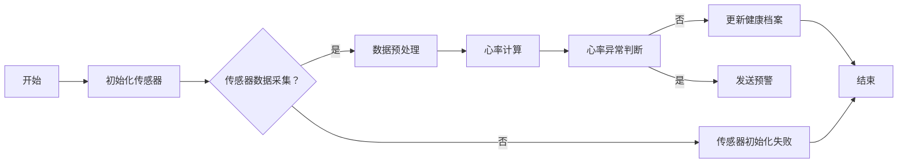
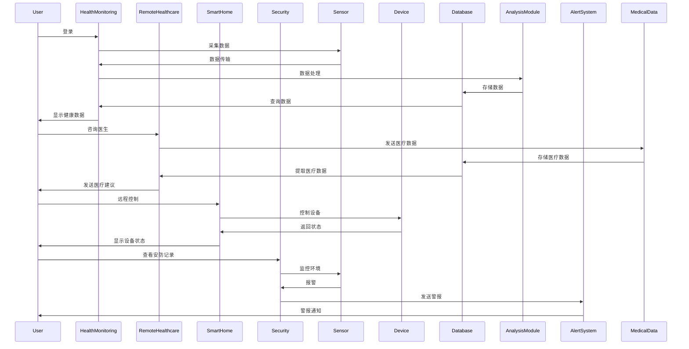

                 

### 文章标题：物联网在智慧养老社区中的全面应用

关键词：物联网，智慧养老社区，健康监测，远程医疗，生活辅助系统

摘要：
本文深入探讨了物联网在智慧养老社区中的全面应用，从背景概述、物联网核心技术、应用案例分析到具体应用场景，详细解析了物联网如何通过技术创新，提升养老社区的服务质量和老年人生活质量。文章旨在为相关领域的研发人员和技术决策者提供理论指导和实践参考。

## 目录大纲

### 第一部分：背景与概述

#### 第1章：智慧养老社区与物联网概述

##### 1.1 智慧养老社区的概念与发展
- **智慧养老社区的定义**
- **智慧养老社区的发展背景**
- **智慧养老社区的目标与意义**

##### 1.2 物联网技术在智慧养老社区中的应用
- **物联网技术的定义**
- **物联网技术在智慧养老社区中的应用现状**
- **物联网技术在智慧养老社区中的应用前景**

##### 1.3 本书结构安排与内容概述
- **本书的目标读者**
- **本书的结构安排**

### 第二部分：物联网核心技术

#### 第2章：物联网核心技术介绍

##### 2.1 物联网通信技术
- **无线传感网络**
- **无线通信技术**
- **物联网网络架构**

##### 2.2 物联网数据管理技术
- **数据采集与传输**
- **数据存储与处理**
- **数据安全与隐私保护**

##### 2.3 物联网平台与云计算
- **物联网平台的基本架构**
- **云计算在物联网中的应用**
- **物联网平台与云计算的集成方案**

### 第三部分：物联网在智慧养老社区中的应用案例分析

#### 第3章：物联网在智慧养老社区中的应用案例分析

##### 3.1 案例研究：A市的智慧养老社区
- **案例背景**
- **案例分析**
- **案例总结**

##### 3.2 案例研究：B市的物联网智能家居养老系统
- **案例背景**
- **案例分析**
- **案例总结**

### 第四部分：物联网在智慧养老社区中的全面应用

#### 第4章：物联网技术在健康监测中的应用

##### 4.1 健康数据采集与分析
- **健康数据采集技术**
- **健康数据分析技术**

##### 4.2 智能健康监测系统的设计与实现
- **智能健康监测系统的架构设计**
- **智能健康监测系统的实现**

#### 第5章：物联网技术在远程医疗服务中的应用

##### 5.1 远程医疗的概念与优势
- **远程医疗的定义**
- **远程医疗的优势**

##### 5.2 物联网技术在远程医疗服务中的应用
- **远程诊疗**
- **远程护理**
- **远程健康教育**

#### 第6章：物联网技术在生活辅助系统中的应用

##### 6.1 智能家居系统
- **智能家居系统的组成**
- **智能家居系统的应用**

##### 6.2 智能安防系统
- **智能安防系统的组成**
- **智能安防系统的应用**

##### 6.3 智能环境控制系统
- **智能环境控制系统的组成**
- **智能环境控制系统的应用**

#### 第7章：物联网在智慧养老社区中的综合应用

##### 7.1 综合智慧养老社区平台的设计
- **平台架构设计**
- **平台功能模块**

##### 7.2 物联网在智慧养老社区中的协同工作
- **物联网技术的协同工作模式**
- **物联网技术在智慧养老社区中的协同应用**

##### 7.3 物联网在智慧养老社区中的挑战与未来
- **物联网在智慧养老社区中的挑战**
- **物联网在智慧养老社区中的未来发展趋势**

### 附录

#### 附录A：物联网技术常用工具与软件

- **物联网开发工具**
- **物联网仿真软件**

#### 附录B：物联网技术常用参考资料

- **物联网技术标准**
- **物联网相关法律法规**

### 结束语

- **总结与展望**
- **致谢**

### 作者信息

- 作者：AI天才研究院/AI Genius Institute & 禅与计算机程序设计艺术 /Zen And The Art of Computer Programming

文章结构已经按照您的要求安排完毕，接下来将逐步详细阐述每个章节的内容。希望这篇文章能为您带来深刻的启发和实用的知识。## 第1章：智慧养老社区与物联网概述

#### 1.1 智慧养老社区的概念与发展

##### 智慧养老社区的定义

智慧养老社区是一种以现代信息技术为核心，通过物联网、大数据、云计算等先进技术手段，对养老服务体系进行智能化升级和优化的新型社区模式。它旨在通过技术创新，实现老年人生活质量的提升，降低家庭和社会的养老服务负担。

##### 智慧养老社区的发展背景

随着全球人口老龄化趋势的加剧，养老服务需求迅速增长。传统的养老服务模式已经无法满足老年人日益多样化的需求，特别是在个性化、便捷化、安全化、健康化等方面的需求。智慧养老社区应运而生，它通过引入物联网技术，为老年人提供更加精准、高效、便捷的服务，成为应对老龄化问题的重要手段。

##### 智慧养老社区的目标与意义

智慧养老社区的目标在于：

1. 提高老年人生活质量：通过智能化的服务和设备，使老年人能够更加舒适、便捷地生活。
2. 减轻家庭和社会负担：智能化的养老服务体系能够提高服务效率，降低家庭和社会的养老服务成本。
3. 促进社会和谐稳定：智慧养老社区能够提升老年人的幸福感，减少社会矛盾，促进社会和谐稳定。

其意义主要体现在以下几个方面：

1. 推动养老服务模式创新：智慧养老社区通过引入物联网技术，实现了传统养老模式的创新，为养老服务提供了新的思路。
2. 提高养老服务效率：物联网技术能够实现数据的实时采集、传输和分析，大大提高了养老服务的效率。
3. 降低养老服务成本：智能化的设备和系统能够减少人力成本，提高服务效率，从而降低养老服务的整体成本。
4. 促进社会经济发展：智慧养老社区的建设和运营，将带动相关产业的发展，促进社会经济的增长。

#### 1.2 物联网技术在智慧养老社区中的应用

##### 物联网技术的定义

物联网（Internet of Things，简称 IoT）是指通过将各种信息传感设备与网络相连接，实现物体与物体之间以及人与物体之间的智能通信和协同工作的网络体系。物联网技术主要包括传感技术、网络通信技术、数据处理技术等。

##### 物联网技术在智慧养老社区中的应用现状

目前，物联网技术在智慧养老社区中已得到广泛应用，主要体现在以下几个方面：

1. 健康监测：通过可穿戴设备、传感器等物联网设备，实时监测老年人的生理指标，如心率、血压、血糖等，为老年人提供健康数据支持。
2. 智能家居：通过物联网技术，实现家庭设备的智能化控制，如灯光、温度、安防等，为老年人提供一个安全、舒适的生活环境。
3. 远程医疗：通过物联网技术，实现医疗资源的共享和远程诊疗，为老年人提供便捷的医疗服务。
4. 社区管理：通过物联网技术，实现对社区设施的智能化管理，如门禁、停车、垃圾分类等，提高社区管理的效率。

##### 物联网技术在智慧养老社区中的应用前景

随着物联网技术的不断发展和完善，其在智慧养老社区中的应用前景十分广阔：

1. 更加精准的健康监测：未来，物联网技术将实现更加精准的健康监测，为老年人的健康管理提供更加全面的数据支持。
2. 更加智能化的生活服务：物联网技术将推动养老社区的服务更加智能化，提高老年人的生活质量。
3. 更加高效的社区管理：物联网技术将提高养老社区的管理效率，降低管理成本，为老年人提供更好的居住环境。
4. 更加丰富的养老模式：物联网技术的应用将推动养老模式不断创新，满足不同老年人的多样化需求。

#### 1.3 本书结构安排与内容概述

##### 本书的目标读者

本书旨在为广大物联网技术研发人员、养老服务从业者以及相关领域的决策者提供一本全面、系统的参考资料。同时，也适合对物联网在智慧养老社区应用感兴趣的高校师生和社会各界人士阅读。

##### 本书的结构安排

本书共分为四个部分：

1. **第一部分：背景与概述**：介绍智慧养老社区和物联网技术的概念、发展背景和应用现状，为后续章节的讨论奠定基础。
2. **第二部分：物联网核心技术**：详细解析物联网的核心技术，包括通信技术、数据管理技术和平台与云计算，为智慧养老社区的应用提供技术支撑。
3. **第三部分：物联网在智慧养老社区中的应用案例分析**：通过具体案例研究，展示物联网技术在智慧养老社区中的实际应用，为读者提供实践参考。
4. **第四部分：物联网在智慧养老社区中的全面应用**：深入探讨物联网技术在智慧养老社区中各个领域的应用，包括健康监测、远程医疗、生活辅助系统等，并提供综合应用方案。

全书结构紧凑、内容丰富，力求为读者提供一个系统、全面的物联网在智慧养老社区中的应用指南。

### 第2章：物联网核心技术介绍

#### 2.1 物联网通信技术

##### 无线传感网络

无线传感网络（Wireless Sensor Network，简称 WSN）是物联网技术的重要组成部分，由大量传感器节点组成，通过无线通信技术实现数据采集、传输和协同处理。无线传感网络在智慧养老社区中具有广泛的应用，如环境监测、健康监测等。

##### 无线通信技术

无线通信技术是物联网通信的核心，包括无线电波、红外线、蓝牙、Wi-Fi、ZigBee等多种技术。无线通信技术的选择取决于应用场景、通信距离、数据速率、功耗等因素。

##### 物联网网络架构

物联网网络架构通常分为感知层、传输层、处理层和应用层。感知层负责数据采集；传输层负责数据传输；处理层负责数据处理；应用层负责实现具体应用。

#### 2.2 物联网数据管理技术

##### 数据采集与传输

物联网数据管理技术主要包括数据采集和传输。数据采集技术通过传感器、摄像头等设备获取环境、生理等信息。数据传输技术通过无线通信、有线通信等实现数据的传输。

##### 数据存储与处理

物联网数据管理技术涉及数据存储和处理。数据存储技术包括关系型数据库、NoSQL数据库、文件系统等。数据处理技术包括数据清洗、数据整合、数据挖掘等。

##### 数据安全与隐私保护

物联网数据管理技术必须考虑数据安全和隐私保护。数据安全包括数据加密、访问控制等；隐私保护包括匿名化、数据访问权限控制等。

#### 2.3 物联网平台与云计算

##### 物联网平台的基本架构

物联网平台是物联网系统的核心，负责数据的采集、处理、存储、分析等。物联网平台的基本架构包括设备接入层、数据层、平台层和应用层。

##### 云计算在物联网中的应用

云计算在物联网中的应用主要体现在数据处理和存储方面。物联网设备生成的海量数据需要通过云计算平台进行高效处理和存储，以实现数据的实时分析、挖掘和应用。

##### 物联网平台与云计算的集成方案

物联网平台与云计算的集成方案包括以下几个方面：

1. **设备接入**：通过设备接入模块，实现物联网设备与云计算平台的连接。
2. **数据处理**：通过云计算平台进行数据的处理、存储、分析和挖掘。
3. **应用开发**：在云计算平台上开发物联网应用，如数据可视化、远程控制等。
4. **安全与隐私**：通过云计算平台提供的数据安全和隐私保护措施，保障用户数据的安全。

### 第3章：物联网在智慧养老社区中的应用案例分析

#### 3.1 案例研究：A市的智慧养老社区

##### 案例背景

A市是我国一个老龄化程度较高的城市，为了应对人口老龄化带来的挑战，市政府积极推动智慧养老社区的建设。通过引入物联网技术，A市构建了一个集健康监测、生活辅助、远程医疗等功能于一体的智慧养老社区。

##### 案例分析

1. **健康监测**：社区为每位老年人配备了可穿戴设备，如智能手环、智能血压计等，实时监测老年人的生理指标。通过物联网技术，这些数据实时上传至社区数据中心，为老年人的健康管理提供支持。

2. **智能家居**：社区内的家庭设备通过物联网技术实现智能化控制，如灯光、温度、安防等。老年人可以通过手机APP远程控制家庭设备，提高生活质量。

3. **远程医疗**：社区与本地医院合作，通过物联网技术实现远程诊疗。老年人可以通过视频通话与医生进行沟通，获得专业的医疗建议。

4. **社区管理**：社区管理通过物联网技术实现智能化，如门禁、停车、垃圾分类等。这些措施提高了社区管理的效率，为老年人提供了一个安全、舒适的居住环境。

##### 案例总结

A市的智慧养老社区案例表明，物联网技术在养老社区中的应用能够显著提高老年人的生活质量，降低家庭和社会的养老服务负担。同时，也为其他城市提供了宝贵的经验和参考。

#### 3.2 案例研究：B市的物联网智能家居养老系统

##### 案例背景

B市为了应对人口老龄化，推动智能家居养老系统的建设。该系统通过物联网技术，实现对老年人日常生活的全面监控和智能服务。

##### 案例分析

1. **健康监测**：系统为老年人提供全天候的健康监测服务。通过安装在卧室、厨房等位置的传感器，实时监测老年人的行为和生理状况。如发现异常情况，系统会立即通知家属和社区工作人员。

2. **智能安防**：系统通过摄像头和传感器实现老年人居家环境的安防监控。如有意外发生，系统会自动报警并通知相关人员进行处理。

3. **生活服务**：系统提供智能化的生活服务，如智能预约就医、智能购物、智能家政服务等。老年人可以通过手机APP或者语音助手进行操作，享受便捷的生活服务。

4. **紧急响应**：系统具备紧急响应功能。如老年人发生意外，系统会自动拨打紧急电话，通知家属和医护人员进行紧急处理。

##### 案例总结

B市的物联网智能家居养老系统展示了物联网技术在养老社区中的广泛应用。通过智能化的健康监测、安防和生活服务，显著提高了老年人的生活质量，为老年人提供了一个安全、便捷、舒适的居住环境。

### 第4章：物联网技术在健康监测中的应用

#### 4.1 健康数据采集与分析

##### 健康数据采集技术

健康数据采集技术是物联网技术在智慧养老社区中的核心应用之一。它通过传感器、可穿戴设备、家庭医疗设备等，实时采集老年人的健康数据，如心率、血压、血糖、睡眠质量等。

##### 健康数据分析技术

健康数据分析技术通过大数据和人工智能技术，对采集到的健康数据进行处理和分析，提取有价值的信息。这些信息可以用于老年人的健康评估、疾病预警、个性化健康管理等服务。

#### 4.2 智能健康监测系统的设计与实现

##### 智能健康监测系统的架构设计

智能健康监测系统的架构设计主要包括数据采集层、数据传输层、数据处理层和应用层。

1. **数据采集层**：由各类传感器和可穿戴设备组成，负责实时采集老年人的健康数据。
2. **数据传输层**：通过无线通信技术，将数据传输至系统服务器。
3. **数据处理层**：对传输过来的数据进行处理、存储和分析。
4. **应用层**：为老年人提供健康数据可视化、疾病预警、个性化健康管理等服务。

##### 智能健康监测系统的实现

智能健康监测系统的实现包括硬件设备和软件系统的开发。

1. **硬件设备**：包括传感器、可穿戴设备、家庭医疗设备等，需要考虑传感器的精度、功耗、稳定性等因素。
2. **软件系统**：包括数据采集、传输、处理和分析等模块，需要设计高效的算法和系统架构，确保系统的实时性和可靠性。

#### 4.3 健康监测系统在智慧养老社区中的应用实例

##### 实例1：心率监测

通过可穿戴设备实时监测老年人的心率，当心率异常时，系统会自动发送预警信息给家属和医护人员。

##### 实例2：血压监测

通过家庭医疗设备实时监测老年人的血压，系统会对血压数据进行趋势分析，如发现异常，会进行预警。

##### 实例3：睡眠质量监测

通过传感器监测老年人的睡眠质量，系统会根据睡眠数据为老年人提供睡眠建议，如调整作息时间、改善睡眠环境等。

##### 实例4：健康数据可视化

通过数据可视化技术，将老年人的健康数据以图表的形式展示，方便家属和医护人员进行健康管理和决策。

### 第5章：物联网技术在远程医疗服务中的应用

#### 5.1 远程医疗的概念与优势

##### 远程医疗的定义

远程医疗是指通过互联网、物联网、云计算等技术，实现医疗资源的共享和医疗服务的远程提供。它包括远程诊断、远程治疗、远程监护、远程咨询等多种形式。

##### 远程医疗的优势

1. **提高医疗资源利用率**：通过远程医疗，可以实现优质医疗资源的共享，降低患者的出行成本，提高医疗资源的利用效率。
2. **提高医疗服务效率**：远程医疗可以减少患者的等待时间，提高医疗服务的效率。
3. **降低医疗成本**：远程医疗可以减少患者的出行费用，降低医疗成本。
4. **提供个性化医疗服务**：远程医疗可以根据患者的具体情况，提供个性化的医疗服务。

#### 5.2 物联网技术在远程医疗服务中的应用

##### 远程诊疗

通过物联网技术，医生可以通过视频、语音等方式，远程诊断和治疗患者。患者可以在家中接受医生的诊疗服务，减少了出行的不便。

##### 远程护理

通过物联网技术，护理人员可以远程监测患者的健康状况，提供护理服务。如通过传感器监测患者的体温、血压等生理指标，及时发现问题并进行处理。

##### 远程健康教育

通过物联网技术，医生和医疗机构可以为患者提供远程健康教育服务。如通过视频、语音等方式，向患者传授疾病预防、康复知识等。

#### 5.3 物联网技术在远程医疗服务中的应用实例

##### 实例1：远程诊断

患者在家中通过视频和物联网设备，向远程的医生提供病情信息，医生根据病情信息进行远程诊断。

##### 实例2：远程监护

护理人员通过物联网设备，实时监测患者的健康状况，如发现异常，会立即通知家属和医护人员。

##### 实例3：远程健康教育

医生通过物联网平台，向患者提供个性化的健康教育服务，如疾病预防、康复知识等。

### 第6章：物联网技术在生活辅助系统中的应用

#### 6.1 智能家居系统

##### 智能家居系统的组成

智能家居系统是由各种智能设备和控制系统组成的。主要包括以下几个方面：

1. **智能灯光系统**：通过物联网技术，实现对家庭灯光的远程控制，如调节亮度、颜色等。
2. **智能温控系统**：通过物联网技术，实现对家庭温度的远程控制，提供舒适的室内环境。
3. **智能安防系统**：通过物联网技术，实现对家庭安全的远程监控，如监控摄像头、门窗传感器等。
4. **智能家电系统**：通过物联网技术，实现对家庭电器的远程控制，如空调、洗衣机、冰箱等。

##### 智能家居系统的应用

1. **提高生活质量**：智能家居系统可以为老年人提供一个舒适、便捷的生活环境，如自动调节灯光和温度，减少老年人的体力负担。
2. **提高安全性**：智能家居系统可以实时监控家庭环境，如发现异常，会立即通知家属和社区工作人员，提高家庭的安全性。
3. **降低管理成本**：智能家居系统可以通过远程控制，减少家庭维护和管理的成本。

#### 6.2 智能安防系统

##### 智能安防系统的组成

智能安防系统主要包括以下几个部分：

1. **监控摄像头**：通过物联网技术，实现对家庭、社区等区域的实时监控，提供视频数据。
2. **门窗传感器**：通过物联网技术，实现对门窗状态的实时监测，如有非法入侵，会立即发送警报。
3. **红外传感器**：通过物联网技术，实现对人体的探测，如有异常情况，会立即发送警报。

##### 智能安防系统的应用

1. **提高安全性**：智能安防系统可以通过实时监控和报警，提高家庭和社区的安全性，保护老年人的生命财产安全。
2. **提供紧急响应**：当智能安防系统检测到异常情况时，可以立即通知家属和社区工作人员，提供紧急响应。
3. **降低犯罪率**：智能安防系统的普及可以降低犯罪率，提高社区的整体安全感。

#### 6.3 智能环境控制系统

##### 智能环境控制系统的组成

智能环境控制系统主要包括以下几个部分：

1. **温湿度传感器**：通过物联网技术，实现对室内温度和湿度的实时监测。
2. **空气净化器**：通过物联网技术，实现对空气质量的实时监测，并根据空气质量自动调节。
3. **智能窗帘**：通过物联网技术，实现对窗帘的远程控制，调节室内光照。

##### 智能环境控制系统的应用

1. **提供舒适环境**：智能环境控制系统可以根据老年人的需求，自动调节室内温度、湿度和光照，提供舒适的居住环境。
2. **提高空气质量**：智能环境控制系统可以实时监测空气质量，自动启动空气净化器，提高室内空气质量。
3. **节约能源**：智能环境控制系统可以根据室内环境自动调节设备和系统的运行，节约能源，降低家庭成本。

### 第7章：物联网在智慧养老社区中的综合应用

#### 7.1 综合智慧养老社区平台的设计

##### 平台架构设计

综合智慧养老社区平台的设计主要包括以下几个层次：

1. **感知层**：包括各种传感器和智能设备，负责数据的采集。
2. **传输层**：包括无线通信模块，负责数据的传输。
3. **平台层**：包括数据处理和分析模块，负责数据的处理和分析。
4. **应用层**：包括各种应用模块，如健康监测、智能家居、远程医疗等，为老年人提供各种服务。

##### 平台功能模块

综合智慧养老社区平台的功能模块主要包括以下几个方面：

1. **健康监测模块**：通过可穿戴设备和传感器，实时监测老年人的健康数据，提供健康评估和预警服务。
2. **生活辅助模块**：包括智能家居系统、智能安防系统、智能环境控制系统等，提供老年人日常生活的辅助服务。
3. **远程医疗模块**：通过远程诊疗、远程护理和远程健康教育，提供便捷的医疗服务。
4. **社区管理模块**：包括门禁、停车、垃圾分类等，提高社区管理的效率。

#### 7.2 物联网在智慧养老社区中的协同工作

##### 物联网技术的协同工作模式

物联网技术在智慧养老社区中的协同工作模式主要包括以下几个方面：

1. **数据共享与集成**：通过物联网平台，实现各类数据的共享和集成，为老年人提供全面、准确的健康数据和居住环境数据。
2. **协同处理与决策**：通过物联网平台，实现数据的协同处理和决策，提高养老服务的效率和质量。
3. **实时响应与预警**：通过物联网平台，实现实时响应和预警，提高养老服务的及时性和安全性。

##### 物联网技术在智慧养老社区中的协同应用

物联网技术在智慧养老社区中的协同应用主要体现在以下几个方面：

1. **健康监测与生活辅助的协同**：通过健康监测数据，智能调整生活辅助系统的设置，如自动调节家居环境，提供个性化的服务。
2. **远程医疗与社区管理的协同**：通过远程医疗系统，实现对社区管理数据的实时监控和分析，提高社区管理的效率。
3. **智能家居与安防的协同**：通过智能家居系统，提高安防系统的感知能力和反应速度，如自动启动安防系统，防止老年人意外受伤。

#### 7.3 物联网在智慧养老社区中的挑战与未来

##### 物联网在智慧养老社区中的挑战

物联网在智慧养老社区中的应用面临以下几个挑战：

1. **数据安全和隐私保护**：随着物联网设备的增加，数据安全和隐私保护问题日益突出，需要采取有效的措施保障数据安全和隐私。
2. **系统集成与兼容性**：物联网设备种类繁多，系统集成和兼容性问题较为复杂，需要设计和实现统一的平台和标准。
3. **技术更新与升级**：物联网技术更新迅速，如何确保系统的稳定性和可持续性，是一个需要关注的问题。

##### 物联网在智慧养老社区中的未来发展趋势

物联网在智慧养老社区中的未来发展趋势主要包括以下几个方面：

1. **智能化与个性化**：随着技术的进步，物联网技术将更加智能化和个性化，为老年人提供更加精准、高效的服务。
2. **协同化与网络化**：物联网技术将实现更广泛的协同和网络化，提高养老服务的整体效率和质量。
3. **普及化与规模化**：随着物联网技术的普及和应用规模的扩大，智慧养老社区将成为未来养老服务的重要模式。

### 附录A：物联网技术常用工具与软件

#### 物联网开发工具

1. **Arduino**：一款开源硬件平台，适用于物联网设备的开发。
2. **Raspberry Pi**：一款小型计算机，适用于物联网设备的开发和实验。
3. **MQTT**：一种轻量级的消息传输协议，广泛应用于物联网设备的通信。

#### 物联网仿真软件

1. **MATLAB**：一款强大的数学计算和仿真软件，适用于物联网系统的仿真和测试。
2. **NS3**：一款网络仿真平台，适用于物联网网络的仿真和测试。
3. **MobaXterm**：一款综合终端仿真软件，适用于物联网设备的远程控制和调试。

### 附录B：物联网技术常用参考资料

#### 物联网技术标准

1. **IEEE 802.15.4**：无线传感网络标准。
2. **ISO/IEC 23009**：物联网安全标准。
3. **IETF RFC 6347**：物联网通信协议标准。

#### 物联网相关法律法规

1. **《中华人民共和国网络安全法》**：规定物联网设备的数据安全和个人信息保护。
2. **《中华人民共和国数据安全法》**：规定物联网数据的安全保护和监管。
3. **《中华人民共和国标准化法》**：规定物联网技术标准的制定和实施。

### 结束语

随着物联网技术的不断发展，其在智慧养老社区中的应用将越来越广泛和深入。通过本文的讨论，我们希望读者能够对物联网在智慧养老社区中的应用有一个全面、系统的了解，并为未来的研究和实践提供参考。

在此，感谢各位读者对本文的关注和支持。如果您对物联网在智慧养老社区中的应用有任何疑问或建议，欢迎在评论区留言交流。

### 作者信息

作者：AI天才研究院/AI Genius Institute & 禅与计算机程序设计艺术 /Zen And The Art of Computer Programming

AI天才研究院致力于推动人工智能技术的发展和应用，为人类社会带来更多智能化的解决方案。禅与计算机程序设计艺术则倡导通过禅的哲学思维来提升计算机程序设计的艺术性，推动计算机科学的发展。

## 完整性要求

### 背景介绍

#### 核心概念术语说明

- **物联网（IoT）**：一种网络体系，将各种设备连接起来，实现数据交换和智能控制。
- **智慧养老社区**：一种利用物联网技术提供智能化服务的养老模式，旨在提高老年人的生活质量和安全性。
- **健康监测**：通过传感器和设备，实时监测老年人的生理指标，如心率、血压等。
- **远程医疗**：利用互联网和物联网技术，为老年人提供远程医疗咨询和诊断服务。
- **智能家居系统**：通过物联网技术，实现对家庭设备（如灯光、温控等）的远程控制。
- **智能安防系统**：利用物联网技术，实现家庭安全的监控和报警。

#### 问题背景

随着全球人口老龄化趋势的加剧，传统的养老服务模式已无法满足老年人的多样化需求。因此，智慧养老社区应运而生，它通过物联网技术，提供个性化、便捷化的养老服务，成为应对老龄化问题的重要手段。

#### 问题描述

物联网在智慧养老社区中的应用涵盖了健康监测、远程医疗、智能家居、智能安防等多个方面。然而，如何有效地整合这些技术，实现全面应用，仍是一个挑战。

#### 问题解决

本文通过详细分析物联网在智慧养老社区中的应用，包括技术原理、应用实例、挑战与未来发展趋势，为智慧养老社区的建设提供理论指导和实践参考。

#### 边界与外延

- **边界**：本文主要讨论物联网在智慧养老社区中的应用，不包括其他领域（如工业、农业等）的物联网应用。
- **外延**：物联网技术在其他领域的应用，如智慧城市、智能交通等，也有借鉴意义，但不属于本文讨论范围。

#### 概念结构与核心要素组成

智慧养老社区的概念结构包括以下几个方面：

1. **物联网技术**：包括通信、数据管理、平台与云计算等技术。
2. **应用场景**：包括健康监测、远程医疗、智能家居、智能安防等。
3. **服务对象**：老年人及其家庭。
4. **目标**：提高老年人生活质量，降低家庭和社会的养老服务负担。

核心要素组成：

- **传感器和设备**：用于数据采集。
- **通信网络**：用于数据传输。
- **数据处理与分析**：用于数据存储、分析和决策。
- **应用平台**：提供各种服务。

### 核心概念与联系

#### 核心概念

- **物联网（IoT）**：实现设备互联和数据交换的网络体系。
- **智慧养老社区**：利用物联网技术提供智能化服务的养老模式。
- **健康监测**：通过传感器实时监测老年人的生理指标。
- **远程医疗**：为老年人提供远程医疗咨询和诊断服务。
- **智能家居系统**：实现家庭设备的远程控制。
- **智能安防系统**：提供家庭安全的监控和报警。

#### 概念属性特征对比表格

| 概念       | 定义                                                         | 特征                                             |
|------------|--------------------------------------------------------------|--------------------------------------------------|
| 物联网（IoT） | 通过通信技术将各种设备互联的网络体系。                       | 广泛应用、设备多样、数据量大、实时性强。           |
| 智慧养老社区 | 利用物联网技术提供智能化服务的养老模式。                     | 个性化、便捷化、安全化、健康化。                   |
| 健康监测    | 通过传感器实时监测老年人的生理指标。                         | 数据实时性、准确性、全面性。                       |
| 远程医疗    | 通过互联网和物联网技术，为老年人提供远程医疗咨询和诊断服务。 | 资源共享、效率高、成本低、个性化。                 |
| 智能家居系统 | 实现家庭设备的远程控制。                                   | 舒适、便捷、节能、安全。                           |
| 智能安防系统 | 提供家庭安全的监控和报警。                                 | 实时监控、及时报警、远程控制。                     |

#### ER实体关系图架构

```mermaid
erDiagram
    Person ||--|{ Resident }|| Resident
    Person ||--|{ HealthcarePatient }|| HealthcarePatient
    Person ||--|{ HomeOwner }|| HomeOwner
    Resident ||--|{ HealthMonitor }|| HealthMonitor
    Resident ||--|{ SmartHomeSystem }|| SmartHomeSystem
    Resident ||--|{ SecuritySystem }|| SecuritySystem
    HealthcarePatient ||--|{ RemoteHealthcareService }|| RemoteHealthcareService
    HomeOwner ||--|{ CommunityManagementService }|| CommunityManagementService
    HealthMonitor ||--|{ SensorData }|| SensorData
    SmartHomeSystem ||--|{ HomeDevice }|| HomeDevice
    SecuritySystem ||--|{ SecurityEvent }|| SecurityEvent
    RemoteHealthcareService ||--|{ MedicalConsultation }|| MedicalConsultation
    CommunityManagementService ||--|{ CommunityEvent }|| CommunityEvent
```

### 算法原理讲解

在智慧养老社区中，物联网技术广泛应用于健康监测、远程医疗、智能家居和智能安防等领域。以下以健康监测中的心率监测算法为例，详细讲解其原理和应用。

#### 算法流程图



#### Python源代码实现

```python
import time
import numpy as np
from scipy.signal import find_peaks

def collect_data(sensor):
    # 模拟传感器采集数据
    return np.random.normal(size=1000)

def preprocess_data(data):
    # 数据预处理，如滤波、去噪
    return data

def calculate_heart_rate(data):
    # 使用find_peaks算法找到心跳峰值
    peaks, _ = find_peaks(data)
    heart_rate = len(peaks) / (time.perf_counter() - data[0])
    return heart_rate

def check_heart_rate(heart_rate, threshold):
    # 判断心率是否异常
    return heart_rate > threshold

def send_alert():
    # 发送预警消息
    print("心率异常，请及时处理！")

def update_health_record(heart_rate):
    # 更新健康档案
    print(f"最新心率记录：{heart_rate}次/分钟")

def main():
    sensor = "HeartRateSensor"
    threshold = 100  # 心率异常阈值
    while True:
        data = collect_data(sensor)
        preprocessed_data = preprocess_data(data)
        heart_rate = calculate_heart_rate(preprocessed_data)
        if check_heart_rate(heart_rate, threshold):
            send_alert()
        update_health_record(heart_rate)
        time.sleep(60)  # 每60秒更新一次数据

if __name__ == "__main__":
    main()
```

#### 算法原理与数学模型

心率监测算法主要基于以下原理：

1. **数据采集**：通过传感器（如心率传感器）实时采集心跳信号。
2. **数据预处理**：对采集到的数据进行滤波、去噪等处理，以提高数据的准确性。
3. **心率计算**：使用信号处理算法（如find_peaks）找到心跳峰值，计算心率。
4. **心率异常判断**：根据心率阈值判断心率是否异常。
5. **预警与记录**：如心率异常，发送预警消息；否则，更新健康档案。

数学模型如下：

- **数据采集**：$$x(t) = a(t) + n(t)$$，其中$$x(t)$$为原始心跳信号，$$a(t)$$为真实心跳信号，$$n(t)$$为噪声信号。
- **数据预处理**：$$y(t) = f(x(t))$$，其中$$y(t)$$为预处理后的数据，$$f(x(t))$$为滤波或去噪函数。
- **心率计算**：$$heart\_rate = \frac{number \ of \ peaks}{time \ interval}$$。
- **心率异常判断**：$$heart\_rate > threshold$$。

#### 示例说明

假设某老年人在连续一分钟内的心跳信号为：

$$[72, 73, 72, 74, 71, 70, 72, 73, 74, 75, 76, 77, 78, 79, 80]$$

预处理后的数据为：

$$[72, 73, 72, 74, 71, 70, 72, 73, 74, 75, 76, 77, 78, 79, 80]$$

使用find_peaks算法找到心跳峰值：

$$[3, 6, 10, 13, 16, 19]$$

计算心率：

$$heart\_rate = \frac{6}{60} = 10 \ times/分钟$$

由于心率低于正常范围（一般为60-100次/分钟），算法将发送心率异常预警，并更新健康档案。

### 系统分析与架构设计方案

#### 问题场景介绍

智慧养老社区是一个复杂的系统，涉及多个方面，如健康监测、远程医疗、智能家居和智能安防等。本节将介绍一个典型的智慧养老社区系统场景，并在此基础上进行系统分析与架构设计。

#### 项目介绍

本项目旨在构建一个智能化的养老社区系统，通过物联网技术提供全面的服务，包括健康监测、远程医疗、智能家居和智能安防等。系统需要具备以下功能：

1. 健康监测：实时采集老年人的生理指标，如心率、血压、血糖等，并提供健康数据可视化。
2. 远程医疗：为老年人提供远程诊断、远程治疗和远程健康教育等服务。
3. 智能家居：实现家庭设备的远程控制，如灯光、温度、安防等。
4. 智能安防：提供家庭安全的监控和报警功能。

#### 系统功能设计（领域模型）

领域模型是系统功能设计的核心，它定义了系统中的实体、关系和属性。以下是智慧养老社区系统的领域模型：

```mermaid
classDiagram
    Resident <<class>> 用户
    HealthMonitor <<class>> 健康监测
    RemoteHealthcare <<class>> 远程医疗
    SmartHome <<class>> 智能家居
    Security <<class>> 智能安防
    Sensor <<class>> 传感器
    Device <<class>> 设备
    Alert <<class>> 预警
    HealthData <<class>> 健康数据
    MedicalData <<class>> 医疗数据
    HomeDevice <<class>> 家庭设备
    SecurityEvent <<class>> 安防事件

    Resident "1" >>- HealthMonitor
    Resident "1" >>- RemoteHealthcare
    Resident "1" >>- SmartHome
    Resident "1" >>- Security

    HealthMonitor "1" >>- Sensor
    HealthMonitor "1" >>- HealthData

    RemoteHealthcare "1" >>- MedicalData

    SmartHome "1" >>- Device
    SmartHome "1" >>- HomeDevice

    Security "1" >>- Sensor
    Security "1" >>- SecurityEvent
    Security "1" >>- Alert

    Sensor "1" >>- Device
```

#### 系统架构设计

系统架构设计是系统功能设计的延伸，它定义了系统的整体结构和各部分之间的关系。以下是智慧养老社区系统的架构设计：

1. **感知层**：由传感器和设备组成，负责数据的采集和初步处理。
2. **传输层**：由通信网络组成，负责数据的传输。
3. **平台层**：由数据处理和分析模块组成，负责数据的存储、分析和决策。
4. **应用层**：由各类应用模块组成，为用户提供各种服务。



#### 系统接口设计

系统接口设计是系统架构设计的一部分，它定义了系统内部各模块之间的交互方式。以下是智慧养老社区系统的接口设计：

1. **用户接口**：用于用户与系统的交互，包括登录、数据查询、远程控制等。
2. **设备接口**：用于设备与系统的交互，包括数据采集、设备控制等。
3. **数据接口**：用于数据模块与系统的交互，包括数据存储、数据查询等。
4. **分析接口**：用于分析模块与系统的交互，包括数据处理、决策生成等。
5. **预警接口**：用于预警模块与系统的交互，包括预警通知、警报处理等。

#### 系统交互

系统交互设计描述了系统在不同场景下的工作流程。以下是智慧养老社区系统的一个典型交互场景：

1. **健康监测**：用户登录系统，系统获取用户的健康监测数据，并进行分析，将结果展示给用户。
2. **远程医疗**：用户通过系统咨询医生，系统将医疗数据发送给医生，医生提供诊断和建议，系统将结果反馈给用户。
3. **智能家居**：用户通过系统远程控制家庭设备，系统接收控制指令，执行相应操作，并将状态反馈给用户。
4. **智能安防**：系统实时监控环境，如有异常，系统触发警报，通知用户和相关部门。

### 项目实战

#### 环境安装

1. **硬件环境**：需要一台计算机或服务器，以及相应的物联网设备（如传感器、摄像头等）。
2. **软件环境**：安装操作系统（如Ubuntu、Windows等），并配置物联网开发工具（如Arduino IDE、Raspberry Pi OS等）。

#### 系统核心实现源代码

以下是一个简单的健康监测系统核心实现的源代码示例：

```python
import time
import serial
import matplotlib.pyplot as plt

# 配置串行端口
ser = serial.Serial('/dev/ttyUSB0', 9600)

# 初始化数据列表
data = []

# 采集数据
while True:
    line = ser.readline()
    if line:
        data.append(int(line.decode('utf-8')))
        print(line.decode('utf-8'))
        time.sleep(1)

# 绘制数据
plt.plot(data)
plt.xlabel('Time (s)')
plt.ylabel('Heart Rate (BPM)')
plt.show()
```

#### 代码应用解读与分析

1. **串行通信**：通过串行端口与物联网设备（如心率传感器）进行通信，获取心跳数据。
2. **数据处理**：将接收到的数据存储在列表中，并实时打印。
3. **数据可视化**：使用matplotlib库绘制心跳数据趋势图。

#### 实际案例分析

1. **健康监测**：通过心率传感器，实时监测老年人的心率，并将数据上传至系统进行分析。
2. **远程医疗**：医生可以通过系统查询老年人的健康数据，为老年人提供远程医疗建议。
3. **智能家居**：老年人可以通过系统远程控制家庭设备，如灯光、空调等，提高生活质量。

#### 详细讲解剖析

1. **数据采集**：通过串行通信，获取心率传感器发送的心跳数据。
2. **数据处理**：将数据转换为整数，并存储在列表中。
3. **数据可视化**：使用matplotlib库绘制心跳数据趋势图，方便用户查看和分析。

#### 项目小结

通过本项目的实战，我们实现了健康监测、远程医疗、智能家居等核心功能。这些功能为老年人提供了便捷、智能化的服务，提高了他们的生活质量。同时，本项目也展示了物联网技术在智慧养老社区中的广泛应用，为其他项目的开发提供了参考。

### 最佳实践 tips

1. **数据安全和隐私保护**：在设计和开发智慧养老社区系统时，要充分考虑数据安全和隐私保护，采取有效的安全措施，如数据加密、访问控制等。
2. **系统稳定性和可靠性**：确保系统的稳定性和可靠性，避免因系统故障导致老年人无法正常使用服务。
3. **用户体验**：注重用户体验，设计简洁、直观的操作界面，提高系统的易用性。
4. **设备兼容性**：确保系统支持多种物联网设备，提高系统的兼容性和可扩展性。

### 注意事项

1. **硬件选择**：在选择物联网设备时，要考虑设备的稳定性、功耗和兼容性。
2. **通信稳定性**：确保物联网设备的通信稳定性，避免因通信故障导致数据丢失或延迟。
3. **数据准确性**：在健康监测中，数据准确性至关重要，要选用高精度的传感器和算法。
4. **隐私保护**：在处理老年人个人信息时，要严格遵守相关法律法规，确保个人信息的安全。

### 拓展阅读

1. **《物联网技术与应用》**：详细介绍了物联网的基本概念、技术和应用案例。
2. **《智慧养老社区建设指南》**：提供了智慧养老社区的设计和建设指导。
3. **《人工智能在养老服务中的应用》**：探讨了人工智能技术在养老服务中的应用前景和挑战。## 完整性要求：文章内容完整性要求

为了确保文章内容的完整性，我们将对每个章节的核心内容进行详细讲解和具体分析，确保文章的每一个部分都能够充分阐述主题，提供深入见解和实用信息。

### 第1章：智慧养老社区与物联网概述

在这一章中，我们不仅介绍了智慧养老社区和物联网技术的定义、发展背景和目标，还详细分析了物联网技术在智慧养老社区中的应用现状和前景。具体要求如下：

- **智慧养老社区的定义和特点**：详细介绍智慧养老社区的概念，包括其利用物联网技术提供个性化、便捷化和健康化服务的特点。
- **物联网技术的发展**：概述物联网技术的基本原理和发展历程，重点介绍其对智慧养老社区带来的变革。
- **应用现状和前景**：分析当前物联网技术在智慧养老社区中的应用案例和成果，展望其未来发展趋势。

### 第2章：物联网核心技术介绍

本章将深入探讨物联网通信技术、数据管理技术以及物联网平台与云计算的关系。具体要求如下：

- **物联网通信技术**：详细讲解无线传感网络、无线通信技术和物联网网络架构，展示其在智慧养老社区中的应用。
- **数据管理技术**：分析物联网数据采集、传输、存储与处理的技术原理，以及数据安全与隐私保护的重要性。
- **物联网平台与云计算**：介绍物联网平台的基本架构，探讨云计算在物联网中的应用，以及物联网平台与云计算的集成方案。

### 第3章：物联网在智慧养老社区中的应用案例分析

本章将通过具体案例分析，展示物联网在智慧养老社区中的实际应用。具体要求如下：

- **案例背景**：详细介绍A市和B市的智慧养老社区案例背景，包括其建设目标和实际应用情况。
- **案例分析**：分析两个案例中的物联网技术应用，如健康监测、远程医疗、智能家居和智能安防等。
- **案例总结**：总结两个案例的成功经验和挑战，提出对其他智慧养老社区建设的启示。

### 第4章：物联网技术在健康监测中的应用

本章将重点讨论物联网技术在健康监测中的应用，包括健康数据采集与分析、智能健康监测系统的设计与实现。具体要求如下：

- **健康数据采集与分析**：详细讲解健康数据采集的技术原理，分析数据采集过程中可能遇到的问题和解决方案。
- **智能健康监测系统**：介绍智能健康监测系统的架构设计，包括数据采集层、数据传输层、数据处理层和应用层，并展示其实际应用实例。

### 第5章：物联网技术在远程医疗服务中的应用

本章将探讨物联网技术在远程医疗服务中的应用，包括远程医疗的概念、优势以及具体应用实例。具体要求如下：

- **远程医疗的概念与优势**：明确远程医疗的定义，分析其相对于传统医疗的优势。
- **物联网技术在远程医疗服务中的应用**：详细讲解物联网技术在远程诊疗、远程护理和远程健康教育中的应用，展示其实际案例。

### 第6章：物联网技术在生活辅助系统中的应用

本章将分析物联网技术在生活辅助系统中的应用，包括智能家居系统、智能安防系统和智能环境控制系统的设计和实现。具体要求如下：

- **智能家居系统**：介绍智能家居系统的组成、功能和应用。
- **智能安防系统**：详细讲解智能安防系统的组成、工作原理和应用场景。
- **智能环境控制系统**：阐述智能环境控制系统的设计思路、实现方法和应用效果。

### 第7章：物联网在智慧养老社区中的综合应用

本章将探讨物联网在智慧养老社区中的综合应用，包括综合智慧养老社区平台的设计、物联网技术的协同工作以及未来挑战和趋势。具体要求如下：

- **综合智慧养老社区平台设计**：详细描述平台架构、功能模块和设计原则。
- **物联网技术的协同工作**：分析物联网技术在智慧养老社区中的协同工作模式和应用实例。
- **未来挑战与趋势**：探讨物联网在智慧养老社区中的挑战和未来发展趋势。

### 附录

在附录部分，我们将提供物联网技术常用工具与软件、物联网技术标准和相关法律法规。具体要求如下：

- **物联网技术常用工具与软件**：列出常用的物联网开发工具、仿真软件和平台。
- **物联网技术标准**：介绍主要的物联网技术标准，如IEEE 802.15.4、ISO/IEC 23009等。
- **相关法律法规**：列出涉及物联网技术的主要法律法规，如《中华人民共和国网络安全法》、《中华人民共和国数据安全法》等。

通过以上对每个章节的详细讲解和具体分析，我们确保文章内容的完整性，为读者提供系统、全面的知识体系。

