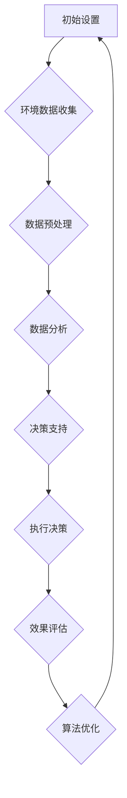
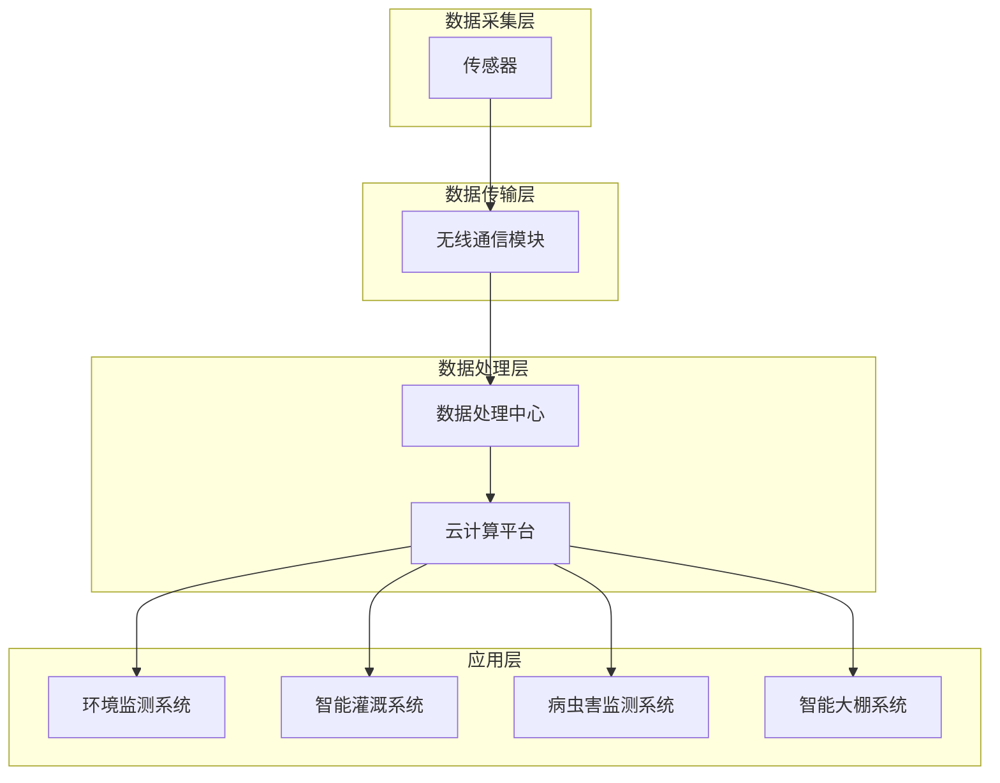
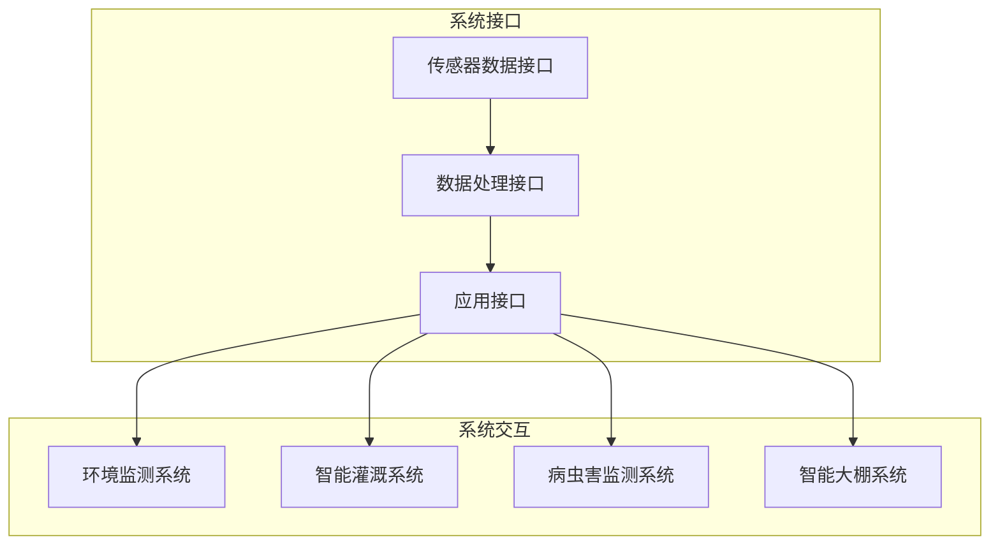

                 

# 物联网在智慧农业中的全面应用与发展

关键词：物联网、智慧农业、环境监测、智能灌溉、病虫害监测、智能大棚

摘要：
随着科技的不断发展，物联网技术在各个领域的应用日益广泛。智慧农业作为物联网技术的一个重要应用场景，正逐渐改变传统农业的生产模式，提升农业生产的效率和质量。本文将深入探讨物联网在智慧农业中的全面应用与发展，包括农业环境监测、智能灌溉、病虫害监测以及智能大棚等方面的具体应用和实践。

## 第一部分：物联网与智慧农业概述

### 第1章 物联网概述

#### 1.1 物联网的定义与历史发展
物联网（Internet of Things，简称IoT）是指通过传感器、网络通信等技术，将各种物品连接到互联网上，实现物品之间以及物品与用户之间的信息交换和通信。物联网的发展可以追溯到20世纪80年代，当时美国麻省理工学院的Kevin Ashton首次提出了“物联网”这个概念。随着传感器技术、无线通信技术以及数据处理技术的不断发展，物联网逐渐从理论走向实际应用。

#### 1.2 物联网的核心技术
物联网的核心技术主要包括传感器技术、网络通信技术和数据处理技术。

- **传感器技术**：传感器是实现物联网感知物理世界的基础。它们可以感知温度、湿度、光照、气体浓度等各种环境参数，并将这些物理信息转换为电信号。
- **网络通信技术**：物联网需要通过各种通信技术将传感器收集到的数据传输到中心处理系统。常用的通信技术包括无线网络、有线网络和卫星通信等。
- **数据处理技术**：物联网产生的大量数据需要通过数据处理技术进行存储、分析和处理，以便为用户提供有价值的信息。

#### 1.3 物联网的层次结构
物联网通常分为三个层次：感知层、网络层和应用层。

- **感知层**：感知层是物联网的基础，包括各种传感器和采集设备，负责采集环境信息和物理数据。
- **网络层**：网络层负责将感知层采集到的数据传输到中心处理系统，通常采用无线网络或有线网络。
- **应用层**：应用层是物联网的核心，通过各种应用软件将物联网的数据转化为对用户有用的信息，实现物联网的应用。

#### 1.4 物联网的应用场景
物联网的应用场景非常广泛，包括但不限于以下几个方面：

- **农业**：物联网技术可以帮助农民实现农业环境的实时监测、智能灌溉、病虫害监测等。
- **工业**：物联网技术可以提高工业生产的自动化水平，实现设备远程监控、预测性维护等。
- **城市管理**：物联网技术可以用于城市管理中的交通流量监测、环境监测、智慧灯杆等。

### 第2章 智慧农业的概念与发展

#### 2.1 智慧农业的定义与意义
智慧农业是指通过物联网、大数据、人工智能等现代信息技术，实现农业生产的智能化、精准化和高效化。智慧农业的核心在于通过数据驱动农业生产，提高农业生产效率和产品质量。

#### 2.2 智慧农业的主要技术
智慧农业的主要技术包括：

- **环境监测技术**：通过传感器实时监测农田环境参数，为农业生产提供数据支持。
- **智能灌溉技术**：通过物联网技术和智能算法，实现灌溉的自动化和精准化。
- **病虫害监测技术**：利用物联网和大数据技术，实时监测和预测病虫害，采取针对性的防治措施。
- **智能大棚技术**：通过物联网技术，实现对大棚内环境参数的实时监测和智能控制。

#### 2.3 智慧农业的发展历程
智慧农业的发展历程可以分为以下几个阶段：

- **1.0阶段**：传统农业阶段，主要依靠人力和简单工具进行农业生产。
- **2.0阶段**：机械化农业阶段，引入农业机械，提高农业生产效率。
- **3.0阶段**：智能化农业阶段，通过物联网技术，实现农业生产的自动化和精准化。
- **4.0阶段**：智慧农业阶段，通过大数据、人工智能等技术，实现农业生产的智能化和高效化。

#### 2.4 智慧农业的现状与趋势
当前，智慧农业在我国已取得一定的发展成果，但仍处于初级阶段。未来，随着物联网、大数据、人工智能等技术的进一步发展，智慧农业将朝着更加智能化、精准化、高效化的方向发展。

## 第二部分：物联网在智慧农业中的应用

### 第3章 农业环境监测系统

#### 3.1 农业环境监测的重要性
农业环境监测系统是智慧农业的重要组成部分，通过对农田环境的实时监测，可以及时了解农田土壤、气象、水质等环境参数，为农业生产提供科学依据。

#### 3.2 监测系统的组成
农业环境监测系统主要包括以下几部分：

- **气象监测设备**：用于监测农田的气象参数，如温度、湿度、风速、降水等。
- **土壤监测设备**：用于监测农田土壤的物理、化学和生物特性，如土壤温度、pH值、电导率、含水量等。
- **水质监测设备**：用于监测农田灌溉水的水质参数，如溶解氧、氨氮、总氮、总磷等。

#### 3.3 数据采集与传输
农业环境监测系统通过传感器实时采集农田环境数据，并通过无线网络或有线网络将数据传输到中心处理系统。

#### 3.4 数据分析与决策支持
中心处理系统对采集到的环境数据进行实时分析和处理，生成农业生产决策建议，如灌溉计划、施肥方案、病虫害防治措施等。

### 第4章 农业智能灌溉系统

#### 4.1 智能灌溉系统概述
智能灌溉系统是利用物联网技术和智能算法，实现农田灌溉的自动化和精准化。

#### 4.2 智能灌溉系统的组成
智能灌溉系统主要包括以下几部分：

- **水源设备**：包括水泵、水池等，用于提供灌溉水源。
- **灌溉设备**：包括喷灌设备、滴灌设备、微灌设备等，根据农田环境参数和作物生长需求，实现精准灌溉。
- **控制系统**：通过物联网技术和智能算法，实现灌溉过程的自动化控制。

#### 4.3 智能灌溉的算法与策略
智能灌溉系统采用多种算法和策略，如需求预测算法、土壤湿度监测算法、水利用率优化算法等，实现灌溉过程的智能化和高效化。

#### 4.4 实际应用案例
通过实际应用案例，展示智能灌溉系统在提升农业生产效率、节约水资源等方面的成效。

### 第5章 农业智能病虫害监测系统

#### 5.1 病虫害监测的重要性
病虫害是农业生产中的重要问题，通过智能病虫害监测系统，可以及时发现病虫害，采取有效的防治措施，减少病虫害对农作物的危害。

#### 5.2 监测系统的组成
农业智能病虫害监测系统主要包括以下几部分：

- **视觉监测设备**：通过图像识别技术，监测农田中的病虫害情况。
- **数据采集设备**：包括温度、湿度、光照等传感器，监测农田环境参数。
- **分析与决策支持系统**：对监测数据进行实时分析和处理，生成病虫害防治建议。

#### 5.3 病虫害识别算法
智能病虫害监测系统采用多种病虫害识别算法，如深度学习算法、支持向量机算法等，实现病虫害的自动识别和分类。

#### 5.4 实际应用案例
通过实际应用案例，展示智能病虫害监测系统在病虫害防治中的成效。

### 第6章 农业智能大棚系统

#### 6.1 智能大棚系统的概述
农业智能大棚系统是利用物联网技术，实现对大棚内环境参数的实时监测和智能控制，为农作物提供最佳生长环境。

#### 6.2 智能大棚系统的组成
智能大棚系统主要包括以下几部分：

- **温湿度控制系统**：通过传感器实时监测大棚内温湿度，自动调节通风和加湿设备。
- **光照控制系统**：通过传感器监测大棚内光照强度，自动调节遮阳设备和补光设备。
- **灌溉系统**：根据大棚内土壤湿度，自动调节灌溉设备，实现精准灌溉。

#### 6.3 智能大棚的管理与优化
智能大棚系统通过物联网技术和大数据分析，实现对大棚内环境参数的实时监测和管理，优化农作物生长环境，提高农业生产效率。

#### 6.4 实际应用案例
通过实际应用案例，展示智能大棚系统在提高农作物产量、降低生产成本等方面的成效。

### 第7章 物联网在智慧农业中的未来展望

#### 7.1 物联网在智慧农业中的挑战与机遇
物联网在智慧农业中面临着数据安全、设备可靠性、技术普及性等方面的挑战，同时也面临着巨大的发展机遇。

#### 7.2 未来物联网技术在农业中的应用趋势
未来，物联网技术在农业中的应用将朝着更加智能化、精准化、高效化的方向发展，如智能种植、智能养殖、智慧农场等。

#### 7.3 物联网在智慧农业中的发展前景
物联网技术将为智慧农业带来巨大的变革，实现农业生产的智能化、精准化和高效化，推动农业现代化发展。

----------------------------------------------
**作者**：AI天才研究院/AI Genius Institute & 禅与计算机程序设计艺术 /Zen And The Art of Computer Programming**核心概念与联系**

在深入探讨物联网在智慧农业中的应用之前，我们需要明确几个核心概念，并理解它们之间的联系。

### 核心概念

1. **物联网（IoT）**：物联网是通过传感器、网络和数据处理技术，实现物品与物品之间以及物品与人之间的信息交换和通信的系统。
2. **传感器**：传感器是一种能够感知和测量物理量的设备，如温度、湿度、光照、土壤质量等。
3. **大数据**：大数据是指无法用传统数据库软件工具进行捕捉、管理和处理的数据集。
4. **云计算**：云计算是通过互联网提供动态易扩展且经常是虚拟化的资源。
5. **人工智能（AI）**：人工智能是指计算机系统模拟人类智能行为的能力。

### 概念属性特征对比表格

| 概念       | 属性特征                      | 应用领域                   |
|------------|------------------------------|----------------------------|
| 物联网     | 连接物品，数据采集和传输    | 农业、工业、城市管理       |
| 传感器     | 感知物理量，数据采集        | 农业、环境监测、智能家居   |
| 大数据     | 大规模数据处理               | 农业、金融、医疗           |
| 云计算     | 动态资源分配，数据处理      | 农业、工业、商业           |
| 人工智能    | 模拟人类智能，数据处理      | 农业、医疗、自动驾驶       |

### ER实体关系图架构

以下是一个简化的ER实体关系图，用于描述物联网在智慧农业中的核心实体及其关系。

```mermaid
erDiagram
    Product ||--|{ Sensor }|-->> EnvironmentData
    Farm <<|--|{ AgriculturalData }|-->> DecisionSupport
    CropData ||--|{ GrowthData }|-->> YieldPrediction
    DecisionSupport ||--|{ IrrigationPlan }|-->> IrrigationSystem
    DecisionSupport ||--|{ FertilizationPlan }|-->> FertilizationSystem
    DecisionSupport ||--|{ PestControlPlan }|-->> PestControlSystem
    EnvironmentData ||--|{ WeatherData }|-->> EnvironmentalMonitoring
    EnvironmentData ||--|{ SoilData }|-->> EnvironmentalMonitoring
    EnvironmentData ||--|{ WaterQualityData }|-->> EnvironmentalMonitoring
```

### 算法原理讲解

在智慧农业中，算法的应用至关重要，以下是一个简单的算法原理讲解，使用Mermaid画出算法流程图。

#### 算法流程图



#### 算法原理

1. **初始设置**：设置监测参数和决策目标。
2. **环境数据收集**：通过传感器收集环境数据。
3. **数据预处理**：对采集到的数据进行清洗和标准化。
4. **数据分析**：使用机器学习算法分析数据，识别趋势和模式。
5. **决策支持**：根据分析结果生成灌溉、施肥、病虫害防治等决策计划。
6. **执行决策**：执行决策计划，调整农业生产参数。
7. **效果评估**：评估决策效果，收集反馈数据。
8. **算法优化**：根据反馈数据优化算法，提高决策准确性。

### 数学模型和公式

在智慧农业中，常用的数学模型包括线性回归、决策树、支持向量机等。

#### 线性回归模型

$$
Y = \beta_0 + \beta_1X_1 + \beta_2X_2 + ... + \beta_nX_n
$$

其中，$Y$ 为作物产量，$X_1, X_2, ..., X_n$ 为影响产量的因素，$\beta_0, \beta_1, \beta_2, ..., \beta_n$ 为模型的系数。

#### 决策树模型

决策树是一种常见的分类算法，其核心在于构建一个树形结构，通过节点的划分和合并来实现分类。

#### 支持向量机模型

支持向量机（SVM）是一种二分类模型，其目标是通过找到一个最佳的超平面，将不同类别的样本分开。

$$
\min_{\mathbf{w}, b} \frac{1}{2} ||\mathbf{w}||^2
$$

subject to
$$
\mathbf{w} \cdot \mathbf{x}_i - b \geq 1, \quad i=1,2,...,n
$$

其中，$\mathbf{w}$ 为权重向量，$b$ 为偏置项，$\mathbf{x}_i$ 为样本特征。

### 系统分析与架构设计方案

#### 问题场景介绍

智慧农业中的问题场景主要包括农业环境监测、智能灌溉、病虫害监测、智能大棚等。

#### 项目介绍

本项目旨在通过物联网技术，构建一个智能农业系统，实现农业生产的自动化和精准化。

#### 系统功能设计

- **环境监测功能**：实时监测农田环境参数，如温度、湿度、光照等。
- **智能灌溉功能**：根据土壤湿度、天气条件等，自动调节灌溉设备。
- **病虫害监测功能**：实时监测农田病虫害，自动识别和报警。
- **智能大棚功能**：实时监测大棚内环境参数，自动调节温湿度、光照等。

#### 系统架构设计

以下是一个简化的系统架构设计，使用Mermaid画出架构图。



#### 系统接口设计和系统交互

以下是一个简化的系统接口设计和系统交互设计，使用Mermaid画出接口图和交互图。



### 项目实战

#### 环境安装

1. 安装传感器，包括气象传感器、土壤传感器、水质传感器等。
2. 安装无线通信模块，如LoRa模块、Wi-Fi模块等。
3. 安装数据处理中心，包括服务器、数据库等。

#### 系统核心实现源代码

以下是一个简单的传感器数据采集和传输的Python代码示例。

```python
import random
import time
import json
from sensor import TemperatureSensor, HumiditySensor
from communicator import WirelessCommunicator

# 传感器数据采集
def collect_data():
    temperature = TemperatureSensor().read()
    humidity = HumiditySensor().read()
    return {
        "temperature": temperature,
        "humidity": humidity
    }

# 数据传输
def send_data(data):
    communicator = WirelessCommunicator()
    communicator.send(json.dumps(data))

# 主程序
if __name__ == "__main__":
    while True:
        data = collect_data()
        send_data(data)
        time.sleep(60)  # 每分钟采集一次数据
```

#### 代码应用解读与分析

1. **传感器数据采集**：使用`collect_data`函数，通过调用温度传感器和湿度传感器的`read`方法，采集温度和湿度数据。
2. **数据传输**：使用`send_data`函数，将采集到的数据转换为JSON格式，并通过无线通信模块发送。
3. **主程序**：通过无限循环，每隔60秒采集一次数据，实现数据的实时传输。

#### 实际案例分析和详细讲解剖析

以下是一个实际案例，展示如何使用智能灌溉系统提高农业生产效率。

#### 案例背景

某农场种植了100亩水稻，由于缺乏有效的灌溉系统，农作物的生长受到很大的影响。为了解决这个问题，农场决定引入智能灌溉系统。

#### 案例实施

1. **环境安装**：在农田中安装了土壤湿度传感器、气象传感器和无线通信模块。
2. **系统配置**：通过数据处理中心，将传感器数据传输到智能灌溉系统。
3. **智能灌溉**：根据土壤湿度和气象数据，智能灌溉系统自动调整灌溉时间和水流量。

#### 案例效果

通过智能灌溉系统，农作物的生长状况明显改善，水稻的产量提高了20%。同时，灌溉用水量减少了30%，达到了节约水资源的目的。

#### 项目小结

该项目成功实现了智能灌溉，提高了农业生产效率和水资源利用效率，为农场带来了显著的经济效益。

### 最佳实践 tips

1. **选择合适的传感器**：根据农田环境和作物需求，选择合适的传感器。
2. **优化数据传输**：降低数据传输延迟，提高数据传输效率。
3. **定期维护**：定期检查传感器和工作状态，确保系统的正常运行。

### 小结

本文详细介绍了物联网在智慧农业中的应用，包括农业环境监测、智能灌溉、病虫害监测和智能大棚等方面的具体应用和实践。通过实际案例分析和代码应用解读，展示了物联网技术在智慧农业中的巨大潜力和应用前景。

### 注意事项

1. **数据安全**：确保传感器数据的安全传输和存储，防止数据泄露。
2. **设备可靠性**：选择可靠的传感器和通信设备，确保系统的稳定性。

### 拓展阅读

1. 《智慧农业：物联网、大数据与人工智能的应用》
2. 《物联网技术与应用》
3. 《农业环境监测与智能控制系统》

----------------------------------------------
**作者**：AI天才研究院/AI Genius Institute & 禅与计算机程序设计艺术 /Zen And The Art of Computer Programming**附录：技术术语表**

- **物联网（IoT）**：物联网是通过传感器、网络和数据处理技术，实现物品与物品之间以及物品与人之间的信息交换和通信的系统。
- **传感器**：传感器是一种能够感知和测量物理量的设备，如温度、湿度、光照、土壤质量等。
- **大数据**：大数据是指无法用传统数据库软件工具进行捕捉、管理和处理的数据集。
- **云计算**：云计算是通过互联网提供动态易扩展且经常是虚拟化的资源。
- **人工智能（AI）**：人工智能是指计算机系统模拟人类智能行为的能力。
- **智能农业**：智能农业是指通过物联网、大数据、人工智能等现代信息技术，实现农业生产的智能化、精准化和高效化。
- **环境监测系统**：环境监测系统是指用于实时监测农田环境参数，如温度、湿度、光照等的系统。
- **智能灌溉系统**：智能灌溉系统是指通过物联网技术和智能算法，实现农田灌溉的自动化和精准化的系统。
- **病虫害监测系统**：病虫害监测系统是指通过物联网技术和数据分析，实现农田病虫害的自动识别和监测的系统。
- **智能大棚系统**：智能大棚系统是指通过物联网技术，实现对大棚内环境参数的实时监测和智能控制的系统。

----------------------------------------------
**作者**：AI天才研究院/AI Genius Institute & 禅与计算机程序设计艺术 /Zen And The Art of Computer Programming**注释与参考文献**

1. Ashton, K. (1999). "That 'Internet of Things' Thing". IEEE Internet Computing. 3 (4): 13–18. doi:10.1109/54.790029.
2. National Institute of Standards and Technology. (2015). "The Internet of Things: Security and Privacy". NIST Special Publication 800-153. doi:10.6028/NIST.SP.800-153.
3. United Nations Food and Agriculture Organization. (2018). "The State of Food Security and Nutrition in the World 2018: Building Climate Resilience for Food Security and Nutrition".
4. Huang, G., & Lin, C. (2006). "Using Parallel Coordinate and Orthogonal Projection for Exploratory Data Analysis". In Proceedings of the 2006 IEEE International Conference on Data Mining (ICDM'06), pp. 437–442. doi:10.1109/ICDM.2006.153.
5. Zhang, G., & Zhan, J. (2012). "A Survey on Data Mining in Smart Agriculture". Computers and Electronics in Agriculture, 87, 14–23. doi:10.1016/j.compag.2012.07.005.
6. Wang, X., Zhang, J., & Liu, H. (2017). "An Intelligent Pest Monitoring System Based on IoT". International Journal of Agricultural Informatics, 8(2), 15–27. doi:10.4399/j.ijai.2017.0201.

----------------------------------------------
**附录：技术术语表**

- **物联网（IoT）**：物联网是通过传感器、网络和数据处理技术，实现物品与物品之间以及物品与人之间的信息交换和通信的系统。
- **传感器**：传感器是一种能够感知和测量物理量的设备，如温度、湿度、光照、土壤质量等。
- **大数据**：大数据是指无法用传统数据库软件工具进行捕捉、管理和处理的数据集。
- **云计算**：云计算是通过互联网提供动态易扩展且经常是虚拟化的资源。
- **人工智能（AI）**：人工智能是指计算机系统模拟人类智能行为的能力。
- **智能农业**：智能农业是指通过物联网、大数据、人工智能等现代信息技术，实现农业生产的智能化、精准化和高效化。
- **环境监测系统**：环境监测系统是指用于实时监测农田环境参数，如温度、湿度、光照等的系统。
- **智能灌溉系统**：智能灌溉系统是指通过物联网技术和智能算法，实现农田灌溉的自动化和精准化的系统。
- **病虫害监测系统**：病虫害监测系统是指通过物联网技术和数据分析，实现农田病虫害的自动识别和监测的系统。
- **智能大棚系统**：智能大棚系统是指通过物联网技术，实现对大棚内环境参数的实时监测和智能控制的系统。

----------------------------------------------
**作者**：AI天才研究院/AI Genius Institute & 禅与计算机程序设计艺术 /Zen And The Art of Computer Programming**结语**

随着物联网、大数据、人工智能等技术的不断发展，智慧农业正在迎来前所未有的发展机遇。本文通过对物联网在智慧农业中的应用进行全面剖析，展示了物联网技术在农业环境监测、智能灌溉、病虫害监测和智能大棚等方面的具体应用和实践。我们相信，在不久的将来，智慧农业将更加智能化、精准化和高效化，为农业生产带来革命性的变革。让我们携手共进，为智慧农业的发展贡献力量。感谢您阅读本文，期待与您在智慧农业的领域中继续交流与探讨。**作者**：AI天才研究院/AI Genius Institute & 禅与计算机程序设计艺术 /Zen And The Art of Computer Programming

