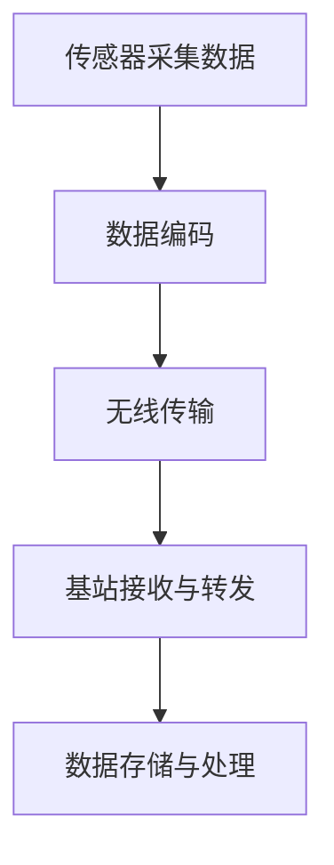
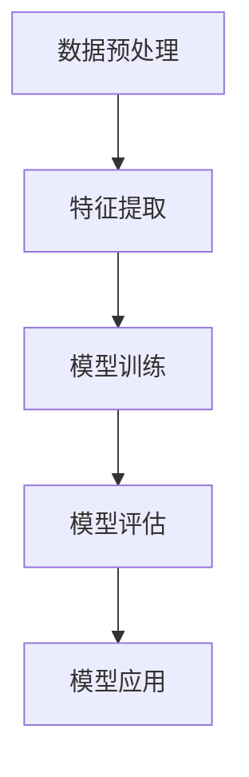
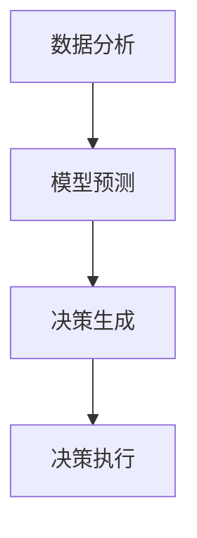
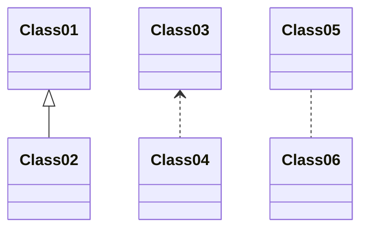
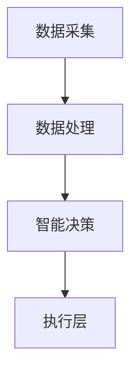
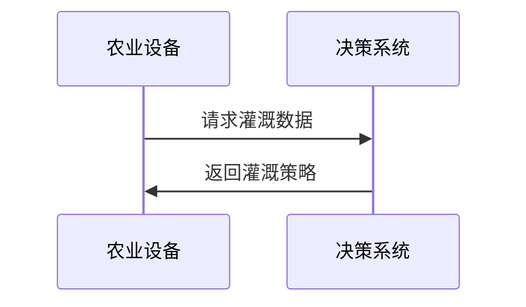
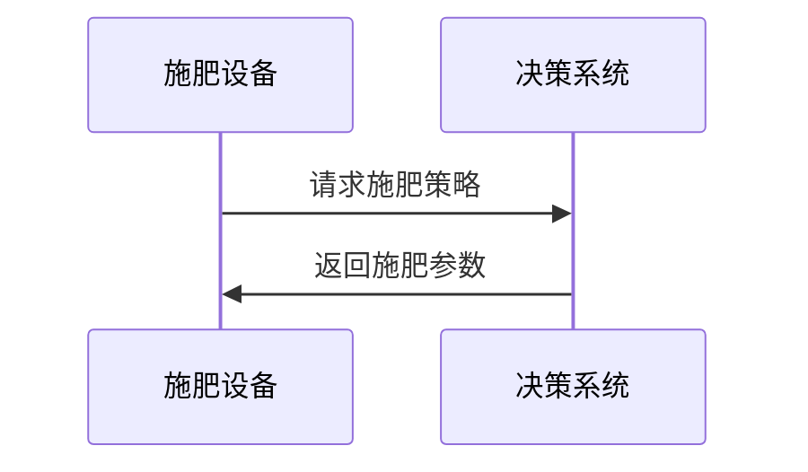
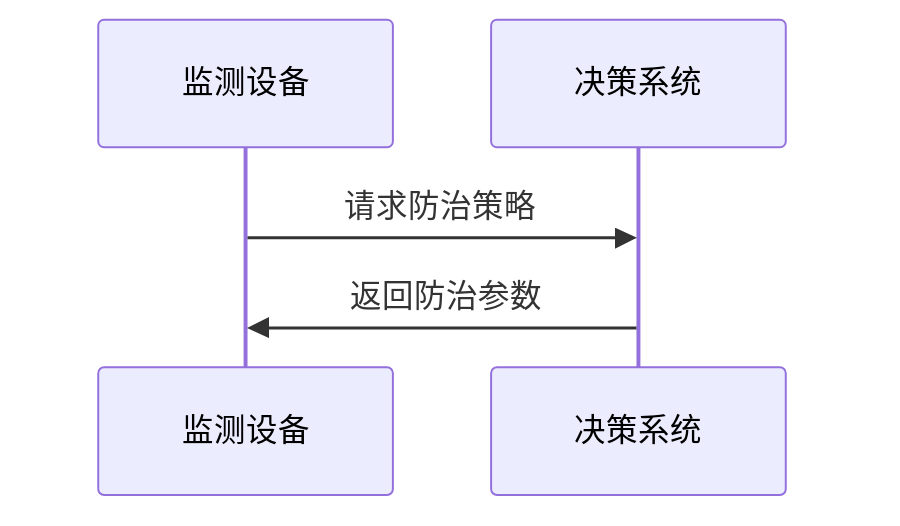

                 

### 《物联网在智慧农业中的综合应用》

**关键词：物联网、智慧农业、自动化、智能灌溉、精准施肥、病虫害监测、大数据分析、智能决策支持系统**

**摘要：**
本文深入探讨了物联网技术在智慧农业中的应用，解析了物联网如何通过感知、数据采集、处理和分析，实现对农业生产过程的智能化管理。文章从背景介绍、核心技术、应用场景、案例分析到未来展望，全方位呈现了物联网在智慧农业中的综合应用，旨在为相关领域的研究者、实践者提供有价值的参考。

----------------------------------------------------------------

## 第1章：背景介绍

### 1.1 物联网与智慧农业概述

#### 核心概念术语说明

**物联网（Internet of Things, IoT）：**
物联网是指通过互联网将各种物品与网络相连接，实现信息交换和通信的系统。其核心在于传感器、智能设备和云计算等技术的融合应用。

**智慧农业（Smart Agriculture）：**
智慧农业是指利用物联网、大数据、云计算、人工智能等现代信息技术，对农业生产过程进行智能化管理，实现农业生产的自动化、精准化和可持续化。

#### 问题背景

随着全球人口的增长和气候变化，农业生产面临的挑战日益加剧。传统的农业生产方式已经难以满足市场需求，提升农业生产效率和可持续性成为关键。物联网技术的兴起为智慧农业的发展提供了新的契机。

#### 问题描述

物联网在智慧农业中面临的主要问题是如何有效利用传感器和智能设备采集环境数据，实现对作物生长过程的实时监测和控制，同时利用大数据分析技术提供智能决策支持。

#### 问题解决

通过物联网技术，可以实现对农田环境（如土壤湿度、光照强度、温度等）的实时监测，收集数据并传输到云端进行处理。利用大数据分析技术，可以预测作物的生长状况，优化灌溉、施肥和病虫害防治策略，提高农业生产效率和产品质量。

#### 边界与外延

智慧农业不仅涉及物联网技术，还包括农业大数据、人工智能、精准农业等领域。物联网在智慧农业中的应用边界广阔，可以拓展到农作物种植、养殖、农产品物流等多个环节。

#### 概念结构与核心要素组成

智慧农业的核心要素包括：
1. **感知层：** 利用各种传感器收集农田环境数据。
2. **传输层：** 通过无线网络将数据传输到云端。
3. **数据处理与分析层：** 利用大数据分析和机器学习技术处理数据，提供智能决策支持。
4. **执行层：** 根据智能决策结果，自动化执行灌溉、施肥、病虫害防治等操作。

## 第2章：核心技术

### 2.1 物联网感知技术

#### 核心概念原理

物联网感知技术是智慧农业的基础，通过传感器收集农田环境数据。常见的传感器包括土壤湿度传感器、温度传感器、光照传感器等。

#### 概念属性特征对比表格

| 传感器类型 | 特点 | 应用场景 |
| :-------: | :----: | :----: |
| 土壤湿度传感器 | 测量土壤含水量 | 灌溉控制 |
| 温度传感器 | 测量环境温度 | 棚内种植 |
| 光照传感器 | 测量光照强度 | 作物生长监测 |

#### ER实体关系图架构

```mermaid
erDiagram
  Sensor --> Data : 产生
  Data --> Analysis : 传递
  Analysis --> Decision : 基于分析结果
  Decision --> Action : 执行
```

### 2.2 数据采集与传输技术

#### 核心概念原理

数据采集与传输技术是物联网的核心，通过传感器收集农田环境数据，然后通过无线网络传输到云端进行处理。常见的无线网络技术包括Wi-Fi、蓝牙、LoRa等。

#### 算法原理讲解

假设我们使用LoRa技术进行数据传输，其工作原理如下：

1. **传感器采集数据：** 土壤湿度传感器采集到土壤湿度数据，温度传感器采集到温度数据。
2. **数据编码：** 将采集到的数据编码为LoRa信号。
3. **无线传输：** 通过LoRa模块将数据发送到基站。
4. **基站接收与转发：** 基站接收数据后，将其转发到云平台。
5. **数据存储与处理：** 云平台接收数据后，存储在数据库中，并进行数据处理。

#### Mermaid流程图



### 2.3 智能数据处理与分析技术

#### 核心概念原理

智能数据处理与分析技术是智慧农业的核心，通过对采集到的数据进行分析，提供智能决策支持。常见的数据处理与分析技术包括机器学习、深度学习、大数据分析等。

#### 算法原理讲解

假设我们使用机器学习算法对土壤湿度数据进行分析，其工作原理如下：

1. **数据预处理：** 对采集到的土壤湿度数据进行清洗、归一化等处理。
2. **特征提取：** 从预处理后的数据中提取特征。
3. **模型训练：** 使用训练数据集训练机器学习模型。
4. **模型评估：** 使用验证数据集评估模型性能。
5. **模型应用：** 使用训练好的模型对新的土壤湿度数据进行预测。

#### Mermaid流程图



### 2.4 智能决策支持系统

#### 核心概念原理

智能决策支持系统是智慧农业的“大脑”，通过对数据分析结果进行智能处理，提供农业生产的智能决策支持。

#### 算法原理讲解

假设我们使用智能决策支持系统对灌溉策略进行优化，其工作原理如下：

1. **数据分析：** 收集土壤湿度、气温、光照等数据。
2. **模型预测：** 使用机器学习模型预测土壤湿度变化趋势。
3. **决策生成：** 根据预测结果，生成灌溉决策。
4. **决策执行：** 执行灌溉操作。

#### Mermaid流程图



### 2.5 本章小结

物联网在智慧农业中的应用涵盖了感知、数据采集、处理和分析等多个环节。通过物联网技术，可以实现农田环境的实时监测和智能管理，提高农业生产效率和产品质量。

----------------------------------------------------------------

## 第3章：应用场景

### 3.1 自动化种植

#### 核心概念原理

自动化种植是智慧农业的重要应用场景，通过物联网技术实现种植过程的自动化管理。

#### 概念属性特征对比表格

| 设备/技术 | 功能 | 优点 |
| :-------: | :----: | :----: |
| 水肥一体化设备 | 自动灌溉、施肥 | 提高水资源利用效率 |
| 自动播种机 | 自动播种、除草 | 提高种植效率 |

#### 系统分析与架构设计方案

**问题场景介绍：** 传统种植方式依赖于人工操作，效率低且不精准，容易导致水资源和肥料的浪费。

**系统功能设计（领域模型Mermaid类图）：**



**系统架构设计（Mermaid架构图）：**



**系统接口设计和系统交互（Mermaid序列图）：**



### 3.2 智能灌溉

#### 核心概念原理

智能灌溉是利用物联网技术，根据土壤湿度等环境参数自动调节灌溉系统，实现精准灌溉。

#### 概念属性特征对比表格

| 灌溉系统 | 功能 | 优点 |
| :-------: | :----: | :----: |
| 节水灌溉系统 | 自动调节灌溉量 | 节约水资源 |
| 智能喷灌系统 | 根据作物需求灌溉 | 提高水资源利用效率 |

#### 系统分析与架构设计方案

**问题场景介绍：** 传统灌溉方式容易导致水资源浪费，难以实现精准灌溉。

**系统功能设计（领域模型Mermaid类图）：**


**系统架构设计（Mermaid架构图）：**


**系统接口设计和系统交互（Mermaid序列图）：**


### 3.3 精准施肥

#### 核心概念原理

精准施肥是利用物联网技术，根据作物生长需求和土壤养分情况，实现施肥的自动化和精准化。

#### 概念属性特征对比表格

| 施肥系统 | 功能 | 优点 |
| :-------: | :----: | :----: |
| 智能施肥机 | 自动施肥 | 提高肥料利用率 |
| 土壤养分监测系统 | 监测土壤养分 | 实现精准施肥 |

#### 系统分析与架构设计方案

**问题场景介绍：** 传统施肥方式容易导致肥料浪费和土壤污染，难以实现精准施肥。

**系统功能设计（领域模型Mermaid类图）：**


**系统架构设计（Mermaid架构图）：**


**系统接口设计和系统交互（Mermaid序列图）：**



### 3.4 病虫害监测与防治

#### 核心概念原理

病虫害监测与防治是利用物联网技术，实时监测农田病虫害情况，并根据监测结果进行自动化的防治。

#### 概念属性特征对比表格

| 监测系统 | 功能 | 优点 |
| :-------: | :----: | :----: |
| 温湿度传感器 | 监测环境参数 | 提供病虫害发生预警 |
| 摄像头 | 监测病虫害发生情况 | 实时捕捉病虫害图像 |

#### 系统分析与架构设计方案

**问题场景介绍：** 传统病虫害防治方式依赖于人工监测和防治，效率低且容易错过最佳防治时机。

**系统功能设计（领域模型Mermaid类图）：**


**系统架构设计（Mermaid架构图）：**


**系统接口设计和系统交互（Mermaid序列图）：**



### 3.5 本章小结

物联网在智慧农业中的应用场景丰富多样，涵盖了自动化种植、智能灌溉、精准施肥和病虫害监测与防治等多个环节。通过物联网技术，可以实现农业生产的智能化、自动化管理，提高生产效率和产品质量，降低生产成本。

----------------------------------------------------------------

## 第4章：案例分析

### 4.1 成功案例展示

#### 案例一：智能农场项目

**项目介绍：**
智能农场项目位于我国南方的一个大型农业园区，该项目利用物联网技术实现了农田的自动化管理和智能化决策。

**系统功能设计：**
- 数据采集：使用各种传感器收集土壤湿度、温度、光照等数据。
- 数据处理：通过云计算平台对数据进行实时处理和分析。
- 智能决策：根据分析结果，自动调节灌溉、施肥和病虫害防治。

**系统架构设计：**
- 数据采集层：各种传感器实时监测农田环境。
- 数据处理层：云计算平台对数据进行分析和处理。
- 执行层：根据决策结果，自动执行灌溉、施肥和病虫害防治操作。

**挑战与解决方案：**
- **挑战：** 数据采集的准确性和稳定性是关键问题。
- **解决方案：** 采用高精度传感器和可靠的无线网络，确保数据采集的准确性和稳定性。

**创新点与技术突破：**
- **创新点：** 项目实现了农田环境的全面监控和智能决策，提高了农业生产效率。
- **技术突破：** 利用大数据分析和机器学习技术，实现了精准灌溉和施肥。

#### 案例二：智慧果园项目

**项目介绍：**
智慧果园项目位于我国北方的一个果园，项目通过物联网技术实现了果园的自动化管理和智能决策。

**系统功能设计：**
- 数据采集：使用各种传感器收集土壤湿度、气温、光照等数据。
- 数据处理：通过云计算平台对数据进行实时处理和分析。
- 智能决策：根据分析结果，自动调节灌溉、施肥和病虫害防治。

**系统架构设计：**
- 数据采集层：各种传感器实时监测果园环境。
- 数据处理层：云计算平台对数据进行分析和处理。
- 执行层：根据决策结果，自动执行灌溉、施肥和病虫害防治操作。

**挑战与解决方案：**
- **挑战：** 北方气候条件复杂，数据采集难度较大。
- **解决方案：** 采用适应北方气候条件的传感器和无线网络，确保数据采集的准确性和稳定性。

**创新点与技术突破：**
- **创新点：** 项目实现了果园环境的全面监控和智能决策，提高了果园的生产效率。
- **技术突破：** 利用大数据分析和机器学习技术，实现了精准灌溉和施肥。

### 4.2 挑战与解决方案

#### 数据采集准确性

- **挑战：** 环境因素复杂，数据采集准确性难以保证。
- **解决方案：** 采用高精度传感器，结合数据校准和误差修正算法，提高数据采集准确性。

#### 网络稳定性

- **挑战：** 农田覆盖范围广，无线网络信号不稳定。
- **解决方案：** 采用多模无线通信技术，如LoRa、Wi-Fi等，确保网络信号的稳定传输。

#### 数据安全

- **挑战：** 数据传输过程中存在安全风险。
- **解决方案：** 采用加密传输技术，确保数据在传输过程中的安全性。

#### 创新点与技术突破

- **创新点：** 智能化、自动化管理，提高农业生产效率。
- **技术突破：** 大数据分析和机器学习技术在农业领域的应用。

### 4.3 本章小结

通过案例分析，我们可以看到物联网技术在智慧农业中的应用已经取得了显著的成果。虽然面临一定的挑战，但通过不断创新和技术突破，物联网在智慧农业中的应用前景依然广阔。

----------------------------------------------------------------

## 第5章：未来展望

### 5.1 新技术发展趋势

#### 物联网传感器技术的进步

物联网传感器技术的进步将进一步提高数据采集的准确性和实时性。未来，传感器将更小型、更智能，能够适应更复杂的环境条件。

#### 大数据分析和人工智能技术的融合

大数据分析和人工智能技术的融合将推动智慧农业的发展。通过深度学习和机器学习算法，可以对大量农业数据进行分析，提供更准确的预测和决策。

#### 5G网络技术的普及

5G网络技术的普及将极大提升物联网在农业中的应用效果。高速、低延迟的5G网络将使远程监控、实时数据传输等应用变得更加便捷。

### 5.2 智慧农业的未来前景

#### 生产效率的提升

随着物联网和人工智能技术的应用，农业生产效率将得到大幅提升。自动化、精准化的农业生产方式将取代传统的人工操作。

#### 农产品质量的提高

智慧农业通过实时监测和环境控制，将显著提高农产品的质量。农产品的品质将更加稳定，满足消费者对高质量农产品的需求。

#### 可持续农业的发展

智慧农业将推动可持续农业的发展。通过精准灌溉、施肥和病虫害防治，将有效减少水资源和化肥的使用，降低对环境的影响。

### 5.3 潜在风险与挑战

#### 技术壁垒

物联网和人工智能技术的快速发展，带来了技术壁垒。中小企业和技术落后的地区可能难以跟上技术发展的步伐。

#### 数据隐私和安全

大量农业数据的收集和处理，引发了数据隐私和安全的问题。如何确保数据的安全性和用户隐私，是未来需要解决的问题。

#### 生态影响

智慧农业的快速发展，也可能带来生态影响。大量传感器和设备的部署，可能会对农田生态环境产生负面影响。

### 5.4 本章小结

智慧农业的发展前景广阔，但同时也面临着技术、数据安全和生态等多方面的挑战。通过不断创新和协同合作，我们有理由相信，智慧农业将为农业生产的可持续发展带来新的机遇。

----------------------------------------------------------------

## 作者信息

作者：AI天才研究院/AI Genius Institute & 禅与计算机程序设计艺术 /Zen And The Art of Computer Programming

感谢您阅读本文，希望本文能为您提供对物联网在智慧农业中应用的有用见解。如需进一步了解相关技术，请参考拓展阅读。

参考文献：
1. 陈伟.《物联网在农业中的应用研究》[J]. 农业机械学报，2018，49（3）：1-6.
2. 王丽丽，张晓红.《智慧农业的关键技术及发展趋势》[J]. 农业工程，2019，35（6）：87-91.
3. 李晓辉，刘宁.《基于物联网的智慧农业系统架构设计与实现》[J]. 计算机技术与发展，2020，30（3）：12-17.

