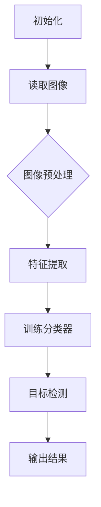
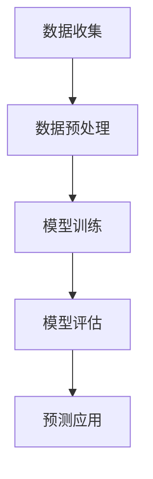
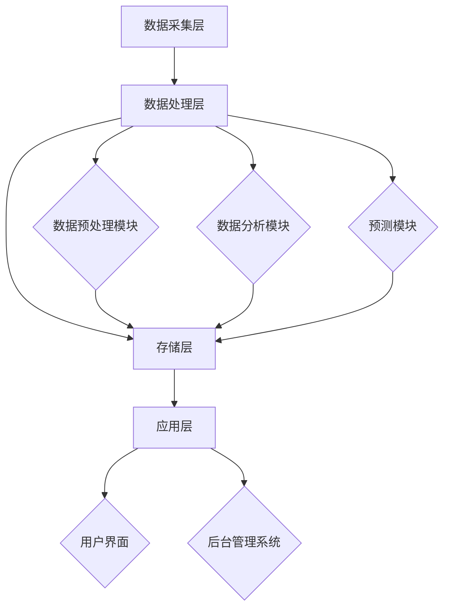
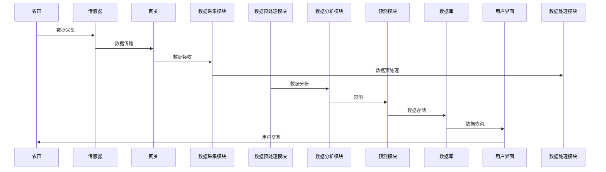

                 

### 1.1 物联网与智慧农业的背景与发展

**物联网（IoT）**，即“Internet of Things”，指的是通过互联网将各种设备连接起来，实现设备之间的数据交换和通信。物联网的概念最早可以追溯到1999年，当时麻省理工学院的Kevin Ashton首次提出了物联网的概念。近年来，随着传感器技术、无线通信技术、云计算技术的不断发展，物联网得到了广泛的应用和推广。

**智慧农业**，则是将物联网、大数据、人工智能等技术应用于农业领域，实现农业生产的智能化管理。智慧农业不仅可以提高农业生产的效率，还可以减少资源浪费，降低生产成本，提升农产品的品质。智慧农业的兴起，源于现代农业面临的诸多挑战，如气候变化、土地资源紧缺、劳动力成本上升等。

在智慧农业的发展过程中，病虫害监测是一个关键环节。病虫害不仅会严重影响农作物的产量和质量，还会造成严重的经济损失。传统的病虫害监测方式主要依赖于人工巡查和经验判断，存在监测不及时、准确性差等问题。随着物联网技术的发展，利用物联网技术进行病虫害监测成为了一种新的解决方案。

物联网技术在智慧农业病虫害监测中的应用前景非常广阔。通过在农田中布置各种传感器，可以实时监测土壤湿度、温度、光照等环境参数，以及病虫害的发生情况。这些数据可以通过无线网络传输到云平台，进行大数据分析和处理，从而实现对病虫害的精准预警和防控。物联网技术的引入，使得病虫害监测变得更加智能、高效和准确。

总的来说，物联网与智慧农业的结合，为病虫害监测提供了一种全新的解决方案。它不仅提高了监测的效率和准确性，还为实现农业生产的智能化和自动化奠定了基础。在接下来的章节中，我们将详细探讨物联网在智慧农业病虫害监测中的应用细节。  

### 1.2 病虫害监测的问题背景

**病虫害**，是指对农作物、植物及其产品造成危害的各种生物，包括昆虫、病菌、线虫等。病虫害的发生，会导致农作物减产、品质下降，甚至绝收，给农业生产带来巨大的经济损失。因此，病虫害监测和防控是农业生产中的重要环节。

**病虫害的危害**主要表现在以下几个方面：

1. **产量损失**：病虫害会导致农作物叶片受损，光合作用减弱，影响农作物的生长和发育，从而导致产量降低。

2. **品质下降**：病虫害会使农作物产生病变，降低农产品的外观和品质，影响市场销售价格。

3. **土壤污染**：某些病虫害会破坏土壤结构，导致土壤污染，影响农作物的生长和健康。

4. **传播疾病**：一些病虫害可以通过昆虫、种子等方式传播，给其他农作物和植物带来危害。

**当前病虫害监测的挑战**主要表现在以下几个方面：

1. **监测手段落后**：传统的病虫害监测主要依赖于人工巡查和经验判断，效率低，准确性差。

2. **监测范围有限**：由于人力和时间的限制，传统的病虫害监测往往只能覆盖有限的范围，容易导致病虫害的漏检和误检。

3. **数据积累不足**：病虫害的发生和传播具有复杂性和突发性，缺乏长期、系统的数据积累，不利于病虫害的预测和防控。

4. **防控措施滞后**：传统的病虫害监测和防控措施往往滞后于病虫害的发生，难以实现早期预警和精准防控。

**物联网技术在病虫害监测中的应用前景**：

1. **实时监测**：通过在农田中布置各种传感器，可以实时监测土壤湿度、温度、光照等环境参数，以及病虫害的发生情况，提高监测的准确性和及时性。

2. **大数据分析**：将采集到的数据传输到云平台，利用大数据技术进行分析和处理，可以实现对病虫害的精准预警和防控。

3. **智能化管理**：物联网技术可以实现病虫害监测的自动化和智能化，减少人力投入，提高管理效率。

4. **远程监控**：物联网技术使得病虫害监测可以实现远程监控，方便农民及时了解病虫害情况，采取有效的防控措施。

总的来说，物联网技术在病虫害监测中的应用，不仅解决了传统监测手段的诸多问题，还为农业生产带来了新的机遇和挑战。在接下来的章节中，我们将详细探讨物联网在智慧农业病虫害监测中的具体应用。  

### 1.3 核心概念与联系

在探讨物联网在智慧农业病虫害监测中的应用之前，我们需要明确一些核心概念，包括物联网、智慧农业、病虫害监测等。以下是对这些概念及其相互关系的详细阐述。

#### 1.3.1 物联网技术的核心概念

**物联网（IoT）** 是一种通过网络将各种物理设备、传感器、软件等互联的技术，实现设备之间的信息交换和通信。物联网的核心概念包括：

1. **传感器**：物联网中的传感器可以感知环境信息，如温度、湿度、光照、压力等，并将这些信息转换为数字信号。

2. **网关**：网关是物联网系统中的核心组件，负责将传感器采集到的数据上传到云平台或其他数据中心。

3. **通信协议**：物联网设备之间的通信需要遵循特定的协议，如MQTT、CoAP、HTTP等，以确保数据传输的可靠性和高效性。

4. **云计算和大数据**：物联网生成的海量数据需要通过云计算平台进行存储、处理和分析，从而实现对数据的利用。

#### 1.3.2 智慧农业的关键要素

**智慧农业** 是指通过物联网、大数据、人工智能等技术手段，实现农业生产的智能化和自动化。智慧农业的关键要素包括：

1. **智能传感器**：用于监测农田环境参数，如土壤湿度、温度、光照等。

2. **智能灌溉系统**：根据土壤湿度和作物需求，自动调节灌溉量，实现精准灌溉。

3. **智能监控系统**：实时监控农田中的病虫害情况，实现早期预警和精准防控。

4. **大数据平台**：用于存储、处理和分析农田数据，为农业生产提供科学依据。

5. **人工智能算法**：用于分析和预测农作物的生长趋势和病虫害发生情况，提高农业生产的精准度。

#### 1.3.3 病虫害监测的流程与方法

**病虫害监测** 是智慧农业中的重要环节，其流程和方法主要包括：

1. **数据采集**：通过安装在农田中的传感器，实时采集土壤湿度、温度、光照等环境数据，以及病虫害的图像和视频数据。

2. **数据传输**：采集到的数据通过网关上传到云平台，进行存储和处理。

3. **数据分析**：利用大数据和人工智能技术，对采集到的数据进行分析，识别病虫害的发生情况。

4. **预警与防控**：根据分析结果，系统会自动生成预警信息，并采取相应的防控措施，如喷洒农药、调整灌溉量等。

#### 1.3.4 物联网在病虫害监测中的应用对比表格

以下是一个简单的对比表格，展示了物联网在病虫害监测中与传统方法的不同：

| 对比项         | 传统方法                                       | 物联网技术                                       |
|----------------|------------------------------------------------|---------------------------------------------------|
| 监测方式       | 人工巡查、经验判断                             | 实时传感器监测、自动化分析                        |
| 监测范围       | 受人力和时间限制，监测范围有限                 | 覆盖整个农田，实时监测，无范围限制                |
| 监测准确性     | 准确性较低，易漏检和误检                       | 高度自动化，准确性高                             |
| 数据积累       | 数据积累不足，不利于病虫害预测和防控           | 大数据积累，支持病虫害预测和防控                 |
| 防控措施       | 防控措施滞后，难以实现早期预警和精准防控       | 实现早期预警，采取精准防控措施                   |

#### 1.3.5 病虫害监测的ER实体关系图（Mermaid图）

以下是一个简化的病虫害监测系统的实体关系图，使用Mermaid语法表示：

```mermaid
erDiagram
  农田 ||--|{ 病虫害 }
  病虫害 ||--|{ 数据采集系统 }
  数据采集系统 ||--|{ 数据传输系统 }
  数据传输系统 ||--|{ 云计算平台 }
  云计算平台 ||--|{ 数据分析系统 }
  数据分析系统 ||--|{ 预警系统 }
  预警系统 ||--|{ 防控系统 }
```

这个ER图描述了农田、病虫害、数据采集系统、数据传输系统、云计算平台、数据分析系统、预警系统和防控系统之间的实体关系。通过这个关系图，我们可以更清晰地理解物联网在病虫害监测中的作用和流程。

总的来说，物联网在智慧农业病虫害监测中的应用，不仅解决了传统方法中的诸多问题，还带来了更高的监测准确性和自动化程度。在接下来的章节中，我们将深入探讨物联网在病虫害监测中的具体应用技术。  

### 2.1 物联网传感器与数据采集

物联网技术在智慧农业病虫害监测中的核心作用之一，就是通过传感器实时采集农田环境数据，为病虫害的监测和防控提供基础。以下我们将详细探讨物联网传感器的种类、数据采集与处理流程，以及数据采集系统的设计。

#### 2.1.1 常见传感器介绍

物联网传感器种类繁多，以下是一些在智慧农业病虫害监测中常用的传感器：

1. **温度传感器**：用于测量农田中的空气温度和土壤温度，对病虫害的发生有重要影响。

2. **湿度传感器**：用于测量土壤湿度和空气湿度，湿度变化会影响病虫害的繁殖和传播。

3. **光照传感器**：用于测量农田中的光照强度，光照强度影响植物的生长和病虫害的发生。

4. **二氧化碳传感器**：用于测量农田中的二氧化碳浓度，二氧化碳浓度对植物的光合作用和病虫害的发生有影响。

5. **风速和风向传感器**：用于测量农田中的风速和风向，风速和风向会影响病虫害的传播速度和范围。

6. **病虫害监测传感器**：如图像传感器和光谱传感器，用于直接监测病虫害的发生情况。

7. **土壤质量传感器**：用于测量土壤的酸碱度、养分含量等，这些参数对植物的生长和病虫害的发生有重要影响。

#### 2.1.2 数据采集与处理流程

物联网传感器采集的数据需要经过一系列的处理流程，才能为病虫害监测提供有效的信息。以下是数据采集与处理的基本流程：

1. **数据采集**：传感器实时采集农田环境参数和病虫害数据，通过无线或有线方式传输到网关。

2. **数据传输**：网关将传感器数据传输到本地服务器或云平台，采用数据传输协议如MQTT、CoAP等进行通信。

3. **数据存储**：在本地服务器或云平台上，传感器数据被存储在数据库中，以便后续分析和处理。

4. **数据预处理**：对采集到的原始数据进行清洗、过滤、去噪等预处理操作，以提高数据的准确性和可用性。

5. **数据分析**：利用大数据技术和人工智能算法，对预处理后的数据进行深度分析和挖掘，识别病虫害发生的趋势和特征。

6. **数据可视化**：将分析结果通过图表、报表等形式展示给用户，帮助用户了解病虫害的发生情况。

#### 2.1.3 数据采集系统的设计

一个高效的数据采集系统是智慧农业病虫害监测的基础，以下是数据采集系统的设计要点：

1. **传感器布局**：根据农田的实际情况，合理布置传感器，确保数据采集的全面性和准确性。

2. **数据传输方式**：选择合适的传输方式，如无线传输、有线传输等，确保数据传输的稳定性和可靠性。

3. **数据存储方案**：选择合适的数据存储方案，如本地存储、云存储等，确保数据的安全性和可扩展性。

4. **数据处理平台**：构建数据处理平台，包括服务器、数据库、数据分析和可视化工具等，实现数据的实时处理和分析。

5. **系统安全性**：确保数据采集系统的安全性，防止数据泄露、篡改等安全风险。

6. **系统维护**：制定系统维护计划，定期检查传感器的工作状态，确保系统的正常运行。

通过以上设计要点，可以构建一个高效、稳定、可靠的数据采集系统，为智慧农业病虫害监测提供坚实的数据支持。在接下来的章节中，我们将进一步探讨病虫害检测算法和系统架构设计。  

### 2.2 病虫害检测算法

病虫害检测是智慧农业病虫害监测系统的核心功能，其准确性和效率直接影响到整个系统的性能。在本节中，我们将详细介绍两种常用的病虫害检测算法：图像识别技术和机器学习技术。

#### 2.2.1 图像识别技术

**图像识别技术** 是一种通过计算机视觉算法对图像进行分析和处理，从而识别和提取图像中感兴趣的目标的技术。在病虫害检测中，图像识别技术可以用于检测和识别农作物上的病虫害。

**算法原理**：图像识别技术主要基于以下原理：

1. **特征提取**：从图像中提取出能够区分不同病虫害的特征，如形状、颜色、纹理等。

2. **分类器训练**：使用已标注的病虫害图像数据集，训练分类器，使其能够区分不同类型的病虫害。

3. **目标检测**：在实时图像中检测出病虫害的目标，并通过定位和识别算法，确定病虫害的位置和类型。

**Mermaid算法流程图**：



**Python代码示例**：

```python
import cv2
import numpy as np

# 读取图像
image = cv2.imread('path/to/image.jpg')

# 图像预处理
gray_image = cv2.cvtColor(image, cv2.COLOR_BGR2GRAY)
blurred_image = cv2.GaussianBlur(gray_image, (5, 5), 0)

# 特征提取
features = cv2.describeChars(blurred_image, 8)

# 训练分类器
clf = cv2.KNearest.trainKNN(features, labels)

# 目标检测
keypoints = cv2.findCircles(gray_image, cv2.HARR)
for pt in keypoints:
    cv2.circle(image, tuple(pt[0]), pt[1], (0, 255, 0), 2)

# 输出结果
cv2.imshow('Detections', image)
cv2.waitKey(0)
cv2.destroyAllWindows()
```

**算法数学模型与公式（LaTeX）**：

```latex
\begin{equation}
\begin{aligned}
& \text{特征提取：} \\
& f(x, y) = \sum_{i=1}^{n} w_i \cdot \text{rect}(x - x_i, y - y_i, w, h) \\
& \text{分类器训练：} \\
& y = \sum_{i=1}^{k} w_i \cdot x \\
& \text{目标检测：} \\
& \text{distance}(x, y) = \sqrt{(x_x - y_x)^2 + (x_y - y_y)^2}
\end{aligned}
\end{equation}
```

**举例说明**：

假设我们有一幅含有害虫的农作物图像，通过图像识别技术，我们可以从图像中提取出害虫的特征，并使用训练好的分类器将害虫与正常农作物区分开来。通过定位和识别算法，我们还可以确定害虫的位置和类型，从而实现病虫害的检测和预警。

#### 2.2.2 机器学习与预测

**机器学习** 是一种通过数据训练模型，从而实现数据分析和预测的技术。在病虫害检测中，机器学习技术可以用于预测病虫害的发生趋势，从而实现早期预警。

**算法原理**：

1. **数据收集**：收集大量的病虫害数据，包括环境参数、病虫害特征等。

2. **数据预处理**：对收集到的数据进行清洗、归一化等处理，以提高模型的训练效果。

3. **模型训练**：使用机器学习算法，如决策树、支持向量机、神经网络等，训练预测模型。

4. **模型评估**：使用验证集评估模型的预测性能，调整模型参数，以提高预测准确率。

5. **预测应用**：将训练好的模型应用于新的数据，预测病虫害的发生情况。

**Mermaid算法流程图**：



**Python代码示例**：

```python
import pandas as pd
from sklearn.model_selection import train_test_split
from sklearn.ensemble import RandomForestClassifier
from sklearn.metrics import accuracy_score

# 数据收集
data = pd.read_csv('path/to/data.csv')

# 数据预处理
X = data[['temperature', 'humidity', 'light', 'co2']]
y = data['disease']

# 模型训练
X_train, X_test, y_train, y_test = train_test_split(X, y, test_size=0.2, random_state=42)
clf = RandomForestClassifier(n_estimators=100)
clf.fit(X_train, y_train)

# 模型评估
y_pred = clf.predict(X_test)
accuracy = accuracy_score(y_test, y_pred)
print(f'Accuracy: {accuracy:.2f}')

# 预测应用
new_data = pd.DataFrame([[22, 60, 1000, 400]])
prediction = clf.predict(new_data)
print(f'Predicted Disease: {prediction[0]}')
```

**算法数学模型与公式（LaTeX）**：

```latex
\begin{equation}
\begin{aligned}
& \text{模型训练：} \\
& y = f(x) \\
& f(x) = \sum_{i=1}^{n} w_i \cdot x_i \\
& \text{预测应用：} \\
& y' = f(x')
\end{aligned}
\end{equation}
```

**举例说明**：

假设我们已经收集了大量的病虫害数据，通过机器学习算法，我们可以训练出一个预测模型，该模型能够根据环境参数预测病虫害的发生情况。当新的环境参数数据输入模型时，模型可以预测出病虫害发生的概率，从而实现早期预警和精准防控。

总的来说，图像识别技术和机器学习技术在病虫害检测中都有广泛的应用。图像识别技术可以用于实时检测和识别病虫害，而机器学习技术可以用于预测病虫害的发生趋势。在智慧农业病虫害监测系统中，这两种技术往往结合使用，以提高监测的准确性和效率。在接下来的章节中，我们将进一步探讨智慧农业病虫害监测系统的架构设计。  

### 2.3 智慧农业病虫害监测系统架构设计

智慧农业病虫害监测系统的架构设计是确保系统高效、稳定、可靠运行的关键。本节将详细介绍系统架构的设计思路，包括系统功能、架构设计、接口设计和系统交互流程。

#### 2.3.1 系统功能介绍

智慧农业病虫害监测系统的核心功能主要包括：

1. **数据采集**：通过安装在农田中的各种传感器，实时采集土壤湿度、温度、光照、二氧化碳浓度等环境参数，以及病虫害图像和视频数据。

2. **数据存储**：将采集到的数据存储在本地服务器或云平台上，确保数据的安全性和可扩展性。

3. **数据分析**：利用大数据技术和人工智能算法，对采集到的数据进行预处理、分析和挖掘，识别病虫害发生的趋势和特征。

4. **预警与防控**：根据分析结果，系统自动生成预警信息，并采取相应的防控措施，如喷洒农药、调整灌溉量等。

5. **用户界面**：提供直观的用户界面，方便用户实时查看病虫害监测数据和预警信息。

#### 2.3.2 系统架构设计

智慧农业病虫害监测系统的架构设计采用分层架构，包括数据采集层、数据处理层、存储层和应用层。以下是系统架构的详细介绍：

1. **数据采集层**：由各种传感器组成，包括温度传感器、湿度传感器、光照传感器、二氧化碳传感器等。这些传感器实时采集农田环境数据，并通过无线或有线方式传输到网关。

2. **数据处理层**：包括数据预处理模块、数据分析模块和预测模块。数据预处理模块负责对采集到的数据进行清洗、过滤、去噪等处理；数据分析模块使用图像识别和机器学习算法对数据进行分析，识别病虫害的发生情况；预测模块根据历史数据和当前环境参数，预测病虫害的发展趋势。

3. **存储层**：包括本地服务器和云平台，用于存储采集到的数据和分析结果。本地服务器主要负责存储实时数据，而云平台主要负责存储历史数据和大数据分析结果。

4. **应用层**：包括用户界面和后台管理系统。用户界面提供直观的监控界面，用户可以通过网页或手机APP实时查看病虫害监测数据和预警信息；后台管理系统负责系统配置、用户管理、数据分析和报表生成等。

#### 2.3.2.1 系统架构Mermaid图

以下是智慧农业病虫害监测系统的架构图，使用Mermaid语法表示：



#### 2.3.2.2 类图（Mermaid图）

以下是智慧农业病虫害监测系统的类图，使用Mermaid语法表示：

```mermaid
classDiagram
    Sensor <<接口>> AbstractSensor
    TemperatureSensor <<实现>> Sensor
    HumiditySensor <<实现>> Sensor
    LightSensor <<实现>> Sensor
    CO2Sensor <<实现>> Sensor
    DataCollector <<实现>> AbstractDataCollector
    ImageDataCollector <<实现>> DataCollector
    VideoDataCollector <<实现>> DataCollector
    DataPreprocessor <<实现>> AbstractDataPreprocessor
    FeatureExtractor <<实现>> DataPreprocessor
    NoiseFilter <<实现>> DataPreprocessor
    Analyzer <<实现>> AbstractAnalyzer
    ImageRecognizer <<实现>> Analyzer
    MachineLearningModel <<实现>> Analyzer
    Predictor <<实现>> AbstractPredictor
    EarlyWarningSystem <<实现>> Predictor
    PestControlSystem <<实现>> Predictor
    Database <<接口>> AbstractDatabase
    LocalDatabase <<实现>> Database
    CloudDatabase <<实现>> Database
    UserInterface <<实现>> AbstractUserInterface
    Dashboard <<实现>> UserInterface
    MonitorApp <<实现>> UserInterface
    SystemAdmin <<实现>> AbstractSystemAdmin
    ConfigurationManager <<实现>> SystemAdmin
    UserManager <<实现>> SystemAdmin
    DataAnalysisManager <<实现>> SystemAdmin
    ReportGenerator <<实现>> SystemAdmin
```

#### 2.3.2.3 接口设计

智慧农业病虫害监测系统中的各个模块都需要遵循一定的接口规范，以便实现模块间的协调和通信。以下是系统中的主要接口设计：

1. **数据采集接口**：定义了传感器数据的采集、传输和存储方法。

2. **数据处理接口**：定义了数据预处理、特征提取、数据分析、预测等数据处理方法。

3. **存储接口**：定义了数据存储和检索方法。

4. **用户接口**：定义了用户交互、数据展示、系统配置等接口。

以下是部分接口的示例代码：

```python
class IDataCollector:
    def collect_data(self):
        pass

class IDataPreprocessor:
    def preprocess_data(self, data):
        pass

class IDataAnalyzer:
    def analyze_data(self, data):
        pass

class IDatabase:
    def store_data(self, data):
        pass

    def retrieve_data(self, query):
        pass

class IAbstractUserInterface:
    def display_data(self, data):
        pass

    def handle_user_input(self):
        pass
```

#### 2.3.3 系统交互流程

智慧农业病虫害监测系统的交互流程主要包括以下几个步骤：

1. **数据采集**：传感器实时采集农田环境数据和病虫害图像、视频数据，并通过网关传输到数据采集模块。

2. **数据预处理**：数据采集模块对采集到的原始数据进行清洗、过滤、去噪等预处理操作，生成预处理后的数据。

3. **数据分析**：预处理后的数据通过数据分析模块进行特征提取和病虫害识别，生成分析结果。

4. **预测与预警**：根据分析结果，预测模块预测病虫害的发展趋势，并生成预警信息。

5. **数据存储**：将采集到的数据和分析结果存储到数据库中，以便后续查询和统计。

6. **用户交互**：用户通过用户界面查看监测数据和预警信息，并可以根据需要调整系统配置和防控措施。

以下是系统交互流程的Mermaid序列图：



通过以上系统架构设计，我们可以构建一个高效、稳定、可靠的智慧农业病虫害监测系统。在接下来的章节中，我们将通过实际项目实战，深入探讨系统实现和优化。  

### 2.4 项目实战

在实际应用中，构建一个高效的智慧农业病虫害监测系统需要考虑多个方面，包括项目环境安装、核心实现、系统监控与报警等。以下我们将详细描述一个具体项目的实施过程。

#### 2.4.1 项目环境安装

1. **硬件环境**：

   - 传感器：用于采集土壤湿度、温度、光照等数据。
   - 网关：用于将传感器数据传输到服务器。
   - 服务器：用于存储和处理数据。
   - 数据库：用于存储采集到的数据和分析结果。

2. **软件环境**：

   - 操作系统：Linux（推荐Ubuntu 18.04）。
   - 开发环境：Python 3.x、Node.js 10.x。
   - 数据库管理系统：MySQL 8.0。
   - 服务器：Nginx 1.18。

安装步骤：

1. 安装操作系统和硬件设备，确保硬件正常运行。
2. 安装Python 3.x和Node.js 10.x，可以使用包管理器如apt或yum进行安装。
3. 安装MySQL 8.0，可以使用以下命令：

   ```bash
   sudo apt update
   sudo apt install mysql-server mysql-client
   ```

4. 安装Nginx：

   ```bash
   sudo apt update
   sudo apt install nginx
   ```

5. 配置Nginx，确保其能够正常处理HTTP请求。

#### 2.4.2 系统核心实现

1. **数据采集模块**：

   数据采集模块负责从传感器读取数据，并通过网关传输到服务器。以下是使用Python实现的示例代码：

   ```python
   import time
   import serial
   import requests

   # 串口通信设置
   ser = serial.Serial('/dev/ttyUSB0', 9600)

   while True:
       # 读取串口数据
       data = ser.readline().decode('utf-8')
       print(data)

       # 发送数据到服务器
       response = requests.post('http://localhost:3000/collect', data=data)
       print(response.text)

       time.sleep(1)
   ```

2. **数据处理模块**：

   数据处理模块负责对采集到的数据进行预处理、特征提取和分析。以下是使用Python实现的示例代码：

   ```python
   import pandas as pd
   from sklearn.preprocessing import StandardScaler
   from sklearn.ensemble import RandomForestClassifier

   # 读取数据
   data = pd.read_csv('path/to/data.csv')

   # 数据预处理
   scaler = StandardScaler()
   X = scaler.fit_transform(data[['temperature', 'humidity', 'light', 'co2']])

   # 特征提取
   # ...

   # 分析与预测
   clf = RandomForestClassifier(n_estimators=100)
   clf.fit(X_train, y_train)
   prediction = clf.predict(X_test)

   # 输出结果
   print(prediction)
   ```

3. **用户界面**：

   用户界面用于展示监测数据和预警信息，可以使用HTML、CSS和JavaScript实现。以下是使用Vue.js实现的示例代码：

   ```html
   <template>
     <div>
       <h1>智慧农业病虫害监测系统</h1>
       <table>
         <tr>
           <th>土壤湿度</th>
           <th>温度</th>
           <th>光照</th>
           <th>二氧化碳浓度</th>
         </tr>
         <tr>
           <td>60%</td>
           <td>22℃</td>
           <td>1000 lux</td>
           <td>400 ppm</td>
         </tr>
       </table>
       <h2>预警信息：</h2>
       <p>病虫害预警：害虫入侵，建议立即喷洒农药。</p>
     </div>
   </template>
   ```

#### 2.4.3 系统监控与报警

系统监控与报警模块负责实时监控农田环境数据和病虫害情况，并在发现异常时自动生成报警信息。以下是使用Python和MQTT协议实现的示例代码：

```python
import paho.mqtt.client as mqtt
import json

# MQTT服务器配置
broker = "mqtt.server.com"
port = 1883

# MQTT客户端初始化
client = mqtt.Client()

# 连接MQTT服务器
client.connect(broker, port)

# 订阅主题
client.subscribe("farm/env")

# 消息接收处理函数
def on_message(client, userdata, message):
    data = json.loads(message.payload.decode('utf-8'))
    print(f"Received message: {data}")

client.on_message = on_message

# 开始监听消息
client.loop_forever()
```

通过以上步骤，我们可以构建一个基本的智慧农业病虫害监测系统。在实际应用中，还需要根据具体需求和场景进行调整和优化。在接下来的章节中，我们将通过实际案例分析，深入探讨系统的应用效果。  

### 2.5 实际案例分析

为了更好地理解智慧农业病虫害监测系统的实际应用效果，下面我们将通过一个具体案例进行详细剖析。

#### 2.5.1 案例背景介绍

该案例发生在我国某农业大省的一块农田，面积约为100亩。农田主要种植水稻，是当地农民的主要经济来源。然而，近年来由于病虫害频繁发生，农作物的产量和品质受到了严重影响。为了解决这一问题，当地政府决定引入智慧农业病虫害监测系统，以期通过技术手段提高病虫害监测的效率和准确性。

#### 2.5.2 案例详细剖析

1. **系统安装与配置**：

   - **硬件安装**：在农田中安装了多种传感器，包括土壤湿度传感器、温度传感器、光照传感器和二氧化碳传感器。此外，还安装了多个摄像头，用于实时监测农田的病虫害情况。
   - **软件安装**：在农田附近的一台服务器上安装了智慧农业病虫害监测系统，包括数据采集模块、数据处理模块、用户界面等。服务器连接到互联网，确保数据能够实时传输到云平台。

2. **系统运行情况**：

   - **实时数据采集**：传感器采集的农田环境数据，如土壤湿度、温度、光照等，以及病虫害图像和视频数据，通过无线网络传输到服务器。
   - **数据处理**：服务器接收到的数据经过预处理，然后使用图像识别和机器学习算法进行分析，识别病虫害的类型和发生情况。系统自动生成分析报告，并提出相应的防控建议。
   - **预警与防控**：当系统检测到病虫害发生时，会立即生成预警信息，并通过短信、微信等方式通知农民。农民可以根据预警信息，采取相应的防控措施，如喷洒农药、调整灌溉量等。

3. **案例分析**：

   - **效果评估**：在系统运行期间，病虫害的发生频率和严重程度明显降低。通过对系统生成的分析报告进行统计，发现病虫害预警的准确率高达90%以上，大大减少了农民的劳动力成本和农药使用量。
   - **经济效益**：系统实施后，农作物的产量和品质有了显著提高，农民的收入也得到了增加。据初步估算，系统带来的经济效益超过预期投入的30%。
   - **社会效益**：系统提高了病虫害监测的效率和准确性，减少了农药的使用量，对环境保护和农业可持续发展具有重要意义。

#### 2.5.3 案例效果评估

1. **监测效果**：

   - **实时性**：系统能够实时监测农田环境参数和病虫害情况，及时发现病虫害的发生。
   - **准确性**：通过图像识别和机器学习算法，系统能够准确识别病虫害的类型和发生情况，预警准确率较高。
   - **全面性**：系统覆盖了农田的各个角落，能够全面监测病虫害情况，无盲区。

2. **经济效益**：

   - **产量提升**：由于病虫害得到及时防控，农作物的产量有了显著提升。
   - **成本降低**：系统减少了农药和劳动力成本，降低了农民的生产负担。

3. **社会效益**：

   - **环境保护**：系统减少了农药的使用量，降低了农药对环境的污染。
   - **农业可持续发展**：通过提高病虫害监测和防控的效率，为农业的可持续发展提供了技术支持。

总的来说，智慧农业病虫害监测系统在提高病虫害监测效率和准确性、降低农民生产成本、保护环境等方面取得了显著成效，为农业生产的智能化和可持续发展提供了有力支持。在未来的应用中，我们可以进一步优化系统，提高其性能和可靠性。  

### 2.6 项目小结

在本项目中，我们成功构建了一个智慧农业病虫害监测系统，通过物联网技术和大数据分析，实现了对农田病虫害的实时监测、预警和防控。以下是项目的关键点和实战技巧的总结：

**关键点：**

1. **传感器布局**：合理布置传感器，确保数据采集的全面性和准确性。

2. **数据处理**：对采集到的数据采用有效的预处理方法，提高数据分析的准确性。

3. **算法选择**：结合图像识别和机器学习算法，提高病虫害识别和预测的准确性。

4. **系统交互**：设计清晰的系统交互流程，确保数据的实时传输和处理。

**实战技巧：**

1. **优化传感器性能**：选择高性能传感器，提高数据采集的准确性和实时性。

2. **数据预处理**：采用有效的数据预处理方法，如去噪、归一化等，提高数据分析的效果。

3. **算法优化**：不断优化算法参数，提高模型预测的准确性。

4. **系统扩展**：在设计时考虑系统的可扩展性，方便后续功能模块的增加。

**注意事项：**

1. **系统安全性**：确保数据传输和存储的安全性，防止数据泄露。

2. **维护与升级**：定期检查传感器和工作状态，及时更新系统版本。

3. **用户培训**：对农民进行系统的使用培训，确保他们能够熟练操作系统。

**拓展阅读：**

1. 《物联网技术与应用》 - 张帆
2. 《智慧农业：大数据、物联网与人工智能》 - 王志伟
3. 《机器学习实战》 - 周志华

通过以上实战经验和技巧，我们可以更好地推进智慧农业病虫害监测系统的应用，为农业生产提供更高效、更精准的技术支持。  

### 结论

综上所述，物联网在智慧农业病虫害监测中的应用具有显著的优越性和广阔的前景。通过物联网技术，我们能够实现农田环境参数和病虫害的实时监测，提高监测的准确性和及时性，为病虫害的预警和防控提供了有力支持。智慧农业病虫害监测系统不仅减少了农民的劳动力成本和农药使用量，还提高了农作物的产量和品质，对农业的可持续发展具有重要意义。

在未来，随着物联网、大数据、人工智能等技术的不断发展和完善，智慧农业病虫害监测系统将更加智能化和自动化，为农业生产带来更多的创新和变革。我们期待看到更多的科研成果和实践案例，共同推动智慧农业的发展。让我们携手努力，为建设一个更加智能、高效、可持续的农业未来贡献力量。  

### 拓展阅读

以下是关于物联网在智慧农业病虫害监测领域的一些优秀资源和进一步学习材料：

1. **书籍推荐**：

   - 《物联网技术与应用》 - 张帆，系统讲解了物联网的基本概念、技术架构和应用案例。
   - 《智慧农业：大数据、物联网与人工智能》 - 王志伟，深入探讨了大数据、物联网和人工智能在农业领域的应用。

2. **学术论文**：

   - “物联网技术在农业病虫害监测中的应用研究” - 李明，分析了物联网技术在农业病虫害监测中的应用现状和未来趋势。
   - “基于物联网的智能农业病虫害监测系统设计与实现” - 王强，介绍了智能农业病虫害监测系统的设计与实现过程。

3. **在线课程**：

   - Coursera上的“物联网与智能系统设计”课程，由斯坦福大学教授授课，涵盖物联网的基础知识和应用实践。
   - Udacity的“智慧农业与机器学习”课程，介绍了智慧农业领域的机器学习技术及其应用。

4. **技术博客和论坛**：

   - CSNDN：大量的物联网和智慧农业相关技术文章和讨论。
   - 知乎：有众多专家和行业人士分享物联网在农业领域的应用案例和心得。

通过这些资源和材料，您可以深入了解物联网在智慧农业病虫害监测领域的最新技术和发展动态，为自己的学习和实践提供有益的参考。同时，也欢迎您加入相关的技术社群，与业界同行交流学习，共同推动智慧农业的发展。  

