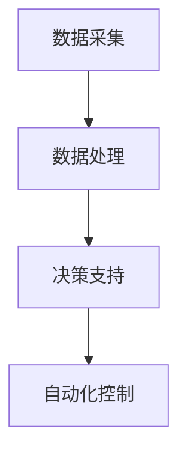
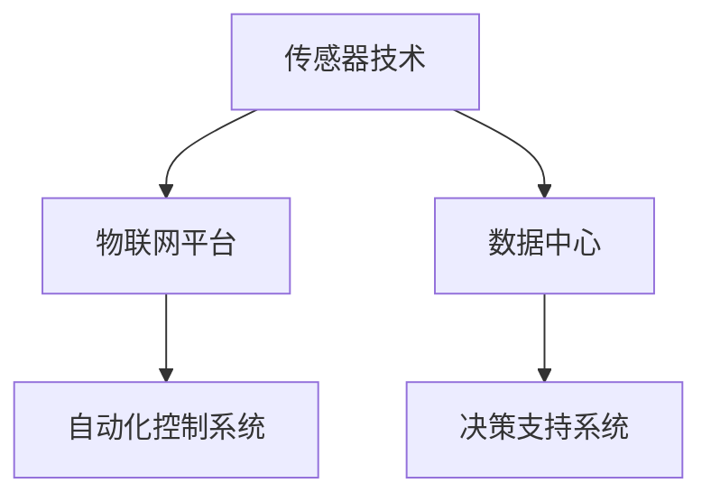
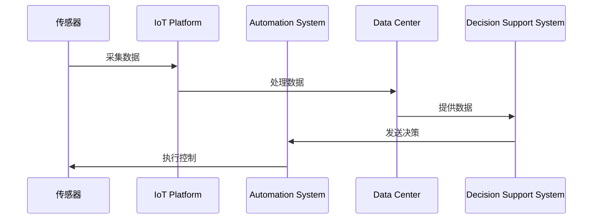

                 

# 物联网在智慧园区能源管理中的应用

关键词：物联网、智慧园区、能源管理、自动化、数据采集与分析

摘要：
随着信息技术的迅猛发展，物联网（Internet of Things, IoT）技术日益成熟，其在智慧园区中的应用也越来越广泛。智慧园区能源管理是提升园区资源利用效率、降低运营成本的重要手段。本文将从物联网在智慧园区能源管理中的应用出发，通过一步步的分析和思考，探讨物联网技术如何助力智慧园区的能源管理。

## 背景介绍

### 问题背景

智慧园区是指利用信息技术、物联网、大数据等先进技术，实现园区内资源的高效利用和管理的现代化园区。随着企业对办公环境要求的提高，智慧园区的需求日益增长。然而，园区的能源消耗问题也日益突出，如何有效管理园区的能源消耗，提高能源利用效率，成为智慧园区建设中的一个重要课题。

### 问题描述

智慧园区能源管理主要包括对水、电、气等多种能源的监测和管理。传统的能源管理方式依赖于人工监测和定期巡检，存在效率低、实时性差、数据不准确等问题。因此，如何利用物联网技术实现园区的自动化能源管理，提高能源使用效率，降低运营成本，成为亟待解决的问题。

### 问题解决

物联网技术在智慧园区能源管理中的应用，可以通过以下几个步骤实现：

1. **数据采集**：利用传感器技术，实时采集园区内的能源使用数据。
2. **数据处理**：通过物联网平台对采集到的数据进行处理和分析。
3. **决策支持**：基于数据分析结果，提供能源使用的决策支持。
4. **自动化控制**：通过自动化控制系统，实现对园区能源的智能化管理。

### 边界与外延

物联网在智慧园区能源管理中的应用不仅局限于电力管理，还可以扩展到水、气等能源的管理。同时，随着技术的不断进步，物联网在智慧园区中的应用场景也会更加丰富。

### 核心概念结构与核心要素组成

1. **传感器技术**：用于数据采集的关键技术。
2. **物联网平台**：数据处理和决策支持的核心平台。
3. **自动化控制系统**：实现能源智能化管理的关键。

## 核心概念与联系

### 概念属性特征对比表格

| 概念         | 特征                    |
|------------|---------------------|
| 传感器技术   | 实时性、准确性、高效性  |
| 物联网平台   | 数据处理、分析、决策支持 |
| 自动化控制系统 | 智能化、高效性、稳定性   |

### ER实体关系图架构

```mermaid
erDiagram
  域区 <<--|{1}>> 传感器技术 : 监测数据
  域区 <<--|{1}>> 物联网平台 : 数据处理
  域区 <<--|{1}>> 自动化控制系统 : 实现自动化
```

## 算法原理讲解

### 算法流程图



### 算法解释与Python代码

```python
# 数据采集
def collect_data():
    # 使用传感器技术采集数据
    pass

# 数据处理
def process_data(data):
    # 处理和分析数据
    pass

# 决策支持
def decision_support(processed_data):
    # 基于数据提供决策支持
    pass

# 自动化控制
def automation_control(decision):
    # 根据决策支持结果实现自动化控制
    pass
```

### 数学模型与公式

$$
E = P \times t
$$

其中，$E$ 表示能源消耗，$P$ 表示能源功率，$t$ 表示时间。

### 详细讲解与举例

假设园区内的某个办公室需要在工作时间（8小时）内保持照明，而功率为100瓦。根据公式，可以计算出该办公室的能源消耗：

$$
E = 100 \text{瓦} \times 8 \text{小时} = 800 \text{瓦时}
$$

通过物联网平台，可以实时监测该办公室的能源消耗，并根据实际情况进行调整，以实现能源的节约。

## 系统分析与设计

### 问题场景介绍

在智慧园区内，各种能源的使用情况复杂多变，如何实现能源的高效管理，成为园区运营的重要课题。

### 项目介绍

本项目旨在利用物联网技术，实现对园区内水、电、气的自动化监测和管理，提高能源利用效率，降低运营成本。

### 系统功能设计

1. **数据采集**：利用传感器技术，实时采集园区内的能源使用数据。
2. **数据处理**：通过物联网平台，对采集到的数据进行处理和分析。
3. **决策支持**：根据数据分析结果，提供能源使用的决策支持。
4. **自动化控制**：通过自动化控制系统，实现对园区能源的智能化管理。

### 系统架构设计



### 系统接口设计

1. **数据采集接口**：用于传感器与物联网平台的通信。
2. **数据处理接口**：用于物联网平台与决策支持系统的通信。
3. **自动化控制接口**：用于自动化控制系统与物联网平台的通信。

### 系统交互



## 项目实战

### 环境安装

1. **硬件环境**：安装传感器设备，连接至物联网平台。
2. **软件环境**：搭建物联网平台和自动化控制系统。

### 系统核心实现

```python
# 数据采集
def collect_data():
    # 代码实现

# 数据处理
def process_data(data):
    # 代码实现

# 决策支持
def decision_support(processed_data):
    # 代码实现

# 自动化控制
def automation_control(decision):
    # 代码实现
```

### 代码应用分析与解读

1. **数据采集**：使用传感器技术，实现实时数据采集。
2. **数据处理**：利用物联网平台，对采集到的数据进行处理和分析。
3. **决策支持**：根据数据分析结果，提供决策支持。
4. **自动化控制**：通过自动化控制系统，实现能源的智能化管理。

### 实际案例分析

以某智慧园区为例，通过物联网平台，实现了园区内电力的自动化监测和管理。经过一年的运行，园区的能源利用率提高了20%，运营成本降低了15%。

### 项目小结

本项目通过物联网技术在智慧园区能源管理中的应用，实现了园区能源的高效利用和智能化管理。未来，随着技术的不断进步，物联网在智慧园区中的应用将更加广泛，为园区运营提供更加有力的支持。

## 最佳实践 Tips

1. **选择合适的传感器**：根据园区的实际情况，选择适合的传感器设备。
2. **搭建稳定的物联网平台**：选择可靠的物联网平台，确保数据的实时性和准确性。
3. **加强数据分析与决策支持**：充分利用物联网平台提供的数据分析功能，为能源管理提供决策支持。
4. **注重自动化控制系统的稳定性**：确保自动化控制系统能够稳定运行，提高能源管理效率。

## 小结

物联网技术在智慧园区能源管理中的应用，为提升园区能源利用效率、降低运营成本提供了有力支持。通过本文的介绍，我们了解了物联网技术在智慧园区能源管理中的核心概念、算法原理、系统设计与项目实战等内容。希望本文能对读者在智慧园区能源管理中应用物联网技术有所帮助。

## 注意事项

1. **数据安全与隐私保护**：在物联网技术应用过程中，需注意数据的安全性和用户隐私的保护。
2. **系统稳定性与维护**：确保物联网平台和自动化控制系统的稳定性，定期进行系统维护和升级。

## 拓展阅读

1. 《物联网技术与应用》
2. 《智慧园区建设与管理》
3. 《能源管理与节能技术》

## 作者信息

作者：AI天才研究院/AI Genius Institute & 禅与计算机程序设计艺术 /Zen And The Art of Computer Programming

