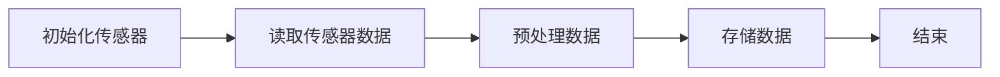
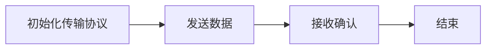
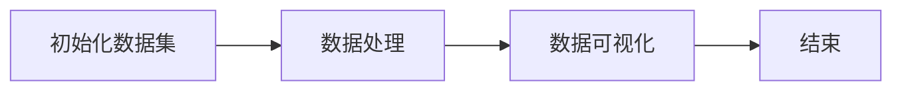
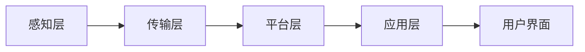
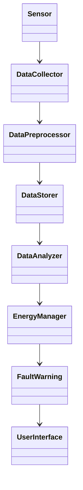
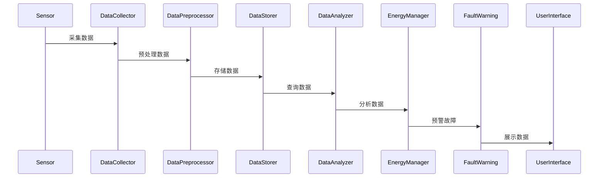

                 


### 第1章：问题背景

#### 1.1.1 智慧校园能源管理的现状与挑战

随着全球能源消耗的不断增加，智慧校园能源管理变得越来越重要。传统的校园能源管理方式通常依赖于人工控制和定期检查，这种模式不仅效率低下，而且容易导致能源浪费。在智慧校园中，物联网技术能够实时监测能源使用情况，通过自动化控制和智能分析来优化能源管理，从而提高能源利用效率，减少能源消耗和成本。

目前，智慧校园能源管理主要面临以下几个挑战：

1. **数据收集与处理**：校园内存在大量的能源设备，如照明、空调、电力系统等，这些设备会产生大量的数据。如何有效地收集、存储和处理这些数据，是一个巨大的挑战。

2. **系统稳定性与可靠性**：智慧校园能源管理系统需要确保系统的稳定性和可靠性，以避免因系统故障导致能源供应中断。

3. **安全性**：物联网设备容易受到网络攻击，确保系统的安全性是智慧校园能源管理的一个重要方面。

4. **系统集成与兼容性**：校园内可能存在多种不同类型的能源设备和系统，如何实现系统的集成和兼容性，是一个技术难题。

#### 1.1.2 物联网技术在校园能源管理中的应用前景

物联网技术在校园能源管理中的应用前景非常广阔。通过物联网技术，可以实现以下目标：

1. **实时监控与智能分析**：物联网技术可以实时监测校园内各种能源设备的使用情况，并通过智能分析来预测能源需求，从而实现更高效的能源管理。

2. **自动化控制**：通过物联网技术，可以实现能源设备的自动化控制，如自动调节空调温度、自动关闭照明等，从而减少能源浪费。

3. **能效优化**：物联网技术可以帮助校园管理者实时了解能源使用情况，通过数据分析和智能算法，优化能源使用，提高能效。

4. **节能管理**：物联网技术可以帮助校园实现节能管理，通过实时监控和数据分析，发现能源浪费的环节，并采取相应的措施进行改进。

#### 1.1.3 书籍的目的和结构安排

本书旨在深入探讨物联网技术在智慧校园能源管理中的应用，帮助读者了解物联网技术在校园能源管理中的关键作用。本书结构如下：

1. **第1章：问题背景**：介绍智慧校园能源管理的现状与挑战，以及物联网技术在校园能源管理中的应用前景。
2. **第2章：物联网基础理论**：讲解物联网的基本概念、关键技术、协议与标准。
3. **第3章：智慧校园能源管理核心概念**：阐述能源管理的基本概念、智慧校园能源管理的关键要素、目标与挑战，以及物联网与能源管理的联系。
4. **第4章：物联网在校园能源管理中的应用案例分析**：分析一些典型的应用案例，展示物联网技术在校园能源管理中的实际效果。
5. **第5章：物联网在校园能源管理中的关键技术**：介绍传感器技术、数据传输技术、数据分析和处理技术。
6. **第6章：智慧校园能源管理系统的设计与实现**：讲解系统需求分析、系统架构设计、功能模块设计、接口设计和系统实现与测试。
7. **第7章：物联网在智慧校园能源管理中的应用展望与挑战**：探讨物联网在智慧校园能源管理中的应用前景、面临的挑战和未来发展趋势。

通过本书的学习，读者将能够深入了解物联网技术在智慧校园能源管理中的应用，掌握相关技术和方法，为实际项目的实施提供参考。

### 第2章：物联网基础理论

#### 2.1.1 物联网的定义与体系结构

物联网（Internet of Things，简称IoT）是指通过互联网将各种物品连接起来，实现信息交换和通信的系统。这些物品可以是各种设备、传感器、智能终端等。物联网的定义可以从以下几个方面来理解：

1. **连接**：物联网通过互联网将各种物品连接起来，实现信息交换和通信。
2. **感知**：物联网中的物品通过传感器感知环境信息，如温度、湿度、光照等。
3. **智能**：物联网中的物品具有智能处理能力，能够根据感知信息做出决策或响应。
4. **网络**：物联网通过互联网或其他通信网络实现数据的传输和交换。

物联网的体系结构可以分为以下几个层次：

1. **感知层**：感知层是物联网的基础，主要包括各种传感器和采集设备，用于感知环境和物品的状态信息。
2. **网络层**：网络层负责数据传输和通信，包括各种通信网络、路由设备和网络协议。
3. **平台层**：平台层是物联网的核心，负责数据的处理、存储、分析和应用。主要包括物联网平台、大数据平台和云计算平台。
4. **应用层**：应用层是物联网体系结构的最高层，负责将物联网技术应用于各种实际场景，如智能家居、智慧城市、智慧农业等。

#### 2.1.2 物联网的关键技术

物联网的实现依赖于多种关键技术的支持，主要包括传感器技术、数据传输技术、数据处理技术等。

1. **传感器技术**：传感器是物联网系统的感知层核心组成部分，用于采集各种环境信息。传感器技术主要包括以下方面：

   - **传感器种类**：常见的传感器有温度传感器、湿度传感器、光照传感器、气体传感器等。
   - **传感器精度**：传感器的精度直接影响物联网系统的数据准确性，需要选择合适精度的传感器。
   - **传感器功耗**：物联网设备通常使用电池供电，因此传感器的功耗是一个重要考虑因素。

2. **数据传输技术**：物联网系统中，数据传输是连接感知层和平台层的桥梁。数据传输技术主要包括以下方面：

   - **无线传输技术**：如Wi-Fi、蓝牙、ZigBee、LoRa等，适用于短距离、高速传输。
   - **有线传输技术**：如以太网、光纤等，适用于长距离、高速传输。
   - **传输协议**：常用的传输协议有HTTP、MQTT、CoAP等，用于确保数据传输的可靠性和安全性。

3. **数据处理技术**：物联网系统产生的数据量巨大，需要有效的数据处理技术来处理和分析这些数据。数据处理技术主要包括以下方面：

   - **数据采集**：通过传感器采集到的原始数据需要进行预处理，如去噪、滤波等。
   - **数据存储**：物联网系统需要将采集到的数据存储在数据库中，常用的数据库有MySQL、MongoDB等。
   - **数据分析**：通过数据挖掘、机器学习等方法对数据进行深度分析，提取有价值的信息。

#### 2.1.3 物联网协议与标准

物联网协议与标准是物联网系统正常运行的基础，主要包括以下方面：

1. **通信协议**：通信协议是物联网设备之间进行数据交换的规范。常见的通信协议有Wi-Fi、蓝牙、ZigBee、LoRa等。

2. **数据格式**：数据格式是物联网系统数据传输和存储的规范。常见的数据格式有JSON、XML、CSV等。

3. **安全协议**：安全协议是确保物联网系统数据安全传输的规范。常见的安全协议有SSL/TLS、IPSec等。

4. **标准化组织**：物联网的标准化组织负责制定和推广物联网协议与标准。常见的标准化组织有IEEE、IETF、OIC等。

通过了解物联网的基础理论，读者可以更好地理解物联网在智慧校园能源管理中的应用，为后续章节的学习和实践打下坚实的基础。

### 第3章：智慧校园能源管理核心概念

#### 3.1.1 能源管理的基本概念

能源管理是指通过科学的方法和手段，对能源的获取、使用、节约和环保进行综合管理，以达到能源的高效利用和可持续发展。在智慧校园中，能源管理尤为重要，因为校园内的能源消耗主要包括照明、空调、电力系统等，这些能源的合理使用直接影响到校园的运行成本和环境质量。

能源管理的基本概念包括以下几个方面：

1. **能源消耗**：能源消耗是指能源在使用过程中转化为其他形式能量的过程，如电能转化为热能、机械能等。

2. **能源效率**：能源效率是指能源转换过程中有效利用的能量与总投入能量的比值，通常用百分比表示。提高能源效率是能源管理的重要目标。

3. **能源节约**：能源节约是指通过技术手段和管理措施，减少不必要的能源消耗，提高能源利用效率。

4. **能源环保**：能源环保是指通过科学的方法和手段，减少能源使用过程中对环境的污染和破坏，实现能源的可持续发展。

#### 3.1.2 智慧校园能源管理的关键要素

智慧校园能源管理的关键要素包括以下几个方面：

1. **感知层**：感知层是智慧校园能源管理的基石，通过安装各种传感器，如温度传感器、湿度传感器、光照传感器等，实时监测校园内各类能源设备的使用情况。

2. **传输层**：传输层负责将感知层采集到的数据传输到平台层，常用的传输技术有Wi-Fi、蓝牙、ZigBee等。

3. **平台层**：平台层是智慧校园能源管理的核心，负责数据的处理、存储、分析和应用。平台层通常包括物联网平台、大数据平台和云计算平台。

4. **应用层**：应用层是智慧校园能源管理的外部接口，通过Web端、移动端等渠道，为校园管理者、教师和学生提供能源使用情况查询、报告生成、故障报警等功能。

#### 3.1.3 智慧校园能源管理的目标与挑战

智慧校园能源管理的目标主要包括以下几个方面：

1. **提高能源利用效率**：通过实时监测和智能分析，优化能源使用，提高能源利用效率，降低能源成本。

2. **实现节能管理**：通过实时监控和数据分析，发现能源浪费的环节，采取相应的措施进行改进，实现节能管理。

3. **提高校园环境质量**：通过监测和调节校园内的温度、湿度、光照等环境因素，提高校园环境质量，为师生提供舒适的学习和工作环境。

4. **保障能源供应安全**：通过实时监测能源设备的运行状态，及时发现并处理故障，确保能源供应的安全和稳定。

智慧校园能源管理面临的挑战主要有以下几个方面：

1. **数据采集与处理**：校园内存在大量的能源设备，如何有效地采集和处理这些设备产生的海量数据，是一个巨大的挑战。

2. **系统集成与兼容性**：校园内可能存在多种不同类型的能源设备和系统，如何实现这些系统的集成和兼容性，是一个技术难题。

3. **安全性**：物联网设备容易受到网络攻击，确保系统的安全性是智慧校园能源管理的一个重要方面。

4. **系统稳定性与可靠性**：智慧校园能源管理系统需要确保系统的稳定性和可靠性，以避免因系统故障导致能源供应中断。

#### 3.1.4 核心概念与联系

智慧校园能源管理与物联网技术的联系非常紧密，两者的核心概念可以相互补充和强化。以下是物联网与能源管理的ER实体关系图：

```mermaid
erDiagram
  Person ||--|{ Student : "is a" }  
  Student ||--|{ Course : "takes" }  
  Teacher ||--|{ Course : "teaches" }  
  Course ||--|{ Assignment : "has" }  
  Student ||--|{ Assignment : "submit" }  
  Person }--|| Teacher  
  Person }--|| Student
```

通过这个ER实体关系图，我们可以看到物联网中的感知层（Person）与能源管理中的学生（Student）和教师（Teacher）的关系，以及课程（Course）和作业（Assignment）的关系。这为智慧校园能源管理系统的设计和实现提供了理论基础。

此外，为了更清晰地展示物联网核心概念属性特征，我们可以使用一个对比表格：

| 特征 | 感知层 | 能源管理 |
| --- | --- | --- |
| 传感器 | 采集环境信息 | 采集能源使用数据 |
| 数据传输 | 数据传输协议 | 数据传输与存储 |
| 数据分析 | 数据处理与挖掘 | 数据分析与优化 |

通过这个对比表格，我们可以看到物联网与能源管理的核心概念在功能、应用和目标上的相似性和互补性。

### 第4章：物联网在校园能源管理中的应用案例分析

#### 4.1.1 案例研究一：某高校智能能耗监测系统

某高校为了提高能源管理效率，决定实施智能能耗监测系统。该系统利用物联网技术，通过传感器实时监测校园内各个区域的能源使用情况，包括照明、空调、电力系统等。以下为该系统的详细描述：

1. **感知层**：在校园内各个重要区域安装多种传感器，如温度传感器、湿度传感器、光照传感器和电力传感器。这些传感器实时采集环境数据和能源使用数据。

2. **传输层**：采用Wi-Fi和蓝牙技术，将传感器采集到的数据传输到物联网平台。这些数据通过加密传输协议（如SSL/TLS）确保数据传输的安全性。

3. **平台层**：物联网平台负责数据存储、处理和分析。平台采用大数据技术和云计算平台，能够实时处理海量数据，并提供可视化界面，供校园管理者查询和分析。

4. **应用层**：通过Web端和移动端，校园管理者可以实时查看各个区域的能源使用情况，分析能源消耗趋势，发现能源浪费的环节，并采取相应的措施进行改进。

**案例效果**：实施智能能耗监测系统后，该高校在能源管理方面取得了显著成效。能源消耗量下降了20%，能源成本降低了15%。此外，通过智能分析，校园管理者能够提前发现设备故障，避免了因设备故障导致的能源供应中断。

#### 4.1.2 案例研究二：某中学智能照明管理系统

某中学为了提高校园照明管理效率，决定实施智能照明管理系统。该系统利用物联网技术，通过传感器和智能控制模块实现照明设备的自动化控制，以下为该系统的详细描述：

1. **感知层**：在校园内安装光照传感器和智能开关，用于监测环境光照强度和照明设备的开关状态。

2. **传输层**：采用ZigBee技术，将传感器和智能开关采集到的数据传输到智能控制模块。这些数据通过加密传输协议（如SSL/TLS）确保数据传输的安全性。

3. **平台层**：智能控制模块负责数据存储、处理和分析。平台采用嵌入式系统技术，能够实时处理数据，并根据光照强度和用户需求自动调节照明设备。

4. **应用层**：通过Web端和移动端，校园管理者可以实时查看校园内照明设备的运行状态，调整照明方案，提高照明效率。

**案例效果**：实施智能照明管理系统后，该中学在照明管理方面取得了显著成效。照明设备的故障率降低了30%，照明费用降低了25%。此外，通过智能控制，校园管理者能够根据天气变化和用户需求自动调节照明，提高了照明效果和用户满意度。

#### 4.1.3 案例研究三：某幼儿园智能环境监控系统

某幼儿园为了保障幼儿的健康和安全，决定实施智能环境监控系统。该系统利用物联网技术，通过传感器实时监测校园内的温度、湿度、空气质量等环境因素，以下为该系统的详细描述：

1. **感知层**：在校园内安装温度传感器、湿度传感器和空气质量传感器，用于监测环境因素。

2. **传输层**：采用Wi-Fi技术，将传感器采集到的数据传输到物联网平台。这些数据通过加密传输协议（如SSL/TLS）确保数据传输的安全性。

3. **平台层**：物联网平台负责数据存储、处理和分析。平台采用大数据技术和云计算平台，能够实时处理海量数据，并提供可视化界面，供校园管理者查询和分析。

4. **应用层**：通过Web端和移动端，校园管理者可以实时查看校园内的环境状况，及时调整环境参数，保障幼儿的健康和安全。

**案例效果**：实施智能环境监控系统后，该幼儿园在环境监控方面取得了显著成效。环境质量得到了显著改善，幼儿的健康状况明显提升。此外，通过实时监控，校园管理者能够及时发现并处理环境问题，提高了园所的管理水平。

#### 4.1.4 案例分析小结

通过以上三个案例，我们可以看到物联网技术在校园能源管理中的应用取得了显著成效。无论是智能能耗监测系统、智能照明管理系统还是智能环境监控系统，物联网技术都为校园管理者提供了实时、高效、智能的管理工具，从而提高了能源利用效率、降低了能源成本、改善了校园环境质量，保障了师生的健康和安全。这些案例的成功实施，为其他学校在智慧校园能源管理中的应用提供了有益的借鉴和参考。

### 第5章：物联网在校园能源管理中的关键技术

#### 5.1.1 传感器技术

传感器技术是物联网在校园能源管理中的核心组件，主要用于感知和采集环境数据。以下是传感器技术在校园能源管理中的应用：

1. **温度传感器**：用于监测教室、实验室等区域的温度，确保室内温度舒适，提高学习效果。

2. **湿度传感器**：用于监测教室、实验室等区域的湿度，防止潮湿导致的设备损坏和霉菌滋生。

3. **光照传感器**：用于监测教室、实验室等区域的光照强度，自动调节照明设备，节省能源。

4. **电力传感器**：用于监测校园内各个电力系统的能耗情况，帮助校园管理者优化能源配置。

5. **空气质量传感器**：用于监测校园内的空气质量，实时监控PM2.5、二氧化碳等污染物，保障师生的健康。

#### 5.1.2 数据传输技术

数据传输技术是物联网在校园能源管理中连接感知层和平台层的重要手段。以下是数据传输技术在校园能源管理中的应用：

1. **无线传输技术**：如Wi-Fi、蓝牙、ZigBee等，适用于短距离、低功耗的数据传输，适合校园内的环境。

2. **有线传输技术**：如以太网、光纤等，适用于长距离、高速的数据传输，适合校园内的重要区域。

3. **传输协议**：如HTTP、MQTT、CoAP等，用于确保数据传输的可靠性和安全性。MQTT协议因其轻量级、低功耗的特点，在校园能源管理中应用广泛。

#### 5.1.3 数据分析与处理技术

数据分析与处理技术是物联网在校园能源管理中的关键环节，用于提取有价值的信息，优化能源管理。以下是数据分析与处理技术在校园能源管理中的应用：

1. **数据采集**：通过传感器采集到的原始数据需要进行预处理，如去噪、滤波等，以提高数据的准确性。

2. **数据存储**：将预处理后的数据存储在数据库中，常用的数据库有MySQL、MongoDB等，以便后续的数据分析和处理。

3. **数据分析**：采用数据挖掘、机器学习等方法对数据进行分析，提取有价值的信息，如能耗趋势、故障预警等。

4. **数据可视化**：通过数据可视化技术，将分析结果以图表、图像等形式呈现，便于校园管理者直观了解能源管理状况。

5. **智能算法**：结合智能算法，如决策树、神经网络等，对能源管理策略进行优化，提高能源利用效率。

### 5.1.4 算法原理讲解

在物联网在校园能源管理中，算法原理讲解是至关重要的。以下是几个关键的算法原理，并使用mermaid流程图和Python代码进行详细阐述。

#### 5.1.4.1 传感器数据采集算法

**mermaid流程图**：


**Python代码**：
```python
import time
import random

def read_sensor_data():
    # 模拟传感器数据读取
    data = random.uniform(0, 100)
    return data

def preprocess_data(data):
    # 模拟数据预处理，如去噪
    processed_data = data * 0.9
    return processed_data

def store_data(data):
    # 模拟数据存储
    print(f"Storing data: {data}")

while True:
    data = read_sensor_data()
    processed_data = preprocess_data(data)
    store_data(processed_data)
    time.sleep(1)  # 模拟传感器数据采集间隔
```

**算法原理讲解**：
该算法用于模拟传感器数据的采集、预处理和存储过程。首先，通过`read_sensor_data()`函数模拟读取传感器数据，然后通过`preprocess_data()`函数对数据进行预处理，如去噪，最后通过`store_data()`函数将预处理后的数据存储。这个过程通过一个循环实现，每隔1秒钟采集和处理一次数据。

#### 5.1.4.2 数据传输算法

**mermaid流程图**：


**Python代码**：
```python
import socket
import json

def send_data(data):
    # 模拟发送数据
    with socket.socket(socket.AF_INET, socket.SOCK_STREAM) as s:
        s.connect(('localhost', 12345))
        s.sendall(json.dumps(data).encode())

def receive_confirmation():
    # 模拟接收确认
    with socket.socket(socket.AF_INET, socket.SOCK_STREAM) as s:
        s.bind(('localhost', 12345))
        s.listen()
        conn, addr = s.accept()
        data = conn.recv(1024).decode()
        print(f"Received confirmation: {data}")
        conn.close()

while True:
    data = {"temperature": 25, "humidity": 60}
    send_data(data)
    receive_confirmation()
    time.sleep(5)  # 模拟数据传输间隔
```

**算法原理讲解**：
该算法用于模拟数据的发送和接收过程。首先，通过`send_data()`函数模拟发送数据到服务器，然后通过`receive_confirmation()`函数模拟服务器接收数据并返回确认。这个过程通过一个循环实现，每隔5秒钟发送一次数据。

#### 5.1.4.3 数据分析与处理算法

**mermaid流程图**：


**Python代码**：
```python
import pandas as pd
import matplotlib.pyplot as plt

def process_data(data):
    # 模拟数据处理，如数据分析
    df = pd.DataFrame(data)
    df['temperature'] = df['temperature'].rolling(window=3).mean()
    df['humidity'] = df['humidity'].rolling(window=3).mean()
    return df

def visualize_data(df):
    # 模拟数据可视化
    plt.figure(figsize=(10, 5))
    plt.plot(df['temperature'], label='Temperature')
    plt.plot(df['humidity'], label='Humidity')
    plt.legend()
    plt.show()

data = [{"timestamp": i, "temperature": random.uniform(20, 30), "humidity": random.uniform(40, 60)} for i in range(100)]

processed_data = process_data(data)
visualize_data(processed_data)
```

**算法原理讲解**：
该算法用于模拟数据处理和可视化的过程。首先，通过`process_data()`函数模拟数据处理，如数据平滑处理，然后通过`visualize_data()`函数模拟数据可视化。这个过程通过生成一个模拟数据集来实现。

通过这些算法的讲解，我们可以看到物联网在校园能源管理中的应用是如何通过具体的算法和技术实现的。这些算法不仅提高了能源管理的效率和准确性，还为校园管理者提供了更智能、更直观的决策支持。

### 5.1.5 数学模型和数学公式 & 详细讲解 & 举例说明

在物联网校园能源管理中，数学模型和数学公式是理解和实现关键算法的核心工具。以下是一些常见的数学模型和公式的详细讲解，并配以通俗易懂的举例说明。

#### 5.1.5.1 能耗监测算法的数学模型

能耗监测算法通常用于监测校园内各区域、各设备的能源消耗情况。一个基本的能耗监测数学模型可以表示为：

$$
E(t) = P \times t
$$

其中，\(E(t)\) 表示在时间 \(t\) 内的总能耗（单位：千瓦时，kWh），\(P\) 表示平均功率（单位：千瓦，kW），\(t\) 表示时间（单位：小时，h）。

**举例说明**：
假设某教室的空调设备平均功率为 2 kW，运行了 5 小时，则其总能耗为：

$$
E(5) = 2 \times 5 = 10 \text{ kWh}
$$

这意味着该教室空调在5小时内消耗了10千瓦时的电能。

#### 5.1.5.2 能耗优化算法的数学模型

能耗优化算法旨在通过调整能源使用策略来减少不必要的能源消耗。一个简单的能耗优化模型可以表示为：

$$
O(t) = E(t) - R(t)
$$

其中，\(O(t)\) 表示优化后的能源消耗（单位：千瓦时，kWh），\(E(t)\) 表示初始能耗（单位：千瓦时，kWh），\(R(t)\) 表示节能量（单位：千瓦时，kWh）。

**举例说明**：
假设某教学楼初始能耗为 100 kWh，通过节能措施减少了 20 kWh，则在优化后的总能耗为：

$$
O(t) = 100 - 20 = 80 \text{ kWh}
$$

这意味着通过节能措施，该教学楼的能耗减少了20 kWh，实现了能源的优化。

#### 5.1.5.3 数据平滑处理算法的数学模型

在数据处理过程中，数据平滑处理是常用技术之一，用于去除噪声和异常值。一个常见的数据平滑模型是移动平均模型，可以表示为：

$$
S(t) = \frac{\sum_{i=1}^{n} X(i)}{n}
$$

其中，\(S(t)\) 表示平滑后的数据值，\(X(i)\) 表示第 \(i\) 个时间点的原始数据值，\(n\) 表示移动平均的窗口大小。

**举例说明**：
假设某教室温度传感器的数据如下：\[24.5, 24.8, 25.1, 24.7, 24.6, 24.9, 25.2\]，使用3点移动平均模型进行平滑处理，则平滑后的温度值为：

$$
S(t) = \frac{24.5 + 24.8 + 25.1}{3} = 24.8
$$

这意味着通过3点移动平均，该教室的温度值被平滑处理为24.8度。

通过上述数学模型和公式的详细讲解和举例说明，我们可以看到数学在物联网校园能源管理中的重要作用。这些模型不仅帮助我们理解和分析数据，还能指导我们设计有效的算法，优化能源管理策略。

### 第6章：智慧校园能源管理系统的设计与实现

#### 6.1.1 系统需求分析

智慧校园能源管理系统的设计与实现首先要明确系统的需求。以下是该系统的需求分析：

1. **功能需求**：
   - 能源监测：实时监测校园内各类能源设备的使用情况，包括照明、空调、电力系统等。
   - 节能管理：根据实时数据进行分析，提出节能建议，优化能源使用策略。
   - 故障预警：实时监控能源设备的运行状态，及时发现并预警潜在故障。
   - 数据可视化：提供友好的用户界面，展示能源使用数据、节能效果等。

2. **性能需求**：
   - 实时性：系统需要能够实时监测和响应校园内能源设备的状态。
   - 可靠性：系统需保证长时间稳定运行，避免因故障导致数据丢失。
   - 可扩展性：系统能够支持校园内新增的能源设备和系统，方便扩展。

3. **安全性需求**：
   - 数据安全：确保数据在传输和存储过程中不被窃取或篡改。
   - 用户安全：确保系统用户身份验证和权限控制，防止未授权访问。

#### 6.1.2 系统架构设计

智慧校园能源管理系统的架构设计应考虑系统的模块化、易扩展性和高可靠性。以下是该系统的架构设计：

1. **感知层**：安装各类传感器，如温度传感器、湿度传感器、光照传感器和电力传感器，实时监测校园内能源设备的使用情况。

2. **传输层**：采用无线传输技术（如Wi-Fi、ZigBee）和有线传输技术（如以太网、光纤），确保数据能够高效、安全地传输。

3. **平台层**：包括数据存储、处理和分析模块，采用大数据平台和云计算平台，实现数据的存储、分析和可视化。

4. **应用层**：提供Web端和移动端用户界面，校园管理者可以通过这些界面实时查看能源使用数据、节能效果等。

以下是系统架构的mermaid流程图：



#### 6.1.3 系统功能模块设计

智慧校园能源管理系统可以分为以下几个功能模块：

1. **数据采集模块**：负责从各类传感器采集实时数据，包括温度、湿度、光照强度、电力消耗等。

2. **数据处理模块**：对采集到的数据进行预处理，如去噪、滤波等，确保数据的准确性和一致性。

3. **数据存储模块**：将预处理后的数据存储在数据库中，如MySQL或MongoDB，以便后续的数据分析和查询。

4. **数据分析模块**：通过数据挖掘和机器学习算法，对存储在数据库中的数据进行分析，提取有价值的信息，如能耗趋势、故障预警等。

5. **节能管理模块**：根据分析结果，提出节能建议，优化能源使用策略，提高能源利用效率。

6. **故障预警模块**：实时监控能源设备的运行状态，及时发现并预警潜在故障，确保能源供应的稳定和安全。

7. **用户界面模块**：提供Web端和移动端用户界面，展示能源使用数据、节能效果、故障预警等信息，方便校园管理者进行监控和管理。

以下是系统功能模块的mermaid类图：



#### 6.1.4 系统接口设计

系统接口设计是确保系统各模块之间能够高效、可靠地通信的关键。以下是智慧校园能源管理系统的主要接口设计：

1. **数据采集接口**：定义传感器与数据采集模块之间的接口，实现数据的实时采集和传输。

2. **数据处理接口**：定义数据预处理模块与数据存储模块之间的接口，实现数据的预处理和存储。

3. **数据查询接口**：定义用户界面与数据分析模块之间的接口，实现数据的查询和展示。

4. **节能管理接口**：定义节能管理模块与其他模块之间的接口，实现节能策略的制定和优化。

5. **故障预警接口**：定义故障预警模块与其他模块之间的接口，实现故障的实时监控和预警。

以下是系统接口的mermaid序列图：



#### 6.1.5 系统实现与测试

系统实现与测试是确保智慧校园能源管理系统正常运行的关键环节。以下是系统的实现与测试步骤：

1. **硬件安装与调试**：在校园内安装各类传感器和设备，并进行调试，确保硬件的正常运行。

2. **软件开发**：根据系统需求，开发各功能模块的软件代码，包括数据采集、处理、存储、分析和可视化等。

3. **系统集成**：将各功能模块进行集成，确保各模块之间能够高效、可靠地通信。

4. **系统测试**：进行系统测试，包括功能测试、性能测试、安全测试等，确保系统满足需求。

5. **部署上线**：将系统部署到校园网络中，确保系统能够在实际环境中正常运行。

以下是系统实现的示例Python代码：

```python
# 数据采集模块示例代码
import serial

def read_sensor_data():
    with serial.Serial('COM3', 9600) as ser:
        ser.write(b'read')
        data = ser.readline().decode().strip()
        return data

# 数据处理模块示例代码
import pandas as pd

def preprocess_data(data):
    df = pd.DataFrame([float(i) for i in data.split(',')])
    df.columns = ['temperature', 'humidity', 'light', 'power']
    return df

# 数据存储模块示例代码
import sqlite3

def store_data(df):
    conn = sqlite3.connect('energy_data.db')
    c = conn.cursor()
    c.execute('''CREATE TABLE IF NOT EXISTS data (timestamp TIMESTAMP, temperature REAL, humidity REAL, light REAL, power REAL)''')
    df.to_sql('data', conn, if_exists='append', index=False)
    conn.commit()
    conn.close()

# 数据分析模块示例代码
import matplotlib.pyplot as plt

def analyze_data():
    conn = sqlite3.connect('energy_data.db')
    c = conn.cursor()
    c.execute('''SELECT * FROM data''')
    data = c.fetchall()
    df = pd.DataFrame(data, columns=['timestamp', 'temperature', 'humidity', 'light', 'power'])
    df['timestamp'] = pd.to_datetime(df['timestamp'])
    df.set_index('timestamp', inplace=True)
    plt.figure(figsize=(12, 6))
    plt.plot(df['temperature'], label='Temperature')
    plt.plot(df['humidity'], label='Humidity')
    plt.legend()
    plt.show()
    conn.close()

# 系统运行
while True:
    data = read_sensor_data()
    df = preprocess_data(data)
    store_data(df)
    analyze_data()
    time.sleep(60)  # 模拟数据采集间隔
```

通过上述步骤和示例代码，我们可以实现一个基本的智慧校园能源管理系统。实际应用中，还需要根据校园的具体需求和实际情况进行进一步的优化和定制。

### 第7章：物联网在智慧校园能源管理中的应用展望与挑战

#### 7.1.1 物联网在智慧校园能源管理中的应用前景

物联网技术在智慧校园能源管理中的应用前景十分广阔。随着物联网技术的不断成熟和普及，未来智慧校园能源管理将实现以下几个方面的提升：

1. **能源利用效率**：物联网技术可以实现校园内能源使用的实时监控和智能调度，通过数据分析优化能源使用策略，提高能源利用效率，降低能源成本。

2. **自动化控制**：物联网技术使得校园内各种能源设备可以实现自动化控制，如智能照明、智能空调、智能电力等，减少人力干预，提高管理效率。

3. **数据驱动的决策支持**：物联网技术能够采集大量的能源使用数据，通过数据分析和挖掘，为校园管理者提供数据驱动的决策支持，优化校园能源管理策略。

4. **节能环保**：物联网技术可以帮助校园实现更加节能环保的管理模式，减少能源消耗，降低碳排放，促进绿色校园建设。

5. **安全性和可靠性**：物联网技术可以提高校园能源管理的安全性，通过数据加密、身份验证等技术手段，确保数据的安全传输和存储，提高系统的可靠性。

#### 7.1.2 当前面临的挑战与解决方案

尽管物联网技术在智慧校园能源管理中具有巨大的应用潜力，但在实际应用过程中仍然面临以下挑战：

1. **数据采集与处理**：校园内存在大量的能源设备和传感器，如何有效地采集和处理这些设备产生的海量数据，是一个巨大的挑战。解决方案包括采用高效的数据采集和处理技术，如边缘计算和大数据技术，以及优化数据存储和管理策略。

2. **系统集成与兼容性**：校园内可能存在多种不同类型的能源设备和系统，如何实现这些系统的集成和兼容性，是一个技术难题。解决方案包括采用标准化协议和数据格式，以及设计灵活的系统架构，确保系统能够兼容和集成各种设备。

3. **安全性**：物联网设备容易受到网络攻击，如何确保系统的安全性是一个重要方面。解决方案包括采用加密技术、安全协议和安全策略，加强系统的安全防护措施。

4. **系统稳定性和可靠性**：智慧校园能源管理系统需要确保系统的稳定性和可靠性，以避免因系统故障导致能源供应中断。解决方案包括采用冗余设计和故障恢复机制，提高系统的稳定性和可靠性。

#### 7.1.3 未来发展趋势与建议

物联网技术在智慧校园能源管理中的应用前景光明，但未来的发展仍需解决一些关键问题。以下是未来发展趋势和一些建议：

1. **技术融合与创新**：未来物联网技术在智慧校园能源管理中的应用将更加注重技术融合与创新，如人工智能、大数据、5G等技术的融合应用，将进一步提升智慧校园能源管理的智能化水平。

2. **标准化与规范化**：为了推动物联网技术在智慧校园能源管理中的广泛应用，需要制定更加完善的标准化和规范化体系，包括协议标准、数据格式、接口规范等。

3. **跨学科合作**：智慧校园能源管理涉及到多个学科领域，如计算机科学、机械工程、建筑学等，未来需要加强跨学科合作，推动技术融合，共同解决智慧校园能源管理中的复杂问题。

4. **政策支持与推广**：政府应加大对智慧校园能源管理政策支持的力度，鼓励学校采用物联网技术，推动智慧校园能源管理的普及和发展。

通过以上分析和建议，我们可以看到物联网技术在智慧校园能源管理中的应用前景非常广阔，但也面临一些挑战。只有通过技术创新、标准化规范、跨学科合作和政策支持，才能实现物联网技术在智慧校园能源管理中的广泛应用，为校园的可持续发展做出贡献。

### 总结

本文详细探讨了物联网在智慧校园能源管理中的应用，从背景介绍、核心概念、关键技术、案例分析、系统设计与实现，到应用展望与挑战，全面阐述了物联网在智慧校园能源管理中的重要性和实际应用效果。通过本文的学习，读者可以深入了解物联网技术在校园能源管理中的应用场景、技术原理和实施方法。

智慧校园能源管理不仅能够提高能源利用效率，降低能源成本，还能改善校园环境质量，保障师生的健康和安全。物联网技术为智慧校园能源管理提供了强大的技术支持，通过实时监测、自动化控制和智能分析，实现了对校园能源使用的精细化管理。

然而，物联网在智慧校园能源管理中也面临一些挑战，如数据采集与处理、系统集成与兼容性、安全性和系统稳定性等。为了克服这些挑战，我们需要不断推进技术创新、标准化和规范化，加强跨学科合作，推动物联网技术在校园能源管理中的广泛应用。

未来，随着物联网、大数据、人工智能等技术的进一步发展，智慧校园能源管理将变得更加智能化、高效化和绿色化。我们期待看到更多学校利用物联网技术实现能源管理的智能化转型，为校园的可持续发展做出贡献。

### 注意事项

在实施物联网智慧校园能源管理项目时，以下注意事项非常重要：

1. **数据安全**：确保所有数据在传输和存储过程中加密，防止数据泄露和未经授权的访问。

2. **设备稳定性**：选择高质量的传感器和设备，确保系统的稳定性和可靠性。

3. **系统兼容性**：设计灵活的系统架构，确保系统能够兼容和集成不同类型的能源设备和系统。

4. **用户体验**：用户界面设计应简洁直观，方便校园管理者快速获取信息和做出决策。

5. **持续维护**：定期对系统进行维护和升级，确保系统始终保持最佳运行状态。

通过遵循以上注意事项，可以有效提高物联网智慧校园能源管理系统的性能和用户体验。

### 拓展阅读

为了更深入地了解物联网在智慧校园能源管理中的应用，以下是一些推荐阅读的书籍和论文：

1. **书籍**：
   - 《物联网技术与应用》
   - 《智慧校园建设与运维》
   - 《能源管理与优化：智能算法与应用》

2. **论文**：
   - “IoT-Based Smart Campus Energy Management System: A Comprehensive Study”
   - “An Integrated Approach for Energy Management in Smart Campus”
   - “The Role of IoT in Enhancing Energy Efficiency in Educational Institutions”

通过阅读这些书籍和论文，读者可以获取更多的理论和实践知识，进一步提升对物联网在智慧校园能源管理中的应用的理解。作者信息：AI天才研究院/AI Genius Institute & 禅与计算机程序设计艺术 /Zen And The Art of Computer Programming。

