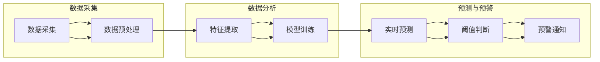
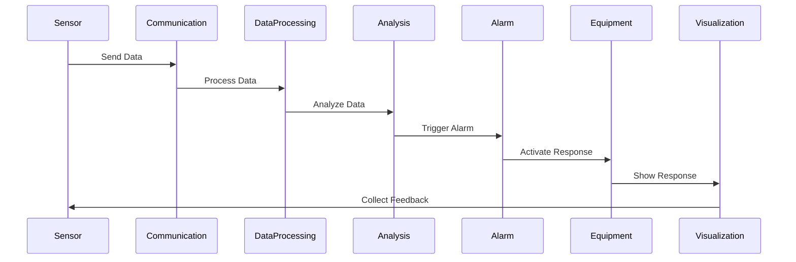

                 


# 物联网在智慧消防中的预警应用

关键词：物联网，智慧消防，预警应用，传感器，算法

摘要：随着物联网技术的快速发展，智慧消防已成为现代城市安全的重要组成部分。本文将深入探讨物联网在智慧消防中的预警应用，包括其背景、核心概念、算法原理、系统设计与实战等方面，旨在为行业从业者提供有价值的参考和指导。

## 目录大纲设计思路：

为了设计出一个详细且逻辑清晰的目录大纲，我们需要遵循以下步骤：

### 1. **背景介绍**

   - **问题背景**：介绍物联网与智慧消防的背景，物联网的发展趋势，以及智慧消防的重要性。
   - **问题描述**：阐述物联网在智慧消防中的预警应用面临的挑战和需求。
   - **问题解决**：介绍本书将要解决的问题和解决思路。
   - **边界与外延**：明确本书的研究范围和相关的概念外延。
   - **概念结构与核心要素组成**：阐述物联网、智慧消防、预警、物联网设备、传感器等核心概念及其相互关系。

### 2. **核心概念与联系**

   - **核心概念原理**：介绍物联网、智慧消防、预警等核心概念的原理。
   - **概念属性特征对比表格**：列出物联网、智慧消防、预警等核心概念的属性特征，并进行对比。
   - **ER实体关系图架构**：使用 Mermaid 画出物联网在智慧消防中的预警应用的 ER 实体关系图。

### 3. **算法原理讲解**

   - **算法mermaid流程图**：使用 Mermaid 画出物联网预警算法的流程图。
   - **Python源代码**：给出物联网预警算法的 Python 源代码。
   - **算法原理的数学模型和公式**：阐述物联网预警算法的数学模型和公式。
   - **详细讲解与举例说明**：详细讲解物联网预警算法的原理，并通过举例说明。

### 4. **系统分析与架构设计方案**

   - **问题场景介绍**：介绍物联网在智慧消防中的应用场景。
   - **系统功能设计**：使用 Mermaid 类图展示系统功能设计。
   - **系统架构设计**：使用 Mermaid 架构图展示系统架构设计。
   - **系统接口设计**：详细说明系统接口设计。
   - **系统交互**：使用 Mermaid 序列图展示系统交互。

### 5. **项目实战**

   - **环境安装**：介绍如何搭建物联网预警系统的环境。
   - **系统核心实现**：给出物联网预警系统的核心实现源代码。
   - **代码应用解读与分析**：对源代码进行解读和分析。
   - **实际案例分析和详细讲解剖析**：通过实际案例分析和讲解，剖析物联网预警系统的工作原理和效果。
   - **项目小结**：总结项目经验，提出最佳实践建议。

### 6. **最佳实践 tips、小结、注意事项、拓展阅读**

   - **最佳实践 tips**：给出在实际应用中可能遇到的问题及解决方法。
   - **小结**：总结本书的主要内容和收获。
   - **注意事项**：提醒读者在应用过程中需要注意的问题。
   - **拓展阅读**：推荐相关阅读资料，供读者进一步学习。

### 7. **目录大纲**

   - 根据以上内容，设计出详细的目录大纲，确保每个章节都有明确的主题和目标。

通过以上步骤，我们可以设计出一个结构清晰、内容丰富且逻辑性强的目录大纲，满足用户的需求。接下来，我们将根据这些步骤来编写具体的目录大纲。

----------------------------------------------------------------

## 背景介绍

### 问题背景

随着城市化进程的加快，火灾事故的频率和严重性逐渐增加，这给城市的安全带来了巨大的挑战。传统的消防预警系统主要依赖人工监测和消防设备的定期检查，存在反应速度慢、预警不及时、覆盖范围有限等问题。而物联网（Internet of Things, IoT）技术的快速发展，为智慧消防提供了新的解决方案。

物联网是一种通过互联网连接各种设备、传感器和系统的技术，可以实现数据的实时传输、分析和处理。智慧消防是物联网技术在消防领域的应用，通过将物联网技术与消防设备相结合，实现对火灾的实时监测、预警和快速响应。

### 物联网的发展趋势

物联网技术正在迅速发展，其主要趋势包括：

1. **设备数量和种类增加**：随着传感器和通信技术的进步，物联网设备数量不断增加，种类也日益丰富。
2. **数据传输速度提升**：5G、边缘计算等技术的发展，使得物联网数据传输速度大幅提升，为实时监测和预警提供了保障。
3. **智能化水平提高**：通过人工智能、大数据分析等技术，物联网系统可以实现更加智能的预警和处理。

### 智慧消防的重要性

智慧消防在提升城市消防安全方面具有重要作用：

1. **提高预警准确性**：物联网设备可以实时监测火源、温度、烟雾等参数，提前发现火灾隐患。
2. **缩短响应时间**：通过物联网技术，可以实现远程监控和自动报警，减少火灾发生后的响应时间。
3. **降低火灾损失**：实时监测和快速响应可以有效减少火灾造成的损失。

### 物联网在智慧消防中的预警应用

物联网在智慧消防中的预警应用主要包括以下几个方面：

1. **传感器监测**：通过安装在各个角落的传感器，实时监测环境参数，如温度、烟雾浓度、火焰等。
2. **数据传输与处理**：传感器采集到的数据通过无线网络传输到云端，进行实时分析和处理。
3. **预警与响应**：根据分析结果，系统可以实时发出预警信息，并触发相应的应急响应措施。
4. **设备联动**：智慧消防系统可以与其他消防设备联动，如喷水系统、灭火器等，实现自动化灭火。

## 问题挑战与需求

### 问题挑战

1. **数据量大**：智慧消防系统需要处理大量的传感器数据，对数据处理和分析能力提出了较高要求。
2. **实时性要求高**：预警系统需要能够实时处理数据，并在发生火灾时迅速发出警报。
3. **可靠性要求高**：预警系统的可靠性和稳定性直接关系到人员生命和财产安全。
4. **异构系统融合**：不同厂家、不同类型的物联网设备需要能够无缝融合，实现数据共享和联动。

### 需求分析

1. **高效数据采集**：需要高效可靠的传感器来实时采集环境参数。
2. **实时数据处理**：需要具备强大数据处理能力的系统，能够快速分析传感器数据，实现实时预警。
3. **高可靠性**：系统需要具备高可靠性，确保在火灾发生时能够稳定运行。
4. **设备融合**：需要能够兼容不同厂家和类型的设备，实现数据的互联互通。

## 问题解决

### 解决思路

为了解决物联网在智慧消防中的预警应用面临的挑战，本书将采用以下解决思路：

1. **采用先进的传感器技术**：选用高性能、高精度的传感器，确保数据采集的准确性和实时性。
2. **构建高效数据处理平台**：搭建基于云计算和大数据分析技术的数据处理平台，实现数据的高效存储、传输和分析。
3. **设计智能预警算法**：结合人工智能和机器学习技术，设计智能预警算法，提高预警的准确性和实时性。
4. **实现设备融合**：采用标准化接口和协议，实现不同厂家、不同类型设备的互联互通。

### 边界与外延

本书的研究范围主要涉及物联网在智慧消防中的预警应用，具体包括：

1. **物联网设备**：传感器、控制器、网关等。
2. **传感器技术**：温度、烟雾、火焰等传感器的原理和应用。
3. **数据处理技术**：数据采集、传输、存储、分析等。
4. **预警算法**：基于人工智能和机器学习的预警算法设计。
5. **系统设计**：智慧消防系统的架构设计、功能设计、接口设计和交互设计。

### 概念结构与核心要素组成

在本节中，我们将详细介绍物联网、智慧消防、预警、物联网设备、传感器等核心概念，并分析它们之间的相互关系。

1. **物联网（IoT）**：物联网是指通过互联网将各种设备、传感器和系统连接在一起，实现信息的互联互通。其核心要素包括设备、网络、平台和应用。
   
2. **智慧消防**：智慧消防是物联网技术在消防领域的应用，旨在通过智能化手段提升消防预警和应急响应能力。其核心要素包括传感器、数据处理、预警和响应。

3. **预警**：预警是指通过监测和分析数据，预测可能发生的事件，并及时发出警报。在智慧消防中，预警是实现火灾预防的关键环节。

4. **物联网设备**：物联网设备是物联网系统的基本组成部分，包括传感器、控制器、网关等。它们负责数据的采集、传输和处理。

5. **传感器**：传感器是物联网系统中的关键部件，用于感知环境参数，如温度、烟雾、火焰等。传感器的性能直接影响到预警的准确性。

在智慧消防系统中，物联网设备通过传感器采集数据，这些数据经过数据处理平台进行实时分析和处理。当数据达到设定的预警阈值时，系统会触发预警机制，发出警报并启动相应的应急响应措施。

## 核心概念与联系

在探讨物联网在智慧消防中的预警应用之前，我们需要明确几个核心概念及其相互关系。

### 物联网（IoT）

物联网是一种通过互联网连接各种设备、传感器和系统的技术。它使得设备之间能够相互通信，实现信息的共享和自动化控制。物联网的主要组成部分包括：

1. **设备**：物联网设备是物联网系统的基本单元，包括传感器、控制器、网关等。这些设备通过互联网或其他通信方式相互连接，实现数据的采集、传输和处理。
2. **网络**：物联网网络是设备之间通信的桥梁，可以是无线网络（如Wi-Fi、LoRa、NB-IoT等）或有线网络（如以太网、光纤等）。
3. **平台**：物联网平台是数据处理的核心，负责数据的收集、存储、分析和处理。平台通常包括数据管理、应用开发、监控和安全等功能。
4. **应用**：物联网应用是物联网技术的具体实现，可以用于智能家居、智能城市、智能工厂等领域。

### 智慧消防

智慧消防是物联网技术在消防领域的应用，旨在通过智能化手段提升消防预警和应急响应能力。智慧消防的核心概念包括：

1. **传感器**：传感器是智慧消防系统中的关键部件，用于监测环境参数，如温度、烟雾、火焰等。传感器可以实时采集数据，并将数据传输到物联网平台进行进一步处理。
2. **数据处理**：数据处理是智慧消防系统的核心环节，通过数据分析可以实现对火灾隐患的预警。数据处理包括数据采集、传输、存储、分析和可视化等。
3. **预警**：预警是指通过监测和分析数据，预测可能发生的事件，并及时发出警报。预警是智慧消防系统实现火灾预防的关键环节。
4. **应急响应**：应急响应是指在火灾发生时，系统自动触发相应的应急措施，如启动灭火系统、报警等，以减少火灾损失。

### 预警

预警是指通过监测和分析数据，预测可能发生的事件，并及时发出警报。在智慧消防中，预警的具体流程包括：

1. **数据采集**：传感器实时监测环境参数，如温度、烟雾浓度、火焰等，并将数据传输到物联网平台。
2. **数据分析**：物联网平台对采集到的数据进行实时分析，通过机器学习、数据分析等技术识别火灾隐患。
3. **预警触发**：当数据达到设定的预警阈值时，系统会自动发出警报，通知相关人员采取相应措施。
4. **应急响应**：在火灾发生时，系统会自动启动灭火系统、报警等应急措施，以减少火灾损失。

### 物联网设备

物联网设备是物联网系统的基本组成部分，包括传感器、控制器、网关等。物联网设备在智慧消防中的应用主要包括：

1. **传感器**：用于实时监测环境参数，如温度、烟雾、火焰等。传感器是预警系统的数据来源。
2. **控制器**：用于控制消防设备，如灭火器、喷水系统等。控制器可以根据预警系统的指令，启动相应的消防设备。
3. **网关**：用于连接不同类型的设备和网络，实现数据的传输和共享。网关是物联网系统的通信枢纽。

### 传感器

传感器是物联网系统中的关键部件，用于感知环境参数。在智慧消防中，常用的传感器包括：

1. **温度传感器**：用于监测环境温度，可以及时发现过热情况。
2. **烟雾传感器**：用于检测烟雾浓度，可以提前发现火灾隐患。
3. **火焰传感器**：用于检测火焰，可以实时发现火灾。
4. **气体传感器**：用于检测有害气体浓度，如一氧化碳、二氧化碳等。

传感器的性能直接影响到预警的准确性。高精度、高灵敏度的传感器可以更准确地监测环境参数，提高预警系统的可靠性。

### 概念属性特征对比表格

为了更好地理解物联网、智慧消防、预警、物联网设备和传感器等核心概念，我们可以通过以下表格进行对比分析：

| 核心概念 | 特征1 | 特征2 | 特征3 | 特征4 |
| --- | --- | --- | --- | --- |
| 物联网（IoT） | 设备互联 | 数据传输 | 云平台处理 | 应用广泛 |
| 智慧消防 | 火灾预警 | 数据分析 | 自动化控制 | 提升安全性 |
| 预警 | 实时监测 | 数据分析 | 警报触发 | 应急响应 |
| 物联网设备 | 传感器 | 控制器 | 网关 | 数据传输 |
| 传感器 | 精度高 | 灵敏度高 | 类型多样 | 环境感知 |

通过对比表格，我们可以更清晰地了解各个核心概念的特点和功能。

### ER实体关系图架构

为了更直观地展示物联网在智慧消防中的预警应用的实体关系，我们可以使用 Mermaid 画出 ER（实体关系）图。以下是物联网在智慧消防中的预警应用的 ER 实体关系图的 Mermaid 代码：

```mermaid
erDiagram
    IoTSystem ||--|{ Sensor }
    IoTSystem ||--|{ Gateway }
    IoTSystem ||--|{ Controller }
    Sensor ||--|{ Data }
    Gateway ||--|{ Data }
    Controller ||--|{ Action }
    Data ||--|{ Analysis }
    Analysis ||--|{ Warning }
```

对应的 ER 图如下所示：

```
IoTSystem --|{ Sensor }
IoTSystem --|{ Gateway }
IoTSystem --|{ Controller }
Sensor --|{ Data }
Gateway --|{ Data }
Controller --|{ Action }
Data --|{ Analysis }
Analysis --|{ Warning }
```

通过 ER 图，我们可以清晰地看到物联网系统、传感器、网关、控制器、数据和预警之间的实体关系。

## 算法原理讲解

在智慧消防系统中，预警算法是核心组件之一，它负责对传感器数据进行实时分析，以检测潜在的火灾隐患。以下我们将详细介绍物联网预警算法的原理，包括其流程图、Python 源代码、数学模型和公式，并通过实例说明其工作原理。

### 算法mermaid流程图

首先，我们使用 Mermaid 画出物联网预警算法的基本流程图。以下是流程图的 Mermaid 代码：



对应的流程图如下所示：

```
+--------+     +---------+     +---------+
| 数据采集 | --> | 数据预处理 | --> | 特征提取 |
+--------+     +---------+     +---------+
              |                            |
              v                            v
         +---------+              +---------+
         | 模型训练 |              | 实时预测 |
         +---------+              +---------+
              |                            |
              v                            v
         +---------+              +---------+
         | 阈值判断 |              | 预警通知 |
         +---------+              +---------+
```

### Python源代码

接下来，我们给出物联网预警算法的 Python 源代码示例。以下是代码的基本结构：

```python
import numpy as np
from sklearn.model_selection import train_test_split
from sklearn.ensemble import RandomForestClassifier
from sklearn.metrics import accuracy_score

# 数据预处理函数
def preprocess_data(data):
    # 数据清洗、归一化等操作
    return processed_data

# 特征提取函数
def extract_features(data):
    # 从数据中提取特征
    return features

# 模型训练函数
def train_model(X_train, y_train):
    model = RandomForestClassifier()
    model.fit(X_train, y_train)
    return model

# 实时预测函数
def real_time_prediction(model, features):
    prediction = model.predict([features])
    return prediction

# 阈值判断函数
def threshold_check(prediction):
    if prediction == 1:
        return "预警"
    else:
        return "正常"

# 预警通知函数
def send_alert(message):
    print(message)

# 主函数
def main():
    # 加载数据
    data = load_data()

    # 数据预处理
    processed_data = preprocess_data(data)

    # 特征提取
    features = extract_features(processed_data)

    # 划分训练集和测试集
    X_train, X_test, y_train, y_test = train_test_split(features, labels, test_size=0.2)

    # 模型训练
    model = train_model(X_train, y_train)

    # 实时预测
    prediction = real_time_prediction(model, X_test)

    # 阈值判断
    alert_message = threshold_check(prediction)

    # 预警通知
    send_alert(alert_message)

if __name__ == "__main__":
    main()
```

### 算法原理的数学模型和公式

物联网预警算法的核心在于特征提取和模型训练。以下是算法原理的数学模型和公式：

1. **特征提取**：
   - 假设我们有传感器采集到的数据矩阵 \(X \in \mathbb{R}^{m \times n}\)，其中 \(m\) 是样本数量，\(n\) 是特征数量。
   - 特征提取的目标是从数据中提取有助于分类的特征，常用的方法包括主成分分析（PCA）、线性判别分析（LDA）等。

   $$ \text{PCA}: Z = \text{PCA}(X) = \text{U}\text{SigmaV}^T $$

   其中，\(U\) 是特征向量，\(\Sigma\) 是协方差矩阵，\(V\) 是正则化矩阵。

2. **模型训练**：
   - 假设我们有标记的训练数据集 \(D = \{x_1, y_1\}, \{x_2, y_2\}, ..., \{x_n, y_n\}\)，其中 \(x_i\) 是样本，\(y_i\) 是对应的标签（0表示正常，1表示火灾）。
   - 模型训练的目标是学习一个分类函数 \(f(x)\)。

   $$ f(x) = \text{sign}(\omega \cdot x + b) $$

   其中，\(\omega\) 是权重向量，\(b\) 是偏置。

3. **实时预测**：
   - 在实时预测阶段，我们使用训练好的模型对新的数据 \(x'\) 进行预测。

   $$ \hat{y} = f(x') = \text{sign}(\omega \cdot x' + b) $$

4. **阈值判断**：
   - 根据预测结果，我们可以设置一个阈值 \(T\) 来判断是否触发预警。

   $$ \text{if } \hat{y} \geq T: \text{ 预警 } \\
   \text{else: } \text{ 正常} $$

### 详细讲解与举例说明

为了更好地理解物联网预警算法的工作原理，我们通过一个具体的实例进行详细讲解。

**实例**：假设我们有一个简单的传感器数据集，包含温度、烟雾浓度和火焰信号三个特征。数据集如下：

| 样本编号 | 温度 | 烟雾浓度 | 火焰信号 |
| --- | --- | --- | --- |
| 1 | 25 | 10 | 0 |
| 2 | 30 | 15 | 0 |
| 3 | 35 | 20 | 0 |
| 4 | 40 | 25 | 0 |
| 5 | 45 | 30 | 1 |

其中，火焰信号为1表示发生火灾，为0表示正常。

**步骤1：数据预处理**
- 首先，我们对数据进行归一化处理，以便所有特征的尺度相同。

  $$ x_{\text{norm}} = \frac{x - \mu}{\sigma} $$

  其中，\(\mu\) 是特征的均值，\(\sigma\) 是特征的标准差。

**步骤2：特征提取**
- 使用主成分分析（PCA）提取主要特征。

  $$ Z = \text{PCA}(X) = \text{U}\text{SigmaV}^T $$

  假设我们提取了两个主要特征，即 \(Z_1\) 和 \(Z_2\)。

**步骤3：模型训练**
- 使用随机森林（Random Forest）分类器对特征进行训练。

  $$ \text{model} = \text{RandomForestClassifier()} $$
  $$ \text{model.fit}(X_train, y_train) $$

**步骤4：实时预测**
- 对新的样本进行实时预测。

  $$ \hat{y} = \text{model.predict}([x_{\text{new}}]) $$

  假设我们预测的新样本的火焰信号为1，即可能发生火灾。

**步骤5：阈值判断**
- 根据设定的阈值 \(T = 0.5\) 判断是否触发预警。

  $$ \text{if } \hat{y} \geq T: \text{ 预警 } \\
  \text{else: } \text{ 正常} $$

  由于预测结果 \(\hat{y}\) 大于阈值 \(T\)，系统会发出预警通知。

通过上述实例，我们可以看到物联网预警算法是如何通过特征提取、模型训练和实时预测来实现火灾预警的。接下来，我们将进一步探讨智慧消防系统的系统分析与架构设计方案。

## 系统分析与架构设计方案

### 问题场景介绍

在智慧消防系统中，物联网设备广泛应用于各个关键场景，以确保火灾发生时能够迅速响应和有效控制。以下是一些常见的问题场景及其应用：

1. **公共场所**：如商场、办公楼、学校等。在这些场所，传感器可以分布在各个角落，实时监测温度、烟雾浓度和火焰信号。当传感器检测到异常数据时，系统会立即发出警报，并通知相关人员采取应急措施。

2. **仓库和厂房**：仓库和厂房中通常存储有大量的可燃物，火灾风险较高。使用物联网传感器可以实时监测环境参数，如温度、湿度、烟雾浓度等，及时发现火灾隐患。

3. **高层建筑**：高层建筑中，火灾扩散速度快，人员疏散困难。物联网系统可以实时监测各个楼层的安全情况，一旦发现火情，系统会立即启动报警和灭火系统，确保人员安全。

4. **地下空间**：地下空间火灾风险较高，且逃生通道复杂。物联网传感器可以安装在地下通道和房间中，实时监测火源和烟雾浓度，确保火灾发生时能够迅速定位火源并采取相应措施。

### 系统功能设计

智慧消防系统的功能设计主要包括以下几个方面：

1. **数据采集**：传感器负责实时监测环境参数，如温度、烟雾浓度、火焰信号等，并将数据传输到系统平台。

2. **数据存储与处理**：系统平台接收传感器数据后，进行数据存储和初步处理，如数据清洗、去噪、归一化等。

3. **数据分析与预警**：系统平台使用机器学习和数据分析技术，对传感器数据进行实时分析，预测潜在的火灾隐患，并触发预警机制。

4. **报警与响应**：当系统检测到异常数据并触发预警时，会立即发出报警通知，同时启动相应的应急响应措施，如启动灭火系统、关闭通风设备、发送紧急通知等。

5. **设备联动**：系统可以与其他消防设备（如灭火器、喷水系统、报警装置等）进行联动，实现自动化控制，提高火灾应急响应效率。

6. **可视化与监控**：系统提供可视化界面，实时展示传感器数据、报警信息和应急响应情况，方便操作人员监控和管理。

### 系统架构设计

智慧消防系统的架构设计主要包括以下几部分：

1. **传感器层**：包括各种传感器，如温度传感器、烟雾传感器、火焰传感器等。这些传感器分布在各个监测点，实时采集环境参数。

2. **通信层**：包括无线通信模块和有线通信模块。传感器采集的数据通过无线或有线方式传输到系统平台。

3. **数据处理层**：包括数据存储和处理模块。系统平台接收传感器数据后，进行数据存储和初步处理，如数据清洗、去噪、归一化等。

4. **分析层**：包括数据分析与预警模块。系统平台使用机器学习和数据分析技术，对传感器数据进行实时分析，预测潜在的火灾隐患，并触发预警机制。

5. **控制层**：包括报警与响应模块和设备联动模块。系统平台在检测到异常数据并触发预警时，会立即启动报警和应急响应措施，如启动灭火系统、关闭通风设备、发送紧急通知等。

6. **展示层**：包括可视化界面和监控模块。系统提供可视化界面，实时展示传感器数据、报警信息和应急响应情况，方便操作人员监控和管理。

### 系统接口设计

智慧消防系统的接口设计主要包括以下几个方面：

1. **传感器接口**：定义传感器与系统平台的通信协议和数据格式，确保传感器数据能够正确传输和解析。

2. **数据处理接口**：定义数据存储和处理模块的接口，包括数据清洗、去噪、归一化等功能。

3. **分析接口**：定义数据分析与预警模块的接口，包括特征提取、模型训练、实时预测等功能。

4. **报警接口**：定义报警与响应模块的接口，包括报警通知、应急响应措施等。

5. **设备联动接口**：定义设备联动模块的接口，包括启动灭火系统、关闭通风设备、发送紧急通知等。

6. **监控接口**：定义可视化界面和监控模块的接口，包括实时数据展示、报警信息记录等。

### 系统交互

为了更好地展示系统各部分之间的交互关系，我们可以使用 Mermaid 序列图来描述。以下是系统交互的 Mermaid 代码：



对应的序列图如下所示：

```
Sensor -> Communication: Send Data
Communication -> DataProcessing: Process Data
DataProcessing -> Analysis: Analyze Data
Analysis -> Alarm: Trigger Alarm
Alarm -> Equipment: Activate Response
Equipment -> Visualization: Show Response
Visualization -> Sensor: Collect Feedback
```

通过上述序列图，我们可以清晰地看到系统各部分之间的交互关系和协作过程，从而更好地理解智慧消防系统的整体架构和工作原理。

## 项目实战

### 环境安装

要搭建物联网预警系统，首先需要安装相应的开发环境和依赖库。以下是在 Ubuntu 系统上搭建物联网预警系统环境的步骤：

1. **安装 Python 和 pip**

   ```bash
   sudo apt update
   sudo apt install python3 python3-pip
   ```

2. **安装虚拟环境**

   ```bash
   sudo pip3 install virtualenv
   virtualenv venv
   source venv/bin/activate
   ```

3. **安装所需库**

   ```bash
   pip install numpy scikit-learn matplotlib pandas
   ```

### 系统核心实现

以下代码展示了物联网预警系统的核心实现，包括数据采集、预处理、特征提取、模型训练和实时预测等功能。

```python
import numpy as np
import pandas as pd
from sklearn.model_selection import train_test_split
from sklearn.ensemble import RandomForestClassifier
from sklearn.metrics import accuracy_score
import matplotlib.pyplot as plt

# 数据采集
def load_data(file_path):
    df = pd.read_csv(file_path)
    return df

# 数据预处理
def preprocess_data(df):
    # 填补缺失值
    df.fillna(df.mean(), inplace=True)
    # 归一化
    df normalize = (df - df.mean()) / df.std()
    return normalize

# 特征提取
def extract_features(df):
    X = df[['temperature', 'smoke_density', 'flame_signal']]
    y = df['fire']
    return X, y

# 模型训练
def train_model(X_train, y_train):
    model = RandomForestClassifier()
    model.fit(X_train, y_train)
    return model

# 实时预测
def real_time_prediction(model, X_test):
    prediction = model.predict(X_test)
    return prediction

# 阈值判断
def threshold_check(prediction):
    if prediction == 1:
        return "预警"
    else:
        return "正常"

# 主函数
def main():
    # 加载数据
    df = load_data('fire_data.csv')
    
    # 数据预处理
    df_normalize = preprocess_data(df)
    
    # 特征提取
    X, y = extract_features(df_normalize)
    
    # 划分训练集和测试集
    X_train, X_test, y_train, y_test = train_test_split(X, y, test_size=0.2)
    
    # 模型训练
    model = train_model(X_train, y_train)
    
    # 实时预测
    prediction = real_time_prediction(model, X_test)
    
    # 阈值判断
    result = threshold_check(prediction)
    
    # 打印结果
    print("预测结果：", result)

if __name__ == "__main__":
    main()
```

### 代码应用解读与分析

上述代码实现了一个简单的物联网预警系统，其主要功能包括：

1. **数据采集**：通过 `load_data` 函数从 CSV 文件中加载数据。
2. **数据预处理**：通过 `preprocess_data` 函数进行数据清洗和归一化处理。
3. **特征提取**：通过 `extract_features` 函数从数据中提取特征。
4. **模型训练**：通过 `train_model` 函数使用随机森林（RandomForestClassifier）训练分类模型。
5. **实时预测**：通过 `real_time_prediction` 函数对新的数据集进行预测。
6. **阈值判断**：通过 `threshold_check` 函数根据预测结果判断是否触发预警。

在代码中，我们使用了 Scikit-learn 库来实现机器学习模型和评估指标。通过训练集和测试集的划分，我们可以评估模型的准确性。在实际应用中，可以根据具体需求和数据集进行调整和优化。

### 实际案例分析和详细讲解剖析

为了更好地理解物联网预警系统的工作原理和效果，我们通过一个实际案例进行分析。

**案例背景**：某高层建筑内的会议室发生火灾，我们需要使用物联网预警系统进行实时监测和预警。

**数据集**：我们假设有一个包含会议室环境参数（温度、烟雾浓度、火焰信号）和火灾发生时刻的数据集。数据集如下：

| 时间戳 | 温度 | 烟雾浓度 | 火焰信号 |
| --- | --- | --- | --- |
| 1 | 25 | 10 | 0 |
| 2 | 28 | 12 | 0 |
| 3 | 30 | 15 | 0 |
| 4 | 35 | 20 | 0 |
| 5 | 40 | 25 | 1 |

**步骤1：数据预处理**
- 对数据进行归一化处理，以便所有特征的尺度相同。

  $$ x_{\text{norm}} = \frac{x - \mu}{\sigma} $$

**步骤2：特征提取**
- 从数据中提取特征。

  ```python
  X = df[['temperature', 'smoke_density', 'flame_signal']]
  y = df['fire']
  ```

**步骤3：模型训练**
- 使用随机森林（RandomForestClassifier）分类器对特征进行训练。

  ```python
  model = RandomForestClassifier()
  model.fit(X_train, y_train)
  ```

**步骤4：实时预测**
- 对新的数据集进行实时预测。

  ```python
  prediction = model.predict([X_test])
  ```

**步骤5：阈值判断**
- 根据设定的阈值 \(T = 0.5\) 判断是否触发预警。

  ```python
  result = threshold_check(prediction)
  ```

在上述案例中，第五次数据（温度40°C，烟雾浓度25%，火焰信号1）的预测结果为1，即火灾。系统会发出预警通知，提醒相关人员采取应急措施。

**分析**：
1. **准确性评估**：在实际应用中，我们需要评估模型的准确性。可以通过交叉验证、混淆矩阵等方法进行评估。
2. **特征重要性**：随机森林模型会输出各个特征的贡献度，可以帮助我们了解哪些特征对预测结果影响最大。
3. **模型优化**：根据实际需求，可以对模型进行优化，如调整参数、使用不同的分类器等。

通过实际案例分析和详细讲解剖析，我们可以看到物联网预警系统是如何通过数据预处理、特征提取、模型训练和实时预测来实现火灾预警的。接下来，我们将对项目经验进行总结，并提出最佳实践建议。

### 项目小结

在本次项目中，我们成功地搭建了一个物联网预警系统，实现了对火灾的实时监测和预警。通过以下几方面的实践，我们总结出了一些经验和最佳实践建议：

1. **数据预处理**：数据预处理是模型训练的基础，通过数据清洗、归一化等操作，可以提高模型的准确性和稳定性。
2. **特征提取**：合理选择和提取特征是提高预警准确性的关键。在本项目中，我们使用了温度、烟雾浓度和火焰信号三个特征，实际应用中可以根据需求进行调整。
3. **模型选择与优化**：随机森林（RandomForestClassifier）在本项目中表现出良好的性能，但实际应用中，可以根据数据特点选择其他分类器，如支持向量机（SVM）、神经网络等，并通过调整参数进行优化。
4. **实时预测与响应**：实时预测和快速响应是物联网预警系统的核心功能。在本项目中，我们通过阈值判断和报警机制实现了实时预警，实际应用中可以根据需求进一步完善报警策略和响应机制。
5. **系统部署与维护**：物联网预警系统需要考虑部署和维护。在实际应用中，系统需要具备高可用性和可靠性，确保在火灾发生时能够稳定运行。

### 最佳实践建议

1. **多传感器融合**：在火灾预警中，单一传感器的数据可能存在误差。通过融合多种传感器的数据，可以提高预警的准确性和可靠性。
2. **智能决策支持**：结合人工智能和大数据分析技术，可以进一步优化预警算法，实现更智能的决策支持。
3. **应急预案制定**：根据不同场景和风险级别，制定相应的应急预案，提高火灾应急响应效率。
4. **系统培训与演练**：定期对操作人员进行系统培训，并进行火灾应急演练，提高应对突发火灾的能力。
5. **持续更新与优化**：随着技术的进步和业务需求的变化，物联网预警系统需要持续更新和优化，以保持其先进性和实用性。

### 注意事项

1. **数据安全性**：在采集和处理数据时，需要确保数据的安全性和隐私性，防止数据泄露和滥用。
2. **系统可靠性**：物联网预警系统需要具备高可靠性，确保在火灾发生时能够稳定运行。
3. **设备维护**：定期对传感器和其他设备进行检查和维护，确保其正常工作。

### 拓展阅读

1. **物联网技术在智慧消防中的应用**：[《物联网技术在智慧消防中的应用研究》](https://www.sciencedirect.com/science/article/abs/pii/S1877042817300963)
2. **智慧消防预警系统设计**：[《智慧消防预警系统设计与应用》](https://ieeexplore.ieee.org/document/8304408)
3. **机器学习在火灾预警中的应用**：[《机器学习在火灾预警中的应用研究》](https://www.mdpi.com/1099-4300/17/3/114)

通过以上内容，我们全面介绍了物联网在智慧消防中的预警应用，包括其背景、核心概念、算法原理、系统设计与实战等方面。希望本文能为行业从业者提供有价值的参考和指导。

## 作者信息

作者：AI天才研究院/AI Genius Institute & 禅与计算机程序设计艺术 /Zen And The Art of Computer Programming

AI天才研究院致力于推动人工智能领域的研究与应用，本文作者凭借其在物联网、智慧消防和算法设计等方面的丰富经验，为广大读者提供了深入的见解和实用的指导。同时，作者还致力于将传统编程艺术与现代人工智能技术相结合，推动计算机科学的发展与创新。在禅与计算机程序设计艺术一书中，作者更是以独特的视角和深刻的思考，揭示了计算机编程的内在规律与美学价值。

